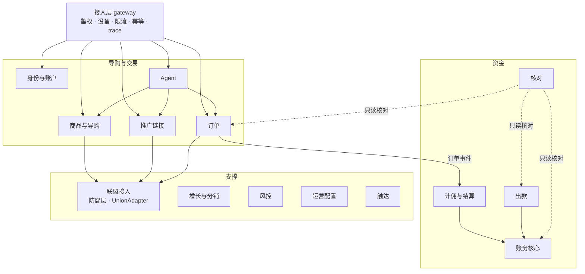
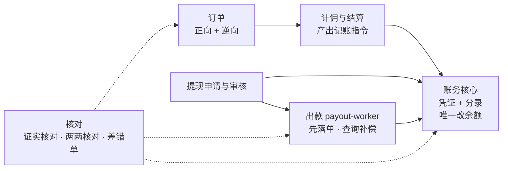
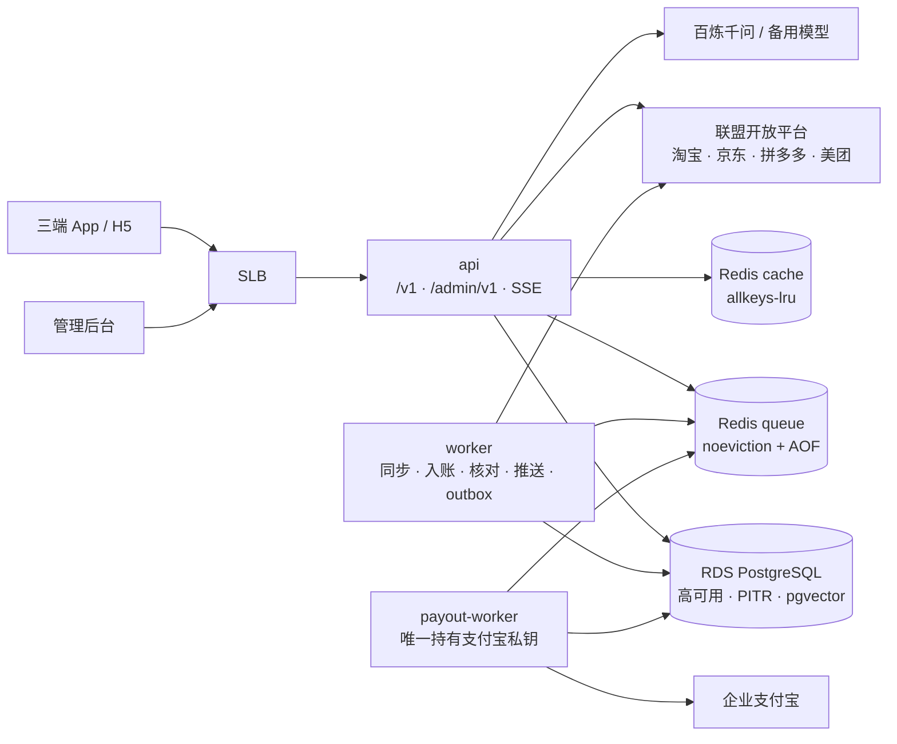
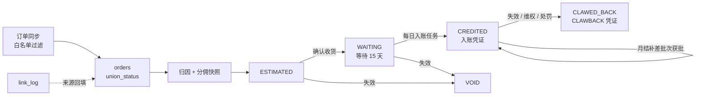

# PRD 修订：后端功能规划（v1）

> **状态：参考文档，不再维护（2026-09-30）。** 唯一生效的规划是 `规划/`（业务规则以 `规划/08_业务规则/` 为准）。本文中的编号、错误码、流水类型、决策编号可能与 `规划/` 不同，换算见 `规划/08_业务规则/13_命名与编码对照.md`；独有内容已按需并入 `规划/`，见 `规划/00_总览与决策.md` 文档登记。代理不得以本文为开发依据。

2026-09-29 · 输入：《返利 App PRD（三端原生 + H5 + Agent）》v0922（下称「PRD」）、`PRD评审_v2_2026-09-29.md`（下称「评审」，F-xx 为其问题编号）、`PRD修订_双品牌与Agent找货_2026-09-29.md`（下称「修订①」，D1/D2 为其决策编号）、花卷云参考资料（优券汇现网后台配置）

> **合并前状态（2026-09-29）**：本文与 `规划/` 目录（另一会话同日产出：00 决策、02 系统架构、04 数据模型与契约、07 功能对照清单）并行编写，内容大面积重叠。**合并完成前，决策以 `规划/00` 为准，模块划分和账务科目以 `规划/02` 为准，枚举、状态机、接口路径、错误码以 `规划/04` 为准。本文与它们冲突之处一律作废，代理不得以本文作为契约依据。**
>
> 本文独有、建议并入 `规划/02` 的内容：1.1 淘宝/阿里经验取舍与 1.12 来源、1.6 资损场景清单与资金配置变更流程、1.7 一致性与并发模式、1.8 数据库与编码规约、1.9 变更三板斧、第 2 章中补进的易漏规则、6.1 任务表、10.1 验收用例、13.2 易漏项落点。

## 0. 读法

### 0.1 本文的位置

- 本文替换 PRD「后端与 Agent 服务」一章，同时作为后端代理（交易线、资金线、Agent 线、平台线）的开工输入。
- **架构是新设计**（第 1 章），取法淘宝、阿里、蚂蚁公开的工程实践，不沿用花卷云的系统设计；花卷云只用作功能查漏清单，逐项对照结果见第 13 章。
- 事实源优先级：`contracts/` > `specs/` > `docs/adr/` > 本文 > 修订① > PRD。本文与 PRD 冲突时以本文为准；Agent 找货的产品规格只在修订①维护，本文只写它在后端的落点。
- 本文中的表名、字段、接口路径、错误码都是**契约草案**。第 0 周由契约守护转写进 `contracts/openapi.yaml`、`contracts/error-codes.ts`、`contracts/enums/*.json`、`specs/state-machines/*.yaml`、`prisma/schema.prisma` 后才生效。

### 0.2 与 PRD 的替换关系

| PRD 原文位置 | 处理 |
| --- | --- |
| 系统架构「后端（一份）」、后端与 Agent 服务「后端模块」表 | 由本文第 1、2 章替换 |
| 「统一订单模型」 | 由 2.5 和第 3、4 章替换 |
| 「结算与提现规则」（结算、账户、提现、台账、税） | 由 2.6–2.9 替换。「备付金」全文改为「垫付营运资金」（F-91） |
| 接口规范中的「核心接口」「幂等」「错误码」「内部事件」 | 由第 5、6 章替换。评审 F-33、F-56、F-83、F-85 各自给出的码值互相冲突，统一以 5.3 为准 |
| 管理后台「开发顺序」MVP 行中的后端部分 | 由 2.15 和第 9 章替换 |
| 技术栈中的「规则引擎 GoRules」 | MVP 不使用，金额计算用纯 TS 函数（F-100） |
| PRD 与修订①中沿用花卷云的平台整数编码（1 淘宝、3 京东、4 拼多多……） | 改为自有字符串编码（1.5） |
| 评审 F-68 核验建议的「MVP 单式流水」 | 改为简化复式：凭证 + 分录（2.8） |
| 「存量迁移」整章、花卷云推送接收 | 按 D1 删除：后端不建迁移表，不建花卷云 webhook，不调用花卷云接口为新 App 转链或拉单 |
| 引用但不存在的《后台模块规格》、cps-inventory.md | 删除。改由 `specs/union/<platform>.md`（W0–W1 根据官方文档和录制结果产出）和本文替代 |

### 0.3 阶段定义

| 标记 | 含义 | 时间点 |
| --- | --- | --- |
| **M1** | 白名单内测必须具备（≤500 人，iOS/Android，提现全部人工审核） | W5 末（11-08） |
| **M2** | 公开上架必须具备 | W8（11-23 至 11-29） |
| **P1** | 上线后 1–2 个月 | — |
| **P2** | 视业务 | — |

时间线采用评审 5.6 的「W5 内测、双11 后约 W8 公开」。如果最终坚持 5 周公开上线，M2 项必须前移，并按 9.3 的顺序砍项。

### 0.4 本文采用的默认决策

这些事项还没拍板。本文按下表默认值规划，拍板后只改本节和受影响的条目。

| # | 事项 | 本文默认 | 依据 | 拍板 / 截止 |
| --- | --- | --- | --- | --- |
| B1 | 上线口径 | W5 白名单内测，W8 公开上架 | 评审 5.6 | 负责人 / W0 |
| B2 | 新人红包、签到、邀请奖励 | 移出 MVP，随活动引擎放 P1；邀请码绑定（锁粉）保留在 M1 | 评审 F-37 核验 | 负责人 / W0 |
| B3 | 淘礼金商品池与发放 | 后端排在 M2，开关默认关，不进 M1 | 修订① §5-1 | 负责人 + 财务 / W0 |
| B4 | Agent 能否免登录使用 | 默认必须登录且已绑手机（`agent.guest_daily_quota = 0`）；可配置为游客每日 N 次、只出卡不转链 | 修订① §5-4 建议找货免登录；评审 F-44 指出深度合成规定第 9 条要求基于手机号等做真实身份认证。两者冲突，需法务定 | 法务 / W0 |
| B5 | 税务方案 | 方案 A：全部走企业支付宝，平台自建累计预扣；灵工 P1 | 评审 F-71 | 财务 / W1 |
| B6 | 分佣层级 | 直推比例可配（取值由业务定）；间推比例锁为 0（DB CHECK），取得法律意见后才解锁 | 评审 F-43 | 法务 / W1 |
| B7 | 自动到账 | M1、M2 全部人工审核；自动到账规则组放 P1，开关默认关 | 评审 5.6 | 财务 / W0 |
| B8 | 月结补差入账 | 系统计算差额，财务在后台批准后才入账 | 评审 F-72 | 财务 / W1 |
| B9 | 订单找回 | 系统自动计算佐证等级，M1 全部人工审核；强佐证自动通过作为 P1 开关 | 评审 5.6、F-26 | 负责人 / W0 |
| B10 | 预留比例与自购比例初始值 | 初始值的参考取值见私有材料（2026-10-03 从公开仓库移出）；自购比例按等级配置。最终取值由财务按单位经济模型（评审 F-51）确定 | 后台功能明细 05、06 | 财务 / W1 |

---

## 1. 架构设计

### 1.0 设计基线

- **这是一套新架构**：不沿用花卷云（优券汇所在 SaaS）的系统设计、表结构、编码方式和接口风格。花卷云只用作功能查漏清单（第 13 章）。
- **取法淘宝、阿里、蚂蚁公开的工程实践**，按「1 人调度 + AI 编码代理 + 万级 DAU」的规模只取最小可行版本。1.1 逐条写明学什么、怎么落地、不学什么。
- **规模前提**：单地域、单库（RDS PostgreSQL）、单仓库。在这个规模下，系统可靠与否主要取决于资金正确性和外部依赖治理，高并发不是主要矛盾。架构的重点因此放在账务、核对、状态机和联盟适配隔离上，而不是拆分和扩容。

### 1.1 淘宝 / 阿里 / 蚂蚁经验取舍

来源编号见 1.12。

| # | 实践 | 在阿里解决什么 | 本项目怎么落地 | 不学 | 来源 |
| --- | --- | --- | --- | --- | --- |
| 1 | 从单体到服务化 | 数百人并行开发、各系统独立扩容 | **模块化单体**：按限界上下文划清代码边界和数据所有权，但只部署一个应用；只为安全隔离拆出 payout-worker，为资源隔离拆出 worker | 微服务拆分、RPC 框架、注册中心、分布式事务 | 行业共识 |
| 2 | COLA 分层 | 业务逻辑和技术细节分离，依赖倒置 | 每个上下文内部分 api / app / domain / infra 四层；domain 是纯 TS；CI 用 dependency-cruiser 卡住依赖方向；列表和报表类查询直接走 Prisma，不套领域模型 | client 包、多模块脚手架、cola-statemachine 组件、给 CRUD 套整套 DDD | [1][2] |
| 3 | TMF「业务身份 + 扩展点」 | 多业务共用一个平台时隔离差异 | 业务身份 = 联盟平台。`UnionAdapter` 扩展点封装全部平台差异；新接一个联盟只加 Adapter、配置和 fixture，核心域零改动（1.5） | 人货场多维身份解析、可视化管理域、插件独立仓库 | [3] |
| 4 | 订单状态机、正逆向分离、快照 | 长流程、多状态下的一致流转 | 迁移表放 domain；落库用 compare-and-set；(platform, sub_order_no) upsert，并用联盟更新时间丢弃旧数据；逆向（退款、维权、处罚、价保）独立记录，不改已入账金额；转链时存商品快照，拉单时存原始报文 | 独立订单中心服务、分库分表、交易平台化 | [4] |
| 5 | 蚂蚁账务：余额由分录驱动、复式、日切、冻结 | 资金可追溯、可审计、并发安全 | 凭证（journal）+ 分录（entry）的简化复式；**一锁二判三更新四释放**；会计日按 +08:00；日切快照校验「期初 + 发生额 = 期末 = 余额」；可用 → 冻结 → 出账或解冻（2.8） | 单边账务 + 复式会计两套系统、四层账簿、热点账户缓冲记账（平台户不维护实时余额即可） | [5][6][15]；日切实践只有二手资料 |
| 6 | 资损防控与核对 | 资金差错在用户投诉前被发现并止血 | **核对作为独立上下文**。事前：资损场景清单、资金配置双人复核加试算；事中：证实核对（入账、打款后 5 分钟延迟核对），出款前余额校验；事后：每日两两核对，生成差错单；止血开关（1.6） | 核对平台化、规则 DSL、binlog 订阅、资损定级制度 | [7][8][9] |
| 7 | 事务消息与最终一致 | 业务状态与消息一致 | 单库 PG 用 outbox（发件箱）+ processed_events（收件去重）；外部写操作用「先落单、未知态只查询、查到结果再迁移」补偿 | RocketMQ 事务消息、Seata TCC/AT、CDC | [10][11] |
| 8 | 安全生产 1-5-10、变更三板斧 | 缩短恢复时间，控制变更风险 | 1 分钟发现、5 分钟定位、10 分钟恢复。代码、迁移、配置、开关、分佣规则、页面、prompt 和模型，所有变更都必须可灰度、可观测、可回滚；发布至少分 2 批，首批观察 ≥20 分钟；5 类故障写 runbook；每季度演练一次（1.9） | 变更管控平台、全链路压测平台、应用级 ChaosBlade | [12][13] |
| 9 | EagleEye 链路追踪 | 跨系统定位问题 | OpenTelemetry + W3C traceparent；traceId 贯穿日志、BullMQ 任务、outbox、外部调用和错误响应 | RpcId 层级编号、自研追踪系统、全量采样 | [14] |
| 10 | 《Java 开发手册（黄山版）》 | 统一工程规约 | 金额、唯一索引、逻辑删除、分页、日志、防重放、数据订正等条款改写成 TS/PG 版本（1.8） | 「禁止物理外键」：我们保留外键、禁止级联，这是有意偏离 | [15] |
| 11 | 客户端网关、配置中心、限流、埋点、大促保障 | 见评审第三章 | 按评审 3.2 的 8 件事落地（网关、紧急开关、SDUI 兜底、link_log、业务监控、同步参数化、熔断配额、防羊毛） | 见评审 3.3 | 评审第三章 |

### 1.2 总体结构



- **联盟接入是防腐层**：各联盟的字段、状态码、佣金口径、ID 规则都止步于 Adapter，进入核心域的只有统一模型。
- **资金是单向链路**：订单 → 计佣与结算（决定给谁、给多少、什么时候给）→ 账务核心（唯一能改余额的地方）→ 出款（只负责外部转账）。核对只读，横跨三段。
- **Agent 是普通调用方**：它和 App 一样调用商品、链接、订单的应用服务，没有任何特权通道。

### 1.3 限界上下文与数据所有权

每张表只有一个拥有者（唯一写者）。其他上下文要读，走拥有者 app 层的 facade（查询接口）；要写，只能调用拥有者的命令。报表和核对通过只读角色直接查询只读实例。「线」是建议的代理分工：评审 5.4 把后端拆成交易、资金、Agent 三条线，本文另加一条平台线。

| 上下文 | 模块 | 拥有的表 | 线 | 阶段 |
| --- | --- | --- | --- | --- |
| 接入层 | gateway | idempotency_keys | 平台 | M1 |
| 身份与账户 | auth、users、devices、consents、realname、payout-accounts、account-deletion | users、user_identities、devices、refresh_tokens、login_logs、consent_records、realname_profiles、payout_accounts、account_deletions | 交易 | M1（注销 M2） |
| 联盟接入 | unions/{core,taobao,jd,pdd,meituan} | union_accounts、union_credentials、promotion_positions、union_bindings、auth_sessions | 交易 | M1（美团 W7） |
| 商品与导购 | products、pools、feeds | product_refs、pools、pool_items | 交易 | M1（feeds M2） |
| 推广链接 | inputs、links | link_logs | 交易 | M1 |
| 订单 | order-sync、orders、claims、rights | orders、orders_raw、order_status_history（union 部分）、order_sync_*、order_rights、order_claims | 交易 | M1 |
| 计佣与结算 | settlement（算法在 `packages/domain`） | commission_splits、订单的 rebate_* 字段、settle_adjust_* | 资金 | M1 |
| 账务核心 | ledger | ledger_accounts、ledger_journals、ledger_entries、daily_balances | 资金 | M1 |
| 出款 | withdrawals、payout（payout-worker 进程） | withdrawals、payout_attempts、tax_ytd、fee_rules | 资金 | M1 |
| 核对 | reconciliation、fund-ledger | recon_runs、recon_diffs、error_tickets、liability_snapshots、fund_ledger | 资金 | M1（R1 在 W4） |
| 增长与分销 | distribution | relation_change_logs、levels、commission_rules | 资金 | M1（界面 P1） |
| Agent | agent/{orchestrator,tools,stream,guardrails,trace,budget,model-gateway} | agent_* | Agent | M1（白名单） |
| 风控 | risk | blacklist、risk_hits | 平台 | M1 |
| 运营配置 | config、switches、pages、dict、app-versions、agreements | configs、pages、page_versions、components、dicts、app_versions、agreements | 平台 | M1 |
| 触达 | messages、push、sms | message_templates、messages、push_tokens、sms_logs | 平台 | M1 |
| 后台与基础 | admin、outbox、events、storage、crypto、clock | admin_*、outbox_events、processed_events、events | 平台 | M1 |

**依赖规则**（CI 用 dependency-cruiser 检查，违反即失败）：

- 只有账务核心能改余额；计佣与结算、出款都通过账务核心的命令记账。
- agent 只能调用商品、链接、输入识别、订单（只读）、找回（只生成草稿）和规则库的 facade；禁止依赖账务、出款、收款账号、分销的写命令。
- 跨上下文通知一律走 outbox 事件（第 6 章），不直接调用触达、风控。
- 金额只能由 `packages/domain` 计算；禁止在 SQL、客户端、H5 或 Agent 中计算金额。

### 1.4 上下文内部分层（COLA 落到 NestJS）

```text
apps/api/src/<context>/
  api/      controller、admin controller、BullMQ processor、cron：只做协议转换、鉴权声明、参数校验
  app/      用例（command / query handler）：事务边界、权限、编排；facade.ts 是本上下文唯一的对外入口
  domain/   纯 TS：实体、值对象、状态机迁移表、领域服务、port 接口；不 import Nest、Prisma、axios
  infra/    Prisma 仓储、外部 Client（联盟、支付宝、千问、短信）、Redis、outbox 实现
packages/domain/     跨上下文共享的纯函数：金额计算、口径、舍入
packages/contracts/  由 contracts/ 生成的类型、枚举、错误码、路由结构
```

- 依赖方向：api → app → domain；infra 实现 domain 定义的 port。domain 不依赖任何框架，也不依赖其他上下文。
- 跨上下文只允许 import 对方的 `app/facade.ts`，禁止 import 对方的 domain 或 infra。
- 查询（列表、报表、后台检索）可以在 app 层直接做 Prisma 只读查询，不硬套领域模型。
- 资金相关上下文（计佣与结算、账务核心、出款）的 domain 行覆盖率 ≥90%。

这套分层对 AI 代理特别有用：规则由机器检查，而不是靠提示词约束；每个代理会话只在自己负责的上下文目录下工作，跨目录改动在 PR 里一眼可见。

### 1.5 联盟扩展点（UnionAdapter）

```ts
// apps/api/src/unions/core/domain/union-adapter.ts（业务身份 = platform）
export interface UnionAdapter {
  platform: Platform;                                          // 'taobao' | 'jd' | 'pdd' | 'meituan'
  capabilities: UnionCapabilities;                             // search / parse / convert / orderSync / rights / binding / tlj
  search(q: SearchQuery): Promise<ProductCandidate[]>;
  resolveInput(raw: string): Promise<ResolvedItem | null>;     // 链接、口令 → 商品
  quote(item: ItemRef, ctx: QuoteCtx): Promise<UnionQuote>;    // 价格、券、N（已按平台系数换算）
  convert(cmd: ConvertCmd): Promise<ConvertResult>;            // 注入归因参数，返回 primary / fallbacks
  bindingFlow?: BindingFlow;                                   // 备案与授权（淘宝、拼多多）
  pullOrders(win: SyncWindow): AsyncIterable<RawOrder>;
  mapOrder(raw: RawOrder): UnifiedOrderDraft;                  // 状态映射、四段金额、归因键、更新时间
  pullRights?(win: SyncWindow): AsyncIterable<RawRights>;      // 维权、处罚
  creditableAt(o: UnifiedOrder): Date | null;                  // 可入账事件时间
}
```

- Adapter 注册成 `Map<Platform, UnionAdapter>`。订单、计佣、账务只认统一模型；lint 规则禁止在 Adapter 以外出现 `platform === 'xx'` 这类分支。
- 平台差异（佣金系数、自购与分享口径、京东佣金归零规则、拼多多 search_id、跳转矩阵）只允许写在 Adapter 内部和 `specs/union/<platform>.md` 中。
- 每个 Adapter 配一套录制 fixture 的契约测试。新增平台 = 新 Adapter + 配置 + fixture + 平台字典一行。
- 能力标记驱动上层：capabilities 里没有 search 的平台（如美团）不进 Agent 检索，不出现在搜索 Tab。

**平台字典**（自有编码，不沿用花卷云的整数编码）：用字符串编码 `taobao`、`tmall`（仅作 sub_platform）、`jd`、`pdd`、`meituan`、`eleme`、`vip`、`douyin`、`suning`。字段为 code、name、capabilities、phase、enabled。修订①里的 `platforms: [1, 3, 4]` 改为 `["taobao", "jd", "pdd"]`，JSBridge 的 `authorize(1)` 改为 `authorize("taobao")`。字符串编码对模型和代理都更不容易出错。

### 1.6 资金架构与资损防控



- **计佣与结算**：决定给谁、给多少、何时给，只产出记账指令（业务类型、业务单号、账户、金额），不碰余额。
- **账务核心**：唯一能改余额的地方；按分录模板记账（2.8）；每张凭证只动一个用户的账户，天然避免多账户加锁顺序导致的死锁。
- **出款**：只负责外部转账和查询，结果回写账务核心。

**资损场景清单**（第 0 周与财务过一遍；每条对应测试 ID 和核对规则）：

| 资损场景 | 事前防 | 事中 / 事后发现 |
| --- | --- | --- |
| 同一订单重复入账 | 凭证 idem_key 唯一约束 | 核对：每个 (子订单, 受益人, 角色) 的入账凭证 ≤1 张 |
| 重复打款 | out_biz_no 创建时固定；transfer 不自动重试；只查询不重发 | 证实核对（打款后 5 分钟）；R2 每日对支付宝账单 |
| 分佣或预留比例配错（例如 5000 写成 50000） | 取值上下限 CHECK；双人复核；发布前用近 7 天订单试算，差异报告附在审批单上；只对 effective_from 之后付款的订单生效 | 核对：Σ受益人份额 ≤ N |
| 扣回漏记 | 维权、处罚独立任务 + 回扫 | 核对：联盟已失效订单 vs 已扣回凭证 |
| 订单记到别人名下 | relation_id 唯一绑定；身份参数只由服务端注入；转链结果不跨用户缓存 | 核对：订单上的归因键 vs 付款时点的有效绑定 |
| 并发超额提现 | 一锁二判三更新；冻结户 CHECK ≥0 | 日终「余额 = 分录合计」 |
| 借他人账户收款 | 收款人姓名 = 实名；一证一户 | 支付宝姓名校验失败率监控 |
| 舍入导致合计偏差 | 纯函数 + 属性测试；尾差归平台 | 核对：分佣合计 vs N |
| 活动或淘礼金超发 | 预算原子扣减；每人唯一约束 | 核对：发放数 ≤ 预算 |
| 负余额追不回 | 负余额禁止提现；后续入账先抵扣 | 负余额报表；坏账流程（P1） |
| 联盟少结 | — | R1 联盟对账，差异进差错单并申诉 |
| 测试环境误打款 | 只有 prod 持有打款私钥 | 打款来源环境监控 |
| 后台人为调账出错 | 发起与复核两人；二次验证；审计 | 调账日报 |
| 数据订正引发二次资损 | 订正写成脚本，先 select 预览，评审后在 staging dry-run，由人执行 | 订正后立即跑相关核对 |

**资金配置**：分佣比例、预留比例、费率、提现限额都属于「一改错就资损」的配置，统一走：取值校验 → 发起人与复核人不同 → 试算报告 → effective_from 生效 → 可回滚。

### 1.7 一致性与并发

| 场景 | 做法 |
| --- | --- |
| 本地多表写 | 同一个 PG 事务 |
| 状态迁移 | `UPDATE … SET status = :to, row_version = row_version + 1 WHERE id = :id AND status = :from`；影响 0 行视为并发冲突或非法迁移，重新读取后按迁移表判断，并记日志 |
| 资金记账 | 一锁二判三更新四释放：`SELECT … FOR UPDATE` 锁用户账户行 → 判断幂等键和余额 → 写凭证、分录并更新余额 → 提交释放 |
| 领域事件 | outbox 同事务写入 → relay → BullMQ（jobId = event_id）→ 消费方用 processed_events 去重 |
| 外部写操作（支付宝转账、淘礼金创建） | 先落单（状态为处理中，外部单号固定）→ 调用 → 结果未知时只查询、不重发 → 查到确定结果后迁移状态 |
| 外部读（联盟订单） | 幂等 upsert；联盟更新时间单调，旧数据丢弃；水位持久化；定期回扫补漏 |
| 同一订单的并发处理 | 按 (platform, sub_order_no) 串行：`pg_advisory_xact_lock(hash)` |
| 幂等 API | idempotency_keys 表 + 业务唯一约束兜底 |

### 1.8 数据库与编码规约（取自《Java 开发手册（黄山版）》，改写为 TS/PG）

- 每张表必备 id、created_at、updated_at（timestamptz）。
- 金额用 bigint，单位分；比例用 int，单位万分之一。JSON 里的 ID 一律用字符串（超过 2^53 的整数必须用字符串）。
- 业务上唯一的字段必须建唯一索引，这是幂等的最后防线。
- 业务表逻辑删除（deleted_at），唯一索引写成 `WHERE deleted_at IS NULL` 的部分索引；分录、审计、outbox 只增不删。
- 保留外键但禁止级联删除和级联更新（有意偏离手册：单库规模下外键能拦住代理写出的脏数据）。
- 单条查询 join 不超过 3 张表；列表一律用游标（keyset）分页；禁止用存储过程或触发器写业务逻辑，只允许「禁止 UPDATE / DELETE」这类防护触发器。
- 数据订正必须写成脚本：先 select 预览，评审，在 staging dry-run，再由人执行。代理不连生产库写数据。
- 日志用结构化 JSON 和占位符；异常要带上下文和堆栈；禁止直接序列化整个对象（用 pino serializer + redact 脱敏）。应用日志保留 ≥15 天，敏感操作日志保留 ≥6 个月。
- 资金、验证码、提现、转链这类接口必须防重放。

### 1.9 稳定性与变更管理

目标（1-5-10）：1 分钟发现（2.16 业务告警）、5 分钟定位（trace + 结构化日志 + bull-board）、10 分钟恢复（开关、回滚、降级）。

| 变更对象 | 可灰度 | 可观测 | 可回滚 |
| --- | --- | --- | --- |
| 后端代码 | 至少 2 批发布，首批观察 ≥20 分钟；新逻辑挂开关，按 userId 哈希灰度 | 发布看板：错误率、P95、业务指标 | 保留上一版镜像，一键回滚 |
| 数据库迁移 | expand → 回填 → contract，分两次发布 | 迁移耗时、锁等待 | expand 阶段直接回滚代码即可 |
| 配置与开关 | 按用户比例 | 每次改动推群告警 | 版本化，一键回滚 |
| 分佣、费率、限额规则 | effective_from + 试算 | 试算差异报告 | 发布新版本覆盖 |
| SDUI 页面 | 1% → 10% → 100% | sdui_card_error | 回滚到上一版本 |
| prompt 与模型 | 白名单 → 按比例放量 | eval 报告、点踩率、成本 | 切回上一版本 |

- **Runbook**（W4 前写好）：联盟接口大面积失败、Redis 不可用、RDS 主备切换、打款异常（重复、结果未知、余额不足）、Agent 被滥用或输出异常。
- **演练**：上线前一次、之后每季度一次，在 staging 做停 Redis、RDS 主备切换、暂停打款、关闭某平台转链。

### 1.10 进程与部署



| 组件 | 职责 | 部署 | 阶段 |
| --- | --- | --- | --- |
| api | App `/v1`、后台 `/admin/v1`、Agent SSE；不直接调用支付宝 | M1 可单台；M2 前扩到 2 台跨可用区 + SLB。SLB 空闲超时 ≥60 秒，SSE 响应关闭缓冲 | M1 |
| worker | BullMQ 消费：订单同步、归因回填、入账、核对、消息、outbox relay、定时任务 | 1 台，按队列分别设并发 | M1 |
| payout-worker | 只消费 payout 队列；独立 RAM 角色，只有它能读支付宝私钥；进程内再校验单笔、单日上限和资金水位 | 独立容器 | M1 |
| RDS PostgreSQL | 高可用版，PITR 保留 7 天，每日快照保留 30 天；报表、导出、核对走只读实例 | 托管 | M1（只读实例 M2） |
| Redis ×2 | cache：allkeys-lru；queue：noeviction + appendonly + everysec，两者分开 | 托管 | M1 |
| OSS + CDN | 海报、商品图代理、导出文件；使用已备案的自有域名 + HTTPS | 托管 | M1 |

环境：local（Compose + WireMock + Prism + MinIO）、test（联盟录制回放 + 支付宝沙箱）、staging（生产联盟只读 key，禁止打款）、prod。只有 prod 持有打款私钥；各环境的库、密钥、OSS bucket 完全隔离（F-97）。

### 1.11 硬规则摘要（写入 `apps/api/AGENTS.md`）

1. **确定性交给代码，模糊交给模型**：链接识别、ID 提取、转链、归因、金额计算全部由代码完成；模型只负责意图、条件抽取和措辞。
2. **每个状态字段只有一个写者**：订单平台状态只由同步器写；返利状态只由结算引擎写；提现状态只由出款上下文写。一律通过生成的 `transition()` 做 compare-and-set。
3. **余额只由分录驱动**：分录只插入；每张凭证借贷平衡、带唯一幂等键；余额更新与分录写入在同一事务内完成。
4. **身份由服务端注入**：user_id、app_id、relation_id、推广位只取自 Token 和服务端数据，不取自请求体或模型输出。
5. **平台差异止步于 Adapter**：核心域不写平台分支。
6. **外部依赖都有超时、熔断、配额和降级**；在线请求优先于离线任务。
7. **配置即数据**：开关、规则、阈值、页面都带版本，可发布、可回滚，改动留审计；资金配置走 1.6 的流程。
8. **至少一次投递 + 幂等消费**：队列和事件都按至少一次投递设计，消费方靠唯一约束去重。
9. **契约先行**：先改 `contracts/`，再改实现；v1 内只做增量变更（F-63）。

### 1.12 来源（均于 2026-09-29 访问）

| # | 来源 | 可信度 |
| --- | --- | --- |
| 1 | COLA：https://github.com/alibaba/COLA | 官方仓库 |
| 2 | COLA 4.0：https://developer.aliyun.com/article/787460 | 阿里团队文章 |
| 3 | TMF2.0：https://developer.aliyun.com/article/511876 | 阿里团队文章 |
| 4 | 高德订单状态机：https://developer.aliyun.com/article/783803 | 阿里团队文章 |
| 5 | 会计核心（作者自述前支付宝）：https://www.woshipm.com/pd/1586244.html | 二手 |
| 6 | 蚂蚁记账引擎：https://developer.aliyun.com/article/807681 | 阿里云社区新闻稿 |
| 7 | 闲鱼实时资损发现：https://developer.aliyun.com/article/792364 | 阿里团队文章 |
| 8 | 有赞资损防控：https://tech.youzan.com/zsfk/ | 有赞官方（非阿里） |
| 9 | 蚂蚁资金核对演进：https://blog.csdn.net/weixin_38002497/article/details/106571157 | 二手转载，待核实 |
| 10 | RocketMQ 事务消息：https://rocketmq.apache.org/zh/docs/featureBehavior/04transactionmessage/ | 官方 |
| 11 | Transactional Outbox：https://microservices.io/patterns/data/transactional-outbox.html | 业界通行资料 |
| 12 | 1-5-10：https://www.cnblogs.com/alisystemsoftware/p/16941579.html | 阿里云云原生官方账号 |
| 13 | 卓越架构·可灰度：https://help.aliyun.com/zh/document_detail/2573865.html | 官方 |
| 14 | ARMS 链路追踪协议：https://help.aliyun.com/zh/arms/application-monitoring/developer-reference/supported-tracing-protocols | 官方 |
| 15 | 《Java 开发手册（黄山版）》1.7.1：https://github.com/alibaba/p3c | 官方，条款已核对原文（「一锁二判三更新四释放」见并发处理第 13 条） |

---

## 2. 各域功能规划

### 2.1 账户与身份

| 功能 | 规则要点 | 阶段 |
| --- | --- | --- |
| 设备注册 | 用户同意隐私政策后调用 `POST /v1/devices`，上报 IDFV / OAID / ODID 的哈希；服务端签发 device_id 和 install_secret（端上存 Keychain / Keystore / HUKS）。X-Device-Id 只接受服务端签发的值，否则返回 10402（F-59、F-90） | M1 |
| 手机号登录 | 发送验证码前做人机验证（阿里云）；同一手机号 60 秒 1 条、每天 10 条；同一 IP 1 小时内注册 ≥5 个时触发验证码并限流 | M1 |
| 微信登录 | 以 unionid 作为身份；不强制绑手机，但 Agent、邀请绑定、提现前要求绑手机（见下方身份矩阵） | M1 |
| Sign in with Apple | 登录时加密保存 Apple refresh_token，注销时调用 revoke（F-42） | M1 |
| 华为账号登录 | Account Kit，随鸿蒙里程碑交付 | M2 |
| Token | access_token 2 小时，JWT claim 含 app_id、user_id、device_id、identity_level；refresh_token 30 天，每次刷新都轮换，旧 token 被再次使用时吊销整条 token 链 | M1 |
| 二次验证 | 短信校验通过后签发 step_up_token（5 分钟，绑定设备）；用于提现、改收款账号、换手机号、注销，以及后台敏感操作 | M1 |
| H5 Token | `POST /v1/auth/h5-token` 签发 aud=h5、15 分钟有效的 token，作用域不含提现、收款账号、实名、注销、换手机号（F-05） | M1 |
| 同意记录 | consent_records 只增不改，类型：privacy、user_agreement、agent_ai（第三方 AI 单独同意）、id_verification、personalization。协议改版后 `/v1/me` 返回 need_reconsent | M1 |
| 实名 | 首次提现时采集并单独取得同意；姓名 + 身份证二要素核验（阿里云）；身份证号用 AES-GCM 加密，另存 HMAC 盲索引；按身份证推算年龄：未满 14 周岁不予实名，14–18 周岁的限制由法务确定（F-45） | M1 |
| 收款账号 | 只支持支付宝；收款人姓名必须等于实名姓名；1 个身份证最多对应 1 个可提现会员；1 个支付宝账号只能绑 1 个实名；每月最多改 2 次；修改需二次验证 | M1 |
| 邀请绑定 | 见 2.10 | M1 |
| 账号注销 | 申请（需二次验证）→ 冷静期 7 天（可撤回）→ 处理中 → 已注销，全程 ≤15 个工作日。删除或匿名化 PII，联盟绑定置 blocked 且不释放，直属下级的 parent 置空，调用 SIWA revoke；交易与涉税记录去标识后按法定期限保留；手机号 HMAC 和设备哈希保留 180 天，用于防止重复领取新人奖励。禁止把注销做成「只禁用、不删除、不解绑」（F-42） | M2 |
| 封禁 | 后台封禁后吊销全部 Token，联盟绑定置 blocked，提现冻结 | M1 |
| 注册来源与登录记录 | users 记录 register_method（短信 / 微信 / Apple / 华为 / 邀请落地页 / 后台添加）和 register_channel（渠道包、落地页渠道码）；login_logs 记录时间、IP、设备、方式，用于风控和客服排查 | M1 |
| 资料管控 | 昵称过敏感词；可按开关禁止改昵称头像、禁止换绑手机；接口和 H5 默认不下发完整手机号 | M2 |
| 运营商一键登录 | 号码认证 SDK | P1 |

**身份矩阵**：服务端用 `@RequireIdentity(level)` 守卫实现，客户端按 `/v1/me.identity_level` 预判（F-44）。

| 能力 | 游客 | 已登录 | 已绑手机 | 已实名 |
| --- | --- | --- | --- | --- |
| 首页、搜索、商品详情、输入识别 | ✔ | ✔ | ✔ | ✔ |
| 转链、查订单、找回 | 10001 | ✔ | ✔ | ✔ |
| Agent 对话 | 按 B4（默认 10001） | 10005 | ✔ | ✔ |
| 绑定上级、邀请 | 10001 | 10005 | ✔ | ✔ |
| 提现、改收款账号 | 10001 | 10005 | 10006 | ✔ |

### 2.2 联盟接入层

**Client 与接口模式**

- 每个平台封装一个 Client，统一处理超时、重试、熔断、配额和录制回放（第 7 章）。
- 每个联盟接口在 `config/union-endpoints.yaml` 里标注 `mode = real / replay / mock`。代理不得为 mode 不是 real 的接口臆造响应结构（F-29）。
- **双品牌硬规则**：禁止调用花卷云 `dhcc.oauth.link.*`、`dhcc.oauth.order.*` 为新 App 转链或拉单，因为花卷云转链会把订单归到优券汇（D1）。评审 F-29 中「经花卷云降级」一条因此作废；权限未批下来之前只用录制回放开发。

**推广位白名单**（D1）

- promotion_positions 表，(platform, position_id) 唯一，scene ∈ self_buy / share / agent / tlj / fallback。
- 淘宝至少 4 个 adzone：自购、分享、Agent、淘礼金（淘礼金推广位不得与优券汇共用）。京东 positionId、拼多多 pid、美团推广位按同样的场景划分。
- 改白名单需要 super 角色并二次验证。
- P1 增加两类场景推广位：compare（比价专用渠道，触发比价后按非比价佣金展示）、activity（活动专用，隔离活动订单）。各类推广位之间不得重复。

**联盟账号**：union_accounts 记录平台、账号、是否默认、启停、订单同步开关、**同步开始时间**（付款早于该时间的订单不入库，避免把接入前的历史单拉进来）。平台总开关关闭后，搜索、输入识别、Agent 都不再出现该平台。

**平台佣金口径差异**（写进各平台 UnionAdapter，见 1.5）：

- 拼多多：可分佣金额受账号等级系数（V0 ×80%、V1 ×90% 等）和账号比例影响；自购与分享的佣金口径不同；转链带 search_id 会影响收益，必须透传。
- 淘宝：补贴类佣金（如佣金膨胀）只有分享场景拿得到，自购卡片按自购口径估返利。
- 京东：实际佣金变成 0 的订单即判失效，之后即使恢复也不再算有效；保价导致佣金减少时，按比例扣回已入账部分。
- 这些系数和规则放 `specs/union/<platform>.md` 与配置中心，由 Adapter 统一换算成 N（联盟口径可得佣金），计佣层不感知平台差异。

**联盟凭据**（F-85）

- union_credentials 保存各联盟的 access_token、refresh_token 和到期时间，全部加密存储。
- 每日巡检：距到期 ≤14 天、3 天、1 天时分级告警；支持刷新的平台提前 7 天自动刷新。
- 凭据过期时，该平台转链返回 50301，同步任务暂停并记录断点，恢复后从断点补拉。

**备案绑定**（F-33、修订① 1.2）

| 平台 | 流程 | 用户归属键 |
| --- | --- | --- |
| 淘宝 | 服务端生成 OAuth URL，state 绑定待继续的 link_id（10 分钟）→ 用户授权 → 服务端回调用 code 换 session → 调 `taobao.tbk.sc.publisher.info.save`（inviter_code 为新 App 渠道邀请码）→ 得到 relation_id | relation_id（special_id 放 P1） |
| 拼多多 | `pdd.ddk.rp.prom.url.generate`（channel_type=10）生成授权链接 → 用户授权 → `pdd.ddk.member.authority.query` 确认 | custom_parameters：`{"app":"n","uid":"<user_id>"}`；长度允许时加 `sid` 放 link 短码（64 字节上限待核实） |
| 京东 | 无需用户授权 | subUnionId = `n_{user_id}`（长度与字符集第 0 周核实） |
| 美团 | 无需用户授权 | sid 内含 user_id |

接口名以各开放平台当前文档为准。

- 唯一约束：(app_id, union_account_id, platform, binding_key) WHERE status = active。新备案返回的 relation_id 已被本 App 其他会员 active 占用时，返回 30003，不覆盖原绑定，并写冲突日志。
- 换绑每 90 天最多 1 次；换绑前付款的订单仍归原会员（按付款时点的有效绑定判定）。
- 状态机见 3.5。

**备案巡检**（F-83）：每天找出近 7 天转链 ≥5 次但订单为 0 的用户，调 `sc.publisher.info.get` 复核备案。同一用户的链接连续 3 笔订单都不带 relation_id 时，把绑定标为 invalid，下次转链强制重新备案（30002）。

**权限与应用清单**：第 0 周第 1 天提交，每项写明负责人和降级路径，沿用评审 F-29 的表，并补上修订①要求的物料搜索、口令解析、万能转链、淘礼金创建四项权限。

### 2.3 商品与搜索

| 功能 | 规则要点 | 阶段 |
| --- | --- | --- |
| 搜索 | `GET /v1/products/search`：platform（默认淘宝，Tab 切换，一次搜一个平台）、keyword、sort（relevance / final_price_asc / sales_desc / rebate_desc）、has_coupon、价格区间、cursor。实时查联盟接口；服务端过滤无佣金、券失效、禁售类目、低于最低佣金比例的商品；结果缓存 5 分钟，缓存键不含用户信息（F-88） | M1 |
| 多平台并发检索 | 供 Agent `search_products` 使用：多平台并发，单个平台失败不影响其他平台，合并后去重 | M1（W2） |
| 商品详情 | `GET /v1/products/{product_key}`：标题、图片、店铺、价格、券、按当前用户等级计算的预估返利区间。价格和券以转链或打开时的实时查询为准 | M1 |
| product_key | 内部稳定键。路由、缓存、商品池、link_log、卡片、订单关联一律用它；调用联盟时用最近一次拿到的 raw_item_id（缓存 30 分钟，过期后按链接或标题重新检索）。规则：淘宝 = `tb:` + 原串后半段；京东 = `jd:` + itemId 的 B 段（有 skuId 权限时用 skuId）；拼多多 = `pdd:` + goods_sign（稳定性待核实）（F-31） | M1 |
| 返利报价口径 | 所有展示的返利都由 `packages/domain.quoteRebate()` 计算，与入账使用同一套拆分函数。按场景取口径：商品卡、详情、Agent 用自购口径，分享页用分享口径；游客按注册默认等级展示。有比价风险的订单按佣金率下限展示，并注明「以结算为准」（F-24）；文案禁用「最高」「最低价」 | M1 |
| 搜索敏感词 | 搜索输入和结果标题都过敏感词表（与昵称、邀请码、Agent 共用一套词库，分场景启用） | M1 |
| 比价预判定 | 淘宝转链前调用联盟比价预判定接口（有权限时），结果写入 link_log.compare_risk；没有权限时一律按区间展示 | M2 |
| 商品池 | 池、池内商品（排序、上下架、有效期）。来源：联盟接口入库、链接或口令解析入库。每小时刷新价格和券（占联盟配额 10%），券失效或无佣金时自动下架 | M1 |
| 标签、榜单、Excel 导入 | — | P1 |
| 首页物料流 | `GET /v1/feeds/{key}`：接联盟官方物料（淘宝物料精选、京粉精选、拼多多推荐），服务端过滤；个性化推荐需用户同意，并可关闭 | M2 |
| 搜索过滤配置 | 默认只看有券、最低佣金比例、口令搜索模式等过滤项放配置中心 | M1 |
| 自建索引（Meilisearch） | — | P2 |

### 2.4 输入识别与转链

**输入识别 inputs**

- 剪贴板、搜索框粘贴、Agent 共用同一个服务。PRD 的 `/v1/clipboard/parse` 改为 `POST /v1/inputs/parse`。
- 识别规则、宽松抽取后交联盟接口验证、分享文案视为不可信、单条最多处理 3 个链接、素材黑话词典：按修订① 3.2 和 3.6.1 执行。
- 服务端不保存剪贴板原文，只保存命中片段的 hash 和解析结果（F-27）。
- 返回：platform、product_key、title、image、quote（价格、券、到手价、返利区间）、compare_risk、tlj_class（A/B/C，见修订① 3.6.1；判定逻辑完成前一律按 C）。

**转链 links**

| 功能 | 规则要点 | 阶段 |
| --- | --- | --- |
| `POST /v1/links/convert` | 请求：product_key 或 url、scene（必填：self_buy / share / agent / clipboard / search / detail / home_card / h5_activity）、spm、client、installed。服务端注入 user_id、按 scene 选定的白名单推广位，以及 relation_id / subUnionId / custom_parameters / sid。响应：link_id、type、primary、fallbacks[]、expire_at、quote（F-32） | M1 |
| link_id 与 open | Agent 卡片和分享卡片只带 link_id。点击时调 `POST /v1/links/{link_id}/open`：优先取已缓存的转链结果（≤15 分钟，按 user_id 隔离，禁止跨用户复用），过期就实时重转，并复核价格和券；价差超过 5% 或 1 元时返回 price_changed（修订① 3.5） | M1 |
| 未备案 | 返回 30001（淘宝）或 30011（拼多多），附 auth_url 和 state。授权成功后客户端带 state 再调 open，服务端校验 state 对应的 link_id 是否属于本人 | M1 |
| 跳转矩阵 | 淘宝：百川 openByUrl(s.click) → taobao:// → H5；京东：openApp.jdMobile → 通用链接 → u.jd.com；拼多多：schema_url → mobile_url；美团：scheme → H5。矩阵放 `specs/platform-matrix.csv`，客户端只按 primary、fallbacks 的顺序执行（F-32、F-84） | M1 |
| 点击级透传 | 京东 subUnionId、拼多多 custom_parameters.sid、美团 sid 在长度允许时带上 link 短码，订单回来后可以精确回填来源。淘宝没有点击级参数，靠 15 天窗口近似回填（F-49） | M1 |
| link_log | 每次转链写一条（字段见第 4 章），按月分区，保留 180 天。它是找回佐证、来源归因、跟单率统计和 Agent 成交归因的共同数据源 | M1 |
| 跳转回报 | 客户端经 `/v1/events` 上报 link_jump：每一步的成功或失败，以及目标 App 是否已安装 | M1 |
| 淘口令 | 分享和「未安装淘宝」降级时生成（tpwd.create 只接受 s.click / uland 链接） | M1 |
| 无返利态 | 查券结果分三态：有券有返、无券有返、无返利。转链失败或无佣金时，绝不把用户给的原链接当作返利链接返回；所有带佣金的跳转都必须经过转链（直接唤起平台首页或指定页不带跟单） | M1 |
| 渠道 ID 黑名单 | 转链时用户的渠道 ID 命中黑名单则拒绝转链（30004） | M1 |
| 文案整体转链 | 推广者粘贴一整段多平台文案，识别全部链接和口令，逐个转链后整体替换，输出形态与原文一致（口令对口令、链接对链接） | P1 |
| 分享物料 | `POST /v1/shares`：服务端生成海报（主图、券后价、指向分享中间页的二维码）和文案模板，scene=share。分享中间页域名池 ≥2 个，每 10 分钟检测一次，失败自动切换（F-89） | M2 |

### 2.5 订单同步与归因

**同步基线**：参数全部放配置中心，第 1 周末用录制结果校准（F-25）。

| 平台 | 增量任务 | 窗口 | 回扫 | 维权与处罚 |
| --- | --- | --- | --- | --- |
| 淘宝 | 每 2 分钟按更新时间拉取；order_scene 1、2 分别拉（会员运营 3 放 P1）；每页 ≤100 条 | 接口上限 3 小时，默认 20 分钟；大促模式强制 ≤20 分钟 | 每小时回扫近 3 小时；每天回扫近 30 天；每周回扫近 90 天 | relation.refund 每 30 分钟；punish.order.get 每天，回扫近 60 天 |
| 京东 | 每 2 分钟 order.row.query，按更新时间 | ≤1 小时 | 每天（范围待核实） | 售后状态随订单行返回 |
| 拼多多 | 每 2 分钟 order.list.increment.get，从最后一页倒序翻 | 默认 30 分钟（上限 24 小时） | 每天回扫近 90 天 | 随订单状态返回 |
| 美团 | 每 5 分钟（W7 接入） | 按接口上限 | 每天 | 按接口 |

- 水位按 (platform, union_account, task, order_scene) 持久化在 PG；失败的窗口进死信表并告警；水位落后超过 30 分钟告警。
- 每个联盟账号一个令牌桶；遇到限流错误按指数退避。
- **防旧覆盖**：upsert 时比较联盟返回的订单更新时间（modified_time 一类字段），比库里旧的数据直接丢弃，避免回扫或乱序窗口把新状态覆盖回旧状态。
- 从付款到入库 P95 ≤5 分钟，超过 15 分钟告警。
- **大促模式**：开关 `order_sync.promo_mode`，2026-10-15 至 11-13（双11 预售开始到现货结束）默认打开。

**入库流水线**：对每条子订单依次执行，按 (platform, sub_order_no) 幂等 upsert。

1. **App 过滤（D1）**：推广位不在本 App 白名单内的订单不入库，只累加 order_sync_drops(platform, date, reason) 计数。
2. **保存原始报文**：写 orders_raw（按月分区，保留 180 天），用于审计和回放。
3. **平台状态映射**：按 `specs/platform-status-map.yaml` 写 union_status。映射表由录制 fixture 生成，必须覆盖预售、部分退款、价保。遇到未知状态码时进待处理表并告警，不得丢弃（F-28）。
4. **用户归因**（以付款时点为准）：

| 平台 | 用户归属键 | 订单类型 buy_type |
| --- | --- | --- |
| 淘宝 | relation_id → 付款时 active 的 union_binding | 看 adzone 的 scene：share → share；其余 → self |
| 京东 | 解析 subUnionId 的 `n_{uid}`，校验用户存在且属于本 App | 看 positionId 的 scene |
| 拼多多 | custom_parameters.uid | 看 pid 的 scene |
| 美团 | sid | 看推广位的 scene |
| 归不上 | user_id 为空，进入「未归因池」，只能通过找回认领 | — |

   反查不到场景的订单按 self 处理，并记 attribution_basis=fallback（F-104）。
5. **来源回填**：带 link 短码的平台精确回填 link_id。淘宝取同一用户、同一 product_key（或同店铺）、付款前 15 天内最近一条 link_log，回填 source_scene、link_id、agent_session_id（F-49）。
6. **分佣快照与四段金额**：订单首次入库且已归因时，调用 `splitCommission()` 写 commission_splits（见 2.6），同时在订单上落四个金额：联盟预估佣金 N、平台预留、可分配基数 B、平台预估利润。毛利报表和对账都依赖这四个数。之后换绑、升降级、改规则都不影响这一单。
7. **发事件**：order.created；字段有变化时才发 order.updated；归因成功发 order.attributed。
8. **风控**：命中黑名单（如淘宝订单号后 6 位）时，返利状态置 VOID，reason_code 为 BLACKLIST。

**统一订单模型**：按子订单一行，完整字段见第 4 章 orders 表。模型必须覆盖以下情况（F-34、F-24、F-28）：

- 预售：is_presale、deposit_paid_at、final_paid_at；
- 多件与部分退款：quantity、refunded_quantity；
- 价保、维权导致佣金下调：commission_version，实际佣金每变一次 +1；
- 活动单：activity_type；
- 比价单：is_price_compare、commission_rate_min_bp、commission_rate_max_bp；
- 天猫：platform=taobao、sub_platform=tmall。

订单号、子订单号、商品 ID 一律用字符串。

**维权与处罚**

- 自动：淘宝走 relation.refund 和 punish.order.get，其他平台随订单状态同步。结果写入 order_rights（来源、类型、金额、发生时间），并触发结算引擎扣回（2.7）。
- 后台导入（F-55）：三类——维权单（按主订单号）、违规单（按子订单号）、渠道单（按 relation_id）。可选时间口径：按收货时间（联盟处罚口径，付款态订单不失效）或按付款时间。每条带失效原因（违规推广、店铺淘宝客、虚假交易、结算后退款等，映射到 reason_code 的子原因），App 订单详情透出。单次 ≤1 万行，导入任务记录状态、成功数、失败明细。写入 order_rights。
- 渠道单持续失效：渠道单不填结束时间时存为规则，之后该 relation_id 的新订单自动失效（M2）。
- 淘宝号黑名单：新订单按订单号后 6 位命中即失效；存量订单在下一次同步更新时强制失效。
- 手动补拉除了按时间窗，也支持按订单号补拉（单次 ≤50 个，忽略时间条件）。

**订单找回**（F-26、B9）

| 项 | 规则 |
| --- | --- |
| 可找回范围 | 未归因池中、付款 30 天内、推广位属于本 App、未锁定的子订单 |
| 用户输入 | 完整订单号，按字符串精确匹配到子订单 |
| 佐证等级 | 系统自动计算。strong：该用户的 link_log 里有同一 product_key（淘宝也接受同店铺），且在付款前 15 天内；weak：只有同平台的近期转链；none：两者都没有 |
| 处理 | M1 全部进人工审核队列，审核页展示佐证；通过后归属并锁定，补写分佣快照。P1 增加开关：strong 自动通过 |
| 限制 | 每人每天 ≤5 次；一天失败 ≥10 次记入风控；找回的订单不计入首单奖励 |
| 后台操作 | 管理员找回或变更归属必须填写原因，记录原会员、新会员和操作人 |
| 拒绝原因 | NOT_FOUND、NOT_IN_POOL（已归属他人或本人）、EXPIRED（超过 30 天，或付款距点击超过 15 天）、NOT_TRACKED（非本 App 链接下单）、NO_EVIDENCE |

**后台订单能力**（M1）：按平台、状态、用户、推广位、来源 scene、时间多维查询；详情页含原始报文、状态历史、分佣快照；按平台 × 时间窗 × 状态手动同步；导入维权单；订单锁定；变更归属。

**用户侧订单接口**（F-39）：`GET /v1/orders`（scope=self / share；team 放 P1）、`GET /v1/orders/{id}`（时间线：付款 → 收货 → 预计到账 → 到账，附 reason_code 和差额说明）。展示映射见 3.2。

### 2.6 分佣与返利计算（`packages/domain`，纯函数）

```text
N          = 联盟口径预估收入（已扣技术服务费，单位分）
B          = N − floor(N × reserve_bp[platform] / 10000)     // 预留后的可分配基数
buyer      = floor(B × r_buyer_bp[level]      / 10000)       // 自购者本人，或分享者本人
parent_l1  = floor(B × r_l1_bp[level_parent]  / 10000)       // 直推，比例待法律意见（B6）
parent_l2  = 0                                               // 间推锁 0，DB CHECK 约束
platform   = N − buyer − parent_l1 − parent_l2               // 预留和尾差都归平台
约束：r_buyer_bp + r_l1_bp + r_l2_bp ≤ 10000；全部是整数运算，禁止浮点
```

- **算例**（写入 `specs/commission-examples.csv`，作为参数化测试）：N=1452、reserve=1500、r_buyer=5000、r_l1=1000 → B=1452−217=1235；buyer=617，parent_l1=123，parent_l2=0，platform=712。
- **快照**：订单首次归因入库时写入 commission_splits（受益人、角色、账户、规则版本、比例、基数、预估金额）。规则按 effective_from 生效，只影响之后付款的订单（F-69）。
- **受益人失效**：受益人被封禁、注销或不存在时，其份额归平台，不向上顺延。
- **活动单**：淘礼金、补贴等活动单不计入 B，返利按活动配置（默认不返）。淘礼金商品默认不再叠加自购返利（修订① 3.6）。
- **账户映射**：buyer（self 单）→ 自购返利账户 SELF；buyer（share 单）、parent_l1、parent_l2 → 推广收益账户 PROMO。
- **所得类型**：SELF → SELF_REBATE；PROMO → SERVICE_FEE；活动奖励 → INCIDENTAL（F-70）。
- **一个函数三处用**：展示报价、入账、补差调用同一套函数。属性测试断言：各份额之和 ≤ N；每份 ≥0；相同输入得到相同输出。
- **会员口径**：活跃、有效、新用户、首提、当日入账、冻结中按评审 F-73 定义，写成纯函数加决策表 fixture，默认值的取值依据见私有材料。

### 2.7 结算与入账



| 功能 | 规则要点 | 阶段 |
| --- | --- | --- |
| 可入账事件 | 淘宝、京东、拼多多、唯品会：确认收货；美团：订单完成或核销；抖音：确认收货。映射表放 `specs/creditable-events.yaml` | M1 |
| 逐单入账（唯一的首次入账） | credit_due_at = 可入账事件时间 + wait_days（默认 15 天，可按平台配置）。每天 00:30（+08:00）的任务把到期、无未处理维权、未被 hold 的子订单入账：按 commission_splits 给每个受益人记 1 张入账凭证，idem_key = `{sub_order_id}:{user_id}:{role}:CREDIT`。日结门槛（子订单佣金低于阈值时等月结再入账）默认 0 | M1 |
| 入账金额 | 取入账时刻订单上最新的联盟口径预估佣金，按快照中的比例重新拆分 | M1 |
| 失效与扣回 | 未入账的：返利状态置 VOID，不写流水。已入账的：给每个受益人记 CLAWBACK 凭证，金额 = 已入账 − 新应得，idem_key = `{sub_order_id}:{user_id}:{role}:CLAWBACK:{seq}`（F-67） | M1 |
| 负余额 | 允许 available_fen < 0；为负期间申请提现返回 30202；后续入账自然抵扣负数；两个账户之间不互抵 | M1 |
| 月结补差 | 联盟结算后（淘宝、京东约在次月 20 日），任务逐子订单比较联盟结算佣金与已入账金额，生成 settle_adjust_batches 候选（差额可正可负）。财务在后台查看 CSV 并批准后，才记 SETTLE_ADJUST 凭证，负差额按扣回规则处理。按 (batch_id, sub_order_id, user_id, role) 幂等，重跑只补未处理的行（F-72、B8） | M1（W4） |
| 订单 hold | 风控或客服可以暂停单笔订单的返利，入账任务跳过被 hold 的订单 | M1 |
| 坏账 | 负余额满 90 天仍未抵平时生成坏账核销单，财务双人审批后写 BAD_DEBT_WRITE_OFF；同实名、同设备、同收款账号的关联账户加风控标记 | P1（M1 先提供负余额报表） |
| 会员月账单、分平台对账单 UI | 用后台 CSV 导出代替 | P1 |
| 结算扣费 | 默认 0%，走 2.9 的费率表 | M1 |

双11 退款高峰会产生大量「已入账后扣回」。W6 值守重点看负余额报表和扣回量。

### 2.8 钱包、账务与对账

**账务模型**：MVP 就采用简化复式，取法蚂蚁账务「余额只由分录驱动」。这一点取代评审 F-68 核验中「MVP 先做单式流水、P1 再改复式」的方案，因为上线后再改账务模型，等于重写整条资金线。

**账户**（ledger_accounts）

| 账户代码 | 归属 | 余额维护 | 说明 |
| --- | --- | --- | --- |
| U_SELF_AVAIL / U_SELF_FROZEN | 每个用户 | 实时余额，行锁更新 | 自购返利：可用 / 提现冻结 |
| U_PROMO_AVAIL / U_PROMO_FROZEN | 每个用户 | 实时余额，行锁更新 | 推广收益：可用 / 提现冻结 |
| P_UNION_RECEIVABLE | 平台 | 不维护实时余额，从分录汇总 | 已给用户入账、待联盟结算回款的应收 |
| P_PAYOUT_CLEARING | 平台 | 从分录汇总 | 支付宝出款清算 |
| P_FEE_INCOME | 平台 | 从分录汇总 | 提现手续费收入 |
| P_TAX_PAYABLE | 平台 | 从分录汇总 | 代扣个税 |
| P_ADJUSTMENT | 平台 | 从分录汇总 | 后台调账 |
| P_MARKETING | 平台 | 从分录汇总 | 活动奖励（P1） |
| P_BAD_DEBT | 平台 | 从分录汇总 | 坏账核销（P1） |

用户账户视为平台负债，贷方余额为正。平台账户是热点账户，不维护实时余额，避免行锁争用（蚂蚁做法）。科目名称和口径由财务确认；平台利润、联盟回款、企业支付宝现金科目在 P1 财务化阶段补齐，对外接口不变。

**记账规则**（`specs/ledger-rules.md` 的最小版）

1. 一笔业务 = 一张凭证（ledger_journals：biz_type、biz_id、idem_key 唯一、accounting_date、operator）+ ≥2 条分录（ledger_entries：account、方向、amount_fen > 0、entry_type）。同一张凭证借方合计必须等于贷方合计：domain 层校验，日终用 SQL 复核。
2. **每张凭证只动一个用户的账户**。多个受益人就记多张凭证，天然避免多账户加锁顺序导致的死锁。
3. 分录和凭证只插入：应用数据库角色对这两张表收回 UPDATE 和 DELETE 权限，并加防护触发器；更正一律记反向凭证。
4. 一锁二判三更新四释放：`SELECT … FOR UPDATE` 锁用户账户行 → 判断 idem_key 是否已存在、余额是否足够 → 写凭证和分录、更新余额（分录上记 balance_after）→ 提交。
5. 只有扣回、负向补差和负向调账可以让可用户变负；冻结户永不为负（CHECK 约束）。
6. 会计日按 00:00 +08:00 日切；「每日」「每月」「当日」都按这个口径算。
7. 日切任务每天 00:10 写 daily_balances，校验每个用户账户「期初 + 本日发生额 = 期末 = 当前余额」，以及全部凭证借贷平衡。有差异就告警，并冻结差异账户的提现。

**凭证类型与分录模板**（放 `contracts/enums/ledger-types.json`）。用户在 App 里看到的「余额流水」就是用户账户上的分录，按 entry_type 展示。

| entry_type | 名称 | 分录（借 / 贷） | 触发 | 阶段 |
| --- | --- | --- | --- | --- |
| REBATE_CREDIT | 自购返利入账 | 借 P_UNION_RECEIVABLE / 贷 U_SELF_AVAIL | 逐单入账 | M1 |
| SHARE_CREDIT | 分享收益入账 | 借 P_UNION_RECEIVABLE / 贷 U_PROMO_AVAIL | 逐单入账 | M1 |
| INVITE_L1_CREDIT | 直推分佣入账 | 借 P_UNION_RECEIVABLE / 贷 U_PROMO_AVAIL | 逐单入账 | M1（比例见 B6） |
| INVITE_L2_CREDIT | 间推分佣入账 | 同上 | 保留，比例锁 0 | — |
| SETTLE_ADJUST | 月结补差 | 正差同入账；负差方向相反 | 补差批次获批 | M1 |
| CLAWBACK | 扣回 | 借 U_*_AVAIL / 贷 P_UNION_RECEIVABLE（可致负） | 失效、维权、处罚 | M1 |
| FREEZE | 冻结 | 借 U_*_AVAIL / 贷 U_*_FROZEN | sub_type：withdraw / risk | M1 |
| UNFREEZE | 解冻退回 | 借 U_*_FROZEN / 贷 U_*_AVAIL | sub_type：withdraw_rejected / withdraw_failed / risk_released | M1 |
| WITHDRAW_PAID | 提现到账（净额） | 借 U_*_FROZEN / 贷 P_PAYOUT_CLEARING | 打款成功；与下面两条同一张凭证 | M1 |
| WITHDRAW_FEE | 提现手续费 | 借 U_*_FROZEN / 贷 P_FEE_INCOME | 打款成功 | M1 |
| TAX_WITHHELD | 代扣个税 | 借 U_*_FROZEN / 贷 P_TAX_PAYABLE | 打款成功 | M1 |
| ACTIVITY_REWARD | 活动奖励 | 借 P_MARKETING / 贷 U_*_AVAIL | 活动解锁 | P1 |
| ADMIN_ADJUST | 后台调账 | 正向：借 P_ADJUSTMENT / 贷 U_*_AVAIL；负向相反 | 财务发起，super 复核 | M1 |
| BAD_DEBT_WRITE_OFF | 坏账核销 | 借 P_BAD_DEBT / 贷 U_*_AVAIL（冲平负余额） | 坏账单审批 | P1 |
| OPENING_BALANCE | 期初 | 保留 | D1 下不迁移，不使用 | — |

**幂等**（F-06）

- idempotency_keys 表放在 PG，唯一键 (app_id, user_id, method, path, key)，保存 request_hash、status、response，保留 30 天。同一个 key 还在处理中时返回 40901；同一个 key 但请求体不同时返回 20901。
- 必须带 Idempotency-Key 的接口：links/convert、withdrawals、orders/claims、me/inviter、me/payout-account、me/deletion、淘礼金领取，以及后台的审核、打款、调账。
- 资金类幂等最终由业务表唯一约束兜底（ledger_journals.idem_key、withdrawals.out_biz_no）。

**对账**（F-102）

| 类型 | 比对对象 | 粒度 | 频率 | 阶段 |
| --- | --- | --- | --- | --- |
| R3 内部 | 用户账户余额 vs 分录合计；凭证借贷平衡；用户应付汇总 vs 平台资金台账 | 账户 | 每天 01:00（日切后） | M1 |
| R2 通道 | 支付宝账务明细 vs 提现单 out_biz_no | 单笔 | 每天 T+1 02:00 | M1 |
| R1 联盟 | 联盟结算明细 vs 已入账金额（即月结补差批次的输入） | 子订单 | 各平台结算日后 T+1 | M1（W4） |

- 差异分为：金额不一致、外部有内部无、内部有外部无、状态不一致。每条差异生成差错单：待处理 → 处理中 → 已调账或已核销；调账需第二人复核。「支付宝已成功、内部未终态」的差错单最优先处理。
- 删除 PRD「月末差额进平台资金台账」的写法，只有差错单关闭时才按核销凭证入账。

**负债日快照**：每天 00:15（日切之后）记录全体用户的可用余额、冻结余额、待入账佣金（WAITING）、预估佣金（ESTIMATED）、负余额合计，写入 liability_snapshots。月末用三项对平：本月联盟结算佣金、用户累计入账、用户累计提现（差额进差错单，不直接记损益）。

**平台资金台账与垫资**（F-91、F-103）

- fund_ledger 记录企业支付宝入金（由财务登记）、每笔打款、手续费，以及每次变动前后的余额。
- 资金水位：每小时计算企业支付宝可用余额 W 和未来 3 天预计提现 P（近 7 日日均 × 3）。W < 1.5P 时告警财务；W < P 时暂停打款队列并告警。
- 看板：已入账未回款额、负余额总额、待打款额、W/P。
- 余额性质：用户余额是平台对用户的应付佣金，不是储值。禁止充值、用户间转账、用余额消费；钱包模块不得出现 transfer、pay_with_balance 这类接口。

### 2.9 提现与打款

**申请校验**：`GET /v1/withdrawals/precheck` 与 `POST /v1/withdrawals` 共用同一套校验，前者只返回结论。

| 校验 | 默认值 | 失败码 |
| --- | --- | --- |
| 提现总开关 | withdraw.enabled | 30208 |
| 已实名、已绑收款账号、收款人姓名一致 | — | 30204 / 30205 / 30206 |
| 账户余额为负 | — | 30202 |
| 可用余额 ≥ 申请金额 | — | 30201 |
| 单笔最低金额、金额倍数 | ¥1、1 元的整数倍（可配） | 30203 |
| 近 90 天自购门槛 | 默认关；开启后近 90 天没有自购收货订单（或自购收货佣金低于阈值）不能提现 | 30203 |
| 会员禁止提现 | 风控或客服设置的 withdraw_disabled | 30208 |
| 次数限制 | 同一支付宝账号每天 2 次；同一会员每天、每月次数（0 表示不限）；取值依据见私有材料 | 30207 |
| 未成年人 | 按实名推算年龄，规则待法务 | 30209 |
| 风控 | 命中规则时仍可申请，但强制人工审核并打标 | — |

**创建**：同一事务内生成提现单并记 FREEZE 凭证。提现单号即 out_biz_no，创建时固定，之后永不改变。同时计算：

- fee_fen：按费率表；
- tax_base_fen、tax_withheld_fen：按 B5 方案 A，PROMO 按 2025 年第 16 号公告累计预扣；SELF 按配置（待税务意见）；INCIDENTAL 按 20%；
- net_fen = amount − fee − tax。

**费率表**：M1 只做「账户类型 × 固定比例 / 固定金额」两维配置，默认 0。「通道 × 金额 × 等级 × 活跃度」全矩阵和条件模式放 P1。

**审核**（M1 全人工，B7）

- finance 角色审核，需二次验证。驳回时同一事务内写 UNFREEZE；通过后状态变为 PAYING，投递 payout 队列。
- 职责分离：审核人不能同时是本单的打款执行人；单笔 ≥A 元或批次合计 ≥B 元需第二人批准，A、B 由财务定（F-47）。
- 手动成功：线下已打款时录入支付宝流水号，状态变为 MANUAL_SUCCESS。只允许从 PENDING_REVIEW 进入，与自动打款互斥。
- 批量打款：批次只是一组提现单，payout-worker 逐单独立处理，可重入；出现失败时不整批重跑。

**payout-worker 规则**（F-06、F-61）

1. 只做两件事：transfer（`alipay.fund.trans.uni.transfer`）和 query（`alipay.fund.trans.common.query`）。transfer 任务 attempts=1、jobId=out_biz_no，**禁止自动重试 transfer**。
2. 遇到超时、网络错误或 SYSTEM_ERROR：状态保持 PAYING，分别在 1 分钟、5 分钟、30 分钟、2 小时后调用 query。只有查询结果明确失败，或 transfer 返回明确的业务失败码，才置为 FAILED，同一事务内写 UNFREEZE，失败原因按支付宝错误码映射。24 小时仍无结论时标记 needs_manual 并告警。
3. 成功时，同一事务内：状态置 AUTO_SUCCESS，记一张打款成功凭证（WITHDRAW_PAID、WITHDRAW_FEE、TAX_WITHHELD 三条用户分录），写 fund_ledger 出账，累加 tax_ytd。
4. 进程内再校验单笔上限、单日总额上限（= 通道日限额 × 80%）和资金水位，超限时不打款，转人工处理。
5. 每次调用都写 payout_attempts（动作、请求摘要、响应码、耗时）。
6. 转账场景：推广收益和自购返利走「佣金报酬」，活动奖励走「现金营销」（签约结果 W1 确认，F-101）。必传收款人姓名，由支付宝做姓名校验。
7. 付款方余额不足或超出额度时：单据保持待处理、不解冻，暂停 payout 队列并告警。

**用户侧状态**（F-87）

| 用户看到 | 内部状态 | 说明 |
| --- | --- | --- |
| 审核中 | PENDING_REVIEW | 人工审核工作日 24 小时内完成 |
| 打款中 | PAYING | — |
| 已到账 | AUTO_SUCCESS / MANUAL_SUCCESS | — |
| 未通过 | REJECTED | 显示原因，余额已退回 |
| 打款失败 | FAILED | 显示原因，余额已退回，可改账号后重试 |

**税务落点**（F-70，方案 A）

- tax_ytd(user_id, year, income_type, cum_income_fen, cum_withheld_fen, continuous_months)。
- 后台季度导出：姓名、证件号、所得类型、收入额、已扣税额、支付账户。
- 上线检查项：开展业务 30 日内报送平台基本信息；每季度终了次月报送。
- 税率和所得类型定性全部放配置，代码里不硬编码。

**通道**：用策略接口 PayoutChannel 抽象，M1 只实现 AlipayChannel，FlexLaborChannel 放 P1。自动到账规则组（金额阈值、时段、首提、当日入账、次数、三项预警）放 P1，开关默认关。

### 2.10 分销

| 功能 | 规则 | 阶段 |
| --- | --- | --- |
| 邀请码 | 6 位大写字母和数字，去掉 0/O/1/I；注册时生成；自定义码放 P1 | M1 |
| 绑定上级 | 按优先级：① 邀请落地页 H5 用手机号注册，服务端直接绑定；② 首次启动识别剪贴板邀请口令（用户点击触发读取）；③ 注册页手填。邀请码非必填；未绑定的用户在注册 7 天内、无订单、无下级时可补填 1 次；用户不能自行改绑；禁止绑定自己、自己的下级或同设备账号；后台改绑需二次验证并记日志（F-40） | M1 |
| 后台改上级 | 必须同时满足：该用户无下级、无任何订单、新上级状态正常；需二次验证并记日志 | M1 |
| 关系存储 | users.parent_id + relation_change_logs；闭包表放 P1（只有解锁间推时才需要） | M1 |
| 等级 | L1–L3，删除「会员/代理/运营商」命名；有注册默认等级；等级禁用后不再有人新升入，已在该等级的不受影响；等级变更记日志（前后等级、操作人、原因）。晋升只看本人推广订单，不看下级人数和团队业绩（F-43）；自动升级与保级放 P1 | M1（数据）/ P1（界面、自动升级） |
| 分佣规则 | commission_rules 带版本：r_buyer（按等级、平台）、r_l1、r_l2（CHECK = 0）、reserve；草稿 → 发布（二次验证）→ effective_from 生效 | M1 |
| 团队页、团队收益、排行榜 | 团队页只显示直邀人数、下级昵称和注册时间，不显示业绩 | P1 |
| 下级隐私 | 上级看不到下级的手机号、微信号和订单明细 | M1 |

### 2.11 Agent 服务（后端落点）

找货、查返利、查单、规则答疑的产品规格、工具清单、SSE 事件、护栏、评测和验收用例全部以修订①第 2–3 章为准。本节只定后端的工程落点。

| 组件 | 职责 | 阶段 |
| --- | --- | --- |
| model-gateway | 封装 OpenAI 兼容接口；主模型 qwen3.5-flash 锁定日期快照、关闭思考模式；可切换备用模型；8 秒内没有首个事件就走降级；每次调用都记录 token 数和成本 | M1 |
| orchestrator | 单循环 function calling：预处理 parse_input（纯代码）→ 模型选择工具 → 执行 → 组装卡片。单轮 ≤4 次工具调用；单会话 ≤30 轮；上下文 16K token，超出后摘要 | M1 |
| tools | resolve_link、get_rebate_quote、search_products、register_links（出卡前自动执行）、list_my_orders、explain_order、prefill_claim、search_rules、handoff_to_human。身份参数不出现在工具 schema 中，由服务端注入；模型传入的身份参数直接丢弃并告警 | M1 |
| 禁用工具 | 提现、余额、收款账号、绑定上级、改手机号、领奖、淘礼金创建或发放，一律不得注册为工具（CI grep 检查） | M1 |
| stream | SSE 事件：meta / text.delta / tool.status / card / suggestions / error / done；每 15 秒心跳；事件先写 agent_events 再推送，断线后按 seq 续传（`GET …/stream?after_seq=`）；支持取消 | M1 |
| cards | 卡片由服务端根据工具结果组装，模型不输出卡片 JSON。类型：product_list、rebate_quote、order_status、claim_draft、handoff。金额字段带 quoted_at 和 disclaimer_key；预留 ad_label | M1 |
| guardrails | 文本输出后置过滤金额、URL、口令和禁用词；不可信文本（商品标题、用户粘贴内容、素材）用定界符包裹；禁售类目在工具层过滤；输入和输出接内容安全审核（阿里云文本审核） | M1（内容安全 M2） |
| result sets | 每轮结果集存入 agent_result_sets（检索条件 + 卡片引用），支撑「第二个」「换平台」「再便宜点」「换一批」 | M1 |
| trace | agent_sessions / messages / tool_calls / events / feedback 落 PG，包含 prompt_version、模型快照、token、耗时、link_id；保留 ≥6 个月（F-12） | M1 |
| budget | 每用户每天 30 轮、每分钟 10 条；全局日预算用到 80% 时告警，100% 时降级为普通搜索。搜索结果可以缓存（不含归因信息），转链结果禁止跨用户缓存 | M1 |
| prompts | 放在仓库 `apps/api/src/agent/prompts/` 并带版本号；改 prompt 或换模型必须先跑评测全集 | M1 |
| evals | `evals/agent/**/*.jsonl` 回放模式作为 PR 门禁；每晚用真实模型跑全集；门槛见修订① 3.12 | M1 |
| 开放控制 | `agent.enabled` + 白名单：生成式 AI 登记完成前只对白名单开放（F-02）；首次使用前校验 consent_records 中的 agent_ai 同意 | M1 |
| 预转链 | 链接输入和排名第 1 的卡片在出卡前同步转链；其余卡片进 agent.preconvert 队列异步预转链，使用低优先级配额 | M1 |
| 淘礼金 | 商品池、资格校验、预算、发放全部在服务端，不经过模型 | 按 B3：M2，开关默认关 |
| 运营后台 | 会话与 trace 查看、点踩列表、按 scene=agent 统计的转链与成交 | M1 |
| Langfuse、badcase 自动聚类 | — | P1 |
| find_same_item、截图找同款、降价提醒 | — | P1 |

### 2.12 风控

| 规则 | 默认阈值（可配） | 动作 | 阶段 |
| --- | --- | --- | --- |
| 同设备多账号 | 同一 device_id 30 天内登录 ≥3 个账号 | 第 3 个账号起提现转人工，不发奖励 | M1 |
| 同 IP 注册 | 1 小时内 ≥5 个 | 人机验证 + 限流 | M1 |
| 推广自买单 | 分享订单的下单账号与推广者同设备、同支付宝或同收货手机号（以能拿到的字段为准） | 该单推广收益作废，记违规 | M1 |
| 恶意维权 | 60 天内维权失效订单占比 >30% 且 ≥3 单 | 提现转人工 | M1 |
| 淘宝号黑名单 | 订单号后 6 位命中 | 新订单返利作废 | M1 |
| 黑名单 | 手机号 HMAC、支付宝 HMAC、身份证 HMAC、设备、relation_id；记录违规类型（恶意维权 / 违规拉新 / 其他） | 拦截注册、换绑手机、绑定或解绑支付宝、联盟备案、跟单、提现；拦截提示语可配 | M1 |
| 敏感词 | 搜索、昵称、邀请码、Agent 输入输出分场景启用同一词库 | 替换或拒绝 | M1 |
| 提现预警 | 60 天高佣订单占比、60 天失效订单占比、30 天提现额 / 60 天收货佣金比 | 转人工（全人工期间只打标） | M1 |
| 找回滥用 | 一天失败 ≥10 次 | 当天禁止找回 | M1 |

- 每条规则输出 risk_action：pass / manual_review / block / void_commission。所有命中写入 risk_hits，供审计和申诉；申诉入口在帮助中心，3 个工作日内处理。
- 规则用 TS 函数实现，阈值从配置中心读取；GoRules 规则引擎放 P2（F-100）。
- 不接入任何跨 App 共享的黑名单（F-94、D1）。
- **网关限流**：按用户、设备、IP 三个维度的令牌桶，默认值：转链每用户 30 次/分、500 次/日；搜索每用户 60 次/分、每 IP 120 次/分；Agent 每用户 10 条/分、30 轮/日。超限返回 42901，并带 Retry-After（F-59）。
- **请求签名与防重放**：M2，只覆盖原生端的 links/convert、withdrawals、orders/claims、inputs/parse、登录和短信（F-59 核验）。签名算法在 `packages/shared` 给出参考实现和测试向量。

### 2.13 配置、开关与页面

| 功能 | 规则要点 | 阶段 |
| --- | --- | --- |
| 配置中心 | configs(key, value, version, updated_by)；`/v1/config` 按客户端平台和版本过滤后下发，带 ETag；每次改动都记审计 | M1 |
| 紧急开关 | 按评审 F-96 清单：convert.enabled.{platform}、agent.enabled、agent.model、payout.enabled、withdraw.enabled、settle.auto.enabled、order_sync.promo_mode、home.fallback、h5.route.{page}.enabled、clipboard.enabled.{platform}；另加 claims.enabled、tlj.enabled。服务端开关从 Redis 读，≤10 秒生效；改开关需二次验证，并推送群告警 | M1 |
| JSBridge 白名单 | bridge_origins 随 `/v1/config` 下发；签名下发放 P1 | M1 |
| 字典 | `/v1/dict`：平台字典（见 1.5）、订单状态、reason_code、流水类型、提现用户态文案 | M1 |
| SDUI 页面 | pages(key, version, status, json, gray_percent)，只支持 home 和 custom:*。发布前用 page.schema.json 和组件 props schema（ajv）校验，不合格拒绝发布；按 1%、10%、100% 灰度；支持一键回滚。数据源：静态、商品池、联盟物料（M2） | M1 |
| 组件注册表 | type、version、props_schema、min_app_version；按 X-App-Version 过滤 | M1 |
| 编辑器 | M1 用后台 JSON 编辑器 + schema 校验；Puck 编辑态放 P1，发布时转换成 page.schema.json，客户端不认 Puck 格式 | M1 / P1 |
| 三端版本 | app_versions(platform, channel, min_supported, recommended, latest, url, notes)；`GET /v1/app-versions/check` | M1 |
| 协议版本 | agreements(type, version, url, published_at)；版本变化后 `/v1/me.need_reconsent = true` | M1 |
| 帮助、规则、公告 | M1 用 H5 静态页，公告走配置；Tiptap CMS 放 P1 | M1 |
| 客服 | config.kf_url（企业微信客服链接，附带 uid） | M1 |
| 统一跳转路由 | Banner、金刚区、推送、站内信、SDUI 卡片、Agent 卡片共用一套 route 结构：`{type: native / product / h5 / pool / mini_program, target, params}`，写进 `contracts/route.schema.json`，客户端按 min_app_version 降级 | M1 |
| 合规开关 | 首页一键置灰（哀悼日）、App 备案号展示、下载地址（线下物料用应用宝地址） | M1 |
| 展示开关 | 比价订单标识与说明页、佣金描述文案、个人中心是否展示等级和邀请码 | M1 |
| 运营位 | 焦点图、金刚区、公告条带权重、启停、生效时间；首页弹窗按人群（新用户、未出单、无上级、未登录）投放并限次数 | 弹窗 P1，其余随 SDUI M1 |
| 审核模式 | **不做**：不做审核专用模板、不在审核期间隐藏收益或屏蔽功能（PRD 合规要求，Apple 2.3.1） | — |

### 2.14 消息与通知

消息清单写成 `messages.yaml`，由它生成后端事件消费者和三端路由映射（F-86）。

| code | 触发事件 | 渠道 | 跳转 | 频控 | 阶段 |
| --- | --- | --- | --- | --- | --- |
| ORDER_TRACKED | order.attributed | 推送 + 站内 | OrderList | 同一用户 5 分钟内合并 | M1 |
| ORDER_INVALID | order.invalidated | 站内 | OrderDetail | — | M1 |
| CREDITED | order.credited | 推送 + 站内 | Wallet | 每天汇总 1 条 | M1 |
| CLAWBACK | order.clawed_back | 推送 + 站内 | Wallet | — | M1 |
| WD_SUCCESS / WD_REJECTED / WD_FAILED | withdrawal.changed | 推送 + 站内；失败时加短信 | Withdraw | — | M1 |
| CLAIM_RESULT | claim.resolved | 站内 | FindOrder | — | M1 |
| SMS_CODE | 登录、二次验证 | 短信 | — | 同一手机号 60 秒 1 条、每天 10 条 | M1 |

- 接口：`GET /v1/messages`（游标分页）、`POST /v1/messages/read`、`GET /v1/messages/unread-count`、推送 Token 注册（M1）；通知设置放 M2。
- 营销类推送 22:00–08:00 不发送。App 回到前台时拉一次站内消息和余额，作为推送丢失的兜底。
- 后台：模板文案、渠道开关、发送记录、按 UID 列表手动推送（M1）；分群推送放 P1。
- 推送用极光或个推（W0 选定），短信用阿里云。
- 交易类通知挂到厂商消息分类（小米通知类别、OPPO「个人账号与资产变化」、华为「帐号动态」等），避免被当成营销消息限流；W0 申请厂商私信 / 服务通道。
- 短信签名按新 App 品牌单独申请（签名 ≤8 字，需 App 备案与授权书），模板避开「红包」「下载」等易驳回词。
- 推送记录区分计划时间和实际发送时间，状态为排队、成功、失败；删除站内信记录即撤回。

### 2.15 管理后台接口

**后台基础能力**：管理员登录失败 5 次锁定 30 分钟；导出一律走异步导出任务（记录发起人、条件、下载次数，文件 24 小时后过期）；业务数据软删除，资金流水和审计永不删除；不可恢复的批量操作（清理绑定、批量打款）需二次确认。

**权限**（F-47）：角色为 super、ops、finance、cs、auditor。权限矩阵写在 `specs/permissions.yaml`，由它生成 CASL 规则和参数化权限测试（每个角色 × 动作断言 allow 或 deny）。后台登录用账号密码 + TOTP，并限制登录 IP 白名单。所有写操作记 admin_audit_logs（操作人、对象、前后值、IP）；敏感字段的全量查看仅限 finance，并单独记审计。

**M1 后台页面与后端能力**

| 页面 | 能力 | 角色 |
| --- | --- | --- |
| 用户查询 | 按 UID、手机号（HMAC 精确匹配）、邀请码搜索；详情页：联盟授权状态、上级与直邀人数、两个账户的余额与流水、订单、找回记录、提现记录、风控命中；操作：封禁、加黑名单、解除联盟绑定（需二次验证） | cs、ops 只读；super 可写 |
| 订单 | 查询；详情（原始报文、状态历史、分佣快照）；手动同步；导入维权单；锁定；变更归属 | ops、cs |
| 找回审核 | 审核队列、佐证展示、通过或拒绝 | cs |
| 提现 | 审核（二次验证）、批量打款、手动成功、重新查单、导出 | finance |
| 资金 | 流水查询与导出、调账（发起与复核）、负余额报表、月结补差批次审批、平台资金台账登记、对账差错单、资金水位 | finance |
| 联盟 | 联盟账号与凭据到期时间、推广位白名单、备案绑定查询、渠道 ID 黑名单 | super、ops |
| 配置 | 配置中心、紧急开关、协议版本、三端版本、字典 | super、ops |
| 页面 | 首页 JSON 编辑、校验、预览、灰度发布、回滚 | ops |
| 商品池 | 池管理；通过链接、口令或联盟接口入库；上下架 | ops |
| 消息 | 模板、发送记录、手动推送 | ops |
| 风控 | 规则阈值、命中记录、黑名单、申诉 | ops、super |
| Agent | 会话与 trace 查看、点踩列表、预算用量、开关与白名单 | ops |
| 报表 | 3 张 SQL 报表：转链漏斗（按 scene、平台、端）、资金日报、Agent 日报 | 全部角色，按角色脱敏 |
| 管理员 | 管理员、角色、操作日志 | super |

### 2.16 数据与可观测

- **埋点**：`POST /v1/events` 批量写入 events 表（PG 按日分区，保留 90 天），包括 link_jump、sdui_card_error、h5_white_screen、funnel_first_order 等；PostHog 放 P1。
- **日志**：结构化 JSON，统一带 trace_id，响应头 X-Trace-Id 回传客户端；手机号、身份证号、Token 脱敏后写入 SLS。
- **崩溃监控**：后端和 H5 用 Sentry，部署在境内自建，或改用境内替代品（W0 定，F-60）。
- **队列与事件**：bull-board 查看队列；outbox 中最老的未发布记录超过 60 秒时告警。
- **收益口径统一**（写进 `docs/glossary.md`，App、后台、报表同名同义）：预估收益（已付款，ESTIMATED）→ 待入账（已收货，WAITING）→ 已入账（CREDITED）→ 已提现。不再并用「确认收货佣金」「结算佣金」两套叫法；「联盟结算佣金」只指联盟月结给平台的钱。
- **经营看板**（后台，5 分钟刷新）：今日 / 昨日订单数、预估佣金、平台预估利润、新增用户，分平台；本月负债快照。日报支持区间对比和平台占比。
- **业务告警**：5 分钟粒度，推送到钉钉或企业微信。

| 指标 | 告警阈值 |
| --- | --- |
| 转链成功率（分平台） | <97% |
| 同步水位延迟 | >30 分钟 |
| 付款到入库 P95 | >15 分钟 |
| 跟单率（订单数 ÷ 转链数，分平台、分端） | 比 7 日均值下降 30% |
| 未知平台状态码；白名单外订单占比突变 | 出现即告警 |
| 联盟凭据到期 | 剩余 ≤14 天 / 3 天 / 1 天 |
| 打款失败 | >2% 或连续 3 笔 |
| PAYING 超过 24 小时 | 出现即告警 |
| 日终余额校验差异 | ≠0 |
| 企业支付宝资金水位 | W < 1.5P |
| Agent 首事件 P95 / 模型错误率 / 日预算 | >5 秒 / >5% / ≥80% |
| outbox 延迟 / 队列 failed 数 | >60 秒 / >0 |

---

## 3. 核心状态机

各状态机在第 0–1 周转写为 `specs/state-machines/*.yaml`，每条迁移包含 from、event、guard、to、side_effect、test_id，并由它生成枚举和 `transition()`。业务代码禁止直接写 status 字段。收到表外事件时返回 3xxxx，状态和余额都不变；同一事件重放，结果不变（F-04）。

### 3.1 订单平台状态 union_status（唯一写者：order-sync）

| from | 事件 | to | 副作用 |
| --- | --- | --- | --- |
| — | 平台首次出现（已付定金） | DEPOSIT_PAID | 不计预估返利，展示「尾款付清后计算」 |
| — / DEPOSIT_PAID | 平台付款 | PAID | 已归因时写分佣快照；发 order.created |
| PAID | 平台确认收货或核销完成 | RECEIVED | 记 received_at；通知结算引擎计算 credit_due_at |
| RECEIVED | 联盟结算 | UNION_SETTLED | 记 union_settled_at 和实际佣金，进入 R1 对账 |
| DEPOSIT_PAID / PAID / RECEIVED | 平台整单失效 | INVALID（终态） | 通知结算引擎 |
| 任意非终态 | 部分退款、价保、佣金变化 | 不变 | 更新 refunded_quantity 和佣金，commission_version +1，通知结算引擎 |
| UNION_SETTLED | 结算后维权或处罚 | 不变 | 写 order_rights，通知结算引擎 |

### 3.2 返利状态 rebate_status（唯一写者：settlement）

| from | 事件 | guard | to | 记账 |
| --- | --- | --- | --- | --- |
| — | 入库但未归因 | — | UNATTRIBUTED | — |
| — | 入库且已归因 | 有返利 | ESTIMATED | — |
| UNATTRIBUTED | 找回通过或后台归属 | — | ESTIMATED | 补写分佣快照 |
| ESTIMATED | union_status → RECEIVED | — | WAITING | 计算 credit_due_at |
| WAITING | 每日入账任务 | 已到期、无未处理维权、未 hold | CREDITED | 每个受益人一张入账凭证 |
| ESTIMATED / WAITING | 订单整单失效或整单维权 | — | VOID（终态） | 无 |
| CREDITED | 订单失效、维权、处罚 | — | CLAWED_BACK（终态） | 每个受益人一条 CLAWBACK（可致负） |
| CREDITED | 部分退款 | — | 不变 | 部分 CLAWBACK |
| CREDITED | 月结补差批次获批 | — | 不变 | SETTLE_ADJUST（正或负） |
| ESTIMATED / WAITING | 风控或客服 hold | — | 不变，hold=true | 无；入账任务跳过 |

**用户侧展示映射**（F-39）

| 状态组合 | 用户文案 | 附加信息 |
| --- | --- | --- |
| DEPOSIT_PAID | 已付定金 | 尾款付清后计算返利 |
| PAID + ESTIMATED | 已付款，返利待确认 | 预估返利（区间）；「确认收货 15 天后到账」 |
| RECEIVED + WAITING | 已收货，等待到账 | 预计到账日 = credit_due_at |
| 任意 + CREDITED | 已到账 | 实返金额；有补差时显示差额和原因 |
| 任意 + VOID | 已失效 | reason_code 文案 |
| 任意 + CLAWED_BACK | 已扣回 | 金额、原因、关联流水 |
| 任意 + UNATTRIBUTED | 不向用户展示（仅用于找回匹配） | — |

reason_code 枚举：

- 失效或扣回原因：REFUND、PART_REFUND、PUNISH、RIGHTS、RELATION_INVALID、BLACKLIST、OTHER；
- 差额原因：PRICE_COMPARE、PRICE_PROTECT、SETTLE_DIFF；
- 找回拒绝原因：见 2.5。

每个 code 在字典里配置标题、说明、是否可找回。

### 3.3 提现 withdrawal

| from | 事件 | guard | to | 副作用 |
| --- | --- | --- | --- | --- |
| — | 用户申请 | 2.9 校验全部通过 | PENDING_REVIEW | 同一事务写 FREEZE；固定 out_biz_no |
| PENDING_REVIEW | 审核驳回 | finance + 二次验证 | REJECTED（终态） | UNFREEZE(withdraw_rejected) |
| PENDING_REVIEW | 录入线下打款流水号 | finance + 二次验证，流水号必填 | MANUAL_SUCCESS（终态） | 打款成功凭证、fund_ledger、tax_ytd |
| PENDING_REVIEW | 审核通过 | finance + 二次验证；审核人 ≠ 执行人 | PAYING | 投递 payout.transfer（jobId = out_biz_no） |
| PAYING | transfer 或 query 返回成功 | — | AUTO_SUCCESS（终态） | 打款成功凭证、fund_ledger、tax_ytd |
| PAYING | 明确失败 | — | FAILED（终态） | UNFREEZE(withdraw_failed) |
| PAYING | 超时或结果未知 | — | 不变 | 按 1 分钟 / 5 分钟 / 30 分钟 / 2 小时排 query；24 小时后标 needs_manual |
| PAYING（needs_manual） | 人工确认，附支付宝查询凭证 | super + finance 双人 | AUTO_SUCCESS 或 FAILED | 同上 |

### 3.4 找回 claim

| from | 事件 | to | 副作用 |
| --- | --- | --- | --- |
| — | 用户提交 | PENDING；不在可找回范围时直接 REJECTED | 计算佐证等级 |
| PENDING | 客服通过 | APPROVED（终态） | 订单归属并锁定；写分佣快照；发 claim.resolved |
| PENDING | 客服拒绝 | REJECTED（终态） | 记 reject_reason |
| PENDING | 订单已被同步流程自动归因 | CANCELLED（终态） | — |

### 3.5 联盟绑定 union_binding

| from | 事件 | to |
| --- | --- | --- |
| unbound | 发起授权 | pending_auth |
| pending_auth | 授权成功，且 relation_id 未被本 App 其他会员占用 | active |
| pending_auth | 授权失败、超时，或已被占用（30003） | unbound |
| active | 用户换绑（90 天 1 次） | 旧记录 released，新建一条 pending_auth |
| active | 巡检判定失效 | invalid（下次转链强制重新备案） |
| active / invalid | 注销、封禁或后台解除 | blocked（不释放给其他会员） |

### 3.6 账号注销 account_deletion

REQUESTED → COOLING（7 天，可撤回）→ PROCESSING → DONE；冷静期内撤回 → CANCELLED。

---

## 4. 数据模型

**约定**

- 所有业务表的 app_id 为 NOT NULL，业务唯一键都以 app_id 开头。唯一的例外是 orders 的 (platform, sub_order_no) 全局唯一，这是 D1 的硬规则。
- 用 Prisma Client Extension 自动注入 app_id 条件，并开启 PG RLS 兜底（F-99）。
- 金额用 bigint，单位分；比例用 int，单位万分之一；时间用 timestamptz；外部 ID 一律 text。
- PII 字段存为 `*_enc`（AES-256-GCM，KMS 信封加密，带 key_version），另存 `*_hmac` 盲索引用于查询和去重。

| 表 | 用途 | 关键字段 / 约束 | 写者 | 阶段 |
| --- | --- | --- | --- | --- |
| users | 用户 | phone_enc、phone_hmac（唯一）、status、identity_level、invite_code（唯一）、parent_id、level_id、bound_parent_at、deleted_at | users | M1 |
| user_identities | 第三方登录身份 | provider（sms / wechat / apple / huawei）、provider_uid，唯一 (app_id, provider, provider_uid)；apple_refresh_token_enc | auth | M1 |
| login_logs | 登录记录 | user_id、method、ip、device_id、created_at；保留 180 天 | auth | M1 |
| devices | 服务端签发的设备 | device_id、install_secret_hash、platform、vendor_id_hash、last_user_id | devices | M1 |
| refresh_tokens | 刷新令牌 | token_hash（唯一）、family_id、device_id、expires_at、revoked_at | auth | M1 |
| consent_records | 同意记录（只增） | subject、type、version、granted、channel、created_at | consents | M1 |
| realname_profiles | 实名 | name_enc、id_no_enc、id_no_hmac（唯一）、birth_date、provider、verified_at | realname | M1 |
| payout_accounts | 收款账号 | account_enc、account_hmac（唯一）、payee_name、status、changed_at | payout-accounts | M1 |
| account_deletions | 注销单 | status、cooling_until、done_at | account-deletion | M2 |
| relation_change_logs | 上级变更日志 | user_id、old_parent、new_parent、source、operator | distribution | M1 |
| levels、commission_rules | 等级与分佣规则版本 | platform、level、r_buyer_bp、r_l1_bp、r_l2_bp（CHECK = 0）、reserve_bp、effective_from、status | distribution | M1 |
| union_accounts、union_credentials | 联盟账号与凭据 | platform、token_enc、refresh_enc、expires_at、status | unions | M1 |
| promotion_positions | 推广位白名单 | 唯一 (platform, position_id)；scene；status | unions | M1 |
| union_bindings | 备案绑定 | platform、binding_key、user_id、status、bound_at、released_at；部分唯一索引 (app_id, union_account_id, platform, binding_key) WHERE status='active' | unions | M1 |
| auth_sessions | 授权会话 | state（唯一）、user_id、platform、pending_link_id、expires_at | unions | M1 |
| product_refs | product_key 到最近原始 ID | product_key、platform、raw_item_id、title、shop_id、refreshed_at | products | M1 |
| pools、pool_items | 商品池 | 唯一 (pool_id, product_key)；sort、status、valid_until | pools | M1 |
| link_logs | 转链日志 | link_id、user_id、platform、product_key、raw_item_id、scene、spm、position_id、binding_key、agent_session_id、agent_message_id、prompt_version、model_id、quote_json、compare_risk、result_code、latency_ms、expire_at；按月分区，保留 180 天 | links | M1 |
| orders | 统一订单（子订单一行） | 全局唯一 (platform, sub_order_no)；order_no、sub_platform、position_id、binding_key_raw、user_id、buy_type、attribution_basis、source_scene、link_id、agent_session_id、product_key、raw_item_id、title、image、shop_name、quantity、refunded_quantity、pay_amount_fen、est_commission_fen（N）、reserve_fen、distributable_fen（B）、platform_profit_est_fen、actual_commission_fen、union_modified_at、commission_rate_bp、commission_rate_min_bp、commission_rate_max_bp、is_price_compare、is_presale、deposit_paid_at、paid_at、final_paid_at、received_at、union_settled_at、invalid_at、union_status、union_status_raw、rebate_status、reason_code、activity_type、commission_version、credit_due_at、credited_at、hold、locked、row_version | union_* 由 order-sync 写；rebate_* 由 settlement 写 | M1 |
| orders_raw | 原始报文 | platform、sub_order_no、payload（jsonb）、fetched_at；按月分区，保留 180 天 | order-sync | M1 |
| order_status_history | 状态历史（只增） | field（union / rebate）、from、to、event、created_at | order-sync、settlement | M1 |
| order_sync_watermarks、order_sync_dead_windows、order_sync_drops | 同步水位、失败窗口、白名单外订单计数 | — | order-sync | M1 |
| order_rights | 维权、处罚、导入记录 | 唯一 (platform, sub_order_no, source, source_ref)；type、amount_fen、occurred_at | rights | M1 |
| order_claims | 找回 | user_id、order_no_input、sub_order_id、evidence（link_log id 与等级）、status、reject_reason、reviewer_id | claims | M1 |
| commission_splits | 分佣快照 | 唯一 (sub_order_id, beneficiary_user_id, role)；account_type、rule_version_id、rate_bp、base_fen、est_amount_fen、credited_amount_fen | settlement | M1 |
| ledger_accounts | 账户 | 唯一 (app_id, owner_id, account_code)；owner_type（user / platform）、balance_fen（仅用户账户维护；冻结户 CHECK ≥0）、version、withdraw_blocked | ledger | M1 |
| ledger_journals | 凭证（一笔业务一张） | idem_key（唯一）、biz_type、biz_id、user_id、accounting_date、operator、memo；只增 | ledger | M1 |
| ledger_entries | 分录 | journal_id、account_id、direction（借 / 贷）、amount_fen（>0）、entry_type、sub_type、balance_after_fen（用户账户）、income_type；只增，禁止 UPDATE / DELETE | ledger | M1 |
| daily_balances | 日切快照 | 唯一 (account_id, accounting_date)；opening_fen、debit_fen、credit_fen、closing_fen | ledger | M1 |
| idempotency_keys | 幂等 | 唯一 (app_id, user_id, method, path, key)；request_hash、status、response、expires_at | gateway | M1 |
| settle_adjust_batches、settle_adjust_items | 月结补差 | 唯一 (batch_id, sub_order_id, user_id, role)；diff_fen、status、approved_by | settlement | M1（W4） |
| withdrawals | 提现单 | id = out_biz_no；user_id、account_type、amount_fen、fee_fen、tax_base_fen、tax_withheld_fen、net_fen、payee_account_enc、payee_name、scene_code、status、reviewer_id、executor_id、alipay_order_id、fail_code、needs_manual | withdrawals、payout | M1 |
| payout_attempts | 打款尝试 | withdrawal_id、seq、action（transfer / query）、response_code、latency_ms | payout | M1 |
| tax_ytd | 累计预扣 | 唯一 (user_id, year, income_type)；cum_income_fen、cum_withheld_fen、continuous_months | withdrawals | M1 |
| fee_rules | 手续费规则 | account_type、mode、value、effective_from | config | M1 |
| liability_snapshots | 负债日快照 | snapshot_date（唯一）、available_total、frozen_total、waiting_total、estimated_total、negative_total | reconciliation | M1 |
| fund_ledger | 平台资金台账 | type（入金 / 打款 / 手续费 / 调整）、amount_fen、balance_before、balance_after、ref | fund-ledger | M1 |
| recon_runs、recon_diffs、error_tickets | 对账与差错单 | type（R1 / R2 / R3）、status、resolution、reviewer | reconciliation | M1 |
| bad_debts | 坏账核销单 | — | settlement | P1 |
| blacklist | 黑名单 | type、value_hmac、reason、expires_at | risk | M1 |
| risk_hits | 风控命中 | rule、subject、action、context | risk | M1 |
| configs | 配置与开关 | key（唯一）、value、version、updated_by | config | M1 |
| pages、page_versions、components | SDUI | key、version、json、status、gray_percent；type、props_schema、min_app_version | pages | M1 |
| dicts、app_versions、agreements | 字典、版本、协议 | — | config | M1 |
| message_templates、messages、push_tokens、sms_logs | 消息 | messages 按用户游标分页 | messages | M1 |
| agent_sessions、agent_messages、agent_tool_calls、agent_events、agent_result_sets、agent_feedback | Agent | agent_events 唯一 (message_id, seq)；保留 ≥6 个月 | agent | M1 |
| tlj_pool、tlj_claims | 淘礼金 | tlj_claims 唯一 (pool_item_id, user_id)；预算与剩余份数 | tlj | 按 B3 |
| admin_users、admin_roles、admin_audit_logs | 后台账号与审计 | 审计只增 | admin | M1 |
| outbox_events、processed_events | 事件 | processed_events 唯一 (consumer, event_id) | outbox | M1 |
| events | 埋点 | 按日分区，保留 90 天 | events | M1 |

---

## 5. 接口清单

### 5.1 App 接口（`/v1`）

身份列：G 游客可用；L 需登录；P 需绑手机；R 需实名；S 需二次验证。幂等列标 I 的接口必须带 Idempotency-Key。完整定义以 `contracts/openapi.yaml` 为准；**不在本表和 openapi.yaml 中的接口一律视为不存在**，新增接口必须走契约变更（F-56）。

| 接口 | 用途 | 身份 | 幂等 | 阶段 |
| --- | --- | --- | --- | --- |
| `POST /devices` | 注册设备，返回 device_id、install_secret | G | — | M1 |
| `POST /devices/push-token` | 注册推送 Token | G | — | M1 |
| `POST /auth/sms-codes` | 发送短信验证码（人机验证） | G | — | M1 |
| `POST /auth/login/sms`、`/login/wechat`、`/login/apple` | 登录 | G | — | M1 |
| `POST /auth/login/huawei` | 华为账号登录 | G | — | M2 |
| `POST /auth/refresh`、`POST /auth/logout` | 刷新 Token、登出 | L | — | M1 |
| `POST /auth/step-up` | 二次验证，返回 5 分钟有效的 step_up_token | L | — | M1 |
| `POST /auth/h5-token` | 签发 H5 短期 token | L | — | M1 |
| `POST /consents` | 记录同意或撤回 | G | — | M1 |
| `GET /me` | 身份等级、两个账户摘要、各平台备案状态、need_reconsent | L | — | M1 |
| `PATCH /me` | 昵称、头像 | L | — | M2 |
| `POST /me/phone` | 绑定或换绑手机号 | L+S | — | M1 |
| `POST /me/inviter` | 绑定邀请码（仅一次） | P | I | M1 |
| `GET /me/invite` | 我的邀请码、邀请页数据、直邀人数 | P | — | M1 |
| `POST /me/realname` | 实名二要素核验 | P | — | M1 |
| `GET /me/payout-account`、`PUT /me/payout-account` | 收款账号 | R；PUT 需 S | I | M1 |
| `POST /me/deletion`、`DELETE /me/deletion`、`GET /me/deletion` | 注销申请、撤回、查询进度 | L+S | I | M2 |
| `GET /me/notification-settings`、`PUT /me/notification-settings` | 通知设置 | L | — | M2 |
| `GET /unions/bindings` | 各平台授权状态 | L | — | M1 |
| `POST /unions/{platform}/auth-sessions` | 生成授权链接和 state | L | — | M1 |
| `GET /unions/auth-sessions/{state}` | 查询授权结果（客户端回到 App 后调用） | L | — | M1 |
| `GET /unions/taobao/oauth-callback` | 淘宝 OAuth 服务端回调，完成备案后 302 回 App | — | — | M1 |
| `GET /config`、`GET /dict` | 配置（含开关、桥白名单、剪贴板规则）、字典；带 ETag | G | — | M1 |
| `GET /pages/{key}` | SDUI 页面（home、custom:*） | G | — | M1 |
| `GET /app-versions/check`、`GET /agreements/current` | 强更检测、当前协议版本 | G | — | M1 |
| `GET /products/search` | 搜索 | G | — | M1 |
| `GET /products/{product_key}` | 商品详情与返利报价 | G | — | M1 |
| `GET /feeds/{key}` | 首页物料流 | G | — | M2 |
| `POST /inputs/parse` | 链接 / 口令 / 分享文案识别（替代 `/clipboard/parse`） | G | — | M1 |
| `POST /links/convert` | 转链 | L | I | M1 |
| `POST /links/{link_id}/open` | 打开链接：实时转链并复核价格 | L | — | M1 |
| `POST /shares` | 生成分享海报与文案 | P | — | M2 |
| `GET /orders`、`GET /orders/{id}` | 订单列表（scope=self / share）、订单详情 | L | — | M1 |
| `POST /orders/claims`、`GET /orders/claims` | 提交找回、找回记录 | L | I | M1 |
| `GET /wallet/summary` | 两个账户的可用、冻结、待到账金额，以及是否为负 | L | — | M1 |
| `GET /wallet/ledger` | 余额流水（游标分页） | L | — | M1 |
| `GET /earnings/summary` | 个人收益：今日 / 昨日 / 本月 / 上月的付款笔数、预估收益、待入账、已入账，按自购和推广分开 | L | — | M1 |
| `GET /withdrawals/precheck` | 可提金额、手续费与税额预估、限制原因 | R | — | M1 |
| `POST /withdrawals` | 申请提现 | R+S | I | M1 |
| `GET /withdrawals`、`GET /withdrawals/{id}` | 提现记录 | L | — | M1 |
| `GET /messages`、`POST /messages/read`、`GET /messages/unread-count` | 站内消息 | L | — | M1 |
| `POST /agent/sessions`、`GET /agent/sessions/{id}` | 新建会话、会话历史 | 按 B4 | — | M1 |
| `POST /agent/sessions/{id}/messages` | 发送消息（SSE 响应） | 按 B4 | — | M1 |
| `GET /agent/messages/{id}/stream?after_seq=` | 断线续传 | 按 B4 | — | M1 |
| `POST /agent/messages/{id}/cancel`、`POST /agent/messages/{id}/feedback` | 取消、点赞 / 点踩 | 按 B4 | — | M1 |
| `POST /taolijin/{pool_item_id}/claim` | 领取我方淘礼金 | P | I | 按 B3 |
| `POST /events` | 埋点批量上报 | G | — | M1 |
| `GET /team/fans`、`/activities/*`、`GET /bills/monthly` | 团队、活动、会员月账单 | — | — | P1 |

### 5.2 后台接口（`/admin/v1`）

按资源列出，每个资源的具体动作以 openapi.yaml 为准。所有写操作记审计；标「S」的动作需要二次验证。

| 资源 | 动作 | 阶段 |
| --- | --- | --- |
| auth、admins、roles、audit-logs | 登录（密码 + TOTP）、管理员与角色管理（S）、操作日志查询 | M1 |
| users | 搜索、详情、封禁（S）、加黑名单、解除联盟绑定（S）、改绑上级（S） | M1 |
| orders | 查询、详情、手动同步、导入维权单、锁定、变更归属（S） | M1 |
| claims | 审核队列、通过、拒绝 | M1 |
| withdrawals | 列表、审核（S）、批量打款（S）、手动成功（S）、重新查单、人工确认结果（S，双人）、导出 | M1 |
| ledger | 余额流水（用户分录）查询与导出、调账发起与复核（S，双人）、负余额报表、日切结果 | M1 |
| settlement | 入账任务记录、月结补差批次（查看、下载、批准，S） | M1 |
| recon、fund-ledger | 对账结果、差错单处理（S）、平台资金入金登记、资金水位 | M1 |
| unions | 联盟账号与凭据、推广位白名单（S）、备案绑定查询、渠道 ID 黑名单 | M1 |
| configs、switches、agreements、app-versions、dicts | 查看与修改；开关修改需 S 并推送告警 | M1 |
| pages、components | 草稿、schema 校验、预览、灰度发布、回滚 | M1 |
| pools | 池与商品管理；通过链接、口令或联盟接口入库 | M1 |
| messages | 模板、发送记录、手动推送 | M1 |
| risk | 规则阈值、命中记录、黑名单、申诉 | M1 |
| agent | 会话与 trace、点踩、预算、白名单 | M1 |
| reports | 转链漏斗、资金日报、Agent 日报 | M1 |
| tlj | 淘礼金商品池、预算、领取记录 | 按 B3 |

### 5.3 错误码（替换 PRD 与评审中的码值）

| 码 | 含义 | 客户端动作 |
| --- | --- | --- |
| 10001 | 未登录 | 拉起登录 |
| 10002 | access_token 过期 | 刷新 Token 后重试 |
| 10003 | refresh_token 失效 | 拉起登录 |
| 10004 | 需要二次验证 | 走 step-up |
| 10005 | 需要绑定手机号 | 引导绑手机 |
| 10006 | 需要实名 | 引导实名 |
| 10007 | 需要重新同意协议 | 弹协议 |
| 10401 | 签名、时间戳或 nonce 校验失败 | 校准时间后重试一次 |
| 10402 | 设备未注册或设备 ID 非服务端签发 | 重新注册设备 |
| 10403 | 来源或 App 不匹配、无权限 | 提示并上报 |
| 10404 | 账号已封禁或注销处理中 | 展示说明页 |
| 20001 | 参数校验失败（data.fields） | 提示 msg |
| 20901 | 幂等键重复但请求体不同 | 上报，不重试 |
| 30001 | 淘宝未备案 | 拉起授权（authorize taobao） |
| 30002 | 淘宝备案失效，需要重新备案 | 拉起授权 |
| 30003 | 该淘宝账号已绑定本 App 其他账户 | 引导联系客服 |
| 30004 | 渠道 ID 在黑名单 | 提示 |
| 30011 | 拼多多未授权 | 拉起授权（authorize pdd） |
| 30021 | 京东转链权限不足 | 提示暂不支持 |
| 30031 | 暂不支持该链接或平台 | 提示，给出「去搜索」 |
| 30032 | 链接或口令解析失败 | 给出「用商品名搜索」 |
| 30033 | 商品已下架或无佣金 | 卡片置灰 |
| 30034 | 券已失效 | 卡片提示，给出「换一批」 |
| 30035 | link_id 已过期或不属于本人 | 重新转链 |
| 30101 | 订单不在可找回范围 | 展示原因 |
| 30102 | 订单已归属或已锁定 | 展示原因 |
| 30103 | 今日找回次数已达上限 | 提示 |
| 30104 | 找回功能暂时关闭 | 提示 |
| 30201 | 可用余额不足 | 提示 |
| 30202 | 余额为负，暂不能提现 | 展示负余额说明 |
| 30203 | 不满足提现条件（data.reason） | 按 reason 提示 |
| 30204 | 未实名 | 引导实名 |
| 30205 | 未绑定收款账号 | 引导绑定 |
| 30206 | 收款人姓名与实名不一致 | 引导修改账号 |
| 30207 | 超过提现次数限制 | 提示 |
| 30208 | 提现暂停 | 提示 |
| 30209 | 未成年人限制 | 提示 |
| 30210 | 身份证或支付宝账号已被其他账户使用 | 引导联系客服 |
| 30301 | 邀请码无效 | 提示 |
| 30302 | 已有上级，不可修改 | 提示 |
| 30303 | 不可绑定（自己、下级或同设备账号） | 提示 |
| 30304 | 补填窗口已过 | 提示 |
| 30305 | 注销处理中 | 展示进度 |
| 30306 | 实名核验不通过 | 提示重填 |
| 30307 | 未满 14 周岁 | 提示须监护人同意 |
| 30401 | 活动已结束 | 提示 |
| 30402 | 已领取 | 提示 |
| 30403 | 预算已用完 | 提示 |
| 30501 | Agent 暂未开放 | 隐藏入口 |
| 30502 | 今日 Agent 次数已用完 | 引导使用搜索 |
| 30503 | 会话已达上限 | 引导新建会话 |
| 30504 | 需要同意第三方 AI 处理 | 弹同意框 |
| 40901 | 同一请求处理中 | 稍后查询结果 |
| 42901 | 限流（带 Retry-After） | 按 Retry-After 等待 |
| 43001 | 风控拦截 | 提示，给出申诉入口 |
| 43002 | 需要人机验证 | 拉起验证码 |
| 50001 | 服务端错误 | 通用错误页，上报 |
| 50301 | 平台维护或依赖熔断（data.platform） | 展示维护提示 |
| 50302 | Agent 降级（data.fallback） | 跳转搜索页或订单页 |

---

## 6. 异步任务与内部事件

### 6.1 队列与定时任务

所有任务都按至少一次投递设计，幂等键写在下表中。时间均为 +08:00。

| 队列 / 任务 | 触发 | 并发与配额 | 幂等 | 阶段 |
| --- | --- | --- | --- | --- |
| order-sync.{platform}.incr | 每 2 分钟（美团 5 分钟） | 每个联盟账号 1 个并发；联盟配额的 30% | 窗口游标 + (platform, sub_order_no) upsert | M1 |
| order-sync.{platform}.rescan | 每小时 / 每天 / 每周 | 低优先级 | 同上 | M1 |
| order-sync.tb.rights、tb.punish | 每 30 分钟 / 每天 | — | order_rights 唯一键 | M1 |
| order-sync.manual | 后台触发 | 单独限流 | 同上 | M1 |
| attribution.backfill | order.created 事件 | — | 按订单 | M1 |
| settle.credit-daily | 每天 00:30 | 按用户分片 | 凭证 idem_key | M1 |
| settle.clawback | order_rights 写入、订单失效 | — | 凭证 idem_key | M1 |
| settle.monthly-diff | 各平台结算日后 T+1 | — | 批次唯一键 | M1（W4） |
| payout.transfer | 审核通过（仅 payout-worker 消费） | attempts=1；jobId = out_biz_no | out_biz_no | M1 |
| payout.query | 1 分钟 / 5 分钟 / 30 分钟 / 2 小时 | — | withdrawal_id + seq | M1 |
| recon.r3 / recon.r2 | 每天 01:00 / 02:00 | 只读 | run_date | M1 |
| ledger.daily-close | 每天 00:10 | 只读汇总 + 写快照 | accounting_date | M1 |
| ledger.negative-report | 每天 | — | — | M1 |
| recon.verify | 每笔入账、打款完成后延迟 5 分钟（证实核对） | 低优先级 | journal_id | M1 |
| union.binding-inspect | 每天 | 低优先级 | — | M1 |
| union.credential-check | 每天 | — | — | M1 |
| fund.watermark | 每小时 | — | — | M1 |
| pool.refresh | 每小时 | 联盟配额的 10% | — | M1 |
| agent.preconvert | 出卡后 | 低优先级在线配额 | link_id | M1 |
| outbox.relay | 每秒 | 每批 ≤500 条，FOR UPDATE SKIP LOCKED | jobId = event_id | M1 |
| evt.{consumer} | outbox 投递 | 各消费方独立 | processed_events | M1 |
| push.send、sms.send | 消息消费者 | 按厂商限流 | message_id | M1 |
| member.active-recalc | 每天 00:10 | — | — | M1 |
| retention.purge | 每天 | — | — | M1 |
| account.deletion-process | 每天 | — | deletion_id | M2 |

### 6.2 内部事件（outbox）

实现要求（F-64）：

- 业务写入和 outbox_events 插入必须在同一个 Prisma `$transaction` 内；relay 投递到 BullMQ，jobId = event_id。
- 消费方用 processed_events 的 (consumer, event_id) 唯一键去重，去重记录与副作用写在同一事务内。
- 余额、凭证分录、结算状态只能在事务内直接变更，不得依赖事件完成；事件只驱动通知、风控、统计。
- 提供公共函数 `publishInTx(tx, event)`，lint 规则禁止业务代码直接调用 `queue.add` 发布领域事件。

| 事件 | 发布方 | 消费方 |
| --- | --- | --- |
| order.created / order.updated / order.attributed | order-sync | messages、risk、stats |
| order.invalidated / order.credited / order.clawed_back / order.adjusted | settlement | messages、stats |
| claim.submitted / claim.resolved | claims | messages、stats |
| withdrawal.changed | withdrawals、payout | messages、stats |
| member.registered / member.bound_parent / member.level_changed | users、distribution | risk、stats |
| binding.changed | unions | messages、stats |
| risk.hit | risk | stats；命中阻断类规则时通知 cs |
| config.changed | config | api 各实例（刷新本地缓存） |

---

## 7. 外部依赖治理

**统一的 Client 规范**（F-98）

- 在线请求超时 3 秒，离线任务 10 秒。
- 只有幂等读才重试，最多 2 次。
- 10 秒内错误率超过 50% 且请求数不少于 20 次时，熔断 30 秒。
- 联盟配额切分：在线（转链、搜索、详情）60%，订单同步 30%，商品池刷新 10%，用 Redis 令牌桶控制；在线余量不足时先暂停商品池刷新。
- 每个 Client 都支持 real / replay / mock 三种模式，录制文件放 `fixtures/union-recordings/`。

**降级表**

| 依赖 | 故障 | 降级 |
| --- | --- | --- |
| 联盟搜索 | 超时或熔断 | 返回缓存结果（标记 stale）或商品池；Agent 说明「××平台暂时查不到」 |
| 联盟转链 | 超时或熔断 | 返回 50301「该平台维护中」；已缓存且未过期的转链结果照常使用 |
| 联盟订单接口 | 失败 | 窗口进死信表，恢复后补拉；水位告警 |
| 联盟凭据过期 | — | 该平台转链返回 50301，同步暂停并记断点 |
| 千问 | 超时、429 或错误率 >5% | 切换备用模型（`agent.model`）；再失败时返回 50302，引导到搜索页或订单页 |
| 支付宝 | 超时或结果未知 | 只查询不重提（2.9）；余额不足时暂停打款队列 |
| 短信 | 发送失败 | 切换备用签名或通道（W0 准备），并告警 |
| 实名核验 | 失败 | 提示稍后再试，不阻塞浏览和下单 |
| 推送 | 失败 | 站内消息照常写入，回前台时拉取 |
| 内容安全审核 | 超时 | Agent 输出走本地禁用词表兜底，并告警 |

千问使用本 App 独立的阿里云主账号，或在 W0 书面确认与小攒合计的 RPM / TPM 余量。

---

## 8. 非功能需求

| 类别 | 要求 | 阶段 |
| --- | --- | --- |
| 性能 | 非 Agent 接口服务端自身耗时 P95 ≤300 ms（不含联盟调用）；转链或打开链接 P95 ≤1.5 秒（含联盟调用）；搜索 P95 ≤2 秒；Agent 指标见修订① 3.10 | M1 |
| 可用性 | M1 单台 api；M2 2 台跨可用区。月可用性目标 99.9%（M2 起计量） | M1 / M2 |
| 数据 | RPO ≤5 分钟，RTO ≤1 小时；W5 前在 staging 完成一次 PITR 恢复演练，并校验用户账户余额 = 分录合计、凭证借贷平衡 | M1 |
| 容量 | 上线前用 k6 在 staging 按预估峰值的 3 倍压搜索、转链、Agent SSE；再做一次故障注入：断开联盟 API 和 Redis，验证降级表生效 | M1（W4） |
| 大促 | 2026-10-15 至 11-13 打开大促同步模式；期间冻结非紧急发版和首页改版；写一页大促预案（同步参数、限流阈值、开关、客服话术、值班表） | M1 |
| 密钥 | 所有 secret 放阿里云 KMS 凭据管家，运行时通过 RAM 角色读取；支付宝私钥只有 payout-worker 能读；gitleaks 扫描；联盟 secret 和千问 key 每 180 天轮换（F-61） | M1 |
| 隐私 | 日志、Sentry、代理可见的 fixture 中不得出现明文 PII；代理只接触合成数据和脱敏 fixture | M1 |
| 兼容 | v1 内只做增量变更；oasdiff 拦截破坏性变更；删除字段必须等所有平台的 min_supported_version 都高于最后一个使用该字段的版本（F-63） | M1 |
| 迁移 | Prisma 迁移只做向后兼容的变更，破坏性变更拆成两次发布；资金表迁移必须人工审批（F-82） | M1 |

**数据保留**

| 数据 | 保留期 |
| --- | --- |
| link_logs、orders_raw | 180 天 |
| events | 90 天 |
| Agent trace | ≥6 个月 |
| 短信记录 | 6 个月 |
| 后台审计日志 | ≥3 年（待法务确认） |
| 流水、提现、涉税记录 | 按会计与税收征管的法定期限（由财务确认，不少于 10 年） |
| 注销后的手机号 HMAC、设备哈希 | 180 天 |

---

## 9. 后端排期

W0 为 2026-09-29 至 10-04。W0–W1 与国庆假期重叠，外部审批和财务对接大概率顺延，因此资金线等 W1 周三 `ledger-rules.md` 签字后再开工。

### 9.1 按周、按线

| 周 | 交易线 | 资金线 | Agent 线 | 平台线 | 周五验收门 |
| --- | --- | --- | --- | --- | --- |
| W0（09-29 → 10-04） | 联盟权限清单提交；`union-endpoints.yaml`；录制环境 | 状态机（订单、提现）；ledger-rules 初稿；commission-examples 初稿 | SSE schema 与示例流 fixture 起草 | 脚手架（NestJS、Prisma、BullMQ、outbox、网关 Guard、错误码、上下文目录与分层规则、UnionAdapter 接口、OpenTelemetry）、CI 门禁、契约 v0.9 | 契约签字；CI 在空仓库上全绿 |
| W1（10-05 → 10-11） | 登录、设备、同意、实名骨架；淘宝 / 京东 / 拼多多 Client（回放）；搜索、详情、product_key；转链 + link_log + 授权会话 | 周三签字后：账务核心（凭证、分录、日切）、幂等表、`packages/domain` 函数与属性测试 | model-gateway；示例流交付三端；工具框架 | 配置与开关、字典、版本；pages schema 校验；RBAC 与审计骨架 | 首批录制入库；三端能连 Prism mock |
| W2（10-12 → 10-18） | 订单同步（回放时间线）、白名单过滤、状态映射、归因、来源回填、维权与处罚、订单接口、找回 | 分佣快照、逐单入账任务（时钟注入）、扣回与负余额 | parse_input + fixture；多平台 search_products；trace 表 | 消息、推送、短信；后台用户查询与订单页 | 订单同步回放 AC ≥80%；开始真实转链和真实下单 |
| W3（10-19 → 10-25） | inputs/parse 接入剪贴板；淘口令；备案巡检；凭据巡检 | 提现状态机、payout-worker（沙箱）、收款账号、税务字段 | 编排、卡片、护栏、结果集、预算；eval 第一版门禁 | 风控规则、黑名单、限流 | **go / no-go**（9.2）；属性测试全绿；eval 过门槛 |
| W4（10-26 → 11-01） | 找回审核接口；后台订单操作补齐 | 后台审核与批量打款、手动成功；R2 / R3 对账；月结补差批次；资金台账与水位 | 调优；白名单开关；内容安全接入 | 后台配置、页面发布与回滚；业务告警；k6 压测；开关演练；PITR 演练；账号注销 | 回放全链路：跟单 → 预估 → 扣回 → 提现通过 |
| W5（11-02 → 11-08） | 联调修复 | 人工小额真实打款演练 | 白名单用户开放 | 首页物料流、分享物料、请求签名（M2 项提前做） | 内测发放；无资金差异 |
| W6（11-09 → 11-15） | 双11 值守，只修缺陷；大促同步模式 | 盯扣回与负余额 | 盯 badcase | 华为账号登录（随鸿蒙） | 无资金差异 |
| W7（11-16 → 11-22） | 美团接入 | R1 联盟对账首次跑真实数据 | 淘宝礼金（按 B3） | 提审支持：审核账号 seed 脚本 | 各商店提审 |
| W8（11-23 → 11-29） | 公开上线 | 首批真实入账观察 | 视登记结果对公众开放 | — | 30 天商业指标开始计量 |

### 9.2 W3 go / no-go 标准

以下全部满足才按原计划推进，否则按 9.3 砍项：

1. 订单同步回放场景（付款 → 收货 → 结算、预售、部分退款、维权）全部通过；
2. 至少一个平台完成真实转链并同步到真实订单；
3. 资金属性测试和并发测试全绿；
4. Agent eval 第一版达到修订① 3.12 门槛的 80%；
5. 联盟核心权限（淘宝备案、转链、订单）至少已批下来，或有明确的获批日期。

### 9.3 砍项顺序（进度落后时从上往下砍）

1. 淘礼金（B3）；
2. 首页物料流；
3. 分享海报（保留文本分享）；
4. 美团改到 P1；
5. Agent 找货收窄为 T1（链接查返利）+ T5（查订单）+ T6（规则答疑），关键词找货延后；
6. 请求签名改到 P1。

**不得砍**：账务规则与凭证分录、打款幂等、白名单过滤、扣回与负余额、审计日志、紧急开关、日终余额校验。

---

## 10. 验收与测试

### 10.1 后端验收用例（写入 `acceptance/backend/*.feature`，每条对应测试 ID）

Agent 相关用例见修订① 3.11（AF-01 至 AF-11），这里不重复。

| ID | 用例 |
| --- | --- |
| AC-TRADE-001 | 推广位不在白名单的订单不入库，计数 +1；新 App 推广位订单入库，优券汇（花卷云）不入账（真实订单双向验证） |
| AC-TRADE-002 | 已备案用户转链：跳转链接带本人 relation_id 和对应 scene 的 adzone；link_log 字段完整 |
| AC-TRADE-003 | 未备案用户打开 link_id 返回 30001 + auth_url；授权成功后同一 link_id 打开成功 |
| AC-TRADE-004 | 同一淘宝商品两次搜索拿到不同 raw_item_id，但 product_key 相同，并命中缓存 |
| AC-TRADE-005 | 淘宝 20 分钟窗口回放：窗口切分不重不漏（属性测试）；水位持久化；失败窗口进死信 |
| AC-TRADE-006 | 预售订单依次经过定金 → 尾款 → 收货 → 部分退 1 件，每一步用户侧状态和流水都正确 |
| AC-TRADE-007 | 已入账订单被 relation.refund 命中：生成 CLAWBACK 凭证，用户收到扣回消息 |
| AC-TRADE-008 | 找回：strong 佐证进入审核队列并展示佐证；通过后订单锁定，不能被再次找回 |
| AC-TRADE-009 | 同一 relation_id 被第二个账号备案时返回 30003，订单仍归原账号 |
| AC-TRADE-010 | 联盟凭据置为过期后：该平台转链返回 50301，同步暂停；恢复后从断点补拉 |
| AC-TRADE-011 | A / B 两种推广位链接 × 本人 / 他人下单共 4 种组合，订单的 buy_type 和入账账户与判定表一致 |
| AC-TRADE-012 | 淘宝订单付款前 15 天内有同 product_key 的 Agent 转链：订单 source_scene=agent，并回填 agent_session_id |
| AC-MONEY-001 | 分佣算例：N=1452、reserve=1500、r=5000/1000 → 617 / 123 / 0 / 712 |
| AC-MONEY-002 | 入账任务在同一天连跑两次，每个受益人只入账 1 次 |
| AC-MONEY-003 | T+15 入账 → 月结批次批准 → 重跑月结：余额只变动 1 次入账加 1 次补差 |
| AC-MONEY-004 | 入账 1000 分 → 提现 1000 → 订单维权失效后余额为 −1000，提现返回 30202；新订单入账 600 后余额为 −400 |
| AC-MONEY-005 | 同一账户 100 个并发提现，成功冻结的总额不超过余额；同一 Idempotency-Key 并发两次只生成 1 单 |
| AC-MONEY-006 | 模拟 transfer 超时 3 次后查询成功：支付宝侧只有 1 笔，内部只有 1 次出账 |
| AC-MONEY-007 | 驳回和打款失败都在同一事务内解冻退回；失败原因映射正确 |
| AC-MONEY-008 | 日终校验：制造一条人为差异后告警，并冻结该账户提现 |
| AC-MONEY-009 | 注入 1 笔重复打款和 1 笔漏单，次日 R2 / R1 对账都能发现并生成差错单 |
| AC-MONEY-010 | 审核人与打款执行人为同一人时拒绝操作；超过 A 元时需要第二人批准 |
| AC-MONEY-011 | 推广收益累计预扣：按 2025 年第 16 号公告官方示例计算，结果一致 |
| AC-MONEY-012 | 资金水位 W < P 时 payout 队列暂停，并告警 |
| AC-PLAT-001 | 后台关闭 convert.enabled.1 后 10 秒内，淘宝转链返回 50301 |
| AC-PLAT-002 | 发布含缺失必填 props 的首页配置被拒绝；灰度与一键回滚可用 |
| AC-PLAT-003 | 在事务提交后、outbox 投递前杀掉进程，重启后事件仍被投递，且只消费一次 |
| AC-PLAT-004 | 用 A App 的 Token 请求 B App 数据，返回 403 或空结果（CI 用例） |
| AC-PLAT-005 | 同一用户每分钟转链超过 30 次时返回 42901，并带 Retry-After；阈值在后台修改后立即生效 |
| AC-PLAT-006 | 客户端伪造 X-Device-Id 时返回 10402 |
| AC-PLAT-007 | H5 token 调用 /v1/withdrawals 被拒绝 |
| AC-PLAT-008 | 在 staging 用 PITR 恢复到指定时间点，用户账户余额 = 分录合计，凭证借贷平衡 |
| AC-PLAT-009 | 注销完成后同一手机号可以重新注册；/v1/me 使用旧 Token 返回 1xxxx |
| AC-PLAT-010 | 后台每个角色 × 动作的 allow / deny 与 permissions.yaml 一致（参数化测试） |
| AC-ARCH-001 | 在 domain 目录 import `@prisma/client`、跨上下文 import 对方 domain、在 Adapter 以外写 `platform === 'jd'`，CI 均失败 |
| AC-ARCH-002 | 新增一个 mock 平台 Adapter（带 fixture），不修改订单、计佣、账务代码即可跑通同步 → 入账全流程 |
| AC-MONEY-013 | 人为让一笔入账凭证金额与分佣快照不一致，5 分钟内证实核对告警并冻结该用户提现 |
| AC-MONEY-014 | 分佣比例改为 50000 时发布被拒绝；改为合法值时生成近 7 天试算差异报告，复核人与发起人相同则拒绝 |

### 10.2 测试策略

| 层 | 做法 | 门槛 |
| --- | --- | --- |
| 联盟录制回放 | WireMock 录制真实接口，脱敏后放入 `fixtures/union-recordings/<platform>/<scenario>/`，按订单时间线组织；配合可注入时钟 `CLOCK_NOW`；每周一重录，并与上周比对字段 | 字段漂移就开契约 issue |
| 资金属性测试 | fast-check 不变量：用户账户余额 = 分录合计；每张凭证借贷平衡；同一 (子订单, 受益人, 角色) 最多首次入账一次；扣回总额不超过已入账；分佣之和 ≤ N；同一幂等键重放结果相同；并发提现不超额。提现和返利状态机用命令序列做模型测试 | 每个 PR 跑 1 万次，每晚跑 100 万次 |
| 并发 | Testcontainers 起真实 PG：两个提现同时发起、两个入账任务同时运行、BullMQ 重复投递 | 不变量成立 |
| 压缩时钟全流程 | staging 用合成数据每天跑一遍「一个月压缩成一天」的全流程：付款 → 收货 → 入账 → 结算 → 扣回 → 提现 | 差异为 0，否则冻结自动打款 |
| 契约 | 运行时 OAS 与 openapi.yaml 零差异；oasdiff 检查破坏性变更 | 违规数为 0 |
| Agent | 回放模式评测进 PR 门禁，真实模型每晚跑 | 修订① 3.12 |
| 覆盖率 | 资金模块（packages/domain、settlement、ledger、withdrawals、payout、reconciliation）行覆盖率 ≥90% | CI 门禁 |

---

## 11. 给后端代理的执行约束

### 11.1 `apps/api/AGENTS.md` 硬规则（≤150 行，契约正文只写路径）

- 金额用整数分（bigint），禁止浮点；舍入只调用 `packages/domain` 的函数。
- 凭证和分录只插入，不 UPDATE、不 DELETE；余额只由分录驱动，每张凭证借贷平衡，并与余额更新在同一事务内完成；每张凭证只动一个用户的账户。
- 状态迁移只能调用由 `specs/state-machines` 生成的 `transition()`，禁止直接写 status 字段。
- 幂等落在 PG 唯一约束上；out_biz_no 在提现单创建时生成，之后不再改变；禁止让 transfer 任务自动重试。
- 身份参数（user_id、app_id、relation_id、推广位）只取自 Token 和服务端数据。
- Agent 工具禁用清单见 2.11，CI grep 检查。
- 不调用花卷云接口为新 App 转链或拉单。
- 不读写 `.env*`、私钥和证书；不连生产库；不调用生产支付宝或联盟接口，只用 WireMock、沙箱和合成数据。
- 规格缺失或自相矛盾时，在 `docs/questions/` 下新建问题文件，停下该任务，不要自己猜。

### 11.2 MVP 选型冻结（后端）

| 能力 | MVP 唯一实现 | 禁止 |
| --- | --- | --- |
| 佣金、分佣、手续费、税额、会员口径 | `packages/domain` 纯 TS 函数 + PG 规则表 + fast-check | GoRules、json-rules-engine；在 SQL 或客户端里算金额 |
| 基础风控 | TS 规则函数，阈值读配置中心 | GoRules（P2 再评估） |
| 队列 | BullMQ + bull-board | 在其他地方另建定时器 |
| 事件 | outbox + BullMQ | 直接 `queue.add` 发布领域事件 |
| 权限 | CASL + permissions.yaml | 手写角色判断 |
| 模型接入 | model-gateway（OpenAI 兼容） | 业务代码直接调用某个厂商 SDK |
| 应用形态 | 模块化单体 + worker + payout-worker（1.3、1.10） | 拆微服务、引入 RPC 框架或注册中心 |
| 分层约束 | dependency-cruiser 规则（1.4），CI 必过 | 跨上下文 import 对方 domain / infra |
| 联盟差异 | UnionAdapter（1.5） | 在 Adapter 以外写平台分支 |
| 链路追踪与日志 | OpenTelemetry（W3C traceparent）+ nestjs-pino（AsyncLocalStorage 注入 traceId） | 自研追踪、console.log |

引入新依赖需要人工批准（PR 标题带 `[dep]`）。

### 11.3 后端负责产出的规格资产

| 文件 | 内容 | 截止 |
| --- | --- | --- |
| `contracts/openapi.yaml`（后端部分） | 第 5 章所有 M1 接口，每个带 example | W0 周五 v0.9 |
| `contracts/error-codes.ts` | 5.3 | W0 |
| `contracts/enums/*.json` | 平台编码、union_status、rebate_status、reason_code、流水类型、提现状态 | W0 |
| `specs/state-machines/{order_union,order_rebate,withdrawal}.yaml` | 3.1–3.3 | W0 |
| `specs/state-machines/{claim,union_binding,account_deletion}.yaml` | 3.4–3.6 | W1 |
| `specs/ledger-rules.md` | 2.8 账务规则（财务签字） | W1 周三 |
| `specs/commission-examples.csv`、`specs/fee-rules.csv` | 分佣算例、费率 | W1 |
| `specs/platform-status-map.yaml`、`specs/creditable-events.yaml` | 平台状态映射、可入账事件 | W1 末（依赖录制） |
| `specs/union/<platform>.md`、`config/union-endpoints.yaml` | 各平台接口、参数、限频、权限状态、mode | W1 |
| `specs/permissions.yaml`、`messages.yaml` | 2.15、2.14 | W1 |
| `specs/loss-scenarios.md` | 1.6 资损场景清单：每条对应测试 ID 和核对规则（财务过目） | W1 |
| `contracts/route.schema.json` | 统一跳转路由（2.13） | W0 |
| `.dependency-cruiser.js`、`UnionAdapter` 接口与 `contracts/enums/platforms.json` | 1.4、1.5 | W0 |
| `fixtures/union-recordings/**` | 付款 → 收货 → 结算、部分退款、维权、预售等时间线 | W1 周二首批 |
| `acceptance/backend/*.feature` | 10.1 | 每个功能开工前一天 |

---

## 12. 待拍板与待核实

### 12.1 待拍板（影响后端，默认值见 0.4）

| # | 事项 | 影响 | 截止 |
| --- | --- | --- | --- |
| B1–B10 | 见 0.4 | 各对应章节 | W0–W1 |
| B11 | 直推分佣的具体比例与等级表 | commission_rules 种子数据 | W1 |
| B12 | 入账等待期是否按平台区分（美团、饿了么这类核销型订单） | creditable-events.yaml | W1 |
| B13 | 提现双人审批阈值 A（单笔）、B（批次） | 2.9 | W1 |
| B14 | 14–18 周岁用户的功能限制与提现额度 | 30209 规则 | W2 |
| B15 | 推送厂商（极光或个推）、崩溃监控方案（Sentry 境内自建或替代） | 2.14、2.16 | W0 |

### 12.2 待核实（外部事实，拿到书面答复后存档到 `docs/adr/`）

| # | 事项 | 影响 | 截止 |
| --- | --- | --- | --- |
| V1 | 同一淘宝账号在两个 App 备案后 relation_id 是否相同；相同时能否靠 adzone 可靠区分订单归属（修订① §5-3） | 归因规则；不可靠时新 App 要申请独立联盟账号 | W1 真机 |
| V2 | 新 App 自有应用能否获批：备案、物料搜索、口令解析、转链、订单、维权、处罚、比价预判定、淘礼金接口 | 2.2、2.3、2.4、2.5 | W0 提交 |
| V3 | 京东 subUnionId、拼多多 custom_parameters、美团 sid 的长度与字符集，能否带 link 短码 | 点击级来源回填 | W1 |
| V4 | 淘宝预售订单、部分退款、价保在订单接口中的状态码和字段表现 | platform-status-map.yaml | W1 录制 |
| V5 | 支付宝企业账户可签约的场景、额度、是否强制姓名校验、沙箱是否支持 uni.transfer | 2.9 | W1 |
| V6 | 千问是否使用独立主账号；快照模型的保留期与下线通知 | 2.11、第 7 章 | W0 |
| V7 | 各联盟凭据的有效期和续期方式 | union_credentials 巡检 | W0 |
| V8 | 用户从本 App 跳转后在淘宝内经千问助手下单时，淘客归因是否保留 | 找回拒绝原因、跟单率口径 | W1 发函 |

---

## 13. 功能全景（对照花卷云功能全集查漏）

花卷云（优券汇现网 SaaS）的 28 个后台模块、262 个页面和 82 个开放接口，逐项抽象成 139 条能力。底稿见 `参考_花卷云功能查漏底稿_2026-09-29.md`（只作查漏参考，与本文冲突时以本文为准）。本章只列取舍结果，**不代表沿用它的实现**。

### 13.1 按域分期

| 域 | M1（内测） | M2（公开上架） | P1 | P2 / 不做 |
| --- | --- | --- | --- | --- |
| 身份与账户 | 短信、微信、Apple 登录；设备签发；Token 与二次验证；H5 token；同意记录与协议版本；实名二要素；收款账号；封禁；注册来源与登录记录 | 华为账号登录；账号注销；资料管控 | 运营商一键登录；用户标签 | 地域限制（P2）；不做：「注销 = 禁用不解绑」 |
| 增长与分销 | 邀请码；三种锁粉方式与补填；后台改上级（带前置条件）；等级数据与默认等级；分佣规则版本；直推 | — | 等级界面；自动升级与保级；自购补贴；团队页（仅人数） | 等级提现手续费（P2）；不做：付费升级、运营商 / 总代层级、间推（待法律意见）、团队业绩排行、拉人头晋升 |
| 联盟接入 | 淘宝、京东、拼多多 Adapter；联盟账号（含同步开始时间）；凭据与到期巡检；推广位白名单；备案绑定与巡检；平台开关；平台佣金口径差异 | 美团 Adapter（W7） | 比价专用 / 活动专用推广位；会员运营 special_id；批量清理绑定 | 唯品会、抖音、饿了么、苏宁等（P2） |
| 商品与导购 | 单平台搜索；多平台并发检索（Agent 用）；详情与返利报价（自购口径、游客按默认等级）；product_key；商品池（接口或链接入库、定时刷新、自动下架）；搜索过滤配置；敏感词 | 首页联盟物料流；比价预判定 | 类目映射；榜单；关键词直达；人工推荐池；历史价格；发圈素材；猜你喜欢 | 自建搜索索引（P2）；不做：页面采集、群口令采集、线报跟推 |
| 推广链接与分享 | 输入识别（剪贴板、搜索框、Agent 共用）；转链 + link_id + link_log；打开时复核；跳转矩阵；无返利态；渠道 ID 黑名单；淘口令 | 分享海报与文案模板；分享域名池；请求签名 | 文案整体转链；特殊活动转链 | 礼金转链（P2） |
| 订单 | 同步基线与大促模式；白名单过滤；状态映射；防旧覆盖；归因与来源回填；四段金额；预售；部分退款；处罚同步；维权导入（三类）；淘宝号黑名单；手动补拉（按时间窗或单号）；找回（人工审核）；锁定；订单列表与详情 | 渠道单持续失效 | 找回强佐证自动通过；活动单类型；团队订单 | — |
| 计佣与结算 | 分佣纯函数与快照；逐单 T+15 入账；扣回与负余额；hold；月结补差批次（W4） | — | 坏账核销；会员月账单 UI | — |
| 账务与核对 | 凭证 + 分录；幂等表；日切快照；证实核对；R2、R3 每日核对；R1（W4）；差错单；负债日快照；资金台账与水位 | — | 完整会计科目与财务报表 | — |
| 出款 | 申请校验（最低额、倍数、次数、自购门槛开关、禁止提现）；全人工审核；职责分离；批量打款；payout-worker 与查询补偿；税务字段与季度导出 | — | 自动到账规则组；条件模式；费率全矩阵；灵工通道 | 银行卡收款（P2） |
| Agent | 见 2.11 | 内容安全审核；淘礼金（B3） | 找同款、截图找同款、降价提醒、Langfuse | MCP 对外开放（P2） |
| 增长活动 | 邀请落地页（锁粉） | — | 新人红包、拉新奖励（首单或首次收货后解锁）、签到、活动资格账本、积分、兑换码 | 0 元购资格制、激励视频（P2）；不做：注册即发现金、口令红包、走路赚积分、积分夺宝 |
| 风控 | 三维限流；服务端签发设备；同设备多账号；同 IP 注册；推广自买单；恶意维权；黑名单（含拦截范围）；提现预警（打标）；敏感词；命中记录与申诉 | 请求签名防重放 | 共享黑名单（需合规评估）；渠道单规则扩展 | 规则引擎、商用设备风险 SDK（P2） |
| 运营配置 | 配置中心；紧急开关；字典；SDUI（JSON 编辑）；组件注册表；统一跳转路由；版本强更；协议版本；合规开关（置灰、备案号）；展示开关；客服链接 | — | Puck 编辑器；运营位弹窗；Tiptap CMS；FAQ 自动回复 | 不做：审核模式 |
| 触达 | 事件 × 渠道模板；站内信；推送（厂商消息分类）；短信（独立签名、频控）；手动推送（全体或 UID 列表）；推送记录 | 通知设置 | 分群推送；周期推送 | 营销短信群发（P2） |
| 后台 | RBAC 5 个角色；TOTP + IP 白名单；登录失败锁定；审计；异步导出任务；各业务页（2.15） | — | 角色树；自定义报表 | — |
| 数据 | 经营看板；日报；3 张 SQL 报表；收益口径统一；个人收益接口；埋点表；业务告警 | — | PostHog、Metabase；类目榜、商品榜；渠道统计 | — |
| 对外 | H5 用户态接口（h5 token） | — | — | 开放平台、Webhook（P2）；不做：「app_key + 任意 user_id」调用方式 |
| 其他变现 | — | — | — | 广告、特权卡、电影票、公众号 / 小程序矩阵（P2）；不做：直播、自营商城、O2O、共享系统、SaaS 自身功能 |

### 13.2 易漏项的落点

| # | 易漏项 | 本文落点 / 处理 |
| --- | --- | --- |
| 1 | 每单四段金额（预估佣金、平台预留、可分配基数、平台预估利润） | 2.5 第 6 步；2.6；第 4 章 orders |
| 2 | 同步开始时间；过滤非本 App 推广位 | 2.2 联盟账号；2.5 第 1 步 |
| 3 | 联盟授权到期 | 2.2 联盟凭据 |
| 4 | PID 管理 | 2.2 推广位白名单。本方案用「按场景的推广位 + 用户级归因参数」，不做拼多多「每人一个 PID」的 PID 池 |
| 5 | 备案渠道与跟单渠道分存 | 订单存跟单时带回的归因键（binding_key_raw），绑定表存备案；按付款时点的有效绑定归因（2.5 第 4 步） |
| 6 | 比价订单标识 | 2.3 返利报价口径；2.2（P1 比价专用推广位）；2.13 展示开关 |
| 7 | 拼多多佣金折算系数 | 2.2 平台佣金口径（封装在 Adapter） |
| 8 | 自购与分享双口径 | 2.2、2.3 |
| 9 | 游客佣金展示 | 2.3 |
| 10 | 处罚订单同步 | 2.5 同步基线（M1，必须在首个入账日之前上线） |
| 11 | 维权导入三类、时间口径、失效原因透出 | 2.5 维权与处罚 |
| 12 | 渠道单持续失效 | 2.5（M2） |
| 13 | 京东佣金归零规则、保价按比例扣回 | 2.2 平台佣金口径 |
| 14 | 订单锁定、找回范围、维权冻结 | 2.5；3.2 hold；3.4 |
| 15 | 预售、主子单 | 2.5；3.1 |
| 16 | 结算后失效扣回、负余额 | 2.7 |
| 17 | 调整资产 | 2.8 ADMIN_ADJUST；2.15 |
| 18 | 提现频控与门槛 | 2.9 |
| 19 | 提现预警三指标 | 2.12 |
| 20 | 负债日快照与月末对平 | 2.8 |
| 21 | 淘宝号黑名单（含存量订单） | 2.5；2.12 |
| 22 | 黑名单拦截范围 | 2.12 |
| 23 | 注册限制；注销模式 | 2.1、2.12。注销采用「解绑 + 手机号 HMAC 留存 180 天」，不采用「禁用不解绑」 |
| 24 | 改上级、补填邀请码的前置条件 | 2.10 |
| 25 | 无返利态；所有带佣金的跳转必须转链 | 2.4 |
| 26 | 审核模式 | 不做（2.13，PRD 合规要求） |
| 27 | 协议版本与同意记录 | 2.1；2.13 |
| 28 | 合规小项（置灰、备案号、下载地址） | 2.13 |
| 29 | 分享域名池 | 2.4（M2） |
| 30 | 厂商消息分类、短信签名、推送频控 | 2.14 |
| 31 | 幂等与防旧覆盖 | 1.7；2.5；2.8 |
| 32 | 活动规则陷阱 | P1 活动引擎的设计输入：活动专用推广位、同类活动不重叠、按入库时的规则快照发奖、默认禁用「下单即到账」 |
| 33 | 收益口径统一、涉税字段 | 2.16；2.9 |
