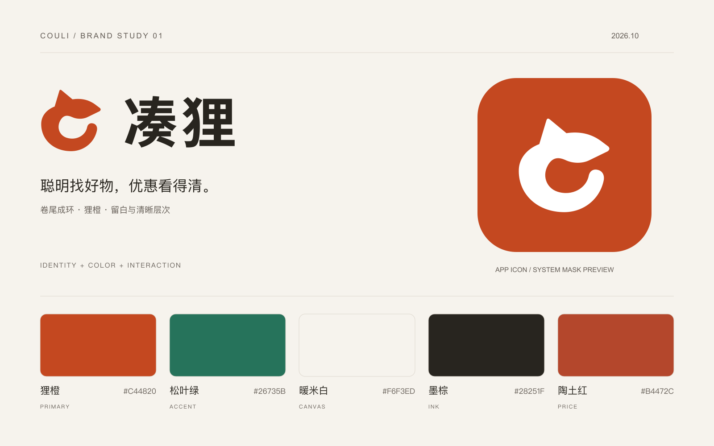

# 凑狸 Logo · 卷尾

2026-10-01 首版设计提案。品牌中文名沿用已确认的「凑狸」。

一个侧身回望的小狸：单耳和尖吻给出动物特征，卷尾构成开放的圆环，表达把需求、优惠与商品凑到一起。轮廓也隐含拼音首字母 C。只用一个实色填充路径，不依赖眼睛、胡须或小字维持识别。

品牌色为狸橙 `#C44820`，字标用墨棕 `#28251F`。没有使用电商平台商标、系统符号或 Apple 商标。Apple 指南应用在图形的简洁性、缩小识别和 App 图标制作流程上，并不意味着 Apple 对本设计作过认证；对应制作说明见 [App 图标](../app-icon/README.md)。

## 文件

| 用途 | SVG 源文件 | PNG |
| --- | --- | --- |
| 主图形 | [logo-mark.svg](source/logo-mark.svg) | [透明底](export/logo-mark.png) |
| 横向组合 | [logo-horizontal.svg](source/logo-horizontal.svg) | [透明底](export/logo-horizontal.png) |
| 竖向组合 | [logo-vertical.svg](source/logo-vertical.svg) | [透明底](export/logo-vertical.png) |
| 单色 | [logo-mark-mono.svg](source/logo-mark-mono.svg) | [透明底](export/logo-mark-mono.png) |
| 反白 | [图形](source/logo-mark-inverse.svg)、[横版](source/logo-horizontal-inverse.svg)、[竖版](source/logo-vertical-inverse.svg) | `export/` 下对应 `*-inverse.png` |

PNG 导出宽度均为 2048 px。SVG 图形与中文字标均为路径，无字体依赖、位图、外部资源或脚本；反白文件在白底预览时不可见，应放深色背景。

## 使用规则（本项目自定）

- 图形建议最小显示 24 × 24 pt/CSS px；横版至少宽 112 pt/CSS px；竖版至少宽 80 pt/CSS px。更小空间使用图形，不放文字组合。
- 四周至少留出图形实际高度的 1/4；源文件画布的内边距不代替排版留白。
- 保持等比缩放，使用平涂原色、墨棕单色或反白。不要拉伸、描边、旋转、添加表情或把促销文字叠在图形上。
- 品牌图形允许透明底；App 图标的提交底图必须按对应系统规格制作。展示页圆角仅模拟系统裁切，不应写回图标源文件。
- 动画可作为后续交互细节，当前交付的主标为静态；系统开启减少动态效果时保留静态标志。

## 字体与编辑

中文字标取自 **Noto Sans CJK SC Bold**，已转成轮廓路径，仅包含「凑狸」两字。字距为字体字号的 6%，图形独立于字形。字体来源：[Noto CJK 官方仓库](https://github.com/notofonts/noto-cjk/tree/main/Sans)，许可：[SIL Open Font License 1.1](https://github.com/notofonts/noto-cjk/blob/main/Sans/LICENSE)。未打包整套字体。常规界面文字仍使用系统字体并支持动态字号。

导出示例（安装了 librsvg 时）：`rsvg-convert -w 2048 source/logo-horizontal.svg -o export/logo-horizontal.png`。也可在支持 SVG 的矢量编辑器中等比导出透明 PNG。

品牌展示标题「聪明找好物，优惠看得清。」是本次提案文案，不修改 [名称与 Slogan](../brand/name.md) 中的正式待定状态；`COULI` 仅作项目拼音标注，不确定 Bundle ID 或商店英文名。
