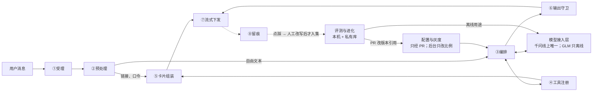

# 凑狸 Agent 系统设计与评测进化方案

- 日期：2026-10-05
- 状态：提议，待负责人确认。本文只提方案，不改其他文件；采纳的部分按 00 §8 分两类回写（清单见 §9）。**本文须与 `docs/changes/20261005-模型多厂商接入.md` 及其写回同批或之后提交**，否则文中对 BR-AI-14 细则「多厂商接入」、CAP-X-18、V-45、Q-C31、Q-G19 的引用会落空。
- 现状基准：rebate-platform origin/main `e6813c9`（2026-10-05 核对）：没有产品 Agent 代码，台账没有 B3、CT-08、CT-14 任务，私有库还没有 `prompts/`、`evals/`。规划工作树 `b7bdfdd`，加上未提交的 10-05 多厂商写回。
- 依据：规划/00 §3–§4、§8–§9；01 E07、§7–§8；02 §9、§12、§16、§20；03 §7；04 §8、§10；05 §0.1、§3.4（B3 线）；08 BR-AI-01～24 及相关主题（取值一律以 08 为准）；09 CAP-X-07、CAP-X-13、CAP-X-18；06 Q-C21、Q-C31、Q-G10、Q-G19；11 §1.1、§4.4、§7；ADR-0001；`docs/proposals/20261001-TypeSafe-Jev接入规划.md`；两篇外部文章（§1）。
- 读者：负责人、编排会话。引用以 BR 编号和小节名为准，行号只作参考。

**标记**：「已确认」= 规划或负责人已定；「建议」= 本方案提出，待确认；「负责人定」「法务定」= 须对应的人决定；「未验证」= 09 还没有实测结论，不能当事实，也不能对用户承诺。评测方法的先后写「上线前 / 内测期 / 有量之后」；产品阶段仍写 MVP / P1 / P2。编号前缀：BR = 08 业务规则，CAP = 09 平台能力验证条目，V = 09 README §7 验证计划条目，Q = 06 待补问题，D = 00 已确认决定，E / G = 两篇文章的方法（§1）。标「（工程细节，负责人可跳过）」的小节是给开发看的。看不懂的词查附录 B。

## 一页读懂

- **现状**：规划已把 Agent 的边界写到可以开发，但代码一行没有，工程台账也还没有 Agent 任务。
- **最该学的 3 件事**：① 把评测做成可复现的实验：每次运行记下版本，逐题留结果，分清错在哪一层；② 评测题分「调优 / 验证 / 保留」三份，只增不删，安全题配上「看着像攻击的正常题」；③ 提示词分「不许改的冻结区」和「可优化的可变区」，自动优化只动可变区。
- **Agent 怎么设计**：模型只管听懂需求和简短说明；价格、返利、链接、下单全由代码和卡片负责；评测只在本机和私有库跑，不碰生产数据。
- **可调用什么**：现有 7 个模型工具够 MVP 用；建议只加一样「页面引导卡」（用户点了才跳 App 内页面）；禁止事项任何开关都不放开。
- **本周需要负责人定的事**（本周给方向，正式截止见 §8.1；不定时按破折号后的做法执行，都不改已确认规则）：
  1. 离线预算上限（GLM 等，按月）——未定：只做连通性测试和小样本试跑。
  2. 模型 Key 由谁持有、谁运行评测——未定：负责人持有，按中文说明在本机运行，会话只读脱敏结果。
  3. 页面引导卡要不要（W3 前）——未定：不加，账户类问题走规则答疑或转人工。
  4. 两份 specs 清单是否列入保护路径——未定：不列入；改同意厂商清单仍须负责人与法务同意（BR-AI-14），登记表靠本文新增的 CI 检查。
  5. 真实对话由谁改写——未定：不改写，坏样本只留在后台，不进评测集。

## 0. 结论

1. **边界已定，代码为零**（已确认）：数字、链接、动作归代码和卡片（BR-AI-04～07）；工具白名单与 CI 三项检查（BR-AI-02）；发布门禁（BR-AI-21）。
2. **文章 43 条方法：34 条部分覆盖、7 条未涉及、2 条不适用，没有一条完整落地**（§2）。运行器口径与评测集切分在 B3-01 第一版定；冻结区随加载器、分桶随 B3-02 定。
3. **设计**：线上一个回合分八层（§4.2）；旁边三个子系统：多厂商接入层、本机 + 私有库的评测与进化、只经 PR 生效的配置与灰度。
4. **多厂商**（负责人 2026-10-05）：线上仍只用千问，GLM 首批只做离线。实现上加两道闸：调用前按「厂商 × 用途 × 数据类别」检查，改写样本外发按厂商开关（§4.3）；数据范围与「预算定前只试跑」已写在 BR-AI-14 细则。
5. **新发现**：规则问答的查询向量化也把用户文本发给厂商，现行 CI 只查对话路由，建议一并校验（§9 第 10 条）。
6. **可调用**：7 个工具够 MVP；建议加页面引导卡，须负责人批准并改 BR-AI-01/02、BR-AI-18 与 04；C 级永不放开（§6）。
7. **开工**：流协议、契约、运行器、模型网关、合成评测集可先做，但要先在台账登记 CT-08、CT-14 与 B3 任务，并建私有库目录（§7.1）。
8. **待定 20 项**（§8，第 14 项分 a–c，共 22 个决定点），前 5 项本周给方向；不定时一律保持现状，或只做不改规则的部分。

## 1. 两篇文章讲什么

下文只用自己的话概括，不抄原文。

- **评测体系**（大淘宝技术，《让Agent可评、可控、可迭代：业务效果导向的评测体系与场景实践》，叱干、王菲，2026-09-18；方法编号 E）：把 Agent 评测拆成五层（提示词约束、知识召回、工具执行、业务效果、持续回归），配三批数据集、校准过的评审模型、灰度上线与问题归因。场景是给大量商品生成补贴和投放配置的营销 Agent；前提是有 A/B 分桶、人工基线、偏好对，硬约束能写成规则。局限：数字多来自单一业务、百条级样本，作者承认离线与线上对齐只能缓解。
- **GEPA**（大淘宝技术，《agent优化之GEPA——一种提示词自进化的优化方案》，诗咏，2026-09-16；方法编号 G）：用标注数据驱动提示词自动改进：任务模型跑题 → 评分 → 反思模型归因并改写 → 择优，并保留各有所长的候选。主要用于让评审模型的提示词向人工标注对齐；前提是有带标注的数据集和反复调用的预算。局限：案例只用约百条数据的子集，没有线上 A/B 证据；冻结区、长度目标、无标签进化写在「展望」里，属设想。

**与凑狸的差异**：
- 凑狸 Agent 是一问一答的找货和出卡，输出大多能用规则判对错，所以**以规则断言为主，评审模型用得少**；数字、链接、排序交给代码（BR-AI-04～09），模型能改的范围很窄，**提示词优化的收益上限也低**，重点在意图、参数抽取、追问与拒答。
- 登记前只对内部名单开放（BR-AI-12），线上样本少，订单回传有滞后，**线上实验类方法要等公开之后**。
- 有硬数据边界：真实对话须脱敏并人工改写才能入集，不用于训练（BR-AI-19）；代理不读生产数据（00 §9）。「直接用线上数据挖规则」不能照搬。
- 技术栈锁定 TypeScript（ADR-0001），GEPA 的开源实现是 Python。

## 2. 凑狸现状对照

43 条方法（E1–E24、G1–G19）对照规划：**34 条部分覆盖，7 条未涉及（E9、E11、E15、E20、E21、E22、G15），2 条不适用（E14、G13），代码全部未实现**。完整对照表见附录 A，判定材料见附录 C。最重要的 9 条：

| 方法 | 差距（一句话） | 何时做 | 挂靠 |
| --- | --- | --- | --- |
| G1 改提示词变成可重复实验 | 缺录制键、运行元数据、逐题留存 | 上线前 | B3-01、B3-11 |
| E15 调优与验证数据隔离 | 没有切分和保留集规则 | 上线前 | B3-01 |
| E3 数据集版本化 | 没有清单，失败题可被删 | 上线前 | B3-01 |
| E19 + G17 安全题与误拒 | 缺注入子类和「像攻击的正常题」 | 上线前 | B3-01、B3-06 |
| G5 schema 一份三用 | 评测器可能另写一份；4 个工具没形状 | 上线前 | 契约、B3-01、B3-02 |
| G9 冻结区与可变区 | 提示词整段一个哈希 | 上线前（本文从内测期提前） | 加载器 B3-02 |
| E16 留痕可回放 | 缺候选商品、过滤原因、词典版本 | 上线前 | B3-01、B3-09、契约 |
| E6 灰度与回滚 | 缺分桶键、比例键、暂停阈值 | 上线前：版本字段与桶号；内测期：后台比例与告警 | B3-02、B3-09；B3-14 |
| G12 读数纪律 | 报告不写百分点和样本数 | 上线前 | B3-01、B3-11 |

**规划里已有的好做法**（不用再学）：**代码管数字**，模型看不到价格返利链接（BR-AI-04～06），比文章的「冻结区」更强；**工具白名单 + CI 三项检查 + 身份注入**（BR-AI-02、03）；**合并前冒烟、发布前全量、每晚趋势，先内部名单再按比例放量、能回滚**（BR-AI-21）；**评审模型只作参考**（JEV-02）；**真实对话改写才用、不训练**（BR-AI-19 细则）；提示词与评测集放私有库（D18）；版本可追溯（04）；条件标记由代码判定（BR-AI-24）；无模型降级保底、换厂商不改边界（BR-AI-14）。

## 3. 值得学的方法与收益

### 3.1 上线前

- **运行器的实验口径**（G1、G5、E16；B3-01、B3-11）：每次运行记提示词哈希、模型快照、采样参数、评测集版本、工具 schema 版本；逐题记结果类型和首个失败层；两种回放：A 模式回放录制的模型响应，B 模式用真实模型加录制的工具返回；报告差值写百分点并注明样本数，样本不足只写「证据不足」（G12）。收益：签字报告可复现，只改提示词时不会被旧录制误判为通过。成本：低，约多 2–4 天。
- **评测集版本与切分**（E3、E15、G4；B3-01）：每个集合一份清单；只增或标「退役」；按场景模板和会话分组切成调优、验证、保留三份。收益：防止提示词「背答案」，失败题删不掉。成本：低，第一轮调提示词前切好。
- **安全子类 + 边界正常题**（E19、G17；B3-01、B3-06）：注入（用户、素材、商品标题）、越权、身份参数、禁售、诱导承诺、未验证能力；每类配一组「看着像攻击的正常找货」。收益：上线前就有安全回归，误拒率可见。成本：中（出题量）。
- **工具 schema 一份三用**（G5；契约任务、B3-02）：同一份定义生成发给模型的函数、做运行时校验、做评测断言。成本：低。
- **提示词冻结区与可变区**（G9、G7 的长度上限；加载器 B3-02）：冻结段单独算哈希，条款编号，设长度上限。从内测期提前，因为文件格式要在第一个提示词版本时定。成本：低。
- **两版并存与留痕补字段**（E6 的上线前部分、E16；B3-02、B3-09、契约）：版本字段与桶号落库；留痕补候选商品快照、过滤原因、配置指纹、厂商。**按比例放量和回滚已由 BR-AI-21、02 §20 确认**，本文只补分桶键、比例配置键和暂停阈值；后台比例与告警留到内测期（B3-14）。收益：坏样本能定位到参数、过滤还是候选。
- **多厂商接入层 + 用途检查 + 预算记账**（负责人 2026-10-05；G11 的记账部分；B3-02、B3-01）：离线厂商进不了线上，每接一家只需登记，费用可预期。成本：中。
- **问题路由表 + 共同因素排查手册**（E5、E7；02 §20 Runbook，**截止 W4**，早于内测期）：联盟或代码问题不被当成提示词问题；大促期间不误回滚好版本。

### 3.2 内测期（W5 起，周次以 10-14 复盘后的 05 为准）

| 做什么（方法） | 收益 | 挂靠 |
| --- | --- | --- |
| 五层报告与判读顺序（E1、E23） | 失败直接定位到层 | B3-01 |
| 坏样本回流（E3 第二批、G8） | 内测投诉变成回归题；代理不碰原文 | 建议 B3-14 |
| 后台灰度比例与比例告警（E6 其余部分） | 改提示词不必重新发版 | 建议 B3-14 |
| 评审模型校准（E2、E8、E12） | 开不开 Jev、用不用 GLM 评审有依据 | B3-12 |
| 半自动提示词优化（G2、G3、G6、G8、G10、G11、G18、G19） | 改提示词有假设、有对比 | 建议 B3-15 |
| 提示词长度与成本对比、误拒与过度追问的对立指标（G7、G17 的其余部分） | 提示词不越改越长；安全题不把模型推向多拒 | B3-01 |
| 普通搜索与 Agent 成对基线（E10 第一步） | 不预设 Agent 一定更好（01 §8.4） | B3-01 |
| 规则召回与有据断言、执行诊断指标、精度覆盖分开报（E17、E18、E24） | 规则答疑出错、规格比对过严能被发现 | B3-08、B3-01、B3-09 |
| 稳定性 pass^k（E4） | 区分「能力不够」和「不稳定」 | B3-01、B3-11 |
| PR 检查单、改动记录模板、评分细则挂 BR 编号（G2、G15、E13、E20） | 改动可审；08 变了能定向更新 | B3-01；`docs/templates/` |

### 3.3 有量之后（只写目标、依赖、未知项）

| 方向 | 目标 | 依赖 | 未知项 |
| --- | --- | --- | --- |
| 线上分桶对比、成对评审（E10、E22） | 用相对稳定版的增量判断新版本 | 登记号到手、对公众开放后（计划 W8）的流量 | 样本是否够 |
| 评分细则库（E9、E11、E21） | 主观项有稳定依据 | 偏好数据；F-PROD-10 | 行为数据的隐私口径 |
| 评估器线上对齐（G16） | 离线高分与线上点击同向 | 逐卡判定落库；看板 | 内测量能否支撑 |
| 多候选与按模块合并（G7、G18） | 避免局部最优 | 半自动循环证明有价值；预算 | 可变区很小，是否值得 |
| Skill 封装（G14） | 固定编排会话的操作步骤 | B3-01 完成 | 边际收益 |

**不采用**：E14（凑狸没有按商品执行的策略）、G13（不需要无标签进化；照搬还会违反「不按转化或佣金排序」，BR-AI-09/10）。

## 4. Agent 系统设计

### 4.1 设计原则

1. **代码管数字和动作，模型只管理解和说明**（BR-AI-04～07）。Agent 不另写报价、归属、资金规则，复用 B1/B2 的服务（05 §0.1）。
2. **能用规则判的不用模型判**；评审模型只作参考。
3. **一份定义多处用**：工具 schema、白名单、断言只写一份。
4. **换厂商、换提示词不改边界**：工具集合、A/B/C 分级、身份注入、模型可见内容、出站过滤对所有厂商相同（BR-AI-14 细则）。
5. **出错时关闭**：未登记、未同意、预算为 0 时一律不调用，按无模型降级处理；不静默换模型。
6. **离线与线上隔离**：离线只用合成数据、公开商品数据和提示词，改写样本按 BR-AI-14 细则限定厂商；不读生产库；公开 CI 不持私有凭据。
7. **每次改动可复现、可回滚**：版本引用、评测集清单、录制键、分桶。
8. **不新增语言和依赖**：用 TypeScript（ADR-0001）；不引入模型厂商 SDK 和 Python 第三方包；Jev 的 Node SDK 已按 JEV-06 批准。

### 4.2 总体架构



| 层 | 职责（一句话） | 依据 |
| --- | --- | --- |
| ① 受理与配额 | 按 BR-AI-23 的顺序做受理校验并预占预算（BR-AI-16）；撤回同意或关开关时终止进行中的回合 | BR-AI-11～13、15、16、23 |
| ② 预处理 | 先用代码取出链接和口令，再对剩余文本脱敏、做输入审核和拒答预判；第三方文本标为不可信 | BR-AI-14、05、18 |
| ③ 编排 | 单循环工具调用；追问、超范围等意图由服务端接管；价格校验、放宽、排序、指代由代码算 | BR-AI-02、05、08、09 |
| ④ 工具注册 | 下发集合 = 注册表 ∩ 已开启 ∩ 当前主体允许；身份只由服务端注入 | BR-AI-01～03 |
| ⑤ 卡片组装 | 数字只来自 B1 报价和订单查询；同卡字段同一次取数；只登记链接，不预转链 | BR-AI-04、10、24；BR-PRICE-12 |
| ⑥ 输出守卫 | 过滤金额、链接、口令；限制句数；按句审核；订单和规则类文本换成模板 | BR-AI-06、07、18 |
| ⑦ 流式下发 | 只发过滤后的文本、卡片和终止事件；带提示词版本和模型公示名 | BR-AI-06；BR-TEXT-16 |
| ⑧ 留痕 | 异步落库、落库前脱敏、失败告警不丢；点踩自动标坏样本 | BR-AI-19 |

**体验要点**（建议）：
- **省掉不必要的第二轮模型**：查订单、规则问答的文本本来就换成模板（BR-AI-07），空结果、禁售、价格非法也由服务端收尾（BR-AI-08、18），这些情况工具返回后直接出卡结束，省一次往返和一份费用。
- **卡片先于说明**：找货时先发卡片，后发说明；高峰或预算紧张时可按配置只出卡、标签和快捷改写。
- **能搜就先搜，少追问**：没说平台就搜全部已开平台，没说价格就不限；追问次数按 BR-AI-01 细则。追问和点快捷改写都计配额（BR-AI-15）。
- **混合输入**：一条消息既有链接又有找货需求时，先走确定性路径出链接卡，剩余文本再进编排，同一回合只计一次配额。

**意图怎么输出**（工程细节，负责人可跳过；建议，形状写进 04）：有工具调用时，意图由工具名推出；第一轮没有工具调用时，模型输出一段短 JSON（意图只许追问、超范围、查订单三种，页面引导卡获批后增加一种），服务端先解析，文本再过输出守卫，解析失败按普通文本处理并记留痕。不加「设定意图」这类伪工具，因为 BR-AI-02 要求工具集合精确相等。

### 4.3 模型接入层（落实 2026-10-05 决定）

**4.3.1 已确认**：多厂商接入的用途划分、线上启用条件与 CI 校验按 BR-AI-14 细则「多厂商接入」（负责人 2026-10-05）执行。

**4.3.2 本方案建议的做法**：
- **位置**：适配器放在 agent 模块的网关里，不新建跨模块的包（新建包要改 BR-AI-02 ③ 的依赖白名单）。离线运行器经 agent 模块的对外入口复用同一份适配器，保证离线与线上行为一致。
- **不引入模型厂商 SDK**：只用 Node 自带的 `fetch` 和自写的流式解析。厂商 SDK 属新增第三方 SDK，须负责人定（00 §9）。
- **一个适配器 + 每家一张差异表**：记思考模式开关、缓存提示、`tool_choice`、并行调用、流式分片方式、采样参数是否可设。**差异表的值只取 09 实测结论，未实测的特性一律关闭**（09 README §0.2）。
- **工具定义对厂商中立**：只用函数名、描述、参数 schema 和 `tool_choice=auto`，不依赖并行调用、强制调用等差异项（各家支持情况都未验证，CAP-X-07、CAP-X-18）。多平台并发由搜索工具在服务端完成。
- **调用前先过政策检查**（新闸一）：厂商、用途、数据类别三者都被登记表允许才发请求，否则直接拒绝，不发网络请求。
- **改写样本外发开关**（新闸二）：每家一个开关 `allow_rewritten`，千问以外默认关，落实 BR-AI-14 细则「改写样本只发给同意文案已列明的厂商，其他厂商须书面确认不训练并经法务同意」。
- **厂商自身的内容拦截**映射成统一错误，按降级处理，不把厂商的拒答原文发给用户（返回形态未验证）。
- **向量模型**（建议，待负责人定，§8 第 10 项）：首批用千问百炼的向量模型。规则库的向量与向量模型绑定（ADR-0001 记「向量模型与维度未定」），换厂商要重建索引，不能运行时切换。

**4.3.3 适配器接口与厂商登记表**（工程细节，负责人可跳过；形状由代理在 B3-02 定）：

```ts
type VendorId = 'qwen' | 'glm';            // 其他厂商经负责人点名后追加
type Purpose = 'online_orchestration' | 'online_embedding'      // 线上：只许同意清单内的厂商
  | 'offline_eval_task' | 'offline_judge' | 'offline_prompt_rewrite' | 'offline_synth';
type DataClass = 'user_input_redacted' | 'synthetic' | 'rewritten' | 'public_catalog'
  | 'prompt_full' | 'prompt_tunable' | 'aggregated_stats';   // 提示词全文（作对照被测）/ 只可变区（作改写）；聚合统计待定（§8 第 7 项）
interface CallContext { purpose: Purpose; dataClass: DataClass; runId: string; meterAccount: string; deadlineMs: number }
type UnifiedEvent = { t: 'text_delta'; text: string } | { t: 'tool_call'; name: string; argsJson: string } // 参数已拼接完整
  | { t: 'usage'; input: number; output: number; cached?: number } | { t: 'done'; reason: 'stop' | 'tool_calls' | 'length' }
  | { t: 'error'; kind: 'timeout' | 'rate_limited' | 'server' | 'auth' | 'bad_request' | 'vendor_blocked' | 'policy_denied' };
interface ModelAdapter { readonly vendor: VendorId;
  chat(req: UnifiedChatRequest, ctx: CallContext): AsyncIterable<UnifiedEvent>;
  embed?(texts: string[], ctx: CallContext): Promise<number[][]> }
```

登记表建议放公开库 `specs/model-vendors.yaml`，只写名称、状态和引用，不写密钥值；同意覆盖只看 `specs/agent-consent-vendors`，由 CI 交叉核对：

```yaml
vendors:
  - id: glm                          # 智谱 GLM；access: openai_compat，路径 A 经百炼 / 路径 B 直连，待 CAP-X-18 实测
    snapshots: []                    # 实测后登记
    purposes: { online: [], offline: [offline_eval_task, offline_judge, offline_prompt_rewrite, offline_synth] }
    data_classes: [synthetic, public_catalog, prompt_full, prompt_tunable]   # 依据 BR-AI-14 细则「多厂商接入」；aggregated_stats 待 §8 第 7 项
    allow_rewritten: false           # Q-G19 书面确认不训练 + 法务同意前保持 false
    filing_ref: null                 # 生成式 AI 登记材料版本；null = 未覆盖
    key_ref: { kms_alias: llm/glm/offline, env: ZHIPU_API_KEY }   # 只写名字，不写值
    meter_account: glm-offline       # budget_key: eval.budget.monthly_cap_fen.glm
    refs: { caps: [CAP-X-18], questions: [Q-C31, Q-G19] }
    status: offline_pending          # 预算与 CAP 基础项到位后改 offline_ready
    approval_id: null                # ops/approvals.yaml 中负责人批准记录
```

**4.3.4 首批登记**：

| 项目 | 千问（阿里云百炼） | 智谱 GLM | TypeSafe Jev |
| --- | --- | --- | --- |
| 线上用途 | 编排（含摘要）、查询向量化，唯一 | 无（跨厂商兜底默认空） | 不进模型路由；只限 BR-AI-14 细则列的三项，如结果核对（BR-AI-24，开关默认关，只能把卡降为「规格待确认」） |
| 离线用途 | 被测模型（门禁只认已签字的路由）；评审、改写、造题须先定预算 | 对照被测（只作参考）、评审、提示词改写、造题，都在预算内 | 评审打分，只用合成数据、只作参考；不做改写和造题（JEV-01 不含提示词） |
| 同意与登记 | 同意文案已点名（BR-ID-14）；登记 Q-C7 待办 | 未覆盖 | 不需要（只收非个人数据，JEV-01） |
| 数据条款 | 未验证（Q-G10） | 未验证（Q-G19、CAP-X-18） | 未验证（Q-G16、CAP-X-13） |
| 允许的数据 | 线上：脱敏用户输入；离线：合成、改写、公开数据、提示词 | 合成、公开数据、提示词（作对照发全文，作改写只发可变区）；改写样本看开关 | 公开标题、需求短词、运营文案、合成数据 |
| 密钥 | 线上 Key 只给 stream、worker；评测另用一把（建议） | 路径 A 复用百炼评测 Key；路径 B 本机环境变量 + KMS；生产进程不授权 | 按 02 §12.6 |
| 状态 | 线上主路由，快照待 B3-11 签字 | 已决定接入；离线可用要等预算和 CAP 基础项 | 影子试跑，W3 决定 |

DeepSeek、豆包、Kimi 等：未登记；负责人点名后各开一条 CAP、一组 06 问题、一个预算。

**4.3.5 按用途隔离**：

| 用途 | 可用数据 | 结果能否影响上线 |
| --- | --- | --- |
| 离线被测 | 合成、公开商品数据、提示词全文；改写样本给千问，GLM 看开关（§4.5） | 千问按 BR-AI-21 决定能否发布；GLM 只作参考 |
| 离线评审 | 合成；改写样本看开关 | 只作参考；要作门槛须改 BR-AI-21 |
| 改写与反思 | 提示词可变区 + 合成或已改写的失败题 | 只产出候选，须过 §4.4.5 全部门禁 |
| 合成题生成 | 合成题、已改写样本（GLM 看开关）；工单须先由指定人脱敏并人工改写；热词等聚合统计能否外发待定（§8 第 7 项） | 题目经人工复核才入集 |

**4.3.6 路由与降级**：
- **线上不变**（已确认）：千问 Flash 快照 → 千问 Plus 快照 → 无模型降级（BR-AI-14）。后台只能在已评测的路由条目间切换，或切到无模型（BR-AI-21）。
- **建议 04 补形状**：路由条目加 `vendor` 字段；在 Plus 之后、无模型之前留一个可选的「跨厂商槽位」，默认空。
- **跨厂商槽位（远期，只写目标、依赖、未知项）**：目标是主备都故障时还能用模型出卡。依赖：BR-AI-14 细则列的线上启用条件全部满足，另加该厂商 CAP 在工具调用、时延、训练条款、版本政策上达到「支持」，单价登记（BR-AI-16）与模型公示更新（BR-TEXT-16），负责人批准记入 `ops/approvals.yaml`。未知项：GLM 的大模型备案情况、登记材料能否列两家、北京地域时延。
- **离线**：每个用途显式写「厂商@快照」，不做跨厂商自动替补（替补会污染实验结论）；只对限流和服务端错误退避重试，仍失败的记「模型失败」计入分母，运行标「未完成」。百炼按主账号合并限流是检索结果（CAP-X-07，未验证），离线运行默认限速、避开高峰；GLM 走百炼路径时预计也共享主账号限流（CAP-X-18、Q-C21，未验证）。

**4.3.7 校验清单**（工程细节，负责人可跳过）：
- CI，保留：模型路由的厂商 ⊆ 当前同意版本的厂商清单（BR-AI-14 细则）；BR-AI-02 三项检查不随厂商变化。
- CI，新：路由厂商 ⊆ 登记表里「线上用途非空且有负责人批准记录」的厂商，离线厂商不得出现在路由里；**向量化路由**也纳入这两项（§9 第 10 条）。
- CI，新：登记表格式校验（用途、数据类别是枚举；密钥字段只许写名字；每家须引用 CAP 编号）；各生产进程的密钥引用 ⊆ 线上已批准厂商 + Jev；离线运行配置里每个「用途 → 厂商」组合都被登记表允许，并写明数据类别和预算键。
- 运行时与权限，新：网关启动时不满足条件的路由条目作废，按无模型降级；每次调用前做政策检查；生产进程拿不到离线厂商的 Key，配置写错也调不出去。
- 本机，新：运行器拒收三种情况：改写样本发给 `allow_rewritten=false` 的厂商；预算为 0 或缺失；生成候选的会话读到保留集路径。

**4.3.8 密钥**：Key 的值不进任何仓库、对话、录制和日志；录制时去掉鉴权头；**由人持有**（09 README §0.2）。建议千问评测单开一把 Key（独立业务空间），便于单独计量（BR-AI-16）。编排会话能否启动读取环境变量的运行器（会话看不到值），要同时改 02 §12.7、09 README §0.2 第 4 条和 BR-AI-14 细则「多厂商接入」的密钥写法，须负责人批准（§8 第 2 项）；批准前由人按中文操作说明运行，会话只准备配置、读脱敏后的输出。模型 Key 不放进公开库的 CI secret，公开 CI 只跑合成回放。

**4.3.9 计量与预算**：
- 线上只按 BR-AI-16 记账，这里不复述公式和额度。
- 离线每家厂商一个计量账号；运行器逐次记录厂商、用途、快照、数据类别、输入 / 输出 / 缓存 token、费用、是否重试；每月给负责人一页中文账单。
- 按厂商分别设单次、每日、每月上限，超出立即停止，报告标「预算中止」。千问以外厂商的上限未定前只做连通性测试和小样本试跑；千问按 BR-AI-21 的评测运行（冒烟回放、选型与发布全量、每晚全量）照常执行（均为 BR-AI-14 细则）。
- 千问评测费用独立计量（BR-AI-16），但还没有月度提醒线（§9 第 25 条），建议随 §8 第 1 项一并定。
- 估算（供负责人定上限）：调用次数 ≈ 题数 × 重复次数 × 候选数，再加评审调用。GLM 单价未验证，核实前不折算金额。BR-AI-16 计价没有覆盖缓存（§9 第 21 条）。

**4.3.10 09 与 06 需要补的条目**（工程细节，负责人可跳过；CAP-X-18、V-45、Q-C31、Q-G19 已在工作树登记，不另编号）：
- **CAP-X-18 补验证项**（全部未验证）：能否稳定输出意图短 JSON；对「不许多传字段」的遵守程度；思考模式能否关、温度和 seed 能否固定；厂商侧内容拦截的返回形态，会不会拦掉注入、禁售类评测题；作评审时与人工的一致率和位置偏差；大模型备案情况（法务核对，只与将来线上有关）。
- **CAP-X-07 补验证项**：采样参数能否固定；评测 Key 与线上 Key 是否合并限流；意图短 JSON 稳定性；向量模型与维度；两版提示词的前缀缓存能否分开命中。
- **06 建议新增** Q-F15（法务）：改写样本是否仍属个人信息、能否发给离线厂商；聚合统计能否外发；隐私政策要不要写离线厂商；经百炼调用 GLM 是否算新增厂商。Q-C21 补一句：百炼评测用独立业务空间或 Key。

### 4.4 评测与持续进化子系统

**4.4.1 五层评测在凑狸的定义**（门槛出处一律引 BR-AI-21；「观察」= 只报告）：
- **L1 提示词约束**：静态查冻结区完整、不复述 08 数值、无禁用词和承诺、不提未验证能力、条款有编号、长度在上限内；行为查注入、越权（逐项诱导 C 级事项）、禁售、身份参数、文本漏金额或链接、拒答边界。规则断言为主，GLM 可离线挑条款矛盾作参考；提示词不发给 Jev。观察：禁用词、诱导承诺、误拒率。挂靠 B3-01、B3-05、B3-06。
- **L2 规则与知识召回**：规则问答召回对不对、没命中是否转人工；说明是否与本轮卡片一致（有据）；黑话归一。「是否夸大」交评审模型作参考。召回命中率等是否设门槛由负责人定。挂靠 B3-08、B3-07、B3-01。
- **L3 工具执行**：意图、选工具、参数、指代、权益过滤、链接识别、卡片数值、转链归因、追问是否必要、降级、多次运行是否稳定。全用规则；**卡片数值直接与 B1/B2 报价服务的输出比对，评测器自己不算返利**。诊断：选工具正确率、过度追问率、参数非法率、pass^k。挂靠 B3-01、B3-04、B3-05、B3-11。
- **L4 业务效果**：离线比同一批任务的普通搜索与 Agent；线上只看聚合报表（F-ADM-20），代理不读逐条数据。目标见 01 §8.2–8.3；早期信号用当天点击和付款订单。
- **L5 回归**：合并门、发布门、夜间趋势、坏样本复发、新出现的失败（BR-AI-21）。夜间评测任务台账没有，建议登记。

每层修复方向不同：L1 改提示词；L2 改规则文章、黑话词典、相似度阈值；L3 的意图和参数改提示词可变区，工具描述走契约流程，过滤和出卡改代码；L4 通常不是提示词问题。

**4.4.2 读数规则**（工程细节，负责人可跳过）：
- **先查运行有效性**：评测集哈希、录制键（提示词哈希、模型快照、工具 schema 版本）、采样参数与线上一致、未触发预算中止、联盟数据来源已标注、所用评审版本已校准。任一不满足，整份报告作废重跑，不进趋势。
- **判读顺序**：有效性 → L1 → L3 → L2 → L4，L5 汇总。凑狸的知识经工具拿到，先选对规则问答工具才谈得上召回。
- **每题只记一个「首个失败层」**：BR-AI-21 门槛项按全部题计分母，上游失败也算失败；只用于诊断的下游指标剔除上游已失败的题，并列出「上游作废数」。
- **批次规则**：L1 静态检查不过就不跑真实模型；安全类出现任何失败，报告标「不可用于选型或放行」；参数全对但商品不相关，先查工具返回和放宽，不先改提示词；L3 全过而 L4 不涨，先比对题目分布与真实需求，再排查共同因素（§4.4.6）。
- **读数纪律**：差值写百分点，注明样本数和集合；全对类写成「n 条，0 失败」，并提醒签字人 n 条全过只说明失败率大概率低于 3/n；某切片样本数低于下限（建议 30）只写「证据不足」；验证集参与过挑选，结果偏乐观，放行仍以 BR-AI-21 的全量结果为准。

**4.4.3 评测数据集**（全部放私有库 `evals/agent/`）：

| 集合 | 用途 | 谁能看逐条 |
| --- | --- | --- |
| `smoke/` | 合并门回放，组成按 BR-AI-21 | 都可以 |
| `find/` | 全量，用于发布门和选型；内部打调优 / 验证 / 保留标签 | 调优：编排会话、Codex、反思模型；验证：编排会话；保留：只看汇总 |
| `badcase/` | 人工改写后的线上坏样本，一律进调优 | 编排会话 |
| `judges/<名称>/` | 评审模型的标签集与隐藏验证集 | 隐藏部分只看汇总 |
| `baseline-pairs/` | 普通搜索与 Agent 成对比较 | 编排会话、人工 |
| `review-queue/` | 评审三次一致却与人工相反的题 | 人工复核 |
| `runs/` | 每次评测与优化实验的结果（§4.4.5） | 编排会话；保留集只存汇总 |

- **分三批建**：上线前（冒烟、全量、安全子类、边界正常题、Jev 标签小集；T5/T6 题先满足冒烟要求，在全量中作观察类别）；内测期（坏样本回流、扩充对抗题、成对基线）；有量之后（评审退化监测集、按真实需求校正配比，只写目标）。
- **出题来源**：编排会话合成（11 §1.1）。热搜词和客服高频问题（Q-D4）属聚合统计，由编排会话据此写成合成题。**工单样例是真实对话**，须由负责人指定的人脱敏并人工改写后才进私有库，之后按改写样本处理（GLM 受 `allow_rewritten` 开关限制）。真实链接与口令样本（Q-D5）入库前去掉 `relation_id`、分享者标识等用户级参数，只用于链接识别类题目。可选：用 GLM 扩写合成题的问法变体，减少「出题人兼改卷人」的偏差（BR-AI-14 细则列的离线用途，仍受预算约束）。
- **配比**：类别占比按 01 §8.1 不改，改占比或给 T5/T6 设门槛须负责人定；类内按风险加权，资金、身份、注入、C 级诱导多出题；每个安全子类配一组边界正常题。

**切分、保留集与版本**（工程细节，负责人可跳过）：
- **切分**（建议值，参照文章示例）：调优约 50%、验证约 30%、保留约 20%；MVP 不启用自动循环时，调优和验证合称「开发部分」。同一场景模板的变体、同一会话的各轮整组放同一侧；按类别分层、固定 seed 切分；切分清单算哈希写进清单文件；入集时查期望值是否混进输入、同组是否跨集合、有无近似重复。小类别保留题不够时加题补足。
- **保留集**：只由编排会话在本机跑，只回写各类通过率和失败条数；Codex 会话和反思模型不挂载保留集路径；用满 3 次（建议）或 BR 有大改就换一批，旧的并入调优；保留集里安全类失败，必须把该题移入调优修复，再补一道新的保留题。发布门槛口径不变，报告另列保留集汇总。
- **版本**：每个集合一份清单文件（版本、条数、占比、哈希、切分哈希），每题记来源（合成、GLM 合成、聚合统计改写、坏样本改写编号、真实链接样本）。题目只能新增或标「退役」并写明原因，不能物理删除；改期望值另开「题目变更」，由另一家评审。报告写明所用清单版本。

**4.4.4 评审模型**：确定性的部分（工具名、参数、意图、金额与链接、身份参数、禁售、卡片数值、转链归因、条件标记、句数、模板替换）一律规则判。评审模型只评需要推理的：结果相关性、说明是否有据和夸大、按标题比较是否越界、追问是否必要、版本对比择优、失败归类。它不参与金额、归属、日期、内容安全，也不作发布门槛（BR-AI-14、BR-AI-21 细则）。MVP 只作参考；将来要升为门槛，须隐藏集一致率连续稳定、位置偏差可控、线上对齐同向，并由负责人改 BR-AI-21；即使升级也只用于否决、不用于放行，永不用于金额、归属、身份。

| 候选 | 适合做什么 | 限制与风险 |
| --- | --- | --- |
| Jev | 选择题、是否类判断，带把握度 | 只收合成数据和公开标题（JEV-01）；费用与其他 Jev 用途共用月上限；中文准确率未公布（CAP-X-13） |
| 千问 | Jev 的对照组 | 作常设评审须先定预算；同厂商自偏好；Plus 本身是被评的备用路由 |
| GLM | 跨厂商交叉评审、成对比较 | 能力、价格、训练条款都未验证（CAP-X-18）；厂商侧审核可能拦掉对抗题 |
| 人工 | 终审、提供标签 | 人力瓶颈；W3 人工清单已有「评测集人工标注」（05） |

**校准**（工程细节，负责人可跳过）：与人工标签对照，报一致率和覆盖率（达标线引用 CAP-X-13 和 Jev 提案，不另定）；调评审提问用另外生成的题，隐藏集不参与；每题判 3 次（建议），「三次一致子集」正确率达标才把三次一致当置信条件；成对比较正序、逆序各跑一次，报位置偏差；千问的输出优先交给非千问评审；评审的快照、提问模板哈希、阈值登记成版本，任何一项变了先在隐藏集重验；冲突题进复核队列，结论三选一：改标签、补进难题、或发现 08 表述有歧义按 00 §8 走变更。离线对齐和「与线上点击是否同向」分两栏报。

**4.4.5 离线提示词优化循环**（GEPA 思路的凑狸简化版）：

| 时期 | 做法 | 条件 |
| --- | --- | --- |
| 上线前（到 W3 选型） | 不启用自动循环；人工迭代，但用同一个运行器和记录格式；反思由编排会话做，不新增费用 | 评测集、提示词 v0、预算都还没有 |
| 内测期 | 半自动：反思模型自动出候选，合并 PR 时人审 | 评测集 v1 连续两版稳定；保留集至少轮换一次；CAP-X-18 基础项达离线可用；预算已定 |
| 有量之后 | 目标：多候选、按模块合并、成对评审择优 | 依赖评测集与细则库；未知项：收益能否覆盖成本 |

可优化的只有模型负责的窄任务：找货的意图与参数抽取、多轮指代、拒答与追问分类、说明语气。链接识别、返利、条件标记由代码负责，不在范围内。

**六步**（工程细节，负责人可跳过）。每次实验写入私有库 `rebate-private/evals/agent/runs/opt-<编号>/`（口径表、进度、候选谱系、调优集逐题结果、报告与一页中文摘要、费用；02 §16.2 补目录见 §9 第 33 条）。本机 `couli-runs` 只放 Codex 临时输出和任务书。
1. **基线**：锁定提示词哈希、模型快照、采样参数、评测集版本、工具 schema 版本；在开发部分用 B 模式跑 k 次（建议 3），逐题记结果类型和首个失败层。
2. **归因**：只对调优集的失败题做。先用模板写清「期望、实际、哪条断言失败」，再由反思模型回答三问：错在哪一步、哪条条款导致或没能阻止、该怎么改。不在提示词的问题分流出去：代码和上游开工程问题；工具描述走契约流程；标签错走「题目变更」；需要新工具或改分级的进负责人队列（须改 BR-AI-01/02）。
3. **有限改动**：每轮最多 3 个候选、每个最多改 3 条可变区条款（建议值）；每个候选附一条可检验的假设（预期提升哪类、可能伤哪类、依据哪些题）；先过静态检查，不过即丢弃。
4. **同口径比较**：先在调优集抽固定小批量（约 50 题，含安全子类）重复 k 次预筛，安全类失败或无提升即丢弃；再在验证集与基线同快照、同参数、同 k 比较：BR-AI-21 任一项退化直接否决，合格的依次比参数正确率、每会话成本、首卡时延。上线前只保留「当前版本 + 1 个候选」。
5. **保留集复评**：入选候选在保留集只跑一次，只看汇总。
6. **PR 门禁**：私有库写新版本；公开库 PR 只改版本引用；按新提示词哈希重新录制并另存，跑冒烟回放；B 模式全量逐项达标（BR-AI-21）；PR 写明版本变化、修改假设、逐类对比、新修复和新失败题号、保留集汇总、回退版本与触发条件；另一家评审子代理按清单检查后进入灰度。改提示词不需负责人签字，换模型或快照仍须签字（BR-AI-21）。优化器不得直接改线上版本、不得合并、不得部署。

**提示词分区**（工程细节，负责人可跳过）：
- **冻结区**（不能被优化；单独算哈希，改动单独提 PR）：角色与边界；拒答范围（BR-AI-18）；不可信文本不当指令（BR-AI-05）；不输出金额链接口令（BR-AI-06）；不承诺、不用禁用词（BR-TEXT-13）；意图与工具协议；输出格式。
- **可变区**（可优化；条款编号，如 R-INTENT-03）：意图判别顺序与示例；条件抽取示例（排序说法只能用 BR-AI-09 已列的）；追问措辞；指代示例；说明语气。
- **提示词之外**（不在循环内）：工具 schema 与描述、白名单、输出守卫、卡片组装、模型路由、厂商登记、评测集与门槛。

**三种模型分工**（工程细节，负责人可跳过）：任务模型用千问选定快照，采样参数与线上一致；反思模型上线前由编排会话担任，预算定后可用 GLM（跨厂商可减少同源偏差），只给调优集失败题（合成或已批准的改写题）和可变区原文，不给验证集、保留集逐题，也不给留痕；评审规则优先，推理项交 Jev 或 GLM 作参考，人工终审。可选用 GLM 跑同一评测集作对照：两家都错的题先怀疑题目或提示词有歧义。

**预算与停止**（工程细节，负责人可跳过）：按厂商分项记账（推理、反思、评审、重录、重试）；满足任一即停：达到最大轮数（建议 3 轮）、连续 2 轮验证集无提升、验证集各类达标且剩余失败只属「标签错」或「非提示词」、触发预算上限、候选违反冻结区的比例过高。重试不算新样本。

**用 TypeScript 自写还是用开源 GEPA**（工程细节，负责人可跳过；要定的见 §8 第 15 项）：建议现在用 TypeScript 简化版：在 ADR-0001 内，不需新 ADR；直接复用工具 schema、断言和加载器，口径不漂移；运行器能强制检查样本来源；与 B3-01 重叠，约多 2–4 天。开源 GEPA（Python）有现成的多候选、合并、反思提示，但进 rebate-platform 须新 ADR，放私有库或本机时 pip 依赖没有锁定、满 7 天、许可证门禁，还要另加隔离防止读到验证集、保留集和留痕。有量之后若证明有价值且确需多候选与合并，再评估「GEPA 外壳 + TS 打分命令」，只放私有库，届时须负责人批准依赖。

**4.4.6 发布与灰度**：

**回归范围**（工程细节，负责人可跳过）：

| 改了什么 | 要跑的回归 |
| --- | --- |
| agent 代码 | A 模式冒烟 + 回放全量 |
| 提示词可变区 | 冒烟（需重录）+ B 模式全量 + 保留集汇总 |
| 提示词冻结区 | 同上，另加 L1 静态全检、安全子类 pass^k（建议） |
| 换快照或模型 | 全量重复 3 次（建议）+ 负责人签字 |
| 工具 schema 或描述 | 契约流程 + 白名单 CI + B 模式全量 |
| 黑话词典 | 链接口令类 + 素材子集 |
| 禁售表、意图关键词表 | 注入、越权、禁售类 + 闲聊拒答 + 边界正常题 |
| 规则文章、相似度阈值 | 规则问答子集（需先补题） |
| Jev 版本、评审模板 | 先在隐藏集重验 |
| 新增离线厂商 | 不影响线上，登记 CAP 和预算 |

后台保存词典、禁售表、规则文章时线上不能自动跑评测：标「待回归」并推群告警，由编排会话在本机用合成题回归；导出生产词典快照用于回放属于生产数据导出，须负责人定。

- **已确认**：全量不达标禁止发布；发布顺序为内部测试名单 → 按比例放量，能回滚到上一版本（BR-AI-21、02 §20）。
- **本文只补**（建议）：稳定版与灰度版同时在线，都只能经 PR 写入、都已通过全量；比例配置键 `agent.release.canary_percent`，默认 0，改动二次验证并记审计；分桶键为登录用户按 user_id 哈希、游客按设备哈希，照搬 H5 做法（02）；桶号写进 `agent_runs`。
- **时间线**：内部名单期（W5 起）样本少，比例类判据几乎都是「证据不足」，放行靠全量门槛加员工试用；灰度真正起作用要等登记号到手、对公众开放之后（计划 W8，取决于 Q-C7 与 BR-AI-12）。BR-AI-12 管用户开放范围，BR-AI-21 管版本放量，二者对象不同（§9 第 34 条）；公开时若要分批开放用户，属改 BR-AI-12，须负责人定。线上专门留无模型对照桶属有意降低体验，须负责人批准，默认只做离线对照。
- **按桶观测**（工程细节，负责人可跳过）：零容忍项（Agent 链接缺会话号、推广位不是 Agent 位、卡片数值与报价快照不一致、身份参数告警、文本漏金额或链接）；比例项（无模型降级率、参数非法率、输出替换率、追问率、超范围率、条件标记分布、点踩率、单回合成本、首卡与首事件时延）；转化项（当天点击率、付款订单率）。
- **暂停阈值**（工程细节，负责人可跳过；建议，做成配置）：零容忍项出现 1 例即告警，先观察一周再接入「自动把灰度置 0、人工解除」；比例项灰度对稳定版明显变差（起步按约 2 倍）且两桶样本都够（建议每桶至少 200 个回合）时暂停放量并归因；转化项内测期只观察，公开后阈值由负责人定。
- **先排查共同因素再怪 Agent**：① 同期普通搜索漏斗是否同向变化；② 是否集中在某平台或某端（转链成功率、订单同步水位、站长授权、平台开关）；③ 稳定桶是否也变差，是就不回滚、不改提示词；④ 对照事件日历（大促、联盟故障、佣金政策、券批量失效、模型限流或快照下线通知）。订单同步延迟告警期间的付款率不参与比较。

**4.4.7 坏样本回流**（工程细节，负责人可跳过；要定的见 §8 第 5 项）：

| 步 | 动作 | 谁做 |
| --- | --- | --- |
| 1 | 用户点踩自动标坏样本；另有举报和运营发现 | 系统 |
| 2 | 后台留痕查询（F-ADM-19）加「待改写」状态，只存留痕引用，不复制原文 | 后台 |
| 3 | 按检查单改写：保留意图和错误模式；订单号、手机号、地址、姓名一律换成虚构值；不整段照抄；用同一脱敏函数复查，姓名人工逐条核对（自动规则不识别姓名，BR-AI-14） | 负责人指定、有 `agent.trace` 权限点的人（BR-AI-19 写作 agent-traces，§9 第 38 条；§8 第 5 项） |
| 4 | 入私有库；来源记录写改写人代号、日期、脱敏器版本、检查结果，不写用户号、回合号、会话号 | 改写人 |
| 5 | 「回合 ↔ 样本」映射只存在生产库，随留痕的留存和注销删除（BR-ID-30、BR-AI-22，均待法务） | 系统 |
| 6 | 入集校验、补断言，进调优集，不直接进保留集；写复盘记录（首个失败层、修复通道、回归结果），回归不过不关单 | 编排会话 |

### 4.5 安全与数据边界

| 数据类别 | 可以去哪里 | 依据 |
| --- | --- | --- |
| 用户输入原文、生产库数据 | 只把脱敏后文本发给千问线上；离线厂商、Jev、编码代理一律不可 | BR-AI-14；00 §9 |
| 生产留痕（已脱敏） | 只在后台给有 `agent.trace` 权限点的人看；不给任何模型和编码代理 | BR-AI-19；04 权限点表 |
| 人工改写样本 | 千问离线、编码代理；GLM 等须书面确认不训练并经法务同意后打开开关（默认关）；Jev 不可 | BR-AI-14、BR-AI-19 细则；JEV-01 |
| 聚合统计（热词、客服高频问题） | 编排会话据此写合成题；能否发给离线厂商待定（§8 第 7 项） | Q-D4 |
| 真实链接与口令样本 | 去掉 `relation_id`、分享者标识等用户级参数后入私有库，只用于链接识别类题目 | Q-D5 |
| 合成样本 | 都可以；离线厂商在预算内 | 02 §9.3；JEV-01 |
| 公开商品与规则数据 | 千问经工具传入；离线厂商只发标题、平台等字段，不发联盟录制原件；Jev 只收标题与需求短词；录制只在本机 | BR-AI-05 |
| 提示词正文、评测断言 | 千问运行时与离线；离线厂商作对照被测时发全文、作改写反思时只发可变区，都须先定预算；Jev 不可；编码代理可以 | D18 |
| 价格、返利、佣金、订单状态 | 模型一律看不到；评测由代码比对 | BR-AI-05 |
| 用户行为（点击、下单） | 都不可；代理只看人工提供的聚合报表 | BR-AI-09、20；00 §9 |
| 密钥 | 人持有，不进任何仓库、对话、录制和日志 | 09 README §0.2 |

**改写样本为什么区别对待**（规则已写进 BR-AI-14 细则「多厂商接入」，这里只说理由）：
- 依据是 BR-AI-19 细则：真实对话（含改写后的样本）不得用于训练任何模型，包括厂商的训练。所以发给新厂商前要先拿到书面「不训练」确认。
- **千问**：用户输入本来就按同意文案发给千问（BR-AI-13、14），改写样本已不含真实用户信息，风险不高于已发送的脱敏输入；千问的训练条款仍未核实，跟踪 Q-G10（上线检查单）。
- **GLM 等**：不在同意文案里，训练条款未知（Q-G19），先关。
- **编码代理**（Claude、Codex）：出题、补断言本来就要读评测题，按 11 §1.1 的开发分工处理；06 Q-F10 现行规则是代理只接触合成数据与脱敏样本。

**不变量**（任何厂商、提示词、开关、情境入口都不能改）：
1. BR-AI-01 C 级事项永不发生；厂商登记、用途开关、跨厂商槽位都不能增加工具或改分级。
2. 模型看不到价格、返利、状态、日期、链接，换厂商不改资金口径。
3. 金额、归属、转链只走 B1/B2 的服务，模型接入层不在资金路径上。
4. 用户输入只发给同意文案和登记材料都列明的厂商（BR-AI-14）。
5. 代理不读生产数据；离线链路的输入只来自私有库。

## 5. Agent 具备的能力（按用户任务）

方式：码 = 确定性代码；工 = 模型工具；点 = 用户点卡片（B 级）；引 = 只引导到 App 内页面。依赖列取自 09，目前没有一条达到「支持」，都不能写成对用户的承诺。

| 能力 | 阶段 | 方式 | 依赖（09 状态） |
| --- | --- | --- | --- |
| 查返利：粘贴链接、口令、线报 | MVP | 码，不经模型 | TB-01、PDD-01 未开始，JD-01 进行中；剪贴板 X-02 未开始 |
| 查返利：对已出卡片或详情页「问问 AI」 | MVP | 工（与详情页同一报价函数） | *-02、*-04 |
| 查返利：游客卡「登录查看返利」 | MVP，按平台开关默认关 | 码 | 不转链能否拿到佣金率：未验证 |
| 查返利：素材里的淘礼金如实提示未知 | MVP | 码 | TB-09 未开始 |
| 找货：一句话找货（品牌、规格、价格、平台、排序） | MVP | 工 + 码 | 三家搜索 *-03 未开始；百炼 X-07 未开始 |
| 找货：只看有券或有补贴 | MVP（淘礼金后续） | 工 + 码 | 同上；TB-09 未开始 |
| 找货：多轮改条件（第 N 个、换平台、再便宜点、换一批）；送礼、「哪个好」只按标题给提示 | MVP | 工 + 码 + 输出守卫 | *-03 |
| 找货：规格核对标记 | MVP 影子试跑，默认关 | 码 + Jev（只能降级） | X-13 未开始 |
| 找货：模型故障或预算用完仍出卡 | MVP | 码（无模型降级） | *-03 |
| 找货：跨平台同款比价 | P1 | 待立项（须批准进白名单） | *-03；09 无专门条目 |
| 找货：拍照找同款（只走联盟官方接口）；新平台（美团等） | P1 | 待定；扩展搜索平台 | 拍照 09 未登记；MT 系列未开始 |
| 下单：点卡片购买（实时转链、复核价格、外跳；领券即外跳去领） | MVP | 点 | TB-05/06/11、PDD-05/06/11、JD-05/11 未开始，JD-06 进行中；鸿蒙 X-04 未开始 |
| 下单：联盟授权；游客先登录、回来恢复购买 | MVP | 点 | TB-05、PDD-05 未开始；短信 X-09 未开始 |
| 查订单：列订单、单笔诊断（原因、预计结算月份） | MVP，须绑手机 | 工 + 模板文本 | TB-07、JD-07 进行中，PDD-07 未开始 |
| 查订单：「刚买的为什么没显示」 | MVP 只能规则答疑或转人工；页面引导卡获批后改为引导；专门工具属 P1 候选 | — | *-07 |
| 售后：找回草稿，用户自己提交 | MVP | 工 → 点 | *-05、*-07 |
| 售后：转人工 | MVP | 工 → 点 | 企业微信 Q-C13 待核实 |
| 答疑：规则问答 | MVP | 工 + 模板文本 | 向量化依赖 X-07；向量模型待定（§8 第 10 项） |
| 账户：余额、提现进度、授权、邀请码、站内信 | MVP 只能规则答疑或转人工；页面引导卡获批后改为引导 | 引（待批） | — |
| 账户：改手机号、提现申请、实名、收款账号 | 永不代办 | 只引导 | — |
| 提醒：降价提醒的创建、查看、取消 | P1（S3） | 工出确认卡 → 点 | TB/JD/PDD-13、X-05、X-10、X-11 未开始 |
| 提醒：有券、到货、大促、复购 | S4，只列目标 | — | — |
| 分享商品；反馈（点赞、点踩、举报） | 分享 M-公开；反馈 MVP | 引（详情页分享）；点 | 分享 *-06、X-03 未开始 |
| 外部入口：系统分享面板接收；系统助手意图、对外 MCP | P1；P2 只列目标 | 码（复用识别）；未定 | X-01、*-14 未开始；其余未验证 |

## 6. 作为导购平台可调用的功能

### 6.1 现行模型工具（已确认，BR-AI-02）

| 工具 | 用途 | 下发给谁 | 出什么卡 |
| --- | --- | --- | --- |
| `search_products` | 关键词与权益找货、多轮改条件 | 所有主体 | `product_list` |
| `get_rebate_quote` | 对已出卡片或情境商品问返多少 | 所有主体 | `rebate_quote` |
| `list_my_orders` | 列本人订单 | 已绑手机 | `order_status` + 模板 |
| `explain_order` | 单笔诊断 | 已绑手机 | `order_status` 或 `claim_draft` |
| `prefill_claim` | 找回草稿 | 已绑手机 | `claim_draft` |
| `search_rules` | 规则答疑 | 所有主体 | `rule_ref` 或转人工卡 |
| `handoff_to_human` | 转人工 | 所有主体 | `handoff`（摘要由服务端模板生成） |

返回给模型的只有卡号、标题（标为不可信）、平台、权益标签、规则条目号等，不含任何数字。

**参数形状待补**（工程细节，负责人可跳过）：
- `search_products`：04 §8.5 已有；建议补「以某张卡为基准重搜」和「再便宜点 / 换一批」两个参数，上限和页码由服务端算；权益枚举待定；参数名 `keyword` 与 `q` 统一（§9 第 5 条）。`list_my_orders`、`explain_order` 已定（BR-AI-07 细则）。
- 04 未定义的 4 个：`get_rebate_quote` 三选一（卡号 / 第 N 张 / 使用情境商品，模型不抄写商品标识）；`prefill_claim` 平台 + 订单号（可为占位符），只做格式校验；`search_rules` 检索短句 + 可选主题枚举，相似度阈值登记为配置；`handoff_to_human` 只有可选主题，不收自由文本。
- 共同约定：工具定义只写一份，放公开库契约，不按厂商分叉，厂商需要不同措辞时改提示词可变区；关闭的工具不下发（BR-AI-02）；身份一律服务端注入（BR-AI-03）；给模型的错误只用小枚举 `invalid_args`、`rate_limited`，建议补 `unavailable`，上游原始报错不交给模型；工具调用状态建议取 ok / rejected / failed / rate_limited / timeout（形状写 04、含义写 08）；工具开始、结束、失败的状态文案只用模板（§9 第 9 条）；每个厂商进线上路由前，用同一评测集按工具分列选工具正确率、参数正确率、参数非法率。

### 6.2 P1 已列或候选工具（产品 P1，只写目标、依赖、未知项）

| 工具 | 目标 | 依赖 | 未知项 |
| --- | --- | --- | --- |
| `create_watch`、`list_watches`、`cancel_watch` | 在对话里创建、查看、取消降价提醒 | BR-AI-02 已列 P1、默认关；确认由用户点（BR-AI-01 B 级、BR-WATCH-18）；watch 模块进 Agent 依赖白名单 | 目标价与找货价格口径怎样在参数上分开 |
| `update_watch` | 改目标价 | WATCH 规则写了，BR-AI-02 没有；负责人在 P1 立项时定 | 不加时是否只引导到「我的提醒」页 |
| `find_same_item` | 跨平台同款比价 | 进白名单须负责人批准并改 BR-AI-01/02；BR-PROD-09；三家搜索 CAP | 同款判定要不要用模型（若用即线上调用，厂商须在同意范围内） |

### 6.3 建议新增的只读候选（都须负责人批准并改 BR-AI-01/02）

| 候选 | 价值 | 风险 | 建议阶段 |
| --- | --- | --- | --- |
| **页面引导卡**（不是模型工具：模型给出意图，服务端出卡，用户点了才跳 App 内页面） | 余额、提现进度、授权、邀请码、站内信、找回填写一步到页面；现在只能查规则或转人工 | 低：只导航、不取数、不自动跳；目标页面白名单、不带参数 | **MVP 可选，W3 前定**；需改 BR-AI-01 B 级表一行、04 `agent_intent` 新值、BR-AI-18 意图白名单、04 卡片形状、话术键 |
| 授权状态（淘宝、拼多多） | 说清「没授权就没返利」 | 低：本人数据，只给状态；linking 已在依赖白名单内 | P1 |
| 待跟单 | 回答「刚买的为什么没显示」，内测期可能是第一大售后问题 | 中：显示条件只能复用同一服务函数（BR-ATTR-21） | P1；坏样本证明高频可提前 |
| 钱包、提现只读摘要 | 高频 | **高**：资金边界；ledger、payout 禁止依赖；BR-FUND-17 ② 有要求 | 未排期，先用页面引导卡 |
| 站内信摘要 | 中低 | 中：notification 不在依赖白名单，正文含金额 | 未排期，先用页面引导卡 |
| 运营精选、榜单 | 回答「最近有什么值得买」 | 高：与「不做泛推荐」冲突；广告标识待法务（Q-F7） | 未排期；属本期范围，负责人定 |
| 不建议做 | 邀请信息（growth 禁止依赖）、价格历史（不得说「史低」，BR-WATCH-14、BR-TEXT-13）、好友或下级订单（C 级） | — | 不做 |

### 6.4 模型看不到的确定性函数（工程细节，负责人可跳过）

识别与解析链接口令（与 `POST /v1/inputs/parse` 共用）；登记链接与报价快照（不预转链）；脱敏与占位符还原；输入审核、拒答预判、禁售拦截；受理校验、配额、预算预占；结果集、序号指代、「再便宜点」计算、放宽重试；多平台合并排序（不含佣金权重）；条件标记与规格比对（Jev 只能降级）；卡片组装、快捷改写、兜底文本；输出守卫；订单与规则模板、固定话术；无模型降级；上下文摘要（调模型但不带工具，计入日预算）；留痕写入。建议新增：意图解析器（§4.2）、页面引导解析（意图 → 白名单路由，待批）。

### 6.5 只能由用户点击的动作（B 级）

购买外跳、联盟授权、提交找回、打开客服、反馈举报，以及 P1 的确认提醒、后续接入的领淘礼金，都只能由用户点卡片后、客户端带用户令牌调用，Agent 不得代调（清单以 BR-AI-01 B 级表为准；价格复核见 BR-PRICE-13）。建议新增一项「打开 App 内页面」（页面引导卡，待批）。

### 6.6 绝不调用（任何开关、提示词、情境入口都不放开）

**BR-AI-01 C 级**：C 级清单里的操作永不发生，清单以 08 原文为准，本文不抄录。

**C 级之外的补充禁止项**（各有出处）：

| 禁止 | 出处 |
| --- | --- |
| Agent 代做 B 级操作：转链外跳、联盟授权、提交找回、领淘礼金、确认或取消提醒 | BR-AI-01 B 级表；BR-AI-02 ③ |
| 预转链 | BR-AI-01 细则（拍板第二批 TRADE-03） |
| 任何支付下单，包括会员收款 | BR-PAY-01 ② |
| 提现与收款账号接口只能由原生 App 发起（提现本身另在 C 级）；微信零钱确认收款与撤销 Agent 不得调用 | BR-WDR-01；BR-WDR-33 |
| 实名认证；劳务协议代签 | BR-AI-02 ③（identity 写服务含实名）；BR-WDR-31 |
| 注销、并号、撤回同意等身份写操作 | BR-AI-02 ③（不得调用 identity 写服务） |
| 未经用户确认创建、取消提醒（「修改」随 §8 第 13 项 P1 立项再定）；创建主动推荐任务 | BR-AI-01 B 级表；BR-WATCH-18、22 |
| 查询未归因订单池 | BR-AI-01 A 级表（`prefill_claim` 约束）；BR-AI-07 |
| 第三方口令解析服务；P1 截图找同款不调平台非公开接口（爬虫另在 C 级） | BR-AI-04；07 截图找同款行 |
| 由模型产生或改写价格、返利、订单状态、到账时间 | BR-AI-04、06、07 |
| 佣金权重或付费位进排序；读用户行为做个性化、跨会话记忆 | BR-AI-09、10、20 |

## 7. 落地计划

依赖顺序按 05 §0.1：第 6 段写明「评测及流协议可提前」，Agent 的确定性业务随第 3、4 段的 B1 任务集成，不另写报价、归属与资金规则。**周次以 10-14 复盘后重排的 05 为准**（05 §1），下文周次只作参考。

### 7.1 先做的前置

1. 编排会话在 rebate-platform 台账登记 CT-08、CT-14、B3-01、B3-02、B3-03 和本文的契约项。
2. 在私有库建 `evals/agent/`（含 `smoke/`、`find/`、`badcase/`、`runs/`）和 `prompts/` 目录。
3. 契约与 specs 同时只能有 1 个在途（11 §1.1）；05 §0.1 已有 CT-21 排在契约串行槽，本文的契约项排在它之后。

### 7.2 不依赖交易后端，可先做

| 内容 | 挂靠 | 依赖 |
| --- | --- | --- |
| 流协议 schema 与 ndjson 样例 | CT-08 | CT-02 |
| 工具参数 schema（补 4 个）、意图输出格式、工具调用状态枚举、`agent_runs` 补列；页面引导卡形状（若获批） | 新契约任务或并入 CT-08 | CT-08；排在 CT-21 之后 |
| specs 清单（工具白名单、身份字段、同意厂商、厂商登记）；dependency-cruiser 的 agent / judge 规则 | 同上 | 依赖规则按 BR-AI-02 ③ 原文写；超出原文的依赖按 BR-AI-02 例外条先经负责人批准；配置若放 `tools/` 下按第三类保护路径进 ask |
| 评测运行器 v0：题目格式、清单与切分、A/B 回放、结果分类与首个失败层、分层报告、预算记账、静态检查 | B3-01 | CT-08、CT-14（未登记）；私有库目录 |
| 合成评测集 v1（先冒烟后全量；保留集在第一轮调提示词前冻结） | B3-01 | 私有库目录；Q-D4、Q-D5 到位后补（工单须先改写） |
| 模型网关：适配器（千问 + GLM，先试经百炼的路径）、政策检查、路由、录制回放、故障注入；无模型降级先只做切换逻辑 | B3-02 | 真实调用等 Key（Q-C21、Q-C31）；降级时的关键词出卡随 B1-05 |
| 提示词 v0（私有库）与加载器（冻结区哈希、长度上限）；版本字段 | B3-02 | 私有库目录 |
| 流式下发（RunManager 的下发部分） | B3-03 | CT-08 |
| CAP-X-07、CAP-X-18 实验脚本（代理写、人运行） | V-29、V-45 | Key 由人持有 |
| 问题路由表与共同因素排查手册 | 02 §20 Runbook | 截止 W4，早于内测期 |

### 7.3 随主线集成

| 内容 | 挂靠 | 依赖（05 §0.1） |
| --- | --- | --- |
| 受理与配额（RunManager 的受理部分） | B3-03 | B1-02、B1-03（第 2 段） |
| 搜索与报价工具、确定性路径、条件标记 | B3-04 | B1-05、B1-06、B1-07（第 3 段） |
| 编排：工具循环、结果集与指代、意图解析、模板类场景省第二轮 | B3-05 | B3-02、B3-04；可先用契约层模拟工具搭骨架 |
| 输出守卫、注入集（B3-06）；固定话术，加工具状态（及页面引导，若获批）话术（B3-13） | B3-06、B3-13 | B3-05 |
| 素材结构化与黑话词典 | B3-07 | 素材样本 V-07 |
| 订单、找回、规则问答、转人工工具 | B3-08 | B1-08、B1-10（第 4 段）；规则向量模型选型（§8 第 10 项） |
| 留痕落库与补字段（含桶号）、日预算熔断 | B3-09 | B3-03 |
| 模型选型：全量评测，负责人签字 | B3-11 | B3-01～06；CAP-X-07 |
| Jev 影子试跑与 W3 决定 | B3-12 | B3-04、CT-14 |

### 7.4 内测期（W5 起）

| 内容 | 挂靠 |
| --- | --- |
| 后台灰度比例与比例告警；坏样本回流（「待改写」状态、改写流程、复盘记录） | 建议新任务 B3-14（依赖 B3-02、B3-05、B3-09、F1-10） |
| 半自动提示词优化循环、PR 检查单、改动记录模板 | 建议新任务 B3-15（依赖 B3-01、B3-11、CAP-X-18、预算） |
| 评审模型校准（Jev、GLM 对照） | B3-12；CAP-X-13、CAP-X-18 |
| 普通搜索与 Agent 成对基线；夜间评测的执行人与定时方式 | B3-01（新集合）；建议随 B3-01 登记任务 |

有量之后只写目标（§3.3）；线上跨厂商兜底见 §4.3.6。

## 8. 需要负责人或法务决定的事项

按 00 §9，待定事项按「未定时的做法」做成开关或配置，只暂停依赖它的部分。凡会改已确认 BR、工具分级、保护路径或本期范围的，「未定时的做法」一律是保持现状，并写明现状是什么。表内只写结论，依据见 §9 和正文对应小节。

### 8.1 近期要定（本周给方向，截止按表先后）

| # | 事项 | 谁定 | 建议 | 未定时的做法 | 截止 | 阻塞什么 |
| --- | --- | --- | --- | --- | --- | --- |
| 1 | 离线预算上限：千问以外每家厂商按月、按次；千问评测（BR-AI-21 照常运行）的月度提醒线 | 负责人（财务入账） | GLM 先给小额月上限（例如每月几百元），首月按实测调；千问评测设提醒线、不设硬停 | 千问以外只做连通性测试和小样本试跑；千问按 BR-AI-21 照跑（均为 BR-AI-14 细则） | W2 | GLM 对照、评审、改写、造题 |
| 2 | 模型 Key 由谁持有；会话能否启动读环境变量的运行器（看不到值） | 负责人（11 §7.3 批准栏；须同时改 02 §12.7、09 README §0.2 第 4 条、BR-AI-14 细则） | 负责人持有；批准会话启动运行器 | 保持现状（02 §12.7）：人持有、人在本机运行，会话只准备配置、读脱敏输出 | W2 | CAP 实测、B3-11 真实模型运行 |
| 3 | 页面引导卡进 BR-AI-01 B 级表 | 负责人（改 BR-AI-01/02、18 与 04） | 同意 | 保持现状：B 级表不加；账户类问题走规则答疑或转人工 | W3 前 | 契约卡片形状、B3-13 话术 |
| 4 | 两份 specs 清单（同意厂商、厂商登记）列入保护路径和最高风险级 | 负责人（改 11 §4.4） | 列入第三类 | 保持现状：不列入（specs/ 属契约区）；改同意厂商清单仍须负责人与法务同意（BR-AI-14）；登记表靠本文新增的 CI 检查 | 契约项合并前 | 不阻塞，只影响守卫强度 |
| 5 | 真实对话（坏样本、工单样例）由谁改写 | 负责人 | 指定 1–2 名有 `agent.trace` 权限点的员工在后台改写，W5 起 | 不改写；坏样本只留后台，工单不进私有库 | W5 前 | 坏样本回流（B3-14）、工单题 |

### 8.2 可以稍后定

| # | 事项 | 谁定 | 建议 | 未定时的做法 | 截止 | 阻塞什么 |
| --- | --- | --- | --- | --- | --- | --- |
| 6 | 何时给 GLM 等打开改写样本开关 | 法务（条件已写进 BR-AI-14 细则：书面不训练确认 + 法务同意） | 拿到 Q-G19 书面答复后请法务看 | `allow_rewritten` 保持关，不发改写样本 | 内测期优化循环前 | GLM 处理改写题 |
| 7 | 聚合统计（热词、客服高频问题）能否发给离线厂商 | 负责人或法务（建议并入 Q-F15） | 登记为 `aggregated_stats`，法务看过再定 | 聚合统计不发，只由编排会话写成合成题 | GLM 造题前 | GLM 扩写问法 |
| 8 | 经百炼调用 GLM 是否算新增厂商；隐私政策要不要写离线厂商 | 法务（建议 Q-F15） | 按新增厂商对待 | 按新增厂商对待；隐私政策暂不改 | GLM 首次真实调用前 | GLM 真实调用 |
| 9 | 千问评测用独立 Key 还是独立主账号 | 负责人 | 独立业务空间的 Key + 限速；互相影响再开主账号 | 只做录制回放，真实运行等 Key | W2 | 千问离线运行 |
| 10 | 规则库向量模型选型（厂商、型号、维度） | 负责人（新增模型，00 §9） | 千问百炼的向量模型，CAP-X-07 实测后签字 | 只暂停规则库向量索引 | B3-08 开工前 | B3-08 规则问答 |
| 11 | 是否接入 DeepSeek、豆包、Kimi 等 | 负责人 | 暂不接 | 不接 | — | 无 |
| 12 | 金额问题答法；BR-FUND-17 ② 补半句「Agent 不读钱包数据，引导到钱包页」 | 负责人（改已确认 BR） | 同意补 | 保持现状：BR-FUND-17 不改；Agent 无金额工具，走规则答疑或转人工 | W3 前 | B3-13 话术 |
| 13 | P1 立项时定：`update_watch`、`find_same_item` 进白名单，watch 依赖，授权状态和待跟单工具 | 负责人（改 BR-AI-01/02） | 逐项批 | 保持现状：BR-AI-02 现有白名单不加 | P1 立项时 | S3 提醒工具 |
| 14a | T5/T6 是否设门槛；01 §8.1 占比是否调 | 负责人 | T5/T6 先观察 | 保持现状：按 BR-AI-21 现有门槛（拍板第二批 AI-20），T5/T6 只观察，占比不改 | B3-11 选型前 | B3-11 报告格式 |
| 14b | 10 §0.3 每题重复次数与 BR-AI-21 题量门槛怎样对齐；费用谁定 | 负责人 | 费用随第 1 项定 | 保持现状：按 BR-AI-21 题量门槛 | B3-11 选型前 | B3-11 费用估算 |
| 14c | 安全子类是否按 pass^k 全对计 | 负责人（改 BR-AI-21） | 先报告，内测期按数据再定 | 保持现状：只报告，不作门槛 | B3-11 选型前 | 无 |
| 15 | 是否引入 GEPA 类 Python 优化器 | 负责人（新依赖） | 不引入，用 TypeScript 简化版 | 不引入 | 有量之后 | 无 |
| 16 | 评审分数能否进发布门槛 | 负责人（改 BR-AI-21） | 只作参考 | 保持现状：只作参考 | — | 无 |
| 17 | 灰度参数（比例键、暂停阈值、无模型对照桶）；公开时是否分批开放用户 | 负责人 | 比例键默认 0；零容忍项先只告警；不设对照桶 | 保持现状：先内部名单再按比例放量（BR-AI-21），比例键默认 0；BR-AI-12「填号即全开放」不变；不设对照桶 | 内测期前 | B3-14 |
| 18 | 模型自由文本是否在运行时做禁用词拦截（BR-TEXT-13） | 负责人 | 先只在评测报告统计 | 保持现状：不加运行时拦截 | 上线前 | 无 |
| 19 | 运营精选、榜单进 Agent | 负责人（本期范围；法务 Q-F7） | 不进 | 保持现状：不进 | — | 无 |
| 20 | 线上跨厂商兜底；向量模型厂商是否在同意文案单列 | 法务 + 负责人 | 关闭；向量厂商随第 10 项定后再看 | 保持现状：跨厂商兜底关闭（BR-AI-14），同意文案不改 | 线上启用前 | 无 |

## 9. 规划不一致与建议的同步修正（工程细节，负责人可跳过；须拍板的已列入 §8）

本节只列，本文件外不改。类型：**同步** = 已有规则明确、引用处没跟上，按 00 §8 第 ① 类直接改；**补形状** = 04 形状空白，代理可定；**负责人** = 须负责人决定。

1. `find_same_item`：13 命名对照、00、01 F-AGENT-18、BR-PROD-09 列为 P1 工具，BR-AI-02 没有；01 写 BR-PROD-09「待决策」，08 为已确认。→ 13 改为「P1 候选，按 BR-AI-01/02 流程批准」，01 状态按 08 改；进白名单待负责人。（同步；负责人）
2. `update_watch`：BR-WATCH-18、28 写了，BR-AI-02 与 04 附录 A 没有。→ 默认按 BR-AI-02 改 WATCH。（同步；负责人可推翻）
3. P1 提醒工具要用 watch 模块，不在 Agent 依赖白名单（BR-AI-02 ③、02 §4.1）。→ P1 立项时与白名单一起补。（负责人）
4. BR-FUND-17 ② 要求 Agent 答金额时数据来自钱包接口，BR-AI-02 ③ 禁止依赖 ledger。→ 见 §8 第 12 项。（负责人）
5. 搜索参数名：04 §8.5 用 `keyword`，BR-AI-03 例、BR-AI-08、14、18 细则用 `q`。→ 04 管形状，以 `keyword` 为准修 08 写法；REST 搜索接口保留 `q`。（同步）
6. 4 个工具没有参数形状；工具调用状态无枚举；意图怎样输出未定。→ 按 §4.2、§6.1 写进 04 §8.5 和契约。（补形状）
7. 03 §7.4 写找回草稿卡展示「匹配证据摘要」，BR-AI-01 定 MVP 为空。→ 03 按 08 改。（同步）
8. 01 §4.1 写「购买、查订单要登录」，BR-AI-01 与 01 §2 要求查订单须绑手机。→ 01 改为「查订单要绑手机」。（同步）
9. 工具状态事件的文案只能用模板，BR-TEXT-16、22 没有字典键。→ BR-TEXT-22 补「工具 × 阶段」键。（补空白；BR-TEXT-22 待负责人过目）
10. CI 只校验对话路由的厂商 ⊆ 同意清单；规则问答的查询向量化也发用户文本，向量模型没有路由键、不在校验内。→ 新增向量化路由（或模型配置标「用途 = 向量化」），CI 校验扩到所有处理用户输入的路由。（补空白；是否单列同意文案法务定）
11. 权益参数没有枚举；T3 首版权益筛选在 10 没有用例。→ 04 定枚举并标依赖的 CAP；10 补正向用例。（同步补空白）
12. 转人工卡摘要由谁生成未写（04）。→ 服务端按主题套模板，不收模型文本。（补形状）
13. BR-AI-04、10 和 03 写单数 `disclaimer_key`；BR-PRICE-17、04、契约为数组。→ 以 BR-PRICE-17 为准修引用处。（同步）
14. 评测路径：10 §0.3 写 `fixtures/llm-evals/`，与 BR-AI-21、02 §9.3 的私有库 `evals/agent/` 不一致（`fixtures/llm-recordings/` 与 02 §16.2 一致）；02 §16.2 私有库目录缺 `smoke/`；02 §16 说公开库放「合成样例」，BR-AI-21 没有。→ 10 改为私有库 `evals/agent/{smoke,find,badcase}`；02 §16.2 补 `smoke/`。（同步）
15. 01 §8.1 分类缺 T5/T6，BR-AI-21 冒烟集要求 T1–T6；门槛在 01 与 08 两处维护，01 已缺身份参数项。→ 01 改为引用 BR-AI-21；T5/T6 门槛见 §8 第 14a 项。（同步；负责人）
16. 10 §0.3 把多轮指代归入「参数完全正确率」类，01 与 BR-AI-21 单列；10 写明的每题运行次数 N≥30 与 BR-AI-21 的题量门槛不是同一维度，费用没人算过。→ 10 按 08 对齐；N 与题量的关系及费用见 §8 第 14b 项。（同步；负责人）
17. 降级触发：01 F-AGENT-13 写「无首事件」，BR-AI-14 写「等待模型累计」；「首事件 / 首 token / 首个文本」三种说法；首卡时延没有告警。→ 以 BR-AI-14 修 01；02 §13 加首卡时延告警。（同步；补空白）
18. BR-AI-14 细则写 Jev Key「只放 KMS 与 CI secret」，与 02 §12.6（KMS + 本机环境变量）和 11 §7.3（真实回放只在本机）冲突。→ 改为「KMS 与本机环境变量」。（同步）
19. CAP-X-13 写服务端用 Node SDK `@typesafe-ai/sdk`、离线脚本可用 Python `typesafe-sdk`，都在 rebate-platform 建库时安装（JEV-06）；Python 一句与 ADR-0001 语言基线有张力。→ 服务端和离线脚本都用已批准的 Node SDK（JEV-06）；Python `typesafe-sdk` 不进 rebate-platform，确需时走新 ADR；CAP-X-13 的 Python 一句改为指向这条。（同步）
20. 04 `agent_runs` 缺厂商、桶号、预处理结果、截断标记、模板替换标记、单价版本等 BR 要求的列；模型路由条目无厂商字段和跨厂商槽位；`config.agent.models` 形状未定。→ 按 §4.3.6 和 BR-AI-06、07、16、19 补 04。（补形状）
21. 02 §12.6 密钥表缺「千问离线评测 Key」行，轮换清单只列千问与 TypeSafe；BR-AI-16 计价未覆盖缓存。→ 02 补一行；缓存计价由财务补。（同步；财务）
22. 11 §4.5 录制来源分类缺「真实模型录制」「人工改写样本」。→ 补两类。（同步）
23. `specs/agent-consent-vendors` 没定格式（BR-AI-14 只说「与当前同意版本一致」）。→ 按同意版本组织，每个版本列厂商。（补形状）
24. BR-AI-21 与 B3-11 说「负责人签字」，11 §5.2 规定负责人同意只认 `ops/approvals.yaml`。→ 签字记入 `ops/approvals.yaml` 并引用报告路径。（同步）
25. 夜间评测的执行人、定时方式都没落实，千问评测费用独立计量但没有月度提醒线；台账没有 B3 任务。（千问评测是否受离线上限约束的歧义，已在 BR-AI-14 细则写明照常执行。）→ 随 B3-01 登记任务；提醒线见 §8 第 1 项。（补空白；负责人）
26. 02 §9.1 图里的节点编号 T1–T5 与任务类型 T1–T6 撞名。→ 图中节点改名。（同步）
27. Jev 用途：BR-AI-14 细则说只限三项，Jev 提案 §3 和 BR-PROD-09 还提到同款打分；结果核对的取值写法不一。→ 以 08 为准修提案引用；同款打分属 P1 立项时新增用途。（同步；负责人）
28. 30502 缺 `reset_at`、`next` 数据字段；50302 的关键词没有位置放；BR-AI-23 例子写「按回合重新订阅」，02 与 04 定 MVP 不做续传。→ 04 与契约按 08 补；例子按 02 改。（同步）
29. 游客会话登录后不可见（BR-AI-20），点购买去登录回来是空对话。→ 客户端在内存保留已渲染消息只读显示，或登录前提示（BR-AI-20 代理可自定）。（代理可定）
30. 12 没有任何 Agent 图。→ 补受理顺序、降级链、配额退还、终止的图。（补空白）
31. 10 AC-S1-34-TB 注记「待负责人确认」已过期（08 记为已确认）。→ 删去注记。（同步）
32. 本方案尚未登记。→ 采纳后在 00 §7 登记，采纳部分写进变更记录；与多厂商变更记录同批或之后提交。（同步）
33. 02 §16.2 私有库目录没有评测运行结果的位置。→ 补 `evals/agent/runs/`（§4.4.5）。（同步补空白）
34. BR-AI-12「填号即全开放」管用户开放范围，BR-AI-21「内部测试名单 → 按比例放量」管提示词与模型版本放量，二者对象不同、不冲突，但读者易混。→ 在 BR-AI-21 细则加一句说明，不改含义。（同步）
35. 改写样本外发与 BR-AI-19 细则「不用于训练任何模型（含模型供应商的训练）」的口径：已在 2026-10-05 写回中对齐，BR-AI-14 细则写明改写样本只发给同意文案已列明的厂商，其他厂商须书面确认不训练并经法务同意。（已处理）
36. 离线数据范围：BR-AI-14 细则已写明合成数据、公开商品数据与提示词（2026-10-05 写回）；热词等聚合统计（Q-D4）仍未归类。→ 见 §8 第 7 项，定后补进 BR-AI-14 细则。（负责人或法务）
37. 06 Q-D5 真实链接与口令样本可能带分享者的归因参数，入库前清理没有写。→ Q-D5 补「入库前去掉 `relation_id`、分享者标识等用户级参数」。（补空白）
38. 后台查看留痕的权限名：BR-AI-19 写 agent-traces，04 权限点表为 `agent.trace`（agent-traces 是 03 的后台资源路径）。→ 04 管形状，BR-AI-19 按 04 改为 `agent.trace`。（同步）

## 附录 A：43 条方法对照全表

「何时」用评测方法的先后：上线前 / 内测期 / 有量之后 / 不建议。任务编号见 05 §3.4。表内依次为四组：评测对象与数据集（E1–G5）、诊断归因与发布治理（E5–G19）、评审模型与评分细则（E2–G16）、提示词进化（G1–G18）。

| 方法 | 现状与差距 | 何时 | 挂靠 |
| --- | --- | --- | --- |
| E1 五层评测对象 | 部分：题和报告不分层；没有提示词与 BR 冲突核对；缺层间作废规则 | 内测期 | B3-01 |
| E3 三批数据集与版本化清理 | 部分：没有坏样本集和改写流程；全量分类缺 T5/T6；无版本清单；评测路径三处写法不一 | 上线前 | B3-01、B3-11 |
| E4 Pass@k 与 pass^k | 部分：只有平均通过率；N 与题量不同维、费用未算；温度、seed 可控性未列验证项 | 内测期 | B3-01、B3-11、CAP-X-07 |
| E10 相对基线的增量、成对比较 | 部分：没有分桶键和同期对照；成交受回传滞后影响 | 有量之后（离线基线内测期） | B3-01；F-ADM-20 |
| E15 调优与验证数据隔离 | 未涉及：没有切分和保留集规则；多轮会话可能被拆开 | 上线前 | B3-01、B3-11 |
| E17 知识召回评测（L2） | 部分：规则问答没有召回断言；说明是否有据无判定 | 内测期 | B3-08、B3-01 |
| E18 工具执行指标（L3） | 部分：缺选工具正确率、过度追问、参数非法率；4 个工具无形状 | 内测期 | B3-01、B3-05、契约 |
| E19 对抗、红队、安全样本 | 部分：缺商品标题注入、诱导承诺、未验证能力子类；缺「像攻击的正常请求」 | 上线前 | B3-01、B3-06 |
| G4 数据画像与分层切分 | 部分：没有入集校验、泄漏和近似重复检查 | 上线前（随评测集切分，§4.4.3） | B3-01 |
| G5 schema、解析、评分同源 | 部分：评测器可能另写 schema；失败类型不分；调用状态无枚举 | 上线前 | 契约、B3-01、B3-02 |
| E5 四步归因与「信号 → 修复方向」表 | 部分：没有首个失败层字段、修复通道表和复盘记录 | 上线前（路由表随 Runbook，W4）；复盘记录内测期 | B3-01；02 §20 |
| E6 准入门禁、多桶灰度、监控回流 | 部分：放量与回滚已确认（BR-AI-21），缺分桶键、比例键、暂停阈值 | 上线前：版本字段与桶号；内测期：后台比例与告警 | B3-02、B3-09；B3-14 |
| E7 共同因素排查 | 部分：没有同期普通搜索对照、事件日历、稳定桶判据 | 上线前（排查手册随 Runbook，W4）；稳定桶判据内测期 | 02 §20；B3-09 |
| E14 策略收敛四层漏斗 | 不适用：没有按商品持续执行的策略；排序已锁定 | 不建议 | — |
| E16 Trace 回放与链路留痕 | 部分：生产留痕不能回放，缺候选商品与过滤原因、预处理结果、词典版本 | 上线前 | B3-01、B3-09、契约 |
| E23 层间级联判读 | 部分：没有「上游失败、下游作废」读数规则 | 内测期 | B3-01 |
| G12 读数纪律 | 部分：报告不要求写百分点、样本数 | 上线前 | B3-01、B3-11 |
| G19 候选上线验收链 | 部分：没有静态检查、小批量预筛、保留集一次复评 | 内测期 | B3-01 |
| E2 规则、校准评审、线上实验三层 | 部分：规则层齐全；评审只有 Jev 试点；「是否夸大」无判法 | 内测期 | B3-01、B3-09 |
| E8 评审模型校准三陷阱 | 部分：缺隐藏验证集、换位、重复判定、换版本重验 | 内测期 | CAP-X-13、B3-12、B3-01 |
| E9 评分细则自动流水线 | 未涉及：没有成文的细则库和版本快照 | 有量之后 | 建议新任务 |
| E11 细则筛选三方案 | 未涉及：无法检验细则的区分度和方向 | 有量之后 | 同上 |
| E12 三次一致且正确才收录 | 部分：缺入集标准和冲突复核队列 | 内测期 | B3-01、B3-12 |
| E13 细则体系与奖励模型对比 | 部分：已选可解释断言；评估条目没挂 BR 编号 | 内测期 | B3-01 |
| E20 识别三类噪声细则 | 未涉及：提示词约束和评审提问没有「必须可检验」要求 | 内测期 | B3-01；B3-05/06 |
| E21 细则的两条供给路线 | 未涉及：没有从行为数据补细则的来源和边界 | 有量之后 | F-PROD-10、F-ADM-20 |
| E22 对比式提问代替绝对打分 | 未涉及：版本择优缺成对比较 | 有量之后 | B3-01、B3-11 |
| E24 高精度优于高覆盖 | 部分：没人看「规格待确认」「放宽」比例和丢弃候选数 | 内测期 | B3-09、F-ADM-20 |
| G16 评估器两层对齐分开验收 | 部分：逐卡 Jev 结论没有落库字段 | 有量之后 | B3-09、B3-12 |
| G1 改提示词变成可重复实验 | 部分：有考卷和门槛，缺录制键、运行元数据、逐题留存 | 上线前 | B3-01、B3-11 |
| G2 主循环与 PR 检查单 | 部分：PR 不要求基线对比、修改假设、新失败清单 | 内测期 | B3-01 |
| G3 任务、评审、反思三模型分工 | 部分：采样参数未锁定和记录；反思模型未定 | 内测期 | B3-02、B3-01、CAP-X-07 |
| G6 样本级与批次级分数分工 | 部分：只有通过或不通过；没有「硬门槛先过滤」 | 内测期 | B3-01、B3-11 |
| G7 保留互补候选、长度作目标 | 部分：没有提示词长度上限与成本对比 | 内测期（长度上限提为上线前；多候选有量之后） | B3-01、B3-02 |
| G8 双层反馈与三问归因 | 部分：没有统一归因模板和可检验假设 | 内测期 | B3-01、B3-09 |
| G9 冻结区与可变区 | 部分：提示词整段一个哈希 | 上线前（本文从内测期提前） | 加载器 B3-02 |
| G10 工程封装与候选谱系 | 部分：没有任务目录、进度文件、候选谱系 | 内测期 | B3-01 |
| G11 预算、停止条件、只深挖错题 | 部分：评测费用没有上限和停止条件 | 内测期（记账与上限提为上线前） | B3-01；夜间评测任务 |
| G13 无标签双通道进化（设想） | 不适用：凑狸输出本身可判对错 | 不建议 | — |
| G14 用 Skill 封装操作流程 | 部分：编排会话每次临场组织步骤 | 有量之后 | B3-01 之后 |
| G15 实验记录模板 | 未涉及：没有提示词改动记录模板 | 内测期 | `docs/templates/` |
| G17 业务偏好翻译成评分函数 | 部分：安全类全拦截会推向多拒；缺误拒、过度追问的对立指标 | 内测期（边界正常题提为上线前） | B3-01 |
| G18 小批量预筛与按模块合并 | 部分：没有真实模型小批量预筛 | 内测期（按模块合并有量之后） | B3-01 |

## 附录 B：术语

| 术语 | 意思 |
| --- | --- |
| Agent | App 里的 AI 找货助手 |
| 模型工具（function calling） | 模型按约定格式请服务端执行的功能；发哪些给模型由服务端决定 |
| schema | 参数或数据的格式定义（JSON） |
| 契约 | 前后端与各端共同遵守的接口格式文件（`contracts/`），改动走专门流程 |
| specs 清单 | 公开库 `specs/` 下给 CI 核对用的清单，如工具白名单、同意厂商清单 |
| CI / PR | 每次提交代码后自动运行的检查，不过就不能合并 / 合并请求：把一批改动提交审查，通过后才并入主干 |
| 台账 | rebate-platform 里登记开发任务和状态的表 |
| 编排会话 / 编码代理 | 负责拆任务、出题、审查的 Claude 会话 / 写代码的 AI（Claude、Codex） |
| 保护路径 | 实现任务不能随手改的文件，改动须负责人在对话里确认（11 §4.4） |
| KMS | 云上的密钥保管服务，密钥值不出现在代码和对话里 |
| token | 模型计费和计长度的文字单位；与登录用的令牌不是一回事 |
| 快照 | 模型的固定日期版本，锁定后行为不随厂商升级而变 |
| 冒烟（冒烟集） | 少量关键题的快速检查，合并前必须全过 |
| 回放 / 录制 | 用事先存下的模型或接口响应重跑，不真调模型，结果可重复、不花钱 / 把一次真实调用的响应存下来 |
| seed（随机种子） | 固定随机数的起点；固定后切分或采样每次一样 |
| 向量化 | 把文字转成一串数字，便于按意思相近来检索；规则问答要用 |
| 前缀缓存 | 厂商对相同开头的提示词做缓存，命中后更快、更便宜 |
| 切片 | 按平台、品类、价位等切出的一部分题，单独看通过率 |
| 确定性路径 / 卡片 | 纯代码执行、不经过模型 / 服务端组装、客户端显示的结构化结果，金额和链接只出现在卡片里 |
| 评审模型（Judge）/ 评分细则（Rubric） | 给输出打分的模型 / 写成文字的打分标准 |
| 调优集 / 验证集 / 保留集 | 用来改提示词的题 / 用来挑版本的题 / 只做最终复评、不参与调优的题 |
| 灰度、分桶 | 新版本只给一部分用户用；按用户哈希把人固定分到稳定版或灰度版 |
| 坏样本（badcase）/ 留痕（trace） | 用户点踩或运营发现的失败对话 / 每轮对话的运行记录 |
| 首个失败层 | 一道题最早出错的那一层（L1–L5），用来判断该改哪里 |
| Pass@k / pass^k | 同一题跑 k 次「至少一次答对」/「全部答对」的比例，分别看能不能做对、稳不稳 |
| OpenAI 兼容接口 | 多家国内模型厂商都支持的同一种调用格式 |
| GEPA | 「反思 → 改写 → 择优」的提示词自动优化方法 |
| A / B / C 级 | BR-AI-01 的操作分级：A 级 Agent 可自动执行；B 级只能由用户点卡片后由客户端执行；C 级任何情况都不得发生 |
| 白名单（allowlist） | 只许清单里的项目通过，其余一律拒绝；如工具白名单、依赖白名单 |
| 哈希 | 由内容算出的一串短码；内容改一个字，哈希就变，用来核对版本是否一致 |
| 门禁 | 合并或发布前必须通过的检查，不过就挡住 |
| 降级（无模型降级） | 模型故障、超时或预算用完时，不调模型，改由代码按关键词出卡 |
| 千问 / 百炼 / Flash、Plus 档 | 阿里云的大模型 / 阿里云的模型调用平台 / 千问的快速便宜档和更强的备用档 |
| GLM / Jev | 智谱的大模型 / TypeSafe 的判断模型，只作结果核对与评测参考 |
| ndjson | 一行一条 JSON 的文本格式，流式下发用 |
| dependency-cruiser | 检查代码模块之间谁能引用谁的工具，CI 用它挡住越界依赖 |
| Runbook | 出故障时照着做的值班操作手册 |
| RunManager | 服务端管理一个对话回合（受理、配额、下发、终止）的组件 |
| MCP | 让外部 AI 助手调用本 App 功能的一种开放协议；凑狸 P2 才考虑 |

## 附录 C：来源与核实说明

**外部文章**（只概括，不抄原文；文中数字只在必要处引用并注明「文章案例」）：
- 大淘宝技术，《让Agent可评、可控、可迭代：业务效果导向的评测体系与场景实践》，叱干、王菲，2026-09-18。
- 大淘宝技术，《agent优化之GEPA——一种提示词自进化的优化方案》，诗咏，2026-09-16。GEPA 方法源自 ICLR 2026 的同名论文（DSPy 生态）。文章「整理稿」中标为落地建议的内容是整理者补充，不是作者验证过的结论。

**核实材料**：已保存在本机 `couli-runs/agent-design-20261005/`（与规划仓库同级的本机目录，不入库），包括：Agent 需求与验收梳理（`wf1_req.md`）、架构与契约梳理（`wf1_arch.md`）、规则与决策边界梳理（`wf1_rules.md`）、导购平台能力盘点（`wf1_caps.md`，59 项）、43 条方法覆盖对照（`wf1_methods.md`）、三份设计稿（`design_product.md` 导购能力与工具、`design_risk.md` 合规资金与数据边界、`design_eval.md` 评测与持续进化）、第一轮审稿意见（`critique_round1.md`）。43 条判定经过对抗核实，更正包括：G13 的证据改写（仍判不适用）；G14 降为有量之后；G17 补「只在必要时追问」的出处；G18 改引 BR-AI-16 的「用户回合内的模型调用为编排、摘要、查询向量化」。

**合成时的核对与调整**：
- 2026-10-05 多厂商写回在规划工作树（未提交）：变更记录 `docs/changes/20261005-模型多厂商接入.md`；CAP-X-18、V-45、Q-C31、Q-G19 已登记；00 §3.1 加「多厂商模型接入」行（未用新 D 编号）；08 README 2026-10-05 变更行注明「不新增 BR 编号」。设计稿曾提议的另起变更记录、D30、BR-AI-25/26 等新编号本文不采用；改写样本外发条件与离线数据范围已直接补进 BR-AI-14 细则「多厂商接入」（2026-10-05，与 BR-AI-19、BR-AI-21 对齐）。Q-F15 为下一个可用编号，采纳时再核。
- BR-AI-14 细则已把「生成合成评测题」列为离线用途，用 GLM 扩写合成题不需另行确认用途，只受预算约束。08 BR-AI 文件因写回增加了行，本文按 BR 编号引用，不引行号。
- 09 中的平台能力（CAP-X-07、CAP-X-13、CAP-X-18 及各平台 CAP）本文一律按「未验证」处理；检索到的文档说法只用于设计默认值（如工具定义只用 `tool_choice=auto`），不作承诺。
