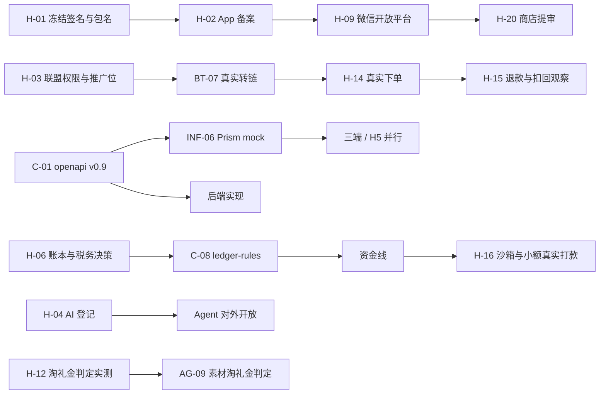

# 开发任务拆解 v1.1（对应 PRD v2.1 · 2026-09-29）

> **状态：参考文档，不再维护（2026-09-30）。** 唯一生效的规划是 `规划/`（业务规则以 `规划/08_业务规则/` 为准）。本文中的编号、错误码、流水类型、决策编号可能与 `规划/` 不同，换算见 `规划/08_业务规则/13_命名与编码对照.md`；独有内容已按需并入 `规划/`，见 `规划/00_总览与决策.md` 文档登记。代理不得以本文为开发依据。

> 用法：每行一个任务，粒度 0.5–2 个代理日。代理领取任务时，把「任务」「依据」「验收」三列原样写进任务提示，并在 `specs/<feature>/tasks.md` 登记。
> 「依据」指 PRD v2 的章节号；「验收」里的 AC / AF 编号对应 `acceptance/*.feature`。
> 线与账号：**人** = 调度验收人；**契约** = 契约守护会话（GPT 2 单独会话）；**BT** = 后端·交易（GPT 2）；**BF** = 后端·资金（GPT 2 第二会话）；**AG** = 后端·Agent（GPT 1）；**FE** = H5 + 后台（GPT 1）；**iOS / AND / HM** = Claude 1 / 2 / 3。
> 周次：W0 = 09-29 → 10-04，W1 = 10-05 → 10-11，依此类推（与国庆重叠，外部审批可能顺延）。
> 平台编码一律用字符串枚举（`taobao`、`jd`、`pdd`…，PRD D11）。

## 0. 关键路径

两条最长路径都是人工 / 外部审批，不是代码：**签名 → 备案 → 微信 → 提审**，**权限 → 真实转链 → 真实下单 → 扣回观察**。

---

## 1. 人工与外部事项（H）

| ID | 任务 | 周 | 依赖 | 完成标志 |
| --- | --- | --- | --- | --- |
| H-01 | 冻结三端包名 / Bundle ID / 鸿蒙 bundleName 与正式签名，记录指纹 | W0 D1 | — | 指纹表入 `docs/adr/0001` |
| H-02 | 办理 App 备案；软著加急（名称与上架名一致） | W0 | H-01 | 备案受理号 |
| H-03 | 联盟权限清单逐项提交（新 App 媒体备案、淘宝推广位 ≥ 4、渠道备案、物料搜索、口令解析 / 万能转链、订单与维权 / 处罚、淘礼金创建；京东 subUnionId 与关键词查询；拼多多授权备案与搜索），写明负责人与降级 | W0 D1 | H-01 | 权限看板 |
| H-04 | 对接属地网信办生成式 AI 登记，准备材料；W3 提交 | W0 / W3 | — | 受理回执 |
| H-05 | 花卷云后台填入新 App 全部推广位为"忽略 / 不入库 PID" | W0 | H-03 | 截图存档 |
| H-06 | 与财务 / 税务顾问确定：流水 15 类、舍入、负余额追偿阈值、垫资阈值、提现规则数值、所得类型、代扣与报送方式（D6） | W0–W1 周三 | — | `specs/ledger-rules.md` 签字 |
| H-07 | 决策 D3–D10（淘礼金、登录、比例、主体、C 类口令、供应商、鸿蒙 API 版本） | W0 | — | ADR 0002–0006 |
| H-08 | 单位经济模型（G1）：返利比例、直推比例、淘礼金预算、Agent 成本上限 | W0 | 优券汇近 90 天数据 | 表格签字 |
| H-09 | 微信开放平台（登录、分享）、短信签名、厂商推送、支付宝"转账到支付宝账户"与场景码、实名服务开通 | W0 起 | H-02 | 各项状态看板 |
| H-10 | 收集链接 / 口令 / 素材真实样本 ≥ 200 条（含新旧口令格式、各平台、黑话） | W0–W1 | — | `fixtures/materials/` |
| H-11 | 首批联盟接口录制（搜索、转链、订单时间线：付款 → 收货 → 结算、部分退款、维权、预售） | W1 | H-03、INF-07 | `fixtures/union-recordings/` |
| H-12 | 淘礼金判定实测：≥ 30 条带淘礼金口令，用新 App 推广位转链，找出区分 A/B/C 的字段（G15） | W1 | H-03 | 实测报告 |
| H-13 | 双品牌 relation_id 真机验证：同一淘宝账号在两 App 备案并各下一单 | W1–W2 | H-03、BT-06 | AF-07 结论 |
| H-14 | 真实下单（三平台 × 自购 / 分享 / Agent 场景） | W2 起 | BT-07 | 订单关联率报告 |
| H-15 | 观察退款、维权、扣回（含双11 期间） | W2–W6 | H-14 | 扣回正确率报告 |
| H-16 | 支付宝沙箱打款演练 → 人工小额真实打款 | W4 | BF-09 | 演练记录 |
| H-17 | 信息架构与页面清单（G2）、设计令牌与参考截图（G3） | W0–W1 | — | `design/` |
| H-18 | 法律文本定稿：用户协议、隐私政策（双清单）、返利规则、AI 服务说明（G10） | W3 | 法务 | 三端内置 |
| H-19 | 测试账号与真机矩阵（G13） | W1 | — | 清单 |
| H-20 | 各商店提审材料与提审（G11） | W6–W7 | H-02、H-18 | 审核通过 |
| H-21 | 每周五固定验收（9 项清单，见 §11） | 每周 | — | 周报 |

## 2. 契约与规格（C）

| ID | 任务 | 线 | 周 | 依赖 | 依据 | 验收 |
| --- | --- | --- | --- | --- | --- | --- |
| C-01 | 手写 `contracts/openapi.yaml` v0.9：第 6 章全部 MVP 接口，每个带 example | 契约 | W0 | — | §6 | Prism 可启动；另一家模型审过；人签字 |
| C-02 | `contracts/error-codes.ts` 全集（含 Bridge、Agent 子段） | 契约 | W0 | — | §6 | 每码有含义、客户端动作、可否重试 |
| C-03 | `contracts/enums/*.json`：平台全集与能力标记、订单状态、credit_status、流水 15 类、reason_code、意图、权益、scene | 契约 | W0 | H-06 | §6、§9、§10、§11 | 生成器可产出各端枚举 |
| C-04 | `contracts/bridge.schema.json` + 生成 `bridge.d.ts` | iOS 起草、FE 审 | W0 | — | §7 | 方法分级、超时、能力探测齐全 |
| C-05 | `contracts/agent-stream.schema.json` + 5 条示例流 | AG 起草、iOS 审 | W1 周三 | C-01 | §10.13 | 三端可用示例流开发 |
| C-06 | `contracts/home-schema.json` + golden 样例 4 类 | FE | W1 | — | §12 | 校验器能拒绝非法配置 |
| C-07 | `specs/state-machines/order.json`、`withdrawal.json`（由 PRD 表转写）+ 代码生成器 | BF | W0 | — | §9.3、§11.5 | 生成 `transition()` 与枚举 |
| C-08 | `specs/ledger-rules.md`、`fee-rules.csv`、`commission-examples.csv`（≥ 20 例） | 人 + BF 转写 | W1 周三 | H-06 | §11 | 财务签字 |
| C-09 | `specs/state-machines/{claim,rights,binding}.json`（G7） | BF | W1 | C-07 | §9.4、§9.5 | 人签字 |
| C-10 | `specs/attribution.md`（双品牌归因规则） | 人 | W0 | — | §3 | — |
| C-11 | `specs/platform-matrix.csv`（scheme、包名、跳转优先级、降级） | HM 起草、人真机确认 | W1 | H-19 | §8.2 | 三端 queries 配置由它生成 |
| C-12 | `specs/material-slang.csv`（素材黑话词典首版） | AG + 运营 | W1 | H-10 | §10.6.1 | ≥ 50 条 |
| C-13 | `acceptance/*.feature`：交易、订单、资金、Agent（AF-01～AF-11）、账户、首页 | AND 起草、人签字 | 各功能开工前一天 | — | 各章 | 每条标 @auto / @manual |
| C-14 | `docs/glossary.md`、`docs/adr/0001–0006` | BT / 人 | W0 | — | §16 | — |
| C-15 | 契约分发：tag + 生成物制品 + 自动向三端仓库开升级 PR | 契约 | W1 | C-01、INF-02 | §16 | 原生仓库 CI 显示契约版本 |

## 3. 工程基建（INF）

| ID | 任务 | 线 | 周 | 依赖 | 验收 |
| --- | --- | --- | --- | --- | --- |
| INF-01 | monorepo 脚手架（pnpm + Turborepo，apps / packages / contracts / specs / fixtures / evals） | BT | W0 | — | `pnpm i && pnpm build` 通过 |
| INF-02 | 三端空工程（iOS / Android / 鸿蒙），锁定鸿蒙 API 版本，`docs/vendor/` 文档镜像 | iOS / AND / HM | W0 | H-07 | 空壳可运行 |
| INF-03 | AGENTS.md / CLAUDE.md 分层 + `check-agent-docs.sh` | 人 + BT | W0 | — | CI 校验成对与大小 |
| INF-04 | guard 脚本与 hooks（permissions.deny、PreToolUse、Stop），Claude 与 Codex 共用 | BT | W0 | — | 读 `.env` 被拦截的测试 |
| INF-05 | CI 质量门：契约一致、生成物无漂移、测试、gitleaks、隐藏 Unicode、依赖冷却、迁移 SQL 检查、CODEOWNERS、分支保护 | BT | W0–W1 | INF-01 | 空仓库全绿；故意违规被拦 |
| INF-06 | 本地栈 `pnpm dev:stack`：PG、双 Redis、MinIO、WireMock、Prism | BT | W0 | C-01 | 一条命令起全部依赖 |
| INF-07 | WireMock 录制代理 + 脱敏脚本 + 可注入时钟 `CLOCK_NOW` | BT | W1 | INF-06 | 录制一条转链并回放 |
| INF-08 | 环境：dev / staging / prod；阿里云 RDS PG（PITR）、Redis 两实例、2×ECS + SLB、OSS、KMS | 人 + BT | W1–W3 | — | staging 可部署；prod 备份演练 |
| INF-09 | 自托管 Sentry（国内 ECS）；鸿蒙 EMAS / AGC 接入方案 | BT / HM | W2 | INF-08 | 三端各制造一次崩溃可见符号化堆栈 |
| INF-10 | Metabase 连只读副本；业务看板首版（§14.5） | FE | W4 | BT-12 | 看板可见 |
| INF-11 | 告警通道（钉钉 / 企业微信）与规则（§14.5） | BT | W4 | INF-10 | 触发三种告警演练 |
| INF-12 | 移动端 CI：Maestro（iOS / Android）、arkXtest UiTest（鸿蒙）、截图对比、证据包汇总 | iOS / AND / HM | W1–W2 | INF-02 | PR 自动附证据包 |
| INF-13 | k6 压测脚本与大促预案文档（G12） | BT | W4 | — | 报告入库 |

## 4. 后端·交易（BT）

| ID | 任务 | 周 | 依赖 | 依据 | 验收 |
| --- | --- | --- | --- | --- | --- |
| BT-01 | 网关层：HMAC 签名、时间戳、nonce 防重放；`app_id` 由 Token 推导 | W1 | C-01 | §4.2 A2 | 无签名 / 过期 / 重放返回 4xxxx 的集成测试 |
| BT-02 | 服务端设备 ID 签发 `POST /v1/devices`；三维限流（用户 / 设备 / IP），阈值热改 | W1 | BT-01 | A2 | 改设备 ID 重复请求仍被识别；超阈值被限 |
| BT-03 | 登录：短信、微信、Apple、华为；Token 轮换与 30 秒宽限；吊销 | W1 | C-01 | §6 | AC-AUTH-* |
| BT-04 | 配置、字典、紧急开关接口（ETag + 版本）；开关 ≤ 10 秒生效 | W1 | C-03 | §14.1 | 改开关后 10 秒内生效测试 |
| BT-05 | 商品搜索与详情：淘宝 / 京东 / 拼多多聚合、缓存 5 分钟、敏感类目过滤、平台原始 ID 原样保存 | W1–W2 | H-11 | §8、§10.7 | 回放用例通过 |
| BT-06 | 授权备案：淘宝 relation_id（唯一约束、换绑、解绑）、拼多多授权；备案状态接口；令牌到期巡检 | W1–W2 | H-03 | §8.3 | AC-TRADE-FILING-* |
| BT-07 | 链接服务：`POST /v1/links` 登记 link_id + link_log；`/open` 实时转链、按用户隔离缓存 ≤ 15 分钟、价格复核、未备案返回 3xxxx | W1–W2 | BT-06 | §8.2、§10.5 | AF-06；转链结果不跨用户复用的测试 |
| BT-08 | `parse_input` 识别模块（新旧口令、各平台链接、素材抽取候选）+ `POST /v1/materials/parse` | W1 | H-10 | §10.2 | fixture 识别率 ≥ 98%，平台判断 100% |
| BT-09 | 口令解析 / 万能转链接入（缺权限时降级为"用商品名搜索"） | W1–W2 | H-03 | §10.2 | 回放通过；降级路径测试 |
| BT-10 | 订单同步 worker：参数化窗口、独立水位、回扫、大促模式、乱序保护、**推广位白名单过滤** | W2 | H-11、C-07 | §9.1、§3 | 回放 3 场景逐笔一致；非白名单订单被丢弃并计数 |
| BT-11 | 统一订单模型 + 订单状态机（调用生成的 `transition()`）+ reason_code | W2 | C-07 | §9.2、§9.3 | 状态机模型测试（fast-check）通过 |
| BT-12 | link_log ↔ 订单关联、scene 回填、订单场景判定（自购 / 分享 / 团队） | W2 | BT-07、BT-10 | §9.2 | 真实下单关联率 ≥ 95%（H-14） |
| BT-13 | 维权 / 处罚同步 + 后台 CSV 导入 + 手动同步 | W3 | BT-10 | §9.5 | 回放维权场景生成扣回事件 |
| BT-14 | 订单列表 / 详情接口（预计入账日、原因码）；订单找回申请（第二因子、唯一认领） | W2–W3 | BT-11 | §9.4 | AC-ORDER-CLAIM-* |
| BT-15 | outbox 表 + relay → BullMQ；消费者幂等 | W2 | INF-06 | A8 | 故障注入：relay 中断后恢复不丢不重 |
| BT-16 | 邀请：落地页（锁粉）、绑定上级、邀请码规则 | W3 | BT-03 | §2 分销 | AC-INVITE-* |
| BT-17 | 账号注销：二次校验、余额处置、删除 / 匿名化、SIWA 撤销 | W3 | BT-03 | §15 | AC-ACCOUNT-DELETE-* |
| BT-18 | 实名认证接入（供应商 D9）；未满 18 岁禁提现 | W3 | H-09 | §15 | AC-REALNAME-* |
| BT-19 | 站内消息 + 推送（极光 / 个推）+ 事件订阅（跟单成功、入账、提现结果） | W3 | BT-15 | G5 | 事件 → 推送端到端测试 |
| BT-20 | 首页配置接口 + 发布 / 灰度 / 回滚 | W4 | C-06 | §12 | 非法配置被拒 |
| BT-21 | 风控硬规则（§14.4）+ 黑名单 | W3–W4 | BT-02 | §14.4 | 3 种绕过方式测试 |
| BT-22 | 美团接入 | W7 | H-03 | §8.1 | 回放 + 真实下单 |

## 5. 后端·资金（BF）

| ID | 任务 | 周 | 依赖 | 依据 | 验收 |
| --- | --- | --- | --- | --- | --- |
| BF-01 | `packages/money`：整数分、floor / ceil 舍入、比例（万分之一）运算 | W1 | C-08 | §6、§11.3 | 属性测试：舍入方向与尾差归属 |
| BF-02 | 账本：账户、凭证、分录（只增不改）、唯一业务键、行锁；DB CHECK 约束 | W1–W2 | C-08 | §11.1 | 不变量：余额 = 分录合计；借贷平衡 |
| BF-03 | 返利 / 分佣计算器 + 规则版本快照 | W2 | BF-01、C-08 | §11.3 | `commission-examples.csv` 全部通过 |
| BF-04 | 入账引擎：观察期满 → CREDITED；同一子订单只入账一次；SETTLE_ADJUST | W3 | BT-11、BF-02 | §11.4 | 回放时间线（时钟注入）通过 |
| BF-05 | 扣回与负余额：CLAWBACK、负余额禁提、后续入账先抵扣、追偿清单 | W3 | BF-04 | §11.4 | 属性测试：扣回 ≤ 已入账 |
| BF-06 | 提现申请：规则校验、冻结、`out_biz_no` 生成、资金幂等唯一约束 | W3 | BF-02、BT-18 | §11.5–11.6 | 并发提现不超额（真实 PG 并发测试） |
| BF-07 | 提现状态机（生成的 `transition()`）+ 审核（二次验证、审核 ≠ 打款） | W3 | C-07 | §11.5 | 模型测试覆盖全部迁移 |
| BF-08 | 打款 worker（独立部署、唯一持有私钥）：转账、超时只查询不重打、24 小时转人工 | W3–W4 | BF-07、H-09 | §11.5 | 故障注入：超时、系统错误、明确失败三类 |
| BF-09 | 批量打款 + 线下打款登记（必填流水号） | W4 | BF-08 | §11.5 | 沙箱演练（H-16） |
| BF-10 | 对账：平台订单 vs 内部、支付宝账单 vs 提现、账本不变量每日任务；差错单 | W4 | BF-04、BF-08 | §11.7 | 差异 0；制造差异能告警并冻结 |
| BF-11 | 垫资敞口计算 + 告警 + 暂停入账开关 | W4 | BF-04 | §11.4 | 超阈值告警测试 |
| BF-12 | 税务预留：TAX_WITHHOLD 分录、年度累计台账、报送字段 | W4 | H-06 | §11.8 | 按 D6 结论的算例通过 |
| BF-13 | 钱包接口：两账户余额、流水、提现记录 | W3 | BF-02 | §6 | AC-WALLET-* |

## 6. 后端·Agent（AG）

| ID | 任务 | 周 | 依赖 | 依据 | 验收 |
| --- | --- | --- | --- | --- | --- |
| AG-01 | 会话接口：建会话、发消息（SSE）、续传、取消、心跳 | W2 | C-05 | §10.13 | SSE 契约测试；断线续传测试 |
| AG-02 | 模型网关：千问锁定快照、关闭思考、超时、备用模型、无模型降级 | W2 | — | §10.15 | 故障注入切换测试 |
| AG-03 | 编排器：预处理结果 + 意图 / 条件抽取（单次 function calling）+ 工具循环上限 | W2–W3 | AG-02、BT-08 | §10.1、§10.3 | 评测：意图与参数正确率 |
| AG-04 | 工具：`resolve_link`、`get_rebate_quote`、`search_products`（含 benefits 过滤、平台推断）、身份参数服务端注入 | W3 | BT-05、BT-07、BT-09 | §10.4 | AF-01～AF-04 |
| AG-05 | `register_links` 与出卡：卡片由服务端从工具结果组装；首条同步转链，其余后台预转链 | W3 | BT-07 | §10.5、§10.7 | 卡片数值与接口一致率 100% |
| AG-06 | 多轮：结果集存储、指代解析、条件修改、换一批 | W3 | AG-03 | §10.8 | AF-05 |
| AG-07 | 护栏：text 后置过滤、untrusted 包裹、禁用工具清单 CI grep、敏感类目、内容安全审核 | W3 | AG-03 | §10.14 | AF-08；注入集拦截 100% |
| AG-08 | 素材结构化 + 黑话归一化 | W3 | C-12 | §10.6.1 | AF-11 |
| AG-09 | 素材淘礼金 A/B/C 判定 + 出卡规则 + 双价格展示 + 原因码 `ORDER_ATTR_OTHER_TLJ` | W3–W4 | H-12、AG-05 | §10.6.1 | AF-09、AF-10 |
| AG-10 | 我方淘礼金（D3 通过时）：商品池检索、领取接口（登录、备案、限次、风控、预算）、领取记录 | W4 | H-07、BT-21 | §10.6 | AF-02、AF-03；超预算自动停发 |
| AG-11 | 订单相关工具：`list_my_orders`、`explain_order`、`prefill_claim`；规则答疑 `search_rules`；`handoff_to_human` | W3–W4 | BT-14 | §10.4 | 评测子集通过 |
| AG-12 | trace 落 PG + 点踩 + 成本统计 + 日预算熔断 | W3 | AG-03 | §10.15–10.16 | 预算 100% 时降级测试 |
| AG-13 | 评测集首版 ≥ 300 条 + 回放评测 CI 门禁 + 夜间在线评测 | W2–W3 | H-10 | §10.12 | 门槛达标 |
| AG-14 | 失败降级矩阵实现（§10.9） | W4 | AG-04 | §10.9 | 每种失败各一个测试 |
| AG-15 | 白名单开关（登记前）+ 公示 / 标识 / 同意所需接口字段 | W4 | H-04 | §10.16 | 非白名单用户看不到入口 |

## 7. H5（FE）

| ID | 任务 | 周 | 依赖 | 依据 | 验收 |
| --- | --- | --- | --- | --- | --- |
| H5-01 | `packages/bridge-sdk`（由 `bridge.d.ts` 生成）+ 能力探测与降级 | W1 | C-04 | §7 | 单测覆盖全部方法 |
| H5-02 | 桥一致性自动测试页（逐个调用并输出 JSON） | W1 | H5-01 | §7 | 三端 UI 测试加载该页断言 |
| H5-03 | 返利规则、帮助中心、公告 | W2 | — | §2 | 页面冒烟 |
| H5-04 | 订单明细、收益明细（用 `getH5Token`） | W2–W3 | BT-14、BF-13 | §4.3 | 登录态与脱敏正确 |
| H5-05 | 静态邀请说明页 + 分享 | W3 | BT-16 | §2 | 分享三端可用 |
| H5-06 | 白屏监控上报 | W3 | INF-09 | §14.5 | 人为白屏可在后台查到 |

## 8. 管理后台（ADM，FE）

| ID | 任务 | 周 | 依赖 | 依据 | 验收 |
| --- | --- | --- | --- | --- | --- |
| ADM-01 | Refine 骨架 + CASL（角色 × 操作矩阵、数据范围）+ 操作日志 + 二次验证 + IP 限制 | W2 | C-01 | §13.2 | 越权操作被拒的测试 |
| ADM-02 | 用户查询 / 用户 360（脱敏，全量需权限并审计）、黑名单、注销处理 | W3 | BT-03 | §13.1 | AC-ADM-USER-* |
| ADM-03 | 商品池（联盟入库、链接 / 口令解析入库并套 A/B/C 判定）、上下架 | W3 | BT-05、AG-09 | §13.1 | C 类素材不能入池 |
| ADM-04 | 首页 JSON 编辑器 + schema 校验 + 三端预览截图 + 灰度 / 回滚 | W4 | BT-20 | §12 | 非法配置被拒；回滚测试 |
| ADM-05 | 订单查询、手动同步、找回认领、维权 / 处罚导入、差错单 | W3–W4 | BT-13、BT-14 | §13.1 | AC-ADM-ORDER-* |
| ADM-06 | 提现审核（二次验证、审核 ≠ 打款）、批量打款、线下打款登记 | W4 | BF-07、BF-09 | §11.5、§13.2 | 职责分离测试 |
| ADM-07 | 余额流水与导出、对账报表、垫资敞口、实名信息（财务可见全量） | W4 | BF-10、BF-11 | §13.1 | 导出与账本一致 |
| ADM-08 | 配置中心：返利比例与规则版本、分享域名池、邀请码规则、文案、bridge_allowlist、平台矩阵 | W3 | BT-04 | §13.1 | 修改有版本与日志 |
| ADM-09 | 紧急开关页 + 版本与强更 + 字典 | W3 | BT-04 | §14.1 | 演练"暂停打款" |
| ADM-10 | Agent：会话 / trace 查询、点踩列表、prompt 版本、工具开关、黑话词典维护 | W4 | AG-12 | §13.1 | — |
| ADM-11 | 淘礼金池、预算、领取记录（D3 通过时） | W4 | AG-10 | §10.6 | — |

## 9. 三端原生（iOS / AND / HM）

同一任务三端各做一次，任务 ID 加端前缀（如 `iOS-M05`、`AND-M05`、`HM-M05`）。鸿蒙差异列在最后一列。

| ID | 任务 | 周（iOS / AND） | 依赖 | 依据 | 验收 | 鸿蒙差异（HM 晚 1–2 周） |
| --- | --- | --- | --- | --- | --- | --- |
| M-01 | 契约生成代码接入（API 客户端、枚举、错误码统一处理） | W1 | C-15 | §6 | 生成物无漂移 | ArkTS 生成器自写模板（待验证） |
| M-02 | 启动、隐私同意与拒绝路径、同意前不初始化 SDK | W1 | H-18 草稿 | §15 | 隐私静态检查通过 | — |
| M-03 | 服务端设备 ID、请求签名、Token 刷新 | W1 | BT-01、BT-02 | §6 | 契约测试 | — |
| M-04 | 登录（短信、微信、Apple / 华为） | W1 | BT-03 | §15 | AC-AUTH-* | 华为账号登录 |
| M-05 | 两类 WebView 容器 + JSBridge（方法分级、origin 白名单、getH5Token） | W1 | C-04 | §7 | 桥一致性页通过 | javaScriptProxy / WebMessagePort |
| M-06 | Tab 与导航、LKG 配置缓存、紧急开关读取 | W1–W2 | BT-04、H-17 | §4.3 | 断网冷启动读 LKG | — |
| M-07 | 搜索、商品详情 | W2 | BT-05 | §8 | Maestro 流 | — |
| M-08 | 粘贴识别（点击触发）→ 查返利 | W2 | BT-08 | §8.4 | 不后台读剪贴板 | PasteButton |
| M-09 | 转链跳转：安装检测、scheme / SDK、降级（复制口令 / H5）、授权回跳自动重试 | W2 | BT-07、C-11 | §10.5 | AF-06 | App Linking；百川鸿蒙版可用性 |
| M-10 | 跟单防呆：跳转提示、回 App「待跟单」卡 | W2 | M-09 | §8.5 | — | — |
| M-11 | Agent 对话页：SSE 流式、6 类卡片、快捷追问、取消、续传、AI 标识、同意弹窗、点赞点踩 | W3–W4 | C-05、AG-01 | §10.13、§10.16 | 示例流 golden 截图 | — |
| M-12 | 订单列表与详情（原因码、预计入账日）、订单找回表单 | W3 | BT-14 | §9 | AC-ORDER-* | — |
| M-13 | 钱包、流水、提现申请、实名认证 | W3–W4 | BF-13、BT-18 | §11 | AC-WALLET-* | — |
| M-14 | 首页按配置渲染 6 种卡片 + 三级兜底 + 单卡隔离 | W4 | C-06 | §12 | home golden 截图对比 | — |
| M-15 | 推送与站内消息、深度链接 | W3 | BT-19 | G5 | 端到端 | Push Kit |
| M-16 | 邀请落地与绑定、分享 | W3 | BT-16 | §2 | AC-INVITE-* | — |
| M-17 | 账号注销入口 | W3 | BT-17 | §15 | AC-ACCOUNT-DELETE-* | — |
| M-18 | 崩溃与性能监控（Sentry / EMAS） | W2 | INF-09 | §14.5 | 符号化堆栈可见 | EMAS / AGC |
| M-19 | 冒烟流与截图基线（Maestro / UiTest） | W2 起持续 | INF-12 | §16.5 | PR 证据包 | arkXtest + hdc |
| M-20 | 内测包与商店材料 | W5（iOS / AND）/ W7（HM） | H-20 | §17 | TestFlight / 内测发放 | — |

## 10. 测试与质量（QA，各线分担）

| ID | 任务 | 线 | 周 | 验收 |
| --- | --- | --- | --- | --- |
| QA-01 | 资金属性测试集（6 条不变量，PR 1 万次、夜间 100 万次） | BF | W2–W3 | 全绿 |
| QA-02 | 真实 PG 并发测试（并发提现、并发结算、BullMQ 重复投递） | BF | W3 | 不变量成立 |
| QA-03 | 回放 E2E：跟单 → 预估 → 收货 → 入账 → 扣回 → 提现（时钟注入压缩为 1 天） | BT + BF | W4 | 全链路通过 |
| QA-04 | staging 每日"一个月压缩一天"全流程 + 生产只读不变量 SQL | BF | W4 起 | 差异 0 |
| QA-05 | 三端 JSBridge 一致性与首页 golden 跨端对照报告 | iOS / AND / HM | W2 起 | 三端一致 |
| QA-06 | Agent 回放评测门禁 + 夜间在线评测 + 周趋势 | AG | W3 起 | 门槛达标 |
| QA-07 | 故障注入演练：联盟超时、千问超时、支付宝超时、Redis 队列中断、开关切换 | BT / AG / BF | W4 | 演练记录 |
| QA-08 | k6 压测（峰值 3 倍：搜索、转链、Agent SSE、同步） | BT | W4 | P95 与错误率达标 |
| QA-09 | 隐私合规自检（SDK 初始化时机、权限、剪贴板、清单一致） | 三端 | W4 | 自检报告 |

## 11. 每周验收门与周五清单

| 周 | 验收门（全部满足才进入下周） |
| --- | --- |
| W0 | C-01～C-03、C-07 签字；INF-01～INF-06 完成；CI 在空仓库全绿；H-01、H-03 已提交 |
| W1 | 三端桥一致性页通过；`parse_input` fixture ≥ 98%；登录三端可用；首批录制入库 |
| W2 | 交易 AC 自动化 ≥ 80%；真实转链成功；订单回放 3 场景通过；AF-07 隔离验证开始；价格快照开始写入（WX-01） |
| W3 | **go / no-go**；资金属性测试全绿；Agent 评测过门槛；AF-01～AF-06 通过 |
| W4 | 回放全链路通过；沙箱打款与小额真实打款演练；首页"改配置不发版"证据；Android / iOS 分享入口 AC-SHARE 通过 |
| W5 | M1：iOS / Android 内测发放；人工打款演练 |
| W6 | 双11 期间无资金差异；鸿蒙追平 |
| W7 | M2：鸿蒙冒烟通过；提审 |
| W8 | M3：公开上架 |

**周五清单**（H-21）：① AC 通过率（自动 / 人工分开）② 三端证据包 ③ 契约版本与各端落后情况 ④ 回放场景新增与失败 ⑤ 账本不变量夜间报告 ⑥ Agent 评测趋势与成本 ⑦ 返工率、CI 首次通过率、PR 周期 ⑧ 外部审批看板 ⑨ 下周是否砍项。

**砍项顺序**（W3 go / no-go 时如不达标，按此顺序后移）：我方淘礼金（AG-10、ADM-11）→ iOS 分享扩展（SH-02）→ 素材淘礼金 B 类判定（仅保留 C 类如实说明）→ 邀请绑定 → 鸿蒙 Agent 页 → 首页灰度。资金、归因、合规相关任务不砍。

---

## 12. Agent 能力扩展：外部入口与订阅任务（PRD 10.17–10.21，v2.1 新增）

### 12.1 人工与外部（补充 H）

| ID | 任务 | 周 | 依赖 | 完成标志 |
| --- | --- | --- | --- | --- |
| H-22 | 实测各联盟接口配额、限频、批量上限（G17） | W1 | H-03 | 配额表入 `specs/union-quotas.csv` |
| H-23 | 淘宝商品 ID 稳定性实测（G19）：同一商品在不同时间、不同接口返回的 ID 是否一致 | W1–W2 | H-03 | 实测报告；定下 `item_key` 规则 |
| H-24 | 安卓各厂商与华为推送消息分类资质申请（服务 / 订阅 / 营销），核实每日上限（G18） | W0–W2 | H-09 | 资质通过记录 |
| H-25 | 决策 D12（iOS 分享扩展）、D13（频控初值）、D14（服务号或企业微信） | W0 / P1 开工前 / W8 | — | ADR |
| H-26 | 运营录入大促日历（双12、年货节等时间点） | W10 | WT-12 | 日历数据 |
| H-27 | 微信服务号或企业微信资质与接口开通 | W8–W10 | D14 | 开通记录 |

### 12.2 MVP 预埋（与主线并行，W1–W4）

| ID | 任务 | 线 | 周 | 依赖 | 依据 | 验收 |
| --- | --- | --- | --- | --- | --- | --- |
| WX-01 | `price_snapshot` 表（按月分区）+ 写入钩子：搜索、详情、查返利、转链的联盟返回在价格或库存变化时写入 | BT | W2 | BT-05、BT-07 | 10.20、10.21 | 同一商品价格不变时不写新行；变化时写入；不影响接口 P95 |
| WX-02 | 契约预留：`link_log.scene` 扩展枚举；`watch`、`tracked_item`、`tracked_query`、`watch_event`、`notification_pref` 表结构；`create_watch` 等工具 schema（开关关闭）；`watch_confirm` 卡片 schema | 契约 | W1 | C-01、C-05 | 10.21 | oasdiff 与生成物通过 |
| WX-03 | 通知分类与偏好：站内信和推送带分类字段；`GET / PUT /v1/notification-prefs`；三端通知设置页 | BT + 三端 | W3–W4 | BT-19 | 10.19 | 用户关闭某类后该类不再推送（站内信仍在） |
| SH-01 | Android 分享接收：`ACTION_SEND` intent-filter → 识别页 → 完整商品卡 | AND | W3 | BT-08、M-09 | 10.18 | AC-SHARE-01～03 |
| SH-02 | iOS Share Extension：共享钥匙串读登录态、调识别接口、扩展内精简卡、复制返利口令、经 App Group 交接给主 App | iOS | W3–W4 | BT-08 | 10.18 | AC-SHARE-01～03；不使用私有接口 |
| SH-03 | 鸿蒙分享接收（W0 验证可行性后实施） | HM | W5–W6 | BT-08 | 10.18 | AC-SHARE-01～03 |
| SH-04 | 分享入口的 `scene=share_ext` 归因与看板维度 | BT | W3 | BT-12 | 10.18 | 看板可按 share_ext 查看转化 |

### 12.3 P1-a 订阅任务服务与降价 / 有券 / 到货提醒（W9–W10）

| ID | 任务 | 线 | 依赖 | 依据 | 验收 |
| --- | --- | --- | --- | --- | --- |
| WT-01 | 契约定稿：watches 接口、watch_event、通知事件、`watch_confirm` / `watch_list` 卡片 | 契约 | WX-02 | 10.19 | 人签字 |
| WT-02 | 数据迁移：watch、tracked_item、tracked_query、query_seen_item、watch_event、notification | BT | WT-01 | 10.20 | 迁移 SQL 检查通过 |
| WT-03 | 跨用户去重：订阅数维护；检索条件规范化与哈希 | BT | WT-02 | 10.20 第 2 条 | 1000 个用户盯同一商品只产生 1 个 tracked_item |
| WT-04 | 调度器 + 配额分配器：分层频率、`next_fetch_at` 拉取、平台日预算、优先级、预算不足降级 | BT | WT-03、H-22 | 10.20 第 3 条 | 模拟配额耗尽时，实时操作不受影响、冷层降级并告警 |
| WT-05 | 批量抓取器（淘宝 / 京东 / 拼多多），失败不产生事件，连续 24 小时失败置为 unavailable | BT | WT-04 | 10.20 第 4、5 条 | 回放测试 |
| WT-06 | 判定器：目标价 / 降幅 / 新低 / 有券 / 到货；两次观测一致；冷却 24 小时 | BT | WT-05 | 10.19、10.20 第 5 条 | WA-01、WA-02；属性测试：抖动不重复提醒 |
| WT-07 | 发送前复核（快照早于 30 分钟即重查），抑制并记录 `stale_alert_suppressed` | BT | WT-06 | 10.20 第 6 条 | WA-03 |
| WT-08 | 通知服务：合并摘要、分类频控、免打扰、通道路由、厂商分类、发送时登记 link_id | BT | WX-03、WT-07、H-24 | 10.19 通知策略 | WA-05；scene 归因正确 |
| WT-09 | watches 接口（增删改查、续期、上限 20 个） | BT | WT-02 | 10.19 | AC-WATCH-* |
| WT-10 | Agent 工具 `create_watch` / `list_watches` / `cancel_watch`：只出确认卡、用户确认后建任务；评测集增加 ≥ 80 条提醒类用例 | AG | WT-09 | 10.4、10.19 | WA-04；参数正确率 ≥ 95% |
| WT-11 | 三端：商品卡「降价提醒」按钮、`watch_confirm` 卡、「我的提醒」页、提醒落地页 | iOS / AND / HM | WT-09 | 10.19 | Maestro / UiTest 流通过 |
| WT-12 | 后台：提醒监控（有效数、抓取量、配额、误报率）、大促日历管理、按用户查看提醒（脱敏） | FE | WT-08 | 10.20 第 12 条 | — |
| WT-13 | 监控与告警：误报率 > 2%、配额 > 90%、抓取失败率异常 | BT | WT-08 | 14.5 | 告警演练 |
| WT-14 | 压测：5 万个提醒（约 1.5 万个去重商品）在时钟压缩下跑 3 天 | BT | WT-08 | 10.20 | 配额内完成；无重复提醒 |

### 12.4 P1-b / c / d 与外部集成（W11–W15）

| ID | 任务 | 线 | 周 | 依赖 | 依据 | 验收 |
| --- | --- | --- | --- | --- | --- | --- |
| WT-15 | 大促日历：`promo_event`、订阅、准时提醒、三端「加入系统日历」（需授权） | BT + 三端 | W11 | WT-08、H-26 | 10.19 | 提醒准时率 100% |
| WT-16 | 定时精选：保存的检索条件 + 排序 + 模板文案（可选批量生成摘要）；每用户最多 3 个，最短间隔 1 天 | BT + AG | W12–W13 | WT-08 | 10.20 第 9 条 | 关闭个性化后不再生成 |
| WT-17 | 复购提醒：历史订单品类间隔中位数 → 建议卡 → 用户确认后建提醒；个性化授权开关 | BT + 三端 | W12–W13 | WT-09 | 10.20 第 10 条 | 未授权用户不产生建议 |
| WT-18 | 上新提醒：首次运行只建基线；新条目规则过滤 + 批量小模型相关性判定（按商品缓存） | BT + AG | W14–W15 | WT-03 | 10.20 第 8 条 | 抽检相关性 ≥ 90% |
| EXT-01 | 微信身份与 App 账号绑定（`POST /v1/wechat/bind`） | BT | W12 | H-27 | 10.18 | 绑定 / 解绑测试 |
| EXT-02 | 微信查券机器人：收到链接 / 口令 / 素材 → `parse_input` → 回复返利口令或短链（`scene=wechat_bot`）；未绑定时回复绑定引导 | BT | W12–W14 | EXT-01 | 10.18 | 机器人来源订单归属正确 |
| EXT-03 | 微信订阅消息通道接入通知服务 | BT | W14–W15 | WT-08、EXT-01 | 10.18 | 未订阅不发送 |
| EXT-04 | 桌面小组件（关注列表、大促倒计时） | 三端 | P2 | WT-11 | 10.18 | — |
| EXT-05 | 系统助手意图（App Intents、小艺意图框架、AppFunctions） | 三端 | P2 | — | 10.18 | — |
| EXT-06 | MCP 服务：查返利、转链、创建提醒；OAuth 绑定；按调用方限流；只返回 link_id 形态入口 | BT + AG | P2 | WT-09 | 10.18 | 安全评审通过 |

### 12.5 对前文的调整

- **§11 周验收门**：W2 增加"价格快照开始写入（WX-01）"；W4 增加"Android / iOS 分享入口 AC-SHARE 通过（SH-01、SH-02）"。
- **砍项顺序**更新为：我方淘礼金（AG-10、ADM-11）→ **iOS 分享扩展（SH-02）** → 素材淘礼金 B 类判定 → 邀请绑定 → 鸿蒙 Agent 页 → 首页灰度。WX-01～WX-03 属于预埋，不砍（事后补的代价更高）。
