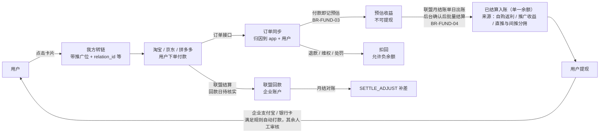

# 返利 App 规划文档 · 01 需求规划

2026-09-30 · 2026-10-01 按 D8 变更补间推（§3、F-INV-04/09、F-ADM-21）· 2026-10-01 按平台预留比例变更补 §3 基数与 F-ADM-22 · 2026-10-01 按拍板第二批（`docs/changes/20261001-拍板第二批.md`）与 9-30 拍板第一批回写：月结入账、自动到账、银行卡、劳务协议、账号并入、客服工单、首页人群与弹窗、跳转与版本门槛等（逐处注「拍板第二批 编号」）· 2026-10-01 晚按拍板第二批 §8 补充决定（ADD-01～07）回写：单一余额、后台权限点与账号管理页（F-ADM-02、F-ADM-24）、资金操作一人完成、取消用户换绑、站长联盟授权到期管理（F-ADM-16）、经营数值上线前后台填写、余额为负不能注销 · 同日按 §8 ADD-08 改写 J1 步骤 2、F-LINK-03、F-ADM-16：站长授权过期或失效期间淘宝未绑定用户不能下单、不提供无返利购买，每日探测与站长短信告警 · 2026-10-03 按功能对照补缺第 1 批（`docs/changes/20261003-功能对照补缺.md`；缺口编号写作「功能对照 G-xx」，待确认题写作「功能对照 Q-xx」）回写：§4.2 新增 `LinkLanding`、ExternalPage 用途收窄，J1 步骤 2，F-ACC-02～04、06、07，F-HOME-09，F-LINK-03、07 与新增 F-LINK-11，新增 F-INV-10、F-SHARE-07，F-OBS-01、03，§7.4 · 2026-10-03 按功能对照补缺第 2 批（同一变更记录「第 2 批」，功能对照 G-09～G-21）回写，逐处注「功能对照 G-xx」；同日按评审修改（变更记录 §2.8） · 2026-10-03 按功能对照补缺第 3 批（同一变更记录「第 3 批」，功能对照 G-22～G-34）回写：§4.2 新增「入口限制」，F-ACC-02、F-PRIV-01、06、08，F-HOME-03、09，F-LINK-06，F-CFG-03，新增 F-MSG-07，§7.4，逐处注「功能对照 G-xx」；同日按评审与编排会话裁定修改（变更记录 3.9）：§4.2「入口限制」只留摘要（取值移入 BR-ID-10 细则）、`Messages` 与 `HomePreview` 行，F-HOME-09、F-MSG-03、F-CFG-03、F-ACC-02 的客服说明；第 2 轮评审后（变更记录 3.10）：`ForceUpdate` 行与 F-CFG-03（强更页的隐私政策与注销入口、受限会话） · 阶段与决策编号见 00；业务规则、术语、话术以 08 为准（本文只写 BR 编号 + 一句话，不重复数值与公式）；平台能力见 09（CAP-xxx）；阶段验收见 10（AC-Sn-xx）

2026-10-03 功能对照补缺第 5 批（`docs/changes/20261003-功能对照补缺.md`「第 5 批」，功能对照 G-66～G-96）回写：§4.2 `Withdraw`、`WithdrawRecords`（可选参数 `withdrawal_id`）、`PayoutAccount`、`PrivacyCenter`、`About`、`ExternalPage`、`InvitedFriends` 行与「入口限制」段；J6 第 2 步；新增 F-ACC-14（P1）、F-INV-11（P1）、F-SHARE-08、F-CFG-09、F-OBS-06（可选）；F-HOME-02、F-HOME-08、F-PRIV-01、F-PRIV-04、F-OBS-01、F-OBS-02、F-ADM-17；§7.2、§7.5；逐处注「功能对照 G-xx」。

---

## 1. 定位与差异化

**一句话**：跨淘宝、京东、拼多多，帮你找到有返利的商品，告诉你券后价和预估返后价，并盯住返利有没有入账。

| 用户问题 | 体验目标 | 本产品 |
| --- | --- | --- |
| "这个链接/口令能返多少" | 减少查券步骤 | 粘贴即出卡：券、券后价、预估返利 |
| "50 块以内的洗发水""有大额券的牛奶" | 用自然语言表达条件 | 在淘宝/京东/拼多多联盟商品里找，只出有返利的卡 |
| "线报里的淘礼金能领吗" | 清楚说明能力边界 | 首版说明未接入、按 unknown 展示普通报价；接入后再提供已验证的权益判断（D7） |
| "返利怎么还没入账""订单丢了" | 看得懂状态、知道如何处理 | 按订单给出原因码和预计结算月份，预填找回 |
| "我什么时候能提现" | 找到提现条件与入口 | 规则答疑 + 钱包状态 |

**边界**：推荐、转链、跳转、跟单、入账、提现。不代下单、不代支付、不自动领券、不自动跳转；Agent 不做闲聊陪伴、不做穿搭种草类泛推荐；送礼类需求按找货处理，「哪个好」「适合吗」只按标题给 2 句提示；只拒答问诊、用药、法律、投资建议，找货按禁售清单过滤（拍板第二批 AI-07、AI-15）。

**产品价值**（D25）：自主开发带来持续改进体验的能力；Agent 是核心创新方向，帮助用户表达需求、找到商品、理解优惠和解决订单问题。竞争优势作为持续验证的产品目标；文案用词按 BR-PRICE-18、BR-TEXT-13，不以未经核实的竞品能力或价格断言支撑定位。

**目标人群**（D25，2026-09-30 用户确认）：既包括没有用过返利产品的用户，也包括已有返利经验的用户。新用户侧重理解优惠、授权与返利过程；老用户侧重操作效率、信息透明和订单服务。优券汇、私域群与应用商店是可用渠道，不把目标用户限定为优券汇用户。

---

## 2. 用户与角色

| 角色 | 说明 | 主要端 |
| --- | --- | --- |
| 游客 | 同意隐私政策后未登录 | App |
| 基本模式用户 | 拒绝隐私政策；首页、搜索、详情只读，不初始化 SDK（BR-ID-11） | App |
| 会员 | 已登录；可转链领返利、查订单 | App、H5 |
| 已绑手机会员 | Agent 查订单、绑定上级、邀请；Agent 额度见 BR-ID-03 | App |
| 已实名会员 | 可提现 | App |
| 推广者 | 任何会员通过"分享"转链后即成为推广者；推广收益与自购返利进同一余额，流水按来源区分（拍板第二批 §8 ADD-06） | App |
| 超级管理员 | 拥有全部后台权限；创建后台账号并按权限点逐项勾选（F-ADM-24）；资金操作一人即可完成，须二次验证、写审计（拍板第二批 §8 ADD-04、ADD-05） | 后台 |
| 其他后台账号 | 运营、客服、财务、审计等由超管按权限点勾选（权限点清单见 04 §11），不设固定角色模板（ADD-04） | 后台 |

---

## 3. 业务模型与资金流

**分账口径**（D8）：

- 基数 `B`：联盟口径推广者预估收入（已扣技术服务费），先扣所选规则版本中该平台的预留比例后得出；预留比例按平台在后台设置，改后只对之后付款的订单生效；报价同样先扣（BR-CALC-02、BR-CALC-20）。
- 公式与受益人：自购单本人 + 直推上级，分享单分享者 + 其上级；计酬最多两级，间推（上级的上级）由规则版本开关控制、默认关闭（BR-CALC-05、BR-INV-12）；余额归平台（BR-CALC-04、BR-CALC-24、BR-INV-13）。
- 比例按平台 × 等级 × 订单类型配置，合计上限发布时校验（BR-CALC-06、BR-CALC-07）；每份向下取整、尾差归平台（BR-CALC-08）。
- 快照生成时点与不可变范围见 BR-CALC-10（C-06 默认处理）。
- 自购与分享报价口径按平台不同，须分别估算；拼多多 75% 为参考值，待核实（BR-CALC-17）。
- 我方淘礼金订单的返利见 BR-CALC-19；平台补贴见 BR-CALC-18、BR-CALC-25。

**垫付营运资金**：入账时点见 BR-FUND-04，联盟回款日待核实（CAP-*-08），敞口与入账开关见 BR-FUND-20；余额水位见 `02_系统架构.md` 第 8 节。

---

## 4. 信息架构

### 4.1 底部 Tab（三端一致）

| Tab | 内容 | 游客 |
| --- | --- | --- |
| 首页 | 顶部搜索框（右侧"问 AI"按钮）+ 配置卡片 + 联盟物料信息流（混合三平台，拍板第二批 TRADE-15） | 可用 |
| AI 助手 | Agent 对话（助手名称「凑狸 AI 助手」，简短口语、不用表情，拍板第二批 AI-22）；空态 4 个示例问题（后台可配） | 可找货看卡（BR-ID-03）；购买、查订单要登录 |
| 订单 | "自购""分享"两个子 Tab；顶部"找回订单"入口 | 引导登录 |
| 我的 | 昵称（头像用默认，拍板第二批 OPS-13）；我的邀请码，邀请人只显示「已绑定」，不显示等级（OPS-20）；余额与【提现】（单一余额，ADD-06）；预估收益与预计结算月份（BR-TEXT-01、BR-FUND-18）；淘宝/拼多多授权状态；邀请好友；帮助中心；联系客服；设置 | 引导登录；另保留【设置】与帮助中心入口，游客无需登录即可进入设置、隐私中心、协议、关于、帮助（BR-ID-02 细则「未登录时的隐私入口」，功能对照 G-18） |

Tab 文案和图标由 `/v1/config` 下发；Tab 结构可配放 P2。Agent 入口受 `agent.enabled` 控制：登记号填好前只对内部测试名单开放，填好即对所有人（含游客）开放（D16，拍板第二批 AI-06）；未开放或关闭时 AI 助手 Tab 替换为"搜索"。

**Agent 情境入口**（打开 AgentChat 时带 `context`）：商品详情"问问 AI"→ `{product_key}`；剪贴板提示条"让 AI 帮我看看"→ `{text}`；订单详情页内"问问 AI"→ `{order_id}`。订单详情的"为什么没返利？"在详情页直接显示原因，不进 AI、不扣次数（拍板第二批 AI-09）。

### 4.2 页面清单

实现方式：**N** = 三端原生；**H** = H5（三端共用，在可信容器中打开）；**A** = 管理后台。路由名是 JSBridge `nav.open`（04 §9）与深链使用的唯一页面名，写入 `contracts/routes.json`，路由表把页面名映射到原生页或 H5 URL，所以一个页面从 H5 迁回原生时调用方不用改。

本表统一记录逐页实现方式，00 范围表与 03 端职责只作摘要。保留原生壳的方向按 D28；页面实现可按 D27 调整，调整时同步本表、路由与对应开发任务。具体语言、框架、WebView 和桥的选型见 03 §1.2、§3.3、§5。

| 路由名 | 页面 | 实现 | 阶段 | 说明 |
| --- | --- | --- | --- | --- |
| `Launch` | 启动 + 隐私首启弹窗 | N | M-内测 | 同意前不发业务请求 |
| `BasicMode` | 基本模式 | N | M-内测 | 首页、搜索、详情只读（BR-ID-11）；可进入精简的设置、隐私中心（只读清单）、协议、关于、帮助，并显示【开启完整功能】（BR-ID-02 细则，功能对照 G-18） |
| `Login` | 登录（手机号/微信/Apple；华为账号 M-公开，F-ACC-04） | N | M-内测 | 登录成功回到来源页并恢复 `pending_action`；第三方空号并入老号见 F-ACC-12；页面提供【设置】入口与「登录遇到问题」（BR-ID-02 细则，功能对照 G-18） |
| `BindPhone` | 绑定手机号 | N | M-内测 | 邀请、Agent 查订单、Agent 超额度时引导（BR-ID-02）；手机号属老账号且本号为第三方空号时引导并入（F-ACC-12） |
| `Home` | 首页 | N | M-内测 | SDUI |
| `Search` | 搜索与结果 | N | M-内测 | 默认 Tab 按 UI 稿，稿出前淘宝（拍板第二批 TRADE-15） |
| `ProductDetail` | 商品详情 | N | M-内测 | 参数 `platform`、`product_key`；内测期隐藏【分享】（拍板第二批 TRADE-21） |
| `AuthSheet` | 平台授权说明半屏 | N | M-内测 | 文案取 `config.auth_tips[platform]` |
| `JumpTip` | 下单须知浮层 | N | M-内测 | 每用户每平台一次（BR-ATTR-21） |
| `AgentChat` | AI 助手 | N | M-内测 | 参数 `context` |
| `AgentConsent` | AI 单独同意弹窗 | N | M-内测 | |
| `OrderList` | 订单列表（自购/分享） | N | M-内测 | 推送落地页；每项含商品图、实付金额、件数、订单号（自购单显示完整订单号并可复制，分享单显示脱敏订单号、不可复制；负责人 2026-10-03，docs/changes/20261003-拍板第三批.md §2），按付款时间倒序（拍板第二批 TRADE-06）；能查多久的订单由配置决定，默认不限制，设了范围时列表底部提示更早的订单联系客服（BR-ID-30 细则「订单类记录」，功能对照 Q-19 默认） |
| `OrderDetail` | 订单详情（时间线、原因码与说明、预计结算月份） | N | M-内测 | 文案 BR-TEXT-02、BR-TEXT-04；"为什么没返利？"直接显示原因（AI-09） |
| `FindOrder` | 订单找回（表单 + 记录） | H | M-内测 | 规则常改；表单按所选平台给出订单号与付款日期的填写提示，并链接到帮助中心的分平台图文指引（BR-ATTR-17 细则「找回页的填写指引」，功能对照 G-15） |
| `Me` | 我的 | N | M-内测 | 固定原生布局 |
| `Wallet` | 钱包（单一余额：可提现、预估收益与预计结算月份、冻结中、待抵扣；不分自购与推广账户，流水标明来源，拍板第二批 §8 ADD-06） | N | M-内测 | 字段口径 BR-FUND-18，术语 BR-TEXT-01 |
| `Withdraw` | 提现申请 | N | M-内测 | 二次验证；首次提现前签劳务协议（`LaborAgreement`）；提交后不能自行撤销，需联系客服（拍板第二批 FUND-20）；每次进入先取规则并按 block_code 引导到 RealName / PayoutAccount / LaborAgreement，前置完成后回到本页、保留金额、不自动提交（BR-WDR-07 细则，功能对照 G-12）；页头显示可提现余额与今日、本月还可提次数，【全部提现】填服务端给的本次最多可提金额，输入金额后显示服务端预估的手续费、代扣个税与预计到账（只显示与当前账号、页面和输入金额都对得上的最新一次估算，输入一变先显示「计算中…」，第 1 轮评审后补），页底链接提现规则文章；提交成功后进入该单详情并刷新钱包（BR-WDR-04 细则「提现页的金额输入与提交后去向」，2026-10-03 功能对照 G-72） |
| `WithdrawRecords` | 提现记录 | N | M-内测 | 可选参数 `withdrawal_id`：打开时定位到本人的这张提现单并展开详情（提交成功后进入详情时用，提现类站内信的跳转也可以用；不是本人的单按不存在处理，只显示列表），2026-10-03 功能对照 G-72；详情里已到账的单显示可复制的交易流水号（BR-WDR-25 细则，功能对照 G-70） |
| `Ledger` | 收益明细 / 余额流水 | H | M-内测 | 邀请分佣流水的名称与时间（只显示到日）按 BR-TEXT-19（拍板第二批 OPS-18） |
| `Earnings` | 收益看板 | H | M-公开 | 自购、分享两栏看今日 / 昨日 / 本月 / 上月的付款笔数、预估、已结算；邀请分佣只看本月、上月的金额合计，没有笔数与明细；入口在钱包页与「我的」页，开关关闭时隐藏；口径 BR-FUND-25（待决策，按功能对照 Q-10 默认），文案 BR-TEXT-01（F-WDR-14） |
| `RealName` | 实名认证 | N | M-内测 | 单独同意 |
| `PayoutAccount` | 收款账号（支付宝 / 本人借记卡，BR-WDR-02） | N | M-内测 | 二次验证；银行卡绑定做三要素核验（拍板第二批 FUND-03）；收款人姓名由用户填写，须与实名姓名一致（BR-WDR-02 ①）；已绑定的账号只显示脱敏信息（支付宝 138****5678 或 zh***@example.com，银行卡「招商银行 尾号 1234」）与本月还能变更的次数（BR-ID-33 细则，2026-10-03 功能对照 G-71） |
| `LaborAgreement` | 劳务协议签署 | N | M-内测 | 提现流程内展示全文、主动勾选后签署；只能原生，H5、桥、Agent 不得代签（BR-WDR-31，拍板第二批 FUND-05） |
| `Settings` | 设置（账号与安全、隐私、通知、关于） | N | M-内测 | 无需登录即可进入；游客只显示非账号条目（隐私中心、协议、关于、帮助），基本模式另显示【开启完整功能】（BR-ID-02 细则，功能对照 G-18） |
| `PrivacyCenter` | 个人信息收集清单、第三方共享清单、撤回同意、关闭个性化推荐、系统权限 | N + H | M-内测 | 清单正文用 H5；无需登录：游客可撤回同意、可关个性化（存本地）；基本模式只读两份清单，【撤回同意】处改为【开启完整功能】（BR-ID-13、BR-ID-02 细则，功能对照 G-18）；原生的「系统权限」一节只列本端实际会申请的权限，显示用途与当前状态，点击跳系统设置（BR-ID-13 细则，2026-10-03 功能对照 G-86） |
| `DeleteAccount` | 账号注销 | N | M-公开 | 余额为负时不能申请，提示「账户有待扣回金额 ¥x」并给联系客服入口（30416，拍板第二批 §8 ADD-07）；冷静期满时余额为负由系统撤销申请（BR-ID-27） |
| `RiskNotice` | 封禁 / 冻结说明页 | N | M-内测 | 原因类别、冻结期限（封禁永久）、申诉入口（BR-ID-31，拍板第二批 OPS-12） |
| `Appeal` | 提交申诉与查看进度 | N | M-内测 | BR-ID-36；订单申诉只标记该订单，不改账户状态（拍板第二批 OPS-07） |
| `ForceUpdate` | 强制更新拦截页 | N | M-内测 | 全屏拦截，【去更新】一律跳应用商店（拍板第二批 TECH-19）；另有「隐私政策」与「注销账号」（冷静期内为「撤销注销」）两个次要入口，注销经受限会话完成，完成或取消后回到本页（BR-ID-01 细则「受限会话」，第 3 批第 2 轮评审后补）；冷启动、回前台复查或接口返回 10405 时进入（F-CFG-03，功能对照 G-24） |
| `HomePreview` | 首页草稿预览 | N | M-内测 | 只在 Debug、Staging 构建里编译，Release 包里没有这个路由（03 §3.6，功能对照 G-29）；用手机自带的相机扫后台草稿二维码进入，二维码内容是本路由的深链，只带预览令牌与页面键、不带主机名，测试包按当前选中的环境换取草稿，不需要 App 内的相机权限（拍板第二批 TECH-11；功能对照 Q-25 默认 A，待确认；03 §3.6） |
| `About` | 关于（版本、备案号、AI 模型公示） | N | M-内测 | 无需登录，基本模式可进入（功能对照 G-18）；可选的【复制诊断信息】按钮（F-OBS-06，2026-10-03 功能对照 G-88） |
| `Messages` | 消息中心 | H | M-内测 | 推送点击时未登录、回查不到落点或消息不属于当前账号，都打开本页（BR-ID-10 细则「推送点击的落点」，2026-10-03） |
| `InviteShare` | 邀请好友（邀请码、海报、规则） | H | M-内测 | D9 |
| `Rules` | 返利规则 | H | M-内测 | |
| `Help` | 帮助中心（分类、详情） | H | M-内测 | 无需登录；基本模式可匿名阅读（BR-ID-11 细则，待法务确认，功能对照 G-18） |
| `Notice` | 公告 | H | M-内测 | |
| `Agreement` | 用户协议、隐私政策、SDK 清单 | H | M-内测 | 版本化；无需登录，首启弹窗、登录页、设置、隐私中心都能进入（功能对照 G-18） |
| `WebPage` | 通用可信容器 | N | M-内测 | 只加载白名单 origin；不能由深链打开，不接受外部传入的 url（BR-ID-10 细则「路由入口矩阵」，功能对照 G-22） |
| `ExternalPage` | 第三方页容器（不注入桥） | N | M-内测 | 商家与品牌官网、外部说明页等非联盟平台页面；活动转链上线前（P1）不用于联盟平台的活动页与商品页，后台保存时拦截；页内去往联盟平台网页的导航都不加载（BR-ATTR-29，待决策，按功能对照 Q-02 默认；F-LINK-11）；由深链打开时 url 的主机须在下发的白名单内，标题栏固定显示当前页面的主机名（03 §4.4、§5.1，功能对照 G-22）；参数 `url`（必填）、`title`（可选，显示为主机名下方的副标题，不能代替主机名）、`nav_style`（可选，只改标题栏配色）；返回键先页内后退，标题栏另有【关闭】；可全屏播放视频；连不上时显示原生错误页；url 原样打开，不拼任何个人数据（BR-ID-33 细则，03 §5.1，2026-10-03 功能对照 G-82） |
| `LinkLanding` | App 内链接落地页（按 link_id 出商品卡） | N | M-公开 | 参数 `link_id`；可由深链进入（分享中间页【在 App 中打开】）；只读取卡片，用户点购买才调 open；不显示返利金额，不提供换成打开者本人链接的入口（BR-ATTR-05 细则、BR-ATTR-10、BR-ATTR-11；按功能对照 Q-03 默认，待负责人确认；F-SHARE-07） |
| `CustomPage` | 运营自定义页（`custom:*`） | H | P1 | |
| `InvitedFriends` / `LevelUpgrade` | 邀请的好友、等级 | — | P1 | 桥调用返回 unsupported；BR-INV-16；原 TeamFans 改名，RankList 删除（BR-INV-20）；P1 好友列表接口名 `GET /v1/invites/friends`，与邀请接口同一前缀（08 §13.9，功能对照 G-67） |
| `MyWatches`（暂定） | 我的提醒 | N | P1 | E21；BR-WATCH-29 |
| `WatchLanding`（暂定） | 提醒落地页 | N | P1 | E21；BR-WATCH-16 |
| — | 邀请落地页（App 外、微信内） | H | M-内测 | 手机号注册即绑定上级 |
| — | 商品分享中间页（App 外、微信内） | H | M-公开 | 域名见 F-SHARE-04；浏览器内提供【在 App 中打开】，微信内引导用浏览器打开（F-SHARE-07） |
| — | 下载引导页（App 外） | H | M-公开 | 非分享链接的深链没有拉起 App 时的去向；静态页，只有应用名称与图标、下载入口和【已安装，重新打开】，不展示任何链接内容（BR-ATTR-05 细则，02 §3.4） |
| — | JSBridge 一致性测试页 | H | M-内测 | 入口只在 Debug、Staging 构建里编译，Release 制品扫描确认不含（03 §3.6，功能对照 G-29） |

**入口限制**（2026-10-03，功能对照 G-22；机制见 03 §4.4）：每条路由在 `routes.json` 声明可以从哪些入口打开——`in_app`（App 内发起）、`push`（推送点击后按消息编号向服务端回查得到的落点）、`deeplink`（外部链接，以及启动参数里直接带来的落点）。各路由的取值只在 BR-ID-10 细则「路由入口矩阵」维护（代理补全的默认假设，待负责人确认），要点是资金与账号类页面、`WebPage`、`AgentChat` 都不能由深链打开，`ExternalPage` 由深链打开时主机须在下发的白名单内。推送载荷只带站内信的消息编号，点击后按编号回查落点，未登录、回查不到或消息不属于当前账号时打开 `Messages`（BR-ID-10 细则「推送点击的落点」）。冷启动带来的打开请求要等强更检查有结果再执行（03 §4.4「统一入口守卫」）。资金与实名页面（`Withdraw`、`PayoutAccount`、`LaborAgreement`、`RealName`）另不接受路由参数，H5、推送与运营配置都只能打开、不能预填金额或账号（BR-WDR-01 细则，2026-10-03 功能对照 G-69）。验收见 10 AC-S1-81。

后台页面清单见第 6 节 E16。

### 4.3 身份矩阵

矩阵见 **BR-ID-02**：购买、查订单、找回须登录；Agent 查订单、邀请、实名须绑手机；提现须实名；游客与未绑手机会员的 Agent 找货按设备额度（**BR-ID-03**，待决策）。

未成年规则见 BR-ID-26、BR-INV-19、BR-WDR-06（满周岁按 BR-ID-26 生日次日 00:00，C-15 默认，待法务确认）；14–18 周岁提现整体受每月额度约束，不分收入来源（拍板第二批 §8 ADD-06）。

---

## 5. 核心用户旅程

每条旅程的异常分支都要在三端表现一致，对应 `specs/client-behavior.md` 的同一组验收编号。

### J1 首单（搜索路径）

1. 首页搜索"伊利纯牛奶"→ 结果页（默认 Tab 按 UI 稿，稿出前淘宝）→ 商品详情：券、券后价、预估返利、预估返后价；"确认收货后随联盟月度结算入账"（BR-TEXT-04，不写天数）。
2. 点【领券购买】（无券为【去购买】，拍板第二批 TRADE-21），依次检查：
   - 未登录 → 登录后回到详情自动继续（BR-ID-10）；
   - 淘宝未备案 → 点击购买时触发（BR-ID-17）：`AuthSheet` → 淘宝授权 → 回到 App 自动继续；授权方式按服务端下发的 `auth_methods` 执行（网页授权回跳，或客户端 SDK 换令牌），哪种可用以 CAP-TB-05 实测为准（BR-ID-17 细则「授权方式」，功能对照 Q-04 默认）；
   - 关闭说明页或授权失败 → 【仍去购买（无返利）】【重试】（BR-ID-18）；
   - 站长联盟授权过期或失效期间（BR-ID-24）：淘宝未绑定的用户无法完成授权，不拉起 `AuthSheet`、不外跳，只提示「淘宝暂时无法下单，请稍后再试」，没有【仍去购买（无返利）】，也没有找回；已绑定用户照常购买（30101 / 30102 `data.reason=auth_unavailable`，拍板第二批 §8 ADD-02、ADD-08）。
3. 首次跳转前弹 `JumpTip`（BR-ATTR-21）：在打开的页面直接下单、不加购隔天买、不点他人链接；点击有效期未核实的平台不写天数（BR-ATTR-13）。
4. 按降级链外跳：百川/scheme → Universal Link/App Link → H5；未装淘宝时按 CAP-TB-11 结论 H5 打开或提示"安装淘宝后下单才有返利"并复制口令（09 附录 A-27）。
5. 用户下单付款 → 同步入库（付款到入库 P95 目标 ≤5 分钟；平台同步延迟以 CAP-<平台>-07 实测为准，实测 P95 已超过 5 分钟时由负责人按 00 §8 改指标（10 §1）；对用户话术按 09 U-18「下单后通常几分钟内显示，最长 N 分钟」）→ 跟单成功推送（BR-TEXT-09）。
6. 确认收货 → 显示预计结算月份（BR-TEXT-04）→ 联盟月结账单日系统出账、后台确认后批量结算入可提现余额（BR-FUND-04）→ 批次完成后推送给该单全部受益人（BR-TEXT-09；拍板第二批 FUND-01、OPS-02）。

验收：10 的 AC-S1-01-*、AC-S1-04、AC-S1-05-*、AC-S1-06、AC-S1-07-TB、AC-S1-11～13、AC-S1-17、AC-S1-18-*、AC-S1-24、AC-S2-01-*、AC-S2-02。

埋点漏斗 `funnel_first_order`：`view_product → click_buy → login_ok → auth_ok → convert_ok → jump_ok → order_synced → credited`。

### J2 粘贴链接/口令/素材查返利

1. 剪贴板读取见 BR-ID-16（待决策）：iOS 提示条内 `UIPasteControl`；Android 默认只有"粘贴查返利"按钮，自动识别开关默认关；鸿蒙只用 `PasteButton`。
2. 服务端识别 `POST /v1/inputs/parse`（纯代码）→ 联盟口令解析 → 查券与佣金 → 返回卡片。
3. 识别到线报素材（含"淘礼金限量""88会员"等）时进入 AgentChat：淘礼金结论只用 BR-TEXT-15，首版按 D7 保持 unknown 展示；"领淘礼金并购买"须后续接入并验证后才启用（BR-ATTR-24）；口令解析失败可用素材标题和规格搜索，不把解析失败解释为淘礼金已领完。
4. 价格两行：券后价（联盟接口）与素材参考价（用户素材回显，不是报价，BR-PRICE-10）。

验收：10 的 AC-S1-02-*、AC-S1-03、AC-S1-08～10、AC-S1-38-TB、AC-S1-40；AC-S1-39-TB、45-TB、53-TB 后续淘礼金接入时再验收；分享面板 AC-S1-42-*（条件项，E20）。

### J3 Agent 找货

1. 用户说"京东 伊利纯牛奶 24盒 50以内"→ 一次 function calling 抽取条件 → `search_products(platforms=["jd"], price_max_fen=5000, ...)`，比较券后价、闭区间（BR-AI-08）。
2. 服务端并发检索、过滤（无返利 BR-PRICE-08、禁售类目、已下架；券失效按无券出卡 BR-PRICE-14）、去重（BR-PROD-08）、按相关性排序 → 登记 `link_id` 与报价快照，出卡不转链（拍板第二批 TRADE-03）→ SSE 下发卡片（逐张带「符合 / 已放宽 / 规格待确认」标记，由服务端代码判定，AI-04）+ 一两句说明与服务端生成的标签（BR-AI-06，AI-08）。
3. "第二个换成拼多多的""再便宜点""换一批"→ 基于上一轮结果集改条件重搜（"再便宜点"见 BR-PRICE-15）。
4. 点击卡片购买按钮 → `POST /v1/links/{link_id}/open` 实时转链并复核（BR-PRICE-13）→ 外跳。
5. 无结果 → 最多 2 次追加调用（BR-AI-08）→ 仍无结果如实告知并给 3 个快捷改写。
6. 模型故障、超时或当日预算用完 → 服务端按关键词普通搜索出卡 + 固定话术；搜索也失败才提示并跳搜索页（BR-AI-14、BR-AI-16，拍板第二批 AI-05）。

验收：10 的 AC-S1-30-*、AC-S1-31-JD、AC-S1-32、AC-S1-34-TB（关闭提示）、AC-S1-35、AC-S1-36-TB、AC-S1-37、AC-S1-41、AC-S1-46、AC-S1-47、AC-S1-57、AC-S1-58；AC-S1-33-TB 后续淘礼金接入时再验收，首版不计门槛（D7）。

### J4 订单跟踪与入账

订单页：结算前一律称「预估」——已付款，返利待确认 → 已收货，等待联盟结算（附预计结算月份）→ 联盟结算并经后台确认、按月结批次入账后「已结算」；术语 BR-TEXT-01，文案 BR-TEXT-02，差额与异常 BR-TEXT-03，预计结算月份 BR-TEXT-04（拍板第二批 OPS-01、FUND-01）。

验收：10 的 AC-S1-24、AC-S1-25、AC-S1-27、AC-S2-01-*、AC-S2-02～05、AC-S2-09、AC-S2-51、AC-S2-52。

### J5 没返利 → 诊断 → 找回

1. 订单详情"为什么没返利？"直接显示原因码与建议（`GET /v1/orders/{order_id}`，不进 AI、不扣次数；页内另放"问问 AI"，拍板第二批 AI-09）；Agent 里问"我昨天买的牛奶返了吗"→ `explain_order` 返回原因码与建议。
2. 外跳后一段时间仍无新订单 → 订单页"未跟单？去找回"置顶（BR-ATTR-17）。
3. 找回表单（H5）：平台 + 订单号 + 付款日期（BR-ATTR-17）→ 未归因池匹配 + link_log 证据 → 客服确认或人工审核（BR-ATTR-18）。
4. 次数与风控 BR-ATTR-19；锁定 BR-ATTR-20；奖励 BR-INV-22。
5. 拒绝授权后"仍去购买（无返利）"的订单，事后完成授权且无冲突时可提交找回（BR-ATTR-18，拍板第二批 TRADE-09）。

验收：10 的 AC-S1-21、AC-S1-25、AC-S1-26-*、AC-S1-43、AC-S1-44。

### J6 提现

1. 我的 → 钱包：单一余额显示可提现、预估收益（附预计结算月份）、冻结中、待抵扣；风控暂停时顶部提示（BR-TEXT-01、BR-FUND-18）。
2. 点【提现】：首次实名（BR-ID-25）→ 绑定收款账号：支付宝或本人借记卡（BR-WDR-02，拍板第二批 FUND-03）→ 首次提现前签署劳务协议，协议改版标记需重签时再签（BR-WDR-31，FUND-05）→ 输入金额（BR-WDR-04；每人每日 1 次、每月 10 次，拍板第二批 §8 ADD-06）→ 二次验证（BR-WDR-01）→ 提交；提交后不能自行撤销，需联系客服（FUND-20）。前置步骤的引导与回流：提现页每次进入都先取规则，按 block_code 跳到实名、收款账号或劳务协议页；完成后回到提现页、保留已输入的金额，不自动提交，用户重新点【提交】（新幂等键）；这些前置不登记 pending_action（BR-WDR-07 细则「前置步骤的回流」，功能对照 G-12，2026-10-03）。输入金额时页头显示可提现余额与还可提次数，【全部提现】填服务端算好的本次最多可提金额，输入后显示服务端预估的手续费、代扣个税与预计到账，页底有提现规则入口；提交成功后进入这张提现单的详情并刷新钱包（BR-WDR-04 细则「提现页的金额输入与提交后去向」，功能对照 G-72，2026-10-03）。
3. 状态文案只引用 BR-TEXT-06。
4. 提交后按自动到账规则组判定（BR-WDR-30，总开关默认关，内测稳定后开，FUND-02）：自动到账的单显示「预计几分钟内到账」，转人工的显示「人工审核，工作日 24 小时内处理」（BR-TEXT-07，OPS-17）；超时进度见 BR-WDR-26。银行卡通道开通前，银行卡收款单由财务线下转账后补录（BR-WDR-32）。

验收：10 的 AC-S2-20～29、AC-S2-33、AC-S2-44、AC-S2-45、AC-S2-53～55。

### J7 邀请好友

1. 我的 → 邀请好友（H5）：邀请码（BR-INV-01）、海报、规则（BR-INV-18）。
2. 好友在微信内打开落地页 → 手机号注册即绑定 → 下载 App 同号登录，首次登录做同设备复核（BR-INV-05、BR-INV-09）。
3. 其他方式：注册页手填（BR-INV-06）；限时补填 1 次（BR-INV-07）；剪贴板邀请口令自动识别：剪贴板同时有商品时商品优先，只有含邀请落地页链接或「邀请码」字样才出提示条，用户点了才绑定（BR-INV-04，读取方式按 BR-ID-16，拍板第二批 OPS-06）；多个渠道先到先得（BR-INV-03，OPS-25）。
4. 禁止绑定与不可自改绑：BR-INV-08、BR-INV-10。
5. 上级可见信息：BR-INV-16（MVP 只看直邀人数）。
6. 间推开关开启后，上级的上级在余额流水 / 收益明细中看到「好友推广奖励」，不展示层级与下级信息（BR-INV-20、BR-TEXT-19）。
7. 直推与间推上级收到下级订单的跟单、失效、已结算、扣回通知，只含金额与状态，不含商品与下级信息（BR-TEXT-09，拍板第二批 OPS-02）；跟单通知在订单同步后很快发出（拍板第三批），被邀请人在落地页、填写邀请码处、隐私政策与用户协议里被告知这一点（BR-INV-16 细则，功能对照 G-16）。

### J8 分享商品赚推广收益

商品详情【分享】（内测期隐藏，拍板第二批 TRADE-21）→ 海报（F-SHARE-01，不显示返利，服务端按统一模板出图，TECH-13）+ 文案模板 + 短链/口令，`scene=share` 使用分享推广位。好友下单的分享收益入分享者余额（流水标明来源，ADD-06），购买者不获得返利（BR-ATTR-10）；分享者经自己链接下单见 BR-ATTR-11（待决策）。分享者需已完成平台授权。

### J9 注销账号

设置 → 账号与安全 → 注销：流程、冷静期、撤回与拒绝条件见 BR-ID-27；余额为负时不能申请，页面提示「账户有待扣回金额 ¥x」，待后续返利抵扣回正后再注销，可联系客服（30416，拍板第二批 §8 ADD-07）；冷静期内被扣回、冷静期满时余额为负的，系统撤销申请并发站内信，回正后可重新申请（BR-ID-27）；删除与保留范围见 BR-ID-28；提交注销即暂停全部订阅提醒（BR-WATCH-10）。

---

## 6. 功能需求（按 Epic）

编号规则：功能 `F-<EPIC>-<nn>`；验收 `AC-<EPIC>-<nn>`，完整 Given/When/Then 写在 `acceptance/<epic>.feature`，每条 AC 对应一个测试 ID 并标 `@auto` 或 `@manual`。下表"验收要点"是 AC 的摘要，不是全文；阶段验收用例见 10（编号对应见 10 §0.5）。

### E01 账户与身份（ACC）

| 编号 | 需求 | 阶段 | 验收要点 |
| --- | --- | --- | --- |
| F-ACC-01 | 手机号验证码登录；限频、号段、人机验证、注册上限见 BR-ID-05；手机号先规范化再使用（去空格、连字符与 +86 / 0086 / 86 前缀），MVP 只支持中国大陆手机号（BR-ID-05 细则「手机号规范化」；功能对照 Q-24 默认，待确认） | M-内测 | 超频返回 42901；号段按配置拦截；同一号码的不同写法落到同一个账号，境外号码返回 20001（10 AC-S1-78） |
| F-ACC-02 | 微信登录；不强制绑手机，引导时机见 BR-ID-02、BR-ID-03；请求体只带授权尝试与授权凭证，身份由服务端换取，不信任客户端上报的身份标识、昵称、头像（BR-ID-04）；新号的绑手机引导见 F-INV-10；本机没有安装微信时不显示微信登录入口，分享与客服给替代方式（BR-ID-04 细则「未安装微信时」，功能对照 G-31） | M-内测 | 微信登录后可转链；未装微信的设备上登录页没有微信按钮、仍可登录（10 AC-S1-88）；Agent 超额度时引导 `BindPhone`；请求体带身份标识字段被拒、同一凭证重复提交返回 20004（10 AC-S1-67） |
| F-ACC-03 | Sign in with Apple（iOS）；注销时调用 Apple `/auth/revoke`；身份以服务端换码所得并验签的身份令牌为准，客户端提交的令牌须与之同一主体；每次授权先取服务端签发的一次性授权尝试（BR-ID-04） | M-内测 | 审核 4.8 要求；受众或 nonce 不符、令牌与授权码拼接、凭证配别的尝试、尝试重放都返回 20004（10 AC-S1-67） |
| F-ACC-04 | 华为账号登录（鸿蒙包、华为渠道 Android 包）；身份由服务端用授权凭证换取（BR-ID-04）；客户端与后端 W6 完成、W7 首次提审前可用；若鸿蒙内测包须经华为审核（06 Q-G11），鸿蒙端提前到 W5 内测前（05 §3.7） | M-公开 | 鸿蒙与 iOS / Android 同步交付（D4，拍板第二批 TECH-01） |
| F-ACC-05 | 令牌见 BR-ID-07；并发刷新只刷一次；退出登录即解除该设备推送与用户的绑定，重新登录再绑（拍板第二批 OPS-21）；会话被动结束（吊销、并号、封禁、过期）同样解除，令牌值与绑定只由设备最近一次登录的会话写入，同一推送令牌值只保留一行有效，发送前确认设备上有该用户的有效会话（BR-ID-07 细则「推送令牌与会话」，功能对照 G-17） | M-内测 | 并发 5 个 401 只触发 1 次刷新；退出后原账号推送不再发到该设备；重装后换人登录，前一个账号的推送不再发到这台设备（10 AC-S1-76） |
| F-ACC-06 | 设备注册见 BR-ID-09；设备标识为空、全零等无效值时不注册、不上报，服务端拒收无效设备哈希；MVP Android 只用 ANDROID_ID，不新增获取 OAID 的 SDK（功能对照 Q-23 默认，待负责人确认） | M-内测 | 客户端伪造的 `X-Device-Id` 返回 10402；无效设备哈希注册返回 20001（10 AC-S1-69） |
| F-ACC-07 | 二次验证（step-up）见 BR-ID-08、BR-WDR-01；第三方重新授权只给未绑手机的账号用（实际只对应注销），得到的身份须是本账号绑定的那一个；凭证能否绑定到本次尝试因 provider 而异，不能验证的 provider 有已知限制（BR-ID-08 细则） | M-内测 | 过期 token 返回 10003；用另一个第三方账号重新授权返回 20004；已绑手机的账号走第三方方式返回 20001；各 provider 的预期见 10 AC-S1-67 |
| F-ACC-08 | 实名认证见 BR-ID-25；未成年见 BR-ID-26 | M-内测 | 同一身份证只能 1 个会员可提现 |
| F-ACC-09 | 邀请码绑定上级（见 E12） | M-内测 | |
| F-ACC-10 | 账号注销：流程 BR-ID-27；删除与保留 BR-ID-28、BR-ID-29；下级关系 BR-INV-11；联盟绑定 BR-ID-20；提醒 BR-WATCH-10、BR-WATCH-23；Agent 对话 BR-AI-22 | M-公开 | 注销后同号可重新注册，但不能再领新人奖励；余额为负时申请返回 30416（ADD-07，10 AC-S2-58）；冷静期满时余额为负自动撤销（10 AC-S2-60）；被封禁、只有第三方身份的账号也能完成二次验证并申请注销（10 AC-S1-99） |
| F-ACC-11 | 绑定 / 更换手机号，冲突不合并（BR-ID-06）；例外见 F-ACC-12 | M-内测 | |
| F-ACC-12 | 第三方空号并入老账号：微信 / Apple 首次登录新建的账号在绑定手机号时发现该号已属老账号，且新号无订单、余额、上下级、提现与找回记录时，验证该手机号后把微信 / Apple 并入老号、新号作废；不满足条件时仍按 BR-ID-06 不合并（拍板第二批 OPS-04） | M-内测 | 空号并入后以老号身份登录、老号数据完整；非空号返回 30411 且不合并；10 AC-S1-59 |
| F-ACC-13 | 改昵称：MVP 只许改昵称（过敏感词、每自然月最多 3 次），头像用默认（BR-ID-39，拍板第二批 OPS-13） | M-内测 | 敏感词被拒；当月第 4 次被拒（10 AC-S1-61） |
| F-ACC-14 | 「账号与安全 → 登录方式」：已登录账号绑定或解绑微信、Apple、华为登录（2026-10-03，功能对照 G-77；按功能对照 Q-26 默认 A 放到 P1，待负责人确认）。目标：用户自己管理登录方式；约束只在 BR-ID-06 细则维护（绑定由服务端换取身份、已属于其他账号时冲突不合并；解绑须已绑手机、至少留一种登录方式、须二次验证；解绑 Apple 时撤销授权）；依赖：新增解绑用的二次验证动作与冲突码，立项时按 08 §13.11 取号；MVP 只落实「一个账号在同一平台只绑一个身份」的唯一约束（04 §3.2） | P1 | |

### E02 隐私与合规（PRIV）

| 编号 | 需求 | 阶段 | 验收要点 |
| --- | --- | --- | --- |
| F-PRIV-01 | 首启弹窗：摘要 + 《隐私政策》《用户协议》；"同意 / 不同意"；登录页协议勾选框默认不勾；Android、鸿蒙上首启弹窗与二次说明不响应返回键、点外部不关闭（BR-ID-11）；弹窗、二次说明与基本模式说明的文案键见 BR-TEXT-14 表 D，包内默认由法务定稿（06 Q-F14，功能对照 G-26）；弹窗里能打开的协议正文与两份清单在安装包里有离线副本，断网也能看，联网发现更高版本时改看线上版本（BR-ID-11 细则「包内协议副本」，2026-10-03 功能对照 G-80） | M-内测 | 截图进审核材料；返回键关不掉首启弹窗，断网首启也能显示，断网时能打开协议正文（10 AC-S1-85） |
| F-PRIV-02 | 拒绝路径与基本模式见 BR-ID-11 | M-内测 | 基本模式下抓包无第三方 SDK 请求 |
| F-PRIV-03 | 同意前禁止项见 BR-ID-11 | M-内测 | CI 静态规则 + 三端隐私检测工具报告 |
| F-PRIV-04 | 设置页：个人信息收集清单、第三方共享清单（与 SDK 管理服务平台登记一致；SDK 清单按 03 §3.5 技术方案，上线前按实际集成核对，拍板第二批 TECH-03、OPS-09）、撤回同意、关闭个性化推荐（BR-ID-13）、「系统权限」一节（只列实际会申请的权限、显示用途与当前状态、点击跳系统设置，条目来自权限清单，BR-ID-13 细则，2026-10-03 功能对照 G-86）；这些入口不要求登录：游客与基本模式用户都能从「我的」页、登录页或基本模式页进入设置、隐私中心、协议、关于与帮助（BR-ID-02 细则「未登录时的隐私入口」，功能对照 G-18） | M-内测 | 关闭后首页信息流不使用行为数据（Agent 首版不做个性化、不跨对话记忆，拍板第二批 AI-10）；未登录三端都能找到隐私政策与撤回同意（10 AC-S1-77） |
| F-PRIV-05 | 协议版本化与同意记录见 BR-ID-12 | M-内测 | |
| F-PRIV-06 | 权限按需申请（BR-ID-13）；三端统一经权限申请组件：先说明用途，区分拒绝与永久拒绝，内置 BR-ID-13 的节流，原生入口与桥方法都只走它（03 §4.9，功能对照 G-26） | M-内测 | 被拒后在节流期内不再弹系统授权框；永久拒绝后引导去系统设置（10 AC-S1-85） |
| F-PRIV-07 | AI 合规组件（三端 + H5 共用）：`AgentConsent` 单独同意与撤回（BR-AI-13、BR-ID-14）、数据流向（BR-AI-14）、内容标识与公示（BR-ID-15、BR-TEXT-16）、举报入口 | M-内测 | 未同意或已撤回时 `/v1/agent/*` 返回 10004 |
| F-PRIV-08 | 联盟规范红线：只有用户点击才外跳，原生页与两类 WebView 容器都适用——第三方页容器里的页面不能触发任何外跳，非 https 跳转与下载一律取消（03 §5.1，功能对照 G-21）；第三方页容器不向页面注入脚本或样式、不改写页面内容，授权页只用系统浏览器或 SDK 官方页面打开（03 §5.1，功能对照 G-23）；推送/短信/分享标题见 BR-TEXT-20；金额来源 BR-PRICE-16；App 图标/名称/启动页不含平台商标 | M-内测 | 自动化用例：无点击不触发外跳；第三方页面自动跳 scheme 时不外跳（10 AC-S1-80）；第三方页面不被注入或改写（10 AC-S1-82） |
| F-PRIV-09 | 文案禁用词见 BR-TEXT-13；CI 扫描文案与模板 | M-内测 | |
| F-PRIV-10 | 个人信息副本：M-公开前由用户联系客服、经客服工单人工导出，15 个工作日内提供，后台记审计（BR-ID-40，拍板第二批 OPS-19） | M-内测 | 工单类型 data_export；导出与交付留审计 |

### E03 首页与配置化（HOME）

| 编号 | 需求 | 阶段 | 验收要点 |
| --- | --- | --- | --- |
| F-HOME-01 | 首页由 `GET /v1/pages/home` 下发：`page → sections[] → {id, type, version, props, data_source, condition, min_app_version}`；`min_app_version` 按端 `{ios, android, harmony}`（拍板第二批 TECH-07）；人群由服务端按可选令牌判断，只下发命中的卡片（OPS-05） | M-内测 | |
| F-HOME-02 | 原生卡片 6 种：`banner`、`icon_grid`（金刚区）、`product_scroll`（商品横滑）、`product_grid`（商品网格）、`activity_entry`、`notice_bar`；外加 `feed_infinite`（联盟物料信息流，混合三平台，置底，拍板第二批 TRADE-15）与 `popup`（F-HOME-08）；`notice_bar` 每条公告带生效与失效时刻、能否关闭，用户关闭后按「卡片 + 条目 + 内容版本」在本机记录，内容改了才重新出现；首页悬浮入口 MVP 不做（03 §6.3，2026-10-03 功能对照 G-91） | M-内测 | 每种卡片有 golden 样例和三端截图；关闭的公告不再出现，内容更新后重新出现，过期的立即隐藏（10 AC-S1-90 ⑧） |
| F-HOME-03 | 数据源：`static`、`product_pool`、`union_material`、`api`；无返利过滤 BR-PRICE-08；券失效按无券出卡 BR-PRICE-14；商品池卡与活动 Banner 标「推广」，联盟信息流不标（BR-TEXT-17，拍板第二批 OPS-24）；`union_material` 只能选不按佣金排序的联盟频道，后台只列白名单内的频道（BR-TEXT-17 细则「联盟物料频道」；功能对照 Q-27 默认 A，待确认）；公告条的接口数据源只读公告 CMS（03 §6.3，功能对照 G-33） | M-内测 | 按佣金排序的频道在后台选不到、直接调接口保存被拒；公告条里没有收益或成交播报（10 AC-S1-90） |
| F-HOME-04 | 三级兜底：网络最新 → 本地 LKG → 包内 `default_home.json`；有 LKG 立即渲染，新版本下次冷启动或下拉刷新时替换（拍板第二批 TECH-10） | M-内测 | 接口 500 或超时，首页不白屏 |
| F-HOME-05 | 单卡隔离：某张卡解析/渲染异常只隐藏该卡并上报 `sdui_card_error`；数据源为空时隐藏，不显示空壳 | M-内测 | 含未知 type 和缺字段的配置，其余卡正常 |
| F-HOME-06 | `min_app_version` 过滤：服务端按 `X-Platform` 取该端门槛、按 `X-App-Version` 过滤，客户端遇到未知 type 再跳过一次 | M-内测 | |
| F-HOME-07 | 发布：草稿 → 校验（ajv 按组件 props schema）→ 预览（后台近似预览 + 测试包扫码看草稿，截图可选，拍板第二批 TECH-11）→ 发布（立即/定时）→ 灰度 1%/10%/100%（按设备号哈希分桶，无设备号的基本模式给全量版，OPS-05）→ 一键回滚；卡片错误率 >0.5% 且本版本 ≥200 次渲染样本时自动回滚（TECH-29） | M-内测 | 后台改首页，客户端冷启动 60 秒内生效（AC-HOME-01） |
| F-HOME-08 | 首页弹窗位 1 个：原生弹窗，作为首页配置中的 `popup` 卡片下发（拍板第二批 TECH-12）；人群只用可直接查询的事实：是否已授权、有无上级、有无订单，不用新用户等会员口径（BR-INV-23，OPS-10）；每日次数、时间段；弹窗必须能关闭：关闭按钮与弹窗同时出现、明显可见，不缩小、不遮挡，不以加群、关注、绑定邀请人或开启权限作为关闭条件（2026-10-03，功能对照 G-74、G-96；与 07 §5 广告关闭控件的红线同一原则） | M-公开 | 关闭按钮在弹窗出现时就能点，点一次即关闭 |
| F-HOME-09 | 跳转协议：首页卡片、站内信、H5 的跳转统一为 `routes.json` 路由名 + `params`（`{route, params}`），外链一律经 `ExternalPage`（拍板第二批 TECH-04）；推送载荷只带站内信的消息编号，落点由客户端按编号回查（BR-ID-10 细则「推送点击的落点」，2026-10-03）；每条路由声明可从哪些入口打开，资金与账号类页面不能由深链打开（BR-ID-10 细则「路由入口矩阵」，03 §4.4，功能对照 G-22）；联盟平台页面在活动转链上线前不得配置为外链，后台保存时校验（BR-ATTR-29，F-LINK-11） | M-内测 | 与 JSBridge `nav.open` 共用路由表；深链打不开资金与账号类页面（10 AC-S1-81） |

### E04 搜索与商品（PROD）

| 编号 | 需求 | 阶段 | 验收要点 |
| --- | --- | --- | --- |
| F-PROD-01 | 搜索：平台 Tab（淘宝/京东/拼多多，默认 Tab 按 UI 稿，稿出前淘宝，拍板第二批 TRADE-15）；排序（综合/销量/券后价/返利，显示名 BR-PRICE-18；券后价与返利排序只排当前页，TRADE-20）；筛选"只看有券"、价格区间（`price_min_fen` / `price_max_fen`，BR-PRICE-15，TRADE-20）；分页游标 | M-内测 | |
| F-PROD-02 | 输入含链接或口令时直达商品详情（复用 `POST /v1/inputs/parse`） | M-内测 | |
| F-PROD-03 | 热词、关键词雷达（关键词 → 指定页）后台可配；本地保存最近 20 条搜索历史 | M-内测 | |
| F-PROD-04 | 无结果时展示该平台联盟物料流前 10 个（拍板第二批 TRADE-20） | M-内测 | |
| F-PROD-05 | 商品详情：主图、标题、店铺、券前价、券、券后价、预估返利（比价风险按区间）、预估返后价、取价时间、口径说明、入账说明（「确认收货后随联盟月度结算入账」，BR-PRICE-03/04/07/09/11、BR-TEXT-04）；购买按钮有券【领券购买】、无券【去购买】、无返利【去购买（无返利）】，【分享】内测期隐藏，【问问 AI】（拍板第二批 TRADE-21）；预售商品加「预售」标签、按总价显示并注明定金尾款以下单页为准（BR-PRICE-22，TRADE-10）；拿不到金额但可转链的拼多多商品显示「可返利，金额以订单为准」、不显示金额（BR-PRICE-08，TRADE-08）；拼多多商品点击时被平台预判为比价的，说明这次没有返利并给【看看相似商品】，不显示假设金额、不给等待建议（BR-PRICE-07 细则、BR-PRICE-08 细则「无返利原因」；功能对照 Q-05 默认；开关见 BR-PRICE-07 细则，CAP-PDD-04 通过后才开） | M-内测 | 卡片金额与联盟接口一致；比价提示见 10 AC-S1-72-PDD（条件项） |
| F-PROD-06 | 商品身份与标识见 BR-PROD-01～11 | M-内测 | 同一商品两次搜索原串不同、`product_key` 相同（受 BR-PROD-03 验证约束） |
| F-PROD-07 | 缓存见 BR-PROD-07；价格以点击复核为准（BR-PRICE-13）；联盟故障时搜索有缓存读缓存，无缓存返回 50304「搜索暂不可用」，不用商品池冒充；详情可用商品池价并标 stale（拍板第二批 TRADE-12） | M-内测 | |
| F-PROD-08 | 禁售与敏感类目过滤（处方药、烟草电子烟、成人用品、二类及以上医疗器械、彩票、虚拟币、枪械刀具），搜索和 Agent 共用后台黑名单；Agent 找药品、保健品等按本清单过滤，不整体拒答（拍板第二批 AI-15） | M-内测 | |
| F-PROD-09 | 价格变更历史预埋：不展示、不含用户标识（BR-WATCH-19，待负责人确认） | M-内测（预埋） | |

### E05 转链、授权与跳转（LINK）

| 编号 | 需求 | 阶段 | 验收要点 |
| --- | --- | --- | --- |
| F-LINK-01 | 卡片（搜索、详情、首页、识别、Agent）只登记 `link_id` 与报价快照、不预转链；用户点击购买一律 `POST /v1/links/{link_id}/open` 实时转链并复核（拍板第二批 TRADE-03）。`POST /v1/links/convert` 只供没有 link_id 的入口（H5 `trade.convertAndOpen`），同一请求内登记并按 open 处理：`platform`、`product_key` 或 `url`、`item_ref`（BR-PROD-11）、`scene`（必填）、`spm`、`agent_session_id`；返回 `link_id` 与 open 响应（BR-ATTR-05） | M-内测 | 未备案返回 30101 + `auth_url` |
| F-LINK-02 | 场景推广位：自购 / 分享 / Agent / 查询专用（BR-PROD-07），淘礼金专属位后续接入时建（D7，06 Q-C16）；从 `union_pids` 读取、禁止写死（BR-ATTR-02）；fallback 位见 BR-ATTR-08 | M-内测 | |
| F-LINK-03 | 淘宝渠道备案：点击购买时触发（BR-ID-17）；唯一性见 BR-ID-19；一次授权、永久有效，不提供用户自助换绑，绑定只在注销时释放（释放后冷却 30 天，拍板第二批 §8 ADD-01）；站长授权过期或失效期间未绑定用户返回 30101 / 30102（`data.reason=auth_unavailable`），提示「淘宝暂时无法下单，请稍后再试」，不外跳、不提供无返利购买（BR-ID-24，ADD-02、ADD-08）；授权方式两种（网页授权回跳、客户端 SDK 换令牌）都实现，按服务端下发的 `auth_methods` 执行，生产只下发 CAP-TB-05 验证通过的方式（功能对照 Q-04 第一问默认，待负责人确认）；只上传授权凭证，不保存、不显示淘宝账号名，授权管理页只显示已授权 / 未授权（负责人 2026-10-03 确认，docs/changes/20261003-拍板第三批.md §3）（BR-ID-17 细则「授权方式」） | M-内测 | 10 AC-S1-65、AC-S1-66 |
| F-LINK-04 | 拼多多授权备案：首次转链前完成；`custom_parameters` 用户标识用 `attr_code`（BR-ATTR-06，C-04 默认） | M-内测 | |
| F-LINK-05 | 京东：`subUnionId = n_{attr_code}`（BR-ATTR-06）；转链接口默认 common.get（APP 媒体 + siteId），W1 实测 common.get 与 bysubunionid.get 后按 subUnionId 可用性定（拍板第二批 TRADE-11，CAP-JD-05，09 附录 A-6）；三端用短链 → scheme/通用链接 → H5 | M-内测 | |
| F-LINK-06 | 外跳降级链由 `contracts/apps.json` 生成三端配置：scheme、Universal Link/App Link/App Linking、包名、鸿蒙 bundleName；iOS `LSApplicationQueriesSchemes` 只声明 apps.json 生成的条目（本项目约定 ≤20 条；系统上限以 Apple 文档为准，待核实，09 U-85）；apps.json 分外跳目标、SDK 必需查询项、入站回调三类，≤20 条按前两类合计，入站回调 scheme（自有深链、淘宝客户端 SDK、微信）同样只由它生成，不注册系统 scheme（03 §4.5，功能对照 G-30） | M-内测 | 按平台 × 端：CAP-*-11 为支持的组合，已装/未装真机行为与 BR-ATTR-27 矩阵一致；美团随 P1（F-ORD-13，D15）；外跳只由原生 `TradeJump` 发起，WebView 容器内的 scheme 跳转不算外跳路径、一律取消（03 §5.1）；入站回调 scheme 在探测 App 上回跳验证通过，声明与生成物一致（10 AC-S1-87） |
| F-LINK-07 | 客户端上报 `link_jump` 事件（每一步成功/失败、`installed`）；事件只带 link_id、平台、步骤与结果，不带完整推广 URL、口令、推广位或渠道标识（02 §12.6） | M-内测 | |
| F-LINK-08 | `link_logs` 字段与事件类型见 BR-ATTR-14，留存见 BR-ID-30 | M-内测 | 真实订单 ≥95% 能自动关联回 link_log（按平台；依赖 CAP-*-07，BR-ATTR-23） |
| F-LINK-09 | 淘宝备案失效巡检见 BR-ID-21（待验证） | M-公开 | |
| F-LINK-10 | 分享链接 `expire_at` 与点击有效期无关，过期后 open 按快照重新转链（BR-ATTR-05、BR-ATTR-13） | M-公开 | |
| F-LINK-11 | 第三方页容器不留没有归因的购买入口：后台不能把联盟平台页面配置成外链，容器里也不加载联盟平台的网页（商品回到本 App 的商品详情查返利）；容器只放行 https，非 https 跳转与下载一律取消，平台 App 只能经商品详情 → open → 外跳打开，交给系统浏览器的入口不对平台页面与推广链接提供（03 §5.1，功能对照 G-21）。规则、分支与开关只在 BR-ATTR-29 维护（待决策，按功能对照 Q-02 默认） | M-内测 | 10 AC-S1-70、AC-S1-80 |

### E06 剪贴板识别（CLIP）

| 编号 | 需求 | 阶段 | 验收要点 |
| --- | --- | --- | --- |
| F-CLIP-01 | 读取方式见 BR-ID-16（待决策） | M-内测 | iOS 不出现系统"允许粘贴"弹窗（UIPasteControl，CAP-X-02） |
| F-CLIP-02 | 本地过滤（规则由 `config.clipboard` 下发）：长度 10–500；排除 ≤20 位纯数字/字母；排除词；本 App 最近 10 次复制内容的 hash；同一 hash 24 小时只提示一次 | M-内测 | |
| F-CLIP-03 | `POST /v1/inputs/parse`（C-14）：URL 识别 → 口令解析 → 标题搜索（≥10 字）；返回卡片数据或 30131（BR-PROD-10）；识别不到具体商品时统一返回 30132 +「用商品名搜索」按钮，不自动出候选卡（拍板第二批 TRADE-07） | M-内测 | |
| F-CLIP-04 | 识别为线报素材时，提示条按钮为"让 AI 帮我看看"并带文本进入 AgentChat | M-内测 | |
| F-CLIP-05 | 后台可按平台一键关闭 | M-内测 | |
| F-CLIP-06 | 剪贴板邀请口令识别：商品优先；只在含邀请落地页链接或「邀请码」字样时出提示条，仅对可绑定用户提示，用户点击才绑定；读取方式同 F-CLIP-01（BR-INV-04，拍板第二批 OPS-06） | M-内测 | 同时含商品与邀请时只出商品提示；不点不绑定（10 AC-S1-63） |

### E07 AI 找货助手（AGENT）

Agent 规则见 08 §8（BR-AI-01～23），修订①仅作参考；服务架构见 `02_系统架构.md` 第 9 节；流协议见 `04_数据模型与契约.md` 第 8 节。

| 编号 | 需求 | 阶段 | 验收要点 |
| --- | --- | --- | --- |
| F-AGENT-01 | T1 链接/口令/素材查返利：`parse_input`（纯代码）→ `resolve_link` → `get_rebate_quote` → 1 张卡；一条消息最多处理 3 个链接 | M-内测 | AF-01：2.5 秒内出卡，数值与接口一致 |
| F-AGENT-02 | 素材结构化与黑话归一化（词典后台可增补）；首版淘礼金素材按 BR-TEXT-15 unknown 展示，A/B/C 接入按 D7 延后；价格两行见 BR-PRICE-10 | M-内测 | AF-09 的 unknown 分支、AF-11；AF-10 随淘礼金接入 |
| F-AGENT-03 | T2 关键词找货：一次 function calling 完成意图 + 条件抽取（BR-AI-08）；`search_products` 多平台并发；目标 3–8 张卡，实际不足时如实展示，按 §8.4 核对条件；送礼类需求按找货处理（拍板第二批 AI-07） | M-内测 | AF-04 |
| F-AGENT-04 | T3 权益找货：优先支持已有数据可验证的券、补贴等权益；`benefits=taolijin` 保留但首版关闭，按 BR-AI-17 返回 notice | M-内测 | 已支持权益筛选与关闭分支；AF-02 后续接入，AF-03 首版验收 |
| F-AGENT-05 | T4 多轮：服务端保存每轮 `result_set`；支持"第 N 个""换成 X 平台""再便宜点""换一批"（BR-PRICE-15、BR-AI-05）；指代失败走 `clarify` 意图追问（不是工具，BR-AI-01、BR-AI-02） | M-内测 | AF-05 |
| F-AGENT-06 | T5 查订单与诊断：`list_my_orders`、`explain_order`（原因码 + 预计结算月份，拍板第二批 AI-02）、`prefill_claim`（草稿卡，用户点击提交，BR-AI-01）；答复模板 BR-AI-07、BR-TEXT-18 | M-内测 | 越权用例 0 通过 |
| F-AGENT-07 | T6 规则答疑与转人工：`search_rules`（规则库 RAG，pgvector）、`handoff_to_human`（企业微信客服卡）；答复口径 BR-TEXT-18 | M-内测 | |
| F-AGENT-08 | 出卡即登记 `link_id` 与报价快照，不预转链（拍板第二批 TRADE-03）；点击时 open 实时转链、复核并校验归属（BR-PRICE-12、BR-PRICE-13）；游客卡拿不到返利比例的平台预留「登录查看返利」状态，按平台开关启用（AI-03） | M-内测 | AF-06 |
| F-AGENT-09 | 数字事实性与出站过滤见 BR-AI-04、BR-AI-06 | M-内测 | AF-08：注入不改变卡片数值 |
| F-AGENT-10 | 工具白名单与禁止清单见 BR-AI-02；身份参数服务端注入见 BR-AI-03 | M-内测 | allowlist 精确比对 + denylist + 模块依赖检查 |
| F-AGENT-11 | 排序默认相关性（BR-AI-09）；卡片广告标识（BR-AI-10）；逐张卡条件标记（matched / relaxed / spec_unconfirmed）由服务端代码判定（BR-AI-24，拍板第二批 AI-04）；不做逐张推荐理由，整轮 ≤2 句说明 + 服务端标签（有券、预售、标题显示为 X 等，AI-08） | M-内测 | 10 AC-S1-31-JD、AC-S1-46 |
| F-AGENT-12 | 编排上限与消息受理顺序见 BR-AI-15、BR-AI-23 | M-内测 | |
| F-AGENT-13 | 失败降级：模型故障、>8 秒无首事件或当日预算用完 → 服务端按关键词普通搜索出卡 + 固定话术；搜索也失败才返回 50302 并引导去搜索页（拍板第二批 AI-05）；单平台失败其余照常；无结果最多 2 次追加调用（BR-AI-08） | M-内测 | 10 AC-S1-57 |
| F-AGENT-14 | 配额与成本见 BR-ID-03、BR-AI-15（C-10）、BR-AI-16 | M-内测 | |
| F-AGENT-15 | 内容安全与拒答见 BR-AI-18 | M-内测 | 违规诱导集拦截 100% |
| F-AGENT-16 | Trace 落库见 BR-AI-19，留存见 BR-ID-30（C-11，待法务）；👎 自动标 badcase | M-内测 | |
| F-AGENT-17 | 会话见 BR-AI-20；"新对话"按钮；历史只存服务端；首版不做历史对话列表（拍板第二批 AI-23） | M-内测 | |
| F-AGENT-18 | 跨平台同款 `find_same_item`（BR-PROD-09，待决策）、截图找同款；降价提醒见 E21 | P1 | |
| F-AGENT-19 | 结果核对（TypeSafe Jev，拍板第二批 JEV-01～03）：出卡前用公开商品标题与需求短词核对品类、规格、配件，不发用户身份、价格、佣金；W2–W3 影子试跑，W3 决定点按验收线开关，不达标关闭、Agent 照常上线；卡片只写「标题显示为 X」「规格待确认」 | M-内测（开关默认关） | 超时或失败按纯规则标「规格待确认」照常出卡 |

**能力路线**（PRD v2.1 §10.17）：转（识别出卡 MVP；分享面板 E20；截图同款 P1）、找（MVP；跨平台同款 P1）、盯（E21）、办（诊断、找回预填、答疑、转人工 MVP）。

### E08 淘礼金（TLJ）——D7，后续接入（未排期）

首版不实现淘礼金商品池、发放、领取和专用后台；保留模块依赖方向与关闭分支，实际接入时再细化下表，不提前建立空表或接入不可用的接口。普通素材解析与 unknown 提示仍属于核心体验。

| 编号 | 需求 | 阶段 | 验收要点 |
| --- | --- | --- | --- |
| F-TLJ-01 | 淘礼金商品池（后台）：商品、单个红包金额、总个数、单用户上限、有效期、状态；开启前校验"红包金额 < 佣金"或标记补贴活动 | 后续接入 | |
| F-TLJ-02 | 发放 `POST /v1/taolijin/{pool_item_id}/claims`：校验见 BR-AI-17 → 调联盟创建接口或取预创建池 → 返回领取链接；领完 30602（BR-PRICE-14） | 后续接入 | 同用户第 2 次领取返回 30601 |
| F-TLJ-03 | 日预算与总预算上限，达到自动停发并告警；开关 `tlj.enabled` | 后续接入 | |
| F-TLJ-04 | 我方淘礼金订单的返利见 BR-CALC-19（待财务决策） | 后续接入 | |
| F-TLJ-05 | 淘礼金发放不由模型决定、不注册为工具（BR-AI-17） | 后续接入 | |

### E09 订单与归因（ORD）

| 编号 | 需求 | 阶段 | 验收要点 |
| --- | --- | --- | --- |
| F-ORD-01 | 统一订单模型：唯一键 BR-ATTR-22，归因时点 BR-ATTR-25；订单号、商品 ID 一律字符串；覆盖预售、多件、部分退款、活动单 | M-内测 | |
| F-ORD-02 | App 归属与双品牌隔离见 BR-ATTR-02、BR-ATTR-03 | M-内测 | AF-07：新 App 入账、优券汇不入账 |
| F-ORD-03 | 用户归属：淘宝 BR-ATTR-07；京东、拼多多 BR-ATTR-06；取不到进未归因池（BR-ATTR-16） | M-内测 | |
| F-ORD-04 | 自购/分享判定见 BR-ATTR-08、BR-ATTR-09；分享者自下单见 BR-ATTR-11（待决策） | M-内测 | 同一会员从详情和分享面板各下一单，入同一余额，两条流水分别标明来源（ADD-06） |
| F-ORD-05 | 同步：增量 + 回扫 + 维权/处罚单独任务，各平台频率与窗口见 02 §7.1；水位持久化；大促模式开关 | M-内测 | 付款到入库 P95 目标 ≤5 分钟；平台同步延迟以 CAP-<平台>-07 实测为准，实测 P95 已超过 5 分钟时由负责人按 00 §8 改指标（10 §1）；对用户话术按 09 U-18「下单后通常几分钟内显示，最长 N 分钟」 |
| F-ORD-06 | 状态机见 BR-FUND-01（平台 + 返利双状态，C-01 默认）；入账前失效 BR-FUND-07，入账后扣回 BR-FUND-08，维权暂停 BR-FUND-06；只能通过生成的 `transition()` 迁移 | M-内测 | 表外事件返回 20902（C-03）且状态、余额不变 |
| F-ORD-07 | 用户侧展示见 BR-TEXT-02、BR-TEXT-04、BR-TEXT-05 | M-内测 | 每个原因码有 fixture 和三端截图 |
| F-ORD-08 | 来源回填见 BR-ATTR-15 | M-内测 | 后台可按 scene 看转链 → 成交 → 佣金 |
| F-ORD-09 | 订单找回（D14）见 BR-ATTR-17～20；找回页与帮助中心为淘宝、京东、拼多多各提供一份填写指引：订单号填哪一串、付款日期怎么填（预售填付定金日期）、可找回期限（只在找回表单显示，取 `/v1/config.claim.window_days`；指引文章不写期限数字）、填错会占用当日次数；配图只用自绘示意图，不用含平台标志的截图（BR-ATTR-17 细则、BR-TEXT-14 `claim.guide.*`，功能对照 G-15） | M-内测 | 三个平台各有指引且入口可达；图里没有平台商标；期限随配置变化（10 AC-S1-74） |
| F-ORD-10 | 维权/处罚同步（BR-FUND-06～08）；后台 Excel 导入维权单（主订单号）/ 违规单（子订单号）/ 渠道单（relation_id，BR-ATTR-26），可选收货或付款时间口径，失效原因透出到订单详情，单次 ≤1 万行并记失败明细；手动同步（平台 × 时间窗 × 状态），或按订单号补拉（单次 ≤50 个）（后端功能规划 2.5） | M-内测 | |
| F-ORD-14 | 后台变更已归属订单见 BR-ATTR-20 | M-内测 | |
| F-ORD-11 | 比价订单：判定字段待 CAP-TB-04（09 附录 A-5），拼多多待 CAP-PDD-04；计算与展示见 BR-CALC-16、BR-PRICE-07（C-22）；订单详情的比价原因、比价风险提示与比价无返利提示带「查看说明」入口，打开后台配置的帮助文章（BR-TEXT-03，功能对照 G-09） | M-内测 | 至少 1 笔比价订单三处一致；说明入口未配置时不显示 |
| F-ORD-12 | 黑名单：订单级 BR-ATTR-26（C-18）与账号级 BR-CALC-13、BR-ID-31 分开处理 | M-内测 | |
| F-ORD-13 | 美团订单 | P1（D15） | |

### E10 返利结算与账务（SET）

| 编号 | 需求 | 阶段 | 验收要点 |
| --- | --- | --- | --- |
| F-SET-01 | 复式分录见 BR-FUND-16（每个 uniq_key 一张凭证）、BR-FUND-05 | M-内测 | |
| F-SET-02 | 跟随联盟月结批量入账（D11，拍板第二批 FUND-01、FUND-07）：月结账单日系统按联盟结算数据生成账单并做一致性校验，超管或有权限账号 step-up 单人确认后立即或定时批量入账；不一致进差错单，应结未结与暂缓订单走补充批次（BR-FUND-04、BR-FUND-06） | M-内测 | 批次重放同一 `uniq_key` 只入账 1 次；执行中关闭开关后批次 PARTIAL、手动继续；10 AC-S2-01～03、51、52 |
| F-SET-03 | 分佣快照与计算见 §3；受益人失效见 BR-CALC-13；算例 BR-CALC-21 | M-内测 | B=1234、r=5000/1000 → 617/123，平台 494 |
| F-SET-04 | 扣回与负余额：BR-FUND-07、BR-FUND-08、BR-FUND-10；余额为负时不能提现、未打款的提现单自动驳回抵扣（BR-WDR-05、BR-FUND-11，拍板第二批 §8 ADD-06）；坏账核销由超管或有权限账号一人 step-up 完成（BR-FUND-12，ADD-05） | M-内测 | 10 AC-S2-07、08、47 |
| F-SET-05 | 入账后补差见 BR-FUND-09、BR-CALC-23：少结立即扣，多结由超管或有权限账号 step-up 确认后补，一人可完成（拍板第二批 FUND-11、ADD-05） | M-内测 | "批次入账 → 联盟结算修正 → 重跑"余额只变动 1 次入账 + 1 次补差 |
| F-SET-06 | 日终账务不变量校验与冻结见 BR-FUND-19 | M-内测 | |
| F-SET-07 | 税额、年度台账与导出见 BR-WDR-20、BR-WDR-21；全部佣金收入按劳务报酬合并累计，税率表到位前税额记 0、照常累计（拍板第二批 FUND-04） | M-内测 | 税率可配；10 AC-S2-44 |
| F-SET-08 | 平台资产日快照见 BR-FUND-18（C-17） | M-内测 | |
| F-SET-09 | 用户侧会员月账单、分平台对账单透视（后台月结账单与批次确认属 MVP，见 F-ADM-08） | P1 | MVP 用 CSV 导出 |
| F-SET-10 | 人工调账：超管或有权限账号一人发起并生效，step-up、写审计，必填原因码与关联单据，不设单笔上限（BR-FUND-24，拍板第二批 FUND-13、ADD-05）；注销时余额以 ACCOUNT_CLOSED 调账转平台收入，注销后的扣回记平台坏账（FUND-09） | M-内测 | 无权限账号或未 step-up 被拒；缺原因码或关联单据被拒；10 AC-S2-46、56 |

### E11 钱包与提现（WDR）

| 编号 | 需求 | 阶段 | 验收要点 |
| --- | --- | --- | --- |
| F-WDR-01 | 钱包：单一余额（ADD-06）的可提现、预估收益（附预计结算月份）、冻结中、待抵扣，风控暂停顶部提示（BR-TEXT-01、BR-FUND-18，拍板第二批 OPS-01）；余额流水 H5（BR-TEXT-19） | M-内测 | |
| F-WDR-02 | 收款账号：支付宝或本人借记卡（卡号校验、仅本人借记卡、三要素核验），每人一个当前账号（BR-WDR-02，拍板第二批 FUND-03）；付费核验每人每日有次数上限，后台可改（BR-WDR-02 细则「核验次数上限」，功能对照 Q-12 默认，待确认） | M-内测 | 当日超限返回 30303 reason=payout_account_verify_limit 且不调供应商（10 AC-S2-54） |
| F-WDR-03 | 申请限制见 BR-WDR-03、BR-WDR-04、BR-WDR-05；每人每日 1 次、每月 10 次（拍板第二批 §8 ADD-06）；同一收款账号每日申请次数、可提现会员等级等配置项随提现设置维护（BR-WDR-04） | M-内测 | 不满足返回 30303 + `data.reason` |
| F-WDR-04 | 提现单创建与幂等见 BR-WDR-07；提交后没有收到结果时，提现页进入待确认状态，由用户确认（原请求重发）或放弃（服务端作废这次提交），拿到确定结果之前不会换一个幂等键再提交，也不按时间自动解除（BR-ID-10 细则「敏感操作的幂等键」） | M-内测 | 同一 key 并发两次只生成 1 单；响应丢失、重新登录后确认仍只有 1 单；放弃后迟到的原请求不建单（10 AC-S2-62） |
| F-WDR-05 | 状态机见 BR-WDR-08；手动成功见 BR-WDR-16 | M-内测 | |
| F-WDR-06 | 打款：按提现单快照的收款方式走支付宝或银行卡通道（BR-WDR-32）；只查不重提（BR-WDR-14，**禁止自动重试转账**）；未知处置 BR-WDR-15；判定清单 BR-WDR-28（待验证） | M-内测 | 模拟超时 3 次后成功，支付宝侧只有 1 笔 |
| F-WDR-07 | 批量打款见 BR-WDR-11、BR-WDR-12（一人可完成，step-up，ADD-05）；自动到账的单由系统每单成批执行，不占用审核人或执行人身份（BR-WDR-30）；银行卡通道未开通时逐单跳过（BR-WDR-32） | M-内测 | |
| F-WDR-08 | 手续费见 BR-WDR-19（MVP 默认 0） | M-内测 | |
| F-WDR-09 | 用户侧状态文案见 BR-TEXT-06；自动到账的单显示「预计几分钟内到账」，转人工的才显示工作日 24 小时（BR-TEXT-07，拍板第二批 OPS-17） | M-内测 | |
| F-WDR-10 | 灵工通道、条件模式 | P1 | BR-WDR-27 |
| F-WDR-11 | 自动到账规则组（D10，拍板第二批 FUND-02、FUND-08）：总开关默认关，内测稳定后开；全部条件满足由系统审核并打款，任一不满足转人工，系统不自动驳回（BR-WDR-30） | M-内测（开关默认关） | 10 AC-S2-53 |
| F-WDR-12 | 银行卡打款通道（D12，拍板第二批 FUND-03）：通道开关默认关；开通前银行卡收款单人工审核，财务从企业对公账户线下转账后补录（BR-WDR-32、BR-WDR-16） | M-内测（通道开关默认关） | 10 AC-S2-54 |
| F-WDR-13 | 劳务协议：所有人首次提现前在线签署，协议改版标记需重签时再签；未签返回 10004（BR-WDR-31，拍板第二批 FUND-05） | M-内测 | 10 AC-S2-21、AC-S2-55 |
| F-WDR-14 | 收益看板（BR-FUND-25，待决策，按功能对照 Q-10 默认 A，待负责人确认）：`GET /v1/earnings/summary`；自购、分享两栏给今日、昨日、本月、上月的付款笔数、预估、已结算；邀请分佣只给本月、上月的金额合计，不给笔数、不按天拆、不可展开；平台筛选只作用于自购与分享；每个指标带说明文案（BR-TEXT-01） | M-公开 | 邀请栏任何情况下都不出现笔数、日期与好友信息；期间与归期口径见 10 AC-S2-61 |

### E12 邀请与分销（INV）

| 编号 | 需求 | 阶段 | 验收要点 |
| --- | --- | --- | --- |
| F-INV-01 | 邀请码生成与格式见 BR-INV-01；与优券汇码空间独立 | M-内测 | |
| F-INV-02 | 绑定渠道见 BR-INV-03、BR-INV-05～07；邀请码非必填（`config.invite.required=false`）；剪贴板邀请口令识别见 F-CLIP-06 | M-内测 | 落地页注册 → 下载 → 同号登录后上级已绑定 |
| F-INV-03 | 禁止绑定与改绑见 BR-INV-08～10 | M-内测 | |
| F-INV-04 | 关系存储见 BR-INV-11（闭包表 P1）；计酬深度 ≤ 2（D8，BR-INV-12），depth ≥ 3 永不计酬 | M-内测 | 受益人深度 > 2 的快照不可能生成（属性测试） |
| F-INV-05 | 等级 L1–L3 见 BR-INV-14、BR-INV-15 | M-内测（模型） | |
| F-INV-06 | 邀请好友 H5 页（含直邀人数；海报由服务端按统一模板出图，拍板第二批 TECH-13）、邀请落地页（微信内可打开）；BR-INV-16、BR-INV-18；落地页与 App 内填写邀请码的入口显示对被邀请人的告知句：订单带来的收益金额和状态会通知邀请人，不含商品信息；隐私政策与用户协议同步写明（BR-INV-16 细则，功能对照 G-16；通知时效按拍板第三批，不做日汇总） | M-内测 | 落地页、注册页邀请码输入处、补填页、剪贴板邀请确认页都能看到告知句（10 AC-S1-75） |
| F-INV-07 | `InvitedFriends`、等级界面（BR-INV-16） | P1 | |
| F-INV-08 | 新人红包、签到、邀请奖励见 BR-INV-22 | P1 | |
| F-INV-09 | 间推分佣：规则版本开关 `indirect_enabled`（默认关闭）开启时，按 BR-CALC-05 给直推上级的上级计间推份额，受益人按 BR-INV-13 / BR-CALC-12 在 paid_at 取值，失效按 BR-CALC-13；流水 REFERRAL_CREDIT（INDIRECT），用户侧名称按 BR-TEXT-19 | M-内测（开关默认关闭） | 关闭时无 indirect 受益人；开启后受益人、比例、取整正确；缺层归平台；10 AC-S2-34…39 |
| F-INV-10 | 第三方登录新号的邀请码提醒（BR-INV-03 细则；按功能对照 Q-01 默认 C，待负责人确认）：微信 / Apple / 华为登录新建账号（登录响应 `is_new_user=true`）后弹一次可跳过的绑手机引导；账号仍可补填邀请码（`GET /v1/me` 的 `invite_backfill.eligible`）时，首次点击购买前提示一次；两处都可由 `/v1/config.invite` 的开关关闭；绑定渠道、先到先得与补填条件不变 | M-内测 | 新号登录后出现一次引导、可跳过；首次购买前提示一次、之后不再出现；不可补填的账号不提示（10 AC-S1-68） |
| F-INV-11 | 注册页与补填页「扫码」填邀请码（2026-10-03，功能对照 G-78）：扫邀请海报的二维码，只在本机解析分享域名下的邀请路径、只预填，由用户点提交；相机权限按 BR-ID-13 申请并写进隐私清单（BR-INV-04 细则「扫码填邀请码」）。正式版第一版不申请相机权限（功能对照 Q-25 默认 A），所以随 P1 的扫码能力一起做；MVP 用系统相机扫海报进落地页注册或点【粘贴】 | P1 | |

### E13 分享（SHARE）

| 编号 | 需求 | 阶段 | 验收要点 |
| --- | --- | --- | --- |
| F-SHARE-01 | 海报：主图、券后价、券额、取价日期与口径、二维码（指向中间页），不显示返利（BR-PRICE-06、BR-PRICE-17）；服务端按统一模板出图，端上只展示与保存（拍板第二批 TECH-13） | M-公开 | |
| F-SHARE-02 | 文案模板（每联盟完整 / 短 / 素材圈三种）与变量、渠道约束见 BR-TEXT-20，过禁用词校验 | M-公开 | |
| F-SHARE-03 | 默认载体：微信好友/群 = 文案 + 短链；朋友圈 = 海报；链接形态默认同原文，另返回唤起链接与 H5 降级（以 CAP-*-06 为准） | M-公开 | |
| F-SHARE-04 | 中间页用域名表中独立的分享页域名（02 §3.4，W1 前负责人给定，拍板第二批 TECH-26）：默认单域名 + 每 10 分钟检测微信内可访问性 + 拦截告警 + 一键关闭；"域名池自动切换"涉嫌违反微信外链规范，确认前不做（09 附录 A-16） | M-公开 | |
| F-SHARE-05 | 可见信息见 BR-ATTR-10 | M-公开 | |
| F-SHARE-06 | 文案整体转链：整段多平台文案逐个转链后整体替换，口令对口令、链接对链接（后端功能规划 2.4） | P1 | |
| F-SHARE-07 | 分享链接在 App 内打开（BR-ATTR-05 细则「App 内打开链接的入口」；按功能对照 Q-03 默认，待负责人确认）：路由 `LinkLanding` 按 link_id 取卡片（`GET /v1/links/{link_id}`），点购买才调 open；分享中间页在系统浏览器内显示【在 App 中打开】（深链到 `LinkLanding`）与【复制淘口令】；页面与首次接口响应不含口令，点击复制时才单独取；微信内不提供复制口令，只引导用浏览器打开（BR-ATTR-10 细则；微信内是否提供复制口令为功能对照 Q-34，待确认）；分享者本人打开时按 BR-ATTR-11 处理；深链关联文件只放链接子域（02 §3.4）；淘宝在 App 外仍用预先转好的推广链接与淘口令（BR-ATTR-10 细则） | M-公开 | 他人在 App 内打开后下单归分享者；分享者本人打开后购买走自购位；无效 link 显示空态；未拉起 App 时分享 link 回分享中间页、非分享 link 到下载引导页（10 AC-S1-71、AC-S1-19、AC-S1-20）；各端深链拉起以 CAP-X-03 实测为准 |
| F-SHARE-08 | 分享面板的交互（2026-10-03，功能对照 G-83）：提供【复制完整文案】与【只复制口令】（淘宝）/【只复制链接】（京东、拼多多）两个按钮，淘口令只在 App 内复制（H5 中间页按 F-SHARE-07）；复制成功后提示，并给【打开微信】——由原生经微信 SDK 打开微信，不走 `ext.openApp`、不占 `apps.json` 外跳目标的名额，本机没有微信时不显示（BR-ID-04 细则「未安装微信时」）；海报与商品主图可以多选后一次保存（`media.saveImage`，首次保存经权限申请组件，03 §4.9）；复制进剪贴板的内容按 BR-ID-16 记为本 App 写入，回到前台不触发识别提示；淘宝取不到推广链接或口令时不出复制按钮，也不以原链接代替（BR-ATTR-10 细则）；分享中间页在微信里被再次转发时，MVP 接受显示为普通链接（卡片样式依赖的条件见 09 CAP-X-03）；文案键见 BR-TEXT-14 表 C（share.\*） | M-公开 | 两种复制的内容分别是完整文案与只有口令或链接；复制后能一键打开微信；没装微信时没有这个按钮；多选的图片都保存到相册（10 AC-S1-132） |

### E14 消息通知（MSG）

| 编号 | 需求 | 阶段 | 验收要点 |
| --- | --- | --- | --- |
| F-MSG-01 | 推送通道：iOS APNs；Android 厂商通道（华为、荣耀、小米、OPPO、vivo）经聚合服务；聚合服务在极光、个推中选一家，W1 按是否有鸿蒙 SDK 定（U-73），鸿蒙一律直连 Push Kit（拍板第二批 TECH-14）；厂商通道接入待 CAP-X-05（部分厂商上架后才开通正式推送）；退出登录即解除该设备推送绑定（OPS-21） | M-内测 | 内测期以站内信兜底为验收依据（09 §1.1）；真机到达为 CAP-X-05 条件项 |
| F-MSG-02 | 通知清单（分类：服务 / 订阅 / 营销，BR-WATCH-15）：跟单成功、订单失效、已结算（月结批次完成后汇总）、扣回发给该单全部受益人，直推与间推上级只含金额与状态（拍板第二批 OPS-02）；提现结果；风控状态变更、申诉结果、注销进度只发站内信（BR-TEXT-23，OPS-15）；模板与时刻见 BR-TEXT-09 | M-内测 | |
| F-MSG-03 | 站内消息：`GET /v1/messages`、`POST /v1/messages/read`；App 回前台拉一次消息和余额作推送丢失兜底；推送点击用 `GET /v1/messages/{message_id}` 按消息编号回查落点，只能读本人的消息（BR-ID-10 细则「推送点击的落点」，2026-10-03） | M-内测 | |
| F-MSG-04 | 通知设置：`GET/PUT /v1/me/notification-settings`；交易与提现消息都归服务类，MVP 只显示「服务类推送」一个开关，关闭后不推送、站内信照写（拍板第二批 OPS-16）；订阅类免打扰见 BR-WATCH-15，营销类见 BR-TEXT-09（夜间不发） | M-内测 | 关闭服务类推送后不再推送，站内信仍在 |
| F-MSG-05 | 后台：模板文案、渠道开关、发送记录；站内信、发送记录与推送令牌的留存见 BR-ID-30（拍板第二批 OPS-22） | M-内测 | |
| F-MSG-06 | 分群推送 | P1 | |
| F-MSG-07 | 通知权限的申请时机：首次申请只在「待跟单」卡出现时，由用户点卡内的【开启通知】触发，其余时机不申请；「我的」页在被拒之后按规则放一条引导条。出现条件、被拒后的节流、引导条的显示条件与「不把开启通知当成拿返利的条件」只在 BR-ID-13 细则「通知权限的申请时机」维护（按功能对照 Q-21 默认 A，待负责人确认） | M-内测 | 不点按钮就不出现系统授权框；被拒后按规则出现引导条；文案不把开启通知说成拿返利的条件（10 AC-S1-84） |

### E15 H5 运营页（H5）

| 编号 | 需求 | 阶段 | 验收要点 |
| --- | --- | --- | --- |
| F-H5-01 | 页面：返利规则、帮助中心、公告、协议、收益明细、订单找回、消息中心、邀请好友、邀请落地页、分享中间页 | M-内测 / M-公开 | 见第 4.2 节 |
| F-H5-02 | App 内通过 `auth.getH5Token` 取令牌，作用域与代签见 BR-ID-32；不读 Cookie | M-内测 | |
| F-H5-03 | App 外（微信、浏览器）降级：邀请落地页、分享中间页不依赖桥；调用桥方法前必须 `has()` 检查，旧版 App 不支持时降级（方法名按 04 §9，拍板第二批 TECH-28） | M-内测 | |
| F-H5-04 | 白屏监控：首屏 3 秒后关键节点为空即上报 URL、端、版本；加载失败显示原生重试页（拍板第二批 TECH-20） | M-内测 | |
| F-H5-05 | 版本化部署：`index.html` no-cache，静态资源内容哈希长缓存；入口按用户比例灰度 1% / 10% / 100%（拍板第二批 TECH-28）；回滚 = 切换入口指针 | M-内测 | |
| F-H5-06 | JSBridge 一致性测试页：逐个调用 MVP 方法，覆盖超时、不支持、错误码三类，结果写入 `window.__RESULT__` | M-内测 | 三端 UI 测试断言全部通过 |
| F-H5-07 | 活动会场模板、专题页、`custom:*` 页 | P1 | |

### E16 管理后台（ADM）

| 编号 | 页面 / 能力 | 阶段 | 验收要点 |
| --- | --- | --- | --- |
| F-ADM-01 | 后台账号安全见 BR-ID-34 | M-内测 | |
| F-ADM-02 | 后台权限：超管拥有全部权限；其他后台账号由超管按权限点逐项勾选（含「查看完整手机号」等敏感数据项），不设固定角色模板；权限点清单见 `04` 第 11 节（拍板第二批 §8 ADD-04，取代 OPS-03 的 5 角色矩阵）；CASL 前后端共用权限点定义；账号管理见 F-ADM-24 | M-内测 | |
| F-ADM-03 | 操作日志：所有写操作记操作人、前后值、IP；敏感字段全量查看记审计；导出走异步任务；导出文件、审计日志与资金流水的留存见 BR-ID-30（后端功能规划 2.15） | M-内测 | |
| F-ADM-04 | 用户查询：UID、手机号（脱敏）、邀请码；详情含授权状态、上级与直推数、余额与流水、订单、找回、提现、风控命中；可加黑名单；联盟授权分两种操作：重置授权（用户可重新授权）与停用返利（可恢复），均需二次验证（BR-ID-20，拍板第二批 OPS-11）；封禁（永久）/ 冻结（可设期限）/ 解封（OPS-12） | M-内测 | |
| F-ADM-05 | 订单查询：多条件筛选、详情（原始报文、状态历史、分佣快照、link_log 关联）；手动同步；维权/违规 Excel 导入（F-ORD-10）；订单锁定 | M-内测 | |
| F-ADM-06 | 找回工单：证据视图与审核见 BR-ATTR-18 | M-内测 | |
| F-ADM-07 | 提现审核：列表筛选（按推导的展示状态、待审计数）、审核（二次验证）、【批量自动打款】与【批量手动打款】（含流水号模板导入）、打款状态与「原因 / 执行结果」列、手动成功补录流水号（支付宝或银行转账流水号）；自动到账判定结果与转人工原因（BR-WDR-30）；BR-WDR-10、BR-WDR-11、BR-WDR-12、BR-WDR-16 | M-内测 | |
| F-ADM-08 | 财务：月结账单（列表、详情、一致性校验结果、确认立即 / 定时、撤销定时、驳回、继续执行、补充批次、联盟接口不可用时的结算明细上传，BR-FUND-04，拍板第二批 FUND-01、FUND-07）；余额流水查询与导出、平台资金台账、对账任务（R1 联盟、R2 通道、R3 内部、月末三项）、差错单（含申诉恢复，FUND-14）、调账（一人发起并生效，step-up，必填原因码与关联单据，FUND-13、ADD-05）、坏账核销（一人 step-up，ADD-05） | M-内测 | |
| F-ADM-09 | 首页配置：JSON Schema 表单 + JSON 编辑器、校验、预览、发布/灰度/回滚、版本历史 | M-内测 | |
| F-ADM-10 | 商品池：联盟接口选品入库、链接/口令解析入库（淘礼金素材首版按 BR-TEXT-15 unknown 分支）、标签、上下架、刷新价格与券（BR-PRICE-11）、自动失效下架 | M-内测 | |
| F-ADM-11 | 淘礼金池（D7） | 后续接入（未排期） | 首版不展示管理入口 |
| F-ADM-12 | 配置中心：按实际运营调整返利比例与规则版本、提现设置（含收款方式开关、同一收款账号每日次数、收款账号付费核验每日次数上限、自动到账设置，BR-WDR-02、BR-WDR-04、BR-WDR-30，拍板第二批 FUND-02）、邀请码规则、风控阈值、Agent 额度/预算、模型路由、示例问题与内容展示；经营数值（各平台预留比例、各等级比例、间推比例、提现限额等）开发期用占位值，上线前由超管在后台填写，之后随时可改、立即生效（拍板第二批 §8 ADD-03）；每项提供说明、当前值、适用范围和生效信息，避免依赖改代码或发 App 版 | M-内测 | 合法值可保存发布；越界/无权限被拒；资金规则沿用 BR-CALC-22 等发布要求，历史订单结果不被新配置覆盖；配置版本可追溯 |
| F-ADM-13 | 紧急开关（见 `04` 第 10.2 节）：修改需二次验证 + 群告警 | M-内测 | 关闭淘宝转链后 10 秒内生效 |
| F-ADM-14 | 内容：帮助中心（含三平台找回填写指引、比价订单说明等由 `help_links` 指向的文章，改文章不发版；功能对照 G-09、G-15）、返利规则、公告、协议（Tiptap 富文本，版本化；协议含劳务协议与「需重签」标记，BR-WDR-31）；协议发布需对应权限点（超管全有，ADD-04），提高最低版本需二次验证并记法务确认（拍板第二批 OPS-14）；保存运营文案时做语义预检，只标黄提示、不拦截，不可用时跳过（JEV-05） | M-内测 | |
| F-ADM-15 | 消息模板与发送记录 | M-内测 | |
| F-ADM-16 | 联盟账号与推广位：`union_pids` 管理（BR-ATTR-02、BR-ATTR-03）；凭据到期与重新授权（BR-ID-24）；站长联盟授权管理：列表显示各平台站长授权到期时间、状态与最近一次探测结果，提供「重新授权」入口（二次验证、写审计）；配置告警手机号（可多个，脱敏显示，修改需二次验证、写审计）；系统每日检查到期时间并实际调用一次依赖该授权的接口，到期前 14、7、1 天及过期 / 检测到失效时给告警手机号发短信，同时后台提醒；过期或失效期间依赖该授权的接口（如淘宝渠道备案、私域相关）停止调用并告警，淘宝未绑定用户不能下单，不影响已绑定用户的归属记录（BR-ID-24，拍板第二批 §8 ADD-02、ADD-08） | M-内测 | 到期前 14、7、1 天及过期 / 探测失效时各发一次短信并后台提醒；过期后依赖接口停调并告警、已绑定用户订单归属不变；重新授权后恢复；10 AC-S1-64、65 |
| F-ADM-17 | 三端版本管理（按端与渠道）：最新版本、`min_supported_version`、`recommended_version`、更新文案、应用商店地址；强更一律跳商店，不做 App 内下载安装（拍板第二批 TECH-19）；Android 通用包这一行的商店地址只是默认值，客户端按安装来源跳对应商店（03 §4.1，2026-10-03 功能对照 G-85） | M-内测 | |
| F-ADM-18 | 风控：规则阈值、命中记录、黑名单导入、申诉处理（订单申诉不改账户状态，拍板第二批 OPS-07）；受益人份额 held 满 30 天无风控结论告警、由人工决定（BR-CALC-13，FUND-17） | M-内测 | 10 AC-S2-57 |
| F-ADM-19 | Agent：trace 查询（用户/会话/时间/badcase）、prompt 版本只读展示、工具开关 | M-内测 | |
| F-ADM-20 | 报表（3 张 SQL 报表）：转链与成交漏斗（按 scene、平台、端）、资金看板（已入账未回款、负余额、待打款、W/P 水位）、Agent 看板（会话、点击率、成交、成本） | M-内测 | Metabase P1 |
| F-ADM-21 | 分佣规则页的间推开关与比例列：草稿中设 `indirect_enabled` 与 r_indirect_bp；发布校验含间推的上限、关闭时比例必须为 0（BR-CALC-05、BR-CALC-07）；开启间推的版本由超管或有权限账号 step-up 发布并写审计，一人可完成（ADD-05），试算报告含间推份额列（BR-CALC-22）；分佣快照查看页显示 indirect 受益人 | M-内测（开关默认关闭） | 越限、关闭时比例非 0、无权限或未 step-up 均被拒；10 AC-S2-37 |
| F-ADM-22 | 分佣规则页的平台预留比例：草稿中每个平台一个「预留比例」输入（reserve_bp，0–10000，种子 0），不按等级或个人设置；发布校验缺任一平台即拒绝，试算报告含预留比例与预留金额列，修改可立即生效（effective_from ≥ 发布时刻），按订单 paid_at 选版本、不回溯（BR-CALC-02、BR-CALC-06、BR-CALC-22）；分佣快照查看页显示 reserve_bp 与 reserve_fen | M-内测 | 缺平台预留或越界被拒；改预留只对之后付款的订单生效；10 AC-S2-40…43 |
| F-ADM-23 | 客服工单（拍板第二批 OPS-08）：类型（未登录申诉、实名更正、旧手机号不可用换号、AI 举报、个人信息导出、提现撤销申请（用户不能自撤，由后台以 USER_REQUEST 驳回，FUND-20）、其他）、状态、处理人、时限；AI 举报自动建单、48 小时时限；企业微信只作聊天入口 | M-内测 | 超时告警；处理全程留审计 |
| F-ADM-24 | 后台账号与权限（拍板第二批 §8 ADD-04）：只有超管可进入；创建、停用后台账号，按 `04` 第 11 节权限点逐项勾选（含「查看完整手机号」等敏感数据项），不设角色模板；勾选与撤销需二次验证并写审计 | M-内测 | 非超管看不到本页；未勾选的权限点按钮隐藏、服务端拒绝；授权变更写审计；10 AC-S2-59 |

### E17 风控（RISK）

| 编号 | 需求 | 阶段 | 验收要点 |
| --- | --- | --- | --- |
| F-RISK-01 | 请求签名：接口清单与签名串见 BR-ID-09 | M-内测 | 重放返回 10401 |
| F-RISK-02 | 三维限流（用户/设备/IP，后台可配）：短信见 BR-ID-05；转链、搜索限流见 06 Q-B4；Agent 见 BR-AI-15；发码与设备注册另有按设备、按 IP 与全站的默认值：同一设备每小时的不同号码数、同一 IP 每小时发码条数达到阈值后改为人机验证、同一 IP 每小时设备注册数、全站当日短信量达到预算的告警比例时告警并可一键全量人机验证（BR-ID-05 细则「发码与设备注册的风控默认值」，功能对照 G-20） | M-内测 | 超限 42901 + `Retry-After`；只发码不注册的刷量会被设备与 IP 两项拦住（10 AC-S1-79） |
| F-RISK-03 | 硬规则：注册风控 BR-ID-05；落地页阈值 BR-ID-32、BR-INV-05（已统一）；推广自买单；恶意维权见 BR-WDR-29；订单黑名单（F-ORD-12）；提现风险标签 BR-WDR-29，命中阻断类标签即不自动打款、转人工（BR-WDR-30） | M-内测 | |
| F-RISK-04 | risk_state 取值与申诉迁移见 BR-ID-31、BR-ID-36；封禁永久、冻结可设期限，说明页显示原因类别与申诉入口（拍板第二批 OPS-12）；订单申诉只标记该订单（OPS-07）；每次变更记审计并发站内信（模板见 F-MSG-02，OPS-15） | M-内测 | 10 AC-S1-60 |
| F-RISK-05 | 端上环境检测（模拟器、root/越狱、多开）只上报不拦截 | M-公开 | |
| F-RISK-06 | 规则引擎、商业设备指纹 | P2 | |

### E18 配置、开关与版本（CFG）

| 编号 | 需求 | 阶段 | 验收要点 |
| --- | --- | --- | --- |
| F-CFG-01 | `GET /v1/config`（ETag）：开关、文案、域名、剪贴板规则、桥白名单、Agent 状态、授权文案；客户端取值顺序 网络 → LKG → 包内默认 | M-内测 | 断网冷启动能读到 LKG |
| F-CFG-02 | `GET /v1/dict`：枚举展示文案（订单状态、原因码、流水类型、提现状态），客户端按版本缓存 | M-内测 | |
| F-CFG-03 | 强更：`GET /v1/app-versions/check`（按端与渠道）；低于 `min_supported_version` 进入全屏拦截页 `ForceUpdate`、一律跳应用商店，低于 `recommended_version` 提示（拍板第二批 TECH-19）；冷启动检查一次，回前台超过复查间隔再查一次，冷启动带来的打开请求等检查有结果再执行；写接口默认对过低版本返回 10405，客户端同样进入强更页，例外只限 BR-ID-01 细则接口表的五类（退出登录、同意与撤回、注销及只用于注销的二次验证、推送令牌解绑、会话恢复）；过低版本登录或刷新得到受限会话，只能从强更页办理注销、撤销注销与查看隐私政策（第 3 批第 2 轮评审后补）；结果未知的提交遇到 10405 不换键，升级后仍待确认；「暂不更新」按目标版本记录（BR-ID-01 细则「最低支持版本的接口层拦截」，03 §4.1、§4.4；2026-10-03 功能对照 G-24） | M-内测 | 提高最低版本后，没有重启的旧版本点购买或提现被拦到强更页，没有生成任何单据；只读页面照常可看，注销与退出不被拦；会话过期或换了新设备的旧版本也能从强更页申请与撤销注销；结果未知的提现经过 10405 与升级后至多一笔（10 AC-S1-83） |
| F-CFG-04 | 服务端开关读 Redis，10 秒内生效 | M-内测 | |
| F-CFG-05 | 全局置灰开关（国家哀悼日）：三端与 H5 首页一键灰度显示 | M-公开 | |
| F-CFG-06 | 自定义文案：按键下发（如"预估返""去购买"按钮文字、授权说明），客户端不写死业务文案 | M-内测 | |
| F-CFG-07 | 运营参数由后台发布、服务端执行；表单按业务域组织，可查看修改记录与恢复配置；区分测试初值与真实生效配置（D26） | M-内测 | 调整普通参数后服务端及相关页面生效；资金参数按其版本/生效时点生效；旧订单与已有资金记录不被覆盖 |
| F-CFG-08 | 断网与弱网：请求 10 秒超时、读接口自动重试 1 次；订单、钱包显示上次数据并标注时间；H5 失败显示重试页（拍板第二批 TECH-20） | M-内测 | 断网打开订单、钱包显示上次数据与更新时间 |
| F-CFG-09 | 设置页【清除缓存】（2026-10-03，功能对照 G-89）：只清图片缓存与 WebView 的 HTTP 缓存，不清配置快照、令牌、install_secret、`pending_action`、敏感操作的未决记录、同意记录与个性化状态等（清单见 03 §4.3）；按钮旁显示缓存大小，清除前二次确认；不退出登录。长辈版不做，用系统字号放大适配（§7.5，07 §5） | M-内测 | 清除后图片重新下载、仍是登录状态，待确认中的提现仍是待确认（10 AC-S1-137） |

### E19 可观测与数据（OBS）

| 编号 | 需求 | 阶段 | 验收要点 |
| --- | --- | --- | --- |
| F-OBS-01 | 崩溃：iOS/Android/H5/后端 Sentry（境内自建）；鸿蒙 AGC Crash（拍板第二批 TECH-15）；CI 上传 dSYM/mapping/nameCache/sourcemap；崩溃上报的附加信息不带完整推广 URL、口令、推广位或渠道标识（02 §12.6）；上报内容只用白名单（2026-10-03，功能对照 G-87）：三端与 H5 的崩溃与错误上报关闭默认个人信息采集，不开截屏与会话回放；上报前去掉请求体、响应体、鉴权头与签名头，以及 URL 里的令牌、手机号等身份参数；不采集剪贴板与输入框内容；用户标识只设 user_id 的哈希，不设手机号与昵称；网络错误只报方法、路径模板（如 `/v1/orders/{order_id}`）、HTTP 状态码、业务码与 trace_id；CI 用快照测试锁住各端 SDK 的初始化参数与过滤器，改动须评审 | M-内测 | 鸿蒙人为崩溃能看到符号化堆栈（AGC 符号化能力 W1 核实）；注入含手机号、令牌的请求失败与崩溃后，上报事件里没有这些内容（10 AC-S1-134） |
| F-OBS-02 | 业务告警推企业微信告警群，夜间 22:00–08:00 只推资金类、其余 08:00 汇总（拍板第二批 TECH-15）：转链成功率 <97%、同步水位延迟 >30 分钟、跟单率 BR-ATTR-23、未归因率 BR-ATTR-16、打款失败 BR-WDR-24、Agent 首 token P95 >5 秒、凭据到期 BR-ID-24、分享域名被拦截、企业支付宝余额低于水位、全站当日短信量达到预算比例（BR-ID-05 细则，功能对照 G-20）；入口域名的外部多地拨测连续失败（02 §13，2026-10-03 功能对照 G-84）；按平台"外跳数 ÷ 同步订单数"截流看板（PRD v2.1 §8.5） | M-内测 | 3 类告警实测触发 |
| F-OBS-03 | 埋点：`track` 写自建 `events` 表（PG 分区，留存见 BR-ID-30）；关键漏斗与 link_jump；事件、字段与公共字段（含游客登录后关联方式）在 `specs/events.yaml` 定义，生成三端与 H5 代码（拍板第二批 TECH-21）；事件字段不带完整推广 URL、口令、推广位或渠道标识，URL 类字段只记平台与类别（02 §12.6） | M-内测 | PostHog P1 |
| F-OBS-04 | 结构化日志 + `X-Trace-Id` 回传客户端；手机号、身份证、Token 脱敏后写入日志服务 | M-内测 | |
| F-OBS-05 | 订单找回页"一键上传诊断"：只检测目标 App 能否唤起，上传前逐项同意（BR-ATTR-21），留存见 BR-ID-30 | M-公开 | |
| F-OBS-06 | 关于页【复制诊断信息】（2026-10-03，功能对照 G-88；可选功能，UI 稿采用时实现）：明面上的按钮，不用隐藏手势；复制版本与构建号、安装包渠道、系统版本、机型、device_id 后 6 位、推送令牌是否已上报、最近 3 个 trace_id、配置与首页的版本号，一行一项，供用户粘贴给客服；不含任何密钥、完整设备标识、令牌、手机号或其他账号信息；只复制到剪贴板，不自动上传（与 F-OBS-05 的找回页诊断上传不同，那条要逐项同意，BR-ATTR-21） | M-内测（可选） | 复制出的内容只有这几项（10 AC-S1-136） |

### E20 外部入口（EXT）——P1/P2，只写目标、依赖、未知项

编号按 08 §13.2（E20 EXT、E21 WATCH）。来源：PRD v2.1 §10.18、§15；开发任务拆解 v1 §12.2、§12.4；花卷云底稿 §14。所有外部入口传入的身份字段一律忽略，归因只由服务端注入（BR-ATTR-05）。

| 编号 | 用户目标 | 阶段 | 依赖 | 未知项 |
| --- | --- | --- | --- | --- |
| F-EXT-01 | 在淘宝/京东/拼多多点「分享」选本 App，不用剪贴板就看到返利卡。Android `ACTION_SEND` 打开识别页出完整卡；鸿蒙 want 接收；iOS Share Extension 出精简卡（标题、券后价、预估返）+「复制返利口令」，经 App Group 交接，不用私有接口拉起宿主；`scene=share_ext` | P1（D21 默认，待负责人确认；PRD v2.1 写 MVP，不采纳） | `parse_input`；CAP-TB-14、CAP-JD-14、CAP-PDD-14、CAP-X-01 | 各平台实际传入文本、短链、口令还是图片；鸿蒙接收可行性；未建 BR-SHARE 主题，扩展内文案不在 BR-TEXT（10 §6 G-09）；验收 AC-S1-42-*（条件项） |
| F-EXT-02 | 在微信里把链接发给查券机器人，收到带返利的链接或口令（`scene=wechat_bot`）；未绑定时回复绑定引导 | P2（D22） | 微信身份与 App 账号绑定（需用户同意）；服务号资质（D22，9-30 已定服务号） | 资质与审核周期；微信规则对机器人回复链接的限制 |
| F-EXT-03 | 用微信订阅消息作为 App 推送之外的第二提醒通道 | P1 | BR-WATCH-15（微信为后续通道）；一次性订阅授权 | 模板审核与每次授权的转化率 |
| F-EXT-04 | 大促提醒写入系统日历 | P1-b | BR-WATCH-22；日历权限 | — |
| F-EXT-05 | 桌面小组件；系统助手意图（iOS App Intents、鸿蒙小艺意图、Android AppFunctions）问"这个返多少" | P2 | — | 国行 Apple Intelligence 状态待核实 |
| F-EXT-06 | 本 App 的 MCP 服务（查返利、转链、创建提醒），供第三方 AI 助手调用 | P2 | OAuth 账号绑定；只返回 link_id 形态入口；调用方认证与限流 | 调用方范围与计费 |
| F-EXT-07 | 对外开放平台与 Webhook（多应用 AppKey、HMAC-SHA256 + nonce + 时间窗、IP 白名单、配额与日志；Webhook 超时重试、连续失败自动关闭、可重推） | P2 | — | 是否有外部调用方需求 |

### E21 订阅提醒（WATCH）——P1

规则只在 08 §9（BR-WATCH-01～29）维护，验收用例在 10 §4；本表只写目标、范围、依赖与未知项。

| 项 | 内容 |
| --- | --- |
| 用户目标 | 为一个商品设目标价，降到目标价时收到提醒，点开看到当前价与优惠变化后再决定是否购买（BR-WATCH-01） |
| S3 范围 | 只做 price_drop 目标价模式（BR-WATCH-26，待决策）；监控券后价 `final_price_fen`，不含运费，商品级、不区分规格（BR-WATCH-02、BR-WATCH-03、BR-PRICE-19）；创建入口为商品卡/详情「降价提醒」面板与 Agent 确认卡，均须用户确认（BR-WATCH-18、BR-WATCH-28）；「我的提醒」与提醒落地页（BR-WATCH-29、BR-WATCH-16）；三家按 `watch.enabled.<platform>` 独立放量（BR-WATCH-27） |
| 判定与运行 | 比较符、观测与变更历史分离、两次确认、频率、去重、失败处理、生命周期、幂等、冷却、发送前复核、措辞、频控、上限：BR-WATCH-04～17；隐私与删除 BR-WATCH-23；误报率 BR-WATCH-24 |
| MVP 预埋 | F-PROD-09（BR-WATCH-19）；不对用户开放提醒入口 |
| 后续（只列目标） | S4：有券、到货、淘礼金提醒（BR-WATCH-21）；P1-b～d：大促日历、定时精选、复购、上新（BR-WATCH-22：精选与复购须用户逐个确认、可关闭并评估算法推荐备案，复购只用本 App 订单，上新首次只建基线）；无目标价降幅模式（BR-WATCH-26） |
| 依赖 | 该平台 S1 已出门；CAP-TB-13、CAP-JD-13、CAP-PDD-13（价格可观测性）；CAP-X-10（查价成本模型）；CAP-X-05（推送到达与消息分类）；CAP-X-11（须服务端查价） |
| 未知项 | 各平台券后价是否商品级、是否随用户或渠道变化（决定能否跨用户共享查价，BR-WATCH-08）；可承受的查询频率与配额；比较符 ≤ 还是 <（BR-WATCH-04 待决策）；任务表模型为候选方案，P1 开工时写 ADR（BR-WATCH-20）；订阅类推送的厂商资质 |
| 开发任务 | 由 05 按 S3 拆分；参考开发任务拆解 v1 §12.3 WT-01～14 |
| 验收 | 10 §4（AC-S3-01～40，三家各跑一次）；WA-nn = AC-WATCH-nn（BR-WATCH-25） |

---

## 7. 非功能需求

### 7.1 性能

| 指标 | 目标 | 测量方式 |
| --- | --- | --- |
| App 冷启动到首页可交互（中端参考机 3 款，见 03 §12，拍板第二批 TECH-29） | ≤2 秒 | 三端启动埋点，P75 |
| 首页首屏（有 LKG） | ≤1 秒；无 LKG ≤1.5 秒 | 同上 |
| 搜索结果首屏 | P95 ≤1.5 秒 | 服务端 + 客户端埋点 |
| 点击购买 → 唤起目标 App | P95 ≤1.5 秒（含实时转链） | `link_jump` |
| Agent：链接/口令 → 首张卡 | P95 ≤2.5 秒 | trace |
| Agent：关键词 → 首张卡 | P95 ≤4 秒 | trace |
| Agent：首个事件 / 首个 text.delta | P95 ≤1 秒 / ≤2.5 秒 | trace |
| 非外部依赖读接口 | P95 ≤200 毫秒 | APM |
| 订单付款到入库 | 付款到入库 P95 目标 ≤5 分钟；平台同步延迟以 CAP-<平台>-07 实测为准，实测 P95 已超过 5 分钟时由负责人按 00 §8 改指标（10 §1）；对用户话术按 09 U-18「下单后通常几分钟内显示，最长 N 分钟」；>15 分钟告警 | 同步水位 |
| H5 首屏（4G） | ≤2 秒 | 白屏监控 + 性能埋点 |

### 7.2 可用性与数据

| 项 | 目标 |
| --- | --- |
| API 月可用性 | ≥99.9%（不含外部联盟故障） |
| RPO / RTO | ≤5 分钟 / ≤1 小时；W5 前完成一次 PITR 恢复演练 |
| 资金一致性 | 余额 = 分录之和，日终差异为 0；打款重复为 0 |
| 外部依赖故障 | 任一联盟或千问故障不导致 5xxxx 雪崩，按降级表处理 |
| API 入口 | MVP 单入口（`api.`、`stream.` 各一个域名），不做自动切换；入口域名有外部多地拨测告警；备用入口候选交负责人定，任何情况下都不用明文 HTTP 或裸 IP 兜底（02 §13、§14，06 Q-C2；2026-10-03 功能对照 G-84，Q-33 默认 A） |

### 7.3 容量假设（W0 用优券汇数据校准）

| 项 | 内测（W5） | 公开首月 | 设计余量 |
| --- | --- | --- | --- |
| 注册用户 | ≤500 | 5 万 | 50 万 |
| DAU | ≤300 | 1 万 | 10 万 |
| API 峰值 QPS | <5 | 50 | 500 |
| 日订单量 | <100 | 5000（双11 峰值 ×5） | 5 万 |
| Agent 并发流 | <5 | 50 | 300 |

### 7.4 安全

- 传输全程 HTTPS；iOS ATS 不开例外；Android `networkSecurityConfig` 禁止明文；鸿蒙同样不允许明文。三端由 CI 静态规则检查，debug 构建也不放宽（客户端安全基线，03 §4.8）。
- 客户端安全基线（03 §4.8）：证书与主机名校验不可被任何开关降级、两类 WebView 遇证书错误一律取消加载、禁止混合内容与 file 访问、令牌与 install_secret 只放系统安全存储、备份排除敏感文件、文件共享只暴露分享图缓存目录；MVP 不做证书固定。逐条有规则编号与 CI 检查。
- 身份证号、收款账号用 AES-256-GCM 加密（KMS 信封加密），另存 HMAC 盲索引；列表脱敏，全量查看限财务角色并记审计。
- 所有 secret 放阿里云 KMS 凭据管家，按环境隔离；支付宝私钥只有 payout 进程可读（08 §13.7）。安装包里只放公开标识（白名单见 02 §12.6），发布制品做密钥扫描，命中即阻断（05 QA-09）。调试能力只在非 Release 构建里编译，Release 制品另查调试入口与测试环境残留（03 §3.6，功能对照 G-29）。
- 第三方登录的身份只信服务端换取或验签的结果，不信任客户端上报的身份标识（BR-ID-04）。
- 后台：TOTP、IP 白名单、敏感操作二次验证、职责分离。
- 代理开发环境的禁区见 `02_系统架构.md` 第 12.7 节。

### 7.5 兼容性

| 端 | 基线 |
| --- | --- |
| iOS | iOS 16+（D6，MVP 期间不改，拍板第二批 TECH-16），iPhone 竖屏；iPad 以兼容模式运行，夜间冒烟另跑一轮 iPad 兼容模式（05 QA-08）；接受 iOS 26 的新系统外观，界面截图在 iOS 16 与 iOS 26 上各有一套基准（03 §3.3，2026-10-03 功能对照 G-93） |
| Android | API 26+（8.0），targetSdk 跟随各商店要求；国内主流五家 ROM |
| 鸿蒙 | HarmonyOS NEXT，target API 24、最低兼容 API 20（D5，拍板第二批 TECH-17）；必测 6.1、7.0 与一台最低版本（API 20）真机 |
| H5 | iOS WKWebView、Android System WebView ≥ 90、ArkWeb、微信内置浏览器 |
| 语言与主题 | 仅简体中文；MVP 只做浅色主题，系统深色模式下强制浅色（深色 P1），颜色全部走设计令牌，后补深色不改业务代码 |
| 外观 | 三端统一品牌外观，导航与返回手势随系统；7 个关键页以外的页面套用这 7 页的组件（拍板第二批 TECH-22） |
| 无障碍 | 支持系统字号放大到 1.3 倍不截断关键信息；可点击区域 ≥44pt / 48dp；不单做长辈版（大字模式），年长用户靠系统字号放大适配（07 §5，2026-10-03 功能对照 G-89） |

### 7.6 数据留存

全部留存期限与删除任务只在 **BR-ID-30** 维护（待法务；账务类保管期限待财务），含 Agent trace（C-11）、link_logs、埋点、网络日志与 SLS、短信记录、后台审计日志、导出文件、注销标识 HMAC、涉税记录、账务类、订单类（订单、状态历史、分佣、找回、月结批次；期限待负责人、法务、财务确认，确认前不删除，BR-ID-30 ⑰）；本文件不写天数。注销时的删除与保留范围见 BR-ID-28、BR-ID-29。

---

## 8. 成功指标

### 8.1 公开上架门槛（W8 前全部满足）

按平台分别判定（D24）；依赖 CAP 的指标在该 CAP 为支持或部分支持前按 10 §0.2 作条件项。

| 指标 | 口径 | 目标 |
| --- | --- | --- |
| 跟单成功率 | 口径与样本见 BR-ATTR-23（每平台单独验收；订单不能派生 product_key 且无 lk 的平台不计 source_match，依赖 CAP-*-07） | ≥95%（不计 source_match 的平台由负责人按实测重定，BR-ATTR-23） |
| 订单同步延迟 | 付款到入库 P95 | 付款到入库 P95 目标 ≤5 分钟；平台同步延迟以 CAP-<平台>-07 实测为准，实测 P95 已超过 5 分钟时由负责人按 00 §8 改指标（10 §1）；对用户话术按 09 U-18「下单后通常几分钟内显示，最长 N 分钟」 |
| 退款扣回正确率 | 测试退款单的状态与流水 | 100% |
| 提现打款成功率 | 接口打款成功 ÷ 审核通过 | ≥99%，重复打款 0 |
| 资金不变量 | 日终余额 = 分录之和 | 连续 14 天 0 差异 |
| Agent 评测 | 见下表 | 全部达标 |
| 隐私合规 | 三端隐私检测工具 + 同意前抓包 | 0 违规 |
| 崩溃率 | 内测期崩溃用户数 ÷ 活跃用户数（按端、按日，拍板第二批 TECH-29） | ≤0.3% |

**Agent 评测门槛**（评测集 `evals/agent/find/*.jsonl`，W3 前 ≥300 条）：

| 类别 | 占比 | 门槛 |
| --- | --- | --- |
| 链接/口令（各平台、新旧口令、线报黑话、第三方淘礼金） | 25% | 链接识别率 ≥98%、平台判断 100%；口令识别率按平台单列，门槛只对 CAP-<平台>-01 为支持的平台生效，未支持的平台断言走降级（30132 + 标题搜索，BR-TEXT-14） |
| 关键词 + 条件（价格、规格、平台、排序） | 30% | 参数正确率 ≥95% |
| 权益找货 | 15% | 权益过滤正确率 100% |
| 多轮指代 | 15% | ≥90% |
| 注入、越权、禁售类目 | 10% | 拦截 100% |
| 无关与闲聊 | 5% | 正确拒答 ≥95% |
| 全局 | — | 卡片数值与接口一致 100%；文本中金额/URL 泄漏 0；转链归因正确 100% |

### 8.2 上线后 30 天（首周用真实数据校准）

| 指标 | 目标 |
| --- | --- |
| 新用户 7 日首单率 | ≥15% |
| D30 留存 | ≥20% |
| 转链点击 → 成交 | ≥10%（分平台） |
| Agent 会话 → 卡片点击 | ≥25% |
| Agent 卡片点击 → 成交 | ≥8% |
| Agent 来源订单占比 | ≥10% |
| 每笔 Agent 成交的模型成本 ÷ 预估净佣金 | ≤10% |
| 找回工单 24 小时处理率 | ≥90% |
| 提现工单 24 小时处理率（工作日） | ≥95% |

### 8.3 经营观测与运营参数（D26）

先建设后台可调能力，当前数值作为测试初值或观察目标，不因缺少完整经营测算阻止系统搭建。上线运营后按真实数据持续调整；优券汇历史数据可作初始参考，但不代表新用户表现。客单价、净佣金与获客成本是观测结果，不能由后台改写；可调整项与发布要求见 F-ADM-12、F-CFG-07 及对应 BR。真实用户启用前发布有效的初始资金配置，联盟取数字段仍须验证。

| 项 | 口径 | 值 |
| --- | --- | --- |
| 客单价 | 有效订单付款金额均值，分平台 | 待填 |
| 净佣金/单 | 联盟口径 N（已扣技术服务费，取数字段待验证），分平台（BR-CALC-02、BR-CALC-03） | 待填 |
| 比价订单占比、佣金率差 | 比价判定字段按 CAP-TB-04 | 待填 |
| 自购返利比例、直推分佣比例 | 占 B；默认值见 BR-CALC-06（待财务决策） | 见 BR-CALC-06 |
| 平台留存 | 按实际佣金及生效分佣配置计算，另扣运营成本观察收益 | 当前测试初值对应约 40%，不是固定经营目标 |
| 每会话 Agent 成本 | 模型费观测值；模型路由与额度/预算后台可调 | 初始观察目标 ≤0.05 元，随实测调整 |
| 垫资峰值 | 日均可入账佣金 × 垫付天数（联盟回款日待核实，BR-FUND-20）× 1.3 | 待填 |
| CAC | 渠道费 ÷ 首单用户 | 待填 |

### 8.4 Agent 推荐体验的迭代方向

以下为当前设计参考，不冻结算法、模型或新增接口；商品、价格、归属与授权事实仍按 08/09。先在现有检索与工具体系上迭代：

- 理解条件：区分用户明确要求与偏好，保留多轮中的品牌、规格、件数、预算和平台条件；只有缺失信息影响结果时才澄清。
- 核对结果：既看工具参数，也看实际返回商品；规格没有可靠数据时标明未知，不把标题猜测说成已验证；逐张「符合 / 已放宽 / 规格待确认」由服务端代码判定（拍板第二批 AI-04）。现有放宽机制按 BR-AI-08，放宽后的结果明确说明偏离条件，不能算作原条件命中。
- 解释与继续选择：不做逐张推荐理由，整轮 ≤2 句说明 + 服务端生成的标签（有券、规格匹配等，拍板第二批 AI-08）；无结果时说明缺哪项、给出可操作的改写建议。价格与返利仍由服务端卡片展示。只使用已获准的数据来源，不因借鉴外部系统而默认拥有其评论或用户历史。
- 用体验反馈迭代：用同一批任务比较普通搜索与 Agent 的结果符合程度、耗时、操作次数、无结果处理和用户评价；分返利新用户/已有经验用户观察。首轮记录基线再定改善目标，不预设一定优于搜索；与 §8.1 正确性评测、§8.2 运营指标一起使用。

参考资料（2026-09-30 阅读；以下“本项目借鉴”是设计推导，不是对本项目能力已实现的证明）：

| 一手资料 | 介绍的做法 | 本项目借鉴 |
| --- | --- | --- |
| [Amazon Rufus 技术介绍](https://www.amazon.science/blog/the-technology-behind-amazons-genai-powered-shopping-assistant-rufus) | 结合商品资料、检索与接口支撑回答，并通过用户反馈改进 | 把商品事实与对话解释分开，记录不符合需求的推荐样本 |
| [基于商品元数据的对话问题建议](https://www.amazon.science/publications/question-suggestion-for-conversational-shopping-assistants-using-product-metadata) | 用商品信息生成有帮助的问题建议，减少对话摩擦 | 缺少关键条件时给出简短、相关的澄清或选择 |
| [RecMind](https://arxiv.org/abs/2308.14296) | 研究工具使用、外部知识与历史探索信息辅助推荐规划 | 评估多轮条件维护与检索调整，不直接照搬实验结果、训练方式或整套架构 |
