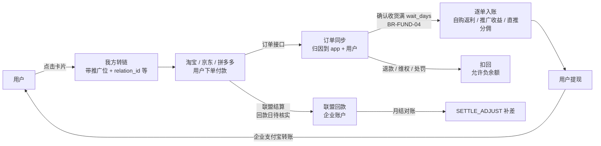

# 返利 App 规划文档 · 01 需求规划

2026-09-30 · 2026-10-01 按 D8 变更补间推（§3、F-INV-04/09、F-ADM-21）· 2026-10-01 按平台预留比例变更补 §3 基数与 F-ADM-22 · 阶段与决策编号见 00；业务规则、术语、话术以 08 为准（本文只写 BR 编号 + 一句话，不重复数值与公式）；平台能力见 09（CAP-xxx）；阶段验收见 10（AC-Sn-xx）

---

## 1. 定位与差异化

**一句话**：跨淘宝、京东、拼多多，帮你找到有返利的商品，告诉你券后价和预估返后价，并盯住返利有没有入账。

| 用户问题 | 体验目标 | 本产品 |
| --- | --- | --- |
| "这个链接/口令能返多少" | 减少查券步骤 | 粘贴即出卡：券、券后价、预估返利 |
| "50 块以内的洗发水""有大额券的牛奶" | 用自然语言表达条件 | 在淘宝/京东/拼多多联盟商品里找，只出有返利的卡 |
| "线报里的淘礼金能领吗" | 清楚说明能力边界 | 首版说明未接入、按 unknown 展示普通报价；接入后再提供已验证的权益判断（D7） |
| "返利怎么还没入账""订单丢了" | 看得懂状态、知道如何处理 | 按订单给出原因码和预计入账日，预填找回 |
| "我什么时候能提现" | 找到提现条件与入口 | 规则答疑 + 钱包状态 |

**边界**：推荐、转链、跳转、跟单、入账、提现。不代下单、不代支付、不自动领券、不自动跳转；Agent 不做闲聊陪伴、不做穿搭种草类泛推荐。

**产品价值**（D25）：自主开发带来持续改进体验的能力；Agent 是核心创新方向，帮助用户表达需求、找到商品、理解优惠和解决订单问题。竞争优势作为持续验证的产品目标；文案用词按 BR-PRICE-18、BR-TEXT-13，不以未经核实的竞品能力或价格断言支撑定位。

**目标人群**（D25，2026-09-30 用户确认）：既包括没有用过返利产品的用户，也包括已有返利经验的用户。新用户侧重理解优惠、授权与返利过程；老用户侧重操作效率、信息透明和订单服务。优券汇、私域群与应用商店是可用渠道，不把目标用户限定为优券汇用户。

---

## 2. 用户与角色

| 角色 | 说明 | 主要端 |
| --- | --- | --- |
| 游客 | 同意隐私政策后未登录 | App |
| 基本模式用户 | 拒绝隐私政策；首页、搜索、详情只读，不初始化 SDK（BR-ID-11） | App |
| 会员 | 已登录；可转链领返利、查订单 | App、H5 |
| 已绑手机会员 | Agent 查订单、绑定上级、邀请；Agent 额度见 BR-ID-03 | App |
| 已实名会员 | 可提现 | App |
| 推广者 | 任何会员通过"分享"转链后即成为推广者，推广收益进推广收益账户 | App |
| 客服（cs） | 处理找回、维权、用户咨询 | 后台 |
| 运营（ops） | 首页配置、商品池、内容、消息模板（淘礼金池后续接入，F-ADM-11） | 后台 |
| 财务（finance） | 提现审核与打款、对账、调账发起 | 后台 |
| 超管（super） | 权限、规则、开关、敏感操作二次验证 | 后台 |
| 审计（auditor） | 只读 | 后台 |

---

## 3. 业务模型与资金流

**分账口径**（D8）：

- 基数 `B`：联盟口径推广者预估收入（已扣技术服务费），先扣所选规则版本中该平台的预留比例后得出；预留比例按平台在后台设置，改后只对之后付款的订单生效；报价同样先扣（BR-CALC-02、BR-CALC-20）。
- 公式与受益人：自购单本人 + 直推上级，分享单分享者 + 其上级；计酬最多两级，间推（上级的上级）由规则版本开关控制、默认关闭（BR-CALC-05、BR-INV-12）；余额归平台（BR-CALC-04、BR-CALC-24、BR-INV-13）。
- 比例按平台 × 等级 × 订单类型配置，合计上限发布时校验（BR-CALC-06、BR-CALC-07）；每份向下取整、尾差归平台（BR-CALC-08）。
- 快照生成时点与不可变范围见 BR-CALC-10（C-06 默认处理）。
- 自购与分享报价口径按平台不同，须分别估算；拼多多 75% 为参考值，待核实（BR-CALC-17）。
- 我方淘礼金订单的返利见 BR-CALC-19；平台补贴见 BR-CALC-18、BR-CALC-25。

**垫付营运资金**：入账时点见 BR-FUND-04，联盟回款日待核实（CAP-*-08），敞口与入账开关见 BR-FUND-20；余额水位见 `02_系统架构.md` 第 8 节。

---

## 4. 信息架构

### 4.1 底部 Tab（三端一致）

| Tab | 内容 | 游客 |
| --- | --- | --- |
| 首页 | 顶部搜索框（右侧"问 AI"按钮）+ 配置卡片 + 联盟物料信息流 | 可用 |
| AI 助手 | Agent 对话；空态 4 个示例问题（后台可配） | 可找货看卡（BR-ID-03）；购买、查订单要登录 |
| 订单 | "自购""分享"两个子 Tab；顶部"找回订单"入口 | 引导登录 |
| 我的 | 昵称；两个账户余额与【提现】；待入账（BR-FUND-18）；淘宝/拼多多授权状态；邀请好友；帮助中心；联系客服；设置 | 引导登录 |

Tab 文案和图标由 `/v1/config` 下发；Tab 结构可配放 P2。Agent 入口受 `agent.enabled` 和白名单控制（D16），关闭时 AI 助手 Tab 替换为"搜索"。

**Agent 情境入口**（打开 AgentChat 时带 `context`）：商品详情"问问 AI"→ `{product_key}`；剪贴板提示条"让 AI 帮我看看"→ `{text}`；订单详情"为什么没返利？"→ `{order_id}`。

### 4.2 页面清单

实现方式：**N** = 三端原生；**H** = H5（三端共用，在可信容器中打开）；**A** = 管理后台。路由名是 JSBridge `nav.open`（04 §9）与深链使用的唯一页面名，写入 `contracts/routes.json`，路由表把页面名映射到原生页或 H5 URL，所以一个页面从 H5 迁回原生时调用方不用改。

本表统一记录逐页实现方式，00 范围表与 03 端职责只作摘要。保留原生壳的方向按 D28；页面实现可按 D27 调整，调整时同步本表、路由与对应开发任务。具体语言、框架、WebView 和桥的选型见 03 §1.2、§3.3、§5。

| 路由名 | 页面 | 实现 | 阶段 | 说明 |
| --- | --- | --- | --- | --- |
| `Launch` | 启动 + 隐私首启弹窗 | N | M-内测 | 同意前不发业务请求 |
| `BasicMode` | 基本模式 | N | M-内测 | 首页、搜索、详情只读（BR-ID-11） |
| `Login` | 登录（手机号/微信/Apple；华为账号 M-公开，F-ACC-04） | N | M-内测 | 登录成功回到来源页并恢复 `pending_action` |
| `BindPhone` | 绑定手机号 | N | M-内测 | 邀请、Agent 查订单、Agent 超额度时引导（BR-ID-02） |
| `Home` | 首页 | N | M-内测 | SDUI |
| `Search` | 搜索与结果 | N | M-内测 | |
| `ProductDetail` | 商品详情 | N | M-内测 | 参数 `platform`、`product_key` |
| `AuthSheet` | 平台授权说明半屏 | N | M-内测 | 文案取 `config.auth_tips[platform]` |
| `JumpTip` | 下单须知浮层 | N | M-内测 | 每用户每平台一次（BR-ATTR-21） |
| `AgentChat` | AI 助手 | N | M-内测 | 参数 `context` |
| `AgentConsent` | AI 单独同意弹窗 | N | M-内测 | |
| `OrderList` | 订单列表（自购/分享） | N | M-内测 | 推送落地页 |
| `OrderDetail` | 订单详情（时间线、原因码、预计入账日） | N | M-内测 | 文案 BR-TEXT-02、BR-TEXT-04 |
| `FindOrder` | 订单找回（表单 + 记录） | H | M-内测 | 规则常改 |
| `Me` | 我的 | N | M-内测 | 固定原生布局 |
| `Wallet` | 钱包（两个账户、待入账、冻结） | N | M-内测 | 字段口径 BR-FUND-18 |
| `Withdraw` | 提现申请 | N | M-内测 | 二次验证 |
| `WithdrawRecords` | 提现记录 | N | M-内测 | |
| `Ledger` | 收益明细 / 余额流水 | H | M-内测 | |
| `RealName` | 实名认证 | N | M-内测 | 单独同意 |
| `PayoutAccount` | 收款账号（支付宝） | N | M-内测 | 二次验证 |
| `Settings` | 设置（账号与安全、隐私、通知、关于） | N | M-内测 | |
| `PrivacyCenter` | 个人信息收集清单、第三方共享清单、撤回同意、关闭个性化推荐 | N + H | M-内测 | 清单正文用 H5 |
| `DeleteAccount` | 账号注销 | N | M-公开 | |
| `About` | 关于（版本、备案号、AI 模型公示） | N | M-内测 | |
| `Messages` | 消息中心 | H | M-内测 | |
| `InviteShare` | 邀请好友（邀请码、海报、规则） | H | M-内测 | D9 |
| `Rules` | 返利规则 | H | M-内测 | |
| `Help` | 帮助中心（分类、详情） | H | M-内测 | |
| `Notice` | 公告 | H | M-内测 | |
| `Agreement` | 用户协议、隐私政策、SDK 清单 | H | M-内测 | 版本化 |
| `WebPage` | 通用可信容器 | N | M-内测 | 只加载白名单 origin |
| `ExternalPage` | 第三方页容器（不注入桥） | N | M-内测 | 联盟活动页、商家页 |
| `CustomPage` | 运营自定义页（`custom:*`） | H | P1 | |
| `InvitedFriends` / `LevelUpgrade` | 邀请的好友、等级 | — | P1 | 桥调用返回 unsupported；BR-INV-16；原 TeamFans 改名，RankList 删除（BR-INV-20） |
| `MyWatches`（暂定） | 我的提醒 | N | P1 | E21；BR-WATCH-29 |
| `WatchLanding`（暂定） | 提醒落地页 | N | P1 | E21；BR-WATCH-16 |
| — | 邀请落地页（App 外、微信内） | H | M-内测 | 手机号注册即绑定上级 |
| — | 商品分享中间页（App 外、微信内） | H | M-公开 | 域名见 F-SHARE-04 |
| — | JSBridge 一致性测试页 | H | M-内测 | 仅 debug/staging 包可打开 |

后台页面清单见第 6 节 E16。

### 4.3 身份矩阵

矩阵见 **BR-ID-02**：购买、查订单、找回须登录；Agent 查订单、邀请、实名须绑手机；提现须实名；游客与未绑手机会员的 Agent 找货按设备额度（**BR-ID-03**，待决策）。

未成年规则见 BR-ID-26、BR-INV-19、BR-WDR-06（满周岁按 BR-ID-26 生日次日 00:00，C-15 默认，待法务确认）。

---

## 5. 核心用户旅程

每条旅程的异常分支都要在三端表现一致，对应 `specs/client-behavior.md` 的同一组验收编号。

### J1 首单（搜索路径）

1. 首页搜索"伊利纯牛奶"→ 结果页（淘宝 Tab 默认）→ 商品详情：券、券后价、预估返利、预估返后价；"确认收货满 {wait_days} 天后入账"（BR-TEXT-04）。
2. 点【领券购买】，依次检查：
   - 未登录 → 登录后回到详情自动继续（BR-ID-10）；
   - 淘宝未备案 → 点击购买时触发（BR-ID-17）：`AuthSheet` → 淘宝授权 → 回到 App 自动继续；
   - 关闭说明页或授权失败 → 【仍去购买（无返利）】【重试】（BR-ID-18，待决策）。
3. 首次跳转前弹 `JumpTip`（BR-ATTR-21）：在打开的页面直接下单、不加购隔天买、不点他人链接；点击有效期未核实的平台不写天数（BR-ATTR-13）。
4. 按降级链外跳：百川/scheme → Universal Link/App Link → H5；未装淘宝时按 CAP-TB-11 结论 H5 打开或提示"安装淘宝后下单才有返利"并复制口令（09 附录 A-27）。
5. 用户下单付款 → 同步入库（付款到入库 P95 目标 ≤5 分钟；平台同步延迟以 CAP-<平台>-07 实测为准，实测 P95 已超过 5 分钟时由负责人按 00 §8 改指标（10 §1）；对用户话术按 09 U-18「下单后通常几分钟内显示，最长 N 分钟」）→ 跟单成功推送（BR-TEXT-09）。
6. 确认收货 → 预计入账日（BR-TEXT-04）→ 到期入账（BR-FUND-04）→ 推送返利已入账（BR-TEXT-09）。

验收：10 的 AC-S1-01-*、AC-S1-04、AC-S1-05-*、AC-S1-06、AC-S1-07-TB、AC-S1-11～13、AC-S1-17、AC-S1-18-*、AC-S1-24、AC-S2-01-*、AC-S2-02。

埋点漏斗 `funnel_first_order`：`view_product → click_buy → login_ok → auth_ok → convert_ok → jump_ok → order_synced → credited`。

### J2 粘贴链接/口令/素材查返利

1. 剪贴板读取见 BR-ID-16（待决策）：iOS 提示条内 `UIPasteControl`；Android 默认只有"粘贴查返利"按钮，自动识别开关默认关；鸿蒙只用 `PasteButton`。
2. 服务端识别 `POST /v1/inputs/parse`（纯代码）→ 联盟口令解析 → 查券与佣金 → 返回卡片。
3. 识别到线报素材（含"淘礼金限量""88会员"等）时进入 AgentChat：淘礼金结论只用 BR-TEXT-15，首版按 D7 保持 unknown 展示；"领淘礼金并购买"须后续接入并验证后才启用（BR-ATTR-24）；口令解析失败可用素材标题和规格搜索，不把解析失败解释为淘礼金已领完。
4. 价格两行：券后价（联盟接口）与素材参考价（用户素材回显，不是报价，BR-PRICE-10）。

验收：10 的 AC-S1-02-*、AC-S1-03、AC-S1-08～10、AC-S1-38-TB、AC-S1-40；AC-S1-39-TB、45-TB、53-TB 后续淘礼金接入时再验收；分享面板 AC-S1-42-*（条件项，E20）。

### J3 Agent 找货

1. 用户说"京东 伊利纯牛奶 24盒 50以内"→ 一次 function calling 抽取条件 → `search_products(platforms=["jd"], price_max_fen=5000, ...)`，比较券后价、闭区间（BR-AI-08）。
2. 服务端并发检索、过滤（无返利 BR-PRICE-08、禁售类目、已下架；券失效按无券出卡 BR-PRICE-14）、去重（BR-PROD-08）、按相关性排序 → 登记 `link_id`（游客不预转链，BR-AI-11）→ SSE 下发卡片 + 一两句说明（BR-AI-06）。
3. "第二个换成拼多多的""再便宜点""换一批"→ 基于上一轮结果集改条件重搜（"再便宜点"见 BR-PRICE-15）。
4. 点击"去京东购买"→ `POST /v1/links/{link_id}/open` 实时转链并复核（BR-PRICE-13）→ 外跳。
5. 无结果 → 最多 2 次追加调用（BR-AI-08）→ 仍无结果如实告知并给 3 个快捷改写。

验收：10 的 AC-S1-30-*、AC-S1-31-JD、AC-S1-32、AC-S1-34-TB（关闭提示）、AC-S1-35、AC-S1-36-TB、AC-S1-37、AC-S1-41、AC-S1-46、AC-S1-47；AC-S1-33-TB 后续淘礼金接入时再验收，首版不计门槛（D7）。

### J4 订单跟踪与入账

订单页：已付款，返利待确认 → 已收货，等待入账（附预计入账日）→ 已入账；文案 BR-TEXT-02，差额与异常 BR-TEXT-03，预计入账日 BR-TEXT-04。

验收：10 的 AC-S1-24、AC-S1-25、AC-S1-27、AC-S2-01-*、AC-S2-02～05、AC-S2-09。

### J5 没返利 → 诊断 → 找回

1. 订单详情"为什么没返利？"或 Agent 里问"我昨天买的牛奶返了吗"→ `explain_order` 返回原因码与建议。
2. 外跳后一段时间仍无新订单 → 订单页"未跟单？去找回"置顶（BR-ATTR-17）。
3. 找回表单（H5）：平台 + 订单号 + 付款日期（BR-ATTR-17）→ 未归因池匹配 + link_log 证据 → 客服确认或人工审核（BR-ATTR-18）。
4. 次数与风控 BR-ATTR-19；锁定 BR-ATTR-20；奖励 BR-INV-22。

验收：10 的 AC-S1-21、AC-S1-25、AC-S1-26-*、AC-S1-43、AC-S1-44。

### J6 提现

1. 我的 → 钱包：两个账户分别显示可提现、待入账（附预计入账日）、预估、冻结中；风控暂停时顶部提示（BR-TEXT-01、BR-FUND-18）。
2. 点【提现】：首次实名（BR-ID-25）→ 绑定支付宝（BR-WDR-02）→ 输入金额（BR-WDR-04）→ 二次验证（BR-WDR-01）→ 提交。
3. 状态文案只引用 BR-TEXT-06（C-02 默认处理）。
4. 时效与超时进度见 BR-TEXT-07、BR-WDR-26。

验收：10 的 AC-S2-20～29、AC-S2-33。

### J7 邀请好友

1. 我的 → 邀请好友（H5）：邀请码（BR-INV-01）、海报、规则（BR-INV-18）。
2. 好友在微信内打开落地页 → 手机号注册即绑定 → 下载 App 同号登录，首次登录做同设备复核（BR-INV-05、BR-INV-09）。
3. 其他方式：注册页手填（BR-INV-06）；限时补填 1 次（BR-INV-07）。
4. 禁止绑定与不可自改绑：BR-INV-08、BR-INV-10。
5. 上级可见信息：BR-INV-16（MVP 只看直邀人数）。
6. 间推开关开启后，上级的上级在余额流水 / 收益明细中看到「好友推广奖励」，不展示层级与下级信息（BR-INV-20、BR-TEXT-19）。

### J8 分享商品赚推广收益

商品详情【分享】→ 海报（F-SHARE-01，不显示返利）+ 文案模板 + 短链/口令，`scene=share` 使用分享推广位。好友下单归入分享者推广收益账户，购买者不获得返利（BR-ATTR-10）；分享者经自己链接下单见 BR-ATTR-11（待决策）。分享者需已完成平台授权。

### J9 注销账号

设置 → 账号与安全 → 注销：流程、冷静期、撤回与拒绝条件见 BR-ID-27；删除与保留范围见 BR-ID-28；提交注销即暂停全部订阅提醒（BR-WATCH-10）。

---

## 6. 功能需求（按 Epic）

编号规则：功能 `F-<EPIC>-<nn>`；验收 `AC-<EPIC>-<nn>`，完整 Given/When/Then 写在 `acceptance/<epic>.feature`，每条 AC 对应一个测试 ID 并标 `@auto` 或 `@manual`。下表"验收要点"是 AC 的摘要，不是全文；阶段验收用例见 10（编号对应见 10 §0.5）。

### E01 账户与身份（ACC）

| 编号 | 需求 | 阶段 | 验收要点 |
| --- | --- | --- | --- |
| F-ACC-01 | 手机号验证码登录；限频、号段、人机验证、注册上限见 BR-ID-05 | M-内测 | 超频返回 42901；号段按配置拦截 |
| F-ACC-02 | 微信登录；不强制绑手机，引导时机见 BR-ID-02、BR-ID-03 | M-内测 | 微信登录后可转链；Agent 超额度时引导 `BindPhone` |
| F-ACC-03 | Sign in with Apple（iOS）；注销时调用 Apple `/auth/revoke` | M-内测 | 审核 4.8 要求 |
| F-ACC-04 | 华为账号登录（鸿蒙包、华为渠道 Android 包） | M-公开 | 鸿蒙随 D4 |
| F-ACC-05 | 令牌见 BR-ID-07；并发刷新只刷一次 | M-内测 | 并发 5 个 401 只触发 1 次刷新 |
| F-ACC-06 | 设备注册见 BR-ID-09 | M-内测 | 客户端伪造的 `X-Device-Id` 返回 10402 |
| F-ACC-07 | 二次验证（step-up）见 BR-ID-08、BR-WDR-01 | M-内测 | 过期 token 返回 10003 |
| F-ACC-08 | 实名认证见 BR-ID-25；未成年见 BR-ID-26 | M-内测 | 同一身份证只能 1 个会员可提现 |
| F-ACC-09 | 邀请码绑定上级（见 E12） | M-内测 | |
| F-ACC-10 | 账号注销：流程 BR-ID-27；删除与保留 BR-ID-28、BR-ID-29；下级关系 BR-INV-11；联盟绑定 BR-ID-20；提醒 BR-WATCH-10、BR-WATCH-23；Agent 对话 BR-AI-22 | M-公开 | 注销后同号可重新注册，但不能再领新人奖励 |
| F-ACC-11 | 绑定 / 更换手机号，冲突不合并（BR-ID-06） | M-内测 | |

### E02 隐私与合规（PRIV）

| 编号 | 需求 | 阶段 | 验收要点 |
| --- | --- | --- | --- |
| F-PRIV-01 | 首启弹窗：摘要 + 《隐私政策》《用户协议》；"同意 / 不同意"；登录页协议勾选框默认不勾 | M-内测 | 截图进审核材料 |
| F-PRIV-02 | 拒绝路径与基本模式见 BR-ID-11 | M-内测 | 基本模式下抓包无第三方 SDK 请求 |
| F-PRIV-03 | 同意前禁止项见 BR-ID-11 | M-内测 | CI 静态规则 + 三端隐私检测工具报告 |
| F-PRIV-04 | 设置页：个人信息收集清单、第三方共享清单（与 SDK 管理服务平台登记一致）、撤回同意、关闭个性化推荐（BR-ID-13） | M-内测 | 关闭后首页信息流和 Agent 不使用行为数据 |
| F-PRIV-05 | 协议版本化与同意记录见 BR-ID-12 | M-内测 | |
| F-PRIV-06 | 权限按需申请（BR-ID-13） | M-内测 | |
| F-PRIV-07 | AI 合规组件（三端 + H5 共用）：`AgentConsent` 单独同意与撤回（BR-AI-13、BR-ID-14）、数据流向（BR-AI-14）、内容标识与公示（BR-ID-15、BR-TEXT-16）、举报入口 | M-内测 | 未同意或已撤回时 `/v1/agent/*` 返回 10004 |
| F-PRIV-08 | 联盟规范红线：只有用户点击才外跳；推送/短信/分享标题见 BR-TEXT-20；金额来源 BR-PRICE-16；App 图标/名称/启动页不含平台商标 | M-内测 | 自动化用例：无点击不触发外跳 |
| F-PRIV-09 | 文案禁用词见 BR-TEXT-13；CI 扫描文案与模板 | M-内测 | |

### E03 首页与配置化（HOME）

| 编号 | 需求 | 阶段 | 验收要点 |
| --- | --- | --- | --- |
| F-HOME-01 | 首页由 `GET /v1/pages/home` 下发：`page → sections[] → {id, type, version, props, data_source, condition, min_app_version}` | M-内测 | |
| F-HOME-02 | 原生卡片 6 种：`banner`、`icon_grid`（金刚区）、`product_scroll`（商品横滑）、`product_grid`（商品网格）、`activity_entry`、`notice_bar`；外加 `feed_infinite`（联盟物料信息流，置底） | M-内测 | 每种卡片有 golden 样例和三端截图 |
| F-HOME-03 | 数据源：`static`、`product_pool`、`union_material`、`api`；无返利过滤 BR-PRICE-08；券失效按无券出卡 BR-PRICE-14 | M-内测 | |
| F-HOME-04 | 三级兜底：网络最新 → 本地 LKG → 包内 `default_home.json`；拉取超过 1.5 秒先渲染 LKG | M-内测 | 接口 500 或超时，首页不白屏 |
| F-HOME-05 | 单卡隔离：某张卡解析/渲染异常只隐藏该卡并上报 `sdui_card_error`；数据源为空时隐藏，不显示空壳 | M-内测 | 含未知 type 和缺字段的配置，其余卡正常 |
| F-HOME-06 | `min_app_version` 过滤：服务端按 `X-App-Version` 过滤，客户端遇到未知 type 再跳过一次 | M-内测 | |
| F-HOME-07 | 发布：草稿 → 校验（ajv 按组件 props schema）→ 预览 → 发布（立即/定时）→ 灰度 1%/10%/100% → 一键回滚；卡片错误率 >0.5% 自动回滚 | M-内测 | 后台改首页，客户端冷启动 60 秒内生效（AC-HOME-01） |
| F-HOME-08 | 首页弹窗位 1 个：按人群（新用户/未授权/未出单/无上级）、每日次数、时间段 | M-公开 | |
| F-HOME-09 | 跳转协议：卡片 `action` 统一为 `{type: native\|h5\|product\|search\|agent\|union_activity, target, params}` | M-内测 | 与 JSBridge `nav.open` 共用路由表 |

### E04 搜索与商品（PROD）

| 编号 | 需求 | 阶段 | 验收要点 |
| --- | --- | --- | --- |
| F-PROD-01 | 搜索：平台 Tab（淘宝/京东/拼多多，默认淘宝）；排序（综合/销量/券后价/返利，显示名 BR-PRICE-18）；筛选"只看有券"、价格区间（BR-PRICE-15）；分页游标 | M-内测 | |
| F-PROD-02 | 输入含链接或口令时直达商品详情（复用 `POST /v1/inputs/parse`） | M-内测 | |
| F-PROD-03 | 热词、关键词雷达（关键词 → 指定页）后台可配；本地保存最近 20 条搜索历史 | M-内测 | |
| F-PROD-04 | 无结果时推荐同类目热卖 | M-内测 | |
| F-PROD-05 | 商品详情：主图、标题、店铺、券前价、券、券后价、预估返利（比价风险按区间）、预估返后价、取价时间、口径说明、入账说明（BR-PRICE-03/04/07/09/11、BR-TEXT-04）、【领券购买】【分享】【问问 AI】 | M-内测 | 卡片金额与联盟接口一致 |
| F-PROD-06 | 商品身份与标识见 BR-PROD-01～11 | M-内测 | 同一商品两次搜索原串不同、`product_key` 相同（受 BR-PROD-03 验证约束） |
| F-PROD-07 | 缓存见 BR-PROD-07；价格以点击复核为准（BR-PRICE-13） | M-内测 | |
| F-PROD-08 | 禁售与敏感类目过滤（处方药、烟草电子烟、成人用品、二类及以上医疗器械、彩票、虚拟币、枪械刀具），搜索和 Agent 共用后台黑名单 | M-内测 | |
| F-PROD-09 | 价格变更历史预埋：不展示、不含用户标识（BR-WATCH-19，待负责人确认） | M-内测（预埋） | |

### E05 转链、授权与跳转（LINK）

| 编号 | 需求 | 阶段 | 验收要点 |
| --- | --- | --- | --- |
| F-LINK-01 | 转链 `POST /v1/links/convert`：`platform`、`product_key` 或 `url`、`item_ref`（BR-PROD-11）、`scene`（必填）、`spm`、`agent_session_id`；返回 `link_id`、`primary`、`fallbacks[]`、`expire_at`（BR-ATTR-05） | M-内测 | 未备案返回 30101 + `auth_url` |
| F-LINK-02 | 场景推广位：自购 / 分享 / Agent / 查询专用（BR-PROD-07），淘礼金专属位后续接入时建（D7，06 Q-C16）；从 `union_pids` 读取、禁止写死（BR-ATTR-02）；fallback 位见 BR-ATTR-08 | M-内测 | |
| F-LINK-03 | 淘宝渠道备案：点击购买时触发（BR-ID-17）；唯一性与换绑见 BR-ID-19 | M-内测 | |
| F-LINK-04 | 拼多多授权备案：首次转链前完成；`custom_parameters` 用户标识用 `attr_code`（BR-ATTR-06，C-04 默认） | M-内测 | |
| F-LINK-05 | 京东：`subUnionId = n_{attr_code}`（BR-ATTR-06）；转链接口待 CAP-JD-05（09 附录 A-6）；三端用短链 → scheme/通用链接 → H5 | M-内测 | |
| F-LINK-06 | 外跳降级链由 `contracts/apps.json` 生成三端配置：scheme、Universal Link/App Link/App Linking、包名、鸿蒙 bundleName；iOS `LSApplicationQueriesSchemes` 只声明 apps.json 生成的条目（本项目约定 ≤20 条；系统上限以 Apple 文档为准，待核实，09 U-85） | M-内测 | 按平台 × 端：CAP-*-11 为支持的组合，已装/未装真机行为与 BR-ATTR-27 矩阵一致；美团随 P1（F-ORD-13，D15） |
| F-LINK-07 | 客户端上报 `link_jump` 事件（每一步成功/失败、`installed`） | M-内测 | |
| F-LINK-08 | `link_logs` 字段与事件类型见 BR-ATTR-14，留存见 BR-ID-30 | M-内测 | 真实订单 ≥95% 能自动关联回 link_log（按平台；依赖 CAP-*-07，BR-ATTR-23） |
| F-LINK-09 | 淘宝备案失效巡检见 BR-ID-21（待验证） | M-公开 | |
| F-LINK-10 | 分享链接 `expire_at` 与点击有效期无关，过期后 open 按快照重新转链（BR-ATTR-05、BR-ATTR-13） | M-公开 | |

### E06 剪贴板识别（CLIP）

| 编号 | 需求 | 阶段 | 验收要点 |
| --- | --- | --- | --- |
| F-CLIP-01 | 读取方式见 BR-ID-16（待决策） | M-内测 | iOS 不出现系统"允许粘贴"弹窗（UIPasteControl，CAP-X-02） |
| F-CLIP-02 | 本地过滤（规则由 `config.clipboard` 下发）：长度 10–500；排除 ≤20 位纯数字/字母；排除词；本 App 最近 10 次复制内容的 hash；同一 hash 24 小时只提示一次 | M-内测 | |
| F-CLIP-03 | `POST /v1/inputs/parse`（C-14）：URL 识别 → 口令解析 → 标题搜索（≥10 字）；返回卡片数据或 30131（BR-PROD-10）/ 30132 + "去搜索" | M-内测 | |
| F-CLIP-04 | 识别为线报素材时，提示条按钮为"让 AI 帮我看看"并带文本进入 AgentChat | M-内测 | |
| F-CLIP-05 | 后台可按平台一键关闭 | M-内测 | |

### E07 AI 找货助手（AGENT）

Agent 规则见 08 §8（BR-AI-01～23），修订①仅作参考；服务架构见 `02_系统架构.md` 第 9 节；流协议见 `04_数据模型与契约.md` 第 8 节。

| 编号 | 需求 | 阶段 | 验收要点 |
| --- | --- | --- | --- |
| F-AGENT-01 | T1 链接/口令/素材查返利：`parse_input`（纯代码）→ `resolve_link` → `get_rebate_quote` → 1 张卡；一条消息最多处理 3 个链接 | M-内测 | AF-01：2.5 秒内出卡，数值与接口一致 |
| F-AGENT-02 | 素材结构化与黑话归一化（词典后台可增补）；首版淘礼金素材按 BR-TEXT-15 unknown 展示，A/B/C 接入按 D7 延后；价格两行见 BR-PRICE-10 | M-内测 | AF-09 的 unknown 分支、AF-11；AF-10 随淘礼金接入 |
| F-AGENT-03 | T2 关键词找货：一次 function calling 完成意图 + 条件抽取（BR-AI-08）；`search_products` 多平台并发；目标 3–8 张卡，实际不足时如实展示，按 §8.4 核对条件 | M-内测 | AF-04 |
| F-AGENT-04 | T3 权益找货：优先支持已有数据可验证的券、补贴等权益；`benefits=taolijin` 保留但首版关闭，按 BR-AI-17 返回 notice | M-内测 | 已支持权益筛选与关闭分支；AF-02 后续接入，AF-03 首版验收 |
| F-AGENT-05 | T4 多轮：服务端保存每轮 `result_set`；支持"第 N 个""换成 X 平台""再便宜点""换一批"（BR-PRICE-15、BR-AI-05）；指代失败走 `clarify` 意图追问（不是工具，BR-AI-01、BR-AI-02） | M-内测 | AF-05 |
| F-AGENT-06 | T5 查订单与诊断：`list_my_orders`、`explain_order`（原因码 + 预计入账日）、`prefill_claim`（草稿卡，用户点击提交，BR-AI-01）；答复模板 BR-AI-07、BR-TEXT-18 | M-内测 | 越权用例 0 通过 |
| F-AGENT-07 | T6 规则答疑与转人工：`search_rules`（规则库 RAG，pgvector）、`handoff_to_human`（企业微信客服卡）；答复口径 BR-TEXT-18 | M-内测 | |
| F-AGENT-08 | 出卡即登记 `link_id`；预转链上限与游客不预转链见 BR-AI-01、BR-AI-11；点击时 open 实时转链、复核并校验归属（BR-PRICE-12、BR-PRICE-13） | M-内测 | AF-06 |
| F-AGENT-09 | 数字事实性与出站过滤见 BR-AI-04、BR-AI-06 | M-内测 | AF-08：注入不改变卡片数值 |
| F-AGENT-10 | 工具白名单与禁止清单见 BR-AI-02；身份参数服务端注入见 BR-AI-03 | M-内测 | allowlist 精确比对 + denylist + 模块依赖检查 |
| F-AGENT-11 | 排序默认相关性（BR-AI-09）；卡片广告标识（BR-AI-10） | M-内测 | |
| F-AGENT-12 | 编排上限与消息受理顺序见 BR-AI-15、BR-AI-23 | M-内测 | |
| F-AGENT-13 | 失败降级：模型 >8 秒无首事件 → 关键词直走普通搜索出卡；单平台失败其余照常；无结果最多 2 次追加调用（BR-AI-08） | M-内测 | |
| F-AGENT-14 | 配额与成本见 BR-ID-03、BR-AI-15（C-10）、BR-AI-16 | M-内测 | |
| F-AGENT-15 | 内容安全与拒答见 BR-AI-18 | M-内测 | 违规诱导集拦截 100% |
| F-AGENT-16 | Trace 落库见 BR-AI-19，留存见 BR-ID-30（C-11，待法务）；👎 自动标 badcase | M-内测 | |
| F-AGENT-17 | 会话见 BR-AI-20；"新对话"按钮；历史只存服务端 | M-内测 | |
| F-AGENT-18 | 跨平台同款 `find_same_item`（BR-PROD-09，待决策）、截图找同款；降价提醒见 E21 | P1 | |

**能力路线**（PRD v2.1 §10.17）：转（识别出卡 MVP；分享面板 E20；截图同款 P1）、找（MVP；跨平台同款 P1）、盯（E21）、办（诊断、找回预填、答疑、转人工 MVP）。

### E08 淘礼金（TLJ）——D7，后续接入（未排期）

首版不实现淘礼金商品池、发放、领取和专用后台；保留模块依赖方向与关闭分支，实际接入时再细化下表，不提前建立空表或接入不可用的接口。普通素材解析与 unknown 提示仍属于核心体验。

| 编号 | 需求 | 阶段 | 验收要点 |
| --- | --- | --- | --- |
| F-TLJ-01 | 淘礼金商品池（后台）：商品、单个红包金额、总个数、单用户上限、有效期、状态；开启前校验"红包金额 < 佣金"或标记补贴活动 | 后续接入 | |
| F-TLJ-02 | 发放 `POST /v1/taolijin/{pool_item_id}/claims`：校验见 BR-AI-17 → 调联盟创建接口或取预创建池 → 返回领取链接；领完 30602（BR-PRICE-14） | 后续接入 | 同用户第 2 次领取返回 30601 |
| F-TLJ-03 | 日预算与总预算上限，达到自动停发并告警；开关 `tlj.enabled` | 后续接入 | |
| F-TLJ-04 | 我方淘礼金订单的返利见 BR-CALC-19（待财务决策） | 后续接入 | |
| F-TLJ-05 | 淘礼金发放不由模型决定、不注册为工具（BR-AI-17） | 后续接入 | |

### E09 订单与归因（ORD）

| 编号 | 需求 | 阶段 | 验收要点 |
| --- | --- | --- | --- |
| F-ORD-01 | 统一订单模型：唯一键 BR-ATTR-22，归因时点 BR-ATTR-25；订单号、商品 ID 一律字符串；覆盖预售、多件、部分退款、活动单 | M-内测 | |
| F-ORD-02 | App 归属与双品牌隔离见 BR-ATTR-02、BR-ATTR-03 | M-内测 | AF-07：新 App 入账、优券汇不入账 |
| F-ORD-03 | 用户归属：淘宝 BR-ATTR-07；京东、拼多多 BR-ATTR-06；取不到进未归因池（BR-ATTR-16） | M-内测 | |
| F-ORD-04 | 自购/分享判定见 BR-ATTR-08、BR-ATTR-09；分享者自下单见 BR-ATTR-11（待决策） | M-内测 | 同一会员从详情和分享面板各下一单，分别入两个账户 |
| F-ORD-05 | 同步：增量 + 回扫 + 维权/处罚单独任务，各平台频率与窗口见 02 §7.1；水位持久化；大促模式开关 | M-内测 | 付款到入库 P95 目标 ≤5 分钟；平台同步延迟以 CAP-<平台>-07 实测为准，实测 P95 已超过 5 分钟时由负责人按 00 §8 改指标（10 §1）；对用户话术按 09 U-18「下单后通常几分钟内显示，最长 N 分钟」 |
| F-ORD-06 | 状态机见 BR-FUND-01（平台 + 返利双状态，C-01 默认）；入账前失效 BR-FUND-07，入账后扣回 BR-FUND-08，维权暂停 BR-FUND-06；只能通过生成的 `transition()` 迁移 | M-内测 | 表外事件返回 20902（C-03）且状态、余额不变 |
| F-ORD-07 | 用户侧展示见 BR-TEXT-02、BR-TEXT-04、BR-TEXT-05 | M-内测 | 每个原因码有 fixture 和三端截图 |
| F-ORD-08 | 来源回填见 BR-ATTR-15 | M-内测 | 后台可按 scene 看转链 → 成交 → 佣金 |
| F-ORD-09 | 订单找回（D14）见 BR-ATTR-17～20 | M-内测 | |
| F-ORD-10 | 维权/处罚同步（BR-FUND-06～08）；后台 Excel 导入维权单（主订单号）/ 违规单（子订单号）/ 渠道单（relation_id，BR-ATTR-26），可选收货或付款时间口径，失效原因透出到订单详情，单次 ≤1 万行并记失败明细；手动同步（平台 × 时间窗 × 状态），或按订单号补拉（单次 ≤50 个）（后端功能规划 2.5） | M-内测 | |
| F-ORD-14 | 后台变更已归属订单见 BR-ATTR-20 | M-内测 | |
| F-ORD-11 | 比价订单：判定字段待 CAP-TB-04（09 附录 A-5）；计算与展示见 BR-CALC-16、BR-PRICE-07（C-22） | M-内测 | 至少 1 笔比价订单三处一致 |
| F-ORD-12 | 黑名单：订单级 BR-ATTR-26（C-18）与账号级 BR-CALC-13、BR-ID-31 分开处理 | M-内测 | |
| F-ORD-13 | 美团订单 | P1（D15） | |

### E10 返利结算与账务（SET）

| 编号 | 需求 | 阶段 | 验收要点 |
| --- | --- | --- | --- |
| F-SET-01 | 复式分录见 BR-FUND-16（每个 uniq_key 一张凭证）、BR-FUND-05 | M-内测 | |
| F-SET-02 | 逐单入账（D11）见 BR-FUND-04、BR-FUND-06 | M-内测 | 重放同一 `uniq_key` 只入账 1 次 |
| F-SET-03 | 分佣快照与计算见 §3；受益人失效见 BR-CALC-13；算例 BR-CALC-21 | M-内测 | B=1234、r=5000/1000 → 617/123，平台 494 |
| F-SET-04 | 扣回与负余额：BR-FUND-07、BR-FUND-08、BR-FUND-10；任一账户为负两账户均禁提现（BR-WDR-05、BR-FUND-11）；坏账核销 BR-FUND-12 | M-内测 | |
| F-SET-05 | 月结补差见 BR-FUND-09、BR-CALC-23（C-07 默认，待财务） | M-内测 | "T+15 入账 → 月结 → 重跑月结"余额只变动 1 次入账 + 1 次补差 |
| F-SET-06 | 日终账务不变量校验与冻结见 BR-FUND-19 | M-内测 | |
| F-SET-07 | 税额、年度台账与导出见 BR-WDR-20、BR-WDR-21 | M-内测 | 税率可配 |
| F-SET-08 | 平台资产日快照见 BR-FUND-18（C-17） | M-内测 | |
| F-SET-09 | 月结账单 UI、会员月账单、分平台对账单透视 | P1 | MVP 用 CSV 导出 |

### E11 钱包与提现（WDR）

| 编号 | 需求 | 阶段 | 验收要点 |
| --- | --- | --- | --- |
| F-WDR-01 | 钱包：两个账户各自的可提现、待入账、预估、冻结中，风控暂停顶部提示（BR-TEXT-01、BR-FUND-18）；余额流水 H5（BR-TEXT-19） | M-内测 | |
| F-WDR-02 | 收款账号见 BR-WDR-02 | M-内测 | |
| F-WDR-03 | 申请限制见 BR-WDR-03、BR-WDR-04、BR-WDR-05 | M-内测 | 不满足返回 30303 + `data.reason` |
| F-WDR-04 | 提现单创建与幂等见 BR-WDR-07 | M-内测 | 同一 key 并发两次只生成 1 单 |
| F-WDR-05 | 状态机见 BR-WDR-08；手动成功见 BR-WDR-16 | M-内测 | |
| F-WDR-06 | 打款：只查不重提（BR-WDR-14，**禁止自动重试转账**）；未知处置 BR-WDR-15；判定清单 BR-WDR-28（待验证） | M-内测 | 模拟超时 3 次后成功，支付宝侧只有 1 笔 |
| F-WDR-07 | 批量打款与第二人审批见 BR-WDR-11、BR-WDR-12 | M-内测 | |
| F-WDR-08 | 手续费见 BR-WDR-19（MVP 默认 0） | M-内测 | |
| F-WDR-09 | 用户侧状态文案见 BR-TEXT-06（C-02） | M-内测 | |
| F-WDR-10 | 自动到账规则组、灵工通道、条件模式 | P1 | D10、D12 |

### E12 邀请与分销（INV）

| 编号 | 需求 | 阶段 | 验收要点 |
| --- | --- | --- | --- |
| F-INV-01 | 邀请码生成与格式见 BR-INV-01；与优券汇码空间独立 | M-内测 | |
| F-INV-02 | 绑定渠道见 BR-INV-03、BR-INV-05～07；邀请码非必填（`config.invite.required=false`） | M-内测 | 落地页注册 → 下载 → 同号登录后上级已绑定 |
| F-INV-03 | 禁止绑定与改绑见 BR-INV-08～10 | M-内测 | |
| F-INV-04 | 关系存储见 BR-INV-11（闭包表 P1）；计酬深度 ≤ 2（D8，BR-INV-12），depth ≥ 3 永不计酬 | M-内测 | 受益人深度 > 2 的快照不可能生成（属性测试） |
| F-INV-05 | 等级 L1–L3 见 BR-INV-14、BR-INV-15 | M-内测（模型） | |
| F-INV-06 | 邀请好友 H5 页（含直邀人数）、邀请落地页（微信内可打开）；BR-INV-16、BR-INV-18 | M-内测 | |
| F-INV-07 | `InvitedFriends`、等级界面（BR-INV-16） | P1 | |
| F-INV-08 | 新人红包、签到、邀请奖励见 BR-INV-22 | P1 | |
| F-INV-09 | 间推分佣：规则版本开关 `indirect_enabled`（默认关闭）开启时，按 BR-CALC-05 给直推上级的上级计间推份额，受益人按 BR-INV-13 / BR-CALC-12 在 paid_at 取值，失效按 BR-CALC-13；流水 REFERRAL_CREDIT（INDIRECT），用户侧名称按 BR-TEXT-19 | M-内测（开关默认关闭） | 关闭时无 indirect 受益人；开启后受益人、比例、取整正确；缺层归平台；10 AC-S2-34…39 |

### E13 分享（SHARE）

| 编号 | 需求 | 阶段 | 验收要点 |
| --- | --- | --- | --- |
| F-SHARE-01 | 海报：主图、券后价、券额、取价日期与口径、二维码（指向中间页），不显示返利（BR-PRICE-06、BR-PRICE-17）；统一模板 | M-公开 | |
| F-SHARE-02 | 文案模板（每联盟完整 / 短 / 素材圈三种）与变量、渠道约束见 BR-TEXT-20，过禁用词校验 | M-公开 | |
| F-SHARE-03 | 默认载体：微信好友/群 = 文案 + 短链；朋友圈 = 海报；链接形态默认同原文，另返回唤起链接与 H5 降级（以 CAP-*-06 为准） | M-公开 | |
| F-SHARE-04 | 中间页域名待负责人确认：默认单域名 + 每 10 分钟检测微信内可访问性 + 拦截告警 + 一键关闭；"域名池自动切换"涉嫌违反微信外链规范，确认前不做（09 附录 A-16） | M-公开 | |
| F-SHARE-05 | 可见信息见 BR-ATTR-10 | M-公开 | |
| F-SHARE-06 | 文案整体转链：整段多平台文案逐个转链后整体替换，口令对口令、链接对链接（后端功能规划 2.4） | P1 | |

### E14 消息通知（MSG）

| 编号 | 需求 | 阶段 | 验收要点 |
| --- | --- | --- | --- |
| F-MSG-01 | 推送通道：iOS APNs；Android 厂商通道（华为、荣耀、小米、OPPO、vivo）经极光或个推聚合；鸿蒙 Push Kit；厂商通道与鸿蒙接入待 CAP-X-05（U-73：极光或个推是否有鸿蒙 SDK、部分厂商上架后才开通正式推送） | M-内测 | 内测期以站内信兜底为验收依据（09 §1.1）；真机到达为 CAP-X-05 条件项 |
| F-MSG-02 | 通知清单（分类：服务 / 订阅 / 营销，BR-WATCH-15）：跟单成功、订单失效（站内）、已入账（每日汇总）、扣回、提现结果；模板与时刻见 BR-TEXT-09 | M-内测 | |
| F-MSG-03 | 站内消息：`GET /v1/messages`、`POST /v1/messages/read`；App 回前台拉一次消息和余额作推送丢失兜底 | M-内测 | |
| F-MSG-04 | 通知设置：`GET/PUT /v1/me/notification-settings`；订阅类免打扰见 BR-WATCH-15，营销类见 BR-TEXT-09（夜间不发），服务类不受限 | M-内测 | |
| F-MSG-05 | 后台：模板文案、渠道开关、发送记录 | M-内测 | |
| F-MSG-06 | 分群推送 | P1 | |

### E15 H5 运营页（H5）

| 编号 | 需求 | 阶段 | 验收要点 |
| --- | --- | --- | --- |
| F-H5-01 | 页面：返利规则、帮助中心、公告、协议、收益明细、订单找回、消息中心、邀请好友、邀请落地页、分享中间页 | M-内测 / M-公开 | 见第 4.2 节 |
| F-H5-02 | App 内通过 `auth.getH5Token` 取令牌，作用域与代签见 BR-ID-32；不读 Cookie | M-内测 | |
| F-H5-03 | App 外（微信、浏览器）降级：邀请落地页、分享中间页不依赖桥；调用桥方法前做能力探测（方法名按 04 §9） | M-内测 | |
| F-H5-04 | 白屏监控：首屏 3 秒后关键节点为空即上报 URL、端、版本 | M-内测 | |
| F-H5-05 | 版本化部署：`index.html` no-cache，静态资源内容哈希长缓存；回滚 = 切换入口指针 | M-内测 | |
| F-H5-06 | JSBridge 一致性测试页：逐个调用 MVP 方法，覆盖超时、不支持、错误码三类，结果写入 `window.__RESULT__` | M-内测 | 三端 UI 测试断言全部通过 |
| F-H5-07 | 活动会场模板、专题页、`custom:*` 页 | P1 | |

### E16 管理后台（ADM）

| 编号 | 页面 / 能力 | 阶段 | 验收要点 |
| --- | --- | --- | --- |
| F-ADM-01 | 后台账号安全见 BR-ID-34 | M-内测 | |
| F-ADM-02 | RBAC：super、ops、finance、cs、auditor；操作 × 角色矩阵见 `04` 第 11 节；CASL 前后端共用 ability | M-内测 | |
| F-ADM-03 | 操作日志：所有写操作记操作人、前后值、IP；敏感字段全量查看记审计；导出走异步任务；导出文件、审计日志与资金流水的留存见 BR-ID-30（后端功能规划 2.15） | M-内测 | |
| F-ADM-04 | 用户查询：UID、手机号（脱敏）、邀请码；详情含授权状态、上级与直推数、两账户余额与流水、订单、找回、提现、风控命中；可加黑名单、解除授权（二次验证，BR-ID-20） | M-内测 | |
| F-ADM-05 | 订单查询：多条件筛选、详情（原始报文、状态历史、分佣快照、link_log 关联）；手动同步；维权/违规 Excel 导入（F-ORD-10）；订单锁定 | M-内测 | |
| F-ADM-06 | 找回工单：证据视图与审核见 BR-ATTR-18 | M-内测 | |
| F-ADM-07 | 提现审核：列表筛选、审核（二次验证）、批量打款、打款状态、手动成功补录流水号；BR-WDR-10、BR-WDR-11 | M-内测 | |
| F-ADM-08 | 财务：余额流水查询与导出、平台资金台账、对账任务（R1 联盟、R2 通道、R3 内部）、差错单、调账（发起 + 复核） | M-内测 | |
| F-ADM-09 | 首页配置：JSON Schema 表单 + JSON 编辑器、校验、预览、发布/灰度/回滚、版本历史 | M-内测 | |
| F-ADM-10 | 商品池：联盟接口选品入库、链接/口令解析入库（淘礼金素材首版按 BR-TEXT-15 unknown 分支）、标签、上下架、刷新价格与券（BR-PRICE-11）、自动失效下架 | M-内测 | |
| F-ADM-11 | 淘礼金池（D7） | 后续接入（未排期） | 首版不展示管理入口 |
| F-ADM-12 | 配置中心：按实际运营调整返利比例与规则版本、提现设置、邀请码规则、风控阈值、Agent 额度/预算、模型路由、示例问题与内容展示；每项提供说明、当前值、适用范围和生效信息，避免依赖改代码或发 App 版 | M-内测 | 合法值可保存发布；越界/无权限被拒；资金规则沿用 BR-CALC-22 等发布要求，历史订单结果不被新配置覆盖；配置版本可追溯 |
| F-ADM-13 | 紧急开关（见 `04` 第 10.2 节）：修改需二次验证 + 群告警 | M-内测 | 关闭淘宝转链后 10 秒内生效 |
| F-ADM-14 | 内容：帮助中心、返利规则、公告、协议（Tiptap 富文本，版本化） | M-内测 | |
| F-ADM-15 | 消息模板与发送记录 | M-内测 | |
| F-ADM-16 | 联盟账号与推广位：`union_pids` 管理（BR-ATTR-02、BR-ATTR-03）；凭据到期与重新授权（BR-ID-24） | M-内测 | |
| F-ADM-17 | 三端版本管理：最新版本、`min_supported_version`、`recommended_version`、更新文案、渠道下载地址 | M-内测 | |
| F-ADM-18 | 风控：规则阈值、命中记录、黑名单导入、申诉处理 | M-内测 | |
| F-ADM-19 | Agent：trace 查询（用户/会话/时间/badcase）、prompt 版本只读展示、工具开关 | M-内测 | |
| F-ADM-20 | 报表（3 张 SQL 报表）：转链与成交漏斗（按 scene、平台、端）、资金看板（已入账未回款、负余额、待打款、W/P 水位）、Agent 看板（会话、点击率、成交、成本） | M-内测 | Metabase P1 |
| F-ADM-21 | 分佣规则页的间推开关与比例列：草稿中设 `indirect_enabled` 与 r_indirect_bp；发布校验含间推的上限、关闭时比例必须为 0（BR-CALC-05、BR-CALC-07）；开启间推的版本须财务第二人审批 + step-up + 审计，试算报告含间推份额列（BR-CALC-22）；分佣快照查看页显示 indirect 受益人 | M-内测（开关默认关闭） | 越限、关闭时比例非 0、缺第二人审批或 step-up 均被拒；10 AC-S2-37 |
| F-ADM-22 | 分佣规则页的平台预留比例：草稿中每个平台一个「预留比例」输入（reserve_bp，0–10000，种子 0），不按等级或个人设置；发布校验缺任一平台即拒绝，试算报告含预留比例与预留金额列，上调预留按下调比例适用生效时间限制（BR-CALC-02、BR-CALC-06、BR-CALC-22）；分佣快照查看页显示 reserve_bp 与 reserve_fen | M-内测 | 缺平台预留或越界被拒；改预留只对之后付款的订单生效；10 AC-S2-40…43 |

### E17 风控（RISK）

| 编号 | 需求 | 阶段 | 验收要点 |
| --- | --- | --- | --- |
| F-RISK-01 | 请求签名：接口清单与签名串见 BR-ID-09 | M-内测 | 重放返回 10401 |
| F-RISK-02 | 三维限流（用户/设备/IP，后台可配）：短信见 BR-ID-05；转链、搜索限流见 06 Q-B4；Agent 见 BR-AI-15 | M-内测 | 超限 42901 + `Retry-After` |
| F-RISK-03 | 硬规则：注册风控 BR-ID-05；落地页阈值 BR-ID-32、BR-INV-05（已统一）；推广自买单；恶意维权见 BR-WDR-29；订单黑名单（F-ORD-12）；提现风险标签 BR-WDR-29 | M-内测 | |
| F-RISK-04 | risk_state 取值与申诉迁移见 BR-ID-31、BR-ID-36；每次变更记审计并发站内信 | M-内测 | |
| F-RISK-05 | 端上环境检测（模拟器、root/越狱、多开）只上报不拦截 | M-公开 | |
| F-RISK-06 | 规则引擎、商业设备指纹 | P2 | |

### E18 配置、开关与版本（CFG）

| 编号 | 需求 | 阶段 | 验收要点 |
| --- | --- | --- | --- |
| F-CFG-01 | `GET /v1/config`（ETag）：开关、文案、域名、剪贴板规则、桥白名单、Agent 状态、授权文案；客户端取值顺序 网络 → LKG → 包内默认 | M-内测 | 断网冷启动能读到 LKG |
| F-CFG-02 | `GET /v1/dict`：枚举展示文案（订单状态、原因码、流水类型、提现状态），客户端按版本缓存 | M-内测 | |
| F-CFG-03 | 强更：`GET /v1/app-versions/check`；低于 `min_supported_version` 强更，低于 `recommended_version` 提示 | M-内测 | |
| F-CFG-04 | 服务端开关读 Redis，10 秒内生效 | M-内测 | |
| F-CFG-05 | 全局置灰开关（国家哀悼日）：三端与 H5 首页一键灰度显示 | M-公开 | |
| F-CFG-06 | 自定义文案：按键下发（如"预估返""去购买"按钮文字、授权说明），客户端不写死业务文案 | M-内测 | |
| F-CFG-07 | 运营参数由后台发布、服务端执行；表单按业务域组织，可查看修改记录与恢复配置；区分测试初值与真实生效配置（D26） | M-内测 | 调整普通参数后服务端及相关页面生效；资金参数按其版本/生效时点生效；旧订单与已有资金记录不被覆盖 |

### E19 可观测与数据（OBS）

| 编号 | 需求 | 阶段 | 验收要点 |
| --- | --- | --- | --- |
| F-OBS-01 | 崩溃：iOS/Android/H5/后端 Sentry（境内自建）；鸿蒙 EMAS 或 AGC Crash；CI 上传 dSYM/mapping/nameCache/sourcemap | M-内测 | 鸿蒙人为崩溃能看到符号化堆栈（EMAS / AGC 符号化能力待 06 Q-C22 选型时核实） |
| F-OBS-02 | 业务告警（钉钉或企业微信）：转链成功率 <97%、同步水位延迟 >30 分钟、跟单率 BR-ATTR-23、未归因率 BR-ATTR-16、打款失败 BR-WDR-24、Agent 首 token P95 >5 秒、凭据到期 BR-ID-24、分享域名被拦截、企业支付宝余额低于水位；按平台"外跳数 ÷ 同步订单数"截流看板（PRD v2.1 §8.5） | M-内测 | 3 类告警实测触发 |
| F-OBS-03 | 埋点：`track` 写自建 `events` 表（PG 分区，留存见 BR-ID-30）；关键漏斗与 link_jump | M-内测 | PostHog P1 |
| F-OBS-04 | 结构化日志 + `X-Trace-Id` 回传客户端；手机号、身份证、Token 脱敏后写入日志服务 | M-内测 | |
| F-OBS-05 | 订单找回页"一键上传诊断"：只检测目标 App 能否唤起，上传前逐项同意（BR-ATTR-21），留存见 BR-ID-30 | M-公开 | |

### E20 外部入口（EXT）——P1/P2，只写目标、依赖、未知项

编号按 08 §13.2（E20 EXT、E21 WATCH）。来源：PRD v2.1 §10.18、§15；开发任务拆解 v1 §12.2、§12.4；花卷云底稿 §14。所有外部入口传入的身份字段一律忽略，归因只由服务端注入（BR-ATTR-05）。

| 编号 | 用户目标 | 阶段 | 依赖 | 未知项 |
| --- | --- | --- | --- | --- |
| F-EXT-01 | 在淘宝/京东/拼多多点「分享」选本 App，不用剪贴板就看到返利卡。Android `ACTION_SEND` 打开识别页出完整卡；鸿蒙 want 接收；iOS Share Extension 出精简卡（标题、券后价、预估返）+「复制返利口令」，经 App Group 交接，不用私有接口拉起宿主；`scene=share_ext` | P1（D21 默认，待负责人确认；PRD v2.1 写 MVP，不采纳） | `parse_input`；CAP-TB-14、CAP-JD-14、CAP-PDD-14、CAP-X-01 | 各平台实际传入文本、短链、口令还是图片；鸿蒙接收可行性；未建 BR-SHARE 主题，扩展内文案不在 BR-TEXT（10 §6 G-09）；验收 AC-S1-42-*（条件项） |
| F-EXT-02 | 在微信里把链接发给查券机器人，收到带返利的链接或口令（`scene=wechat_bot`）；未绑定时回复绑定引导 | P2（D22） | 微信身份与 App 账号绑定（需用户同意）；D22 服务号或企业微信资质（P2） | 资质与审核周期；微信规则对机器人回复链接的限制 |
| F-EXT-03 | 用微信订阅消息作为 App 推送之外的第二提醒通道 | P1 | BR-WATCH-15（微信为后续通道）；一次性订阅授权 | 模板审核与每次授权的转化率 |
| F-EXT-04 | 大促提醒写入系统日历 | P1-b | BR-WATCH-22；日历权限 | — |
| F-EXT-05 | 桌面小组件；系统助手意图（iOS App Intents、鸿蒙小艺意图、Android AppFunctions）问"这个返多少" | P2 | — | 国行 Apple Intelligence 状态待核实 |
| F-EXT-06 | 本 App 的 MCP 服务（查返利、转链、创建提醒），供第三方 AI 助手调用 | P2 | OAuth 账号绑定；只返回 link_id 形态入口；调用方认证与限流 | 调用方范围与计费 |
| F-EXT-07 | 对外开放平台与 Webhook（多应用 AppKey、HMAC-SHA256 + nonce + 时间窗、IP 白名单、配额与日志；Webhook 超时重试、连续失败自动关闭、可重推） | P2 | — | 是否有外部调用方需求 |

### E21 订阅提醒（WATCH）——P1

规则只在 08 §9（BR-WATCH-01～29）维护，验收用例在 10 §4；本表只写目标、范围、依赖与未知项。

| 项 | 内容 |
| --- | --- |
| 用户目标 | 为一个商品设目标价，降到目标价时收到提醒，点开看到当前价与优惠变化后再决定是否购买（BR-WATCH-01） |
| S3 范围 | 只做 price_drop 目标价模式（BR-WATCH-26，待决策）；监控券后价 `final_price_fen`，不含运费，商品级、不区分规格（BR-WATCH-02、BR-WATCH-03、BR-PRICE-19）；创建入口为商品卡/详情「降价提醒」面板与 Agent 确认卡，均须用户确认（BR-WATCH-18、BR-WATCH-28）；「我的提醒」与提醒落地页（BR-WATCH-29、BR-WATCH-16）；三家按 `watch.enabled.<platform>` 独立放量（BR-WATCH-27） |
| 判定与运行 | 比较符、观测与变更历史分离、两次确认、频率、去重、失败处理、生命周期、幂等、冷却、发送前复核、措辞、频控、上限：BR-WATCH-04～17；隐私与删除 BR-WATCH-23；误报率 BR-WATCH-24 |
| MVP 预埋 | F-PROD-09（BR-WATCH-19）；不对用户开放提醒入口 |
| 后续（只列目标） | S4：有券、到货、淘礼金提醒（BR-WATCH-21）；P1-b～d：大促日历、定时精选、复购、上新（BR-WATCH-22：精选与复购须用户逐个确认、可关闭并评估算法推荐备案，复购只用本 App 订单，上新首次只建基线）；无目标价降幅模式（BR-WATCH-26） |
| 依赖 | 该平台 S1 已出门；CAP-TB-13、CAP-JD-13、CAP-PDD-13（价格可观测性）；CAP-X-10（查价成本模型）；CAP-X-05（推送到达与消息分类）；CAP-X-11（须服务端查价） |
| 未知项 | 各平台券后价是否商品级、是否随用户或渠道变化（决定能否跨用户共享查价，BR-WATCH-08）；可承受的查询频率与配额；比较符 ≤ 还是 <（BR-WATCH-04 待决策）；任务表模型为候选方案，P1 开工时写 ADR（BR-WATCH-20）；订阅类推送的厂商资质 |
| 开发任务 | 由 05 按 S3 拆分；参考开发任务拆解 v1 §12.3 WT-01～14 |
| 验收 | 10 §4（AC-S3-01～40，三家各跑一次）；WA-nn = AC-WATCH-nn（BR-WATCH-25） |

---

## 7. 非功能需求

### 7.1 性能

| 指标 | 目标 | 测量方式 |
| --- | --- | --- |
| App 冷启动到首页可交互（中端机） | ≤2 秒 | 三端启动埋点，P75 |
| 首页首屏（有 LKG） | ≤1 秒；无 LKG ≤1.5 秒 | 同上 |
| 搜索结果首屏 | P95 ≤1.5 秒 | 服务端 + 客户端埋点 |
| 点击购买 → 唤起目标 App | P95 ≤1.5 秒（含实时转链） | `link_jump` |
| Agent：链接/口令 → 首张卡 | P95 ≤2.5 秒 | trace |
| Agent：关键词 → 首张卡 | P95 ≤4 秒 | trace |
| Agent：首个事件 / 首个 text.delta | P95 ≤1 秒 / ≤2.5 秒 | trace |
| 非外部依赖读接口 | P95 ≤200 毫秒 | APM |
| 订单付款到入库 | 付款到入库 P95 目标 ≤5 分钟；平台同步延迟以 CAP-<平台>-07 实测为准，实测 P95 已超过 5 分钟时由负责人按 00 §8 改指标（10 §1）；对用户话术按 09 U-18「下单后通常几分钟内显示，最长 N 分钟」；>15 分钟告警 | 同步水位 |
| H5 首屏（4G） | ≤2 秒 | 白屏监控 + 性能埋点 |

### 7.2 可用性与数据

| 项 | 目标 |
| --- | --- |
| API 月可用性 | ≥99.9%（不含外部联盟故障） |
| RPO / RTO | ≤5 分钟 / ≤1 小时；W5 前完成一次 PITR 恢复演练 |
| 资金一致性 | 余额 = 分录之和，日终差异为 0；打款重复为 0 |
| 外部依赖故障 | 任一联盟或千问故障不导致 5xxxx 雪崩，按降级表处理 |

### 7.3 容量假设（W0 用优券汇数据校准）

| 项 | 内测（W5） | 公开首月 | 设计余量 |
| --- | --- | --- | --- |
| 注册用户 | ≤500 | 5 万 | 50 万 |
| DAU | ≤300 | 1 万 | 10 万 |
| API 峰值 QPS | <5 | 50 | 500 |
| 日订单量 | <100 | 5000（双11 峰值 ×5） | 5 万 |
| Agent 并发流 | <5 | 50 | 300 |

### 7.4 安全

- 传输全程 HTTPS；iOS ATS 不开例外；Android `networkSecurityConfig` 禁止明文。
- 身份证号、收款账号用 AES-256-GCM 加密（KMS 信封加密），另存 HMAC 盲索引；列表脱敏，全量查看限财务角色并记审计。
- 所有 secret 放阿里云 KMS 凭据管家，按环境隔离；支付宝私钥只有 payout 进程可读（08 §13.7）。
- 后台：TOTP、IP 白名单、敏感操作二次验证、职责分离。
- 代理开发环境的禁区见 `02_系统架构.md` 第 12.7 节。

### 7.5 兼容性

| 端 | 基线 |
| --- | --- |
| iOS | iOS 16+（D6），iPhone 竖屏；iPad 以兼容模式运行 |
| Android | API 26+（8.0），targetSdk 跟随各商店要求；国内主流五家 ROM |
| 鸿蒙 | HarmonyOS NEXT，target API 24（D5）；必测 6.1 与 7.0 真机 |
| H5 | iOS WKWebView、Android System WebView ≥ 90、ArkWeb、微信内置浏览器 |
| 语言与主题 | 仅简体中文；MVP 只做浅色主题（深色 P1），但颜色全部走设计令牌，后补深色不改业务代码 |
| 无障碍 | 支持系统字号放大到 1.3 倍不截断关键信息；可点击区域 ≥44pt / 48dp |

### 7.6 数据留存

全部留存期限与删除任务只在 **BR-ID-30** 维护（待法务；账务类保管期限待财务），含 Agent trace（C-11）、link_logs、埋点、网络日志与 SLS、短信记录、后台审计日志、导出文件、注销标识 HMAC、涉税记录、账务类；本文件不写天数。注销时的删除与保留范围见 BR-ID-28、BR-ID-29。

---

## 8. 成功指标

### 8.1 公开上架门槛（W8 前全部满足）

按平台分别判定（D24）；依赖 CAP 的指标在该 CAP 为支持或部分支持前按 10 §0.2 作条件项。

| 指标 | 口径 | 目标 |
| --- | --- | --- |
| 跟单成功率 | 口径与样本见 BR-ATTR-23（每平台单独验收；订单不能派生 product_key 且无 lk 的平台不计 source_match，依赖 CAP-*-07） | ≥95%（不计 source_match 的平台由负责人按实测重定，BR-ATTR-23） |
| 订单同步延迟 | 付款到入库 P95 | 付款到入库 P95 目标 ≤5 分钟；平台同步延迟以 CAP-<平台>-07 实测为准，实测 P95 已超过 5 分钟时由负责人按 00 §8 改指标（10 §1）；对用户话术按 09 U-18「下单后通常几分钟内显示，最长 N 分钟」 |
| 退款扣回正确率 | 测试退款单的状态与流水 | 100% |
| 提现打款成功率 | 接口打款成功 ÷ 审核通过 | ≥99%，重复打款 0 |
| 资金不变量 | 日终余额 = 分录之和 | 连续 14 天 0 差异 |
| Agent 评测 | 见下表 | 全部达标 |
| 隐私合规 | 三端隐私检测工具 + 同意前抓包 | 0 违规 |
| 崩溃率 | 内测期用户崩溃率 | ≤0.3% |

**Agent 评测门槛**（评测集 `evals/agent/find/*.jsonl`，W3 前 ≥300 条）：

| 类别 | 占比 | 门槛 |
| --- | --- | --- |
| 链接/口令（各平台、新旧口令、线报黑话、第三方淘礼金） | 25% | 链接识别率 ≥98%、平台判断 100%；口令识别率按平台单列，门槛只对 CAP-<平台>-01 为支持的平台生效，未支持的平台断言走降级（30132 + 标题搜索，BR-TEXT-14） |
| 关键词 + 条件（价格、规格、平台、排序） | 30% | 参数正确率 ≥95% |
| 权益找货 | 15% | 权益过滤正确率 100% |
| 多轮指代 | 15% | ≥90% |
| 注入、越权、禁售类目 | 10% | 拦截 100% |
| 无关与闲聊 | 5% | 正确拒答 ≥95% |
| 全局 | — | 卡片数值与接口一致 100%；文本中金额/URL 泄漏 0；转链归因正确 100% |

### 8.2 上线后 30 天（首周用真实数据校准）

| 指标 | 目标 |
| --- | --- |
| 新用户 7 日首单率 | ≥15% |
| D30 留存 | ≥20% |
| 转链点击 → 成交 | ≥10%（分平台） |
| Agent 会话 → 卡片点击 | ≥25% |
| Agent 卡片点击 → 成交 | ≥8% |
| Agent 来源订单占比 | ≥10% |
| 每笔 Agent 成交的模型成本 ÷ 预估净佣金 | ≤10% |
| 找回工单 24 小时处理率 | ≥90% |
| 提现工单 24 小时处理率（工作日） | ≥95% |

### 8.3 经营观测与运营参数（D26）

先建设后台可调能力，当前数值作为测试初值或观察目标，不因缺少完整经营测算阻止系统搭建。上线运营后按真实数据持续调整；优券汇历史数据可作初始参考，但不代表新用户表现。客单价、净佣金与获客成本是观测结果，不能由后台改写；可调整项与发布要求见 F-ADM-12、F-CFG-07 及对应 BR。真实用户启用前发布有效的初始资金配置，联盟取数字段仍须验证。

| 项 | 口径 | 值 |
| --- | --- | --- |
| 客单价 | 有效订单付款金额均值，分平台 | 待填 |
| 净佣金/单 | 联盟口径 N（已扣技术服务费，取数字段待验证），分平台（BR-CALC-02、BR-CALC-03） | 待填 |
| 比价订单占比、佣金率差 | 比价判定字段按 CAP-TB-04 | 待填 |
| 自购返利比例、直推分佣比例 | 占 B；默认值见 BR-CALC-06（待财务决策） | 见 BR-CALC-06 |
| 平台留存 | 按实际佣金及生效分佣配置计算，另扣运营成本观察收益 | 当前测试初值对应约 40%，不是固定经营目标 |
| 每会话 Agent 成本 | 模型费观测值；模型路由与额度/预算后台可调 | 初始观察目标 ≤0.05 元，随实测调整 |
| 垫资峰值 | 日均可入账佣金 × 垫付天数（联盟回款日待核实，BR-FUND-20）× 1.3 | 待填 |
| CAC | 渠道费 ÷ 首单用户 | 待填 |

### 8.4 Agent 推荐体验的迭代方向

以下为当前设计参考，不冻结算法、模型或新增接口；商品、价格、归属与授权事实仍按 08/09。先在现有检索与工具体系上迭代：

- 理解条件：区分用户明确要求与偏好，保留多轮中的品牌、规格、件数、预算和平台条件；只有缺失信息影响结果时才澄清。
- 核对结果：既看工具参数，也看实际返回商品；规格没有可靠数据时标明未知，不把标题猜测说成已验证。现有放宽机制按 BR-AI-08，放宽后的结果明确说明偏离条件，不能算作原条件命中。
- 解释与继续选择：推荐理由来自可用商品资料；无结果时说明缺哪项、给出可操作的改写建议。价格与返利仍由服务端卡片展示。只使用已获准的数据来源，不因借鉴外部系统而默认拥有其评论或用户历史。
- 用体验反馈迭代：用同一批任务比较普通搜索与 Agent 的结果符合程度、耗时、操作次数、无结果处理和用户评价；分返利新用户/已有经验用户观察。首轮记录基线再定改善目标，不预设一定优于搜索；与 §8.1 正确性评测、§8.2 运营指标一起使用。

参考资料（2026-09-30 阅读；以下“本项目借鉴”是设计推导，不是对本项目能力已实现的证明）：

| 一手资料 | 介绍的做法 | 本项目借鉴 |
| --- | --- | --- |
| [Amazon Rufus 技术介绍](https://www.amazon.science/blog/the-technology-behind-amazons-genai-powered-shopping-assistant-rufus) | 结合商品资料、检索与接口支撑回答，并通过用户反馈改进 | 把商品事实与对话解释分开，记录不符合需求的推荐样本 |
| [基于商品元数据的对话问题建议](https://www.amazon.science/publications/question-suggestion-for-conversational-shopping-assistants-using-product-metadata) | 用商品信息生成有帮助的问题建议，减少对话摩擦 | 缺少关键条件时给出简短、相关的澄清或选择 |
| [RecMind](https://arxiv.org/abs/2308.14296) | 研究工具使用、外部知识与历史探索信息辅助推荐规划 | 评估多轮条件维护与检索调整，不直接照搬实验结果、训练方式或整套架构 |
