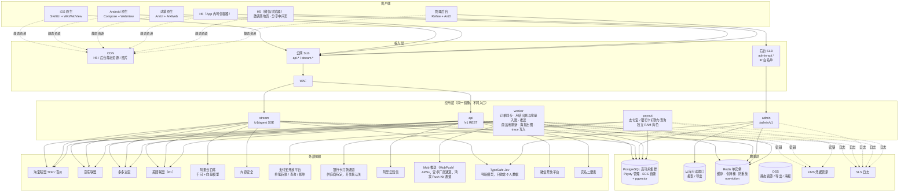
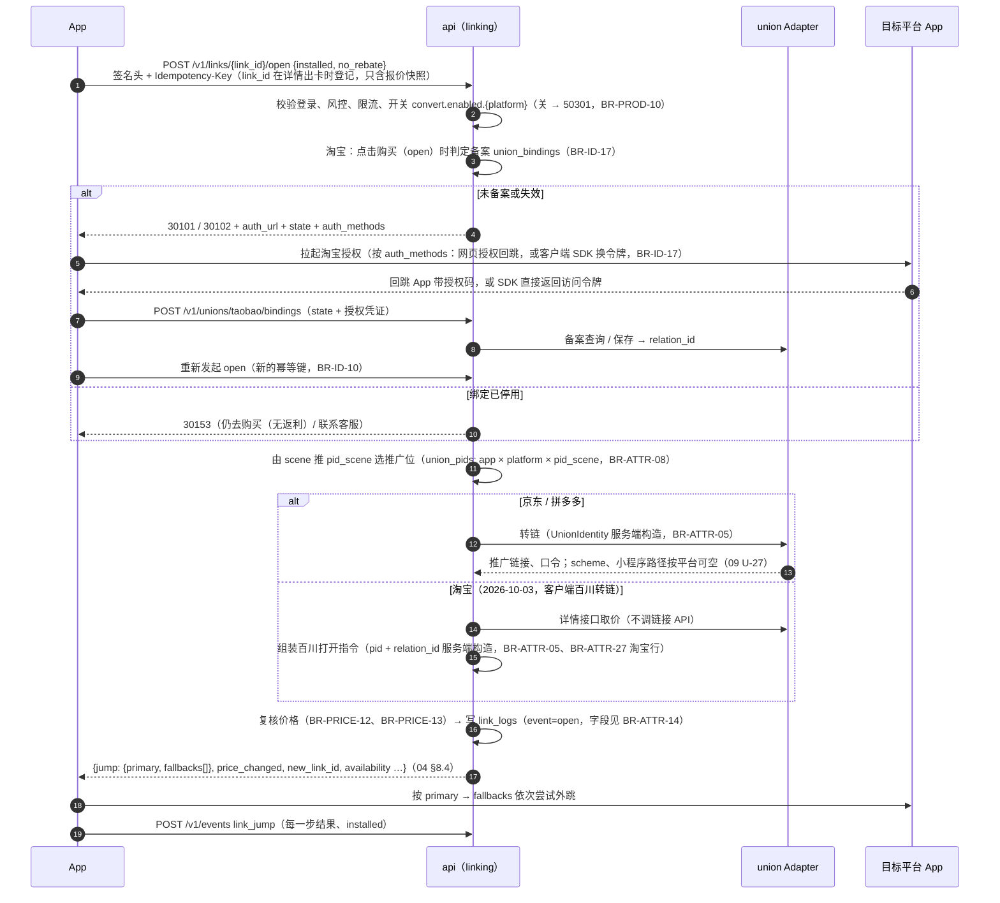
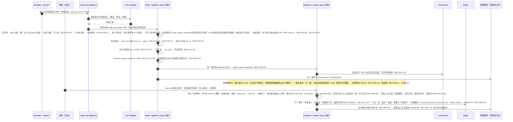
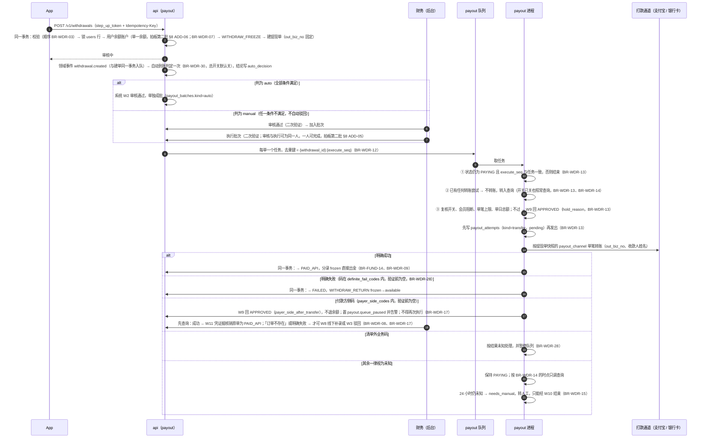
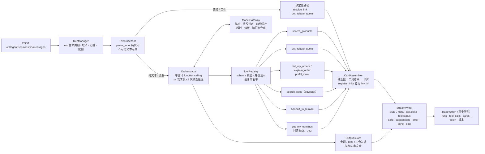

# 返利 App 规划文档 · 02 系统架构

2026-09-29 · 全新设计，不沿用花卷云的系统结构（D19）。决策编号见 `00_总览与决策.md`，接口与枚举细节见 `04_数据模型与契约.md`。**业务规则见 `规划/08_业务规则/`**，本文只写「BR-xxx」+ 一句话，冲突以 08 为准；外部能力见 `规划/09_平台能力验证/`（CAP-xxx），未验证项不作为事实。2026-09-30 按 08 回写，新增 §4.3、§17–§20。2026-10-01 §4.1 按 04 §3.2 补齐表归属（单一写者：推送 token 归 notification、风控状态归 risk；删除 order_items），§11 补 account.went_negative。2026-10-01 按拍板第二批（`docs/changes/20261001-拍板第二批.md`）与 9-30 拍板第一批回写：月结入账链路（§5.2、§8）、自动到账与银行卡通道（§5.3）、只登记不预转链（§5.1、§9.2）、仓库全部公开 + 私有存储（§12.7、§16）、域名表（§3.4）、监控与告警定型（§13）、TypeSafe Jev 判断适配模块（§4.1、§9.2、§14）、§16.3 第三列改回「禁止」。2026-10-01 晚按拍板第二批 §8 补充决定（ADD-01～07）回写：单一余额科目 `USER_BALANCE`（§5.3、§8）、后台权限点（§4.1、§12.5）、资金操作一人完成（§5.3、§8.5、§17）、站长联盟授权到期提醒与降级（§6.2、§13、§14）、经营数值上线前后台填写（§8.3）、注销负余额拦截（§8.3、§17）；按 §8 ADD-08 回写：站长授权每日探测、到期前与过期 / 失效时短信通知站长、过期或失效期间淘宝未绑定用户不能下单（§4.1、§6.2、§13、§14）。2026-10-01 技术栈定版：§16.3 改为由 `docs/adr/0001-技术栈基线.md` 锁定并更新数据访问、队列与事件、测试、迁移四行；§12.7 的无人值守运行、网络、依赖、注入、私有存储行与 `规划/11_开发协作与自主推进.md` 对齐；§19 加指针。2026-10-01 用语同步（规划/11 §9.1，00 §8 第 ① 类，只改措辞、不改规则含义）：全文被 ADR-0001 取代的技术名词改为现行或中立说法（数据访问层、数据库迁移、与业务写入同一事务入队的任务、五个进程入口、单实例 Redis、`CLOCK_NOW`）；§9.3、§12.7、§16.2 的私有库读取改为「公开仓库的 CI 不持有私有库凭据」；§16.2 目录树补 `db/`、改 ADR 与问题清单的位置；§3.2 改为四个环境，§19 必备字段、删除、查询三行按 ADR-0001 §4.3 的裁定改写。2026-10-01 晚按 ADR-0001 §4.2 第 10、16–22 项（编排者补定的实现选择，00 §8 第 ① 类）与 规划/11 §7.3 批准栏（负责人「全部同意」）同步：Redis 改 `noeviction`（§2 图、§3.1、§13、§14）；payout 不连 Redis、开关直读 PG（§3.1、§5.3、§10）；任务去重键（§5.3、§7.1）；`CLOCK_NOW` 放开到 staging（§6.2）；`event_log` 留痕与积压告警口径（§4.1、§11、§13、§15.1、§19）；Agent 冒烟回放合并门与批准栏结果（§9.3、§12.7）；§15.2 合计重算；§16.2 目录树补 `ops/`、`test/`、`tools/agent`、`tools/ops`、`tools/probe`；§19 补主键、金额 JSON 表示、角色与连接池指针。2026-10-02 按 ADR-0002（PostgreSQL 托管用 Pigsty，负责人 2026-10-01 提议，2026-10-02 确认采纳）回写：云上 PostgreSQL 与 Redis 由 RDS、云上 Redis 改为 ECS 上由 Pigsty 管理（§2 图、§3.1、§3.2、§12.6、§13、§14、§15.2、§16、§19、§20）。2026-10-03 按功能对照补缺第 1 批（`docs/changes/20261003-功能对照补缺.md`；缺口编号写作「功能对照 G-xx」）回写：§3.4 链接子域与关联文件、§5.1 图中淘宝授权方式、§12.2 设备标识无效值、§12.4 客户端安全基线指针、§12.6 补第三方登录、推送、短信、崩溃平台的密钥行与「安装包里只放公开标识」、发布制品密钥扫描，§12.7 加发布制品一行。 2026-10-03 按功能对照补缺第 2 批（`docs/changes/20261003-功能对照补缺.md`「第 2 批」）回写：§12.1 会话结束时解除推送令牌绑定（功能对照 G-17）、§12.2 发码与设备注册的风控默认值指针（G-20）、§15.1 订单类与账务分区只预建不删除（G-14）。 2026-10-03 按功能对照补缺第 3 批（同一变更记录「第 3 批」，功能对照 G-22～G-34）回写：§3.2 三套构建配置的指针与 §3.3 测试分发渠道的用途（G-29、G-32）、§3.3 接口层的最低版本拦截（G-24）、§10 版本条件只用单调门槛（G-32）、§12.4 路由入口与容器共同规则的指针（G-22、G-23）、§12.6 与 §12.7 的发布制品扫描加 Release 配置检查（G-29）、§16.2 apps.json 注释（G-30）。同日按评审与编排会话裁定修改（变更记录 3.9）：§3.2 测试包连生产时只保留切换服务器地址、切换环境清会话、草稿预览独立；§3.4 关联文件由 apps.json 生成；§12.4 推送载荷只带消息编号；§16.2 入站回调分两种。第 2 轮评审后（变更记录 3.10）：§3.3 接口层拦截的摘要改为「写接口默认受约束」，§12.1 access_token 的受限会话。 2026-10-03 按资金规则对齐（`docs/changes/20261003-资金规则对齐.md`，负责人批准）回写：§5.2 先判定后写库、锁后重读与入账凭证（同-06、同-07、同-08、同-13、同-23）；§5.3 打款步骤按 BR-WDR-13 ①②③ 重画并补付款方侧 W9、W11、W8、W10、清单外码暂停（同-18、决-08）；§7.2、§7.3 内部事件编码、处罚映射与判定顺序（同-07、同-15）；§8.3 补三行索引；§8.4 不变量公式指针（同-05）；§8.5 R1 行改为换算后的结算基数（同-01）；§18 资金记账行按 BR-FUND-16 加锁流程（同-06）。同日评审后修改（变更记录 §13.6）：§8.5 R1 行补基数相等时再比结算佣金与 booked_n_fen。 2026-10-04 按功能对照补缺第 4 批第 3 轮评审（`docs/changes/20261003-功能对照补缺.md` 4.10）回写：§4.1 linking 的表归属改为 links、link_open_attempts（待跟单卡的外跳上报与关闭都按每次打开尝试记录，`links.track_dismissed_at` 删除）。

2026-10-03 功能对照补缺第 5 批（`docs/changes/20261003-功能对照补缺.md`「第 5 批」，功能对照 G-66～G-96）：§3.3 强更按安装来源跳商店、能力增改后重新生成描述文件；§3.4 `l.` 子域加微信 SDK 的通用链接路径；§12.6 APNs 改用认证密钥、新增「到期登记」；§13 崩溃行加上报白名单，告警表加入口域名外部拨测与证书、域名到期两行；§14 新增 API 入口一行（单入口、不用明文或裸 IP 兜底）。同日按第 1 轮评审修改（变更记录 5.9）：§3.3 来源商店的已上架版本落后时用默认地址，提高最低支持版本前逐家核对商店（规则在 BR-ID-01 细则）。 第 2 轮评审后（变更记录 5.10）：§3.3 每家候选商店（含默认商店）都核对版本，一家都不够时显示引导；改商店登记与换默认商店同样核对。

2026-10-04 后台设计稿拍板（`docs/changes/20261004-后台设计稿拍板.md`）：§4.1 `support` 模块作废（客服工单取消，AI 举报归 `agent`，客服代办操作归各自模块的后台接口）；§12.5 后台二次验证分动态码与短信两档（BR-ID-34）；§13 告警「客服工单超出时限」改为「AI 举报超过 48 小时未处理」。

2026-10-05 Agent 页面引导卡（`docs/changes/20261005-Agent页面引导卡.md`，00 D31）：§9.1 图后说明加 page_guide 是意图不是工具；§9.2 加「页面引导」一行；§10 紧急开关清单加 `agent.page_guide.enabled`。规则见 08 BR-AI-01 细则「页面引导」。

2026-10-05 Agent 只读收益工具（`docs/changes/20261005-Agent只读收益工具.md`，00 D32）：§4.1 agent 依赖加 ledger、payout 中只读入口文件里登记的查询函数；§9.1 图与图后说明的工具由 7 个改为 8 个；§9.2 加「收益查询」一行，「页面引导」行改为与查收益分工。规则见 08 BR-AI-01 细则「收益查询」、BR-AI-02 ③。同日按 D31/D32 第 1 轮评审：§4.1 改为只放行 ledger、payout 的只读入口文件，§9.2 工具白名单门禁由三项改为四项、denylist 另扫最终工具定义。

2026-10-06 §16.2 目录：评测加载器落为 workspace 包 `packages/evals`（代码仓库 B3-01a；pnpm workspace 只收 apps/*、packages/*、tools、test），根目录不再列 `evals/`。

2026-10-05 实现改由 Opus、评审由 Codex（`docs/changes/20261005-实现改由Opus评审由Codex.md`）：§12.7「无人值守运行」行按新分工改写 Codex 写入型调用的用途，并加「Claude 实现子代理跑测试只经容器」「Codex 生成的可执行内容只在隔离容器或 CI 执行」（收紧项）；§16.2 目录树 `contracts/` 注释改为引用规划/11 §1.1。

---

## 1. 架构原则

**方案状态（D27、D28）**：保留三端原生壳的方向按 D28。本文部署拆分与模块设计是当前工作方案，随尚未接入的开发资料和能力验证完善；技术栈、版本线与数据库设计规则已由 ADR-0001 锁定（§16.3），改动须新写 ADR。已确认业务边界继续有效；普通实现调整由负责的代理回写理由及受影响位置，跨端或已有数据的改动同时处理兼容。

| # | 原则 | 落地方式 |
| --- | --- | --- |
| 1 | **模块化单体，按进程拆部署** | 一个 NestJS 代码库，按限界上下文拆模块；同一镜像以不同入口启动 api、stream、admin、worker、payout 五类进程。团队规模和 5 周工期不支撑微服务 |
| 2 | **接口按功能对齐，契约先行** | 按功能逐个先写 `contracts/openapi.yaml`（该功能的唯一事实源），代码按它校验；禁止由代码反向生成并覆盖契约；不以一次冻结全部接口为开工条件（D17、D27，拍板第二批 TECH-05） |
| 3 | **资金强一致，其余最终一致** | 余额、分录、提现状态在同一数据库事务内完成；推送、看板、风控等副作用走领域事件（作为任务与业务写入同一事务入队，§11），最终一致 |
| 4 | **外部依赖一律过治理层** | 每个联盟、千问、支付宝、银行卡通道、短信、推送、TypeSafe Jev 都封装成 Adapter，统一超时、重试预算、熔断、配额、录制回放 |
| 5 | **确定性交给代码，模糊交给模型** | 链接/口令识别、商品 ID 提取、转链、金额计算、卡片组装全部由代码完成；模型只做意图理解、条件抽取和一两句说明；卡片上每个数字的数据源见 BR-AI-04 |
| 6 | **配置即数据** | 首页、开关、文案、规则、推广位都是带版本的数据：可预览、可灰度、可回滚 |
| 7 | **默认安全** | 身份参数服务端注入；最小权限；打款私钥只在隔离进程可读；PII 加密存储；代理开发环境拿不到生产凭据 |
| 8 | **时间可注入** | 所有"月结账单日""每日""每月"逻辑都读注入的 `Clock`，测试和回放环境可以快进 |

---

## 2. 总体架构

前端各层的框架与运行位置见 [03 前端架构 §1.2](03_前端架构.md#12-前端技术总览)，本图只展示系统关系；后端选型见本文 §16.3。



**为什么这样拆进程**

| 进程 | 拆出来的理由 | 扩缩容依据 |
| --- | --- | --- |
| `api` | 普通 REST，无状态 | QPS、CPU |
| `stream` | Agent SSE 是长连接（单轮最长 20 秒），和普通请求混跑会占满连接池、拖慢 P95 | 并发流数 |
| `admin` | 独立域名 + IP 白名单 + 独立限流；后台导出等重查询走只读库，不影响用户侧 | 固定 1–2 个实例 |
| `worker` | 订单同步、入账、推送等后台任务，按队列分配并发 | 队列积压 |
| `payout` | 唯一能读打款通道密钥（支付宝私钥、银行卡通道凭据）的进程；无公网入站；出站只允许支付宝与银行卡通道域名；内部再做单笔和单日限额校验 | 固定 1 个实例 |

---

## 3. 部署与环境

### 3.1 生产拓扑（阿里云单地域、双可用区）

| 资源 | 规格建议（W0 按容量假设复核） | 说明 |
| --- | --- | --- |
| ECS · app 组 | 2 台，4C8G，跨可用区 | 跑 `api`、`stream`；Docker Compose，蓝绿两套 compose 切换 |
| ECS · worker 组 | 1–2 台，4C8G | 跑 `worker` |
| ECS · admin | 1 台，2C4G | 跑 `admin` |
| ECS · payout | 1 台，2C4G，独立安全组与 RAM 角色 | 只跑 `payout`；安全组出站白名单只放支付宝网关、银行卡通道网关（开通后，BR-WDR-32）与 PG；不连 Redis，开关（`payout.enabled` 等）直读 PG 配置表（ADR-0001 §4.2 第 20 项）；转账队列 concurrency=1（BR-WDR-13） |
| ECS · 数据库组（Pigsty，ADR-0002） | 3 台，4C8G 起，跨两个可用区 2 + 1，数据盘单独挂载；另配内网负载均衡 1 个作数据库入口（待核） | PostgreSQL 18 + pgvector，1 主 2 从：主库故障自动切到从库，同时失去两台要人工恢复；从库承担只读（报表、导出）。备份到 OSS 私有 bucket，保留期、时间点恢复与恢复演练见 ADR-0002 §4。应用连主库端口与只读端口，不经连接池（ADR-0002 §5）。取代原「RDS 高可用版 + 1 个只读实例」（2026-10-02）；台数与规格由负责人定 |
| Redis | 单实例，最大内存 2G；由 Pigsty 的 REDIS 模块管理，与数据库节点同机（ADR-0002 §2） | 承接原 cache 实例的全部用途：缓存、令牌桶与配额计数、防重放，以及 08 各条点名的 Redis 键（开关读取、短期锁、会话集合等）；不再承担任务队列，任务队列在 PostgreSQL，随 PG 备份与时间点恢复（ADR-0001 §2、§3）。`maxmemory-policy=noeviction`：每个键必须带 TTL、基数有上限；内存 70% 告警；写入失败时缓存路径降级为直读 PG；防重放 nonce、配额计数、refresh_grace 键不得被静默淘汰（ADR-0001 §4.2 第 17 项） |
| SLB | 公网 SLB（api、stream）；后台 SLB（admin，访问控制白名单） | stream 的空闲超时调到 ≥90 秒 |
| OSS + CDN | `h5-static`、`admin-static`、`media`（海报、图片）、`exports`（私有，签名 URL；文件过期与删除见 BR-ID-30）、`evidence`（私有：验收证据、录屏、真实订单登记，拍板第二批 TECH-02）、数据库备份 bucket（私有，staging 与 prod 各一个，各配专用 RAM 用户，ADR-0002 §4） | |
| SLS | 应用日志、访问日志、审计日志（副本） | 日志库 TTL 见 BR-ID-30 |
| KMS 凭据管家 | 全部 secret；数据加密用信封加密 | |
| 容器镜像服务 ACR | 镜像仓库 | 镜像签名，prod 只拉带签名的 tag |
| Sentry（境内自建） | 1 台 ECS | iOS、Android、H5、后端 |
| AGC Crash | 鸿蒙崩溃采集 | 已定（拍板第二批 TECH-15）；鸿蒙崩溃用户同意后才采集（负责人 2026-10-05，`docs/changes/20261005-资料冲突项拍板.md` §5）：华为对 API 11 及以上新应用提供免集成、自动采集的 APMS，接入前核对能否按用户同意控制采集，能才用，不能就不用 APMS，改用同意后由应用初始化的采集方式（具体途径待核实） |
| 自托管 Mac | 1–2 台，连 iOS / Android / 鸿蒙真机 | 夜间 UI 冒烟与录屏（拍板第二批 TECH-23）；放办公网，不连生产 |

### 3.2 环境

| 环境 | 用途 | 联盟 | 支付宝 | 数据 | 谁能部署 |
| --- | --- | --- | --- | --- | --- |
| `local` | 开发者 / 代理本机 | WireMock 录制回放 | 沙箱 mock | 合成数据 | 任何人 |
| `test` | CI、代理集成测试 | 录制回放（`X-Scenario` 切换场景，环境变量 `CLOCK_NOW` 切换时间线） | 支付宝沙箱 | 合成数据 | CI |
| `staging` | 联调、真机测试、内测前演练 | 生产联盟**只读** key + 测试推广位 | 沙箱 | 合成数据 + 少量真实测试账号 | CI + 人工批准 |
| `prod` | 生产 | 生产 | 生产（只有 payout 持有私钥） | 真实 | 仅人工批准（GitHub Environments） |

四个环境（local / test / staging / prod，ADR-0001 §4.3）的数据库、Redis、OSS bucket、KMS 密钥完全隔离。

数据库的形态按环境不同（ADR-0002 §3）：`local`、`test` 用容器镜像；`staging` 是 Pigsty 单节点（1 台 ECS，没有自动切换，允许停机）；`prod` 是 Pigsty 三节点高可用。各环境的 PostgreSQL 大版本与业务扩展版本一致。staging 与 prod 的数据库配置改动走私有仓库评审，prod 上的命令只由负责人执行（ADR-0002 §7）。

**包名与环境**（拍板第二批 TECH-08）：iOS Bundle ID 与 Android 包名为 `com.couli.app`（负责人 2026-10-02 确认）；鸿蒙 Bundle Name 为 `com.couli.hm`（负责人 2026-10-05 决定：华为 AppGallery Connect 要求鸿蒙应用包名不能与 Android 应用包名相同，`docs/changes/20261005-鸿蒙包名改为com.couli.hm.md`），官网域名 `couliapp.com`。测试包与正式包使用同一包名 / Bundle ID / Bundle Name，测试包（debug、staging 构建）只切换服务器地址，不另申请包名，同一设备上二者覆盖安装。W2 真实转链与首笔真实下单走 `staging`（生产联盟只读 key + 测试推广位）；S1 每平台 ≥20 笔真实订单走 `prod`，只用内测白名单账号（10 §0.7.1 登记）。三端设 Debug、Staging、Release 三套构建配置：调试能力（环境切换、时钟偏移、一致性测试页入口、首页草稿预览、诊断面板）只在非 Release 配置下编译，Release 只内置生产域名、不留任何解锁入口，发给团队以外的包一律是 Release（03 §3.6，2026-10-03 功能对照 G-29）。测试包连到 prod 时按本段原句「只切换服务器地址」收紧：除切换服务器地址外，调试路由、日志与诊断面板、结果注入、时钟偏移、代理或抓包信任、模拟数据等一律关闭，生产验收不得使用结果注入；切换环境时清除本机会话与缓存，两套环境的令牌不混用；首页草稿预览是独立的只读能力，二维码只带预览令牌与页面键，令牌只在签发它的环境有效（03 §3.6，2026-10-03 按编排会话裁定）。

### 3.3 发布

- 后端：蓝绿两套 compose，健康检查通过后切 SLB 权重；数据库迁移只做向后兼容变更（expand → 下一版本 contract）。
- H5：按版本目录上传 OSS，`index.html` 设 no-cache，静态资源内容哈希长缓存；入口按用户比例灰度 1% / 10% / 100%：服务端按 user_id 哈希分桶（未登录按 device_id，两者都没有时给稳定版），在 `/v1/config.h5_release` 下发版本目录，原生按其拼 URL；App 外落地页只用稳定版；新版 H5 调用桥方法前必须 `has()` 检查以兼容旧版 App（拍板第二批 TECH-28）；回滚 = 把入口指针切回上一版本目录。
- 管理后台：同 H5（不灰度）。
- App：三端同一版本号、同时发版（拍板第二批 TECH-07；鸿蒙与 iOS / Android 同步交付，D4，TECH-01）。内测：iOS TestFlight、Android 经第三方分发平台（平台由负责人选定）、鸿蒙 AGC 测试（TECH-18）。这些测试分发渠道只用于白名单内测（人数见 00 §5 M3），App 内外都不引导公众安装测试版，也不用它们代替正式上架（2026-10-03 功能对照 G-32）。公开：iOS 分阶段发布 7 天；Android 出一个通用包 + 一个华为渠道包（`X-Channel` 取值见 04 §5），各商店按渠道灰度；鸿蒙走 AGC 分阶段发布。强更按端与渠道配置，一律跳商店（`01` F-CFG-03，TECH-19）；Android 通用包对应多家商店，按本机的安装来源跳对应商店，读不到或来源商店的已上架版本落后时改看默认商店与其余商店，每一家（含默认商店）都要已上架不低于目标的版本才打开，一家都没有时显示「暂时无法更新」的引导（03 §4.1，2026-10-03 功能对照 G-85，第 2 轮评审后改）；提高最低支持版本、修改某家商店的已上架版本、更换默认商店都是发版运维清单的一项，保存前要按最低支持版本核对该端渠道涉及的每家商店，会让默认商店低于最低版本、或没有任何可安装版本的保存被拒，核对规则只在 BR-ID-01 细则「【去更新】打开哪家商店与保存前的核对」维护（第 1 轮评审后补，第 2 轮评审后扩到改商店登记与换默认商店）；App 的能力有增改时重新生成描述文件，证书与描述文件的到期日登记在私有运维手册（§12.6「到期登记」，2026-10-03 功能对照 G-94）；写接口另在接口层拦截过低版本（10405；写接口默认受约束，例外与受限会话见 BR-ID-01 细则「最低支持版本的接口层拦截」，2026-10-03 功能对照 G-24，第 2 轮评审后改）。
- 各类变更的灰度、观测、回滚总表见 §20。

### 3.4 域名表（拍板第二批 TECH-26）

主域名与分享页域名由负责人在 W1 前给定（06 Q-A5），scheme 同时给定；各用途分开子域，便于单独限流、证书与故障隔离。

| 域名 | 用途 | 说明 |
| --- | --- | --- |
| `api.<主域>` | App 与 App 内 H5 的 `/v1` REST | 公网 SLB + WAF |
| `stream.<主域>` | Agent SSE | 公网 SLB，空闲超时 ≥90 秒 |
| `h5.<主域>` | App 内 H5 页面与静态资源（CDN） | 写入 `bridge_origins` 白名单 |
| `admin.<主域>` / `admin-api.<主域>` | 后台前端 / 后台 API | 后台 SLB，IP 白名单 |
| `l.<主域>` | 深链（Universal Links / App Links / App Linking）与 `/.well-known/` 关联文件 | 只做跳转，不放页面。关联文件由 `apps.json` 入站回调里「经验证的自有域名链接」生成（03 §4.5，2026-10-03 功能对照 G-30），只放本子域，不放分享页域名与其他子域（分享页域名可能因微信拦截而更换）。`/r/<name>` 没有被 App 接管（未安装或系统未拉起）时由本子域 302，`LinkLanding` 按 link 类型分流：分享 link 回到它的分享中间页并带「未拉起」标记，页面改为显示下载入口；非分享 link（自购、Agent 等，以及不存在的 link_id，对外不区分）到下载引导页，不复用分享中间页与 `GET /v1/share-pages/{link_id}`。下载引导页不取任何 link 数据，匿名可见的内容见 BR-ATTR-05 细则。其他路由到下载地址（`/v1/config.compliance`）。各端从分享页点击能否拉起 App 以 CAP-X-03 实测为准（BR-ATTR-05 细则，2026-10-03）。微信 SDK 在 iOS 上回跳用的通用链接也放在本子域（2026-10-03，功能对照 G-81）：用一个微信专用的路径前缀（如 `/wx/`），在 `apps.json` 入站回调里登记为 `verified_link`（来源 SDK 为微信，适用端 iOS），关联文件里按微信文档的要求写成以 `/*` 结尾的路径（09 5_X §5.5）；关联文件由本子域直接返回、不经跳转；这个路径没有被 App 接管时，同其他路由一样回到下载地址。iOS 注册微信 SDK 时传入同一个地址，并在微信开放平台登记（06 Q-C12，前置是本子域的关联文件已上线） |
| 分享页域名（独立于主域） | App 外落地页：邀请落地页、商品分享中间页、下载引导页 | 微信内被拦截时单独处置，不影响主域（F-SHARE-04）；不放深链关联文件，中间页的【在 App 中打开】指向 `l.` 子域的深链（F-SHARE-07） |

---

## 4. 后端模块划分

### 4.1 模块表

每个模块是一个 NestJS module，目录 `apps/api/src/modules/<模块>/`。每张表（或一组列）只有一个写者；模块之间只能调用对方 `index.ts` 导出的 Service 接口（查询 / 命令）或订阅其领域事件，禁止直接读写对方的表；报表走只读实例；只有 `ledger` 改余额，金额只由 `packages/domain` 计算（后端功能规划 §1.3）。由 `dependency-cruiser` 在 CI 里检查。

| 模块 | 职责 | 拥有的表（主要） | 公开接口（节选） | 依赖 | 代理线（05 §2，线名见 08 §13.2） |
| --- | --- | --- | --- | --- | --- |
| `identity` | 注册登录、Token、设备注册、二次验证、同意记录（含劳务协议签署，BR-WDR-31）、实名、收款账号（支付宝 / 银行卡）、第三方空号并入老号（拍板第二批 OPS-04）、注销 | users（除 parent_id 等关系列）、user_oauth、devices、sessions、refresh_tokens（BR-ID-07）、login_logs（BR-INV-08）、consent_records、realname、payout_accounts、payout_account_changes（BR-WDR-02）、deletion_requests、deleted_identities（BR-ID-28）、user_tip_reads（BR-ATTR-21）；推送 token 与风控状态不在本模块（见 notification、risk） | `/v1/auth/*`、`/v1/devices`、`/v1/me*`（`/v1/me/appeals` 除外） | risk、notification | B1 |
| `union` | 联盟网关：各平台 Adapter、凭据、配额、熔断、录制回放、原始报文归档；站长联盟授权到期记录、每日巡检与探测、短信告警与重新授权（拍板第二批 §8 ADD-02、ADD-08） | union_accounts、union_credentials、union_pids、union_raw_payloads、order_sync_drops、order_sync_drop_keys（BR-ATTR-02） | 用户侧无 HTTP，供其他模块调用；后台 `/admin/v1/union-accounts/*`（含重新授权） | — | B1 |
| `catalog` | 搜索、详情、`product_key`、商品池、物料信息流、类目黑名单、缓存 | platforms（平台字典）、product_refs（BR-PROD-05）、product_key_aliases（BR-PROD-02）、product_pools、pool_items、category_blocklist；商品缓存在 Redis（BR-PROD-07） | `/v1/products*`、`/v1/search/*` | union | B1 |
| `parsing` | 输入识别（链接、口令、素材）、口令解析、素材结构化中的代码部分、黑话词典 | slang_dict | `/v1/inputs/parse`（C-14） | union、catalog | B1 |
| `linking` | 转链、`link_id` 登记、场景推广位选择、备案绑定、外跳方案、link_logs | links、link_open_attempts（每次打开尝试；外跳上报与待跟单卡的关闭按尝试记录，BR-ATTR-21）、link_logs、link_log_evidence（BR-ATTR-14）、union_bindings、union_auth_sessions（BR-ID-17） | `/v1/links/*`、`/v1/unions/*`、`/v1/share-pages/*`、`/v1/orders/pending-tracks*`（BR-ATTR-21，读 orders 归属结果） | union、catalog、identity | B1 |
| `orders` | 订单同步（order-sync，`platform_status` 唯一写者）、平台状态映射、App/用户归属、找回、订单黑名单 | order_keys（BR-ATTR-22）、orders（同步列；一行 = 一个子订单，不另建 order_items）、order_status_history、sync_cursors、claims、claim_items（BR-ATTR-17）；订单黑名单读 `risk` 的 blocklist（BR-ATTR-26、BR-ID-31，不另建表） | `/v1/orders*`、`/v1/orders/claims` | union、linking、commission、settlement（命令） | B1 |
| `commission` | 返利规则版本（含按平台的预留比例，BR-CALC-02）、分佣快照、预估计算（纯函数在 `packages/domain`；报价与入账同一拆分函数、同样先扣预留，BR-PRICE-06） | commission_rules、commission_rule_reserves、commission_splits、commission_split_amounts、commission_split_beneficiary_events（BR-CALC-10）、commission_split_totals（BR-CALC-27）；等级与上级按 paid_at 读 growth 日志（BR-CALC-12、BR-INV-14） | 无 HTTP | growth | B2 |
| `ledger` | 账户、凭证、分录、余额缓存、不变量校验、资产日快照、人工调账（拍板第二批 FUND-13） | ledger_accounts、ledger_vouchers、ledger_entries、account_balances、daily_balances（BR-FUND-19）、asset_snapshots、bad_debt_writeoffs（BR-FUND-12）、admin_adjustments（FUND-13）、recon_diffs（R1 / R2 经本模块命令登记，BR-FUND-23） | `/v1/wallet/*` | — | B2 |
| `settlement` | `rebate_status`、`hold`、`rights_pending` 唯一写者（BR-FUND-01、BR-FUND-06）；月结出账、一致性校验、确认后批量入账（BR-FUND-04，拍板第二批 FUND-01）、维权、扣回、入账后补差、联盟对账 R1；受益人份额 held 满 30 天告警（BR-CALC-13，FUND-17）；消费 `appeal.resolved` 生成申诉恢复差错单（BR-FUND-22，FUND-14） | orders（返利列）、order_rights、settle_jobs、settle_bills、settle_batches、settle_batch_items（BR-FUND-04）、order_settlements、settle_adjust_batches（BR-FUND-09）、settle_adjustments（含确认人字段，BR-CALC-23）、recon_union | 无 HTTP；提供 order_rights 写入命令 | orders、commission、ledger | B2 |
| `payout` | 提现单、审核、自动到账判定（BR-WDR-30，拍板第二批 FUND-02）、批量打款、PayoutChannel（AlipayChannel、BankCardChannel、WechatChannel，BR-WDR-27、BR-WDR-32、BR-WDR-33）、结果查询与人工处置（BR-WDR-14、15；不做冲正：失败与驳回经 WITHDRAW_RETURN 退回余额，BR-WDR-09）、通道对账 R2、垫资水位 | withdrawals、withdraw_holds（BR-WDR-05）、payout_attempts、payout_batches、recon_channel、fee_rules（BR-WDR-19）、tax_ytd（BR-WDR-20）、fund_ledger（BR-FUND-20） | `/v1/withdrawals*` | ledger、identity、risk | B2 |
| `payment`（开关默认关，D29） | 收款基础设施：支付单、渠道下单与调起参数、通知验签、查询、关单、原路退款、收款对账；PayChannel（WechatPayChannel、AlipayPayChannel，BR-PAY-03）；不读写用户余额（BR-PAY-07） | pay_orders、pay_notifications、pay_query_attempts、pay_refunds | `/v1/pay/orders…`；通知入口 `/notify/pay/wechat`、`/notify/pay/alipay`（公网、只凭验签） | ledger、平台基础模块 | B2 |
| `growth` | 邀请绑定、上下级关系、等级；P1 奖励活动 | users.parent_id、relation_change_logs、levels、level_change_logs；user_relation_closure P1（BR-INV-11） | `/v1/me/inviter`、`/v1/invites` | identity、risk | B1 |
| `taolijin`（后续接入，D7） | 淘礼金商品池、发放、预算的可选扩展；首版关闭 | 候选 tlj_pool_items、tlj_claims、tlj_grants，接入时再建 | 候选 `/v1/taolijin/*` | union、linking、risk；核心购买不依赖本模块可用 | 按任务分工 |
| `agent` | 会话、编排、工具注册、护栏、模型网关、结果集、卡片、trace、规则 RAG、AI 举报的处理记录与 48 小时超时告警（BR-ID-15，2026-10-04 由 support 移入） | agent_sessions、agent_runs、agent_messages、agent_tool_calls、agent_result_sets、agent_cards、rule_chunks | `/v1/agent/*` | parsing、catalog、linking、orders、content、judge（结果核对）、taolijin（后续接入时可选，只读）、identity（只读）；ledger、payout 只限各自的只读入口文件（`ledger/read.ts`、`payout/read.ts`，占位路径，只导出登记的钱包汇总、提现记录查询函数；只读收益工具取数，D32，2026-10-05）；依赖禁区见 BR-AI-02 | B3 |
| `judge`（拍板第二批 JEV-01） | 判断适配：封装 TypeSafe Jev（锁定版本、硬超时 400ms、每轮合并 1 次请求、录制回放）；只接收公开商品标题、需求短词、运营文案与合成数据，不接收用户身份、聊天原文、价格、佣金 | 无（调用结果记入调用方 trace） | 无 HTTP；只供 agent（结果核对）与 content（文案语义预检）调用 | — ；dependency-cruiser 禁止 ledger、commission、settlement、payout、orders、linking 引用本模块 | B3 |
| `content` | 页面配置（SDUI，含草稿预览）、CMS 文章、协议（含劳务协议）、字典、配置与开关、App 版本（按端与渠道）、H5 灰度入口 | pages、page_versions、page_preview_tokens、articles、agreements、dict_items、config_items、kill_switches、app_versions | `/v1/pages/*`、`/v1/config`、`/v1/dict`、`/v1/articles*`、`/v1/app-versions/check` | judge（文案语义预检，不可用时跳过） | F1 |
| `notification` | 通知模板、推送 Adapter、站内消息、短信；通知分类（服务 / 订阅 / 营销）、频控、合并、免打扰（BR-WATCH-15） | notify_templates、inbox_messages、push_tokens（推送 token 唯一存处，devices 不存）、notify_logs | `/v1/messages*`、`/v1/me/notification-settings`、`/v1/devices/push-token` | identity | B1 |
| `watch`（P1） | 订阅提醒；边界见 §4.3 | 候选，ADR 定（BR-WATCH-20） | `/v1/watches`（P1，契约不在 M0 冻结） | catalog、union、linking、notification | B1 |
| `risk` | 请求签名、限流、设备风险、硬规则、黑名单、风控状态（冻结期限与到期恢复，OPS-12）、申诉（订单申诉不改账户状态，OPS-07） | risk_rules、risk_hits、blocklist、user_risk_state（风控状态唯一存处，users 不设 risk_state 列）、appeals（BR-ID-36） | `/v1/me/appeals`；其余为中间件 + 服务 | — | B1 |
| `analytics` | 埋点接收（事件与字段按 `specs/events.yaml`，拍板第二批 TECH-21）、漏斗与报表 SQL | events（分区） | `/v1/events` | — | F1 |
| ~~`support`~~（拍板第二批 OPS-08；2026-10-04 作废，客服工单取消，docs/changes/20261004-后台设计稿拍板.md §2，模块名不复用） | 原：客服工单：类型、状态、处理人、时限、超时告警；AI 举报自动建单；个人信息副本导出的人工流程（OPS-19） | support_tickets、support_ticket_events | 无用户侧接口（企业微信只聊天）；后台 `/admin/v1/tickets` | identity（只读）、agent（举报事件） | F1 |
| `admin` | 后台账号、权限点（超管全有，其他账号由超管逐项勾选，拍板第二批 §8 ADD-04）、操作日志、后台二次验证；各业务模块的后台接口在各自模块的 `http/admin/` 下，由本模块统一挂载守卫 | admin_users、admin_permissions、audit_logs | `/admin/v1/auth/*` | 全部 | F1 |
| `platform` | `JobQueue` 接口与领域事件同事务入队、消费去重、幂等（含需要二次验证的四个操作的未决键作废，BR-ID-10 细则「敏感操作的幂等键」）、Clock、加解密、HTTP 治理、配置读取、分布式锁 | processed_events、idempotency_keys、event_log（领域事件留痕，只追加，§11）；任务表由队列库自管，不单列 | `POST /v1/idempotency-keys/abandon`（2026-10-03，B1-02 实现） | — | B1（B1-01 脚手架） |

### 4.2 模块内部分层

```
modules/orders/
  domain/            # 纯 TS：实体、值对象、状态机（由 specs 生成）、领域事件；不依赖 Nest 和数据访问层
  application/       # 用例服务：SyncOrdersService、AttributeOrderService、ClaimService
  infra/             # 数据访问层仓储、任务入队（经 JobQueue）、外部 Adapter 适配
  http/public/       # /v1 控制器（只做鉴权、参数、调用用例）
  http/admin/        # /admin/v1 控制器
  jobs/              # 任务处理器
  index.ts           # 对外导出的 Service 接口和事件类型
  AGENTS.md          # 本模块硬规则（资金、订单模块必有）
```

规则：`domain/` 里的函数必须是纯函数，金额运算只调用 `packages/money`，状态迁移只调用生成的 `transition()`（订单分 `order-platform.yaml`、`order-rebate.yaml` 两套，CAS 迁移，BR-FUND-01）；这样资金和状态逻辑可以用属性测试穷举。

### 4.3 订阅提醒服务（P1）

MVP 不建 watch 相关表、不注册提醒工具，只预埋 price_snapshot 写入钩子、`watch_alert` scene、通知分类（BR-WATCH-19，待决策）。S3 只交付一个商品的降价提醒（目标价模式，BR-WATCH-01、BR-WATCH-26）。

**模块边界**

| 组件 | 职责 | 规则 |
| --- | --- | --- |
| 订阅管理 | 创建须用户确认（Agent 只出确认卡）；生命周期五态；每用户上限 | BR-WATCH-18、BR-WATCH-10、BR-WATCH-17 |
| 去重与调度 | 同一商品跨用户合并为 1 个被监控对象（CAP-*-13 通过的平台）；PG `next_fetch_at` 索引 + worker 批量拉取，不按商品建定时任务；分层频率 | BR-WATCH-08、BR-WATCH-07 |
| 抓取 | 走 union 网关的独立提醒配额桶，查询专用推广位 `pid_scene=query`，不带用户参数 | BR-WATCH-06、BR-WATCH-08、BR-PROD-07 |
| 存储 | **价格观测**（每次为提醒发起的查询结果，成功失败都写，是判定与新鲜度的唯一依据）与**价格变更历史**（价格变化才新增行）分两张表存，判定器不读变更历史 | BR-WATCH-05 |
| 判定 | 纯规则代码、两次确认、回合与冷却、同一订阅串行 | BR-WATCH-06、BR-WATCH-11、BR-WATCH-12 |
| 投递 | 事件作为任务与业务写入同一事务入队，交 notification；发送前复核、分类频控、合并、免打扰 | BR-WATCH-13、BR-WATCH-15 |
| 落地 | 点击进落地页只取报价不转链，点购买才 open | BR-WATCH-16 |

**依赖**：catalog（product_key、价格口径 BR-WATCH-03）、union（配额桶，§6.2）、linking（`watch_alert` link 登记）、notification（分类与合并）、content（开关 `watch.enabled.<platform>`，BR-WATCH-27）。

**表模型**：「统一任务表承载七类订阅任务」只是候选方案，P1 开工（WT-01）由 ADR 在统一表与按类型分表之间选定，不作为业务规则引用（BR-WATCH-20）。

**未知项**（结论前按 08 默认值开发、不对用户承诺）：

| 未知项 | 影响 | 验证 |
| --- | --- | --- |
| 跨用户共享查价是否成立 | 不成立的平台按用户查价，上限下调 | CAP-TB-13、CAP-JD-13、CAP-PDD-13（09 V-34，W8） |
| 批量接口上限、日配额 | 可承诺的检查间隔「约每 X 小时」 | CAP-X-10、各平台 -12 |
| 拼多多 goods_sign 稳定性、goods_id 是否下线 | 提醒键与查询计划 | CAP-PDD-01、CAP-PDD-13（09 附录 A-11） |
| 提醒存储增量与分区 | §15.1 容量 | 按 BR-WATCH-05 估算，W8 实测后修正 |

---

## 5. 关键链路

### 5.1 转链与跳转（商品详情 → 下单）

出卡（搜索、详情、首页、识别、Agent）时只登记 `link_id` 与报价快照、不转链；用户点击购买一律走 `POST /v1/links/{link_id}/open` 实时转链（拍板第二批 TRADE-03）。`POST /v1/links/convert` 只供没有 link_id 的入口（H5 `trade.convertAndOpen`），在同一请求内登记 link 后按本图处理。客户端 8 秒未收到响应即提示「网络不稳定，请重试」，重试沿用同一幂等键，不自动外跳（TRADE-22，03 §7.4）。



**淘宝改为客户端百川转链（2026-10-03，实现方案；docs/changes/20261003-淘宝转链改客户端百川.md）**：淘宝联盟的链接 API（万能转链按链接 / 口令转换等）是邀请制，门槛新 App 首版达不到，只有基础 API（搜索、详情、店铺、推荐）可自助申请（09 2_TB §2.5、CAP-TB-06）。因此 `linking` 对淘宝不调用服务端转链：open / convert 照常做归属与授权校验、价格复核（取详情接口）和 link_logs，响应的 `jump` 里放百川打开指令（有本用户的我方推广链接时 openByUrl 且不传 pid；否则 openByCode 按 item_id 打开并带 pid + relationId，由 SDK 转链），客户端按指令原样执行。路径、降级与「我方推广链接」的取用条件只在 BR-ATTR-27 淘宝行维护。京东、拼多多仍在服务端转链，不变。指令需要的契约字段变更列在上述变更记录，契约改好之前 `JumpStep.value` 不足以承载百川参数。

### 5.2 订单同步 → 归因 → 入账



### 5.3 提现与打款



**硬规则**：`payout` 任务禁止重试"转账"动作，只允许重试"查询"；`out_biz_no` 在提现单创建时生成、永不改变；批次失败不整批重跑（BR-WDR-12）；打款步骤顺序以 BR-WDR-13 ①②③ 为准（先看已有尝试、后复核，2026-10-03 资金规则对齐同-18）；已挂在别的批次上的 APPROVED 单人工组建批次时原子改挂（BR-WDR-12）。状态机见 BR-WDR-08。图中任务的去重键实现为队列的 `singletonKey`（不是任务 id），与「排队期间同键新任务被静默丢弃」是否等价在 B1-01 实测；payout 进程的开关直读 PG 配置表，不经 Redis（ADR-0001 §4.2 第 19、20 项）。银行卡通道未开通（`payout.channel_enabled.bank_card=off`，默认）时，银行卡收款单 EXECUTE 逐单跳过、不参与自动到账，只能由财务从企业对公账户线下转账后按 W8 补录（BR-WDR-32、BR-WDR-16，拍板第二批 FUND-03）。微信零钱通道（BR-WDR-33，2026-10-04；`payout.channel_enabled.wechat` 默认 off）：转账发起后要用户在微信确认收款，结果只靠 payout 进程查询、不接收微信回调，超过确认截止时间由 payout 进程撤销；同样只查不重提。

### 5.4 Agent 找货回合

见第 9 节。

---

## 6. 联盟网关

### 6.1 Adapter 接口

每个平台实现同一组接口，返回统一 DTO；平台差异（签名算法、字段名、分页方式、时间窗上限）全部封装在 Adapter 内。

```ts
interface UnionAdapter {
  platform: Platform;                                   // 'taobao' | 'jd' | 'pdd' | 'meituan' | ...
  searchItems(q: SearchQuery, ctx: CallCtx): Promise<Page<UnionItem>>;
  getItem(ref: ItemRef, ctx: CallCtx): Promise<UnionItemDetail>;
  resolveLink(raw: string, ctx: CallCtx): Promise<ResolvedLink>;        // 链接 / 口令 → 商品
  convert(req: ConvertReq, identity: UnionIdentity, ctx: CallCtx): Promise<ConvertResult>;
  bindPublisher?(req: BindReq, ctx: CallCtx): Promise<BindResult>;      // 淘宝渠道备案、拼多多授权
  listOrders(win: TimeWindow, opt: OrderQueryOpt, ctx: CallCtx): Promise<Page<UnionOrder>>;
  listRefunds?(win: TimeWindow, ctx: CallCtx): Promise<Page<UnionRefund>>;
  listPunishments?(win: TimeWindow, ctx: CallCtx): Promise<Page<UnionPunish>>;
  materialFeed?(req: MaterialReq, ctx: CallCtx): Promise<Page<UnionItem>>;
  createTaolijin?(req: TljCreateReq, ctx: CallCtx): Promise<TljCreateResult>;
}
```

- `UnionIdentity` 只能由 `linking` 服务端构造，Adapter 与 Agent 工具都不接受外部传入的身份（BR-ATTR-05、BR-AI-03）。
- **淘宝单点风险**（09 附录 A-2）：识别与 A/B/C 判定依赖万能转链 `material_list` 邀约权限（CAP-TB-01、CAP-TB-09）；转链降级 `item_dto` 按 ID → privilege.get（候选）→ `convert.enabled.taobao=off`，W0 书面答复后定型。**2026-10-03 更新**：链接 API 为邀请制、首版拿不到（09 2_TB §2.5），淘宝 Adapter 的 `convert` 不调联盟接口，只返回百川打开指令所需的推广位与 relation_id（见 §5.1 淘宝说明）；`resolveLink` 对淘宝按「链接中直接带的商品 ID → 口令解析出原链接（`taobao.tbk.tpwd.parse`，权限待核）→ 推广链接解析商品 ID（`taobao.tbk.item.click.extract`，在下线权限保留包，大概率拿不到，待核）→ 30132 + 标题搜索」逐级尝试，取到 item_id 后用基础 API 详情出卡。
- 每次调用记录 `union_raw_payloads`（请求摘要、响应原文、耗时、错误码），留存见 BR-ID-30，便于对账和纠纷。

### 6.2 治理层

| 能力 | 规则 |
| --- | --- |
| 超时 | 在线调用 3 秒；离线（同步、刷新）10 秒 |
| 重试 | 只重试幂等读，最多 2 次，指数退避；转链不自动重试（由客户端重放同一幂等键） |
| 熔断 | 10 秒窗口内错误率 >50% 且请求 ≥20 次，熔断 30 秒；熔断期间按降级表处理 |
| 配额 | Redis 令牌桶；桶的键（联盟账号或 appkey）待 CAP-TB-12、CAP-JD-12、CAP-PDD-12 确认配额口径（09 §0.2 硬规则 5；06 Q-G5、Q-G14）后定，代码按可配置键实现；若按联盟账号计且与优券汇共用联盟账号（06 Q-A4 默认），桶容量取控制台配额扣除优券汇实测用量后的余量，且上游限流错误码一出现即全局降档。按用途切分：MVP 在线（转链、搜索、详情）60%、订单同步 30%、商品池刷新 10%；P1 提醒开启后商品池刷新 5%、提醒 5%（BR-WATCH-08，实测后调整）；在线余量不足时先暂停商品池刷新 |
| 凭据 | `union_credentials` 加密存储；到期告警、自动刷新、不可刷新凭据走运营工单按 BR-ID-24；站长授权（淘宝一次有效 90 天，为负责人现用系统确认，京东、拼多多待 CAP-*-12 实测）到期时间记 `union_accounts.auth_expires_at`；每日巡检（`union.auth_probe_cron`）查到期时间并实际调用 1 次依赖该授权的只读接口，结果记 `last_probe_*`；到期前 14、7、1 天及过期 / 探测失效时经阿里云短信通知站长（`union.auth_alert_phones`，可多个）并后台告警，后台提供「重新授权」；过期或失效期间依赖该授权的接口（如淘宝渠道备案、私域相关接口）停止调用并告警（订单同步若依赖该授权则记断点、恢复后补拉），淘宝未绑定用户不能下单（30101 / 30102 `auth_unavailable`，不提供无返利购买），不影响已绑定用户的归属记录（拍板第二批 §8 ADD-02、ADD-08；影响范围以 08 BR-ID-24 为准） |
| 录制回放 | Adapter 的 base URL 从配置读取；test 环境指向 WireMock；场景用 `X-Scenario`，时钟用注入的 `Clock`（环境变量 `CLOCK_NOW`，在 local、test、staging 生效，prod 设置了就拒绝启动，ADR-0001 §4.2 第 10 项）；fixture 目录 `fixtures/union-recordings/<platform>/<scenario>/` |

### 6.3 推广位（`union_pids`）

| 字段 | 说明 |
| --- | --- |
| app_id、platform、union_account_id、site_id（淘宝） | |
| pid_scene | `self_buy`、`share`、`agent`、`taolijin`、`fallback`、`query`（只查价不转链，BR-PROD-07）；由转链 scene 推出（BR-ATTR-08） |
| pid 原值 | 淘宝 adzone_id（`mm_a_b_c`）、京东 positionId、拼多多 pid、美团 sid 前缀 |
| status | pending / active / retired；禁止删除（BR-ATTR-02） |

订单入库时按推广位反查 pid_scene 与 App 归属；**推广位不在新 App 白名单的订单直接丢弃**（只记计数，D1；匹配键与状态见 BR-ATTR-02）。花卷云侧"忽略的 PID"配置与双向验证是运营动作，不是系统依赖，按 BR-ATTR-28（待验证；淘宝媒体级 `mm_a_b` 覆盖待 AF-07 证实，证实前每个推广位仍逐条补填，证据为 AC-S1-28-*）。

---

## 7. 订单同步

### 7.1 同步任务

| 平台 | 增量 | 窗口 | 回扫 | 维权 / 处罚 |
| --- | --- | --- | --- | --- |
| 淘宝 | 每 1 分钟（联盟应用处于测试状态、日配额 5000 次期间用 2 分钟，09 2_TB §2.5），按更新时间，按 order_scene 分路拉（路数待 CAP-TB-07，09 附录 A-3），游标翻页 | 20 分钟（官方上限见 CAP-TB-07，09 附录 A-4） | 每小时按付款时间回扫近 3 小时；每天近 30 天；每周近 90 天 | 每 30 分钟拉维权退款与处罚订单；每天回扫近 60 天（接口与回扫范围待 CAP-TB-08，U-21） |
| 京东 | 每 1 分钟，按更新时间 | ≤1 小时 | 每天回扫近 30 天 | 随订单行；佣金变 0 按 BR-FUND-08 |
| 拼多多 | 每 1 分钟，增量接口，从末页倒序翻 | 30 分钟（待 CAP-PDD-07 / V-06 核对，U-24） | 每天回扫近 90 天 | 随订单状态 |
| 美团（P1） | 每 5 分钟 | 以文档为准 | 每天 | 随订单状态 |

- 水位 `sync_cursors(platform, union_account_id, query_kind, scene)` 持久化；窗口任务的去重键 = `platform:account:kind:window_start`（实现为队列的 `singletonKey`，不是任务 id，ADR-0001 §4.2 第 19 项），天然去重。
- 同一子订单的同步、找回、管理员变更按 order_key 串行；防旧覆盖开关默认关（BR-ATTR-01）；早于 `sync_start_at` 的订单不入库（BR-ATTR-02）。
- 失败窗口进死信队列并告警；手动同步（后台）按"平台 × 时间窗 × 状态"投递同样的窗口任务。
- 增量同步间隔按平台配置 `order_sync.<platform>.interval_seconds`（默认 60；负责人 2026-10-03 要求跟单通知越快越好，docs/changes/20261003-拍板第三批.md §1）；配额不足或被限流时自动退避到 120 秒并告警。
- 延迟目标：付款到入库 P95 ≤5 分钟，超过 15 分钟告警（平台侧「付款到可查询」的延迟待 CAP-*-07 实测，不由我方控制）；订单入库并归因后，跟单通知在 BR-TEXT-09 的合并窗口结束时发出，入库到发出超过 60 秒告警。
- **大促模式**（开关 `order_sync.promo_mode`）：淘宝窗口 ≤20 分钟、提高同步频率、放大同步配额占比；10-15 至 11-13 默认开启（日期以天猫官方公告为准，U-83）。

### 7.2 平台状态映射

每个平台一张映射表 `specs/order-status-map/<platform>.csv`：`平台状态码 → 内部事件`，例如淘宝"付款"→ `PLATFORM_PAID`、"确认收货"→ `PLATFORM_RECEIVED`、"结算"→ `PLATFORM_SETTLED`、"失效"→ `PLATFORM_INVALID`。内部事件编码与 P 表（P1–P15）见 BR-FUND-01、08 §13.2；处罚类原始码映射为 `PLATFORM_PUNISH`，不映射为失效（哪些码属于处罚以 09 实测为准，BR-FUND-02）。内部事件只驱动 `platform_status`，`rebate_status` 由 settlement 迁移（BR-FUND-01，双状态已由负责人 2026-09-30 确认）。判定先于写库：表外事件与 P10 倒退的报文不更新订单的任何列；映射表外的状态告警并进待处理表，不丢弃、不猜测，未入账订单同时由系统 hold；时间字段、结算佣金写入时点等边界按 BR-FUND-02。

### 7.3 归因流水线

```
原始订单（顺序 BR-ATTR-01；时间比较一律用 attr_at，BR-ATTR-25）
 → App 归属（推广位白名单，BR-ATTR-02）   失败：丢弃计数
 → 状态判定（BR-FUND-01 迁移表，先判定后写库） 表外事件或倒退：不写订单列，进待处理表并告警
 → 用户归属（BR-ATTR-06；淘宝按 attr_at 时点的有效绑定，BR-ATTR-07）
                                       失败：未归因池（可被找回，BR-ATTR-16）
 → 黑名单（BR-ATTR-26）         命中处理见 BR-ATTR-26
 → buy_type（BR-ATTR-08）                取不到：buy_type=self，scene_basis=fallback（BR-ATTR-09）
 → 来源回填（BR-ATTR-15）
 → 分佣快照（首次已归因且 platform_status 到 PAID 及之后，含找回、管理员变更，BR-CALC-10）
 → 双状态迁移 + 领域事件入队（同一事务，BR-FUND-01）
```

- 未归因订单每次更新都重跑用户归属；已归属订单的 `user_id` 只能由找回或管理员变更改写（BR-ATTR-01、BR-ATTR-20）。
- 订单黑名单命中处理按 BR-ATTR-26（渠道维度作废未入账订单；尾号维度在 CAP-TB-07 验证前只记 risk_hits 转人工；已入账订单只进人工复核）；受益人账号级失效只让其份额归平台（BR-CALC-13）。
- 订单侧黑名单：只按 BR-ATTR-26 执行，名单存 BR-ID-31 的 blocklist。
- 多次点击、多入口：只以联盟回传的推广位和参数为准（BR-ATTR-12）。

---

## 8. 账务

### 8.1 模型

- **复式记账**：每个 `uniq_key` 一张凭证（`ledger_vouchers`），≥2 条分录（`ledger_entries`），借贷合计为 0；一笔业务可含同一事务内的多张凭证。凭证、红冲键、多账户加锁顺序、`balance_after_fen`、平台科目不缓存余额等硬约束见 BR-FUND-16。
- **只插入**：数据库角色对 `ledger_entries` 没有 UPDATE/DELETE 权限；更正一律红冲 + 重记。
- **唯一业务键**：`uniq_key`（如 `{order_key}:{user_id}:{role}:CREDIT`，order_key = `{platform}:{sub_order_id}`，BR-FUND-05）上唯一索引，重放不重复入账。
- **余额缓存**：每个用户只有一个余额账户（拍板第二批 §8 ADD-06），`account_balances(available_fen, frozen_fen, version)` 每用户一行，只是分录的缓存；变更时 `SELECT … FOR UPDATE`，与分录同事务。
- **日切**：00:00 +08:00；"每日/每月/当日"都按此口径。

### 8.2 科目

| 科目 | 性质 | 说明 |
| --- | --- | --- |
| `USER_BALANCE:{uid}` | 负债 | 用户余额（单一余额：自购返利、分享收益、直推 / 间推分佣都入此科目，来源由 ledger_type + sub_type 区分；间推开关见 BR-CALC-05），含 available / frozen 子户（拍板第二批 §8 ADD-06，取代原 USER_SELF / USER_PROMO 两科目） |
| `UNION_RECEIVABLE:{platform}` | 资产 | 应收联盟佣金 |
| `CASH_ALIPAY` | 资产 | 企业支付宝余额 |
| `COMMISSION_REVENUE` | 收入 | 平台留存佣金 |
| `FEE_INCOME` | 收入 | 提现手续费（MVP 为 0） |
| `TAX_PAYABLE` | 负债 | 代扣个税 |
| `MKT_EXPENSE` | 费用 | 淘礼金、奖励等营销费用 |
| `BAD_DEBT` | 费用 | 负余额核销 |
| `CASH_BANK`（候选） | 资产 | 企业对公银行账户：银行卡通道出金与线下转账补录（BR-WDR-32）；科目名与分录以 `specs/ledger-rules.md` 为准 |

不设 `WITHDRAW_IN_TRANSIT`，打款中资金留在 frozen（BR-FUND-14）。不设单一的调账科目：人工调账（ADMIN_ADJUST）的对方科目按原因码取上表科目（BR-FUND-24 ⑥，08 §13.5）。后端功能规划 §2.8 的账户代码按 08 §13.5 映射。

### 8.3 分录模板索引

分录模板（借贷科目、凭证拆分）只在 08 维护，本节只做索引。订单入账与扣回按受益人各一张凭证、平台一张凭证，同一事务提交（BR-FUND-05），不是一张合并凭证；金额示例见 BR-FUND-05 细则。

| 业务 | 分录模板所在条目 |
| --- | --- |
| 订单入账（月结批次） | BR-FUND-04、BR-FUND-05 |
| 扣回 | BR-FUND-08 |
| 月结补差（全额重算与确认，一人可完成，ADD-05） | BR-CALC-09、BR-CALC-23 |
| 联盟回款 | BR-FUND-20 |
| 提现各状态（申请冻结、打款成功含净额 / 税 / 费、失败、驳回） | BR-WDR-09（BR-FUND-14 只管 frozen 口径，不维护提现分录） |
| 负余额核销（BAD_DEBT_WRITEOFF） | BR-FUND-12 |
| 作废 / 扣回订单被平台恢复（ADMIN_RESTORE） | BR-FUND-22 |
| 被剥夺份额记平台（每受益人一张 FORFEIT 凭证） | BR-CALC-13 |
| 受益人补记项（暂缓解除、延后正差）随月结批次补记 | BR-FUND-04 ⑫、BR-FUND-01 R5a |
| 已入账订单改派：先红冲再按新快照重记（红冲可使余额变负） | BR-FUND-01 R14、BR-ATTR-20、BR-FUND-10 |
| 人工调账（ADMIN_ADJUST，对方科目按原因码取，BR-FUND-24 ⑥） | BR-FUND-24（拍板第二批 FUND-13；一人可完成、step-up、写审计，拍板第二批 §8 ADD-05）；流水类型 BR-FUND-15，科目 08 §13.5；分录模板以 `specs/ledger-rules.md` 为准 |
| 注销：完成时余额转平台收入（ADMIN_ADJUST）；注销后到账的扣回记平台坏账；余额为负时不能申请注销（30416） | 拍板第二批 FUND-09、拍板第二批 §8 ADD-07；BR-ID-27、BR-ID-28、BR-FUND-24、BR-FUND-08、BR-FUND-12 |

科目表、分录模板最终以 `specs/ledger-rules.md` 为准（W1 由代理按 08 起草，不设签字关卡，D11）；上线前要填的经营数值（各平台预留比例、各等级比例、间推比例、提现限额、垫资告警线、坏账核销门槛）开发期用占位值，上线前由超管在后台填写，之后随时可改、立即生效（按订单付款时间选版本，不回溯；拍板第二批 §8 ADD-03，取代 FUND-21「W1 随该文件一次给出」）；舍入默认见 BR-CALC-08。

### 8.4 不变量（属性测试 + 每日生产校验）

不变量与差异处理（账户级 / 全局两级）见 BR-FUND-19，另加 frozen = Σ 非终态提现单（BR-FUND-14）。实现：属性测试 + 每日 `ledger_invariants.sql`（时刻按 BR-FUND-19，C-17；在当日资产快照之后运行；④⑤ 的公式按 2026-10-03 资金规则对齐后的 BR-FUND-19 写：受益人净额不为负，应收联盟净额 = booked_n_fen − 待补记额）；验收 AC-S2-26、AC-S2-30、AC-S2-32。

### 8.5 对账与垫资

| 对账 | 数据 | 粒度 | 频率 |
| --- | --- | --- | --- |
| 月结出账校验 | 联盟结算数据 vs 分佣快照当前基数（容差默认 0 分） | 子订单 | 每月账单日（默认 24 日，BR-FUND-04） |
| R1 联盟 | 联盟结算明细（唯一依据）按 BR-CALC-02 换算后的结算基数 vs 已入账基数 booked_base_fen；基数相等时再比结算佣金 vs booked_n_fen（只调平台金额） | 子订单 | 正差候选随月结账单生成任务运行，财务可手动触发；负差在结算额写入的同一事务即时处理（BR-FUND-09） |
| R2 通道 | 支付宝账务明细（银行卡通道开通后加银行流水；线下转账按流水号）vs 提现单 `out_biz_no` / `channel_order_id`；差异即冻结该会员提现（BR-WDR-23） | 单笔 | 每日 T+1 |
| R3 内部 | 分录合计 vs 余额；用户应付合计 vs 资产快照（BR-FUND-18、BR-FUND-19） | 账户 | 每日，当日资产快照之后（时刻按 BR-FUND-19，C-17） |
| 月末三项 | 用户累计入账净额、用户期末余额、用户累计已提现三项核对（口径与等式见 BR-FUND-23；按平台的联盟预估佣金与入账基数只列示、不参与核对） | 月 | 每月 1 日，当日日终校验之后（时刻按 BR-FUND-23，C-17） |
| 证实核对 | 入账凭证金额 vs 分佣快照按入账基数重算的份额，不一致告警并按账户级冻结该用户提现（BR-FUND-19；打款一侧由 R2 通道对账核对，BR-WDR-23） | 单笔 | 每张入账凭证提交后（时限按 BR-FUND-19） |

差异进差错单（类型见 BR-FUND-04、BR-FUND-09、BR-FUND-22），调账一人可完成（step-up、写审计）；风控申诉撤销时系统自动生成「申诉恢复」差错单，确认后恢复订单并补发（拍板第二批 FUND-14；确认一人可完成，拍板第二批 §8 ADD-05）；R2 中"支付宝成功、内部未终态"的单优先处理。垫资敞口与 `settle.auto.enabled` 按 BR-FUND-20；垫资水位按 BR-WDR-18。

---

## 9. Agent 服务

### 9.1 组件



模型可调用的工具只有 T1–T6 所列 8 个（T6 `get_my_earnings` 为只读收益工具，D32，2026-10-05，随 05 B3-16 进注册表；P1 追加提醒工具，默认关），按 BR-AI-02；`parse_input`、`resolve_link`、`register_links` 属于确定性路径，不出现在发给模型的工具定义里；`clarify` 是意图（Orchestrator 直接出追问），不是工具。页面引导 `page_guide` 同样是意图（D31，2026-10-05）：Orchestrator 校验目标路由在 `agent.page_guide.routes` 内后，由 CardAssembler 出 `page_guide` 卡，不经 ToolRegistry、不取任何数据、不新增模块依赖，规则见 BR-AI-01 细则「页面引导」。`get_my_earnings` 返回模型只有卡片引用，CardAssembler 用钱包汇总与提现记录的同一查询函数填 `earnings_summary` 卡，规则见 BR-AI-01 细则「收益查询」。

### 9.2 关键设计

| 项 | 设计 |
| --- | --- |
| 操作分级 | A 级自动、B 级由用户点卡片后客户端调接口、C 级禁止（BR-AI-01） |
| 页面引导 | 模型只给出意图 `page_guide` 与目标路由名，服务端按白名单出卡（data 只有路由名与文案键），用户点了客户端才按 in_app 打开页面、不带参数；只答「在哪里看」，问数额与进度走查收益；本条消息含不可信文本或参数写法时不出卡；页面引导不为出卡读取钱包、提现、订单、授权、消息数据，不使用收益查询登记的函数；开关 `agent.page_guide.enabled` 只停后续出卡（BR-AI-01 细则「页面引导」，D31） |
| 收益查询 | 只读工具 `get_my_earnings`（无参数，只给已绑手机本人）：模型只拿到卡片引用；`earnings_summary` 卡的可提现、预估收益、预计结算月份、最近一笔提现由 CardAssembler 调钱包页与提现记录同一查询函数填，不另算、不缓存；agent 模块只能 import 只读入口文件里登记的查询函数，ledger、payout 的写服务与其他导出仍禁止；卡片留痕与 trace 不存金额；开关 `agent.tools.get_my_earnings.enabled`（BR-AI-01 细则「收益查询」、BR-AI-02 ③，D32） |
| 身份 | 只由 ToolRegistry 从会话凭证注入；工具 schema 不含身份字段，`additionalProperties=false`；模型传入的处理见 BR-AI-03 |
| 工具白名单 | allowlist 精确比对 + denylist 检查（注册目录源码与最终工具定义）+ 依赖规则 + 只读入口导出检查四项 CI 门禁（BR-AI-02；第四项 2026-10-05 随 D32 新增） |
| 模型可见内容 | 卡片引用 + 标题 + 平台 + 权益标签，**不含价格和返利数字**；不可信文本定界（BR-AI-05） |
| 卡片 | CardAssembler 组装，模型不输出卡片 JSON；每张卡带 `quoted_at`、`source`、`disclaimer_keys[]`（BR-PRICE-17）、`link_id`；数字来源 BR-AI-04；文本过滤与 suggestions 见 BR-AI-06；逐张 `match_tag`（matched / relaxed / spec_unconfirmed）由代码规则判定（BR-AI-24，拍板第二批 AI-04），不做逐张推荐理由，`benefit_tags[]` 由服务端生成（有券、预售、标题显示为 X 等，AI-08） |
| 转链时机 | 出卡只登记 link_id 与报价快照，一律不预转链（拍板第二批 TRADE-03）；点击 `open` 实时转链并复核（BR-PRICE-12、BR-PRICE-13）；转链缓存**禁止跨用户复用**（BR-PROD-07）；游客卡拿不到返利比例的平台按开关显示「登录查看返利」（AI-03） |
| 结果核对 | 出卡前按 `agent.result_check.provider` ∈ rules / jev（默认 rules，BR-AI-14）核对品类、规格、配件；规格数字先由代码判断；jev 只发需求短词与公开商品标题，硬超时 400ms、每轮合并 1 次请求；把握不足或失败一律标「规格待确认」照常出卡，Jev 只能把 matched 降为 spec_unconfirmed（BR-AI-24，拍板第二批 JEV-01～03；模块见 §4.1 `judge`） |
| 结果集 | 每轮保存 `agent_result_sets`（卡片列表 + 本轮检索条件），供"第二个""换成京东""再便宜点""换一批"使用 |
| 上下文 | 保留最近 8 轮原文，更早的摘要 ≤300 字；卡片只以摘要进上下文；单次模型输入 ≤12K token |
| 模型路由 | 编排主用百炼 Flash 档、备用 Plus 档，各锁定日期快照，关闭思考模式（待 CAP-X-07 核实）；代理在 W3 周五用 ≥300 条评测集选定具体快照，负责人看报告签字（05 B3-11，拍板第二批 AI-19）；接入层按多厂商建设，千问保留为主，首批另接智谱 GLM，未进入同意文案与登记的厂商只用于离线评测、评审与提示词改写（负责人 2026-10-05，BR-AI-14，CAP-X-19）；跨厂商兜底默认关闭、脱敏时点见 BR-AI-14；最终降级：无模型，服务端按关键词普通搜索出卡 + 固定话术，搜索也失败才返回 50302（AI-05）。选定结果写入 `config.agent.models`；成本公式参考 PRD v2.1 §10.15，记账以 BR-AI-16 为准 |
| 前缀缓存 | system prompt + 工具定义作为固定前缀，使用百炼显式缓存 |
| Prompt 管理 | 放私有仓库 `rebate-private` 的 `prompts/<name>/<version>.md`（代码仓公开、提示词不公开，拍板第二批 TECH-02、AI-11）；按版本发布；线上禁止直接编辑；trace 记录 prompt 版本 |
| 规则 RAG | 帮助中心与返利规则在 CMS 发布时切块、向量化写入 `rule_chunks`（pgvector）；`search_rules` 返回条目 ID + 摘要；答复形式见 BR-AI-07 |
| 内容安全 | 输入先审、输出按句审；超时处理与拒答类别见 BR-AI-18 |
| 配额与熔断 | 用户额度与计数键 BR-ID-03、BR-AI-15（C-10）；校验顺序 BR-AI-23；全局日预算与降级 BR-AI-16 |
| 取消与断线 | `POST /v1/agent/runs/{run_id}/cancel` 停止生成；客户端断开 60 秒未恢复，服务端中止模型调用；断线后用历史接口拉回完整回复（MVP 不做事件续传） |
| Trace | 异步写入，不阻塞 SSE；落库与脱敏见 BR-AI-19，留存见 BR-ID-30 |

### 9.3 评测

推荐效果同时观察用户实际拿到的商品是否符合条件、解释是否有依据、是否减少操作，方法与外部研究参考见 01 §8.4。意图理解、检索、结果核对、排序和解释保留清晰边界，先用现有工具实现，再按评测选择是否更换模型或策略。

- 评测集放私有仓库 `rebate-private/evals/agent/find/*.jsonl`（拍板第二批 TECH-02）：输入、期望意图、期望工具与参数断言、禁止断言（如 `amount_in_text`、`url_in_text`、`identity_arg`）。只用合成样本；真实对话须脱敏改写后才能入集，不用于模型训练（AI-11）。
- **Jev 辅助打分**（试点，JEV-02）：每晚评测报告附「推荐结果是否符合条件」趋势与失败归类，把握度 <0.7 的交人复核；只作参考，不作发布门槛。
- **回放模式**：录制的千问与 Jev 响应 + 联盟 fixture（录制放私有仓库），结果确定；公开仓库的 CI 不持有私有库凭据、只用合成 fixture，用到私有库录制的回放在本机运行、只回写通过或失败（§12.7）；修改 `agent/`、`prompts/`、模型配置的 PR 必跑冒烟集（规模与通过标准 BR-AI-21）：合并前由编排者在本机按需运行并通过，不等夜间任务；夜间回放是另加的全量运行（ADR-0001 §4.2 第 18 项）。
- **在线模式**（每晚）：真实模型跑全量，出指标趋势。
- 门槛见 `01_需求规划.md` 第 8.1 节。

---

## 10. 配置、开关与首页下发

**后台可运营（D26）**：将业务允许调整的比例、门槛、额度、预算和展示选项作为配置数据，通过对应后台表单维护，按权限点限制修改（04 §11），保存版本、修改人与生效信息。普通参数按其缓存刷新规则生效；分佣、手续费、等待期等按对应 BR 的发布/快照语义生效，不用全局配置覆盖历史订单。观测数据与平台能力事实不可当作可编辑参数；具体配置键和表单随功能落地完善。

| 对象 | 存储 | 下发 | 生效 |
| --- | --- | --- | --- |
| 配置项（文案、剪贴板规则、授权说明、分享域名等） | `config_items`（带版本） | `GET /v1/config`，ETag | 客户端启动和回前台拉取；网络 → LKG → 包内默认 |
| 紧急开关（清单见 04 §10.2、08 §13.2；新增 `claims.enabled`、`credit.enabled.<platform>`（BR-CALC-03）、`payout.queue_paused`（原 `withdraw.account_enabled.<type>` 随单一余额删除，ADD-06）、`withdraw.auto_payout.enabled`（BR-WDR-30）、`payout.channel_enabled.<channel>`（BR-WDR-32）、`jev.enabled`、`agent.page_guide.enabled`（Agent 页面引导卡，BR-AI-01 细则「页面引导」，D31）、P1 `watch.enabled.<platform>`（BR-WATCH-27）） | `kill_switches` → Redis | 服务端直接读（payout 进程直读 PG，不经 Redis，ADR-0001 §4.2 第 20 项）；客户端类开关随 `/v1/config` 下发 | 服务端 ≤10 秒 |
| JSBridge 白名单 | `config_items` | 随 `/v1/config` 下发并附服务端签名；验签失败用包内内置 | 客户端 |
| 首页 | `pages` / `page_versions` | `GET /v1/pages/home`：按 `X-Platform` + `X-App-Version` 过滤组件（门槛按端，拍板第二批 TECH-07）；人群按可选令牌判断（OPS-05）；灰度按 device_id 哈希分桶，无 device_id（基本模式）给全量版；客户端有缓存立即显示，新版下次冷启动或下拉刷新时替换（TECH-10） | 冷启动 60 秒内 |
| H5 版本 | OSS 版本目录 + 入口指针 | `/v1/config.h5_release`，按 user_id（未登录 device_id）分桶 | 按灰度比例（拍板第二批 TECH-28） |
| 字典 | `dict_items` | `GET /v1/dict?version=` | 客户端按版本缓存 |

**版本条件只用单调门槛**（2026-10-03，功能对照 G-32；00 §4「审核专用模式不做」的技术约束）：

- `/v1/config`、首页与路由的下发条件，凡是按客户端版本区分的，只允许「不低于某个版本」这一种写法：路由的 `since`、卡片的 `min_app_version`、`min_supported_version`、`recommended_version`。不允许「等于某个版本」「不高于某个版本」「只对正在提审的版本」这类条件；后台不提供这类配置项，服务端的条件求值代码里也没有这类分支（单测断言）。
- 下发条件不使用「是不是审核账号」「是不是审核人员所在的地区或 IP」「是不是从测试分发渠道安装」这类用来识别审核环境的输入。人群条件只用 03 §6.1 列出的事实，灰度只按哈希分桶。人群条件只决定首页的运营区块给谁看，不能用来对未登录或没有订单的用户隐藏返利金额、提现入口、搜索与登录方式——这四类内容不随人群条件变化。已定的 Agent 内部测试名单（D16，BR-AI-12）不属于这类条件，照旧在提审备注里写明。
- 例外只有故障止损：某个已发布的版本出了严重问题时，可以针对这个版本关掉出问题的功能。针对单个版本的开关必须填原因，按紧急开关的流程走（step-up、告警、审计），问题版本被 `min_supported_version` 淘汰后删除；它不能作用于返利金额的显示、提现、搜索、登录方式——这四类内容对所有版本一致。
- 审核账号（06 Q-H7）是普通账号，看到的返利、提现、搜索与普通用户一致。提审期间对开关的改动可以从审计按时间段筛出，供 09 CAP-X-12 自查。

首页发布流程：草稿 → ajv 按组件 props schema 校验 → 预览（后台内嵌近似预览器 + 测试包扫码看草稿，截图可选，拍板第二批 TECH-11）→ 发布（立即/定时）→ 灰度 1% / 10% / 100% → 卡片错误率 >0.5% 且本版本 ≥200 次渲染样本时自动回滚（分母 = 本版本渲染次数，TECH-29）。

---

## 11. 事件与异步

- **同事务入队**：领域事件作为任务，与业务写入在同一事务内入队（业务代码只经自有 `JobQueue` 接口，实现见 ADR-0001 §2、§3），按消费者进入 `evt.<consumer>` 队列，任务 ID = event_id；事务提交后才可被取走，至少一次投递。不设单独的投递进程，也不另建事件发件表。
- **事件留痕**：每个领域事件在同一事务内另写一行只追加表 `event_log`（按月分区，留存期见 ADR-0001 §4.2 第 16 项）。它只供审计与历史查询，不是投递机制，消费者不读它，投递只靠队列任务（ADR-0001 §4.2 第 16 项）。
- **消费幂等**：`processed_events(consumer, event_id)` 唯一，与副作用同事务写入。
- **资金不依赖事件**：余额、分录、结算状态只在同一事务内变更；事件只驱动推送、风控、看板、trace。
- **队列拆分**：`order-sync.<platform>`、`order-rescan`、`settle`（月结出账、批次执行）、`payout`、`notify`、`pool-refresh`、`poster`（海报出图，拍板第二批 TECH-13）、`agent-trace`、`evt.*`，各自设置并发与限速。
- **海报出图**（TECH-13）：worker 按统一模板渲染为图片存 OSS `media`，按（模板版本, 内容哈希）缓存；`POST /v1/shares`、`GET /v1/invites/me` 命中缓存直接返回 URL，未命中同步等待 ≤3 秒，超时返回渲染中状态由客户端稍后重取。
- 告警：最老未被取走的事件任务 >60 秒（只计状态为 created 且已到期的任务，等待定时重试的不计，ADR-0001 §4.2 第 22 项）；任一队列 failed >0；积压超过阈值。

事件清单：`order.created`、`order.updated`（订单同步写库的同一事务，§5.2）、`order.credited`（逐单入账事务内，BR-FUND-05；不直接触发推送）、`order.invalidated`（入账前作废，BR-FUND-07）、`order.clawed_back`、`order.settle_adjusted`、`order.reassigned`（已归属订单改派，BR-ATTR-20）、`claim.resolved`、`binding.changed`、`member.registered`、`member.bound_parent`、`member.level_changed`、`wallet.withdrawal_changed`（提现单 `withdrawal_status` 每次迁移都在迁移事务内入队，BR-WDR-08；通知消费者按 BR-TEXT-09 只对到达成功、驳回、失败的迁移发对应模板）、`withdrawal.created`（自动到账判定，BR-WDR-30）、`account.went_negative`（账户 available 由 ≥0 变 <0，payout 消费，BR-WDR-05、BR-FUND-21）、`settle.batch_done`（月结批次执行完或 PARTIAL，触发 CREDITED 推送，BR-TEXT-09；CREDITED 推送只由它触发，不由 `order.credited` 触发）、`risk.state_changed`、`appeal.resolved`（申诉撤销时生成申诉恢复差错单，FUND-14）、`agent.run_finished`（08 §13.2）。告警与风控事件同样按本节在业务事务内写入：`order_attr_param_changed`、`order_illegal_transition`、`attr_binding_conflict`（告警，BR-ATTR-01、BR-ATTR-07、BR-FUND-01 P10）、`blacklist_hit_after_credit`（进人工复核，BR-ATTR-26）。BR-TEXT-09 等处的消费者清单以本节事件名为准（2026-10-06 同步，12 §9 X-03）。细粒度任务作为 job name 落在上述队列下，job name 用下划线写法，不与点号写法的权限点、配置键（如权限点 `settle.bill`）同名：定时任务 `bill`（月结出账）、`settle_adjust`、`recon_union`、`recon_monthly` 与 `settle_jobs.job` 的取值同名（04 §3.2），每次运行写一行 `settle_jobs`；月结批次执行任务 `batch_execute` 按批次投递，进度记在 `settle_batches`、`settle_batch_items`，不写 `settle_jobs`（BR-FUND-04；2026-10-06 同步，12 §9 F-05）。触发与幂等键参考后端功能规划 §6.1。

---

## 12. 安全

### 12.1 身份与令牌

| 令牌 | 形式 | 有效期 | 作用域 |
| --- | --- | --- | --- |
| access_token | JWT（ES256），claims：`uid`、`app_id`、`sid`、`device_id`、`scp`（BR-ID-07） | 见 BR-ID-07 | App 全部 `/v1`；过低版本登录或刷新得到的受限会话（`scp=deletion_only`）只能调用注销相关的几个接口，越权 10405（BR-ID-01 细则「受限会话」，2026-10-03 第 3 批第 2 轮评审后补） |
| refresh_token | 不透明随机串，库内存哈希；每次刷新轮换；并发宽限与复用吊销（10404）见 BR-ID-07；会话无论主动退出还是被动结束，identity 都在同一事务内调用 notification 解除该设备推送令牌与用户的绑定（按用户与建立绑定的会话做条件更新，旧会话终止不影响新会话的绑定）；登录时在创建会话的同一事务里记下这台设备最近一次登录的会话并绑定令牌，之后只有这个会话的令牌上报能写令牌值与绑定，其他会话的上报整条忽略；推送发送前再校验一次绑定的会话是否有效（BR-ID-07 细则「推送令牌与会话」，2026-10-03） | 见 BR-ID-07 | 仅刷新 |
| h5_token | JWT，`aud=h5` | 见 BR-ID-32 | 受限作用域（排除的接口见 BR-ID-32）；越权 10403；App 外落地页不签发令牌（BR-ID-32） |
| step_up_token | JWT，绑定 `uid + device_id + action`；请求头与 action 枚举见 04 §5；一次性，仅业务成功时核销（BR-ID-08、BR-WDR-01） | 见 BR-ID-08 | 单一敏感动作 |
| admin_token | JWT，独立签名密钥，`aud=admin` | 见 BR-ID-34（含空闲过期） | `/admin/v1` |

### 12.2 设备与请求签名

- `POST /v1/devices`：客户端上报设备标识哈希（同意隐私政策后才生成），服务端返回 `device_id` + `install_secret`；`install_secret` 存 iOS Keychain / Android Keystore / 鸿蒙 HUKS。
- 敏感接口（转链、提现、找回、输入解析、登录与短信、令牌刷新 `/v1/auth/refresh`；淘礼金领取为后续接入，D7）要求 `X-Timestamp`、`X-Nonce`、`X-Sign`（HMAC-SHA256，密钥 install_secret）；签名串格式、时间戳单位、nonce 去重键与编码只在 BR-ID-09 维护。
- 设备标识为空、全零等无效值时客户端不注册设备，服务端拒收格式不符或命中无效清单的设备哈希（20001）；判定与处理只在 BR-ID-09 细则「设备标识的无效值」维护（2026-10-03）。请求签名只用按设备签发的 install_secret，安装包不内置任何签名密钥或共享盐（§12.6）。
- 限流：用户、设备、IP 三维令牌桶，阈值在后台配置；超限返回 42901 + `Retry-After`。发码与设备注册的默认值只在 BR-ID-05 细则「发码与设备注册的风控默认值」维护（同一设备每小时的不同号码数、同一 IP 每小时发码条数达到阈值后改为人机验证、同一 IP 每小时设备注册数、全站当日短信量预算告警；2026-10-03 功能对照 G-20）；转链与搜索的默认值见 06 Q-B4。

### 12.3 数据保护

- 身份证号、收款账号：AES-256-GCM，数据密钥由 KMS 信封加密；另存 HMAC 盲索引用于去重与查询；密文带密钥版本，支持轮换。
- 手机号：密文 + HMAC 索引；列表与日志一律脱敏。
- 多 App 隔离：所有业务表 `app_id NOT NULL`，业务唯一键以 `app_id` 开头；数据访问层统一自动注入 `app_id` 条件（不靠各查询手写）；登录后的 `app_id` 只取自 token。MVP 只有一个 `app_id`，PostgreSQL RLS 放到第二个 App 接入时再开。唯一例外：`order_keys` 主键为 `(platform, sub_order_id)`，因为联盟子订单号全局唯一、同一订单不得被两个 App 同时入库（冲突时不更新并告警，BR-ATTR-22）。

### 12.4 JSBridge 与 WebView

见 `03_前端架构.md` 第 5 节：可信容器与第三方容器分离、origin 白名单、方法三级权限、H5 不拿主 token。客户端安全基线（证书与主机名校验不可降级、两类容器遇证书错误一律取消、禁止混合内容与 file 访问、明文流量、安全存储、备份排除、文件共享范围、不做证书固定）见 03 §4.8，逐条有规则编号，由三端 CI 静态规则检查（2026-10-03）。第三方页容器里的平台页面与商品链接按 BR-ATTR-29。路由的入口限制（深链与推送各能打开哪些页面、`WebPage` 与 `ExternalPage` 的 url 来源、Android 不导出能接收任意路由的组件）见 03 §4.4 与 CSB-09，各路由的取值见 BR-ID-10 细则「路由入口矩阵」；推送载荷只带站内信的消息编号，不带 route 与订单号等业务参数，点击后客户端按编号回查落点（BR-ID-10 细则「推送点击的落点」）（2026-10-03，功能对照 G-22）。两类容器的共同规则（不向第三方页面注入脚本或样式、不改写页面，授权页不进容器，可信容器不接受运营下发的脚本，UA 不冒充其他 App）与可信 H5 的内容安全策略见 03 §5.1、§8.3 与 CSB-10（2026-10-03，功能对照 G-23）。

### 12.5 后台

TOTP 双因素、登录 IP 白名单（≤50 条）、连续失败锁定、敏感操作与资金操作二次验证（分动态码与短信两档，短信发到后台账号登记的验证手机号，经现有阿里云短信通道；档位见 BR-ID-34，负责人 2026-10-04 确认）、全部写操作审计；资金操作（打款、人工调账、补差、坏账核销、间推开关等）及订单改归属、恢复等一人可完成，不设发起 / 复核、审核 / 执行分离（拍板第二批 §8 ADD-05）；权限按权限点授予：超管全有，其他账号由超管逐项勾选，不设固定角色，权限点清单与数据范围见 04 §11（ADD-04）。

### 12.6 密钥

| 密钥 | 存放 | 可读进程 |
| --- | --- | --- |
| 支付宝应用私钥与证书 | KMS | 只有 `payout` |
| 微信支付商户 API 证书私钥、APIv3 密钥、微信支付公钥（BR-WDR-33 ⑩，2026-10-04） | KMS | 只有 `payout`；出口 IP 固定并登记到商户平台 |
| 收款密钥：收款商户号的微信支付商户 API 证书私钥、APIv3 密钥、微信支付公钥；收款应用的支付宝应用私钥与支付宝公钥或证书（BR-PAY-08，2026-10-04） | KMS | 只有 `api` 里的 payment 模块；与打款密钥分开，`payout` 读不到收款密钥，`api` 读不到打款密钥 |
| 联盟 appSecret、授权令牌 | KMS + `union_credentials`（加密） | `api`、`stream`、`worker` |
| 千问 API Key | KMS | `stream`、`worker` |
| 其他模型厂商 API Key（首批智谱 GLM，BR-AI-14 多厂商接入，2026-10-05） | KMS；离线评测由人持有，本机以环境变量提供，不进任何仓库与对话 | 线上启用前没有进程读取；线上启用后同千问 |
| 银行卡通道凭据（开通后） | KMS | 只有 `payout` |
| TypeSafe API Key | KMS；本机试验只放环境变量 `TYPESAFE_API_KEY`，不进任何仓库与对话 | `stream`、`admin`；不开启浏览器直连，生产关闭 debug 日志（拍板第二批 JEV-01） |
| JWT 签名私钥 | KMS | `api`、`admin`（各自独立） |
| 微信开放平台 AppSecret（移动应用） | KMS | `api`（只在登录与二次验证时用授权凭证换取身份，BR-ID-04）；AppID 属公开标识 |
| Sign in with Apple 私钥与 Key ID | KMS | `api`、`worker`（验签之外的换取与撤销 refresh_token，BR-ID-04、BR-ID-27） |
| 华为账号服务 client secret（华为渠道 Android 包与鸿蒙各一套） | KMS | `api` |
| 推送服务端凭据：MobPush 的服务端 AppSecret（三端都经 MobPush，2026-10-05 `docs/changes/20261005-鸿蒙推送改走Mob.md`；华为 Push Kit 等各厂商通道凭据按 MobPush 文档配置在其控制台的厂商通道里，我方服务端不持有、不直接调用 Push Kit 服务端接口；未实测，以接入时 MobPush 控制台为准） | KMS | `worker`（notification） |
| 阿里云短信 AccessKey（只授短信发送权限的子账号） | KMS | `api`、`worker` |
| 崩溃平台令牌：符号文件上传令牌（Sentry、AGC） | GitHub protected environment | 只有 CI 的符号上传步骤；不进安装包、不进服务端进程。上报地址（DSN）属公开标识 |
| 数据库业务角色的口令（ADR-0001 §4.2 第 8 项的五个角色） | KMS | 各进程只读自己那一个角色的口令；迁移角色的口令只给发布流程的迁移步骤 |
| 数据库运维凭据：Pigsty 管理口令、备份加密口令、自签 CA 私钥、管理节点 SSH 私钥（ADR-0002 §7） | 只放生产管理节点上的密钥文件，KMS 留副本（staging 另有一套，持有人按 规划/11 §7.3 第 10 项）；备份加密口令与 CA 私钥另由负责人离线保存一份（丢了备份加密口令，全部备份不可恢复） | 没有进程可读；只有负责人持有，对代理不可见 |
| 数据加密主密钥 | KMS | 通过信封加密间接使用 |
| 三端签名证书、APNs 推送密钥（用不会过期的 APNs 认证密钥，不用按年过期的推送证书，2026-10-03 功能对照 G-94；由人配置到推送服务；服务端运行时用的推送凭据见上面「推送服务端凭据」一行） | 人工持有；CI 签名放 GitHub protected environment | 人工批准的 CI 任务 |

**到期登记**（2026-10-03，功能对照 G-94）：三端签名证书、iOS 描述文件、各子域的 TLS 证书与域名本身都有到期日，统一登记在私有运维手册（私有仓库 `rebate-private`，不进本仓库），到期前 30 天告警（§13 告警表）；TLS 证书能自动续期的开自动续期，仍照常登记。App 的能力（推送、Associated Domains、Sign in with Apple 等）有增改时重新生成描述文件，并更新登记。

联盟 secret、千问 Key、TypeSafe Key 每 180 天轮换；人员变动时立即轮换。微信开放平台 AppSecret、华为 client secret、推送服务端凭据、短信 AccessKey、崩溃平台令牌纳入同一轮换周期；Sign in with Apple 私钥在人员变动或疑似泄露时更换（2026-10-03）。

**安装包里只放公开标识**（2026-10-03，功能对照 G-07）：三端安装包、H5 构建产物与后台前端产物里不得出现上表任何一项，也不得出现其他 secret、私钥、服务端 API Key 或共享盐。可以内置的只有「客户端公开标识」，清单维护在 `specs/client-public-ids.yaml`（每项写明名称、用途、所在端、为什么可以公开），类别如下：

| 公开标识 | 用途 |
| --- | --- |
| `X-App-Id`、API / H5 / 深链域名、自定义 scheme | 请求与路由 |
| 微信开放平台 AppID 与微信用的通用链接 | 登录、分享 |
| Bundle ID、包名、bundleName、Team ID、关联域名声明 | 系统能力与深链 |
| 华为 / 鸿蒙的 client_id、app_id | 华为账号登录；鸿蒙推送（MobPush 鸿蒙集成要在模块配置里填华为 client_id，2026-10-05） |
| MobPush 的客户端 AppKey | 推送注册 |
| 联盟客户端 SDK 的应用标识（如百川 App Key） | 授权与外跳 |
| 崩溃上报地址（Sentry DSN、AGC 配置里的应用标识） | 只能上报，不能读取 |
| 校验 `bridge_origins` 与配置签名的公钥、包内默认配置 | 验签与兜底 |

- 扫描命中后的放行分两类，批准权不同（2026-10-03，按评审补）：
  - 误报过滤，不降低安全要求：命中的内容本身不是密钥（公开标识、示例值、第三方库自带的测试数据、资源指纹等）。逐项写进同一文件的 `false_positives`（命中的规则、文件、为什么不是密钥），由编排者评审，评审记录留在 PR 里。
  - 安全豁免，即放行带 secret 性质的内容或放宽扫描规则本身：例如某个 SDK 必须随包带一份含密钥性质内容的配置才能工作。一律走负责人批准（规划/11 §7.1 第 5 类：豁免与放宽密钥扫描都属「仍先问负责人」的事项）：进 `ask`，写明哪个 SDK、哪一项、泄露后能做什么（权限范围）、服务端怎样限制与更换，负责人确认后才登记进 `exceptions`，并附批准记录。涉及新增第三方供应商的另按 00 §9。编排者、实现与评审代理都不能自行登记或放行。
  - 不可豁免：上表任何一项服务端密钥（各平台的 AppSecret、私钥、服务端 API Key、短信与推送的服务端凭据等），以及 BR-ID-09 禁止内置的请求签名材料与共享盐（请求签名只用服务端按设备签发的 install_secret），进入安装包或前端产物，任何情况下都不放行，不接受例外登记。负责人批准的例外只针对 SDK 随包配置这一类，不能用来覆盖 BR 的禁止事项；要改变这些禁止事项，只能先按 00 §8 修改对应的 BR。客户端安全基线 CSB-01～07、CSB-09～11 同样全部不可豁免（03 §4.8）。
- 发布制品密钥扫描（05 QA-09）：三端发布流水线在上传分发前解包扫描最终制品（iOS `.ipa`、Android `.apk` / `.aab`、鸿蒙 `.hap` / `.app`），H5 与后台前端扫描构建产物目录。规则 = gitleaks 通用规则（私钥头、常见平台密钥格式、高熵字符串）+ 上表各密钥的格式特征（规则里不写密钥值）。命中项与公开标识白名单、误报清单、例外清单比对：在清单内的放行，其余一律阻断发布并告警；白名单与误报清单的改动走 PR 评审，例外清单的改动须负责人批准（见上）。源码仓库的 gitleaks 提交钩子与 CI 扫描照旧（§12.7）。同一条流水线对三端的 Release 制品另查调试能力与测试环境残留：测试环境域名、时钟偏移与环境切换标识、调试路由与一致性测试页入口、可调试标志、WebView 调试开关，命中同样阻断发布（03 §3.6，2026-10-03 功能对照 G-29）。
- 埋点与崩溃上报不带完整推广链接：客户端埋点（含 `link_jump`）、崩溃上报的面包屑与附加信息只记 link_id、平台、步骤与结果，不带完整推广 URL、口令、推广位或 relation_id 等渠道标识；第三方页容器里的 URL 只记平台与类别（BR-ATTR-29）。`specs/events.yaml` 不为这些内容设字段（03 §4.7）。

### 12.7 编码代理的运行边界

| 项 | 规定（硬性落地，不只写在 AGENTS.md） |
| --- | --- |
| 凭据 | 代理只能用测试库、MinIO、支付宝沙箱、WireMock；生产库、支付宝私钥、联盟 secret、签名证书、推送密钥对代理不可见 |
| 强制手段 | `permissions.deny` 禁读 `.env*`、`*.p12`、`*.jks`、`*.p7b`、`*.mobileprovision`、`~/.ssh`；两家代理共用 `tools/guard/` 的 PreToolUse 脚本拦截生产连接串、支付宝生产网关、`printenv` |
| 无人值守运行 | Codex 只经包装脚本 `tools/agent/codex-run.sh` 调用，固定显式沙箱（写入型 `workspace-write`：写规则 / 验收测试，或超限换家时的实现；评审 `read-only`）；Claude 实现子代理不在 Codex 沙箱内，跑测试只经容器；Codex 生成的可执行内容（测试、换家实现、配置、插件）只在隔离容器或 CI 执行，宿主只执行可信工具与可信依赖（规划/11 §1.1、§2.3、§4.1）；禁用 `--dangerously-bypass-approvals-and-sandbox` 与不带沙箱参数的裸调用；Claude 编排会话配用户级拦截钩子（规划/11 §2.4、§8）。本行由原「非容器环境禁用跳过权限的参数」改写，属 规划/11 §7.3 第 5 项（负责人 2026-10-01 确认）：钩子与垫片装好后启用定时心跳 |
| 网络 | 沙箱域名白名单：依赖源、GitHub、内部 Prism / WireMock；Codex 沙箱保持断网；平台文档站点只由 Claude 主会话在负责人登录后的浏览器里只读访问（规划/11 §6，负责人 2026-10-01 确认） |
| 依赖 | pnpm `minimumReleaseAge` 7 天、`strictDepBuilds`；禁止 `@latest`（ADR-0001）；新依赖按自动依赖策略处理，付费或新供应商仍找负责人（规划/11 §7.3 第 3 项，负责人 2026-10-01 确认，取代原「新依赖需人工批准」）；gitleaks 与隐藏 Unicode 扫描 |
| 数据 | 真实用户数据不进代理工作区；只用合成数据和脱敏 fixture |
| 发布制品 | 三端安装包与 H5、后台前端构建产物在发布流水线里做密钥扫描，并与公开标识白名单比对，命中即阻断；放行带 secret 性质内容的例外与放宽扫描规则须负责人批准；服务端密钥、请求签名材料与共享盐进包不可豁免（§12.6，05 QA-09；2026-10-03）；Release 制品另查调试能力与测试环境残留（03 §3.6） |
| 资金 | 打款执行器默认 dry-run；生产部署、结算重跑、调账只由人执行 |
| 注入 | AGENTS.md、CLAUDE.md、`.claude/**`、`.codex/**`、`tools/guard/**` 只能由人批准；单账号下 CODEOWNERS 不起作用，落地方式为命中保护路径的改动一律先问负责人（规划/11 §3.2、§4.4；§7.3 第 4 项，负责人 2026-10-01 确认）；调研资料放 `docs/research/`，标为不可信，禁止被导入 |
| 公开仓库与私有存储 | 代码与规划仓库全部公开（D18，拍板第二批 TECH-02）；提示词、评测题、联盟与模型录制、风控参数种子放私有仓库 `rebate-private`，验收证据与录屏放 OSS 私有 bucket `evidence`；公开仓库（含其 CI）不持有任何私有库凭据，CI 只用合成 fixture；用到真实录制的回放只在本机运行，只回写通过或失败（规划/11 §7.3、§8；比原「CI 在受保护环境拉取私有库」更严）：改动 Agent 服务的 PR 合并前由编排者按需跑冒烟回放（BR-AI-21 合并门），夜间另跑全量（ADR-0001 §4.2 第 18 项）；gitleaks 提交钩子与 CI 双重扫描，公开仓库不得出现密钥、真实个人信息、未公开方案 |

---

## 13. 可观测

| 层 | 工具 | 内容 |
| --- | --- | --- |
| 日志 | 结构化 JSON → SLS | `trace_id`、`uid`（哈希）、模块、耗时；PII 脱敏；响应头 `X-Trace-Id` 回传客户端 |
| 链路 | OpenTelemetry → SLS Trace（拍板第二批 TECH-15） | API → DB → 外部依赖 |
| 崩溃 | Sentry（境内自建）；鸿蒙 AGC 崩溃服务（TECH-15；只在用户同意后采集，2026-10-05） | CI 上传 dSYM、mapping、nameCache、sourcemap；上报内容只用白名单：不带请求体与响应体、鉴权与签名头、URL 里的令牌与手机号、剪贴板与输入框内容，用户标识只设 user_id 哈希，网络错误只报方法、路径模板、状态码、业务码与 trace_id（01 F-OBS-01，2026-10-03 功能对照 G-87） |
| 业务指标 | Prometheus 格式指标 → 阿里云托管 Prometheus + Grafana（是否改为并入 Pigsty 自带的监控，等 staging 核对后再定，ADR-0002 §6、§10 第 8 项） | 见下表 |
| 数据库与主机 | Pigsty 自带的监控（Grafana、VictoriaMetrics、VictoriaLogs、Alertmanager） | PostgreSQL、主从切换、etcd、主机、Redis、备份的指标与日志；告警分级与外发见表后「数据库告警」 |
| 队列 | 任务表 SQL 查询 + 队列指标（仅内网） | 积压、失败、重试 |

**业务告警**（除另有规则外 5 分钟粒度，推企业微信告警群；阈值写「见 BR-xxx」的，计算周期、窗口与分母条件以该规则为准）。夜间 22:00–08:00 只推资金类（打款失败与结果未知、日终分录差异、月末三项不平、企业支付宝水位、月结批次执行异常、自动到账日合计触顶），资金类同时 @ 值班人（值班表由负责人维护）；其余告警在 08:00 汇总补推（拍板第二批 TECH-15）：

| 指标 | 阈值 |
| --- | --- |
| 转链成功率（分平台） | <97% |
| 同步水位延迟 | >30 分钟 |
| 跟单率（分平台、分端） | 见 BR-ATTR-23 |
| 未归因率 | 见 BR-ATTR-16 |
| App 归属：入库为 0 而点击正常 | 见 BR-ATTR-02 |
| 映射表外的平台状态码 | >0（BR-FUND-02） |
| 接口打款失败 | 见 BR-WDR-24 |
| 打款结果 24 小时仍未知（needs_manual） | >0（BR-WDR-14） |
| 最老未被取走的事件任务（`evt.*` 队列；只计状态为 created 且已到期的任务，等待定时重试的不计） | >60 秒 |
| Redis 内存使用率 | >70%（ADR-0001 §4.2 第 17 项） |
| 日终分录校验 | 差异 >0 |
| 月结账单生成或批次执行失败、批次 PARTIAL | >0（BR-FUND-04） |
| 受益人份额 held 满 30 天仍无风控结论 | >0，转人工决定、不自动处理（BR-CALC-13，拍板第二批 FUND-17） |
| AI 举报超过 48 小时未处理 | >0（BR-ID-15；原「客服工单超出时限」，客服工单 2026-10-04 取消） |
| TypeSafe Jev 失败率 / P95 / 月用量 | >0.5% / >400ms / 达月上限 20 美元的 80%（JEV-04） |
| Agent 首 token P95 / 模型错误率 | >5 秒 / >5% |
| Agent 日预算消耗 | 见 BR-AI-16 |
| 联盟授权令牌 / 站长授权 | 分级到期告警（BR-ID-24）；站长授权到期前 14、7、1 天及过期 / 探测失效时短信通知站长并后台告警；探测遇非授权类错误重试后仍失败只做后台提醒（拍板第二批 §8 ADD-02、ADD-08） |
| P1 提醒指标组（误报率、配额桶使用率等） | 见 BR-WATCH-24 |
| 分享域名 | 微信内不可访问 |
| 企业支付宝水位 | 见 BR-WDR-18 |
| H5 白屏率 | >1% |
| 首页卡片错误率 | >0.5%（本版本 ≥200 次渲染样本，拍板第二批 TECH-29） |
| 崩溃率（崩溃用户 ÷ 活跃用户，按端按日） | >0.3%（TECH-29） |
| 证书、描述文件与域名到期（三端签名证书、iOS 描述文件、各子域 TLS 证书、域名；登记表在私有运维手册，TLS 证书的到期日另由外部拨测读取实际值） | 到期前 30 天告警（不属资金类，按上文夜间规则汇总）；7 天内仍未续期的每天再提醒（2026-10-03，功能对照 G-94，§12.6「到期登记」） |
| 入口域名外部拨测（`api.`、`stream.`、`h5.`、`l.` 子域与分享页域名；外部拨测服务，至少 3 个地区、覆盖三家基础运营商，每分钟 1 次，走 HTTPS 并校验证书） | 同一域名在 2 个以上地区连续 3 次失败（默认值为代理补全，运营可调）；不属资金类，夜间按上文规则 08:00 汇总；要改为夜间即时推，与数据库 critical 告警一样由负责人定（06 Q-C2）（2026-10-03，功能对照 G-84） |

**数据库告警**（ADR-0002 §6）：分 critical 与 warning 两级。critical（主库不可写、发生主从切换、数据盘将满、备份过期或归档失败、恢复演练失败或超期、监控失联等）发短信到负责人手机并推企业微信告警群；短信这条路不依赖被监控的数据库，做法比照站长授权告警（BR-ID-24）；转发器是数据库告警的唯一出口，另用阿里云云监控盯转发器和数据库 ECS 作第二条路（待核）。warning 只推告警群，按上面的夜间规则汇总。critical 夜间也发短信（扩大了 TECH-15 的夜间范围，负责人 2026-10-02 确认）；确认前按「发」实现并做成开关。上表的 Redis 内存告警由同一套监控发出。

---

## 14. 外部依赖与降级

| 依赖 | 故障表现 | 降级 | 开关 |
| --- | --- | --- | --- |
| 淘宝/京东/拼多多搜索 | 超时、限流 | 有缓存按 BR-PROD-07 读缓存并标 stale；无缓存返回 50304「搜索暂不可用」（BR-PROD-07），不用商品池冒充；详情可用商品池价并标 stale（拍板第二批 TRADE-12）；首页信息流改读商品池 | 自动（熔断） |
| 转链 | 平台开关关闭 | 50301（BR-PROD-10）；卡片按钮按 09 该平台降级写法 | `convert.enabled.<platform>` |
| 转链 / 点击复核 | 失败、熔断 | 50303，给【仍去购买（无返利）】次按钮（BR-PRICE-13） | 自动 |
| 口令解析权限未下 | 30132 | 引导"用商品名搜索"，预填从文案抽出的标题 | `parse.tpwd.enabled` |
| 订单接口 | 失败、限流 | 窗口进死信，恢复后从水位补拉；前台不受影响 | 自动 |
| 千问 | 超时、429、5xx、当日预算用完 | 切备用（Plus 档）快照 → 仍失败则无模型降级（服务端按关键词普通搜索出卡 + 固定话术）；搜索也失败才返回 50302 并引导去搜索页（拍板第二批 AI-05）；跨厂商默认不启用（BR-AI-14） | `agent.model_route`、`agent.enabled` |
| TypeSafe Jev | 超时（400ms）、限流、失败、月用量触顶 | 结果核对回到纯规则（标「规格待确认」照常出卡）；文案语义预检静默跳过；结果不影响金额、归属与状态（拍板第二批 JEV-01～05） | `jev.enabled`、`agent.result_check.provider` |
| 内容安全 | 超时 | 输入侧 fail-close、输出侧整段再审仍超时的处理与阈值见 BR-AI-18（后端功能规划 §7 的本地词表兜底只作备选，待法务） | 自动 |
| 支付宝 | 超时、余额不足 | 超时只查询；余额不足等付款方异常暂停队列并告警，不解冻（BR-WDR-17） | `payout.enabled`、`payout.queue_paused` |
| 站长联盟授权 | 到期未重新授权，或探测 / 调用返回授权失效 | 依赖该授权的接口（如淘宝渠道备案、私域相关接口）停止调用，短信通知站长并后台告警；新的用户授权暂停，淘宝未绑定用户点购买返回 30101 / 30102 `auth_unavailable`，不外跳、不提供无返利购买；已绑定用户照常购买，归属记录不受影响；后台重新授权后恢复（拍板第二批 §8 ADD-02、ADD-08） | 自动（按 `union_accounts.auth_status`） |
| 银行卡通道 | 未开通或故障 | 银行卡收款单 EXECUTE 跳过、不自动到账；财务线下转账后 W8 补录（BR-WDR-32） | `payout.channel_enabled.bank_card` |
| 短信 | 通道故障 | 主通道阿里云短信（9-30 拍板）；切备用通道；登录页提示微信/Apple 登录；站长告警短信发送失败时仍有后台告警（BR-ID-24） | `sms.provider` |
| 推送 | 通道故障 | 站内消息 + 回前台拉取兜底 | 自动 |
| API 入口（`api.`、`stream.` 域名） | 本地 DNS 被劫持或污染、域名被拦截、负载均衡或 WAF 故障，客户端连不上 | MVP 维持单入口，不做自动切换；靠 §13 的外部多地拨测尽早发现（2026-10-03，功能对照 G-84）；备用入口（下发带签名的已备案备用域名，或 HTTPDNS）只作候选，由负责人定（06 Q-C2，功能对照 Q-33 默认 A：先申请一个已备案的备用域名备着）；无论选哪种，都不得用明文 HTTP 或裸 IP 兜底，备用入口同样走 HTTPS 并校验证书（03 §4.8 CSB-01、CSB-04） | 告警自动；切换无（候选方案定下前） |
| PostgreSQL 主库 | 主库所在机器或进程故障 | prod 自动切到从库（文档口径最坏约 91 秒，未实测，ADR-0002 §3），期间写请求失败；各进程断线后自动重连，进行中的事务回滚后按幂等规则重试；任务队列在库内，切换后继续。同时失去两台，或 staging 单节点故障，按 runbook 人工恢复，必要时从备份重建；从备份恢复后先关资金开关、对账，再恢复写入（ADR-0002 §4） | 自动；人工兜底 |
| Redis | 不可用，或内存满写入失败（`noeviction`） | 缓存路径直读 PG（限流收紧）；写接口仍可用（任务入队在 PG 的业务事务内，不依赖 Redis）；任务照常取走执行，不需要恢复后补投 | 自动 |

---

## 15. 容量与成本估算

### 15.1 容量

按 `01` 第 7.3 节的"设计余量"（10 万 DAU、500 QPS）：

- `api` 单实例（4C8G，Node 集群 4 进程）可承载约 300–500 QPS 的轻量读写；2 实例 + 限流足够公开首月，扩到 4 实例覆盖设计余量。
- `stream`：每个 SSE 连接主要是 I/O 等待，单实例可承载数百并发流；按 300 并发设计 2 实例。
- PG：`orders` 按 `attr_at` 月分区，唯一性由不分区的 `order_keys` 保证（BR-ATTR-22、BR-ATTR-25）；全部表（含分区表）的建表用同一序列的手写 SQL 迁移，分区的预建与删除由 worker 定时任务以专用角色执行，外键只指向不分区的 `order_keys`（拍板第二批 TECH-09，ADR-0001 §4.2）；`ledger_entries` 按 `booked_at` 月分区；`events`、`link_logs`、`union_raw_payloads` 按日或按月分区（粒度见 ADR-0001 §4.2）并按留存期删除分区（留存见 BR-ID-30）；`orders` 等订单类表与 `ledger_entries` 的分区只预建、不删除，保管期限确认前分区维护任务不得对它们执行删除（BR-ID-30 ⑫、⑰，2026-10-03 功能对照 G-14）；`event_log` 按月分区，留存期见 ADR-0001 §4.2 第 16 项。
- P1 提醒：`price_observation` 日增量估算约 1.5 万去重商品 × 每日 4 次 ≈ 6 万行/日（假设值，W8 实测后修正；分表要求见 BR-WATCH-05）；`price_snapshot` 只在价格变化时新增行。
- 联盟配额是真实瓶颈，W1 由人确认各平台日配额、QPS 与配额计算口径（按 appkey 还是按联盟账号，CAP-TB-12、CAP-JD-12、CAP-PDD-12；见 `06`）。

### 15.2 月成本（量级估算，W0 按阿里云报价复核）

| 项 | 内测期 | 公开首月 |
| --- | --- | --- |
| ECS（app 2、worker 1、admin 1、payout 1、Sentry 1） | 约 ¥2,000–3,000 | 约 ¥3,000–4,500 |
| ECS · 数据库组（Pigsty：prod 3 台 4C8G 起，另有 staging 1 台）+ 云盘 + OSS 备份 + 内网负载均衡（ADR-0002；取代原「RDS 高可用 + 只读」的 ¥1,500–2,500 / ¥2,500–4,000） | 待按 ECS 规格重算（按上一行 ECS 的单价类推，粗估与原 RDS、Redis 两行之和同一量级，不是省钱项） | 待按 ECS 规格重算（同左） |
| Redis（单实例，并入数据库节点，不单独购买；原 ¥200–400 / ¥400–750） | 不单列 | 不单列 |
| SLB、CDN、OSS、SLS、WAF | 约 ¥800–1,500 | 约 ¥1,500–3,000 |
| 模型（按每会话约 ¥0.015–0.05） | <¥100 | 约 ¥1,000–5,000（取决于会话量，设日预算熔断） |
| 短信、推送、实名、内容安全 | 约 ¥300 | 约 ¥1,000–3,000 |
| TypeSafe Jev（开关默认关） | 试验期 <$5 | 月上限 $20（控制台设置，拍板第二批 JEV-04） |
| **合计**（各行上下限相加，Jev 美元项与数据库组未计；2026-10-02 随 ADR-0002 去掉 RDS、Redis 两行后重算，数据库组待按 ECS 规格补入） | **约 ¥3,100–4,900 + 数据库组** | **约 ¥6,500–15,500 + 数据库组** |

---

## 16. 仓库与工程结构

### 16.1 仓库

代码与规划仓库全部公开（D18，拍板第二批 TECH-02）；不公开的内容只放 `rebate-private` 与 OSS 私有 bucket（§12.7）。

| 仓库 | 内容 | 主要语言 |
| --- | --- | --- |
| `rebate-platform` | 契约、后端、H5、后台、共享包、评测与提示词加载器、规格 | TypeScript |
| `rebate-ios` | iOS App | Swift |
| `rebate-android` | Android App | Kotlin |
| `rebate-harmony` | 鸿蒙 App | ArkTS |
| `rebate-private`（私有） | 提示词、评测题、联盟与模型录制、Jev 录制、风控参数种子；数据库运维配置、中文 runbook 与演练记录（ADR-0002，不含密钥的值） | — |

### 16.2 `rebate-platform` 目录

```
rebate-platform/                    # pnpm workspace + Turborepo
  AGENTS.md  CLAUDE.md              # CLAUDE.md 首行 @AGENTS.md
  SPEC_REF                          # 对应的规划仓库提交号（规划/11 §5.3）
  contracts/                        # 逐功能维护的共享接口；分工按 规划/11 §1.1
    openapi.yaml                    # OAS 3.1，每个接口带 example；只用四个生成器都支持的写法（拍板第二批 TECH-27）
    error-codes.yaml                # 码值、含义、客户端动作、是否可重试
    enums/*.yaml                    # 平台、场景、订单状态、原因码、流水类型……
    bridge.schema.json              # JSBridge 方法、参数、结果、权限级别
    agent-stream.schema.json        # SSE 事件与卡片 schema
    home-schema.json                # 首页页面与组件 props schema
    routes.json                     # 页面路由名 → 原生页 / H5 URL；since 按端（TECH-07）；跳转统一 {route, params}（TECH-04）
    apps.json                       # 外跳目标 App（scheme、UL、包名、bundleName、降级）、SDK 必需查询项、入站回调（自定义 scheme 与经验证的自有域名链接，03 §4.5）
    design-tokens.json              # 颜色、字号、间距、圆角
  specs/
    state-machines/*.yaml           # 订单、提现、找回、备案绑定、注销
    order-status-map/<platform>.csv
    ledger-rules.md  fee-rules.csv  commission-examples.csv
    client-behavior.md              # 三端共用行为规格
    events.yaml                     # 埋点事件、字段与公共字段，生成三端与 H5 代码（TECH-21）
    material-slang.csv  attribution.md
  acceptance/*.feature              # AC-<EPIC>-<nn>
  fixtures/                         # 只放合成数据；真实录制在 rebate-private
    agent-streams/*.ndjson  home-golden/*.json  synthetic/*.sql
  prompts/                          # 只放加载器与版本引用；正式内容在 rebate-private
  apps/
    api/                            # NestJS：api / stream / admin / worker / payout 五个入口
      src/main.<entry>.ts
      src/modules/<模块>/...
    h5/                             # React H5（多入口：app 内页面、落地页、一致性测试页）
    admin/                          # Refine 后台
  db/                               # ADR-0001 §4.2
    migrations/                     # SQL 迁移文件，分区表与普通表同一序列
    schema.sql                      # 表结构快照（由迁移重建后导出，入库）
    invariants/                     # 不变量 SQL（BR-FUND-19）
    seeds/                          # 种子：首行 app_id、平台字典、开关默认值、本地超管
    bootstrap/roles.sql             # 数据库角色，每个环境执行一次
  packages/
    money/                          # bigint 金额、round()、格式化
    domain/                         # 纯函数：分佣、费率、风控规则、卡片组装
    contracts-ts/                   # 由 contracts/ 生成的 TS 类型与校验器（不手改）
    bridge-sdk/                     # H5 侧桥 SDK（由 bridge.schema.json 生成类型）
    ui-tokens/                      # 由 design-tokens.json 生成的 CSS 变量与 Tailwind 预设
    evals/                          # 评测加载器、schema、判分与合成样例（@couli/evals，B3-01a 起）；正式评测题与录制在 rebate-private
  test/                             # 规则与验收测试：spec/、acceptance/、properties/、replay/（保护路径，规划/11 §4.4）
  ops/                              # 任务台账 tasks/、证据 evidence/、risk-map.yaml、approvals.yaml、branch-protection.json（规划/11 §2.1、§3.2）
  tools/
    codegen/                        # 生成 Swift / Kotlin / ArkTS / TS 的脚本与模板
    guard/                          # 代理共用 hooks 脚本与门禁守卫
    agent/                          # Codex 包装脚本、输出 schema、评审提示词（规划/11 §2.4）
    ops/                            # tick、push、merge、verify 容器等编排脚本（规划/11 §2.2、§2.3）
    probe/                          # 带密钥的探测入口，只由负责人在终端运行（规划/11 §6）
  docs/glossary.md  docs/research/（不可信）   # ADR 在规划仓库 couli/docs/adr/；待负责人问题在 rebate-private/questions/（规划/11 §5.1、§7.2）
  .github/workflows/  .github/CODEOWNERS

rebate-private/                     # 私有（拍板第二批 TECH-02、AI-11）；公开仓库的 CI 不持有本库凭据，用到本库录制的回放只在本机运行（规划/11 §7.3、§8）
  prompts/<name>/<version>.md
  evals/agent/find/*.jsonl
  fixtures/union-recordings/<platform>/<scenario>/  fixtures/llm-recordings/<scenario>/  fixtures/jev-recordings/
  risk/                             # 风控规则与阈值种子（生产值在后台配置）
  questions/                        # 待负责人问题（规划/11 §7.2）
  ops/pigsty/  ops/runbooks/  ops/drills/   # 数据库运维配置、中文 runbook、恢复演练记录（ADR-0002；密钥的值不入库）
```

TypeSafe SDK（`@typesafe-ai/sdk`）与编码代理插件在 `rebate-platform` 建库时于该仓库安装，不装在规划仓库（拍板第二批 JEV-06）。

### 16.3 后端技术方案（基线由 ADR-0001 锁定）

技术栈、版本线与数据库设计规则由 `docs/adr/0001-技术栈基线.md` 锁定（负责人 2026-10-01 指示定版，取代 D27 的技术栈部分）。版本号只写在 ADR 与锁文件，本表不重复；改基线须新写 ADR 取代，补丁与次版本升级走依赖任务（规划/11 §3.4）。整数金额、资金一致性与生产数据保护不因选型调整而取消。第三列是禁止项，逐行以「不要…」写（拍板第二批 TECH-06）。

本文其余章节已于 2026-10-01 按用语同步任务（规划/11 §9.1）改为现行或中立说法；仍有不一致处以 ADR-0001 为准。

| 能力 | 当前方案 | 禁止 |
| --- | --- | --- |
| 框架 | NestJS（Fastify 适配器） | 不要混用 Express 适配器或 Express 中间件；不要只换适配器而不同步中间件与接口校验 |
| 契约落地 | 按功能先写 `openapi.yaml`；`openapi-typescript` 生成类型；用 Fastify 自带 ajv，按 `openapi.yaml` 生成的 JSON Schema 校验请求，test/staging 同时校验响应；CI 比对"yaml 里的 operationId"与"已注册路由"必须一一对应；OAS 3.1 只用 Swift / Kotlin / ArkTS / TS 四个生成器都支持的写法，CI 四端同时编译生成物（拍板第二批 TECH-05、TECH-27） | 不要用 `@nestjs/swagger` 装饰器反向生成并覆盖契约；不要引入 `express-openapi-validator`；不要使用任一生成器不支持的 3.1 写法 |
| 数据访问 | Kysely + pg（PostgreSQL）；类型由 kysely-codegen 从数据库生成，`db/schema.sql` 快照入库；复杂报表按需手写 SQL（ADR-0001 §3） | 不要引入 Prisma 或第二种数据访问方式；不要手改生成的类型 |
| 队列与事件 | pg-boss；业务代码只依赖自有 `JobQueue` 接口；领域事件作为任务与业务写入同一事务入队，消费端 `processed_events` 去重；不设 relay 进程与独立 queue Redis（ADR-0001 §3） | 不要用无持久化或不能按任务 ID 去重的队列实现；不要绕过 `JobQueue` 直接调用队列库；不要新建 outbox 表 |
| 金额 | `packages/money`（bigint，单位分） | 不要用 `number` 浮点运算金额 |
| 规则 | `packages/domain` 纯 TS 函数 + PG 规则表，fast-check 属性测试 | 不要引入 GoRules、json-rules-engine（P2 再评估） |
| 校验 | 由契约生成的校验器 | 不要手写 class-validator DTO 与契约并存 |
| 日志 | pino（JSON） | 不要用 console.log |
| 测试 | Vitest；HTTP 用 Fastify `inject`；fast-check；Testcontainers（PG、Redis）；WireMock；测试库策略见 ADR-0001 §4.2 | 不要无理由维护第二套测试栈；不要引入 Supertest |
| 迁移 | node-pg-migrate 的 SQL 文件，分区表与普通表同一序列（TECH-09）；只在 CI 以迁移角色执行；squawk 检查迁移 SQL；资金表禁止 DROP、改类型、RENAME | 不要对共享环境手工执行迁移或重置库；不要让应用角色执行 DDL |

---

## 17. 资损防控

来源：后端功能规划 §1.6（参考）。资金流向：`settlement` 只产出记账指令（给谁、多少、何时），`ledger` 是唯一改余额处，`payout` 只做外部转账与查询、结果回写 `ledger`。下表 W0 与财务过一遍；每条落一个测试 ID 与一条核对规则。

| 资损场景 | 事前防 | 事中 / 事后发现 | 规则 / 验收 |
| --- | --- | --- | --- |
| 同一订单重复入账 | `uniq_key` 唯一约束；按 order_key 串行 | 不变量：每个（子订单, 受益人, 角色）入账凭证 ≤1 | BR-FUND-05、BR-FUND-16、BR-FUND-19 |
| 重复打款 | `out_biz_no` 建单时固定；转账不自动重试，未知只查询 | R2；证实核对（候选，§8.5） | BR-WDR-13、BR-WDR-14；AC-S2-24 |
| 分佣 / 预留比例配错（如 5000 写成 50000） | 取值上下限 CHECK；资金配置变更流程（§20） | 核对 Σ受益人份额 ≤ N | BR-CALC-08；§20 |
| 扣回漏记 | 维权、处罚独立任务 + 回扫（§7.1） | 核对：联盟已失效订单 vs 扣回凭证 | BR-FUND-07、BR-FUND-08 |
| 订单记到别人名下 | 身份只由服务端注入；relation_id 唯一绑定；转链结果不跨用户缓存 | 核对：订单归因键 vs attr_at 时点的有效绑定 | BR-ATTR-05、BR-ATTR-07、BR-PROD-07 |
| 并发超额提现 | 固定锁顺序 + 余额判断 + frozen CHECK ≥0 | 日终余额 = 分录合计 | BR-WDR-07、BR-FUND-10；AC-S2-26 |
| 借他人账户收款 | 收款人姓名 = 实名；账号变更受限 | 支付宝姓名校验失败率 | BR-WDR-02 |
| 舍入导致合计偏差 | 纯函数 + 属性测试；尾差归平台 | 核对分佣合计 vs N | BR-CALC-08 |
| 活动 / 淘礼金超发 | 预算原子扣减；每人唯一约束 | 核对发放数 ≤ 预算 | D7；BR-AI-17 |
| 负余额追不回 | 余额为负禁提现、不能申请注销（ADD-07）；后续入账抵扣 | 负余额报表；坏账核销（一人 step-up，ADD-05） | BR-FUND-10、BR-FUND-11、BR-FUND-12、BR-ID-27；AC-S2-07、AC-S2-47 |
| 自动到账误放 | 总开关默认关；规则组全部条件满足才自动、不满足转人工；全平台日合计上限与单笔上限 | 判定留痕 auto_decision；自动到账日报 | BR-WDR-30；AC-S2-53 |
| 月结批量入账出错 | 账单一致性校验（容差 0 分）；人工确认后才执行；逐单事务重读守卫；uniq_key 防重 | 批次明细与差错单；月末三项核对 | BR-FUND-04、BR-FUND-23；AC-S2-51、52 |
| 联盟少结 | — | R1 + 差错单，申诉 | BR-FUND-09 |
| 测试环境误打款 | 只有 prod 的 `payout` 持有私钥；非 prod dry-run | 打款来源环境监控 | BR-WDR-13；§12.6 |
| 后台调账出错 | 二次验证；必填原因码与关联单据（拍板第二批 FUND-13）；审计；一人可完成（ADD-05） | 调账日报 | BR-FUND-24、BR-FUND-16；§12.5；AC-S2-56 |
| 数据订正引发二次资损 | 订正脚本流程（§19） | 订正后立即跑相关核对 | §19 |

---

## 18. 一致性与并发

来源：后端功能规划 §1.7（参考）。以下是统一做法，代码不得自创其他模式。

| 场景 | 做法 | 规则 |
| --- | --- | --- |
| 本地多表写 | 同一 PG 事务 | — |
| 状态迁移 | CAS：`UPDATE … SET status=:to, row_version=row_version+1 WHERE id=:id AND status=:from`；影响 0 行 → 重读后按迁移表判断并记日志 | BR-FUND-01、BR-WDR-08 |
| 资金记账 | 订单记账按 BR-FUND-16 细则「加锁流程」：order_key advisory 锁 → 涉及用户的 users 行按 user_id 升序 `FOR UPDATE` → 余额行按 account_id 升序 `FOR UPDATE` → 锁后重读受益人状态，再决定入账、暂缓、归平台或记坏账 → 判幂等键与余额 → 写凭证、分录、余额缓存 → 提交；改变受益人状态的事务先锁该 users 行；提现类按 users 行 → 余额行 → 收款账号 advisory 锁 | BR-FUND-16、BR-WDR-07 |
| 领域事件 | 业务写入与任务入队同一事务（任务 ID = event_id）→ 至少一次投递 → 消费端 `processed_events(consumer, event_id)` 去重 | §11；ADR-0001 §3 |
| 外部写（支付宝转账、淘礼金创建） | 先落单（外部单号固定）→ 调用 → 结果未知只查询不重发 → 查到确定结果再迁移 | BR-WDR-13、BR-WDR-14 |
| 外部读（联盟订单） | 幂等 upsert；水位持久化；定期回扫；按联盟更新时间防旧覆盖默认关闭，平台核实后开 | BR-ATTR-01；§7.1 |
| 同一订单的并发处理 | 按 order_key `pg_advisory_xact_lock` 串行（同步、找回、管理员变更共用） | BR-FUND-01、BR-ATTR-01 |
| 幂等 API | `idempotency_keys` 表 + 业务唯一约束兜底 | 04 |

---

## 19. 数据库与编码规约

来源：后端功能规划 §1.8（取自《Java 开发手册（黄山版）》，改写为 TS/PG；参考）。写入 `apps/api/AGENTS.md`。主键类型（实体表 UUIDv7）、金额的 JSON 表示（整数 `int64`）、分区维护、数据库角色（五个）、测试库、时钟、连接池（不用 PgBouncer）等补充规则，以及必备字段、软删除、分页三处与 04 不一致的裁定，见 `docs/adr/0001-技术栈基线.md` §4（下表这三行已按裁定改写）。

| 项 | 规约 |
| --- | --- |
| 必备字段 | 每张表 `created_at`（timestamptz）；可变实体表另有 `id`、`updated_at`（timestamptz）；联合主键表与只插入表按 04 的定义，不强制 `id`、`updated_at`（ADR-0001 §4.3）；业务表 `app_id NOT NULL`（§12.3） |
| 类型 | 金额 bigint 分（`_fen`），JSON 中为整数（`int64`），不用字符串；比例 int 万分之一（`_bp`）；实体表主键 UUIDv7，JSON 中的 ID 一律字符串（ADR-0001 §4.2 第 1–3 项） |
| 唯一性 | 业务唯一字段必须建唯一索引，作为幂等最后防线 |
| 删除 | 只有 04 明确列出的表有 `deleted_at`（逻辑删除），这些表的唯一索引用 `WHERE deleted_at IS NULL` 部分索引（ADR-0001 §4.3）；分录、审计、事件（`event_log`，§11）只增不删 |
| 角色与连接 | 数据库角色与授权、每进程连接池大小见 ADR-0001 §4.2 第 8、11 项；不用 PgBouncer；云上的端口与访问规则见 ADR-0002 §5 |
| 外键 | 保留外键，禁止级联删除与级联更新（有意偏离手册：拦住代理写出的脏数据）；分区表不作外键目标，引用订单的外键指向不分区的 `order_keys`（拍板第二批 TECH-09） |
| 查询 | 单条查询 join ≤3 张表；用户侧列表一律 keyset 分页，后台允许页码分页并走只读实例（ADR-0001 §4.3）；禁止存储过程与触发器写业务逻辑（只允许「禁止 UPDATE / DELETE」类防护触发器） |
| 数据订正 | 写成脚本 → select 预览 → 评审 → staging dry-run → 由人执行；代理不连生产库写数据（§12.7） |
| 迁移说明 | 每个迁移 PR 写明兼容性、迁移步骤、恢复方式（§20） |
| 日志 | 结构化 JSON + 占位符；异常带上下文与堆栈；pino redact 脱敏，禁止序列化整个对象；应用日志、敏感操作日志与审计日志的留存见 BR-ID-30 |
| 防重放 | 资金、验证码、提现、转链类接口必须签名防重放（§12.2） |

---

## 20. 变更管理

来源：后端功能规划 §1.9（参考）。本节是 `规划/00` 变更流程的技术侧；业务规则的变更仍走 00 流程并先改 08。目标 1-5-10：1 分钟发现（§13 告警）、5 分钟定位（trace + 结构化日志 + 任务表查询）、10 分钟恢复（开关、回滚、降级）。

| 变更对象 | 灰度 | 观测 | 回滚 |
| --- | --- | --- | --- |
| 后端代码 | 蓝绿按 SLB 权重至少分 2 步，首步观察 ≥20 分钟（§3.3）；新逻辑挂开关，按 userId 哈希灰度 | 发布看板：错误率、P95、业务指标 | 切回上一版镜像 |
| 数据库迁移 | expand → 回填 → contract，分两次发布 | 迁移耗时、锁等待 | expand 阶段直接回滚代码；PR 写明恢复方式 |
| 配置与开关 | 按用户比例 | 每次改动推群告警 | 版本化，一键回滚 |
| 资金规则（分佣、费率、限额） | 分佣与费率：发布、回滚与生效见 BR-CALC-22、BR-CALC-11；提现限额与手续费：取值与校验见 BR-WDR-04、BR-WDR-06、BR-WDR-18、BR-WDR-19，本表不另写步骤 | 试算差异报告 | 发布新版本覆盖 |
| SDUI 页面 | 见 §10 发布流程 | 卡片错误率 | 自动回滚（§10） |
| H5 | 入口按用户比例 1% / 10% / 100%（§3.3，拍板第二批 TECH-28） | 白屏率、桥调用错误 | 切回上一版本目录 |
| prompt 与模型 | 白名单 → 按比例放量；合并前过冒烟集（BR-AI-21） | eval 报告、点踩率、成本 | 切回上一版本 |

- **Runbook**（W4 前写好）：联盟接口大面积失败、Redis 不可用、数据库主从切换与时间点恢复（清单见 ADR-0002 §7）、打款异常（重复、结果未知、余额不足）、Agent 被滥用或输出异常。
- **演练**：上线前一次、之后每季度一次，在 staging 做停 Redis、暂停打款、关闭某平台转链。数据库主库切换在 prod 做（staging 是单节点，切不了）：上线前一次（05 B1-26），之后每季度一次计划内切换，由负责人按 runbook 执行；备份恢复演练按 ADR-0002 §4 的频率自动跑。
