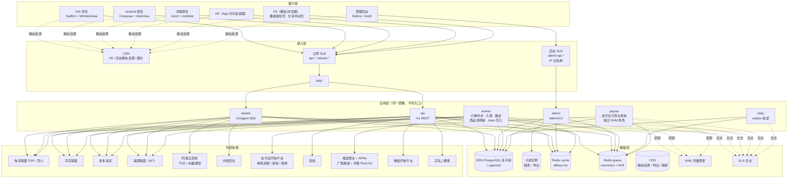
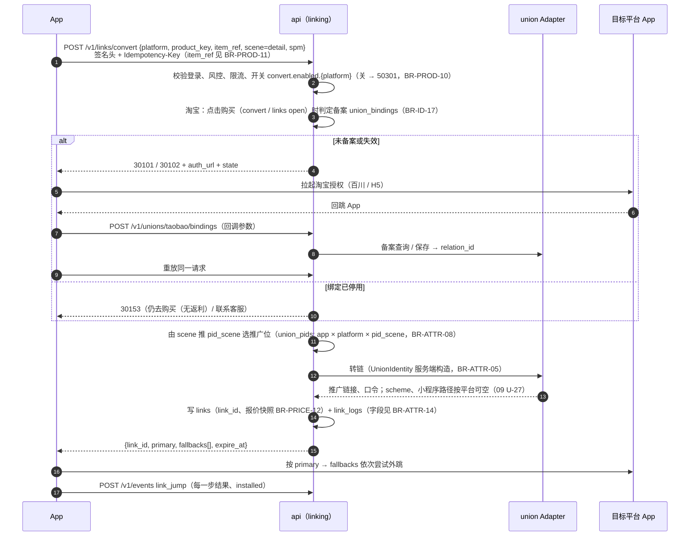
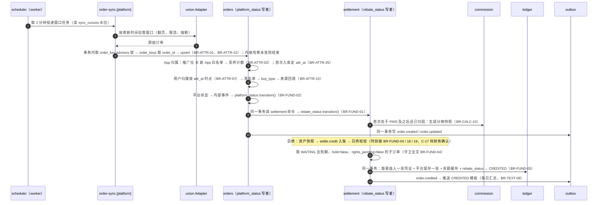
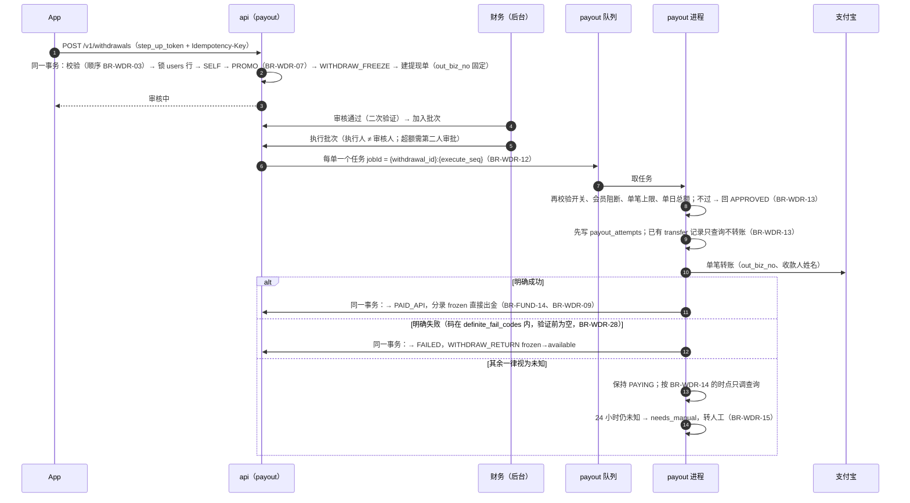
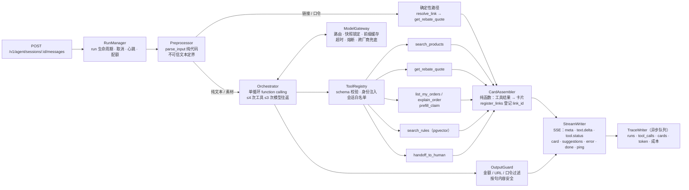

# 返利 App 规划文档 · 02 系统架构

2026-09-29 · 全新设计，不沿用花卷云的系统结构（D19）。决策编号见 `00_总览与决策.md`，接口与枚举细节见 `04_数据模型与契约.md`。**业务规则见 `规划/08_业务规则/`**，本文只写「BR-xxx」+ 一句话，冲突以 08 为准；外部能力见 `规划/09_平台能力验证/`（CAP-xxx），未验证项不作为事实。2026-09-30 按 08 回写，新增 §4.3、§17–§20。

---

## 1. 架构原则

| # | 原则 | 落地方式 |
| --- | --- | --- |
| 1 | **模块化单体，按进程拆部署** | 一个 NestJS 代码库，按限界上下文拆模块；同一镜像以不同入口启动 api、stream、admin、worker、payout、relay 六类进程。团队规模和 5 周工期不支撑微服务 |
| 2 | **契约优先** | `contracts/openapi.yaml` 是唯一 API 事实源；请求在运行时按它校验，响应在测试和 staging 环境按它校验（D17） |
| 3 | **资金强一致，其余最终一致** | 余额、分录、提现状态在同一数据库事务内完成；推送、看板、风控等副作用走 outbox 事件，最终一致 |
| 4 | **外部依赖一律过治理层** | 每个联盟、千问、支付宝、短信、推送都封装成 Adapter，统一超时、重试预算、熔断、配额、录制回放 |
| 5 | **确定性交给代码，模糊交给模型** | 链接/口令识别、商品 ID 提取、转链、金额计算、卡片组装全部由代码完成；模型只做意图理解、条件抽取和一两句说明；卡片上每个数字的数据源见 BR-AI-04 |
| 6 | **配置即数据** | 首页、开关、文案、规则、推广位都是带版本的数据：可预览、可灰度、可回滚 |
| 7 | **默认安全** | 身份参数服务端注入；最小权限；打款私钥只在隔离进程可读；PII 加密存储；代理开发环境拿不到生产凭据 |
| 8 | **时间可注入** | 所有"满 15 天""每日""每月"逻辑都读注入的 `Clock`，测试和回放环境可以快进 |

---

## 2. 总体架构



**为什么这样拆进程**

| 进程 | 拆出来的理由 | 扩缩容依据 |
| --- | --- | --- |
| `api` | 普通 REST，无状态 | QPS、CPU |
| `stream` | Agent SSE 是长连接（单轮最长 20 秒），和普通请求混跑会占满连接池、拖慢 P95 | 并发流数 |
| `admin` | 独立域名 + IP 白名单 + 独立限流；后台导出等重查询走只读库，不影响用户侧 | 固定 1–2 个实例 |
| `worker` | 订单同步、入账、推送等后台任务，按队列分配并发 | 队列积压 |
| `relay` | outbox 投递要求单点有序、可观测 | 固定 1 个实例（主备） |
| `payout` | 唯一能读支付宝私钥的进程；无公网入站；出站只允许支付宝域名；内部再做单笔和单日限额校验 | 固定 1 个实例 |

---

## 3. 部署与环境

### 3.1 生产拓扑（阿里云单地域、双可用区）

| 资源 | 规格建议（W0 按容量假设复核） | 说明 |
| --- | --- | --- |
| ECS · app 组 | 2 台，4C8G，跨可用区 | 跑 `api`、`stream`；Docker Compose，蓝绿两套 compose 切换 |
| ECS · worker 组 | 1–2 台，4C8G | 跑 `worker`、`relay` |
| ECS · admin | 1 台，2C4G | 跑 `admin` |
| ECS · payout | 1 台，2C4G，独立安全组与 RAM 角色 | 只跑 `payout`；安全组出站白名单只放支付宝网关与 PG、Redis；转账队列 concurrency=1（BR-WDR-13） |
| RDS PostgreSQL | 高可用版，4C8G 起，开 pgvector；PITR 7 天，每日快照 30 天；1 个只读实例 | |
| Redis | cache 与 queue 两个实例，各 2G 起 | queue 实例 `maxmemory-policy=noeviction`、开 AOF |
| SLB | 公网 SLB（api、stream）；后台 SLB（admin，访问控制白名单） | stream 的空闲超时调到 ≥90 秒 |
| OSS + CDN | `h5-static`、`admin-static`、`media`（海报、图片）、`exports`（私有，签名 URL；文件过期与删除见 BR-ID-30） | |
| SLS | 应用日志、访问日志、审计日志（副本） | 日志库 TTL 见 BR-ID-30 |
| KMS 凭据管家 | 全部 secret；数据加密用信封加密 | |
| 容器镜像服务 ACR | 镜像仓库 | 镜像签名，prod 只拉带签名的 tag |
| Sentry（境内自建） | 1 台 ECS | iOS、Android、H5、后端 |
| EMAS 或 AGC Crash | 鸿蒙崩溃采集 | W0 二选一 |

### 3.2 环境

| 环境 | 用途 | 联盟 | 支付宝 | 数据 | 谁能部署 |
| --- | --- | --- | --- | --- | --- |
| `local` | 开发者 / 代理本机 | WireMock 录制回放 | 沙箱 mock | 合成数据 | 任何人 |
| `test` | CI、代理集成测试 | 录制回放（`X-Scenario`、`X-Clock` 切换时间线） | 支付宝沙箱 | 合成数据 | CI |
| `staging` | 联调、真机测试、内测前演练 | 生产联盟**只读** key + 测试推广位 | 沙箱 | 合成数据 + 少量真实测试账号 | CI + 人工批准 |
| `prod` | 生产 | 生产 | 生产（只有 payout 持有私钥） | 真实 | 仅人工批准（GitHub Environments） |

三个环境的数据库、Redis、OSS bucket、KMS 密钥完全隔离。

### 3.3 发布

- 后端：蓝绿两套 compose，健康检查通过后切 SLB 权重；Prisma 迁移只做向后兼容变更（expand → 下一版本 contract）。
- H5：按版本目录上传 OSS，`index.html` 设 no-cache，静态资源内容哈希长缓存；回滚 = 把入口指针切回上一版本目录。
- 管理后台：同 H5。
- App：iOS TestFlight → 分阶段发布 7 天；Android 按渠道灰度；鸿蒙走 AGC 分阶段发布。强更规则见 `01` F-CFG-03。
- 各类变更的灰度、观测、回滚总表见 §20。

---

## 4. 后端模块划分

### 4.1 模块表

每个模块是一个 NestJS module，目录 `apps/api/src/modules/<模块>/`。每张表（或一组列）只有一个写者；模块之间只能调用对方 `index.ts` 导出的 Service 接口（查询 / 命令）或订阅其领域事件，禁止直接读写对方的表；报表走只读实例；只有 `ledger` 改余额，金额只由 `packages/domain` 计算（后端功能规划 §1.3）。由 `dependency-cruiser` 在 CI 里检查。

| 模块 | 职责 | 拥有的表（主要） | 公开接口（节选） | 依赖 | 代理线（05 §2，线名见 08 §13.2） |
| --- | --- | --- | --- | --- | --- |
| `identity` | 注册登录、Token、设备注册、二次验证、同意记录、实名、收款账号、注销 | users、user_oauth、devices、sessions、login_logs（BR-INV-08）、consent_records、realname、payout_accounts、payout_account_changes（BR-WDR-02）、deletion_requests、deleted_identities（BR-ID-28） | `/v1/auth/*`、`/v1/devices`、`/v1/me*` | risk、notification | B1 |
| `union` | 联盟网关：各平台 Adapter、凭据、配额、熔断、录制回放、原始报文归档 | union_accounts、union_credentials、union_pids、union_raw_payloads、order_sync_drops、order_sync_drop_keys（BR-ATTR-02） | 无 HTTP；供其他模块调用 | — | B1 |
| `catalog` | 搜索、详情、`product_key`、商品池、物料信息流、类目黑名单、缓存 | product_refs（BR-PROD-05）、product_pools、pool_items、category_blocklist；商品缓存在 Redis（BR-PROD-07） | `/v1/products*`、`/v1/search/*` | union | B1 |
| `parsing` | 输入识别（链接、口令、素材）、口令解析、素材结构化中的代码部分、黑话词典 | slang_dict | `/v1/inputs/parse`（C-14） | union、catalog | B1 |
| `linking` | 转链、`link_id` 登记、场景推广位选择、备案绑定、外跳方案、link_logs | links、link_logs、link_log_evidence（BR-ATTR-14）、union_bindings | `/v1/links/*`、`/v1/unions/*` | union、catalog、identity | B1 |
| `orders` | 订单同步（order-sync，`platform_status` 唯一写者）、平台状态映射、App/用户归属、找回、订单黑名单 | order_keys（BR-ATTR-22）、orders（同步列）、order_items、order_status_history、sync_cursors、claims、claim_items（BR-ATTR-17）；订单黑名单读 `risk` 的 blocklist（BR-ATTR-26、BR-ID-31，不另建表） | `/v1/orders*`、`/v1/orders/claims` | union、linking、commission、settlement（命令） | B1 |
| `commission` | 返利规则版本、分佣快照、预估计算（纯函数在 `packages/domain`；报价与入账同一拆分函数，BR-PRICE-06） | commission_rules、commission_splits、commission_split_amounts、commission_split_beneficiary_events（BR-CALC-10）；等级与上级按 paid_at 读 growth 日志（BR-CALC-12、BR-INV-14） | 无 HTTP | growth | B2 |
| `ledger` | 账户、凭证、分录、余额缓存、不变量校验、资产日快照 | ledger_accounts、ledger_vouchers、ledger_entries、account_balances、daily_balances（BR-FUND-19）、asset_snapshots | `/v1/wallet/*` | — | B2 |
| `settlement` | `rebate_status`、`hold`、`rights_pending` 唯一写者（BR-FUND-01、BR-FUND-06）；入账调度、维权、扣回、月结补差、联盟对账 R1 | orders（返利列）、order_rights、settle_jobs、order_settlements、settle_adjust_batches（BR-FUND-09）、settle_adjustments（含审批字段，BR-CALC-23）、recon_union | 无 HTTP；提供 order_rights 写入命令 | orders、commission、ledger | B2 |
| `payout` | 提现单、审核、批量打款、支付宝 Adapter、查询与冲正、通道对账 R2、垫资水位 | withdrawals、withdraw_holds（BR-WDR-05）、payout_attempts、payout_batches、recon_channel、fee_rules | `/v1/withdrawals*` | ledger、identity、risk | B2 |
| `growth` | 邀请绑定、上下级关系、等级；P1 奖励活动 | users.parent_id、relation_change_logs、levels、level_change_logs；user_relation_closure P1（BR-INV-11） | `/v1/me/inviter`、`/v1/invites` | identity、risk | B1 |
| `taolijin` | 淘礼金商品池、发放、预算（D7） | tlj_pool_items、tlj_claims、tlj_budgets | `/v1/taolijin/*` | union、linking、risk | B3 |
| `agent` | 会话、编排、工具注册、护栏、模型网关、结果集、卡片、trace、规则 RAG | agent_sessions、agent_runs、agent_messages、agent_tool_calls、agent_result_sets、agent_cards、rule_chunks | `/v1/agent/*` | parsing、catalog、linking、orders、content、taolijin（只读）、identity（只读）；依赖禁区见 BR-AI-02 | B3 |
| `content` | 页面配置（SDUI）、CMS 文章、协议、字典、配置与开关、App 版本 | pages、page_versions、articles、agreements、dict_items、config_items、kill_switches、app_versions | `/v1/pages/*`、`/v1/config`、`/v1/dict`、`/v1/articles*`、`/v1/app-versions/check` | — | F1 |
| `notification` | 通知模板、推送 Adapter、站内消息、短信；通知分类（服务 / 订阅 / 营销）、频控、合并、免打扰（BR-WATCH-15） | notify_templates、inbox_messages、push_tokens、notify_logs | `/v1/messages*`、`/v1/me/notification-settings` | identity | B1 |
| `watch`（P1） | 订阅提醒；边界见 §4.3 | 候选，ADR 定（BR-WATCH-20） | `/v1/watches`（P1，契约不在 M0 冻结） | catalog、union、linking、notification | B1 |
| `risk` | 请求签名、限流、设备风险、硬规则、黑名单、风控状态、申诉 | risk_rules、risk_hits、blocklist、user_risk_state、appeals | 无公开 HTTP（中间件 + 服务） | — | B1 |
| `analytics` | 埋点接收、漏斗与报表 SQL | events（分区） | `/v1/events` | — | F1 |
| `admin` | 管理员、RBAC、操作日志、后台二次验证；各业务模块的后台接口在各自模块的 `http/admin/` 下，由本模块统一挂载守卫 | admin_users、admin_roles、audit_logs | `/admin/v1/auth/*` | 全部 | F1 |
| `platform` | outbox、幂等、Clock、加解密、HTTP 治理、配置读取、分布式锁 | outbox_events、processed_events、idempotency_keys | 无 | — | B1（B1-01 脚手架） |

### 4.2 模块内部分层

```
modules/orders/
  domain/            # 纯 TS：实体、值对象、状态机（由 specs 生成）、领域事件；不依赖 Nest 和 Prisma
  application/       # 用例服务：SyncOrdersService、AttributeOrderService、ClaimService
  infra/             # Prisma 仓储、队列生产者、外部 Adapter 适配
  http/public/       # /v1 控制器（只做鉴权、参数、调用用例）
  http/admin/        # /admin/v1 控制器
  jobs/              # BullMQ 处理器
  index.ts           # 对外导出的 Service 接口和事件类型
  AGENTS.md          # 本模块硬规则（资金、订单模块必有）
```

规则：`domain/` 里的函数必须是纯函数，金额运算只调用 `packages/money`，状态迁移只调用生成的 `transition()`（订单分 `order-platform.yaml`、`order-rebate.yaml` 两套，CAS 迁移，BR-FUND-01）；这样资金和状态逻辑可以用属性测试穷举。

### 4.3 订阅提醒服务（P1）

MVP 不建 watch 相关表、不注册提醒工具，只预埋 price_snapshot 写入钩子、`watch_alert` scene、通知分类（BR-WATCH-19，待决策）。S3 只交付一个商品的降价提醒（目标价模式，BR-WATCH-01、BR-WATCH-26）。

**模块边界**

| 组件 | 职责 | 规则 |
| --- | --- | --- |
| 订阅管理 | 创建须用户确认（Agent 只出确认卡）；生命周期五态；每用户上限 | BR-WATCH-18、BR-WATCH-10、BR-WATCH-17 |
| 去重与调度 | 同一商品跨用户合并为 1 个被监控对象（CAP-*-13 通过的平台）；PG `next_fetch_at` 索引 + BullMQ worker 批量拉取，不按商品建定时任务；分层频率 | BR-WATCH-08、BR-WATCH-07 |
| 抓取 | 走 union 网关的独立提醒配额桶，查询专用推广位 `pid_scene=query`，不带用户参数 | BR-WATCH-06、BR-WATCH-08、BR-PROD-07 |
| 存储 | **价格观测**（每次为提醒发起的查询结果，成功失败都写，是判定与新鲜度的唯一依据）与**价格变更历史**（价格变化才新增行）分两张表存，判定器不读变更历史 | BR-WATCH-05 |
| 判定 | 纯规则代码、两次确认、回合与冷却、同一订阅串行 | BR-WATCH-06、BR-WATCH-11、BR-WATCH-12 |
| 投递 | 事件经 outbox 交 notification；发送前复核、分类频控、合并、免打扰 | BR-WATCH-13、BR-WATCH-15 |
| 落地 | 点击进落地页只取报价不转链，点购买才 open | BR-WATCH-16 |

**依赖**：catalog（product_key、价格口径 BR-WATCH-03）、union（配额桶，§6.2）、linking（`watch_alert` link 登记）、notification（分类与合并）、content（开关 `watch.enabled.<platform>`，BR-WATCH-27）。

**表模型**：「统一任务表承载七类订阅任务」只是候选方案，P1 开工（WT-01）由 ADR 在统一表与按类型分表之间选定，不作为业务规则引用（BR-WATCH-20）。

**未知项**（结论前按 08 默认值开发、不对用户承诺）：

| 未知项 | 影响 | 验证 |
| --- | --- | --- |
| 跨用户共享查价是否成立 | 不成立的平台按用户查价，上限下调 | CAP-TB-13、CAP-JD-13、CAP-PDD-13（09 V-34，W8） |
| 批量接口上限、日配额 | 可承诺的检查间隔「约每 X 小时」 | CAP-X-10、各平台 -12 |
| 拼多多 goods_sign 稳定性、goods_id 是否下线 | 提醒键与查询计划 | CAP-PDD-01、CAP-PDD-13（09 附录 A-11） |
| 提醒存储增量与分区 | §15.1 容量 | 按 BR-WATCH-05 估算，W8 实测后修正 |

---

## 5. 关键链路

### 5.1 转链与跳转（商品详情 → 下单）



### 5.2 订单同步 → 归因 → 入账



### 5.3 提现与打款



**硬规则**：`payout` 任务禁止重试"转账"动作，只允许重试"查询"；`out_biz_no` 在提现单创建时生成、永不改变；批次失败不整批重跑（BR-WDR-14）。状态机见 BR-WDR-08。

### 5.4 Agent 找货回合

见第 9 节。

---

## 6. 联盟网关

### 6.1 Adapter 接口

每个平台实现同一组接口，返回统一 DTO；平台差异（签名算法、字段名、分页方式、时间窗上限）全部封装在 Adapter 内。

```ts
interface UnionAdapter {
  platform: Platform;                                   // 'taobao' | 'jd' | 'pdd' | 'meituan' | ...
  searchItems(q: SearchQuery, ctx: CallCtx): Promise<Page<UnionItem>>;
  getItem(ref: ItemRef, ctx: CallCtx): Promise<UnionItemDetail>;
  resolveLink(raw: string, ctx: CallCtx): Promise<ResolvedLink>;        // 链接 / 口令 → 商品
  convert(req: ConvertReq, identity: UnionIdentity, ctx: CallCtx): Promise<ConvertResult>;
  bindPublisher?(req: BindReq, ctx: CallCtx): Promise<BindResult>;      // 淘宝渠道备案、拼多多授权
  listOrders(win: TimeWindow, opt: OrderQueryOpt, ctx: CallCtx): Promise<Page<UnionOrder>>;
  listRefunds?(win: TimeWindow, ctx: CallCtx): Promise<Page<UnionRefund>>;
  listPunishments?(win: TimeWindow, ctx: CallCtx): Promise<Page<UnionPunish>>;
  materialFeed?(req: MaterialReq, ctx: CallCtx): Promise<Page<UnionItem>>;
  createTaolijin?(req: TljCreateReq, ctx: CallCtx): Promise<TljCreateResult>;
}
```

- `UnionIdentity` 只能由 `linking` 服务端构造，Adapter 与 Agent 工具都不接受外部传入的身份（BR-ATTR-05、BR-AI-03）。
- **淘宝单点风险**（09 附录 A-2）：识别与 A/B/C 判定依赖万能转链 `material_list` 邀约权限（CAP-TB-01、CAP-TB-09）；转链降级 `item_dto` 按 ID → privilege.get（候选）→ `convert.enabled.taobao=off`，W0 书面答复后定型。
- 每次调用记录 `union_raw_payloads`（请求摘要、响应原文、耗时、错误码），留存见 BR-ID-30，便于对账和纠纷。

### 6.2 治理层

| 能力 | 规则 |
| --- | --- |
| 超时 | 在线调用 3 秒；离线（同步、刷新）10 秒 |
| 重试 | 只重试幂等读，最多 2 次，指数退避；转链不自动重试（由客户端重放同一幂等键） |
| 熔断 | 10 秒窗口内错误率 >50% 且请求 ≥20 次，熔断 30 秒；熔断期间按降级表处理 |
| 配额 | Redis 令牌桶；桶的键（联盟账号或 appkey）待 CAP-TB-12、CAP-JD-12、CAP-PDD-12 确认配额口径（09 §0.2 硬规则 5；06 Q-G5、Q-G14）后定，代码按可配置键实现；若按联盟账号计且与优券汇共用联盟账号（06 Q-A4 默认），桶容量取控制台配额扣除优券汇实测用量后的余量，且上游限流错误码一出现即全局降档。按用途切分：MVP 在线（转链、搜索、详情）60%、订单同步 30%、商品池刷新 10%；P1 提醒开启后商品池刷新 5%、提醒 5%（BR-WATCH-08，实测后调整）；在线余量不足时先暂停商品池刷新 |
| 凭据 | `union_credentials` 加密存储；到期告警、自动刷新、不可刷新凭据走运营工单、过期后该平台 50301 与同步断点暂停，均按 BR-ID-24 |
| 录制回放 | Adapter 的 base URL 从配置读取；test 环境指向 WireMock；场景用 `X-Scenario`，时钟用 `X-Clock`；fixture 目录 `fixtures/union-recordings/<platform>/<scenario>/` |

### 6.3 推广位（`union_pids`）

| 字段 | 说明 |
| --- | --- |
| app_id、platform、union_account_id、site_id（淘宝） | |
| pid_scene | `self_buy`、`share`、`agent`、`taolijin`、`fallback`、`query`（只查价不转链，BR-PROD-07）；由转链 scene 推出（BR-ATTR-08） |
| pid 原值 | 淘宝 adzone_id（`mm_a_b_c`）、京东 positionId、拼多多 pid、美团 sid 前缀 |
| status | pending / active / retired；禁止删除（BR-ATTR-02） |

订单入库时按推广位反查 pid_scene 与 App 归属；**推广位不在新 App 白名单的订单直接丢弃**（只记计数，D1；匹配键与状态见 BR-ATTR-02）。花卷云侧"忽略的 PID"配置与双向验证是运营动作，不是系统依赖，按 BR-ATTR-28（待验证；淘宝媒体级 `mm_a_b` 覆盖待 AF-07 证实，证实前每个推广位仍逐条补填，证据为 AC-S1-28-*）。

---

## 7. 订单同步

### 7.1 同步任务

| 平台 | 增量 | 窗口 | 回扫 | 维权 / 处罚 |
| --- | --- | --- | --- | --- |
| 淘宝 | 每 2 分钟，按更新时间，按 order_scene 分路拉（路数待 CAP-TB-07，09 附录 A-3），游标翻页 | 20 分钟（官方上限见 CAP-TB-07，09 附录 A-4） | 每小时按付款时间回扫近 3 小时；每天近 30 天；每周近 90 天 | 每 30 分钟拉维权退款与处罚订单；每天回扫近 60 天（接口与回扫范围待 CAP-TB-08，U-21） |
| 京东 | 每 2 分钟，按更新时间 | ≤1 小时 | 每天回扫近 30 天 | 随订单行；佣金变 0 按 BR-FUND-08 |
| 拼多多 | 每 2 分钟，增量接口，从末页倒序翻 | 30 分钟（待 CAP-PDD-07 / V-06 核对，U-24） | 每天回扫近 90 天 | 随订单状态 |
| 美团（W7） | 每 5 分钟 | 以文档为准 | 每天 | 随订单状态 |

- 水位 `sync_cursors(platform, union_account_id, query_kind, scene)` 持久化；窗口任务 jobId = `platform:account:kind:window_start`，天然去重。
- 同一子订单的同步、找回、管理员变更按 order_key 串行；防旧覆盖开关默认关（BR-ATTR-01）；早于 `sync_start_at` 的订单不入库（BR-ATTR-02）。
- 失败窗口进死信队列并告警；手动同步（后台）按"平台 × 时间窗 × 状态"投递同样的窗口任务。
- 延迟目标：付款到入库 P95 ≤5 分钟，超过 15 分钟告警。
- **大促模式**（开关 `order_sync.promo_mode`）：淘宝窗口 ≤20 分钟、提高同步频率、放大同步配额占比；10-15 至 11-13 默认开启（日期以天猫官方公告为准，U-83）。

### 7.2 平台状态映射

每个平台一张映射表 `specs/order-status-map/<platform>.csv`：`平台状态码 → 内部事件`，例如淘宝"付款"→ `PLATFORM_PAID`、"确认收货"→ `PLATFORM_RECEIVED`、"结算"→ `PLATFORM_SETTLED`、"失效"→ `PLATFORM_INVALID`。内部事件只驱动 `platform_status`，`rebate_status` 由 settlement 迁移（BR-FUND-01，待决策 C-01）。映射表外的状态告警并进待处理表，不丢弃、不猜测；时间字段等边界按 BR-FUND-02。

### 7.3 归因流水线

```
原始订单（顺序 BR-ATTR-01；时间比较一律用 attr_at，BR-ATTR-25）
 → App 归属（推广位白名单，BR-ATTR-02）   失败：丢弃计数
 → 用户归属（BR-ATTR-06；淘宝按 attr_at 时点的有效绑定，BR-ATTR-07）
                                       失败：未归因池（可被找回，BR-ATTR-16）
 → 黑名单（BR-ATTR-26）         命中处理见 BR-ATTR-26
 → buy_type（BR-ATTR-08）                取不到：buy_type=self，scene_basis=fallback（BR-ATTR-09）
 → 来源回填（BR-ATTR-15）
 → 分佣快照（首次已归因且 platform_status 到 PAID 及之后，含找回、管理员变更，BR-CALC-10）
 → 双状态迁移 + outbox 事件（BR-FUND-01）
```

- 未归因订单每次更新都重跑用户归属；已归属订单的 `user_id` 只能由找回或管理员变更改写（BR-ATTR-01、BR-ATTR-20）。
- 订单黑名单命中处理按 BR-ATTR-26（渠道维度作废未入账订单；尾号维度在 CAP-TB-07 验证前只记 risk_hits 转人工；已入账订单只进人工复核）；受益人账号级失效只让其份额归平台（BR-CALC-13）。
- 订单侧黑名单：只按 BR-ATTR-26 执行，名单存 BR-ID-31 的 blocklist。
- 多次点击、多入口：只以联盟回传的推广位和参数为准（BR-ATTR-12）。

---

## 8. 账务

### 8.1 模型

- **复式记账**：每个 `uniq_key` 一张凭证（`ledger_vouchers`），≥2 条分录（`ledger_entries`），借贷合计为 0；一笔业务可含同一事务内的多张凭证。凭证、红冲键、多账户加锁顺序、`balance_after_fen`、平台科目不缓存余额等硬约束见 BR-FUND-16。
- **只插入**：数据库角色对 `ledger_entries` 没有 UPDATE/DELETE 权限；更正一律红冲 + 重记。
- **唯一业务键**：`uniq_key`（如 `{order_key}:{user_id}:{role}:CREDIT`，order_key = `{platform}:{sub_order_id}`，BR-FUND-05）上唯一索引，重放不重复入账。
- **余额缓存**：用户账户 `account_balances(available_fen, frozen_fen, version)` 只是分录的缓存；变更时 `SELECT … FOR UPDATE`，与分录同事务。
- **日切**：00:00 +08:00；"每日/每月/当日"都按此口径。

### 8.2 科目

| 科目 | 性质 | 说明 |
| --- | --- | --- |
| `USER_SELF:{uid}` | 负债 | 自购返利账户，含 available / frozen 子户 |
| `USER_PROMO:{uid}` | 负债 | 推广收益账户（分享单 + 直推分佣），含 available / frozen 子户 |
| `UNION_RECEIVABLE:{platform}` | 资产 | 应收联盟佣金 |
| `CASH_ALIPAY` | 资产 | 企业支付宝余额 |
| `COMMISSION_REVENUE` | 收入 | 平台留存佣金 |
| `FEE_INCOME` | 收入 | 提现手续费（MVP 为 0） |
| `TAX_PAYABLE` | 负债 | 代扣个税 |
| `MKT_EXPENSE` | 费用 | 淘礼金、奖励等营销费用 |
| `BAD_DEBT` | 费用 | 负余额核销 |
| `ADJUSTMENT` | 费用 / 收入双向 | 人工调账（ADMIN_ADJUST）的对方科目（08 §13.5） |

不设 `WITHDRAW_IN_TRANSIT`，打款中资金留在 frozen（BR-FUND-14）。后端功能规划 §2.8 的账户代码按 08 §13.5 映射。

### 8.3 分录模板索引

分录模板（借贷科目、凭证拆分）只在 08 维护，本节只做索引。订单入账与扣回按受益人各一张凭证、平台一张凭证，同一事务提交（BR-FUND-05），不是一张合并凭证；金额示例见 BR-FUND-05 细则。

| 业务 | 分录模板所在条目 |
| --- | --- |
| 订单入账 | BR-FUND-05 |
| 扣回 | BR-FUND-08 |
| 月结补差（全额重算与审批） | BR-CALC-09、BR-CALC-23 |
| 联盟回款 | BR-FUND-20 |
| 提现各状态（申请冻结、打款成功含净额 / 税 / 费、失败、驳回） | BR-WDR-09（BR-FUND-14 只管 frozen 口径，不维护提现分录） |
| 负余额核销（BAD_DEBT_WRITEOFF） | BR-FUND-12 |
| 作废 / 扣回订单被平台恢复（ADMIN_RESTORE） | BR-FUND-22 |
| 人工调账（ADMIN_ADJUST，对方科目 `ADJUSTMENT`） | 流水类型 BR-FUND-15，科目 08 §13.5；08 尚无独立分录模板条目，以 `specs/ledger-rules.md` 为准 |

科目表、分录模板最终以 `specs/ledger-rules.md` 为准，W1 周三前由财务签字（D11）；舍入默认见 BR-CALC-08。

### 8.4 不变量（属性测试 + 每日生产校验）

不变量与差异处理（账户级 / 全局两级）见 BR-FUND-19，另加 frozen = Σ 非终态提现单（BR-FUND-14）。实现：属性测试 + 每日 `ledger_invariants.sql`（时刻按 BR-FUND-19，C-17；在资产快照、入账任务之后运行）；验收 AC-S2-26、AC-S2-30、AC-S2-32。

### 8.5 对账与垫资

| 对账 | 数据 | 粒度 | 频率 |
| --- | --- | --- | --- |
| R1 联盟 | 联盟结算明细（唯一依据）vs 已入账 B | 子订单 | 各平台结算日后 T+1（BR-FUND-09） |
| R2 通道 | 支付宝账务明细 vs 提现单 `out_biz_no`；差异即冻结该会员提现（BR-WDR-23） | 单笔 | 每日 T+1 |
| R3 内部 | 分录合计 vs 余额；用户应付合计 vs 资产快照（BR-FUND-18、BR-FUND-19） | 账户 | 每日，入账任务之后（时刻按 BR-FUND-19，C-17） |
| 月末三项 | 联盟结算佣金、用户累计入账、累计提现（BR-FUND-23） | 月 | 每月 1 日，当日日终校验之后（时刻按 BR-FUND-23，C-17） |
| 证实核对（候选，08 未收录） | 入账、打款后 5 分钟核对，不一致告警并冻结提现（后端功能规划 §1.6、§6.1） | 单笔 | 采用前走 00 变更流程 |

差异进差错单（类型见 BR-FUND-09、BR-FUND-22），调账需第二人复核；R2 中"支付宝成功、内部未终态"的单优先处理。垫资敞口与 `settle.auto.enabled` 按 BR-FUND-20；垫资水位按 BR-WDR-18。

---

## 9. Agent 服务

### 9.1 组件



模型可调用的工具只有 T1–T5 所列 7 个（P1 追加提醒工具，默认关），按 BR-AI-02；`parse_input`、`resolve_link`、`register_links` 属于确定性路径，不出现在发给模型的工具定义里；`clarify` 是意图（Orchestrator 直接出追问），不是工具。

### 9.2 关键设计

| 项 | 设计 |
| --- | --- |
| 操作分级 | A 级自动、B 级由用户点卡片后客户端调接口、C 级禁止（BR-AI-01） |
| 身份 | 只由 ToolRegistry 从会话凭证注入；工具 schema 不含身份字段，`additionalProperties=false`；模型传入的处理见 BR-AI-03 |
| 工具白名单 | allowlist 精确比对 + denylist grep + 依赖规则三项 CI 门禁（BR-AI-02） |
| 模型可见内容 | 卡片引用 + 标题 + 平台 + 权益标签，**不含价格和返利数字**；不可信文本定界（BR-AI-05） |
| 卡片 | CardAssembler 组装，模型不输出卡片 JSON；每张卡带 `quoted_at`、`source`、`disclaimer_keys[]`（BR-PRICE-17）、`link_id`；数字来源 BR-AI-04；文本过滤与 suggestions 见 BR-AI-06 |
| 转链时机 | T1（用户粘贴的链接 / 口令）和排第 1 的卡出卡前同步转链，其余预转链受上限约束（BR-AI-01）；游客不预转链（BR-AI-11，待决策）；点击 `open` 复核（BR-PRICE-12、BR-PRICE-13）；转链缓存**禁止跨用户复用**（BR-PROD-07） |
| 结果集 | 每轮保存 `agent_result_sets`（卡片列表 + 本轮检索条件），供"第二个""换成京东""再便宜点""换一批"使用 |
| 上下文 | 保留最近 8 轮原文，更早的摘要 ≤300 字；卡片只以摘要进上下文；单次模型输入 ≤12K token |
| 模型路由 | 编排：百炼 Flash 档模型，锁定日期快照，关闭思考模式（待 CAP-X-07 核实）；多候选总结（P1）：Plus 档；跨厂商兜底默认关闭、脱敏时点见 BR-AI-14；最终降级：无模型，关键词直走普通搜索。型号在 W3 周五用 ≥300 条评测集选定（05 B3-11），写入 `config.agent.models`；成本公式参考 PRD v2.1 §10.15，记账以 BR-AI-16 为准 |
| 前缀缓存 | system prompt + 工具定义作为固定前缀，使用百炼显式缓存 |
| Prompt 管理 | 放在仓库 `prompts/<name>/<version>.md`；按版本发布；线上禁止直接编辑；trace 记录 prompt 版本 |
| 规则 RAG | 帮助中心与返利规则在 CMS 发布时切块、向量化写入 `rule_chunks`（pgvector）；`search_rules` 返回条目 ID + 摘要；答复形式见 BR-AI-07 |
| 内容安全 | 输入先审、输出按句审；超时处理与拒答类别见 BR-AI-18 |
| 配额与熔断 | 用户额度与计数键 BR-ID-03、BR-AI-15（C-10）；校验顺序 BR-AI-23；全局日预算与降级 BR-AI-16 |
| 取消与断线 | `POST /v1/agent/runs/{run_id}/cancel` 停止生成；客户端断开 60 秒未恢复，服务端中止模型调用；断线后用历史接口拉回完整回复（MVP 不做事件续传） |
| Trace | 异步写入，不阻塞 SSE；落库与脱敏见 BR-AI-19，留存见 BR-ID-30 |

### 9.3 评测

- 评测集 `evals/agent/find/*.jsonl`：输入、期望意图、期望工具与参数断言、禁止断言（如 `amount_in_text`、`url_in_text`、`identity_arg`）。
- **回放模式**（CI）：录制的千问响应 + 联盟 fixture，结果确定；修改 `agent/`、`prompts/`、模型配置的 PR 必跑冒烟集（规模与通过标准 BR-AI-21）。
- **在线模式**（每晚）：真实模型跑全量，出指标趋势。
- 门槛见 `01_需求规划.md` 第 8.1 节。

---

## 10. 配置、开关与首页下发

| 对象 | 存储 | 下发 | 生效 |
| --- | --- | --- | --- |
| 配置项（文案、剪贴板规则、授权说明、分享域名等） | `config_items`（带版本） | `GET /v1/config`，ETag | 客户端启动和回前台拉取；网络 → LKG → 包内默认 |
| 紧急开关（清单见 04 §10.2、08 §13.2；新增 `claims.enabled`、`credit.enabled.<platform>`（BR-CALC-03）、`payout.queue_paused`、`withdraw.account_enabled.<type>`（BR-WDR-17）、P1 `watch.enabled.<platform>`（BR-WATCH-27）） | `kill_switches` → Redis | 服务端直接读；客户端类开关随 `/v1/config` 下发 | 服务端 ≤10 秒 |
| JSBridge 白名单 | `config_items` | 随 `/v1/config` 下发并附服务端签名；验签失败用包内内置 | 客户端 |
| 首页 | `pages` / `page_versions` | `GET /v1/pages/home`，按 `X-App-Version` 过滤组件，按用户分桶灰度 | 冷启动 60 秒内 |
| 字典 | `dict_items` | `GET /v1/dict?version=` | 客户端按版本缓存 |

首页发布流程：草稿 → ajv 按组件 props schema 校验 → 预览（后台内嵌 H5 预览器 + 三端调试包截图）→ 发布（立即/定时）→ 灰度 1% / 10% / 100% → 卡片错误率 >0.5% 自动回滚。

---

## 11. 事件与异步

- **outbox**：业务写入与 `outbox_events` 插入在同一事务；`relay` 每秒用 `FOR UPDATE SKIP LOCKED` 取 ≤500 条，投递到 `evt.<consumer>` 队列，jobId = event_id，成功后写 `published_at`。
- **消费幂等**：`processed_events(consumer, event_id)` 唯一，与副作用同事务写入。
- **资金不依赖事件**：余额、分录、结算状态只在同一事务内变更；事件只驱动推送、风控、看板、trace。
- **队列拆分**：`order-sync.<platform>`、`order-rescan`、`settle`、`payout`、`notify`、`pool-refresh`、`agent-trace`、`evt.*`，各自设置并发与限速。
- 告警：最老未发布事件 >60 秒；任一队列 failed >0；积压超过阈值。

事件清单：`order.created`、`order.updated`、`order.credited`、`order.invalidated`、`order.clawed_back`、`order.settle_adjusted`、`claim.resolved`、`binding.changed`、`member.registered`、`member.bound_parent`、`member.level_changed`、`wallet.withdrawal_changed`、`risk.state_changed`、`agent.run_finished`（08 §13.2）。细粒度任务（如 `settle.credit`）作为 job name 落在上述队列下，触发与幂等键参考后端功能规划 §6.1。

---

## 12. 安全

### 12.1 身份与令牌

| 令牌 | 形式 | 有效期 | 作用域 |
| --- | --- | --- | --- |
| access_token | JWT（ES256），claims：`uid`、`app_id`、`sid`、`device_id`、`scp`（BR-ID-07） | 见 BR-ID-07 | App 全部 `/v1` |
| refresh_token | 不透明随机串，库内存哈希；每次刷新轮换；并发宽限与复用吊销（10404）见 BR-ID-07 | 见 BR-ID-07 | 仅刷新 |
| h5_token | JWT，`aud=h5` | 见 BR-ID-32 | 受限作用域（排除的接口见 BR-ID-32）；越权 10403；App 外落地页不签发令牌（BR-ID-32） |
| step_up_token | JWT，绑定 `uid + device_id + action`；一次性，仅业务成功时核销（BR-ID-08、BR-WDR-01） | 见 BR-ID-08 | 单一敏感动作 |
| admin_token | JWT，独立签名密钥，`aud=admin` | 见 BR-ID-34（含空闲过期） | `/admin/v1` |

### 12.2 设备与请求签名

- `POST /v1/devices`：客户端上报设备标识哈希（同意隐私政策后才生成），服务端返回 `device_id` + `install_secret`；`install_secret` 存 iOS Keychain / Android Keystore / 鸿蒙 HUKS。
- 敏感接口（转链、提现、找回、输入解析、登录与短信、令牌刷新 `/v1/auth/refresh`、淘礼金领取）要求 `X-Timestamp`、`X-Nonce`、`X-Sign`（HMAC-SHA256，密钥 install_secret）；签名串格式、时间戳单位、nonce 去重键与编码只在 BR-ID-09 维护。
- 限流：用户、设备、IP 三维令牌桶，阈值在后台配置；超限返回 42901 + `Retry-After`。

### 12.3 数据保护

- 身份证号、收款账号：AES-256-GCM，数据密钥由 KMS 信封加密；另存 HMAC 盲索引用于去重与查询；密文带密钥版本，支持轮换。
- 手机号：密文 + HMAC 索引；列表与日志一律脱敏。
- 多 App 隔离：所有业务表 `app_id NOT NULL`，业务唯一键以 `app_id` 开头；Prisma Client Extension 自动注入 `app_id` 条件；登录后的 `app_id` 只取自 token。MVP 只有一个 `app_id`，PostgreSQL RLS 放到第二个 App 接入时再开。唯一例外：`order_keys` 主键为 `(platform, sub_order_id)`，因为联盟子订单号全局唯一、同一订单不得被两个 App 同时入库（冲突时不更新并告警，BR-ATTR-22）。

### 12.4 JSBridge 与 WebView

见 `03_前端架构.md` 第 5 节：可信容器与第三方容器分离、origin 白名单、方法三级权限、H5 不拿主 token。

### 12.5 后台

TOTP 双因素、登录 IP 白名单（≤50 条）、连续失败锁定、敏感操作二次验证、职责分离（提现审核人 ≠ 打款执行人；调账发起人 ≠ 复核人；已归属订单改归属发起人 ≠ 复核人，BR-ATTR-20）、全部写操作审计。

### 12.6 密钥

| 密钥 | 存放 | 可读进程 |
| --- | --- | --- |
| 支付宝应用私钥与证书 | KMS | 只有 `payout` |
| 联盟 appSecret、授权令牌 | KMS + `union_credentials`（加密） | `api`、`stream`、`worker` |
| 千问 API Key | KMS | `stream`、`worker` |
| JWT 签名私钥 | KMS | `api`、`admin`（各自独立） |
| 数据加密主密钥 | KMS | 通过信封加密间接使用 |
| 三端签名证书、推送密钥 | 人工持有；CI 签名放 GitHub protected environment | 人工批准的 CI 任务 |

联盟 secret、千问 Key 每 180 天轮换；人员变动时立即轮换。

### 12.7 编码代理的运行边界

| 项 | 规定（硬性落地，不只写在 AGENTS.md） |
| --- | --- |
| 凭据 | 代理只能用测试库、MinIO、支付宝沙箱、WireMock；生产库、支付宝私钥、联盟 secret、签名证书、推送密钥对代理不可见 |
| 强制手段 | `permissions.deny` 禁读 `.env*`、`*.p12`、`*.jks`、`*.p7b`、`*.mobileprovision`、`~/.ssh`；两家代理共用 `scripts/guard/` 的 PreToolUse 脚本拦截生产连接串、支付宝生产网关、`printenv`；非容器环境禁用跳过权限的参数 |
| 网络 | 沙箱域名白名单：依赖源、GitHub、内部 Prism / WireMock |
| 依赖 | pnpm `minimumReleaseAge` 7 天、`strictDepBuilds`；新依赖需人工批准；gitleaks 与隐藏 Unicode 扫描 |
| 数据 | 真实用户数据不进代理工作区；只用合成数据和脱敏 fixture |
| 资金 | 打款执行器默认 dry-run；生产部署、结算重跑、调账只由人执行 |
| 注入 | AGENTS.md、CLAUDE.md、`.claude/**`、`.codex/**`、`scripts/guard/**` 只能由人批准（CODEOWNERS）；调研资料放 `docs/research/`，标为不可信，禁止被导入 |

---

## 13. 可观测

| 层 | 工具 | 内容 |
| --- | --- | --- |
| 日志 | 结构化 JSON → SLS | `trace_id`、`uid`（哈希）、模块、耗时；PII 脱敏；响应头 `X-Trace-Id` 回传客户端 |
| 链路 | OpenTelemetry → SLS Trace（或 ARMS） | API → DB → 外部依赖 |
| 崩溃 | Sentry（境内自建）；鸿蒙 EMAS 或 AGC | CI 上传 dSYM、mapping、nameCache、sourcemap |
| 业务指标 | Prometheus 格式指标 → 阿里云托管 Prometheus + Grafana | 见下表 |
| 队列 | bull-board（仅内网） | 积压、失败、重试 |

**业务告警**（除另有规则外 5 分钟粒度，推钉钉或企业微信；阈值写「见 BR-xxx」的，计算周期、窗口与分母条件以该规则为准）：

| 指标 | 阈值 |
| --- | --- |
| 转链成功率（分平台） | <97% |
| 同步水位延迟 | >30 分钟 |
| 跟单率（分平台、分端） | 见 BR-ATTR-23 |
| 未归因率 | 见 BR-ATTR-16 |
| App 归属：入库为 0 而点击正常 | 见 BR-ATTR-02 |
| 映射表外的平台状态码 | >0（BR-FUND-02） |
| 接口打款失败 | 见 BR-WDR-24 |
| 打款结果 24 小时仍未知（needs_manual） | >0（BR-WDR-14） |
| 最老未发布 outbox 事件 | >60 秒 |
| 日终分录校验 | 差异 >0 |
| Agent 首 token P95 / 模型错误率 | >5 秒 / >5% |
| Agent 日预算消耗 | 见 BR-AI-16 |
| 联盟授权令牌 | 分级到期告警（BR-ID-24） |
| P1 提醒指标组（误报率、配额桶使用率等） | 见 BR-WATCH-24 |
| 分享域名 | 微信内不可访问 |
| 企业支付宝水位 | 见 BR-WDR-18 |
| H5 白屏率 | >1% |
| 首页卡片错误率 | >0.5% |

---

## 14. 外部依赖与降级

| 依赖 | 故障表现 | 降级 | 开关 |
| --- | --- | --- | --- |
| 淘宝/京东/拼多多搜索 | 超时、限流 | 按 BR-PROD-07 读缓存并标 stale；首页信息流改读商品池 | 自动（熔断） |
| 转链 | 平台开关关闭 | 50301（BR-PROD-10）；卡片按钮按 09 该平台降级写法 | `convert.enabled.<platform>` |
| 转链 / 点击复核 | 失败、熔断 | 50303，给【仍去购买（无返利）】次按钮（BR-PRICE-13） | 自动 |
| 口令解析权限未下 | 30132 | 引导"用商品名搜索"，预填从文案抽出的标题 | `parse.tpwd.enabled` |
| 订单接口 | 失败、限流 | 窗口进死信，恢复后从水位补拉；前台不受影响 | 自动 |
| 千问 | 超时、429、5xx | 切备用千问快照 → 仍失败则无模型降级（关键词普通搜索出卡 + 固定话术）；跨厂商默认不启用（BR-AI-14） | `agent.model_route`、`agent.enabled` |
| 内容安全 | 超时 | 输入侧 fail-close、输出侧整段再审仍超时的处理与阈值见 BR-AI-18（后端功能规划 §7 的本地词表兜底只作备选，待法务） | 自动 |
| 支付宝 | 超时、余额不足 | 超时只查询；余额不足等付款方异常暂停队列并告警，不解冻（BR-WDR-17） | `payout.enabled`、`payout.queue_paused` |
| 短信 | 通道故障 | 切备用短信通道；登录页提示微信/Apple 登录 | `sms.provider` |
| 推送 | 通道故障 | 站内消息 + 回前台拉取兜底 | 自动 |
| Redis cache | 不可用 | 直读 PG（限流收紧） | 自动 |
| Redis queue | 不可用 | 写接口仍可用（outbox 在 PG）；任务恢复后补投 | 自动 |

---

## 15. 容量与成本估算

### 15.1 容量

按 `01` 第 7.3 节的"设计余量"（10 万 DAU、500 QPS）：

- `api` 单实例（4C8G，Node 集群 4 进程）可承载约 300–500 QPS 的轻量读写；2 实例 + 限流足够公开首月，扩到 4 实例覆盖设计余量。
- `stream`：每个 SSE 连接主要是 I/O 等待，单实例可承载数百并发流；按 300 并发设计 2 实例。
- PG：`orders` 按 `attr_at` 月分区，唯一性由不分区的 `order_keys` 保证（BR-ATTR-22、BR-ATTR-25）；`ledger_entries` 按月分区；`events`、`link_logs`、`union_raw_payloads` 按日或按月分区并按留存期删除分区（留存见 BR-ID-30）。
- P1 提醒：`price_observation` 日增量估算约 1.5 万去重商品 × 每日 4 次 ≈ 6 万行/日（假设值，W8 实测后修正；分表要求见 BR-WATCH-05）；`price_snapshot` 只在价格变化时新增行。
- 联盟配额是真实瓶颈，W1 由人确认各平台日配额、QPS 与配额计算口径（按 appkey 还是按联盟账号，CAP-TB-12、CAP-JD-12、CAP-PDD-12；见 `06`）。

### 15.2 月成本（量级估算，W0 按阿里云报价复核）

| 项 | 内测期 | 公开首月 |
| --- | --- | --- |
| ECS（app 2、worker 1、admin 1、payout 1、Sentry 1） | 约 ¥2,000–3,000 | 约 ¥3,000–4,500 |
| RDS PostgreSQL 高可用 + 只读 | 约 ¥1,500–2,500 | 约 ¥2,500–4,000 |
| Redis ×2 | 约 ¥400–800 | 约 ¥800–1,500 |
| SLB、CDN、OSS、SLS、WAF | 约 ¥800–1,500 | 约 ¥1,500–3,000 |
| 模型（按每会话约 ¥0.015–0.05） | <¥100 | 约 ¥1,000–5,000（取决于会话量，设日预算熔断） |
| 短信、推送、实名、内容安全 | 约 ¥300 | 约 ¥1,000–3,000 |
| **合计** | **约 ¥5,000–8,000** | **约 ¥10,000–20,000** |

---

## 16. 仓库与工程结构

### 16.1 仓库

| 仓库 | 内容 | 主要语言 |
| --- | --- | --- |
| `rebate-platform` | 契约、后端、H5、后台、共享包、评测、规格 | TypeScript |
| `rebate-ios` | iOS App | Swift |
| `rebate-android` | Android App | Kotlin |
| `rebate-harmony` | 鸿蒙 App | ArkTS |

### 16.2 `rebate-platform` 目录

```
rebate-platform/                    # pnpm workspace + Turborepo
  AGENTS.md  CLAUDE.md              # CLAUDE.md 首行 @AGENTS.md
  contracts/                        # 唯一事实源，只有契约守护会话能提交
    openapi.yaml                    # OAS 3.1，每个接口带 example
    error-codes.yaml                # 码值、含义、客户端动作、是否可重试
    enums/*.yaml                    # 平台、场景、订单状态、原因码、流水类型……
    bridge.schema.json              # JSBridge 方法、参数、结果、权限级别
    agent-stream.schema.json        # SSE 事件与卡片 schema
    home-schema.json                # 首页页面与组件 props schema
    routes.json                     # 页面路由名 → 原生页 / H5 URL
    apps.json                       # 外跳目标 App：scheme、UL、包名、bundleName、降级
    design-tokens.json              # 颜色、字号、间距、圆角
  specs/
    state-machines/*.yaml           # 订单、提现、找回、备案绑定、注销
    order-status-map/<platform>.csv
    ledger-rules.md  fee-rules.csv  commission-examples.csv
    client-behavior.md              # 三端共用行为规格
    material-slang.csv  attribution.md
  acceptance/*.feature              # AC-<EPIC>-<nn>
  fixtures/
    union-recordings/<platform>/<scenario>/
    agent-streams/*.ndjson  home-golden/*.json  synthetic/*.sql
  evals/agent/find/*.jsonl
  prompts/<name>/<version>.md
  apps/
    api/                            # NestJS：api / stream / admin / worker / relay / payout 六个入口
      src/main.<entry>.ts
      src/modules/<模块>/...
      prisma/schema.prisma  prisma/migrations/
    h5/                             # React H5（多入口：app 内页面、落地页、一致性测试页）
    admin/                          # Refine 后台
  packages/
    money/                          # bigint 金额、round()、格式化
    domain/                         # 纯函数：分佣、费率、风控规则、卡片组装
    contracts-ts/                   # 由 contracts/ 生成的 TS 类型与校验器（不手改）
    bridge-sdk/                     # H5 侧桥 SDK（由 bridge.schema.json 生成类型）
    ui-tokens/                      # 由 design-tokens.json 生成的 CSS 变量与 Tailwind 预设
  tools/
    codegen/                        # 生成 Swift / Kotlin / ArkTS / TS 的脚本与模板
    guard/                          # 代理共用 hooks 脚本
  docs/adr/  docs/glossary.md  docs/questions/  docs/research/（不可信）
  .github/workflows/  .github/CODEOWNERS
```

### 16.3 后端技术选型（冻结，写入 AGENTS.md）

| 能力 | 唯一实现 | 禁止 |
| --- | --- | --- |
| 框架 | NestJS（Fastify 适配器） | Express 适配器混用 |
| 契约落地 | `openapi-typescript` 生成类型；`express-openapi-validator` 类中间件（或 Fastify 等价实现）按 `openapi.yaml` 校验请求，test/staging 同时校验响应；CI 比对"yaml 里的 operationId"与"已注册路由"必须一一对应 | 用 `@nestjs/swagger` 装饰器反向生成并覆盖契约 |
| ORM | Prisma（PostgreSQL）；复杂报表用只读库上的原生 SQL | TypeORM、Sequelize |
| 队列 | BullMQ（独立 queue Redis） | 自写轮询表队列 |
| 金额 | `packages/money`（bigint，单位分） | `number` 浮点运算金额 |
| 规则 | `packages/domain` 纯 TS 函数 + PG 规则表，fast-check 属性测试 | GoRules、json-rules-engine（P2 再评估） |
| 校验 | 由契约生成的校验器 | 手写 class-validator DTO 与契约并存 |
| 日志 | pino（JSON） | console.log |
| 测试 | Vitest + Supertest；fast-check；Testcontainers（PG、Redis）；WireMock | Jest 与 Vitest 并存 |
| 迁移 | `prisma migrate deploy` 只在 CI 执行；squawk 检查迁移 SQL；资金表禁止 DROP、改类型、RENAME | `db push`、`migrate reset` 连共享环境 |

---

## 17. 资损防控

来源：后端功能规划 §1.6（参考）。资金流向：`settlement` 只产出记账指令（给谁、多少、何时），`ledger` 是唯一改余额处，`payout` 只做外部转账与查询、结果回写 `ledger`。下表 W0 与财务过一遍；每条落一个测试 ID 与一条核对规则。

| 资损场景 | 事前防 | 事中 / 事后发现 | 规则 / 验收 |
| --- | --- | --- | --- |
| 同一订单重复入账 | `uniq_key` 唯一约束；按 order_key 串行 | 不变量：每个（子订单, 受益人, 角色）入账凭证 ≤1 | BR-FUND-05、BR-FUND-16、BR-FUND-19 |
| 重复打款 | `out_biz_no` 建单时固定；转账不自动重试，未知只查询 | R2；证实核对（候选，§8.5） | BR-WDR-13、BR-WDR-14；AC-S2-24 |
| 分佣 / 预留比例配错（如 5000 写成 50000） | 取值上下限 CHECK；资金配置变更流程（§20） | 核对 Σ受益人份额 ≤ N | BR-CALC-08；§20 |
| 扣回漏记 | 维权、处罚独立任务 + 回扫（§7.1） | 核对：联盟已失效订单 vs 扣回凭证 | BR-FUND-07、BR-FUND-08 |
| 订单记到别人名下 | 身份只由服务端注入；relation_id 唯一绑定；转链结果不跨用户缓存 | 核对：订单归因键 vs attr_at 时点的有效绑定 | BR-ATTR-05、BR-ATTR-07、BR-PROD-07 |
| 并发超额提现 | 固定锁顺序 + 余额判断 + frozen CHECK ≥0 | 日终余额 = 分录合计 | BR-WDR-07、BR-FUND-10；AC-S2-26 |
| 借他人账户收款 | 收款人姓名 = 实名；账号变更受限 | 支付宝姓名校验失败率 | BR-WDR-02 |
| 舍入导致合计偏差 | 纯函数 + 属性测试；尾差归平台 | 核对分佣合计 vs N | BR-CALC-08 |
| 活动 / 淘礼金超发 | 预算原子扣减；每人唯一约束 | 核对发放数 ≤ 预算 | D7；BR-AI-17 |
| 负余额追不回 | 任一账户为负禁提现；后续入账抵扣 | 负余额报表；坏账核销 | BR-FUND-10、BR-FUND-11、BR-FUND-12；AC-S2-07 |
| 联盟少结 | — | R1 + 差错单，申诉 | BR-FUND-09 |
| 测试环境误打款 | 只有 prod 的 `payout` 持有私钥；非 prod dry-run | 打款来源环境监控 | BR-WDR-13；§12.6 |
| 后台调账出错 | 发起 ≠ 复核；二次验证；审计 | 调账日报 | BR-FUND-16；§12.5 |
| 数据订正引发二次资损 | 订正脚本流程（§19） | 订正后立即跑相关核对 | §19 |

---

## 18. 一致性与并发

来源：后端功能规划 §1.7（参考）。以下是统一做法，代码不得自创其他模式。

| 场景 | 做法 | 规则 |
| --- | --- | --- |
| 本地多表写 | 同一 PG 事务 | — |
| 状态迁移 | CAS：`UPDATE … SET status=:to, row_version=row_version+1 WHERE id=:id AND status=:from`；影响 0 行 → 重读后按迁移表判断并记日志 | BR-FUND-01、BR-WDR-08 |
| 资金记账 | 一锁二判三更新四释放：`FOR UPDATE` 锁账户行（多账户固定顺序）→ 判幂等键与余额 → 写凭证、分录、余额缓存 → 提交释放 | BR-FUND-16、BR-WDR-07 |
| 领域事件 | outbox 同事务写 → relay → BullMQ（jobId = event_id）→ `processed_events` 去重 | §11 |
| 外部写（支付宝转账、淘礼金创建） | 先落单（外部单号固定）→ 调用 → 结果未知只查询不重发 → 查到确定结果再迁移 | BR-WDR-13、BR-WDR-14 |
| 外部读（联盟订单） | 幂等 upsert；水位持久化；定期回扫；按联盟更新时间防旧覆盖默认关闭，平台核实后开 | BR-ATTR-01；§7.1 |
| 同一订单的并发处理 | 按 order_key `pg_advisory_xact_lock` 串行（同步、找回、管理员变更共用） | BR-FUND-01、BR-ATTR-01 |
| 幂等 API | `idempotency_keys` 表 + 业务唯一约束兜底 | 04 |

---

## 19. 数据库与编码规约

来源：后端功能规划 §1.8（取自《Java 开发手册（黄山版）》，改写为 TS/PG；参考）。写入 `apps/api/AGENTS.md`。

| 项 | 规约 |
| --- | --- |
| 必备字段 | 每张表 `id`、`created_at`、`updated_at`（timestamptz）；业务表 `app_id NOT NULL`（§12.3） |
| 类型 | 金额 bigint 分（`_fen`）；比例 int 万分之一（`_bp`）；JSON 中的 ID 一律字符串 |
| 唯一性 | 业务唯一字段必须建唯一索引，作为幂等最后防线 |
| 删除 | 业务表逻辑删除 `deleted_at`，唯一索引用 `WHERE deleted_at IS NULL` 部分索引；分录、审计、outbox 只增不删 |
| 外键 | 保留外键，禁止级联删除与级联更新（有意偏离手册：拦住代理写出的脏数据） |
| 查询 | 单条查询 join ≤3 张表；列表一律 keyset 分页；禁止存储过程与触发器写业务逻辑（只允许「禁止 UPDATE / DELETE」类防护触发器） |
| 数据订正 | 写成脚本 → select 预览 → 评审 → staging dry-run → 由人执行；代理不连生产库写数据（§12.7） |
| 迁移说明 | 每个迁移 PR 写明兼容性、迁移步骤、恢复方式（§20） |
| 日志 | 结构化 JSON + 占位符；异常带上下文与堆栈；pino redact 脱敏，禁止序列化整个对象；应用日志、敏感操作日志与审计日志的留存见 BR-ID-30 |
| 防重放 | 资金、验证码、提现、转链类接口必须签名防重放（§12.2） |

---

## 20. 变更管理

来源：后端功能规划 §1.9（参考）。本节是 `规划/00` 变更流程的技术侧；业务规则的变更仍走 00 流程并先改 08。目标 1-5-10：1 分钟发现（§13 告警）、5 分钟定位（trace + 结构化日志 + bull-board）、10 分钟恢复（开关、回滚、降级）。

| 变更对象 | 灰度 | 观测 | 回滚 |
| --- | --- | --- | --- |
| 后端代码 | 蓝绿按 SLB 权重至少分 2 步，首步观察 ≥20 分钟（§3.3）；新逻辑挂开关，按 userId 哈希灰度 | 发布看板：错误率、P95、业务指标 | 切回上一版镜像 |
| 数据库迁移 | expand → 回填 → contract，分两次发布 | 迁移耗时、锁等待 | expand 阶段直接回滚代码；PR 写明恢复方式 |
| 配置与开关 | 按用户比例 | 每次改动推群告警 | 版本化，一键回滚 |
| 资金规则（分佣、费率、限额） | 分佣与费率：发布、回滚与生效见 BR-CALC-22、BR-CALC-11；提现限额与手续费：取值与校验见 BR-WDR-04、BR-WDR-06、BR-WDR-18、BR-WDR-19，本表不另写步骤 | 试算差异报告 | 发布新版本覆盖 |
| SDUI 页面 | 见 §10 发布流程 | 卡片错误率 | 自动回滚（§10） |
| prompt 与模型 | 白名单 → 按比例放量；合并前过冒烟集（BR-AI-21） | eval 报告、点踩率、成本 | 切回上一版本 |

- **Runbook**（W4 前写好）：联盟接口大面积失败、Redis 不可用、RDS 主备切换、打款异常（重复、结果未知、余额不足）、Agent 被滥用或输出异常。
- **演练**：上线前一次、之后每季度一次，在 staging 做停 Redis、RDS 主备切换、暂停打款、关闭某平台转链。
