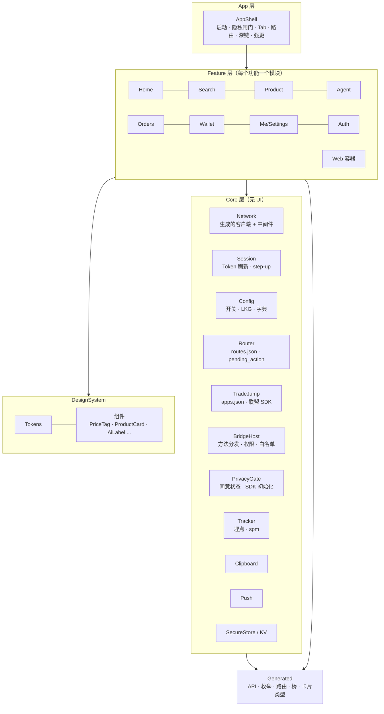
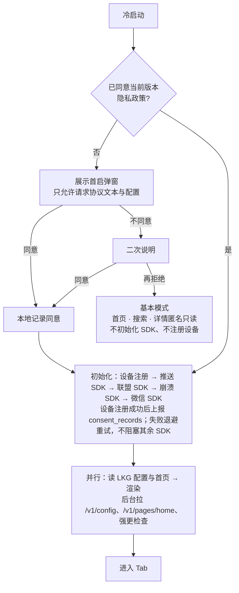

# 返利 App 规划文档 · 03 前端架构

2026-09-29 · 覆盖 iOS、Android、鸿蒙三端原生，H5，管理后台。全新设计（D19）；方法表与枚举全文见 `04_数据模型与契约.md`。业务规则（价格、文案、身份、剪贴板等）只在 `08_业务规则/` 维护，本文写「BR-xxx」编号 + 一句话；平台与系统能力见 `09_平台能力验证/`（CAP-xxx）；验收编号见 `10_首个完整流程验收用例.md`。2026-10-01 按拍板第二批（`docs/changes/20261001-拍板第二批.md`）回写：鸿蒙三端同步、跳转统一路由名、按端版本门槛、首页缓存与弹窗卡、强更、弱网、埋点规格、外观与测试机制、桥签名白名单、SDK 清单、Agent 卡片标记与购买超时（逐处注编号）。2026-10-01 晚按拍板第二批 §8 补充决定回写 §9：后台按权限点授权（ADD-04）、资金操作一人完成（ADD-05）；钱包为单一余额（ADD-06，页面与字段见 01 §4.2、04 §6.4）；§8 ADD-08：open 响应表 30101 / 30102 `auth_unavailable` 不拉起授权、不给无返利购买。2026-10-01 用语同步（ADR-0001 §3，规划/11 §9.1）：§1.2、§8.1 的 H5 组件库由原选型改为「待定」，H5 与后台的选型和版本线以 `docs/adr/0001-技术栈基线.md` 为准；§1「当前实现（D27）」段同步为库版本线由 ADR-0001 锁定。

---

## 1. 端与职责

**稳定方向（D28）**：保留 iOS / Android / 鸿蒙三端原生壳，承接系统能力与客户端 SDK，并提供 WebView + JSBridge 承载共用 H5。

**三端同步交付**：鸿蒙与 iOS、Android 同一版本号、同时发版，不再作为晚 2–3 周的独立里程碑（D4，拍板第二批 TECH-01、TECH-07）。

**当前实现（D27）**：核心交易与 Agent 页采用原生 UI，高频变化页采用 H5。框架与库的版本线由 `docs/adr/0001-技术栈基线.md` 锁定（待核项核实后补入该文），改动须新写 ADR；逐页实现方式、生成流程可以随新增开发资料调整；已确认的业务行为、价格展示和授权边界保持一致。首版淘礼金按 D7 关闭，相关卡片/动作保留可扩展位置，实际接入时再启用。

### 1.1 端与页面职责

以下是职责摘要，逐页实现方式统一见 [01 需求规划 §4.2](01_需求规划.md#42-页面清单)。订单列表 `OrderList`、订单详情 `OrderDetail` 当前为原生；订单找回 `FindOrder`、收益明细 `Ledger` 为 H5。

| 端 | 做什么 | 不做什么 | 判断标准 |
| --- | --- | --- | --- |
| 原生（三端各一份） | 壳（启动、隐私闸门、Tab、路由、深链、推送、更新、WebView 容器）、交易链路（搜索、详情、转链外跳、联盟授权）、Agent 对话页、订单列表与详情、钱包与提现、实名、设置与注销、首页 SDUI 渲染器 | 规则说明、帮助、活动页等经常改动的内容 | 稳定、性能敏感、要调系统能力或联盟 SDK 的页面 |
| H5（三端共用） | 返利规则、帮助、公告、协议、收益明细、订单找回、消息中心、邀请好友、邀请落地页、分享中间页、桥一致性测试页；P1 起活动会场 | 支付、提现、改收款账号、签署劳务协议、注销 | 一周内可能改一次的页面 |
| 管理后台 | 运营、客服、财务的全部操作 | 用户侧功能 | — |

### 1.2 前端技术总览

下表串联各层的当前方案；H5 与后台的选型和版本线以 ADR-0001 为准（改动须新 ADR），三端的具体依赖与版本在 §3.3 维护，接入前结合实际工程验证。

| 部分 | 开发语言 / 框架 | 运行位置与作用 | 详细选型 |
| --- | --- | --- | --- |
| iOS 壳与原生页面 | Swift + SwiftUI | 原生 App；内置 WKWebView 承载 H5 | §3.3 |
| Android 壳与原生页面 | Kotlin + Jetpack Compose | 原生 App；内置 Android WebView + AndroidX WebKit 承载 H5 | §3.3 |
| 鸿蒙壳与原生页面 | ArkTS + ArkUI | 原生 App；内置 ArkWeb 的 Web 组件承载 H5 | §3.3 |
| 三端共用 H5 | React + TypeScript + Vite；Tailwind + 移动端组件库（待定，ADR-0001） | App 内在 WebView 中运行；邀请和分享落地页也可在外部浏览器运行 | §8.1 |
| 管理后台 | React + Refine + Ant Design | 浏览器中的运营、客服、财务界面 | §9.1 |

WebView 是网页容器，React 负责 H5 页面开发，JSBridge 连接 H5 与原生能力（§5）。例如自有 H5 发起购买时，经桥交给原生处理授权与外跳；客户端 SDK 在原生侧封装，联盟服务端 API 在 02 的联盟网关中接入。H5 在外部浏览器运行时按 §8.3 处理无桥场景。

**三端一致性靠四样东西保证**：同一份契约生成的代码；同一份行为规格 `specs/client-behavior.md`（验收编号三端共用）；同一套分层和命名；同一批 fixture 驱动的快照测试。

---

## 2. 共享契约与代码生成

契约在 `rebate-platform/contracts/`，由当前接口任务的负责代理维护，Claude Code 与 GPT 均可承担。每次合并打 tag（如 `contracts-v0.9.3`），CI 生成各端产物并发布为制品，自动向三个原生仓库开升级 PR。原生仓库用 `contract.lock` 锁定版本，CI 检查"契约落后"并告警。生成的文件放在各仓库 `Generated/` 目录，**禁止手改**，CI 重新生成后 `git diff --exit-code`。按功能逐个先写 `openapi.yaml`，代码按它校验，禁止由代码反向生成覆盖契约（拍板第二批 TECH-05）；OAS 3.1 只用下表四个生成器都支持的写法，CI 四端同时编译生成物（TECH-27）。

| 契约 | iOS 生成物 | Android 生成物 | 鸿蒙生成物 | H5 / 后台生成物 |
| --- | --- | --- | --- | --- |
| `openapi.yaml` | `swift-openapi-generator` 客户端与类型 | `openapi-generator`（kotlin，Retrofit + kotlinx.serialization） | 自写模板生成 ArkTS 接口类型 + 请求函数 + 运行时校验（ArkTS 禁止 `any`，现成生成器不可用） | `openapi-typescript` 类型 + `openapi-fetch` 客户端 |
| `error-codes.yaml` | `ErrorCode` 枚举 + 客户端动作表 | 同左 | 同左 | 同左 |
| `enums/*.yaml` | Swift 枚举，未知值映射 `.unknown` | Kotlin 枚举，`coerceInputValues` 兜底 | ArkTS 常量 + 运行时校验 | TS 联合类型 |
| `bridge.schema.json` | 方法名常量、参数与结果类型、权限级别表 | 同左 | 同左 | `packages/bridge-sdk` 类型 |
| `agent-stream.schema.json` | 事件与卡片类型 | 同左 | 同左 | — |
| `home-schema.json` | 组件 props 类型 | 同左 | 同左 | 后台表单 schema、预览器 |
| `routes.json` | `Route` 枚举 + 路由表（`since` 按端，TECH-07） | 同左 | 同左 + `route_map.json` | H5 路由常量 |
| `specs/events.yaml` | `Tracker` 事件类型与构造函数（拍板第二批 TECH-21） | 同左 | 同左 | TS 事件类型 |
| `apps.json` | `LSApplicationQueriesSchemes`、Associated Domains 片段 | `<queries>` 片段 | `querySchemes` 片段 | — |
| `design-tokens.json` | `Color`/`Font`/`Spacing` 常量 | Compose `Theme` 常量 | ArkTS 资源与常量 | CSS 变量 + Tailwind 预设 |
| `texts.default.json` | 包内默认文案资源（唯一来源，BR-TEXT-12） | 同左 | 同左 | 同左 |

生成器脚本在 `rebate-platform/tools/codegen/`，三端 CI 用同一版本。鸿蒙生成流程先用当前流程的样例验证可用性，再扩展覆盖；尚未接入的开发资料与接口继续补充，不作为全量接口冻结点（D27）。

---

## 3. 原生通用架构

### 3.1 分层

三端采用同样的分层和命名，差异只在实现技术。



**依赖方向**：App → Feature → Core → Generated；Feature 之间不能互相依赖，跨功能跳转一律经 Router（用路由名，不 import 对方页面）。三端都用模块边界强制：iOS 用本地 SPM 包，Android 用 Gradle 模块，鸿蒙用 HAR 模块。

### 3.2 页面内模式（统一单向数据流）

每个页面四个类型，三端命名一致，便于三个代理对照同一份规格写出结构相同的代码：

| 类型 | 职责 | 示例 |
| --- | --- | --- |
| `XxxUiState` | 不可变的页面状态（loading / content / empty / error 与数据） | `ProductUiState` |
| `XxxAction` | 用户意图 | `.tapBuy`、`.tapShare`、`.retry` |
| `XxxEffect` | 一次性副作用 | `.navigate(route)`、`.toast(msg)`、`.openAuth(platform)`、`.jump(plan)` |
| `XxxViewModel` | 接收 Action，调用 Repository，产出 UiState 与 Effect | `ProductViewModel` |

Repository 层封装 API 调用与缓存，ViewModel 不直接调用生成的客户端。错误码到动作的映射统一在 Core 的 `ErrorActionMapper` 里完成（实现见第 4.2 节，码与动作见 08 §13.11），页面只处理映射后的 Effect。

### 3.3 三端技术选型

表内版本与库是当前推荐组合，待官方资料、实际工程和真机结果验证后确定；表内禁用项用于避免当前组合混用旧 API，可在 D28 的原生壳方向内随实现方案修订，不视为永不变更的技术决定。SDK 选型需分别核对各端发行包、版本和依赖；列入本表不代表已验证兼容。联盟接入须验证必要授权、转链、外跳与订单归因，不能仅凭商品页能打开就认定接入成功（CAP-TB-11、CAP-JD-11、CAP-PDD-11、CAP-X-04）。

| 能力 | iOS | Android | 鸿蒙 |
| --- | --- | --- | --- |
| 最低版本 | iOS 16（D6，MVP 期间不改，拍板第二批 TECH-16） | API 26 | target API 24，最低兼容 API 20（D5，拍板第二批 TECH-17） |
| 外观 | 三端统一品牌外观（设计令牌）；导航栏与返回手势随系统；系统深色模式下强制浅色（拍板第二批 TECH-22） | 同左 | 同左 |
| 语言 / UI | Swift 6 语言模式（严格并发）/ SwiftUI | Kotlin / Jetpack Compose（Material 3 作为底层，外观由令牌定制） | ArkTS / ArkUI |
| 状态 | `ObservableObject` + `@StateObject`（iOS 16 已定，不用 `@Observable`） | `ViewModel` + `StateFlow`；Effect 用 `Channel` | 状态管理 V2：`@ComponentV2`、`@ObservedV2`、`@Trace`、`@Local`、`@Param`；**禁用 V1 装饰器** |
| 导航 | `NavigationStack` + 路由枚举 | Navigation Compose（类型安全路由） | `Navigation` + `NavPathStack`；**禁用 `router`** |
| 依赖注入 | 协议 + 轻量容器（`Environment` 注入） | Hilt | 手写单例容器（模块级 `AppContainer`） |
| 网络 | URLSession + 生成客户端 + 中间件 | OkHttp + Retrofit（生成） | `@kit.NetworkKit` http + 生成的请求函数 |
| SSE | `URLSession.bytes(for:)` 逐行解析 | `okhttp-sse` | `http.requestInStream` + `dataReceive` 事件 |
| 序列化 | `Codable`（生成） | kotlinx.serialization，`ignoreUnknownKeys = true`、`coerceInputValues = true` | `JSON.parse` + 生成的运行时校验函数 |
| 图片 | Kingfisher | Coil 3 | ImageKnife |
| 安全存储 | Keychain | Android Keystore + EncryptedFile | HUKS + Asset Store Kit |
| KV / LKG 文件 | 应用沙盒文件 + UserDefaults（非敏感） | DataStore + 文件 | Preferences + 文件 |
| WebView | WKWebView | `android.webkit.WebView` + androidx.webkit | ArkWeb `Web` 组件 |
| 登录 | 手机号、微信 OpenSDK、Sign in with Apple | 手机号、微信 OpenSDK、华为账号（华为渠道包） | 手机号、微信鸿蒙 SDK、Account Kit |
| 推送 | APNs（经推送聚合 SDK） | 推送聚合 SDK + 厂商通道 | Push Kit（直连，不经聚合）；聚合服务在极光、个推中选一家（拍板第二批 TECH-14） |
| 联盟（待联调验证） | 淘宝：百川 SDK；京东、拼多多：核实是否需 SDK，链接路径为候选 | 同左，采用对应 Android 接入方式 | 淘宝：百川鸿蒙版；京东、拼多多：核实鸿蒙支持，scheme / App Linking 为候选；按 CAP-X-04 验证归因 |
| 剪贴板（行为见 BR-ID-16） | `UIPasteboard.detectPatterns` + `UIPasteControl` | `ClipboardManager` | `PasteButton` |
| 崩溃 | Sentry Cocoa | Sentry Android | AGC Crash（拍板第二批 TECH-15） |
| 工程 | XcodeGen（`project.yml` 生成工程，避免多个代理同时改 `.pbxproj` 冲突）+ 本地 SPM 包 | Gradle KTS + 版本目录 + convention 插件 | hvigor + oh-package，锁定 DevEco 版本 |
| 静态检查 | SwiftLint + SwiftFormat | ktlint + detekt + Android Lint | codelinter（0 error） |
| 单元 / 快照 | XCTest + swift-snapshot-testing | JUnit + Robolectric + Compose 截图测试 | Hypium |
| UI 冒烟 | XCUITest + Maestro | Maestro + Espresso-Web（桥） | arkxtest UiTest + hdc 截图 |

### 3.4 目录结构

**iOS**

```
rebate-ios/
  AGENTS.md  CLAUDE.md  project.yml  contract.lock
  App/                      # AppShell、AppDelegate、Info.plist 片段、Entitlements
  Packages/
    Core/                   # Network、Session、Config、Router、TradeJump、BridgeHost、PrivacyGate、Tracker、Clipboard、Push、SecureStore
    DesignSystem/
    Generated/              # API、枚举、路由、桥、卡片类型（CI 生成，禁止手改）
    Features/
      Home/ Search/ Product/ Agent/ Orders/ Wallet/ Me/ Auth/ Web/
  Resources/default_home.json  Resources/default_config.json  Resources/bridge_origins.json
  UITests/  .maestro/  fastlane/
```

**Android**

```
rebate-android/
  AGENTS.md  CLAUDE.md  contract.lock  gradle/libs.versions.toml  build-logic/
  app/
  core/{network,session,config,router,tradejump,bridge,privacy,tracker,clipboard,push,storage}/
  core/designsystem/  core/generated/
  feature/{home,search,product,agent,orders,wallet,me,auth,web}/
  .maestro/
```

**鸿蒙**

```
rebate-harmony/
  AGENTS.md  CLAUDE.md  contract.lock  build-profile.json5  oh-package.json5
  entry/                    # HAP：AppShell、EntryAbility、route_map.json
  common/core/              # HAR：network、session、config、router、tradejump、bridge、privacy、tracker、push、storage
  common/designsystem/  common/generated/
  features/{home,search,product,agent,orders,wallet,me,auth,web}/   # HAR
  docs/harmony-ref/         # 锁定版本的 API 文档子集与 ArkTS 限制规则；镜像外的 API 禁止使用
```

### 3.5 第三方 SDK 清单（拍板第二批 TECH-03）

隐私政策与 SDK 管理服务平台登记按本表由法务重写（OPS-09），上线前按实际集成逐项核对（05 QA-07）。所有 SDK 只在 `PrivacyGate.onConsented()` 之后初始化（§4.1）。

| SDK | 端 | 用途 | 初始化时机 |
| --- | --- | --- | --- |
| 推送聚合（极光或个推，选一家）+ 厂商推送通道 | iOS、Android | 推送 | 同意后 |
| Push Kit | 鸿蒙 | 推送 | 同意后 |
| Sentry Cocoa / Sentry Android（境内自建服务端） | iOS、Android | 崩溃 | 同意后 |
| AGC Crash | 鸿蒙 | 崩溃 | 同意后 |
| 微信 OpenSDK / 微信鸿蒙 SDK | 三端 | 登录、分享 | 同意后 |
| Sign in with Apple（系统能力） | iOS | 登录 | 用户点击时 |
| 华为 Account Kit | 鸿蒙、华为渠道 Android 包 | 登录 | 用户点击时 |
| 百川 SDK（淘宝） | 三端（鸿蒙须加白） | 授权、外跳 | 同意后 |
| 京东、拼多多 SDK | 是否需要待核实（CAP-*-11） | 外跳 | 同意后 |

不接入：广告 SDK、第三方统计与性能监控 SDK、运营商一键登录（P1 再评估）、第三方浏览器内核（WebView 一律用系统组件）、地图与定位、QQ、第三方客服 SDK（客服用企业微信链接）。服务端调用、客户端不集成的第三方：阿里云短信、实名核验、支付宝、银行卡通道、阿里云百炼、TypeSafe Jev（只收非个人数据），在隐私政策的第三方共享清单中按数据流向列明。

---

## 4. Core 模块规格

### 4.1 启动与隐私闸门



- 闸门、二次说明、基本模式、初始化顺序与设备注册重试按 BR-ID-11（iOS 不给退出按钮；基本模式冷启动不自动重弹，只在点【开启完整功能】或需同意的功能时弹，BR-ID-02）。
- `PrivacyGate` 是所有第三方 SDK 初始化的唯一入口；静态检查规则：除 `PrivacyGate.onConsented()` 外，任何地方出现 SDK 初始化调用即 CI 失败。
- 基本模式下 Network 中间件剥离 `Authorization`、`X-Device-Id`、签名头，只放行 BR-ID-11 白名单接口。
- 隐私中心【撤回同意】：清本地令牌、device_id、install_secret 后进入基本模式（BR-ID-13）。
- 强更：强更检查命中 `min_supported_version`（按端与渠道）时进入全屏拦截页 `ForceUpdate`，按钮一律跳应用商店，不在 App 内下载安装包；低于 `recommended_version` 时弹可关闭的提示（拍板第二批 TECH-19）。

### 4.2 网络层与鉴权

**公共请求头**：`Authorization`、`X-App-Id`、`X-Platform`（ios / android / harmony / h5 / admin）、`X-App-Version`（SemVer；三端同号，TECH-07）、`X-Build`、`X-Device-Id`（服务端签发）、`X-Channel`（取值见 04 §5，TECH-18）、`X-Trace-Id`（客户端生成，便于对照）、`Idempotency-Key`（写操作）；敏感接口另加 `X-Timestamp`、`X-Nonce`、`X-Sign`；需二次验证的接口另带 `X-Step-Up-Token`（04 §5）。

**中间件顺序**：公共头 → 签名（仅标记为 signed 的 operation，标记来自 openapi 扩展字段 `x-signed: true`）→ 发送 → 解包 `{code, msg, data}` → `ErrorActionMapper`。

**Token 刷新**：单飞（single-flight）。多个请求同时收到 10002 时只发 1 次刷新，其余排队等待；刷新失败清会话并跳登录。

**超时、重试与弱网**（拍板第二批 TECH-20）：请求 10 秒超时；读接口（GET）自动重试 1 次（退避 500 毫秒），写接口不自动重试；订单、钱包页请求失败时显示上次成功的数据并标注「更新于 HH:mm」；H5 失败显示原生重试页（§8.3）。`POST /v1/links/{link_id}/open` 例外：8 秒无响应即结束 loading、提示「网络不稳定，请重试」，重试沿用原 `Idempotency-Key`，不自动外跳（拍板第二批 TRADE-22，§7.4）。

**错误码 → 客户端动作**：码值、含义、客户端动作与可重试只在 08 §13.11 错误码总表维护（`contracts/error-codes.yaml` 由负责当前接口任务的代理按其同步）；提示文案一律取字典 `error.<code>`（BR-TEXT-14）；本节不列码表，只写 `ErrorActionMapper` 的实现方式。§13.11 没有的码视为未分配，客户端按 BR-TEXT-14 兜底（显示服务端 msg，5xxxx 走通用错误态）。

`ErrorActionMapper` 实现要点（动作本身以 §13.11 为准）：

- 统一入口：解包后按码查 `error-codes.yaml` 生成的动作枚举，输出 Effect（跳路由 / 弹 Sheet / 重放 / 置灰按钮 / Toast / 通用错误态）；页面只消费 Effect，不自行判断码值。
- 重放：需先完成前置动作的码（登录、刷新、二次验证、绑手机、授权、设备重新注册）完成后重放原请求至多 1 次；重放**沿用原 `Idempotency-Key`**（BR-ID-08），`StepUpSheet` 拿到 `step_up_token` 后同样沿用。
- 刷新：10002 走上文单飞刷新；刷新失败清会话并跳登录。
- 恢复：跳 `Login`、`BindPhone`、同意、授权前先持久化 `pending_action`，完成后按 BR-ID-10 恢复。
- 按钮禁用：42901 按 `Retry-After` 禁用触发按钮，无该头时 5 秒。
- 带 `data.reason` 的码（如 30303、50301）：先取 `error.<code>.<reason>` 子键，未命中回落 `error.<code>`（BR-TEXT-14）。
- 重新转链类动作（如 30144）：按卡片 `product_key` + `item_ref` 重新转链后替换原卡片，外跳仍须用户再次点击（BR-ATTR-21），不自动外跳。
- 5xxxx 通用错误态附 `trace_id` 后 6 位（BR-TEXT-14）。

### 4.3 配置、开关与 LKG

- `ConfigStore` 启动时先读 LKG（最近一次成功的 `/v1/config` 响应，存文件），再后台拉取；拉取失败继续用 LKG；无 LKG 用包内 `default_config.json`。
- 回前台时带 ETag 拉取；开关变化通过 `ConfigStore` 的可观察流通知各 Feature。
- 客户端类开关：`home.fallback`、`h5.route.<page>.enabled`、`clipboard.enabled.<platform>`、`agent.entry.visible`、`ui.grayscale`。

### 4.4 路由与深链

- 路由名来自 `routes.json`（见 `01` 第 4.2 节）。每条路由声明：`name`、`kind`（native / h5）、`h5_path`（kind=h5 时）、`params` schema、`auth`（none / login / phone / realname）、`since`（按端 `{ios, android, harmony}` 的最低版本，拍板第二批 TECH-07）。
- 同一个 `Router.open(name, params)` 服务三类调用方：原生页面、首页卡片 `action`、JSBridge `nav.open`、推送点击、深链。首页卡片、推送、站内信、H5 的跳转一律为 `{route, params}`；外链统一 `{route: "ExternalPage", params: {url}}`（拍板第二批 TECH-04）。
- **深链**：`https://<链接域名>/r/<name>?<params>`（Universal Links / App Links / App Linking）为主，自定义 scheme `<app-scheme>://r/<name>` 兜底；链接域名用域名表的 `l.` 子域（02 §3.4），域名与 scheme 由负责人 W1 前给定（TECH-26，见 `06` Q-A5）。
- **`pending_action`**：需要登录、绑手机、同意、授权的动作先持久化到本地，持久化与恢复规则见 BR-ID-10；三端共用验收编号 AC-ACC-pending。
- 未知路由名或 `since` 高于当前版本：打开"请升级 App"提示页，不崩溃。

### 4.5 外跳（TradeJump）

- 服务端返回外跳方案 `{link_id, primary, fallbacks[], expire_at}`，每一项是 `{type: sdk|scheme|universal_link|h5|copy_tpwd, value}`。
- 淘宝 `sdk` 步骤（2026-10-03）：淘宝由客户端百川 SDK 完成淘客转链，服务端下发打开方式（openByUrl 我方推广链接且不传 pid，或 openByCode 按 item_id 并带 pid + relationId），三端原样传给百川，不改不补参数（BR-ATTR-05、BR-ATTR-27 淘宝行）；承载这些参数的契约字段待按 `docs/changes/20261003-淘宝转链改客户端百川.md` 补进 `JumpStep`。
- 已装检测：open（与仅供 H5 的 convert，拍板第二批 TRADE-03）请求体带 `installed`（true / false / unknown，缺省按 unknown）。iOS 用 `canOpenURL` 查 `apps.json` 声明的 scheme，Android 查 `<queries>` 声明的包名，鸿蒙查 `querySchemes` 声明的 scheme，H5 固定 unknown；检测失败或未声明时报 unknown（BR-ATTR-27 ①）。
- 客户端只按服务端下发的 `primary`、`fallbacks` 顺序执行，不自行拼 scheme、不自行追加兜底。已装检测、首选与降级路径、未安装兜底按 BR-ATTR-27（未安装提示的展示时机按 BR-ATTR-27 ②：installed=false 时点击前展示，unknown 时全部路径失败后展示；按钮与提示文案见 BR-TEXT-14）。
- 每一步结果上报 `link_jump`（路径/是否拉起成功/耗时/installed，BR-ATTR-27 ③）。
- `JumpTip` 按用户 × 平台首次外跳前展示一次，服务端记已读；外跳返回后展示「待跟单」卡；找回页诊断包只检测 `apps.json` 声明的目标 App 能否唤起，上传前逐项同意（BR-ATTR-21）。
- `LSApplicationQueriesSchemes` 只声明 `apps.json` 生成的 ≤20 条。
- 只有用户点击才会触发外跳（联盟规范红线）；UI 测试覆盖"无点击不外跳"。

### 4.6 剪贴板

读取方式按 BR-ID-16（三端差异见 §3.3 选型表；系统限制 CAP-X-02；验收 AC-S1-03）。实现要点：Core 的 `ClipboardWatcher` 读到内容后按 `/v1/config.clipboard` 规则本地过滤，只上传识别出的链接 / 口令与标题片段，调用 `POST /v1/inputs/parse`（原写 `/v1/clipboard/parse`，C-14）；App 自己写入的内容（复制口令、邀请码）记录 hash，不再识别。iOS 提示条内嵌 `UIPasteControl`，与 F-CLIP-01「不出现允许粘贴弹窗」一致（09 附录 A-15）。未定：Android 开关开启后命中时直接识别还是先出提示条（10 §6.1 G-20）。

**邀请口令**（拍板第二批 OPS-06，BR-INV-04）：同一次读取先按商品规则识别，命中商品只出查返利提示（商品优先）；未命中商品、且含邀请落地页链接（分享页域名的邀请路径）或「邀请码」字样时，仅对可绑定用户出邀请提示条，用户点击才调用 `POST /v1/me/inviter`；读取方式与时机仍按 BR-ID-16，不新增读取时机。

### 4.7 埋点（Tracker）

- 事件、字段与公共字段在 `specs/events.yaml` 定义，生成三端与 H5 的事件类型与构造函数，业务代码只能调用生成函数（拍板第二批 TECH-21）。公共字段：event_id、name、client_at、session_id、device_id、user_id（游客为空）、platform、app_version、channel、page、spm、trace_id；游客事件只带 device_id，登录后由服务端按 device_id 与登录时刻在报表层关联到 user_id，不回写原事件。
- 事件批量上报到 `/v1/events`（每 10 条或 10 秒），离线缓存 ≤500 条。
- `spm` = `页面.模块.坑位`（如 `home.product_grid.3`），由组件自动拼接：页面在 Screen 级注入，模块来自 SDUI section id，坑位来自列表索引。
- 转链请求必须携带当前 `spm` 与 `scene`。
- MVP 事件清单：`app_launch`、`page_view`、`exposure`（卡片曝光）、`click`、`search`、`convert`、`link_jump`、`funnel_first_order.*`、`agent_*`、`sdui_card_error`、`bridge_call`、`h5_white_screen`。

---

## 5. WebView 容器与 JSBridge

### 5.1 两类容器

| 容器 | 用途 | 注入桥 | 可加载 |
| --- | --- | --- | --- |
| `TrustedWebView` | 自有 H5（规则、帮助、找回、邀请、收益明细、消息） | 是 | 仅 `bridge_origins` 白名单内的 https 主 frame |
| `ExternalWebView` | 联盟活动页、商家页、任何第三方 URL | **否** | 任意 https；禁止文件访问；不共享 Cookie |

`TrustedWebView` 发生跨 origin 导航（跳到白名单外）时，自动在新的 `ExternalWebView` 中打开，原容器不变。白名单随 `/v1/config` 下发并带服务端签名，验签失败用包内内置版本。

### 5.2 传输层（三端各自实现，对 H5 暴露同一个 SDK）

| 端 | H5 → 原生 | 原生 → H5 | origin 与 frame 校验 |
| --- | --- | --- | --- |
| iOS | `WKScriptMessageHandlerWithReply`（`window.webkit.messageHandlers.rebate.postMessage`，返回 Promise） | `evaluateJavaScript` 派发事件 | `WKScriptMessage.frameInfo.isMainFrame` + `securityOrigin` 在白名单内 |
| Android | `WebViewCompat.addWebMessageListener`，设置 `allowedOriginRules` | `JavaScriptReplyProxy.postMessage` | 由 `allowedOriginRules` 与 `isMainFrame` 参数保证；**禁止使用 `addJavascriptInterface`** |
| 鸿蒙 | `javaScriptProxy`，配置 `permission`（`urlPermissionList` 对象级白名单、`methodList` 方法级白名单） | `runJavaScriptExt` | ArkWeb permission 精确匹配 scheme + host |

启动脚本在 document start 注入（iOS `WKUserScript`、Android `addDocumentStartJavaScript`、鸿蒙 `javaScriptOnDocumentStart`），定义 `window.__REBATE_BRIDGE__ = { version, methods[] }`，供 H5 做能力探测。

### 5.3 协议

**信封**（版本 1）：

```jsonc
// H5 → 原生：请求
{ "v": 1, "id": "b7f3…", "method": "trade.openProduct", "params": { "platform": "taobao", "product_key": "tb:…", "item_ref": "…" } }
// 原生 → H5：响应（code = 0 成功；桥错误码用 9xxxx 段）
{ "id": "b7f3…", "code": 0, "msg": "", "data": { … } }
// 原生 → H5：事件
{ "event": "app.resume", "data": { … } }
```

**调用模型**：同步式（立即返回）、异步（Promise，带超时）、事件订阅（`bridge.on(event, cb)`）。每个方法在 `bridge.schema.json` 里声明 `model`、`timeout_ms`、`params` / `result` 的 JSON Schema、`level`、`since`、`platforms`。

**权限级别**：

| 级别 | 条件 | 方法示例 |
| --- | --- | --- |
| L0 公开 | 白名单 origin 主 frame | `app.getEnv`、`ui.toast`、`ui.setNavBar`、`nav.open`、`nav.close`、`clipboard.write`、`cs.open`、`track.event` |
| L1 需登录 | L0 + 用户已登录 | `auth.getUser`（字段见 BR-ID-32，**不返回 token**）、`auth.getH5Token`（h5_token，有效期与作用域见 BR-ID-32）、`share.open`、`media.saveImage`、`ext.openApp` |
| L2 敏感 | L1 + 用户手势（最近 1 秒内有点击） | `trade.convertAndOpen`、`trade.authorize`、`clipboard.read`、`net.signedRequest`（原生按 BR-ID-09 签名后代发；h5_token 不能直接调签名接口；原生只签 `bridge.schema.json` 中 `signed_paths` 白名单内的方法 + 路径，MVP 只有 `POST /v1/orders/claims`，白名单外返回 90403，拍板第二批 TECH-30） |
| 不开放 | — | 提现、改收款账号、签署劳务协议、实名、注销、改手机号 |

**方法命名空间**（全表见 `04` 第 9 节）：`app.*`、`auth.*`、`ui.*`、`nav.*`、`trade.*`、`share.*`、`media.*`、`clipboard.*`、`ext.*`、`cs.*`、`perm.*`、`track.*`、`net.*`。`trade.openProduct` / `trade.convertAndOpen` 参数含 `item_ref`，原样透传（BR-PROD-11）。

**桥错误码**：90001 方法不存在 / 不支持；90002 参数不合法；90003 超时；90004 用户取消；90401 未登录；90403 origin 或 frame 不允许；90404 缺少用户手势；90500 原生内部错误。

### 5.4 H5 侧 SDK（`packages/bridge-sdk`）

```ts
import { bridge } from '@rebate/bridge-sdk';

bridge.isInApp();                         // 是否在可信容器内（看 __REBATE_BRIDGE__，不看 UA）
bridge.has('trade.convertAndOpen');       // 能力探测
await bridge.call('ui.toast', { text: '已复制' });
const { token } = await bridge.call('auth.getH5Token');   // h5_token（BR-ID-32），SDK 内部缓存并在 10002 时自动续取
bridge.on('app.resume', () => refetch());
```

SDK 的方法签名由 `bridge.schema.json` 生成，调用不存在的方法在编译期报错；在 App 外调用时返回 90001。H5 调用任何桥方法前必须先 `has()` 检查（lint 拦截未检查的调用），旧版 App 不支持时按降级处理（拍板第二批 TECH-28）。

### 5.5 一致性测试

`apps/h5` 的 `conformance` 入口逐个调用 MVP 方法（正常、超时、不支持、参数错误、无手势五类），把结果写入 `window.__RESULT__`。三端 UI 测试加载该页（只在 debug / staging 包中可打开），断言结果与 schema 一致。这是 W1 周五验收门。

### 5.6 能力核对

新协议按能力重新组织，不沿用任何旧方法名。用花卷云方法表核对后，以下能力已覆盖：登录态与用户信息、登录拉起、Toast / Loading、标题栏样式、关闭页、剪贴板读写与自动识别开关、商品详情与联盟活动转链跳转（带跟单）、授权备案、打开原生页、分享（好友 / 朋友圈 / 系统 / 图片）、保存与预览图片、打开外部 App（含安装检测与降级）、系统浏览器、客服、推送权限与权限申请、埋点。P1：扫码、上传图片、打开小程序、导师微信、激励视频；P2：定位。明确不做：不带跟单的直接唤起购买（会丢归因）、QQ 聊天、全局分红等旧功能入口。

---

## 6. 首页 SDUI 渲染器

### 6.1 数据结构（摘要，全文见 `contracts/home-schema.json`）

```jsonc
{
  "page_key": "home", "version": 42, "ttl_sec": 300,
  "sections": [
    { "id": "s1", "type": "banner", "version": 1, "min_app_version": { "ios": "1.0.0", "android": "1.0.0", "harmony": "1.0.0" },
      "props": { "height_ratio": 0.4, "autoplay_ms": 4000 },
      "data_source": { "kind": "static", "items": [ { "image": "…", "action": { "route": "Search", "params": { "q": "纸巾" } } } ] },
      "condition": { "login": "any", "has_parent": "any" } },
    { "id": "s5", "type": "product_grid", "version": 1,
      "props": { "columns": 2, "title": "今日必买" },
      "data_source": { "kind": "product_pool", "pool_id": "p_123", "limit": 20 } },
    { "id": "s9", "type": "feed_infinite", "version": 1,
      "data_source": { "kind": "union_material", "platforms": ["taobao", "jd", "pdd"], "mix": "interleave" } },
    { "id": "p1", "type": "popup", "version": 1,
      "props": { "image": "…", "daily_max": 1, "time_window": ["09:00", "22:00"] },
      "data_source": { "kind": "static", "items": [ { "action": { "route": "AuthSheet", "params": { "platform": "taobao" } } } ] },
      "condition": { "union_authorized": "no" } }
  ]
}
```

**人群条件与灰度**（拍板第二批 OPS-05、OPS-10）：`condition` 只用服务端可直接查询的事实：`login`（是否登录）、`has_parent`（有无上级）、`union_authorized`（是否已完成淘宝 / 拼多多授权）、`has_order`（有无订单）；不用新用户、活跃等会员口径（BR-INV-23）。`GET /v1/pages/home` 鉴权为 optional，服务端按可选令牌判断人群，只下发命中的 section。灰度按 device_id 哈希分桶，无 device_id（基本模式）给全量版本。`min_app_version` 按端取值，服务端按 `X-Platform` 取对应端门槛（TECH-07）。

### 6.2 渲染流程

1. **解码隔离**：先把 `sections` 解码为通用 JSON 数组，再逐个按 `type` 解码为强类型卡片模型；任何一个解码失败只丢弃这一项，并上报 `sdui_card_error(type, version, page_version, reason)`。未知 `type` 静默跳过（服务端已按 `min_app_version` 过滤，这是第二道防线）。
2. **渲染隔离**：只渲染解码成功的模型。iOS / 鸿蒙无法捕获视图渲染异常，所以把所有可能出错的计算（数据源映射、格式化）放在解码阶段完成，视图只做纯展示；Android 同样遵守。
3. **数据源**：`static` 直接用；`product_pool`、`union_material`、`api` 由卡片各自发起请求，失败或为空时隐藏该卡，不显示空壳。
4. **三级兜底**：网络最新 → LKG（最近一次成功**渲染**的版本）→ 包内 `default_home.json`。有 LKG 时立即渲染 LKG 并在后台拉取，新版本到达后不替换当前屏，下次冷启动或用户下拉刷新时替换；无 LKG 时等网络，超过 1.5 秒先渲染包内默认（拍板第二批 TECH-10）。
5. **预取**：拿到配置后预取首屏卡片图片。
6. **动作**：卡片点击统一交给 `Router`，参数中注入 `spm`。
7. **曝光**：卡片可见 ≥50% 且 ≥500 毫秒记一次 `exposure`。
8. **全局置灰**：`ui.grayscale=true` 时对首页根视图加灰度滤镜。

### 6.3 卡片注册表

| type | 说明 | props 要点 | 数据源 |
| --- | --- | --- | --- |
| `banner` | 轮播图 | 高宽比、自动播放间隔 | static |
| `icon_grid` | 金刚区 | 列数（4/5）、行数、角标 | static |
| `product_scroll` | 商品横滑 | 标题、更多按钮 action | product_pool / union_material |
| `product_grid` | 商品网格 | 列数（1/2）、标题 | product_pool / union_material |
| `activity_entry` | 活动入口（1–3 图） | 布局样式 | static |
| `notice_bar` | 公告条 | 滚动 / 静态 | static / api |
| `feed_infinite` | 联盟物料信息流（置底，分页加载） | 混合三平台（拍板第二批 TRADE-15） | union_material |
| `popup` | 首页弹窗（原生，每页最多 1 个） | 图片、每日次数、时间段、关闭按钮（拍板第二批 TECH-12） | static |

「推广」角标：客户端只按服务端下发的 `ad_label` 展示（商品卡为 `product_card.ad_label`，banner 用 SDUI 卡片的同名字段），非 null 即原样显示角标、客户端不判断业务条件；默认 `product_pool` 数据源的商品卡与 banner 活动图下发「推广」，`union_material` 信息流为 null（BR-TEXT-17，拍板第二批 OPS-24）。

新增卡片 = 在 `home-schema.json` 注册 type 与 props schema → 三端各实现一个渲染器 → golden 样例与截图测试 → 后台自动得到表单。

---

## 7. Agent 对话页

### 7.1 结构

```mermaid
flowchart LR
  UI[AgentScreen] --> VM[AgentViewModel]
  VM --> SC[StreamClient<br/>SSE 连接 · 心跳超时 · 取消]
  SC --> RED[StreamReducer<br/>纯函数 (state, event) → state]
  RED --> VM
  VM --> CR[CardRenderer 注册表]
  VM --> JUMP[TradeJump<br/>links/open → 外跳]
  VM --> GATE[同意与登录闸门<br/>AgentConsent · AiLabel]
```

### 7.2 事件处理

- **StreamReducer 是三端的核心纯函数**，输入 `fixtures/agent-streams/*.ndjson`（正常、工具失败、取消、断线、未知卡片、error、降级 7 类），输出消息列表状态。三端都用这批 fixture 做单元测试和快照测试，保证行为一致。
- `text.delta` 按 `seq` 追加；乱序或重复的 `seq` 丢弃。
- `tool.status` 渲染为消息内的进度条目（如"正在查询京东商品"），`end` 或 `failed` 后折叠。
- `card` 按 `type` 找渲染器；找不到时显示 `fallback_text`。
- `done` / `error` 是唯一终止事件；收到后结束 loading，显示👍/👎与 `AiLabel`（文案取 `texts.ai_label`，BR-TEXT-16，拍板第二批 AI-24）。
- 30 秒无任何事件（含 ping）视为断线：显示"连接中断"，提供【重试】；重试时先调用会话历史接口拉回已完成的回复。
- 用户点"停止生成"：调用 cancel 接口并立即在本地结束该条消息。

### 7.3 文本渲染

只支持受限子集：段落、加粗、无序列表。不渲染链接、图片、HTML；服务端已过滤金额、URL、口令，客户端再做一次 URL 与口令正则剥离作为兜底。

### 7.4 卡片渲染器（MVP）

| card.type | 展示 | 主要交互 |
| --- | --- | --- |
| `product_list` | 1–8 张商品卡（横向卡片或两列网格，≤3 张时纵向大卡）；按 `disclaimer_key` 展示佣金披露（BR-AI-10）；每张卡显示 `match_tag` 条件标记（BR-AI-24，拍板第二批 AI-04）与服务端 `benefit_tags[]`（AI-08）；`rebate_basis=login_required` 时显示「登录查看返利」（BR-AI-11，AI-03，按平台开关） | 点击卡片 → 商品详情；点击购买按钮 → 购买流程 |
| `rebate_quote` | 单商品大卡：券后价、券、预估返利（术语 BR-PRICE-05）；素材场景下多一行"素材参考价 + 条件"；淘礼金标签后续接入（D7），首版不渲染 | 购买（「领淘礼金并购买」后续接入，D7） |
| `order_status` | 订单摘要：平台、商品、状态文案、原因码、预计结算月份（`expected_credit_period`，BR-TEXT-04，拍板第二批 AI-02） | 查看订单详情 |
| `rule_ref` | 规则原文（search_rules 命中条目，BR-AI-07） | 查看完整规则 |
| `watch_confirm`（P1 预留） | 降价提醒确认卡，必示字段按 BR-WATCH-18 | 【确认】→ `POST /v1/watches`（`Idempotency-Key` = card_id） |
| `claim_draft` | 找回草稿：平台、订单号、匹配证据摘要 | 【提交找回】（用户点击才提交） |
| `handoff` | 客服卡 | 打开企业微信客服 |
| `auth_required` | 需要授权 | 拉起授权，完成后自动继续 |
| `notice` | 降级、无结果、维护等提示 | 快捷改写 chips |

**购买流程**（与商品详情页共用，规则 BR-PRICE-13、BR-PRICE-14，验收 AC-S1-12～16、AC-S1-41、AC-S1-55）：按钮文案取 `cta.text_key`：有券「领券购买」、无券「去购买」、无返利「去购买（无返利）」（拍板第二批 TRADE-21）；open 8 秒无响应即结束 loading、提示「网络不稳定，请重试」，重试沿用原 Idempotency-Key，不自动外跳（TRADE-22）。未登录 → 登录后按 `pending_action` 恢复 → `POST /v1/links/{link_id}/open` → 按响应处理（多种同时成立时 off_shelf > coupon_gone > price_changed；弹窗文案取字典）：

| open 响应 | 客户端动作 |
| --- | --- |
| 30141（off_shelf） | 不外跳，卡片置灰；Agent 场景追加「换一批」 |
| `availability=coupon_gone` | 不论价差都弹券失效确认；返利同时归零时弹窗内追加无返利说明 |
| `price_changed=true` | 弹价格变动确认，确认后外跳 |
| 返利由 >0 变 0 | 弹无返利确认，确认后外跳 |
| 带 `new_link_id`（打开他人非分享 link 时服务端为当前用户新建，BR-ATTR-05 ③、G-08；游客 link 登录后沿用原 link_id，不返回 new_link_id，BR-ATTR-05 ②） | 无论确认还是取消，都用新价格与 `new_link_id` 替换卡片 |
| `requote_failed=true` | 用返回链接外跳，同时提示价格以下单页为准 |
| 50303 | 按 08 §13.11（BR-PRICE-13、BR-PRICE-08） |
| 50301 | 不外跳；按 `data.reason` 取 BR-TEXT-14 表 B 子键，动作以 08 §13.11 为准（maintenance：Toast + 按钮「稍后再试」；not_launched：卡片置灰「即将开放」、不弹 Toast；无 reason 按 maintenance）。点击前卡片状态取 `/v1/config.features.platform_status.<platform>`（04 §10.1），点击时以本响应为准 |
| 30101 / 30102 / 30111 | 授权后自动重试同一 `link_id`；30101 / 30102 带 `data.reason=auth_unavailable`（站长授权过期或失效）时不拉起授权、不外跳，只按 BR-TEXT-14 表 B 提示，不给无返利购买（BR-ID-24，拍板第二批 §8 ADD-08） |
| 30144（link_id 不存在） | 按 08 §13.11（BR-ATTR-05 ⑤）；实现见 §4.2 |
| 30602（淘礼金已抢光，后续接入，D7；首版不产生） | 不外跳 |

### 7.5 合规与体验

- 首次进入：`AgentConsent` 单独同意；未同意时只显示说明与【同意并使用】【暂不使用】。游客同意不随登录继承；设置页提供【撤回 AI 服务同意】，撤回后 `/v1/agent/*` 返回 10004（BR-AI-13）。
- 顶部固定显示模型公示文案（`config.agent.filing_text`）；每条 AI 回复底部显示 `AiLabel`；长按消息可举报。
- 空态：4 个示例问题（`config.agent.examples`）+ "粘贴链接查返利"按钮（鸿蒙为 `PasteButton`）。
- 情境入口：带 `context` 打开时自动发送首条消息（商品、订单、剪贴板文本）。
- 自动滚动：用户未手动上滑时跟随新内容滚动；上滑后显示"回到底部"。
- 输入框：最多 500 字；发送中禁用发送、显示停止按钮。
- 首版不做历史对话列表，只有当前对话与"新对话"（拍板第二批 AI-23）。

---

## 8. H5

### 8.1 技术栈

| 能力 | 选择 |
| --- | --- |
| 框架 | React + TypeScript + Vite |
| 组件 | 移动端组件库待定（脚手架阶段做真实浏览器冒烟后再锁，ADR-0001 §2、§3）+ Tailwind（令牌预设来自 `packages/ui-tokens`） |
| 路由 | React Router（按路由懒加载） |
| 数据 | TanStack Query + `openapi-fetch`（类型来自 `packages/contracts-ts`） |
| 桥 | `packages/bridge-sdk` |
| 富文本展示 | 后台 Tiptap 输出的 JSON 渲染为受限 HTML（白名单标签） |
| 监控 | Sentry Browser + 白屏检测 + 性能埋点 |
| 测试 | Vitest + Testing Library；Playwright（注入桥 mock 跑关键页） |

### 8.2 入口与目录

```
apps/h5/
  src/entries/
    app/            # App 内页面（在 TrustedWebView 中打开）：rules、help、notice、agreement、ledger、find-order、messages、invite
    landing/        # App 外：invite-landing（邀请注册）、share-landing（商品分享中间页）；不依赖桥，体积最小
    conformance/    # 桥一致性测试页（只在 debug / staging 构建中发布）
  src/shared/       # API 客户端、错误码动作、格式化（金额、时间）、埋点、白屏检测
  src/components/
```

三个入口分别构建、分别部署，互不影响；落地页首屏 JS ≤60KB（gzip），App 内页面单路由 ≤150KB（gzip）。

### 8.3 运行环境

| 环境 | 判断 | 鉴权 | 能力 |
| --- | --- | --- | --- |
| App 内可信容器 | 存在 `__REBATE_BRIDGE__` | `auth.getH5Token` | 全部桥方法（按级别） |
| 微信内 | UA 含 MicroMessenger | 无令牌：落地页只调发码 `POST /v1/landing/sms-codes`（每次带人机验证）与注册绑定 `POST /v1/invites/landing-register`，不签发任何令牌（BR-ID-32、BR-INV-05）；已注册手机号引导下载 App 登录 | 无桥；引导"在浏览器打开"或下载 |
| 普通浏览器 | 其他 | 同上 | 无桥 |

- 标题栏用原生标题栏（`ui.setNavBar`），H5 不自绘；处理安全区。
- 页面级开关 `h5.route.<page>.enabled=false` 时，原生容器直接显示维护页，不加载 H5。
- H5 加载失败（网络错误或白屏检测命中）时原生容器显示重试页（拍板第二批 TECH-20）。
- 白屏检测：首屏 3 秒后关键节点为空即上报 URL、端、版本。

### 8.4 发布

构建产物按 `h5/<version>/` 上传 OSS；入口 `index.html` no-cache；静态资源内容哈希长缓存；回滚 = 切换入口指针。原生侧通过 `routes.json` 的 `h5_path` + 配置中的 `h5_base_url` 与 `h5_release` 拼接 URL，不写死版本号。入口按用户比例灰度 1% / 10% / 100%：`h5_release` 由服务端按 user_id 哈希分桶下发（未登录按 device_id），App 外落地页只用稳定版（拍板第二批 TECH-28）。

---

## 9. 管理后台

### 9.1 技术栈

| 能力 | 选择 |
| --- | --- |
| 框架 | Refine + Ant Design + React Router |
| 数据提供者 | 自写 REST data provider：对接 `/admin/v1`，解包 `{code, msg, data}`，页码分页（`page`、`page_size` ≤200） |
| 类型 | `packages/contracts-ts`（由 openapi 生成） |
| 权限 | CASL；登录后从 `/admin/v1/me/permissions` 获取本账号权限点（超管全有，其他账号为超管勾选的权限点，拍板第二批 §8 ADD-04），前后端共用同一份权限点定义（`packages/domain/permissions.ts`，由 `specs/permissions.yaml` 生成，清单见 04 §11） |
| 表单 | AntD Form；配置类表单与首页卡片属性面板由 JSON Schema 生成（`@rjsf/antd`） |
| JSON 编辑 | Monaco Editor（首页配置原文、规则表） |
| 富文本 | Tiptap（帮助、规则、公告、协议） |
| 图表 | 报表页用 AntV G2（3 张 SQL 报表） |
| 导出 | 异步任务 → OSS 私有 bucket 签名 URL（24 小时） |

### 9.2 关键交互规范

- **二次验证**：提现审核、执行打款、调账、改规则、改开关、站长联盟重新授权（ADD-02）、修改站长告警手机号（ADD-08）、勾选后台权限、查看敏感字段全量等操作前弹 TOTP / 短信验证，拿到 admin step-up token（BR-ID-34）。
- **权限校验**：界面按权限点隐藏按钮，服务端再校验一次；资金操作一人可完成，不做发起 / 复核、审核 / 执行的分人校验（拍板第二批 §8 ADD-05）。
- **敏感字段**：列表默认脱敏；"查看全量"按钮只对有 `pii.reveal_phone` / `pii.reveal_identity` 权限点的账号显示，每次点击写审计日志。
- **首页配置**：左侧 section 列表（拖拽排序），右侧由 `home-schema.json` 生成的属性表单，底部近似预览（后台内嵌 H5 版预览器，按 schema 近似渲染）；需要真机效果时生成草稿二维码，测试包扫码打开 `HomePreview` 查看草稿（token 10 分钟有效、只读）；截图可选上传，不作发布前置（拍板第二批 TECH-11）。
- **文案语义预检**：保存首页、公告、消息模板等运营文案时调用 judge 模块提示「史低」「躺着也能返」等变体说法，只标黄、不拦截，服务不可用时静默跳过（拍板第二批 JEV-05）；禁用词硬拦截仍按 BR-TEXT-13。
- **操作日志**：所有写操作自动记录（服务端拦截器），后台只读查询。

### 9.3 目录

```
apps/admin/
  src/resources/     # users、orders、claims、withdrawals、ledger、settle-bills、adjustments、recon、pages、pools、config、switches、content、agreements、messages、unions、app-versions、risk、tickets、agent-traces、reports、admins（后台账号与权限点勾选，只限超管，ADD-04；taolijin 随淘礼金后续接入再加，F-ADM-11、D7）
  src/providers/     # data、auth（TOTP、step-up）、access-control（CASL，按权限点）
  src/components/    # SensitiveField、StepUpModal、JsonSchemaForm、HomePreview、AuditTimeline
```

---

## 10. 设计系统

### 10.1 令牌

当前品牌接入统一从规划仓库根 [brand.config.json](../brand.config.json) 进入；Logo 源保留在 `design/logo/source/`，语义数值唯一源为 [design/tokens/design-tokens.json](../design/tokens/design-tokens.json)。现有第二版作为项目当前采用基线；`scripts/sync-brand.py` 生成 CSS 与浏览器配置供 `design/brand/index.html` 消费，`--check` 只读检查漂移。文件职责、更新流程和后续三端位置见 [品牌接入](../docs/brand-integration.md)。当前只有品牌展示页接入，尚未创建下述代码工程；系统 App 图标和真机验收独立于 Logo / 令牌交付。

`contracts/design-tokens.json` 定义颜色（品牌色、功能色、平台来源色、文字与背景层级）、字号（6 级）、间距（4 的倍数）、圆角、阴影。MVP 只做浅色主题，系统深色模式下强制浅色（拍板第二批 TECH-22），组件只引用令牌名，不写死色值，后补深色主题不改业务代码。7 个关键页按线框出图，其余页面套用这 7 页的组件与布局，不另出图（TECH-22）。

代码仓库建立后，`contracts/design-tokens.json` 接收上述唯一源的固定版本快照，并随 §2 的契约版本发布；保留令牌版本与 `SPEC_REF` 的来源关系，原生用 `contract.lock` 锁定消费版本，不手工维护另一套颜色。H5 / 后台输出到规划的 `packages/ui-tokens`，三端映射进入 §3.4 的 DesignSystem 目录。App 图标的深色外观变体不启用 MVP 深色 UI。

### 10.2 组件（三端各实现一份，命名一致）

| 组件 | 说明 |
| --- | --- |
| `PriceTag` | 有券 / 无券 / 拼多多的价格标签与样式按 BR-PRICE-04（不用「原价」、不划线），术语 BR-PRICE-05；输入单位为分；预售商品加「预售」标签、按总价显示并注明定金尾款以下单页为准（拍板第二批 TRADE-10） |
| `RebateTag` | 单值或区间按 `rebate_basis`（BR-PRICE-07），无返利与淘礼金按 BR-PRICE-08，「预估返后」行按 BR-PRICE-09；`amount_unknown` 显示「可返利，金额以订单为准」、不显示金额（TRADE-08）；`login_required` 显示「登录查看返利」（AI-03） |
| `DisclaimerFooter` | 口径说明：详情页常驻全文，列表每屏底部一次 + 单卡 i 图标（BR-PRICE-03） |
| `PlatformBadge` | 来源平台标识（文字 + 小图标，作来源说明，不作品牌宣传） |
| `ProductCard` | 横向 / 网格 / 大卡三种布局 |
| `BuyButton` | 购买按钮（含 loading、禁用、"稍后再试"状态）；文案按 `cta.text_key`（拍板第二批 TRADE-21） |
| `MatchBadge` | Agent 卡片的条件标记 `match_tag`，文案取 BR-TEXT-22 字典（BR-AI-24，拍板第二批 AI-04） |
| `AiLabel` | AI 内容标识，文案取 `texts.ai_label`（BR-TEXT-16），不写死（拍板第二批 AI-24） |
| `AgentConsentSheet`、`AuthSheet`、`JumpTip`、`StepUpSheet` | 合规与流程半屏 |
| `EmptyState`、`ErrorState`、`Skeleton`、`Toast`、`Dialog`、`Sheet` | 通用 |

### 10.3 格式化规则（写入 `specs/client-behavior.md`，三端与 H5 一致）

- 金额：BR-TEXT-10（整数分、整数运算，测试向量入 `specs/client-behavior.md`）。
- 时间：BR-TEXT-11（固定按 Asia/Shanghai 展示，不随设备时区）。
- 文案：BR-TEXT-12（config.texts → 字典 → 包内默认 `contracts/texts.default.json`；业务页面禁止硬编码中文，lint 拦截）。
- 禁用词：BR-TEXT-13（`specs/banned-words.yaml`，含 BR-FUND-17 资金类用词），CI 扫描。

---

## 11. 前端测试与自验证

| 层 | iOS | Android | 鸿蒙 | H5 | 后台 |
| --- | --- | --- | --- | --- | --- |
| 单元 | XCTest（ViewModel、Reducer、格式化） | JUnit + Robolectric | Hypium | Vitest | Vitest |
| 快照 | swift-snapshot-testing（首页 golden、卡片、Agent 流） | Compose 截图测试 | hdc 截图比对（像素差 ≤1%） | Playwright 截图 | — |
| 契约 | 对 Prism mock 跑 Repository 测试 | 同左 | 同左 | 同左 | 同左 |
| 桥一致性 | XCUITest 加载 conformance 页 | Espresso-Web | UiTest | — | — |
| UI 冒烟 | Maestro：启动 → 同意 → 登录 → 搜索 → 详情 → 转链 → 外跳降级 → 订单 → 提现页 | Maestro 同流程 | arkxtest UiTest 同流程 | Playwright 关键页 | Playwright：登录 → 审核 → 批量打款（沙箱） |
| 隐私 | 静态规则：SDK 初始化只在 `PrivacyGate`；同意前抓包 | 同左 | 同左 | — | — |
| 本地自检（Stop hook） | `xcodegen && xcodebuild test`（独立 DerivedData 与模拟器）+ SwiftLint | `./gradlew lint detekt test` | `hvigorw assembleHap` + codelinter + Hypium | `pnpm lint typecheck test` | 同 H5 |

每个前端 PR 在 GitHub 托管机上跑单元与快照测试，产出测试摘要与关键页截图对比；UI 冒烟与录屏由 1–2 台自托管 Mac 连 iOS / Android / 鸿蒙真机每晚跑一次（拍板第二批 TECH-23）。证据进 `evidence/`（OSS 私有 bucket，TECH-02），人工验收只看证据包。

---

## 12. 性能预算

| 项 | 预算 |
| --- | --- |
| 冷启动到首页可交互（中端机，P75） | ≤2 秒；中端参考机 3 款：iPhone 12、Redmi Note 13 5G、华为 nova 12（W1 按 06 真机清单核对型号与系统版本后定稿，拍板第二批 TECH-29） |
| 首页首屏（有 LKG） | ≤1 秒 |
| 列表滚动 | 60fps；图片按需解码、固定尺寸占位 |
| 安装包 | iOS ≤60MB、Android ≤40MB、鸿蒙 ≤50MB（不含联盟 SDK 时的目标，W1 实测后调整） |
| H5 落地页首屏 JS | ≤60KB gzip；App 内单路由 ≤150KB gzip |
| WebView | 启动空闲时预热 1 个 `TrustedWebView` 实例 |
| 内存 | Agent 页 100 条消息内无明显增长（卡片图片使用列表复用） |

---

## 13. P1 前端入口（只写目标与依赖，MVP 不开发）

规则细节在 08，能力未验证前不做承诺；MVP 只保留模块边界（Feature 模块、路由名在立项时登记到 `routes.json`），不提前实现。

| 入口 | 目标 | 规则 | 依赖能力 | 未知项 |
| --- | --- | --- | --- | --- |
| 我的提醒（原生页） | 查看并管理本人降价提醒：暂停、恢复、改目标价、续期、删除；合并摘要推送点击进入并高亮对应商品 | BR-WATCH-29、BR-WATCH-10、BR-WATCH-17、BR-WATCH-28 | CAP-X-05（推送分类与每日配额）、CAP-X-10（查价成本决定检查频率与数量上限）、CAP-X-11（只能服务端查价，客户端不轮询） | 检查频率与上限待 CAP-X-10；各厂商降价提醒归服务类还是营销类待 CAP-X-05 |
| 提醒落地页（原生页，单条提醒推送点击进入） | 点提醒先看实时报价与相对提醒价的变化说明，用户点购买才转链外跳，不直接外跳；页上可再设「降价提醒」 | BR-WATCH-16、BR-PRICE-13 | CAP-X-05 | 推送点击到落地页的深链在各厂商通道的到达与点击回传待 CAP-X-05 |
| 系统分享扩展（iOS Share Extension、Android `ACTION_SEND`、鸿蒙 `sendData` / ShareExtensionAbility） | 在淘宝、京东、拼多多点「分享」选本 App 即可查返利，载荷走 `POST /v1/inputs/parse`（`link_log.scene=share_ext`） | BR-ID-16（只上传识别片段）；验收 AC-S1-42-TB/JD/PDD（条件项） | CAP-X-01（实际载荷、本 App 是否出现在分享面板）、CAP-X-12（商店审核）；各平台 CAP-TB-14、CAP-JD-14、CAP-PDD-14 | iOS 扩展无官方方式直接拉起宿主 App（CAP-X-01），扩展内只能出精简卡；鸿蒙接收方是否需华为审核待核实 |
