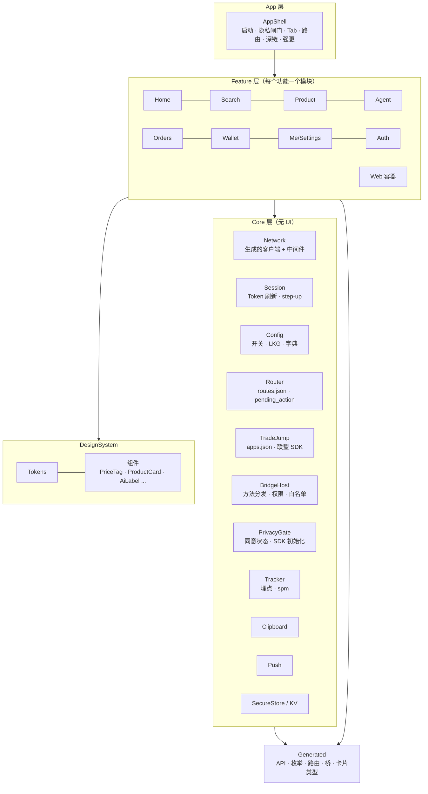
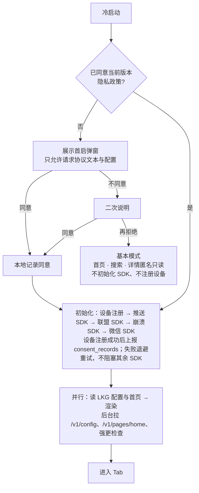

# 返利 App 规划文档 · 03 前端架构

2026-09-29 · 覆盖 iOS、Android、鸿蒙三端原生，H5，管理后台。全新设计（D19）；方法表与枚举全文见 `04_数据模型与契约.md`。业务规则（价格、文案、身份、剪贴板等）只在 `08_业务规则/` 维护，本文写「BR-xxx」编号 + 一句话；平台与系统能力见 `09_平台能力验证/`（CAP-xxx）；验收编号见 `10_首个完整流程验收用例.md`。2026-10-01 按拍板第二批（`docs/changes/20261001-拍板第二批.md`）回写：鸿蒙三端同步、跳转统一路由名、按端版本门槛、首页缓存与弹窗卡、强更、弱网、埋点规格、外观与测试机制、桥签名白名单、SDK 清单、Agent 卡片标记与购买超时（逐处注编号）。2026-10-01 晚按拍板第二批 §8 补充决定回写 §9：后台按权限点授权（ADD-04）、资金操作一人完成（ADD-05）；钱包为单一余额（ADD-06，页面与字段见 01 §4.2、04 §6.4）；§8 ADD-08：open 响应表 30101 / 30102 `auth_unavailable` 不拉起授权、不给无返利购买。2026-10-01 用语同步（ADR-0001 §3，规划/11 §9.1）：§1.2、§8.1 的 H5 组件库由原选型改为「待定」，H5 与后台的选型和版本线以 `docs/adr/0001-技术栈基线.md` 为准；§1「当前实现（D27）」段同步为库版本线由 ADR-0001 锁定。2026-10-03 按功能对照补缺第 1 批（`docs/changes/20261003-功能对照补缺.md`；缺口编号写作「功能对照 G-xx」）回写：§3.5 设备标识与客户端内置标识、§4.3 新开关、§4.4 `LinkLanding` 深链、§4.5 淘宝授权方式与 link_jump 字段、§4.7 埋点不带推广链接、新增 §4.8 客户端安全基线、§5.1 第三方页容器规则、§8.3 分享中间页的【在 App 中打开】、§11 安全基线检查。 2026-10-03 按功能对照补缺第 2 批（同一变更记录「第 2 批」，功能对照 G-09～G-21）回写，逐处注「功能对照 G-xx」；同日合并第 1 批并按评审修改（变更记录 §2.8）：§4.2 不自动恢复的操作、§5.1 系统浏览器出口、§5.6 核对项；第 2 轮评审后补 §4.2「未决键」与「回到发起页」；第 3 轮评审后 §4.2「未决键」加放弃（作废接口）、只认终结结果、取消 24 小时过期。 2026-10-03 按功能对照补缺第 3 批（同一变更记录「第 3 批」，功能对照 G-22～G-34）回写：新增 §3.6 构建配置与发布包、§4.9 权限申请；§3.5 SDK 清单加两列与上线核对；§4.1 强更复查；§4.3 版本条件；§4.4 入口限制、冷启动顺序与推送点击；§4.5 apps.json 三类条目；§4.8 新增 CSB-09～11；§5.1 两类容器的共同规则；§6.3 公告条数据源与物料频道；§8.3 内容安全策略；§10.3、§11，逐处注「功能对照 G-xx」；同日按评审与编排会话裁定修改（变更记录 3.9）：§3.6 测试包连生产时只保留切换服务器地址、切换环境清会话、草稿预览独立，§4.2 10405 不结束未决键，§4.4 统一入口守卫与推送点击按消息编号回查，§4.5 入站回调分自定义 scheme 与经验证的自有域名链接（CSB-11 同步），§4.9 用途键按权限类型映射，§5.1 UA 完整保留系统默认值；第 2 轮评审后（变更记录 3.10）：§4.1、§4.4、§5.3 强更检查结果未知时的桥调用分三类；§4.1 强更页的次要入口（隐私政策、注销）与强更状态下的路由，§4.2 受限会话与强更状态下的刷新失败，§4.4「低于最低版本」一行补强更页进入的页面。第 3 轮评审后（变更记录 3.11）：§4.4、§5.4 强更检查结果未知时 H5 只拿到只读令牌，h5_token 只存内存；§4.1、§4.2、§4.4 强更页进入的登录不显示邀请码等业务输入，过低版本的登录只登录已有账号；§4.4、§4.7 强更检查有结果之前埋点只入队、不上报；§5.3 强更状态下的桥调用改为只引用 §4.4 的分类。

2026-10-03 功能对照补缺第 4 批（`docs/changes/20261003-功能对照补缺.md`「第 4 批」）：§4.5 补可取消的购买加载与迟到响应（功能对照 G-46）、百川初始化失败（G-50）；§4.6 补敏感页面不识别与不改写剪贴板（G-49）；§5.3 补 90403 用于方法自身的白名单拒绝、`clipboard.write` 要求用户点击（G-45、G-49）；§5.5 补一致性测试的负面用例；§7.4 购买流程加一句。

---

## 1. 端与职责

**稳定方向（D28）**：保留 iOS / Android / 鸿蒙三端原生壳，承接系统能力与客户端 SDK，并提供 WebView + JSBridge 承载共用 H5。

**三端同步交付**：鸿蒙与 iOS、Android 同一版本号、同时发版，不再作为晚 2–3 周的独立里程碑（D4，拍板第二批 TECH-01、TECH-07）。

**当前实现（D27）**：核心交易与 Agent 页采用原生 UI，高频变化页采用 H5。框架与库的版本线由 `docs/adr/0001-技术栈基线.md` 锁定（待核项核实后补入该文），改动须新写 ADR；逐页实现方式、生成流程可以随新增开发资料调整；已确认的业务行为、价格展示和授权边界保持一致。首版淘礼金按 D7 关闭，相关卡片/动作保留可扩展位置，实际接入时再启用。

### 1.1 端与页面职责

以下是职责摘要，逐页实现方式统一见 [01 需求规划 §4.2](01_需求规划.md#42-页面清单)。订单列表 `OrderList`、订单详情 `OrderDetail` 当前为原生；订单找回 `FindOrder`、收益明细 `Ledger` 为 H5。

| 端 | 做什么 | 不做什么 | 判断标准 |
| --- | --- | --- | --- |
| 原生（三端各一份） | 壳（启动、隐私闸门、Tab、路由、深链、推送、更新、WebView 容器）、交易链路（搜索、详情、转链外跳、联盟授权）、Agent 对话页、订单列表与详情、钱包与提现、实名、设置与注销、首页 SDUI 渲染器 | 规则说明、帮助、活动页等经常改动的内容 | 稳定、性能敏感、要调系统能力或联盟 SDK 的页面 |
| H5（三端共用） | 返利规则、帮助、公告、协议、收益明细、订单找回、消息中心、邀请好友、邀请落地页、分享中间页、桥一致性测试页；P1 起活动会场 | 支付、提现、改收款账号、签署劳务协议、注销 | 一周内可能改一次的页面 |
| 管理后台 | 运营、客服、财务的全部操作 | 用户侧功能 | — |

### 1.2 前端技术总览

下表串联各层的当前方案；H5 与后台的选型和版本线以 ADR-0001 为准（改动须新 ADR），三端的具体依赖与版本在 §3.3 维护，接入前结合实际工程验证。

| 部分 | 开发语言 / 框架 | 运行位置与作用 | 详细选型 |
| --- | --- | --- | --- |
| iOS 壳与原生页面 | Swift + SwiftUI | 原生 App；内置 WKWebView 承载 H5 | §3.3 |
| Android 壳与原生页面 | Kotlin + Jetpack Compose | 原生 App；内置 Android WebView + AndroidX WebKit 承载 H5 | §3.3 |
| 鸿蒙壳与原生页面 | ArkTS + ArkUI | 原生 App；内置 ArkWeb 的 Web 组件承载 H5 | §3.3 |
| 三端共用 H5 | React + TypeScript + Vite；Tailwind + 移动端组件库（待定，ADR-0001） | App 内在 WebView 中运行；邀请和分享落地页也可在外部浏览器运行 | §8.1 |
| 管理后台 | React + Refine + Ant Design | 浏览器中的运营、客服、财务界面 | §9.1 |

WebView 是网页容器，React 负责 H5 页面开发，JSBridge 连接 H5 与原生能力（§5）。例如自有 H5 发起购买时，经桥交给原生处理授权与外跳；客户端 SDK 在原生侧封装，联盟服务端 API 在 02 的联盟网关中接入。H5 在外部浏览器运行时按 §8.3 处理无桥场景。

**三端一致性靠四样东西保证**：同一份契约生成的代码；同一份行为规格 `specs/client-behavior.md`（验收编号三端共用）；同一套分层和命名；同一批 fixture 驱动的快照测试。

---

## 2. 共享契约与代码生成

契约在 `rebate-platform/contracts/`，由当前接口任务的负责代理维护，Claude Code 与 GPT 均可承担。每次合并打 tag（如 `contracts-v0.9.3`），CI 生成各端产物并发布为制品，自动向三个原生仓库开升级 PR。原生仓库用 `contract.lock` 锁定版本，CI 检查"契约落后"并告警。生成的文件放在各仓库 `Generated/` 目录，**禁止手改**，CI 重新生成后 `git diff --exit-code`。按功能逐个先写 `openapi.yaml`，代码按它校验，禁止由代码反向生成覆盖契约（拍板第二批 TECH-05）；OAS 3.1 只用下表四个生成器都支持的写法，CI 四端同时编译生成物（TECH-27）。

| 契约 | iOS 生成物 | Android 生成物 | 鸿蒙生成物 | H5 / 后台生成物 |
| --- | --- | --- | --- | --- |
| `openapi.yaml` | `swift-openapi-generator` 客户端与类型 | `openapi-generator`（kotlin，Retrofit + kotlinx.serialization） | 自写模板生成 ArkTS 接口类型 + 请求函数 + 运行时校验（ArkTS 禁止 `any`，现成生成器不可用） | `openapi-typescript` 类型 + `openapi-fetch` 客户端 |
| `error-codes.yaml` | `ErrorCode` 枚举 + 客户端动作表 | 同左 | 同左 | 同左 |
| `enums/*.yaml` | Swift 枚举，未知值映射 `.unknown` | Kotlin 枚举，`coerceInputValues` 兜底 | ArkTS 常量 + 运行时校验 | TS 联合类型 |
| `bridge.schema.json` | 方法名常量、参数与结果类型、权限级别表 | 同左 | 同左 | `packages/bridge-sdk` 类型 |
| `agent-stream.schema.json` | 事件与卡片类型 | 同左 | 同左 | — |
| `home-schema.json` | 组件 props 类型 | 同左 | 同左 | 后台表单 schema、预览器 |
| `routes.json` | `Route` 枚举 + 路由表（`since` 按端，TECH-07） | 同左 | 同左 + `route_map.json` | H5 路由常量 |
| `specs/events.yaml` | `Tracker` 事件类型与构造函数（拍板第二批 TECH-21） | 同左 | 同左 | TS 事件类型 |
| `apps.json`（外跳目标、SDK 必需查询项、入站回调三类；入站回调分自定义 scheme 与经验证的自有域名链接，§4.5） | `LSApplicationQueriesSchemes`、URL Types、Associated Domains 片段 | `<queries>` 与入口组件的 intent-filter 片段（含 App Links 的验证声明） | `querySchemes` 与入口 Ability 的深链声明片段 | 自有域名链接的关联文件（`/.well-known/` 下，02 §3.4） |
| `design-tokens.json` | `Color`/`Font`/`Spacing` 常量 | Compose `Theme` 常量 | ArkTS 资源与常量 | CSS 变量 + Tailwind 预设 |
| `texts.default.json` | 包内默认文案资源（唯一来源，BR-TEXT-12） | 同左 | 同左 | 同左 |

生成器脚本在 `rebate-platform/tools/codegen/`，三端 CI 用同一版本。鸿蒙生成流程先用当前流程的样例验证可用性，再扩展覆盖；尚未接入的开发资料与接口继续补充，不作为全量接口冻结点（D27）。

---

## 3. 原生通用架构

### 3.1 分层

三端采用同样的分层和命名，差异只在实现技术。



**依赖方向**：App → Feature → Core → Generated；Feature 之间不能互相依赖，跨功能跳转一律经 Router（用路由名，不 import 对方页面）。三端都用模块边界强制：iOS 用本地 SPM 包，Android 用 Gradle 模块，鸿蒙用 HAR 模块。

### 3.2 页面内模式（统一单向数据流）

每个页面四个类型，三端命名一致，便于三个代理对照同一份规格写出结构相同的代码：

| 类型 | 职责 | 示例 |
| --- | --- | --- |
| `XxxUiState` | 不可变的页面状态（loading / content / empty / error 与数据） | `ProductUiState` |
| `XxxAction` | 用户意图 | `.tapBuy`、`.tapShare`、`.retry` |
| `XxxEffect` | 一次性副作用 | `.navigate(route)`、`.toast(msg)`、`.openAuth(platform)`、`.jump(plan)` |
| `XxxViewModel` | 接收 Action，调用 Repository，产出 UiState 与 Effect | `ProductViewModel` |

Repository 层封装 API 调用与缓存，ViewModel 不直接调用生成的客户端。错误码到动作的映射统一在 Core 的 `ErrorActionMapper` 里完成（实现见第 4.2 节，码与动作见 08 §13.11），页面只处理映射后的 Effect。

### 3.3 三端技术选型

表内版本与库是当前推荐组合，待官方资料、实际工程和真机结果验证后确定；表内禁用项用于避免当前组合混用旧 API，可在 D28 的原生壳方向内随实现方案修订，不视为永不变更的技术决定。SDK 选型需分别核对各端发行包、版本和依赖；列入本表不代表已验证兼容。联盟接入须验证必要授权、转链、外跳与订单归因，不能仅凭商品页能打开就认定接入成功（CAP-TB-11、CAP-JD-11、CAP-PDD-11、CAP-X-04）。

| 能力 | iOS | Android | 鸿蒙 |
| --- | --- | --- | --- |
| 最低版本 | iOS 16（D6，MVP 期间不改，拍板第二批 TECH-16） | API 26 | target API 24，最低兼容 API 20（D5，拍板第二批 TECH-17） |
| 外观 | 三端统一品牌外观（设计令牌）；导航栏与返回手势随系统；系统深色模式下强制浅色（拍板第二批 TECH-22） | 同左 | 同左 |
| 语言 / UI | Swift 6 语言模式（严格并发）/ SwiftUI | Kotlin / Jetpack Compose（Material 3 作为底层，外观由令牌定制） | ArkTS / ArkUI |
| 状态 | `ObservableObject` + `@StateObject`（iOS 16 已定，不用 `@Observable`） | `ViewModel` + `StateFlow`；Effect 用 `Channel` | 状态管理 V2：`@ComponentV2`、`@ObservedV2`、`@Trace`、`@Local`、`@Param`；**禁用 V1 装饰器** |
| 导航 | `NavigationStack` + 路由枚举 | Navigation Compose（类型安全路由） | `Navigation` + `NavPathStack`；**禁用 `router`** |
| 依赖注入 | 协议 + 轻量容器（`Environment` 注入） | Hilt | 手写单例容器（模块级 `AppContainer`） |
| 网络 | URLSession + 生成客户端 + 中间件 | OkHttp + Retrofit（生成） | `@kit.NetworkKit` http + 生成的请求函数 |
| SSE | `URLSession.bytes(for:)` 逐行解析 | `okhttp-sse` | `http.requestInStream` + `dataReceive` 事件 |
| 序列化 | `Codable`（生成） | kotlinx.serialization，`ignoreUnknownKeys = true`、`coerceInputValues = true` | `JSON.parse` + 生成的运行时校验函数 |
| 图片 | Kingfisher | Coil 3 | ImageKnife |
| 安全存储 | Keychain | Android Keystore + EncryptedFile | HUKS + Asset Store Kit |
| KV / LKG 文件 | 应用沙盒文件 + UserDefaults（非敏感） | DataStore + 文件 | Preferences + 文件 |
| WebView | WKWebView | `android.webkit.WebView` + androidx.webkit | ArkWeb `Web` 组件 |
| 登录 | 手机号、微信 OpenSDK、Sign in with Apple | 手机号、微信 OpenSDK、华为账号（华为渠道包） | 手机号、微信鸿蒙 SDK、Account Kit |
| 推送 | APNs（经推送聚合 SDK） | 推送聚合 SDK + 厂商通道 | Push Kit（直连，不经聚合）；聚合服务在极光、个推中选一家（拍板第二批 TECH-14） |
| 联盟（待联调验证） | 淘宝：百川 SDK；京东、拼多多：核实是否需 SDK，链接路径为候选 | 同左，采用对应 Android 接入方式 | 淘宝：百川鸿蒙版；京东、拼多多：核实鸿蒙支持，scheme / App Linking 为候选；按 CAP-X-04 验证归因 |
| 剪贴板（行为见 BR-ID-16） | `UIPasteboard.detectPatterns` + `UIPasteControl` | `ClipboardManager` | `PasteButton` |
| 崩溃 | Sentry Cocoa | Sentry Android | AGC Crash（拍板第二批 TECH-15） |
| 工程 | XcodeGen（`project.yml` 生成工程，避免多个代理同时改 `.pbxproj` 冲突）+ 本地 SPM 包 | Gradle KTS + 版本目录 + convention 插件 | hvigor + oh-package，锁定 DevEco 版本 |
| 静态检查 | SwiftLint + SwiftFormat | ktlint + detekt + Android Lint | codelinter（0 error） |
| 单元 / 快照 | XCTest + swift-snapshot-testing | JUnit + Robolectric + Compose 截图测试 | Hypium |
| UI 冒烟 | XCUITest + Maestro | Maestro + Espresso-Web（桥） | arkxtest UiTest + hdc 截图 |

### 3.4 目录结构

**iOS**

```
rebate-ios/
  AGENTS.md  CLAUDE.md  project.yml  contract.lock
  App/                      # AppShell、AppDelegate、Info.plist 片段、Entitlements
  Packages/
    Core/                   # Network、Session、Config、Router、TradeJump、BridgeHost、PrivacyGate、Tracker、Clipboard、Push、SecureStore
    DesignSystem/
    Generated/              # API、枚举、路由、桥、卡片类型（CI 生成，禁止手改）
    Features/
      Home/ Search/ Product/ Agent/ Orders/ Wallet/ Me/ Auth/ Web/
  Resources/default_home.json  Resources/default_config.json  Resources/bridge_origins.json
  UITests/  .maestro/  fastlane/
```

**Android**

```
rebate-android/
  AGENTS.md  CLAUDE.md  contract.lock  gradle/libs.versions.toml  build-logic/
  app/
  core/{network,session,config,router,tradejump,bridge,privacy,tracker,clipboard,push,storage}/
  core/designsystem/  core/generated/
  feature/{home,search,product,agent,orders,wallet,me,auth,web}/
  .maestro/
```

**鸿蒙**

```
rebate-harmony/
  AGENTS.md  CLAUDE.md  contract.lock  build-profile.json5  oh-package.json5
  entry/                    # HAP：AppShell、EntryAbility、route_map.json
  common/core/              # HAR：network、session、config、router、tradejump、bridge、privacy、tracker、push、storage
  common/designsystem/  common/generated/
  features/{home,search,product,agent,orders,wallet,me,auth,web}/   # HAR
  docs/harmony-ref/         # 锁定版本的 API 文档子集与 ArkTS 限制规则；镜像外的 API 禁止使用
```

### 3.5 第三方 SDK 清单（拍板第二批 TECH-03）

隐私政策与 SDK 管理服务平台登记按本表由法务重写（OPS-09），上线前按实际集成逐项核对（05 QA-07）。所有 SDK 只在 `PrivacyGate.onConsented()` 之后初始化（§4.1）。

| SDK | 端 | 用途 | 初始化时机 | 关闭的采集项与合规配置 | 带进来的权限与组件 |
| --- | --- | --- | --- | --- | --- |
| 推送聚合（极光或个推，选一家）+ 厂商推送通道 | iOS、Android | 推送 | 同意后 | 选型后按该 SDK 的合规接入文档填：关掉与推送无关的可选采集（以文档提供的开关为准） | 选型后按合并后的清单逐项填 |
| Push Kit | 鸿蒙 | 推送 | 同意后 | 接入时按官方文档填 | 接入时填 |
| Sentry Cocoa / Sentry Android（境内自建服务端） | iOS、Android | 崩溃 | 同意后 | 关闭默认个人信息的上报；其余接入时按官方文档填 | 接入时填 |
| AGC Crash | 鸿蒙 | 崩溃 | 同意后 | 接入时按官方文档填 | 接入时填 |
| 微信 OpenSDK / 微信鸿蒙 SDK | 三端 | 登录、分享 | 同意后 | 只用登录与分享，不调用用户资料接口（BR-ID-04）；其余接入时填 | 回跳 scheme 与查询项（`apps.json`，§4.5）；其余接入时填 |
| Sign in with Apple（系统能力） | iOS | 登录 | 用户点击时 | 不申请邮箱（BR-ID-04 细则） | 无（系统能力） |
| 华为 Account Kit | 鸿蒙、华为渠道 Android 包 | 登录 | 用户点击时 | 接入时按官方文档填 | 接入时填 |
| 百川 SDK（淘宝） | 三端（鸿蒙须加白） | 授权、外跳 | 同意后 | 只上传授权凭证（BR-ID-17）；采集项按其个人信息保护规则登记，接入时填 | 回跳 scheme（`apps.json`，§4.5）；其余接入时填 |
| 京东、拼多多 SDK | 是否需要待核实（CAP-*-11）；拼多多客户端 SDK MVP 默认不集成，先做实验，是否集成由负责人定（见下方「拼多多客户端 SDK」） | 外跳 | 同意后 | 未集成；集成时按其个人信息保护规则登记（09 4 附 §4） | 未集成 |

不接入：广告 SDK、第三方统计与性能监控 SDK、运营商一键登录（P1 再评估）、第三方浏览器内核（WebView 一律用系统组件）、地图与定位、QQ、第三方客服 SDK（客服用企业微信链接）。服务端调用、客户端不集成的第三方：阿里云短信、实名核验、支付宝、银行卡通道、阿里云百炼、TypeSafe Jev（只收非个人数据），在隐私政策的第三方共享清单中按数据流向列明。

**两列怎么填、上线前怎么核对**（2026-10-03，功能对照 G-27）：

- 「关闭的采集项与合规配置」写这个 SDK 在本 App 里关掉了哪些可选采集、用了哪些合规配置；「带进来的权限与组件」写它让安装包多出了哪些系统权限、导出组件、查询声明与回跳 scheme。两列在接入该 SDK 的 PR 里填实，取值以 SDK 的官方合规文档和合并后的实际结果为准；表里写「接入时填」的，没填实不合并。
- 上线核对以最终安装包为准（05 QA-07），不以源码或依赖声明为准：
  - Android：看合并后的清单。每个权限、每个组件（含 SDK 带进来的）都要对应到本表或权限清单（§4.9）里的一项用途；对不上的在工程里显式移除。移除后 SDK 不能工作的，登记为这个 SDK 的必需项并写进隐私政策。
  - iOS：提交 App 自己的隐私清单（PrivacyInfo.xcprivacy），并确认各 SDK 自带的隐私清单齐全。本 App 不做跨 App 追踪：隐私清单里的追踪标记为否（NSPrivacyTracking=false），不声明追踪域名。用到的、须说明理由的系统接口逐项写明理由（以 Apple 当期文档与上传校验为准）。App Store Connect 的「App 隐私」标签按实际收集的数据填写。
  - 鸿蒙：按 AGC 的隐私声明与权限申请理由核对（要求以华为当期文档为准）。
- 各处口径一致：本表、隐私政策的两份清单（个人信息收集清单、第三方 SDK 与共享清单，06 Q-F1）、全国 SDK 管理服务平台登记、iOS 的隐私清单与「App 隐私」标签、鸿蒙的隐私声明，列出的 SDK 与数据项逐项一致。任何一处新增，都按 BR-ID-12 判断是否要升协议版本。

**设备标识、登录凭证与随包标识**（2026-10-03，功能对照 G-04、G-07、G-08）：

- 设备标识：iOS 用 IDFV，Android 用 ANDROID_ID，鸿蒙用 ODID，都取自系统接口，不需要第三方 SDK。MVP 不集成任何获取 OAID 的 SDK 或厂商接口实现，所以上表没有这一项；是否新增由负责人决定（功能对照 Q-23，06「功能对照待确认」）。无效值的判定与处理按 BR-ID-09 细则「设备标识的无效值」。
- 登录与授权 SDK 只用来取得一次性授权凭证，并原样交给服务端：发起微信、Apple、华为授权之前先向服务端取一次性的授权尝试（`POST /v1/auth/oauth-attempts`），把其中的 nonce 作为授权请求的 nonce 或 state 传给 SDK，SDK 回传的 state 与之不一致时不提交；客户端不调用第三方的用户资料接口，不向服务端上报身份标识、昵称、头像（BR-ID-04）；百川 SDK 的授权同理，只上传授权凭证（BR-ID-17 细则「授权方式」）。
- 上表各 SDK 需要随包分发的应用标识与配置文件，逐项登记进 `specs/client-public-ids.yaml`；某个 SDK 必须在客户端持有 secret 性质的内容时，作为例外登记并写明权限范围（02 §12.6）。安装包不放任何服务端密钥。

**拼多多客户端 SDK**（2026-10-03，功能对照 G-10；按功能对照 Q-06 默认 A：先实验，是否集成由负责人定，06「功能对照待确认」）：

- 现状：拼多多开放平台提供 Android、iOS 客户端 SDK（没有鸿蒙版），会收集设备标识与应用列表等信息（09 4 附 §4）。它在端上还能取得一个风控标识，可由客户端取得后随搜索、转链等请求上传；这个标识是不是官方接口入参 `risk_params` 要的值、是否必传、不传会不会影响搜索、转链、代购判定和佣金，都没有核实（CAP-PDD-03、CAP-PDD-11、CAP-PDD-12 的实验）。实验有结论之前，正式客户端不集成这个 SDK，拼多多相关请求不带该标识，外跳按转链返回的链接执行（BR-ATTR-27）。
- 实验在探测 App 里做（05 APP-14），不进正式客户端的依赖。
- 负责人决定集成时，按新增第三方 SDK 处理（00 §9），并同时满足下面几条，缺一条不合并：
  1. 只在 `PrivacyGate.onConsented()` 之后初始化（§4.1、BR-ID-11）；基本模式不初始化。
  2. 上表加一行（端：iOS、Android；用途；初始化时机），隐私政策的 SDK 清单与收集清单写明它收集的信息，含应用列表（06 Q-F1）；应用商店的隐私说明同步。
  3. 风控标识只随拼多多相关的请求上送（拼多多搜索、拼多多商品详情、拼多多的 open 与 convert），放在这些接口的请求体字段里，由服务端转给联盟接口；不放进公共请求头，不随其他平台或其他接口的请求发送，不写入埋点、日志与崩溃附加信息。
  4. 不经 JSBridge 交给 H5：不新增返回该标识的桥方法，`app.getEnv`、`auth.getUser` 等现有方法的返回值里也不带它。
  5. 不在 `TrustedWebView`、`ExternalWebView` 里启用 SDK 自带的脚本桥，不让 SDK 向本 App 的 WebView 注入对象（§5.2）。
  6. 外跳仍只按服务端下发的 `primary`、`fallbacks` 执行（§4.5）；经 SDK 打开拼多多只能作为其中的 `sdk` 步骤，是否采用以 CAP-PDD-11 的归因对照结果为准。SDK 的回跳 scheme 由 `apps.json` 生成。
  7. 鸿蒙没有该 SDK，继续按链接直跳；鸿蒙端因此缺少风控标识时的影响，随 CAP-PDD-12 的结论一并评估。

### 3.6 构建配置与发布包（2026-10-03，功能对照 G-29）

三端都设三套构建配置，名字一致。包名不变：三套配置用同一个包名 / Bundle ID / Bundle Name（02 §3.2，拍板第二批 TECH-08），差别只在编译进去的内容。

| 配置 | 用途 | 服务器 | 调试能力 | 发给谁 |
| --- | --- | --- | --- | --- |
| Debug | 开发机本地构建 | 默认连 local / test，可切换（同上） | 编译（同上） | 只装在开发设备 |
| Staging | CI 构建的测试包：联调、真机验收、夜间冒烟 | 默认连 staging，可切换（切到 prod 时的限制见下文） | 编译（连 prod 时只剩切换服务器地址） | 只发给团队内登记的测试设备（各平台面向团队成员的内部测试渠道） |
| Release | 白名单内测与公开上架 | 只内置 prod 域名，不能切换 | 不编译 | 发给团队以外的人（白名单内测用户、各应用商店）的一律是 Release |

- 调试能力指：环境切换、客户端时钟偏移（10 §0.3）、桥一致性测试页入口（§5.5）、首页草稿预览 `HomePreview`、诊断与日志面板、测试用的结果注入。它们只在 Debug、Staging 配置下编译（条件编译，或放在独立的源码集、模块里），不靠运行时开关隐藏；Release 制品里没有对应的代码、路由、页面与字符串。
- Release 不留解锁入口：没有口令、连点、手势或隐藏参数能打开调试能力或切换服务器。
- 连生产环境时的边界（2026-10-03，评审后按编排会话裁定，收紧回拍板第二批 TECH-08「测试包只切换服务器地址」的原句）：Debug、Staging 包当前选中的环境是 prod 时，只保留「切换服务器地址」这一项，其余调试能力一律关闭、不可达——调试路由与一致性测试页、日志与诊断面板、结果注入、客户端时钟偏移、模拟数据等；代理或抓包信任在任何构建里都不允许（§4.8 CSB-04）。客户端按「当前环境是 prod」自行关闭，不依赖服务端下发的开关；服务端 prod 同样不认结果注入与时钟类的请求头或参数（`CLOCK_NOW` 在 prod 设置即拒绝启动，ADR-0001 §4.2 第 10 项）。生产验收（如 S1 每平台的真实订单，02 §3.2）不得使用结果注入。首页草稿预览不属于这里的调试能力，见下文。
- 切换环境：先清除本机的会话与缓存——access_token、refresh_token、h5_token、device_id 与 install_secret、LKG 配置与页面缓存、pending_action，然后在新环境重新注册设备、重新登录；未决记录（§4.2）按环境隔离保存，不在另一个环境发送。两套环境的令牌不混用：旧令牌即使被发到新环境，也因签发方不同而无效。
- Release 的路由表生成物不含 `debug_only` 路由；深链或推送命中这类路由名时，与未知路由一样处理（§4.4），打不开任何调试页面。
- 首页草稿预览（独立的只读能力，2026-10-03 按编排会话裁定）：后台生成的草稿二维码，内容是 `HomePreview` 的深链，参数只有预览令牌与页面键（`page_key`），不带服务器地址或主机名；用手机自带的相机（或系统扫码）扫开，不需要 App 内的相机权限（§4.9；功能对照 Q-25 默认 A）。测试包不因扫码切换环境，用当前选中的环境调预览接口换取草稿；预览接口只凭后台签发的预览令牌放行（10 分钟、只读，04 §6.2），令牌只在签发它的环境有效，当前环境换不到时提示先切到生成二维码的那个环境（这句提示只在测试包里，不进用户侧字典）。预览只读，连 prod 时照常可用；Release 包仍不含它（上文）。
- 测试包与正式包同包名，会互相覆盖安装。Staging 包的构建号带可识别的标记，图标或启动页带可见的测试标识，避免被误当成正式包分发。
- 发布制品扫描：与安装包密钥扫描是同一条流水线（02 §12.6，05 QA-09）。Release 制品在上传分发前解包检查：不含 staging、test、local 环境的域名；不含客户端时钟偏移、环境切换、诊断面板的标识；路由表里没有 `debug_only` 路由，包里没有桥一致性测试页入口；可调试标志关闭（Android 的 debuggable、iOS 的调试授权项、鸿蒙的调试签名）；WebView 调试开关关闭。任何一项命中即阻断发布。
- §4.8 的安全基线对三套配置同样生效；本节只管调试能力与环境，不放宽安全基线。

---

## 4. Core 模块规格

### 4.1 启动与隐私闸门



- 闸门、二次说明、基本模式、初始化顺序与设备注册重试按 BR-ID-11（iOS 不给退出按钮；基本模式冷启动不自动重弹，只在点【开启完整功能】或需同意的功能时弹，BR-ID-02）。
- `PrivacyGate` 是所有第三方 SDK 初始化的唯一入口；静态检查规则：除 `PrivacyGate.onConsented()` 外，任何地方出现 SDK 初始化调用即 CI 失败。
- 基本模式下 Network 中间件剥离 `Authorization`、`X-Device-Id`、签名头，只放行 BR-ID-11 白名单接口。
- 基本模式页、登录页与「我的」页游客态都提供【设置】入口；登录页另有「登录遇到问题」。未登录也能到达隐私政策、收集清单与撤回同意（游客）或【开启完整功能】（基本模式）（BR-ID-02 细则，2026-10-03 功能对照 G-18）。
- 隐私中心【撤回同意】：清本地令牌、device_id、install_secret 后进入基本模式（BR-ID-13）。
- 强更：强更检查命中 `min_supported_version`（按端与渠道）时进入全屏拦截页 `ForceUpdate`，按钮一律跳应用商店，不在 App 内下载安装包；低于 `recommended_version` 时弹可关闭的提示（拍板第二批 TECH-19）。
  - 检查时机（2026-10-03，功能对照 G-24）：冷启动查一次；App 回到前台时，距上一次成功的检查超过 `/v1/config.app_update.recheck_interval_sec`（取值与包内默认见 BR-ID-01 细则「最低支持版本的接口层拦截」）再查一次。检查请求失败不拦截用户在原生页面上自己的操作，下次回前台再试；冷启动带来的启动意图、`pending_action` 恢复与桥调用要等检查有结果，超时或失败时启动意图与恢复只开只读页面，桥调用按 §4.4「未知状态下的桥调用」分三类处理（§4.4「统一入口守卫」）。命中最低支持版本时，无论当前在哪个页面都进入 `ForceUpdate`。
  - 接口层拦截：写接口默认对过低版本返回 10405（例外见 BR-ID-01 细则「最低支持版本的接口层拦截」的接口表），客户端同样进入 `ForceUpdate`（§4.2）。
  - 强更页的次要入口（2026-10-03 第 3 批第 2 轮评审后补，按编排会话裁定）：除【去更新】外另有「隐私政策」与「注销账号」两个次要入口（文案键见 BR-TEXT-14 表 C）。「隐私政策」打开 `PrivacyCenter`，强更状态下只显示隐私政策与用户协议（`Agreement`）、两份清单与【撤回同意】，不显示个性化开关。「注销账号」进入注销流程：需要登录的先登录或刷新令牌（过低版本得到的是受限会话，BR-ID-01 细则「受限会话」，§4.2），然后进 `DeleteAccount`，按注销进度申请或撤销，二次验证照常；账号在冷静期内时这一项显示「撤销注销」，未登录时先显示「注销账号」。流程完成或用户返回后回到 `ForceUpdate`。强更状态下 Router 只放行从强更页进入的 `PrivacyCenter`、`Agreement`、`Login`、`DeleteAccount`，其余路由不打开；这时的登录页不显示【设置】与「登录遇到问题」，也不显示邀请码输入框等业务输入，登录请求不带 `invite_code`：过低版本的登录只登录已有账号、忽略这些输入（BR-ID-01 细则「受限会话」；第 3 轮评审后补）。
  - 「暂不更新」：可关闭提示里的【暂不更新】按提示时的 `latest_version` 记在本机；同一个目标版本不再提示，后台发布了更高的 `latest_version` 后再提示一次。`ForceUpdate` 页没有「暂不更新」。

### 4.2 网络层与鉴权

**公共请求头**：`Authorization`、`X-App-Id`、`X-Platform`（ios / android / harmony / h5 / admin）、`X-App-Version`（SemVer；三端同号，TECH-07）、`X-Build`、`X-Device-Id`（服务端签发）、`X-Channel`（取值见 04 §5，TECH-18）、`X-Trace-Id`（客户端生成，便于对照）、`Idempotency-Key`（写操作）；敏感接口另加 `X-Timestamp`、`X-Nonce`、`X-Sign`；需二次验证的接口另带 `X-Step-Up-Token`（04 §5）。

**中间件顺序**：公共头 → 签名（仅标记为 signed 的 operation，标记来自 openapi 扩展字段 `x-signed: true`）→ 发送 → 解包 `{code, msg, data}` → `ErrorActionMapper`。

**Token 刷新**：单飞（single-flight）。多个请求同时收到 10002 时只发 1 次刷新，其余排队等待；刷新失败清会话并跳登录。强更状态下刷新失败只清会话、停在 `ForceUpdate`，用户点强更页的注销入口时再登录（2026-10-03 第 3 批第 2 轮评审后补）。

**超时、重试与弱网**（拍板第二批 TECH-20）：请求 10 秒超时；读接口（GET）自动重试 1 次（退避 500 毫秒），写接口不自动重试；订单、钱包页请求失败时显示上次成功的数据并标注「更新于 HH:mm」；H5 失败显示原生重试页（§8.3）。`POST /v1/links/{link_id}/open` 例外：8 秒无响应即结束 loading、提示「网络不稳定，请重试」，重试沿用原 `Idempotency-Key`，不自动外跳（拍板第二批 TRADE-22，§7.4）。

**错误码 → 客户端动作**：码值、含义、客户端动作与可重试只在 08 §13.11 错误码总表维护（`contracts/error-codes.yaml` 由负责当前接口任务的代理按其同步）；提示文案一律取字典 `error.<code>`（BR-TEXT-14）；本节不列码表，只写 `ErrorActionMapper` 的实现方式。§13.11 没有的码视为未分配，客户端按 BR-TEXT-14 兜底（显示服务端 msg，5xxxx 走通用错误态）。

`ErrorActionMapper` 实现要点（动作本身以 §13.11 为准）：

- 统一入口：解包后按码查 `error-codes.yaml` 生成的动作枚举，输出 Effect（跳路由 / 弹 Sheet / 重放 / 置灰按钮 / Toast / 通用错误态）；页面只消费 Effect，不自行判断码值。
- 重放：需先完成前置动作的码，前置动作完成后重新发起原请求至多 1 次，用哪个幂等键按首次响应的类别定（BR-ID-10 细则，2026-10-03）：首次响应是 1xxxx 的（登录、刷新、二次验证、同意、绑手机、设备重新注册）**沿用原 `Idempotency-Key`**（下一条所列的操作除外），`StepUpSheet` 拿到 `step_up_token` 后同样沿用（BR-ID-08）；首次响应是 3xxxx 的（平台授权、备案、实名等）是一次新的请求，**用新的 `Idempotency-Key`**，原键只用于同一请求的传输重试。前置动作自己发出的请求不算「重放原请求」：例如授权流程里的 `POST /v1/unions/{platform}/bindings`，每次绑定尝试（新 state 或新凭证）用新的幂等键，只有同一请求的传输重试才沿用原键（BR-ID-17 细则「授权方式」，2026-10-03）。
- 不自动恢复的操作（2026-10-03，功能对照 G-12；评审后改为按原始操作判定）：`ErrorActionMapper` 的输入除了错误码还有原请求的 operation。需要二次验证的四个操作（提现申请、收款账号变更、换手机号、申请注销；由契约里 operation 的 step-up 标记识别）被 10001、10004（任何 `consent_type`）、10005 或 3xxxx 前置码拦下时只做引导，补办完成后回到发起页（提现回到 `Withdraw` 并保留已输入金额，收款账号页发起的回到收款账号页并保留已填内容；补办页完成后返回导航栈里发起它的页面，错误码动作里不写死目标路由），由用户再次点【提交】生成新的 `Idempotency-Key`；不自动重放、不登记 `pending_action`（BR-ID-10 细则「不适用的动作」、BR-WDR-07 细则「前置步骤的回流」）。这四个操作只在两种情况下沿用原键自动重发：10003（`StepUpSheet` 之后）与不需要用户操作的 10002、10402。`Withdraw` 页每次进入或从前置页返回都先调 `GET /v1/withdrawals/rules`，按 `block_code` 引导，正常情况下用户不会在提交后才碰到这些码。
- 未决键（2026-10-03，第 2 轮评审后补；规则只在 BR-ID-10 细则「敏感操作的幂等键」维护）：上一条说的「补办后用新键」只适用于从未出现过结果未知的键。这四个操作在首次发送前由网络层把幂等键、operation、请求体与展示摘要写入本机未决记录（按账号隔离；含账号或手机号的请求体放系统密钥库保护的存储）。发送没有拿到带统一外壳的响应（超时、断连、进程被杀、网关错误页）即记为结果未知；此后 `ErrorActionMapper` 对这个键不再输出「换新键重新提交」，发起页按未决记录进入待确认状态，新的提交入口置灰，提供两个由用户点击的动作：确认（用原键、原请求体重发）与放弃（二次确认后调 `POST /v1/idempotency-keys/abandon`），都不自动发出；两个请求在途时两个按钮都置灰。键只在拿到该键的业务结果（成功、3xxxx，含作废接口附带的原结果）或已作废（作废接口返回 abandoned，或 20903）时结束并删除记录；10001、10004、10005 补办后回到发起页仍是待确认；20903 以外的 2xxxx 与其余响应保持待确认。冷启动、登录成功与切回前台时读取当前账号的未决记录恢复状态，别的账号的记录不读不发；记录不按时间过期（第 3 轮评审后取消原「24 小时过期」）。
- 强更（2026-10-03，功能对照 G-24；评审后补未决键）：10405 → 进入 `ForceUpdate`（§4.1），不重放原请求、不登记 `pending_action`。10405 不结束未决键（它不是该键的业务结果，也不是作废；BR-ID-10 细则「敏感操作的幂等键」、BR-ID-01 细则）：上一条的四个操作里，键已经结果未知的，本机未决记录保留，升级后（或最低版本被调低后）发起页仍是待确认状态，照上一条确认或放弃，`ErrorActionMapper` 不输出「换新键重新提交」；键从未结果未知的，升级后由用户重新操作，用新键。页面内容取最近一次成功的版本检查结果；没有时立即再查一次，仍取不到就用包内默认文案与 `/v1/config.compliance` 里的下载地址。
- 受限会话（2026-10-03 第 3 批第 2 轮评审后补；规则只在 BR-ID-01 细则「受限会话」维护）：登录与刷新的响应带 `session_scope`，Network 层记下当前会话的作用域。`deletion_only` 下只发该细则表里的接口，其余请求不发（登录成功后不上报推送令牌、不拉取其他数据）。过低版本的登录只登录已有账号（第 3 轮评审后补）：登录返回 10405 且 `data.reason=no_account` 时，提示先更新（BR-TEXT-14 表 B），回到 `ForceUpdate`，不进入注册或绑定流程。冷启动时，以及强更状态由「低于」变为「不低于」时（升级后，或最低版本被调低后的复查），本机会话是 `deletion_only` 的，先刷新令牌（单飞）再发其他带令牌的请求。收到 10405 时，本机版本不低于 `data.min_supported_version`（或它为空）而会话是 `deletion_only` 的，是升级前留下的受限令牌：不进入 `ForceUpdate`，先刷新令牌，之后由用户重新操作，不自动重放。强更检查结果未知（等待或超时降级）期间，用户经普通登录或刷新拿到的会话是 `deletion_only` 的，说明本机版本已低于最低支持版本：按「低于」处理，进入 `ForceUpdate`，不留在原页面（2026-10-03 编排会话合并前补）。
- 刷新：10002 走上文单飞刷新；刷新失败清会话并跳登录（强更状态下停在 `ForceUpdate`，见上文「Token 刷新」）。
- 恢复：跳 `Login`、`BindPhone`、同意、授权前先持久化 `pending_action`，完成后按 BR-ID-10 恢复。
- 按钮禁用：42901 按 `Retry-After` 禁用触发按钮，无该头时 5 秒。
- 带 `data.reason` 的码（如 30303、50301）：先取 `error.<code>.<reason>` 子键，未命中回落 `error.<code>`（BR-TEXT-14）。
- 重新转链类动作（如 30144）：按卡片 `product_key` + `item_ref` 重新转链后替换原卡片，外跳仍须用户再次点击（BR-ATTR-21），不自动外跳。
- 5xxxx 通用错误态附 `trace_id` 后 6 位（BR-TEXT-14）。

### 4.3 配置、开关与 LKG

- `ConfigStore` 启动时先读 LKG（最近一次成功的 `/v1/config` 响应，存文件），再后台拉取；拉取失败继续用 LKG；无 LKG 用包内 `default_config.json`。
- 回前台时带 ETag 拉取；开关变化通过 `ConfigStore` 的可观察流通知各 Feature。
- 客户端类开关：`home.fallback`、`h5.route.<page>.enabled`、`clipboard.enabled.<platform>`、`agent.entry.visible`、`ui.grayscale`、`external_page.product_intercept`、`external_page.union_host_block`（后者取不到时按开启处理；BR-ATTR-29，2026-10-03）。
- 版本条件（2026-10-03，功能对照 G-32）：配置、首页与路由按版本区分时只有「不低于某个版本」一种条件（02 §10）。客户端自己也不按「当前版本等于某个值」「当前是不是提审版本」来隐藏功能或改文案，包里不内置这类比较；针对单个版本的止损开关由服务端下发，不能作用于返利金额、提现、搜索与登录方式。
- 平台链接形态表 `link_patterns`（BR-ATTR-29）随 `/v1/config` 下发并带版本，与其他配置一样走 LKG；商品识别以服务端结果为准。取用顺序为当前版本、上一次成功的版本、包内内置快照，拉取失败不得导致不拦截（BR-ATTR-29）。

### 4.4 路由与深链

- 路由名来自 `routes.json`（见 `01` 第 4.2 节）。每条路由声明：`name`、`kind`（native / h5）、`h5_path`（kind=h5 时）、`params` schema、`auth`（none / login / phone / realname）、`entry`（可以从哪些入口打开，取值只在 BR-ID-10 细则「路由入口矩阵」维护，见下文「入口限制」，2026-10-03）、`since`（按端 `{ios, android, harmony}` 的最低版本，拍板第二批 TECH-07）。
- 同一个 `Router.open(name, params)` 服务三类调用方：原生页面、首页卡片 `action`、JSBridge `nav.open`、推送点击、深链。首页卡片、站内信、H5 的跳转一律为 `{route, params}`；外链统一 `{route: "ExternalPage", params: {url}}`（拍板第二批 TECH-04）。推送载荷只带站内信的消息编号，落点由客户端按编号向服务端回查（下文「推送点击」，2026-10-03）。
- **深链**：`https://<链接域名>/r/<name>?<params>`（Universal Links / App Links / App Linking）为主，自定义 scheme `<app-scheme>://r/<name>` 兜底；两者都登记在 `apps.json` 的入站回调类：前者是限定自有域名、开启验证的网页链接，后者是自定义 scheme（§4.5）；链接域名用域名表的 `l.` 子域（02 §3.4），域名与 scheme 由负责人 W1 前给定（TECH-26，见 `06` Q-A5）。
- **链接落地页**（2026-10-03，功能对照 G-03；按功能对照 Q-03 默认，待负责人确认）：`LinkLanding`（参数 `link_id`，`auth: none`）可由深链 `https://<链接域名>/r/LinkLanding?link_id=…` 进入，分享中间页的【在 App 中打开】用的就是这条深链。页面先调 `GET /v1/links/{link_id}` 取卡片，用户点购买才调 open；归属处理、分享者本人的提示与无效 link 的空态按 BR-ATTR-05 细则「App 内打开链接的入口」。关联文件只放 `l.` 子域；App 未安装或系统未拉起时按 link 类型分流（分享 link 回分享中间页，非分享 link 到下载引导页，02 §3.4、BR-ATTR-05 细则）；各端能否拉起以 CAP-X-03 实测为准。
- **`pending_action`**：需要登录、绑手机、同意、授权的动作先持久化到本地，持久化与恢复规则见 BR-ID-10；三端共用验收编号 AC-ACC-pending。
- **无需登录的页面**（2026-10-03，功能对照 G-18）：`Settings`、`PrivacyCenter`、`Agreement`、`About`、`Help` 的 `auth` 为 none，游客与基本模式都能打开；页面内按身份裁剪条目（游客不显示账号类条目；基本模式只读并显示【开启完整功能】），规则见 BR-ID-02 细则「未登录时的隐私入口」。基本模式下 Router 只放行首页、搜索、商品详情与这五个页面，其余路由先走隐私弹窗（BR-ID-02）。
- **入口限制**（2026-10-03，功能对照 G-22）：`Router.open` 的每次调用都带入口类别，先过下一条的统一入口守卫，再校验入口，最后校验参数与登录要求。
  - `entry` 取值：`in_app`（App 内发起：原生页面、首页卡片与弹窗、站内信、Agent 卡片、JSBridge `nav.open`）、`push`（服务端按消息编号回查返回的 route，见下文「推送点击」）、`deeplink`（客户端从外部直接拿到的 route：Universal Links / App Links / App Linking、自定义 scheme，以及启动参数里直接带来的任何 route）。各路由的取值、强更检查没有结果时可打开的只读页面，都只在 BR-ID-10 细则「路由入口矩阵」维护，`routes.json` 按它生成；资金与账号类页面不声明 `deeplink`。
  - 入口类别看 route 的来源，不取调用方传入的任何标记（BR-ID-10 细则）。客户端从启动参数、深链入口或自定义 scheme 里直接拿到的 route 与参数，一律按 `deeplink` 校验，不管里面带了什么字段，自称来自推送的也一样；`push` 只给按消息编号回查得到的 route。
  - 命中没有声明该入口的路由：不打开。冷启动时进首页，App 已在前台时停在当前页；推送回查到的 route 没有声明 `push` 时打开 `Messages`；记一条埋点 `route_entry_blocked`（只有路由名与入口类别，不带参数，§4.7）。
  - `WebPage`：不声明 `deeplink`；url 必须是 `bridge_origins` 白名单内的 https 地址（§5.1），外部传入的 url 一律不接受。
  - `ExternalPage`：从深链进入时，url 的主机必须在 `/v1/config.external_hosts` 白名单里（取值与默认见 BR-ID-10 细则「深链能打开的第三方页面」；与其他配置一样走 LKG）。推送回查与 App 内配置的 ExternalPage 目标由服务端下发，保存时已按 BR-ATTR-29 ① 校验，不受这张白名单限制。这张白名单只决定深链能不能进入 `ExternalPage`，是在容器规则之外多加的一道入口限制：进入之后，第一个 URL 与之后的每一次导航仍按 BR-ATTR-29 与 §5.1 判定，白名单内的主机不因此少拦；它也不用来代替某一端对子框架的拦截（BR-ATTR-29）。容器标题栏固定显示当前页面的主机名（§5.1）。
  - Android 只导出启动入口与声明了深链的入口组件，不提供能接收任意路由名、URL 或路由参数的导出组件；推送点击无论经推送 SDK 的回调、非导出组件还是启动入口回到 App，客户端都只从中取消息编号去回查（下文「推送点击」）；启动入口收到的 Intent 里即使带了路由名或 URL，也只按深链的规则处理。鸿蒙只有入口 Ability 声明深链。iOS 的入站声明只来自 `apps.json` 的生成物（§4.5）。检查见 §4.8 CSB-09。
- **统一入口守卫**（2026-10-03，功能对照 G-22、G-24；评审后补）：外部带进来的打开请求与自动执行的动作，都先过同一个守卫再交给 Router。覆盖四类：冷启动时的启动意图（推送、深链）、App 运行中收到的推送与深链、JSBridge 调用、`pending_action` 的恢复。守卫依次看两件事：
  - 隐私闸门：没有同意当前版本隐私政策时先走首启弹窗，同意后继续。处于基本模式（含这次拒绝后进入的）时，只放行基本模式可达的路由（见上文「无需登录的页面」），其余丢弃，不因此自动弹隐私弹窗（BR-ID-11）。
  - 强更状态（§4.1）：取「检查中」「不低于最低版本」「低于最低版本」「未知」四种之一。冷启动时，本机记着上一次检查得到的「低于最低版本」就直接按「低于」处理（同时照常再查一次）；本机记着「不低于」不作数，仍按「检查中」等这一次的结果，因为最低版本可能已经提高。

    | 强更状态 | 启动意图（推送、深链） | `pending_action` 恢复 | 桥调用 |
    | --- | --- | --- | --- |
    | 检查中 | 等待，最长 5 秒；到时按「未知」处理 | 等待，同左 | 等待，同左 |
    | 不低于最低版本 | 照常执行 | 照常恢复 | 照常执行 |
    | 低于最低版本 | 丢弃，进入 `ForceUpdate` | 丢弃，进入 `ForceUpdate` | 不执行，以 90500 结束这次调用，进入 `ForceUpdate`；从强更页进入的隐私政策等 H5 页面里，下文「未知状态下的桥调用」第一类只读方法照常，其余方法返回 90500、停在当前页 |
    | 未知（等待超时，或检查请求失败） | 只打开 BR-ID-10 细则「路由入口矩阵」所列的只读页面，其余不执行（推送改为打开 `Messages`，深链停在首页）；不自动执行任何业务写操作，不进授权流程，不自动发送 `AgentChat` 的 `context` | 只恢复「打开只读页面」这一类动作；点击购买、授权、提交类动作丢弃，停在来源页，由用户自己再点 | 按下文「未知状态下的桥调用」分三类：只读方法照常；`nav.open` 只打开同一张只读页面清单里的页面，不触发自动副作用；其余方法不执行，以 90500 结束这次调用。有没有用户手势都一样；检查有了结果也不补执行 |

  - 之后任何一次检查返回「低于最低版本」，无论停在哪个页面都进入 `ForceUpdate`（§4.1）。上表只管外部带进来的请求与自动执行的动作；用户在强更页上自己点的「隐私政策」「注销账号」按 §4.1 打开（第 2 轮评审后补）。由此进入的登录页不显示邀请码等业务输入，过低版本的登录只登录已有账号、查不到时返回 10405（§4.1、§4.2，BR-ID-01 细则「受限会话」；第 3 轮评审后补）。
  - **未知状态下的桥调用**（2026-10-03 第 3 批第 2 轮评审后补，按编排会话裁定；原写「照常执行：页面里的调用由用户触发」作废：L0 的 `nav.open` 不要求手势，H5 在加载或恢复回调里就能调用，例如打开 `AgentChat` 并自动发出 `context`，而只是版本检查失败、业务接口正常时服务端不会返回 10405）：强更状态为「未知」时，桥方法按下列三类处理，不看有没有用户手势；以后新增的方法默认归第三类，要归前两类须在这里登记。
    - 只读方法，照常执行：`app.getEnv`、`app.getConfig`、`auth.getUser`、`auth.getH5Token`（只读页面里的 H5 靠它读数据，如推送的兜底落点 `Messages`；这时原生只申请只读作用域的令牌，它只能调用 GET 接口，用它发写请求一律返回 10403，见 BR-ID-32 细则「只读作用域」；令牌只存内存、原生不缓存，§5.4；第 3 轮评审后补）、`ui.toast`、`ui.showLoading` / `ui.hideLoading`、`ui.setNavBar`、`nav.close`、`media.previewImage`、`clipboard.write`、`clipboard.read`（仍按 L2 要求手势）、`clipboard.setAutoDetect`、`perm.getPushStatus`、`track.event`（只写入本机埋点队列；检查有结果之前队列只入队、不上报，§4.7；第 3 轮评审后补）。
    - 打开页面：`nav.open` 只打开 BR-ID-10 细则「路由入口矩阵」所列的只读页面（与上表启动意图同一张清单）；`trade.openProduct` 打开的商品详情在清单内，按同样规则处理。打开时不触发任何自动副作用：不自动发送 `AgentChat` 的 `context`，不进授权流程，不发起写请求（购买、领取、提交都要用户在页面里再点）。目标不在清单内的不打开，以 90500 结束这次调用（与「低于最低版本」一行同一个码，不新增码）。
    - 其余方法一律不执行，以 90500 结束这次调用：会产生写请求、登录或授权、外跳、系统授权框或分享的方法，即 `auth.login`、`net.signedRequest`、`trade.convertAndOpen`、`trade.authorize`、`share.open`、`media.saveImage`、`ext.openApp`、`ext.openBrowser`、`cs.open`、`perm.request`，以及 P1 的方法。
    - 不排队、不补执行：被拒的调用不记下来，之后检查返回「不低于」也不自动重做，H5 收到 90500 按普通失败处理、不自动重试；用户在页面上重新操作时按当时的强更状态处理。检查返回「低于」时进入 `ForceUpdate`。
  - 等待上限（启动意图等强更检查 5 秒、推送回查 5 秒）是客户端常量，写入 `specs/client-behavior.md`，不做成远程配置；数值是代理补全的默认假设，待负责人确认（规划/06「功能对照待确认」）。
- **冷启动时的深链与推送**（2026-10-03，功能对照 G-22；评审后改为等强更检查有结果再执行）：由深链或推送拉起冷启动时，把它记为一次性的启动意图（只放内存，不落盘；深链记 `{route, params}`，推送只记消息编号），按固定顺序处理：隐私闸门 → 强更检查（等到有结果，或按上表超时）→ Tab 就绪 → 推送回查（只对推送）→ 执行。执行经 `Router.open` 一次；目标路由需要登录、绑手机等前置时，按 BR-ID-10 登记 `pending_action` 并进入对应的前置页。App 已在运行时收到深链或推送，同样先过守卫；此时正停在首启弹窗或 `ForceUpdate` 的，丢弃。
- **推送点击**（2026-10-03，功能对照 G-22；同日按编排会话裁定改为按消息编号回查，规则只在 BR-ID-10 细则「推送点击的落点」维护）：推送载荷只带站内信的消息编号与展示用的标题、正文，不带 route 与业务参数。点击后先过统一入口守卫，然后：已登录 → `GET /v1/messages/{message_id}`（04 §6.4）→ 按返回的 route 以 `push` 入口打开；未登录 → 进登录页，登录成功后打开 `Messages`，不拿这条消息编号回查新登录的账号；回查失败、超过 5 秒没有结果、返回 30701（消息不存在或不属于当前账号）或 route 为空 → 打开 `Messages`。回查到的 route 未知或 `since` 高于当前版本按下一条处理。页面显示什么以服务端按当前登录账号返回的为准。
- 未知路由名或 `since` 高于当前版本：打开"请升级 App"提示页，不崩溃。

### 4.5 外跳（TradeJump）

- 服务端返回外跳方案 `{link_id, primary, fallbacks[], expire_at}`，每一项是 `{type: sdk|scheme|universal_link|h5|copy_tpwd, value}`。
- 淘宝 `sdk` 步骤（2026-10-03）：淘宝由客户端百川 SDK 完成淘客转链，服务端下发打开方式（openByUrl 我方推广链接且不传 pid，或 openByCode 按 item_id 并带 pid + relationId），三端原样传给百川，不改不补参数（BR-ATTR-05、BR-ATTR-27 淘宝行）；承载这些参数的契约字段待按 `docs/changes/20261003-淘宝转链改客户端百川.md` 补进 `JumpStep`。
- 百川初始化失败（2026-10-03，功能对照 G-50；规则在 BR-ATTR-27 淘宝行说明）：SDK 在同意隐私政策后初始化，失败时记下；下一次执行淘宝 sdk 步骤前重试初始化 1 次，仍失败就跳过 sdk 步骤、按下发的 fallbacks 继续，没有后续步骤时提示 BR-TEXT-14 `jump.taobao_sdk_unavailable`、不外跳；`link_jump` 记 `sdk_init_failed`。回跳地址只用本 App 自己的回跳 scheme（在契约里统一登记、由生成器写进三端工程），能否回到 App 以 CAP-TB-11 实测为准。
- 已装检测：open（与仅供 H5 的 convert，拍板第二批 TRADE-03）请求体带 `installed`（true / false / unknown，缺省按 unknown）。iOS 用 `canOpenURL` 查 `apps.json` 声明的 scheme，Android 查 `<queries>` 声明的包名，鸿蒙查 `querySchemes` 声明的 scheme，H5 固定 unknown；检测失败或未声明时报 unknown（BR-ATTR-27 ①）。
- 客户端只按服务端下发的 `primary`、`fallbacks` 顺序执行，不自行拼 scheme、不自行追加兜底。已装检测、首选与降级路径、未安装兜底按 BR-ATTR-27（未安装提示的展示时机按 BR-ATTR-27 ②：installed=false 时点击前展示，unknown 时全部路径失败后展示；按钮与提示文案见 BR-TEXT-14）。
- 淘宝授权（2026-10-03，功能对照 G-01；按功能对照 Q-04 默认，待负责人确认）：`AuthSheet` 之后按 30101 / 30102 或 auth-url 下发的 `auth_methods` 顺序，取本端能执行的第一种——`web_code`（打开 auth_url，回跳带回授权码）或 `sdk_token`（经百川 SDK 完成授权并取得访问令牌）。客户端不自行增减方式，只把授权凭证连同 `state`、`auth_method` 交给 `POST /v1/unions/taobao/bindings`，不上传淘宝昵称、头像等会话资料；收到 30104 时重新取 state，按新下发的 `auth_methods` 执行（`credential_invalid` 改用下一种方式）；每次绑定尝试（新 state 或新凭证）用新的 `Idempotency-Key`，只有同一请求的传输重试沿用原键（BR-ID-17 细则「授权方式」）。哪种方式在哪一端可用以 CAP-TB-05 实测为准，实测前两种都不写成对用户的承诺。
- 购买请求进行中的加载态与取消（2026-10-03，功能对照 G-46）：点击购买、`open` 请求发出后显示可取消的加载层，文案取 BR-TEXT-14 表 C `buy.opening`（「正在打开{platform_name}」）与按钮 `buy.opening.cancel`；加载层只写平台名，不显示任何金额，更不出现返利与券相加的合计（价格与返利只用 BR-PRICE-05 的固定术语）；不设人为的最短展示时长，响应到了就按 §7.4 处理。以下情况之后才到达的 `open` 响应一律不外跳，只用它更新卡片（新价格、`new_link_id`、无返利状态照常替换，价格变动、券失效等确认弹窗不弹）：用户点了取消；用户离开发起页；App 进入后台。用户回来后要再点一次购买才会外跳；这是一次新的点击，用新的 `Idempotency-Key`，服务端按当时的价格重新复核（不同于 8 秒超时后的【重试】：那是同一次点击的重发，沿用原键，§4.2，拍板第二批 TRADE-22）。卡片只按最近一次点击的响应更新：被取消的那次请求的响应在用户再次点击之前到达，用来更新卡片；在再次点击之后才到达的，直接丢弃，不覆盖新请求的结果。取消与迟到的响应都不记外跳类的 `link_jump`（BR-ATTR-21「只有点击购买时才外跳」）。验收见 10 AC-S1-55 ④⑤。
- 每一步结果上报 `link_jump`（路径/是否拉起成功/耗时/installed，BR-ATTR-27 ③）；「路径」只记步骤类型（sdk / scheme / universal_link / h5 / copy_tpwd），不带完整推广 URL、口令、推广位或 relation_id（02 §12.6）。
- `JumpTip` 按用户 × 平台首次外跳前展示一次，服务端记已读；外跳返回后展示「待跟单」卡；找回页诊断包只检测 `apps.json` 声明的目标 App 能否唤起，上传前逐项同意（BR-ATTR-21）。
- `apps.json` 分三类条目（2026-10-03，功能对照 G-30），三端的查询声明与入站声明都只由它生成：
  - 外跳目标（`apps`）：`TradeJump` 与 `ext.openApp` 能打开的平台 App，同时用于已装检测（BR-ATTR-27 ①）。
  - SDK 必需的查询项（`sdk_queries`）：某个 SDK 自己要查询的 scheme 或包名（如微信 SDK 判断微信是否已安装所需的查询项），取值按各 SDK 的官方接入文档登记。它们不是外跳目标，`ext.openApp` 不能用。
  - 入站回调（`inbound`）：本 App 注册、供系统或其他 App 打开或回跳进来的入口，分两种，每项都写明用途、来源 SDK（自有的为空）与适用端：
    - 自定义 scheme（`kind: custom_scheme`）：写 scheme（或由应用标识派生的模板）。用于自有深链的兜底 scheme（06 Q-A5）、淘宝客户端 SDK 的授权与购买回跳、微信的登录与分享回跳；日后若集成拼多多客户端 SDK，再加它在控制台登记的回调协议（09 4 附 §4）。只能用本 App 自己的 scheme 或由凑狸的应用标识派生的回跳 scheme，不得与外跳目标、SDK 必需查询项里的第三方 scheme 相同，也不得是系统保留或通用的 scheme（禁止清单放 `specs/client-security-baseline.yaml`）。
    - 经验证的自有域名链接（`kind: verified_link`）：写 `host`（完整主机名，不带通配符，必须在自有域名清单内：02 §3.4 域名表的 `l.` 子域等，清单放 `specs/client-security-baseline.yaml`）、`path_prefix`（如 `/r/`，不能是 `/` 或空）与 `verified`（只能为 true）。用于 Universal Links、Android App Links 的深链主入口，以及 SDK 要求用通用链接回跳的场景（如微信 SDK 在 iOS 上的回跳通用链接，02 §12.6）。关联文件（`apple-app-site-association`、`assetlinks.json`）由同一份登记生成，只放在对应主机的 `/.well-known/`（02 §3.4）。鸿蒙的对应能力（App Linking）怎样声明、能否做域名验证，接入时按官方文档核对并在真机上验证（09 CAP-X-03），核对前不写成能力；在此之前鸿蒙不声明 https 链接，只用自定义 scheme。
    - 不允许的声明：任何不限 host 的 http 或 https 声明（不写 host、host 带通配符），http 声明，主机不在自有域名清单内的 https 声明，没有开启验证的 https 声明（Android 缺 autoVerify、iOS 不在 Associated Domains 里），以及抢占第三方 App 或系统的 scheme。
    - 无论哪一种，带进来的内容一律当作不可信输入：授权凭证由服务端按 state 与设备校验（BR-ID-17），路由按深链的入口限制处理（§4.4）；自定义 scheme 可能被别的 App 同名注册，经验证的链接也只证明链接属于本 App，不证明内容可信。
  - 生成物：iOS 的 `LSApplicationQueriesSchemes`（外跳目标 + SDK 必需查询项）、URL Types（自定义 scheme）与 Associated Domains（经验证的自有域名链接，`applinks:<host>`）；Android 的 `<queries>` 与入口组件的 intent-filter（自定义 scheme 各一条；经验证的链接写 scheme=https、host、pathPrefix 并开 autoVerify）；鸿蒙的 `querySchemes` 与入口 Ability 的深链声明；服务端两份关联文件。工程里不手写这些声明。
  - 数量：iOS 查询 scheme「≤20 条」按外跳目标与 SDK 必需查询项合计（本项目约定；系统上限以 Apple 文档为准，09 U-85），超出时生成器报错。
  - 不把系统保留或通用的 scheme（http、https、tel、sms、mailto、系统设置类 scheme 等）注册成自定义 scheme；https 只以上面「经验证的自有域名链接」的形式出现。打开系统设置只用系统提供的设置入口接口，不拼 scheme。检查见 §4.8 CSB-11。
  - 每条入站回调都在探测 App 上做真机验证（05 APP-14、HM-09）：淘宝授权回跳后按 BR-ID-10 恢复、微信登录回跳、自有深链（经验证的链接与兜底 scheme 各一次）；结果记入对应能力的证据（CAP-TB-05、CAP-TB-11、CAP-X-03），验证前不写成对用户的承诺。
  - 所有取值都用凑狸自己的包名、Bundle ID 与各平台发给凑狸的应用标识重新申请（06 Q-A5、Q-C12、Q-C16），不沿用其他 App 的值。
- 只有用户点击才会触发外跳（联盟规范红线）；UI 测试覆盖"无点击不外跳"。这条对两类 WebView 容器同样成立：`ExternalWebView` 里的页面触发不了外跳，容器只有标题栏的系统浏览器出口，且不对平台页面与推广链接提供；非 https 跳转、下载与这个出口的处理见 §5.1（2026-10-03，功能对照 G-21）。

### 4.6 剪贴板

读取方式按 BR-ID-16（三端差异见 §3.3 选型表；系统限制 CAP-X-02；验收 AC-S1-03）。实现要点：Core 的 `ClipboardWatcher` 读到内容后按 `/v1/config.clipboard` 规则本地过滤，只上传识别出的链接 / 口令与标题片段，调用 `POST /v1/inputs/parse`（原写 `/v1/clipboard/parse`，C-14）；App 自己写入的内容（复制口令、邀请码）记录 hash，不再识别。iOS 提示条内嵌 `UIPasteControl`，与 F-CLIP-01「不出现允许粘贴弹窗」一致（09 附录 A-15）。未定：Android 开关开启后命中时直接识别还是先出提示条（10 §6.1 G-20）。

**邀请口令**（拍板第二批 OPS-06，BR-INV-04）：同一次读取先按商品规则识别，命中商品只出查返利提示（商品优先）；未命中商品、且含邀请落地页链接（分享页域名的邀请路径）或「邀请码」字样时，仅对可绑定用户出邀请提示条，用户点击才调用 `POST /v1/me/inviter`；读取方式与时机仍按 BR-ID-16，不新增读取时机。

**敏感页面与不改写**（2026-10-03，功能对照 G-49；规则只在 BR-ID-16 细则维护）：`ClipboardWatcher` 回到前台时先看当前路由与浮层，停留在 BR-ID-16 细则「敏感页面不识别」列出的页面、弹层或首启弹窗、`ForceUpdate` 期间时直接跳过这一次；识别前后不清空、不改写剪贴板，只记 hash；H5 写剪贴板只经 `clipboard.write`（要求用户点击，04 §9），剪贴板内容不经桥事件推给 H5。

### 4.7 埋点（Tracker）

- 事件、字段与公共字段在 `specs/events.yaml` 定义，生成三端与 H5 的事件类型与构造函数，业务代码只能调用生成函数（拍板第二批 TECH-21）。公共字段：event_id、name、client_at、session_id、device_id、user_id（游客为空）、platform、app_version、channel、page、spm、trace_id；游客事件只带 device_id，登录后由服务端按 device_id 与登录时刻在报表层关联到 user_id，不回写原事件。
- 事件批量上报到 `/v1/events`（每 10 条或 10 秒），离线缓存 ≤500 条。强更检查还没有结果（强更状态为「检查中」或「未知」，§4.4）时只入队、不上报，原生与 H5 的事件都一样；检查有了结果后再按上述规则上报（低于最低版本时上报请求同样受版本闸门约束，BR-ID-01 细则的接口表）（2026-10-03 第 3 批第 3 轮评审后补）。
- `spm` = `页面.模块.坑位`（如 `home.product_grid.3`），由组件自动拼接：页面在 Screen 级注入，模块来自 SDUI section id，坑位来自列表索引。
- 转链请求必须携带当前 `spm` 与 `scene`。
- 事件字段、崩溃上报的面包屑与附加信息不带完整推广 URL、口令、推广位或 relation_id 等渠道标识；URL 类信息只记平台与类别（如 `external_page_union_host`，BR-ATTR-29），`specs/events.yaml` 不为这些内容设字段（02 §12.6，2026-10-03 功能对照 G-07）。
- MVP 事件清单：`app_launch`、`page_view`、`exposure`（卡片曝光）、`click`、`search`、`convert`、`link_jump`、`funnel_first_order.*`、`agent_*`、`sdui_card_error`、`bridge_call`、`h5_white_screen`、`external_page_union_host`、`external_page_blocked_nav`（第三方页容器取消的非 https 跳转与下载，只记类别，§5.1）、`route_entry_blocked`（深链或推送命中不允许的入口，只记路由名与入口类别，§4.4，2026-10-03）。

### 4.8 客户端安全基线（2026-10-03，功能对照 G-06）

三端同一套规则。规则编号 `CSB-nn` 一经发布不复用、不重排；机器可读版本放 `specs/client-security-baseline.yaml`（每条：编号、适用端、检查方式、检查的文件或写法），三端各自用本端的静态检查工具实现（§3.3 静态检查行）。规则对所有构建类型生效，debug 与 staging 包同样不得放宽；任何一条不通过即 CI 失败，不设「仅警告」。两类情况分开处理（2026-10-03，按评审补；第 2 轮修订）：检查方式误判、代码其实没有违反规则的，写进 specs 文件的 `false_positives`（规则、文件、为什么是误报），由编排者评审并在 PR 里留记录。真正降低安全要求的豁免不接受：CSB-01～07 与 CSB-09～11 都是底线，一律不可豁免，specs 文件不设 `waivers` 清单。想改变其中任何一条（例如让第三方容器注入桥、把凭据写进日志或普通文件、让安全存储的内容随备份迁移、放宽对外共享文件的范围），只能先按 00 §8 修改本节与对应的 BR，由负责人决定，不能靠登记豁免来绕过；编排者与实现、评审代理都不能自行放行。同样不可豁免的还有服务端密钥进安装包，以及 BR-ID-09 禁止内置的请求签名材料与共享盐（02 §12.6）。

| 编号 | 规则 | CI 检查 |
| --- | --- | --- |
| CSB-01 | （不可豁免）证书与主机名校验只用系统默认实现，不得被任何开关、远程配置或构建类型降级：不写「接受全部证书」的信任管理器或校验回调，不写恒返回通过的主机名校验 | 源码里出现自定义信任管理、放行全部证书或主机名的写法即失败；发请求的客户端只能由 Core 的 Network 创建 |
| CSB-02 | （不可豁免）`TrustedWebView`、`ExternalWebView` 遇到证书错误一律取消加载并显示错误页，不提供「继续访问」 | 证书错误回调里出现继续或放行的调用即失败；桥一致性测试页（§5.5）加一条证书无效的用例 |
| CSB-03 | （不可豁免）两类容器都只加载 https，禁止混合内容，禁止 file 访问（含经 file 地址读取其他文件与跨域访问）；`ExternalWebView` 不注入桥、不共享 Cookie（§5.1） | WebView 的设置只能写在 Features/Web 的容器封装里；设置项与本条不一致即失败；其他模块直接创建 WebView 即失败 |
| CSB-04 | （不可豁免）明文流量全关：iOS ATS 不加任何例外；Android 网络安全配置不允许明文、不信任用户安装的证书；鸿蒙工程里不出现 http 业务地址 | 检查最终产物里的 Info.plist、合并后的 AndroidManifest 与网络安全配置、鸿蒙工程配置；出现例外域名、明文许可或 `http://` 业务地址即失败 |
| CSB-05 | （不可豁免）access_token、refresh_token、install_secret 只放系统安全存储（§3.3 安全存储行），不写入普通 KV、文件、日志、剪贴板、埋点与崩溃附加信息 | 这三样用专用包装类型保存（不可打印、不参与普通序列化），只有 Core 的 SecureStore 能取出原值；在其他位置取原值即失败 |
| CSB-06 | （不可豁免）备份与换机迁移不带走敏感数据：安全存储条目设为仅本设备可用、不随备份迁移；普通文件（LKG 配置、缓存）可以备份，但其中不得含 CSB-05 的内容 | 检查 iOS 安全存储条目的可访问性属性、Android 备份规则文件、鸿蒙备份配置（写法接入时按官方文档核对） |
| CSB-07 | （不可豁免）对外共享文件只暴露分享图缓存目录：Android 的文件共享路径配置只含该目录，不导出其他可读文件的组件；iOS、鸿蒙的分享调用只传该目录下的文件 | 检查文件共享路径配置与导出组件清单；分享调用点传入其他目录即失败 |
| CSB-08 | MVP 不做证书固定：依靠系统信任链与 CSB-01～04。理由：固定后一旦证书更换出错，全部用户断网，而 MVP 没有可靠的远程更新固定集的通道。日后要做另写 ADR（固定什么、备用固定、失效开关） | 不检查；代码里出现固定配置时由评审按本条处理 |
| CSB-09 | （不可豁免）入口组件最小化（2026-10-03，功能对照 G-22，§4.4）：Android 只导出启动入口与声明了深链的入口组件，不导出能接收任意路由名、URL 或路由参数的组件；鸿蒙只有入口 Ability 声明深链；SDK 带进来的导出组件逐个登记用途，用不到的移除 | 检查合并后的 AndroidManifest 与鸿蒙模块配置：导出的组件、带 intent-filter 或深链声明的组件必须在 specs 文件的允许清单里，清单以外的即失败 |
| CSB-10 | （不可豁免）第三方页容器不注入（2026-10-03，功能对照 G-23，§5.1）：`ExternalWebView` 的封装里不出现执行脚本、添加用户脚本或文档启动脚本、注入样式、注册脚本消息通道的调用；`TrustedWebView` 注入的脚本只有随包发布的桥启动脚本，来源不是远程配置或接口 | `ExternalWebView` 封装出现上述调用即失败；`TrustedWebView` 的注入点只允许引用包内的桥启动脚本资源，引用配置或网络内容即失败；桥一致性测试页（§5.5）加一条「第三方页面里没有桥对象」的用例 |
| CSB-11 | （不可豁免）入站声明只来自生成物（2026-10-03，功能对照 G-30，§4.5；评审后区分自定义 scheme 与经验证的自有域名链接）：iOS 的 URL Types 与 Associated Domains、Android 入口组件的 intent-filter、鸿蒙入口 Ability 的深链声明只由 `apps.json` 的入站回调类生成；查询声明同样只来自生成物。自定义 scheme 不得是系统保留、通用或第三方 App 的 scheme；http、https 只允许以「限定自有域名、开启验证」的链接出现 | 生成物与工程文件比对，不一致即失败。最终产物检查：自定义 scheme 命中禁止清单，或与 `apps.json` 外跳目标、SDK 必需查询项里的 scheme 相同，即失败；合并后清单里出现 scheme 为 http 的 intent-filter，或 scheme 为 https 却缺 host、host 带通配符、host 不在自有域名清单内、没有 autoVerify 的，即失败；iOS Associated Domains 的主机不在自有域名清单内即失败；鸿蒙出现 https 深链声明而 CAP-X-03 尚无验证结论的即失败。iOS 查询 scheme 合计超过 20 条时生成器报错 |

- 调试抓包用 Prism、WireMock 或系统自带的调试手段，不得为此在代码里加放行证书的分支（CSB-01 对 debug 包同样生效）。
- 本节的静态检查与 §4.1「SDK 初始化只在 `PrivacyGate`」的规则放在同一个 CI 任务（§11「安全基线」行），每个前端 PR 都跑。发布制品的密钥扫描另见 02 §12.6（05 QA-09）。
- 01 §7.4 只写要求摘要；规则编号与检查方式以本节和 specs 文件为准。第三方页容器里的平台页面与商品链接另按 BR-ATTR-29（§5.1）。

### 4.9 权限申请（2026-10-03，功能对照 G-26）

规则见 BR-ID-13（按需申请、先说明用途、被拒后在节流期内不主动再弹；时长只在该条维护），本节写组件怎么做。三端各实现一个 Core 组件 `PermissionRequester`（放 privacy 模块），它是申请系统权限的唯一入口：原生页面与桥方法 `perm.request` 都只调它，业务代码不直接调用系统的权限申请接口（静态检查，§11「隐私」行）。

- 流程：先查当前状态，已授权直接返回；再过节流；然后展示用途说明并弹系统授权框；系统返回结果后收起说明、记下结果。
- 用途说明与系统授权框一起出现：说明文案按权限类型取 BR-TEXT-14 表 D 登记的用途键（评审后改为按类型映射）：`push` 用 `perm.push.card_hint`，`photos` 用 `perm.photos.purpose`；以后新增权限类型时，在表 D 加该类型的用途键并在这里登记映射，组件不拼键名。Android 在系统框弹出的同时于屏幕顶部显示说明浮层；iOS、鸿蒙先出一屏说明，用户点【继续】（`perm.btn.continue`）后立刻弹系统框。说明页的按钮不写「允许」「同意」这类冒充系统选项的字样，具体形式提审前按 CAP-X-12 自查表核对。入口本身已经展示了用途的，可以声明跳过单独的说明步骤。
- 节流内置在组件里：按权限类型在本机记上次被拒的时刻；节流期内（时长见 BR-ID-13）再有申请，不弹系统授权框与用途说明，直接返回未授权，由调用它的功能提示用户并给【去设置】；用户从设置类入口主动点击的不受此限（BR-ID-13）。
- 区分「拒绝」与「拒绝且不再询问」：系统已经不会再弹授权框时（按各端系统接口返回的状态判断），不重复调系统接口，改为显示 `perm.<type>.denied_forever` 与【去设置】（`perm.go_settings`），跳到系统里本 App 的设置页。
- 类型（MVP）：`push`（通知）、`photos`（保存图片到相册，只写不读）。相机 MVP 不提供（见下文「权限清单」）。
- 桥：`perm.request` 的结果只有 `granted`；节流期内或已被永久拒绝时返回 `granted=false`，引导界面由原生负责，H5 不自己画权限弹窗。`perm.getPushStatus` 只读状态，不触发申请。
- 首启隐私弹窗、二次说明、基本模式说明与撤回同意的确认不属于系统权限，由 `PrivacyGate` 与隐私中心负责（§4.1），文案键同在 BR-TEXT-14 表 D。Android、鸿蒙的首启弹窗与二次说明不响应返回键，点弹窗外部也不关闭（BR-ID-11）。
- 权限清单（2026-10-03，功能对照 G-28）：三端申请的系统权限登记在 `specs/system-permissions.yaml`，这是唯一来源。每项写明：权限类型、适用端、系统里的键（iOS 的用途说明键，Android 与鸿蒙的权限名）、对应功能、用途文案键（BR-TEXT-14 表 D 的 `perm.<type>.system_purpose`）、阶段、来源（自有功能，或哪个 SDK）。
  - 生成器据此写 iOS 的用途说明、Android 清单里的权限声明、鸿蒙模块配置里的权限申请；工程里不手写。CI 断言最终产物里的权限集合与清单一致，多一项、少一项都失败。
  - MVP 的自有功能在 iOS 上需要用途说明的只有「保存图片到相册」一项（对应 `media.saveImage`）。Android、鸿蒙的对应权限，接入时按系统文档填进同一个文件。
  - 相机（按功能对照 Q-25 默认 A，待负责人确认；BR-ID-13 细则「相机权限与权限清单」）：Release 包不声明相机权限、不带相机用途说明、不编译扫码代码；`perm.request` 的 camera 类型与 `media.scan` 一起留到 P1。首页草稿二维码用手机自带的相机扫开（§3.6）。测试确需 App 内扫码时，相关代码与权限声明只进 Debug、Staging 配置。
  - 某个 SDK 引用了受保护的系统接口、上传时被要求补用途说明的：按这个 SDK 的实际用途写文案，并在清单里记下来源 SDK；不写与实际不符的用途。
  - MVP 的 H5 页面不放文件选择或拍照控件（它们会触发相册、相机权限）；上传图片的桥方法是 P1。
  - 上线核对（05 QA-07）用真机走完主要流程，确认没有清单以外的系统权限弹窗。

---

## 5. WebView 容器与 JSBridge

### 5.1 两类容器

| 容器 | 用途 | 注入桥 | 可加载 |
| --- | --- | --- | --- |
| `TrustedWebView` | 自有 H5（规则、帮助、找回、邀请、收益明细、消息） | 是 | 仅 `bridge_origins` 白名单内的 https 主 frame |
| `ExternalWebView` | 商家与品牌官网、外部说明页等第三方 URL；活动转链上线前（P1）不用于联盟平台的活动页与商品页（BR-ATTR-29，待决策，按功能对照 Q-02 默认） | **否** | https；禁止文件访问与混合内容；不共享 Cookie；证书错误一律取消（§4.8） |

**两类容器的共同规则**（2026-10-03，功能对照 G-23；证书错误、混合内容与 file 访问已在 §4.8 CSB-02、CSB-03）：

- 不改第三方页面：`ExternalWebView` 不注入任何脚本与样式——不调用执行脚本的接口，不加用户脚本与文档启动脚本，不加样式表——也不隐藏、不改写第三方页面里的任何元素。容器只做容器层面的事：导航拦截与拦下后的提示、标题栏、进度条、错误页，这些都画在容器自己的原生界面上，不画进页面里。检查见 §4.8 CSB-10。
- 授权与登录页不进容器：淘宝、拼多多的授权页与微信、Apple、华为的登录授权，只用系统浏览器（或系统提供的认证会话）或对应 SDK 的官方页面打开（BR-ID-17 细则「授权方式」、BR-ID-22、BR-ID-04），不在这两类容器里加载，也不改动页面内容。拼多多备案链接具体怎样打开以 CAP-PDD-05 实测为准，同样不进这两类容器。
- 可信容器只跑两类脚本：页面自己的脚本，和随 App 版本发布的桥启动脚本（§5.2）。不接受运营配置或接口下发的脚本、样式注入，后台不设这类配置项（00 §4：脚本热更新不做）。
- UA：两类容器都完整保留该设备的系统默认 UA，只在末尾追加本 App 的标识后缀（应用英文名与版本号，英文名定下后填，06 Q-A1）；系统默认 UA 原有的内容（含其中自带的浏览器标识）不删不改，追加的后缀不冒充其他 App 或浏览器，不带第三方平台或供应商的名字。自有 H5 判断是否在 App 内只看 `__REBATE_BRIDGE__`（§5.4），不看 UA。
- 标题栏（功能对照 G-22）：`ExternalWebView` 的标题栏固定显示当前页面的主机名，随主框架导航更新；不用页面自报的标题或本 App 的品牌名代替。下文说「另行规定」的标题与域名显示以本条为准，副标题、返回与关闭仍另行规定。`TrustedWebView` 用原生标题栏（§8.3）。
- 可信 H5 自身的内容安全策略见 §8.3。

`TrustedWebView` 发生跨 origin 导航（跳到白名单外）时，自动在新的 `ExternalWebView` 中打开，原容器不变。白名单随 `/v1/config` 下发并带服务端签名，验签失败用包内内置版本。

**`ExternalWebView` 的导航判定**（2026-10-03，功能对照 G-02）：放行、交识别还是拦下，各分支的规则只在 BR-ATTR-29 维护（待决策，按功能对照 Q-02 默认），本节只写实现落点。

- 判定点：三端各自选用能拦到主框架导航、子框架文档请求与新窗口请求（window.open、target=_blank）的回调，容器打开的第一个 URL、页内点击、重定向的每一跳、每个子框架文档与每个新窗口请求都经过同一个 `ExternalNavigationPolicy`（Core，无 UI；输入 URL、框架类型、规则表与开关，输出去向），三端共用一组测试向量与同一张测试页。
- 各端用哪些回调、能不能可靠拦到子框架的文档请求，接入时按官方文档核对并在真机上用测试页验证，结论写进 §5.6；做不到的端按 BR-ATTR-29 细则「拦不到子框架时的保守降级」处理（整页拦截；连整页拦截也做不到就不在 App 内打开第三方页面），不得放行，也不设外链白名单代替。
- 抽样埋点 `external_page_nav_host`（注册域、框架类型、是否命中规则；采样率取 `/v1/config` 的 `external_page.nav_host_sample_bp`）由容器封装统一上报，用途与限制见 BR-ATTR-29。
- 规则表：`link_patterns`（§4.3）加包内内置快照，构建时由 `specs/link-patterns.yaml` 生成。
- 页面承载：交识别成功时，原生 `ProductDetail` 压在容器之上，返回即回到原页面；拦下时在容器内出提示层，原页面保持不动。
- 验收见 10 AC-S1-70；后台保存时对联盟平台域名外链的校验在服务端（04 §6.6）。

**`ExternalWebView` 的非 https 跳转、下载与系统浏览器出口**（2026-10-03，功能对照 G-21；同日按评审改。归因原则见 BR-ATTR-21 与 BR-ATTR-29 细则「容器内的非 https 跳转、下载与系统浏览器出口」，本节只写容器怎么做，用的是上面同一套回调、同一个 `ExternalNavigationPolicy`）：

- 判断顺序：每个文档级导航与新窗口请求（主框架、子框架、重定向的每一跳、`window.open`、`target=_blank`）先看 scheme；https 的再按上面的导航判定处理（BR-ATTR-29）。不命中规则的新窗口请求在当前容器里打开，不另开窗口。
- 只放行 https。其余一律取消，不交给系统、不询问「是否打开某 App」：http、平台 App 的自定义 scheme、应用市场 scheme、`tel:`、`sms:`、`mailto:` 及其他自定义 scheme；子框架发起的同样取消。取消后页面保持不动，记一条埋点 `external_page_blocked_nav`（只记 scheme 类别，不带完整 URL，§4.7）。
- `intent://` 不解析、不启动，也不加载其中携带的备用地址。
- 这条规则不区分是不是用户点击触发：第三方页面无论自动跳转还是放一个「打开 App」按钮，容器都不外跳。平台 App 只有一条路能打开：原生商品详情 → `open` → `TradeJump`（§4.5）。
- 下载一律不在 App 内处理：响应是附件或容器无法渲染的类型、系统下载回调、`blob:` 与 `data:` 下载，全部取消，不保存文件、不拉起安装器。当前页有系统浏览器出口时（下一条）提示取 BR-TEXT-14 `external_page.download_blocked`，指向标题栏的【在浏览器打开】；没有出口时取 `external_page.download_unsupported`，只说明不能下载。安装包同样不下载（与 §4.1 强更「不在 App 内下载安装包」同一原则，拍板第二批 TECH-19）。
- 系统浏览器出口：标题栏的【在浏览器打开】（文案 BR-TEXT-14 `external_page.open_in_browser`）不是固定显示的，能不能交出去按 BR-ATTR-29 细则判定，实现落点如下。
  - `ExternalNavigationPolicy` 另给出一个结果 `can_open_in_browser`：容器当前主框架已加载的页面是 https，且它的地址不命中 `link_patterns` 的任何类别（union_host、product、promo）时为真，按钮才显示。页面每次完成导航后重算。
  - 点击时用同一份规则对要交出去的地址再判一次，不命中才交给系统浏览器。交出去的只有当前主框架页面的地址，不是被拦下的导航目标，也不是页面里的任意链接；不带任何归因参数。
  - 规则表取用顺序同 §4.3，任何时候都有规则可用；取不到当前版本时用上一版本或包内快照判定，不得变成固定显示。
  - `external_page.union_host_block` 关闭、平台页面在容器里加载时，按钮对平台页面仍不显示（BR-ATTR-29 细则）。
  - 保守降级到「不在 App 内打开第三方页面」的端（BR-ATTR-29 细则「拦不到子框架时的保守降级」）：提示里如果提供交给系统浏览器的按钮，要交出去的地址先过同一道判定，命中时只出 BR-ATTR-29 ②（b）的提示，不提供按钮。
  - 这个出口只在用户点击时发生。除此之外容器自己不发起任何外跳。系统 WebView 自身的两种行为要逐端核对并登记在 §5.6，核对前不写成能力：未被取消的非 https 跳转会不会由系统自行拉起 App 或弹出询问；https 链接会不会被系统按通用链接、App Links 直接交给别的 App，能不能在回调里取消。存在这类行为又拦不住的端，按 BR-ATTR-29 细则的保守降级处理。去往联盟平台域名的导航已在判定点取消，不受这一项影响。
  - 标题栏的其他交互（标题、域名显示、返回与关闭）另行规定。
- `TrustedWebView` 同理：跳到白名单外的 https 地址在新的 `ExternalWebView` 打开（上文），非 https 的导航一律取消；自有 H5 要外跳只能调桥方法（`trade.convertAndOpen`、`ext.openApp`、`ext.openBrowser`，§5.3 的级别与手势要求）。
- 验收见 10 AC-S1-80；UI 测试覆盖「第三方页面自动跳 scheme 时不外跳」「平台页面与推广链接上没有系统浏览器出口」。

### 5.2 传输层（三端各自实现，对 H5 暴露同一个 SDK）

| 端 | H5 → 原生 | 原生 → H5 | origin 与 frame 校验 |
| --- | --- | --- | --- |
| iOS | `WKScriptMessageHandlerWithReply`（`window.webkit.messageHandlers.rebate.postMessage`，返回 Promise） | `evaluateJavaScript` 派发事件 | `WKScriptMessage.frameInfo.isMainFrame` + `securityOrigin` 在白名单内 |
| Android | `WebViewCompat.addWebMessageListener`，设置 `allowedOriginRules` | `JavaScriptReplyProxy.postMessage` | 由 `allowedOriginRules` 与 `isMainFrame` 参数保证；**禁止使用 `addJavascriptInterface`** |
| 鸿蒙 | `javaScriptProxy`，配置 `permission`（`urlPermissionList` 对象级白名单、`methodList` 方法级白名单） | `runJavaScriptExt` | ArkWeb permission 精确匹配 scheme + host |

启动脚本在 document start 注入（iOS `WKUserScript`、Android `addDocumentStartJavaScript`、鸿蒙 `javaScriptOnDocumentStart`），定义 `window.__REBATE_BRIDGE__ = { version, methods[] }`，供 H5 做能力探测。

两类容器只用上表的传输层。第三方 SDK 自带的 WebView 脚本桥一律不启用，也不允许 SDK 向本 App 的 WebView 注入对象（例如拼多多客户端 SDK，§3.5；2026-10-03，功能对照 G-10）；静态检查沿用上表「禁止使用 `addJavascriptInterface`」的规则，SDK 提供的注入接口同样列入禁用清单。

### 5.3 协议

**信封**（版本 1）：

```jsonc
// H5 → 原生：请求
{ "v": 1, "id": "b7f3…", "method": "trade.openProduct", "params": { "platform": "taobao", "product_key": "tb:…", "item_ref": "…" } }
// 原生 → H5：响应（code = 0 成功；桥错误码用 9xxxx 段）
{ "id": "b7f3…", "code": 0, "msg": "", "data": { … } }
// 原生 → H5：事件
{ "event": "app.resume", "data": { … } }
```

**调用模型**：同步式（立即返回）、异步（Promise，带超时）、事件订阅（`bridge.on(event, cb)`）。每个方法在 `bridge.schema.json` 里声明 `model`、`timeout_ms`、`params` / `result` 的 JSON Schema、`level`、`since`、`platforms`。

**权限级别**：

| 级别 | 条件 | 方法示例 |
| --- | --- | --- |
| L0 公开 | 白名单 origin 主 frame | `app.getEnv`、`ui.toast`、`ui.setNavBar`、`nav.open`、`nav.close`、`clipboard.write`（另要求最近 1 秒内有用户点击，不要求登录，2026-10-03 功能对照 G-49）、`cs.open`、`track.event` |
| L1 需登录 | L0 + 用户已登录 | `auth.getUser`（字段见 BR-ID-32，**不返回 token**）、`auth.getH5Token`（h5_token，有效期与作用域见 BR-ID-32）、`share.open`、`media.saveImage`、`ext.openApp` |
| L2 敏感 | L1 + 用户手势（最近 1 秒内有点击） | `trade.convertAndOpen`、`trade.authorize`、`clipboard.read`、`net.signedRequest`（原生按 BR-ID-09 签名后代发；h5_token 不能直接调签名接口；原生只签 `bridge.schema.json` 中 `signed_paths` 白名单内的方法 + 路径，MVP 只有 `POST /v1/orders/claims`，白名单外返回 90403，拍板第二批 TECH-30） |
| 不开放 | — | 提现、改收款账号、签署劳务协议、实名、注销、改手机号 |

级别与手势之外还有强更状态这一道检查（2026-10-03 第 3 批第 2 轮评审后补；第 3 轮评审后改为只引用，原写「低于最低支持版本时所有方法都不执行」与强更页进入的隐私页面里只读方法照常的例外不符）：各强更状态下哪些方法照常执行、哪些只能打开只读页面、哪些以 90500 结束，只按 §4.4「统一入口守卫」的状态表与「未知状态下的桥调用」的分类，本节不另写。L0 不要求手势，不能凭级别认定调用出自用户。

**方法命名空间**（全表见 `04` 第 9 节）：`app.*`、`auth.*`、`ui.*`、`nav.*`、`trade.*`、`share.*`、`media.*`、`clipboard.*`、`ext.*`、`cs.*`、`perm.*`、`track.*`、`net.*`。`trade.openProduct` / `trade.convertAndOpen` 参数含 `item_ref`，原样透传（BR-PROD-11）。

**桥错误码**：90001 方法不存在 / 不支持；90002 参数不合法；90003 超时；90004 用户取消；90401 未登录；90403 origin 或 frame 不允许；90404 缺少用户手势；90500 原生内部错误（也用于强更状态下不执行的调用，§4.4）。90403 另用于方法自身的白名单拒绝：`net.signedRequest` 的 `signed_paths` 之外（上表 L2 行）、`ext.openApp` 打开电商平台（`apps.json` 标 `trade_only` 的目标）、`ext.openBrowser` 打开命中平台链接形态表的地址（BR-ATTR-29 细则「桥方法不留没有归因的打开入口」，2026-10-03 功能对照 G-45）；这几项与 origin、frame、级别校验在原生桥层同一处判定，H5 不能绕开。桥事件的 data 不带剪贴板内容、令牌与设备标识（04 §9、BR-ID-32 细则）。

### 5.4 H5 侧 SDK（`packages/bridge-sdk`）

```ts
import { bridge } from '@rebate/bridge-sdk';

bridge.isInApp();                         // 是否在可信容器内（看 __REBATE_BRIDGE__，不看 UA）
bridge.has('trade.convertAndOpen');       // 能力探测
await bridge.call('ui.toast', { text: '已复制' });
const { token, scope } = await bridge.call('auth.getH5Token');   // h5_token（BR-ID-32），SDK 只在内存里缓存，10002 时自动续取
bridge.on('app.resume', () => refetch());
```

h5_token 只存内存（2026-10-03 第 3 批第 3 轮评审后补，按编排会话裁定）：SDK 把令牌放在当前页面的内存里，页面关闭即丢弃；不写入 localStorage、sessionStorage、IndexedDB 或 Cookie，不放进 URL，也不传给别的页面。原生同样不缓存、不落盘，每次 `auth.getH5Token` 都按当时的强更状态向服务端申请，作用域由原生决定（BR-ID-32 细则「只读作用域」）。因此强更检查结果未知时，页面拿到的只能是新签发的只读令牌，不存在可以复用的正常令牌。SDK 记下返回的 `scope`：持有 `read_only` 令牌时，每次发 GET 以外的请求前先重新取一次令牌；收到 10403 且 `data.reason=h5_read_only` 时丢弃内存里的令牌，这次请求按普通失败提示（BR-TEXT-14 表 B），不自动重发。

SDK 的方法签名由 `bridge.schema.json` 生成，调用不存在的方法在编译期报错；在 App 外调用时返回 90001。H5 调用任何桥方法前必须先 `has()` 检查（lint 拦截未检查的调用），旧版 App 不支持时按降级处理（拍板第二批 TECH-28）。

### 5.5 一致性测试

`apps/h5` 的 `conformance` 入口逐个调用 MVP 方法（正常、超时、不支持、参数错误、无手势五类），把结果写入 `window.__RESULT__`。三端 UI 测试加载该页（入口只在 Debug、Staging 构建里编译，Release 制品扫描确认不含，§3.6），断言结果与 schema 一致。这是 W1 周五验收门。

负面用例（2026-10-03，功能对照 G-45、G-49）：除上面五类，一致性测试还要证明桥在不该放行时拒绝。① 非白名单 origin：staging 另部署一个不在 `bridge_origins` 内的测试 origin。正常导航过去时应在 `ExternalWebView` 打开，页面里没有 `__REBATE_BRIDGE__`（§5.1）；测试构建再用调试入口把它强行载入 `TrustedWebView`（调试入口只进测试构建，不进正式包），任一调用都不得成功——原生按 origin 拒收时返回 90403，传输层根本不为它注入时由 H5 SDK 返回 90001（§5.2，各端机制不同，以不成功为准）；② 子框架：白名单页面内嵌的 iframe 调用任一方法同样不得成功（只认主 frame，§5.2）；③ 未登录：L1、L2 方法返回 90401；④ `ext.openApp` 对 `trade_only` 目标、`ext.openBrowser` 对命中平台链接形态表的地址返回 90403；⑤ 没有用户点击时调 `clipboard.write` 返回 90404；⑥ `app.resume`、`app.pause` 事件的 data 为空对象。结果同样写入 `window.__RESULT__`，三端 UI 测试逐项断言（10 AC-S1-100）。

### 5.6 能力核对

新协议按能力重新组织，不沿用任何旧方法名。用花卷云方法表核对后，以下能力已覆盖：登录态与用户信息、登录拉起、Toast / Loading、标题栏样式、关闭页、剪贴板读写与自动识别开关、商品详情与联盟活动转链跳转（带跟单）、授权备案、打开原生页、分享（好友 / 朋友圈 / 系统 / 图片）、保存与预览图片、打开外部 App（含安装检测与降级）、系统浏览器、客服、推送权限与权限申请、埋点。P1：扫码、上传图片、打开小程序、导师微信、激励视频；P2：定位。明确不做：不带跟单的直接唤起购买（会丢归因）、QQ 聊天、全局分红等旧功能入口。

第三方页容器的拦截能力（2026-10-03，BR-ATTR-29）：三端 WebView 能否在回调里可靠拦到子框架的文档请求与新窗口请求，待接入时逐端核对（官方文档 + 真机测试页），未核对前不写成能力。核对结果逐端登记在这里：所用回调、能否拦到子框架文档请求、采用的降级方式（无 / 整页拦截 / 不在 App 内打开第三方页面；外链白名单降级已取消，BR-ATTR-29 细则）。

同一次核对一并登记的三项（2026-10-03，功能对照 G-21，§5.1）：子框架发起的非 https 跳转能否在回调里取消；未被取消的非 https 跳转，系统 WebView 会不会自行拉起 App 或弹出询问；https 链接会不会被系统按通用链接、App Links 直接交给别的 App，能否在回调里取消。未核对前都不写成能力。

---

## 6. 首页 SDUI 渲染器

### 6.1 数据结构（摘要，全文见 `contracts/home-schema.json`）

```jsonc
{
  "page_key": "home", "version": 42, "ttl_sec": 300,
  "sections": [
    { "id": "s1", "type": "banner", "version": 1, "min_app_version": { "ios": "1.0.0", "android": "1.0.0", "harmony": "1.0.0" },
      "props": { "height_ratio": 0.4, "autoplay_ms": 4000 },
      "data_source": { "kind": "static", "items": [ { "image": "…", "action": { "route": "Search", "params": { "q": "纸巾" } } } ] },
      "condition": { "login": "any", "has_parent": "any" } },
    { "id": "s5", "type": "product_grid", "version": 1,
      "props": { "columns": 2, "title": "今日必买" },
      "data_source": { "kind": "product_pool", "pool_id": "p_123", "limit": 20 } },
    { "id": "s9", "type": "feed_infinite", "version": 1,
      "data_source": { "kind": "union_material", "platforms": ["taobao", "jd", "pdd"], "mix": "interleave" } },
    { "id": "p1", "type": "popup", "version": 1,
      "props": { "image": "…", "daily_max": 1, "time_window": ["09:00", "22:00"] },
      "data_source": { "kind": "static", "items": [ { "action": { "route": "AuthSheet", "params": { "platform": "taobao" } } } ] },
      "condition": { "union_authorized": "no" } }
  ]
}
```

**人群条件与灰度**（拍板第二批 OPS-05、OPS-10）：`condition` 只用服务端可直接查询的事实：`login`（是否登录）、`has_parent`（有无上级）、`union_authorized`（是否已完成淘宝 / 拼多多授权）、`has_order`（有无订单）；不用新用户、活跃等会员口径（BR-INV-23）。`GET /v1/pages/home` 鉴权为 optional，服务端按可选令牌判断人群，只下发命中的 section。灰度按 device_id 哈希分桶，无 device_id（基本模式）给全量版本。`min_app_version` 按端取值，服务端按 `X-Platform` 取对应端门槛（TECH-07）。

### 6.2 渲染流程

1. **解码隔离**：先把 `sections` 解码为通用 JSON 数组，再逐个按 `type` 解码为强类型卡片模型；任何一个解码失败只丢弃这一项，并上报 `sdui_card_error(type, version, page_version, reason)`。未知 `type` 静默跳过（服务端已按 `min_app_version` 过滤，这是第二道防线）。
2. **渲染隔离**：只渲染解码成功的模型。iOS / 鸿蒙无法捕获视图渲染异常，所以把所有可能出错的计算（数据源映射、格式化）放在解码阶段完成，视图只做纯展示；Android 同样遵守。
3. **数据源**：`static` 直接用；`product_pool`、`union_material`、`api` 由卡片各自发起请求，失败或为空时隐藏该卡，不显示空壳。
4. **三级兜底**：网络最新 → LKG（最近一次成功**渲染**的版本）→ 包内 `default_home.json`。有 LKG 时立即渲染 LKG 并在后台拉取，新版本到达后不替换当前屏，下次冷启动或用户下拉刷新时替换；无 LKG 时等网络，超过 1.5 秒先渲染包内默认（拍板第二批 TECH-10）。
5. **预取**：拿到配置后预取首屏卡片图片。
6. **动作**：卡片点击统一交给 `Router`，参数中注入 `spm`。
7. **曝光**：卡片可见 ≥50% 且 ≥500 毫秒记一次 `exposure`。
8. **全局置灰**：`ui.grayscale=true` 时对首页根视图加灰度滤镜。

### 6.3 卡片注册表

| type | 说明 | props 要点 | 数据源 |
| --- | --- | --- | --- |
| `banner` | 轮播图 | 高宽比、自动播放间隔 | static |
| `icon_grid` | 金刚区 | 列数（4/5）、行数、角标 | static |
| `product_scroll` | 商品横滑 | 标题、更多按钮 action | product_pool / union_material |
| `product_grid` | 商品网格 | 列数（1/2）、标题 | product_pool / union_material |
| `activity_entry` | 活动入口（1–3 图） | 布局样式 | static |
| `notice_bar` | 公告条 | 滚动 / 静态 | static / api（只读公告 CMS，见表后「公告条的数据源」） |
| `feed_infinite` | 联盟物料信息流（置底，分页加载） | 混合三平台（拍板第二批 TRADE-15） | union_material |
| `popup` | 首页弹窗（原生，每页最多 1 个） | 图片、每日次数、时间段、关闭按钮（拍板第二批 TECH-12） | static |

「推广」角标：客户端只按服务端下发的 `ad_label` 展示（商品卡为 `product_card.ad_label`，banner 用 SDUI 卡片的同名字段），非 null 即原样显示角标、客户端不判断业务条件；默认 `product_pool` 数据源的商品卡与 banner 活动图下发「推广」，`union_material` 信息流为 null（BR-TEXT-17，拍板第二批 OPS-24）。

**公告条的数据源**（2026-10-03，功能对照 G-33）：`notice_bar` 的 `api` 数据源只有一种来源——公告 CMS（公告分类的文章，`GET /v1/articles`）。它不能读收益流水、订单，也不能读其他用户的任何信息；`home-schema.json` 里这个数据源不接受任意接口路径，后台的数据源选项不提供别的来源，服务端保存首页配置时再校验一次。收益播报、成交播报（「某某获得 X 元」之类）不做（BR-TEXT-13；07 §2、§5）。

**联盟物料的频道**（2026-10-03，功能对照 G-34；规则只在 BR-TEXT-17 细则「联盟物料频道」维护，按功能对照 Q-27 默认 A，待负责人确认）：`union_material` 数据源取哪个联盟频道由服务端配置决定，后台只能从频道白名单（`specs/material-channels.yaml`）里选，按佣金或收益排序的频道不在其中；服务端取数时再核对一次白名单，被移出的频道对应的区块按没有数据渲染；客户端不传频道参数，也不对物料重新排序，只按服务端给的顺序渲染。「推广」角标仍只看下发的 `ad_label`。

新增卡片 = 在 `home-schema.json` 注册 type 与 props schema → 三端各实现一个渲染器 → golden 样例与截图测试 → 后台自动得到表单。

---

## 7. Agent 对话页

### 7.1 结构

```mermaid
flowchart LR
  UI[AgentScreen] --> VM[AgentViewModel]
  VM --> SC[StreamClient<br/>SSE 连接 · 心跳超时 · 取消]
  SC --> RED[StreamReducer<br/>纯函数 (state, event) → state]
  RED --> VM
  VM --> CR[CardRenderer 注册表]
  VM --> JUMP[TradeJump<br/>links/open → 外跳]
  VM --> GATE[同意与登录闸门<br/>AgentConsent · AiLabel]
```

### 7.2 事件处理

- **StreamReducer 是三端的核心纯函数**，输入 `fixtures/agent-streams/*.ndjson`（正常、工具失败、取消、断线、未知卡片、error、降级 7 类），输出消息列表状态。三端都用这批 fixture 做单元测试和快照测试，保证行为一致。
- `text.delta` 按 `seq` 追加；乱序或重复的 `seq` 丢弃。
- `tool.status` 渲染为消息内的进度条目（如"正在查询京东商品"），`end` 或 `failed` 后折叠。
- `card` 按 `type` 找渲染器；找不到时显示 `fallback_text`。
- `done` / `error` 是唯一终止事件；收到后结束 loading，显示👍/👎与 `AiLabel`（文案取 `texts.ai_label`，BR-TEXT-16，拍板第二批 AI-24）。
- 30 秒无任何事件（含 ping）视为断线：显示"连接中断"，提供【重试】；重试时先调用会话历史接口拉回已完成的回复。
- 用户点"停止生成"：调用 cancel 接口并立即在本地结束该条消息。

### 7.3 文本渲染

只支持受限子集：段落、加粗、无序列表。不渲染链接、图片、HTML；服务端已过滤金额、URL、口令，客户端再做一次 URL 与口令正则剥离作为兜底。

### 7.4 卡片渲染器（MVP）

| card.type | 展示 | 主要交互 |
| --- | --- | --- |
| `product_list` | 1–8 张商品卡（横向卡片或两列网格，≤3 张时纵向大卡）；按 `disclaimer_key` 展示佣金披露（BR-AI-10）；每张卡显示 `match_tag` 条件标记（BR-AI-24，拍板第二批 AI-04）与服务端 `benefit_tags[]`（AI-08）；`rebate_basis=login_required` 时显示「登录查看返利」（BR-AI-11，AI-03，按平台开关） | 点击卡片 → 商品详情；点击购买按钮 → 购买流程 |
| `rebate_quote` | 单商品大卡：券后价、券、预估返利（术语 BR-PRICE-05）；素材场景下多一行"素材参考价 + 条件"；淘礼金标签后续接入（D7），首版不渲染 | 购买（「领淘礼金并购买」后续接入，D7） |
| `order_status` | 订单摘要：平台、商品、状态文案、原因码、预计结算月份（`expected_credit_period`，BR-TEXT-04，拍板第二批 AI-02） | 查看订单详情 |
| `rule_ref` | 规则原文（search_rules 命中条目，BR-AI-07） | 查看完整规则 |
| `watch_confirm`（P1 预留） | 降价提醒确认卡，必示字段按 BR-WATCH-18 | 【确认】→ `POST /v1/watches`（`Idempotency-Key` = card_id） |
| `claim_draft` | 找回草稿：平台、订单号、匹配证据摘要 | 【提交找回】（用户点击才提交） |
| `handoff` | 客服卡 | 打开企业微信客服 |
| `auth_required` | 需要授权 | 拉起授权，完成后自动继续 |
| `notice` | 降级、无结果、维护等提示 | 快捷改写 chips |

**购买流程**（与商品详情页共用，规则 BR-PRICE-13、BR-PRICE-14，验收 AC-S1-12～16、AC-S1-41、AC-S1-55）：按钮文案取 `cta.text_key`：有券「领券购买」、无券「去购买」、无返利「去购买（无返利）」（拍板第二批 TRADE-21）；open 8 秒无响应即结束 loading、提示「网络不稳定，请重试」，重试沿用原 Idempotency-Key，不自动外跳（TRADE-22）；loading 可由用户取消，取消、离开页面或 App 进入后台之后到达的响应只更新卡片、不外跳（§4.5，2026-10-03 功能对照 G-46）。未登录 → 登录后按 `pending_action` 恢复 → `POST /v1/links/{link_id}/open` → 按响应处理（多种同时成立时 off_shelf > coupon_gone > price_changed；弹窗文案取字典）：

| open 响应 | 客户端动作 |
| --- | --- |
| 30141（off_shelf） | 不外跳，卡片置灰；Agent 场景追加「换一批」 |
| `availability=coupon_gone` | 不论价差都弹券失效确认；返利同时归零时弹窗内追加无返利说明 |
| `price_changed=true` | 弹价格变动确认，确认后外跳 |
| 返利由 >0 变 0 | 弹无返利确认，确认后外跳 |
| 带 `new_link_id`（打开他人非分享 link 时服务端为当前用户新建，BR-ATTR-05 ③、G-08；游客 link 登录后沿用原 link_id，不返回 new_link_id，BR-ATTR-05 ②） | 无论确认还是取消，都用新价格与 `new_link_id` 替换卡片 |
| `requote_failed=true` | 用返回链接外跳，同时提示价格以下单页为准 |
| 50303 | 按 08 §13.11（BR-PRICE-13、BR-PRICE-08） |
| 50301 | 不外跳；按 `data.reason` 取 BR-TEXT-14 表 B 子键，动作以 08 §13.11 为准（maintenance：Toast + 按钮「稍后再试」；not_launched：卡片置灰「即将开放」、不弹 Toast；无 reason 按 maintenance）。点击前卡片状态取 `/v1/config.features.platform_status.<platform>`（04 §10.1），点击时以本响应为准 |
| 30101 / 30102 / 30111 | 授权后用新的幂等键重新发起同一 `link_id` 的 open（BR-ID-10 细则）；30101 / 30102 带 `data.reason=auth_unavailable`（站长授权过期或失效）时不拉起授权、不外跳，只按 BR-TEXT-14 表 B 提示，不给无返利购买（BR-ID-24，拍板第二批 §8 ADD-08） |
| 30144（link_id 不存在） | 按 08 §13.11（BR-ATTR-05 ⑤）；实现见 §4.2 |
| 30602（淘礼金已抢光，后续接入，D7；首版不产生） | 不外跳 |

### 7.5 合规与体验

- 首次进入：`AgentConsent` 单独同意；未同意时只显示说明与【同意并使用】【暂不使用】。游客同意不随登录继承；设置页提供【撤回 AI 服务同意】，撤回后 `/v1/agent/*` 返回 10004（BR-AI-13）。
- 顶部固定显示模型公示文案（`config.agent.filing_text`）；每条 AI 回复底部显示 `AiLabel`；长按消息可举报。
- 空态：4 个示例问题（`config.agent.examples`）+ "粘贴链接查返利"按钮（鸿蒙为 `PasteButton`）。
- 情境入口：带 `context` 打开时自动发送首条消息（商品、订单、剪贴板文本）。
- 自动滚动：用户未手动上滑时跟随新内容滚动；上滑后显示"回到底部"。
- 输入框：最多 500 字；发送中禁用发送、显示停止按钮。
- 首版不做历史对话列表，只有当前对话与"新对话"（拍板第二批 AI-23）。

---

## 8. H5

### 8.1 技术栈

| 能力 | 选择 |
| --- | --- |
| 框架 | React + TypeScript + Vite |
| 组件 | 移动端组件库待定（脚手架阶段做真实浏览器冒烟后再锁，ADR-0001 §2、§3）+ Tailwind（令牌预设来自 `packages/ui-tokens`） |
| 路由 | React Router（按路由懒加载） |
| 数据 | TanStack Query + `openapi-fetch`（类型来自 `packages/contracts-ts`） |
| 桥 | `packages/bridge-sdk` |
| 富文本展示 | 后台 Tiptap 输出的 JSON 渲染为受限 HTML（白名单标签） |
| 监控 | Sentry Browser + 白屏检测 + 性能埋点 |
| 测试 | Vitest + Testing Library；Playwright（注入桥 mock 跑关键页） |

### 8.2 入口与目录

```
apps/h5/
  src/entries/
    app/            # App 内页面（在 TrustedWebView 中打开）：rules、help、notice、agreement、ledger、find-order、messages、invite
    landing/        # App 外：invite-landing（邀请注册）、share-landing（商品分享中间页）、download-guide（下载引导页，静态，不取链接数据）；不依赖桥，体积最小
    conformance/    # 桥一致性测试页（只在 debug / staging 构建中发布）
  src/shared/       # API 客户端、错误码动作、格式化（金额、时间）、埋点、白屏检测
  src/components/
```

三个入口分别构建、分别部署，互不影响；落地页首屏 JS ≤60KB（gzip），App 内页面单路由 ≤150KB（gzip）。

### 8.3 运行环境

| 环境 | 判断 | 鉴权 | 能力 |
| --- | --- | --- | --- |
| App 内可信容器 | 存在 `__REBATE_BRIDGE__` | `auth.getH5Token` | 全部桥方法（按级别） |
| 微信内 | UA 含 MicroMessenger | 无令牌：落地页只调发码 `POST /v1/landing/sms-codes`（每次带人机验证）与注册绑定 `POST /v1/invites/landing-register`，不签发任何令牌（BR-ID-32、BR-INV-05）；已注册手机号引导下载 App 登录 | 无桥；引导"在浏览器打开"或下载 |
| 普通浏览器 | 其他 | 同上 | 无桥 |

- 标题栏用原生标题栏（`ui.setNavBar`），H5 不自绘；处理安全区。
- 页面级开关 `h5.route.<page>.enabled=false` 时，原生容器直接显示维护页，不加载 H5。
- H5 加载失败（网络错误或白屏检测命中）时原生容器显示重试页（拍板第二批 TECH-20）。
- 白屏检测：首屏 3 秒后关键节点为空即上报 URL、端、版本。
- 内容安全策略（2026-10-03，功能对照 G-23）：App 内入口（`app`、`conformance`）的页面响应带 `Content-Security-Policy`。脚本只允许来自自有静态域（`h5.<主域>` 及其 CDN 域名），不引第三方 CDN 的脚本，不用 `eval`，确需内联脚本时用 nonce 或哈希放行；网络请求只允许 `api.<主域>`、`stream.<主域>` 与自建崩溃上报域；不允许被其他页面嵌入。图片、样式、字体等其余指令按页面实际需要设到最小，清单写进 H5 的部署配置并随版本评审。`landing` 入口（App 外落地页）不注入桥，另放行人机验证供应商的脚本域（供应商接入时填）。策略由承载 `index.html` 的 CDN 响应头下发；上线前先用只报告模式跑一轮，确认没有误拦再切到强制模式。
- 商品分享中间页的【在 App 中打开】（2026-10-03，功能对照 G-03；规则在 BR-ATTR-05 细则「App 内打开链接的入口」，按功能对照 Q-03 默认，待负责人确认）：`GET /v1/share-pages/{link_id}` 返回的 `open_in_app_url` 不为 null 时，普通浏览器里显示该按钮（BR-TEXT-14 share_page.open_in_app），点击跳到这条深链（`l.` 子域，02 §3.4）；微信内不显示按钮，改为引导用浏览器打开（share_page.open_in_browser_hint）；页面与首次接口响应在任何环境下都不含口令：【复制淘口令】只在响应带 `tpwd_ticket` 时显示（微信内不显示），点击时才调 `POST /v1/share-pages/{link_id}/tpwd` 取口令并写入剪贴板；UA 只用于适配展示，不是内容隔离的保证（BR-ATTR-10 细则，功能对照 Q-34 待确认）。从深链 302 回来并带「未拉起」标记时，按钮换成下载入口。按钮与引导文案不带返利、红包等利益表述；页面原有的购买入口不变（淘宝为预先转好的推广链接与复制淘口令，BR-ATTR-10 细则）。各端浏览器点击后能否拉起 App 以 CAP-X-03 实测为准。

### 8.4 发布

构建产物按 `h5/<version>/` 上传 OSS；入口 `index.html` no-cache；静态资源内容哈希长缓存；回滚 = 切换入口指针。原生侧通过 `routes.json` 的 `h5_path` + 配置中的 `h5_base_url` 与 `h5_release` 拼接 URL，不写死版本号。入口按用户比例灰度 1% / 10% / 100%：`h5_release` 由服务端按 user_id 哈希分桶下发（未登录按 device_id），App 外落地页只用稳定版（拍板第二批 TECH-28）。

---

## 9. 管理后台

### 9.1 技术栈

| 能力 | 选择 |
| --- | --- |
| 框架 | Refine + Ant Design + React Router |
| 数据提供者 | 自写 REST data provider：对接 `/admin/v1`，解包 `{code, msg, data}`，页码分页（`page`、`page_size` ≤200） |
| 类型 | `packages/contracts-ts`（由 openapi 生成） |
| 权限 | CASL；登录后从 `/admin/v1/me/permissions` 获取本账号权限点（超管全有，其他账号为超管勾选的权限点，拍板第二批 §8 ADD-04），前后端共用同一份权限点定义（`packages/domain/permissions.ts`，由 `specs/permissions.yaml` 生成，清单见 04 §11） |
| 表单 | AntD Form；配置类表单与首页卡片属性面板由 JSON Schema 生成（`@rjsf/antd`） |
| JSON 编辑 | Monaco Editor（首页配置原文、规则表） |
| 富文本 | Tiptap（帮助、规则、公告、协议） |
| 图表 | 报表页用 AntV G2（3 张 SQL 报表） |
| 导出 | 异步任务 → OSS 私有 bucket 签名 URL（24 小时） |

### 9.2 关键交互规范

- **二次验证**：提现审核、执行打款、调账、改规则、改开关、站长联盟重新授权（ADD-02）、修改站长告警手机号（ADD-08）、勾选后台权限、查看敏感字段全量等操作前弹 TOTP / 短信验证，拿到 admin step-up token（BR-ID-34）。
- **权限校验**：界面按权限点隐藏按钮，服务端再校验一次；资金操作一人可完成，不做发起 / 复核、审核 / 执行的分人校验（拍板第二批 §8 ADD-05）。
- **敏感字段**：列表默认脱敏；"查看全量"按钮只对有 `pii.reveal_phone` / `pii.reveal_identity` 权限点的账号显示，每次点击写审计日志。
- **首页配置**：左侧 section 列表（拖拽排序），右侧由 `home-schema.json` 生成的属性表单，底部近似预览（后台内嵌 H5 版预览器，按 schema 近似渲染）；需要真机效果时生成草稿二维码（内容是 `HomePreview` 的深链），用手机自带的相机扫码，由测试包打开 `HomePreview` 查看草稿（token 10 分钟有效、只读）；截图可选上传，不作发布前置（拍板第二批 TECH-11）。
- **文案语义预检**：保存首页、公告、消息模板等运营文案时调用 judge 模块提示「史低」「躺着也能返」等变体说法，只标黄、不拦截，服务不可用时静默跳过（拍板第二批 JEV-05）；禁用词硬拦截仍按 BR-TEXT-13。
- **操作日志**：所有写操作自动记录（服务端拦截器），后台只读查询。

### 9.3 目录

```
apps/admin/
  src/resources/     # users、orders、claims、withdrawals、ledger、settle-bills、adjustments、recon、pages、pools、config、switches、content、agreements、messages、unions、app-versions、risk、tickets、agent-traces、reports、admins（后台账号与权限点勾选，只限超管，ADD-04；taolijin 随淘礼金后续接入再加，F-ADM-11、D7）
  src/providers/     # data、auth（TOTP、step-up）、access-control（CASL，按权限点）
  src/components/    # SensitiveField、StepUpModal、JsonSchemaForm、HomePreview、AuditTimeline
```

---

## 10. 设计系统

### 10.1 令牌

当前品牌接入统一从规划仓库根 [brand.config.json](../brand.config.json) 进入；Logo 源保留在 `design/logo/source/`，语义数值唯一源为 [design/tokens/design-tokens.json](../design/tokens/design-tokens.json)。现有第二版作为项目当前采用基线；`scripts/sync-brand.py` 生成 CSS 与浏览器配置供 `design/brand/index.html` 消费，`--check` 只读检查漂移。文件职责、更新流程和后续三端位置见 [品牌接入](../docs/brand-integration.md)。当前只有品牌展示页接入，尚未创建下述代码工程；系统 App 图标和真机验收独立于 Logo / 令牌交付。

`contracts/design-tokens.json` 定义颜色（品牌色、功能色、平台来源色、文字与背景层级）、字号（6 级）、间距（4 的倍数）、圆角、阴影。MVP 只做浅色主题，系统深色模式下强制浅色（拍板第二批 TECH-22），组件只引用令牌名，不写死色值，后补深色主题不改业务代码。7 个关键页按线框出图，其余页面套用这 7 页的组件与布局，不另出图（TECH-22）。

代码仓库建立后，`contracts/design-tokens.json` 接收上述唯一源的固定版本快照，并随 §2 的契约版本发布；保留令牌版本与 `SPEC_REF` 的来源关系，原生用 `contract.lock` 锁定消费版本，不手工维护另一套颜色。H5 / 后台输出到规划的 `packages/ui-tokens`，三端映射进入 §3.4 的 DesignSystem 目录。App 图标的深色外观变体不启用 MVP 深色 UI。

### 10.2 组件（三端各实现一份，命名一致）

| 组件 | 说明 |
| --- | --- |
| `PriceTag` | 有券 / 无券 / 拼多多的价格标签与样式按 BR-PRICE-04（不用「原价」、不划线），术语 BR-PRICE-05；输入单位为分；预售商品加「预售」标签、按总价显示并注明定金尾款以下单页为准（拍板第二批 TRADE-10） |
| `RebateTag` | 单值或区间按 `rebate_basis`（BR-PRICE-07），无返利与淘礼金按 BR-PRICE-08，「预估返后」行按 BR-PRICE-09；`amount_unknown` 显示「可返利，金额以订单为准」、不显示金额（TRADE-08）；`login_required` 显示「登录查看返利」（AI-03） |
| `DisclaimerFooter` | 口径说明：详情页常驻全文，列表每屏底部一次 + 单卡 i 图标（BR-PRICE-03） |
| `PlatformBadge` | 来源平台标识（文字 + 小图标，作来源说明，不作品牌宣传） |
| `ProductCard` | 横向 / 网格 / 大卡三种布局 |
| `BuyButton` | 购买按钮（含 loading、禁用、"稍后再试"状态）；文案按 `cta.text_key`（拍板第二批 TRADE-21） |
| `MatchBadge` | Agent 卡片的条件标记 `match_tag`，文案取 BR-TEXT-22 字典（BR-AI-24，拍板第二批 AI-04） |
| `AiLabel` | AI 内容标识，文案取 `texts.ai_label`（BR-TEXT-16），不写死（拍板第二批 AI-24） |
| `AgentConsentSheet`、`AuthSheet`、`JumpTip`、`StepUpSheet` | 合规与流程半屏 |
| `EmptyState`、`ErrorState`、`Skeleton`、`Toast`、`Dialog`、`Sheet` | 通用 |

### 10.3 格式化规则（写入 `specs/client-behavior.md`，三端与 H5 一致）

- 金额：BR-TEXT-10（整数分、整数运算，测试向量入 `specs/client-behavior.md`）。
- 时间：BR-TEXT-11（固定按 Asia/Shanghai 展示，不随设备时区）。
- 文案：BR-TEXT-12（config.texts → 字典 → 包内默认 `contracts/texts.default.json`；业务页面禁止硬编码中文，lint 拦截）。
- 禁用词：BR-TEXT-13（`specs/banned-words.yaml`，含 BR-FUND-17 资金类用词），CI 扫描。
- 不做规避检测的写法（2026-10-03，功能对照 G-32）：文案与代码里的字符串不拆字、不故意错拼、不在字间插入符号、不加随机前缀来躲避商店审核或文本检测；lint 扫描包内默认文案与源码字符串。

---

## 11. 前端测试与自验证

| 层 | iOS | Android | 鸿蒙 | H5 | 后台 |
| --- | --- | --- | --- | --- | --- |
| 单元 | XCTest（ViewModel、Reducer、格式化） | JUnit + Robolectric | Hypium | Vitest | Vitest |
| 快照 | swift-snapshot-testing（首页 golden、卡片、Agent 流） | Compose 截图测试 | hdc 截图比对（像素差 ≤1%） | Playwright 截图 | — |
| 契约 | 对 Prism mock 跑 Repository 测试 | 同左 | 同左 | 同左 | 同左 |
| 桥一致性 | XCUITest 加载 conformance 页 | Espresso-Web | UiTest | — | — |
| UI 冒烟 | Maestro：启动 → 同意 → 登录 → 搜索 → 详情 → 转链 → 外跳降级 → 订单 → 提现页 | Maestro 同流程 | arkxtest UiTest 同流程 | Playwright 关键页 | Playwright：登录 → 审核 → 批量打款（沙箱） |
| 隐私 | 静态规则：SDK 初始化只在 `PrivacyGate`；系统权限申请只经 `PermissionRequester`（§4.9，2026-10-03）；同意前抓包 | 同左 | 同左 | — | — |
| 安全基线（§4.8，2026-10-03） | §4.8 中带 CI 检查的各条规则（CSB-08 除外）：SwiftLint 自定义规则 + 构建产物检查脚本（Info.plist、Entitlements） | Android Lint / detekt 自定义规则 + 合并后清单与网络安全配置检查 | codelinter 规则 + 工程配置检查脚本 | 构建产物密钥扫描（02 §12.6） | 同 H5 |
| 发布制品扫描（§3.6，02 §12.6；2026-10-03） | Release 的 `.ipa`：密钥、调试能力与测试环境残留 | Release 的 `.apk` / `.aab`：同左，另查合并后的清单 | Release 的 `.hap` / `.app`：同左 | 构建产物密钥扫描 | 同 H5 |
| 本地自检（Stop hook） | `xcodegen && xcodebuild test`（独立 DerivedData 与模拟器）+ SwiftLint | `./gradlew lint detekt test` | `hvigorw assembleHap` + codelinter + Hypium | `pnpm lint typecheck test` | 同 H5 |

每个前端 PR 在 GitHub 托管机上跑单元与快照测试，产出测试摘要与关键页截图对比；UI 冒烟与录屏由 1–2 台自托管 Mac 连 iOS / Android / 鸿蒙真机每晚跑一次（拍板第二批 TECH-23）。证据进 `evidence/`（OSS 私有 bucket，TECH-02），人工验收只看证据包。

---

## 12. 性能预算

| 项 | 预算 |
| --- | --- |
| 冷启动到首页可交互（中端机，P75） | ≤2 秒；中端参考机 3 款：iPhone 12、Redmi Note 13 5G、华为 nova 12（W1 按 06 真机清单核对型号与系统版本后定稿，拍板第二批 TECH-29） |
| 首页首屏（有 LKG） | ≤1 秒 |
| 列表滚动 | 60fps；图片按需解码、固定尺寸占位 |
| 安装包 | iOS ≤60MB、Android ≤40MB、鸿蒙 ≤50MB（不含联盟 SDK 时的目标，W1 实测后调整） |
| H5 落地页首屏 JS | ≤60KB gzip；App 内单路由 ≤150KB gzip |
| WebView | 启动空闲时预热 1 个 `TrustedWebView` 实例 |
| 内存 | Agent 页 100 条消息内无明显增长（卡片图片使用列表复用） |

---

## 13. P1 前端入口（只写目标与依赖，MVP 不开发）

规则细节在 08，能力未验证前不做承诺；MVP 只保留模块边界（Feature 模块、路由名在立项时登记到 `routes.json`），不提前实现。

| 入口 | 目标 | 规则 | 依赖能力 | 未知项 |
| --- | --- | --- | --- | --- |
| 我的提醒（原生页） | 查看并管理本人降价提醒：暂停、恢复、改目标价、续期、删除；合并摘要推送点击进入并高亮对应商品 | BR-WATCH-29、BR-WATCH-10、BR-WATCH-17、BR-WATCH-28 | CAP-X-05（推送分类与每日配额）、CAP-X-10（查价成本决定检查频率与数量上限）、CAP-X-11（只能服务端查价，客户端不轮询） | 检查频率与上限待 CAP-X-10；各厂商降价提醒归服务类还是营销类待 CAP-X-05 |
| 提醒落地页（原生页，单条提醒推送点击进入） | 点提醒先看实时报价与相对提醒价的变化说明，用户点购买才转链外跳，不直接外跳；页上可再设「降价提醒」 | BR-WATCH-16、BR-PRICE-13 | CAP-X-05 | 推送点击到落地页的深链在各厂商通道的到达与点击回传待 CAP-X-05 |
| 系统分享扩展（iOS Share Extension、Android `ACTION_SEND`、鸿蒙 `sendData` / ShareExtensionAbility） | 在淘宝、京东、拼多多点「分享」选本 App 即可查返利，载荷走 `POST /v1/inputs/parse`（`link_log.scene=share_ext`） | BR-ID-16（只上传识别片段）；验收 AC-S1-42-TB/JD/PDD（条件项） | CAP-X-01（实际载荷、本 App 是否出现在分享面板）、CAP-X-12（商店审核）；各平台 CAP-TB-14、CAP-JD-14、CAP-PDD-14 | iOS 扩展无官方方式直接拉起宿主 App（CAP-X-01），扩展内只能出精简卡；鸿蒙接收方是否需华为审核待核实 |
