# 返利 App 规划文档 · 04 数据模型与契约

2026-09-29 · 2026-09-30 按 `规划/08` 同步 · 2026-10-01 补齐与 08、02 的同步缺口（缺表、枚举、待跟单与申诉接口、幂等主体、step-up 请求头、单一写者） · 2026-10-01 按 D8 变更同步间推开关形状（commission_rule_versions、r_indirect_bp、role `indirect`、sub_type `INDIRECT`，`docs/changes/20261001-间推二级奖励.md`） · 本文是 `contracts/` 与 `specs/` 的**初稿来源**。全部为新设计（D19）。

- **分工**：本文只定义字段、枚举、接口、错误码、状态机的**形状**；取值规则、业务含义、状态迁移表以 `规划/08_业务规则/` 为唯一依据，本文只写编号 + 一句话（「BR-xxx」「08 §n」）。两处不一致时以 08 为准。
- **逐步落地（D27）**：本文记录当前接口与数据模型草案，按正在开发的功能转成机器可读文件，不要求 W0 一次转写全部接口。Claude Code 与 GPT 均可维护；每项完成转写时注明实际文件位置，该项字段形状以已落地文件为准，业务含义仍按 08。新文档接入后可调整设计；已有调用方或历史数据的变更需说明兼容与迁移方式。
- **待决策标注**：凡依赖 08 §14.3 跨主题分歧（C-xx）默认处理的形状，均标「C-xx 默认」；负责人改选后按 08 回改。
- **淘礼金范围（D7）**：相关枚举、字段、表与接口是后续设计参考，首版不要求建表、接供应商或实现发放；普通商品流程不能依赖该模块。保留可选模块边界，`tlj.enabled` 与判定开关保持关闭，素材走 unknown 提示。

---

## 1. 术语表

术语定义只在 `08_业务规则/README.md` §1 维护（§1.1 通用术语、§1.2 用户话术 ↔ 内部状态、§1.3 价格术语）；其他文档的叫法对照见 08 §13。下表只列术语对应的契约字段，定义以右列规则为准。

| 术语 | 契约字段 / 形状 | 规则 |
| --- | --- | --- |
| 推广位、pid_scene、scene | `union_pids.pid`、`pid_scene`；`links.scene`（§2.2） | BR-ATTR-02、BR-ATTR-08 |
| 渠道备案 / relation_id、special_id | `union_bindings.relation_id`、`special_id`（MVP 只存不用） | BR-ATTR-06、BR-ATTR-07、BR-ID-17 |
| 用户归因标识 | `users.attr_code`；京东 subUnionId、拼多多 custom_parameters 只携带 attr_code，不放 user_id（C-04 默认；长度与字符集待 CAP-JD-05、CAP-PDD-05） | BR-ATTR-06、BR-ID-22 |
| 同一商品、product_key、stable_id、spec_text | `product_key` = `<platforms.key_prefix>:<stable_id>`，不可变；PRD v2.1 的 item_key 即 product_key；spec_text 不进键 | BR-PROD-01～04 |
| raw_item_id、item_ref | `product_refs.raw_item_id`；`product_card.item_ref`（不透明串，客户端原样透传） | BR-PROD-05、BR-PROD-11 |
| link_id | `links.link_id`：一次转链或一张带价格卡片的登记，固化归因身份与报价快照 | BR-PRICE-12、BR-ATTR-05 |
| attr_at、order_key | `orders.attr_at`；`{platform}:{sub_order_id}` | BR-ATTR-25、BR-FUND-05 |
| 未归因池 | `orders.user_id IS NULL` 且 `rebate_status=UNATTRIBUTED`；只能经找回或管理员变更认领 | BR-ATTR-16 |
| 基数 B、N | `commission_splits.base_fen`；`orders.est_commission_fen` / `settle_commission_fen`（B 不扣平台预留） | BR-CALC-02、BR-CALC-03 |
| 入账、扣回、月结补差 | `rebate_status`→CREDITED；`CLAWBACK`；`SETTLE_ADJUST` | BR-FUND-04～09 |
| 预估返、待入账、已入账、已到账、已提现、实际到账 | 用户话术的唯一含义见 08 README §1.2；字段见 §6.4 | BR-TEXT-01、BR-FUND-18 |
| step-up、LKG | `step_up_token`（请求头与 action 见 §5）；配置 last-known-good | BR-ID-08 |

---

## 2. 枚举

### 2.1 平台 `platform`

字符串编码，不使用数字。天猫是淘宝的 `shop_type=tmall`，不单独占编码。

| 编码 | 平台 | 搜索 | 转链 | 订单同步 | 阶段 | `product_key` 前缀 |
| --- | --- | --- | --- | --- | --- | --- |
| `taobao` | 淘宝 / 天猫 | ✔ | ✔ | ✔ | M-内测 | `tb:` |
| `jd` | 京东 | ✔ | ✔ | ✔ | M-内测 | `jd:` |
| `pdd` | 拼多多 | ✔ | ✔ | ✔ | M-内测 | `pdd:` |
| `meituan` | 美团（外卖、到店活动） | ✖（无商品搜索形态） | 活动转链 | ✔ | P1（D15） | `mt:` |
| `vip` | 唯品会 | P1 | P1 | P1 | P1 | `vip:` |
| `douyin` | 抖音 | P1 | P1 | P1 | P1 | `dy:` |
| `eleme` | 饿了么 | — | P1 | P1 | P1 | — |
| `kuaishou` | 快手 | — | P2 | P2 | P2 | `ks:` |
| `suning` | 苏宁 | — | P2 | P2 | P2 | `sn:` |

识别但未支持的平台链接返回 30131，转链开关关闭返回 50301（BR-PROD-10）。平台字典表 `platforms` 存上述能力标记及 `key_prefix`、`key_stability`（unverified / stable_24h / stable_7d / unstable）列，新增平台只加一行，不改代码中的枚举判断；前缀列即 `key_prefix` 现值，product_key 格式、各平台 stable_id 派生（拼多多取 goods_id，待 CAP-PDD-01）见 BR-PROD-02、BR-PROD-03。

### 2.2 场景

**`scene`**（转链来源，转链请求必填，写入 links / link_logs，用于回流统计；缺失或非法返回 20001，BR-ATTR-08）：

- MVP：`search`、`detail`、`home_card`、`feed`、`clipboard`、`agent`、`share`、`h5`、`push`
- 后续接入（D7，未排期）：`taolijin`；首版不建淘礼金推广位，只建 self_buy / share / agent / fallback / query（06 Q-C16），`tlj.enabled=off` 期间服务端不接受该值
- MVP 预埋（开关关闭，不对用户展示）：`watch_alert`（BR-WATCH-19，待决策）
- P1：`share_ext`、`wechat_bot`、`mcp`（外部入口，08 §13.2）
- 提醒细分 digest、new_arrival、promo_reminder、replenish 不进 scene，记在 `links.sub_scene`（P1 新增，取值 = watch.type）

**`pid_scene`**（推广位场景，服务端由 scene 推出，映射见 BR-ATTR-08）：

| pid_scene | 来源 scene | 订单 `buy_type` | 入账账户 |
| --- | --- | --- | --- |
| `self_buy` | search、detail、home_card、feed、clipboard、h5、push；watch_alert、share_ext、wechat_bot | self | SELF |
| `agent` | agent；mcp | self | SELF |
| `share` | share | share | PROMO（分享者） |
| `taolijin`（后续接入，D7；首版不建） | taolijin | self | 默认本人与直推份额均为 0（BR-CALC-19） |
| `fallback` | 不下发给用户；定义前不用于转链 | self（`scene_basis=fallback`） | SELF |
| `query` | 不转链，只用于搜索、详情、提醒查价取数 | — | — |

### 2.3 订单

订单采用双状态（BR-FUND-01，C-01 默认，待负责人确认；不采纳时按 BR-FUND-01「与单一 order_status 的映射」回退）。子订单粒度。

| 字段 | 取值 | 唯一写者 / 规则 |
| --- | --- | --- |
| `platform_status` | `DEPOSIT_PAID`、`PAID`、`RECEIVED`、`SETTLED`、`INVALID` | order-sync；平台状态码映射见 BR-FUND-02；SETTLED 只表示联盟订单状态为结算，不表示回款 |
| `rebate_status` | `UNATTRIBUTED`、`ESTIMATED`、`WAITING`、`CREDITED`、`VOID`（终态）、`CLAWED_BACK`（终态） | settlement；迁移见 §4 |
| `hold` + `hold_reason`、`rights_pending` | bool + 原因码；bool | settlement；不改 rebate_status（BR-FUND-06） |
| `display_status`（不入库，接口派生） | `PAID`、`DEPOSIT_PAID`、`WAITING`、`WAITING_SETTLE`、`CREDITING`、`REVIEWING`、`RIGHTS_PENDING`、`CREDITED`、`CREDITED_PART_CLAWED`、`NO_REBATE`、`INVALID`、`CLAWED_BACK` | 派生顺序见 BR-FUND-17；文案、预计入账日见 BR-TEXT-02、BR-TEXT-04（订单侧一律「入账」口径，BR-TEXT-01 方案 A） |

部分退款不是独立状态：记录 `refunded_quantity`；入账前重算预估（BR-FUND-07），入账后写 `CLAWBACK`（sub_type=PART_REFUND，BR-FUND-08）；新基数取法见 BR-CALC-15。

**`buy_type`**：`self`、`share`（BR-ATTR-08）。**归因依据**拆为两个字段（BR-ATTR-09，取代原 `attribution_basis`）：`scene_basis` ∈ {`pid`, `param`, `fallback`}；`user_basis` ∈ {`param`, `claim`, `admin`}，未归因为 NULL。

**原因码 `order_reason`**：字典字段 kind（void / diff / claim）、title、desc、claimable、action[]，文案与各码的 kind 只在 BR-TEXT-05 维护；`reason_sub` 细分（如 PUNISH）同条。

| 编码 | 写入 `orders.reason` | 说明 |
| --- | --- | --- |
| `REFUND`、`RIGHTS`、`PUNISH`、`PRESALE_UNPAID`、`COMMISSION_ZERO`、`OTHER` | 是 | void 类；COMMISSION_ZERO 见 BR-FUND-07 |
| `BLACKLIST` | 是 | 订单级命中；账号级只影响该受益人份额，见 BR-CALC-13、BR-ATTR-26 |
| `PART_REFUND`、`PRICE_COMPARE`、`PRICE_PROTECT`、`SETTLE_DIFF` | 是（diff 类，写 `diff_reason_code`） | 差额原因只用这 4 个（BR-CALC-14） |
| `NOT_TRACKED`、`EXPIRED_CLICK`、`OTHER_TLJ` | 否 | 只用于找回驳回、explain_order、诊断；文案不写具体天数（BR-ATTR-13、BR-ATTR-21） |
| `RELATION_INVALID` | 否 | 只用于转链 30102 与授权提示（BR-ATTR-21） |
| `CANCELLED` | 待定 | 08 §13.2 要求新增（京东、拼多多独立取消状态）；BR-TEXT-05 现把取消并入 REFUND。是否单列以 09 实测为准，启用前不写入 |

**维权枚举**：`order_rights.status` ∈ {`PROCESSING`, `WAIT_COMMISSION`, `SUCCEEDED`, `FAILED`}；前两者使 rights_pending=true（BR-FUND-06）。

**找回枚举**：`claims.evidence_level` strong / weak / none；`claim_items.decision` ∈ {NULL（待审）, `approved`, `rejected`, `cancelled`（同步已自动归因给申请人）}（BR-ATTR-16、BR-ATTR-18）；`claim_items.reject_reason` 客服可选 NO_EVIDENCE、EXPIRED_CLICK、NOT_TRACKED、OTHER_TLJ、FRAUD、OTHER，系统专用 NOT_IN_POOL、ORDER_INVALID（BR-ATTR-18）。

### 2.4 资金

**账户类型 `account_type`**：`SELF`（自购返利）、`PROMO`（推广收益：分享单 + 直推分佣 + 间推分佣）。

**流水类型 `ledger_type`**：共 13 种，只能取下表值，细分只用 `sub_type`；间推不另设类型，用 `REFERRAL_CREDIT` + `sub_type=INDIRECT`（D8，BR-FUND-15）。取值规则与其他文档的映射见 BR-FUND-15、08 §13.4；用户侧名称、符号、跳转只在 BR-TEXT-19 维护（字典 `ledger_type.<CODE>.name`）。

| 编码 | 含义 | 方向 | 账户 | `sub_type` |
| --- | --- | --- | --- | --- |
| `REBATE_CREDIT` | 自购返利入账 | + | SELF | — |
| `SHARE_CREDIT` | 分享收益入账 | + | PROMO | — |
| `REFERRAL_CREDIT` | 邀请分佣入账（直推 / 间推） | + | PROMO | `DIRECT`、`INDIRECT`（INDIRECT 只在间推开关开启的规则版本下产生，BR-CALC-05；用户端展示限制见 BR-INV-17、BR-TEXT-19） |
| `CLAWBACK` | 订单扣回（含入账后部分退款） | − | 原入账账户 | `FULL`、`PART_REFUND`、`RIGHTS`、`PUNISH` |
| `SETTLE_ADJUST` | 结算补差 | ± | 原入账账户 | `SETTLE_DIFF`、`PRICE_COMPARE`、`PRICE_PROTECT` |
| `WITHDRAW_FREEZE` | 提现冻结 | 可用 → 冻结 | 任一 | — |
| `WITHDRAW_PAID` | 提现出金 | 冻结 − | 任一 | — |
| `WITHDRAW_RETURN` | 提现退回 | 冻结 → 可用 | 任一 | 驳回 / 失败 |
| `WITHDRAW_FEE` | 提现手续费（从冻结扣，MVP 为 0） | 冻结 − | 任一 | — |
| `TAX_WITHHOLD` | 代扣个税（从冻结扣） | 冻结 − | 任一 | — |
| `REWARD` | 活动奖励（P1） | + | 任一 | `newbie`、`checkin`、`invite` |
| `ADMIN_ADJUST` | 人工调账 | ± | 任一 | 调账原因码（含 `RESTORE`，BR-FUND-22） |
| `BAD_DEBT_WRITEOFF` | 负余额核销 | + | 任一 | — |

**提现状态 `withdrawal_status`**：`PENDING_REVIEW`、`APPROVED`、`REJECTED`、`PAYING`、`PAID_API`、`PAID_MANUAL`、`FAILED`；终态 REJECTED、PAID_API、PAID_MANUAL、FAILED（BR-WDR-08）。用户文案只在 BR-TEXT-06 维护（字典 `withdrawal_status`，提现侧「到账」口径，C-02 默认），本文不写文案。

**提现相关原因码**（取值只按所引条目，文案见 BR-TEXT-08）：

| 字段 | 取值 | 规则 |
| --- | --- | --- |
| `withdrawals.reject_reason_code` | 人工可选 `RISK_SUSPECT`、`ORDER_ABNORMAL`、`PAYEE_INFO_INVALID`、`USER_REQUEST`、`OTHER`；系统专用 `NEGATIVE_BALANCE` | BR-WDR-10、BR-WDR-05 (a)；字典 `withdraw_reject_reason` |
| `withdrawals.hold_reason`（W9 回到 APPROVED 的原因） | `payout_disabled`、`queue_paused`、`member_blocked`、`single_cap`、`daily_cap`、`payer_side_after_transfer` | BR-WDR-13、BR-WDR-17 |
| `withdrawals.blocked_reason` | `NEGATIVE_BALANCE_OTHER`、`NEGATIVE_BALANCE` | BR-WDR-05 (a) |
| `withdrawals.fail_code` | 支付宝原始返回码（text，不设枚举）；是否判失败只看配置清单 `payout.definite_fail_codes` / `query_status_map`；账号类码前缀 `PAYEE_` | BR-WDR-28、BR-TEXT-08；字典 `withdraw_fail_reason`，未命中走兜底文案 |
| `withdrawals.manual_resolution`（needs_manual 处置结论） | `paid`（→ PAID_API）、`failed`（→ FAILED） | BR-WDR-15（编码代理自定） |
| `withdraw_holds.reason` | `manual`、`recon_diff`、`ledger_mismatch`、`manual_failed_watch` | BR-WDR-05、BR-WDR-15、BR-FUND-19 |

**所得类型 `income_type`**：`SELF_REBATE`、`SERVICE_FEE`（分享与分佣）、`INCIDENTAL`（活动奖励，P1）；与账户的对应、税目与税率见 BR-WDR-20（D12，待税务师意见）。

### 2.5 其他

| 枚举 | 值 |
| --- | --- |
| `union_binding_status` | `unbound`、`pending_auth`、`active`、`invalid`（失效需重新授权）、`released`、`blocked`；不设 `cooling`，冷却用 `released` + `cooldown_until` 表达（C-05 默认，BR-ID-19）；`blocked_reason` ∈ {`ban`, `admin_unbind`, `deletion`}（BR-ID-20） |
| `claim_status` | `submitted`、`auto_matched`（全部子项 strong，待客服确认）、`manual_review`、`approved`、`rejected`、`cancelled`（同步已自动归因给申请人，BR-ATTR-16）；汇总规则见 BR-ATTR-18 |
| `risk_state` | `normal`、`frozen`（风控冻结）、`appealing`、`banned`；存于 `user_risk_state.state`（risk 模块唯一写者；08 所称 `users.risk_state` 即此列）；提现冻结另见 `withdraw_holds`（BR-WDR-05） |
| `identity_level` | `basic`、`guest`、`member`、`phone`、`realname`（BR-ID-01；`GET /v1/me` 返回） |
| `step_up_action` | `withdraw`、`payout_account_change`、`phone_change`、`account_deletion`（BR-ID-08、BR-WDR-01、BR-ID-06、BR-ID-27）；须与所调接口一致 |
| `appeal_status` | `processing`、`upheld`（维持）、`revoked`（撤销）（BR-ID-36；编码代理自定） |
| `commission_rules.status` | `draft`、`published`、`revoked`（只能撤销未生效版本）（BR-CALC-11、BR-CALC-22） |
| `beneficiary_role`（`commission_splits.beneficiaries.role` 等） | `self`、`share`、`direct`、`indirect`（`indirect` 只在所选版本 `indirect_enabled=true` 时出现，受益人深度 ≤ 2，BR-CALC-04、BR-CALC-05、BR-INV-12）；客户端遇未知值按 `.unknown` 兜底显示为通用收入 |
| `bad_debt_writeoff.status` | `PENDING`、`APPROVED`、`CANCELLED`（BR-FUND-12） |
| `recon_diff_type` | `union_mismatch`（R1）、`channel_mismatch`（R2）、`ledger_mismatch`（R3 日终，BR-FUND-19）、`platform_restore`（已作废订单被平台恢复，BR-FUND-22）、`month_end_unbalanced`（月末三项不平，BR-FUND-23，按 (app_id, 月份) 去重）；编码代理自定，类型含义以所引条目为准 |
| `users.status` | 正常值外增加 `deleting`、`deleted`（BR-ID-27） |
| `realname_status` | `none`、`verified`、`failed` |
| `deletion_status` | `cooling`、`processing`、`done`、`cancelled` |
| `recon_diff_status` | `open`、`processing`、`adjusted`、`written_off` |
| `notify_template.code` / `category` | `ORDER_TRACKED`、`ORDER_INVALID`、`CREDITED`、`CLAWBACK`、`WD_SUCCESS`、`WD_REJECTED`、`WD_FAILED`、`WD_OVERDUE`（审核超时，推送 + 站内信，幂等键 `withdrawal_id:OVERDUE`，BR-WDR-26、BR-TEXT-07）、`CLAIM_RESULT`、`SMS_CODE`；`service` / `subscription` / `marketing`（MVP 预埋分类，BR-WATCH-19 ③）。消息清单 `messages.yaml`（code × 触发事件 × 渠道 × 跳转 × 频控）生成事件消费者与三端路由；文案与通道约束见 BR-TEXT-09、BR-TEXT-20 |
| `watch.status`（P1） | `active`、`paused`、`unavailable`、`expired`、`cancelled`（BR-WATCH-10）；`watch_event.status`：`pending`、`suppressed`、`sent`（BR-WATCH-11） |
| `benefit` | `coupon`、`big_coupon`、`taolijin`、`subsidy`、`high_rebate` |
| `sort` | `relevance`、`sales_desc`、`final_price_asc`、`rebate_desc` |
| `agent_intent` | `find_by_link`、`search`、`refine`、`order_query`、`rule_qa`、`handoff`、`clarify`、`out_of_scope` |
| `tlj_kind`（素材淘礼金判定） | `ours`（A）、`brand_open`（B）、`third_party`（C）、`unknown`（不宣称已判定为 C，按 BR-TEXT-15 判定 3′ 展示） |
| `user_level` | `L1`、`L2`、`L3`（晋升只看本人推广订单） |
| `admin_role` | `super`、`ops`、`finance`、`cs`、`auditor` |

---

## 3. 核心数据模型

### 3.1 关系图

```mermaid
erDiagram
  users ||--o{ user_oauth : has
  users ||--o{ devices : uses
  users ||--o{ sessions : logs_in
  users ||--o| user_risk_state : risk
  users ||--o{ union_bindings : binds
  users ||--o| realname : verifies
  users ||--o| payout_accounts : owns
  payout_accounts ||--o{ payout_account_changes : changes
  users ||--o{ relation_change_logs : parent_history
  users ||--o{ user_relation_closure : ancestor_P1
  users ||--o{ login_logs : logs
  users ||--o{ withdraw_holds : held_by
  users ||--o{ links : creates
  links ||--o{ link_logs : logs
  product_refs ||--o{ links : refers
  union_pids ||--o{ links : uses
  order_keys ||--|| orders : locates
  orders }o--o| users : attributed_to
  orders ||--o| commission_splits : snapshot
  commission_splits ||--o{ commission_split_amounts : versions
  orders ||--o{ order_status_history : transitions
  orders ||--o{ order_rights : rights
  orders ||--o{ order_settlements : settles
  claims ||--|{ claim_items : contains
  claim_items }o--|| orders : claims
  ledger_accounts ||--o{ ledger_entries : posts
  ledger_vouchers ||--|{ ledger_entries : contains
  ledger_accounts ||--|| account_balances : caches
  users ||--o{ ledger_accounts : owns
  users ||--o{ withdrawals : requests
  withdrawals ||--o{ payout_attempts : tries
  payout_batches ||--o{ withdrawals : groups
  agent_sessions ||--o{ agent_runs : has
  agent_sessions ||--o{ agent_messages : contains
  agent_runs ||--o{ agent_messages : produces
  agent_runs ||--o{ agent_tool_calls : calls
  agent_runs ||--o{ agent_cards : emits
  agent_cards }o--o| links : registers
  pages ||--o{ page_versions : versions
```



P1 订阅提醒相关表见附录 A；`user_relation_closure` 为 P1（MVP 计酬只用 `users.parent_id`，BR-INV-11）。

### 3.2 主要表字段

所有业务表都有 `app_id`（NOT NULL）、`created_at`、`updated_at`；业务唯一键以 `app_id` 开头。金额列一律 `bigint`，单位分，列名以 `_fen` 结尾；比例列为整数，单位万分之一，列名以 `_bp` 结尾；外部 ID 一律 `text`。字段的取值规则见各行所引条目。每张表（或一组列）只有一个写者模块，归属以 `02` §4.1 为准；本表「写者」只在归属容易混淆处注明。

| 表 | 关键字段 | 约束与说明 |
| --- | --- | --- |
| **身份、邀请与合规** | | |
| `users` | id、phone_cipher、phone_hmac、nickname、avatar、invite_code、attr_code、parent_id、parent_bind_source、parent_bound_at、self_bind_used、level、status、personalization_off、register_method、registered_channel | 唯一 (app_id, phone_hmac)（只约束注销未 done 的账号，BR-INV-05）、(app_id, invite_code)、(app_id, attr_code)（BR-ATTR-06）；parent_id 只是当前值（BR-INV-03、BR-INV-11）；写者 identity，parent_id 等关系列写者 growth；风控状态不在本表（见 `user_risk_state`） |
| `user_oauth` | user_id、provider（wechat / apple / huawei）、union_id、open_id | 唯一 (app_id, provider, union_id) |
| `devices` | id、user_id、device_hash、install_secret_hash、platform、app_version、revoked_at、last_seen_at | 推送 token 不在本表（见 `push_tokens`，notification 唯一写者）；BR-ID-09 |
| `sessions` / `refresh_tokens` | sid、user_id、device_id、app_id、revoked_at、revoke_reason / sid、token_hash、parent_hash、rotated_at、expire_at | 登录会话链与 refresh 轮换；复用检测吊销整条 sid（BR-ID-07）；token 只存哈希 |
| `deletion_requests` | user_id、status（deletion_status）、apply_at、cooling_until、cancelled_at、processed_at、balance_snapshot | 流程与守卫见 BR-ID-27；完成时写 deleted_identities（BR-ID-28）并清理 Agent 数据（BR-AI-22） |
| `login_logs` | user_id、device_id_hash、ip、method、created_at | 只插入；用途见 BR-INV-08；留存见 BR-ID-30 |
| `consent_records` | subject_type（user / device）、user_id / device_id、type（privacy / agreement / ai_third_party / id_verification / personalization）、version、channel、accepted、client_at、server_at | 只插入；索引 (app_id, subject_type, user_id\|device_id, type, server_at DESC)（BR-ID-12；personalization 按 C-12 默认） |
| `realname` | user_id、name_cipher、id_no_cipher、id_no_hmac、birth_date_cipher、status、provider、verified_at | 唯一 (app_id, id_no_hmac) WHERE status=verified；不存 adult_at，满 14、18 周岁由 birth_date 推导（C-15 默认，BR-ID-25） |
| `payout_accounts` / `payout_account_changes` | user_id、alipay_logon_id_cipher、alipay_hmac、payee_name、is_current / user_id、旧新 alipay_hmac、operator、changed_at | 唯一 (app_id, alipay_hmac) WHERE is_current；每月变更上限见 BR-WDR-02 |
| `relation_change_logs` / `level_change_logs` | user_id、from_parent_id、to_parent_id、operator、reason、at / user_id、from_level、to_level、effective_at、operator、reason | 只插入；供 BR-CALC-12 按 paid_at 回放（即 08 所称 user_relation_logs、user_level_logs，BR-INV-11、BR-INV-14）；levels 增加 status |
| `levels` | level（user_level）、name、晋升条件、status、effective_from | 等级字典；写者 growth（BR-INV-14） |
| `user_relation_closure` | ancestor_id、descendant_id、depth | **P1**（BR-INV-11） |
| `deleted_identities` | reason（account_deleted / phone_changed）、phone_hmac、device_hash、id_no_hmac、negative_fen、deleted_at、expire_at | 写入见 BR-ID-28、BR-ID-06；留存见 BR-ID-30 |
| **联盟、商品与转链** | | |
| `union_accounts` / `union_credentials` | platform、account 名称、加密令牌、expires_at、status、sync_start_at | 付款早于 sync_start_at 的订单不入库（BR-ATTR-02） |
| `union_pids` | platform、union_account_id、site_id（淘宝）、pid、pid_scene、status（pending / active / retired）、hjy_ignore_confirmed_at、hjy_ignore_evidence_path | 唯一 (app_id, platform, pid)；禁止删除（BR-ATTR-02） |
| `order_sync_drops` / `order_sync_drop_keys` | platform、date、reason（含 NO_PAY_TIME）、count / platform、sub_order_id、reason | 计数与去重见 BR-ATTR-02、BR-ATTR-25；drop_keys 留存见 BR-ID-30 |
| `union_bindings` | user_id、platform、union_account_id、relation_id / special_id / pdd_custom、status、bound_at、activated_at、released_at、cooldown_until、blocked_reason、reason | 唯一约束、冷却与换绑按 BR-ID-19（C-05 默认）；归属按 attr_at 落在绑定区间判定、与当前 status 无关（BR-ATTR-07） |
| `union_raw_payloads` | platform、kind（order / rights / query…）、payload（压缩）、fetched_at、content_hash | orders.raw_payload_id 指向本表；写者 union；订单类留存见 BR-ID-30 |
| `sync_cursors` | platform、union_account_id、query_type、cursor_at、updated_at | 订单同步水位；写者 orders（BR-ATTR-01、BR-ATTR-25） |
| `union_auth_sessions` | state、user_id、device_id、platform、mode（bind / rebind）、link_id（可空）、expire_at、used_at | 联盟授权 state；state 唯一；有效期与单次使用见 BR-ID-17（过期或已用 30104）；写者 linking。原名 auth_sessions（后端功能规划 2.2），为与登录会话 `sessions` 区分改名（代理自定） |
| `product_refs` | (app_id, product_key) 主键、platform、raw_item_id、raw_fetched_at、canonical_url（可空）、title、shop_id、shop_type、source（search / detail / parse / pool）、refreshed_at | BR-PROD-05 |
| `platforms` | code、key_prefix、key_stability、能力标记（search / convert / order_sync / 阶段） | 平台字典（§2.1）；写者 catalog |
| `product_key_aliases` | old_key、new_key、reason、adr_id、created_at | 只用于一对一派生规则变更（BR-PROD-02）；写者 catalog |
| `product_pools` / `pool_items` | pool_id、product_key、sort、start_at、end_at、status、created_by | pool_items 唯一 (app_id, pool_id, product_key)（BR-PROD-08） |
| `category_blocklist` | platform、category_id、keyword（可空）、reason、status、updated_by | 类目 / 关键词黑名单，检索与物料流过滤；写者 catalog |
| `slang_dict` | term、canonical、kind（brand / spec / benefit…）、status、version | 黑话词典，只供 parsing 与 Agent 预处理读取；写者 parsing |
| `links` | link_id、user_id（游客可空）、device_id、platform、product_key / raw_item_id（活动类转链可空）、raw_fetched_at、scene、sub_scene（P1）、pid_scene、pid、entry_source、identity_snapshot、convert_result（加密缓存）、cache_hit、quoted_final_price_fen、quoted_coupon_fen、quoted_coupon_id、quoted_at、preconvert_final_price_fen、preconvert_at、expire_at、agent_session_id、agent_card_id、track_dismissed_at | link_id 全局唯一；track_dismissed_at 为用户关闭待跟单卡的时刻，只写一次（BR-ATTR-21）；报价快照写入后不可改（BR-PRICE-12）；convert_result 缓存键与失效条件只按 BR-AI-04（BR-ID-17 同口径）；open 时 user_id 绑定 / 复制新行见 BR-ID-17、BR-ATTR-05；expire_at 语义见 BR-ATTR-13；entry_source 取值见 BR-PRICE-07 |
| `link_logs` / `link_log_evidence` | link_id、event（convert / precompute / register / open）、user_id、opener_user_id、platform、product_key、raw_item_id、shop_id、scene、pid_scene、spm、pid、relation_id、client、cache_hit、expired、quoted_price_fen、no_rebate、no_rebate_reason、agent_session_id、agent_message_id、prompt_version、model、result_code、latency_ms、created_at | 按日分区；点击证据口径见 BR-ATTR-14；留存见 BR-ID-30；no_rebate 见 BR-ID-18 |
| **订单与分佣** | | |
| `order_keys` | platform、sub_order_id（联合主键）、order_id、app_id、created_at | 订单全局唯一键（BR-ATTR-22） |
| `orders` | platform、sub_order_id、parent_order_id、shop_type、product_key（可空，可回填一次）、raw_item_id（必填）、shop_id、title、quantity、refunded_quantity、refunded_quantity_at_credit、pay_amount_fen、pid、relation_id / sub_union_id / custom_params、link_id、source_match（exact / product / shop / none）、user_id、buy_type、scene_basis、user_basis、platform_status、rebate_status、hold、hold_reason、rights_pending、locked、row_version、commission_version、reason、reason_sub、diff_reason_code、is_presale、deposit_paid_at、paid_at、paid_at_source、attr_at、received_at、received_synced_at、settled_at、platform_modified_at、credit_due_at、expected_credit_date、wait_days_snapshot、credit_requires_settle（bool，一经置 true 不回退，BR-FUND-04、BR-CALC-15、BR-CALC-25）、credited_at、est_commission_fen、settle_commission_fen、subsidy_commission_fen、booked_base_fen、initial_est_fen、四段金额冗余（n_total_fen、pre_base_deduct_fen、base_fen、platform_est_profit_fen）、commission_rate_bp、is_price_compare、commission_rate_min_bp、commission_rate_max_bp、activity_type、source_scene、agent_session_id、content_hash、raw_payload_id | 入库流水线各步顺序见 BR-ATTR-01；唯一性由 order_keys 保证；按 attr_at 月分区（BR-ATTR-22、BR-ATTR-25）；est/settle_commission_fen = 联盟推广者收入（BR-CALC-02）；补贴类佣金不计入 B（BR-CALC-18）；四段金额见 BR-CALC-27（待决策）；比价字段可空，口径见 BR-PRICE-07、BR-CALC-16（09 附录 A-5、A-14：淘宝 2024-12 起按预判定透出、拼多多比价单 min 取 0） |
| `order_status_history` | order_id、field（platform / rebate）、from、event、to、source（sync / admin / claim / system）、at | 只插入 |
| `order_rights` | order_id、source、type、status（§2.3 维权枚举）、amount_fen、应扣佣金、occurred_at、platform_rights_no | 只经 settlement 命令写入（BR-FUND-01、BR-FUND-06） |
| `order_settlements` / `settle_adjust_batches` / `settle_adjustments` | order_id、source、settle_commission_fen / batch_id、审批字段 / order_id、user_id、role、commission_version、diff_fen、reason、status、approver、decided_at | 负差即时、正差双人复核（C-07 默认，BR-FUND-09、BR-CALC-23） |
| `settle_jobs` | job（credit / clawback / settle_adjust / recon_union）、platform、run_at（名义时刻）、status、processed_count、skipped_count、started_at、finished_at | 按 (app_id, job, platform, run_at) 唯一，补跑取同一 run_at（BR-FUND-04）；写者 settlement |
| `recon_union` | platform、period、order_key、our_value、union_value、diff_fen、result | R1 联盟对账明细，差异生成 recon_diffs（BR-FUND-20）；写者 settlement |
| `commission_rule_versions` | rule_version_id（PK）、indirect_enabled（boolean NOT NULL DEFAULT false）、indirect_approver_id、indirect_approved_at | 版本级开关（BR-CALC-05）；`indirect_enabled=false` 时同版本 commission_rules 的 r_indirect_bp 必须全为 0（跨表，发布接口校验 + 属性测试）；effective_from、status 等版本字段可随建表上移到本表，同一版本内必须一致 |
| `commission_rules` | rule_version_id、platform、level、order_type、r_own_bp、r_direct_bp、r_indirect_bp（smallint NOT NULL DEFAULT 0，CHECK 0–8000）、effective_from、status（§2.5）、base_version_id、drafter_id、publisher_id、published_at、revoked_at | BR-CALC-05、BR-CALC-06、BR-CALC-07、BR-CALC-11、BR-CALC-22（比例字段统一为 r_own_bp、r_direct_bp、r_indirect_bp；r_self / r_self_bp 只作别名，C-29） |
| `commission_splits` | order_id（唯一）、rule_version_id、order_type、activity_type、rebate_mode（none / normal，非淘礼金为 null）、paid_at、paid_at_source、raw_n_fen、subsidy_commission_fen、tlj_deduct_fen、base_fen、platform_retain_fen（生成时值）、beneficiaries JSON（user_id、role（`beneficiary_role`）、account_type、ratio_bp、level、initial_status、forfeit_reason）、created_at | 字段与生成时点、不可变范围见 BR-CALC-10（C-06 默认）；只写一次 |
| `commission_split_amounts` / `commission_split_beneficiary_events` / `commission_split_totals` | 金额版本 / 受益人状态事件 / 四段金额版本 | 只追加（BR-CALC-10、BR-CALC-27） |
| `claims` / `claim_items` | user_id、platform、order_no、order_no_type（sub / parent）、paid_date、evidence_level、status、handler_admin_id、reason / claim_id、applicant_user_id、sub_order_id、evidence、decision（§2.3）、reject_reason | claim_items 唯一 (app_id, applicant_user_id, sub_order_id)；受理、次数与审核见 BR-ATTR-17～19 |
| **账务与提现** | | |
| `ledger_accounts` | owner_type（user / platform）、owner_id、account_type / subject | 唯一 (app_id, owner_type, owner_id, account_type) |
| `ledger_vouchers` | biz_type、biz_id、uniq_key、accounting_date、operator、memo | 唯一 (app_id, uniq_key)；硬约束见 BR-FUND-16 |
| `ledger_entries` | voucher_id、account_id、sub_account（available / frozen）、amount_fen（带符号）、ledger_type、sub_type、income_type、balance_after_fen（仅用户账户分录） | 只插入；按月分区（BR-FUND-15） |
| `account_balances` | account_id、available_fen、frozen_fen、negative_since（会计日，可空）、version | 与分录同事务更新；negative_since 在 available 由 ≥0 变 <0 时写、回到 ≥0 时清空（BR-FUND-12） |
| `bad_debt_writeoffs` | account_id、negative_since、candidate_fen（生成时金额，仅参考）、status（§2.5）、initiator_id、approver_id、approved_at、voucher_id | 同一账户最多 1 张 PENDING（部分唯一索引）；批准时重读余额，凭证 uniq_key 见 BR-FUND-12；写者 ledger |
| `daily_balances` | 日终余额 | 日终校验用（BR-FUND-19） |
| `asset_snapshots` | snapshot_date、total_available_positive_fen、total_negative_fen、total_frozen_fen、total_waiting_fen、total_estimated_fen、union_receivable_fen（按平台）、waiting_comparable | D+1 00:01 写入 D 日，先于 00:05 入账（C-17 默认，BR-FUND-18） |
| `recon_diffs` | type（§2.5 recon_diff_type）、source（R1 / R2 / R3）、period（日期或月份）、ref_type、ref_id、expected_fen、actual_fen、diff_fen、status（recon_diff_status）、handler_id、closed_at | 唯一 (app_id, type, period, ref_id)，月末三项不平按 (app_id, 月份) 去重（BR-FUND-23）；写者 ledger，R1 / R2 经 ledger 命令登记（BR-FUND-19、BR-FUND-20、BR-FUND-22） |
| `fund_ledger` | 日期、platform、已入账未回款、联盟回款、垫资水位 | 平台资金台账（08 §13.8；BR-FUND-20、BR-WDR-18）；写者 payout |
| `withdrawals` | user_id、account_type、amount_fen、fee_fen、tax_fen、net_fen、income_type、fee_rule_id、tax_rule_version、payee snapshot、status、out_biz_no、review_deadline、reviewer_id、reviewed_at、reject_reason_code、reject_note（仅后台）、reject_confirmed_by、fail_code、executor_id、executed_at、batch_id、execute_seq、needs_manual、manual_resolution、resolver_ids、proof_file、manual_entry_by、manual_confirm_by、hold_reason、hold_at、blocked_reason、risk_flags、risk_flags_at、payout_channel、paid_at、channel_order_id | 唯一 (app_id, out_biz_no)，out_biz_no 禁止 UPDATE（BR-WDR-07）；唯一 (app_id, channel_order_id) WHERE channel_order_id 非空（BR-WDR-16）；各原因码见 §2.4（blocked_reason 按 C-21 默认处理，待财务确认）；reviewed_at 见 BR-WDR-10；W9 清空 executor_id、executed_at（BR-WDR-13）；needs_manual 处置字段 manual_resolution、resolver_ids（super + finance 两人）、proof_file（凭证文件引用）见 BR-WDR-15；线下打款录入 / 确认人见 BR-WDR-16；review_deadline 按工作日计算见 BR-WDR-26；risk_flags = `[{code, value, threshold}]`，code 取 BR-WDR-29 ①–⑩ 与 `risk_calc_failed`，risk_flags_at 为计算时刻，随 W1 同事务写入、之后不重算（BR-WDR-29） |
| `withdraw_holds` | user_id、reason（§2.4）、source_ref、created_by、hold_until（可空）、released_at、released_by | 唯一的提现冻结记录，多原因叠加、逐条解除；released_at 为空且 hold_until 为空或 > now 时生效（BR-WDR-05、BR-WDR-15；C-09、C-20 默认） |
| `tax_ytd` | user_id、year、income_type、cum_income_fen、cum_withheld_fen、continuous_months | 唯一 (app_id, user_id, year, income_type)；只在 PAID_API / PAID_MANUAL 时累加（BR-WDR-20）；写者 payout |
| `fee_rules` | channel、account_type、amount_min_fen、amount_max_fen、member_level、activity_tier、ratio_bp、fixed_fen、effective_from、effective_to | MVP 只允许 account_type × (ratio_bp 或 fixed_fen)，其余维度必须为空；同一账户类型生效区间不重叠（BR-WDR-19）；写者 payout |
| `recon_channel` | date、out_biz_no、channel_order_id、our_status、channel_status、our_amount_fen、channel_amount_fen、result | R2 通道对账明细（BR-WDR-23），差异登记 recon_diffs；写者 payout |
| `payout_batches` | 批次、approved_member_ids、approved_total_fen | BR-WDR-11 |
| `payout_attempts` | withdrawal_id、kind（transfer / query）、request、response、result（pending / success / fail / unknown）、at | 只插入（BR-WDR-13） |
| `tlj_pool_items` / `tlj_claims` / `tlj_grants` | 商品、单个金额、总数、单人上限、有效期、预算、rebate_mode（none / normal，默认 none）/ user_id、pool_item_id、status / user_id、item_id、status、granted_at、amount_fen | 唯一 (app_id, user_id, pool_item_id)；匹配规则见 BR-CALC-19 |
| **平台、Agent 与内容** | | |
| `idempotency_keys` | subject（NOT NULL）、user_id（可空，仅供查询）、method、path、key、request_hash、status、response、expire_at | 唯一 (app_id, subject, method, path, key)；subject 取值见 §5「幂等」（BR-WDR-07 所写 user_id 唯一键在登录接口上与之等价）；留存见 BR-ID-30（提现与收款账号接口例外，BR-WDR-07） |
| `outbox_events` / `processed_events` | 见 `02` 第 11 节 | |
| `agent_sessions` | user_id（游客为 device_id）、started_at、last_active_at、expired_at | 访问规则见 BR-AI-20 |
| `agent_runs` | session_id、user_text（脱敏）、intent、model、model_snapshot、prompt_version、input_tokens、output_tokens、cost_mfen（0.001 分）、ttft_ms、latency_ms、finish_reason | 落库与脱敏见 BR-AI-19、BR-AI-16；留存见 BR-ID-30 |
| `agent_messages` | message_id、session_id、run_id（可空）、client_msg_id、role（user / assistant）、text（脱敏）、card_ids[]、feedback（up / down / null）、feedback_at、reported、report_reason、badcase | 唯一 (app_id, session_id, client_msg_id)（用户消息幂等）；`message_id` 即 §6.5 feedback / report 路径参数与 SSE `meta.message_id`；👎 自动标 badcase（BR-AI-19）；注销时删除（BR-AI-22） |
| `agent_tool_calls` | run_id、name、args JSON、result_digest、status、latency_ms | |
| `agent_result_sets` / `agent_cards` | run_id、conditions JSON / card_id、type、data JSON、link_id | |
| `rule_chunks` | chunk_id、article_id、title、text、embedding、published_version、status | 规则 RAG 知识块，只来自已发布文章（BR-AI-07）；写者 agent |
| `pages` / `page_versions` | page_key / version、sections JSON、status（draft / published / rolled_back）、gray_percent、publish_at、publisher | |
| `articles` / `agreements` / `dict_items` / `app_versions` | 分类、标题、正文、版本、状态 / type（privacy / agreement）、version、min_version、url、published_at / dict、code、text、version / platform、version、min_supported_version、force、notes | 写者 content；协议版本对应配置 `legal.*`（BR-ID-12）；字典见 BR-TEXT-12 |
| `config_items` / `kill_switches` | key、value JSON、version、updated_by | 修改记审计 |
| `notify_templates` / `notify_logs` | code、category、渠道、跳转 / user_id、code、channel、dedupe_key、planned_at、sent_at、status（queued / success / failed） | 分类与按分类关闭见 BR-WATCH-19 ③；唯一 (app_id, dedupe_key)（如 `withdrawal_id:OVERDUE`、withdrawal_id + status，BR-WDR-26）；免打扰顺延按 planned_at |
| `inbox_messages` | user_id、code、title、body、route、read_at | 站内消息（`/v1/messages*`）；写者 notification |
| `push_tokens` | user_id、device_id、provider（apns / fcm / hms / 厂商通道）、token、updated_at、revoked_at | 唯一 (app_id, device_id, provider)；`POST /v1/devices/push-token` 写本表；推送 token 的唯一存处，写者 notification |
| `risk_rules` / `risk_hits` | rule_id、scene、条件 JSON、risk_action、status、version / user_id（可空）、rule_id、risk_action、维度与值 HMAC、ref_type、ref_id、created_at | risk_hits 只插入（BR-ID-36）；写者 risk |
| `blocklist` | dim（phone / id_no / alipay / device）、value_hmac、reason、created_by、expire_at | 订单黑名单与账号黑名单共用（BR-ID-31、BR-ATTR-26）；写者 risk |
| `user_risk_state` | user_id（主键）、state（risk_state）、reason、changed_by、changed_at | 风控状态唯一存处，写者 risk；变更发 `risk.state_changed`；判定不读缓存的接口直接查本表（BR-ID-01） |
| `appeals` | user_id、target_type（account / order）、target_id、prev_risk_state、status（appeal_status）、content、deadline_at、handler_id、closed_at | 同一用户同时最多 1 条 processing（部分唯一索引）；时限与结案见 BR-ID-36；写者 risk |
| `admin_users` / `admin_roles` / `audit_logs` | 账号、TOTP、角色 / role（admin_role）、abilities / admin_id、action、target、before、after、ip、at | audit_logs 只插入；写者 admin（BR-ID-34） |
| `events` | name、props JSON、user_id / device_id、client_at、server_at | 埋点，按日分区；写者 analytics |
| `user_tip_reads` | user_id、tip_key（MVP 只有 `jump_tip`）、platform、read_at | 唯一 (app_id, user_id, tip_key, platform)；首次外跳前展示后写入，「重新显示下单须知」时删除该用户该 tip_key 的全部行（BR-ATTR-21）；游客不写本表 |
| `price_snapshot` | 见附录 A | **MVP 预埋待决策**（BR-WATCH-19）；不含用户标识 |

---

## 4. 状态机

机器可读版本放 `specs/state-machines/<name>.yaml`，由它生成三端与后端的枚举和 `transition()` 校验；迁移一律 CAS（`UPDATE … WHERE id=? AND status=?`），每条迁移有测试 ID。**迁移表（从、事件、守卫、到、副作用、记账）只在 08 维护**，当前任务负责者按下表所列条目转写 yaml，本文不复述。

| # | 状态机 | yaml | 迁移表与守卫 | 测试 ID | 表外事件 / 并发冲突 |
| --- | --- | --- | --- | --- | --- |
| 4.1 | 订单平台状态 `platform_status` | `order-platform.yaml` | BR-FUND-01 P1–P10；状态码映射 BR-FUND-02 | `SM-PLT-P<n>` | 内部抛 IllegalTransition、不重试、告警；后台 API 返回 20902（`data.resource=order`） |
| 4.1 | 订单返利状态 `rebate_status` | `order-rebate.yaml` | BR-FUND-01 R1–R14（含 R3a、R3b、R5a、R9b；R14 为已归属订单改派的自迁移，BR-ATTR-20 必用）；入账守卫 BR-FUND-04、BR-FUND-06；快照生成 BR-CALC-10；改归属 BR-ATTR-20（20902，`data.resource=order_attribution`）；平台恢复 BR-FUND-22；注销受益人 BR-ID-28 | `SM-REB-R<n>` | 同上 |
| 4.2 | 提现 `withdrawal_status` | `withdrawal.yaml` | BR-WDR-08 W1–W10；分录 BR-WDR-09；驳回 BR-WDR-10；打款判定与未知处置 BR-WDR-14、BR-WDR-15；人工成功 BR-WDR-16；负余额阻断 BR-FUND-21、BR-WDR-05；未成年月度上限 BR-ID-26 | `SM-WDR-W<n>` | 20902（`data.resource=withdrawal`）；needs_manual 单只能经 W10 结束 |
| 4.3 | 找回 `claim_status` | `claim.yaml` | 受理与即时校验 BR-ATTR-17；证据、子项审核与汇总 BR-ATTR-18；同步自动归因 BR-ATTR-16；窗口 W_claim、W_backfill 见 BR-ATTR-13；证据补充校验 BR-ID-18 | — | 错误码 302xx |
| 4.4 | 联盟绑定 `union_binding_status` | `union-binding.yaml` | BR-ID-19（换绑、冷却、唯一约束，C-05 默认）；BR-ID-20（blocked 与注销释放）；BR-ID-21（巡检失效） | — | 30151、30152、30153 |
| 4.5 | 注销 `deletion_status` | `deletion.yaml` | BR-ID-27（流程、冷静期与守卫） | — | 10007、30412 |
| 4.6 | 提醒 `watch.status`（P1） | `watch.yaml` | BR-WATCH-10（生命周期）、BR-WATCH-11（回合与幂等） | — | 20001、30801–30806 |

原单一 `order_status` 的迁移编号 O1–O12 与 P/R 的换算见 BR-FUND-01「与 规划/04 §4.1 迁移编号 O1–O12 的映射」（O12 = 已归属订单改派 → R14）；测试 ID `SM-ORD-O<n>` 作废，改用 `SM-PLT-P<n>` / `SM-REB-R<n>`。

---

## 5. 接口约定

| 项 | 规定 |
| --- | --- |
| 路径 | 用户侧 `/v1/<资源>`，后台 `/admin/v1/<资源>`，资源名用复数名词 |
| 响应 | `{ "code": 0, "msg": "", "data": {…}, "trace_id": "…" }`；`code=0` 成功 |
| 金额 | 整数分，字段以 `_fen` 结尾；前端负责格式化 |
| 比例 | 整数万分之一，字段以 `_bp` 结尾 |
| 时间 | 时刻：ISO 8601 带时区（`2026-09-29T19:45:00+08:00`）；业务日期（`expected_credit_date`、`next_credit_date`、`paid_date`、`snapshot_date`、`accounting_date`、`date_from` / `date_to` 等 `_date` 字段）：`YYYY-MM-DD`，一律按 +08:00 自然日解释，不带时区（BR-FUND-04） |
| 枚举 | 只返回编码；展示文案由 `/v1/dict` 下发 |
| 分页 | App：游标（`cursor`、`limit` ≤50、`next_cursor`）；后台：页码（`page`、`page_size` ≤200） |
| 字段 | 蛇形命名；按接口定义输出 DTO |
| 兼容 | `/v1` 内只允许新增可选字段、新增接口、新增枚举值；禁止删除、改名、改类型、改语义；废弃字段先标 `deprecated`，等所有端的 `min_supported_version` 都高于最后使用它的版本后才删；客户端忽略未知字段，未知枚举映射为 `UNKNOWN` |
| 请求头 | 公共：`Authorization`、`X-App-Id`、`X-Platform`、`X-App-Version`、`X-Build`、`X-Device-Id`（服务端签发）、`X-Channel`、`X-Trace-Id`；写操作 `Idempotency-Key`；签名接口另加 `X-Timestamp`、`X-Nonce`、`X-Sign`（BR-ID-09）；step-up 接口另加 `X-Step-Up-Token`（代理自定）。清单与客户端中间件见 `03` §4.2；基本模式剥离规则见 BR-ID-11 |
| 幂等 | 标 **I** 的接口（§6）必须带 `Idempotency-Key`，缺少返回 20001（BR-WDR-07）；未标 I 的写接口不读该头，重复调用须天然幂等（如 tips 已读、dismiss）。落 PG `idempotency_keys`，唯一 (app_id, subject, method, path, key)，subject NOT NULL：已登录 `u:<user_id>`；匿名且带 X-Device-Id `d:<device_id>`；App 外落地页（无设备号，如 `POST /v1/invites/landing-register`）`p:<phone_hmac>`（取请求体手机号）（代理自定）。判定时点见 BR-ID-01 ④；同 key 处理中返回 40901；同 key 不同请求体返回 20901；成功与 3xxxx 业务错误写入幂等结果，1xxxx、2xxxx 不写（BR-WDR-07） |
| step-up | `step_up_token` 放请求头 `X-Step-Up-Token`（代理自定），不进请求体（请求体哈希因此不随 token 变化，重放沿用原 Idempotency-Key，BR-ID-08）；token 的 `action` ∈ step_up_action（§2.5），与所调接口对应：`POST /v1/withdrawals`→withdraw、`PUT /v1/me/payout-account`→payout_account_change、`POST /v1/me/phone`（更换）→phone_change、`POST /v1/me/deletion`→account_deletion；`POST /v1/auth/step-up` 请求体带 `action`；不符返回 10003 |
| 签名 | openapi 中标 `x-signed: true` 的接口要求签名头（见 `02` 第 12.2 节；设备注册与签名规则 BR-ID-09） |
| 鉴权级别 | openapi 中用 `x-auth: none \| optional \| login \| phone \| realname` 标注；`optional` = 带令牌按用户处理、不带按匿名处理（如分享链接 open，BR-ATTR-05）；身份等级判定见 BR-ID-01 |
| 拒绝码判定顺序 | 多个鉴权拒绝同时成立时按 BR-ID-01 的顺序返回第一个；幂等回放位于封禁判定与 step-up 判定之前 |

---

## 6. API 清单（用户侧）

标记：**S** = 需签名；**I** = 需幂等键；鉴权级别 none / login / phone / realname。

### 6.1 账户与身份

| 方法与路径 | 用途 | 鉴权 | 标记 | 阶段 |
| --- | --- | --- | --- | --- |
| `POST /v1/devices` | 设备注册，返回 device_id + install_secret | none | | M-内测 |
| `POST /v1/devices/push-token` | 上报推送 token（provider、token）；写 `push_tokens`，由 notification 模块处理 | login | | M-内测 |
| `POST /v1/auth/sms-codes` | 发送验证码（purpose：login / bind / step_up）；发码判定顺序、频控与人机验证（44003）见 BR-ID-05 | none | S | M-内测 |
| `POST /v1/auth/login/sms` | 验证码登录；可带 invite_code，携带时响应含 `invite_bind{result, code}`（BR-INV-06）；各登录接口请求体带 `legal_versions{privacy, agreement}`、`consent_at`（BR-ID-04） | none | S | M-内测 |
| `POST /v1/auth/login/wechat` | 微信登录 | none | S | M-内测 |
| `POST /v1/auth/login/apple` | Apple 登录 | none | S | M-内测 |
| `POST /v1/auth/login/huawei` | 华为账号登录 | none | S | M-公开 |
| `POST /v1/auth/refresh` | 刷新令牌（轮换 refresh，BR-ID-07） | none | S | M-内测 |
| `POST /v1/auth/logout` | 退出 | login | | M-内测 |
| `POST /v1/auth/step-up` | 二次验证（请求体 `action` ∈ step_up_action、验证码或第三方重新授权凭证），返回 step_up_token、expire_at（BR-ID-08） | login | S | M-内测 |
| `POST /v1/auth/h5-token` | 原生为 H5 换取 h5_token（aud=h5）；有效期与作用域见 BR-ID-32 | login | | M-内测 |
| `POST /v1/consents` | 记录同意（隐私、协议、AI、实名、个性化；BR-ID-12） | none | | M-内测 |
| `GET /v1/me` | 用户信息、等级、`identity_level`（§2.5，BR-ID-01）、两账户余额摘要、授权状态、实名状态、`need_reconsent`（BR-ID-12） | login | | M-内测 |
| `PATCH /v1/me` | 修改昵称、头像 | login | | M-内测 |
| `POST /v1/me/phone` | 绑定 / 更换手机号；30411 已属其他账号、30414 未开放自助更换；不合并账号（BR-ID-06） | login | S I；更换时 + step-up（phone_change） | M-内测 |
| `POST /v1/me/realname` | 实名认证（校验顺序与次数见 BR-ID-25） | phone | S I | M-内测 |
| `GET /v1/me/payout-account`、`PUT /v1/me/payout-account` | 收款账号（BR-WDR-02） | realname | PUT：S I + step-up | M-内测 |
| `GET /v1/me/notification-settings`、`PUT …` | 通知设置，MVP 支持按分类 service / subscription / marketing 关闭（BR-WATCH-19 ③）；PRD v2.1 的 `/v1/notification-prefs` 即本接口 | login | | M-内测 |
| `GET /v1/me/privacy-settings`、`PUT …` | 个性化推荐开关等（BR-ID-13） | login | | M-内测 |
| `GET /v1/me/tips` | 各提示已读状态：`{jump_tip: {<platform>: read_at \| null}}`；登录后与 `/v1/config` 一并拉取，换设备登录后同平台不再展示（BR-ATTR-21，AC-S1-17） | login | | M-内测 |
| `POST /v1/me/tips/{tip_key}/read` | 记已读，请求体 `{platform}`；重复调用幂等（已有行不改 read_at） | login | | M-内测 |
| `DELETE /v1/me/tips/{tip_key}` | 设置页「重新显示下单须知」：清空该 tip_key 全部平台的已读记录 | login | | M-内测 |
| `POST /v1/me/deletion`、`POST /v1/me/deletion/cancel`、`GET /v1/me/deletion` | 注销申请、撤回、进度（BR-ID-27；有进行中提现返回 30412） | login | 申请：S I + step-up | M-公开 |
| `POST /v1/me/appeals`、`GET /v1/me/appeals` | 提交申诉（target_type：account / order，target_id、content）、查询本人申诉；处理中再次提交返回原申诉单；在 10006 白名单内（BR-ID-36、BR-ID-31）；路径代理自定 | login | 提交：I | M-内测 |

### 6.2 配置与内容

| 方法与路径 | 用途 | 鉴权 | 阶段 |
| --- | --- | --- | --- |
| `GET /v1/config` | 配置、客户端开关、桥白名单（带签名）、Agent 状态、文案 | none | M-内测 |
| `GET /v1/dict` | 枚举文案字典（按版本） | none | M-内测 |
| `GET /v1/pages/{page_key}` | 页面配置（home、`custom:*`） | none | M-内测 |
| `GET /v1/pages/{page_key}/sections/{section_id}/items` | 卡片数据源分页（商品池、物料信息流） | none | M-内测 |
| `GET /v1/articles`、`GET /v1/articles/{id}` | 帮助、规则、公告、协议（按分类与版本） | none | M-内测 |
| `GET /v1/app-versions/check` | 强更 / 推荐更新 | none | M-内测 |

### 6.3 商品、识别与转链

| 方法与路径 | 用途 | 鉴权 | 标记 | 阶段 |
| --- | --- | --- | --- | --- |
| `GET /v1/products/search` | 搜索（platform、q、sort、has_coupon、cursor）；cursor 只含 search_session_id 与 page_no（BR-PROD-08）；过滤后补拉见 BR-PRICE-08 | none | | M-内测 |
| `GET /v1/products/{product_key}` | 商品详情（券、券后价、预估返利、取价时间；BR-PRICE-05、BR-PRICE-11） | none | | M-内测 |
| `GET /v1/search/hot-words` | 热词与关键词雷达 | none | | M-内测 |
| `POST /v1/inputs/parse` | 识别链接 / 口令 / 素材，返回商品卡数据（剪贴板、搜索框、分享扩展、Agent 共用；原 `/v1/clipboard/parse`，C-14）；识别要点见 §8.5 | none | S | M-内测 |
| `POST /v1/links/convert` | 转链（platform、product_key + item_ref 或 url、scene、spm；item_ref 缺失不报错，BR-PROD-11）；请求体 `installed`：true / false / unknown，缺省 unknown（服务端选择外跳路径的输入，BR-ATTR-27） | login | S I | M-内测 |
| `POST /v1/links/{link_id}/open` | 取出或实时重转链接并复核价格（BR-PRICE-13）；请求体 `installed`：true / false / unknown，缺省 unknown（BR-ATTR-27）；`no_rebate`（默认 false，BR-ID-18）与 `no_rebate_reason`（可选，仅 no_rebate=true 时有效，枚举 auth_declined \| auth_failed，缺省按 auth_declined；服务端判定为 relation_conflict 或 binding_blocked 时忽略客户端值，写入 link_logs.no_rebate_reason，BR-ID-18）；分享链接可匿名打开、非分享链接未登录返回 10001、他人非分享 link 与游客 link 按 BR-ATTR-05 为当前用户打开或新建（新建时响应带 `new_link_id`，比较基准沿用原 link 的 quoted_final_price_fen，BR-PRICE-12）；link_id 不存在返回 30144（G-08 默认处理，待负责人确认）；可能新建 link，故要求幂等键（重放返回同一 new_link_id） | optional | S I | M-内测 |
| `GET /v1/share-pages/{link_id}` | 分享中间页（App 外、微信内，F-SHARE-01、01 §4.2）取卡片数据：`product_card` 子集（不含 `rebate_*`、`est_net_price_fen`，BR-PRICE-06）、`quoted_at`、跳转用的分享转链结果（短链或口令）；只对 pid_scene=share 的 link 返回，否则 30144；不签名、不要求 X-Device-Id；路径代理自定 | none | | M-公开 |
| `GET /v1/links/{link_id}/quote` | 只报价、不转链、不返回 jump（提醒落地页，BR-WATCH-16） | login | | P1 |
| `GET /v1/unions/bindings` | 各平台授权状态 | login | | M-内测 |
| `GET /v1/unions/{platform}/auth-url` | 获取授权链接，参数 `mode` ∈ {bind, rebind}，返回 `auth_url`、`state`（BR-ID-17、BR-ID-19；不提供用户自助解绑接口） | login | | M-内测 |
| `POST /v1/unions/{platform}/bindings` | 授权回调完成绑定（BR-ID-17；state 过期或已用 30104）。淘宝 redirect_uri 能否直回 App 待 09 实测；只能 https 回调时改用服务端回调 + 客户端按 state 查结果（08 §13.9） | login | S I | M-内测 |
| `POST /v1/shares` | 生成分享物料（海报数据、文案、短链 / 口令，scene=share） | phone | S I | M-公开 |
| `POST /v1/taolijin/{pool_item_id}/claims` | 领取我方淘礼金 | login | S I | 后续接入（D7，未排期） |

### 6.4 订单、钱包、邀请、消息

| 方法与路径 | 用途 | 鉴权 | 标记 | 阶段 |
| --- | --- | --- | --- | --- |
| `GET /v1/orders` | 订单列表（scope=self / share、display_status、cursor）；每项含 order_id、platform、title、display_status、reason、`est_rebate_fen`、paid_at（BR-TEXT-02）；scope=share 不含直推分佣订单 | login | | M-内测 |
| `GET /v1/orders/pending-tracks` | 待跟单卡：`[{link_id, platform, jumped_at, show_claim_entry, dismissed}]`，显示与消失条件全部由服务端计算（BR-ATTR-21） | login | | M-内测 |
| `POST /v1/orders/pending-tracks/{link_id}/dismiss` | 手动关闭待跟单卡，写 `links.track_dismissed_at`；重复调用幂等（BR-ATTR-21） | login | | M-内测 |
| `GET /v1/orders/{order_id}` | 订单详情：display_status、时间线 timeline[]、原因码与 reason_action、`est_rebate_fen`、预计入账日 `expected_credit_date`、actual_fen、clawback_fen、is_other_product（BR-TEXT-02、BR-TEXT-04） | login | | M-内测 |
| `POST /v1/orders/claims`、`GET /v1/orders/claims` | 提交找回（platform、order_no、paid_date）、找回记录；校验顺序与 302xx 的 data.reason 见 BR-ATTR-17 | login | 提交：S I | M-内测 |
| `GET /v1/wallet/summary` | 按 SELF、PROMO 分别返回 available_fen、withdrawable_fen、negative_fen、frozen_fen、pending_credit_fen、pending_credit_paused_fen、next_credit_date、credit_overdue、estimated_fen、withdrawn_fen、risk_paused_reason、`withdraw_enabled`（= `withdraw.enabled` 且 `withdraw.account_enabled.<该账户>`，§10.2；false 时该账户区余额照常展示、提现按钮置灰并显示暂停文案，文案键待 BR-TEXT-01 / BR-TEXT-14 补）；取值口径见 BR-FUND-18（字段名按 FUND-18，C-19 默认） | login | | M-内测 |
| `GET /v1/wallet/ledger` | 余额流水（account、cursor）；只含 available 子户分录 + 打款成功提现的 WITHDRAW_PAID 汇总条目（BR-FUND-15，C-26 待定）；每项含 ledger_type、sub_type、amount_fen、accounting_date、`link_type`（order / withdrawal / null）、`link_id`（不可跳转时为 null）、`masked`（bool，直推分佣类只显示「邀请好友订单」，BR-TEXT-19）；汇总条目另带 fee_fen、tax_fen | login | | M-内测 |
| `GET /v1/earnings/summary` | 收益看板：今日 / 昨日 / 本月 / 上月的付款笔数、预估、待入账、已入账，自购与推广分开；术语按 BR-TEXT-01，金额口径同 BR-FUND-18（08 §13.9） | login | | M-公开 |
| `GET /v1/withdrawals/rules` | 提现预检：can_withdraw、block_code、block_reason、max_withdrawable_fen、剩余次数、手续费与税额预估（BR-WDR-03；不另设 /precheck）；所查账户开关关闭时 can_withdraw=false、block_code=30306（与 BR-WDR-03 ① 同序） | login | | M-内测 |
| `POST /v1/withdrawals` | 提现申请（入口与鉴权 BR-WDR-01，校验顺序 BR-WDR-03） | realname | S I + step-up | M-内测 |
| `GET /v1/withdrawals`、`GET /v1/withdrawals/{id}` | 提现记录：status、amount_fen、fee_fen、tax_fen、net_fen、`payout_channel_name`、`masked_account`、reject_reason_code / fail_code 对应的原因编码、`fail_action`（如 change_payout_account，仅账号类失败码，BR-TEXT-08）（BR-TEXT-06） | login | | M-内测 |
| `POST /v1/me/inviter` | 绑定邀请码（仅一次）；规范化、校验顺序、频控见 BR-INV-02 | phone | S I | M-内测 |
| `GET /v1/invites/me` | 我的邀请码、落地页链接、海报数据、`direct_count`、`can_invite`（不可邀请时码与链接为 null）；本人为已识别未成年人时返回 30413（`data.reason=self_minor`）；上级可见范围见 BR-INV-16、BR-INV-18 | phone | | M-内测 |
| `POST /v1/landing/sms-codes` | 邀请落地页（App 外）发码；不签名、不要求 X-Device-Id，每次必带人机验证（44003）（BR-ID-32） | none | | M-内测 |
| `POST /v1/invites/landing-register` | 邀请落地页注册并绑定上级；入参、校验顺序、already_registered、30408 与同 IP 注册上限见 BR-INV-05、BR-ID-32（BR-ID-32 所称 `/v1/landing/login` 即本接口）；幂等主体取 `p:<phone_hmac>`（§5） | none | I | M-内测 |
| `GET /v1/messages`、`POST /v1/messages/read`、`GET /v1/messages/unread-count` | 站内消息 | login | | M-内测 |
| `POST /v1/events` | 埋点批量上报 | none | | M-内测 |

### 6.5 Agent

| 方法与路径 | 用途 | 鉴权 | 阶段 |
| --- | --- | --- | --- |
| `POST /v1/agent/sessions` | 新建会话 | none（游客额度与计数键见 BR-AI-11、BR-AI-15，C-10 默认） | M-内测 |
| `GET /v1/agent/sessions/current` | 最近未过期会话 | none | M-内测 |
| `GET /v1/agent/sessions/{id}/messages` | 会话历史（游标）；仅会话所有者可读，否则 30504，过期会话只读（BR-AI-20） | none | M-内测 |
| `POST /v1/agent/sessions/{id}/messages` | 发送消息（`client_msg_id` 幂等、`text`、`context`），返回 `text/event-stream`；校验顺序与计数时点见 BR-AI-23；MVP 不做断线续传（02 §9，不建 agent_events） | none（查单类工具要求 phone） | M-内测 |
| `POST /v1/agent/runs/{run_id}/cancel` | 停止生成 | none | M-内测 |
| `POST /v1/agent/messages/{message_id}/feedback` | 👍/👎，写 `agent_messages.feedback`（👎 标 badcase，BR-AI-19）；仅会话所有者（BR-AI-20） | none | M-内测 |
| `POST /v1/agent/messages/{message_id}/report` | 举报，写 `agent_messages.reported`、`report_reason` | none | M-内测 |

### 6.6 后台 API（`/admin/v1`，资源清单）

`auth`（登录、TOTP、step-up、me/abilities）、`admins`、`roles`、`audit-logs`、`users`、`users/{id}/reveal`（敏感字段全量，记审计）、`users/{id}/inviter`（改上级，BR-INV-10）、`orders`、`orders/{id}/reassign`（BR-ATTR-20）、`orders/{id}/hold`、`orders/{id}/unhold`（BR-FUND-06）、`orders/{id}/restore`（BR-FUND-22）、`order-syncs`（手动同步）、`rights-imports`（Excel 导入）、`claims`、`withdrawals`（审核、驳回）、`withdraw-holds`（提现冻结与解除，BR-WDR-05）、`payout-batches`（创建、审批、执行）、`ledger`、`adjustments`（调账发起、复核）、`settle-adjust-batches`（补差候选审批，BR-FUND-09、BR-CALC-23）、`bad-debt-writeoffs`（BR-FUND-12）、`recon`（R1–R3）、`recon-diffs`（差错单）、`fund-ledger`（平台资金台账）、`asset-snapshots`、`commission-rules`（草稿、试算、发布、撤销，BR-CALC-22；版本含 `indirect_enabled` 开关与 r_indirect_bp 列，发布校验 BR-CALC-06 完整性、BR-CALC-07 上限（含间推）、关闭时 r_indirect_bp 全为 0；开启间推的版本须 finance 第二人审批 + step-up 发布 + 审计，试算含间推份额，BR-CALC-05）、`pages`（草稿、校验、发布、回滚）、`product-pools`、`pool-items`、`taolijin-items`、`config-items`、`kill-switches`、`articles`、`notify-templates`、`notify-logs`、`union-accounts`、`union-pids`（pending → active → retired，BR-ATTR-02）、`app-versions`、`risk-rules`、`blocklist`、`appeals`、`agent-traces`、`reports`、`exports`。写操作 CAS 冲突统一返回 20902（按 `data.resource` 区分）。

---

## 7. 错误码

码值、含义、可重试与客户端动作只在 08 §13.11 维护（C-03 裁决，默认处理待负责人确认），文案以 BR-TEXT-14 为准，本文不复述。按 08 README §0.1 的分工，本表只登记码值清单与 `data` 字段形状；`data.reason` 的取值以「来源条目」为准。「来源条目」按 §13.11 同列转写，§13.11 该列只写「规划/04 §7」的原有码记「—」，30206 在 §13.11 只写映射出处，本表记其定义条目 BR-ATTR-17。新增码先登记 08 §13.11，再同步本表与 `contracts/error-codes.yaml`；本表的码值清单必须与 §13.11 一致，本表没有的码视为未分配，不得实现。废弃码不回收、不复用。

码段：1xxxx 鉴权；2xxxx 参数与并发；3xxxx 业务（301 转链与联盟绑定、302 找回、303 提现、304 邀请与账号身份、305 Agent、306 淘礼金、307 内容、308 提醒（P1））；4xxxx 限流与风控（409 处理中、429 限流、440 风控）；5xxxx 服务端；9xxxx 仅 JSBridge（90001–90500，逐码见 §9）。「data 字段形状」列的「—」表示不带 `data` 字段。

| 码 | data 字段形状 | 来源条目 |
| --- | --- | --- |
| 10001 | — | BR-ID-01、BR-ID-10、BR-AI-11、BR-AI-23、BR-ATTR-05 |
| 10002 | — | BR-ID-01、BR-ID-07 |
| 10003 | — | BR-ID-08、BR-WDR-01、BR-WDR-03 |
| 10004 | `data.consent_type` | BR-ID-11、BR-ID-12、BR-ID-14、BR-AI-13、BR-INV-05 |
| 10005 | — | BR-ID-01、BR-ID-03、BR-AI-11、BR-INV-02 |
| 10006 | — | BR-ID-31、BR-WDR-03 |
| 10007 | `data.stage` | BR-ID-27 |
| 10401 | — | BR-ID-01、BR-ID-05、BR-ID-09 |
| 10402 | — | BR-ID-01、BR-ID-05、BR-ID-09 |
| 10403 | — | BR-ID-01、BR-ID-07、BR-ID-32 |
| 10404 | — | BR-ID-07 |
| 20001 | `data.fields`；提醒目标价无效时另带 `data.reason=watch_target_invalid`（P1） | BR-ID-25、BR-AI-23、BR-TEXT-13、BR-WDR-03、BR-WATCH-04 |
| 20002 | — | BR-ID-05 |
| 20003 | — | BR-ID-05 |
| 20901 | — | BR-ID-01、BR-WDR-03、BR-WDR-07 |
| 20902 | `data.resource` ∈ {order, order_attribution, withdrawal} | BR-FUND-01、BR-ATTR-20、BR-WDR-08 |
| 30101 | `data.auth_url`、`data.state` | BR-ID-17、BR-ID-18、BR-ATTR-05、BR-TEXT-14 |
| 30102 | — | BR-ID-17、BR-ID-21、BR-TEXT-14 |
| 30103 | — | — |
| 30104 | — | BR-ID-17 |
| 30111 | — | BR-ID-18、BR-ID-22、BR-TEXT-14 |
| 30121 | — | BR-PRICE-08 |
| 30131 | — | BR-PROD-03、BR-PROD-10、BR-TEXT-14 |
| 30132 | — | BR-PROD-03、BR-TEXT-14 |
| 30141 | — | BR-PRICE-14、BR-PROD-05、BR-TEXT-14 |
| 30142 | 废弃，服务端不再返回 | BR-PRICE-14 |
| 30143 | — | BR-PROD-03、BR-PROD-05、BR-PROD-06 |
| 30144 | — | BR-ATTR-05 |
| 30151 | — | BR-ID-18、BR-ID-19、BR-ATTR-07 |
| 30152 | `data.available_at` | BR-ID-19、BR-ATTR-07 |
| 30153 | — | BR-ID-17、BR-ID-18 |
| 30201 | — | BR-ATTR-17、BR-ATTR-19 |
| 30202 | `data.reason` ∈ {FACTOR_MISMATCH, CLAIM_EXPIRED, ORDER_INVALID, ALREADY_YOURS} | BR-ATTR-17、BR-ATTR-19 |
| 30203 | `data.reason`：风控禁止时为 `RISK_BLOCKED`，次数达上限时不带 | BR-ATTR-17、BR-ATTR-19 |
| 30204 | — | BR-ATTR-12、BR-ATTR-17、BR-ATTR-20 |
| 30205 | — | BR-ATTR-17 |
| 30206 | — | BR-ATTR-17 |
| 30301 | — | BR-WDR-03 |
| 30302 | `data.account` | BR-FUND-10、BR-FUND-11、BR-WDR-03、BR-WDR-05 |
| 30303 | `data.reason` | BR-WDR-02、BR-WDR-03、BR-WDR-04、BR-WDR-05、BR-FUND-19 |
| 30304 | — | BR-ID-01、BR-WDR-03 |
| 30305 | — | BR-WDR-03 |
| 30306 | — | BR-WDR-03、BR-WDR-17 |
| 30307 | — | BR-WDR-02、BR-WDR-03 |
| 30308 | — | BR-WDR-02 |
| 30309 | — | BR-WDR-06、BR-ID-26 |
| 30401 | — | BR-INV-02、BR-INV-19、BR-ID-26 |
| 30402 | — | BR-INV-02、BR-INV-03 |
| 30403 | — | BR-INV-08 |
| 30404 | — | BR-INV-07 |
| 30405 | — | BR-ID-25 |
| 30406 | — | BR-ID-25 |
| 30407 | — | BR-ID-25、BR-ID-26 |
| 30408 | — | BR-INV-02、BR-INV-05、BR-INV-06、BR-INV-21 |
| 30409 | — | BR-INV-02、BR-INV-07、BR-INV-10 |
| 30410 | — | BR-ID-25 |
| 30411 | — | BR-ID-06 |
| 30412 | — | BR-ID-27、BR-ID-31 |
| 30413 | `data.reason=self_minor` | BR-ID-26、BR-INV-18、BR-INV-19 |
| 30414 | — | BR-ID-06 |
| 30501 | — | BR-AI-12、BR-AI-23、BR-ID-03 |
| 30502 | — | BR-AI-15、BR-AI-23、BR-ID-03 |
| 30503 | — | BR-ID-03 |
| 30504 | `data.reason` | BR-AI-15、BR-AI-20、BR-AI-23 |
| 30505 | — | BR-AI-23 |
| 30506 | — | BR-AI-23 |
| 30601 | — | — |
| 30602 | — | BR-PRICE-14 |
| 30603 | — | — |
| 30604 | — | — |
| 30701 | — | — |
| 30801 | `data.reason=watch_target_already_met` | BR-WATCH-04 |
| 30802 | `data.reason=watch_limit_exceeded` | BR-WATCH-17 |
| 30803 | HTTP 409；`data.reason=watch_duplicate`、`data.watch_id` | BR-WATCH-02 |
| 30804 | HTTP 409；`data.reason=watch_expired_renewable`、`data.watch_id` | BR-WATCH-02、BR-WATCH-10 |
| 30805 | `data.reason=watch_quote_unavailable` | BR-WATCH-07、BR-WATCH-10 |
| 30806 | `data.reason=watch_platform_disabled` | BR-WATCH-27 |
| 40901 | — | BR-ID-01、BR-ID-08、BR-WDR-03、BR-WDR-07 |
| 42901 | 响应头 `Retry-After` | BR-TEXT-14、BR-ID-05、BR-INV-02、BR-AI-23 |
| 44001 | 只带风控提示编码（对应字典 `risk_msg.<code>`），不带自由文本 | BR-TEXT-14、BR-ID-05、BR-ID-06、BR-ID-31、BR-ID-32 |
| 44002 | — | BR-ID-01 |
| 44003 | — | BR-ID-05、BR-ID-32 |
| 50001 | — | BR-TEXT-14、BR-INV-06 |
| 50301 | `data.platform`、`data.reason` ∈ {maintenance, not_launched}（取自 §10.2 `convert.off_reason.<platform>`） | BR-TEXT-14、BR-PRICE-13、BR-PROD-05、BR-PROD-10 |
| 50302 | `data.fallback` | BR-TEXT-14 |
| 50303 | — | BR-PRICE-08、BR-PRICE-13 |
| 50401 | — | BR-PROD-05、BR-ID-25 |
| 90001–90500 | 按方法定义 | §9 |

`PRICE_ANOMALY`、`PRICE_CALC_DIFF` 是日志与告警码，不对外返回（BR-PRICE-01）。

---

## 8. Agent 流协议

### 8.1 帧格式

```
event: <type>
id: <seq>
data: <json>

: ping          ← 每 15 秒一次注释行心跳
```

`seq` 在 run 内自增；`done` 与 `error` 是唯一终止事件。

### 8.2 事件

| type | data 字段 |
| --- | --- |
| `meta` | `session_id`、`run_id`、`message_id`、`prompt_version`、`model_label`（展示名）、`ai_label`（取 `texts.ai_label`，BR-TEXT-16） |
| `text.delta` | `seq`、`delta`（服务端已过滤金额、URL、口令，BR-AI-06、BR-TEXT-16） |
| `tool.status` | `seq`、`tool`、`phase`（start / end / failed）、`display_text`（如"正在查询京东商品"）；不含参数原文 |
| `card` | `seq`、`card_id`（会话内 c1、c2…，所有卡片类型共用一个序列、不复用，BR-AI-05）、`type`、`schema_version`、`data`、`fallback_text` |
| `suggestions` | `items[]`（≤3 个快捷追问：`{text, send_text}`） |
| `error` | `code`（5 位）、`msg`、`retryable`、`fallback`（如 `search_page`） |
| `done` | `finish_reason`（stop / cancelled / limit / budget / error / auth_required / safety；BR-AI-01、BR-AI-16、BR-AI-18）、`quota_left` |

### 8.3 卡片

| type | data 要点 |
| --- | --- |
| `product_list` | `result_set_id`、`items[]`（`product_card`）、`layout`（list / grid） |
| `rebate_quote` | 单个 `product_card` + `material`（`title_hint`、`spec`、`claimed_price_fen`（不可信，仅展示，BR-PRICE-10）、`claimed_unit_price_fen`（单价，不可信，仅展示）、`conditions[]`（88vip、taojinbi…）、`benefits[]`、`tpwd`）+ `tlj_kind` |
| `order_status` | `order_id`、`platform`、`title`、`display_status`、`reason`、`est_rebate_fen`、`expected_credit_date` |
| `claim_draft` | `platform`、`order_no`、`click_times[]`、`evidence_summary`（MVP 为 null）、`submit_action` |
| `handoff` | `entry`、`summary` |
| `auth_required` | `platform`、`reason`（union_auth / login / bind_phone）、`resume_link_id` |
| `notice` | `level`（info / warn）、`text_key`、`actions[]` |
| `rule_ref` | `chunk_id`、`title`、`excerpt`、`published_version`、`action`（BR-AI-07） |
| `watch_confirm` / `watch_list` | P1，MVP 不注册；字段见 BR-WATCH-18 |

**`product_card`**：`card_id`、`product_key`、`item_ref`（BR-PROD-11）、`platform`、`shop_type`、`title`、`image`、`shop_name`、`price_fen`、`coupon_fen`、`final_price_fen`（三者口径见 BR-PRICE-01）、`est_net_price_fen`（BR-PRICE-09）、`rebate_min_fen`、`rebate_max_fen`、`rebate_basis`（normal / price_compare_risk / no_rebate / amount_unknown；判定见 BR-PRICE-07、BR-PRICE-08；amount_unknown =「可返利但金额未知」，此时 rebate_min_fen、rebate_max_fen 为 null（12_TEXT rebate_amount_unknown 默认处理）；**判定条件待 BR-PRICE-08 补写，补写前服务端不得返回该值**，拼多多此类链接按 no_rebate 处理）、`benefit_tags[]`、`tlj`（`amount_fen`、`remain`、`kind`）、`link_id`、`cta`（`text_key`：buy / claim_tlj_and_buy / claim_tlj）、`quoted_at`（上游取数时间，BR-AI-04、BR-PRICE-11）、`stale`、`age_sec`（BR-PRICE-11）、`source`（taobao_union / jd_union / pdd_union，BR-PRICE-16）、`disclaimer_keys[]`（取值与顺序见 BR-PRICE-17，含 price_basis，BR-PRICE-03）、`ad_label`（预留，可为 null，BR-AI-10）、`availability`（ok / off_shelf / coupon_gone / ref_expired / price_unavailable / unknown）。分享中间页的卡片不下发 `rebate_*` 与 `est_net_price_fen`；分享面板另给分享者本人 `share_est_min_fen` / `share_est_max_fen`（BR-PRICE-06）。报价与入账调用同一个 `splitCommission()`（由 `quoteRebate()` 包装，BR-PRICE-06、BR-CALC-20）。

**查返利三态**不另设字段，服务端与客户端都由 `coupon_fen` 与 `rebate_basis` 推导（规则只在 BR-PRICE-21）：有券有返 / 无券有返 / 无返利；`availability` ∈ {price_unavailable, off_shelf} 的卡不属于任何一态。amount_unknown 归入哪一态待 BR-PRICE-21 补写（同上，补写前不返回该值）。

### 8.4 `POST /v1/links/{link_id}/open` 响应

`{ "jump": { "primary": {…}, "fallbacks": […] }, "price_changed": false, "old_final_price_fen": 2990, "new_final_price_fen": 2990, "new_link_id": null, "requote_failed": false, "new_rebate_min_fen": …, "new_rebate_max_fen": …, "availability": "ok", "quoted_at": "…" }`。old 的来源、`price_changed` 判定式（涨跌都触发）、弹窗与 new_link_id 规则见 BR-PRICE-12、BR-PRICE-13（他人非分享 link 新建时的 new_link_id 见 BR-ATTR-05，G-08）；复核新鲜度窗口见 BR-PRICE-20。

### 8.5 输入识别与 Agent 工具参数（契约要点）

- **`parse_input` 输出**（纯代码，`POST /v1/inputs/parse` 与 Agent 预处理共用）：每个命中项 `{platform, kind: tpwd | url | text, raw}`，platform 用字符串编码（§2.1）。候选抽取宽松、以联盟接口验证为准；一条消息最多处理 3 个链接，逐个出卡；分享长文案中链接 / 口令以外部分按不可信文本处理（BR-AI-05）；文案中的价格只作 `material.claimed_price_fen`。口令格式、各平台域名清单由当前任务负责者整理为 fixture（每类 ≥30 条真实样本），初稿取修订① 3.2 与 PRD v2.1 §10.2（淘宝口令接口名改为推广者版、京口令无官方解析接口，见 09 附录 A-1、A-10）。第三方解析服务默认关闭（`parse.third_party.enabled=off`，BR-AI-04）。
- **`search_products` 参数**（身份参数由服务端注入，不出现在 schema 中，BR-AI-03）：`keyword`、`brand`、`category_hint`、`spec`（BR-AI-08）、`platforms[]`（字符串编码）、`benefits[]`、`price_min_fen`、`price_max_fen`、`sort`、`exclude_keywords[]`、`page`。取值校验、放宽与多轮指代见 BR-AI-08；排序不得隐蔽按佣金见 BR-AI-09。
- **订单类工具**（`list_my_orders`、`explain_order`；只下发给已绑手机主体；身份参数由服务端注入，schema `additionalProperties=false`，BR-AI-03；校验、判定与防试探规则只在 BR-AI-07 细则「订单类工具契约」维护）：

| 工具 | 入参 | 返回给模型 | 出卡 |
| --- | --- | --- | --- |
| `list_my_orders` | `date_from`、`date_to`（必填，`YYYY-MM-DD`，+08:00 付款日闭区间）、`keyword?`（≤20 字）、`platform?`、`limit?`（1–8，默认 8） | `{orders: [{card_id, platform, title}], total, truncated}`；title 按不可信文本包裹；不含状态、原因、金额、日期、order_id | 每笔 1 张 `order_status` 卡；truncated 时加 `notice` |
| `explain_order` | `card_id` 或 `order_no` 二选一；`platform?`（配 order_no） | 命中 `{card_id, platform, title}`；未命中 `{card_id}`（指向 claim_draft 卡）；超过每日按单号查询上限时 `{error: "rate_limited"}` | 命中 1 张 `order_status` 卡；未命中 1 张 `claim_draft` 卡 |

---

## 9. JSBridge 方法表

级别定义见 `03` 第 5.3 节（L0 公开；L1 需登录；L2 需登录且需用户手势）。

| 方法 | 级别 | 模型 | 参数 → 结果 | 阶段 |
| --- | --- | --- | --- | --- |
| `app.getEnv` | L0 | 同步 | → `platform`、`app_version`、`build`、`os_version`、`bridge_version`、`safe_area`、`channel` | M-内测 |
| `app.getConfig` | L0 | 同步 | `keys[]` → 白名单内的配置子集 | M-内测 |
| `auth.getUser` | L1 | 异步 | → `uid`、`nickname`、`avatar`、`phone_bound`、`realname_status`、`bindings{taobao,pdd}`；**不含 token** | M-内测 |
| `auth.login` | L0 | 异步 | → `logged_in` | M-内测 |
| `auth.getH5Token` | L1 | 异步 | → `token`、`expire_at`（`aud=h5`；有效期与作用域见 BR-ID-32，不含提现、收款账号、实名、注销、换手机号） | M-内测 |
| `net.signedRequest` | L2 | 异步 | 请求（方法、路径、请求体；参数名 W0 定）→ 原生按 BR-ID-09 签名后代发的响应；H5 调用需签名的接口（如找回）只能经此方法（BR-ID-32） | M-内测 |
| `ui.toast` | L0 | 同步 | `text`、`duration` | M-内测 |
| `ui.showLoading` / `ui.hideLoading` | L0 | 同步 | `text` | M-内测 |
| `ui.setNavBar` | L0 | 同步 | `visible`、`title`、`bg_color` / `bg_gradient[]` / `bg_image`、`text_color`、`status_bar_style`、`immersive`、`hide_close`、`hide_bottom_safe_area`、`bounce` | M-内测 |
| `nav.open` | L0 | 异步 | `route`（routes.json 中的名字）、`params` → `opened`；目标页的登录要求由 Router 处理 | M-内测 |
| `nav.close` | L0 | 同步 | — | M-内测 |
| `trade.openProduct` | L0 | 异步 | `product_key`、`item_ref`（原样透传，BR-PROD-11）→ 打开原生商品详情 | M-内测 |
| `trade.convertAndOpen` | L2 | 异步 | `product_key` + `item_ref` 或 `url`、`spm` → `jumped`、`step`；原生负责登录、授权、转链（scene=h5）与外跳 | M-内测 |
| `trade.authorize` | L2 | 异步 | `platform` → `status` | M-内测 |
| `trade.openUnionActivity` | L2 | 异步 | `platform`、`activity_id` → 活动转链并外跳（带归因） | P1 |
| `share.open` | L1 | 异步 | `channel`（wechat_session / wechat_timeline / system）、`content`（`{type: link, url, title, desc, thumb}` 或 `{type: image, images[]}`）、`show_panel` → `shared` | M-内测 |
| `media.saveImage` | L1 | 异步 | `urls[]` → `saved` | M-内测 |
| `media.previewImage` | L0 | 同步 | `urls[]`、`index` | M-内测 |
| `clipboard.write` | L0 | 同步 | `text` | M-内测 |
| `clipboard.read` | L2 | 异步 | → `text`（鸿蒙返回 90001，页面改用输入框） | M-内测 |
| `clipboard.setAutoDetect` | L0 | 同步 | `enabled`（H5 页面有输入框时关闭原生剪贴板识别） | M-内测 |
| `ext.openApp` | L1 | 异步 | `target`（apps.json 中的键）、`url` → `opened`、`installed`；只允许 apps.json 内的目标 | M-内测 |
| `ext.openBrowser` | L0 | 同步 | `url`（仅 https） | M-内测 |
| `ext.openMiniProgram` | L1 | 异步 | `app_id`、`path` | P1 |
| `cs.open` | L0 | 异步 | `entry`、`context` → 打开企业微信客服 | M-内测 |
| `perm.getPushStatus` | L0 | 异步 | → `enabled` | M-内测 |
| `perm.request` | L1 | 异步 | `type`（push / photos / camera）→ `granted` | M-内测 |
| `track.event` | L0 | 同步 | `name`、`props` | M-内测 |
| `media.scan` / `media.uploadImage` | L1 | 异步 | — | P1 |

**事件**：`app.resume`、`app.pause`、`auth.changed`、`page.visible`。

---

## 10. 配置键与紧急开关

按 D26，返利比例、提现门槛、风控阈值、Agent 额度与预算等可调经营参数通过管理后台发布，服务端执行；展示当前有效值、适用范围、生效时间、版本与操作记录，支持回滚。本文键名和表单仍可迭代；示例值不等于生产默认值。历史订单按对应业务规则保留计算依据与规则版本，不因当前配置变化而静默重算。联盟返回数据、历史实付与账务记录属于事实，不能作为运营参数直接改写。

### 10.1 `/v1/config` 顶层键（节选）

| 键 | 内容 |
| --- | --- |
| `features` | 客户端功能开关（`agent.entry.visible`、`clipboard.enabled.<platform>`、`home.fallback`、`h5.route.<page>.enabled`、`ui.grayscale`）；`platform_status.<platform>` ∈ {on, maintenance, not_launched}，由服务端按 §10.2 `convert.enabled.<platform>` 与 `convert.off_reason.<platform>` 派生，供卡片在点击前区分「维护中」与「即将开放」（文案键见 BR-TEXT-14 platform_coming_soon；开关变更后随 /v1/config 刷新，点击时仍以 open 返回的 50301 `data.reason` 为准） |
| `texts` | 自定义文案键值 |
| `auth_tips` | 各平台授权说明文案 |
| `clipboard` | 本地过滤规则（长度、排除正则、排除词） |
| `bridge_origins` | 可信容器白名单 + 签名 |
| `h5_base_url` | H5 基础地址 |
| `share_domains` | 当前可用分享域名 |
| `agent` | `enabled`、`whitelist_only`、`filing_text`、`examples[]`、`guest_daily_quota`（取代 `daily_quota`；计数键 device_hash + IP，C-10 默认，BR-AI-11、BR-ID-03）、`require_phone`（Agent 配置项命名按 08 §13.2 统一，C-29；开放判定 = agent.enabled=on 且（agent.whitelist_only=off 或 user_id ∈ agent.whitelist_user_ids）） |
| `jump_tip` | 下单须知，按用户 × 平台只展示一次，键 `jump_tip.<platform>`（含 `claims_enabled`；BR-ATTR-21、BR-TEXT-12）；本键只下发文案，已读状态由 `GET /v1/me/tips` 返回、`POST /v1/me/tips/jump_tip/read` 上报（服务端表 `user_tip_reads`，§3.2）；游客按 device_id 在本地记录，登录后不合并（待 BR-ATTR-21 补写） |
| `kf` | 企业微信客服链接 |
| `invite` | `required=false`、`backfill_hours=168`（BR-INV-07） |
| `legal` | `legal.privacy.version`、`legal.agreement.version`、`legal.privacy.min_version`（整数；判定见 BR-ID-12）；原 `privacy` 键改名为本键 |
| `dict_version` | 字典版本（BR-TEXT-12） |
| `compliance` | 首页一键置灰（与 `ui.grayscale` 同一开关）、App 备案号展示、下载地址；不做审核模式（后端功能规划 2.13） |
| `display` | 比价订单标识与说明页、佣金描述文案、个人中心是否展示等级和邀请码（后端功能规划 2.13） |

跳转目标统一用 `contracts/route.schema.json`：`{type: native | product | h5 | pool | mini_program, target, params}`，Banner、金刚区、推送、站内信、SDUI 卡片、Agent 卡片共用，客户端按 min_app_version 降级。

**服务端业务配置键（节选，不下发客户端；取值与默认值只在对应条目维护）**：`settle.wait_days.<platform>`（BR-FUND-04）；`attr.click_window_days.<platform>`、`attr.backfill_window_hours`、`claim.window_hours`（BR-ATTR-13）；`bind.rebind_cooldown_days`（BR-ID-19）；`link.open.requote_after_sec`（BR-PRICE-20）；`search.cache.stale_max_age_s`（BR-PROD-07）；`product_key.jd.mode`、`product_key.order_derivable.<platform>`（BR-PROD-03）；`parse.third_party.enabled`（BR-AI-04）；`agent.preconvert.max_per_run`、`agent.preconvert.min_quota_pct`（BR-AI-01）、`agent.search_cache_ttl_s`（BR-AI-04）、`agent.rag.min_score`（BR-AI-07）、`agent.whitelist_user_ids`、`agent.filing_no`、`agent.filing_no_pattern`（BR-AI-12）、`agent.member_daily_quota`、`agent.guest_daily_quota`、`agent.guest_ip_daily_quota`（BR-AI-15、BR-ID-03；命名见 08 §13.2，C-29）、`agent.daily_budget_fen`、`agent.budget.reserve_mfen_per_run`（BR-AI-16）；`sms.blocked_prefixes`、`sms.captcha_mode`（BR-ID-05）；`landing.ip_register_limit`（BR-ID-32）；`account.phone_change_enabled`（BR-ID-06）；`workday_calendar`（BR-TEXT-07、BR-WDR-26）；`notify.quiet_hours`（MVP 即需要：WD_OVERDUE 顺延，BR-WDR-26；定义见 BR-WATCH-15）；`withdraw.manual_failed_hold_days`（BR-WDR-15）；`order_sync.delay_hint_min.<platform>`（BR-ATTR-21，CAP-*-07 实测后填）；P1：`watch.*`、`notify.subscription.*`、`price_snapshot.*`（BR-WATCH-17）。

### 10.2 紧急开关（服务端，10 秒内生效；修改需 step-up 并告警）

| 键 | 作用 | 默认 |
| --- | --- | --- |
| `convert.enabled.<platform>` | 按平台停止转链，返回 50301（`data.reason` 取 `convert.off_reason.<platform>`） | off（该平台 S0 出门条件满足并经负责人签字后按平台打开，`规划/10` §1 S0） |
| `convert.off_reason.<platform>` | `convert.enabled.<platform>=off` 时的关闭原因：`not_launched`（权限未批、S0 未出门、双品牌验证不通过，如 AC-S1-28-PDD）/ `maintenance`（已开放后的临时维护或熔断）；on 时忽略。决定 50301 的 `data.reason` 与 `/v1/config.features.platform_status.<platform>` | not_launched |
| `parse.tpwd.enabled` | 关闭口令解析，降级为标题搜索 | on |
| `agent.enabled` / `agent.whitelist_only` | 关闭 Agent / 只对白名单开放；关闭 whitelist_only 前须校验 filing_no 与 filing_text 并完成 BR-AI-12 人工核对清单 | on / on（登记前） |
| `agent.model_route` | 主模型 / 备用模型 / 无模型降级；模型快照与厂商字段后台只读（BR-AI-21） | primary |
| `agent.tools.<name>.enabled` | 单个工具开关 | on |
| `withdraw.enabled` | 暂停全部提现申请，返回 30306 | on |
| `withdraw.account_enabled.SELF` | 暂停自购返利账户提现申请，返回 30306；只能由 super step-up 修改（BR-WDR-17） | on |
| `withdraw.account_enabled.PROMO` | 暂停推广收益账户提现申请，返回 30306；只能由 super step-up 修改（BR-WDR-17）；财务给出税目与税率表、或负责人书面接受 method=none 风险之前保持 off（BR-WDR-20） | off |
| `payout.enabled` | 暂停接口打款（已审核单保持 APPROVED） | on |
| `payout.queue_paused` | 打款队列暂停：系统自动置位，人工解除（BR-WDR-17） | false |
| `settle.auto.enabled` | 暂停自动入账；日终校验失败时由系统自动置 off（不需 step-up），人工重新打开需 step-up（BR-FUND-19、BR-FUND-20） | on |
| `credit.enabled.<platform>` | 按平台允许入账；N 取数字段（BR-CALC-03）验证通过前只展示预估、不入账 | off |
| `claims.enabled` | 暂停找回提交，返回 30206（BR-ATTR-17） | on |
| `order_sync.promo_mode` | 大促同步模式 | off（10-15 至 11-13 on） |
| `tlj.enabled` | 淘礼金接入与发放开关（D7） | off（首版不接入；后续纳入范围、验证并配置完成后再启用） |
| `growth.invite_bind.enabled` | 暂停邀请绑定：三渠道行为与 30408 见 BR-INV-21；后台改上级不受影响 | on |
| `watch.enabled.<platform>`（P1） | 按平台开关提醒；与 `convert.enabled.<platform>` 独立，后者为 false 时提醒也视为关闭（BR-WATCH-27） | off |

间推开关不是本表的即时配置项，而是规则版本字段 `commission_rule_versions.indirect_enabled`（默认 false），只能通过发布规则版本改变（BR-CALC-05）。

---

## 11. 后台角色 × 操作权限

| 操作 | super | ops | finance | cs | auditor |
| --- | --- | --- | --- | --- | --- |
| 首页配置发布 / 回滚 | ✓ | ✓ | – | – | 读 |
| 商品池、淘礼金池 | ✓ | ✓ | – | – | 读 |
| 内容、消息模板 | ✓ | ✓ | – | ✓（帮助中心） | 读 |
| 用户查询 | ✓ | ✓ | ✓ | ✓ | 读 |
| 订单查询、手动同步 | ✓ | ✓ | ✓ | ✓ | 读 |
| 找回、维权处理 | ✓ | – | – | ✓ | 读 |
| 未归因订单归属变更 | ✓ | ✓（step-up，BR-ATTR-20） | – | –（BR-ATTR-20 只授予运营管理员；cs 经找回审核归属，见「找回、维权处理」） | 读 |
| 已归属订单改归属 | ✓（发起 + step-up，第二人复核，BR-ATTR-20） | – | – | – | 读 |
| 订单 hold / unhold | –（BR-FUND-06 未授予 super） | ✓（风控） | – | ✓ | 读 |
| 订单平台恢复（ADMIN_RESTORE） | ✓ | 发起或复核 | 发起或复核 | – | 读 |
| 改上级（「改绑上级」权限，step-up） | ✓ | – | – | – | 读 |
| 提现审核 | ✓ | – | ✓ | – | 读 |
| 执行打款 | ✓ | – | ✓（不能是本单审核人） | – | – |
| 调账、坏账核销 | ✓（复核） | – | 发起 | – | 读 |
| 补差批次（正差） | ✓（复核） | – | 发起（BR-FUND-09、BR-CALC-23） | – | 读 |
| 返利规则、费率、提现规则（含 `withdraw.*` / `payout.*` 阈值与清单） | ✓（step-up） | – | 提议 | – | 读 |
| 紧急开关 | ✓（step-up） | – | 仅 `withdraw.enabled`、`payout.enabled`、`payout.queue_paused`（BR-WDR-17） | – | 读 |
| 敏感字段全量查看 | – | – | ✓（记审计） | – | – |
| 导出 | ✓ | 脱敏 | ✓ | – | – |
| 管理员与角色 | ✓ | – | – | – | – |

- 订单平台恢复由 ops 或 finance 发起、另一人 step-up 复核（BR-FUND-22）；改上级的校验顺序见 BR-INV-10。
- 订单 hold / unhold、未归因订单归属变更两行按 08 口径（BR-FUND-06、BR-ATTR-20）写，属「订单归属」范围；若负责人要给 super 开 hold / unhold 或给 cs 开未归因改派，先改 08 对应条目并写理由，再同步本表与 `permissions.yaml`，不得只改本表。
- 返利规则版本（`commission_rules`）的选用、生效与撤销见 BR-CALC-11；发布与回滚流程见 BR-CALC-22；含 `indirect_enabled=true` 的版本另需非起草人的 finance 审批（BR-CALC-05）。
- 单笔打款与批次合计的第二人审批阈值见 BR-WDR-11（默认 ¥500 / ¥20,000）；所有写操作记操作日志。
- PRD v2.1 的 6 角色（超级管理员、运营、客服、财务审核、财务出纳、只读分析）映射到上表 5 角色：审核与出纳分离不另设角色，由「执行人 ≠ 审核人」与第二人审批实现（BR-WDR-11，08 §13.2）。

---

## 附录 A. 订阅提醒数据草案（P1）

**草案，P1 细化。** 只列关键字段，契约不在 M0 冻结；P1 开工（WT-01）时由实现方写 ADR，在「统一 watch 表 + type 专属 condition」与「按类型分表」之间选定（BR-WATCH-20），S3 只实现 price_drop 所需字段。字段语义以 BR-WATCH-02～18 为准。来源：PRD v2.1 §10.20、§10.21；08 §13.8。

`price_observation`、`price_snapshot`、`tracked_item` 最近观测字段的字段清单只在本附录维护；写入条件、判定器读取范围与留存规则只在 BR-WATCH-05 维护。**观测与价格变更历史必须分两张表**（BR-WATCH-05）：观测记录每一次查询（成功与失败都写），是触发判定、两次确认、数据新鲜度的唯一依据；价格变更历史只在价格或库存变化时插新行，判定器不得读取。只存一张「变化才写」的表时，无法判断是否连续确认、数据是否过期。

| 表 | 关键字段 | 说明 |
| --- | --- | --- |
| `price_observation`（观测） | id、app_id、platform、product_key、sku_key、observed_at、source（watch_create / watch_update / watch_fetch / watch_confirm / watch_recheck / click_quote）、api_kind、goods_sign_plan（拼多多，其他平台为空）、fetch_status（ok / timeout / error / rate_limited / not_found / invalid）、price_fen、coupon_fen、final_price_fen（可空）、in_stock（可空）、suspect_drop（bool）、error_code、raw_payload_id | 只追加；按日分区，留存见 BR-WATCH-05（待并入 BR-ID-30）；失败观测 final_price_fen 为空，不得当 0（BR-WATCH-09） |
| `price_snapshot`（价格变更历史） | app_id、product_key、sku_key、source_kind（search / detail / quote / convert / watch）、price_fen、coupon_fen、final_price_fen、in_stock、first_observed_at、last_observed_at、observation_count | 游程编码：与最新行相同只更新 last_observed_at 与 observation_count；失败查询不写；按月分区，留存见 BR-WATCH-05（待并入 BR-ID-30）；不含任何用户标识；**MVP 是否预埋待决策**（BR-WATCH-19） |
| `tracked_item` | app_id、platform、product_key、sku_key（S3 为 null）、tier、next_fetch_at、last_observed_at、last_ok_at、last_final_price_fen、last_in_stock、consecutive_fail_count、first_fail_at | 最近观测缓存；「数据是否过期」用 last_ok_at 判断；跨用户共享查价只在 CAP-\*-13 成立的平台启用（BR-WATCH-08） |
| `watch` | user_id、type（S3 仅 price_drop）、tracked_item_id、target_price_fen、condition_version、status、unavailable_reason、armed、episode_seq、baseline_final_price_fen、baseline_observed_at、expires_at、cancelled_at | 状态五态见 §2.5；每用户上限与每商品唯一见 BR-WATCH-02、BR-WATCH-17 |
| `watch_status_log` | watch_id、from、to、actor（user / system / agent_confirmed）、reason、at | 只插入（BR-WATCH-10） |
| `watch_event` | watch_id、kind（target_hit 等）、episode_seq、dedupe_key、status（pending / suppressed / sent）、suppress_reason | 同一触发重试不重复生成（BR-WATCH-11） |
| `notification` / `push_digest` | event_id、channel（inbox / push）、delivered_price_fen、status / 合并摘要 | 发送前复核与合并见 BR-WATCH-13、BR-WATCH-15 |
| `tracked_query`、`query_seen_item`、`promo_event` | 只保留名称 | S4 及以后（有券、上新、大促等，BR-WATCH-21、BR-WATCH-22） |

`notification_pref` 不另建：MVP 的通知分类开关已由 `/v1/me/notification-settings` 承载（§6.1）。P1 接口与 Agent 能力：`POST /v1/watches`、`PATCH /v1/watches/{id}`（pause / resume / renew / target）、`DELETE /v1/watches/{id}`、`GET /v1/links/{link_id}/quote`（§6.3）；工具 `create_watch`、`list_watches`、`cancel_watch` 与卡片 `watch_confirm`、`watch_list`（创建须用户确认，BR-WATCH-18）；开关 `watch.enabled.<platform>`（§10.2）；业务错误码 20001(watch_target_invalid)、30801–30806（§7）。验收用例见 `规划/10` §4（AC-S3-\*）。
