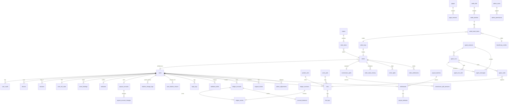

# 返利 App 规划文档 · 04 数据模型与契约

2026-09-29 · 2026-09-30 按 `规划/08` 同步 · 2026-10-01 补齐与 08、02 的同步缺口（缺表、枚举、待跟单与申诉接口、幂等主体、step-up 请求头、单一写者） · 2026-10-01 按 D8 变更同步间推开关形状（commission_rule_versions、r_indirect_bp、role `indirect`、sub_type `INDIRECT`，`docs/changes/20261001-间推二级奖励.md`） · 2026-10-01 按平台预留比例变更同步形状（commission_rule_reserves、commission_splits.reserve_bp / reserve_fen、规则发布校验，`docs/changes/20261001-平台预留比例.md`） · 2026-10-01 按拍板第二批（`docs/changes/20261001-拍板第二批.md`）与 9-30 拍板第一批同步形状：月结账单与批次、预计结算月份、自动到账、银行卡收款、劳务协议、人工调账、客服工单、账号并入、风控期限、跳转与按端门槛、卡片标记、错误码与配置键、§11 权限矩阵补全（代理起草） · 2026-10-01 晚按拍板第二批 §8 补充决定（ADD-01～07）同步：单一余额（`account_balances` 每用户一行，删除 `account_type`）、§11 改为权限点清单与 `admin_permissions`、资金操作一人完成、取消用户自助换绑、站长联盟授权到期管理、注销负余额拦截 30416 · 同日按 §8 ADD-08 同步：`union_accounts.last_probe_*`、配置 `union.auth_alert_phones` / `union.auth_probe_cron`、短信模板 `UNION_AUTH_EXPIRING` / `UNION_AUTH_EXPIRED`、open 与 30101 / 30102 的 auth_unavailable 不给无返利购买 · 2026-10-01 用语同步（ADR-0001 §4.2、§4.3，规划/11 §9.1）：§3.2 `order_keys` 加 `attr_at`、`ledger_entries` 加分区键 `booked_at`、平台表行去掉事件发件表、必备字段说明按裁定改写（只同步形状，不改规则含义） · 2026-10-01 晚按 ADR-0001 §4.2 同步：§3.2 加 `event_log`（第 16 项）、`booked_at` 含义（第 21 项）与主键、角色、连接池指针，§5 金额与字段行加 JSON 表示指针 · 2026-10-03 按功能对照补缺第 1 批（`docs/changes/20261003-功能对照补缺.md`；缺口编号写作「功能对照 G-xx」，与 规划/10 §6.1 的 G-xx 不是同一套）同步形状：§3.2 `devices.id_source`、`user_tip_reads`；§6.1 设备注册、第三方授权尝试接口、第三方登录请求体只收授权尝试与授权凭证、`is_new_user`、step-up 的第三方凭证、`GET /v1/me` 的 `invite_backfill`、tips 新键；§6.3 淘宝授权方式（auth-url、bindings）、`GET /v1/links/{link_id}`、分享中间页 `open_in_app_url`；§6.6 后台保存校验；§7 新增 20004、50305 与 30101 / 30102 / 30104 / 20001 的 data；§10.1 新配置键（代理起草） · 2026-10-03 按功能对照补缺第 2 批（同一变更记录「第 2 批」，功能对照 G-09～G-21）同步形状，各处注「功能对照 G-xx」；同日按评审补 `payout_account_verify_attempts`、`push_tokens.bound_sid`、`/v1/config` 的 `claim`，open 响应写明不设 `rebate_basis`，§10.1 不再写本批各键的默认值；第 2 轮评审后补 `devices.last_login_sid`、核验记录的状态与时刻列、三个核验配置键；第 3 轮评审后补 `POST /v1/idempotency-keys/abandon`、`idempotency_keys.status` 的 abandoned 与错误码 20903、`push_tokens.token_set_at` 与令牌值只由当前会话写入、核验记录的同指纹部分唯一约束与收款账号保存的用户级锁（变更记录 §2.8）；收尾核对后补核验记录的 `origin_action`、`idempotency_key` 与同一个键至多一条的部分唯一约束，作废接口列入 10006、10007 白名单，`push_tokens.acquired_by_move_at`、`frozen_until` 与配置键 `push.token_conflict_window_hours`（同值令牌的冲突冻结）（变更记录 §2.8 收尾核对）（代理起草） · 2026-10-03 按功能对照补缺第 3 批（同一变更记录「第 3 批」，功能对照 G-22～G-34）同步形状：§5 最低支持版本一行；§6.2 app-versions/check 与草稿预览；§6.6 首页数据源与 `external_hosts` 的保存校验；§7 新增 10405；§9 `app.getEnv`、`nav.open`、`share.open`、`cs.open`、`ext.openApp`、`perm.*`、`media.*`；§10.1 新增 `external_hosts`、`app_update`；§11.2 `content.agreement` 的范围（代理起草）；同日按评审与编排会话裁定（变更记录 3.9）：§3.2 `inbox_messages` 与 `notify_templates`（推送载荷只带消息编号）、§5 兼容与最低支持版本两行（写接口默认受约束，标注取 true / false / conditional）、§6.2 `/v1/config` 鉴权改为 optional 与预览令牌只在签发环境有效、§6.4 新增 `GET /v1/messages/{message_id}`、§10.1 跳转段定义 `entry` 形状、§11.2 表 D 权限点标为代理补全的默认假设；第 2 轮评审后（变更记录 3.10）：§9 表头与 `nav.open`（强更检查结果未知时的桥调用）；§2.5 `session_scope`、§5 受限会话一行（`x-session-scopes`）、§6.1 发码的 `action` 与登录、刷新响应的 `session_scope`、§7 10405 的 data 可为 null；§9 表后登记 `apps.json` 的条目形状（`inbound` 的 kind、host、path_prefix、verified）；第 3 轮评审后（变更记录 3.11）：§2.5 新增 `h5_token_scope`，§6.1 `POST /v1/auth/h5-token` 的 `scope`，§7 10403 的 `data.reason=h5_read_only`，§9 `auth.getH5Token` 的 `scope`；§6.1 短信与第三方登录的受限登录（只登录已有账号），§7 10405 的 `data.reason=no_account`；§5 受限会话一行的 `x-session-scopes` 缺省值改为引用 BR-ID-01 细则 · 2026-10-03 按资金规则对齐（`docs/changes/20261003-资金规则对齐.md`，负责人批准）同步形状：`orders.booked_n_fen`、`order_settlements` 的 seq / settled_at / content_hash、`settle_batch_items` 的受益人维度（item_type、user_id、role、amount_fen）、`settle_adjustments.status` 与 settle_seq、`payout_batch_items`（提现批次成员明细）、`order_rights.type` 与 `hold_reason` 的 UNMAPPED_STATUS、`recon_diff_type` 的 estimate_changed_after_credit、§4 的 P1–P15、W1–W11、SB1–SB9，§10.1 六个选择开关（只登记键与类型），`settle_jobs.job` 删 clawback；同日评审后修改（变更记录 §13.6）补 `beneficiary_credits`（待补记义务）与 `settle_batch_items.beneficiary_credit_id`，`settle_adjustments` 注明平台差额行；第 2 轮评审后（变更记录 §13.7）补 `beneficiary_credits.closed_by`、`closed_ref`，`voucher_id` 含迁移 R9、R10 同事务处置份额的凭证 · 本文是 `contracts/` 与 `specs/` 的**初稿来源**。全部为新设计（D19）。

2026-10-03 功能对照补缺第 4 批（`docs/changes/20261003-功能对照补缺.md`「第 4 批」；形状只在本文，取值见所引 BR）：§2.1 美团搜索列改为待核实（功能对照 G-52）；§3.2 `login_logs.method` 加 `merge`、§6.1 并号接口写这条登录记录（G-40）；§6.3 搜索接口 50304 `search_disabled`（G-47）、auth-url 对 blocked 绑定返回 30153、bindings 的显示对应（G-58）；§6.4 订单列表四个可选筛选参数、分享单脱敏格式与预售付款金额的指针、详情 `product_key` 与 `deposit_paid` 节点（G-60～G-63）；§7 50304 加 `data.reason`；§9 事件 data 与方法补充约束（G-45、G-49）；§10.1 `features.search_status.<platform>`、§10.2 `search.enabled.<platform>`（G-47）。没有新增错误码。 同日并入第 3 批后：§9 `apps.json` 条目形状的 `apps` 一项补 `trade_only`。第 1 轮评审后（变更记录 4.8；形状只在本文）：§2.5 新增枚举 `platform_search_status`；§3.2 新增 `device_registrations`、`links.jump_reported_at`，`login_logs` 说明改；§6.1 并号接口补写注册来源记录；§6.3 bindings 的状态投影、auth-url 的 `installed` 参数与拼多多的 `auth_jump`；§6.4 订单列表与详情的 `is_other_product` 与可空的 `title`、`image_url`，pending-tracks 指针；§7 30111 的 `data.auth_jump`；§8.3 `order_status` 卡、§8.5 订单类工具的投影；§9 `share.open` 的 url 限制；§10.1 `features.search_status` 改为同级对象、服务端配置键加 `risk.merge_tombstone_dedupe`。没有新增错误码。 第 2 轮评审后（变更记录 4.9；形状只在本文）：§3.2 删除 `links.jump_reported_at`、新增 `link_open_attempts`，`login_logs` 说明改为按设备与窗口；§6.3 auth-url 的 `installed` 不再写缺省值（移到 BR-ID-22 细则）；§6.4 pending-tracks 按打开尝试的指针、`POST /v1/events` 的 `link_jump` 带 `attempt_id`；§8.4 open 响应加 `attempt_id`；§9 `share.open` 的判定顺序与 `ext.openBrowser` 的规范化。仍没有新增错误码。 第 3 轮评审后（变更记录 4.10；形状只在本文）：§3.2 `links` 删去 `track_dismissed_at`，`link_open_attempts` 加 `dismissed_at`；§6.4 pending-tracks 的卡片项加 `attempt_id`，关闭接口加请求体 `attempt_id` 与 20001；§10.1 服务端配置键加 `attr.track_complete_tolerance_sec`（只登记键名与类型）。仍没有新增错误码。
2026-10-03 功能对照补缺第 5 批（`docs/changes/20261003-功能对照补缺.md`「第 5 批」，功能对照 G-66～G-96；形状只在本文，取值见所引 BR）：§3.2 `user_oauth` 加唯一 (app_id, user_id, provider)；§6.1 收款账号查询的返回字段与 `payee_name` 由用户填写；§6.2 app-versions/check 的 store_url 是默认地址；§6.4 提现规则加 `withdrawable_fen`、`est_*_fen`、`quick_amounts_fen` 与参数 `amount_fen`，提现详情加 `channel_order_id`，余额流水加 `balance_after_fen`，钱包摘要的暂停文案取 error.30306；§6.6 保存校验加两类跳转目标；§9 `nav.open`、`cs.open`、`media.scan`；§10.1 `help_links.withdraw_rules`；§11.2 新增权限点 `content.fund_terms`。同日按第 1 轮评审修改（变更记录 5.9）：§9 `cs.open` 的客服链接不带 uid 等任何账号标识；§11.2 `content.fund_terms` 补机器可读清单的形状，`content.article` 除去资金类消息模板；§6.4 rules 写明迟到响应由客户端丢弃（不加字段）；§3.2 `app_versions` 加 `default_store`、`store_listings`，`articles` 加公告用的三列；§6.2 app-versions/check 加 `default_store`、`stores`，`GET /v1/articles` 公告分类加 `notice`，新增 `NoticeItem` 形状。 第 2 轮评审后（变更记录 5.10）：§3.2 `app_versions.store_listings` 由映射改为按填写顺序的数组、加 `official_download_url`；§6.2 check 的 `stores` 写明顺序与它一致、加 `official_download_url`；后台 `app-versions` 保存时的核对；§11.2 `specs/fund-term-keys.yaml` 改为 `fund_terms`、`ordinary` 两段，各写入口共用一个键级检查。 第 3 轮评审后（变更记录 5.11）：§3.2 `app_versions` 与 §6.2 check 删去 `official_download_url`（不再新增，不下发任何下载地址）。

2026-10-04 提现增加微信零钱（`docs/changes/20261004-微信零钱提现通道评估.md`；形状只在本文，取值见 08 BR-WDR-33）：§2.4 `payout_method`、`payout_channel` 加 `wechat`，新增 `withdrawals.channel_state`；§3.2 `payout_accounts` 加微信字段与唯一索引，`withdrawals` 加 `channel_state`、`confirm_deadline` 与快照的微信字段；§6.1 收款账号接口支持微信授权绑定；§6.4 新增取拉起参数的接口，提现记录返回通道子状态与确认截止时间；§10.2 加 `payout.channel_enabled.wechat`。契约落地见 05 CT-20。

2026-10-04 新增收款基础设施（`docs/changes/20261004-会员购买与微信支付评估.md`；形状只在本文，取值见 08 BR-PAY）：§2.4 新增 `pay_channel`、支付单与退款单状态；§3.2 新增 `pay_orders`、`pay_notifications`、`pay_query_attempts`、`pay_refunds`；§6.4 新增支付单接口与通知入口；§7 新增 30901、30902、50306（码段 309）；§10.2 新增 `pay.enabled`、`pay.channel_enabled.<pay_channel>`；§2.4 另有 `pay_ledger_type`、`recon_diff_type` 加 `pay_mismatch`、`pay_anomaly`（来源 R4）；§3.2 另有 `pay_anomalies`；§4 登记支付单状态机；§11.2 新增 `pay.view`、`pay.refund`、`pay.resolve`。后台的支付单查询、退款、对账在 §6.6 `pay-orders` 资源下。契约落地见 05 CT-21。

2026-10-04 契约线核对后补（契约线清单 P-S1～P-S3；负责人 2026-10-04 同意开关的权限点归属）：§11.2 `switch.payout` 的范围加按通道的打款开关与暂停开关，新增 `switch.pay` 管收款类开关；§2.4 补 `payout_attempts.kind`、`pay_refunds.target_type`、`pay_query_attempts.kind` 三个枚举行；§2.5 补 `recon_diffs.source` 枚举行。取值都已在 08 或本文表字段里出现过，这次只是补成枚举行，没有新增取值。

- **分工**：本文只定义字段、枚举、接口、错误码、状态机的**形状**；取值规则、业务含义、状态迁移表以 `规划/08_业务规则/` 为唯一依据，本文只写编号 + 一句话（「BR-xxx」「08 §n」）。两处不一致时以 08 为准。
- **逐步落地（D27）**：本文记录当前接口与数据模型草案，按正在开发的功能转成机器可读文件，不要求 W0 一次转写全部接口。Claude Code 与 GPT 均可维护；每项完成转写时注明实际文件位置，该项字段形状以已落地文件为准，业务含义仍按 08。新文档接入后可调整设计；已有调用方或历史数据的变更需说明兼容与迁移方式。
- **待决策标注**：凡依赖 08 §14.3 跨主题分歧（C-xx）默认处理的形状，均标「C-xx 默认」；负责人改选后按 08 回改。
- **淘礼金范围（D7）**：相关枚举、字段、表与接口是后续设计参考，首版不要求建表、接供应商或实现发放；普通商品流程不能依赖该模块。保留可选模块边界，`tlj.enabled` 与判定开关保持关闭，素材走 unknown 提示。

---

## 1. 术语表

术语定义只在 `08_业务规则/README.md` §1 维护（§1.1 通用术语、§1.2 用户话术 ↔ 内部状态、§1.3 价格术语）；其他文档的叫法对照见 08 §13。下表只列术语对应的契约字段，定义以右列规则为准。

| 术语 | 契约字段 / 形状 | 规则 |
| --- | --- | --- |
| 推广位、pid_scene、scene | `union_pids.pid`、`pid_scene`；`links.scene`（§2.2） | BR-ATTR-02、BR-ATTR-08 |
| 渠道备案 / relation_id、special_id | `union_bindings.relation_id`、`special_id`（MVP 只存不用） | BR-ATTR-06、BR-ATTR-07、BR-ID-17 |
| 用户归因标识 | `users.attr_code`；京东 subUnionId、拼多多 custom_parameters 只携带 attr_code，不放 user_id（C-04 默认；长度与字符集待 CAP-JD-05、CAP-PDD-05） | BR-ATTR-06、BR-ID-22 |
| 同一商品、product_key、stable_id、spec_text | `product_key` = `<platforms.key_prefix>:<stable_id>`，不可变；PRD v2.1 的 item_key 即 product_key；spec_text 不进键 | BR-PROD-01～04 |
| raw_item_id、item_ref | `product_refs.raw_item_id`；`product_card.item_ref`（不透明串，客户端原样透传） | BR-PROD-05、BR-PROD-11 |
| link_id | `links.link_id`：一次转链或一张带价格卡片的登记，固化归因身份与报价快照 | BR-PRICE-12、BR-ATTR-05 |
| attr_at、order_key | `orders.attr_at`；`{platform}:{sub_order_id}` | BR-ATTR-25、BR-FUND-05 |
| 未归因池 | `orders.user_id IS NULL` 且 `rebate_status=UNATTRIBUTED`；只能经找回或管理员变更认领 | BR-ATTR-16 |
| 基数 B、N | `commission_splits.base_fen`；`orders.est_commission_fen` / `settle_commission_fen`（B 先扣所选规则版本中该平台的预留比例 `commission_rule_reserves.reserve_bp`，预留金额记 `commission_splits.reserve_fen`） | BR-CALC-02、BR-CALC-03 |
| 月结入账、扣回、补差 | 月结账单 `settle_bills` → 结算批次 `settle_batches` → `rebate_status`→CREDITED；`CLAWBACK`；`SETTLE_ADJUST` | BR-FUND-04～09 |
| 预估返、预估收益、已结算、可提现、已到账、已提现 | 结算前一律「预估」、结算后「已结算」（拍板第二批 OPS-01）；用户话术的唯一含义见 08 README §1.2；字段见 §6.4 | BR-TEXT-01、BR-FUND-18 |
| step-up、LKG | `step_up_token`（请求头与 action 见 §5）；配置 last-known-good | BR-ID-08 |

---

## 2. 枚举

### 2.1 平台 `platform`

字符串编码，不使用数字。天猫是淘宝的 `shop_type=tmall`，不单独占编码。

| 编码 | 平台 | 搜索 | 转链 | 订单同步 | 阶段 | `product_key` 前缀 |
| --- | --- | --- | --- | --- | --- | --- |
| `taobao` | 淘宝 / 天猫 | ✔ | ✔ | ✔ | M-内测 | `tb:` |
| `jd` | 京东 | ✔ | ✔ | ✔ | M-内测 | `jd:` |
| `pdd` | 拼多多 | ✔ | ✔ | ✔ | M-内测 | `pdd:` |
| `meituan` | 美团（外卖、到店活动） | 待核实（CAP-MT-06、09 U-81；原写「✖ 无商品搜索形态」，未经验证，2026-10-03 功能对照 G-52） | 活动转链 | ✔ | P1（D15） | `mt:` |
| `vip` | 唯品会 | P1 | P1 | P1 | P1 | `vip:` |
| `douyin` | 抖音 | P1 | P1 | P1 | P1 | `dy:` |
| `eleme` | 饿了么 | — | P1 | P1 | P1 | — |
| `kuaishou` | 快手 | — | P2 | P2 | P2 | `ks:` |
| `suning` | 苏宁 | — | P2 | P2 | P2 | `sn:` |

识别但未支持的平台链接返回 30131，转链开关关闭返回 50301（BR-PROD-10）。平台字典表 `platforms` 存上述能力标记及 `key_prefix`、`key_stability`（unverified / stable_24h / stable_7d / unstable）列，新增平台只加一行，不改代码中的枚举判断；前缀列即 `key_prefix` 现值，product_key 格式、各平台 stable_id 派生（拼多多取 goods_id，待 CAP-PDD-01）见 BR-PROD-02、BR-PROD-03。

### 2.2 场景

**`scene`**（转链来源，转链请求必填，写入 links / link_logs，用于回流统计；缺失或非法返回 20001，BR-ATTR-08）：

- MVP：`search`、`detail`、`home_card`、`feed`、`clipboard`、`agent`、`share`、`h5`、`push`
- 后续接入（D7，未排期）：`taolijin`；首版不建淘礼金推广位，只建 self_buy / share / agent / fallback / query（06 Q-C16），`tlj.enabled=off` 期间服务端不接受该值
- MVP 预埋（开关关闭，不对用户展示）：`watch_alert`（BR-WATCH-19，待决策）
- P1：`share_ext`、`wechat_bot`、`mcp`（外部入口，08 §13.2）
- 提醒细分 digest、new_arrival、promo_reminder、replenish 不进 scene，记在 `links.sub_scene`（P1 新增，取值 = watch.type）

**`pid_scene`**（推广位场景，服务端由 scene 推出，映射见 BR-ATTR-08）：

| pid_scene | 来源 scene | 订单 `buy_type` | 入账（受益角色） |
| --- | --- | --- | --- |
| `self_buy` | search、detail、home_card、feed、clipboard、h5、push；watch_alert、share_ext、wechat_bot | self | 本人余额（self） |
| `agent` | agent；mcp | self | 本人余额（self） |
| `share` | share | share | 分享者余额（share） |
| `taolijin`（后续接入，D7；首版不建） | taolijin | self | 默认本人与直推份额均为 0（BR-CALC-19） |
| `fallback` | 不下发给用户；定义前不用于转链 | self（`scene_basis=fallback`） | 本人余额（self） |
| `query` | 不转链，只用于搜索、详情、提醒查价取数 | — | — |

### 2.3 订单

订单采用双状态（BR-FUND-01，C-01 默认，待负责人确认；不采纳时按 BR-FUND-01「与单一 order_status 的映射」回退）。子订单粒度。

| 字段 | 取值 | 唯一写者 / 规则 |
| --- | --- | --- |
| `platform_status` | `DEPOSIT_PAID`、`PAID`、`RECEIVED`、`SETTLED`、`INVALID` | order-sync；平台状态码映射见 BR-FUND-02；SETTLED 只表示联盟订单状态为结算，不表示回款 |
| `rebate_status` | `UNATTRIBUTED`、`ESTIMATED`、`WAITING`、`CREDITED`、`VOID`（终态）、`CLAWED_BACK`（终态） | settlement；迁移见 §4；终态指自动事件不得离开，只有人工恢复（R12、R13）可以离开，R3b 在 VOID 上只写归属（BR-FUND-01，2026-10-03） |
| `hold` + `hold_reason`、`rights_pending` | bool + 原因码（`RISK`、`CS`、`UNMAPPED_STATUS`）；bool | settlement；不改 rebate_status（BR-FUND-06）；`UNMAPPED_STATUS` 为映射表之外的平台状态码出现时由系统置（BR-FUND-02，2026-10-03） |
| `display_status`（不入库，接口派生） | `PAID`、`DEPOSIT_PAID`、`WAITING`、`CREDITING`、`REVIEWING`、`RIGHTS_PENDING`、`CREDITED`、`CREDITED_PART_CLAWED`、`NO_REBATE`、`INVALID`、`CLAWED_BACK` | 派生顺序见 BR-FUND-17（月结口径下第 11 行 `WAITING_SETTLE` 停用，不进契约）；文案、预计结算月份见 BR-TEXT-02、BR-TEXT-04（结算前一律「预估」、结算后「已结算」，BR-TEXT-01，拍板第二批 OPS-01） |

部分退款不是独立状态：记录 `refunded_quantity`；入账前重算预估（BR-FUND-07），入账后写 `CLAWBACK`（sub_type=PART_REFUND，BR-FUND-08）；新基数取法见 BR-CALC-15。

**`buy_type`**：`self`、`share`（BR-ATTR-08）。**归因依据**拆为两个字段（BR-ATTR-09，取代原 `attribution_basis`）：`scene_basis` ∈ {`pid`, `param`, `fallback`}；`user_basis` ∈ {`param`, `claim`, `admin`}，未归因为 NULL。

**原因码 `order_reason`**：字典字段 kind（void / diff / claim）、title、desc、claimable、action[]，文案与各码的 kind 只在 BR-TEXT-05 维护；`reason_sub` 细分（如 PUNISH）同条。

| 编码 | 写入 `orders.reason` | 说明 |
| --- | --- | --- |
| `REFUND`、`RIGHTS`、`PUNISH`、`PRESALE_UNPAID`、`COMMISSION_ZERO`、`OTHER` | 是 | void 类；COMMISSION_ZERO 见 BR-FUND-07；rebate_status=CLAWED_BACK 同样写（迁移 R8 同事务写，取值按 BR-FUND-08 细则的映射表，2026-10-03） |
| `BLACKLIST` | 是 | 订单级命中；账号级只影响该受益人份额，见 BR-CALC-13、BR-ATTR-26 |
| `PART_REFUND`、`PRICE_COMPARE`、`PRICE_PROTECT`、`SETTLE_DIFF` | 是（diff 类，写 `diff_reason_code`） | 差额原因只用这 4 个（BR-CALC-14） |
| `NOT_TRACKED`、`EXPIRED_CLICK`、`OTHER_TLJ` | 否 | 只用于找回驳回、explain_order、诊断；文案不写具体天数（BR-ATTR-13、BR-ATTR-21） |
| `RELATION_INVALID` | 否 | 只用于转链 30102 与授权提示（BR-ATTR-21） |
| `CANCELLED` | 待定 | 08 §13.2 要求新增（京东、拼多多独立取消状态）；BR-TEXT-05 现把取消并入 REFUND。是否单列以 09 实测为准，启用前不写入 |

**维权枚举**：`order_rights.status` ∈ {`PROCESSING`, `WAIT_COMMISSION`, `SUCCEEDED`, `FAILED`}；前两者使 rights_pending=true（BR-FUND-06）。`order_rights.type` ∈ {`RIGHTS`, `PUNISH`, `INVALID_AFTER_SETTLE`, `REFUND_AFTER_SETTLE`}（处罚类平台码与处罚接口写 PUNISH，BR-FUND-02；2026-10-03 资金规则对齐，编码代理自定）；淘宝维权码到 status 的映射待 CAP-TB-08。

**找回枚举**：`claims.evidence_level` strong / weak / none；`claim_items.decision` ∈ {NULL（待审）, `approved`, `rejected`, `cancelled`（同步已自动归因给申请人）}（BR-ATTR-16、BR-ATTR-18）；`claim_items.reject_reason` 客服可选 NO_EVIDENCE、EXPIRED_CLICK、NOT_TRACKED、OTHER_TLJ、FRAUD、OTHER，系统专用 NOT_IN_POOL、ORDER_INVALID（BR-ATTR-18）。

### 2.4 资金

**用户余额**：每个用户只有一个余额（科目 `USER_BALANCE`，`account_balances` 每用户一行），不分自购与推广账户；收入来源（自购返利、分享收益、邀请分佣、好友推广奖励等）只由 `ledger_type` + `sub_type` 区分，用于展示与对账（拍板第二批 §8 ADD-06；原 `account_type` ∈ {SELF, PROMO} 删除）。

**流水类型 `ledger_type`**：共 13 种，只能取下表值，细分只用 `sub_type`；间推不另设类型，用 `REFERRAL_CREDIT` + `sub_type=INDIRECT`（D8，BR-FUND-15）。取值规则与其他文档的映射见 BR-FUND-15、08 §13.4；用户侧名称、符号、跳转只在 BR-TEXT-19 维护（字典 `ledger_type.<CODE>.name`；`CLAWBACK` 部分退款用 `ledger_type.CLAWBACK.name_part_refund`；`ADMIN_ADJUST` 按原因码取 `ledger_type.ADMIN_ADJUST.name_<sub_type>` 与说明 `ledger_type.ADMIN_ADJUST.hint_<sub_type>`，拍板第二批 FUND-13）。

| 编码 | 含义 | 方向 | 余额 | `sub_type` |
| --- | --- | --- | --- | --- |
| `REBATE_CREDIT` | 自购返利入账 | + | 用户余额 | — |
| `SHARE_CREDIT` | 分享收益入账 | + | 用户余额 | — |
| `REFERRAL_CREDIT` | 邀请分佣入账（直推 / 间推） | + | 用户余额 | `DIRECT`、`INDIRECT`（INDIRECT 只在间推开关开启的规则版本下产生，BR-CALC-05；用户端展示限制见 BR-INV-17、BR-TEXT-19） |
| `CLAWBACK` | 订单扣回（含入账后部分退款） | − | 原受益人余额 | `FULL`、`PART_REFUND`、`RIGHTS`、`PUNISH`（按逆向事件来源取值，映射只在 BR-FUND-08 细则维护） |
| `SETTLE_ADJUST` | 结算补差 | ± | 原受益人余额 | `SETTLE_DIFF`、`PRICE_COMPARE`、`PRICE_PROTECT` |
| `WITHDRAW_FREEZE` | 提现冻结 | 可用 → 冻结 | 用户余额 | — |
| `WITHDRAW_PAID` | 提现出金 | 冻结 − | 用户余额 | — |
| `WITHDRAW_RETURN` | 提现退回 | 冻结 → 可用 | 用户余额 | 驳回 / 失败 |
| `WITHDRAW_FEE` | 提现手续费（从冻结扣，MVP 为 0） | 冻结 − | 用户余额 | — |
| `TAX_WITHHOLD` | 代扣个税（从冻结扣） | 冻结 − | 用户余额 | — |
| `REWARD` | 活动奖励（P1） | + | 用户余额 | `newbie`、`checkin`、`invite` |
| `ADMIN_ADJUST` | 人工调账 | ± | 用户余额 | `RESTORE`（订单恢复与申诉恢复，BR-FUND-22）、`RECON_FIX`、`PAYOUT_RECOVERY`、`ACCOUNT_CLOSED`（注销放弃余额转平台收入）、`OTHER`；原因码含义与流程只在 BR-FUND-24 维护（拍板第二批 FUND-09、FUND-13、FUND-14） |
| `BAD_DEBT_WRITEOFF` | 负余额核销 | + | 用户余额 | — |

**提现状态 `withdrawal_status`**：`PENDING_REVIEW`、`APPROVED`、`REJECTED`、`PAYING`、`PAID_API`、`PAID_MANUAL`、`FAILED`；终态 REJECTED、PAID_API、PAID_MANUAL、FAILED（BR-WDR-08；迁移 W1–W11，W11 事件 `CHANNEL_SUCCESS_PROVEN`，2026-10-03）。用户文案只在 BR-TEXT-06 维护（字典 `withdrawal_status`，提现侧「到账」口径，C-02 默认），本文不写文案。

**提现相关原因码**（取值只按所引条目，文案见 BR-TEXT-08）：

| 字段 | 取值 | 规则 |
| --- | --- | --- |
| `withdrawals.reject_reason_code` | 人工可选 `RISK_SUSPECT`、`ORDER_ABNORMAL`、`PAYEE_INFO_INVALID`、`USER_REQUEST`、`OTHER`；系统专用 `NEGATIVE_BALANCE` | BR-WDR-10、BR-WDR-05 (a)；字典 `withdraw_reject_reason` |
| `withdrawals.hold_reason`（W9 回到 APPROVED 的原因） | `payout_disabled`、`queue_paused`、`channel_disabled`（2026-10-04，BR-WDR-33 ①）、`member_blocked`、`single_cap`、`daily_cap`、`payer_side_after_transfer` | BR-WDR-13、BR-WDR-17 |
| `withdrawals.blocked_reason` | `NEGATIVE_BALANCE`（`NEGATIVE_BALANCE_OTHER` 随单一余额停用，编码不复用，拍板第二批 §8 ADD-06） | BR-WDR-05 (a) |
| `withdrawals.fail_code` | 支付宝原始返回码（text，不设枚举）；是否判失败只看配置清单 `payout.definite_fail_codes` / `query_status_map`；账号类码前缀 `PAYEE_` | BR-WDR-28、BR-TEXT-08；字典 `withdraw_fail_reason`，未命中走兜底文案 |
| `withdrawals.manual_resolution`（needs_manual 处置结论） | `paid`（→ PAID_API）、`failed`（→ FAILED） | BR-WDR-15（编码代理自定） |
| `withdraw_holds.reason` | `manual`、`recon_diff`、`ledger_mismatch`、`manual_failed_watch` | BR-WDR-05、BR-WDR-15、BR-FUND-19 |
| `withdrawals.review_mode` | `auto`（系统按规则组审核并打款）、`manual`（人工审核） | BR-WDR-30（拍板第二批 FUND-02） |
| `withdrawals.auto_decision.unmet[]` | BR-WDR-30 ①–⑬ 各条件的 code 与 `execute_blocked`；取值与含义只在该条维护 | BR-WDR-30 |
| `payout_accounts.payout_method`、`withdrawals.payout_channel` | `alipay`、`bank_card`、`wechat` | BR-WDR-02、BR-WDR-32（拍板第二批 FUND-03）；`wechat` 见 BR-WDR-33（2026-10-04） |
| `withdrawals.channel_state` | `processing`、`wait_user_confirm`、`canceling`；可空，只有微信零钱单在 PAYING 期间有值 | BR-WDR-33 ⑤（2026-10-04） |
| `pay_orders.pay_channel` | `wechat_pay`、`alipay` | BR-PAY-01（2026-10-04；与 `payout_channel` 无关） |
| `pay_orders.status` | `PENDING`、`PAID`、`CLOSED` | BR-PAY-02 |
| `pay_refunds.status` | `PROCESSING`、`SUCCESS`、`FAILED` | BR-PAY-06 |
| `pay_refunds.target_type` | `pay_order`、`pay_anomaly` | BR-PAY-06 ① |
| `pay_query_attempts.kind` | `query`、`close`、`refund`、`refund_query` | BR-PAY-04、05、06 |
| `pay_ledger_type`（收款凭证类型，只用于平台科目，不属于用户流水的 `ledger_type`） | `PAY_RECEIPT`、`PAY_REFUND`、`PAY_ANOMALY`、`PAY_FEE` | BR-PAY-07 |
| `payout_batches.kind` | `manual`、`auto` | BR-WDR-30 |
| `payout_attempts.kind` | `transfer`、`query`、`cancel`（cancel 只用于微信零钱单的撤销） | BR-WDR-13、BR-WDR-33 ⑥（2026-10-04 补枚举行） |
| `payout_batch_items.result` | `paying`（进入打款）、`skipped`、`blocked`（受阻，留在 APPROVED）、`moved_out`（已移出，改挂到别的批次） | BR-WDR-11、BR-WDR-12（2026-10-03 资金规则对齐，编码代理自定） |

**所得类型 `income_type`**：`SERVICE_FEE`（全部佣金收入：自购、分享、直推、间推，全部提现合并累计计税）、`INCIDENTAL`（活动奖励，P1）；`SELF_REBATE` 停用，编码保留不复用（拍板第二批 FUND-04）；税目、税率与「税率表到位前税额记 0、照常累计」见 BR-WDR-20。

### 2.5 其他

| 枚举 | 值 |
| --- | --- |
| `union_binding_status` | `unbound`、`pending_auth`、`active`、`invalid`（失效需重新授权）、`released`、`blocked`；不设 `cooling`；不提供用户自助换绑，用户绑定只在注销时释放，释放后冷却用 `released` + `cooldown_until` 表达（默认 30 天，BR-ID-19，拍板第二批 §8 ADD-01）；`blocked_reason` ∈ {`ban`, `admin_disable`（后台「停用返利」，可由后台恢复为 active；原 `admin_unbind` 改名）, `deletion`}（BR-ID-20）；后台「重置授权」把绑定置 `released`（`reason=admin_reset`），用户可重新授权（拍板第二批 OPS-11；冷却见 BR-ID-20） |
| `claim_status` | `submitted`、`auto_matched`（全部子项 strong，待客服确认）、`manual_review`、`approved`、`rejected`、`cancelled`（同步已自动归因给申请人，BR-ATTR-16）；汇总规则见 BR-ATTR-18 |
| `risk_state` | `normal`、`frozen`（风控冻结，可设期限 `frozen_until`）、`appealing`、`banned`（永久）；存于 `user_risk_state.state`（risk 模块唯一写者；08 所称 `users.risk_state` 即此列）；提现冻结另见 `withdraw_holds`（BR-WDR-05）；期限与用户可见原因类别见 BR-ID-31（拍板第二批 OPS-12） |
| `identity_level` | `basic`、`guest`、`member`、`phone`、`realname`（BR-ID-01；`GET /v1/me` 返回） |
| `step_up_action` | `withdraw`、`payout_account_change`、`phone_change`、`account_deletion`（BR-ID-08、BR-WDR-01、BR-ID-06、BR-ID-27）；须与所调接口一致 |
| `session_scope` | `full`、`deletion_only`（access_token 的 `scp` claim，BR-ID-07；登录与刷新的响应带同名字段；签发哪一种、`deletion_only` 能调用哪些接口见 BR-ID-01 细则「受限会话」；2026-10-03 第 3 批第 2 轮评审后新增） |
| `platform_search_status` | `on`、`off`（`/v1/config.features.search_status` 的值，§10.1；由 `search.enabled.<platform>` 派生，BR-PROD-10 细则；2026-10-03 第 4 批第 1 轮评审后新增） |
| `h5_token_scope` | `standard`、`read_only`（h5_token 的 `scp` claim；`POST /v1/auth/h5-token` 请求体与响应的同名字段 `scope`、桥方法 `auth.getH5Token` 结果的 `scope`；原生按强更状态申请哪一种、`read_only` 能调用哪些接口、请求不带时的取值见 BR-ID-32 细则「只读作用域」；2026-10-03 第 3 批第 3 轮评审后新增） |
| `appeal_status` | `processing`、`upheld`（维持）、`revoked`（撤销）（BR-ID-36；编码代理自定） |
| `commission_rules.status` | `draft`、`published`、`revoked`（只能撤销未生效版本）（BR-CALC-11、BR-CALC-22） |
| `beneficiary_role`（`commission_splits.beneficiaries.role` 等） | `self`、`share`、`direct`、`indirect`（`indirect` 只在所选版本 `indirect_enabled=true` 时出现，受益人深度 ≤ 2，BR-CALC-04、BR-CALC-05、BR-INV-12）；客户端遇未知值按 `.unknown` 兜底显示为通用收入 |
| `bad_debt_writeoff.status` | `PENDING`、`APPROVED`、`CANCELLED`（BR-FUND-12） |
| `recon_diff_type` | `pay_mismatch`、`pay_anomaly`（R4 收款对账，BR-PAY-07，2026-10-04；处置不沿用 R2）、`union_mismatch`（R1）、`channel_mismatch`（R2）、`ledger_mismatch`（R3 日终，BR-FUND-19）、`platform_restore`（已作废订单被平台恢复，BR-FUND-22）、`month_end_unbalanced`（月末三项不平，BR-FUND-23，按 (app_id, 月份) 去重）、`settle_amount_mismatch`（月结账单金额不一致）、`settle_missing`（应结未结）（BR-FUND-04）、`appeal_restore`（申诉撤销后恢复订单，拍板第二批 FUND-14）、`estimate_changed_after_credit`（入账后只有预估佣金变化，BR-FUND-01 R9b，2026-10-03 资金规则对齐决-01）；编码代理自定，类型含义以所引条目为准 |
| `recon_diffs.source` | `R1`（联盟对账）、`R2`（打款通道对账，BR-WDR-23）、`R3`（内部日终，BR-FUND-19）、`R4`（收款对账，BR-PAY-07）（2026-10-04 补枚举行） |
| `users.status` / `users.deleted_reason` | status 正常值外增加 `deleting`、`deleted`（BR-ID-27）；deleted_reason 增加 `merged`（第三方空号并入手机号账号后置墓碑，不进冷静期、不写 deleted_identities，BR-ID-06，拍板第二批 OPS-04） |
| `realname_status` | `none`、`verified`、`failed` |
| `deletion_status` | `cooling`、`processing`、`done`、`cancelled` |
| `recon_diff_status` | `open`、`processing`、`adjusted`、`written_off` |
| `notify_template.code` / `category` | `ORDER_TRACKED`、`ORDER_INVALID`、`CREDITED`（月结批次完成后按受益人汇总）、`CLAWBACK`（以上四类按受益人扇出，上级模板只含金额与状态，拍板第二批 OPS-02）、`WD_SUCCESS`、`WD_REJECTED`、`WD_FAILED`、`WD_OVERDUE`（审核超时，推送 + 站内信，幂等键 `withdrawal_id:OVERDUE`，BR-WDR-26、BR-TEXT-07）、`CLAIM_RESULT`、`RISK_STATE_CHANGED`、`APPEAL_RESULT`、`DELETION_PROGRESS`（后三类只发站内信，OPS-15）、`BALANCE_ADJUSTED`（人工调账调减，只发站内信，注销用户不发，BR-FUND-24 ⑦⑧、BR-TEXT-19，FUND-13）、`SMS_CODE`、`UNION_AUTH_EXPIRING` / `UNION_AUTH_EXPIRED`（站长授权告警短信，只发 `union.auth_alert_phones` 配置的站长手机号、不发用户、不属下列用户通知分类，BR-ID-24、BR-TEXT-20，拍板第二批 §8 ADD-08）；`service` / `subscription` / `marketing`（交易与提现模板都归 `service`；MVP 只开放 service 开关，OPS-16）。消息清单 `messages.yaml`（code × 触发事件 × 渠道 × 跳转 × 频控）生成事件消费者与三端路由；文案与通道约束见 BR-TEXT-09、BR-TEXT-20 |
| `watch.status`（P1） | `active`、`paused`、`unavailable`、`expired`、`cancelled`（BR-WATCH-10）；`watch_event.status`：`pending`、`suppressed`、`sent`（BR-WATCH-11） |
| `benefit` | `coupon`、`big_coupon`、`taolijin`、`subsidy`、`high_rebate` |
| `sort` | `relevance`、`sales_desc`、`final_price_asc`、`rebate_desc` |
| `agent_intent` | `find_by_link`、`search`、`refine`、`order_query`、`rule_qa`、`handoff`、`clarify`、`out_of_scope` |
| `tlj_kind`（素材淘礼金判定） | `ours`（A）、`brand_open`（B）、`third_party`（C）、`unknown`（不宣称已判定为 C，按 BR-TEXT-15 判定 3′ 展示） |
| `user_level` | `L1`、`L2`、`L3`（晋升只看本人推广订单） |
| `admin_permission`（权限点） | 取值即 §11 权限点清单的 key；超级管理员（`admin_users.is_super=true`）拥有全部权限点，其他后台账号按权限点逐项勾选，不设固定角色（拍板第二批 §8 ADD-04；原 `admin_role` super / ops / finance / cs / auditor 删除） |
| `settle_batch.status` / `settle_mode` / `settle_batch_items.result` / `settle_batch_items.item_type` | `DRAFT`、`CONFIRMED`、`EXECUTING`、`PARTIAL`、`DONE`、`CANCELLED` / `IMMEDIATE`、`SCHEDULED` / `credited`、`skipped`、`deferred`（受益人补记项的受益人仍在暂缓，BR-FUND-04 ⑫）/ `order`、`beneficiary`（受益人补记项）（BR-FUND-04；迁移见 §4 4.7）；月结账单状态（出账中 / 已出账 / 待结算 / 结算中 / 已结算）由批次派生、不入库 |
| `settle_adjustments.status` | `pending`、`approved`、`rejected`、`voided_stale_seq`（候选行 seq 已不是当前 seq）、`voided_by_clawback`（扣回发生时作废，BR-FUND-09 ②，2026-10-03 资金规则对齐决-10）；BR-FUND-09、BR-CALC-23（编码代理自定） |
| `beneficiary_credits.kind` / `beneficiary_credits.status` | `first_credit`（入账时暂缓，迁移 R5 开立）、`reassign_credit`（改派重记时新受益人暂缓，R14 开立）、`deferred`（正差被延后）/ `open`、`done`（已补记，或执行时金额为 0、不写凭证，或份额已由迁移 R9、R10 同事务补给受益人）、`forfeited`（已没收，或份额已由迁移 R9、R10 同事务归平台）、`voided`（订单转 CLAWED_BACK 或改派时作废）；BR-FUND-04 ⑫（2026-10-03 资金规则对齐评审后修改，R9、R10 同事务关闭为第 2 轮评审后修改；编码代理自定） |
| `match_tag`（商品卡条件标记） | `matched`、`relaxed`、`spec_unconfirmed`；由服务端代码判定，判定口径见 BR-AI-24（拍板第二批 AI-04） |
| `ticket.type` / `ticket.status` | `appeal_unauth`（未登录申诉）、`realname_correction`、`phone_change`（旧手机号不可用换号）、`ai_report`、`data_export`（个人信息副本，OPS-19）、`withdraw_cancel`（提现撤销申请，FUND-20）、`other` / `open`、`processing`、`waiting_user`、`resolved`、`closed`（拍板第二批 OPS-08；编码代理自定） |

---

## 3. 核心数据模型

### 3.1 关系图



P1 订阅提醒相关表见附录 A；`user_relation_closure` 为 P1（MVP 计酬只用 `users.parent_id`，BR-INV-11）。

### 3.2 主要表字段

所有业务表都有 `app_id`（NOT NULL）、`created_at`；可变实体表另有 `id`、`updated_at`，联合主键表与只插入表按下表各行的定义（ADR-0001 §4.3）；业务唯一键以 `app_id` 开头。金额列一律 `bigint`，单位分，列名以 `_fen` 结尾；比例列为整数，单位万分之一，列名以 `_bp` 结尾；外部 ID 一律 `text`。实体表主键为 UUIDv7（应用生成，列类型 `uuid`），数据库角色与连接池（不用 PgBouncer）见 ADR-0001 §4.2 第 1、2、8、11 项。字段的取值规则见各行所引条目。每张表（或一组列）只有一个写者模块，归属以 `02` §4.1 为准；本表「写者」只在归属容易混淆处注明。

| 表 | 关键字段 | 约束与说明 |
| --- | --- | --- |
| **身份、邀请与合规** | | |
| `users` | id、phone_cipher、phone_hmac、nickname、avatar（MVP 只用默认头像，OPS-13）、nickname_change_month（YYYY-MM）、nickname_change_count、invite_code、attr_code、parent_id、parent_bind_source、parent_bound_at、self_bind_used、level、status、deleted_reason（含 merged，BR-ID-06）、personalization_off、register_method、registered_channel | 唯一 (app_id, phone_hmac)（只约束注销未 done 的账号，BR-INV-05；并号作废的墓碑账号同属已注销）；phone_cipher 与 phone_hmac 都按规范化后的手机号写入（BR-ID-05 细则「手机号规范化」，功能对照 G-19）；昵称修改规则见 BR-ID-39（拍板第二批 OPS-13）、(app_id, invite_code)、(app_id, attr_code)（BR-ATTR-06）；parent_id 只是当前值（BR-INV-03、BR-INV-11）；写者 identity，parent_id 等关系列写者 growth；风控状态不在本表（见 `user_risk_state`） |
| `user_oauth` | user_id、provider（wechat / apple / huawei）、union_id、open_id、merged_from_user_id | 唯一 (app_id, provider, union_id)；另加唯一 (app_id, user_id, provider)：一个账号在同一个第三方平台只绑一个身份（2026-10-03，功能对照 G-77，规划/12 §9 A-02 的唯一约束一项）；并号时本行迁到手机号账号并记 merged_from_user_id，手机号账号已有同 provider 绑定时不可并号，迁移违反约束即按条件不满足返回 30411（BR-ID-06，拍板第二批 OPS-04） |
| `devices` | id、user_id、device_hash、id_source（idfv / android_id / oaid / odid）、install_secret_hash、platform、app_version、last_login_sid（可空，这台设备最近一次登录创建的会话）、revoked_at、last_seen_at | 推送 token 不在本表（见 `push_tokens`，notification 唯一写者）；BR-ID-09；device_hash 为 64 位小写十六进制，无效设备哈希不入库，id_source 记设备标识的来源（BR-ID-09 细则「设备标识的无效值」，2026-10-03）；last_login_sid 在创建会话的同一事务里写入，供推送令牌的绑定判断用（BR-ID-07 细则「推送令牌与会话」，功能对照 G-17） |
| `sessions` / `refresh_tokens` | sid、user_id、device_id、app_id、revoked_at、revoke_reason / sid、token_hash、parent_hash、rotated_at、expire_at | 登录会话链与 refresh 轮换；复用检测吊销整条 sid（BR-ID-07）；token 只存哈希 |
| `deletion_requests` | user_id、status（deletion_status）、apply_at、cooling_until、cancelled_at、cancel_reason（user / negative_balance）、processed_at、balance_snapshot | 流程与守卫见 BR-ID-27（BR-ID-27、BR-ID-28 写作 account_deletions，即本表）；余额为负不能申请（30416），冷静期满时余额为负由系统撤销，cancel_reason=negative_balance（拍板第二批 §8 ADD-07）；完成时写 deleted_identities（BR-ID-28）并清理 Agent 数据（BR-AI-22） |
| `login_logs` | user_id、device_id_hash、ip、method、created_at | 只插入；用途见 BR-INV-08；留存见 BR-ID-30；method 取值另含 `merge`（第三方空号并入后目标账号在本设备取得会话，BR-ID-37 细则，2026-10-03 功能对照 G-40）；并号墓碑的记录保留不改，同设备多账号排序计不计它按 BR-ID-37 细则（按设备与窗口判断，第 4 批第 2 轮评审后改）；同设备注册上限不读本表，读 `device_registrations`（第 4 批第 1 轮评审后改） |
| `device_registrations` | app_id、device_hash、user_id、register_method、created_at、merged_into_user_id（可空） | 注册来源记录（2026-10-03 第 4 批第 1 轮评审后新增）：在设备上建号时同一事务写一条，每个账号至多一条，唯一 (app_id, user_id)，索引 (app_id, device_hash, created_at)；只增不删，并号、注销、封禁都不删除、不改写，例外只有并号事务把源账号那条的 merged_into_user_id 从空写成目标账号一次；同设备注册上限的计数与配对规则只在 BR-ID-05 细则「同设备注册上限的计数」；留存见 BR-ID-30 ⑱；写者 identity |
| `consent_records` | subject_type（user / device）、user_id / device_id、type（privacy / agreement / ai_third_party / id_verification / personalization / labor_agreement）、version、channel（取值见 BR-ID-12 细则，含 login_merge、劳务协议签署 withdraw_flow）、accepted、client_at、server_at、text_sha256、signer_snapshot（劳务协议：平台主体名称与统一社会信用代码、实名记录 ID、脱敏姓名）、device_id | 只插入；索引 (app_id, subject_type, user_id\|device_id, type, server_at DESC)（BR-ID-12；personalization 按 C-12 默认）；labor_agreement 只由原生 App 经 §6.1 签署接口写入，留存与涉税记录同期（BR-WDR-31，拍板第二批 FUND-05） |
| `realname` | user_id、name_cipher、id_no_cipher、id_no_hmac、birth_date_cipher、status、provider、verified_at | 唯一 (app_id, id_no_hmac) WHERE status=verified；不存 adult_at，满 14、18 周岁由 birth_date 推导（C-15 默认，BR-ID-25） |
| `payout_accounts` / `payout_account_changes` | user_id、payout_method（alipay / bank_card / wechat）、alipay_logon_id_cipher、alipay_hmac、bank_card_no_cipher、bank_card_hmac、bank_name、card_bin、wechat_openid_cipher、wechat_openid_hmac、wechat_app_id（BR-WDR-33 ②，2026-10-04）、payee_name、is_current / user_id、旧新 payout_method 与收款账号 HMAC、operator、changed_at | alipay_hmac 按规范化后的登录号计算（手机号形式用与登录同一个 normalize_phone，邮箱形式转小写，BR-WDR-02 细则「支付宝登录号的规范化」，功能对照 G-19）；唯一 (app_id, alipay_hmac) WHERE is_current；唯一 (app_id, bank_card_hmac) WHERE is_current；唯一 (app_id, wechat_openid_hmac) WHERE is_current；每人同一时刻 1 个当前账号，两种方式共用每月变更次数（BR-WDR-02，拍板第二批 FUND-03）；所有写收款账号的路径都在锁住该用户 users 行的同一事务内重读当前绑定与当月变更次数后写入，与 step_up_token 核销、幂等结果一起提交（BR-WDR-02 细则「保存在用户级锁内」，2026-10-03 第 3 轮评审后） |
| `payout_account_verify_attempts` | user_id、verify_date、status（reserved / matched / mismatched / unknown / expired_unresolved / released）、vendor_request_id、request_fingerprint（实名记录 ID 加卡号 HMAC，不存明文卡号）、reserved_at、unknown_at、resolved_at、origin_action（发起核验的原操作，取 step_up_action，现只有 payout_account_change）、idempotency_key（原请求的幂等键） | 收款账号付费核验的预占与结果，一次预占一行；调用供应商前在同一事务内按用户当日已占用数原子预占，占用数含在途与结果未知的行；reserved 超过在途租约由后台任务接管为 unknown 并按请求标识复核，复核到期记终态 expired_unresolved；接管与复核只更新本表，不写 `payout_accounts`；matched 行在复用有效期内可被同一用户同一指纹的提交复用；唯一 (app_id, vendor_request_id)；部分唯一 (app_id, user_id, request_fingerprint) WHERE status IN (reserved, unknown)（同一指纹至多一条在途或复核中的记录，2026-10-03 第 3 轮评审后）；部分唯一 (app_id, user_id, idempotency_key) WHERE idempotency_key IS NOT NULL（同一个键至多一条核验记录，不论状态，收尾核对后）；在锁住该用户 users 行的同一事务内依次重查该键的幂等记录、找绑定该键的核验记录（有就复用，不论状态），都没有才做同一指纹的状态检查、复用或拦截判定、额度预占与插入；请求拿到核验结果后，结果与该键的业务结果在同一事务写入（收尾核对后）；索引 (app_id, user_id, request_fingerprint, reserved_at)；状态迁移、租约与复核期限见 BR-WDR-02 细则「核验次数上限」（功能对照 G-13，2026-10-03 评审补）；写者 withdraw |
| `relation_change_logs` / `level_change_logs` | user_id、from_parent_id、to_parent_id、operator、reason、at / user_id、from_level、to_level、effective_at、operator、reason | 只插入；供 BR-CALC-12 按 paid_at 回放（即 08 所称 user_relation_logs、user_level_logs，BR-INV-11、BR-INV-14）；levels 增加 status |
| `levels` | level（user_level）、name、晋升条件、status、effective_from | 等级字典；写者 growth（BR-INV-14） |
| `user_relation_closure` | ancestor_id、descendant_id、depth | **P1**（BR-INV-11） |
| `deleted_identities` | reason（account_deleted / phone_changed）、phone_hmac、device_hash、deleted_at、expire_at | 写入见 BR-ID-28、BR-ID-06；留存见 BR-ID-30；原 id_no_hmac、negative_fen 删除（余额为负不能注销，不再需要负余额追溯，拍板第二批 §8 ADD-07） |
| **联盟、商品与转链** | | |
| `union_accounts` / `union_credentials` | platform、account 名称、status、sync_start_at、auth_expires_at（站长授权到期时刻，取当前凭据 expires_at）、auth_status（active / expiring / expired）、auth_renewed_at、auth_renewed_by、alert_stage（none / d14 / d7 / d1 / expired，防重复提醒）、last_probe_at、last_probe_ok、last_probe_error（每日探测结果，ADD-08）/ 加密令牌、expires_at | 付款早于 sync_start_at 的订单不入库（BR-ATTR-02）；每日巡检（`union.auth_probe_cron`）查到期时间并实际调用 1 次依赖该授权的接口；到期前 14、7、1 天及过期 / 探测失效时短信通知站长（`union.auth_alert_phones`）并后台告警；到期或探测返回授权失效置 expired，期间依赖该授权的接口（淘宝渠道备案、私域相关）停调，淘宝绑定非 active 的用户不能下单（30101 / 30102 `auth_unavailable`），已绑定用户的归属记录不受影响；后台重新授权后更新凭据与 auth_expires_at（拍板第二批 §8 ADD-02、ADD-08；取值见 BR-ID-24）；写者 union |
| `union_pids` | platform、union_account_id、site_id（淘宝）、pid、pid_scene、status（pending / active / retired）、hjy_ignore_confirmed_at、hjy_ignore_evidence_path | 唯一 (app_id, platform, pid)；禁止删除（BR-ATTR-02） |
| `order_sync_drops` / `order_sync_drop_keys` | platform、date、reason（含 NO_PAY_TIME）、count / platform、sub_order_id、reason | 计数与去重见 BR-ATTR-02、BR-ATTR-25；drop_keys 留存见 BR-ID-30 |
| `union_bindings` | user_id、platform、union_account_id、relation_id / special_id / pdd_custom、status、bound_at、released_at、cooldown_until、blocked_reason、reason（activated_at 随取消用户自助换绑不再使用，ADD-01） | 唯一约束与释放后冷却按 BR-ID-19；不提供用户自助换绑，用户绑定只在注销时释放（拍板第二批 §8 ADD-01）；归属按 attr_at 落在绑定区间判定、与当前 status 无关（BR-ATTR-07） |
| `union_raw_payloads` | platform、kind（order / rights / query…）、payload（压缩）、fetched_at、content_hash | orders.raw_payload_id 指向本表；写者 union；订单类留存见 BR-ID-30 |
| `sync_cursors` | platform、union_account_id、query_type、cursor_at、updated_at | 订单同步水位；写者 orders（BR-ATTR-01、BR-ATTR-25） |
| `union_auth_sessions` | state、user_id、device_id、platform、mode（只取 bind；rebind 随取消用户换绑删除，ADD-01）、link_id（可空）、expire_at、used_at | 联盟授权 state；state 唯一；有效期与单次使用见 BR-ID-17（过期或已用 30104）；写者 linking。原名 auth_sessions（后端功能规划 2.2），为与登录会话 `sessions` 区分改名（代理自定） |
| `product_refs` | (app_id, product_key) 主键、platform、raw_item_id、raw_fetched_at、canonical_url（可空）、title、shop_id、shop_type、source（search / detail / parse / pool）、refreshed_at | BR-PROD-05 |
| `platforms` | code、key_prefix、key_stability、能力标记（search / convert / order_sync / 阶段） | 平台字典（§2.1）；写者 catalog |
| `product_key_aliases` | old_key、new_key、reason、adr_id、created_at | 只用于一对一派生规则变更（BR-PROD-02）；写者 catalog |
| `product_pools` / `pool_items` | pool_id、product_key、sort、start_at、end_at、status、created_by | pool_items 唯一 (app_id, pool_id, product_key)（BR-PROD-08） |
| `category_blocklist` | platform、category_id、keyword（可空）、reason、status、updated_by | 类目 / 关键词黑名单，检索与物料流过滤；写者 catalog |
| `slang_dict` | term、canonical、kind（brand / spec / benefit…）、status、version | 黑话词典，只供 parsing 与 Agent 预处理读取；写者 parsing |
| `links` | link_id、user_id（游客可空）、device_id、platform、product_key / raw_item_id（活动类转链可空）、raw_fetched_at、scene、sub_scene（P1）、pid_scene、pid、entry_source、identity_snapshot、convert_result（加密缓存）、cache_hit、quoted_final_price_fen、quoted_coupon_fen、quoted_coupon_id、quoted_at、expire_at、agent_session_id、agent_card_id | link_id 全局唯一；出卡只写报价快照、不预转链，原 preconvert_final_price_fen、preconvert_at 删除，convert_result 只在 open（或 H5 convert）时写入（拍板第二批 TRADE-03）；外跳上报与待跟单卡的关闭都不记在本表，按每次打开尝试记在 `link_open_attempts`（第 4 批第 1 轮评审后加的 jump_reported_at 列第 2 轮评审后删除；原有的 track_dismissed_at 列第 3 轮评审后删除，改为 `link_open_attempts.dismissed_at`，BR-ATTR-21）；报价快照写入后不可改（BR-PRICE-12）；convert_result 缓存键与失效条件只按 BR-AI-04（BR-ID-17 同口径）；open 时 user_id 绑定 / 复制新行见 BR-ID-17、BR-ATTR-05；expire_at 语义见 BR-ATTR-13；entry_source 取值见 BR-PRICE-07 |
| `link_logs` / `link_log_evidence` | link_id、event（convert / precompute / register / open；precompute 保留取值、不再产生，BR-ATTR-14，拍板第二批 TRADE-03）、user_id、opener_user_id、platform、product_key、raw_item_id、shop_id、scene、pid_scene、spm、pid、relation_id、client、cache_hit、expired、quoted_price_fen、no_rebate、no_rebate_reason、agent_session_id、agent_message_id、prompt_version、model、result_code、latency_ms、created_at | 按日分区；点击证据口径见 BR-ATTR-14；留存见 BR-ID-30；no_rebate 见 BR-ID-18 |
| `link_open_attempts` | attempt_id（主键，UUIDv7，服务端签发）、link_id、user_id（发起 open 的本人；匿名打开分享链接时为空）、opened_at（open 成功的时刻）、jump_reported_at（可空）、dismissed_at（可空，第 4 批第 3 轮评审后新增） | 打开尝试记录（2026-10-03 第 4 批第 2 轮评审后新增，取代第 1 轮评审后加的 `links.jump_reported_at`）：每次成功的 open（含 `POST /v1/links/convert`）在写 link_logs 的同一事务里插入一行，attempt_id 随响应下发（§8.4）；同一 Idempotency-Key 的重放返回原值、不新插；响应带 new_link_id 时 link_id 记新 link；jump_reported_at 为第一次收到本人带这个 attempt_id、至少一步成功的外跳类 `link_jump` 的时刻，从空写入后不再改，重复、乱序与迟到的上报按 attempt_id 去重；索引 (app_id, user_id, opened_at)；dismissed_at 为用户关闭这次尝试的待跟单卡的时刻，经 `POST /v1/orders/pending-tracks/{link_id}/dismiss` 写入，只写一次（取代 `links.track_dismissed_at`）；订单完成了哪次尝试不另存，查询时计算；哪些上报算数、怎样选卡只在 BR-ATTR-21 细则「待跟单卡按实际外跳选」，完成与关闭怎样判断只在细则「待跟单卡的完成与关闭按尝试」；留存见 BR-ID-30 ②；写者 linking（埋点接口收到 `link_jump` 后交 linking 记上报时刻） |
| **订单与分佣** | | |
| `order_keys` | platform、sub_order_id（联合主键）、order_id（唯一）、app_id、attr_at、created_at | 订单全局唯一键（BR-ATTR-22）；不分区，其他表引用订单的外键一律指向本表 order_id（拍板第二批 TECH-09）；attr_at 与 orders.attr_at 同值、写入后不变，按 order_id 查订单时先取它做分区裁剪（ADR-0001 §4.2） |
| `orders` | platform、sub_order_id、parent_order_id、shop_type、product_key（可空，可回填一次）、raw_item_id（必填）、shop_id、title、image_url（商品图，取联盟订单字段，拍板第二批 TRADE-06）、quantity、refunded_quantity、refunded_quantity_at_credit、pay_amount_fen、pid、relation_id / sub_union_id / custom_params、link_id、source_match（exact / product / shop / none）、user_id、buy_type、scene_basis、user_basis、platform_status、rebate_status、hold、hold_reason、rights_pending、locked、row_version、commission_version、reason、reason_sub、diff_reason_code、is_presale、deposit_paid_at、paid_at、paid_at_source、attr_at、received_at、platform_received_at（received_at 写入后才到的真实收货时间，只备查，BR-FUND-02）、received_synced_at、settled_at、union_settled_at（联盟返回的结算时间）、settle_period（结算周期 YYYY-MM，写入后不重算）、platform_modified_at、credit_requires_settle（bool，一经置 true 不回退，BR-FUND-04、BR-CALC-15、BR-CALC-25）、credited_at、est_commission_fen、settle_commission_fen、subsidy_commission_fen、booked_base_fen、booked_n_fen（与 booked_base_fen 成对更新，取值见 BR-FUND-05，2026-10-03）、initial_est_fen、四段金额冗余（n_total_fen、pre_base_deduct_fen、base_fen、platform_est_profit_fen）、commission_rate_bp、is_price_compare、commission_rate_min_bp、commission_rate_max_bp、activity_type、source_scene、agent_session_id、content_hash、raw_payload_id | 入库流水线各步顺序见 BR-ATTR-01；唯一性由 order_keys 保证；按 attr_at 月分区（BR-ATTR-22、BR-ATTR-25），分区用手写 SQL 迁移（TECH-09）；月结后删除 credit_due_at、expected_credit_date、wait_days_snapshot，预计结算月份由 union_settled_at / settle_period 按 BR-FUND-04 ⑪ 派生、不入库（拍板第二批 FUND-01）；列表按 paid_at 倒序，脱敏订单号由订单号派生、不另存（TRADE-06）；订单类表的保管期限未定，确认前不删除行与分区（BR-ID-30 ⑰，功能对照 G-14）；est/settle_commission_fen = 联盟推广者收入（BR-CALC-02）；补贴类佣金不计入 B（BR-CALC-18）；四段金额见 BR-CALC-27（待决策）；比价字段可空，口径见 BR-PRICE-07、BR-CALC-16（09 附录 A-5、A-14：淘宝 2024-12 起按预判定透出、拼多多比价单 min 取 0） |
| `order_status_history` | order_id、field（platform / rebate）、from、event、to、source（sync / admin / claim / system）、at | 只插入 |
| `order_rights` | order_id、source、type（§2.3 维权枚举）、status（§2.3 维权枚举）、amount_fen、应扣佣金、occurred_at、platform_rights_no | 只经 settlement 命令写入（BR-FUND-01、BR-FUND-06） |
| `order_settlements` / `settle_adjust_batches` / `settle_adjustments` | order_id、seq、source（API / STATEMENT）、settle_commission_fen、settled_at、content_hash（BR-FUND-09；结算记录只在平台明确已结算时写，BR-FUND-02）/ batch_id、确认人字段 / order_id、user_id、role、commission_version、settle_seq（生成时的结算记录 seq）、diff_fen、reason、status（§2.5）、approver、decided_at（平台差额行 user_id、role 为空；基数相等而联盟佣金变大时，候选只有平台一行，BR-FUND-09） | 负差即时；正差由超管或有 `fund.settle_adjust` 权限的账号 step-up 确认后补，一人可完成（拍板第二批 §8 ADD-05，BR-FUND-09、BR-CALC-23） |
| `settle_jobs` | job（bill（月结出账）/ settle_adjust / recon_union / recon_monthly；原 clawback 删除：扣回在逆向事件的同一事务写，不设任务，BR-FUND-08，2026-10-03）、platform、run_at（名义时刻）、status、processed_count、skipped_count、started_at、finished_at | 按 (app_id, job, platform, run_at) 唯一，补跑取同一 run_at（BR-FUND-04）；按日入账任务 credit 删除（拍板第二批 FUND-01）；写者 settlement |
| `settle_bills` | bill_id（账单月 YYYY-MM）、generation_started_at、generated_at、各平台子订单数与联盟结算佣金合计、受益人份额合计、平台留存合计、差错单数、暂缓数 | 唯一 (app_id, bill_id)；账单状态由批次派生、不另存（BR-FUND-04）；写者 settlement |
| `settle_batches` | batch_id、bill_id、platform、kind（main / supplement）、status（§2.5）、settle_mode、scheduled_at、confirmed_by、confirmed_at、cancelled_reason、settle_run_id、order_count、started_at、finished_at | 单批 ≤ `settle.batch.max_orders` 个子订单；确认、驳回、继续执行需 step-up，单人确认（BR-FUND-04，拍板第二批 FUND-07）；写者 settlement |
| `settle_batch_items` | batch_id、item_type（§2.5：order / beneficiary）、order_id（→ order_keys）、user_id、role、beneficiary_credit_id（→ beneficiary_credits；这三列受益人补记项才有）、settle_seq（校验时 order_settlements.seq）、b_settle_fen、amount_fen（补记项执行时重算的入账金额）、result（§2.5）、skip_reason | 子订单行唯一 (app_id, batch_id, order_id)，受益人补记项唯一 (app_id, batch_id, beneficiary_credit_id)（两条部分唯一索引）；执行时 seq 不一致即 skipped（BR-FUND-04 ⑦、⑫）；一个 WAITING 子订单可出现在多个批次的明细里（BR-FUND-04 细则）；同一待补记义务可出现在多个批次的明细里，共用同一 beneficiary_credit_id，明细 ID 不作业务身份，执行时按义务重验，义务已不是 open（已完成、已没收或已作废，含被迁移 R9、R10 同事务关闭）的记 skipped（BR-FUND-04 ⑫）；写者 settlement |
| `beneficiary_credits` | beneficiary_credit_id、order_id（→ order_keys）、user_id、role、kind（§2.5）、opened_by（开立事件：迁移 R5 / R14 / R10 / R13）、opened_ref（结算批次、reassign_id、结算记录 seq 或差错单 id）、split_ref（归属快照：开立时所依据的分佣快照，或改派 reassign_id）、status（§2.5）、closed_by（关闭事件：补记项执行 / 迁移 R9 / R10 / R8 / R14）、closed_ref（补记项、rights_event_id、结算记录 seq 或 reassign_id）、voucher_id（实际履约的凭证：补记或没收凭证，或迁移 R9、R10 同事务把份额归平台、补给受益人的那张凭证；金额为 0 或该事务没写对应凭证时为空）、opened_at、closed_at | 待补记义务（BR-FUND-04 ⑫，2026-10-03 资金规则对齐评审后修改；closed_by、closed_ref 与 R9、R10 同事务关闭为第 2 轮评审后修改）；同一 (app_id, order_id, user_id, role) 最多 1 条 status=open（部分唯一索引）；补记或没收凭证与 status 更新同事务；迁移 R9、R10 把义务的份额归平台或补给受益人时同事务置 forfeited / done；订单转 CLAWED_BACK 或改派时同事务置 voided；写者 settlement |
| `recon_union` | platform、period、order_key、our_value、union_value、diff_fen、result | R1 联盟对账明细，差异生成 recon_diffs（BR-FUND-09）；写者 settlement |
| `commission_rule_versions` | rule_version_id（PK）、indirect_enabled（boolean NOT NULL DEFAULT false）、indirect_approver_id、indirect_approved_at（开启间推版本的发布人与发布时刻；超管或有权限账号一人 step-up 发布，可为起草人本人，拍板第二批 §8 ADD-05） | 版本级开关（BR-CALC-05）；`indirect_enabled=false` 时同版本 commission_rules 的 r_indirect_bp 必须全为 0（跨表，发布接口校验 + 属性测试）；effective_from、status 等版本字段可随建表上移到本表，同一版本内必须一致 |
| `commission_rules` | rule_version_id、platform、level、order_type、r_own_bp、r_direct_bp、r_indirect_bp（smallint NOT NULL DEFAULT 0，CHECK 0–8000）、effective_from、status（§2.5）、base_version_id、drafter_id、publisher_id、published_at、revoked_at | BR-CALC-05、BR-CALC-06、BR-CALC-07、BR-CALC-11、BR-CALC-22（比例字段统一为 r_own_bp、r_direct_bp、r_indirect_bp；r_self / r_self_bp 只作别名，C-29） |
| `commission_rule_reserves` | rule_version_id、platform、reserve_bp（smallint NOT NULL，CHECK 0–10000）；唯一 (rule_version_id, platform) | 平台预留比例（BR-CALC-02）；每个版本须覆盖 commission.platforms 的每个平台，缺失拒绝发布（BR-CALC-06）；种子版本各平台 0；随版本发布后不可改 |
| `commission_splits` | order_id（唯一）、rule_version_id、order_type、activity_type、rebate_mode（none / normal，非淘礼金为 null）、paid_at、paid_at_source、raw_n_fen、subsidy_commission_fen、reserve_bp（smallint，快照不可改）、reserve_fen（生成时值）、tlj_deduct_fen、base_fen、platform_retain_fen（生成时值）、beneficiaries JSON（user_id、role（`beneficiary_role`；本人、分享、直推、间推份额都入受益人同一余额，ADD-06）、ratio_bp、level、initial_status、forfeit_reason（封禁 / 注销 / 未成年 `minor`，BR-CALC-13，拍板第二批 FUND-10；编码代理自定））、created_at | 字段与生成时点、不可变范围见 BR-CALC-10（C-06 默认）；只写一次 |
| `commission_split_amounts` / `commission_split_beneficiary_events` / `commission_split_totals` | 金额版本 / 受益人状态事件 / 四段金额版本 | 只追加（BR-CALC-10、BR-CALC-27） |
| `claims` / `claim_items` | user_id、platform、order_no、order_no_type（sub / parent）、paid_date、evidence_level、status、handler_admin_id、reason / claim_id、applicant_user_id、sub_order_id、evidence、decision（§2.3）、reject_reason | claim_items 唯一 (app_id, applicant_user_id, sub_order_id)；受理、次数与审核见 BR-ATTR-17～19 |
| **账务与提现** | | |
| `ledger_accounts` | owner_type（user / platform）、owner_id、subject（用户只有 `USER_BALANCE`；平台科目见 `02` §8.2） | 唯一 (app_id, owner_type, owner_id, subject)；每个用户 1 个账户（拍板第二批 §8 ADD-06，原 account_type 维度删除） |
| `ledger_vouchers` | biz_type、biz_id、uniq_key、accounting_date、operator、memo | 唯一 (app_id, uniq_key)；硬约束见 BR-FUND-16 |
| `ledger_entries` | voucher_id、account_id、sub_account（available / frozen）、amount_fen（带符号）、ledger_type、sub_type、income_type、balance_after_fen（仅用户账户分录）、booked_at（timestamptz，记账时刻，不可变，分区键） | 只插入；按 booked_at 月分区，主键 (id, booked_at)（BR-FUND-15；ADR-0001 §4.2）；booked_at 取写入分录时的数据库事务时间，会计日 accounting_date 由它按 +08:00 推出（ADR-0001 §4.2 第 21 项） |
| `account_balances` | account_id、available_fen、frozen_fen、negative_since（会计日，可空）、version | 每个用户一行（ADD-06）；与分录同事务更新；negative_since 在 available 由 ≥0 变 <0 时写、回到 ≥0 时清空（BR-FUND-12） |
| `bad_debt_writeoffs` | account_id、negative_since、candidate_fen（生成时金额，仅参考）、status（§2.5）、initiator_id、approver_id、approved_at、voucher_id | 同一账户最多 1 张 PENDING（部分唯一索引）；超管或有 `fund.writeoff` 权限的账号一人 step-up 批准，initiator 与 approver 可为同一人（ADD-05）；批准时重读余额，凭证 uniq_key 见 BR-FUND-12；写者 ledger |
| `admin_adjustments` | adjust_id、user_id、direction（increase / decrease）、amount_fen（>0）、reason_code（= ADMIN_ADJUST sub_type）、ref_type、ref_id（关联单据，至少 1 张）、note（仅后台）、status（PENDING / APPROVED / REJECTED / CANCELLED）、created_by、reviewed_by、reviewed_at、reject_note、voucher_id | 超管或有 `fund.adjust` 权限的账号一人发起并确认生效，step-up，写审计（reviewed_by 可等于 created_by，拍板第二批 §8 ADD-05）；不设金额上限；凭证 uniq_key `ADJ:{adjust_id}`，红冲另发调账单 `ADJ:{adjust_id}:REVERSE`；注销 processing 时系统预填 ACCOUNT_CLOSED 调减单（BR-FUND-24，拍板第二批 FUND-09、FUND-13）；写者 ledger |
| `daily_balances` | 日终余额 | 日终校验用（BR-FUND-19） |
| `asset_snapshots` | snapshot_date、total_available_positive_fen、total_negative_fen、total_frozen_fen、total_waiting_fen、total_estimated_fen、union_receivable_fen（按平台）、waiting_comparable | D+1 00:01 写入 D 日，先于 00:05 入账（C-17 默认，BR-FUND-18） |
| `recon_diffs` | type（§2.5 recon_diff_type）、source（R1 / R2 / R3 / R4，R4 为收款对账，2026-10-04）、period（日期或月份）、ref_type、ref_id、expected_fen、actual_fen、diff_fen、status（recon_diff_status）、handler_id、closed_at | 唯一 (app_id, type, period, ref_id)，月末三项不平按 (app_id, 月份) 去重（BR-FUND-23）；写者 ledger，R1 / R2 经 ledger 命令登记（BR-FUND-19、BR-FUND-20、BR-FUND-22） |
| `fund_ledger` | 日期、platform、已入账未回款、联盟回款、垫资水位 | 平台资金台账（08 §13.8；BR-FUND-20、BR-WDR-18）；写者 payout |
| `withdrawals` | user_id、amount_fen、fee_fen、tax_fen、net_fen、income_type、fee_rule_id、tax_rule_version、payee snapshot（payout_method、规范化姓名、账号密文、payee_hmac（支付宝 alipay_hmac、银行卡 bank_card_hmac 或微信零钱 wechat_openid_hmac），银行卡另含开户行，微信零钱另含 wechat_app_id，BR-WDR-02、BR-WDR-33）、channel_state、confirm_deadline、微信拉起信息密文（BR-WDR-33 ⑤⑥，2026-10-04）、status、out_biz_no、review_mode、auto_decision（JSON：结论、未满足条件 code、BR-WDR-30 ⑧ 三项实际值、规则版本、判定时刻、execute_blocked）、review_deadline、reviewer_id、reviewed_at、reject_reason_code、reject_note（仅后台）、fail_code、executor_id、executed_at、batch_id、execute_seq、needs_manual、manual_resolution、resolver_ids、proof_file、manual_entry_by、manual_confirm_by（可为同一人，ADD-05）、hold_reason、hold_at、blocked_reason、risk_flags、risk_flags_at、payout_channel、paid_at、channel_order_id | 唯一 (app_id, out_biz_no)，out_biz_no 禁止 UPDATE（BR-WDR-07）；索引 (payee_hmac, created_at)、(user_id, created_at)（BR-WDR-04 计数：每人每日 1 次、每月 10 次，按用户计，ADD-06）；唯一 (app_id, channel_order_id) WHERE channel_order_id 非空（BR-WDR-16）；各原因码见 §2.4；reviewed_at 见 BR-WDR-10；W9 清空 executor_id、executed_at（BR-WDR-13）；needs_manual 处置字段 manual_resolution、resolver_ids（一人可完成，超管或有 `payout.execute` 权限，ADD-05）、proof_file（凭证文件引用）见 BR-WDR-15；线下打款录入 / 确认见 BR-WDR-16（一人可完成，ADD-05）；review_deadline 按工作日计算见 BR-WDR-26；risk_flags = `[{code, value, threshold}]`，code 取 BR-WDR-29 ①–⑩ 与 `risk_calc_failed`，risk_flags_at 为计算时刻，随 W1 同事务写入、之后不重算（BR-WDR-29） |
| `withdraw_holds` | user_id、reason（§2.4）、source_ref、created_by、hold_until（可空）、released_at、released_by | 唯一的提现冻结记录，多原因叠加、逐条解除；released_at 为空且 hold_until 为空或 > now 时生效（BR-WDR-05、BR-WDR-15；C-09、C-20 默认） |
| `tax_ytd` | user_id、year、income_type、cum_income_fen、cum_withheld_fen、continuous_months | 唯一 (app_id, user_id, year, income_type)；只在 PAID_API / PAID_MANUAL 时累加（BR-WDR-20）；写者 payout |
| `fee_rules` | channel、amount_min_fen、amount_max_fen、member_level、activity_tier、ratio_bp、fixed_fen、effective_from、effective_to | MVP 只允许 ratio_bp 或 fixed_fen，其余维度必须为空；生效区间不重叠（BR-WDR-19；原 account_type 维度随单一余额删除，ADD-06）；写者 payout |
| `recon_channel` | date、out_biz_no、channel_order_id、our_status、channel_status、our_amount_fen、channel_amount_fen、result | R2 通道对账明细（BR-WDR-23），差异登记 recon_diffs；写者 payout |
| `payout_batches` | 批次、kind（manual / auto） | BR-WDR-11；自动到账单单独成批（BR-WDR-30）；不设批次第二人批准，原 approver_id、approved_at、approved_member_ids、approved_total_fen 删除（拍板第二批 §8 ADD-05）；「已完成」由成员明细派生（每个成员都有结果），不另存 |
| `payout_batch_items` | batch_id、withdrawal_id、result（§2.4）、reason、moved_to_batch_id、at | 批次成员明细，只插入不改：改挂到别的批次时原批次记一行 moved_out 并写 moved_to_batch_id（BR-WDR-12）；后台「执行结果」列读本表；当前所挂批次仍以 withdrawals.batch_id 为准（BR-WDR-11，2026-10-03 资金规则对齐）；写者 payout |
| `payout_attempts` | withdrawal_id、kind（transfer / query / cancel；cancel 为微信零钱单的撤销，2026-10-04）、request、response、result（pending / success / fail / unknown）、at | 只插入（BR-WDR-13） |
| `pay_orders` | user_id、biz_type、biz_ref、pay_channel、amount_fen、refunded_fen、status、out_trade_no、channel_trade_no、expire_at、launch_issued_at、closing、needs_manual、paid_at、closed_at、close_reason | 唯一 (app_id, out_trade_no)，out_trade_no 与 amount_fen 禁止 UPDATE；部分唯一 (app_id, biz_type, biz_ref) WHERE status IN (PENDING, PAID)（BR-PAY-02，2026-10-04） |
| `pay_notifications` | pay_channel、渠道通知标识、out_trade_no 或 out_refund_no、原文（加密）、验签结果、处理结果、received_at | 只插入；按 (pay_channel, 渠道通知标识) 去重（BR-PAY-04） |
| `pay_query_attempts` | pay_order_id 或 pay_refund_id、kind（query / close / refund / refund_query）、request、response、result、at | 只插入（BR-PAY-04、05、06） |
| `pay_anomalies` | pay_channel、channel_trade_no、out_trade_no（可空）、pay_order_id（可空）、amount_fen、refunded_fen、evidence、status | 唯一 (app_id, pay_channel, channel_trade_no)（BR-PAY-05 ④） |
| `pay_refunds` | target_type（pay_order / pay_anomaly）、target_id、idempotency_key、out_refund_no、amount_fen、reason_code、status、channel_refund_no、operator、created_at、succeeded_at | 唯一 (app_id, out_refund_no)，禁止 UPDATE 单号与金额（BR-PAY-06） |
| `tlj_pool_items` / `tlj_claims` / `tlj_grants` | 商品、单个金额、总数、单人上限、有效期、预算、rebate_mode（none / normal，默认 none）/ user_id、pool_item_id、status / user_id、item_id、status、granted_at、amount_fen | 唯一 (app_id, user_id, pool_item_id)；匹配规则见 BR-CALC-19 |
| **平台、Agent 与内容** | | |
| `idempotency_keys` | subject（NOT NULL）、user_id（可空，仅供查询）、method、path、key、request_hash（abandoned 行为空）、status（processing / completed / abandoned）、response（abandoned 行为空）、expire_at | 唯一 (app_id, subject, method, path, key)；subject 取值见 §5「幂等」（BR-WDR-07 所写 user_id 唯一键在登录接口上与之等价）；留存见 BR-ID-30（提现与收款账号接口例外，BR-WDR-07），abandoned 行与同一操作的记录同期；abandoned 只出现在需要二次验证的四个操作上，由 `POST /v1/idempotency-keys/abandon` 在该键没有记录时插入，之后同键请求返回 20903、不比较 request_hash；这四个操作的业务结果与本表记录在同一事务写入、以唯一约束为准，该键已作废则整笔回滚；不为这四个操作提前单独提交 processing 行（BR-ID-10 细则「敏感操作的幂等键」，2026-10-03 第 3 轮评审后） |
| `processed_events` | consumer、event_id | 唯一 (consumer, event_id)，消费去重，与副作用同事务写入（`02` 第 11 节）；领域事件作为任务与业务写入同一事务入队，任务表由队列库自管，不在本表登记（ADR-0001 §3） |
| `event_log` | event_id、name、payload JSON、occurred_at（分区键） | 只追加，领域事件留痕：每个事件一行，与业务写入同一事务写入；按月分区，留存期见 ADR-0001 §4.2 第 16 项；只供审计与历史查询，不是投递机制，消费者不读；写者 platform；字段在 B1-01 定稿 |
| `agent_sessions` | user_id（游客为 device_id）、started_at、last_active_at、expired_at | 访问规则见 BR-AI-20 |
| `agent_runs` | session_id、user_text（脱敏）、intent、model、model_snapshot、prompt_version、input_tokens、output_tokens、cost_mfen（0.001 分）、ttft_ms、latency_ms、finish_reason、output_filtered（bool）、filter_hits[]（amount / url / tpwd，BR-AI-06）、result_check_provider、judge_model（Jev 响应的 model 字段，未调用为空） | 落库与脱敏见 BR-AI-19、BR-AI-16；留存见 BR-ID-30；过滤记录字段按 BR-AI-06 补齐（拍板第二批 AI-24 ③） |
| `agent_messages` | message_id、session_id、run_id（可空）、client_msg_id、role（user / assistant）、text（脱敏）、card_ids[]、feedback（up / down / null）、feedback_at、reported、report_reason、report_ticket_id（举报自动建客服工单，OPS-08）、badcase | 唯一 (app_id, session_id, client_msg_id)（用户消息幂等）；`message_id` 即 §6.5 feedback / report 路径参数与 SSE `meta.message_id`；👎 自动标 badcase（BR-AI-19）；注销时删除（BR-AI-22） |
| `agent_tool_calls` | run_id、name、args JSON、result_digest、status、latency_ms | |
| `agent_result_sets` / `agent_cards` | run_id、conditions JSON / card_id、type、data JSON、link_id | |
| `rule_chunks` | chunk_id、article_id、title、text、embedding、published_version、status | 规则 RAG 知识块，只来自已发布文章（BR-AI-07）；写者 agent |
| `pages` / `page_versions` | page_key / version、sections JSON、status（draft / published / rolled_back）、gray_percent、render_count、error_count、publish_at、publisher | 灰度按 device_id 哈希分桶，无 device_id 给全量版（拍板第二批 OPS-05）；自动回滚要求本版本 render_count ≥200（TECH-29） |
| `page_preview_tokens` | token_hash、page_key、version、created_by、expire_at（10 分钟）、used_count | 草稿预览只读，测试包扫码使用（拍板第二批 TECH-11）；写者 content |
| `articles` / `agreements` / `dict_items` / `app_versions` | 分类、标题、正文、版本、状态，公告分类另有 notice_closable、notice_content_version、notice_end_at（`NoticeItem` 由它们与 id、标题、published_at 组成，§6.2；2026-10-03 功能对照 G-91 第 1 轮评审后补） / type（privacy / agreement / labor_agreement）、version、min_version、requires_resign（劳务协议改版需重签，BR-WDR-31）、legal_confirmed_by、legal_confirm_note（提高最低版本或标记重签时必填，OPS-14）、url、published_at / dict、code、text、version / platform、channel、latest_version、min_supported_version、recommended_version、update_title、update_notes、store_url、default_store（store_url 对应的商店键）、store_listings（jsonb 数组，元素 `{store, listed_version}`：store 取 `specs/app-stores.yaml` 的商店键、同一 store 只出现一次，listed_version 为语义化版本字符串或 null；数组顺序就是后台填写的顺序，`GET /v1/app-versions/check` 的 `stores` 按这个顺序输出；2026-10-03 功能对照 G-85 第 1 轮评审后补，第 2 轮评审后由映射改为有序数组；填写与核对见 BR-ID-01 细则） | 写者 content；协议版本对应配置 `legal.*`（BR-ID-12）；协议发布需权限点 `content.agreement`（§11，OPS-14、ADD-04）；字典见 BR-TEXT-12；app_versions 按 (platform, channel) 唯一，不设 force 与安装包下载地址，也不设官网下载地址（第 5 批第 2 轮评审后加的 official_download_url 第 3 轮评审后删去），强更 = 低于 min_supported_version、一律跳商店（拍板第二批 TECH-19） |
| `config_items` / `kill_switches` | key、value JSON、version、updated_by | 修改记审计 |
| `notify_templates` / `notify_logs` | code、category、渠道、跳转（`{route, params}`，TECH-04；只写进站内信，不进推送载荷，BR-ID-10 细则「推送点击的落点」，2026-10-03）/ user_id、code、channel、dedupe_key、planned_at、sent_at、status（queued / success / failed） | 分类与按分类关闭见 BR-WATCH-19 ③；唯一 (app_id, dedupe_key)（如 `withdrawal_id:OVERDUE`、withdrawal_id + status，BR-WDR-26）；免打扰顺延按 planned_at；发送记录留存见 BR-ID-30（拍板第二批 OPS-22）；站长告警短信（`UNION_AUTH_*`）user_id 为空，dedupe_key 由 union_account_id、auth_expires_at、提醒阶段与号码 HMAC 组成，每个号码每阶段 1 条，号码只记脱敏值（BR-ID-24） |
| `inbox_messages` | message_id、user_id、code、title、body、route（`{route, params}`，可空）、read_at | 站内消息（`/v1/messages*`）；推送载荷只带 message_id 与展示用的标题、正文，点击后按 message_id 回查 route（`GET /v1/messages/{message_id}`，BR-ID-10 细则「推送点击的落点」，2026-10-03）；留存见 BR-ID-30（OPS-22）；写者 notification |
| `push_tokens` | user_id（可空）、bound_sid（可空，建立这次绑定的会话）、device_id、provider（apns / jpush 或 getui / hms_push_kit / 厂商通道）、token、token_set_at（这一行写入当前令牌值的服务端时刻：首次写入、改报另一个值或换行取得时记，同一行重复上报相同的值不改）、acquired_by_move_at（可空，这一行换行取得当前令牌值的服务端时刻）、frozen_until（可空，令牌冻结到期的服务端时刻，与 user_risk_state.frozen_until 无关）、updated_at、revoked_at | 唯一 (app_id, device_id, provider)；另加部分唯一 (app_id, provider, token) WHERE revoked_at IS NULL：同一令牌值只留一行有效；上报的令牌值已在另一设备行上时，较晚注册的设备行迁移取得，较早注册的设备行只有用晚于对方 token_set_at 创建的会话上报才收回，取得时作废对方那一行并记 acquired_by_move_at，不取得时不写入；持有行的 acquired_by_move_at 在冲突窗口内又要被迁走时改为冻结：持有行记 frozen_until 并解绑，冻结期内不写入、不换行，登录也不绑定（BR-ID-07 细则「推送令牌与会话」，功能对照 G-17；2026-10-03 第 3 轮评审后改，收尾核对后加冲突冻结）；`POST /v1/devices/push-token` 写本表；令牌值只在登录态下上报、且请求的会话等于 `devices.last_login_sid` 时写入，其他会话的上报整条忽略；user_id 与 bound_sid 只在两处写入，都在锁住设备行的同一事务内：创建会话时（同时写 `devices.last_login_sid`），以及上面那种上报时；退出登录与会话被动结束（吊销、并号、封禁、后台吊销、refresh 过期）时按 `user_id + bound_sid` 条件更新置空，对不上的不改动，重新登录再绑（OPS-21、BR-ID-07）；发送前校验 bound_sid 对应的会话仍有效、令牌不在冻结期；令牌失效即删（OPS-22）；推送 token 的唯一存处，写者 notification |
| `risk_rules` / `risk_hits` | rule_id、scene、条件 JSON、risk_action、status、version / user_id（可空）、rule_id、risk_action、维度与值 HMAC、ref_type、ref_id、created_at | risk_hits 只插入（BR-ID-36）；写者 risk |
| `blocklist` | dim（phone / id_no / alipay / device）、value_hmac、reason、created_by、expire_at | 订单黑名单与账号黑名单共用（BR-ID-31、BR-ATTR-26）；写者 risk |
| `user_risk_state` | user_id（主键）、state（risk_state）、reason、reason_category（用户可见原因类别）、frozen_until（可空；封禁不设期限）、changed_by、changed_at | 风控状态唯一存处，写者 risk；变更发 `risk.state_changed`；判定不读缓存的接口直接查本表（BR-ID-01） |
| `appeals` | user_id、target_type（account / order）、target_id、prev_risk_state、status（appeal_status）、content、deadline_at、handler_id、closed_at | 同一用户同时最多 1 条 processing（部分唯一索引）；时限与结案见 BR-ID-36；target_type=order 的申诉不改 user_risk_state（prev_risk_state 为空），只把该订单标为申诉中（拍板第二批 OPS-07）；撤销时发 `appeal.resolved`，由 settlement 生成申诉恢复差错单（FUND-14）；写者 risk |
| `support_tickets` / `support_ticket_events` | ticket_id、type、status（§2.5）、user_id（可空）、contact_phone_hmac（未登录申诉用）、source（cs_chat / ai_report / admin）、ref_type、ref_id、summary（脱敏）、assignee_id、due_at（按类型时限，读配置 `ticket.sla_hours.<type>`；AI 举报 48 小时）、resolved_at、resolution / ticket_id、actor_id、action、note、at | 客服工单（拍板第二批 OPS-08）；events 只插入；企业微信只聊天，需留痕的事项一律建单；留存见 BR-ID-30；写者 support |
| `admin_users` / `admin_permissions` / `audit_logs` | 账号、TOTP、is_super、status / admin_id、permission_key（§11 权限点）、granted_by、granted_at / admin_id、action、target、before、after、ip、at | admin_permissions 唯一 (app_id, admin_id, permission_key)；超管不写本表、默认拥有全部权限点；勾选与撤销只限超管、需 step-up 并写 audit_logs；不设角色模板（拍板第二批 §8 ADD-04，原 admin_roles 删除）；audit_logs 只插入；写者 admin（BR-ID-34） |
| `events` | name、props JSON、user_id / device_id、client_at、server_at | 埋点，按日分区；写者 analytics |
| `user_tip_reads` | user_id、tip_key（`jump_tip`、`inviter_before_buy`（首次购买前邀请码提示，BR-INV-03 细则，2026-10-03））、platform（不分平台的 tip 存空串）、read_at | 唯一 (app_id, user_id, tip_key, platform)；首次外跳前展示后写入，「重新显示下单须知」时删除该用户该 tip_key 的全部行（BR-ATTR-21）；游客不写本表 |
| `price_snapshot` | 见附录 A | **MVP 预埋待决策**（BR-WATCH-19）；不含用户标识 |

---

## 4. 状态机

机器可读版本放 `specs/state-machines/<name>.yaml`，由它生成三端与后端的枚举和 `transition()` 校验；迁移一律 CAS（`UPDATE … WHERE id=? AND status=?`），每条迁移有测试 ID。**迁移表（从、事件、守卫、到、副作用、记账）只在 08 维护**，当前任务负责者按下表所列条目转写 yaml，本文不复述。

| # | 状态机 | yaml | 迁移表与守卫 | 测试 ID | 表外事件 / 并发冲突 |
| --- | --- | --- | --- | --- | --- |
| 4.1 | 订单平台状态 `platform_status` | `order-platform.yaml` | BR-FUND-01 P1–P15（P11–P14 入库首态与跳级，P15 同状态不是迁移；内部事件编码 PLATFORM_*，见 08 §13.2）；状态码映射 BR-FUND-02 | `SM-PLT-P<n>` | 内部抛 IllegalTransition、不重试、告警；后台 API 返回 20902（`data.resource=order`）；判定先于写库，表外事件与 P10 倒退的报文不写订单的任何列（BR-FUND-01，2026-10-03） |
| 4.1 | 订单返利状态 `rebate_status` | `order-rebate.yaml` | BR-FUND-01 R1–R14（含 R3a、R3b、R5a、R9b；R14 为已归属订单改派的自迁移，BR-ATTR-20 必用）；入账守卫 BR-FUND-04、BR-FUND-06（月结后 R4 写 settle_period、R5 事件为 SETTLE_BATCH_CREDIT，拍板第二批 FUND-01）；快照生成 BR-CALC-10；改归属 BR-ATTR-20（20902，`data.resource=order_attribution`）；平台恢复 BR-FUND-22；注销受益人 BR-ID-28 | `SM-REB-R<n>` | 同上 |
| 4.2 | 提现 `withdrawal_status` | `withdrawal.yaml` | BR-WDR-08 W1–W11（W2、W4 可由系统按 BR-WDR-30 执行，actor=system:auto_payout；W11 付款方侧失败而通道已成功时核销原单，BR-WDR-17）；分录 BR-WDR-09；驳回 BR-WDR-10；打款判定与未知处置 BR-WDR-14、BR-WDR-15；人工成功 BR-WDR-16；负余额阻断 BR-FUND-21、BR-WDR-05；未成年月度上限 BR-ID-26 | `SM-WDR-W<n>` | 20902（`data.resource=withdrawal`）；needs_manual 单只能经 W10 结束 |
| 4.3 | 找回 `claim_status` | `claim.yaml` | 受理与即时校验 BR-ATTR-17；证据、子项审核与汇总 BR-ATTR-18；同步自动归因 BR-ATTR-16；窗口 W_claim、W_backfill 见 BR-ATTR-13；证据补充校验 BR-ID-18 | — | 错误码 302xx |
| 4.4 | 联盟绑定 `union_binding_status` | `union-binding.yaml` | BR-ID-19（唯一约束、注销释放后冷却；无用户自助换绑，拍板第二批 §8 ADD-01）；BR-ID-20（blocked 与注销释放；后台重置授权与停用 / 恢复返利，拍板第二批 OPS-11）；BR-ID-21（巡检失效） | — | 30151、30153（30152 随取消换绑废弃） |
| 4.5 | 注销 `deletion_status` | `deletion.yaml` | BR-ID-27（流程、冷静期与守卫；余额为负不能申请，ADD-07） | — | 10007、30412、30416 |
| 4.6 | 提醒 `watch.status`（P1） | `watch.yaml` | BR-WATCH-10（生命周期）、BR-WATCH-11（回合与幂等） | — | 20001、30801–30806 |
| 4.7 | 结算批次 `settle_batch.status` | `settle-batch.yaml` | BR-FUND-04 细则「结算批次迁移表」SB1–SB9（含崩溃续跑 SB9；已确认的批次不能取消） | `SM-SB-<n>` | 20902（`data.resource=settle_batch`，已登记 08 §13.11） |
| 4.8 | 客服工单 `ticket.status` | `ticket.yaml` | 拍板第二批 OPS-08（规则见 08） | — | 20902（`data.resource=ticket`，待 08 §13.11 同步） |
| 4.9 | 支付单 `pay_orders.status`（2026-10-04） | `pay-order.yaml` | BR-PAY-02 PO1–PO3；关单与人工处置 BR-PAY-05；退款单状态 BR-PAY-06 | — | 20902（`data.resource=pay_order` / `pay_refund`） |

原单一 `order_status` 的迁移编号 O1–O12 与 P/R 的换算见 BR-FUND-01「与 规划/04 §4.1 迁移编号 O1–O12 的映射」（O12 = 已归属订单改派 → R14）；测试 ID `SM-ORD-O<n>` 作废，改用 `SM-PLT-P<n>` / `SM-REB-R<n>`。

---

## 5. 接口约定

| 项 | 规定 |
| --- | --- |
| 路径 | 用户侧 `/v1/<资源>`，后台 `/admin/v1/<资源>`，资源名用复数名词 |
| 响应 | `{ "code": 0, "msg": "", "data": {…}, "trace_id": "…" }`；`code=0` 成功 |
| 金额 | 整数分，字段以 `_fen` 结尾；JSON 中为整数（`int64`），不用字符串（ADR-0001 §4.2 第 3 项）；前端负责格式化 |
| 比例 | 整数万分之一，字段以 `_bp` 结尾 |
| 时间 | 时刻：ISO 8601 带时区（`2026-09-29T19:45:00+08:00`）；业务日期（`paid_date`、`snapshot_date`、`accounting_date`、`date_from` / `date_to` 等 `_date` 字段）：`YYYY-MM-DD`，一律按 +08:00 自然日解释，不带时区；业务月份（`expected_credit_period`、`next_credit_period`、`settle_period`、`bill_id` 等 `_period` 字段）：`YYYY-MM`，按 +08:00 自然月解释（BR-FUND-04，拍板第二批 FUND-01） |
| 枚举 | 只返回编码；展示文案由 `/v1/dict` 下发 |
| 分页 | App：游标（`cursor`、`limit` ≤50、`next_cursor`）；后台：页码（`page`、`page_size` ≤200） |
| 字段 | 蛇形命名；按接口定义输出 DTO；ID 为字符串，实体 ID 是 UUIDv7（ADR-0001 §4.2 第 1、2 项） |
| 兼容 | `/v1` 内只允许新增可选字段、新增接口、新增枚举值；禁止删除、改名、改类型、改语义；废弃字段先标 `deprecated`，等所有端的 `min_supported_version` 都高于最后使用它的版本后才删：受最低支持版本闸门约束的写接口由服务端直接挡住旧版本（写接口默认受约束，BR-ID-01 细则的接口表），提高最低版本可以作为淘汰它们旧契约的依据；只读接口与表里的例外不挡，删它们的字段前另须确认旧版本缺这个字段不会出错（2026-10-03，功能对照 G-24）；客户端忽略未知字段，未知枚举映射为 `UNKNOWN` |
| 请求头 | 公共：`Authorization`、`X-App-Id`、`X-Platform`、`X-App-Version`（三端同号，TECH-07）、`X-Build`、`X-Device-Id`（服务端签发）、`X-Channel`（`appstore`（iOS）、`official`（Android 通用包）、`huawei`（华为渠道 Android 包）、`agc`（鸿蒙）；拍板第二批 TECH-18，编码代理自定）、`X-Trace-Id`；写操作 `Idempotency-Key`；签名接口另加 `X-Timestamp`、`X-Nonce`、`X-Sign`（BR-ID-09）；step-up 接口另加 `X-Step-Up-Token`（代理自定）。清单与客户端中间件见 `03` §4.2；基本模式剥离规则见 BR-ID-11 |
| 幂等 | 标 **I** 的接口（§6）必须带 `Idempotency-Key`，缺少返回 20001（BR-WDR-07）；未标 I 的写接口不读该头，重复调用须天然幂等（如 tips 已读、dismiss）。落 PG `idempotency_keys`，唯一 (app_id, subject, method, path, key)，subject NOT NULL：已登录 `u:<user_id>`；匿名且带 X-Device-Id `d:<device_id>`；App 外落地页（无设备号，如 `POST /v1/invites/landing-register`）`p:<phone_hmac>`（取请求体手机号，先按 BR-ID-05 细则「手机号规范化」处理再算哈希）（代理自定）。判定时点见 BR-ID-01 ④；同 key 处理中返回 40901；同 key 不同请求体返回 20901；同 key 已作废返回 20903（不比较请求体）；成功与 3xxxx 业务错误写入幂等结果，1xxxx、2xxxx 不写（BR-WDR-07）。因此被 3xxxx 拦下、完成前置动作（平台授权、备案、实名等）后重新发起的请求是一次新的请求，用新的幂等键；原键只用于同一请求的传输重试；被 1xxxx 拦下的重放沿用原键（BR-ID-10 细则、BR-ID-08，2026-10-03）；需要二次验证的四个操作（下面 step-up 行）除 10003 与不需要用户操作的 10002、10402 外不自动重放，补办完成后由用户重新提交、用新键（BR-ID-10 细则「不适用的动作」，功能对照 G-12）；这四个操作的键在发送结果未知时不换键，由用户确认（原键重发）或放弃（`POST /v1/idempotency-keys/abandon` 作废该键，§6.1）；只有该键的业务结果（成功、写入幂等记录的 3xxxx）或已作废才结束这个键；服务端在事务提交结果不确定时不返回带统一外壳的响应（BR-ID-10 细则「敏感操作的幂等键」，2026-10-03 第 3 轮评审后补作废） |
| step-up | `step_up_token` 放请求头 `X-Step-Up-Token`（代理自定），不进请求体（请求体哈希因此不随 token 变化，重放沿用原 Idempotency-Key，BR-ID-08）；token 的 `action` ∈ step_up_action（§2.5），与所调接口对应：`POST /v1/withdrawals`→withdraw、`PUT /v1/me/payout-account`→payout_account_change、`POST /v1/me/phone`（更换）→phone_change、`POST /v1/me/deletion`→account_deletion；`POST /v1/auth/step-up` 请求体带 `action`；不符返回 10003 |
| 签名 | openapi 中标 `x-signed: true` 的接口要求签名头（见 `02` 第 12.2 节；设备注册与签名规则 BR-ID-09） |
| 鉴权级别 | openapi 中用 `x-auth: none \| optional \| login \| phone \| realname` 标注；`optional` = 带令牌按用户处理、不带按匿名处理（如分享链接 open，BR-ATTR-05）；身份等级判定见 BR-ID-01 |
| 拒绝码判定顺序 | 多个鉴权拒绝同时成立时按 BR-ID-01 的顺序返回第一个；幂等回放位于封禁判定与 step-up 判定之前 |
| 最低支持版本 | 每个写 operation 显式标注 openapi 扩展 `x-min-version-gate`：`true`（受约束）、`false`（例外）或 `conditional`（按请求体字段豁免，条件写在 operation 说明里）；受约束时，请求头 `X-Platform` ∈ {ios, android, harmony} 且 `X-App-Version` 低于 `app_versions` 中该端该渠道的 `min_supported_version` 返回 10405（`data.min_supported_version`），判定位置在幂等命中回放之后、封禁判定之前（BR-ID-01 ④a；已完成请求的重试照常返回原响应；10405 不写幂等记录）；每个接口取哪个值、`conditional` 的条件，只在 BR-ID-01 细则「最低支持版本的接口层拦截」的接口表维护（2026-10-03，功能对照 G-24） |
| 受限会话 | access_token 的 `scp` 取 `session_scope`（§2.5）；四个登录接口与 `POST /v1/auth/refresh` 的响应带 `session_scope`。每个 operation 用 openapi 扩展 `x-session-scopes` 声明接受哪些作用域（数组，元素取 `session_scope`；没有标注时的取值见 BR-ID-01 细则「受限会话」，第 3 轮评审后改为引用）；接受受限会话的标 `[full, deletion_only]`，只对部分请求体接受的另在 operation 说明里写条件（写法同上一行的 `conditional`）。带 `deletion_only` 令牌调用不接受它的 operation 返回 10405，判定位置同上一行（④a）。标 `[full, deletion_only]` 的 operation 按 BR-ID-01 细则「受限会话」表同步（那张表是唯一维护处，不一致以 08 为准；一致性检查核对两边相同）：`POST /v1/me/deletion`、`POST /v1/me/deletion/cancel`、`GET /v1/me/deletion`、`POST /v1/auth/refresh`、`POST /v1/auth/logout`、`POST /v1/devices`、四个登录接口、`GET /v1/articles`、`GET /v1/app-versions/check`、`GET /v1/config`、`GET /v1/dict`、`GET /v1/me`、`GET /v1/wallet/summary`；按请求体字段接受的：`POST /v1/auth/sms-codes`、`POST /v1/auth/oauth-attempts`、`POST /v1/auth/step-up`、`POST /v1/idempotency-keys/abandon`、`POST /v1/consents`（2026-10-03 第 3 批第 2 轮评审后新增） |

---

## 6. API 清单（用户侧）

标记：**S** = 需签名；**I** = 需幂等键；鉴权级别 none / login / phone / realname。

### 6.1 账户与身份

| 方法与路径 | 用途 | 鉴权 | 标记 | 阶段 |
| --- | --- | --- | --- | --- |
| `POST /v1/devices` | 设备注册：请求体 `device_hash`（64 位小写十六进制）、`id_source` ∈ {idfv, android_id, oaid, odid}，返回 device_id + install_secret；device_hash 格式不符或命中无效设备哈希清单返回 20001（`data.fields=[device_hash]`），不签发 device_id（BR-ID-09 细则「设备标识的无效值」，2026-10-03）；同一 IP 每小时注册数达到上限返回 42901 + `Retry-After`（BR-ID-05 细则「发码与设备注册的风控默认值」，功能对照 G-20） | none | | M-内测 |
| `POST /v1/devices/push-token` | 上报推送 token（provider、token）；写 `push_tokens`，由 notification 模块处理；只在请求的会话是这台设备最近一次登录的会话时写入令牌值与绑定，否则整条忽略；令牌值已登记在其他设备行上时，按设备注册先后与会话创建时刻决定是否取得（取得时作废对方那一行，不取得时不写入），持有行在冲突窗口内刚换过行时改为冻结，冻结期内的上报一律不写入（收尾核对后）；以上情况都返回成功；客户端每次登录成功后用新会话上报一次（BR-ID-07 细则「推送令牌与会话」，功能对照 G-17；2026-10-03 第 3 轮评审后改） | login | | M-内测 |
| `POST /v1/auth/sms-codes` | 发送验证码（purpose：login / bind / step_up）；purpose=step_up 时请求体另带 `action` ∈ step_up_action（契约里是可选字段；版本闸门与受限会话按它判定，BR-ID-01 细则，2026-10-03 第 3 批第 2 轮评审后补）；发码判定顺序、频控与人机验证（44003）见 BR-ID-05；请求体 `phone` 由服务端规范化，不是中国大陆 11 位手机号返回 20001（`data.fields=[phone]`、`data.reason=phone_invalid`）；登录、绑定与更换手机号、落地页发码与注册等带手机号的接口同此（BR-ID-05 细则「手机号规范化」，功能对照 G-19） | none | S | M-内测 |
| `POST /v1/auth/login/sms` | 验证码登录；可带 invite_code，携带时响应含 `invite_bind{result, code}`（BR-INV-06）；各登录接口请求体带 `legal_versions{privacy, agreement}`、`consent_at`（BR-ID-04）；四个登录接口的响应都带 `is_new_user`（本次请求是否新建了账号，BR-ID-04，2026-10-03）与 `session_scope`（§2.5，取值见 BR-ID-01 细则「受限会话」，第 3 批第 2 轮评审后补）；客户端版本过低的请求是受限登录：只登录已有账号，忽略 invite_code（响应按 BR-INV-06 对已有账号的处理），不建号、不绑定，查不到已有账号返回 10405（`data.reason=no_account`）（BR-ID-01 细则「受限会话」，第 3 批第 3 轮评审后补） | none | S | M-内测 |
| `POST /v1/auth/oauth-attempts` | 取第三方授权尝试（发起微信、Apple、华为授权之前调用）：请求体 `provider` ∈ {wechat, apple, huawei}、`purpose` ∈ {login, step_up, payout_bind}（payout_bind 为 2026-10-04 新增，只用于微信零钱收款授权：须登录，绑定 uid 与 device_id，换到的 openid 只用于保存收款账号，不登录、不签发令牌，BR-ID-04 细则「收款授权」），purpose=step_up 时另带 `action` ∈ step_up_action；返回 `attempt_id`、`nonce`、`expire_at`。尝试一次有效，绑定 provider、用途与 device_id（step_up 另绑定 uid 与 action），提交时先校验、后消费；purpose=step_up 只对未绑手机的账号签发（已绑手机返回 20001，BR-ID-08），其中 action=account_deletion 在 10006 白名单内（BR-ID-31）；存储不可用返回 50001；有效期与校验见 BR-ID-04 细则「第三方身份只信服务端换取或验签的结果」（2026-10-03 新增；路径代理自定） | optional（purpose=step_up、payout_bind 须登录，否则 10001） | S | M-内测 |
| `POST /v1/auth/login/wechat` | 微信登录：除各登录接口共有的字段外，请求体只收 `attempt_id`（授权尝试）与授权凭证 `code`；不设 union_id、open_id、昵称、头像、手机号字段，出现未定义字段返回 20001（openapi `additionalProperties: false`）；身份由服务端用凭证换取，code 一次有效（BR-ID-04 细则）；凭证或尝试无效、过期、已使用返回 20004，第三方服务不可用返回 50305（`data.provider`）；客户端版本过低的请求是受限登录：只登录已绑定该身份的账号，身份没有绑定任何账号时返回 10405（`data.reason=no_account`），不建号（BR-ID-01 细则「受限会话」，第 3 批第 3 轮评审后补） | none | S | M-内测 |
| `POST /v1/auth/login/apple` | Apple 登录：请求体只收 `attempt_id`、`identity_token`、`authorization_code`（不收客户端自带的 nonce）；身份以服务端换码所得并验签的身份令牌为准（校验签名、iss、aud、exp、nonce），客户端提交的 identity_token 的主体须与之相同，否则 20004（BR-ID-04 细则）；其余同微信登录 | none | S | M-内测 |
| `POST /v1/auth/login/huawei` | 华为账号登录：请求体只收 `attempt_id`、`authorization_code`；其余同微信登录（BR-ID-04 细则） | none | S | M-公开 |
| `POST /v1/auth/refresh` | 刷新令牌（轮换 refresh，BR-ID-07）；响应带 `session_scope`，每次刷新按这次请求重新判定（BR-ID-01 细则「受限会话」，2026-10-03 第 3 批第 2 轮评审后补） | none | S | M-内测 |
| `POST /v1/auth/logout` | 退出：吊销会话，并解除该设备推送令牌与用户的绑定（拍板第二批 OPS-21） | login | | M-内测 |
| `POST /v1/auth/merge` | 第三方空号并号：请求体只有 `merge_ticket`（由 `POST /v1/me/phone` 的 30411 返回，5 分钟有效、一次性，绑定当前 uid 与目标 phone_hmac；绑手机时的验证码已核销，不再发码）；同一事务把当前账号的 user_oauth 迁到手机号账号、当前账号的联盟绑定置 released（不冷却）、当前账号置墓碑（deleted_reason=merged）并吊销其全部 sid，为手机号账号在本设备写一条 login_logs（method=merge，BR-ID-37 细则，功能对照 G-40），在当前账号的注册来源记录上写 `merged_into_user_id`（BR-ID-05 细则「同设备注册上限的计数」，第 4 批第 1 轮评审后补），返回手机号账号令牌；ticket 过期、已用或条件不再满足时按 BR-ID-06 只返回 30411（拍板第二批 OPS-04；路径代理自定） | login | S I | M-内测 |
| `POST /v1/auth/step-up` | 二次验证（请求体 `action` ∈ step_up_action，加验证码，或加 `provider` ∈ {wechat, apple, huawei}、`attempt_id` 与该 provider 登录接口相同的授权凭证字段；第三方方式只对未绑手机的账号开放，已绑手机返回 20001），返回 step_up_token、expire_at（BR-ID-08）；第三方重新授权由服务端按登录时的同一套校验换取或验签，只接受用途为 step_up 且 uid、action 相同的授权尝试；得到的身份不是本账号该 provider 绑定的那一个时返回 20004（`data.reason=identity_mismatch`），凭证或尝试无效 20004，第三方服务不可用 50305（2026-10-03） | login | S | M-内测 |
| `POST /v1/idempotency-keys/abandon` | 放弃一次结果未知的敏感操作（作废它的幂等键），只用于需要二次验证的四个操作的待确认状态：请求体 `action` ∈ step_up_action（对应 §5 step-up 行的四个接口）、`idempotency_key`；服务端用令牌的 app_id 与用户、action 对应的 method 与 path 定位该键的幂等记录。响应 `outcome` ∈ {abandoned, completed}：该键没有记录时插入作废记录并返回 abandoned，已是作废记录的再次调用同样返回 abandoned；已有完成的记录时返回 completed 与 `original`（原响应外壳 `{code, msg, data}`，原样，含 3xxxx），不插入作废记录。原请求仍在处理返回 40901；action 或键格式不符返回 20001（`data.fields`）。之后带该键的请求返回 20903。不带 Idempotency-Key，重复调用结果不变；不要求 step-up；在 10006、10007 白名单内（BR-ID-31、BR-ID-27；放行时只校验登录、签名与主体，不授予原操作的执行权限，收尾核对后）（BR-ID-10 细则「敏感操作的幂等键」，2026-10-03 第 3 轮评审后新增；路径代理自定；写者 platform） | login | S | M-内测 |
| `POST /v1/auth/h5-token` | 原生为 H5 换取 h5_token（aud=h5）；有效期与作用域见 BR-ID-32；请求体 `scope` ∈ h5_token_scope（§2.5；契约里是可选字段，不带时的取值见 BR-ID-32 细则「只读作用域」），由原生按强更状态填写，H5 不能指定；响应 `token`、`expire_at`、`scope`；`scope=read_only` 的令牌调用 GET 以外的接口返回 10403（`data.reason=h5_read_only`，§7）（2026-10-03 第 3 批第 3 轮评审后补） | login | | M-内测 |
| `POST /v1/consents` | 记录同意（隐私、协议、AI、实名、个性化；BR-ID-12） | none | | M-内测 |
| `GET /v1/me` | 用户信息（昵称、默认头像）、`invite_code`、`inviter_bound`（只返回是否已绑定邀请人）、`invite_backfill{eligible, deadline_at}`（是否仍可补填邀请码与截止时刻，服务端按 BR-INV-07 计算，未绑手机的账号同样计算；供补填入口与首次购买前提示使用，BR-INV-03 细则，2026-10-03）、`identity_level`（§2.5，BR-ID-01）、余额摘要（单一余额，ADD-06）、授权状态、实名状态、`need_reconsent`（BR-ID-12）、`risk{state, reason_category, frozen_until}`（封禁 / 冻结说明页用，OPS-12）；不返回等级（拍板第二批 OPS-20） | login | | M-内测 |
| `PATCH /v1/me` | 只接受 `nickname`：命中内容安全返回 20001（`data.reason=nickname_sensitive`），当月成功修改已满 3 次返回 30415；头像 MVP 不可改（BR-ID-39，拍板第二批 OPS-13） | login | | M-内测 |
| `POST /v1/me/phone` | 绑定 / 更换手机号；30411 已属其他账号、30414 未开放自助更换；不合并账号（BR-ID-06）；例外：当前账号为第三方登录的空号且满足 BR-ID-06 并号条件时，30411 另带 `data.reason=mergeable` 与 `data.merge_ticket`，客户端弹并号确认框，确认后调 `POST /v1/auth/merge`（OPS-04） | login | S I；更换时 + step-up（phone_change） | M-内测 |
| `POST /v1/me/realname` | 实名认证（校验顺序与次数见 BR-ID-25） | phone | S I | M-内测 |
| `GET /v1/me/payout-account`、`PUT /v1/me/payout-account` | 收款账号：`payout_method` ∈ {alipay, bank_card, wechat}；微信零钱不传账号，传微信授权凭证，由服务端换取 openid，`payee_name` 不由用户填写、由服务端取实名姓名（BR-WDR-33 ②，2026-10-04）；银行卡带卡号与开户行，绑定时做卡号校验、借记卡识别与三要素核验（BR-WDR-02，拍板第二批 FUND-03）；付费核验调用供应商前先预占当日额度，已占满返回 30303（`data.reason=payout_account_verify_limit`），不调用供应商；同一账号的核验仍在途（租约内）或复核中时再次提交返回 40901；供应商超时返回 50401，同一账号再次提交先按原请求标识复核；有效期内已有「一致」的核验结果时复用、不再调用供应商；同一个幂等键再次提交时复用该键已有的核验记录（在途或复核中 40901，一致走保存，不一致返回原 30307，到期仍未查明返回 50401），不新建核验、不再计费（收尾核对后）；收款账号只在用户自己的请求里保存，保存前照常校验二次验证、变更次数、黑名单与当前绑定状态（BR-WDR-02 细则「核验次数上限」，功能对照 G-13）；支付宝登录号为手机号形式且规范化不通过时返回 20001（`data.reason=phone_invalid`）；PUT 被需要用户补办的前置条件拦下后不自动重放，回到收款账号页由用户重新保存（BR-WDR-07 细则「前置步骤的回流」，功能对照 G-12）；GET 只返回 `payout_method`、`masked_account`、`bank_name`（银行卡才有）、`masked_payee_name` 与 `change_remaining_this_month`（本月还能变更的次数，按 BR-WDR-02 ④ 计算，不小于 0），没有绑定时返回空对象；不返回身份证号、完整登录号或卡号、卡 BIN、完整姓名，脱敏格式见 BR-ID-33 细则；支付宝、银行卡的 PUT 请求体带 `payee_name`（收款人姓名），由用户填写，服务端与实名姓名规范化后比较（BR-WDR-02 ①）；微信零钱的请求体不带 `payee_name`（BR-WDR-33 ②）（2026-10-03，功能对照 G-71） | realname | PUT：S I + step-up | M-内测 |
| `GET /v1/me/labor-agreement`、`POST /v1/me/labor-agreement/sign` | 当前有效劳务协议版本、全文地址、是否需签（含改版需重签）；签署请求体 `version`、`text_sha256`、`agreed=true`；只允许原生 App 调用，h5_token 越权 10403（BR-WDR-31，拍板第二批 FUND-05；路径代理自定） | realname | 签署：S I | M-内测 |
| `GET /v1/me/notification-settings`、`PUT …` | 通知设置：交易与提现消息都归 service，MVP 只开放 service 推送开关（关闭后不推送、站内信照写），subscription / marketing 字段预埋不展示（拍板第二批 OPS-16，BR-WATCH-19 ③）；PRD v2.1 的 `/v1/notification-prefs` 即本接口 | login | | M-内测 |
| `GET /v1/me/privacy-settings`、`PUT …` | 个性化推荐开关等（BR-ID-13） | login | | M-内测 |
| `GET /v1/me/tips` | 各提示已读状态：`{jump_tip: {<platform>: read_at \| null}, inviter_before_buy: read_at \| null}`（inviter_before_buy 不分平台，BR-INV-03 细则，2026-10-03）；登录后与 `/v1/config` 一并拉取，换设备登录后同平台不再展示（BR-ATTR-21，AC-S1-17） | login | | M-内测 |
| `POST /v1/me/tips/{tip_key}/read` | 记已读；`tip_key` ∈ {jump_tip, inviter_before_buy}：jump_tip 请求体 `{platform}`，inviter_before_buy 无请求体；重复调用幂等（已有行不改 read_at） | login | | M-内测 |
| `DELETE /v1/me/tips/{tip_key}` | 设置页「重新显示下单须知」：清空该 tip_key 全部平台的已读记录；只接受 `jump_tip` | login | | M-内测 |
| `POST /v1/me/deletion`、`POST /v1/me/deletion/cancel`、`GET /v1/me/deletion` | 注销申请、撤回、进度（BR-ID-27；有进行中提现返回 30412；余额为负返回 30416，`data.amount_fen` 为待扣回金额，拍板第二批 §8 ADD-07） | login | 申请：S I + step-up | M-公开 |
| `POST /v1/me/appeals`、`GET /v1/me/appeals` | 提交申诉（target_type：account / order，target_id、content）、查询本人申诉；处理中再次提交返回原申诉单；在 10006 白名单内（BR-ID-36、BR-ID-31）；target_type=order 不改账户风控状态（拍板第二批 OPS-07）；路径代理自定 | login | 提交：I | M-内测 |

### 6.2 配置与内容

| 方法与路径 | 用途 | 鉴权 | 阶段 |
| --- | --- | --- | --- |
| `GET /v1/config` | 配置、客户端开关、桥白名单（带签名）、Agent 状态、文案、`h5_release`（H5 灰度版本，TECH-28） | optional（与契约一致；2026-10-03 形状同步） | M-内测 |
| `GET /v1/dict` | 枚举文案字典（按版本） | none | M-内测 |
| `GET /v1/pages/{page_key}` | 页面配置（home、`custom:*`）；按可选令牌判人群、按 device_id 分桶灰度（拍板第二批 OPS-05），按 `X-Platform` + `X-App-Version` 过滤（TECH-07） | optional | M-内测 |
| `GET /v1/pages/{page_key}/preview` | 草稿预览（`token` 参数，只读、10 分钟有效；只有测试包的 `HomePreview` 路由调用，TECH-11；路径代理自定）；只凭后台签发的预览 token 放行，不接受用用户令牌换取草稿；token 只在签发它的环境有效，无效、过期或不是本环境签发的一律返回 30701；二维码只带 token 与 page_key，不带主机名；Release 包不含调用它的路由与代码（03 §3.6，功能对照 G-29） | none | M-内测 |
| `GET /v1/pages/{page_key}/sections/{section_id}/items` | 卡片数据源分页（商品池、物料信息流） | none | M-内测 |
| `GET /v1/articles`、`GET /v1/articles/{id}` | 帮助、规则、公告、协议（按分类与版本）；公告分类的每个列表项另带 `notice`（`NoticeItem`，见本节表后），首页公告条的 api 数据源直接用它（2026-10-03 功能对照 G-91 第 1 轮评审后补）；基本模式可匿名读取，不带设备标识（BR-ID-11 细则，功能对照 G-18，待法务确认） | none | M-内测 |
| `GET /v1/app-versions/check` | 按 `X-Platform`、`X-Channel` 返回 latest_version、min_supported_version、recommended_version、update_title、update_notes、store_url（拍板第二批 TECH-19；Android 通用包的 store_url 是默认地址，客户端先按安装来源查商店对照表，03 §4.1，2026-10-03 功能对照 G-85）、`default_store`（string，store_url 对应的商店键）与 `stores`（数组，按后台填写的顺序，即 `app_versions.store_listings` 的数组顺序；每项 `store`：商店键，取 `specs/app-stores.yaml` 的键；`listed_version`：这家商店已上架、用户能装到的最高版本，语义化版本字符串或 null；只列该端渠道涉及的商店，含 default_store 那一家）；不下发任何下载地址（第 2 轮评审后加的 `official_download_url` 第 3 轮评审后删去，TECH-19）；选店与核对规则见 BR-ID-01 细则「【去更新】打开哪家商店与保存前的核对」（第 1 轮评审后补，第 2 轮评审后改）；客户端在冷启动与回前台（超过复查间隔）时调用，本接口不受最低支持版本拦截（03 §4.1，BR-ID-01 细则，2026-10-03 功能对照 G-24） | none | M-内测 |

**公告条目 `NoticeItem`**（2026-10-03，功能对照 G-91 第 1 轮评审后补；首页 `notice_bar` 的 static 与 api 两种数据源共用这一形状，取值与关闭、内容版本规则只在 BR-TEXT-13 细则「首页公告条的关闭与内容版本」维护）：`item_id`（string，非空；api 条目为公告文章 id）、`content_version`（integer int32，≥1）、`text`（string，非空，公告条上显示的文字）、`target`（`{route, params}` 或 null，点击后的去向，TECH-04）、`closable`（boolean）、`start_at`（string date-time）、`end_at`（string date-time 或 null）。static：`home-schema.json` 里 `notice_bar` 的 props `items` 是 `NoticeItem` 数组；api：`GET /v1/articles` 公告分类列表项的 `notice` 字段。客户端两种来源一样处理，关闭记录的键见 BR-TEXT-13 细则。

### 6.3 商品、识别与转链

| 方法与路径 | 用途 | 鉴权 | 标记 | 阶段 |
| --- | --- | --- | --- | --- |
| `GET /v1/products/search` | 搜索（platform、q、sort、has_coupon、price_min_fen、price_max_fen、cursor）；券后价与返利排序只排当前页（拍板第二批 TRADE-20）；cursor 只含 search_session_id 与 page_no（BR-PROD-08）；过滤后补拉见 BR-PRICE-08；无结果时返回 `fallback_items`（该平台物料流前 10 个，TRADE-20）；联盟故障且无缓存时返回 50304（`data.platform`），不读商品池（BR-PROD-07，TRADE-12）；该平台搜索开关 `search.enabled.<platform>` 关闭时返回 50304（`data.reason=search_disabled`，BR-PROD-10 细则，2026-10-03 功能对照 G-47）；结果卡只登记 link_id 与报价快照（TRADE-03） | none | | M-内测 |
| `GET /v1/products/{product_key}` | 商品详情（券、券后价、预估返利、取价时间；BR-PRICE-05、BR-PRICE-11）；联盟故障时可返回商品池价并标 `stale`（TRADE-12）；返回登记好的 `link_id`（TRADE-03） | none | | M-内测 |
| `GET /v1/search/hot-words` | 热词与关键词直达（F-PROD-03；聚合搜索洞察 F-PROD-10 为 P1，本接口不承担统计查询） | none | | M-内测 |
| `POST /v1/inputs/parse` | 识别链接 / 口令 / 素材，返回商品卡数据（剪贴板、搜索框、分享扩展、Agent 共用；原 `/v1/clipboard/parse`，C-14）；识别要点见 §8.5；出卡只登记 link_id 与报价快照、不转链（拍板第二批 TRADE-03）；识别不到具体商品统一返回 30132，不返回候选卡（TRADE-07） | none | S | M-内测 |
| `POST /v1/links/convert` | 只供没有 link_id 的入口（H5 `trade.convertAndOpen`）：同一请求内登记 link 并按 open 同样复核、转链，返回 `link_id` + §8.4 open 响应（拍板第二批 TRADE-03）；参数 platform、product_key + item_ref 或 url、scene、spm（item_ref 缺失不报错，BR-PROD-11）；请求体 `installed`：true / false / unknown，缺省 unknown（BR-ATTR-27） | login | S I | M-内测 |
| `POST /v1/links/{link_id}/open` | 点击购买的唯一入口（拍板第二批 TRADE-03）：实时转链并复核价格（BR-PRICE-13），客户端 8 秒超时后用同一幂等键重试（TRADE-22）；amount_unknown 卡同样经本接口带用户参数转链（TRADE-08）；请求体 `installed`：true / false / unknown，缺省 unknown（BR-ATTR-27）；`no_rebate`（默认 false，BR-ID-18）与 `no_rebate_reason`（可选，仅 no_rebate=true 时有效，枚举 auth_declined \| auth_failed，缺省按 auth_declined；服务端判定为 relation_conflict 或 binding_blocked 时忽略客户端值，写入 link_logs.no_rebate_reason，BR-ID-18）；淘宝站长授权过期或失效期间，淘宝绑定非 active（unbound / pending_auth / invalid）的用户即使 no_rebate=true 也返回 30101 / 30102 `data.reason=auth_unavailable`、不转链（BR-ID-24，拍板第二批 §8 ADD-08）；分享链接可匿名打开、非分享链接未登录返回 10001、他人非分享 link 与游客 link 按 BR-ATTR-05 为当前用户打开或新建（新建时响应带 `new_link_id`，比较基准沿用原 link 的 quoted_final_price_fen，BR-PRICE-12）；link_id 不存在返回 30144（G-08 默认处理，待负责人确认）；可能新建 link，故要求幂等键（重放返回同一 new_link_id） | optional | S I | M-内测 |
| `GET /v1/share-pages/{link_id}` | 分享中间页（App 外、微信内，F-SHARE-01、01 §4.2）取卡片数据：`product_card` 子集（不含 `rebate_*`、`est_net_price_fen`，BR-PRICE-06）、`quoted_at`、跳转用的分享转链结果（短链；任何环境下都不含口令）、`tpwd_ticket`（取淘口令用的短时票据：服务端按 UA 判断为非微信环境且该 link 有口令时返回，否则 null；UA 只是声明，不作内容隔离的保证，BR-ATTR-10 细则，2026-10-03）、`open_in_app_url`（App 内落地页 `LinkLanding` 的深链；开关 `share.open_in_app.enabled` 关闭时为 null；BR-ATTR-05 细则「App 内打开链接的入口」，2026-10-03）；只对 pid_scene=share 的 link 返回，否则 30144；响应 `Cache-Control: no-store`；不签名、不要求 X-Device-Id；路径代理自定 | none | | M-公开 |
| `POST /v1/share-pages/{link_id}/tpwd` | 分享中间页点【复制淘口令】时取口令：请求体 `ticket`（首次响应里的 `tpwd_ticket`），返回 `tpwd`；票据无效、过期、用尽，或请求的 UA 是微信内置浏览器、没有 UA → 20001（`data.fields=[ticket]`）；超限 42901；响应 `Cache-Control: no-store`；不签名（BR-ATTR-10 细则，2026-10-03 新增；功能对照 Q-34 默认，待负责人确认；路径代理自定） | none | | M-公开 |
| `GET /v1/links/{link_id}` | App 内链接落地页（路由 `LinkLanding`，01 §4.2）取卡片：只读，不登记 link、不写 link_logs、不转链；返回 `link_kind` ∈ {share, other}、`product_card` 子集（与分享中间页相同，不含 `rebate_*`、`est_net_price_fen`，BR-PRICE-06、BR-ATTR-10）、`quoted_at`、`viewer_is_sharer`（带令牌且当前用户是该分享 link 的分享者时为 true，只用于显示提示，BR-ATTR-11）；link 不存在或不属于本 App 返回 30144；购买仍只经 `POST /v1/links/{link_id}/open`（BR-ATTR-05 细则「App 内打开链接的入口」；2026-10-03 新增，按功能对照 Q-03 默认写，待负责人确认，06「功能对照待确认」） | optional | | M-公开 |
| `GET /v1/links/{link_id}/quote` | 只报价、不转链、不返回 jump（提醒落地页，BR-WATCH-16） | login | | P1 |
| `GET /v1/unions/bindings` | 各平台授权状态（已授权 / 未授权等；授权管理页的显示对应关系见 BR-ID-17 细则「授权管理页」，拼多多取自购场景推广位，2026-10-03 功能对照 G-58）：每个平台一项 `status`（`union_binding_status`），有未释放的绑定时取它的状态，没有时有 released 历史行返回 `released`，否则 `unbound`，不返回 released_at、cooldown_until（第 4 批第 1 轮评审后补）；不返回任何平台的账号名、昵称或头像（BR-ID-17 细则「授权方式」；负责人 2026-10-03 确认授权管理页只显示授权状态，docs/changes/20261003-拍板第三批.md §3） | login | | M-内测 |
| `GET /v1/unions/{platform}/auth-url` | 获取授权链接，返回 `auth_url`、`state`、`auth_methods[]`（有序；取值 `web_code` / `sdk_token`，淘宝按端由服务端配置下发，端以设备记录为准，客户端取本端能执行的第一种，BR-ID-17 细则「授权方式」，2026-10-03）（BR-ID-17、BR-ID-19）；不提供用户自助换绑与解绑接口，原参数 `mode=rebind` 删除（拍板第二批 §8 ADD-01）；绑定为 blocked 且用户未被封禁时返回 30153、不下发 auth_url（授权管理页入口，BR-ID-17 细则「授权管理页」，2026-10-03 功能对照 G-58）；可选查询参数 `installed`（`installed_state`：true / false / unknown，与 open 请求体的 `installed` 同一取值集合；不带时怎样处理只在 BR-ID-22 细则，第 2 轮评审后由本文移出）；`platform=pdd` 时响应带授权跳转对象 `auth_jump`（形状同 §7 30111 的 `data.auth_jump`），不带 `auth_methods`（第 4 批第 1 轮评审后补，功能对照 G-54） | login | | M-内测 |
| `POST /v1/unions/{platform}/bindings` | 授权完成后绑定（BR-ID-17；state 过期或已用 30104）。淘宝请求体按授权方式二选一：`{state, auth_method: "web_code", code}` 或 `{state, auth_method: "sdk_token", access_token, expires_in}`；不设昵称、头像、账号名等字段，出现未定义字段返回 20001；服务端先校验、后消费 state：核对 uid、device_id、设备记录里的端（`X-Platform` 只是声明，不据此选配置）与下发的授权方式，全部通过才把 state 置为已用，再用服务端配置的应用去换取或使用凭证；提交未下发或已关闭的方式返回 30104（`data.reason=method_not_allowed`，state 不变），授权凭证无效或被上游判定不属于该应用返回 30104（`data.reason=credential_invalid`）；每次绑定尝试（新 state 或新凭证）用新的幂等键，只有同一请求的传输重试沿用原键（BR-ID-17 细则「授权方式」，2026-10-03；按功能对照 Q-04 第一问默认写，待负责人确认）。淘宝 redirect_uri 能否直回 App 待 09 实测；只能 https 回调时改用服务端回调 + 客户端按 state 查结果（08 §13.9） | login | S I | M-内测 |
| `POST /v1/shares` | 生成分享物料：`poster_url`（服务端按统一模板出图，拍板第二批 TECH-13）、文案、短链 / 口令，scene=share | phone | S I | M-公开 |
| `POST /v1/taolijin/{pool_item_id}/claims` | 领取我方淘礼金 | login | S I | 后续接入（D7，未排期） |

### 6.4 订单、钱包、邀请、消息

| 方法与路径 | 用途 | 鉴权 | 标记 | 阶段 |
| --- | --- | --- | --- | --- |
| `GET /v1/orders` | 订单列表（scope=self / share、display_status、cursor；2026-10-03 加可选筛选：`status_group` ∈ {all, estimating, credited, no_rebate}、`platform`、`q`（≤40 字）、`paid_month`（`YYYY-MM`，+08:00），分组的成员、搜索按单号还是标题、分享单不按单号搜等规则只在 BR-TEXT-02 细则「订单列表的状态分组与查找」，功能对照 G-60；检索范围与分享单的投影与 Agent 订单类工具共用，只在 BR-TEXT-02 细则「订单的检索范围与分享单的投影」，第 4 批第 1 轮评审后补），按 paid_at 倒序；每项含 order_id、platform、title、`image_url`、`pay_amount_fen`（实付）、`quantity`、订单号（scope=self 返回 `order_no`：完整平台订单号，可复制；scope=share 返回 `masked_order_no`：脱敏、不可复制，BR-ATTR-10，脱敏格式见 BR-TEXT-02 细则「订单号的显示」；scope=share 且 `is_other_product=true` 的项 `title`、`image_url` 为 null，另带 `is_other_product`（bool）；自购单由脱敏改为完整：负责人 2026-10-03，docs/changes/20261003-拍板第三批.md §2，取代拍板第二批 TRADE-06 对自购单的脱敏）、display_status、reason、`est_rebate_fen`、paid_at（BR-TEXT-02）；预售单在 DEPOSIT_PAID 阶段的 `pay_amount_fen` 含义见 BR-TEXT-02 细则「预售单的付款金额」（默认写法，CAP-*-07 实测后定稿，功能对照 G-63）；scope=share 不含直推分佣订单；只返回可查范围内的订单，响应另带 `earliest_visible_date`（`YYYY-MM-DD`，可空；不限制时为 null），范围由服务端配置 `order.user_query_months` 决定（取值与默认见 BR-ID-30 细则「订单类记录」，功能对照 G-14），超出范围的订单详情返回 30701 | login | | M-内测 |
| `GET /v1/orders/pending-tracks` | 待跟单卡：`[{link_id, attempt_id, platform, jumped_at, show_claim_entry, dismissed}]`，`attempt_id`（string）是选中的那次打开尝试，`dismissed` 指这次尝试是否已被用户关闭（第 4 批第 3 轮评审后加 `attempt_id`），显示与消失条件全部由服务端计算（BR-ATTR-21；按每次打开尝试（`link_open_attempts`）有无实际外跳上报选卡，jumped_at 取选中那次尝试的 open 成功时刻，见细则「待跟单卡按实际外跳选」，第 4 批第 2 轮评审后改；完成与关闭也按尝试，见细则「待跟单卡的完成与关闭按尝试」，第 3 轮评审后补） | login | | M-内测 |
| `POST /v1/orders/pending-tracks/{link_id}/dismiss` | 手动关闭待跟单卡：请求体 `{attempt_id}`（string，必填，取卡片项里的值）；只关闭这次尝试，写 `link_open_attempts.dismissed_at`（只写一次），同一 link 的其他尝试不受影响；重复调用幂等；不带 `attempt_id`，或它不属于当前用户、不属于路径里的 link 时返回 20001（`data.fields=[attempt_id]`），不写任何记录（BR-ATTR-21 细则「待跟单卡的完成与关闭按尝试」，第 4 批第 3 轮评审后改；原写 `links.track_dismissed_at`） | login | | M-内测 |
| `GET /v1/orders/{order_id}` | 订单详情：display_status、时间线 timeline[]（节点取值另含预售单的 `deposit_paid`，BR-TEXT-02 细则「时间线」，功能对照 G-63）、`product_key`（可空；本人自购单与 is_other_product=false 的分享单才返回，其余为 null，供「查看商品」入口用，BR-TEXT-02 细则，功能对照 G-62）、原因码与 reason_action（「为什么没返利？」直接展示，不经 AI，拍板第二批 AI-09）、`est_rebate_fen`、预计结算月份 `expected_credit_period`（YYYY-MM）与 `credit_overdue`（BR-FUND-04 ⑪，取代 expected_credit_date，FUND-01）、actual_fen、clawback_fen、is_other_product（为 true 时 title、`image_url` 为 null，BR-TEXT-02 细则「订单的检索范围与分享单的投影」）、`image_url`、`pay_amount_fen`、`quantity`、订单号（本人自购单 `order_no` 完整可复制，分享单 `masked_order_no` 脱敏不可复制，同列表，docs/changes/20261003-拍板第三批.md §2）、`appeal_pending`（订单申诉中，OPS-07）、`is_price_compare`（bool，可空；取 orders.is_price_compare，供比价说明入口使用，BR-TEXT-03，功能对照 G-09）（BR-TEXT-02、BR-TEXT-04） | login | | M-内测 |
| `POST /v1/orders/claims`、`GET /v1/orders/claims` | 提交找回（platform、order_no、paid_date）、找回记录；校验顺序与 302xx 的 data.reason 见 BR-ATTR-17 | login | 提交：S I | M-内测 |
| `GET /v1/wallet/summary` | 返回单一余额（ADD-06）的 available_fen、withdrawable_fen、negative_fen、frozen_fen、estimated_total_fen（预估合计，客户端不自行相加）、estimated_fen、pending_credit_fen、pending_credit_paused_fen、next_credit_period（YYYY-MM，取代 next_credit_date；跨平台取最早月份）、credit_overdue、withdrawn_fen、risk_paused_reason、`withdraw_enabled`（= `withdraw.enabled`，§10.2；false 时余额照常展示、提现按钮置灰并显示暂停文案，文案取 BR-TEXT-14 error.30306，与提交提现得到 30306 时同一句，2026-10-03 功能对照 G-73）；取值口径见 BR-FUND-18（字段名按 FUND-18，C-19 默认）；用户侧不单列「待入账」：显示「预估返 / 预估推广收益 ¥{estimated_total_fen}」，pending_credit_* 只作「其中已收货」进度行（BR-TEXT-01，拍板第二批 OPS-01、FUND-01） | login | | M-内测 |
| `GET /v1/wallet/ledger` | 余额流水（cursor；单一余额，不再按账户筛选，ADD-06）；只含 available 子户分录 + 打款成功提现的 WITHDRAW_PAID 汇总条目（BR-FUND-15，C-26 待定）；每项含 ledger_type、sub_type、amount_fen、accounting_date、`link_type`（order / withdrawal / null）、`link_id`（不可跳转时为 null）、`masked`（bool，直推分佣类只显示「邀请好友订单」，BR-TEXT-19）、`balance_after_fen`（这条分录记账后的可用余额，int64，可为负；WITHDRAW_PAID 汇总条目不改变可用余额，为 null；BR-FUND-15 规定用户流水逐条显示变动后余额，原接口漏了这个字段，2026-10-03 功能对照 G-75 同步）；汇总条目另带 fee_fen、tax_fen | login | | M-内测 |
| `GET /v1/earnings/summary` | 收益看板（口径只在 BR-FUND-25，待决策，按功能对照 Q-10 默认，2026-10-03）：可选参数 `platform`（只过滤 self、share）；响应 `as_of`、`self`、`share`、`referral`：`self` 与 `share` 各含 `today`、`yesterday`、`this_month`、`last_month` 四个对象 `{paid_count, est_fen, credited_fen}`（`credited_fen` 为带符号整数，期间内只有红冲时可为负，BR-FUND-25 细则「已结算怎样聚合」）；`referral` 只含 `this_month`、`last_month` 两个对象 `{est_fen, credited_fen}`，没有笔数，开关 `earnings.dashboard.referral_visible` 关闭时为 null；总开关 `earnings.dashboard.enabled` 关闭时返回 30701；术语与文案键按 BR-TEXT-01（拍板第二批 OPS-01） | login | | M-公开 |
| `GET /v1/withdrawals/rules` | 提现预检：can_withdraw、block_code、block_reason、max_withdrawable_fen、今日与本月剩余次数（每人每日 1 次、每月 10 次，拍板第二批 §8 ADD-06）、手续费与税额预估（BR-WDR-03；不另设 /precheck）；`withdraw.enabled` 关闭时 can_withdraw=false、block_code=30306（与 BR-WDR-03 ① 同序）；未签当前有效劳务协议时 can_withdraw=false、block_code=10004（BR-WDR-31）；客户端按 block_code 引导到前置页，完成后回到 Withdraw 再取一次规则，不自动提交（BR-WDR-07 细则「前置步骤的回流」，功能对照 G-12）；2026-10-03 按功能对照 G-72 补形状：响应另有 `withdrawable_fen`（可提现余额，同 `GET /v1/wallet/summary`，BR-FUND-18）、`est_fee_fen`、`est_tax_fen`、`est_net_fen`（预估的手续费、代扣个税与预计到账，can_withdraw=false 时为 null）与 `quick_amounts_fen`（快捷档位，整数数组，可为空）；可选查询参数 `amount_fen`（正整数，否则 20001）：带上时按该金额估算，不带时按 max_withdrawable_fen 估算，估算不校验金额；页面用法见 BR-WDR-04 细则「提现页的金额输入与提交后去向」；迟到或乱序的响应由客户端按账号、页面实例、请求序号与金额核对后丢弃，接口不另加字段（BR-WDR-04 细则「估算响应的归属」，第 1 轮评审后补） | login | | M-内测 |
| `POST /v1/withdrawals` | 提现申请（请求体不带账户类型，从单一余额提现，ADD-06；入口与鉴权 BR-WDR-01，校验顺序 BR-WDR-03；未签劳务协议返回 10004、`data.consent_type=labor_agreement`；被需要用户补办的前置条件拦下（10001、10004 的任何 consent_type、10005、30304 / 30305 / 30307）后不重放原请求，补办完成回到 Withdraw 由用户用新幂等键重新提交，只有 10003 与 10002、10402 沿用原键重发；发送结果未知时不换键，提现页进入待确认状态，由用户确认（原键重发）或放弃（`POST /v1/idempotency-keys/abandon`），拿到该键的结果或已作废才恢复提交（BR-WDR-07 细则「前置步骤的回流」、BR-ID-10 细则「敏感操作的幂等键」）；提交后用户不能自撤，需联系客服由后台以 USER_REQUEST 驳回（拍板第二批 FUND-20）；提交后由自动到账判定决定 review_mode（BR-WDR-30） | realname | S I + step-up | M-内测 |
| `GET /v1/withdrawals`、`GET /v1/withdrawals/{id}` | 提现记录：status、`review_mode`（时效与副文案怎么显示只按 BR-WDR-25 分支表与 BR-TEXT-07；微信零钱单不显示到账时效，2026-10-04）、amount_fen、fee_fen、tax_fen、net_fen、`payout_channel`、`payout_channel_name`、`masked_account`、reject_reason_code / fail_code 对应的原因编码、`fail_action`（如 change_payout_account，仅账号类失败码，BR-TEXT-08）（BR-TEXT-06）；详情另返回 `channel_order_id`（string 或 null：只在 PAID_API / PAID_MANUAL 且记有通道流水号时有值，列表不返回；用于详情页「交易流水号」，BR-WDR-25 细则，2026-10-03 功能对照 G-70） | login | | M-内测 |
| `POST /v1/withdrawals/{id}/wechat-confirm` | 取本单拉起微信确认收款页的参数（商户号、微信 AppID、拉起信息）；只在该单为微信零钱单、处于等用户确认且未过确认截止时间时返回，否则 20902（`data.resource=withdrawal`）；只有提现单本人、只有原生 App 可调，H5、JSBridge、Agent 不可调；另有 `POST /v1/withdrawals/{id}/wechat-confirm/returned`：客户端从微信返回后调用，只触发一次立即查询（按单限频），请求不带结果、响应不含结果；后台撤销微信转账在 §6.6 提现资源下，权限点同执行打款，需 step-up；`GET /v1/withdrawals`、`GET /v1/withdrawals/{id}` 对微信零钱单另返回 `channel_state`、`confirm_deadline`（BR-WDR-33 ⑥，2026-10-04） | login | S | M-内测（通道开关默认关） |
| `POST /v1/pay/orders` | 创建支付单并返回调起参数：请求体 `biz_type`、`biz_ref`、`pay_channel`，不带金额；只有原生 App 可调；开关或可售端不满足返回 30901，已支付返回 30902，渠道下单失败返回 50306；同一业务对象已有待支付单且渠道相同时返回原单（BR-PAY-01、02、03，2026-10-04） | login | S I | M-内测后（开关默认关） |
| `GET /v1/pay/orders/{id}`、`POST /v1/pay/orders/{id}/returned`、`POST /v1/pay/orders/{id}/cancel` | 支付单状态；客户端从渠道 SDK 返回后调 `returned`，只触发一次立即查询、不带结果；`cancel` 在待支付时先向渠道查询并关单（BR-PAY-04、05） | login | S | 同上 |
| `POST /notify/pay/wechat`、`POST /notify/pay/alipay` | 渠道的支付与退款通知入口：不带登录态，只凭验签；不在 `/v1` 下，不进客户端契约；应答格式按各渠道要求，事务提交后才应答成功（BR-PAY-04、08） | none（验签） |  | 同上 |
| `POST /v1/me/inviter` | 绑定邀请码（仅一次）；规范化、校验顺序、频控见 BR-INV-02；剪贴板识别出邀请口令后须用户点击提示条才调用（拍板第二批 OPS-06） | phone | S I | M-内测 |
| `GET /v1/invites/me` | 我的邀请码、落地页链接、海报 `poster_url`（服务端出图，拍板第二批 TECH-13）、`direct_count`、`can_invite`（不可邀请时码与链接为 null）；本人为已识别未成年人时返回 30413（`data.reason=self_minor`）；上级可见范围见 BR-INV-16、BR-INV-18 | phone | | M-内测 |
| `POST /v1/landing/sms-codes` | 邀请落地页（App 外）发码；不签名、不要求 X-Device-Id，每次必带人机验证（44003）（BR-ID-32） | none | | M-内测 |
| `POST /v1/invites/landing-register` | 邀请落地页注册并绑定上级；入参、校验顺序、already_registered、30408 与同 IP 注册上限见 BR-INV-05、BR-ID-32（BR-ID-32 所称 `/v1/landing/login` 即本接口）；幂等主体取 `p:<phone_hmac>`（§5） | none | I | M-内测 |
| `GET /v1/messages`、`POST /v1/messages/read`、`GET /v1/messages/unread-count` | 站内消息 | login | | M-内测 |
| `GET /v1/messages/{message_id}` | 站内信单条（推送点击按消息编号回查落点用）：返回 `message_id`、`code`、`title`、`body`、`created_at`、`read_at` 与 `route`（`{route, params}` 或 null）；只返回属于当前登录账号的消息，不存在或不属于本人一律 30701（对外不区分）；只读，不改已读状态（BR-ID-10 细则「推送点击的落点」，2026-10-03） | login | | M-内测 |
| `POST /v1/events` | 埋点批量上报；外跳事件 `link_jump` 带本次 open 响应里的 `attempt_id`（string，§8.4），带本人令牌的上报才用于待跟单卡（BR-ATTR-21 细则「待跟单卡按实际外跳选」，第 4 批第 2 轮评审后补；事件字段全文在 `specs/events.yaml`） | none | | M-内测 |

### 6.5 Agent

| 方法与路径 | 用途 | 鉴权 | 阶段 |
| --- | --- | --- | --- |
| `POST /v1/agent/sessions` | 新建会话 | none（游客额度与计数键见 BR-AI-11、BR-AI-15，C-10 默认） | M-内测 |
| `GET /v1/agent/sessions/current` | 最近未过期会话 | none | M-内测 |
| `GET /v1/agent/sessions/{id}/messages` | 会话历史（游标）；仅会话所有者可读，否则 30504，过期会话只读（BR-AI-20） | none | M-内测 |
| `POST /v1/agent/sessions/{id}/messages` | 发送消息（`client_msg_id` 幂等、`text`、`context`），返回 `text/event-stream`；校验顺序与计数时点见 BR-AI-23；MVP 不做断线续传（02 §9，不建 agent_events） | none（查单类工具要求 phone） | M-内测 |
| `POST /v1/agent/runs/{run_id}/cancel` | 停止生成 | none | M-内测 |
| `POST /v1/agent/messages/{message_id}/feedback` | 👍/👎，写 `agent_messages.feedback`（👎 标 badcase，BR-AI-19）；仅会话所有者（BR-AI-20） | none | M-内测 |
| `POST /v1/agent/messages/{message_id}/report` | 举报，写 `agent_messages.reported`、`report_reason` | none | M-内测 |

### 6.6 后台 API（`/admin/v1`，资源清单）

`auth`（登录、TOTP、step-up、me/permissions）、`admins`（后台账号与权限：创建、停用、按权限点勾选；只限超管，step-up 并审计，拍板第二批 §8 ADD-04）、`permissions`（权限点清单，只读）、`audit-logs`、`users`、`users/{id}/reveal`（敏感字段全量，记审计）、`users/{id}/inviter`（改上级，BR-INV-10）、`orders`、`orders/{id}/reassign`（BR-ATTR-20）、`orders/{id}/hold`、`orders/{id}/unhold`（BR-FUND-06）、`orders/{id}/restore`（BR-FUND-22）、`order-syncs`（手动同步）、`rights-imports`（Excel 导入）、`claims`、`withdrawals`（审核、驳回；微信零钱单的撤销转账 `withdrawals/{id}/wechat-cancel`，权限点 `payout.execute`，step-up，BR-WDR-33 ⑧）、`pay-orders`（支付单查询、needs_manual 的处置、原路退款（须 Idempotency-Key）、异常收款、收款对账；权限点 `pay.view`、`pay.resolve`、`pay.refund`，BR-PAY-05、06、07，2026-10-04）、`withdraw-holds`（提现冻结与解除，BR-WDR-05）、`payout-batches`（创建、执行；一人可完成，ADD-05）、`ledger`、`adjustments`（调账：一人发起并确认生效，step-up，必填原因码与关联单据，拍板第二批 FUND-13、ADD-05）、`settle-adjust-batches`（补差候选确认，一人可完成，BR-FUND-09、BR-CALC-23、ADD-05）、`bad-debt-writeoffs`（BR-FUND-12，一人 step-up 批准，ADD-05）、`settle-bills`（月结账单列表、详情、确认（立即 / 定时）、撤销定时、驳回、继续执行、补充批次、联盟接口不可用时的结算明细上传；确认等写操作 step-up，BR-FUND-04，拍板第二批 FUND-01、FUND-07）、`settle-batches`、`recon`（R1–R3、月末三项）、`recon-diffs`（差错单，含申诉恢复，FUND-14）、`fund-ledger`（平台资金台账）、`asset-snapshots`、`commission-rules`（草稿、试算、发布、撤销，BR-CALC-22；版本含 `indirect_enabled` 开关、r_indirect_bp 列与各平台 reserve_bp（`commission_rule_reserves`），发布校验 BR-CALC-06 完整性（含每个平台一个 reserve_bp，缺失拒绝）、BR-CALC-07 上限（含间推）、关闭时 r_indirect_bp 全为 0；开启间推的版本由超管或有 `config.business` 权限的账号 step-up 发布并审计，一人可完成（ADD-05），试算含间推份额与预留金额列，BR-CALC-05；比例与 reserve_bp 修改可立即生效（effective_from ≥ 发布时刻），BR-CALC-22）、`pages`（草稿、校验、发布、回滚、生成草稿预览二维码，TECH-11；二维码只带预览 token 与 page_key，03 §3.6）、`text-checks`（运营文案语义预检，只返回提示，JEV-05）、`product-pools`、`pool-items`、`taolijin-items`、`config-items`、`kill-switches`、`articles`、`agreements`（隐私政策、用户协议、劳务协议；发布需 `content.agreement` 权限，提高 min_version 或标记需重签须 step-up 并填法务确认，OPS-14）、`notify-templates`、`notify-logs`、`union-accounts`（站长联盟账号：授权到期时间、状态与最近探测结果、`POST /admin/v1/union-accounts/{id}/reauthorize` 重新授权（返回授权地址，回调后更新凭据与 auth_expires_at；step-up 并审计），拍板第二批 §8 ADD-02；告警手机号 `union.auth_alert_phones` 的查看与增删（脱敏显示，修改须 step-up 并审计），§8 ADD-08）、`union-pids`（pending → active → retired，BR-ATTR-02）、`app-versions`（按端与渠道，TECH-19；提高最低支持版本、修改商店的已上架版本、更换默认商店时按 BR-ID-01 细则「【去更新】打开哪家商店与保存前的核对」核对，不满足返回 20001，`data.fields` 指向这次改动的字段，2026-10-03 功能对照 G-85，第 2 轮评审后补）、`risk-rules`、`blocklist`、`appeals`、`users/{id}/risk-state`（封禁 / 冻结（可设期限）/ 解封，OPS-12）、`users/{id}/union-bindings/{platform}/reset`、`…/disable`、`…/enable`（OPS-11）、`users/{id}/level`（调等级）、`poster-backgrounds`（海报背景图上传与审核）、`tickets`（客服工单，OPS-08）、`agent-traces`、`reports`、`exports`。写操作 CAS 冲突统一返回 20902（按 `data.resource` 区分）。含跳转目标或外链的资源（`pages`、`notify-templates`、`articles` 等）在保存与发布时由服务端校验：目标为 ExternalPage 且 url 主机命中平台链接形态表 `union_host` 类别的拒绝保存，返回 20001（`data.fields` 指向该跳转字段）；开关 `external_page.union_host_block`（BR-ATTR-29 ①，2026-10-03，按功能对照 Q-02 默认写，待负责人确认）。同一批资源保存时另拒绝两类跳转目标（2026-10-03，第 5 批）：外链 url 里出现个人数据占位语法（如 `{uid}`、`${…}`、`{{…}}`、`%UID%`），返回 20001（`data.fields` 指向该字段，BR-ID-33 细则「外链不带个人数据」，功能对照 G-82）；指向 `Withdraw`、`PayoutAccount`、`LaborAgreement`、`RealName` 且带参数，返回 20001（BR-WDR-01 细则，功能对照 G-69）。`blocklist` 的创建与修改接口在 dim=device 时拒绝命中无效设备哈希清单的值：返回 20001，`data.fields=[value]`、`data.reason=invalid_device_hash`，不写入；格式不是 64 位小写十六进制时 20001（`data.fields=[value]`）（BR-ID-31 细则、BR-ID-09）。`pages` 保存与发布时另校验卡片的数据源：`notice_bar` 的 api 数据源只能是公告 CMS，不接受其他接口路径（03 §6.3，2026-10-03 功能对照 G-33）；`union_material` 数据源的频道必须在频道白名单 `specs/material-channels.yaml` 里且标为可选，否则返回 20001（`data.fields` 指向该数据源；BR-TEXT-17 细则「联盟物料频道」，按功能对照 Q-27 默认写，待负责人确认，功能对照 G-34）。`external_hosts`（§10.1）的条目保存时同样查平台链接形态表，命中 `union_host` 类别的拒绝（BR-ATTR-29 ①，功能对照 G-22）。

---

## 7. 错误码

码值、含义、可重试与客户端动作只在 08 §13.11 维护（C-03 裁决，默认处理待负责人确认），文案以 BR-TEXT-14 为准，本文不复述。按 08 README §0.1 的分工，本表只登记码值清单与 `data` 字段形状；`data.reason` 的取值以「来源条目」为准。「来源条目」按 §13.11 同列转写，§13.11 该列只写「规划/04 §7」的原有码记「—」，30206 在 §13.11 只写映射出处，本表记其定义条目 BR-ATTR-17。新增码先登记 08 §13.11，再同步本表与 `contracts/error-codes.yaml`；本表的码值清单必须与 §13.11 一致，本表没有的码视为未分配，不得实现。废弃码不回收、不复用。

码段：1xxxx 鉴权；2xxxx 参数与并发；3xxxx 业务（301 转链与联盟绑定、302 找回、303 提现、304 邀请与账号身份、305 Agent、306 淘礼金、307 内容、308 提醒（P1）、309 收款与支付）；4xxxx 限流与风控（409 处理中、429 限流、440 风控）；5xxxx 服务端；9xxxx 仅 JSBridge（90001–90500，逐码见 §9）。「data 字段形状」列的「—」表示不带 `data` 字段。

| 码 | data 字段形状 | 来源条目 |
| --- | --- | --- |
| 10001 | — | BR-ID-01、BR-ID-10、BR-AI-11、BR-AI-23、BR-ATTR-05 |
| 10002 | — | BR-ID-01、BR-ID-07 |
| 10003 | — | BR-ID-08、BR-WDR-01、BR-WDR-03 |
| 10004 | `data.consent_type`（含 `labor_agreement`，BR-WDR-31） | BR-ID-11、BR-ID-12、BR-ID-14、BR-AI-13、BR-INV-05、BR-WDR-03、BR-WDR-31 |
| 10005 | — | BR-ID-01、BR-ID-03、BR-AI-11、BR-INV-02 |
| 10006 | — | BR-ID-31、BR-WDR-03 |
| 10007 | `data.stage` | BR-ID-27 |
| 10401 | — | BR-ID-01、BR-ID-05、BR-ID-09 |
| 10402 | — | BR-ID-01、BR-ID-05、BR-ID-09 |
| 10403 | 只读作用域的 h5_token（`scp=read_only`）调用 GET 以外的接口时带 `data.reason=h5_read_only`，其余不带（BR-ID-32 细则「只读作用域」，第 3 批第 3 轮评审后补） | BR-ID-01、BR-ID-07、BR-ID-32 |
| 10404 | — | BR-ID-07 |
| 10405 | `data.min_supported_version`（该端该渠道当前的最低支持版本，语义化版本字符串；可为 null：该端渠道没有配置最低版本，只出现在受限会话越权的响应里，第 3 批第 2 轮评审后补）；受限登录查不到已有账号时另带 `data.reason=no_account`，其余不带 reason（BR-ID-01 细则「受限会话」，第 3 批第 3 轮评审后补） | BR-ID-01（2026-10-03 功能对照 G-24，新增） |
| 20001 | `data.fields`；提醒目标价无效时另带 `data.reason=watch_target_invalid`（P1）；昵称命中内容安全时 `data.reason=nickname_sensitive`（BR-ID-39）；设备注册时 `data.fields=[device_hash]`（设备标识哈希格式不符或命中无效清单，BR-ID-09，2026-10-03）；后台登记或修改设备黑名单时 `data.fields=[value]`、`data.reason=invalid_device_hash`（BR-ID-31，只出现在后台接口）；手机号规范化不通过时 `data.fields=[phone]`、`data.reason=phone_invalid`（BR-ID-05，功能对照 G-19） | BR-ID-05、BR-ID-09、BR-ID-25、BR-ID-39、BR-AI-23、BR-TEXT-13、BR-WDR-03、BR-WATCH-04 |
| 20002 | — | BR-ID-05 |
| 20003 | — | BR-ID-05 |
| 20004 | 二次验证的第三方重新授权身份与本账号绑定的不一致时带 `data.reason=identity_mismatch`，其余（凭证或授权尝试无效、过期、已使用、不符）不带、对外不区分原因 | BR-ID-04、BR-ID-08（2026-10-03 功能对照 G-04，新增） |
| 20901 | — | BR-ID-01、BR-WDR-03、BR-WDR-07 |
| 20902 | `data.resource` ∈ {order, order_attribution, withdrawal, settle_batch, ticket}（settle_batch、ticket 为 2026-10-01 增补，08 §13.11） | BR-FUND-01、BR-FUND-04、BR-ATTR-20、BR-WDR-08 |
| 20903 | — | BR-ID-01、BR-ID-10、BR-WDR-07（2026-10-03 功能对照补缺第 2 批第 3 轮评审后新增） |
| 30101 | `data.auth_url`、`data.state`、`data.auth_methods[]`（授权方式，BR-ID-17 细则，2026-10-03）；站长授权过期或失效期间 `data.reason=auth_unavailable`，不带 auth_url，带 no_rebate=true 也返回（拍板第二批 §8 ADD-02、ADD-08） | BR-ID-17、BR-ID-18、BR-ID-24、BR-ATTR-05、BR-TEXT-14 |
| 30102 | `data.auth_url`、`data.state`、`data.auth_methods[]`（同 30101，BR-ID-17）；站长授权过期或失效期间 `data.reason=auth_unavailable`、不带 auth_url（同 30101） | BR-ID-17、BR-ID-21、BR-ID-24、BR-TEXT-14 |
| 30103 | — | — |
| 30104 | `data.reason` ∈ {credential_invalid（授权凭证无效）, method_not_allowed（授权方式未下发、已关闭或端不符）}，state 过期或已用时不带（BR-ID-17 细则「授权方式」，2026-10-03 功能对照 G-01） | BR-ID-17 |
| 30111 | `data.auth_jump`：授权跳转对象 `{primary, fallbacks[], expire_at}`，各步 `{type, value}`，与购买外跳方案（§8.4 open 响应的 `jump`，契约 `JumpPlan` / `JumpStep`）字段相同，`type` 只取 `scheme`、`universal_link`、`h5`（`h5` 交系统浏览器打开，不进本 App 的容器）；首选与备选由服务端按端（以设备记录为准，`X-Platform` 只作声明）与 open 请求体的 `installed` 选，选法见 BR-ID-22 细则、BR-ATTR-27。只用于授权：客户端用执行购买跳转方案的同一个执行器按序执行，但不上报 `link_jump`、不算购买外跳（BR-ATTR-21）（第 4 批第 1 轮评审后补，功能对照 G-54） | BR-ID-18、BR-ID-22、BR-TEXT-14 |
| 30121 | — | BR-PRICE-08 |
| 30131 | — | BR-PROD-03、BR-PROD-10、BR-TEXT-14 |
| 30132 | — | BR-PROD-03、BR-TEXT-14 |
| 30141 | — | BR-PRICE-14、BR-PROD-05、BR-TEXT-14 |
| 30142 | 废弃，服务端不再返回 | BR-PRICE-14 |
| 30143 | — | BR-PROD-03、BR-PROD-05、BR-PROD-06 |
| 30144 | — | BR-ATTR-05 |
| 30151 | — | BR-ID-18、BR-ID-19、BR-ATTR-07 |
| 30152 | 废弃，服务端不再返回（取消用户自助换绑，拍板第二批 §8 ADD-01） | BR-ID-19 |
| 30153 | — | BR-ID-17、BR-ID-18 |
| 30201 | — | BR-ATTR-17、BR-ATTR-19 |
| 30202 | `data.reason` ∈ {FACTOR_MISMATCH, CLAIM_EXPIRED, ORDER_INVALID, ALREADY_YOURS} | BR-ATTR-17、BR-ATTR-19 |
| 30203 | `data.reason`：风控禁止时为 `RISK_BLOCKED`，次数达上限时不带 | BR-ATTR-17、BR-ATTR-19 |
| 30204 | — | BR-ATTR-12、BR-ATTR-17、BR-ATTR-20 |
| 30205 | — | BR-ATTR-17 |
| 30206 | — | BR-ATTR-17 |
| 30301 | — | BR-WDR-03 |
| 30302 | —（原 `data.account` 随单一余额删除，ADD-06） | BR-FUND-10、BR-FUND-11、BR-WDR-03、BR-WDR-05 |
| 30303 | `data.reason`（取值见所引条目，含 payee_daily_count，BR-WDR-04；payout_account_verify_limit，BR-WDR-02 细则，2026-10-03 功能对照 G-13） | BR-WDR-02、BR-WDR-03、BR-WDR-04、BR-WDR-05、BR-FUND-19 |
| 30304 | — | BR-ID-01、BR-WDR-03 |
| 30305 | — | BR-WDR-03 |
| 30306 | — | BR-WDR-03、BR-WDR-17 |
| 30307 | — | BR-WDR-02、BR-WDR-03 |
| 30308 | — | BR-WDR-02 |
| 30309 | — | BR-WDR-06、BR-ID-26 |
| 30401 | — | BR-INV-02、BR-INV-19、BR-ID-26 |
| 30402 | — | BR-INV-02、BR-INV-03 |
| 30403 | — | BR-INV-08 |
| 30404 | — | BR-INV-07 |
| 30405 | — | BR-ID-25 |
| 30406 | — | BR-ID-25 |
| 30407 | — | BR-ID-25、BR-ID-26 |
| 30408 | — | BR-INV-02、BR-INV-05、BR-INV-06、BR-INV-21 |
| 30409 | — | BR-INV-02、BR-INV-07、BR-INV-10 |
| 30410 | — | BR-ID-25 |
| 30411 | 满足并号条件时带 `data.reason=mergeable`、`data.merge_ticket`（拍板第二批 OPS-04），否则不带 | BR-ID-06 |
| 30412 | — | BR-ID-27、BR-ID-31 |
| 30413 | `data.reason=self_minor` | BR-ID-26、BR-INV-18、BR-INV-19 |
| 30414 | — | BR-ID-06 |
| 30415 | — | BR-ID-39（拍板第二批 OPS-13，新增） |
| 30416 | `data.amount_fen`（待扣回金额，分） | BR-ID-27（拍板第二批 §8 ADD-07，新增） |
| 30501 | — | BR-AI-12、BR-AI-23、BR-ID-03 |
| 30502 | — | BR-AI-15、BR-AI-23、BR-ID-03 |
| 30503 | — | BR-ID-03 |
| 30504 | `data.reason` | BR-AI-15、BR-AI-20、BR-AI-23 |
| 30505 | — | BR-AI-23 |
| 30506 | — | BR-AI-23 |
| 30601 | — | — |
| 30602 | — | BR-PRICE-14 |
| 30603 | — | — |
| 30604 | — | — |
| 30701 | — | — |
| 30801 | `data.reason=watch_target_already_met` | BR-WATCH-04 |
| 30802 | `data.reason=watch_limit_exceeded` | BR-WATCH-17 |
| 30803 | HTTP 409；`data.reason=watch_duplicate`、`data.watch_id` | BR-WATCH-02 |
| 30804 | HTTP 409；`data.reason=watch_expired_renewable`、`data.watch_id` | BR-WATCH-02、BR-WATCH-10 |
| 30805 | `data.reason=watch_quote_unavailable` | BR-WATCH-07、BR-WATCH-10 |
| 30806 | `data.reason=watch_platform_disabled` | BR-WATCH-27 |
| 30901 | `data.reason` ∈ {pay_disabled, channel_disabled, platform_not_allowed, biz_not_sellable} | BR-PAY-01（2026-10-04，新增） |
| 30902 | `data.pay_order_id` | BR-PAY-02（2026-10-04，新增） |
| 40901 | — | BR-ID-01、BR-ID-08、BR-ID-10、BR-WDR-02、BR-WDR-03、BR-WDR-07 |
| 42901 | 响应头 `Retry-After` | BR-TEXT-14、BR-ID-05、BR-INV-02、BR-AI-23 |
| 44001 | 只带风控提示编码（对应字典 `risk_msg.<code>`），不带自由文本 | BR-TEXT-14、BR-ID-05、BR-ID-06、BR-ID-31、BR-ID-32 |
| 44002 | — | BR-ID-01 |
| 44003 | — | BR-ID-05、BR-ID-32 |
| 50001 | — | BR-TEXT-14、BR-INV-06 |
| 50301 | `data.platform`、`data.reason` ∈ {maintenance, not_launched}（取自 §10.2 `convert.off_reason.<platform>`） | BR-TEXT-14、BR-PRICE-13、BR-PROD-05、BR-PROD-10 |
| 50302 | `data.fallback` | BR-TEXT-14 |
| 50303 | — | BR-PRICE-08、BR-PRICE-13 |
| 50304 | `data.platform`；该平台搜索开关关闭时另带 `data.reason=search_disabled`（BR-PROD-10 细则，2026-10-03 功能对照 G-47） | BR-PROD-07、BR-PROD-10、BR-PRICE-11（拍板第二批 TRADE-12，新增） |
| 50305 | `data.provider` ∈ {wechat, apple, huawei} | BR-ID-04、BR-ID-08（2026-10-03 功能对照 G-04，新增） |
| 50306 | `data.pay_channel` | BR-PAY-03（2026-10-04，新增） |
| 50401 | — | BR-PROD-05、BR-ID-25 |
| 90001–90500 | 按方法定义 | §9 |

`PRICE_ANOMALY`、`PRICE_CALC_DIFF` 是日志与告警码，不对外返回（BR-PRICE-01）。

拍板第二批新增码：30415（昵称当月修改次数已满，BR-ID-39）、50304（搜索无可用缓存，BR-PROD-07）；并号不新增码，复用 30411 的 `data.reason=mergeable`（BR-ID-06）；以上三项已登记 08 §13.11（2026-10-01），本段只作变更记录。50302 只在服务端按关键词出卡也失败时返回（拍板第二批 AI-05）。补充决定（拍板第二批 §8 ）新增 30416「账户有待扣回金额，暂不能注销」（ADD-07）、30152 废弃（ADD-01）、30302 去掉 `data.account`（ADD-06），待 08 §13.11 同步登记。

2026-10-03 功能对照补缺第 1 批（`docs/changes/20261003-功能对照补缺.md`）新增码：20004（第三方授权凭证无效、已过期或已使用，BR-ID-04、BR-ID-08）、50305（第三方登录服务暂不可用，BR-ID-04）；淘宝授权凭证无效与授权方式不被允许都不新增码，复用 30104 的 `data.reason`（credential_invalid、method_not_allowed，BR-ID-17）；30101 / 30102 的 data 增 `auth_methods[]`；20001 增设备注册用法（BR-ID-09）。以上已登记 08 §13.11（2026-10-03），本段只作变更记录。

2026-10-03 功能对照补缺第 2 批第 3 轮评审后新增码：20903（幂等键已作废，BR-ID-10 细则「敏感操作的幂等键」）；40901 增加作废接口的用法。以上已登记 08 §13.11，本段只作变更记录。

2026-10-03 功能对照补缺第 3 批（同一变更记录「第 3 批」）新增码：10405（客户端版本低于最低支持版本，BR-ID-01 细则「最低支持版本的接口层拦截」；写接口默认受约束，例外见该细则的接口表；不结束未决幂等键）。已登记 08 §13.11（2026-10-03），本段只作变更记录。第 2 轮评审后：受限会话（`session_scope=deletion_only`）调用 BR-ID-01 细则「受限会话」表以外的接口同样返回 10405，不新增码，`data.min_supported_version` 可为 null（已同步 08 §13.11）。第 3 轮评审后：10403 加子键 `data.reason=h5_read_only`（只读作用域的 h5_token 调用写接口，BR-ID-32 细则「只读作用域」）；10405 加子键 `data.reason=no_account`（受限登录查不到已有账号，BR-ID-01 细则「受限会话」）；都不新增码（已同步 08 §13.11）。

---

## 8. Agent 流协议

### 8.1 帧格式

```
event: <type>
id: <seq>
data: <json>

: ping          ← 每 15 秒一次注释行心跳
```

`seq` 在 run 内自增；`done` 与 `error` 是唯一终止事件。

### 8.2 事件

| type | data 字段 |
| --- | --- |
| `meta` | `session_id`、`run_id`、`message_id`、`prompt_version`、`model_label`（展示名）、`ai_label`（取 `texts.ai_label`，BR-TEXT-16） |
| `text.delta` | `seq`、`delta`（服务端已过滤金额、URL、口令，BR-AI-06、BR-TEXT-16） |
| `tool.status` | `seq`、`tool`、`phase`（start / end / failed）、`display_text`（如"正在查询京东商品"）；不含参数原文 |
| `card` | `seq`、`card_id`（会话内 c1、c2…，所有卡片类型共用一个序列、不复用，BR-AI-05）、`type`、`schema_version`、`data`、`fallback_text` |
| `suggestions` | `items[]`（≤3 个快捷追问：`{text, send_text}`） |
| `error` | `code`（5 位）、`msg`、`retryable`、`fallback`（如 `search_page`） |
| `done` | `finish_reason`（stop / cancelled / limit / budget / error / auth_required / safety / fallback（无模型降级出卡）/ timeout（单轮时限到时）；BR-AI-01、BR-AI-14、BR-AI-16、BR-AI-18）、`quota_left` |

### 8.3 卡片

| type | data 要点 |
| --- | --- |
| `product_list` | `result_set_id`、`items[]`（`product_card`）、`layout`（list / grid） |
| `rebate_quote` | 单个 `product_card` + `material`（`title_hint`、`spec`、`claimed_price_fen`（不可信，仅展示，BR-PRICE-10）、`claimed_unit_price_fen`（单价，不可信，仅展示）、`conditions[]`（88vip、taojinbi…）、`benefits[]`、`tpwd`）+ `tlj_kind` |
| `order_status` | `order_id`、`platform`、`title`（可空：分享单 is_other_product=true 时为 null）、`is_other_product`、`display_status`、`reason`、`est_rebate_fen`、`expected_credit_period`（YYYY-MM，拍板第二批 AI-02）；不含订单号；字段裁剪同订单列表（BR-TEXT-02 细则「订单的检索范围与分享单的投影」） |
| `claim_draft` | `platform`、`order_no`、`click_times[]`、`evidence_summary`（MVP 为 null）、`submit_action` |
| `handoff` | `entry`、`summary` |
| `auth_required` | `platform`、`reason`（union_auth / login / bind_phone）、`resume_link_id` |
| `notice` | `level`（info / warn）、`text_key`、`actions[]` |
| `rule_ref` | `chunk_id`、`title`、`excerpt`、`published_version`、`action`（BR-AI-07） |
| `watch_confirm` / `watch_list` | P1，MVP 不注册；字段见 BR-WATCH-18 |

**`product_card`**：`card_id`、`product_key`、`item_ref`（BR-PROD-11）、`platform`、`shop_type`、`title`、`image`、`shop_name`、`price_fen`、`coupon_fen`、`final_price_fen`（三者口径见 BR-PRICE-01）、`est_net_price_fen`（BR-PRICE-09）、`rebate_min_fen`、`rebate_max_fen`、`rebate_basis`（normal / price_compare_risk / no_rebate / amount_unknown / login_required；判定见 BR-PRICE-07、BR-PRICE-08；no_rebate 时可另带 `no_rebate_cause`（可空，目前只有 `price_compare`，未知值按空处理；取值规则见 BR-PRICE-08 细则「无返利原因」，功能对照 G-09）；amount_unknown =「可返利，金额以订单为准」，此时 rebate_min_fen、rebate_max_fen 为 null，点击经 open 带用户参数转链（拍板第二批 TRADE-08，判定条件见 BR-PRICE-08）；login_required = 游客卡拿不到返利比例时不显示返利数值、显示「登录查看返利」，按平台开关 `agent.guest_login_to_view.<platform>` 启用、默认关（BR-AI-11，拍板第二批 AI-03））、`benefit_tags[]`（服务端生成的标签：有券、预售、标题显示为 X 等；不做逐张推荐理由，AI-08）、`match_tag`（matched / relaxed / spec_unconfirmed，服务端代码判定，结果核对把握不足、超时或不一致时为 spec_unconfirmed，BR-AI-24，拍板第二批 AI-04、JEV-02）、`spec_text`（从标题识别出的规格，用于「标题显示为 X」，BR-AI-24）、`is_presale`（预售：按总价显示并注明定金尾款以下单页为准，BR-PRICE-22，TRADE-10）、`tlj`（`amount_fen`、`remain`、`kind`）、`link_id`、`cta`（`text_key` 为字典键，服务端按券与返利状态下发、客户端不判断：`btn.buy.coupon`「领券购买」/ `btn.buy`「去购买」/ `btn.buy.no_rebate`「去购买（无返利）」（BR-TEXT-12，拍板第二批 TRADE-21）；游客 login_required 卡按 BR-TEXT 的登录查看返利键；淘礼金卡按 BR-TEXT-15，后续接入）、`quoted_at`（上游取数时间，BR-AI-04、BR-PRICE-11）、`stale`、`age_sec`（BR-PRICE-11）、`source`（taobao_union / jd_union / pdd_union，BR-PRICE-16）、`disclaimer_keys[]`（取值与顺序见 BR-PRICE-17，含 price_basis，BR-PRICE-03）、`ad_label`（可为 null，下发规则见 BR-TEXT-17；Agent 相关性卡片 MVP 为 null，BR-AI-10）、`availability`（ok / off_shelf / coupon_gone / ref_expired / price_unavailable / unknown）。分享中间页的卡片不下发 `rebate_*` 与 `est_net_price_fen`；分享面板另给分享者本人 `share_est_min_fen` / `share_est_max_fen`（BR-PRICE-06）。报价与入账调用同一个 `splitCommission()`（由 `quoteRebate()` 包装，BR-PRICE-06、BR-CALC-20）。

**查返利三态**不另设字段，服务端与客户端都由 `coupon_fen` 与 `rebate_basis` 推导（规则只在 BR-PRICE-21）：有券有返 / 无券有返 / 无返利；`availability` ∈ {price_unavailable, off_shelf} 的卡不属于任何一态。amount_unknown 不属三态（BR-PRICE-08、BR-PRICE-21，拍板第二批 TRADE-08）。

### 8.4 `POST /v1/links/{link_id}/open` 响应

`{ "attempt_id": "…", "jump": { "primary": {…}, "fallbacks": […] }, "price_changed": false, "old_final_price_fen": 2990, "new_final_price_fen": 2990, "new_link_id": null, "requote_failed": false, "new_rebate_min_fen": …, "new_rebate_max_fen": …, "no_rebate_cause": null, "availability": "ok", "quoted_at": "…" }`。`attempt_id`（string，成功响应必有；第 4 批第 2 轮评审后补）是服务端为这次打开尝试签发的编号：同一 link 每次 open 一个新编号，同一 Idempotency-Key 的重放返回原编号，`POST /v1/links/convert` 的响应同样带；客户端在这次外跳的每一步 `link_jump` 里原样带上（§6.4 `POST /v1/events`），记录在 §3.2 `link_open_attempts`，用途只在 BR-ATTR-21 细则「待跟单卡按实际外跳选」。open 响应不设 `rebate_basis`：复核后的返利状态由 `new_rebate_min_fen`、`new_rebate_max_fen` 表达，`new_rebate_max_fen = 0` 即无返利（BR-PRICE-08、BR-PRICE-13），客户端据此替换卡片。`no_rebate_cause`（可空，取值同 `product_card`）只在 `new_rebate_max_fen = 0` 且原因已知时非空，与请求体的 `no_rebate_reason`（BR-ID-18）无关；例：比价预判为比价时 `{ …, "new_rebate_min_fen": 0, "new_rebate_max_fen": 0, "no_rebate_cause": "price_compare", … }`，`jump` 照常返回，用户在弹窗里选择继续购买后才使用。比价预判的开关与取数身份见 BR-PRICE-07 细则、BR-PRICE-13 细则（功能对照 G-09）。old 的来源、`price_changed` 判定式（涨跌都触发）、弹窗与 new_link_id 规则见 BR-PRICE-12、BR-PRICE-13（他人非分享 link 新建时的 new_link_id 见 BR-ATTR-05，G-08）；复核新鲜度窗口见 BR-PRICE-20。

### 8.5 输入识别与 Agent 工具参数（契约要点）

- **`parse_input` 输出**（纯代码，`POST /v1/inputs/parse` 与 Agent 预处理共用）：每个命中项 `{platform, kind: tpwd | url | text, raw}`，platform 用字符串编码（§2.1）。候选抽取宽松、以联盟接口验证为准；一条消息最多处理 3 个链接，逐个出卡；分享长文案中链接 / 口令以外部分按不可信文本处理（BR-AI-05）；文案中的价格只作 `material.claimed_price_fen`。口令格式、各平台域名清单由当前任务负责者整理为 fixture（每类 ≥30 条真实样本），初稿取修订① 3.2 与 PRD v2.1 §10.2（淘宝口令接口名改为推广者版、京口令无官方解析接口，见 09 附录 A-1、A-10）。第三方解析服务默认关闭（`parse.third_party.enabled=off`，BR-AI-04）。
- **`search_products` 参数**（身份参数由服务端注入，不出现在 schema 中，BR-AI-03）：`keyword`、`brand`、`category_hint`、`spec`（BR-AI-08）、`platforms[]`（字符串编码）、`benefits[]`、`price_min_fen`、`price_max_fen`、`sort`、`exclude_keywords[]`、`page`。取值校验、放宽与多轮指代见 BR-AI-08；排序不得隐蔽按佣金见 BR-AI-09。
- **订单类工具**（`list_my_orders`、`explain_order`；只下发给已绑手机主体；身份参数由服务端注入，schema `additionalProperties=false`，BR-AI-03；校验、判定与防试探规则只在 BR-AI-07 细则「订单类工具契约」维护；检索范围、匹配与分享单的投影同订单列表，只在 BR-TEXT-02 细则「订单的检索范围与分享单的投影」）：

| 工具 | 入参 | 返回给模型 | 出卡 |
| --- | --- | --- | --- |
| `list_my_orders` | `date_from`、`date_to`（必填，`YYYY-MM-DD`，+08:00 付款日闭区间）、`keyword?`（≤20 字）、`platform?`、`limit?`（1–8，默认 8） | `{orders: [{card_id, platform, title}], total, truncated}`；title 按不可信文本包裹，可为 null（分享单 is_other_product=true）；不含状态、原因、金额、日期、order_id、订单号 | 每笔 1 张 `order_status` 卡；truncated 时加 `notice` |
| `explain_order` | `card_id` 或 `order_no` 二选一；`platform?`（配 order_no） | 命中 `{card_id, platform, title}`；未命中 `{card_id}`（指向 claim_draft 卡）；超过每日按单号查询上限时 `{error: "rate_limited"}` | 命中 1 张 `order_status` 卡；未命中 1 张 `claim_draft` 卡 |

---

## 9. JSBridge 方法表

级别定义见 `03` 第 5.3 节（L0 公开；L1 需登录；L2 需登录且需用户手势）。强更检查结果未知或低于最低支持版本时，各方法另按 `03` §4.4「统一入口守卫」处理：未知时只读方法照常、`nav.open` 只打开只读页面、其余方法返回 90500（2026-10-03 第 3 批第 2 轮评审后补）。

| 方法 | 级别 | 模型 | 参数 → 结果 | 阶段 |
| --- | --- | --- | --- | --- |
| `app.getEnv` | L0 | 同步 | → `platform`、`app_version`、`build`、`os_version`、`bridge_version`、`safe_area`、`channel`；返回值里没有、以后也不加「是否审核中」「是否隐藏返利」之类的标记，H5 不按 `app_version` 的等值比较来隐藏返利、提现等内容（02 §10，功能对照 G-32） | M-内测 |
| `app.getConfig` | L0 | 同步 | `keys[]` → 白名单内的配置子集 | M-内测 |
| `auth.getUser` | L1 | 异步 | → `uid`、`nickname`、`avatar`、`phone_bound`、`realname_status`、`bindings{taobao,pdd}`；**不含 token** | M-内测 |
| `auth.login` | L0 | 异步 | → `logged_in` | M-内测 |
| `auth.getH5Token` | L1 | 异步 | → `token`、`expire_at`、`scope`（`aud=h5`；有效期与作用域见 BR-ID-32，不含提现、收款账号、实名、注销、换手机号）；不收参数，`scope`（h5_token_scope）由原生按强更状态申请，检查结果未知时只能是 `read_only`，只能调用 GET 接口（BR-ID-32 细则「只读作用域」）；令牌只存 H5 页面内存，原生不缓存（`03` §5.4，2026-10-03 第 3 批第 3 轮评审后补） | M-内测 |
| `net.signedRequest` | L2 | 异步 | `method`、`path`、`body` → 原生按 BR-ID-09 签名后代发的响应；只允许 `bridge.schema.json` 中 `signed_paths` 白名单内的方法 + 路径（MVP 仅 `POST /v1/orders/claims`），白名单外返回 90403（拍板第二批 TECH-30）；H5 调用需签名的接口只能经此方法（BR-ID-32） | M-内测 |
| `ui.toast` | L0 | 同步 | `text`、`duration` | M-内测 |
| `ui.showLoading` / `ui.hideLoading` | L0 | 同步 | `text` | M-内测 |
| `ui.setNavBar` | L0 | 同步 | `visible`、`title`、`bg_color` / `bg_gradient[]` / `bg_image`、`text_color`、`status_bar_style`、`immersive`、`hide_close`、`hide_bottom_safe_area`、`bounce` | M-内测 |
| `nav.open` | L0 | 异步 | `route`（routes.json 中的名字）、`params` → `opened`；目标页的登录要求由 Router 处理；入口类别按 in_app 校验（03 §4.4）；强更检查结果未知时只能打开 BR-ID-10 细则「路由入口矩阵」所列的只读页面，打开时不自动执行任何副作用，其他目标返回 90500，检查有了结果也不补执行（03 §4.4「未知状态下的桥调用」，2026-10-03 第 3 批第 2 轮评审后补）；`Withdraw`、`PayoutAccount`、`LaborAgreement`、`RealName` 的 `params` 为空，传入的参数被丢弃、页面照常打开（`opened=true`），不能预填（BR-WDR-01 细则，2026-10-03 功能对照 G-69） | M-内测 |
| `nav.close` | L0 | 同步 | — | M-内测 |
| `trade.openProduct` | L0 | 异步 | `product_key`、`item_ref`（原样透传，BR-PROD-11）→ 打开原生商品详情 | M-内测 |
| `trade.convertAndOpen` | L2 | 异步 | `product_key` + `item_ref` 或 `url`、`spm` → `jumped`、`step`；原生负责登录、授权、转链（调 `POST /v1/links/convert`，scene=h5，拍板第二批 TRADE-03）与外跳 | M-内测 |
| `trade.authorize` | L2 | 异步 | `platform` → `status` | M-内测 |
| `trade.openUnionActivity` | L2 | 异步 | `platform`、`activity_id` → 活动转链并外跳（带归因）；上线前联盟平台页面不配置为 ExternalPage 目标（BR-ATTR-29） | P1 |
| `share.open` | L1 | 异步 | `channel`（wechat_session / wechat_timeline / system）、`content`（`{type: link, url, title, desc, thumb}` 或 `{type: image, images[]}`）、`show_panel` → `shared`；`content.url` 的判定顺序见表下「方法的补充约束」，不在许可范围内的 90403；指定微信渠道而本机没有安装微信时，原生改为弹出只含可用渠道的面板并提示，不报错（BR-ID-04 细则「未安装微信时」，功能对照 G-31） | M-内测 |
| `media.saveImage` | L1 | 异步 | `urls[]` → `saved`；首次保存前经权限申请组件申请「保存图片到相册」（只写不读，03 §4.9） | M-内测 |
| `media.previewImage` | L0 | 同步 | `urls[]`、`index` | M-内测 |
| `clipboard.write` | L0 | 同步 | `text` | M-内测 |
| `clipboard.read` | L2 | 异步 | → `text`（鸿蒙返回 90001，页面改用输入框） | M-内测 |
| `clipboard.setAutoDetect` | L0 | 同步 | `enabled`（H5 页面有输入框时关闭原生剪贴板识别） | M-内测 |
| `ext.openApp` | L1 | 异步 | `target`（apps.json 外跳目标类里的键）、`url` → `opened`、`installed`；只允许 apps.json 外跳目标类里的目标，SDK 必需查询项与入站回调不是外跳目标（03 §4.5，功能对照 G-30） | M-内测 |
| `ext.openBrowser` | L0 | 同步 | `url`（仅 https） | M-内测 |
| `ext.openMiniProgram` | L1 | 异步 | `app_id`、`path` | P1 |
| `cs.open` | L0 | 异步 | `entry`、`context` → 打开企业微信客服；客服链接只带发起页的路由名（`routes.json` 里的固定路由名，同一页面对所有用户都一样），不带 uid 或任何账号、设备标识（user_id 及其哈希、手机号、device_id、邀请码、令牌）；`entry` 与 `context` 都不拼进客服链接，订单号、手机号、商品链接等一律不带（2026-10-03 功能对照 G-87；第 1 轮评审后去掉 uid，客服要关联账号另行决定，BR-ID-33 细则、规划/06）；本机没有安装微信时不直接打开，先提示并给复制客服链接与帮助中心入口，返回 `opened=false`（BR-ID-04 细则「未安装微信时」，功能对照 G-31） | M-内测 |
| `perm.getPushStatus` | L0 | 异步 | → `enabled`；只读系统通知权限的状态，不触发申请 | M-内测 |
| `perm.request` | L1 | 异步 | `type`（MVP：push / photos；camera 留到 P1，随 `media.scan`，按功能对照 Q-25 默认 A，待负责人确认）→ `granted`；只经原生的权限申请组件（03 §4.9）：先展示用途说明，受 BR-ID-13 的节流约束，节流期内或已被永久拒绝时返回 `granted=false`，引导界面由原生负责（BR-ID-13，功能对照 G-26）；通知权限的首次申请时机见 BR-ID-13 细则「通知权限的申请时机」，MVP 的 H5 页面不主动申请（功能对照 G-25） | M-内测 |
| `track.event` | L0 | 同步 | `name`、`props` | M-内测 |
| `media.scan` / `media.uploadImage` | L1 | 异步 | —（立项时把相机、相册读取加进权限清单与隐私政策，03 §4.9）；扫码结果先走输入识别，其余只有 https 能在 `ExternalWebView` 打开且先显示主机名，绝不进可信容器（03 §13，2026-10-03 功能对照 G-82） | P1 |

**事件**：`app.resume`、`app.pause`、`auth.changed`、`page.visible`。H5 调用任何方法前必须 `has()` 检查（拍板第二批 TECH-28）。`app.resume`、`app.pause` 的 data 为空对象；任何事件的 data 都不带剪贴板内容、令牌、签名材料与设备标识（BR-ID-16、BR-ID-32 细则，2026-10-03 功能对照 G-45）。

**方法的补充约束**（2026-10-03，功能对照 G-45、G-49；第 4 批第 1 轮评审后加 `share.open`；表内各行的参数与级别不变，以下约束同样写进 `bridge.schema.json` 的方法说明）：
- `ext.openApp`：`apps.json` 外跳目标的每一项带 `trade_only`（boolean），电商平台为 true；对 `trade_only` 目标一律返回 90403、不打开，H5 改调 `trade.convertAndOpen`（BR-ATTR-29 细则「桥方法不留没有归因的打开入口」）。
- `ext.openBrowser`：地址按 `share.open` 同样的做法规范化后，命中平台链接形态表（`link_patterns`，§10.1）任一类别时返回 90403、不打开（同上；规范化为第 4 批第 2 轮评审后补）。
- `share.open`（第 4 批第 1 轮评审后补，第 2 轮评审后改为按顺序判定）：`content.type=link` 时 `content.url` 先规范化，再依次判定：命中平台链接形态表任一类别 → 90403；主机在 `share_domains`（§10.1）里 → 只放行分享页路径（商品分享中间页、邀请落地页、下载引导页），其余 90403；其他 https 地址放行。90403 时不弹分享面板。规范化的做法与判定顺序只在 BR-ATTR-29 细则「桥方法不留没有归因的打开入口」；分享页的路径模式随这几个页面的路由在 `bridge.schema.json` 的 `share.open` 说明里登记一份，三端由生成器取用，不手写。
- `clipboard.write`：级别仍为 L0（不要求登录），另要求最近 1 秒内有用户点击，手势判定与 L2 相同，没有手势返回 90404（BR-ID-16 细则「识别前后不改写剪贴板」）。

**`apps.json` 的条目形状**（2026-10-03，功能对照 G-30；第 3 批第 2 轮评审后登记；三类条目的用途、生成物与校验见 `03` §4.5、§4.8 CSB-11）：顶层三个键——`apps`（外跳目标，`ext.openApp` 的 `target` 取它的键，现有结构不变，每项另加必填的 `trade_only`（boolean，见上文「方法的补充约束」，第 4 批合并后补））、`sdk_queries`（SDK 必需的查询项，数组，每项 `source_sdk`、`ios_scheme`、`android_package`、`harmony_scheme`，后三项按端可为 null）、`inbound`（入站回调，数组）。`inbound` 每项：
- 共有字段：`kind` ∈ {`custom_scheme`, `verified_link`}（取值随 apps.json 的 schema 定义，不另建枚举）；`purpose`（用途，字符串）；`source_sdk`（来源 SDK，自有的为 null）；`platforms`（适用端，非空数组，元素 ∈ {ios, android, harmony}，不重复）。
- `kind=custom_scheme`：另有 `scheme`（字符串，本 App 的 scheme，或由应用标识派生的回跳 scheme 模板）；不带 `host`、`path_prefix`、`verified`。
- `kind=verified_link`：另有 `host`（完整主机名，不带通配符）、`path_prefix`（以 `/` 开头的非空串，不能只是 `/`）、`verified`（布尔，只能为 true）；不带 `scheme`（固定为 https）。
- schema 按 `kind` 区分两种写法，`additionalProperties: false`；host 是否在自有域名清单内、scheme 是否命中禁止清单由校验脚本检查（`03` §4.5、CSB-11）。

---

## 10. 配置键与紧急开关

按 D26，返利比例、提现门槛、风控阈值、Agent 额度与预算等可调经营参数通过管理后台发布，服务端执行；展示当前有效值、适用范围、生效时间、版本与操作记录，支持回滚。本文键名和表单仍可迭代；示例值不等于生产默认值。历史订单按对应业务规则保留计算依据与规则版本，不因当前配置变化而静默重算。联盟返回数据、历史实付与账务记录属于事实，不能作为运营参数直接改写。上线前要填的经营数值（各平台预留比例、各等级比例、间推比例、提现限额等）开发期用占位值，上线前由超管在后台填写，之后随时可改、立即生效（按订单付款时间选版本，不回溯；拍板第二批 §8 ADD-03）。

### 10.1 `/v1/config` 顶层键（节选）

| 键 | 内容 |
| --- | --- |
| `h5_release` | H5 灰度版本目录：按 user_id 哈希分桶（未登录按 device_id，都没有给稳定版），1% / 10% / 100%（拍板第二批 TECH-28） |
| `features` | 客户端功能开关（`agent.entry.visible`、`clipboard.enabled.<platform>`、`home.fallback`、`h5.route.<page>.enabled`、`ui.grayscale`、`external_page.product_intercept`（第三方页容器内的平台商品页转回原生商品详情）、`external_page.union_host_block`（第三方页容器不加载联盟平台网页，由同名服务端配置派生，客户端取不到按开启处理）（BR-ATTR-29，2026-10-03）、`earnings.dashboard.visible`（收益看板入口，由服务端按 `earnings.dashboard.enabled` 派生，BR-FUND-25，功能对照 G-11））；`platform_status.<platform>` ∈ {on, maintenance, not_launched}，由服务端按 §10.2 `convert.enabled.<platform>` 与 `convert.off_reason.<platform>` 派生，供卡片在点击前区分「维护中」与「即将开放」（文案键见 BR-TEXT-14 platform_coming_soon；开关变更后随 /v1/config 刷新，点击时仍以 open 返回的 50301 `data.reason` 为准）；`search_status`：与上面的客户端开关（契约里的 `flags`，布尔字典）、`platform_status` 同级的对象，键为 `platform` 编码，值为枚举 `platform_search_status`（§2.5），由服务端按 §10.2 `search.enabled.<platform>` 派生，搜索页只显示 on 的平台 Tab；属可选字段（§5「兼容」：旧服务端的响应与旧的上一次成功配置里没有它），缺这一项、缺某个平台或取值不认识时客户端怎样取值只在 BR-PROD-10 细则「按平台的搜索开关」（2026-10-03 功能对照 G-47；第 4 批第 1 轮评审后由 `flags` 里的键改为同级对象） |
| `texts` | 自定义文案键值（含提现时效 `withdraw.sla_text`、`withdraw.sla_text_auto`，BR-TEXT-07，拍板第二批 OPS-17） |
| `auth_tips` | 各平台授权说明文案 |
| `clipboard` | 本地过滤规则（长度、排除正则、排除词）；邀请口令识别规则（邀请落地页链接域名与路径、「邀请码」字样，拍板第二批 OPS-06） |
| `bridge_origins` | 可信容器白名单 + 签名 |
| `h5_base_url` | H5 基础地址 |
| `share_domains` | 当前可用分享域名 |
| `agent` | `enabled`、`whitelist_only`、`filing_text`、`examples[]`、`guest_daily_quota`（取代 `daily_quota`；计数键 device_hash + IP，C-10 默认，BR-AI-11、BR-ID-03）、`require_phone`（Agent 配置项命名按 08 §13.2 统一，C-29；开放判定 = agent.enabled=on 且（agent.whitelist_only=off 或 user_id ∈ agent.whitelist_user_ids））；名单只作登记前内部测试开关，后台填好登记编号即可把 whitelist_only 改为 off、对所有人（含游客）开放；公示文案、广告结论、训练条款、全量评测改为上线检查单，不作保存前置（BR-AI-12，拍板第二批 AI-06） |
| `jump_tip` | 下单须知，按用户 × 平台只展示一次，键 `jump_tip.<platform>`（含 `claims_enabled`；BR-ATTR-21、BR-TEXT-12）；本键只下发文案，已读状态由 `GET /v1/me/tips` 返回、`POST /v1/me/tips/jump_tip/read` 上报（服务端表 `user_tip_reads`，§3.2）；游客按 device_id 在本地记录，登录后不合并（待 BR-ATTR-21 补写） |
| `kf` | 企业微信客服链接（只作聊天入口；需留痕的事项走后台客服工单，拍板第二批 OPS-08） |
| `invite` | `required=false`、`backfill_hours=168`（BR-INV-07）；`bind_phone_guide`、`before_buy_tip`（第三方新号绑手机引导与首次购买前提示的开关，BR-INV-03 细则、BR-INV-21，2026-10-03） |
| `external_page` | `nav_host_sample_bp`（容器内文档级导航域名的抽样率，默认值见 BR-ATTR-29）（BR-ATTR-29，2026-10-03） |
| `link_patterns` | 平台链接形态表的客户端预筛子集：`version` + 按 platform × category 的主机与路径模式，category ∈ {product, promo, union_host}（来源 `specs/link-patterns.yaml`）；客户端用它判定第三方页容器里的文档级导航（主框架、子框架、新窗口）去向，商品识别以服务端结果为准；拉取失败依次用上一次成功的版本、包内内置快照，不得因此不拦截（BR-ATTR-29，2026-10-03） |
| `external_hosts` | 深链可以打开的第三方页面主机白名单（字符串数组，按完整主机名匹配；取值与默认见 BR-ID-10 细则「深链能打开的第三方页面」）：`ExternalPage` 由深链进入时，url 的主机必须在其中；推送与 App 内配置的目标不受此限（03 §4.4）。条目在后台保存时按 BR-ATTR-29 ① 校验，不得是联盟平台网页域名（2026-10-03，功能对照 G-22） |
| `legal` | `legal.privacy.version`、`legal.agreement.version`、`legal.privacy.min_version`（整数；判定见 BR-ID-12）；原 `privacy` 键改名为本键 |
| `dict_version` | 字典版本（BR-TEXT-12） |
| `compliance` | 首页一键置灰（与 `ui.grayscale` 同一开关）、App 备案号展示、下载地址；不做审核模式（后端功能规划 2.13）；配置与首页按版本区分时只用单调门槛，不按提审版本、审核账号或地区切换（02 §10，功能对照 G-32） |
| `claim` | `window_days`：可申请找回的期限天数，整数或 null；由服务端按 `claim.window_hours` 向下取整到天派生（不足 1 天或未配置为 null），只用于渲染找回表单的期限句（BR-TEXT-14 `claim.guide.window`）；`claim.window_hours` 本身不下发（BR-ATTR-17 细则「找回页的填写指引」，功能对照 G-15） |
| `app_update` | `recheck_interval_sec`：App 回前台时，距上次成功的版本检查超过该秒数就再调一次 `GET /v1/app-versions/check`（整数；取值与包内默认见 BR-ID-01 细则「最低支持版本的接口层拦截」，客户端行为见 03 §4.1；2026-10-03 功能对照 G-24） |
| `help_links` | 原生页到帮助文章的入口表：键 → 跳转目标 `{route, params}`（如 `{route: "Help", params: {article_id}}`）；键未配置时对应入口不显示。键名由引用它的规则定义：`price_compare`（比价说明，BR-TEXT-03，功能对照 G-09）、`claim_guide.<platform>`（找回填写指引，BR-ATTR-17 细则，功能对照 G-15）、`login_help`（登录页「登录遇到问题」，BR-ID-02 细则，功能对照 G-18）、`withdraw_rules`（提现页底部的提现规则文章，BR-WDR-04 细则，2026-10-03 功能对照 G-72） |
| `display` | 比价订单标识与说明页（说明页入口用 `help_links.price_compare`）、佣金描述文案（后端功能规划 2.13）；个人中心固定显示邀请码、不显示等级、邀请人只显示「已绑定」，不再可配（拍板第二批 OPS-20） |

跳转目标统一为 `{route, params}`：`route` 取 `contracts/routes.json` 的路由名，外链用 `{route: "ExternalPage", params: {url}}`；Banner、金刚区、弹窗、站内信（推送的落点也存在这里）、SDUI 卡片、Agent 卡片与 JSBridge `nav.open` 共用；不再使用 `route.schema.json` 的 `{type, target, params}` 写法（拍板第二批 TECH-04）。ExternalPage 的 url 在后台保存与发布时按 BR-ATTR-29 ① 校验（§6.6）。每条路由可以从哪些入口打开：`routes.json` 每条路由带 `entry`，非空数组，元素取 `in_app` / `push` / `deeplink`（枚举 `route_entry`），不重复；各路由的取值只在 BR-ID-10 细则「路由入口矩阵」维护，生成的三端路由表带上该字段，入口校验见 03 §4.4（2026-10-03，功能对照 G-22）。推送的跳转目标存在站内信里，推送载荷只带消息编号，点击后经 `GET /v1/messages/{message_id}` 回查；回查得到的 route 按 push 校验，启动参数里直接带来的 route 按 deeplink 校验（BR-ID-10 细则「推送点击的落点」）。路由 `since` 与卡片 `min_app_version` 按端取值 `{ios, android, harmony}`，客户端按本端门槛降级（TECH-07）。

**服务端业务配置键（节选，不下发客户端；取值与默认值只在对应条目维护）**：月结 `settle.bill_day`、`settle.period_offset_months.<platform>`、`settle.period_basis.<platform>`、`settle.statement_source.<platform>`、`settle.batch.match_tolerance_fen`、`settle.batch.max_orders`、`settle.statement.grace_days`（BR-FUND-04，拍板第二批 FUND-01、FUND-07；`settle.wait_days.<platform>` 删除）；自动到账 `withdraw.auto_payout.*`（BR-WDR-30，FUND-02、FUND-08）；次数 `withdraw.daily_count_per_user`（默认 1）、`withdraw.monthly_count_per_user`（默认 10），按用户计（BR-WDR-04，拍板第二批 §8 ADD-06）；收款与通道 `withdraw.payout_methods`、`withdraw.payee_daily_count`、`withdraw.allowed_member_levels`、`withdraw.level_limit_tip`（BR-WDR-02、BR-WDR-04）、`payout.channel_enabled.<channel>`、`payout.<channel>.*`（BR-WDR-32，FUND-03）、`payout.biz_scene`（转账业务场景，单一余额不按账户区分，BR-WDR-22，ADD-06）；税 `tax.SERVICE_FEE.*`（BR-WDR-20，FUND-04）；`ticket.sla_hours.<type>`（客服工单时限，AI 举报 48 小时，BR-ID-36，OPS-08）；Agent 结果核对 `agent.result_check.provider`（rules / jev，默认 rules，BR-AI-14）、`jev.model`（锁定 `jev-1.13.0`，不用 latest）、`jev.timeout_ms`（400）、`jev.monthly_budget_usd`（20）（JEV-01～04）；`agent.guest_login_to_view.<platform>`（默认 off，BR-AI-11，AI-03）；`attr.click_window_days.<platform>`、`attr.backfill_window_hours`、`claim.window_hours`（BR-ATTR-13）；`bind.rebind_cooldown_days`（注销释放后的冷却天数，默认 30；用户换绑已取消，键名沿用，BR-ID-19、ADD-01）；站长授权提醒 `union.auth_alert_days`（默认 [14, 7, 1]，ADD-02）、`union.auth_alert_phones`（站长告警短信手机号，可多个，按 BR-ID-33 加密存储，默认空）、`union.auth_probe_cron`（每日巡检与探测时刻，默认每天 09:00 +08:00）（BR-ID-24，ADD-08）；2026-10-03 功能对照补缺第 1 批新增：淘宝授权方式 `union.taobao.auth_methods.<ios|android|harmony>`（BR-ID-17 细则「授权方式」）；`external_page.union_host_block`（后台保存校验用，并派生为 `/v1/config.features` 的同名开关，BR-ATTR-29）；`share.open_in_app.enabled`（BR-ATTR-05 细则）；`share.tpwd_rate_per_min`（分享中间页取口令的限频，BR-ATTR-10 细则）；`device.invalid_hashes`、`device.hash_hot_alert_count`（BR-ID-09）；`auth.oauth_attempt_ttl_sec`（第三方授权尝试的有效期，BR-ID-04）；2026-10-03 功能对照补缺第 2 批新增（本批各键的取值与默认值都只在所引条目维护，这里不写）：拼多多比价预判开关 `rebate.pdd.compare_precheck.enabled`（boolean，BR-PRICE-07 细则）；收益看板 `earnings.dashboard.enabled`、`earnings.dashboard.referral_visible`（boolean，BR-FUND-25；客户端入口是否显示随 `/v1/config.features` 的 `earnings.dashboard.visible` 下发）；收款账号付费核验每日次数 `withdraw.payout_account_verify_per_day`、在途租约 `withdraw.payout_account_verify_inflight_timeout_sec`、复核期限 `withdraw.payout_account_verify_recheck_minutes`、「一致」结果的复用有效期 `withdraw.payout_account_verify_reuse_hours`（都是整数，BR-WDR-02 细则）；用户端订单可查范围 `order.user_query_months`（整数，月数，BR-ID-30 细则）；同值推送令牌的冲突窗口 `push.token_conflict_window_hours`（整数，小时，BR-ID-07 细则「推送令牌与会话」，收尾核对后）；2026-10-03 资金规则对齐新增（都是 boolean，取值与默认值只在所引条目与 08 §13.2 维护）：`settle.estimate_change_diff.enabled`（BR-FUND-01 R9b）、`settle.adjust.void_on_clawback.enabled`（BR-FUND-09 ②）、`order_sync.regression_hold.enabled`（BR-FUND-01 P10）、`order_sync.unmapped_status_hold.enabled`（BR-FUND-02）、`ledger.bad_debt_require_no_frozen.enabled`（BR-FUND-12）、`payout.proven_success_writeoff.enabled`（BR-WDR-08 W11、BR-WDR-17）；`link.open.requote_after_sec`（BR-PRICE-20）；`search.cache.stale_max_age_s`（BR-PROD-07）；`product_key.jd.mode`、`product_key.order_derivable.<platform>`（BR-PROD-03）；`parse.third_party.enabled`（BR-AI-04）；`agent.search_cache_ttl_s`（BR-AI-04；原 `agent.preconvert.*` 随不预转链删除，TRADE-03）、`agent.rag.min_score`（BR-AI-07）、`agent.whitelist_user_ids`、`agent.filing_no`、`agent.filing_no_pattern`（BR-AI-12）、`agent.member_daily_quota`、`agent.guest_daily_quota`、`agent.guest_ip_daily_quota`（BR-AI-15、BR-ID-03；命名见 08 §13.2，C-29）、`agent.daily_budget_fen`、`agent.budget.reserve_mfen_per_run`（BR-AI-16）；`agent.model_timeout_ms`（本轮等待模型累计超时即无模型降级，BR-AI-14，拍板第二批 AI-05）；`sms.blocked_prefixes`、`sms.captcha_mode`、`risk.merge_tombstone_dedupe`（boolean，并号墓碑在同设备计数里的去重开关，BR-ID-05、BR-ID-37 细则，第 4 批第 1 轮评审后新增）、`sms.device_distinct_phones_per_hour`、`sms.ip_sends_per_hour`、`device.ip_register_per_hour`、`sms.daily_budget_count`、`sms.daily_budget_alert_ratio_bp`（BR-ID-05；后五项为 2026-10-03 功能对照 G-20 新增，都是整数，口径与默认值见 BR-ID-05 细则「发码与设备注册的风控默认值」）；`landing.ip_register_limit`（BR-ID-32）；`account.phone_change_enabled`（BR-ID-06）；`workday_calendar`（BR-TEXT-07、BR-WDR-26）；`notify.quiet_hours`（MVP 即需要：WD_OVERDUE 顺延，BR-WDR-26；定义见 BR-WATCH-15）；`withdraw.manual_failed_hold_days`（BR-WDR-15）；`order_sync.delay_hint_min.<platform>`（BR-ATTR-21，CAP-*-07 实测后填）；`attr.track_complete_tolerance_sec`（整数，秒；待跟单卡的完成容差，BR-ATTR-21 细则「待跟单卡的完成与关闭按尝试」，第 4 批第 3 轮评审后新增）；跟单通知合并窗口 `notify.tracked_merge_window_seconds`（BR-TEXT-09，拍板第三批）；订单增量同步间隔 `order_sync.<platform>.interval_seconds`（02 §7.1）；P1：`watch.*`、`notify.subscription.*`、`price_snapshot.*`（BR-WATCH-17）。

### 10.2 紧急开关（服务端，10 秒内生效；修改需 step-up 并告警）

| 键 | 作用 | 默认 |
| --- | --- | --- |
| `convert.enabled.<platform>` | 按平台停止转链，返回 50301（`data.reason` 取 `convert.off_reason.<platform>`） | off（该平台 S0 出门条件满足并经负责人签字后按平台打开，`规划/10` §1 S0） |
| `convert.off_reason.<platform>` | `convert.enabled.<platform>=off` 时的关闭原因：`not_launched`（权限未批、S0 未出门、双品牌验证不通过，如 AC-S1-28-PDD）/ `maintenance`（已开放后的临时维护或熔断）；on 时忽略。决定 50301 的 `data.reason` 与 `/v1/config.features.platform_status.<platform>` | not_launched |
| `search.enabled.<platform>` | 按平台关闭关键词搜索：该平台不出现在搜索 Tab，`GET /v1/products/search` 返回 50304（`data.reason=search_disabled`），Agent 不检索该平台；与 `convert.enabled.<platform>` 相互独立，不影响粘贴链接查返利、详情、转链与订单；派生 `/v1/config.features.search_status.<platform>`（BR-PROD-10 细则，2026-10-03 功能对照 G-47） | 见 BR-PROD-10 细则 |
| `parse.tpwd.enabled` | 关闭口令解析，降级为标题搜索 | on |
| `pdd.direct_convert.enabled` | 拼多多直链降级：合法链接拿不到商品信息时经 open 带用户参数直链转链，卡片 rebate_basis=amount_unknown；依赖 CAP-PDD-01 zs.unit.url.gen 权限（BR-PRICE-08，拍板第二批 TRADE-07、TRADE-08） | off |
| `agent.enabled` / `agent.whitelist_only` | 关闭 Agent / 只对内部测试名单开放；把 whitelist_only 改为 off 时只校验 filing_no 非空、filing_text 含 filing_no 且（已设 pattern 时）格式匹配，需 step-up 并审计；其余条件为上线检查单（BR-AI-12，拍板第二批 AI-06） | on / on（登记前） |
| `agent.model_route` | 主模型 / 备用模型 / 无模型降级；模型快照与厂商字段后台只读（BR-AI-21） | primary |
| `agent.tools.<name>.enabled` | 单个工具开关 | on |
| `withdraw.enabled` | 暂停全部提现申请，返回 30306 | on |
| `withdraw.auto_payout.enabled` | 自动到账总开关；关闭时全部提现单转人工审核（BR-WDR-30）；修改需权限点 `switch.all`（§11） | off（内测稳定后开，拍板第二批 FUND-02） |
| `payout.enabled` | 暂停接口打款（已审核单保持 APPROVED） | on |
| `payout.queue_paused` | 打款队列暂停：系统自动置位，人工解除（BR-WDR-17） | false |
| `payout.channel_enabled.alipay` / `payout.channel_enabled.bank_card` | 按通道停止接口打款；银行卡通道在供应商选定并经 09 验证前保持 off，期间银行卡收款单 EXECUTE 跳过、只能线下转账补录（BR-WDR-32，拍板第二批 FUND-03） | on / off |
| `payout.channel_enabled.wechat` | 停止微信零钱通道的接口打款；商户号、转账场景、额度到位且 09 CAP-X-15 验证前保持 off，期间微信收款单 EXECUTE 跳过、不参与自动到账（BR-WDR-33 ①，2026-10-04） | on / off |
| `payout.channel_paused.<channel>` | 按通道暂停接口打款：系统自动置位，人工解除；只影响该通道，不动 `payout.queue_paused`（BR-WDR-33 ①，2026-10-04） | false |
| `pay.enabled` | 收款总开关：关闭后不接受新下单，已有支付单的通知、查询、关单、退款、对账照常（BR-PAY-01，2026-10-04） | on / off |
| `pay.channel_enabled.wechat_pay` / `pay.channel_enabled.alipay` | 按渠道停止新下单；渠道能力经 09 CAP-X-16、CAP-X-17 验证前保持 off（BR-PAY-09） | on / off |
| `settle.auto.enabled` | 暂停月结批次执行：执行中逐单检查，关闭后批次置 PARTIAL，恢复后由有 `settle.bill` 权限的账号手动继续；日终校验失败时由系统自动置 off（不需 step-up），人工重新打开需 step-up（BR-FUND-04、BR-FUND-19、BR-FUND-20） | on |
| `credit.enabled.<platform>` | 按平台允许入账：off 时该平台不生成、不执行结算批次，只展示预估（BR-FUND-04 ⑨）；N 取数字段（BR-CALC-03）验证通过前保持 off | off |
| `claims.enabled` | 暂停找回提交，返回 30206（BR-ATTR-17） | on |
| `order_sync.promo_mode` | 大促同步模式 | off（10-15 至 11-13 on） |
| `jev.enabled` | TypeSafe Jev 总开关；off 时结果核对按 rules、文案预检跳过（拍板第二批 JEV-01～03） | off（W3 决定点按验收线决定） |
| `tlj.enabled` | 淘礼金接入与发放开关（D7） | off（首版不接入；后续纳入范围、验证并配置完成后再启用） |
| `growth.invite_bind.enabled` | 暂停邀请绑定：三渠道行为与 30408 见 BR-INV-21；后台改上级不受影响 | on |
| `watch.enabled.<platform>`（P1） | 按平台开关提醒；与 `convert.enabled.<platform>` 独立，后者为 false 时提醒也视为关闭（BR-WATCH-27） | off |

间推开关不是本表的即时配置项，而是规则版本字段 `commission_rule_versions.indirect_enabled`（默认 false），只能通过发布规则版本改变（BR-CALC-05）。平台预留比例同理，属规则版本（`commission_rule_reserves`，BR-CALC-02），不在本表。原 `withdraw.account_enabled.SELF` / `withdraw.account_enabled.PROMO` 随单一余额删除，提现总闸只用 `withdraw.enabled`（拍板第二批 §8 ADD-06）。

---

## 11. 后台权限点

负责人补充决定（拍板第二批 §8 ADD-04、ADD-05；取代原「后台角色 × 操作权限」矩阵与 OPS-03 代理起草的 5 角色写法）：

- **超管全有、其他账号逐项勾选**：超级管理员（`admin_users.is_super=true`）拥有下列全部权限点；其他后台账号由超管在「后台账号与权限」页（01 F-ADM-24）按权限点逐项勾选，写 `admin_permissions`，不设固定角色模板。勾选、撤销与账号增停只限超管，需 step-up 并写审计。
- **一人可完成**：资金操作（打款、人工调账、补差、坏账核销、间推开关等）及订单改归属、订单恢复等，超管一人即可完成，非超管须被勾选对应权限点；凡标 step-up 的权限点每次操作都须二次验证，所有写操作写 `audit_logs`。取代原「发起 / 复核」「执行人 ≠ 审核人」「录入人 ≠ 确认人」「超额另需批准」等分离要求。
- `specs/permissions.yaml` 由本节生成（05 B1-18）；后台接口按权限点挂守卫。本节与 08 某条规则的授权写法不一致时，以 08 为准并回改本节。

### 11.1 数据权限点

| 权限点 | 范围 | step-up | 规则 |
| --- | --- | --- | --- |
| `user.list` | 用户列表浏览、筛选（非敏感字段） | – | 未勾选时只能经 `user.lookup` 逐个查询 |
| `user.lookup` | 按 UID、完整手机号或订单号逐个查询；可见被查用户的订单、找回、提现记录、工单，余额与流水只读 | – | — |
| `pii.reveal_phone` | 查看完整手机号 | ✓ | 每次查看一条并记审计（`users/{id}/reveal`） |
| `pii.reveal_identity` | 查看完整身份证号、收款账号 | ✓ | 同上 |
| `fund.view` | 单个用户流水、提现单、对账明细 | – | 未勾选时只看资金汇总报表 |
| `audit.view_all` | 全部审计日志只读 | – | 未勾选时只看本人操作 |
| `export` | 导出 | – | 未勾选 `pii.*` 时导出脱敏值 |

### 11.2 操作权限点

| 权限点 | 操作 | step-up | 规则 |
| --- | --- | --- | --- |
| `content.page` | 首页配置发布 / 回滚、草稿预览二维码 | – | TECH-11 |
| `content.pool` | 商品池、淘礼金池 | – | — |
| `content.article` | 帮助中心、返利规则、公告、消息模板（资金类消息模板除外，归 `content.fund_terms`，2026-10-03 功能对照 G-76 第 1 轮评审后补） | – | — |
| `content.agreement` | 协议发布（隐私政策、用户协议、劳务协议）；提高协议最低版本 / 标记劳务协议需重签；修改隐私与权限文案键（BR-TEXT-14 表 D，2026-10-03 功能对照 G-26；归到本权限点是代理补全的默认假设，待负责人确认） | ✓ | 提高版本或重签须填法务确认（OPS-14）；改表 D 的文案同样填法务确认人 |
| `content.poster` | 海报背景图上传、审核 | – | — |
| `content.fund_terms` | 修改资金术语键与资金类消息模板（含 `tag.rebate` 与订单状态、提现状态、提现驳回与失败原因、流水类型、钱包、提现页与收益看板的金额标签等；认定规则与完整清单只在 BR-TEXT-12 细则「资金术语键」维护，机器可读清单 `specs/fund-term-keys.yaml`：`fund_terms` 与 `ordinary` 两段，每段是 `prefixes`、`keys`、`notify_templates`（模板编码）三个字符串数组，另有 `exempt`（`key`、`reason` 对象数组，只收归为 ordinary 而命中辅助核对的键）；2026-10-03 功能对照 G-76，单设权限点是代理补全的默认假设，待负责人确认；第 1 轮评审后补清单；第 2 轮评审后由一份清单改为两段、每个键与模板都要落在其中一段） | ✓ | 审计记录标「资金术语」并存前后值；保存照常过禁用词与变量校验（BR-TEXT-12、BR-TEXT-13）；字典编辑、导入、`texts` 整体更新、模板编辑、批量修改与回滚共用同一个键级检查，请求里有一项不满足即整单拒绝（BR-TEXT-12 细则，第 2 轮评审后补） |
| `config.general` | 普通配置（文案、剪贴板规则、示例问题、展示项）；BR-TEXT-14 表 D 的隐私与权限文案键、BR-TEXT-12 细则所列的资金术语键除外 | – | — |
| `config.risk` | 风控规则与阈值 | ✓ | — |
| `config.business` | 返利规则版本（比例、平台预留、间推开关）、费率、提现规则与限额、自动到账设置（`withdraw.*` / `payout.*` 阈值与清单） | ✓ | 上线前由超管填写，开发期占位值（ADD-03）；版本选用与发布见 BR-CALC-11、BR-CALC-22，间推开关见 BR-CALC-05 |
| `switch.all` | 全部紧急开关（§10.2） | ✓ | — |
| `switch.payout` | 仅打款类开关：`withdraw.enabled`、`payout.enabled`、`payout.queue_paused`、`payout.channel_enabled.<channel>`、`payout.channel_paused.<channel>`（后两项 2026-10-04 补） | ✓ | BR-WDR-17、BR-WDR-32、BR-WDR-33 ① |
| `switch.pay` | 仅收款类开关：`pay.enabled`、`pay.channel_enabled.<pay_channel>`（2026-10-04 新增；与 `switch.payout` 互不包含） | ✓ | BR-PAY-01 ④ |
| `risk.freeze` | 冻结（可设期限）/ 解冻 | ✓ | OPS-12 |
| `risk.ban` | 封禁 / 解封 | ✓ | BR-ID-31 |
| `risk.blocklist` | 黑名单增加 / 删除 | ✓ | BR-ID-31、BR-ATTR-26 |
| `risk.appeal` | 申诉处理（维持 / 撤销） | – | BR-ID-36 |
| `union.binding_reset` | 用户联盟授权：重置授权 | ✓ | 须关联工单（OPS-11，BR-ID-20） |
| `union.binding_disable` | 用户联盟授权：停用返利 / 恢复 | ✓ | OPS-11，BR-ID-20 |
| `union.account_auth` | 站长联盟授权：查看到期时间与探测结果、重新授权、配置告警手机号 | ✓ | ADD-02、ADD-08 |
| `user.level` | 调等级 | ✓ | 填原因 |
| `user.inviter` | 改上级 | ✓ | 校验顺序见 BR-INV-10 |
| `order.view` | 订单查询、手动同步 | – | — |
| `order.claim` | 找回、维权处理 | – | BR-ATTR-18 |
| `order.assign` | 未归因订单归属变更、已归属订单改归属 | ✓ | BR-ATTR-20（一人可完成，ADD-05） |
| `order.hold` | 订单 hold / unhold | – | BR-FUND-06 |
| `order.restore` | 订单平台恢复（ADMIN_RESTORE）、申诉恢复差错单 | ✓ | BR-FUND-22、FUND-14（一人可完成，ADD-05） |
| `ticket.handle` | 客服工单：创建、认领、处理、关闭；申诉受理与补材料 | – | OPS-08 |
| `ticket.data_export` | 个人信息副本导出（工单内） | ✓ | OPS-19 |
| `withdraw.review` | 提现审核、驳回（含查看自动到账判定结果） | – | BR-WDR-10 |
| `payout.execute` | 执行打款、needs_manual 处置、W11 凭通道成功证据核销原单 | ✓ | BR-WDR-11、BR-WDR-15、BR-WDR-08 W11（可为本单审核人，ADD-05） |
| `pay.view` | 支付单、退款单、收款对账明细 | – | BR-PAY-07（2026-10-04） |
| `pay.refund` | 发起原路退款 | ✓ | BR-PAY-06（2026-10-04） |
| `pay.resolve` | needs_manual 支付单的处置 | ✓ | BR-PAY-05 ③（2026-10-04） |
| `payout.manual_entry` | 线下打款补录（W8，含银行卡线下转账） | ✓ | BR-WDR-16（录入即确认，一人可完成，ADD-05） |
| `settle.bill` | 月结账单确认（立即 / 定时）、撤销定时、驳回、继续执行、补充批次 | ✓ | BR-FUND-04（单人确认，FUND-07） |
| `settle.statement_upload` | 联盟结算明细上传（接口不可用时备用） | – | BR-FUND-04 |
| `fund.adjust` | 人工调账 | ✓ | BR-FUND-24（必填原因码与关联单据，FUND-13；一人可完成，ADD-05） |
| `fund.writeoff` | 坏账核销 | ✓ | BR-FUND-12（一人可完成，ADD-05） |
| `fund.settle_adjust` | 补差批次（正差） | ✓ | BR-FUND-09、BR-CALC-23（一人可完成，ADD-05） |
| `fund.recon` | 对账与差错单处理 | – | BR-FUND-19、BR-FUND-20 |
| `agent.trace` | Agent trace 查询 | – | 未勾选 `pii.*` 时脱敏 |
| —（只限超管，不可授予） | 后台账号与权限：创建、停用、勾选权限点 | ✓ | ADD-04 |

- 自动到账（BR-WDR-30）的审核与执行为系统操作，不占用任何后台账号身份；判为 auto 但 EXECUTE 未通过、转人工执行的单按 `payout.execute` 处理。
- PRD v2.1 的 6 角色与原 5 角色（super / ops / finance / cs / auditor）不再是固定模板；超管可给账号勾选相同组合的权限点。

---

## 附录 A. 订阅提醒数据草案（P1）

**草案，P1 细化。** 只列关键字段，契约不在 M0 冻结；P1 开工（WT-01）时由实现方写 ADR，在「统一 watch 表 + type 专属 condition」与「按类型分表」之间选定（BR-WATCH-20），S3 只实现 price_drop 所需字段。字段语义以 BR-WATCH-02～18 为准。来源：PRD v2.1 §10.20、§10.21；08 §13.8。

`price_observation`、`price_snapshot`、`tracked_item` 最近观测字段的字段清单只在本附录维护；写入条件、判定器读取范围与留存规则只在 BR-WATCH-05 维护。**观测与价格变更历史必须分两张表**（BR-WATCH-05）：观测记录每一次查询（成功与失败都写），是触发判定、两次确认、数据新鲜度的唯一依据；价格变更历史只在价格或库存变化时插新行，判定器不得读取。只存一张「变化才写」的表时，无法判断是否连续确认、数据是否过期。

| 表 | 关键字段 | 说明 |
| --- | --- | --- |
| `price_observation`（观测） | id、app_id、platform、product_key、sku_key、observed_at、source（watch_create / watch_update / watch_fetch / watch_confirm / watch_recheck / click_quote）、api_kind、goods_sign_plan（拼多多，其他平台为空）、fetch_status（ok / timeout / error / rate_limited / not_found / invalid）、price_fen、coupon_fen、final_price_fen（可空）、in_stock（可空）、suspect_drop（bool）、error_code、raw_payload_id | 只追加；按日分区，留存见 BR-WATCH-05（待并入 BR-ID-30）；失败观测 final_price_fen 为空，不得当 0（BR-WATCH-09） |
| `price_snapshot`（价格变更历史） | app_id、product_key、sku_key、source_kind（search / detail / quote / convert / watch）、price_fen、coupon_fen、final_price_fen、in_stock、first_observed_at、last_observed_at、observation_count | 游程编码：与最新行相同只更新 last_observed_at 与 observation_count；失败查询不写；按月分区，留存见 BR-WATCH-05（待并入 BR-ID-30）；不含任何用户标识；**MVP 是否预埋待决策**（BR-WATCH-19） |
| `tracked_item` | app_id、platform、product_key、sku_key（S3 为 null）、tier、next_fetch_at、last_observed_at、last_ok_at、last_final_price_fen、last_in_stock、consecutive_fail_count、first_fail_at | 最近观测缓存；「数据是否过期」用 last_ok_at 判断；跨用户共享查价只在 CAP-\*-13 成立的平台启用（BR-WATCH-08） |
| `watch` | user_id、type（S3 仅 price_drop）、tracked_item_id、target_price_fen、condition_version、status、unavailable_reason、armed、episode_seq、baseline_final_price_fen、baseline_observed_at、expires_at、cancelled_at | 状态五态见 §2.5；每用户上限与每商品唯一见 BR-WATCH-02、BR-WATCH-17 |
| `watch_status_log` | watch_id、from、to、actor（user / system / agent_confirmed）、reason、at | 只插入（BR-WATCH-10） |
| `watch_event` | watch_id、kind（target_hit 等）、episode_seq、dedupe_key、status（pending / suppressed / sent）、suppress_reason | 同一触发重试不重复生成（BR-WATCH-11） |
| `notification` / `push_digest` | event_id、channel（inbox / push）、delivered_price_fen、status / 合并摘要 | 发送前复核与合并见 BR-WATCH-13、BR-WATCH-15 |
| `tracked_query`、`query_seen_item`、`promo_event` | 只保留名称 | S4 及以后（有券、上新、大促等，BR-WATCH-21、BR-WATCH-22） |

`notification_pref` 不另建：MVP 的通知分类开关已由 `/v1/me/notification-settings` 承载（§6.1）。P1 接口与 Agent 能力：`POST /v1/watches`、`PATCH /v1/watches/{id}`（pause / resume / renew / target）、`DELETE /v1/watches/{id}`、`GET /v1/links/{link_id}/quote`（§6.3）；工具 `create_watch`、`list_watches`、`cancel_watch` 与卡片 `watch_confirm`、`watch_list`（创建须用户确认，BR-WATCH-18）；开关 `watch.enabled.<platform>`（§10.2）；业务错误码 20001(watch_target_invalid)、30801–30806（§7）。验收用例见 `规划/10` §4（AC-S3-\*）。
