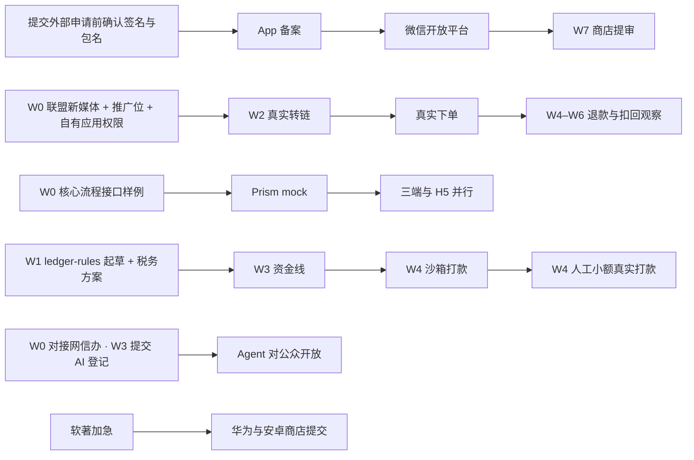

# 返利 App 规划文档 · 05 里程碑与任务拆分

2026-09-29（W0 第 1 天）；2026-09-30 按 `规划/08_业务规则/`、`规划/09_平台能力验证/`、`规划/10` 修订（新增 §0 阶段、§3.8 质量、§5「W1 人工清单」、§8 P1；编号按 08 §13.2 改名；契约守护任务改为 CT-xx，避免与 08 §14.3 分歧 C-xx 同名）· 按默认决策 D3–D6、D9–D14、D16–D18、D20–D22 排期（D7 于 2026-09-30 确认首版暂不接入淘礼金；D8 于 2026-10-01 确认两级计酬、间推开关默认关闭；D15 于 2026-10-01 确认美团延到 P1；D19 已定，D23–D28 为已确认决定，见 00 §3；D17 按功能逐步对齐、截止随功能推进；D21 系统分享面板接收默认 P1、不计入 S1 出门，D22 微信查券 P2，见 §8）；2026-10-01 按拍板第二批（`docs/changes/20261001-拍板第二批.md`）与 9-30 拍板第一批重排：鸿蒙与 iOS / Android 同步交付、W5 内测三端一起（D4，TECH-01）；仓库全部公开 + 私有存储（D18，TECH-02）；月结入账、自动到账、银行卡、劳务协议、客服工单、账号并入等任务；TypeSafe Jev 接入步骤（JEV-01～06）。任何决策被推翻，先改本文再派任务。业务规则只引用 08 的 BR 编号，平台能力只引用 09 的 CAP 编号，验收用例只引用 10 的 AC 编号。2026-10-01 用语同步（ADR-0001，规划/11 §9.1）：CT-14、B1-01、B1-12、QA-02 中被取代的技术名词与「CI 拉私有库」的写法改为现行说法，任务范围不变。

---

## 0. 按用户流程分阶段

**本轮范围（00 D7、D25–D28）**：首版服务新老返利用户，优先验证 Agent 是否更准确、更省操作；淘礼金后续接入、未排期；保留三端原生壳。以下分线、周次、接口与工具链均为当前工作计划，随开发和新文档接入调整，不代表冻结；已确认决定的变更按 00 处理。逐页实现方式见 01 §4.2，前端技术总览见 03 §1.2。

周计划（§1）管日历，阶段管"用户能不能走完一条流程"。阶段出门**按平台分别判定**：淘宝、京东、拼多多三家同时接入、同时验证、独立验收、独立放量（`convert.enabled.<platform>`，BR-PROD-10）；任何一家权限未下或未出门，不阻塞另外两家；人工时间不够时淘宝优先。出门判定口径见 10 §0.6，完整出门条件以 10 §1 为准，本表只列要点。

| 阶段 | 交付的用户结果 | 主要任务 | 出门标准（按平台，要点） | 周次 |
| --- | --- | --- | --- | --- |
| **S0 能力验证**（三家并行） | 三家各自证实：能识别商品、能取到符合口径的价格、能转链、订单能归到正确用户 | 09 README §7 验证计划 V-01…V-33 中的三家任务（W0 见 §7.1，W1 见 §7.2，W2 见 §7.3，不在此复制）；探测框架 V-08（B1）；探测 App V-37（IOS / AND / HM，APP-14、HM-09） | ① 该平台 S1 能力门槛（09 README §1.1：CAP-<平台>-01、02、05、06、07、11、12 + CAP-X-09、CAP-X-02）为"支持"或"部分支持（降级已验收）"；② BR-PRICE-02 价格对照签字；③ BR-ATTR-04 判定通过；④ 双向验证（AC-S1-28-<平台>，BR-ATTR-28）通过 | W0–W2；审批触发日 10-12（09 README §7.0，到期未批该平台转回放开发） |
| **S1 核心购买** | 发链接 / 搜索 / Agent → 看券、券后价、预估返利、预估返后价 → 跳转购买 → 看订单状态 | B1-02…10、B1-12、B1-18、B1-19、B1-20、B1-22（B1-17 预埋待负责人确认，BR-WATCH-19）；B2-03；B3-01…08、B3-11、B3-12（开关默认关）；APP-02…08、APP-10；HM-02…06、HM-08（与 APP 同周，TECH-01）；F1-01、F1-07 | S0 已出门；10 §2 的 AC-S1-01…71 适用项通过（2.8 入口扩展不计；AC-S1-71 随分享上线）；每平台真实订单 ≥20 笔、跟单成功率 ≥95%（BR-ATTR-23）；付款到入库 P95 ≤5 分钟（10 §1） | 开发 W1–W3；真实下单 W2 起；最早放量 W5（M3 内测） |
| **S2 返利处理** | 月结入账、退款、扣回、补差、提现（自动到账、银行卡、劳务协议）及异常处理 | B2-01…12、B1-09、B1-13、B1-21、F1-07、F1-08、APP-09、HM-08、QA-01…04 | S1 已出门；10 §3 的 AC-S2-01…60 适用项通过；能力门槛另加 CAP-<平台>-04、08a、CAP-X-06、CAP-X-08；打开 `credit.enabled.<platform>` 前须有 BR-CALC-03 验证证据，且该平台 CAP-<平台>-08 的 08b（首个月结对账）已通过，未通过前该平台批次顺延（负责人 2026-10-01） | 回放全链路 W4；完整验收淘宝、京东 11-27，拼多多 = 实测结算日 +7 天（09 README §1.1） |
| **S3 第一类提醒（P1）** | 为一个商品设降价提醒（目标价模式），完成查询、触发、通知、点击处理 | MVP 只做预埋 B1-17、B1-12、APP-12（BR-WATCH-19，待负责人确认）；P1 任务见 §8 | 该平台 S1 已出门（BR-WATCH-27）；10 §4 的 AC-S3-01…40 三家各跑一次、按平台独立判定（BR-WATCH-01、BR-WATCH-25）；能力门槛 CAP-<平台>-13、CAP-X-05、CAP-X-10；扩大放量按 BR-WATCH-24 | 完整观测 V-34 在 W8；开发 P1（W9 起，立项时定） |
| **S4 扩展** | 按实际验证结果增加平台与提醒类型 | 美团 B1-16（P1，D15；门槛同 S1，用 CAP-MT-*）；其余只列目标（§8） | 立项时补用例（10 §1 S4） | P1 立项时定 |

**状态记录**：任务与验收用例的状态分三栏记录，互不代替（10 §0.6、§5.2）——**代码已提交**（PR 已合并）→ **已验收**（关联 AC 在 `evidence/acceptance/records.csv` 中结果为 pass 或 waived，验收人、日期、证据路径齐全）→ **已上线**（上线版本、日期已填且该平台开关已对真实用户打开）。本文任务表只写计划，不写状态；周五清单（§6）三种状态分别统计。

---

## 1. 周计划

W0 = 09-29（周二）→ 10-04（周日），之后每周一开始。**10-01 起国庆假期**（具体安排以国务院通知为准），外部审批大概率停摆，所以**所有外部申请必须在 09-29、09-30 两天内提交**。双11：10-15 开预售，10-20 付尾款，现货售卖到 11-13〔BBT-1111·中，以天猫官方公告为准；09 U-83〕。

**2026-10-01 说明**：代码仓库尚未建立，W0–W1 的仓库、脚手架与 CI 排期以 `规划/11` §9 为准（原「W0 末四个仓库脚手架、CI 全绿」不再成立）；下表 W0、W1 行保留为范围说明，后续周次待 规划/11 §9.2 的 10-14 复盘后重排。

| 周 | 日期 | 代理主线 | 人工关键路径 | 周五验收门 / 里程碑（M0–M4 日期为该周周日，M5 为 W8 起；见 00 §5） |
| --- | --- | --- | --- | --- |
| W0 | 09-29 → 10-04 | 核心流程接口草案与样例、状态机（订单、提现）、生成器、四个仓库脚手架、CI 门禁、guard 脚本；探测框架 V-08、探测 App V-37 | **09-29/30 提交全部外部申请**（含 09 README §7.1 的 V-01…V-09、V-38）；处理 D3–D18 中仍待决策的项、D21（D7 已定；D17 随功能推进；D20 随后续淘礼金接入处理）（D22 截止 W8）与 08 §14.4 中最晚 W0 末的 3 项；财务会议定账务与税务原则；准备录制脚本 | **M0**：核心流程接口样例可联调；三端与 H5 对 Prism mock 跑通登录→搜索→转链样例；CI 在空仓库上全绿；鸿蒙生成器样例编译通过 |
| W1 | 10-05 → 10-11 | 后端：身份、风控中间件、联盟 Adapter（回放）、推广位登记与 pending → active 关卡（B1-19，W2 真实转链的前提）、搜索、详情、转链；三端（含鸿蒙）：壳 + 隐私闸门 + 容器 + 桥 + 登录；H5：脚手架 + 一致性测试页；内容后端；埋点规格 CT-13 | 首批联盟录制（搜索、详情、转链、备案、订单各状态）；经营数值不再 W1 签字：开发期占位值，上线前超管在后台填写（拍板第二批 §8 ADD-03）；域名表与 scheme（TECH-26）；推送聚合选型（TECH-14）；Q-G11 华为答复（决定鸿蒙华为账号登录是否提前，§3.7）；设计参考与令牌；能力验证 V-10…V-21（人工约 52 小时，超载，按 §5「W1 人工清单」取舍）；每个平台放量前完成双向验证（AC-S1-28-<平台>，BR-ATTR-28），证据路径写入验收记录 | 桥一致性页三端通过（三端同步，TECH-01）；AC-ACC 自动化 ≥80%；探测 App 三端装机（V-37） |
| W2 | 10-12 → 10-18 | 后端：订单同步与归因、`parse_input`、邀请绑定、账号并入与昵称（B1-20）、站长联盟授权到期管理（B1-22）、价格变更历史写入（B1-17，BR-WATCH-19 待负责人确认，确认前不开工）；资金线：分录与分佣；Agent：模型网关、SSE、工具、Jev 结果核对影子模式（B3-12）；三端（含鸿蒙）：搜索、详情、授权、外跳、剪贴板；H5 内容页；后台脚手架 | 真实转链与首笔真实下单走 staging 测试推广位（TECH-08）；三端真机各平台首笔真实下单（09 README §0.2 硬规则 5 限额）；鸿蒙真机验证百川与各平台归因；10-12 审批触发日（09 README §7.0） | **M1**：AC-LINK / AC-ORD 回放自动化 ≥80%；真实订单被同步并归到正确用户——按平台分别判定，权限未下的平台转回放开发，不阻塞其他平台 |
| W3 | 10-19 → 10-25 | 资金线：月结出账与批量入账、扣回、提现（含劳务协议、银行卡收款）、自动到账判定、打款（沙箱）；Agent：编排、护栏、素材结构化与未知权益提示、查单工具；三端（含鸿蒙）：订单、钱包提现、Agent 页；后台：用户、订单、找回、客服工单 | 推荐条件匹配与无结果解释试用；评测集人工标注；AI 登记材料提交 | **M2 go/no-go**：资金属性测试全绿；Agent 评测 v1 达门槛；Jev 结果核对按验收线决定开关（不达标关闭、不影响 Agent，JEV-03）；决定砍项 |
| W4 | 10-26 → 11-01 | 后台：月结账单、提现审核与批量打款、对账、人工调账、首页配置、配置中心（含自动到账设置、文案语义预检 JEV-05）；三端（含鸿蒙）：首页 SDUI、我的与设置、推送；后端收尾 | 沙箱打款演练；人工小额真实打款（≤1 元、≤5 笔）；隐私检测工具；SDK 清单核对（TECH-03） | 回放全链路"跟单 → 预估 → 月结批次入账 → 扣回 → 提现"通过；后台改首页不发版 |
| W5 | 11-02 → 11-08 | 联调修复；三端内测包（iOS、Android、鸿蒙一起，TECH-01）；压测与故障注入 | TestFlight、Android 第三方分发平台（TECH-18）、鸿蒙 AGC 测试；白名单 ≤500 人；大促预案 | **M3 内测**：三端内测包发出（维持 W5 白名单内测、W8 公开上架，M-公开项留在 W6–W7，拍板第二批 TECH-25）；人工打款演练记录；k6 报告；某平台打开 `credit.enabled.<platform>` 前须有 BR-CALC-03 验证证据与该平台 08b 通过 |
| W6 | 11-09 → 11-15 | 双11 期间只修缺陷；注销、分享、华为账号登录（客户端与后端，W7 首次提审前完成；鸿蒙内测包须经华为审核时鸿蒙端提前到 W4，§3.7） | 值守；观察退款与扣回 | 无资金差异；三端注销与分享冒烟通过 |
| W7 | 11-16 → 11-22 | 提审修复（三端） | 各商店提交，处理驳回；审核材料包 | **M4 提审**：各商店首次提交 |
| W8 | 11-23 → 11-29 | 上线值守；P1 排期 | 公开上架；Agent 登记号填好即对所有人开放（AI-06） | **M5 公开**：上线门槛指标达标；首个月结账单日 11-24 跑通出账；淘宝、京东 08b 对账 11-27 完成前其 `credit.enabled` 保持 off、批次顺延，08b 通过后再确认执行首个批次（拼多多按其 08b 截止） |

---

## 2. 代理分线

线名与任务编号不变。谁实现、谁写规则测试、谁评审，按 `规划/11` §1.1 的默认分工（2026-10-01 取代原「账号 · 会话」安排：一个 Claude 编排会话调度 Codex 与 Claude 子代理）。CT 在旧文档中也称“契约守护”，仅代表接口协作职责。

| 线 | 默认分工（实现 · 规则测试 · 对抗评审） | 负责范围 | 启动 |
| --- | --- | --- | --- |
| **CT** 接口与公共规格 | Claude 子代理 · Codex 写一致性测试 · Codex 只读评审；同时只 1 个在途 | `contracts/**`、`specs/**`、生成器；按功能逐步维护 | 按需 |
| **B1** 交易后端 | Codex · Claude 写 AC 映射测试 · Claude 新子代理评审。其中 orders、linking、union 属归属：Claude 先写规则测试，评审加 Codex 新只读会话（RV2） | identity、risk、union、catalog、parsing、linking、orders、growth、notification | W0 脚手架 / W1 |
| **B2** 资金后端 | Codex · Claude 先写规则测试（先红）· Claude 新子代理 + Codex 新只读会话（RV2） | 账务、分佣、入账、扣回、提现、打款、对账、税 | W1 周三 |
| **B3** Agent 后端 | Codex · Claude 写评测集与注入集（放私有库）· Claude 新子代理评审 | agent、taolijin、`evals/`、`prompts/` | W1（评测框架）/ W2 |
| **F1** H5 + 后台 | Codex · Claude 做 Playwright 冒烟 · Claude 新子代理评审；提现、调账页面按 RV2 | `apps/h5`、`apps/admin`、content 模块后端、admin 模块 | W0 |
| **IOS** iOS | Claude 子代理（独立 worktree）· 同线写快照与冒烟，Codex 写桥一致性用例 · Codex 只读评审 | `rebate-ios`（三端参考实现，先行一步）；探测 App iOS 版（V-37） | W0 |
| **AND** Android | 同 IOS | `rebate-android`；探测 App Android 版（V-37） | W0 |
| **HM** 鸿蒙 | 同 IOS | `rebate-harmony`（与 iOS / Android 同步交付，D4，拍板第二批 TECH-01）；探测 App 鸿蒙版（V-37） | W0 |
| 交叉评审 | 实现方之外的另一家，每次新开会话；资金与归属两家都审 | 评审口径与发现分级见 规划/11 §3 | 按 PR |
| 编排 | Claude 主会话 | 台账、派工、提交、推送、合并、验收记录（规划/11 §2） | 建库后常驻 |
| 调研 | grok | 产出放 `docs/research/`，标不可信，只作参考 | 按需 |

- 在途任务从 2 个起步，稳定后不超过 4 个；契约、迁移、依赖任务各自串行；资金任务每模块 1 个、全局 ≤2 个（规划/11 §3.4）。
- 每个任务在独立 worktree 中工作；iOS 与鸿蒙每个任务使用独立的 DerivedData / 模拟器或真机。
- 接口需要改动时，由当前任务负责者同步草案、实现与调用方，按影响范围检查兼容性；涉及已确认业务决策再请负责人确认。
- 上表是默认分工：不按额度改派（规划/11 §1.3，Codex 额度不设限制）；超限换家按 规划/11 §2.5，但资金与归属的实现方和规则测试作者不得是同一家模型。

---

## 3. 按线任务清单

**任务状态与拆分以 `rebate-platform/ops/tasks/` 台账为准**（规划/11 §2.1；格式见 `docs/templates/task-ledger.md`）：编号沿用本文，拆分加后缀，本文任务表只写计划。测试由谁写见 规划/11 §1.1（实现者不写自己的规则测试）。

任务粒度 0.5–2 个代理日。开工前写清本次预期结果；已有 AC 时直接引用，没有时可先记录输入、预期输出与验证方式，不必等全部规格和测试文件齐备。任务完成时给出相应检查结果。编号格式 `<线>-<序号>`；iOS / Android 共用 `APP-xx`，鸿蒙 `HM-xx`，契约守护 `CT-xx`（08 §13.2）。**`CT-xx` 是本文契约任务，`C-xx` 一律指 08 §14.3 跨主题分歧**，两者不混用。

**关联列**写需求与规则编号：`AC-<EPIC>-nn` 与 01 的 `F-<EPIC>-nn` 同号，只写 AC；BR 见 08；CAP 见 09（`CAP-*-nn` 表示三家同号能力）；首个流程用例 AC-Sx-nn 见 10，按阶段归属见 §0。规则细节只在 08 维护，本表不复述。**验收列**写关联 AC 以外的完成标志，"—"表示关联 AC 全绿即完成。状态按 §0 分三栏记录。

### 3.1 CT 接口与公共规格

| 任务 | 内容 | 截止 | 依赖 | 关联 | 产出 |
| --- | --- | --- | --- | --- | --- |
| CT-01 | `enums/*.yaml`、`error-codes.yaml`：按 `04` 第 2、7 节，合入 08 §13 新增值（含 scene 新增 `watch_alert`、通知分类 service / subscription / marketing，待负责人确认）；码值只按 08 §13.11 唯一分配表 | W0 周三 | — | 08 §13.2–13.11；08 §14.3 分歧 C-03；BR-WATCH-19 | 可生成的枚举与错误码 |
| CT-02 | `openapi.yaml` v0.9：先覆盖登录→搜索→转链所需接口，每个接口至少 1 个 example；其余随功能补齐；`x-signed`、`x-auth` 扩展；按功能先写契约、代码按它校验，禁止反向生成覆盖（TECH-05）；只用四个生成器都支持的 OAS 3.1 写法（TECH-27） | W0 周五 | CT-01 | 08 §13.9 | Prism 可启动 |
| CT-03 | `bridge.schema.json`（含 `net.signedRequest` 的 `signed_paths` 白名单，TECH-30）、`routes.json`（`since` 按端，TECH-07；跳转统一 `{route, params}`，TECH-04）、`apps.json` | W0 周五 | — | CAP-*-11、CAP-X-04 | 桥类型、路由表、外跳表 |
| CT-04 | `state-machines/order.yaml`（按 08 §14.3 分歧 C-01 裁决，默认双状态）、`withdrawal.yaml`（含 W9、W10）+ TS / Swift / Kotlin / ArkTS 生成器 | W0 周六 | CT-01 | BR-FUND-01、BR-WDR-08 | `transition()` 与测试 ID |
| CT-05 | 生成与分发流水线：tag → 制品 → 自动向三端开 PR；`contract.lock`；鸿蒙生成器 3 个样例接口编译通过 | W0 周日 | CT-02 | — | M0 准入 |
| CT-06 | CI 门禁：oasdiff（`fail-on: ERR`）、operationId 与路由一一对应检查、生成物无漂移且四端生成物同时编译（TECH-27）、gitleaks、隐藏 Unicode 扫描 | W0 周日 | CT-02 | — | 空仓库全绿 |
| CT-07 | `home-schema.json` + `fixtures/home-golden/*.json`（含未知 type、缺字段、超长文案、空数据源；`popup` 卡、按端 `min_app_version`、人群条件，TECH-07、TECH-12、OPS-05、OPS-10） | W1 周二 | CT-02 | AC-HOME | 三端渲染器输入 |
| CT-08 | `agent-stream.schema.json` + `fixtures/agent-streams/*.ndjson`（正常、工具失败、取消、断线、未知卡片、error、降级） | W1 周三 | CT-02 | AF-01…11 | 三端 Agent 页可先开发 |
| CT-09 | `specs/client-behavior.md`：错误码动作、Token 刷新、外跳降级顺序、`pending_action`、隐私闸门、格式化规则 | W1 周一 | CT-01 | BR-ID-10、BR-TEXT-14 | 三端共用 AC |
| CT-10 | 其余状态机：claim、union_binding（按 BR-ID-19、BR-ID-20；08 §14.3 C-05 已随拍板第二批 §8 ADD-01 结案，无用户自助换绑）、deletion（含 deleting） | W1 周五 | CT-04 | BR-ATTR-07、BR-ATTR-17～20、BR-ID-19、BR-ID-27 | |
| CT-11 | `design-tokens.json`（人提供参考后整理） | W1 周三 | 人：品牌素材 | — | 三端与 H5 令牌 |
| CT-12 | 共用术语引用 08 README §1；已确认决策集中维护在 00。仅对影响较大的技术取舍按需补 ADR，不为每个 D 编号重复建文件 | 按需 | — | 00 D27；08 §1、§13.1 | 可追溯的设计理由 |
| CT-13 | `specs/events.yaml`：埋点事件、字段、公共字段与游客登录后的关联方式，生成三端与 H5 的 Tracker 代码（拍板第二批 TECH-21） | W1 周二 | CT-01 | F-OBS-03 | 三端与 H5 埋点只能调用生成函数 |
| CT-14 | 公开仓库与私有存储边界：私有仓库 `rebate-private`（提示词、评测、联盟与模型录制、风控参数种子）与 OSS 私有 bucket `evidence` 的目录约定；公开仓库的 CI 不持有私有库凭据、只跑合成 fixture，用到真实录制的回放只在本机运行、只回写通过或失败，改动 Agent 服务的 PR 合并前由编排者按需跑冒烟回放（BR-AI-21），夜间另跑全量（规划/11 §7.3、§8；ADR-0001 §4.2 第 18 项）；gitleaks 提交钩子（拍板第二批 TECH-02、AI-11） | W0 周日 | 人：建 bucket；私有仓库由 Claude 建（规划/11 §7.3 第 1 项） | 02 §12.7、§16 | 公开仓库扫描无密钥与真实数据 |
| CT-15 | 功能对照补缺第 1 批的规格与契约落地（2026-10-03，`docs/changes/20261003-功能对照补缺.md`）：`specs/link-patterns.yaml`（平台链接形态表，category product / promo / union_host，BR-ATTR-29；具体域名与路径模式由 B1-07 按真实样本填）、`specs/client-public-ids.yaml`（客户端公开标识白名单与例外，02 §12.6）、`specs/client-security-baseline.yaml`（CSB-01～08，03 §4.8）、`specs/oauth/<provider>.md`（微信、Apple、华为授权凭证的换取或验签接口、有效期与一次性语义，按官方文档核对，BR-ID-04）、设备哈希测试向量与无效设备哈希种子（BR-ID-09）；并把该变更记录「契约待改」逐项落进 `contracts/` | W1 周三（link-patterns 的模式随 B1-07） | CT-01、CT-02、CT-03 | BR-ATTR-29、BR-ID-04、BR-ID-09、BR-ID-17；02 §12.6；03 §4.8 | 四类 specs 文件可被三端与服务端读取；契约改动通过 CT-06 门禁 |

### 3.2 B1 交易后端

| 任务 | 内容 | 周 | 依赖 | 关联 | 验收 |
| --- | --- | --- | --- | --- | --- |
| B1-01 | 脚手架：五个进程入口、platform 模块（`JobQueue` 与同事务入队、幂等、Clock、加解密、HTTP 治理）、基础表的 SQL 迁移、`pnpm dev:stack`（PG、Redis、MinIO、WireMock、Prism）；选型见 ADR-0001 | W0 | — | — | 空仓库 CI 绿 |
| B1-02 | identity：设备注册、短信、登录（短信 / 微信 / Apple）、刷新轮换、step-up、同意记录、h5-token；退出登录解除推送绑定（OPS-21）；第三方登录与第三方重新授权先取一次性的授权尝试（`POST /v1/auth/oauth-attempts`），只收授权尝试与授权凭证，身份以服务端换取或换码验签所得为准，凭证不可拼接、重放或跨用途使用（20004、50305），登录响应带 `is_new_user`；设备注册拒收无效设备哈希、记 `id_source`（2026-10-03，功能对照 G-04、G-08） | W1 | CT-02、CT-15 | AC-ACC-01…07；BR-ID-04～09、12；CAP-X-09；AC-S1-67、69 | — |
| B1-03 | risk：签名 Guard、三维限流、黑名单基础、风控状态（冻结期限与原因类别，OPS-12；订单申诉不改账户状态，OPS-07） | W1 | B1-02 | AC-RISK-01、02；BR-ID-09、31、36；AC-S1-60 | — |
| B1-04 | union：淘宝 / 京东 / 拼多多 Adapter（搜索、详情、解析、转链、备案、订单，N 取数映射）+ 治理层 + 录制回放接入。淘宝（2026-10-03）：不调链接 API，`convert` 只产出百川打开指令所需的推广位与 relation_id；搜索结果带回的推广链接按调用时的 relation_id 与推广位标记来源；`resolveLink` 按 02 §6.1 淘宝逐级解析（`tpwd.parse`、`item.click.extract` 权限待核，未获批的级在 `config/union-endpoints.yaml` 标 replay 并跳过）；淘宝 bindings 按 `auth_method` 收两种授权凭证（web_code / sdk_token），`auth_methods` 按端配置下发，凭证无效返回 30104 credential_invalid，不保存账号名（BR-ID-17 细则，2026-10-03 功能对照 G-01；sdk_token 在 CAP-TB-05 (f) 通过前只在非生产配置） | W1–W2 | 人：首批录制 | BR-CALC-03；BR-ATTR-05、27；CAP-*-01…08、12 | Adapter 回放测试；淘宝 Adapter 无任何链接 API 调用的断言 |
| B1-05 | catalog：搜索（价格区间参数、当页排序、无结果给该平台物料流前 10 个，TRADE-20；无缓存返回搜索暂不可用，TRADE-12）、详情、`product_key`、缓存、类目黑名单、热词；信息流混合三平台（TRADE-15）；淘宝检索结果里的推广链接只在「带当前用户 relation_id、用该场景推广位调用」时随 link 登记为我方推广链接，跨用户共享的缓存结果不带推广链接（BR-ATTR-27 淘宝行，2026-10-03） | W1 | B1-04 | AC-PROD-01…08；BR-PROD-02、03、07；BR-PRICE-01、02、11；CAP-*-01…03 | `deriveProductKey` 由五个入口共用；每平台同一商品跨接口派生一致的 fixture 测试；派生失败时各入口行为测试（BR-PROD-03） |
| B1-06 | linking：出卡只登记 link 与报价快照、不预转链，点击一律 `links/{id}/open` 实时转链（归属与价格复核），`convert` 只供 H5 无 link_id 入口（TRADE-03）；京东、拼多多服务端转链，淘宝改为下发百川客户端打开指令（有我方推广链接时 openByUrl 不传 pid，否则 openByCode(item_id) + pid + relation_id；归属、授权校验、价格复核与 link_logs 不变，2026-10-03，BR-ATTR-05、27）；`item_ref`；amount_unknown 拼多多经 open 带用户参数（TRADE-08）；推广位选择（只用 active 推广位）、备案触发与绑定（含 30151）、link_logs | W1–W2 | B1-04、B1-19；契约按 docs/changes/20261003-淘宝转链改客户端百川.md 补 `JumpStep` 百川参数 | AC-LINK-01…08；BR-PROD-11、BR-PRICE-12～14、BR-ID-17、BR-ATTR-03、05、08、14、27；CAP-*-05、06；CAP-TB-11 | 淘宝 open 的指令只含快照用户的 relation_id 与该场景 active 推广位；他人 link、分享 link 按 BR-ATTR-05 换身份的用例覆盖淘宝 |
| B1-07 | parsing：`parse_input` + 每类 ≥30 条真实样本 fixture（V-07）；`POST /v1/inputs/parse`；识别不到统一 30132、不出候选卡（TRADE-07）；淘宝链接 / 口令只解析出 item_id 后用基础 API 详情出卡，不做按链接转链，用户原链接与口令不作为打开目标（02 §6.1、BR-ATTR-27 淘宝行，2026-10-03）；按同一批样本整理平台链接形态表 `specs/link-patterns.yaml` 的域名与路径模式，并经 `/v1/config.link_patterns` 下发（BR-ATTR-29，CT-15） | W2 | 人：样本 | BR-PROD-03、BR-TEXT-14；CAP-*-01 | 链接识别率 ≥98%；口令识别率按平台考核，只对 CAP-<平台>-01 为支持的平台生效，其余平台断言降级路径（30132 + 标题搜索）（01 §8.1） |
| B1-08 | orders：同步任务、水位、平台状态映射、归因流水线（order_keys、attr_at、advisory 锁）、状态机、来源回填、分佣快照调用 | W2 | B2-03、CT-04 | AC-ORD-01…08；BR-ATTR-01、15、22、25；BR-FUND-01、02；CAP-*-07 | — |
| B1-09 | orders：维权 / 处罚同步、Excel 导入、手动同步、订单黑名单、大促模式 | W3 | B1-08 | AC-ORD-10、12；BR-ATTR-26（08 §14.3 分歧 C-18 待裁决）；CAP-*-08 | — |
| B1-10 | 找回：证据匹配、限制、客服确认接口 | W3 | B1-08 | AC-ORD-09；BR-ATTR-17～20 | — |
| B1-11 | growth：邀请码、绑定规则、落地页注册、剪贴板邀请口令绑定（OPS-06）（MVP 不建闭包表）；`GET /v1/me` 的 `invite_backfill`、tips 新键 `inviter_before_buy` 与两个提醒开关（F-INV-10，BR-INV-03 细则，2026-10-03 功能对照 G-05） | W2–W3 | B1-02 | AC-INV-01…06；BR-INV-01～11；AC-S1-63、68 | — |
| B1-12 | notification：模板、推送 Adapter（聚合服务选一家，鸿蒙直连 Push Kit，TECH-14）、站内消息、频控；跟单、失效、已结算、扣回按受益人扇出（OPS-02）；风控状态、申诉结果、注销进度站内信模板（OPS-15）；交易与提现归服务类，MVP 只开放服务类开关（OPS-16） | W3 | B1-01（同事务入队的任务） | AC-MSG-01…05；BR-TEXT-09；BR-WATCH-19；CAP-X-05 | 关闭服务类推送后不再推送，站内信仍在 |
| B1-13 | 实名（二要素、未成年规则）、收款账号（支付宝 + 本人借记卡：卡号校验、卡 BIN、三要素核验，FUND-03）、劳务协议版本与签署接口（FUND-05） | W3 | B1-02 | AC-ACC-08、AC-WDR-02；AC-S2-21、54、55；BR-ID-25、26；BR-WDR-02、31；CAP-X-08 | — |
| B1-14 | 外部依赖熔断与降级表落地；k6 压测脚本；故障注入 | W4–W5 | — | CAP-*-12；QA-05、06 | 压测报告 |
| B1-15 | 注销（余额为负拦截 30416，拍板第二批 §8 ADD-07）、分享（海报服务端出图，TECH-13；`GET /v1/links/{link_id}` 与 share-pages 的 `open_in_app_url`，F-SHARE-07，2026-10-03 功能对照 G-03）、华为账号登录（W7 首次提审前；鸿蒙内测包须经华为审核时提前到 W4，§3.7） | W6 | — | AC-ACC-04、10；AC-SHARE-*；BR-ID-20、27、28；AC-S2-58、60 | — |
| B1-16 | 美团 Adapter 与订单 | P1（D15） | 人：美团权限（V-38） | AC-ORD-13；CAP-MT-05～08、11、12 | — |
| B1-17 | `price_snapshot` 价格变更历史表 + 异步写入钩子（搜索、详情、查返利、转链）；MVP 不建观测、提醒相关表。MVP 范围变更，负责人确认前不开工 | W2 | B1-05、B1-06 | BR-WATCH-19、BR-WATCH-05 | 按 BR-WATCH-19 细则 |
| B1-18 | 后端规格资产：`specs/union/<platform>.md`、`specs/attribution.md`（N 取数映射附录制报文）、`specs/permissions.yaml`（按 04 §11 权限点清单生成，拍板第二批 §8 ADD-04）、`messages.yaml`；`specs/order-status-map/<platform>.csv` 随 V-22 | W1（状态映射 W2） | 首批录制 | BR-CALC-03、BR-FUND-02；CAP-*-07 | 人签字 |
| B1-19 | union：`union_accounts` / `union_pids` 最小后台接口（`admin/union-accounts`、`admin/union-pids`，04 §6）+ 种子脚本；状态 pending → active → retired，禁止物理删除；置 active 前校验 `hjy_ignore_confirmed_at` 与截图路径已填，由 super 二次验证并写审计。F1-06 后台 step-up 可用前，由种子脚本 / CLI 执行，super 用 TOTP 二次验证、写同一审计表。完整界面在 F1-10 | W1 | B1-01、B1-02 | BR-ATTR-02、03、08、28；CAP-*-05 | 三家各至少 1 个推广位经该流程置为 active，且有审计记录；pending 推广位转链被拒、订单仍计入白名单的测试 |
| B1-20 | identity：第三方空号并号（`POST /v1/me/phone` 返回 mergeable + merge_ticket、`POST /v1/auth/merge`）；`PATCH /v1/me` 只改昵称（敏感词、每月 3 次，30415）（拍板第二批 OPS-04、OPS-13） | W2 | B1-02 | F-ACC-12、13；BR-ID-06、39；AC-S1-59、AC-S1-61 | 空号并入、非空号拒绝、老号已有同类绑定拒绝的测试 |
| B1-21 | support：客服工单（类型、状态、处理人、时限、超时告警）；AI 举报自动建单；个人信息副本导出的人工流程（拍板第二批 OPS-08、OPS-19） | W3 | B1-01 | F-ADM-23、F-PRIV-10 | 超时告警实测触发 |
| B1-22 | union：站长联盟授权到期管理（拍板第二批 §8 ADD-02、ADD-08）：`union_accounts.auth_expires_at`、`last_probe_*` 等字段；每日巡检（`union.auth_probe_cron`）查到期时间并实际调用 1 次依赖该授权的接口探测是否有效；到期前 14、7、1 天及过期 / 探测失效时经阿里云短信发给 `union.auth_alert_phones` 全部号码（模板 UNION_AUTH_EXPIRING / UNION_AUTH_EXPIRED）并后台告警；过期或失效期间停调依赖该授权的接口（淘宝渠道备案、私域相关）并告警，淘宝未绑定用户的 open（含 no_rebate=true）、auth-url、bindings 返回 30101 / 30102 `auth_unavailable`；后台告警手机号配置与重新授权接口（`/admin/v1/union-accounts/{id}/reauthorize`，step-up、审计） | W2 | B1-04、B1-19 | BR-ID-24、BR-TEXT-20；CAP-TB-12、CAP-JD-12、CAP-PDD-12；AC-S1-64、65 | 注入时钟：到期前 14、7、1 天各发一次短信（每个号码 1 条）并后台提醒；探测返回授权失效即置 expired 并发短信；过期后渠道备案停调、未绑定用户不外跳且无无返利购买、已绑定用户订单归属不变；重新授权后恢复 |
| B1-23 | staging 数据库：在 staging 的 ECS 上按 ADR-0002 装 Pigsty 单节点（PostgreSQL 18 + pgvector、同机 Redis `noeviction`、OSS 备份仓库、五个角色的自写访问规则、主库与只读端口直连）；清单与包装脚本放 `rebate-private/ops/pigsty/`，密钥的值不入库；跑 ADR-0002 §10 的 staging 验证项并回写该节与 规划/11 §9.3 #8。执行人按 ADR-0002 §7（规划/11 §7.3 第 10 项确认前由负责人按 runbook 执行） | W1–W2 | 人：staging 的 ECS 与备份 bucket（06 Q-C21）；B1-01 | ADR-0002 §2、§3、§5、§10；ADR-0001 §4.2 第 8、11、14 项 | 迁移与种子在 staging 库跑通；五个角色的权限测试通过；一次备份和一次时间点恢复成功；§10 标「阻断」的 4 项有结论 |
| B1-24 | 备份与恢复演练自动化：周全量、日增量、WAL 归档到 OSS；恢复演练脚本（恢复到一次性实例 → 不变量 SQL → 分录与事件留痕核对 → 记耗时），结果写 `rebate-private/ops/drills/records.csv`，staging 每周自动跑；中文 runbook：时间点恢复、整机重建 | W3 | B1-23、B2-02 | ADR-0002 §4；BR-FUND-19 | staging 连续两次演练通过并有记录；故意删表后按 runbook 恢复成功 |
| B1-25 | 数据库告警外发：Alertmanager 接企业微信告警群；critical 级经不连数据库的转发器发短信到负责人手机；补备份过期、WAL 归档失败、恢复演练失败或超期、监控心跳丢失等规则；转发器存活与数据库 ECS 的宕机、磁盘另设阿里云云监控报警作第二条路；业务指标是否并入同一套监控，核对后再定（ADR-0002 §10 第 8 项） | W3–W4 | B1-23；人：运维告警短信模板与接收号码（06 Q-C21） | ADR-0002 §6；02 §13；BR-ID-24（做法比照） | 在 staging 停库、停归档、停监控各触发一次，短信与群消息都收到 |
| B1-26 | prod 数据库上线：三节点集群、Redis、OSS 备份仓库、加固（强制 SSL、保护开关、口令随机化与离线留存）；配置按 RV2 评审，命令只由负责人按 runbook 执行；主库切换演练与恢复演练各一次；中文 runbook：首次安装与登录管理节点、主从切换、失去多数成员、磁盘写满、补丁升级、Redis 重建、从 1 台扩到 3 台，三节点的几份在还没有真实数据时由负责人各走一遍（ADR-0002 §3） | W4（prod 承接首笔真实订单之前） | B1-23、B1-24、B1-25；人：prod 的 3 台 ECS、备份 bucket、内网入口（06 Q-C21） | ADR-0002 §3、§5、§7；02 §3.1、§14、§20；QA-05 | 切换演练中各进程自动重连、任务不丢；恢复演练通过；critical 短信实测收到；ADR-0002 §10 第 5、6 项有结论 |

### 3.3 B2 资金后端

| 任务 | 内容 | 周 | 依赖 | 关联 | 验收 |
| --- | --- | --- | --- | --- | --- |
| B2-01 | 把 `ledger-rules.md`（代理按 08 起草：科目含单一余额 `USER_BALANCE`、银行卡出金科目；经营数值用占位值，上线前超管在后台填写，拍板第二批 §8 ADD-03、ADD-06）转成科目表、分录模板、`fee-rules.csv`、`commission-examples.csv`；`packages/money`；迁移含 `commission_rules.r_indirect_bp`（CHECK 0–8000）与 `commission_rule_versions.indirect_enabled`（默认 false），种子版本间推关闭；`commission_rule_reserves`（每版本 × 平台 reserve_bp，CHECK 0–10000）与 `commission_splits.reserve_bp` / `reserve_fen`，种子版本各平台预留 0 | W1 周三–周五 | — | BR-CALC-01、02、05～08；BR-FUND-15、16 | 算例表全部通过（含间推开启、缺层、失效算例与预留非 0 算例） |
| B2-02 | ledger：账户（每用户一个余额账户，ADD-06）、凭证、分录（只插入）、余额缓存、行锁、不变量 SQL、属性测试 | W1–W2 | B2-01 | BR-FUND-13、16、19；QA-01、02 | 属性测试门槛见 10 §5.3 |
| B2-03 | commission：规则版本（含 `indirect_enabled`）、分佣快照、预估计算（纯函数，按平台 × 等级 × 订单类型）；`splitCommission()` indirect 分支（直推上级的上级按 paid_at 重放，缺层与异常同人归平台）；`splitCommission()` 与报价函数先扣所选版本该平台的 reserve_bp 再分账（BR-CALC-02，快照记 reserve_bp / reserve_fen）；规则发布接口校验（上限含间推、关闭时比例全 0、开启须 step-up（一人可完成，ADD-05）、每个平台一个 reserve_bp、修改可立即生效） | W2 | B2-01 | BR-CALC-02、04、05、07、10、12、13、17、20、22、24；BR-INV-12、13；CAP-*-04 | 算例表；属性测试：关闭时无 indirect、Σ份额 ≤ B、受益人深度 ≤ 2、Σ份额 + 平台留存 + 预留 + 淘礼金扣除 = N_base；10 AC-S2-34…43 |
| B2-04 | settlement：月结出账（账单日按联盟结算数据生成账单 → 一致性校验 → 结算批次）、确认后批量入账（立即 / 定时、PARTIAL 与继续、补充批次、结算明细上传备用）（BR-FUND-04，拍板第二批 FUND-01、FUND-07）；扣回与负余额；入账后补差（少结即扣、多结 step-up 确认后补，一人可完成，FUND-11、ADD-05）；日终校验；资产日快照（时刻按 BR-FUND-04 / 18 / 19 / 23，C-17 待财务确认） | W3 | B1-08、B2-02 | AC-SET-01…08；AC-S2-01…03、51、52；BR-FUND-04、08、09、10、18、19；BR-CALC-23；CAP-*-08 | — |
| B2-05 | 提现申请、限制规则（单一余额，每人每日 1 次、每月 10 次，拍板第二批 §8 ADD-06；劳务协议校验，FUND-05）、状态机、冻结 | W3 | B2-02、B1-13 | AC-WDR-01…05；BR-WDR-03～05、07、08、31 | — |
| B2-06 | payout 进程：PayoutChannel（AlipayChannel 沙箱；BankCardChannel 接口与关闭态：EXECUTE 跳过、W8 线下补录，FUND-03）、批次、查询与冲正、水位、单笔与单日上限 | W3–W4 | B2-05 | BR-WDR-12～14、18、28、32；CAP-X-06 | 超时 3 次后成功只打 1 笔 |
| B2-07 | 对账 R1–R3（R2 含线下转账流水号）、月末三项核对、差错单 | W4 | B2-06 | BR-WDR-23；BR-FUND-20、23；AC-S2-49、50 | 注入重复打款与漏单，次日发现 |
| B2-08 | `tax_ytd`、所得类型（全部按 SERVICE_FEE 合并累计；税率表到位前税额记 0、照常累计，FUND-04）、季度导出 | W4 | B2-04 | BR-WDR-20、21；AC-S2-44 | |
| B2-09 | 财务类后台接口（月结账单、提现审核与自动判定结果、批量自动 / 手动打款、批次、流水、对账、调账、快照） | W4 | B2-06 | BR-WDR-10、11、12、16、30；BR-FUND-04 | F1-08 可联调 |
| B2-10 | `specs/loss-scenarios.md`（资损场景 → 测试 ID 与核对规则）、`specs/creditable-events.yaml` | W1 | B2-01、首批录制 | BR-FUND-02 | 财务过目；每条场景有测试 ID |
| B2-11 | 自动到账规则组：`withdrawal.created` 消费者、逐项判定与 `auto_decision` 留痕、自动单单独成批执行、全平台日合计锁、配置保存校验；总开关默认关（BR-WDR-30，拍板第二批 FUND-02、FUND-08） | W3–W4 | B2-05、B2-06 | AC-S2-53 | 规则逐项单测 + 判定回放 |
| B2-12 | 人工调账（`admin_adjustments`：原因码、关联单据、一人发起并生效、step-up，BR-FUND-24，FUND-13、ADD-05）；注销时 ACCOUNT_CLOSED 调减单预填、注销后扣回记坏账（FUND-09）；申诉恢复差错单（FUND-14）；坏账核销一人 step-up（ADD-05） | W4 | B2-02、B2-07 | AC-S2-46、47、48、56 | — |

### 3.4 B3 Agent 后端

| 任务 | 内容 | 周 | 依赖 | 关联 | 验收 |
| --- | --- | --- | --- | --- | --- |
| B3-01 | 评测框架：jsonl 格式、回放模式（录制的模型响应 + 联盟 fixture）、报告 JSON、CI 门禁脚本；评测题与录制放私有仓库（TECH-02、AI-11）；W2 并入 Jev 辅助打分（试点 ①，只作趋势参考，JEV-02） | W1–W2 | CT-08、CT-14 | AF-01…11 | 冒烟集可跑 |
| B3-02 | ModelGateway：百炼 OpenAI 兼容接口、路由（主 Flash 档、备用 Plus 档，AI-19）、快照锁定、前缀缓存、超时熔断、跨厂商兜底、无模型降级 | W2 | — | BR-AI-14；CAP-X-07 | 故障注入测试 |
| B3-03 | RunManager + StreamWriter：SSE 帧、seq、ping、取消、断开中止、配额 | W2 | CT-08 | BR-AI-15、23 | 流输出通过 schema 校验 |
| B3-04 | 工具 `search_products`（多平台并发、过滤、去重、排序、spec 参数）、`get_rebate_quote`；确定性路径 `resolve_link`（调 parsing）、`register_links`（只登记 link 与报价快照、不预转链，TRADE-03）；逐张 `match_tag` 与服务端标签（BR-AI-24，AI-04、AI-08）；游客「登录查看返利」按平台开关（AI-03） | W2–W3 | B1-05、B1-06、B1-07 | AF-01、AF-04；BR-AI-02、08、09、11；CAP-*-03 | — |
| B3-05 | Orchestrator：单循环 function calling、上限、结果集与指代、clarify 意图（不是工具）、放宽重试；无模型降级：关键词出卡 + 固定话术，搜索也失败才 50302（AI-05） | W3 | B3-02、B3-04 | AF-05；BR-AI-02、08 | — |
| B3-06 | OutputGuard：金额 / URL / 口令过滤、按句内容安全、`<untrusted>` 定界、身份注入与拒绝 | W3 | B3-05 | AF-08；BR-AI-03～06 | 注入集 100% |
| B3-07 | 素材结构化、黑话词典与 unknown 权益提示；A/B/C 判定留待淘礼金接入后验证 | W3 | 通用素材样本 V-07 | AF-09、11；BR-TEXT-15 判定 3′；后续 AF-10 / CAP-TB-09 | 缺失规格与未验证权益不冒充确定结论 |
| B3-08 | `list_my_orders`、`explain_order`、`prefill_claim`、`search_rules`（pgvector）、`handoff_to_human` | W3–W4 | B1-08、B1-10 | BR-AI-01、07 | 越权用例 0 通过 |
| B3-09 | Trace 异步落库、👍/👎、日预算熔断、每会话成本统计 | W3 | B3-03 | BR-AI-16、19 | |
| B3-10 | 淘礼金商品池、发放、预算；仅保留后续任务位置，首版不实施（D7） | 后续接入，未排期 | B1-06；CAP-TB-09 实测与接入决策 | AF-02；F-TLJ-*；BR-CALC-19、BR-AI-17 | 接入时细化 |
| B3-11 | 模型选型与门槛：评测集 ≥300 条跑全量，选定主（Flash 档）与备用（Plus 档）快照，写入 `config.agent.models`；负责人看评测报告签字（拍板第二批 AI-19） | W3 周五 | B3-01…06 | BR-AI-21；CAP-X-07（V-29） | 达到 `01` 第 8.1 节门槛；负责人签字 |
| B3-12 | Jev 结果核对（试点 ③，拍板第二批 JEV-01～03）：`judge` 模块（独立适配层，依赖禁令进 dependency-cruiser）、锁定 `jev-1.13.0`、硬超时 400ms、录制回放；W2–W3 影子模式只记录不展示；W3 决定点按验收线开关，不达标关闭；达标则 W4–W5 在内测白名单小流量开启 | W2–W3（影子）；W4–W5 | B3-04、CT-14 | F-AGENT-19；AC-S1-31-JD、AC-S1-46；CAP-X-13（V-40） | 中文准确率、误剔除、P95 达提案 §3 验收线才开；关闭不影响 Agent 上线 |
| B3-13 | Agent 固定话术（拒答、需要登录、需要绑手机、出错、降级）接入字典；话术由代理按 08 起草、过禁用词检查后负责人过目（AI-21、AI-22） | W3 | B3-05 | BR-TEXT-14、16 | 负责人过目 |

### 3.5 F1 H5 + 后台

| 任务 | 内容 | 周 | 依赖 | 关联 | 验收 |
| --- | --- | --- | --- | --- | --- |
| F1-01 | H5 脚手架（三个入口）、`bridge-sdk`（调用前强制 `has()` 检查的 lint，TECH-28）、一致性测试页、白屏检测与失败重试页（TECH-20）、版本化部署与入口灰度（TECH-28） | W0–W1 | CT-03 | BR-ID-32 | 一致性页可在三端加载 |
| F1-02 | content 模块后端：config（含签名白名单、`h5_release` 分桶）、dict、pages（发布 / 灰度 / 回滚 / 按端门槛过滤；可选令牌判人群、device_id 分桶，OPS-05、TECH-07；草稿预览 token，TECH-11）、articles、agreements（含劳务协议与需重签、提高最低版本须 step-up + 法务确认，FUND-05、OPS-14）、app versions（按端与渠道，TECH-19）、kill switches；含跳转目标或外链的资源保存与发布时拦下指向联盟平台网页域名的 ExternalPage 目标（BR-ATTR-29 ①，开关 `external_page.union_host_block`，2026-10-03 功能对照 G-02） | W1–W2 | CT-02、CT-07 | AC-HOME-01、07；AC-CFG-* | — |
| F1-03 | H5：规则、帮助、公告、协议 | W2 | F1-02 | — | |
| F1-04 | H5：收益明细、订单找回、消息中心 | W2–W3 | B2-02、B1-10、B1-12 | BR-FUND-15、18；BR-ATTR-17 | |
| F1-05 | H5：邀请好友、邀请落地页（微信内） | W3 | B1-11 | AC-INV-02；BR-INV-05、18 | — |
| F1-06 | 后台脚手架：登录 + TOTP、IP 白名单、CASL（按权限点）、审计、step-up 弹窗、data provider；后台账号与权限页（`admin_permissions`，超管全有、其他账号逐项勾选，F-ADM-24，拍板第二批 §8 ADD-04） | W2 | admin 模块 | AC-ADM-01…03；BR-ID-34；AC-S2-59 | — |
| F1-07 | 后台：用户查询（按 04 §11.1 数据权限点）、订单查询与归属变更、找回工单、维权导入、手动同步、联盟授权重置 / 停用 / 恢复（OPS-11）、封禁与冻结（OPS-12）、客服工单页（OPS-08） | W3 | B1-08…10 | AC-ADM-04…06；BR-ATTR-18、20 | — |
| F1-08 | 后台：月结账单（确认立即 / 定时、撤销、驳回、继续执行、补充批次、上传备用，FUND-01、FUND-07）、提现审核（含自动到账判定结果）、批量打款、银行卡线下补录、流水、对账与差错单、人工调账、坏账核销、资产快照 | W4 | B2-09 | AC-ADM-07、08；BR-WDR-10、11 | — |
| F1-09 | 后台：首页配置（JSON Schema 表单 + JSON 编辑 + 近似预览 + 草稿二维码，截图可选，TECH-11；popup 卡，TECH-12；发布灰度回滚）、商品池（淘礼金池后续接入） | W4 | F1-02 | AC-ADM-09、10 | — |
| F1-10 | 后台：配置中心（经营参数编辑、校验、发布、生效范围与历史版本；含自动到账设置，FUND-02）、紧急开关、内容 CMS（保存运营文案时语义预检只标黄，JEV-05）、消息模板、联盟账号与推广位完整界面（pending → 填花卷云确认信息 → super 二次验证后 active；站长授权到期与重新授权，F-ADM-16、ADD-02；后端接口与关卡由 B1-19、B1-22 交付，本任务只做界面）、版本管理、风控、Agent trace、3 张报表；分佣规则页间推开关与比例列、试算间推份额列、开启间推的 step-up 发布（一人可完成，ADD-05，F-ADM-21）；分佣规则页每个平台的「预留比例」输入、缺平台时发布拦截、试算预留列（F-ADM-22） | W4 | 各模块、B1-19 | AC-ADM-12…22；F-CFG-07；BR-ATTR-03、28；BR-CALC-02、05、22 | 10 AC-S2-37、AC-S2-43 |
| F1-11 | 分享中间页（含浏览器内【在 App 中打开】、微信内引导用浏览器打开、未拉起时的下载入口，F-SHARE-07，2026-10-03 功能对照 G-03）、域名可访问性检测与告警 | W6 | B1-15 | AC-SHARE-04；CAP-X-03；AC-S1-71 | — |

### 3.6 IOS iOS / AND Android（同一清单，iOS 先行半步）

| 任务 | 内容 | 周 | 依赖 | 关联 | 验收 |
| --- | --- | --- | --- | --- | --- |
| APP-01 | 脚手架（iOS：XcodeGen + SPM 模块；Android：多模块 + convention 插件）、生成代码接入、lint、CI、Maestro 框架 | W0 | CT-05 | — | CI 绿 |
| APP-02 | AppShell：启动、隐私闸门、基本模式、Tab、Router（`{route, params}`，TECH-04）、深链、强更全屏拦截页（TECH-19） | W1 | CT-03、CT-09 | AC-PRIV-01…03；BR-ID-11 | — |
| APP-03 | Core：网络中间件（公共头含 X-Channel，TECH-18；签名、单飞刷新；10 秒超时与读接口重试 1 次，TECH-20）、设备注册（无效设备标识不注册、不上报，Android 只用 ANDROID_ID，BR-ID-09，2026-10-03）、ConfigStore + LKG、ErrorActionMapper、Tracker（按 events.yaml 生成，TECH-21） | W1 | CT-02 | BR-ID-07、09；BR-TEXT-14 | 对 Prism 的 Repository 测试 |
| APP-04 | TrustedWebView / ExternalWebView + BridgeHost（origin、frame、级别、手势）+ 一致性测试；ExternalWebView 导航规则（平台商品页转回原生详情，BR-ATTR-29，03 §5.1）与证书错误一律取消（03 §4.8）（2026-10-03） | W1 | F1-01 | BR-ID-32 | 一致性页全部通过（W1 门） |
| APP-05 | 登录（短信 / 微信 / Apple；第三方登录只上送授权凭证，BR-ID-04）、绑手机、空号并入引导（OPS-04）、第三方新号绑手机引导与首次购买前提示（F-INV-10，2026-10-03）、`pending_action`（华为渠道包的华为账号登录在 APP-13，F-ACC-04） | W1–W2 | B1-02 | AC-ACC-01…05；BR-ID-04、10 | — |
| APP-06 | 搜索、商品详情（按钮文案、预售标签、可返利金额未知，TRADE-08、10、21）、AuthSheet（淘宝授权按下发的 `auth_methods` 执行，两种方式都实现，BR-ID-17 细则，2026-10-03）、open 购买（8 秒超时提示与同键重试，TRADE-22）、TradeJump（apps.json、百川）、JumpTip、`link_jump` 上报 | W2 | B1-05、B1-06 | AC-LINK-*；BR-ATTR-21、BR-ID-17、18、BR-PRICE-13、14；CAP-*-11 | 按平台：联盟权限已批的平台真机真实下单；10-12 仍未批的平台以回放完成，获批后补测（09 README §7.0） |
| APP-07 | 剪贴板识别（含邀请口令，商品优先，OPS-06） | W2 | B1-07 | AC-CLIP-01…04；BR-ID-16；CAP-X-02 | — |
| APP-08 | 原生订单列表与详情（商品图、实付、件数、订单号：自购单完整可复制、分享单脱敏，TRADE-06 与拍板第三批；预计结算月份，OPS-01；「为什么没返利？」直接显示，AI-09；断网显示上次数据，TECH-20）、H5 订单找回入口（01 §4.2） | W3 | B1-08 | AC-ORD-07；BR-FUND-17、BR-ATTR-17 | — |
| APP-09 | 钱包、提现、实名、收款账号（支付宝 / 银行卡，FUND-03）、劳务协议签署（FUND-05）、自动到账文案（OPS-17）、step-up | W3–W4 | B2-05、B1-13 | AC-WDR-01…09；BR-FUND-18、BR-WDR-25 | — |
| APP-10 | Agent 页：StreamClient、StreamReducer（fixture 驱动）、卡片渲染器（match_tag、登录查看返利，AI-03、04）、购买流程、同意与标识 | W3–W4 | CT-08，W3 起连真实后端 | BR-PRICE-13、14；BR-AI-06、13 | 7 类流 fixture 快照一致 |
| APP-11 | 首页 SDUI 渲染器 + golden 截图 + 三级兜底（有缓存立即显示，TECH-10）+ popup 卡（TECH-12）+ HomePreview（TECH-11） | W4 | CT-07、F1-02 | AC-HOME-01…06 | — |
| APP-12 | 我的（昵称修改、邀请码、邀请人「已绑定」，OPS-13、OPS-20）、设置、隐私中心、关于（含 AI 公示）、封禁说明与申诉页（OPS-12）、消息入口、推送、服务类推送开关（OPS-16） | W4 | B1-12 | AC-PRIV-04…07；AC-MSG-*；AC-S1-60～62；BR-ID-15、BR-WATCH-19；CAP-X-05 | — |
| APP-13 | 注销、分享、`LinkLanding`（分享链接在 App 内打开，F-SHARE-07，2026-10-03）；华为渠道 Android 包的华为账号登录（F-ACC-04，M-公开，W7 首次提审前完成） | W6 | B1-15 | BR-ID-27 | |
| APP-14 | 探测 App（独立于正式客户端，最小版本）：X-01 分享回显、X-02 剪贴板页、各平台跳转页与 link_jump 上报、TB-05 备案回调页与 SDK 换令牌页（CAP-TB-05 实验 (f)，2026-10-03） | W0–W1 | 06 Q-H2–Q-H4 真机 | V-37；CAP-X-01、X-02、TB-05、*-11 | W1 周三前装到真机，人验收 |

### 3.7 HM 鸿蒙（D4：与 iOS / Android 同步交付，拍板第二批 TECH-01）

鸿蒙不再晚 2–3 周，各任务与 APP 同周交付，W5 内测三端一起发包（2026-10-01 重排；原 HM-05 W2–W3、HM-06 W4、HM-07 W5–W6、HM-08 W6–W7）。W3–W4 鸿蒙线满载，§2 并行会话超限时让出 F1 非资金页，不让出鸿蒙。某平台在鸿蒙端归因验证不通过（HM-04、CAP-X-04）时只关闭该平台的鸿蒙购买按钮（10 AC-S1-18-*），不阻塞鸿蒙其他功能与 iOS / Android。

**华为账号登录**：维持 W6 完成、W7 首次提审前可用（HM-10、B1-15、APP-13）。例外：若 06 Q-G11（W1 华为答复）确认鸿蒙内测包须经华为审核且审核要求提供华为账号登录，则鸿蒙端华为账号登录与后端 `POST /v1/auth/login/huawei` 提前到 W4（与 HM-08 同周），随 W5 内测包发出；华为渠道 Android 包仍按 W6。

| 任务 | 内容 | 周 | 关联 |
| --- | --- | --- | --- |
| HM-01 | 脚手架（HAR 模块、hvigor、codelinter、Hypium、UiTest 框架）、`docs/harmony-ref/` 文档镜像、生成代码接入；最低兼容 API 20（TECH-17） | W0 | — |
| HM-02 | AppShell、隐私闸门、Router（Navigation）、Core 网络与配置、强更拦截页 | W1 | AC-PRIV-01…03；同 APP-02、03 |
| HM-03 | 可信容器 + `javaScriptProxy` 权限配置 + 一致性测试 | W1 | BR-ID-32；同 APP-04 |
| HM-04 | **真机归因验证**：百川鸿蒙版 relation_id、京东 / 拼多多 scheme 与 App Linking 是否保留归因（与人一起，留证据） | W1–W2 | V-15、V-25；CAP-TB-11、JD-11、PDD-11、CAP-X-04 |
| HM-05 | 登录（短信、微信）、搜索、详情、open 购买、外跳、`PasteButton` | W2 | 同 APP-05～07 |
| HM-06 | 原生订单列表与详情、H5 订单找回入口（01 §4.2） | W3 | 同 APP-08 |
| HM-07 | 首页 SDUI（有缓存立即显示、popup、HomePreview） | W4 | 同 APP-11 |
| HM-08 | 钱包、提现、实名、收款账号、劳务协议（W3）；Agent 页（W3–W4）；我的、设置、隐私中心、Push Kit 推送（W4） | W3–W4 | 同 APP-09、10、12 |
| HM-09 | 探测 App 鸿蒙版：X-04 Demo、PasteButton 页、跳转页、淘宝授权的 SDK 换令牌页（CAP-TB-05 实验 (f)，2026-10-03） | W0–W1 | V-37；CAP-X-04、X-02 |
| HM-10 | 注销、分享、`LinkLanding`（同 APP-13）；华为账号登录（F-ACC-04；W6，按上文条件可提前到 W4） | W6 | 同 APP-13 |

### 3.8 质量任务（各线分担，门槛见 10 §5.3）

| 任务 | 内容 | 线 | 周 | 关联 · 验收 |
| --- | --- | --- | --- | --- |
| QA-01 | 资金属性测试集（10 §5.3 的不变量；每 PR 1 万次、夜间 100 万次） | B2 | W2–W3 | BR-FUND-16、19；全绿 |
| QA-02 | Testcontainers 真实 PG 并发：双提现、同一结算批次并发执行两次、任务重复投递 | B2 | W3 | BR-WDR-07；不变量成立 |
| QA-03 | 回放 E2E：跟单 → 预估 → 收货 → 月结账单日出账 → 确认 → 批次入账 → 扣回 → 提现（含自动到账），注入时钟压缩为 1 天 | B1 + B2 | W4 | AC-S2-*；W4 周五门 |
| QA-04 | staging 每日"一个月压缩为一天"全流程（含月结账单日与人工确认的自动化替身）+ 生产只读不变量 SQL | B2 | W4 起 | BR-FUND-19；差异 0 |
| QA-05 | 故障注入：联盟、百炼、支付宝超时，队列中断，开关切换；数据库主库切换（在 prod 上线前的演练里做，B1-26，ADR-0002 §3） | B1 / B3 / B2 | W4 | 演练记录 |
| QA-06 | k6 峰值 3 倍：搜索、转链、Agent SSE、同步（上游用 WireMock；真实联盟接口压测只按 09 README §0.2 硬规则 5） | B1 | W4–W5 | P95 与错误率达标 |
| QA-07 | 隐私合规自检：SDK 初始化时机、权限、剪贴板、清单一致（按 03 §3.5 SDK 清单逐项核对实际集成，TECH-03、OPS-09） | IOS / AND / HM | W4 | BR-ID-11；自检报告 |
| QA-08 | 夜间真机冒烟：1–2 台自托管 Mac 连三端真机跑 UI 冒烟与录屏，证据进私有 bucket（TECH-23、TECH-02）；PR 级单测与快照用 GitHub 托管机 | IOS / AND / HM | W2 起 | 03 §11 |
| QA-09 | 发布制品密钥扫描：三端发布流水线在上传分发前解包扫描最终制品（`.ipa`、`.apk` / `.aab`、`.hap` / `.app`），H5 与后台前端扫描构建产物目录；命中项与 `specs/client-public-ids.yaml` 的白名单和例外比对，清单外的一律阻断发布并告警（02 §12.6；2026-10-03 功能对照 G-07） | IOS / AND / HM / F1 | W4（首个内测包之前） | 02 §12.6、§12.7；植入假密钥的制品被阻断、白名单内的标识放行 |
| QA-10 | 客户端安全基线：三端按 `specs/client-security-baseline.yaml` 实现 CSB-01～07 的静态规则并接入 PR 级 CI，debug 构建同样检查；每条规则各放一个违反样例证明会失败（03 §4.8、§11；2026-10-03 功能对照 G-06） | IOS / AND / HM | W1–W2（随 APP-03、APP-04、HM-02、HM-03） | 01 §7.4；违反样例全部被拦下，主干 0 命中 |

---

## 4. 关键路径与 go/no-go

### 4.1 关键路径（都是外部或人工，不是代码）

入账（BR-FUND-04）跟随联盟月结：W2–W3 下单、10 月确认收货的订单最早在 11-24 账单日出账，经人工确认后入账；每个平台的首个月结批次须等该平台 CAP-<平台>-08 的 08b 通过（淘宝、京东 11-27，拼多多 = 实测结算日 +7 天）才执行，未通过前 `credit.enabled.<platform>` 保持 off、批次顺延（负责人 2026-10-01），此前入账到提现这一段靠录制回放 + 时钟注入验收（QA-03、QA-04；联盟回款日待核实，BR-FUND-20）。每个平台的外部依赖各走各的关键路径，任何一家卡住只推迟该平台（BR-PROD-10；09 README §7.0 触发日）。

### 4.2 W3 周日 go/no-go

**继续的条件（全部满足）**：资金不变量属性测试与并发测试全绿；打款幂等测试通过；订单同步回放场景（付款 → 收货 → 结算、预售、部分退款、维权）与月结出账回放全部通过；**至少一个平台**真实转链并同步到真实订单且归因正确；Agent 评测 v1 达门槛；三端已完成 W1–W3 的 AC（TECH-01）。Jev 结果核对按验收线决定开关，不达标关闭，不计入继续条件（JEV-03）。

**按平台判定、不阻塞 go**：其余平台真实订单未达标或联盟核心权限（备案、转链、订单）未批且无明确获批日期时，该平台 `convert.enabled.<platform>` 保持关闭、按回放继续开发，不计入上面的条件（BR-PROD-10）。

**不满足时按顺序砍**（砍到满足为止）：

1. 首页弹窗位、H5 消息中心（改为只推送）
2. Agent T4 多轮：只保留"换一批"和"换平台"
3. 鸿蒙钱包与 Agent 页延后 2 周（三端同步是已定方向，砍此项须负责人在会上确认）
4. 美团延到 P1（2026-10-01 已执行，D15）
5. W5 内测范围收窄到 iOS 单端

淘礼金已按 D7 移出首版，无需等 go/no-go 再砍；普通素材解析与 unknown 提示仍保留。

参考文档里的其他砍项（后端功能规划 §9.3：首页物料流、分享海报、Agent 收窄为 T1 + T5 + T6、请求签名改 P1；开发任务拆解 §11：素材淘礼金 B 类判定、邀请绑定、首页灰度）不自动生效，需要时在 go/no-go 会上按 00 变更流程单独拍板。

**永远不砍**：隐私合规闸门、资金不变量与打款幂等、账务分录与扣回 / 负余额、日终校验、审计日志、归因与跟单（含推广位白名单与双品牌隔离）、AI 合规组件、紧急开关；BR-WATCH-19 预埋经负责人确认纳入后也不砍（事后补的代价更高）。

---

## 5. W0 逐日清单与 W1 人工清单

能力验证任务的完整定义（依赖、完成标志、证据路径）见 09 README §7.1，下表只排日期与负责人。

### 09-29（周二）

| 负责 | 事项 |
| --- | --- |
| 人 | 读 `00` 第 3.2 节，处理 D3–D18 中仍待决策的项、D21（D20 随后续淘礼金接入处理）（至少 D3、D4、D9、D10、D18；D7、D19 已定，D17 随功能推进，D22 截止 W8） |
| 人 | **在外部申请提交前确认三端签名与包名 / Bundle ID / 鸿蒙 Bundle Name**（签名一变 App 备案就要变更），记录到 `signing.md`（只存指纹，不存证书） |
| 人 | **提交 App 备案**（前置：域名已 ICP 备案，见 `06`） |
| 人 | **在淘宝联盟、京东联盟、多多进宝为新 App 建媒体与推广位**：淘宝按首版场景建位（自购、分享、Agent、兜底，同 06 Q-C16；淘礼金专属位在后续接入时建），京东、拼多多各自购、分享、Agent（06 Q-C17、Q-C18）；三家各另建 1 个查询专用推广位（pid_scene=query，BR-PROD-07）；兜底位定义前不用于转链（BR-ATTR-08）。**提交自有应用权限申请**并书面询问配额计算口径、测试单报备（V-01 淘宝、V-02 京东、V-05 拼多多） |
| 人 | 启动软著加急（名称 = 上架名）；短信签名与模板报备（V-09）；确认企业支付宝"转账到支付宝账户"开通情况与场景 |
| 人 | 创建 GitHub 组织与四个**公开**仓库（D18，拍板第二批 TECH-02）、分支保护、CODEOWNERS、gitleaks；另建私有仓库 `rebate-private` 与 OSS 私有 bucket `evidence`（提示词、评测、录制、风控参数、验收证据）。其中 GitHub 仓库、首次推送与分支保护改由 Claude 用 `gh` 执行，CODEOWNERS 改为命中保护路径先问负责人（规划/11 §7.3 第 1、4 项，负责人 2026-10-01 确认） |
| 代理 CT | CT-01 枚举与错误码；CT-12 共用术语引用与必要的设计记录 |
| 代理 B1、F1、IOS/AND/HM | 各仓库脚手架（B1-01、F1-01、APP-01、HM-01） |

### 09-30（周三，今天；国庆前最后一个工作日）

09-29 未提交完的外部申请今天全部补交（09 README §7.0）。

| 负责 | 事项 |
| --- | --- |
| 人 | 花卷云忽略配置（V-04，BR-ATTR-28，待验证）：淘宝填媒体级 mm_a_b，在 AF-07 证实媒体级覆盖前，淘宝每个推广位也逐条补填；京东、拼多多按推广位逐个填写（条数上限以花卷云后台实际为准）；截图存 `evidence/capabilities/CAP-*-05/`；之后每新增一个推广位按 B1-19 的 pending → active 流程（W4 起可在 F1-10 界面操作） |
| 人 | 百川 AppKey 三端申请与鸿蒙加白（V-03）；美团联盟媒体与 appkey 提前到今天提交（V-38，09 README 附录 A-26） |
| 人 | **财务与税务会议**：账务原则（08 §14.4 第 8、10 项：分佣基数与比例、入账时点）、税务方案 A、打款限额 A/B、垫资测算口径（经营数值不在会上定，上线前超管在后台填写，ADD-03） |
| 人 | 与属地网信办对接生成式 AI 登记（材料清单、周期）；确认千问调用主账号（与小攒分开或书面确认限流余量） |
| 人 | 申请推送厂商通道与消息分类资质（V-28，W2 前提交）、微信开放平台账号准备（备案号下来后提交）、Apple 开发者、华为 AGC 企业认证 |
| 人 | 准备联盟录制：用现有权限写好录制清单（搜索、详情、转链、备案、订单付款 / 收货 / 结算 / 失效 / 退款各 ≥3 条） |
| 代理 CT | CT-02 openapi 初稿；CT-03 桥 schema、路由、外跳表；整理 V-06 官方文档核对清单 |
| 代理 B1 | V-08 探测框架（`config/union-endpoints.yaml` real / replay / mock、`tools/probe/`、fixtures 脱敏校验接入 CI） |
| 代理 IOS/AND/HM | APP-14、HM-09 探测 App（V-37），W1 周三前装机 |

### 10-01 → 10-03（国庆）

| 负责 | 事项 |
| --- | --- |
| 代理 | 契约、状态机、生成器、CI 门禁（CT-02…CT-06）；各脚手架接入生成代码；B3：TypeSafe Jev 第 0 步本地小试验——合成中文样本测评测打分（①）与规划文档一致性检查（②），记录中文准确率与费用；不发任何个人信息，Key 只放本机环境变量（JEV-01，提案 §6）；SDK 与编码插件等 `rebate-platform` 建库时在该仓库安装，不装在规划仓库（JEV-06） |
| 人 | TypeSafe 控制台设月度用量上限 20 美元，发票与境外付款请财务确认（JEV-04）；异步审阅契约 PR（每天 1 个评审时段即可）；收集 200 条链接 / 口令真实样本（淘礼金专项样本后续接入前再收集）（V-07：三家各 ≥30 条，逐条标注商品与规格）；登录三家文档核对字段与限额（V-06，约 8 小时，可分散做）；开通探测运行环境与 KMS（V-08 人工部分） |

### 10-04（周日）

M0 验收：核心流程接口与 mock 样例可联调、相关 CI 通过、鸿蒙生成样例可用；其余接口随功能完善（D27）。未通过的项目在 10-05 周一上午补齐，否则 W1 前端线只做壳与容器，不接业务接口。

### W1 人工清单（10-05 → 10-11，按优先级取舍）

09 README §7.7 估算 W1 能力验证人工约 52 小时，另有本文 W1 人工事项，超出一人一周可用时间。取舍：淘宝 > 京东 > 拼多多（用户决策）；时间不够从表尾往后移，不删项。真实下单受 09 README §0.2 硬规则 5 限额约束。

| 序 | 事项 | 人工小时（09 估算） | 时间不够时 |
| --- | --- | --- | --- |
| 1 | 首批联盟录制（有权限的平台先录）；各平台预留比例、各等级比例、间推比例、提现限额、垫资告警线、坏账核销门槛不再 W1 给出，开发期用占位值，上线前超管在后台填写（拍板第二批 §8 ADD-03，取代 FUND-21） | 未估 | 不顺延（B1-04 依赖） |
| 2 | 淘宝：V-14 真实归因下单（双品牌交叉）、V-15 iOS / Android 唤起矩阵 | V-14 + V-15 三家合计 22 | 权限已批则不顺延；权限未批则顺延至获批后，按 09 README §7.0 处理（10-12 仍未获批记「被阻塞」、淘宝 S1 转回放开发） |
| 3 | V-11 价格对照：淘宝 → 京东 → 拼多多 | 10 | 拼多多部分移到 W2 前半周 |
| 4 | 运行探测脚本与追书面答复：V-10、V-12、V-13、V-21 | 7 | 不顺延（S1 能力门槛、令牌桶参数） |
| 5 | 京东：V-14 A–D 四单、V-15 京东矩阵 | 含在序 2 | 移到 W2 前半周 |
| 6 | 拼多多：V-14 备案矩阵与交叉下单 | 含在序 2 | 移到 W2（D+7 用例本就在 W2 末完成） |
| 7 | V-18 支付宝沙箱与小额打款、V-20 淘宝佣金公式 | 3 | V-18 移到 W2（只阻塞 S2） |
| 8 | V-16 分享回显、V-17 剪贴板矩阵 | 10 | 移到 W2 前半周，不影响 S1 放量 |
| 9 | 设计参考与令牌 | 未估 | 按 CT-11 截止（W1 周三） |
| 10 | 域名表与 scheme（TECH-26）；推送聚合在极光、个推中选一家（按是否有鸿蒙 SDK，TECH-14）；Android 内测分发平台（TECH-18） | 未估 | 域名与 scheme 不顺延（深链、落地页、CT-03 依赖）；其余可移到 W2 |
| 11 | 京东转链接口实测 common.get 与 bysubunionid.get，按 subUnionId 可用性定（TRADE-11） | 含在序 5 | 京东转链录制前完成 |
| 12 | 06 Q-G11 华为答复：鸿蒙内测包是否须经华为审核、是否要求华为账号登录（决定 §3.7 华为账号登录是否提前到 W4） | — | 不顺延 |
| 13 | 真机与机器：鸿蒙最低版本（API 20）测试机（TECH-17）、3 款中端参考机核对（TECH-29）、1–2 台自托管 Mac（TECH-23） | 未估 | 可移到 W2；自托管 Mac 未到位前夜间冒烟暂缓 |

---

## 6. 合并规则与负责人决定点

日常合并不设人工评审。规则在 `规划/11` §3、§4 维护，本节只列要点；负责人只在 规划/11 §7.1 列出的七类事项上做决定。

| 级别 | 范围 | 合并方式 |
| --- | --- | --- |
| RV0 | 文档、测试新增、生成物、非资金 UI | 必过检查全绿 + 对抗评审无 S0 / S1 → 编排者合并 |
| RV1 | 普通业务代码、桥实现、页面、兼容性接口调整 | 同 RV0 |
| RV2 | 资金与归属模块、数据迁移、破坏兼容性的接口；未列入风险白名单的任何路径 | 另加：规则测试先写并过审、两家模型评审均无未关闭的 S0 / S1、长跑属性测试通过、证据检查通过；合并后给负责人发中文摘要。原「人审 + 财务确认」的改写属 规划/11 §7.3 第 2 项（负责人 2026-10-01 确认），RV2 的 PR 过合并门后直接进 main |
| 保护路径 | CI 门禁、guard 脚本、AGENTS.md / CLAUDE.md、钩子与权限设置、验证配置 | 一律先问负责人（规划/11 §3.2、§4.4） |
| 业务决定 | 改变已确认决定、金额口径、订单归属、用户授权、对外承诺 | 先走 00 §8 变更流程，由负责人决定 |

- 风险级由脚本按改动路径算出，默认 RV2（规划/11 §1.2）；评审发现分 S0–S3（规划/11 §3.1），原「P0 / P1」评审级别作废。
- 单个 PR ≤400 行（不含生成代码与 fixture）；一个任务一个分支，分支名 `task/<任务编号>`；在途与并行上限见 §2。原「每天两个评审时段、每天 ≤12 个 PR」按人审产能设计，作废。
- **每周五中文周报**（编排者生成，发负责人）：①本周 AC 通过率（自动 / 人工分开），按平台、按"代码已提交 / 已验收 / 已上线"分别统计（§0）；②三端证据包；③契约版本与各端落后情况；④回放场景新增与失败，真实录制与文档推导录制各几份；⑤资金不变量夜间报告；⑥Agent 评测趋势；⑦CI 首次通过率、返工率与 Codex 额度；⑧外部审批看板（备案、AI 登记、联盟权限、微信、推送、软著）与 09 各 CAP 状态；⑨下周是否砍项；⑩超过 72 小时未答复的待负责人问题。

---

## 7. 各仓库共同开发入口（建议）

各代码仓库根目录用一份简短 AGENTS.md（模板 `docs/templates/AGENTS.md`，≤150 行），同目录 CLAUDE.md 只写一行 `@AGENTS.md`；子目录只有确实不同的约束才补充（≤60 行，同样成对放 CLAUDE.md）。协作规则正文在 `规划/11`，AGENTS.md 只写摘要、路径与命令。以下是模板的取材清单，按仓库实际工具取用，不复制规则正文：

1. 阅读与修改分工见 `00` 第 1 节；业务规则引用 08 的 BR，平台事实引用 09 的 CAP。普通规格缺项可作可逆假设继续推进；只有影响已确认业务边界的部分等待决策。
2. 生成文件从源文件修改；Claude Code 与 Codex 均可维护接口、实现和文档，任务 `paths` 相交不并行（规划/11 §2.2）。
3. 命令：安装、本地栈、必过检查、Stop hook 自检命令。
4. 技术栈、版本线与数据库设计规则以 `docs/adr/0001-技术栈基线.md` 为准（`02` 第 16.3 节引用它）；三端选型见 `03` 第 3.3 节；改基线须新写 ADR 取代。
5. 资金与状态机硬规则：整数分与 `packages/money`；复式记账与只插入见 BR-FUND-16；打款只查不重提见 BR-WDR-14；每个状态字段只有一个写者，只能调用生成的 `transition()`；幂等落 PG 唯一约束。
6. Agent 硬规则：工具注册表与 `specs/agent-tools.allowlist` 精确比对、denylist 检查、dependency-cruiser 模块依赖规则三项 CI 门禁（BR-AI-02）；身份服务端注入（BR-AI-03）；金额只进卡片；禁止 Agent 链路调用爬虫。
7. 鸿蒙：API 版本、V2 状态管理、Navigation、禁用 API 清单、文档镜像路径。
8. 完成标准：PR 列出 AC 编号与测试 ID，附证据文件（规划/11 §3.2）。
9. 安全禁区（由 hooks 强制，这里只说明）：不读写 `.env*`、私钥与证书；不连生产库；不调用生产支付宝或联盟接口（只用 WireMock、沙箱、录制回放，09 README §0.2 硬规则 3、4）；不调用花卷云接口为新 App 转链或拉单（BR-ATTR-03）。
10. Code Review Rules：只报正确性、资金、安全、契约问题，分 S0–S3，每条给出具体失败场景（规划/11 §3.1）。
11. 后端补充（`apps/api`）：平台差异止于 UnionAdapter；队列与事件按至少一次投递 + 幂等消费；接口与实现按功能同步；配置带版本、可回滚、留审计（来源：后端功能规划 §1.11、§11）。

---

## 8. P1 订阅提醒与外部入口（只列目标与依赖）

MVP 不开放任何提醒入口（BR-WATCH-01），只做 BR-WATCH-19 预埋（B1-17、B1-12、APP-12、CT-01 的 scene 值，待负责人确认）。P1 立项时再拆任务；数据模型（统一任务表或按类型分表）由 P1 首个契约任务写 ADR 选定，不预先固定（BR-WATCH-20）。查询频率、任务数量上限、冷却时间都是可调配置（BR-WATCH-17）。参考排期：PRD v2.1 §17 写 W9–W15，只作参考，立项时按 V-34 结果重排。

| 块 | 目标 | 依赖 | 未知项 |
| --- | --- | --- | --- |
| P1-a（= S3） | 一个商品的降价提醒，目标价模式：创建、查询、触发、通知、点击处理；三家独立验收、独立放量（BR-WATCH-01、25～27） | 该平台 S1 已出门；B1-17 价格变更历史；CAP-*-13（V-34，W8 完整观测）、CAP-X-10 配额（V-21）、CAP-X-05 推送分类（V-28）；通知分类（B1-12） | 各平台可承诺的检查间隔；推送分类资质部分厂商须上架后开通 |
| 有券 / 到货 / 淘礼金提醒（S4） | 见 BR-WATCH-21；不得创建或预占淘礼金 | 各平台券与库存字段（CAP-*-02、13；京东无可用库存字段，09 README 附录 A-8） | 到货提醒是否可做 |
| P1-b 大促日历 | 见 BR-WATCH-22 | 运营录入大促日历；系统日历授权 | 营销类推送上限是否对大促放开 |
| P1-c 定时精选、复购 | 见 BR-WATCH-22；须用户逐个确认创建 | 个性化推荐开关（BR-ID-13）；本 App 历史订单 | 摘要是否用模型生成 |
| P1-d 上新提醒 | 见 BR-WATCH-22；首次运行只建基线 | 搜索能力（CAP-*-03） | 相关性判定方式与成本 |
| 外部入口（Epic E20） | P1：系统分享面板接收（D21 默认 P1，待确认；10 AC-S1-42-* 在 D21 确认前不计入 S1 出门）、微信订阅消息；P2：微信查券（D22，载体为服务号，9-30 已定，含账号绑定）、小组件、系统助手意图、MCP（00 §4.1） | CAP-X-01、TB-14、JD-14、PDD-14（V-16、V-26）；CAP-X-03（V-27）；微信服务号或企业微信资质 | 本 App 能否出现在三家分享面板；微信内归因是否保留 |

参考文档任务编号只作映射，开工时按 08 规则重拆：开发任务拆解 §12 的 WX-01 → B1-17；WX-02 只保留 scene 值（并入 CT-01），watch 相关表与 `create_watch` 等工具 schema 不在 MVP 建（BR-WATCH-19）；WX-03 → B1-12、APP-12；PRD v2.1 §10.21 的 WX-04 → V-28；WT-01～18、SH-01～04、EXT-01～06 → 上表对应块。

## 9. 本轮规划更新记录

2026-09-30：按用户补充统一 D7、D25–D27：面向返利新老用户，Agent 以实际条件匹配和操作体验持续迭代；淘礼金延后接入并保留模块扩展；经营参数后台可调；技术方案、接口与协作分工随开发资料完善。同步任务、规则摘要、能力验证和验收范围，补充 Rufus 与 RecMind 等一手参考，修正 3 处 Markdown 表格错列。

检查：273 个 BR、60 个 CAP 定义无重复，规划中的显式 BR/CAP 编号均可定位；316 个本地 Markdown 链接可解析，表格列数检查无异常，`git diff --check` 通过。本轮仅改规划，未运行应用测试或联盟实测；平台权限、规格报价对应关系与推荐效果仍待实际接入验证，尚未收到的开发文档继续按 00 并入，不视为已核实或已实现。

2026-09-30 · 原生壳与前端分工规范：新增已确认决定 D28，保留三端原生壳，框架、库版本和页面实现继续按 D27 演进。03 补充前端技术总览，说明原生 UI、React H5、WebView、JSBridge、客户端 SDK 与后台的分工；01 §4.2 统一维护逐页实现方式。修正 00 将订单明细列为 H5 的摘要，统一为订单列表/详情原生、订单找回/收益明细 H5，并同步 APP-08、HM-06；联盟接入方式标为待验证候选，修正命名对照中 D17 的旧定稿口径。

检查：30 份规划 Markdown 的 345 张表格列数、320 个本地链接及所带标题锚点通过；D1–D28 定义唯一，显式决策引用可定位；273 个 BR、60 个 CAP 定义与显式引用检查通过；订单相关 4 个页面的原生/H5 分工与总览一致；`git diff --check` 通过。本次为文档修改，未运行应用构建或 SDK 真机测试；SDK 版本与依赖兼容、联盟授权及订单归因仍待实际工程验证。

2026-10-01 · 摘要同步：01/03 的淘礼金推广位、卡片、30602、后台资源与 J3 验收按 D7 标为后续接入；文首与 W0 清单按 00 §3 注明 D7 已定、D17 随功能推进；S1 行与 W2 主线的 B1-17 补「待负责人确认」条件（BR-WATCH-19）；00 §6 D17、14 §14.4 M0 口径、「契约守护」独占表述、09 砍项序号、F-MSG-04 营销类免打扰引用（BR-TEXT-09）、BR-ATTR-08 的 watch_alert 阶段同步为现行口径。不改变任何已确认决定或规则取值。

2026-10-01 · 决策回写：美团 B1-16 改为 P1（D15，负责人确认），W7 不再接入美团；华为账号登录从 APP-05、HM-05 移到 APP-13、HM-08（W6，与后端 B1-15 同周，W7 首次提审前完成）。

2026-10-01 · 决策回写：D8 改为计酬最多两级，间推随 MVP 开发、规则版本开关默认关闭（负责人确认，`docs/changes/20261001-间推二级奖励.md`）。B2-01 迁移加 r_indirect_bp / indirect_enabled，B2-03 加 indirect 分支、发布校验与属性测试，F1-10 加规则页间推开关与审批（F-ADM-21）；均在原周次内完成，不新增排期。S2 出门用例扩到 AC-S2-01…39（新增 10 §3.5 AC-S2-34…39）。

2026-10-01 · 决策回写：恢复平台预留比例，分佣基数 B 先扣按平台设置的 reserve_bp，改预留按 paid_at 选版本、不回溯（负责人确认，`docs/changes/20261001-平台预留比例.md`；BR-CALC-02）。B2-01 迁移加 commission_rule_reserves 与快照 reserve_bp / reserve_fen（种子 0），B2-03 的分账与报价函数先扣预留、发布校验含每平台预留，F1-10 加规则页预留比例输入（F-ADM-22）；均在原周次内完成，不新增排期。S2 出门用例扩到 AC-S2-01…43（新增 10 §3.6 AC-S2-40…43）。

2026-10-01 · 拍板第二批回写（`docs/changes/20261001-拍板第二批.md`）：鸿蒙改为与 iOS / Android 同步交付，§3.7 重排到 APP 同周、W5 三端内测，新增 HM-10（注销、分享、华为账号登录 W6；Q-G11 确认鸿蒙内测须华为审核时提前到 W4）；W0 仓库改为公开 + 私有仓库 `rebate-private` 与私有 bucket（TECH-02），新增 CT-13（埋点规格）、CT-14（私有存储边界）；资金线按月结入账重写 B2-04，新增 B2-11（自动到账）、B2-12（人工调账、注销与申诉恢复），B1-13 加银行卡与劳务协议，B2-06 加 BankCardChannel；新增 B1-20（账号并入、昵称）、B1-21（客服工单）、B3-12（Jev 结果核对，影子 → W3 决定点）、B3-13（AI 固定话术）、QA-08（夜间真机冒烟）；W1 人工清单加 FUND-21 数值、域名表、推送选型、京东转链接口、Q-G11、测试机；S1、S2 出门用例扩到 AC-S1-59、AC-S2-56。其余任务只补关联编号，周次不变。

2026-10-01 · 拍板第二批同步补充：每个平台的首个月结批次须等该平台 CAP-<平台>-08 的 08b 通过，未通过前 `credit.enabled.<platform>` 保持 off、批次顺延（负责人确认；§0 S2、W5、W8、§4.1）；出门用例扩到 AC-S1-01…63、AC-S2-01…57（新增 AC-S1-60～63、AC-S2-57）；B3-12 关联 CAP-X-13（V-40）。

2026-10-01 · 拍板第二批 §8 补充决定回写（ADD-01～07）：经营数值改为开发期占位值、上线前超管在后台填写，取代 FUND-21 的 W1 给出（W1、W0 人工、W1 人工清单序 1、B2-01、关键路径；ADD-03）；单一余额（B2-01、B2-02、B2-05；ADD-06）；资金操作一人完成（B2-03、B2-04、B2-12、F1-10；ADD-05）；后台权限点与账号管理页（B1-18、F1-06；ADD-04）；新增 B1-22 站长联盟授权到期管理（W2，ADD-02）；B1-15 注销加余额为负拦截（ADD-07）；出门用例扩到 AC-S1-01…65、AC-S2-01…60（新增 AC-S1-64、65，AC-S2-58、59、60）。周次不变。同日 §8 ADD-08：B1-22 扩为每日探测 + 站长短信告警，过期或失效期间淘宝未绑定用户不能下单、不提供无返利购买（AC-S1-64、65 断言改写，编号不变）。

2026-10-01 · 协作模式与技术栈定版（负责人指示：技术栈现在定下来、日常开发不需他介入、由 Claude 调度 Codex）：新增 `规划/11_开发协作与自主推进.md` 与 `docs/adr/0001-技术栈基线.md`。§2「账号 · 会话」列改为默认分工（线名、任务编号不变）；§6 改为「合并规则与负责人决定点」，日常合并不设人工评审，原「P0 / P1」评审级别、评审时段与每日 PR 数作废；§7 指向 `docs/templates/AGENTS.md`；§1、§3 加指针：W0–W1 排期以 规划/11 §9 为准，任务状态以台账为准。任务表中提到旧技术方案（B1-01、QA-02 等）的措辞待 规划/11 §9.1 的用语同步任务处理。规划/11 §7.3 批准栏中标「待确认」的条目（含 RV2 取消人审）在负责人确认前不生效。

2026-10-01 晚 · 批准栏确认与实现选择同步：负责人对 规划/11 §7.3 第 1–5、7–9 项答复「全部同意」，§5 09-29 建仓库行、§6 RV2 行、CT-14 加指针（RV2 过合并门直接进 main，不设 `integration` 分支；GitHub 仓库与分支保护由 Claude 建）；CT-14 同步 Agent 冒烟回放合并门（BR-AI-21，ADR-0001 §4.2 第 18 项）。任务范围不变。

2026-10-02 · 数据库托管改用 Pigsty（负责人 2026-10-01 提议，编排者评估后建议采纳，负责人 2026-10-02 确认采纳，`docs/adr/0002-PostgreSQL托管用Pigsty.md`）：B1 线新增 B1-23（staging 数据库，W1–W2）、B1-24（备份与恢复演练自动化，W3）、B1-25（数据库告警外发，W3–W4）、B1-26（prod 数据库上线，W4，prod 承接首笔真实订单之前）；QA-05 加数据库主库切换。四个任务依赖负责人提供的 ECS、备份 bucket 等资源（06 Q-C21），资源到位前只做配置、脚本和 runbook 的准备；§1 周计划各行未改，周次以任务表为准。原 规划/11 §9.3 #8 的 RDS 控制台核对取消。

2026-10-03 · 功能对照补缺第 1 批（`docs/changes/20261003-功能对照补缺.md`，功能对照 G-01～G-08）：新增 CT-15（四类 specs 与契约落地）、QA-09（发布制品密钥扫描）、QA-10（客户端安全基线静态规则）；B1-02、B1-04、B1-07、B1-11、B1-15、F1-02、F1-11、APP-03～06、APP-13、APP-14、HM-09、HM-10 各加一句范围说明（周次不变）；§0 的 S1 出门用例范围改为 AC-S1-01…71。其中按默认值写的部分（淘宝授权方式、第三方页容器、分享链接在 App 内打开、第三方新号邀请码提醒、不新增 OAID SDK）待负责人确认，见 06「功能对照待确认」。
