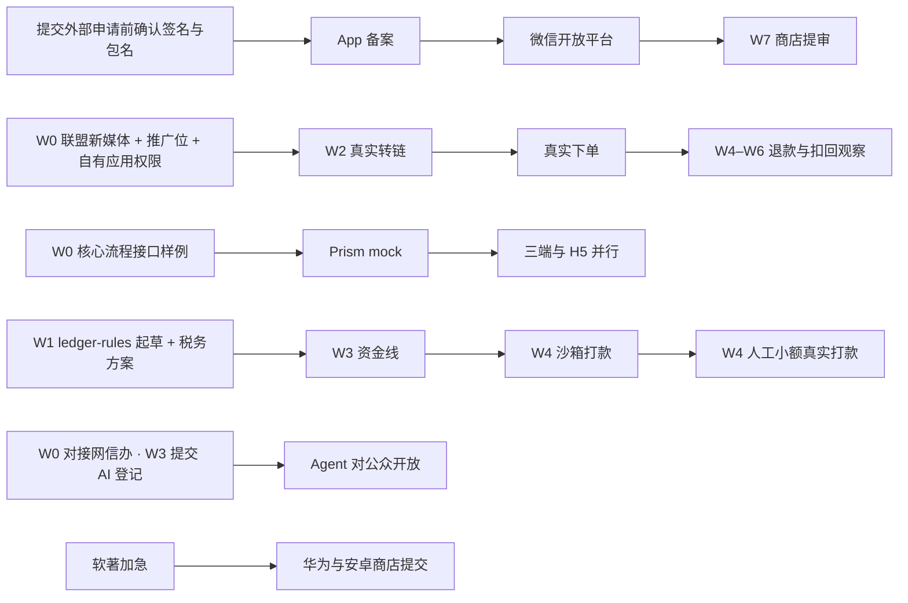

# 返利 App 规划文档 · 05 里程碑与任务拆分

2026-09-29（W0 第 1 天）；2026-09-30 按 `规划/08_业务规则/`、`规划/09_平台能力验证/`、`规划/10` 修订（新增 §0 阶段、§3.8 质量、§5「W1 人工清单」、§8 P1；编号按 08 §13.2 改名；契约守护任务改为 CT-xx，避免与 08 §14.3 分歧 C-xx 同名）· 按默认决策 D3–D6、D9–D14、D16–D18、D20–D22 排期（D7 于 2026-09-30 确认首版暂不接入淘礼金；D8 于 2026-10-01 确认两级计酬、间推开关默认关闭；D15 于 2026-10-01 确认美团延到 P1；D19 已定，D23–D28 为已确认决定，见 00 §3；D17 按功能逐步对齐、截止随功能推进；D21 系统分享面板接收默认 P1、不计入 S1 出门，D22 微信查券 P2，见 §8）；2026-10-01 按拍板第二批（`docs/changes/20261001-拍板第二批.md`）与 9-30 拍板第一批重排：鸿蒙与 iOS / Android 同步交付、W5 内测三端一起（D4，TECH-01）；仓库全部公开 + 私有存储（D18，TECH-02）；月结入账、自动到账、银行卡、劳务协议、客服工单、账号并入等任务；TypeSafe Jev 接入步骤（JEV-01～06）。任何决策被推翻，先改本文再派任务。业务规则只引用 08 的 BR 编号，平台能力只引用 09 的 CAP 编号，验收用例只引用 10 的 AC 编号。2026-10-01 用语同步（ADR-0001，规划/11 §9.1）：CT-14、B1-01、B1-12、QA-02 中被取代的技术名词与「CI 拉私有库」的写法改为现行说法，任务范围不变。

2026-10-03 功能对照补缺第 4 批（`docs/changes/20261003-功能对照补缺.md`「第 4 批」）：新增 CT-18，相关任务各补一句，S1 出门范围加 AC-S1-100～105，逐项见 §9；第 1 轮评审后再加 AC-S1-106，B1-02、B1-08、B3-08、CT-18 各补一句（变更记录 4.8）。 第 2 轮评审后，B1-03、B1-08、B1-10、APP-06、CT-18 各改一句，出门范围不变（变更记录 4.9）。 第 3 轮评审后，B1-08、B1-10、APP-08、CT-18 各改一句，出门范围不变（变更记录 4.10）。
2026-10-03 功能对照补缺第 5 批（`docs/changes/20261003-功能对照补缺.md`「第 5 批」，功能对照 G-66～G-96）：新增 CT-19；QA-07、QA-08 各加几项；§5 W1 人工清单加第 14 项；§0 出门范围加 AC-S1-130…137 与 AC-S2-80；详见 §9 末尾。同日按第 1 轮评审修改（变更记录 5.9）：CT-19 补权限点枚举、资金术语键清单与 CI、商店的已上架版本、公告条目形状与归一化向量。
2026-10-04 后台设计稿拍板（`docs/changes/20261004-后台设计稿拍板.md`）：B1-21 客服工单作废（编号保留），新增 B1-27 承接原事项的后台接口与 AI 举报处理；F1-06 加二次验证两档与验证手机号；F1-07 改「找回审核」、删客服工单页、加用户详情页代办操作；F1-10 加 AI 举报列表与新权限点；§0 S2 与 W3 行同步。
2026-10-04 审查闭环决定（`docs/changes/20261004-审查闭环决定.md` §1）：B1-27 加客服代办的本人核验（BR-ID-41），APP-12、HM-08 加确认页 `CsVerify`。
2026-10-04：客服代办与 AI 举报原误用 B1-23（与 staging 数据库重号），改为 B1-27；B1-23 仍指 staging 数据库。
2026-10-05 分享赚与范围调整（`docs/changes/20261005-分享赚与范围调整.md`，负责人 2026-10-05 确认）：§1 分享页——B1-15、APP-13、HM-10 加分享页 `ProductShare` 与入口页 `ShareHub`；§2 取消客服核验流程——B1-27 删去本人核验（`cs_verifications` 等），APP-12、HM-08 删去确认页 `CsVerify`；§3 收藏、热销榜、价格走势进入近期开发——新增 CT-22、B1-28、B1-29、APP-16、HM-12（编号新取、不复用；周次待编排排期，里程碑 M-公开、不计入内测出门，负责人 2026-10-05，`docs/changes/20261005-分享赚与范围调整.md` §7）；§4 B1-17 由「负责人确认前不开工」改为已确认开工、上线即记录。
2026-10-05：合并主线（PR #30、#31）时，分享赚与范围调整新增的任务与主线同期新增的微信零钱、收款任务重号，按后合入者让号改为 CT-22、APP-16、HM-12（原写 CT-20、APP-15、HM-11）；CT-20、APP-15、HM-11 仍指主线的微信零钱契约留位、支付调起（iOS、Android）与支付调起（鸿蒙）。
2026-10-05 Agent 页面引导卡（`docs/changes/20261005-Agent页面引导卡.md`，负责人 2026-10-05 确认，00 D31）：CT-08、B3-01、B3-05、B3-13、APP-10、HM-08、F1-10 各补一句；§0 S1 主要任务补 B3-13，出门范围加 AC-S1-142…147；详见 §9。
2026-10-05 Agent 只读收益工具（`docs/changes/20261005-Agent只读收益工具.md`，负责人 2026-10-05 确认，00 D32）与页面引导卡第 1 轮评审：新增 B3-16（只读收益工具，以 B2-04 钱包汇总读取、B2-05 本人提现记录读取的验收通过为启动条件，这两项读取的归属同日写进 B2-04、B2-05；编号跳过方案文档建议的 B3-14、B3-15，避免重号）；CT-08、B3-01、B3-05、B3-13、APP-10、HM-08、F1-10 各补一句；§0 S1 出门范围加 AC-S1-148…154（AC-S1-148…151 随 B3-16 上线后才计）；详见 §9。
2026-10-05 实现改由 Opus、评审由 Codex（`docs/changes/20261005-实现改由Opus评审由Codex.md`，负责人 2026-10-05 决定）：§2 代理分线表各线改为 Claude Opus 5.5 子代理实现、Codex 先写规则与验收测试并以新只读会话评审，RV2 另加 Claude 新子代理；§0.1、§3.10、§7 第 2 条同步一句；任务编号、周次与范围不变，详见 §9。
2026-10-06 B3-01 在代码仓库拆为 B3-01a（评测题格式与校验，已合并）、B3-01b（回放、判分、报告、冒烟门禁）、B3-01c（全量发布门禁、卡片数值比对、按厂商对照与 Jev，接 B3-11），只在 B3-01 行补一句，周次与依赖不变。

2026-10-04 提现增加微信零钱（`docs/changes/20261004-微信零钱提现通道评估.md`，负责人 2026-10-04）：新增 CT-20（契约留位，现在做）与 B2-14（微信零钱通道，排在 B2-06 支付宝沙箱跑通之后，不计入 W3–W4 资金线与 M3 的出门条件）；F1-08、APP-09 各补一句，HM-08 随 APP-09。

2026-10-04 新增收款基础设施（`docs/changes/20261004-会员购买与微信支付评估.md`，负责人 2026-10-04，00 D29）：新增 CT-21、B2-15、F1-13、APP-15、HM-11；都不计入 W3–W5 资金线与 M3 的出门条件，开关默认关；可售业务（订阅会员）待立项。开发顺序：负责人的决定是基础设施现在就建，所以 CT-21 可以立即做，B2-15 在它依赖的账本（B2-02）与基础模块（B1-01）完成后即可开工，不必等 M3；具体插在哪一周由编排会话按各线进度排。生产环境何时开放是另一回事，取决于渠道验证与可售业务立项。

---

**开发入口**：先按 [§0.1](#01-按依赖推进与分段验收) 核对主线及前置条件，再读取近期功能对应关系 [§3.9](#39-迭代日志对应的近期任务关注点)、Claude Code 接入步骤 [§3.10](#310-本批规划的开发接入)；P1 候选在 [§8.1](#81-运营增强候选的立项顺序)。只阅读收益评估不会自动更新代码仓库的任务书或台账。

## 0. 按用户流程分阶段

**本轮范围（00 D7、D25–D28）**：首版服务新老返利用户，优先验证 Agent 是否更准确、更省操作；淘礼金后续接入、未排期；保留三端原生壳。以下分线、周次、接口与工具链均为当前工作计划，随开发和新文档接入调整，不代表冻结；已确认决定的变更按 00 处理。逐页实现方式见 01 §4.2，前端技术总览见 03 §1.2。

周计划（§1）管日历，阶段管"用户能不能走完一条流程"。阶段出门**按平台分别判定**：淘宝、京东、拼多多三家同时接入、同时验证、独立验收、独立放量（`convert.enabled.<platform>`，BR-PROD-10）；任何一家权限未下或未出门，不阻塞另外两家；人工时间不够时淘宝优先。出门判定口径见 10 §0.6，完整出门条件以 10 §1 为准，本表只列要点。

| 阶段 | 交付的用户结果 | 主要任务 | 出门标准（按平台，要点） | 周次 |
| --- | --- | --- | --- | --- |
| **S0 能力验证**（三家并行） | 三家各自证实：能识别商品、能取到符合口径的价格、能转链、订单能归到正确用户 | 09 README §7 验证计划 V-01…V-33 中的三家任务（W0 见 §7.1，W1 见 §7.2，W2 见 §7.3，不在此复制）；探测框架 V-08（B1）；探测 App V-37（IOS / AND / HM，APP-14、HM-09） | ① 该平台 S1 能力门槛（09 README §1.1：CAP-<平台>-01、02、05、06、07、11、12 + CAP-X-09、CAP-X-02）为"支持"或"部分支持（降级已验收）"；② BR-PRICE-02 价格对照签字；③ BR-ATTR-04 判定通过；④ 双向验证（AC-S1-28-<平台>，BR-ATTR-28）通过 | W0–W2；审批触发日 10-12（09 README §7.0，到期未批该平台转回放开发） |
| **S1 核心购买** | 发链接 / 搜索 / Agent → 看券、券后价、预估返利、预估返后价 → 跳转购买 → 看订单状态 | B1-02…10、B1-12、B1-18、B1-19、B1-20、B1-22（B1-17 价格变更历史，负责人 2026-10-05 确认开工、上线即记录，BR-WATCH-19）；B2-03；B3-01…08、B3-11、B3-12（开关默认关）、B3-13（Agent 固定话术，含页面引导，D31）、B3-16（只读收益工具，D32，排在 B2-04、B2-05 之后）；APP-02…08、APP-10；HM-02…06、HM-08（与 APP 同周，TECH-01）；F1-01、F1-07 | S0 已出门；10 §2 的 AC-S1-01…90、AC-S1-99、AC-S1-100…106、AC-S1-130…137 与 AC-S1-142…156 适用项通过（2.8 入口扩展不计；AC-S1-71 随分享上线，AC-S1-99 随注销上线；AC-S1-72-PDD 为条件项，拼多多比价预判开关打开后才计；AC-S1-73～80 为 2026-10-03 功能对照补缺第 2 批新增；AC-S1-81～90 为第 3 批新增，在 10 §2.10，与联盟平台无关、三端各执行一次；AC-S1-100～105 为第 4 批新增，其中 AC-S1-105 金额隐藏是可选功能，UI 稿采用后才计；AC-S1-106 为第 4 批第 1 轮评审后新增；AC-S1-130～137 为第 5 批新增，在 10 §2.11，同样三端各执行一次，其中 AC-S1-132 随分享上线、AC-S1-136 是可选功能，UI 稿采用后才计；AC-S1-142…147 为 2026-10-05 Agent 页面引导卡（D31）新增，AC-S1-152…154 为其第 1 轮评审后新增，AC-S1-148…151 为 Agent 只读收益工具（D32）新增，AC-S1-155、156 为 D31/D32 第 1 轮评审后新增，这六条随 B3-16 上线后才计，都在 10 §2.7，与联盟平台无关、三端各执行一次）；每平台真实订单 ≥20 笔、跟单成功率 ≥95%（BR-ATTR-23）；付款到入库 P95 ≤5 分钟（10 §1） | 开发 W1–W3；真实下单 W2 起；最早放量 W5（M3 内测） |
| **S2 返利处理** | 月结入账、退款、扣回、补差、提现（自动到账、银行卡、劳务协议）及异常处理 | B2-01…12、B1-09、B1-13、B1-27（取代 B1-21）、F1-07、F1-08、APP-09、HM-08、QA-01…04；B2-13、F1-12（收益看板，M-公开，W6） | S1 已出门；10 §3 的 AC-S2-01…62 与 AC-S2-80 适用项通过（AC-S2-61 收益看板属 M-公开，W6 上线后才计；AC-S2-62 提现前置步骤回流，2026-10-03 功能对照补缺第 2 批新增；AC-S2-80 提现页的金额输入与提交后去向，第 5 批新增）；能力门槛另加 CAP-<平台>-04、08a、CAP-X-06、CAP-X-08；打开 `credit.enabled.<platform>` 前须有 BR-CALC-03 验证证据，且该平台 CAP-<平台>-08 的 08b（首个月结对账）已通过，未通过前该平台批次顺延（负责人 2026-10-01） | 回放全链路 W4；完整验收淘宝、京东 11-27，拼多多 = 实测结算日 +7 天（09 README §1.1） |
| **S3 第一类提醒（P1）** | 为一个商品设降价提醒（目标价模式），完成查询、触发、通知、点击处理 | MVP 只做预埋 B1-17、B1-12、APP-12（BR-WATCH-19；B1-17 负责人 2026-10-05 确认开工）；P1 任务见 §8 | 该平台 S1 已出门（BR-WATCH-27）；10 §4 的 AC-S3-01…40 三家各跑一次、按平台独立判定（BR-WATCH-01、BR-WATCH-25）；能力门槛 CAP-<平台>-13、CAP-X-05、CAP-X-10；扩大放量按 BR-WATCH-24 | 完整观测 V-34 在 W8；开发 P1（W9 起，立项时定） |
| **S4 扩展** | 按实际验证结果增加平台与提醒类型 | 美团 B1-16（P1，D15；门槛同 S1，用 CAP-MT-*）；其余只列目标（§8） | 立项时补用例（10 §1 S4） | P1 立项时定 |

**状态记录**：任务与验收用例的状态分三栏记录，互不代替（10 §0.6、§5.2）——**代码已提交**（PR 已合并）→ **已验收**（关联 AC 在 `evidence/acceptance/records.csv` 中结果为 pass 或 waived，验收人、日期、证据路径齐全）→ **已上线**（上线版本、日期已填且该平台开关已对真实用户打开）。本文任务表只写计划，不写状态；周五清单（§6）三种状态分别统计。

---

### 0.1 按依赖推进与分段验收

本节把现有任务串成连续交付顺序，不新增产品范围或替代上表 S0–S4、10 的完整出门条件。每一段先接通可验证的流程，再扩大功能覆盖；日历表示目标，前置条件与验收证据决定能否进入下一段。独立任务仍可按 11 §3.4 并行，不要求所有底座或远期表一次建完。

**每次接手先对账**：同时记录代码远端主干 SHA、当前工作树 SHA、`SPEC_REF`、工程台账、在途工作树和该提交的 CI。台账 `done`、运行态残留、PR 状态互相矛盾时，由原编排者核实后修正，不能据此重复派工。看板尚未覆盖的 PR/CI 需单独查询。2026-10-04 的 [核查记录](../docs/research/20261004-项目阶段核查与执行建议.md) 是带版本的历史快照，后续不能当实时看板。

| 推进顺序 | 沿用的任务与依赖 | 本段应展示的结果 |
| --- | --- | --- |
| 1. 收口基础设施 | B1-01 已完成子任务复用；数据库接线后完成队列 / 幂等，队列后完成事件 / 分区维护；脱敏与密钥接线按允许路径协调 | 进程能启停、读写测试库；事务回滚不留孤立任务；重放与重复请求不会重复产生业务效果。所涉任务证据、容器验证、评审齐全 |
| 2. 身份与会话 | B1-02 → B1-03；复用已建身份表，补齐所需 apps / 配置 / 种子及安全接线；B1-19 在转链前完成 | 设备、登录、刷新、权限边界形成真实接口与数据库读写链路，失败分支可回放；不以“users 表存在”代替登录验收 |
| 3. 查询、报价与购买 | B1-04 → B1-05 / B1-07 → B1-06；B1-19、B2-01 剩余规则与 B2-03 按转链和报价依赖同步推进；CT 按接口补齐 | 同一商品从搜索 / 输入识别，到详情、报价、授权和外跳可追踪；回放通过后按 09 的证据做各平台真机验证 |
| 4. 订单与归属 | 补 CT-04 与订单契约；B1-08 → B1-09 / B1-10，复用报价快照与归属规则 | 购买后的订单能同步、归到正确用户、展示状态和原因；重复、乱序、退款等分支有测试。S1 仍需补齐 Agent、三端及所有适用 AC |
| 5. 账本与返利处理 | B2-01 → B2-02 可与购买线独立推进；B1-08 + B2-02 → B2-04；B1-13 + B2-02 → B2-05 → B2-06 → B2-07 / B2-09，其余 B2 任务按原依赖 | 从订单到结算、余额、提现、打款和对账闭环；通过金额不变量、并发 / 故障 / 回放测试，再按 S2 的平台门槛开放 |
| 6. 跨端与 Agent 随主线集成 | F1-01 / APP-01 / HM-01 在稳定契约上建壳，逐段接登录、购买、订单、钱包；B3-04 复用 B1-05 / 06 / 07，B3-08 复用 B1-08 / 10，评测及流协议可提前 | 三端同步验收；确定性业务由同一套服务执行，Agent 不另写报价、归属与资金规则。此项贯穿前面各段，不是最后才开始客户端 |
| 7. 增强功能按证据立项 | §3.9 的输入识别、报价、订单解释、资产快照、分享可靠性并入所属任务；§8 的 S3 优先，§8.1 增长候选按依赖和基线选择 | 先有稳定主链与失败 / 使用基线，再验证增强功能的收益，不用功能数量代替完成度 |

已确认的收款基础设施仍按 D29：CT-21 现在可做，B2-15 在 B1-01、B2-02、CT-21 等原依赖满足后开工，不必等 M3；沿当前契约串行槽排入。B2-14 微信零钱提现仍排在 B2-06 支付宝沙箱通过后。两项的默认开关、能力验证和生产启用条件沿原计划，不因本表重排而改变。

**每个任务的交付**沿 11 执行：写清输入与预期结果、适用 BR / AC / 契约和允许路径；独立规则测试先明确正确行为，实现后交由独立评审检查；以具体提交的自动化结果与验收记录证明完成。数据库分片交付包括迁移、临时库执行、约束与权限测试、生成快照 / 类型、漂移检查及恢复方案。脚本错误、缺依赖导致的失败不算有效红测，生成物不手改；缺少平台事实时标待验证，不补造接口响应。

Claude 主会话负责一份台账与派工，Claude Opus 子代理实现、Codex 写测试与评审，按 §2 和 11 分工；规则、契约、迁移与共享文件保持既有互斥。关键问题尚未关闭、测试未运行或只剩占位实现时，继续标未完成。向负责人固定报告：**本次交付的流程、对应提交和证据、未通过项、唯一下一主目标、需要负责人解决的外部依赖**。

---

## 1. 周计划

W0 = 09-29（周二）→ 10-04（周日），之后每周一开始。**10-01 起国庆假期**（具体安排以国务院通知为准），外部审批大概率停摆，所以**所有外部申请必须在 09-29、09-30 两天内提交**。双11：10-15 开预售，10-20 付尾款，现货售卖到 11-13〔BBT-1111·中，以天猫官方公告为准；09 U-83〕。

**排期说明**：2026-10-01 曾因代码仓库尚未建立调整 W0–W1（见 `规划/11` §9）；该历史说明不能作为当前工程状态。后端仓库现已建立；下表 W0、W1 行继续保留为范围说明，后续周次待 规划/11 §9.2 的 10-14 复盘后重排，近期按 §0.1 的实际依赖推进，不以旧周次推断任务已经完成。

| 周 | 日期 | 代理主线 | 人工关键路径 | 周五验收门 / 里程碑（M0–M4 日期为该周周日，M5 为 W8 起；见 00 §5） |
| --- | --- | --- | --- | --- |
| W0 | 09-29 → 10-04 | 核心流程接口草案与样例、状态机（订单、提现）、生成器、四个仓库脚手架、CI 门禁、guard 脚本；探测框架 V-08、探测 App V-37 | **09-29/30 提交全部外部申请**（含 09 README §7.1 的 V-01…V-09、V-38）；处理 D3–D18 中仍待决策的项、D21（D7 已定；D17 随功能推进；D20 随后续淘礼金接入处理）（D22 截止 W8）与 08 §14.4 中最晚 W0 末的 3 项；财务会议定账务与税务原则；准备录制脚本 | **M0**：核心流程接口样例可联调；三端与 H5 对 Prism mock 跑通登录→搜索→转链样例；CI 在空仓库上全绿；鸿蒙生成器样例编译通过 |
| W1 | 10-05 → 10-11 | 后端：身份、风控中间件、联盟 Adapter（回放）、推广位登记与 pending → active 关卡（B1-19，W2 真实转链的前提）、搜索、详情、转链；三端（含鸿蒙）：壳 + 隐私闸门 + 容器 + 桥 + 登录；H5：脚手架 + 一致性测试页；内容后端；埋点规格 CT-13 | 首批联盟录制（搜索、详情、转链、备案、订单各状态）；经营数值不再 W1 签字：开发期占位值，上线前超管在后台填写（拍板第二批 §8 ADD-03）；域名表与 scheme（TECH-26）；MobPush 账号与应用开通（选型 2026-10-05 已定为 Mob 推送）；Q-G11 华为答复（决定鸿蒙华为账号登录是否提前，§3.7）；设计参考与令牌；能力验证 V-10…V-21（人工约 52 小时，超载，按 §5「W1 人工清单」取舍）；每个平台放量前完成双向验证（AC-S1-28-<平台>，BR-ATTR-28），证据路径写入验收记录 | 桥一致性页三端通过（三端同步，TECH-01）；AC-ACC 自动化 ≥80%；探测 App 三端装机（V-37） |
| W2 | 10-12 → 10-18 | 后端：订单同步与归因、`parse_input`、邀请绑定、账号并入与昵称（B1-20）、站长联盟授权到期管理（B1-22）、价格变更历史写入（B1-17，负责人 2026-10-05 确认开工，上线即记录）；资金线：分录与分佣；Agent：模型网关、SSE、工具、Jev 结果核对影子模式（B3-12）；三端（含鸿蒙）：搜索、详情、授权、外跳、剪贴板；H5 内容页；后台脚手架 | 真实转链与首笔真实下单走 staging 测试推广位（TECH-08）；三端真机各平台首笔真实下单（09 README §0.2 硬规则 5 限额）；鸿蒙真机验证百川与各平台归因；10-12 审批触发日（09 README §7.0） | **M1**：AC-LINK / AC-ORD 回放自动化 ≥80%；真实订单被同步并归到正确用户——按平台分别判定，权限未下的平台转回放开发，不阻塞其他平台 |
| W3 | 10-19 → 10-25 | 资金线：月结出账与批量入账、扣回、提现（含劳务协议、银行卡收款）、自动到账判定、打款（沙箱）；Agent：编排、护栏、素材结构化与未知权益提示、查单工具；三端（含鸿蒙）：订单、钱包提现、Agent 页；后台：用户、订单、找回审核（客服工单 2026-10-04 取消） | 推荐条件匹配与无结果解释试用；评测集人工标注；AI 登记材料提交 | **M2 go/no-go**：资金属性测试全绿；Agent 评测 v1 达门槛；Jev 结果核对按验收线决定开关（不达标关闭、不影响 Agent，JEV-03）；决定砍项 |
| W4 | 10-26 → 11-01 | 后台：月结账单、提现审核与批量打款、对账、人工调账、首页配置、配置中心（含自动到账设置、文案语义预检 JEV-05）；三端（含鸿蒙）：首页 SDUI、我的与设置、推送；后端收尾 | 沙箱打款演练；人工小额真实打款（≤1 元、≤5 笔）；隐私检测工具；SDK 清单核对（TECH-03） | 回放全链路"跟单 → 预估 → 月结批次入账 → 扣回 → 提现"通过；后台改首页不发版 |
| W5 | 11-02 → 11-08 | 联调修复；三端内测包（iOS、Android、鸿蒙一起，TECH-01）；压测与故障注入 | TestFlight、Android 第三方分发平台（TECH-18）、鸿蒙 AGC 测试；白名单 ≤500 人；大促预案 | **M3 内测**：三端内测包发出（维持 W5 白名单内测、W8 公开上架，M-公开项留在 W6–W7，拍板第二批 TECH-25）；人工打款演练记录；k6 报告；某平台打开 `credit.enabled.<platform>` 前须有 BR-CALC-03 验证证据与该平台 08b 通过 |
| W6 | 11-09 → 11-15 | 双11 期间只修缺陷；注销、分享、华为账号登录（客户端与后端，W7 首次提审前完成；鸿蒙内测包须经华为审核时鸿蒙端提前到 W4，§3.7） | 值守；观察退款与扣回 | 无资金差异；三端注销与分享冒烟通过 |
| W7 | 11-16 → 11-22 | 提审修复（三端） | 各商店提交，处理驳回；审核材料包（含 AI 安全评估及结果截图、标识材料、承诺函，返利类目书面答复 06 Q-G20，首页外跳布局核对，提审期间推开关关闭；清单见 09 CAP-X-12 自查表，2026-10-05） | **M4 提审**：各商店首次提交 |
| W8 | 11-23 → 11-29 | 上线值守；P1 排期 | 公开上架；Agent 登记号填好即对所有人开放（AI-06） | **M5 公开**：上线门槛指标达标；首个月结账单日 11-24 跑通出账；淘宝、京东 08b 对账 11-27 完成前其 `credit.enabled` 保持 off、批次顺延，08b 通过后再确认执行首个批次（拼多多按其 08b 截止） |

---

## 2. 代理分线

线名与任务编号不变。谁实现、谁写规则测试、谁评审，按 `规划/11` §1.1 的默认分工（2026-10-01 取代原「账号 · 会话」安排：一个 Claude 编排会话调度 Codex 与 Claude 子代理；2026-10-05 负责人改为所有线由 Claude Opus 5.5 子代理实现、Codex 先写规则与验收测试并做对抗评审，`docs/changes/20261005-实现改由Opus评审由Codex.md`）。CT 在旧文档中也称“契约守护”，仅代表接口协作职责。

| 线 | 默认分工（实现 · 规则测试 · 对抗评审） | 负责范围 | 启动 |
| --- | --- | --- | --- |
| **CT** 接口与公共规格 | Opus 子代理 · Codex 写一致性测试 · Codex 新只读会话评审（破坏兼容按 RV2 另加 Claude 新子代理）；同时只 1 个在途 | `contracts/**`、`specs/**`、生成器；按功能逐步维护 | 按需 |
| **B1** 交易后端 | Opus 子代理 · Codex 先写 AC 映射测试 · Codex 新只读会话评审。其中 orders、linking、union 属归属：Codex 先写规则测试（先红），评审加 Claude 新子代理（RV2） | identity、risk、union、catalog、parsing、linking、orders、growth、notification | W0 脚手架 / W1 |
| **B2** 资金后端 | Opus 子代理 · Codex 先写规则测试（先红）· Codex 新只读会话 + Claude 新子代理（RV2） | 账务、分佣、入账、扣回、提现、打款、对账、税 | W1 周三 |
| **B3** Agent 后端 | Opus 子代理 · Codex 写评测集与注入集（放私有库）· Codex 新只读会话评审 | agent、taolijin、`evals/`、`prompts/` | W1（评测框架）/ W2 |
| **F1** H5 + 后台 | Opus 子代理 · Codex 写 Playwright 冒烟（Claude 内置浏览器实看作补充证据）· Codex 新只读会话评审；提现、调账页面按 RV2，另加 Claude 新子代理 | `apps/h5`、`apps/admin`、content 模块后端、admin 模块 | W0 |
| **IOS** iOS | Opus 子代理（独立 worktree）· 同线写快照与冒烟，Codex 写桥一致性用例 · Codex 新只读会话评审 | `rebate-ios`（三端参考实现，先行一步）；探测 App iOS 版（V-37） | W0 |
| **AND** Android | 同 IOS | `rebate-android`；探测 App Android 版（V-37） | W0 |
| **HM** 鸿蒙 | 同 IOS | `rebate-harmony`（与 iOS / Android 同步交付，D4，拍板第二批 TECH-01）；探测 App 鸿蒙版（V-37） | W0 |
| 交叉评审 | Codex 新只读会话（实现方之外的另一家），每次新开会话；RV2（资金、归属、迁移等）另加 Claude 新子代理，两家都审 | 评审口径与发现分级见 规划/11 §3 | 按 PR |
| 编排 | Claude 主会话 | 台账、派工、提交、推送、合并、验收记录（规划/11 §2） | 建库后常驻 |
| 调研 | grok | 产出放 `docs/research/`，标不可信，只作参考 | 按需 |

- 2026-10-06 起 B3-02、B3-03、B3-07，以及 B1-14（含 QA-06）、QA-05、QA-09 中不涉资金、归属与发布流水线接入的部分，改由 Codex 实现、Claude 写测试，评审按风险级；这些子任务不占下一条的 4 个在途名额（规划/11 §1.1、§2.5、§3.4、§7.3 第 14 项，`docs/changes/20261006-部分任务改由Codex实现.md`）。
- 在途任务从 2 个起步，稳定后不超过 4 个；契约、迁移、依赖任务各自串行；资金任务每模块 1 个、全局 ≤2 个（规划/11 §3.4）。
- 每个任务在独立 worktree 中工作；iOS 与鸿蒙每个任务使用独立的 DerivedData / 模拟器或真机。
- 接口需要改动时，由当前任务负责者同步草案、实现与调用方，按影响范围检查兼容性；涉及已确认业务决策再请负责人确认。
- 上表是默认分工：「Opus 子代理」指模型锁定 `claude-opus-5-5` 的 Claude 子代理，由编排会话起；Codex 写测试与评审经代码仓库 `tools/agent/codex-run.sh`（规划/11 §1.1、§2.4）。不按额度改派（规划/11 §1.3，Codex 额度不设限制）；超限换家按 规划/11 §2.5，但资金与归属的实现方和规则测试作者不得是同一家模型，Opus 用不了时资金与归属停、不改由 Codex 实现。

---

## 3. 按线任务清单

**任务状态与拆分以 `rebate-platform/ops/tasks/` 台账为准**（规划/11 §2.1；格式见 `docs/templates/task-ledger.md`）：编号沿用本文，拆分加后缀，本文任务表只写计划。测试由谁写见 规划/11 §1.1（实现者不写自己的规则测试）。

任务粒度 0.5–2 个代理日。开工前写清本次预期结果；已有 AC 时直接引用，没有时可先记录输入、预期输出与验证方式，不必等全部规格和测试文件齐备。任务完成时给出相应检查结果。编号格式 `<线>-<序号>`；iOS / Android 共用 `APP-xx`，鸿蒙 `HM-xx`，契约守护 `CT-xx`（08 §13.2）。**`CT-xx` 是本文契约任务，`C-xx` 一律指 08 §14.3 跨主题分歧**，两者不混用。

**关联列**写需求与规则编号：`AC-<EPIC>-nn` 与 01 的 `F-<EPIC>-nn` 同号，只写 AC；BR 见 08；CAP 见 09（`CAP-*-nn` 表示三家同号能力）；首个流程用例 AC-Sx-nn 见 10，按阶段归属见 §0。规则细节只在 08 维护，本表不复述。**验收列**写关联 AC 以外的完成标志，"—"表示关联 AC 全绿即完成。状态按 §0 分三栏记录。

### 3.1 CT 接口与公共规格

| 任务 | 内容 | 截止 | 依赖 | 关联 | 产出 |
| --- | --- | --- | --- | --- | --- |
| CT-01 | `enums/*.yaml`、`error-codes.yaml`：按 `04` 第 2、7 节，合入 08 §13 新增值（含 scene 新增 `watch_alert`、通知分类 service / subscription / marketing，负责人 2026-09-30 确认，BR-WATCH-19）；码值只按 08 §13.11 唯一分配表 | W0 周三 | — | 08 §13.2–13.11；08 §14.3 分歧 C-03；BR-WATCH-19 | 可生成的枚举与错误码 |
| CT-02 | `openapi.yaml` v0.9：先覆盖登录→搜索→转链所需接口，每个接口至少 1 个 example；其余随功能补齐；`x-signed`、`x-auth` 扩展；按功能先写契约、代码按它校验，禁止反向生成覆盖（TECH-05）；只用四个生成器都支持的 OAS 3.1 写法（TECH-27） | W0 周五 | CT-01 | 08 §13.9 | Prism 可启动 |
| CT-03 | `bridge.schema.json`（含 `net.signedRequest` 的 `signed_paths` 白名单，TECH-30）、`routes.json`（`since` 按端，TECH-07；跳转统一 `{route, params}`，TECH-04）、`apps.json` | W0 周五 | — | CAP-*-11、CAP-X-04 | 桥类型、路由表、外跳表 |
| CT-04 | `state-machines/order-platform.yaml`、`order-rebate.yaml`（双状态，BR-FUND-01、04 §4；原写 `order.yaml`，2026-10-06 同步，规划/12 §9 S-11）、`withdrawal.yaml`（含 W9、W10）+ TS / Swift / Kotlin / ArkTS 生成器 | W0 周六 | CT-01 | BR-FUND-01、BR-WDR-08 | `transition()` 与测试 ID |
| CT-05 | 生成与分发流水线：tag → 制品 → 自动向三端开 PR；`contract.lock`；鸿蒙生成器 3 个样例接口编译通过 | W0 周日 | CT-02 | — | M0 准入 |
| CT-06 | CI 门禁：oasdiff（`fail-on: ERR`）、operationId 与路由一一对应检查、生成物无漂移且四端生成物同时编译（TECH-27）、gitleaks、隐藏 Unicode 扫描 | W0 周日 | CT-02 | — | 空仓库全绿 |
| CT-07 | `home-schema.json` + `fixtures/home-golden/*.json`（含未知 type、缺字段、超长文案、空数据源；`popup` 卡、按端 `min_app_version`、人群条件，TECH-07、TECH-12、OPS-05、OPS-10） | W1 周二 | CT-02 | AC-HOME | 三端渲染器输入 |
| CT-08 | `agent-stream.schema.json` + `fixtures/agent-streams/*.ndjson`（正常、工具失败、取消、断线、未知卡片、error、降级）；页面引导卡（D31，2026-10-05，W3 前合入）：`card.type` 加 `page_guide`（data 只有 `route`、`text_key`），`enums` 的 `agent_intent` 加 `page_guide` 与意图输出的 `guide_route`，`routes.json` 加 `agent_guide`（6 个路由为 true），`agent_runs.page_guide_reject_reason`；正常类 fixture 加一条页面引导流，未知卡片类加一条 route 不在 `agent_guide` 内的 `page_guide` 卡（类数不变）；第 1 轮评审后补：`page_guide_reject_reason` 加 `untrusted_input`、`params_requested`，账户安全类路由名到 `agent.guide.account.*` 的对应表。只读收益工具（D32，2026-10-05，W3 前合入）：`card.type` 加 `earnings_summary`（字段见 04 §8.3，历史接口不含金额），`agent_intent` 加 `earnings_query`，`get_my_earnings` 的空 schema 与返回形状，`specs/agent-tools.allowlist` 的新增项随 B3-16 合入；正常类 fixture 加一条收益卡流，另加一条历史重载的收益卡 | W1 周三 | CT-02 | AF-01…11；BR-AI-01（页面引导） | 三端 Agent 页可先开发 |
| CT-09 | `specs/client-behavior.md`：错误码动作、Token 刷新、外跳降级顺序、`pending_action`、隐私闸门、格式化规则 | W1 周一 | CT-01 | BR-ID-10、BR-TEXT-14 | 三端共用 AC |
| CT-10 | 其余状态机：claim、union_binding（按 BR-ID-19、BR-ID-20；08 §14.3 C-05 已随拍板第二批 §8 ADD-01 结案，无用户自助换绑）、deletion（含 deleting） | W1 周五 | CT-04 | BR-ATTR-07、BR-ATTR-17～20、BR-ID-19、BR-ID-27 | |
| CT-11 | `design-tokens.json`（人提供参考后整理） | W1 周三 | 人：品牌素材 | — | 三端与 H5 令牌 |
| CT-12 | 共用术语引用 08 README §1；已确认决策集中维护在 00。仅对影响较大的技术取舍按需补 ADR，不为每个 D 编号重复建文件 | 按需 | — | 00 D27；08 §1、§13.1 | 可追溯的设计理由 |
| CT-13 | `specs/events.yaml`：埋点事件、字段、公共字段与游客登录后的关联方式，生成三端与 H5 的 Tracker 代码（拍板第二批 TECH-21） | W1 周二 | CT-01 | F-OBS-03 | 三端与 H5 埋点只能调用生成函数 |
| CT-14 | 公开仓库与私有存储边界：私有仓库 `rebate-private`（提示词、评测、联盟与模型录制、风控参数种子）与 OSS 私有 bucket `evidence` 的目录约定；公开仓库的 CI 不持有私有库凭据、只跑合成 fixture，用到真实录制的回放只在本机运行、只回写通过或失败，改动 Agent 服务的 PR 合并前由编排者按需跑冒烟回放（BR-AI-21），夜间另跑全量（规划/11 §7.3、§8；ADR-0001 §4.2 第 18 项）；gitleaks 提交钩子（拍板第二批 TECH-02、AI-11） | W0 周日 | 人：建 bucket；私有仓库由 Claude 建（规划/11 §7.3 第 1 项） | 02 §12.7、§16 | 公开仓库扫描无密钥与真实数据 |
| CT-15 | 功能对照补缺第 1 批的规格与契约落地（2026-10-03，`docs/changes/20261003-功能对照补缺.md`）：`specs/link-patterns.yaml`（平台链接形态表，category product / promo / union_host，BR-ATTR-29；具体域名与路径模式由 B1-07 按真实样本填）、`specs/client-public-ids.yaml`（客户端公开标识白名单与例外，02 §12.6）、`specs/client-security-baseline.yaml`（CSB-01～08，03 §4.8）、`specs/oauth/<provider>.md`（微信、Apple、华为授权凭证的换取或验签接口、有效期与一次性语义，按官方文档核对；Apple 固定 nonce 的唯一表达并给测试向量；华为核对是否支持 PKCE 或换码返回 nonce，支持就必须用，结论同步 09 5_X §5.4；BR-ID-04 细则「服务端可验证的绑定能力」）、设备哈希测试向量与无效设备哈希种子（BR-ID-09）；并把该变更记录「契约待改」逐项落进 `contracts/` | W1 周三（link-patterns 的模式随 B1-07） | CT-01、CT-02、CT-03 | BR-ATTR-29、BR-ID-04、BR-ID-09、BR-ID-17；02 §12.6；03 §4.8 | 四类 specs 文件可被三端与服务端读取；契约改动通过 CT-06 门禁 |
| CT-16 | 功能对照补缺第 2 批的规格与契约落地（2026-10-03，`docs/changes/20261003-功能对照补缺.md`「第 2 批」）：`specs/phone-normalize.vectors.json`（手机号规范化测试向量，三端、H5 与服务端共用，BR-ID-05）；`specs/events.yaml` 加 `external_page_blocked_nav`（只有 scheme 类别）；`specs/banned-words.yaml` 的「比价」allow_keys 按 BR-TEXT-13 增补；字典与 `contracts/texts.default.json` 补本批新增文案键（BR-TEXT-01 的 earnings.\*，BR-TEXT-03 的 order.price_compare.hint，BR-TEXT-14 表 B、表 C 的新键）；`specs/union/pdd.md` 预留「比价预判的取数身份」一节（CAP-PDD-04 有结论后填）；并把该变更记录「契约待改」逐项落进 `contracts/` | W1 周五（收益看板相关项随 B2-13，W6） | CT-01、CT-02、CT-03、CT-15 | BR-ID-05、BR-FUND-25、BR-PRICE-08、BR-TEXT-01/13/14；03 §5.1 | 测试向量可被四端读取并通过各端单测；契约改动通过 CT-06 门禁 |
| CT-17 | 功能对照补缺第 3 批的规格与契约落地（2026-10-03，`docs/changes/20261003-功能对照补缺.md`「第 3 批」）：`routes.json` 每条路由加 `entry`（取值按 BR-ID-10 细则「路由入口矩阵」）；`apps.json` 改为外跳目标、SDK 必需查询项、入站回调三类，入站回调再分自定义 scheme 与限定自有域名、开启验证的链接（host、path 前缀、verified），生成器同时产出 iOS URL Types 与 Associated Domains、Android intent-filter（含 App Links 验证声明）、鸿蒙深链声明与服务端关联文件（03 §4.5）；`specs/system-permissions.yaml`（三端系统权限清单与生成器，03 §4.9）；`specs/material-channels.yaml`（联盟物料频道白名单，BR-TEXT-17 细则；各频道的排序依据随 CAP-\*-10 的记录填）；`specs/client-security-baseline.yaml` 加 CSB-09～11、系统 scheme 禁止清单与导出组件允许清单；`specs/events.yaml` 加 `route_entry_blocked`；`error-codes.yaml` 加 10405；字典与 `contracts/texts.default.json` 补 BR-TEXT-14 表 A 的 error.10405 与表 C、表 D 的新键；`specs/banned-words.yaml` 加榜单类词；并把该变更记录「契约待改」逐项落进 `contracts/` | W1 周五（权限清单与 apps.json 的取值随各 SDK 接入补齐） | CT-01、CT-02、CT-03、CT-15、CT-16 | BR-ID-01、04、13；BR-TEXT-13、14、17；03 §3.6、§4.4、§4.5、§4.8、§4.9 | 生成物与工程文件的一致性检查可以运行；契约改动通过 CT-06 门禁 |
| CT-18 | 功能对照补缺第 4 批的规格与契约落地（2026-10-03，`docs/changes/20261003-功能对照补缺.md`「第 4 批」）：`bridge.schema.json` 的 `ext.openApp`（`trade_only` 目标 90403）、`ext.openBrowser`（命中平台链接形态表 90403）、`share.open`（先规范化，再按平台链接形态表 → 自有分享域的分享页路径 → 其他 https 的顺序判定，不在许可范围内的 90403，分享页路径模式在契约里登记一份；第 1 轮评审后补，判定顺序为第 2 轮评审后改）、`clipboard.write`（要求用户点击，90404）与事件 data 的说明，`apps.json` 外跳目标（CT-17 拆成三类后的 `apps` 类）加 `trade_only`；`routes.json` 新增 `AuthManage`（`entry` 用 CT-17 加的字段，取值按 BR-ID-10 细则「路由入口矩阵」）；与 CT-17 改同一文件、同一方法的，在 CT-17 的改动之上叠加（变更记录第 4 批「契约待改」逐行注明）；一致性测试页按 03 §5.5 加负面用例（staging 另部署一个非白名单测试 origin），三端 UI 测试（APP-04、HM-03）逐项断言；`specs/events.yaml` 的 `link_jump` 结果加 `sdk_init_failed`，字段加 `attempt_id`（第 2 轮评审后补）；open 与 convert 成功响应加 `attempt_id`，`db/schema.sql` 新建 `link_open_attempts`（取代 `links.jump_reported_at`，第 2 轮评审后改；第 3 轮评审后加 `dismissed_at`，`links` 不建 `track_dismissed_at`），待跟单接口的卡片项与关闭请求带 `attempt_id`（第 3 轮评审后补）；`specs/union/pdd.md` 写入转链的拼团方式（单人团）；字典与 `contracts/texts.default.json` 补本批新增文案键（BR-TEXT-14 表 B `50304.search_disabled`、表 C 的 `buy.opening*`、`jump.taobao_sdk_unavailable`、`auth_manage.*`、`order_status_group.*`、`order_list.*`、`order_timeline.*`、`order_detail.view_product`、`amount_mask.*`，BR-TEXT-22 `agent.notice.search_disabled`）；并把该变更记录「契约待改」逐项落进 `contracts/` 与 `db/schema.sql` | W1 周五（订单筛选与预售项随 B1-08，W2） | CT-01、CT-02、CT-03、CT-16、CT-17 | BR-ATTR-27、BR-ATTR-29、BR-ID-16、BR-ID-17、BR-ID-32、BR-ID-37、BR-PROD-10、BR-TEXT-02/14/22；03 §4.5、§5.3、§5.5 | 负面用例三端全部按预期拒绝；契约改动通过 CT-06 门禁 |
| CT-19 | 功能对照补缺第 5 批的规格与契约落地（2026-10-03，`docs/changes/20261003-功能对照补缺.md`「第 5 批」）：`routes.json` 的 `Withdraw`、`PayoutAccount`、`LaborAgreement`、`RealName` 参数定为空对象（不接受额外字段），`ExternalPage` 加可选参数 `title`、`nav_style`，`WithdrawRecords` 加可选参数 `withdrawal_id`；`openapi.yaml` 按变更记录「契约待改」补提现规则、提现详情、余额流水、收款账号查询的字段与参数；`specs/app-stores.yaml`（商店对照表与生成器，03 §4.1）；`GET /v1/app-versions/check` 的 `default_store`、`stores` 与 `app_versions` 的 `default_store`、`store_listings`（各商店的已上架版本，BR-ID-01 细则，第 1 轮评审后补；第 2 轮评审后 `store_listings` 改为按填写顺序的数组，后台版本管理在改商店登记与换默认商店时同样核对；第 2 轮另加的 `official_download_url` 第 3 轮评审后删去，不再新增）；`contracts/enums/admin.yaml` 的 `admin_permission` 加 `content.fund_terms` 并重新生成类型、过一致性检查，`specs/permissions.yaml` 同步加；`specs/fund-term-keys.yaml`（资金术语键清单与例外表）及扫描文案键与通知模板的 CI 检查（BR-TEXT-12 细则「资金术语键」，第 1 轮评审后补；第 2 轮评审后改为「资金术语」「普通」两段、每个键与模板编码都要恰好归入一段，未归类即失败，后台字典编辑、导入、整体更新、模板编辑、批量修改与回滚共用一个键级检查）；`specs/events.yaml` 加 `route_params_dropped`；`specs/banned-words.yaml` 配归一化测试向量（BR-TEXT-13 细则「归一化」，第 1 轮评审后含默认可忽略字符 U+034F、U+FE0F 等，第 2 轮评审后含组合附加符 U+0301、U+20DD 等，第 3 轮评审后含间距组合附加符 U+093E、U+0BBE）；公告条目 `NoticeItem`：`home-schema.json` 的 `notice_bar` props `items` 与 `GET /v1/articles` 公告分类的 `notice` 共用一个定义，`articles` 加公告用的三列（04 §6.2、§3.2，BR-TEXT-13 细则「首页公告条的关闭与内容版本」，第 1 轮评审后补）；`db/schema.sql` 给 `user_oauth` 加唯一 (app_id, user_id, provider)；字典与 `contracts/texts.default.json` 补 BR-TEXT-14 表 C、表 D 的新键；并把该变更记录「契约待改」逐项落进 `contracts/` | W1 周五（商店对照表随各商店接入补齐） | CT-01、CT-02、CT-03、CT-15、CT-16、CT-17、CT-18（第 4 批已于 2026-10-04 并入，CT-19 排在 CT-18 之后） | BR-WDR-01、04、25；BR-ID-01、06、33；BR-TEXT-12、13、14、19；03 §4.1、§4.4、§5.1 | 资金与实名路由带参数时生成的路由层丢弃参数并记埋点（10 AC-S1-81 ⑫）；未归类的新键与模板被 CI 拦下，无返利错误文案与提现暂停、恢复通知经任一写入口都改不了（10 AC-S2-59 ⑧～⑪）；来源商店版本落后时去默认地址、默认商店未上架新版本时不能提高最低版本（10 AC-S1-83 ⑳㉑）；默认商店同样先核对版本、商店都不够时显示「暂时无法更新」、改商店登记与换默认商店不留下无版本可装的状态（10 AC-S1-83 ㉒～㉔）；契约改动通过 CT-06 门禁 |
| CT-20 | 微信零钱通道的契约留位（2026-10-04，`docs/changes/20261004-微信零钱提现通道评估.md`）：`contracts/enums` 的 `payout_method`、`payout_channel` 加 `wechat`，新增 `withdrawal_channel_state`；`openapi.yaml` 收款账号接口支持微信授权绑定、提现记录加 `channel_state`、`confirm_deadline`、新增 `POST /v1/withdrawals/{id}/wechat-confirm`；`db/schema.sql` 的 `payout_accounts`、`withdrawals` 加微信字段与部分唯一索引；30303 的 `reason` 加 `above_method_max`；配置键 `payout.channel_enabled.wechat`、`payout.wechat.*`、`withdraw.method_max_amount_fen.<payout_method>`；字典与失败原因映射加微信零钱的键（`30303.above_method_max`、`withdraw_fail_reason.USER_CONFIRM_TIMEOUT`、`USER_REQUEST_CANCEL`）；第 1 轮评审后补：`oauth-attempts` 的 `purpose` 加 `payout_bind`，`payout_attempts.kind` 加 `cancel`，`hold_reason` 加 `channel_disabled`，开关 `payout.channel_paused.<channel>`，`POST /v1/withdrawals/{id}/wechat-confirm/returned`，后台撤销微信转账的操作与权限点，微信零钱收款账号请求体不含 `payee_name` | 与 B1-13、B2-05 的契约同批（建表前） | CT-01、CT-02、CT-03 | BR-WDR-02、03、04、33；04 §2.4、§3.2、§6.1、§6.4、§10.2 | 现有支付宝、银行卡的契约测试不变；`wechat` 相关字段可空、开关默认 off；契约改动通过 CT-06 门禁 |
| CT-21 | 收款基础设施的契约（2026-10-04，`docs/changes/20261004-会员购买与微信支付评估.md`）：`contracts/enums` 新增 `pay_channel`、`pay_order_status`、`pay_refund_status`；`openapi.yaml` 新增 `POST /v1/pay/orders`、`GET /v1/pay/orders/{id}`、`returned`、`cancel` 与后台 `pay-orders` 资源；`error-codes.yaml` 新增 30901、30902、50306；`db/schema.sql` 新增 `pay_orders`、`pay_notifications`、`pay_query_attempts`、`pay_refunds`；`specs/state-machines/pay-order.yaml`；配置键 `pay.*`；权限点 `pay.view`、`pay.refund`、`pay.resolve`、`switch.pay`；科目 `CASH_PAY:{pay_channel}`、`PAY_RECEIPTS:{biz_type}`、`PAY_SUSPENSE`、`PAY_CHANNEL_FEE`；`pay_ledger_type`、`pay_anomalies`、20902 的 `resource` 加 `pay_order`、`pay_refund`、`recon_diff_type` 加 `pay_mismatch`、`pay_anomaly`（来源 R4）、后台退款的幂等键；通知入口不进客户端契约，另写 `specs/pay-notify.md` | B2-15 开工前 | CT-01、CT-02、CT-03 | BR-PAY-01～09；04 §2.4、§3.2、§6.4、§7、§10.2、§11.2 | bridge.schema.json 与 Agent 工具注册表里没有支付单接口（CI 检查）；契约改动通过 CT-06 门禁 |
| CT-22 | 分享页、收藏、热销榜、价格走势的规格与契约落地（负责人 2026-10-05 确认，`docs/changes/20261005-分享赚与范围调整.md` §1、§3）：`openapi.yaml` 加 `GET /v1/me/favorites`、`PUT` / `DELETE /v1/me/favorites/{platform}/{product_key}`、`POST /v1/me/favorites/batch-delete`、`GET /v1/rank/hot`、`GET /v1/products/{product_key}/price-trend`，补 `POST /v1/shares` 的请求与响应字段、商品详情的 `favorited`（04 §6.3）；`db/schema.sql` 加 `favorites`（04 §3.2）；`routes.json` 加 `ProductShare`、`ShareHub`、`Favorites`、`HotRankList` 及其入口声明（BR-ID-10 细则「路由入口矩阵」），不加 `CsVerify`；`contracts/texts.default.json` 加 BR-TEXT-14 表 B 的 `20001.favorites_full`、`50304.rank_unavailable` 与表 C 本次新增的键；`specs/fund-term-keys.yaml` 把 `share.est_promo`、`share_hub.rule_note` 归入资金术语；`specs/material-channels.yaml` 登记各平台可用于热销榜的频道（只收 CAP-*-10 记下不含佣金权重的频道）；`/v1/config.features.rank_platforms` 与三个服务端配置键（04 §10） | B1-28、B1-29 开工前 | CT-01、CT-02、CT-03、CT-17、CT-19 | F-PROD-12～14、F-SHARE-10～13；BR-ID-10、BR-TEXT-12、14；CAP-TB-10、CAP-JD-10、CAP-PDD-10 | 契约改动通过 CT-06 门禁；`routes.json` 不含 `CsVerify`；新键都已归类（CT-19 的未归类检查不报错） |
| CT-23 | 依赖升级自动化（2026-10-07，`docs/changes/20261007-基础设施开源接入规划.md` §2）：`.github/dependabot.yml`（npm 生态、pnpm 工作区）；先实测 cooldown 对 pnpm 是否生效，生效后 `default-days` 对齐 ADR-0001 §2 的 7 天规则；小版本分组、只开 PR 不自动合并，仍走 deps 任务与两家评审；CI 冻结锁文件安装不受 7 天规则保护的缺口记进 ADR-0001 §7 待核项 | W5 | CT-06 | ADR-0001 §2 | 每周一批依赖 PR；实测结论写进 ADR-0001 §7 |

### 3.2 B1 交易后端

| 任务 | 内容 | 周 | 依赖 | 关联 | 验收 |
| --- | --- | --- | --- | --- | --- |
| B1-01 | 脚手架：五个进程入口、platform 模块（`JobQueue` 与同事务入队、幂等、Clock、加解密、HTTP 治理）、基础表的 SQL 迁移、`pnpm dev:stack`（PG、Redis、MinIO、WireMock、Prism）；选型见 ADR-0001 | W0 | — | — | 空仓库 CI 绿 |
| B1-02 | identity：设备注册、短信、登录（短信 / 微信 / Apple）、刷新轮换、step-up、同意记录、h5-token；手机号规范化函数与共用测试向量，所有手机号哈希只用规范化后的值（BR-ID-05 细则，2026-10-03 功能对照 G-19）；退出登录解除推送绑定（OPS-21），会话被动结束（吊销、并号、封禁、后台吊销）时同样解除（BR-ID-07 细则，2026-10-03 功能对照 G-17）；第三方登录与第三方重新授权先取一次性的授权尝试（`POST /v1/auth/oauth-attempts`），只收授权尝试与授权凭证，身份以服务端换取或换码验签所得为准；尝试先校验后消费；凭证与尝试的绑定按 provider 的可验证能力处理（Apple 能，微信不能，华为待核对，BR-ID-04 细则的表与已知限制）（20004、50305），登录响应带 `is_new_user`；设备注册拒收无效设备哈希、记 `id_source`（2026-10-03，功能对照 G-04、G-08）；建号的同一事务写注册来源记录 `device_registrations`，同设备注册上限按它计数，并号时在源账号那条上补记目标账号，开关 `risk.merge_tombstone_dedupe`（BR-ID-05 细则「同设备注册上限的计数」，第 4 批第 1 轮评审后补，AC-S1-59 ⑥⑦）；需要二次验证的四个操作的作废接口 `POST /v1/idempotency-keys/abandon`（platform 模块，幂等记录的 abandoned 状态与 20903，四个操作的业务结果与幂等记录同事务写入，BR-ID-10 细则「敏感操作的幂等键」，2026-10-03 第 2 批第 3 轮评审后；作废接口在 10006、10007 白名单内，收尾核对后）；过低版本的登录与刷新签发受限会话（scp=deletion_only），响应带 `session_scope`，刷新按这次请求重新判定作用域（BR-ID-01 细则「受限会话」，第 3 批第 2 轮评审后补） | W1 | CT-02、CT-15 | AC-ACC-01…07；BR-ID-04～10、12；CAP-X-09；AC-S1-67、69、99；AC-S2-62 | — |
| B1-03 | risk：签名 Guard、最低支持版本守卫（判定顺序 ④a，在幂等命中回放之后；写接口默认受约束，例外与按请求体豁免的几处按 BR-ID-01 细则的接口表；10405 不写幂等记录，2026-10-03 功能对照 G-24；受限会话调用表外接口同样 10405，第 3 批第 2 轮评审后补）、三维限流、发码与设备注册的风控默认值（设备的不同号码数、同 IP 发码条数上限（不做人机验证，负责人 2026-10-06）、同 IP 设备注册数、短信量预算告警，BR-ID-05 细则，2026-10-03 功能对照 G-20）、黑名单基础、风控状态（冻结期限与原因类别，OPS-12；订单申诉不改账户状态，OPS-07）；同设备多账号排序里并号墓碑按设备与窗口判断计不计（目标账号在同一设备、同一窗口内也有登录记录才不计源账号的记录，BR-ID-37 细则，第 4 批第 2 轮评审后补） | W1 | B1-02 | AC-RISK-01、02；BR-ID-09、31、36、37；AC-S1-60、AC-S1-59 ⑧ | — |
| B1-04 | union：淘宝 / 京东 / 拼多多 Adapter（搜索、详情、解析、转链、备案、订单，N 取数映射）+ 治理层 + 录制回放接入。淘宝（2026-10-03）：不调链接 API，`convert` 只产出百川打开指令所需的推广位与 relation_id；搜索结果带回的推广链接按调用时的 relation_id 与推广位标记来源；`resolveLink` 按 02 §6.1 淘宝逐级解析（`tpwd.parse`、`item.click.extract` 权限待核，未获批的级在 `config/union-endpoints.yaml` 标 replay 并跳过）；淘宝 bindings 按 `auth_method` 收两种授权凭证（web_code / sdk_token），`auth_methods` 按端配置下发，凭证无效返回 30104 credential_invalid，不保存账号名（BR-ID-17 细则，2026-10-03 功能对照 G-01；sdk_token 在 CAP-TB-05 (f) 通过前只在非生产配置） | W1–W2 | 人：首批录制 | BR-CALC-03；BR-ATTR-05、27；CAP-*-01…08、12 | Adapter 回放测试；淘宝 Adapter 无任何链接 API 调用的断言 |
| B1-05 | catalog：搜索（价格区间参数、当页排序、无结果给该平台物料流前 10 个，TRADE-20；无缓存返回搜索暂不可用，TRADE-12）、详情、`product_key`、缓存、类目黑名单、热词；信息流混合三平台（TRADE-15），物料只取频道白名单里的频道（每次取数前核对白名单，被移出的频道不再取数并告警），合并与混排不加佣金或返利权重（BR-TEXT-17 细则「联盟物料频道」，2026-10-03 功能对照 G-34）；淘宝检索结果里的推广链接只在「带当前用户 relation_id、用该场景推广位调用」时随 link 登记为我方推广链接，跨用户共享的缓存结果不带推广链接（BR-ATTR-27 淘宝行，2026-10-03）；按平台的搜索开关 `search.enabled.<platform>`：关闭时搜索接口返回 50304 `search_disabled`，派生 `/v1/config.features.search_status.<platform>`（BR-PROD-10 细则，2026-10-03 功能对照 G-47） | W1 | B1-04 | AC-PROD-01…08；BR-PROD-02、03、07；BR-PRICE-01、02、11；CAP-*-01…03 | `deriveProductKey` 由五个入口共用；每平台同一商品跨接口派生一致的 fixture 测试；派生失败时各入口行为测试（BR-PROD-03） |
| B1-06 | linking：出卡只登记 link 与报价快照、不预转链，点击一律 `links/{id}/open` 实时转链（归属与价格复核），`convert` 只供 H5 无 link_id 入口（TRADE-03）；京东、拼多多服务端转链，淘宝改为下发百川客户端打开指令（有我方推广链接时 openByUrl 不传 pid，否则 openByCode(item_id) + pid + relation_id；归属、授权校验、价格复核与 link_logs 不变，2026-10-03，BR-ATTR-05、27）；`item_ref`；amount_unknown 拼多多经 open 带用户参数（TRADE-08）；拼多多比价预判（开关 `rebate.pdd.compare_precheck.enabled`，BR-PRICE-07 细则）：open 复核时按转链同一身份取预判，预判为比价返回 `new_rebate_max_fen=0` 与 `no_rebate_cause=price_compare`（open 响应不设 `rebate_basis`），非比价或取不到时跳过预判分支、按既有复核规则继续，不改变无返利与金额未知等既有状态（BR-PRICE-07、08、13 细则，2026-10-03 功能对照 G-09；CAP-PDD-04 通过前只在回放里验证）；推广位选择（只用 active 推广位）、备案触发与绑定（含 30151）、link_logs | W1–W2 | B1-04、B1-19；契约按 docs/changes/20261003-淘宝转链改客户端百川.md 补 `JumpStep` 百川参数 | AC-LINK-01…08；BR-PROD-11、BR-PRICE-12～14、BR-ID-17、BR-ATTR-03、05、08、14、27；CAP-*-05、06；CAP-TB-11 | 淘宝 open 的指令只含快照用户的 relation_id 与该场景 active 推广位；他人 link、分享 link 按 BR-ATTR-05 换身份的用例覆盖淘宝 |
| B1-07 | parsing：`parse_input` + 每类 ≥30 条真实样本 fixture（V-07）；`POST /v1/inputs/parse`；识别不到统一 30132、不出候选卡（TRADE-07）；淘宝链接 / 口令只解析出 item_id 后用基础 API 详情出卡，不做按链接转链，用户原链接与口令不作为打开目标（02 §6.1、BR-ATTR-27 淘宝行，2026-10-03）；按同一批样本整理平台链接形态表 `specs/link-patterns.yaml` 的域名与路径模式，并经 `/v1/config.link_patterns` 下发（BR-ATTR-29，CT-15） | W2 | 人：样本 | BR-PROD-03、BR-TEXT-14；CAP-*-01 | 链接识别率 ≥98%；口令识别率按平台考核，只对 CAP-<平台>-01 为支持的平台生效，其余平台断言降级路径（30132 + 标题搜索）（01 §8.1） |
| B1-08 | orders：同步任务、水位（按同步流的全部维度去重与推进，站长授权失效期间依赖授权的同步流暂停、从水位补拉，BR-ID-24 ④；02 §7.1，2026-10-06 补，规划/12 §9 S-02、S-05、S-06）、待处理表与流水线计数（04 §3.2 `order_sync_pending`、`order_sync_counters`）、平台状态映射、归因流水线（order_keys、attr_at、advisory 锁）、状态机、来源回填、分佣快照调用；订单类表的分区只预建不删除，订单列表按 `order.user_query_months` 过滤（默认不限，BR-ID-30 ⑰，2026-10-03 功能对照 G-14）；订单列表的 `status_group`、`platform`、`q`、`paid_month` 筛选，分享单的 `masked_order_no` 在服务端生成、响应里不出现完整单号，详情的 `product_key` 与预售单的 `deposit_paid` 节点（BR-TEXT-02 细则，2026-10-03 功能对照 G-60～G-63）；待跟单卡按每次打开尝试选（open 与 convert 成功时写 `link_open_attempts` 并在响应里下发 `attempt_id`，收到本人带该编号、至少一步成功的 `link_jump` 时记上报时刻，按编号去重；有上报的尝试优先，jumped_at 取选中尝试的 open 成功时刻；BR-ATTR-21 细则「待跟单卡按实际外跳选」，第 4 批第 1 轮评审后补，第 2 轮评审后由 `links.jump_reported_at` 改为按尝试；完成与关闭也按尝试：订单只完成 attr_at 不早于该尝试 open 成功时刻减 `attr.track_complete_tolerance_sec` 的尝试，关闭接口带 `attempt_id`、写 `link_open_attempts.dismissed_at`，细则「待跟单卡的完成与关闭按尝试」，第 3 轮评审后补；AC-S1-55 ⑥～⑪）；订单检索与分享单的字段裁剪做成与 B3-08 共用的一个查询函数（按单号只匹配自购单，好友买的其他商品不参与标题匹配、不下发标题与商品图，BR-TEXT-02 细则「订单的检索范围与分享单的投影」，第 4 批第 1 轮评审后补） | W2 | B2-03、CT-04 | AC-ORD-01…08；BR-ATTR-01、15、22、25；BR-FUND-01、02；CAP-*-07 | — |
| B1-09 | orders：维权 / 处罚同步、Excel 导入、手动同步、订单黑名单、大促模式 | W3 | B1-08 | AC-ORD-10、12；BR-ATTR-26（08 §14.3 分歧 C-18 待裁决）；CAP-*-08 | — |
| B1-10 | 找回：证据匹配、限制、客服确认接口；匹配订单时先去掉所有分享单（不论申请人是不是分享者），与不存在的单号同样返回 30201（BR-ATTR-17 细则「分享单按不存在处理」，第 4 批第 2 轮评审后补，第 3 轮评审后由本人的分享单扩到所有分享单） | W3 | B1-08 | AC-ORD-09、AC-S1-20、AC-S1-106 ⑤；BR-ATTR-17～20 | — |
| B1-11 | growth：邀请码、绑定规则、落地页注册、剪贴板邀请口令绑定（OPS-06）（MVP 不建闭包表）；`GET /v1/me` 的 `invite_backfill`、tips 新键 `inviter_before_buy` 与两个提醒开关（F-INV-10，BR-INV-03 细则，2026-10-03 功能对照 G-05） | W2–W3 | B1-02 | AC-INV-01…06；BR-INV-01～11；AC-S1-63、68 | — |
| B1-12 | notification：模板、推送 Adapter（三端都经 Mob 推送 MobPush 服务端接口，只接 MobPush 一家，不单独接 Push Kit 服务端；`docs/changes/20261005-推送改用Mob.md`、`docs/changes/20261005-鸿蒙推送改走Mob.md`）、站内消息、频控；跟单、失效、已结算、扣回按受益人扇出（OPS-02）；风控状态、申诉结果、注销进度站内信模板（OPS-15）；交易与提现归服务类，MVP 只开放服务类开关（OPS-16）；推送令牌按令牌值去重、发送前校验目标设备上有该用户的有效会话（BR-ID-07 细则，2026-10-03 功能对照 G-17）；令牌值与绑定只由设备最近一次登录的会话写入，较早注册的设备行只有用对方取得令牌之后新建的会话才能收回令牌（`push_tokens.token_set_at`，第 3 轮评审后）；同一令牌在冲突窗口内刚换过行又要被迁走时改为冻结（`acquired_by_move_at`、`frozen_until`、`push.token_conflict_window_hours`，收尾核对后）；推送载荷只带站内信的消息编号与标题、正文，不带 route 与业务参数，`GET /v1/messages/{message_id}` 只返回本人的消息（BR-ID-10 细则「推送点击的落点」，2026-10-03） | W3 | B1-01（同事务入队的任务） | AC-MSG-01…05；BR-TEXT-09；BR-ID-07、10；BR-WATCH-19；CAP-X-05；AC-S1-76、81 | 关闭服务类推送后不再推送，站内信仍在 |
| B1-13 | 实名（二要素、未成年规则）、收款账号（支付宝 + 本人借记卡：卡号校验、卡 BIN、三要素核验，FUND-03；付费核验每日次数上限 `withdraw.payout_account_verify_per_day`，BR-WDR-02 细则，2026-10-03 功能对照 G-13；同一指纹的检查与预占、所有保存路径都在 users 行的用户级锁内，第 3 轮评审后；核验记录绑定原请求的幂等键，同一个键再次提交复用这次核验、不再收费，收尾核对后）、劳务协议版本与签署接口（FUND-05） | W3 | B1-02 | AC-ACC-08、AC-WDR-02；AC-S2-21、54、55；BR-ID-25、26；BR-WDR-02、31；CAP-X-08 | — |
| B1-14 | 外部依赖熔断与降级表落地；k6 压测脚本；故障注入 | W4–W5 | — | CAP-*-12；QA-05、06 | 压测报告 |
| B1-15 | 注销（余额为负拦截 30416，拍板第二批 §8 ADD-07）、分享（海报服务端出图，TECH-13；分享页用的 `POST /v1/shares` 响应：本次分享 link、短链 / 口令、联盟素材图地址（不入库）、默认文案分段与默认勾选（价格与优惠段按商品实际返回的字段可缺省，docs/changes/20261005-分享文案字段与后台改会员信息.md §1）、share 报价，04 §6.3、BR-ATTR-10 细则「分享页与分享赚入口页」，负责人 2026-10-05 确认，docs/changes/20261005-分享赚与范围调整.md §1；`GET /v1/links/{link_id}` 与 share-pages 的 `open_in_app_url`，F-SHARE-07，2026-10-03 功能对照 G-03）、华为账号登录（W7 首次提审前；鸿蒙内测包须经华为审核时提前到 W4，§3.7） | W6 | — | AC-ACC-04、10；AC-SHARE-*；BR-ID-20、27、28；AC-S2-58、60 | — |
| B1-16 | 美团 Adapter 与订单 | P1（D15） | 人：美团权限（V-38） | AC-ORD-13；CAP-MT-05～08、11、12 | — |
| B1-17 | `price_snapshot` 价格变更历史表 + 异步写入钩子（搜索、详情、查返利、转链）；MVP 不建观测、提醒相关表。负责人 2026-10-05 确认开工，从上线起即记录（docs/changes/20261005-分享赚与范围调整.md §4；原「MVP 范围变更，负责人确认前不开工」取消）；记录同时供价格走势（B1-29）读取 | W2 | B1-05、B1-06 | BR-WATCH-19、BR-WATCH-05 | 按 BR-WATCH-19 细则 |
| B1-18 | 后端规格资产：`specs/union/<platform>.md`、`specs/attribution.md`（N 取数映射附录制报文）、`specs/permissions.yaml`（按 04 §11 权限点清单生成，拍板第二批 §8 ADD-04）、`messages.yaml`；`specs/order-status-map/<platform>.csv` 随 V-22 | W1（状态映射 W2） | 人：首批录制 | BR-CALC-03、BR-FUND-02；CAP-*-07 | 人签字 |
| B1-19 | union：`union_accounts` / `union_pids` 最小后台接口（`admin/union-accounts`、`admin/union-pids`，04 §6）+ 种子脚本；状态 pending → active → retired，禁止物理删除；置 active 前校验 `hjy_ignore_confirmed_at` 与截图路径已填，由 super 二次验证并写审计。F1-06 后台 step-up 可用前，由种子脚本 / CLI 执行，super 用 TOTP 二次验证、写同一审计表。完整界面在 F1-10 | W1 | B1-01、B1-02 | BR-ATTR-02、03、08、28；CAP-*-05 | 三家各至少 1 个推广位经该流程置为 active，且有审计记录；pending 推广位转链被拒、订单仍计入白名单的测试 |
| B1-20 | identity：第三方空号并号（`POST /v1/me/phone` 返回 mergeable + merge_ticket、`POST /v1/auth/merge`）；`PATCH /v1/me` 只改昵称（敏感词、每月 3 次，30415）（拍板第二批 OPS-04、OPS-13） | W2 | B1-02 | F-ACC-12、13；BR-ID-06、39；AC-S1-59、AC-S1-61 | 空号并入、非空号拒绝、老号已有同类绑定拒绝的测试 |
| B1-21 | **已作废（编号保留，不复用）**：负责人 2026-10-04 确认取消客服工单（docs/changes/20261004-后台设计稿拍板.md §2），由 B1-27 取代。原文：support：客服工单（类型、状态、处理人、时限、超时告警）；AI 举报自动建单；个人信息副本导出的人工流程（拍板第二批 OPS-08、OPS-19） | 作废 | — | F-ADM-23（作废）、F-PRIV-10 | — |
| B1-22 | union：站长联盟授权到期管理（拍板第二批 §8 ADD-02、ADD-08）：`union_accounts.auth_expires_at`、`last_probe_*` 等字段；每日巡检（`union.auth_probe_cron`）查到期时间并实际调用 1 次依赖该授权的接口探测是否有效；到期前的各提醒节点（BR-ID-24）及过期 / 探测失效时经阿里云短信发给 `union.auth_alert_phones` 全部号码（模板 UNION_AUTH_EXPIRING / UNION_AUTH_EXPIRED）并后台告警；过期或失效期间停调依赖该授权的接口（淘宝渠道备案、私域相关）并告警，淘宝未绑定用户的 open（含 no_rebate=true）、auth-url、bindings 返回 30101 / 30102 `auth_unavailable`；后台告警手机号配置与重新授权接口（`/admin/v1/union-accounts/{id}/reauthorize`，step-up、审计） | W2 | B1-04、B1-19 | BR-ID-24、BR-TEXT-20；CAP-TB-12、CAP-JD-12、CAP-PDD-12；AC-S1-64、65 | 注入时钟：按 BR-ID-24 默认的各提醒节点各发一次短信（每个号码 1 条）并后台提醒；探测返回授权失效即置 expired 并发短信；过期后渠道备案停调、未绑定用户不外跳且无无返利购买、已绑定用户订单归属不变；重新授权后恢复 |
| B1-23 | staging 数据库：在 staging 的 ECS 上按 ADR-0002 装 Pigsty 单节点（PostgreSQL 18 + pgvector、同机 Redis `noeviction`、OSS 备份仓库、五个角色的自写访问规则、主库与只读端口直连）；清单与包装脚本放 `rebate-private/ops/pigsty/`，密钥的值不入库；跑 ADR-0002 §10 的 staging 验证项并回写该节与 规划/11 §9.3 #8。执行人按 ADR-0002 §7（规划/11 §7.3 第 10 项确认前由负责人按 runbook 执行） | W1–W2 | 人：staging 的 ECS 与备份 bucket（06 Q-C21）；B1-01 | ADR-0002 §2、§3、§5、§10；ADR-0001 §4.2 第 8、11、14 项 | 迁移与种子在 staging 库跑通；五个角色的权限测试通过；一次备份和一次时间点恢复成功；§10 标「阻断」的 4 项有结论 |
| B1-24 | 备份与恢复演练自动化：周全量、日增量、WAL 归档到 OSS；恢复演练脚本（恢复到一次性实例 → 不变量 SQL → 分录与事件留痕核对 → 记耗时），结果写 `rebate-private/ops/drills/records.csv`，staging 每周自动跑；中文 runbook：时间点恢复、整机重建 | W3 | B1-23、B2-02 | ADR-0002 §4；BR-FUND-19 | staging 连续两次演练通过并有记录；故意删表后按 runbook 恢复成功 |
| B1-25 | 数据库告警外发：Alertmanager 接企业微信告警群；critical 级经不连数据库的转发器发短信到负责人手机；补备份过期、WAL 归档失败、恢复演练失败或超期、监控心跳丢失等规则；转发器存活与数据库 ECS 的宕机、磁盘另设阿里云云监控报警作第二条路；业务指标是否并入同一套监控，核对后再定（ADR-0002 §10 第 8 项） | W3–W4 | B1-23；人：运维告警短信模板与接收号码（06 Q-C21） | ADR-0002 §6；02 §13；BR-ID-24（做法比照） | 在 staging 停库、停归档、停监控各触发一次，短信与群消息都收到 |
| B1-26 | prod 数据库上线：单节点（负责人 2026-10-07，原为三节点集群）、Redis、对象存储备份仓库（加密、`archive_timeout` 60s）、加固（强制 SSL、保护开关、口令随机化与离线留存）；配置按 RV2 评审，命令只由负责人按 runbook 执行；恢复演练一次；中文 runbook：首次安装与登录、整机重建（从备份恢复）、磁盘写满、补丁升级、Redis 重建、单节点加从库，整机重建那份在还没有真实数据时由负责人走一遍（ADR-0002 §3） | W4（prod 承接首笔真实订单之前） | B1-23、B1-24、B1-25；人：prod 的 1 台数据库 ECS、备份 bucket（06 Q-C21） | ADR-0002 §3、§5、§7；02 §3.1、§14、§20；QA-05 | 数据库重启时各进程自动重连、任务不丢；恢复演练通过并记下耗时；critical 短信实测收到 |
| B1-27 | 客服代办与 AI 举报（取代 B1-21，docs/changes/20261004-后台设计稿拍板.md §2）：identity 的后台接口——实名更正、编辑会员信息（手机号、昵称，取代原「旧手机号不可用换号」接口；保存即生效、不验证新手机号，负责人 2026-10-05 确认，docs/changes/20261005-分享文案字段与后台改会员信息.md §2；新手机号已被占用或命中黑名单时拒绝保存，代理补全的默认，负责人 2026-10-06 确认；04 §6.6 `users/{id}/profile`）、个人信息副本导出（04 §6.6 `users/{id}/…`，请求体按 BR-ID-25、BR-ID-06、BR-ID-39、BR-ID-40 补到 04 并经评审），每次必填原因说明（写明客服在企业微信会话里核对了什么）、写审计；**2026-10-05 删去执行前的本人核验**（负责人取消客服核验流程，docs/changes/20261005-分享赚与范围调整.md §2；BR-ID-41 作废）：不建 `cs_verifications`，不做后台 `users/{id}/cs-verifications`、用户侧 `/v1/me/cs-verifications/*` 与站内信模板 `CS_VERIFY_REQUEST`；新手机号不验证（2026-10-05 已定）；登不上 App、手机号也不能用时副本怎样交付已定（06「分享赚与范围调整待确认」第 13 项，负责人 2026-10-06 确认，BR-ID-40 细则）；只有一样走不通时怎样交付待法务确认（同一细则），未定前在 PR 里列出；risk 的申诉页代为登记未登录申诉与被拦截请求申诉（承载形状见 04 §3.2 `appeals`、`risk_hits`，字段名经契约线评审，BR-ID-36 细则「被拦截请求申诉」，2026-10-05）；agent 的 AI 举报处理字段、举报列表接口与 48 小时超时告警（BR-ID-15）；权限点 `user.realname_fix`、`user.phone_change`、`user.data_export`、`agent.report`（04 §11） | W3 | B1-01、B1-13 | F-ADM-04、F-ADM-18、F-ADM-19、F-PRIV-10；BR-ID-06、15、25、36、39、40 | 原因说明为空被拒；审计记操作人、原因与前后值；编辑会员信息改手机号后旧号登不上、新号可登录，旧 phone_hmac 进 deleted_identities；新手机号已属其他账号或命中黑名单时拒绝保存、账号不变；后台改昵称不占用户当月次数；改手机号保存后该账号全部设备退出登录、只改昵称不触发（BR-ID-06 细则，负责人 2026-10-05 确认）；注入时钟使举报超过 48 小时未处理触发告警；后台没有录入验证码的输入项 |
| B1-28 | catalog：收藏与热销榜（负责人 2026-10-05 确认进入近期开发，`docs/changes/20261005-分享赚与范围调整.md` §3）：`favorites` 表与收藏三个接口（加入幂等、取消不存在也成功、批量删除、上限 `favorites.max_per_user` 超出返回 20001 `favorites_full`、列表游标分页与取卡失效判定），商品详情返回 `favorited`；注销完成时删除该用户收藏（BR-ID-30 细则 ⑱）；热销榜 `GET /v1/rank/hot`：只用 `specs/material-channels.yaml` 白名单频道，名次按频道返回顺序、不重排，销量原样取接口字段、没有时为 null，按（平台、频道、类目、页码）缓存 `rank.cache_ttl_seconds`，无合规频道或联盟故障无缓存时 50304 `rank_unavailable`；`/v1/config.features.rank_platforms` | 待排（近期开发，周次由编排按 §1 与 规划/11 §9 排；里程碑 M-公开、不计入内测出门，负责人 2026-10-05，`docs/changes/20261005-分享赚与范围调整.md` §7） | B1-05、B1-06、CT-22 | F-PROD-12、F-PROD-13；BR-ID-30、BR-PROD-03、BR-TEXT-13、BR-TEXT-17；CAP-TB-10、CAP-JD-10、CAP-PDD-10 | 同一商品重复收藏只有一行；第 201 条被拒；失效商品 invalid=true 且无价格与 rebate_*；榜单顺序与录制的频道响应一致，去掉销量字段后 sales_text 为 null；白名单外频道无法被选用（10 AC-S1-139、AC-S1-140） |
| B1-29 | catalog：价格走势接口 `GET /v1/products/{product_key}/price-trend`（负责人 2026-10-05 确认，`docs/changes/20261005-分享赚与范围调整.md` §3、§4）：只读 `price_snapshot`，取最近 30 个自然日（+08:00）、每天取当日最后一次记录、同日多来源按 detail、search、quote 的顺序；不同日期数少于 `price_trend.min_distinct_days` 或该平台未达 stable_7d 时返回 `no_data`；`start_date` 取窗口内第一条记录的日期；单独接口、不拖慢商品详情 | 待排（近期开发，周次由编排按 §1 与 规划/11 §9 排；里程碑 M-公开、不计入内测出门，负责人 2026-10-05，`docs/changes/20261005-分享赚与范围调整.md` §7）（须在 B1-17 上线后） | B1-17、CT-22 | F-PROD-14；BR-WATCH-05、BR-WATCH-19、BR-PROD-03、BR-TEXT-11、BR-TEXT-13 | 用属性测试覆盖跨日、同日多来源、游程行跨越窗口起点、只有 1 天记录、未达 stable_7d；返回里没有任何用户标识（10 AC-S1-141） |
| B1-30 | 依赖：阿里云官方 SDK 一次入账（2026-10-07，`docs/changes/20261007-基础设施开源接入规划.md` §2）——`@alicloud/dysmsapi20170525`（短信）、`@alicloud/green20220302`（文本与图片内容安全）、`@alicloud/kms20160120`（KMS）与 `ali-oss`（OSS 签名 URL、生命周期）；前三者共一棵 `@alicloud/openapi-core` 依赖树（ISC，含两个 0.0.x 包），一个 deps 任务统一评审、锁版本，许可证白名单补 ISC；适配器仍自写（结果映射、fail-close、主备切换、`KeyProvider` 接口） | W2 | B1-01 | 02 §12.6、§14；BR-ID-33；规划/11 §7.3 第 3 项 | `pnpm verify`；另一家评审通过 |
| B1-31 | 链路追踪后端（待负责人确认，06 Q-A9；拍板第二批 TECH-15 原定 SLS Trace）：OpenTelemetry 导出改为 Pigsty 自带 VictoriaTraces（随 4.5.0，Apache-2.0，0.x），零费用、数据不出节点；W5 接通 OTel 导出（api、stream、worker 三个入口的 HTTP、pg、外部 HTTP 自动插桩）并验收一条真实链路；链路数据只用于排障，不作资金判定依据，单节点期不承诺留存（0.x）；`trace_id` 进日志与响应头照 02 §13 日志行不变；确认后改 02 §13 链路行与 §15.2 | W5 | B1-23 | 02 §13；TECH-15 | staging 上 API → DB → 外部依赖一条真实链路在 VictoriaTraces 可查，span 带 `trace_id` 与日志对得上 |
| B1-32 | staging 入口反代与 TLS（2026-10-07）：用 Pigsty 已装的 nginx（infra_portal）承接 02 §3.4 域名表里主域下的全部六个子域：`api.`、`stream.`、`h5.`（App 内 WebView 的 H5 静态站）、`admin.`、`admin-api.`、`l.`（只放 `/.well-known/` 关联文件与跳转，不放页面），以及分享页主机 `s.couliapp.cn`（02 §3.4 另列的独立域名：邀请落地页、商品分享中间页、下载引导页，页面由 F1-11 交付，这里只管解析、证书、反代与可达）；`admin.` 与 `admin-api.` 都只放行后台来源 IP 白名单（02 §3.4、BR-ID-34），stream 加 `proxy_buffering off` 与读超时 ≥90 秒；不另装 Caddy / Traefik 或单机 PaaS。证书：Pigsty 的 certbot 集成只做 HTTP-01（要公网 80 可达），ICP 备案前境内云拦截未备案域名的 80 / 443，所以备案前改用 DNS-01（certbot 的阿里云 DNS 插件或 acme.sh，开源，由任务书定）签发后以 `cert` / `key` 导入 infra_portal，入口走非标端口；备案后切回 80 / 443 与 HTTP-01。`l.` 的深链关联文件与真机深链不能用带端口的地址验收（Apple 规定 applinks 域名不带端口、只从 443 取 apple-app-site-association，TN3155），这部分阻塞到备案完成、`l.` 在 443 公开可达后再做，用系统的域名校验而不是 curl 带端口 | W2（`l.` 验收随备案） | B1-01、B1-23；`l.` 验收依赖 06 Q-C2 | 02 §3.2、§3.4；BR-ID-34；06 Q-C2、Q-C12 | 备案前：api / stream / h5 / admin / admin-api 五个主机与 `s.couliapp.cn` HTTPS 可达，`admin.` 与 `admin-api.` 白名单外 IP 被拒，SSE 90 秒不断；备案后：`l.` 在 443 上 `/.well-known/` 关联文件可取、其余路径只跳转，Universal Links / App Links 真机验证通过 |

### 3.3 B2 资金后端

| 任务 | 内容 | 周 | 依赖 | 关联 | 验收 |
| --- | --- | --- | --- | --- | --- |
| B2-01 | 把 `ledger-rules.md`（代理按 08 起草：科目含单一余额 `USER_BALANCE`、银行卡出金科目；经营数值用占位值，上线前超管在后台填写，拍板第二批 §8 ADD-03、ADD-06）转成科目表、分录模板、`fee-rules.csv`、`commission-examples.csv`；`packages/money`；迁移含 `commission_rules.r_indirect_bp`（CHECK 0–8000）与 `commission_rule_versions.indirect_enabled`（默认 false），种子版本间推关闭；`commission_rule_reserves`（每版本 × 平台 reserve_bp，CHECK 0–10000）与 `commission_splits.reserve_bp` / `reserve_fen`，种子版本各平台预留 0 | W1 周三–周五 | — | BR-CALC-01、02、05～08；BR-FUND-15、16 | 算例表全部通过（含间推开启、缺层、失效算例与预留非 0 算例） |
| B2-02 | ledger：账户（每用户一个余额账户，ADD-06）、凭证、分录（只插入）、余额缓存、行锁、不变量 SQL、属性测试 | W1–W2 | B2-01 | BR-FUND-13、16、19；QA-01、02 | 属性测试门槛见 10 §5.3 |
| B2-03 | commission：规则版本（含 `indirect_enabled`）、分佣快照、预估计算（纯函数，按平台 × 等级 × 订单类型）；`splitCommission()` indirect 分支（直推上级的上级按 paid_at 重放，缺层与异常同人归平台）；`splitCommission()` 与报价函数先扣所选版本该平台的 reserve_bp 再分账（BR-CALC-02，快照记 reserve_bp / reserve_fen）；规则发布接口校验（上限含间推、关闭时比例全 0、开启须 step-up（一人可完成，ADD-05）、每个平台一个 reserve_bp、修改可立即生效） | W2 | B2-01 | BR-CALC-02、04、05、07、10、12、13、17、20、22、24；BR-INV-12、13；CAP-*-04 | 算例表；属性测试：关闭时无 indirect、Σ份额 ≤ B、受益人深度 ≤ 2、Σ份额 + 平台留存 + 预留 + 淘礼金扣除 = N_base；10 AC-S2-34…43 |
| B2-04 | settlement：月结出账（账单日按联盟结算数据生成账单 → 一致性校验 → 结算批次）、确认后批量入账（立即 / 定时、PARTIAL 与继续、补充批次、结算明细上传备用）（BR-FUND-04，拍板第二批 FUND-01、FUND-07）；扣回与负余额；入账后补差（少结即扣、多结 step-up 确认后补，一人可完成，FUND-11、ADD-05）；日终校验；资产日快照（时刻按 BR-FUND-04 / 18 / 19 / 23，C-17 待财务确认）；钱包汇总读取 `GET /v1/wallet/summary` 与它背后的共用查询函数（BR-FUND-18；2026-10-05 按 D31/D32 第 1 轮评审 R-04 写明归属：原表没有任务明确交付该接口），该函数由只读入口 `ledger/read.ts`（占位路径）导出供 Agent 收益卡使用，入口只放这一个函数（BR-AI-02 ④，D32） | W3 | B1-08、B2-02 | AC-SET-01…08；AC-S2-01…03、33、51、52；BR-FUND-04、08、09、10、18、19；BR-CALC-23；CAP-*-08 | 钱包汇总：AC-S2-33 通过，接口响应与查询函数返回逐字段一致的单测（这一项通过是 B3-16 的启动条件） |
| B2-05 | 提现申请、限制规则（单一余额，每人每日 1 次、每月 10 次，拍板第二批 §8 ADD-06；劳务协议校验，FUND-05）、状态机、冻结；本人提现记录读取 `GET /v1/withdrawals`、`GET /v1/withdrawals/{id}` 与列表背后的共用查询函数，含提现记录主状态标题的展示判定（BR-TEXT-06、BR-WDR-25；2026-10-05 按 D31/D32 第 1 轮评审 R-04 写明归属），列表查询函数由只读入口 `payout/read.ts`（占位路径）导出供 Agent 收益卡使用，入口只放这一个函数（BR-AI-02 ④，D32） | W3 | B2-02、B1-13 | AC-WDR-01…05；AC-S2-20；BR-WDR-03～05、07、08、25、31；BR-TEXT-06 | 提现记录：AC-S2-20 的状态文案项与 10 §3.4 提现状态覆盖通过，接口响应与查询函数逐字段一致的单测（这一项通过是 B3-16 的启动条件） |
| B2-06 | payout 进程：PayoutChannel（AlipayChannel 沙箱；BankCardChannel 接口与关闭态：EXECUTE 跳过、W8 线下补录，FUND-03）、批次、结果查询与判定（BR-WDR-14、28；不做冲正）、水位、单笔与单日上限 | W3–W4 | B2-05 | BR-WDR-12～14、18、28、32；CAP-X-06 | 超时 3 次后成功只打 1 笔 |
| B2-07 | 对账 R1–R3（R2 含线下转账流水号）、月末三项核对、差错单 | W4 | B2-06 | BR-WDR-23；BR-FUND-20、23；AC-S2-49、50 | 注入重复打款与漏单，次日发现 |
| B2-08 | `tax_ytd`、所得类型（全部按 SERVICE_FEE 合并累计；税率表到位前税额记 0、照常累计，FUND-04）、季度导出 | W4 | B2-04 | BR-WDR-20、21；AC-S2-44 | |
| B2-09 | 财务类后台接口（月结账单、提现审核与自动判定结果、批量自动 / 手动打款、批次、流水、对账、调账、快照） | W4 | B2-06 | BR-WDR-10、11、12、16、30；BR-FUND-04 | F1-08 可联调 |
| B2-10 | `specs/loss-scenarios.md`（资损场景 → 测试 ID 与核对规则）、`specs/creditable-events.yaml` | W1 | B2-01；人：首批录制 | BR-FUND-02 | 财务过目；每条场景有测试 ID |
| B2-11 | 自动到账规则组：`withdrawal.created` 消费者、逐项判定与 `auto_decision` 留痕、自动单单独成批执行、全平台日合计锁、配置保存校验；总开关默认关（BR-WDR-30，拍板第二批 FUND-02、FUND-08） | W3–W4 | B2-05、B2-06 | AC-S2-53 | 规则逐项单测 + 判定回放 |
| B2-12 | 人工调账（`admin_adjustments`：原因码、关联单据、一人发起并生效、step-up，BR-FUND-24，FUND-13、ADD-05）；注销时 ACCOUNT_CLOSED 调减单预填、注销后扣回记坏账（FUND-09）；申诉恢复差错单（FUND-14）；坏账核销一人 step-up（ADD-05） | W4 | B2-02、B2-07 | AC-S2-46、47、48、56 | — |
| B2-13 | 收益看板接口 `GET /v1/earnings/summary`（BR-FUND-25，按功能对照 Q-10 默认，2026-10-06 已确认；2026-10-03 功能对照 G-11）：自购、分享两栏四个期间的付款笔数、预估、已结算，邀请栏只有本月、上月金额合计；`platform` 筛选；开关 `earnings.dashboard.enabled`、`earnings.dashboard.referral_visible` | W6（M-公开） | B2-02、B2-03、B2-04 | BR-FUND-25、BR-INV-16、17；AC-S2-61 | 注入时钟下的期间边界、失效订单不计、邀请栏无笔数的测试 |
| B2-14 | 微信零钱通道（BR-WDR-33，2026-10-04）：收款账号的微信授权绑定（服务端换 openid、唯一性、黑名单）；申请时按收款方式的单笔上限；WechatChannel（发起转账、查询、撤销；通道子状态、确认截止与超时撤销；只查不重提；判定清单保守默认）；取拉起参数接口；水位、对账、后台展示状态按通道；通道开关默认 off | B2-06 支付宝沙箱跑通之后（未排入 W3–W4） | B2-05、B2-06、B1-13、CT-20；CAP-X-15 | BR-WDR-33；AC-S2-81 | 夹具回放：确认成功、超时撤销退回且不计次数、撤销与确认同时发生按成功、超时后只查不重提；开关 off 时其他通道回归不变 |
| B2-15 | 收款基础设施后端（BR-PAY，00 D29，2026-10-04）：payment 模块——支付单与状态机、业务类型登记（生产不登记任何类型，非生产有测试类型）、PayChannel 接口与 WechatPayChannel、AlipayPayChannel（沙箱或测试商户）、通知入口验签与去重、查询节奏、先查后关、后台原路退款、收款分录与不变量、T+1 对账与差错单；开关默认 off | B2-02、B1-01 完成后即可开工（由编排会话排期；不计入 M3 出门条件） | B2-02、B1-01 基础模块、CT-21；CAP-X-16、CAP-X-17 | BR-PAY-01～09；AC-S2-82 | 夹具回放与真实并发（Testcontainers）：通知重复、通知与查询并发只生效一次；金额不符不生效；关单与支付并发；两张单并发下同一业务对象只有一张能支付；并发部分退款与同键重提；退款通知与查询并发；开通失败 → 退款完成 → 旧开通重试后权益仍为退款后的结果；过期后任务在进程重启后继续；异常收款登记与退回；支付分录不含 USER_BALANCE |

### 3.4 B3 Agent 后端

| 任务 | 内容 | 周 | 依赖 | 关联 | 验收 |
| --- | --- | --- | --- | --- | --- |
| B3-01 | 评测框架：jsonl 格式、回放模式（录制的模型响应 + 联盟 fixture）、报告 JSON、CI 门禁脚本；评测题与录制放私有仓库（TECH-02、AI-11）；W2 并入 Jev 辅助打分（试点 ①，只作趋势参考，JEV-02）；报告支持按厂商对照（千问与 GLM 等离线厂商同集同口径，2026-10-05，BR-AI-14）；评测集加页面引导用例（6 个目标页的正常问法、白名单外页面、诱导跳外链或带参数，第 1 轮评审后加不可信文案诱导打开名单内页面、带参数但模型输出合法、与查订单和查收益的分界；诱导类计入越权，门槛按 BR-AI-21 不变，D31，2026-10-05）；收益用例（正常、游客与未绑手机、诱导写金额、诱导提现，计入 T5，门槛不变，D32）；代码仓库拆三段执行（2026-10-06）：B3-01a 评测题与清单的格式、加载与校验（已合并），B3-01b 录制与按请求内容匹配的回放、规则判分、结果类型与首个失败层、报告 JSON 与冒烟门禁，B3-01c 全量发布门禁的比率与适用集合、卡片数值与接口比对、按厂商对照与 Jev 打分（接 B3-11） | W1–W2 | CT-08、CT-14 | AF-01…11 | 冒烟集可跑 |
| B3-02 | ModelGateway：百炼 OpenAI 兼容接口、路由（主 Flash 档、备用 Plus 档，AI-19）、快照锁定、前缀缓存、超时熔断、跨厂商兜底、无模型降级；多厂商适配器与厂商登记（千问为主，首批另接智谱 GLM，线上 / 离线用途分开计量，2026-10-05），各厂商流式工具调用用录制响应回放 | W2 | — | BR-AI-14；CAP-X-07、CAP-X-19 | 故障注入测试 |
| B3-03 | RunManager + StreamWriter：SSE 帧、seq、ping、取消、断开中止、配额 | W2 | CT-08 | BR-AI-15、23 | 流输出通过 schema 校验；同一 client_msg_id 并发只受理一个、只计一次，重复请求按 04 §8.1「重复消息」返回，崩溃遗留的 run 按 BR-AI-23 细则收尾（2026-10-06） |
| B3-04 | 工具 `search_products`（多平台并发、过滤、去重、排序、spec 参数）、`get_rebate_quote`；确定性路径 `resolve_link`（调 parsing）、`register_links`（只登记 link 与报价快照、不预转链，TRADE-03）；逐张 `match_tag` 与服务端标签（BR-AI-24，AI-04、AI-08）；游客「登录查看返利」按平台开关（AI-03）；`search_products` 不检索搜索开关关闭的平台（BR-PROD-10 细则「按平台的搜索开关」，2026-10-03 功能对照 G-47） | W2–W3 | B1-05、B1-06、B1-07 | AF-01、AF-04；BR-AI-02、08、09、11；CAP-*-03 | — |
| B3-05 | Orchestrator：单循环 function calling、上限、结果集与指代、clarify 意图（不是工具）、放宽重试；无模型降级：关键词出卡 + 固定话术，搜索也失败才 50302（AI-05）；页面引导意图 `page_guide`（D31，不是工具）：校验 `guide_route` 在 `agent.page_guide.routes` 内，通过时由 CardAssembler 出 1 张 `page_guide` 卡、模型文本不下发，不通过时不出卡、文本按 BR-AI-01 细则用 `agent.guide.unavailable` 或 `agent.guide.account.*`、记 `page_guide_reject_reason`；Preprocessor 按输入来源先判（本条消息含不可信文本或参数写法时 page_guide 不可输出，参数写法的匹配模式写进 `specs/`，第 1 轮评审后补）；开关 `agent.page_guide.enabled`；不新增模块依赖；查收益与页面引导的分工，`get_my_earnings` 不可用时查收益问法改出引导卡（D32） | W3 | B3-02、B3-04 | AF-05；BR-AI-01、02、08 | — |
| B3-06 | OutputGuard：金额 / URL / 口令过滤、按句内容安全、`<untrusted>` 定界、身份注入与拒绝 | W3 | B3-05 | AF-08；BR-AI-03～06 | 注入集 100% |
| B3-07 | 素材结构化、黑话词典与 unknown 权益提示；A/B/C 判定留待淘礼金接入后验证 | W3 | 通用素材样本 V-07 | AF-09、11；BR-TEXT-15 判定 3′；后续 AF-10 / CAP-TB-09 | 缺失规格与未验证权益不冒充确定结论 |
| B3-08 | `list_my_orders`、`explain_order`、`prefill_claim`、`search_rules`（pgvector）、`handoff_to_human`；两个订单类工具调用 B1-08 的同一个订单查询函数，检索范围、匹配与分享单的投影不另写（BR-TEXT-02 细则「订单的检索范围与分享单的投影」，2026-10-03 第 4 批第 1 轮评审后补） | W3–W4 | B1-08、B1-10 | BR-AI-01、07；AC-S1-106 | 越权用例 0 通过 |
| B3-09 | Trace 异步落库、👍/👎、日预算熔断、每会话成本统计 | W3 | B3-03（首段 B3-09a 的 agent 表迁移除外：它不依赖 B3-03，先于 B3-03 的会话归属与持久去重接线，2026-10-06） | BR-AI-16、19 | |
| B3-10 | 淘礼金商品池、发放、预算；仅保留后续任务位置，首版不实施（D7） | 后续接入，未排期 | B1-06；CAP-TB-09 实测与接入决策 | AF-02；F-TLJ-*；BR-CALC-19、BR-AI-17 | 接入时细化 |
| B3-11 | 模型选型与门槛：评测集 ≥300 条跑全量，选定主（Flash 档）与备用（Plus 档）快照，写入 `config.agent.models`；负责人看评测报告签字（拍板第二批 AI-19） | W3 周五 | B3-01…06 | BR-AI-21；CAP-X-07（V-29） | 达到 `01` 第 8.1 节门槛；负责人签字 |
| B3-12 | Jev 结果核对（试点 ③，拍板第二批 JEV-01～03）：`judge` 模块（独立适配层，依赖禁令进 dependency-cruiser）、锁定 `jev-1.13.0`、硬超时 400ms、录制回放；W2–W3 影子模式只记录不展示；W3 决定点按验收线开关，不达标关闭；达标则 W4–W5 在内测白名单小流量开启 | W2–W3（影子）；W4–W5 | B3-04、CT-14 | F-AGENT-19；AC-S1-31-JD、AC-S1-46；CAP-X-13（V-40） | 中文准确率、误剔除、P95 达提案 §3 验收线才开；关闭不影响 Agent 上线 |
| B3-13 | Agent 固定话术（拒答、需要登录、需要绑手机、出错、降级；页面引导 `agent.guide.<路由名>`、`agent.guide.open`、`agent.guide.unavailable`、`agent.guide.account.*`，D31；收益卡 `agent.earnings.*`，D32）接入字典，`specs/fund-term-keys.yaml` 按 BR-TEXT-12 细则归类新键；话术由代理按 08 起草、过禁用词检查后负责人过目（AI-21、AI-22） | W3 | B3-05 | BR-TEXT-12、14、16、22 | 负责人过目 |
| B3-16 | 只读收益工具 `get_my_earnings`（D32，2026-10-05；编号跳过方案文档建议的 B3-14、B3-15）：无参数工具注册并加入 `specs/agent-tools.allowlist`、只下发给已绑手机主体；收益读取放在 `tools/registry` 之外，只从只读入口 `ledger/read.ts`、`payout/read.ts` 具名导入（BR-AI-02 ③），登记 `specs/agent-read-exports.yaml` 并加 CI 第四项只读入口导出检查（AST 或 TS 编译器 API，BR-AI-02 ④），denylist 加最终工具定义扫描（BR-AI-02 ② (b)）；CardAssembler 出 `earnings_summary` 卡（提现只放主状态标题与申请金额）、返回模型只有卡片引用、模型文本替换为 `agent.earnings.summary`，`fallback_text` 用 `agent.earnings.fallback`；`agent_cards` 与 trace 不存金额，历史接口不返回金额；判定顺序与 `earnings_query` 的 auth_required 分支（BR-AI-01 细则「判定顺序」）；开关 `agent.tools.get_my_earnings.enabled`；合入前查收益问法对已绑手机用户由页面引导卡顶着 | 前置查询验收通过后（W4 起，周次随 B2 线） | 启动条件：B2-04 的钱包汇总读取与 B2-05 的本人提现记录读取两项验收都已通过（见各自验收列）；另依赖 B3-05、CT-08 | BR-AI-01、02、04、05、07、19；BR-FUND-17、18；BR-TEXT-06、22；10 AC-S1-148～151、155、156 | ③④ 依赖与导出检查的负面用例（AC-S1-150）全部失败、正常导入通过；卡片数字与钱包接口一致 100%；文本与 trace 无金额 |

### 3.5 F1 H5 + 后台

| 任务 | 内容 | 周 | 依赖 | 关联 | 验收 |
| --- | --- | --- | --- | --- | --- |
| F1-01 | H5 脚手架（三个入口）、`bridge-sdk`（调用前强制 `has()` 检查，由类型强制，TECH-28；2026-10-06 由 lint 改，03 §5.4）、一致性测试页、白屏检测与失败重试页（TECH-20）、版本化部署与入口灰度（TECH-28）；App 内入口的内容安全策略：脚本只来自自有静态域，网络请求只到 api、stream 与崩溃上报域，先只报告后强制（03 §8.3，2026-10-03 功能对照 G-23） | W0–W1（内容安全策略随 F1-03 首批页面上线前） | CT-03 | BR-ID-32；AC-S1-82 | 一致性页可在三端加载 |
| F1-02 | content 模块后端：config（含签名白名单、`h5_release` 分桶）、dict、pages（发布 / 灰度 / 回滚 / 按端门槛过滤；可选令牌判人群、device_id 分桶，OPS-05、TECH-07；草稿预览 token，TECH-11）、articles、agreements（含劳务协议与需重签、提高最低版本须 step-up + 法务确认，FUND-05、OPS-14）、app versions（按端与渠道，TECH-19）、kill switches；含跳转目标或外链的资源保存与发布时拦下指向联盟平台网页域名的 ExternalPage 目标（BR-ATTR-29 ①，开关 `external_page.union_host_block`，2026-10-03 功能对照 G-02）；配置、首页与路由按版本区分时只接受「不低于某个版本」的门槛，不提供按单个版本、审核账号或地区区分的下发条件，针对单个版本的止损开关走紧急开关流程且不能作用于返利金额、提现、搜索、登录方式（02 §10，2026-10-03 功能对照 G-32）；平台标识：上传校验与 SVG 清洗、来源登记与发布校验、按平台发布 / 回滚 / 恢复内置、存 OSS `media`、`/v1/config.platform_icons` 下发（取值与时机均见 BR-TEXT-24，2026-10-06） | W1–W2 | CT-02、CT-07 | AC-HOME-01、07；AC-CFG-*；AC-S1-89 | — |
| F1-03 | H5：规则、帮助、公告、协议；帮助中心首批条目含面向有返利经验用户的三个常见问题（BR-TEXT-18 细则，2026-10-03 功能对照 G-65） | W2 | F1-02 | — | 常见问题过 BR-TEXT-13 与 BR-INV-20 词库扫描，流水名称取字典键 |
| F1-04 | H5：收益明细、订单找回（含分平台填写提示与「订单号在哪里找？」入口；期限句取 `/v1/config.claim.window_days`；三平台图文指引用自绘示意图，放帮助中心，文章不写期限数字，BR-ATTR-17 细则，2026-10-03 功能对照 G-15）、消息中心 | W2–W3 | B2-02、B1-10、B1-12 | BR-FUND-15、18；BR-ATTR-17；AC-S1-74 | 指引正文与示意图上线前由人对照三平台真机核对 |
| F1-05 | H5：邀请好友、邀请落地页（微信内；协议勾选框上方显示对被邀请人的告知句 invite.notice_inviter，BR-INV-16、18，2026-10-03 功能对照 G-16） | W3 | B1-11 | AC-INV-02；BR-INV-05、16、18；AC-S1-75 | — |
| F1-06 | 后台脚手架：登录 + TOTP、IP 白名单、CASL（按权限点）、审计、step-up 弹窗（动态码 / 短信两档，后台账号登记验证手机号，登记与更换流程先提方案经评审，BR-ID-34，docs/changes/20261004-后台设计稿拍板.md §3）、data provider；后台账号与权限页（`admin_permissions`，超管全有、其他账号逐项勾选，F-ADM-24，拍板第二批 §8 ADD-04）；新账号首次登录绑定身份验证器与「暂无权限」页（BR-ID-34 细则「首次绑定身份验证器」，2026-10-05） | W2 | admin 模块 | AC-ADM-01…03；BR-ID-34；AC-S2-59 | 2026-10-05 补：新账号首次登录先出绑定步骤，绑定前调其他后台接口被拒；动态码错误不绑定、不登录并计入登录失败锁定；没有权限点的账号落到「暂无权限」页 |
| F1-07 | 后台：用户查询（按 04 §11.1 数据权限点）、订单查询与归属变更（订单详情显示「已锁定」与「归属已锁定」两个标记，BR-FUND-01 细则、BR-ATTR-20）、找回审核、维权导入、手动同步、联盟授权重置 / 停用 / 恢复（OPS-11）、封禁与冻结（OPS-12）、用户详情页的客服代办操作（实名更正、换号、个人信息副本导出，接口由 B1-27 交付；原客服工单页 2026-10-04 取消，docs/changes/20261004-后台设计稿拍板.md §2）；改归属选目标用户时拦下封禁账号（BR-ATTR-20，2026-10-05） | W3 | B1-08…10 | AC-ADM-04…06；BR-ATTR-18、20 | 2026-10-05 补：改归属给封禁账号被拒、订单与分录不变；改给冻结账号成功 |
| F1-08 | 后台：月结账单（确认立即 / 定时、撤销、驳回、继续执行、补充批次、上传备用，FUND-01、FUND-07）、提现审核（含自动到账判定结果）、批量打款、银行卡线下补录、流水、对账与差错单（可按「已关闭（不处理）」结案）、人工调账、坏账核销（这两项与差错单里触发的余额缓存重算走短信档二次验证；手动打款录入走动态码档，BR-ID-34，2026-10-06 按 Jev 判断）、平台资金台账录入（`fund.cash_entry`）、资产快照（2026-10-04 补，docs/changes/20261004-后台设计稿拍板.md §3–§5）；调账红冲只按原单整笔（BR-FUND-24，2026-10-05） | W4 | B2-09 | AC-ADM-07、08；BR-WDR-10、11、BR-FUND-24 | —（微信零钱单的「等用户确认」展示状态与按通道的水位随 B2-14，2026-10-04）；2026-10-05 补：红冲金额只读、等于原单，同一原单第二次红冲被拒 |
| F1-09 | 后台：首页配置（JSON Schema 表单 + JSON 编辑 + 近似预览 + 草稿二维码，截图可选，TECH-11；popup 卡，TECH-12；发布灰度回滚）、商品池（淘礼金池后续接入）；`union_material` 数据源的频道下拉只列频道白名单里可选的频道，公告条的 api 数据源只有公告 CMS 一种，保存与发布时服务端再校验（BR-TEXT-17 细则，03 §6.3；2026-10-03 功能对照 G-33、G-34） | W4 | F1-02 | AC-ADM-09、10；AC-S1-90 | — |
| F1-10 | 后台：配置中心（经营参数编辑、校验、发布、生效范围与历史版本；含自动到账设置，FUND-02）、紧急开关、内容 CMS（保存运营文案时语义预检只标黄，JEV-05）、消息模板、联盟账号与推广位完整界面（pending → 填花卷云确认信息 → super 二次验证后 active；站长授权到期与重新授权，F-ADM-16、ADD-02；后端接口与关卡由 B1-19、B1-22 交付，本任务只做界面）、版本管理（`content.app_version`）、风控（含申诉代为登记）、Agent trace 与 AI 举报列表（B1-27）、3 张报表（资金看板按 `fund.view`；漏斗与 Agent 两张：06 Q-A10 若在 W4 前采纳则改由 F1-14 的 Grafana 承载、本任务只做入口，未采纳才在后台实现，2026-10-07）、推广位（`union.pid`）（2026-10-04，docs/changes/20261004-后台设计稿拍板.md §4）；分佣规则页间推开关与比例列、试算间推份额列、开启间推的 step-up 发布（一人可完成，ADD-05，F-ADM-21）；分佣规则页每个平台的「预留比例」输入、缺平台时发布拦截、试算预留列（F-ADM-22）；Agent 页面引导配置：`agent.page_guide.routes` 只能在 `routes.json` 中 `agent_guide=true` 的路由里勾选，归权限点 `config.general`（不需二次验证），单条保存、批量更新与回滚都按候选集校验、整次拒绝不部分生效，保存记审计，`agent.page_guide.enabled` 列入紧急开关页（D31，2026-10-05；权限点与批量、回滚校验为第 1 轮评审后补）；`agent.tools.get_my_earnings.enabled` 随工具开关列入紧急开关页（D32）；内容「平台标识」页（按平台上传替换、与内置图对照预览、来源登记、发布 / 回滚 / 恢复内置，权限点 `content.platform_icon`；预览与校验取值见 BR-TEXT-24，2026-10-06） | W4 | 各模块、B1-19 | AC-ADM-12…22；F-CFG-07；BR-ATTR-03、28；BR-CALC-02、05、22 | 10 AC-S2-37、AC-S2-43 |
| F1-11 | 分享中间页（含浏览器内【在 App 中打开】、微信内引导用浏览器打开、未拉起时的下载入口，F-SHARE-07，2026-10-03 功能对照 G-03）、下载引导页（非分享链接未拉起时的去向，静态页）、域名可访问性检测与告警 | W6 | B1-15 | AC-SHARE-04；CAP-X-03；AC-S1-71 | — |
| F1-12 | H5：收益看板 `Earnings`（三栏、期间切换、平台筛选、指标说明；文案取字典 earnings.\*，BR-TEXT-01；入口受 `features.earnings.dashboard.visible` 控制；2026-10-03 功能对照 G-11） | W6（M-公开） | B2-13 | F-WDR-14；BR-FUND-25；AC-S2-61 | — |
| F1-13 | 后台：支付单查询、原路退款（不设二次验证，BR-PAY-06，2026-10-05）、收款对账与差错单（BR-PAY-06、07，2026-10-04） | 随 B2-15 | B2-15 | BR-PAY-06、07 | — |
| F1-14 | 经营数据看板承载（待负责人确认，06 Q-A10；F-ADM-20 为 2026-10-04 已确认决定）：转链与成交漏斗、Agent 看板两张改由 Pigsty 自带 Grafana 读只读库承载（登录后台即可看的两张），后台只放入口；资金看板仍在后台、仍受 `fund.view` 权限点控制（04 §11），不进 Grafana（Grafana 的角色只限行列，管不了哪个后台账号能看）；数据侧新增第六个数据库角色 `couli_report`（只对聚合视图 SELECT，不含明文个人数据，BR-ID-33）：ADR-0001 §4.2 第 8 项锁定了五个角色，所以采纳 Q-A10 时先写 ADR 补这个角色，再由数据库任务落 `db/bootstrap/roles.sql`、各环境 bootstrap、迁移里的授权与权限负测（它读不到业务表），不复用能读业务表的 `couli_readonly`；身份衔接：Grafana 关闭匿名访问、自己的端口不对外，只经后台 API 反代访问——admin-api 校验 admin_token 后转发到 Grafana 并带用户头，Grafana 开 auth.proxy 且只信这个来源（01 F-ADM-20、04 §11：两张报表只给已登录后台的账号看）；隔离：后台账号映射进 Pigsty Grafana 里新建的独立组织（或独立实例），该组织只有聚合视图这一个数据源和这两张看板，后台账号只在该组织、只做 Viewer，看不到 Pigsty 既有的数据库、主机、日志数据源与看板（Grafana OSS 的 Viewer 能查询所在组织的任意数据源）；prod 的 Grafana 代理不登录，看板由负责人导入；决策须在 F1-10 做报表之前（W4 前）落定，未确认则三张都按 F-ADM-20 原样在后台实现 | W4 前定、W5 实现 | B2-09、B1-23、F1-06；采纳后的 ADR 补角色与数据库任务 | F-ADM-20；04 §11 `fund.view`；ADR-0001 §4.2 第 8 项 | 两张报表在 staging 经后台入口可看；`couli_report` 对业务表 SELECT 被拒；未登录后台或直连 Grafana 端口被拒；后台账号访问 Pigsty 既有看板与数据源 API 被拒、数据源 API 只能到聚合数据源；聚合视图无明文列；无 `fund.view` 的账号看不到资金看板 |

**页面任务的试行做法**见 11 §2.6：F1-03 的规则页、F1-06 的后台账号列表是试行首选页，都不是其他页面的派工前置；任务表的依赖列不变。本段不新增任务编号。

### 3.6 IOS iOS / AND Android（同一清单，iOS 先行半步）

| 任务 | 内容 | 周 | 依赖 | 关联 | 验收 |
| --- | --- | --- | --- | --- | --- |
| APP-01 | 脚手架（iOS：XcodeGen + SPM 模块；Android：多模块 + convention 插件）、生成代码接入、lint、CI、Maestro 框架；Debug / Staging / Release 三套构建配置，调试能力只在非 Release 配置下编译；测试包连 prod 时只保留切换服务器地址，切换环境时清除本机会话与缓存；首页草稿预览按当前环境换取（03 §3.6，2026-10-03 功能对照 G-29） | W0 | CT-05 | — | CI 绿；10 AC-S1-86 ⑥⑦ |
| APP-02 | AppShell：启动、隐私闸门（首启弹窗与二次说明不响应返回键，文案取 BR-TEXT-14 表 D 的包内默认，BR-ID-11，2026-10-03 功能对照 G-26）、基本模式（含【设置】与【开启完整功能】入口；Router 在基本模式只放行首页、搜索、详情与设置、隐私中心、协议、关于、帮助，BR-ID-02 细则，2026-10-03 功能对照 G-18）、Tab、Router（`{route, params}`，TECH-04）、深链、强更全屏拦截页（TECH-19；回前台超过间隔复查、10405 进入强更页、「暂不更新」按目标版本记录，03 §4.1，2026-10-03 功能对照 G-24；强更页的「隐私政策」「注销账号」入口与受限会话，强更检查结果未知时桥调用分三类，03 §4.1、§4.2、§4.4，第 3 批第 2 轮评审后补）；路由入口限制与统一入口守卫（深链、推送只能打开声明了对应入口的路由；推送点击按消息编号回查落点；启动意图、pending_action 恢复与桥调用先过隐私闸门与强更状态，强更检查没有结果时只开只读页面；03 §4.4、BR-ID-10 细则，2026-10-03 功能对照 G-22） | W1 | CT-03、CT-09 | AC-PRIV-01…03；BR-ID-10、11；AC-S1-81、83 | — |
| APP-03 | Core：网络中间件（公共头含 X-Channel，TECH-18；签名、单飞刷新；10 秒超时与读接口重试 1 次，TECH-20）、设备注册（无效设备标识不注册、不上报，Android 只用 ANDROID_ID，BR-ID-09，2026-10-03）、ConfigStore + LKG、ErrorActionMapper、Tracker（按 events.yaml 生成，TECH-21）、权限申请组件 `PermissionRequester`（用途说明、BR-ID-13 的节流、永久拒绝后引导去设置，原生入口与 `perm.request` 都只走它，03 §4.9，2026-10-03 功能对照 G-26） | W1 | CT-02 | BR-ID-07、09、13；BR-TEXT-14；AC-S1-85 | 对 Prism 的 Repository 测试 |
| APP-04 | TrustedWebView / ExternalWebView + BridgeHost（origin、frame、级别、手势）+ 一致性测试；ExternalWebView 导航判定（去往联盟平台网页域名的文档级导航与新窗口请求不加载，含内嵌框架：商品页转回原生详情，其他平台页面拦下；规则表含包内内置快照；逐端核对能否拦到子框架，做不到的端按保守降级；BR-ATTR-29，03 §5.1、§5.6；只放行 https，非 https scheme、`intent://` 与下载一律取消并上报，标题栏的系统浏览器出口不对平台页面与推广链接提供，功能对照 G-21）与证书错误一律取消（03 §4.8）（2026-10-03）；两类容器的共同规则：不向第三方页面注入脚本或样式、不改写页面，授权页不进容器，UA 只加本 App 后缀（03 §5.1、CSB-10，功能对照 G-23） | W1 | F1-01 | BR-ID-32；AC-S1-70、AC-S1-80、AC-S1-82 | 一致性页全部通过（W1 门） |
| APP-05 | 登录（短信 / 微信 / Apple；第三方登录只上送授权凭证，BR-ID-04；本机未装微信时不显示微信登录，BR-ID-04 细则，2026-10-03 功能对照 G-31）、绑手机、空号并入引导（OPS-04）、第三方新号绑手机引导与首次购买前提示（F-INV-10，2026-10-03）、注册页邀请码输入处与补填页的对被邀请人告知句（BR-INV-18，功能对照 G-16）、`pending_action`（华为渠道包的华为账号登录在 APP-13，F-ACC-04） | W1–W2 | B1-02 | AC-ACC-01…05；BR-ID-04、10 | — |
| APP-06 | 搜索、商品详情（按钮文案、预售标签、可返利金额未知，TRADE-08、10、21）、AuthSheet（淘宝授权按下发的 `auth_methods` 执行，两种方式都实现，BR-ID-17 细则，2026-10-03）、授权管理页 `AuthManage`（只显示已授权 / 未授权，BR-ID-17 细则「授权管理页」，2026-10-03 功能对照 G-58）、open 购买（8 秒超时提示与同键重试，TRADE-22；比价无返利弹窗与【看看相似商品】入口，BR-PRICE-08 细则，2026-10-03 功能对照 G-09；可取消的加载层，取消、离开页面或进入后台后到达的响应只更新卡片、不外跳，03 §4.5，功能对照 G-46）、TradeJump（apps.json、百川；百川初始化失败的重试、降级与上报，BR-ATTR-27 淘宝行说明，功能对照 G-50）、JumpTip、`link_jump` 上报（每步带本次响应的 `attempt_id`，03 §4.5，第 4 批第 2 轮评审后补）；搜索页只显示 `search_status` 为 on 的平台 Tab（BR-PROD-10 细则，功能对照 G-47） | W2 | B1-05、B1-06 | AC-LINK-*；BR-ATTR-21、BR-ID-17、18、BR-PRICE-13、14；CAP-*-11 | 按平台：联盟权限已批的平台真机真实下单；10-12 仍未批的平台以回放完成，获批后补测（09 README §7.0） |
| APP-07 | 剪贴板识别（含邀请口令，商品优先，OPS-06）；敏感页面不识别、识别前后不改写剪贴板（BR-ID-16 细则，2026-10-03 功能对照 G-49） | W2 | B1-07 | AC-CLIP-01…04；BR-ID-16；CAP-X-02；AC-S1-03 | — |
| APP-08 | 原生订单列表与详情（商品图、实付、件数、订单号：自购单完整可复制、分享单脱敏，TRADE-06 与拍板第三批；预计结算月份，OPS-01；「为什么没返利？」直接显示，AI-09；比价说明入口「查看说明」，BR-TEXT-03，2026-10-03 功能对照 G-09；断网显示上次数据，TECH-20）、H5 订单找回入口（01 §4.2）；状态分组、平台与月份筛选、搜索框（F-ORD-15）、详情「查看商品」（F-ORD-16）、预售单的「付定金」节点与定金金额、分享单脱敏号不可复制（BR-TEXT-02 细则，2026-10-03 功能对照 G-60～G-63）；待跟单卡关闭时带卡片项的 `attempt_id`（04 §6.4，BR-ATTR-21 细则「待跟单卡的完成与关闭按尝试」，第 4 批第 3 轮评审后补） | W3 | B1-08 | AC-ORD-07；BR-FUND-17、BR-ATTR-17 | — |
| APP-09 | 钱包、提现、实名、收款账号（支付宝 / 银行卡，FUND-03）、劳务协议签署（FUND-05）、自动到账文案（OPS-17）、step-up；提现前置步骤的引导与回流（每次进入取规则、按 block_code 引导、回来保留金额不自动提交、不登记 pending_action，BR-WDR-07 细则，2026-10-03 功能对照 G-12）；提现、收款账号变更、换手机号、注销四个操作的未决键记录与待确认状态（结果未知时不换幂等键，由用户确认或放弃，不按时间解除，BR-ID-10 细则）；钱包页的收益看板入口（H5 `Earnings`，M-公开，W6 随 F1-12 打开，F-WDR-14）；可选的金额隐藏开关（「我的」、钱包、订单页共用本机偏好，UI 稿采用时实现，BR-TEXT-10 细则「金额隐藏」，2026-10-03 功能对照 G-64） | W3–W4 | B2-05、B1-13 | AC-WDR-01…09；BR-FUND-18、BR-WDR-25 | —（微信零钱：收款账号的微信授权绑定、提现详情【去微信确认收款】与截止时间，三端用微信 OpenSDK，随 B2-14 排期，BR-WDR-33，2026-10-04） |
| APP-10 | Agent 页：StreamClient、StreamReducer（fixture 驱动）、卡片渲染器（match_tag、登录查看返利，AI-03、04；页面引导卡 `page_guide`：点按钮才 `Router.open`，in_app、不带参数，只开 `agent_guide=true` 的路由，点击与 `pending_action` 恢复过统一入口守卫，D31；收益卡 `earnings_summary`：金额只在卡上、遵守本机金额隐藏、历史重载不显示金额、不写本机缓存，两个按钮同页面引导的打开方式，D32）、购买流程、同意与标识 | W3–W4 | CT-08，W3 起连真实后端 | BR-PRICE-13、14；BR-AI-01、06、13 | 7 类流 fixture 快照一致 |
| APP-11 | 首页 SDUI 渲染器 + golden 截图 + 三级兜底（有缓存立即显示，TECH-10）+ popup 卡（TECH-12）+ HomePreview（TECH-11；只在非 Release 构建里编译，草稿二维码用手机自带的相机扫开深链，不申请相机权限，03 §3.6、§4.9，功能对照 Q-25 默认） | W4 | CT-07、F1-02 | AC-HOME-01…06 | — |
| APP-12 | 我的（昵称修改、邀请码、邀请人「已绑定」，OPS-13、OPS-20；游客态保留【设置】与帮助入口）、设置、隐私中心、关于（含 AI 公示）（设置、隐私中心、协议、关于、帮助无需登录，按游客 / 基本模式裁剪条目，游客可撤回同意，BR-ID-02 细则，2026-10-03 功能对照 G-18）、封禁说明与申诉页（OPS-12）、消息入口、推送（推送令牌在每次登录成功后与已登录冷启动时上报，同一时刻只发一条，BR-ID-07 细则「推送令牌与会话」，2026-10-03 第 2 批第 3 轮评审后）、服务类推送开关（OPS-16）；（客服代办的确认页 `CsVerify` 2026-10-05 删去，BR-ID-41 作废，docs/changes/20261005-分享赚与范围调整.md §2）；联系客服入口在未装微信时给复制客服链接与帮助中心入口（功能对照 G-31）；通知权限只在待跟单卡内说明、用户点击后才申请，「我的」页的通知引导条（F-MSG-07，BR-ID-13 细则，功能对照 Q-21 默认，负责人 2026-10-06 确认） | W4 | B1-12 | AC-PRIV-04…07；AC-MSG-*；AC-S1-60～62、76、84、88；BR-ID-07、13、15、BR-WATCH-19；CAP-X-05 | — |
| APP-13 | 注销、分享（未装微信时分享面板不列微信渠道，功能对照 G-31；分享做成整页「分享商品」`ProductShare`——进页生成分享物料、素材图多选保存、可勾选可编辑的文案、复制口令 / 链接、复制文案、系统分享、只给本人看的预估推广收益——与分享赚入口页 `ShareHub`——粘贴链接或口令经 `POST /v1/inputs/parse` 出卡、从收藏夹选商品，01 F-SHARE-10～13，负责人 2026-10-05 确认，docs/changes/20261005-分享赚与范围调整.md §1）、`LinkLanding`（分享链接在 App 内打开，F-SHARE-07，2026-10-03）；华为渠道 Android 包的华为账号登录（F-ACC-04，M-公开，W7 首次提审前完成） | W6 | B1-15、B1-28（入口页从收藏夹选商品） | BR-ID-27；F-SHARE-10～13；BR-ATTR-10、BR-PRICE-06、BR-TEXT-20 | 10 AC-S1-138 |
| APP-14 | 探测 App（独立于正式客户端，最小版本）：X-01 分享回显、X-02 剪贴板页、各平台跳转页与 link_jump 上报、TB-05 备案回调页与 SDK 换令牌页（CAP-TB-05 实验 (f)，2026-10-03）；`apps.json` 入站回调类每一条的真机验证：淘宝授权回跳、微信登录回跳、自有深链（经验证的自有域名链接与兜底 scheme 各一次；鸿蒙的应用链接能力与域名验证一并核对，记入 CAP-X-03）（03 §4.5，2026-10-03 功能对照 G-30；微信部分等 06 Q-C12 应用开通）；拼多多客户端 SDK 对照页（iOS、Android：取 SDK 包内说明、经 SDK 打开与链接直跳各下单、取风控标识供 CAP-PDD-12 对照；只进探测 App，不进正式客户端，SDK 取得后才做，2026-10-03 功能对照 G-10） | W0–W1（拼多多 SDK 对照页随 SDK 取得时间，W2 前） | 06 Q-H2–Q-H4 真机；人：按 09 4 附 §7 第 5 步生成客户端 SDK | V-37；CAP-X-01、X-02、TB-05、*-11、PDD-12 | W1 周三前装到真机，人验收 |
| APP-15 | 支付调起（iOS、Android；BR-PAY-03、04，2026-10-04）：收银台组件（选渠道、调起、从渠道返回后调 `returned`、「正在确认支付结果」）；微信支付经微信 OpenSDK（Android 另建 `wxapi/WXPayEntryActivity`），支付宝经支付宝支付 SDK；不经 JSBridge；入口只由已登记且本端可售的业务类型打开，首版没有入口 | 随 B2-15 | B2-15、APP-02 | BR-PAY-01、03、04；AC-S2-82 | 两端各用测试业务类型走通两种渠道（沙箱或测试商户） |
| APP-16 | 收藏、热销榜、价格走势（负责人 2026-10-05 确认进入近期开发、不做开关隐藏，`docs/changes/20261005-分享赚与范围调整.md` §3）：商品详情底栏【收藏】（未登录走登录并按 pending_action 恢复）、收藏夹 `Favorites`（列表商品卡、失效置灰、管理态多选删除、空态，「我的」宫格入口）；热销榜 `HotRankList`（平台切换按 `rank_platforms`、类目横滑、名次角标、销量行与顶部说明）；商品详情「近 30 天券后价」折叠模块 `PriceTrendPanel`（展开才请求、图 + 读屏摘要、「暂无价格记录」）；文案取 BR-TEXT-14 表 C 本次新增的键 | 待排（近期开发，周次由编排按 §1 与 规划/11 §9 排；里程碑 M-公开、不计入内测出门，负责人 2026-10-05，`docs/changes/20261005-分享赚与范围调整.md` §7） | B1-28、B1-29、APP-06 | F-PROD-12～14；BR-ID-10、BR-TEXT-13、BR-TEXT-14；03 §10.2 | 10 AC-S1-139～141 三端快照与冒烟 |

### 3.7 HM 鸿蒙（D4：与 iOS / Android 同步交付，拍板第二批 TECH-01）

鸿蒙不再晚 2–3 周，各任务与 APP 同周交付，W5 内测三端一起发包（2026-10-01 重排；原 HM-05 W2–W3、HM-06 W4、HM-07 W5–W6、HM-08 W6–W7）。W3–W4 鸿蒙线满载，§2 并行会话超限时让出 F1 非资金页，不让出鸿蒙。某平台在鸿蒙端归因验证不通过（HM-04、CAP-X-04）时只关闭该平台的鸿蒙购买按钮（10 AC-S1-18-*），不阻塞鸿蒙其他功能与 iOS / Android。

**华为账号登录**：维持 W6 完成、W7 首次提审前可用（HM-10、B1-15、APP-13）。例外：若 06 Q-G11（W1 华为答复）确认鸿蒙内测包须经华为审核且审核要求提供华为账号登录，则鸿蒙端华为账号登录与后端 `POST /v1/auth/login/huawei` 提前到 W4（与 HM-08 同周），随 W5 内测包发出；华为渠道 Android 包仍按 W6。

| 任务 | 内容 | 周 | 关联 |
| --- | --- | --- | --- |
| HM-01 | 脚手架（HAR 模块、hvigor、codelinter、Hypium、UiTest 框架）、`docs/harmony-ref/` 文档镜像、生成代码接入；最低兼容 API 20（TECH-17）；三套构建配置同 APP-01（03 §3.6） | W0 | — |
| HM-02 | AppShell、隐私闸门、Router（Navigation）、Core 网络与配置、强更拦截页 | W1 | AC-PRIV-01…03；同 APP-02、03 |
| HM-03 | 可信容器 + `javaScriptProxy` 权限配置 + 一致性测试 | W1 | BR-ID-32；同 APP-04 |
| HM-04 | **真机归因验证**：百川鸿蒙版 relation_id、京东 / 拼多多 scheme 与 App Linking 是否保留归因（与人一起，留证据） | W1–W2 | V-15、V-25；CAP-TB-11、JD-11、PDD-11、CAP-X-04 |
| HM-05 | 登录（短信、微信）、搜索、详情、open 购买、外跳、`PasteButton` | W2 | 同 APP-05～07 |
| HM-06 | 原生订单列表与详情、H5 订单找回入口（01 §4.2） | W3 | 同 APP-08 |
| HM-07 | 首页 SDUI（有缓存立即显示、popup、HomePreview） | W4 | 同 APP-11 |
| HM-08 | 钱包、提现、实名、收款账号、劳务协议（W3）；Agent 页（W3–W4，含页面引导卡 `page_guide` 与收益卡 `earnings_summary`，同 APP-10，D31、D32）；我的、设置、隐私中心、推送（MobPush 鸿蒙 SDK，底层华为 Push Kit 通道，2026-10-05 `docs/changes/20261005-鸿蒙推送改走Mob.md`；W4；客服代办确认页 `CsVerify` 2026-10-05 删去，BR-ID-41 作废） | W3–W4 | 同 APP-09、10、12 |
| HM-09 | 探测 App 鸿蒙版：X-04 Demo、PasteButton 页、跳转页、淘宝授权的 SDK 换令牌页（CAP-TB-05 实验 (f)，2026-10-03）；入站回调的真机回跳验证（同 APP-14，功能对照 G-30）；鸿蒙应用链接的声明方式与域名验证按官方文档核对并真机验证，有结论前正式客户端不声明 https 链接（CAP-X-03 步骤 6，2026-10-03） | W0–W1 | V-37；CAP-X-04、X-02、X-03 |
| HM-10 | 注销、分享（含分享页 `ProductShare` 与入口页 `ShareHub`，2026-10-05）、`LinkLanding`（同 APP-13）；华为账号登录（F-ACC-04；W6，按上文条件可提前到 W4） | W6 | 同 APP-13 |
| HM-11 | 支付调起（鸿蒙，与 Android 同步，负责人 2026-10-04）：同 APP-15，微信支付经微信鸿蒙 SDK，支付宝经鸿蒙版支付 SDK | 随 B2-15 | 同 APP-15 |
| HM-12 | 收藏、热销榜、价格走势（同 APP-16，2026-10-05） | 待排（近期开发，周次由编排按 §1 与 规划/11 §9 排；里程碑 M-公开、不计入内测出门，负责人 2026-10-05，`docs/changes/20261005-分享赚与范围调整.md` §7） | 同 APP-16 |

### 3.8 质量任务（各线分担，门槛见 10 §5.3）

| 任务 | 内容 | 线 | 周 | 关联 · 验收 |
| --- | --- | --- | --- | --- |
| QA-01 | 资金属性测试集（10 §5.3 的不变量；每 PR 1 万次、夜间 100 万次） | B2 | W2–W3 | BR-FUND-16、19；全绿 |
| QA-02 | Testcontainers 真实 PG 并发：双提现、同一结算批次并发执行两次、任务重复投递 | B2 | W3 | BR-WDR-07；不变量成立 |
| QA-03 | 回放 E2E：跟单 → 预估 → 收货 → 月结账单日出账 → 确认 → 批次入账 → 扣回 → 提现（含自动到账），注入时钟压缩为 1 天 | B1 + B2 | W4 | AC-S2-*；W4 周五门 |
| QA-04 | staging 每日"一个月压缩为一天"全流程（含月结账单日与人工确认的自动化替身）+ 生产只读不变量 SQL | B2 | W4 起 | BR-FUND-19；差异 0 |
| QA-05 | 故障注入：联盟、百炼、支付宝超时，队列中断，开关切换；数据库重启与断线重连（prod 单节点没有主库切换，2026-10-07；整机重建在 B1-26 演练） | B1 / B3 / B2 | W4 | 演练记录 |
| QA-06 | k6 峰值 3 倍：搜索、转链、Agent SSE、同步（上游用 WireMock；真实联盟接口压测只按 09 README §0.2 硬规则 5） | B1 | W4–W5 | P95 与错误率达标 |
| QA-07 | 隐私合规自检：SDK 初始化时机、权限、剪贴板、清单一致（按 03 §3.5 SDK 清单逐项核对实际集成，TECH-03、OPS-09）；核对隐私政策与用户协议的现行版本含「订单收益金额和状态会通知邀请人」的告知（BR-INV-16、BR-ID-35，2026-10-03 功能对照 G-16）；安装包里的系统权限声明与用途说明只来自权限清单 `specs/system-permissions.yaml`，Release 包没有相机权限，真机走完主要流程没有清单以外的系统权限弹窗（03 §4.9，2026-10-03 功能对照 G-28）；核对以最终安装包为准（2026-10-03 功能对照 G-27）：Android 合并后清单里的每个权限与组件都对应一项用途，多余的移除；iOS 提交 App 级隐私清单并确认各 SDK 的隐私清单齐全，追踪标记为否；App Store「App 隐私」标签、隐私政策的两份清单、SDK 管理服务平台登记与 03 §3.5 的 SDK 清单逐项一致；鸿蒙按 AGC 隐私声明核对；每次发版前另核对两项（2026-10-03 功能对照 G-80）：安装包里离线的《隐私政策》《用户协议》与两份清单，版本号与正文哈希等于线上当前版本（发版流水线自动比对，不一致阻断，03 §4.3）；副本里的运营主体与 BR-ID-35 一致；隐私中心「系统权限」一节的条目、权限清单与隐私政策的收集清单三处一致（03 §4.9，2026-10-03 功能对照 G-86） | IOS / AND / HM | W4 | BR-ID-11、12、13；自检报告（含三端最终制品的权限与组件清单、iOS 隐私清单、各处口径对照表）；AC-S1-85 |
| QA-08 | 夜间真机冒烟：1–2 台自托管 Mac 连三端真机跑 UI 冒烟与录屏，证据进私有 bucket（TECH-23、TECH-02）；PR 级单测与快照用 GitHub 托管机；夜间冒烟用 Staging 构建，发内测包与提审前对 Release 构建另跑一轮不依赖调试能力的冒烟（03 §3.6，2026-10-03 功能对照 G-29）；iOS 另在 iPad（模拟器或真机）上以兼容模式跑一轮主要流程，并在 iOS 16 与 iOS 26 上各跑一次快照对比（03 §3.3，2026-10-03 功能对照 G-93） | IOS / AND / HM | W2 起 | 03 §11 |
| QA-09 | 发布制品密钥扫描：三端发布流水线在上传分发前解包扫描最终制品（`.ipa`、`.apk` / `.aab`、`.hap` / `.app`），H5 与后台前端扫描构建产物目录；命中项与 `specs/client-public-ids.yaml` 的白名单、误报清单和例外比对，清单外的一律阻断发布并告警；例外须负责人批准，服务端密钥、请求签名材料与共享盐进包不可豁免（02 §12.6；2026-10-03 功能对照 G-07）。同一条流水线另查三端 Release 制品不含调试能力与测试环境残留：staging / test / local 域名、时钟偏移与环境切换标识、`debug_only` 路由与一致性测试页入口、可调试标志、WebView 调试开关；只有通过扫描的 Release 制品能发给团队以外的人（03 §3.6；2026-10-03 功能对照 G-29） | IOS / AND / HM / F1 | W4（首个内测包之前） | 02 §12.6、§12.7；03 §3.6；植入假密钥的制品被阻断、白名单内的标识放行；植入测试域名或调试路由的 Release 制品被阻断（10 AC-S1-86） |
| QA-10 | 客户端安全基线：三端按 `specs/client-security-baseline.yaml` 实现 03 §4.8 中带 CI 检查的各条规则（CSB-08 除外；含 2026-10-03 第 3 批新增的 CSB-09～11）并接入 PR 级 CI，debug 构建同样检查；每条规则各放一个违反样例证明会失败；误报清单由编排者评审；CSB-01～07 与 CSB-09～11 全部不可豁免，要改变只能先按 00 §8 修改对应 BR（03 §4.8、§11；2026-10-03 功能对照 G-06） | IOS / AND / HM | W1–W2（随 APP-03、APP-04、HM-02、HM-03） | 01 §7.4；违反样例全部被拦下，主干 0 命中 |
| QA-11 | 字号、方向与大屏适配检查（03 §10.4，负责人 2026-10-05 确认）：三端在系统字号 200% 下逐页走 7 个关键页与钱包、提现、订单页，正文与主要操作不截断、不重叠；iOS 再用最大辅助字号检查封顶控件与大内容查看器；手机竖屏锁定；Android 用最小宽度 ≥ 600dp 的模拟器（面向 API 36）与折叠屏、鸿蒙折叠屏做折叠 / 展开 / 窗口变化，已填内容与滚动位置不丢、内容区限宽居中；App 内 H5 跟随 App 字号到 200%；管理后台浏览器缩放 200% 可用。鸿蒙最大字号倍数先按 CAP-X-18 实测 | IOS / AND / HM / F1 | W4–W5（W5 内测发包前跑一轮，随 QA-08 夜间冒烟加截图） | 01 §7.5；03 §10.4；CAP-X-18；各项有截图证据，发现的截断、重叠与丢内容在内测前修完 |
| QA-12 | 读屏与无障碍检查（03 §10.5，负责人 2026-10-05 确认）：标准按 WCAG 2.2 AA，逐项查 1.3.1 信息与关系、1.4.3 / 1.4.11 对比度、2.1.1 键盘、2.4.3 焦点顺序、2.4.7 焦点可见、2.5.8 目标尺寸、4.1.2 名称角色值、4.1.3 状态消息。三端用系统读屏（iOS VoiceOver、Android TalkBack、鸿蒙系统读屏）走 QA-11 同一组页面（7 个关键页与钱包、提现、订单页），另加登录页与分享页；App 内 H5、站外 H5 与管理后台用浏览器读屏，并接自动检测（如 axe，工具由实现任务选）。检查：控件名称（表格行操作读出「动作 + 该行主标识」）、表格表头与单元格的关系、对话框与抽屉的模态与焦点（打开时进入、焦点圈在其中、Esc 关闭、关闭后回到触发控件、叠层时只暴露最上层）、表单标签关联与错误播报、异步结果与轻提示播报、验证码用单个输入框。以设计稿的无障碍约定为准；设计稿审查转入的读屏问题列入本任务的检查清单 | IOS / AND / HM / F1 | W4–W5（与 QA-11 同一窗口，W5 内测发包前跑一轮） | 01 §7.5；03 §10.5；10 AC-S1-157、158；各项有读屏录屏或自动检测报告，设计稿审查转入的问题逐条关闭，发现的问题在内测前修完 |
| QA-13 | 崩溃上报服务端验证（2026-10-07）：在 staging 装 GlitchTip（MIT，1 容器 + PostgreSQL），用 iOS dSYM、Android mapping、H5 sourcemap 三类真实崩溃各验一例堆栈可读，符号文件一律由实际的发布流水线上传（01 F-OBS-01：CI 上传 dSYM / mapping / sourcemap，不许手工上传代替），上传认证、release 关联与上传命令都要在 GlitchTip 上走通；再验后端 Node SDK 事件接入、release 与 sourcemap 关联、后端堆栈可读（01 F-OBS-01 要求崩溃服务覆盖三端、H5 与后端）；四类都通过才作为 02 §13「Sentry 境内自建」的替代候选交负责人拍板（06 Q-A8）；选定 GlitchTip 后，prod 实例随 B1-26（prod 上线）部署并验收：对外 DSN 与 TLS、PostgreSQL 备份进 OSS 私有 bucket、事件留存期（按 BR-ID-30 日志口径）、符号文件留存期单独配置（GlitchTip 的 `GLITCHTIP_FILE_RETENTION_DAYS` 默认 90 天且覆盖 sourcemap 与 debug symbol，须不短于仍受支持的 App 版本生命周期，并用一个旧 release 的崩溃验证仍可符号化）、实例监控与告警并入 Pigsty 告警，Release 包的崩溃进 prod 实例可读，02 §3.1 / §13 / §15.2 同步改写；任一不通过即记录原因、同周按原方案部署自建 Sentry——W5 的 M3 三端内测包（§1）发出前必须有可读崩溃堆栈，本任务与 Q-A8 是发包门禁 | B1 / F1 / 三端 | W4 | 02 §13 崩溃行；TECH-15；01 F-OBS-01；四类堆栈均可读为通过；W5 内测包前崩溃服务就绪 |

---

### 3.9 迭代日志对应的近期任务关注点

2026-10-04 按新资料做增量核对，沿用已有任务，不追加 MVP 功能包或改变阶段出门条件。完整来源与理由见 [功能收益评估](../docs/research/20261004-花卷云迭代功能收益评估.md)，新需求在 §8.1。下表是派工与验收时的检查索引，不表示已经完成。

| 既有任务 | 关联需求 | 本轮核对重点 | 产出证据与边界 |
| --- | --- | --- | --- |
| B1-07（B1、CT） | F-PROD-02、F-CLIP-03；扩展见 F-PROD-11 | 商品链接/口令按平台和类型留样本；新格式与活动口令先探测，不混为已支持商品 | CAP-*-01 与 CAP-*-06 的证据/降级记录；未证实格式不加上线承诺 |
| B2-03、B1-06（B2、B1，三端消费） | F-PROD-05、F-SET-03 | 自购和分享分别报价、点击复核和展示一致 | BR-CALC-17 / BR-PRICE-13 对应现行验收；不新增虚高展示开关 |
| B1-08～10、F1-07、APP-08、HM-06 | F-ORD-07、09、14、15、F-ADM-03、05、06 | 原因说明、找回、归属变更和审计串联，用户与内部运营权限各自正确 | 10 现行订单/找回用例与后台记录；组合标签和完整导出增强归 P1 |
| B2-04、B2-09、F1-08 | F-SET-06、08、F-ADM-08 | 快照能在后台查阅并与现有账务核对 | BR-FUND-18 / 19 对应 S2 回放与日终核对；不另算一份余额 |
| B1-15、F1-11、APP-13、HM-10 | F-SHARE-04、07、08 | 分享可达、失效降级、不同打开人归因及复制/保存链路 | CAP-X-03、CAP-*-06 与现行分享验收；保持 M-公开 |

### 3.10 本批规划的开发接入

本节将 2026-10-04 的功能整理接入现有开发流程，不另建任务系统。Claude Code 主会话负责接入和编排，Claude Opus 子代理实现，Codex 写规则与验收测试、核对和评审；具体分工、互斥、测试与合并仍只以 [11 开发协作](11_开发协作与自主推进.md) 为准。从 `couli` 发起的会话维护规划，实际开发从 `rebate-platform` 发起。

**接入顺序**：

1. **核对实际工程状态。** 先按 §0.1 对齐远端主干与工作树，再在正确代码版本读根规则、`SPEC_REF`、`pnpm ops:status` 和相关任务台账，确认工具读取的是实际共享运行目录；按 11 §2.2 检查编排锁，同时核对在途进程和 PR。已有主会话持锁时按既有收件箱流程交给它；没有锁也不代表没有任务运行，不另起竞争编排。不能从旧日历、“尚未建库”的历史说明或落后的本地 main 推断当前进度。
2. **接入可追溯的规划版本。** 先确认目标提交已经进入规划仓库远端 main，再按 11 §5.3 推进代码仓库的 `SPEC_REF`、更新索引并处理受影响任务。只在本地提交规划，不会让锁定旧版本的任务书自动更新；尚未进入远端 main 时先报告发布依赖，按现有授权和仓库流程处理，不绕过版本检查。
3. **逐项对接本批差异。** 读取 00 §4.2、本文 §3.9 / §8.1、01 对应 F 编号及 07 §6。本批未改 BR 正文，不能仅凭 BR 哈希没变就认定“没有开发事项”；还要核对需求目标、任务检查项和阶段变化。研究文档仅供理解来源，不作为规则原文导入任务书。
4. **按下表处理已有任务。** 不因收到新资料就重建同名任务或重做已完成能力。已满足的项关联现有证据；缺规则、契约或平台事实时，分别回 08 / 04 / 09，验收补到 10，再按 [台账模板](../docs/templates/task-ledger.md) 与 [任务书模板](../docs/templates/task-brief.md) 接入。任务书仍由 `pnpm ops:brief <任务编号>` 按 `SPEC_REF` 生成，不手写替代版（编排会话可在生成稿第 2 节补依据摘录，11 §2.6）。
5. **从当前就绪任务继续。** 沿 11 §2 的测试、实现、验证和评审流程派工；优先完成 §3.9 对应的既有链路。§8.1 的 P1 项保留目标与依赖，满足立项条件后先在本文补正式按线任务编号，再进开发台账；F 编号是需求编号，不直接当任务编号，S3 主线保持优先。

| 代码仓库里的实际情况 | 本批接入动作 | 完成接入的证据 |
| --- | --- | --- |
| 任务尚未入账或尚未开工 | 沿 §3.9 既有编号建立或补全任务，明确目标、依赖、允许路径、BR/AC 与验收 | 台账及生成的任务书包含适用检查项；前置条件不足的不会派发 |
| 任务正在实现或评审 | 由持锁编排者比较差异，按 11 的版本与在途流程决定是否同步或拆后续任务，不改运行中的工作目录 | 受影响范围、采用的规格版本及后续动作有记录 |
| 任务已完成且证据覆盖本批关注点 | 复用实现与验收证据，不重复开发 | 对应任务/PR/验收记录可定位 |
| 任务已完成但有实际缺口 | 沿原任务编号加后缀拆小补丁，保留原完成记录 | 缺口有输入、预期结果与验收依据，补丁关联原任务 |
| P1 候选依赖尚未满足 | 保留在 §8.1；只记录本项依赖，不影响其他已就绪任务 | 尚缺的权限、规则、数据基线或可用资源有明确来源 |

**接入后向负责人报告**：采用的规划提交、已对接的任务编号、复用的已有证据、下一项可执行任务，以及仍未满足的依赖。实际进度继续写代码仓库台账与私有交接，不在本文另维护“开发中 / 已上线”副本。

可直接交给 Claude Code 的指令：

> 请按 couli/规划/05_里程碑与任务拆分.md §3.10 接入 2026-10-04 的高收益功能规划。先检查 rebate-platform 的真实进度、编排锁与 SPEC_REF，依现有流程接入包含本批变更的规划版本。把 §3.9 的检查项合入对应任务或关联已有证据，补齐缺口后从已就绪任务继续推进；§8.1 保持 P1 候选，不提前到 MVP，不挤占 S3。任务书、实现与评审按规划/11 执行，最后报告规格版本、任务对应关系、已验证结果和下一步。

## 4. 关键路径与 go/no-go

### 4.1 关键路径（都是外部或人工，不是代码）

入账（BR-FUND-04）跟随联盟月结：W2–W3 下单、10 月确认收货的订单最早在 11-24 账单日出账，经人工确认后入账；每个平台的首个月结批次须等该平台 CAP-<平台>-08 的 08b 通过（淘宝、京东 11-27，拼多多 = 实测结算日 +7 天）才执行，未通过前 `credit.enabled.<platform>` 保持 off、批次顺延（负责人 2026-10-01），此前入账到提现这一段靠录制回放 + 时钟注入验收（QA-03、QA-04；联盟回款日待核实，BR-FUND-20）。每个平台的外部依赖各走各的关键路径，任何一家卡住只推迟该平台（BR-PROD-10；09 README §7.0 触发日）。

### 4.2 W3 周日 go/no-go

**继续的条件（全部满足）**：资金不变量属性测试与并发测试全绿；打款幂等测试通过；订单同步回放场景（付款 → 收货 → 结算、预售、部分退款、维权）与月结出账回放全部通过；**至少一个平台**真实转链并同步到真实订单且归因正确；Agent 评测 v1 达门槛；三端已完成 W1–W3 的 AC（TECH-01）。Jev 结果核对按验收线决定开关，不达标关闭，不计入继续条件（JEV-03）。

**按平台判定、不阻塞 go**：其余平台真实订单未达标或联盟核心权限（备案、转链、订单）未批且无明确获批日期时，该平台 `convert.enabled.<platform>` 保持关闭、按回放继续开发，不计入上面的条件（BR-PROD-10）。

**不满足时按顺序砍**（砍到满足为止）：

1. 首页弹窗位、H5 消息中心（改为只推送）
2. Agent T4 多轮：只保留"换一批"和"换平台"
3. 鸿蒙钱包与 Agent 页延后 2 周（三端同步是已定方向，砍此项须负责人在会上确认）
4. 美团延到 P1（2026-10-01 已执行，D15）
5. W5 内测范围收窄到 iOS 单端

淘礼金已按 D7 移出首版，无需等 go/no-go 再砍；普通素材解析与 unknown 提示仍保留。

参考文档里的其他砍项（后端功能规划 §9.3：首页物料流、分享海报、Agent 收窄为 T1 + T5 + T6、请求签名改 P1；开发任务拆解 §11：素材淘礼金 B 类判定、邀请绑定、首页灰度）不自动生效，需要时在 go/no-go 会上按 00 变更流程单独拍板。

**永远不砍**：隐私合规闸门、资金不变量与打款幂等、账务分录与扣回 / 负余额、日终校验、审计日志、归因与跟单（含推广位白名单与双品牌隔离）、AI 合规组件、紧急开关；BR-WATCH-19 预埋经负责人确认纳入后也不砍（事后补的代价更高）。

---

## 5. W0 逐日清单与 W1 人工清单

能力验证任务的完整定义（依赖、完成标志、证据路径）见 09 README §7.1，下表只排日期与负责人。

### 09-29（周二）

| 负责 | 事项 |
| --- | --- |
| 人 | 读 `00` 第 3.2 节，处理 D3–D18 中仍待决策的项、D21（D20 随后续淘礼金接入处理）（至少 D3、D4、D9、D10、D18；D7、D19 已定，D17 随功能推进，D22 截止 W8） |
| 人 | **在外部申请提交前确认三端签名与包名 / Bundle ID / 鸿蒙 Bundle Name**（签名一变 App 备案就要变更），记录到 `signing.md`（只存指纹，不存证书） |
| 人 | **提交 App 备案**（前置：域名已 ICP 备案，见 `06`） |
| 人 | **在淘宝联盟、京东联盟、多多进宝为新 App 建媒体与推广位**：淘宝按首版场景建位（自购、分享、Agent、兜底，同 06 Q-C16；淘礼金专属位在后续接入时建），京东、拼多多各自购、分享、Agent（06 Q-C17、Q-C18）；三家各另建 1 个查询专用推广位（pid_scene=query，BR-PROD-07）；兜底位定义前不用于转链（BR-ATTR-08）。**提交自有应用权限申请**并书面询问配额计算口径、测试单报备（V-01 淘宝、V-02 京东、V-05 拼多多） |
| 人 | 启动软著加急（名称 = 上架名）；短信签名与模板报备（V-09）；确认企业支付宝"转账到支付宝账户"开通情况与场景 |
| 人 | 创建 GitHub 组织与四个**公开**仓库（D18，拍板第二批 TECH-02）、分支保护、CODEOWNERS、gitleaks；另建私有仓库 `rebate-private` 与 OSS 私有 bucket `evidence`（提示词、评测、录制、风控参数、验收证据）。其中 GitHub 仓库、首次推送与分支保护改由 Claude 用 `gh` 执行，CODEOWNERS 改为命中保护路径先问负责人（规划/11 §7.3 第 1、4 项，负责人 2026-10-01 确认） |
| 代理 CT | CT-01 枚举与错误码；CT-12 共用术语引用与必要的设计记录 |
| 代理 B1、F1、IOS/AND/HM | 各仓库脚手架（B1-01、F1-01、APP-01、HM-01） |

### 09-30（周三，今天；国庆前最后一个工作日）

09-29 未提交完的外部申请今天全部补交（09 README §7.0）。

| 负责 | 事项 |
| --- | --- |
| 人 | 花卷云忽略配置（V-04，BR-ATTR-28，待验证）：淘宝填媒体级 mm_a_b，在 AF-07 证实媒体级覆盖前，淘宝每个推广位也逐条补填；京东、拼多多按推广位逐个填写（条数上限以花卷云后台实际为准）；截图存 `evidence/capabilities/CAP-*-05/`；之后每新增一个推广位按 B1-19 的 pending → active 流程（W4 起可在 F1-10 界面操作） |
| 人 | 百川 AppKey 三端申请与鸿蒙加白（V-03）；美团联盟媒体与 appkey 提前到今天提交（V-38，09 README 附录 A-26） |
| 人 | **财务与税务会议**：账务原则（08 §14.4 第 8、10 项：分佣基数与比例、入账时点）、税务方案 A、打款限额 A/B、垫资测算口径（经营数值不在会上定，上线前超管在后台填写，ADD-03） |
| 人 | 与属地网信办对接生成式 AI 登记（材料清单、周期）；确认千问调用主账号（与小攒分开或书面确认限流余量） |
| 人 | 申请推送厂商通道与消息分类资质（V-28，W2 前提交；荣耀自分类审核最长 15 个工作日，开通后立即提交，2026-10-05）、微信开放平台账号准备（备案号下来后提交）、Apple 开发者、华为 AGC 企业认证 |
| 人 | 准备联盟录制：用现有权限写好录制清单（搜索、详情、转链、备案、订单付款 / 收货 / 结算 / 失效 / 退款各 ≥3 条） |
| 代理 CT | CT-02 openapi 初稿；CT-03 桥 schema、路由、外跳表；整理 V-06 官方文档核对清单 |
| 代理 B1 | V-08 探测框架（`config/union-endpoints.yaml` real / replay / mock、`tools/probe/`、fixtures 脱敏校验接入 CI） |
| 代理 IOS/AND/HM | APP-14、HM-09 探测 App（V-37），W1 周三前装机 |

### 10-01 → 10-03（国庆）

| 负责 | 事项 |
| --- | --- |
| 代理 | 契约、状态机、生成器、CI 门禁（CT-02…CT-06）；各脚手架接入生成代码；B3：TypeSafe Jev 第 0 步本地小试验——合成中文样本测评测打分（①）与规划文档一致性检查（②），记录中文准确率与费用；不发任何个人信息，Key 只放本机环境变量（JEV-01，提案 §6）；SDK 与编码插件等 `rebate-platform` 建库时在该仓库安装，不装在规划仓库（JEV-06） |
| 人 | TypeSafe 控制台设月度用量上限 20 美元，发票与境外付款请财务确认（JEV-04）；异步审阅契约 PR（每天 1 个评审时段即可）；收集 200 条链接 / 口令真实样本（淘礼金专项样本后续接入前再收集）（V-07：三家各 ≥30 条，逐条标注商品与规格）；登录三家文档核对字段与限额（V-06，约 8 小时，可分散做）；开通探测运行环境与 KMS（V-08 人工部分） |

### 10-04（周日）

M0 验收：核心流程接口与 mock 样例可联调、相关 CI 通过、鸿蒙生成样例可用；其余接口随功能完善（D27）。未通过的项目在 10-05 周一上午补齐，否则 W1 前端线只做壳与容器，不接业务接口。

### W1 人工清单（10-05 → 10-11，按优先级取舍）

09 README §7.7 估算 W1 能力验证人工约 52 小时，另有本文 W1 人工事项，超出一人一周可用时间。取舍：淘宝 > 京东 > 拼多多（用户决策）；时间不够从表尾往后移，不删项。真实下单受 09 README §0.2 硬规则 5 限额约束。

| 序 | 事项 | 人工小时（09 估算） | 时间不够时 |
| --- | --- | --- | --- |
| 1 | 首批联盟录制（有权限的平台先录）；各平台预留比例、各等级比例、间推比例、提现限额、垫资告警线、坏账核销门槛不再 W1 给出，开发期用占位值，上线前超管在后台填写（拍板第二批 §8 ADD-03，取代 FUND-21） | 未估 | 不顺延（B1-04 依赖） |
| 2 | 淘宝：V-14 真实归因下单（双品牌交叉）、V-15 iOS / Android 唤起矩阵 | V-14 + V-15 三家合计 22 | 权限已批则不顺延；权限未批则顺延至获批后，按 09 README §7.0 处理（10-12 仍未获批记「被阻塞」、淘宝 S1 转回放开发） |
| 3 | V-11 价格对照：淘宝 → 京东 → 拼多多 | 10 | 拼多多部分移到 W2 前半周 |
| 4 | 运行探测脚本与追书面答复：V-10、V-12、V-13、V-21 | 7 | 不顺延（S1 能力门槛、令牌桶参数） |
| 5 | 京东：V-14 A–D 四单、V-15 京东矩阵 | 含在序 2 | 移到 W2 前半周 |
| 6 | 拼多多：V-14 备案矩阵与交叉下单 | 含在序 2 | 移到 W2（D+7 用例本就在 W2 末完成） |
| 7 | V-18 支付宝沙箱与小额打款、V-20 淘宝佣金公式 | 3 | V-18 移到 W2（只阻塞 S2） |
| 8 | V-16 分享回显、V-17 剪贴板矩阵 | 10 | 移到 W2 前半周，不影响 S1 放量 |
| 9 | 设计参考与令牌 | 未估 | 按 CT-11 截止（W1 周三） |
| 10 | 域名表与 scheme（TECH-26）；推送选型已定 Mob 推送（2026-10-05，取代 TECH-14 的二选一），本项只剩开通账号；Android 内测分发平台（TECH-18） | 未估 | 域名与 scheme 不顺延（深链、落地页、CT-03 依赖）；其余可移到 W2 |
| 11 | 京东转链接口实测 common.get 与 bysubunionid.get，按 subUnionId 可用性定（TRADE-11） | 含在序 5 | 京东转链录制前完成 |
| 12 | 06 Q-G11 华为答复：鸿蒙内测包是否须经华为审核、是否要求华为账号登录（决定 §3.7 华为账号登录是否提前到 W4） | — | 不顺延 |
| 13 | 真机与机器：鸿蒙最低版本（API 20）测试机（TECH-17）、3 款中端参考机核对（TECH-29）、1–2 台自托管 Mac（TECH-23） | 未估 | 可移到 W2；自托管 Mac 未到位前夜间冒烟暂缓 |
| 14 | 微信开放平台：新建凑狸移动应用后登记 iOS 通用链接（`l.` 子域的微信专用路径，02 §3.4）与鸿蒙 Bundle ID（`com.couli.hm`）、identifier（06 Q-C12，2026-10-03 功能对照 G-81）；前置是 `l.` 子域的关联文件已上线、Associated Domains 已开通（Q-C9） | 未估 | 可移到 W2–W3；W4 首个内测包之前必须完成（微信登录与分享的回跳依赖它） |
| 15 | 荣耀推送：实名认证、开通推送、签推送协议后立即申请自分类权益（审核最长 15 个工作日，不等 W2；负责人 2026-10-05，09 CAP-X-05） | 未估 | 不顺延 |

---

## 6. 合并规则与负责人决定点

日常合并不设人工评审。规则在 `规划/11` §3、§4 维护，本节只列要点；负责人只在 规划/11 §7.1 列出的七类事项上做决定。

| 级别 | 范围 | 合并方式 |
| --- | --- | --- |
| RV0 | 文档、测试新增、生成物、非资金 UI | 必过检查全绿 + 对抗评审无 S0 / S1 → 编排者合并 |
| RV1 | 普通业务代码、桥实现、页面、兼容性接口调整 | 同 RV0 |
| RV2 | 资金与归属模块、数据迁移、破坏兼容性的接口；未列入风险白名单的任何路径 | 另加：规则测试先写并过审、两家模型评审均无未关闭的 S0 / S1、长跑属性测试通过、证据检查通过；合并后给负责人发中文摘要。原「人审 + 财务确认」的改写属 规划/11 §7.3 第 2 项（负责人 2026-10-01 确认），RV2 的 PR 过合并门后直接进 main |
| 保护路径 | CI 门禁、guard 脚本、AGENTS.md / CLAUDE.md、钩子与权限设置、验证配置 | 一律先问负责人（规划/11 §3.2、§4.4） |
| 业务决定 | 改变已确认决定、金额口径、订单归属、用户授权、对外承诺 | 先走 00 §8 变更流程，由负责人决定 |

- 风险级由脚本按改动路径算出，默认 RV2（规划/11 §1.2）；评审发现分 S0–S3（规划/11 §3.1），原「P0 / P1」评审级别作废。
- 单个 PR ≤400 行（不含生成代码与 fixture）；一个任务一个分支，分支名 `task/<任务编号>`；在途与并行上限见 §2。原「每天两个评审时段、每天 ≤12 个 PR」按人审产能设计，作废。
- **每周五中文周报**（编排者生成，发负责人）：①本周 AC 通过率（自动 / 人工分开），按平台、按"代码已提交 / 已验收 / 已上线"分别统计（§0）；②三端证据包；③契约版本与各端落后情况；④回放场景新增与失败，真实录制与文档推导录制各几份；⑤资金不变量夜间报告；⑥Agent 评测趋势；⑦CI 首次通过率、返工率与 Codex 额度；⑧外部审批看板（备案、AI 登记、联盟权限、微信、推送、软著）与 09 各 CAP 状态；⑨下周是否砍项；⑩超过 72 小时未答复的待负责人问题。

---

## 7. 各仓库共同开发入口（建议）

各代码仓库根目录用一份简短 AGENTS.md（模板 `docs/templates/AGENTS.md`，≤150 行），同目录 CLAUDE.md 只写一行 `@AGENTS.md`；子目录只有确实不同的约束才补充（≤60 行，同样成对放 CLAUDE.md）。协作规则正文在 `规划/11`，AGENTS.md 只写摘要、路径与命令。以下是模板的取材清单，按仓库实际工具取用，不复制规则正文：

1. 阅读与修改分工见 `00` 第 1 节；业务规则引用 08 的 BR，平台事实引用 09 的 CAP。普通规格缺项可作可逆假设继续推进；只有影响已确认业务边界的部分等待决策。
2. 生成文件从源文件修改；实现由 Claude Opus 子代理写，规则与验收测试由 Codex 写（规划/11 §1.1），任务 `paths` 相交不并行（规划/11 §2.2）。
3. 命令：安装、本地栈、必过检查、Stop hook 自检命令。
4. 技术栈、版本线与数据库设计规则以 `docs/adr/0001-技术栈基线.md` 为准（`02` 第 16.3 节引用它）；三端选型见 `03` 第 3.3 节；改基线须新写 ADR 取代。
5. 资金与状态机硬规则：整数分与 `packages/money`；复式记账与只插入见 BR-FUND-16；打款只查不重提见 BR-WDR-14；每个状态字段只有一个写者，只能调用生成的 `transition()`；幂等落 PG 唯一约束。
6. Agent 硬规则：工具注册表与 `specs/agent-tools.allowlist` 精确比对、denylist 检查（注册目录源码与最终工具定义）、dependency-cruiser 模块依赖规则、只读入口导出检查四项 CI 门禁（BR-AI-02；第四项 2026-10-05 随 D32 新增）；身份服务端注入（BR-AI-03）；金额只进卡片；禁止 Agent 链路调用爬虫。
7. 鸿蒙：API 版本、V2 状态管理、Navigation、禁用 API 清单、文档镜像路径。
8. 完成标准：PR 列出 AC 编号与测试 ID，附证据文件（规划/11 §3.2）。
9. 安全禁区（由 hooks 强制，这里只说明）：不读写 `.env*`、私钥与证书；不连生产库；不调用生产支付宝或联盟接口（只用 WireMock、沙箱、录制回放，09 README §0.2 硬规则 3、4）；不调用花卷云接口为新 App 转链或拉单（BR-ATTR-03）。
10. Code Review Rules：只报正确性、资金、安全、契约问题，分 S0–S3，每条给出具体失败场景（规划/11 §3.1）。
11. 后端补充（`apps/api`）：平台差异止于 UnionAdapter；队列与事件按至少一次投递 + 幂等消费；接口与实现按功能同步；配置带版本、可回滚、留审计（来源：后端功能规划 §1.11、§11）。

---

## 8. P1 订阅提醒、外部入口与运营增强（只列目标与依赖）

MVP 不开放任何提醒入口（BR-WATCH-01），只做 BR-WATCH-19 预埋（B1-17、B1-12、APP-12、CT-01 的 scene 值；B1-17 负责人 2026-10-05 确认开工，价格变更历史同时供商品详情价格走势使用，B1-29）。P1 立项时再拆任务；数据模型（统一任务表或按类型分表）由 P1 首个契约任务写 ADR 选定，不预先固定（BR-WATCH-20）。查询频率、任务数量上限、冷却时间都是可调配置（BR-WATCH-17）。参考排期：PRD v2.1 §17 写 W9–W15，只作参考，立项时按 V-34 结果重排。

| 块 | 目标 | 依赖 | 未知项 |
| --- | --- | --- | --- |
| P1-a（= S3） | 一个商品的降价提醒，目标价模式：创建、查询、触发、通知、点击处理；三家独立验收、独立放量（BR-WATCH-01、25～27） | 该平台 S1 已出门；B1-17 价格变更历史；CAP-*-13（V-34，W8 完整观测）、CAP-X-10 配额（V-21）、CAP-X-05 推送分类（V-28）；通知分类（B1-12） | 各平台可承诺的检查间隔；推送分类资质部分厂商须上架后开通 |
| 有券 / 到货 / 淘礼金提醒（S4） | 见 BR-WATCH-21；不得创建或预占淘礼金 | 各平台券与库存字段（CAP-*-02、13；京东无可用库存字段，09 README 附录 A-8） | 到货提醒是否可做 |
| P1-b 大促日历 | 见 BR-WATCH-22 | 运营录入大促日历；系统日历授权 | 营销类推送上限是否对大促放开 |
| P1-c 定时精选、复购 | 见 BR-WATCH-22；须用户逐个确认创建 | 个性化推荐开关（BR-ID-13）；本 App 历史订单 | 摘要是否用模型生成 |
| P1-d 上新提醒 | 见 BR-WATCH-22；首次运行只建基线 | 搜索能力（CAP-*-03） | 相关性判定方式与成本 |
| 外部入口（Epic E20） | P1：系统分享面板接收（D21，P1，负责人确认 2026-09-30；10 AC-S1-42-* 为条件项、不计入 S1 出门）、微信订阅消息；P2：微信查券（D22，载体为服务号，9-30 已定，含账号绑定）、小组件、系统助手意图、MCP（00 §4.1） | CAP-X-01、TB-14、JD-14、PDD-14（V-16、V-26）；CAP-X-03（V-27）；微信服务号或企业微信资质 | 本 App 能否出现在三家分享面板；微信内归因是否保留 |

参考文档任务编号只作映射，开工时按 08 规则重拆：开发任务拆解 §12 的 WX-01 → B1-17；WX-02 只保留 scene 值（并入 CT-01），watch 相关表与 `create_watch` 等工具 schema 不在 MVP 建（BR-WATCH-19）；WX-03 → B1-12、APP-12；PRD v2.1 §10.21 的 WX-04 → V-28；WT-01～18、SH-01～04、EXT-01～06 → 上表对应块。

### 8.1 运营增强候选的立项顺序

2026-10-04 纳入本次高收益功能整理。**P1-a / S3 降价提醒仍为既定主线**；以下为可用资源下的运营增强候选，不是 S3 新增门槛。依赖同一批人时先保证 S3，有独立余量才并行。后续周次仍按 §1 及 规划/11 §9 复盘，不指定新的上线日；没有真实基线，收益排序是定性判断。

| 候选顺序 | 工作包与需求 | 负责线与复用前提 | 未知项及立项条件 |
| --- | --- | --- | --- |
| 1 | 搜索洞察 F-PROD-10，结果用于改进 F-PROD-03 与商品池 | B1 / F1 / CT；F-OBS-03、F-ADM-20 已能提供可追溯结果 | 采集清洗、聚合与留存获准，排除基本模式；不得提供触发用户名单；先有失败分布基线 |
| 2 | 官方选品清单与素材 F-SHARE-09 | B1 / F1 / 三端分享；F-ADM-10 和 M-公开分享已可用 | 多商品承载、失效处理、口令权限和未授权分支有结论；沿 BR-ATTR-10 与 Q-08 / Q-09 |
| 3 | 活动内容中心 F-H5-08 | F1 / B1；复用内容 CMS 与 F-H5-07 | 内容有维护来源；联盟活动交易能力按平台验证，通过前不开放对应购买/分享入口；与大促提醒、奖励引擎分开 |
| 按工单基线可前移 | 内部运营订单筛选与导出 F-ADM-25 | B1 / F1 / CT；F-ADM-03 / 05、订单同步和权限已可用 | 标签和店铺字段经 CAP-*-07/08 核实；同条件查询/导出、权限、容量有方案；不开放团队订单 |
| 按失败样本选择 | 补充商品格式 F-PROD-11 | B1 / 三端；CAP-*-01 / 06 和既有 parsing / linking | 优先有真实高频失败样本的类型；新平台仍按原阶段，特殊活动不能套商品链路 |
| 上述试点后评估 | 分群推送 F-MSG-06 | B1 / F1；通知设置、内容与测量基础可用 | 获准人群范围、退订/频控及对照基线明确；本 App 订单不等于平台全量订单 |

**已转入近期开发（负责人 2026-10-05 确认，[变更记录](../docs/changes/20261005-分享赚与范围调整.md) §3）**：收藏与收藏夹（01 F-PROD-12）、热销榜（01 F-PROD-13）、商品详情价格走势（01 F-PROD-14）不再排 P1、不做开关隐藏，任务见 CT-22、B1-28、B1-29、APP-16、HM-12，周次待编排排期、里程碑 M-公开且不计入内测出门（负责人 2026-10-05，`docs/changes/20261005-分享赚与范围调整.md` §7）；它们不属于上表的运营增强候选，不改上表顺序。价格走势依赖 B1-17（负责人 2026-10-05 已确认开工、上线即记录）与该平台 stable_7d（BR-PROD-03）；热销榜依赖 CAP-*-10 频道排序依据。2026-10-04 原写「设计已先行、开发仍排 P1，MVP 入口由开关隐藏」（[变更记录](../docs/changes/20261004-设计方向第三轮.md) §3）由本段取代。

开工时将上述候选拆为 0.5–2 个代理日的任务；先在 08 定新增规则、04 定形状、09 补实测、10 补用例，再登记正式工程台账。资金口径、订单归属、用户授权、新供应商等变化仍走 00 §8。没有证明额外收益的候选继续保留目标，不为凑齐功能数量而同时开工。

## 9. 本轮规划更新记录

2026-10-05 · 读屏与无障碍测试任务（[变更记录](../docs/changes/20261005-读屏与无障碍测试任务.md)，负责人 2026-10-05 确认「按建议」）：新增 QA-12（读屏与无障碍检查，与 QA-11 同一窗口）；设计稿对抗审查只剩读屏 / 无障碍属性问题时判设计通过，这些问题转入 QA-12。周次、§0 出门范围与 MVP 范围不变。

2026-10-05 · 实现改由 Opus、评审由 Codex（[变更记录](../docs/changes/20261005-实现改由Opus评审由Codex.md)，负责人 2026-10-05 决定）：§2 代理分线表的 CT、B1、B2、B3、F1、IOS（AND、HM 同 IOS）与交叉评审行改为 Opus 子代理实现、Codex 先写测试（先红）、Codex 新只读会话评审，RV2 保留两家评审（另加 Claude 新子代理）；表后说明补 Opus 子代理与 `codex-run.sh` 的指针和「Opus 用不了时资金与归属停」；§0.1、§3.10 与 §7 第 2 条各改一句。任务编号、依赖、周次与 MVP 范围不变。

2026-10-05 · 后台保守规则与适配范围（[变更记录](../docs/changes/20261005-后台保守规则与适配范围.md)）：F1-06 加新账号首次绑定身份验证器与「暂无权限」页，F1-07 加改归属拦下封禁的目标用户，F1-08 加调账红冲只按原单整笔；新增 QA-11（字号、方向与大屏适配检查）。周次与 MVP 范围不变。

2026-10-05 · 页面任务试行做法与教训回流（对照一篇 Spec Coding 实战文章，经 Codex 两轮对抗评审与逐条核实后收缩）：11 §2.6 只留一段试行说明，试的是页面规格的格式、任务书怎么带上规格与设计稿、参考已合并的同类页面这三样，范围是两对页面，不设门槛，不加台账字段，任务依赖不变；11 §5.6 教训回流改为试行。新增页面规格模板。出图范围按负责人 2026-10-04 的决定补登（[变更记录](../docs/changes/20261005-出图范围补登.md)），03 §10.1、01 §7.5、06 Q-E4 / Q-E5、design 两份清单同步。没有新增任务编号，不改风险级判定、合并条件与资金类流程。撤掉的做法、代码仓库侧待办与依据见[对照记录](../docs/research/20261005-文章方法对照.md)。

2026-10-05 · Agent 只读收益工具与页面引导卡第 1 轮评审（[变更记录](../docs/changes/20261005-Agent只读收益工具.md)，00 D32）：新增 B3-16（只读收益工具；合入前查收益问法由页面引导卡顶着；编号跳过方案文档建议的 B3-14、B3-15）；同日按第 1 轮评审（R-04）：原表没有任务明确交付钱包汇总与本人提现记录两个读取接口，改为写进 B2-04（`GET /v1/wallet/summary` 与共用查询函数、只读入口 `ledger/read.ts`）与 B2-05（`GET /v1/withdrawals` 与共用查询函数、只读入口 `payout/read.ts`），两项验收通过才是 B3-16 的启动条件；B3-16 加只读入口导出检查与最终工具定义扫描（R-01、R-02）；CT-08 加收益卡与 `earnings_query` 的契约及页面引导拒绝原因两项；B3-01 加收益用例与页面引导分界用例；B3-05 加输入来源判定与账户安全类文字说明；B3-13 加 `agent.earnings.*`、`agent.guide.account.*`；APP-10、HM-08 加收益卡与卡片点击过统一入口守卫；F1-10 写明 `agent.page_guide.routes` 的权限点与批量、回滚校验；§0 S1 出门范围加 AC-S1-148…154（148…151 随 B3-16 上线后才计）。

2026-10-05 · Agent 页面引导卡（[变更记录](../docs/changes/20261005-Agent页面引导卡.md)，00 D31）：CT-08 加页面引导卡的契约（卡片类型、`agent_intent` 新值、`routes.json` 的 `agent_guide`，W3 前合入）；B3-05 加页面引导意图的校验与出卡，B3-13 加 `agent.guide.*` 话术与资金术语归类，B3-01 加评测用例；APP-10、HM-08 加 `page_guide` 卡的渲染与点击；F1-10 加目标页名单与开关；§0 S1 主要任务补 B3-13，出门范围加 AC-S1-142…147。没有新增任务编号，周次不变。

2026-10-05 · 分享文案字段与后台编辑会员信息（[变更记录](../docs/changes/20261005-分享文案字段与后台改会员信息.md)）：B1-15 的分享文案分段按商品实际返回的字段可缺省；B1-27 的换号接口改为「编辑会员信息」（手机号、昵称，保存即生效，不验证新手机号），验收补改号与占用拒绝；没有新增任务。

2026-10-05 · 分享赚与范围调整（[变更记录](../docs/changes/20261005-分享赚与范围调整.md)）：新增 CT-22、B1-28、B1-29、APP-16、HM-12（收藏、热销榜、价格走势进入近期开发，周次待排）；B1-15、APP-13、HM-10 加分享页与分享赚入口页；B1-27、APP-12、HM-08 删去客服核验（BR-ID-41 作废）；B1-17 改为已确认开工、上线即记录；§0、§1 W2、§8、§8.1 同步。阶段出门范围不变，新用例 AC-S1-138～141 在里程碑定下前按条件项处理（10 §2.12）；里程碑已定为 M-公开、不计入内测出门（负责人 2026-10-05，`docs/changes/20261005-分享赚与范围调整.md` §7）。

2026-10-04 · 设计方向第三轮（[变更记录](../docs/changes/20261004-设计方向第三轮.md)）：§8.1 登记收藏、热销榜、价格走势「设计已先行、开发仍排 P1」；任务表、周次与 MVP 范围不变。

2026-10-04 · 全局阶段核查与顺序收口：新增 §0.1，把基础、身份、购买、订单与资金串成按依赖验收的主线，跨端与 Agent 贯穿集成；§3.10 增加主干 / 工作树 / 运行目录核对，README 与 CLAUDE.md 修正工程尚未建立的过时表述。事实与证据范围见 [核查记录](../docs/research/20261004-项目阶段核查与执行建议.md)。复用既有任务编号与 S0–S4 门槛，保留 D29 收款基础设施及 B2-14 原顺序。此次仅同步、维护规划；没有接管代码编排、修改数据库或在途实现。

检查：4 份变更文档的 36 处本地链接 / 锚点与表格结构通过，`git diff --check` 通过；独立交叉复核确认阶段判断、任务依赖、最新支付决定及证据范围一致。只读工程台账检查 33 项通过，核对指定主干 CI 成功；本次没有重跑应用测试或连接真实数据库，不能据此记录业务验收或上线完成。

2026-10-04 · 开发接入说明：负责人询问如何让 Claude Code 使用本次整理推进开发，新增 §3.10 与文首入口，README 增加开发计划和分析记录链接。只读核对确认相邻 `rebate-platform` 工程已存在，其当前 `SPEC_REF` 尚未包含本批功能整理；本轮补全“同步规划版本 → 对接已有任务 → 生成任务书 → 开发验收”的接入说明，未修改代码仓库的版本、台账或在途任务，未启动新的编排。文档链接、锚点、表格与 `git diff --check` 校验通过；未运行应用测试，本次无应用代码变更。

2026-10-04 · 花卷云迭代日志高收益功能整理：核对 147 条更新并归为 35 组，修正关键词直达/搜索统计、商品分享清单/分享统计两处映射；新增五个 P1 需求入口、补充分群推送目标，将既有核心能力对接 §3.9，候选立项顺序写入 §8.1。00 / 01 / 04 / 07 同步。S3 主线、MVP 范围、业务规则与近期门槛不变，候选不视为实现；后续周次仍待 §1 所述复盘。来源与理由见 [评估记录](../docs/research/20261004-花卷云迭代功能收益评估.md)，影响与恢复见 [变更记录](../docs/changes/20261004-花卷云高收益功能纳入规划.md)。

检查：来源映射无重漏，表格、本地链接与锚点、新需求编号与显式规则/能力/任务引用检查通过，`git diff --check` 通过；只读交叉评审发现的快手微信矩阵转链分类已修正为 P2。仅规划文档更新，未运行应用测试或联盟实测，未建立代码工程或新增数据采集。

2026-09-30：按用户补充统一 D7、D25–D27：面向返利新老用户，Agent 以实际条件匹配和操作体验持续迭代；淘礼金延后接入并保留模块扩展；经营参数后台可调；技术方案、接口与协作分工随开发资料完善。同步任务、规则摘要、能力验证和验收范围，补充 Rufus 与 RecMind 等一手参考，修正 3 处 Markdown 表格错列。

检查：273 个 BR、60 个 CAP 定义无重复，规划中的显式 BR/CAP 编号均可定位；316 个本地 Markdown 链接可解析，表格列数检查无异常，`git diff --check` 通过。本轮仅改规划，未运行应用测试或联盟实测；平台权限、规格报价对应关系与推荐效果仍待实际接入验证，尚未收到的开发文档继续按 00 并入，不视为已核实或已实现。

2026-09-30 · 原生壳与前端分工规范：新增已确认决定 D28，保留三端原生壳，框架、库版本和页面实现继续按 D27 演进。03 补充前端技术总览，说明原生 UI、React H5、WebView、JSBridge、客户端 SDK 与后台的分工；01 §4.2 统一维护逐页实现方式。修正 00 将订单明细列为 H5 的摘要，统一为订单列表/详情原生、订单找回/收益明细 H5，并同步 APP-08、HM-06；联盟接入方式标为待验证候选，修正命名对照中 D17 的旧定稿口径。

检查：30 份规划 Markdown 的 345 张表格列数、320 个本地链接及所带标题锚点通过；D1–D28 定义唯一，显式决策引用可定位；273 个 BR、60 个 CAP 定义与显式引用检查通过；订单相关 4 个页面的原生/H5 分工与总览一致；`git diff --check` 通过。本次为文档修改，未运行应用构建或 SDK 真机测试；SDK 版本与依赖兼容、联盟授权及订单归因仍待实际工程验证。

2026-10-01 · 摘要同步：01/03 的淘礼金推广位、卡片、30602、后台资源与 J3 验收按 D7 标为后续接入；文首与 W0 清单按 00 §3 注明 D7 已定、D17 随功能推进；S1 行与 W2 主线的 B1-17 补「待负责人确认」条件（BR-WATCH-19）；00 §6 D17、14 §14.4 M0 口径、「契约守护」独占表述、09 砍项序号、F-MSG-04 营销类免打扰引用（BR-TEXT-09）、BR-ATTR-08 的 watch_alert 阶段同步为现行口径。不改变任何已确认决定或规则取值。

2026-10-01 · 决策回写：美团 B1-16 改为 P1（D15，负责人确认），W7 不再接入美团；华为账号登录从 APP-05、HM-05 移到 APP-13、HM-08（W6，与后端 B1-15 同周，W7 首次提审前完成）。

2026-10-01 · 决策回写：D8 改为计酬最多两级，间推随 MVP 开发、规则版本开关默认关闭（负责人确认，`docs/changes/20261001-间推二级奖励.md`）。B2-01 迁移加 r_indirect_bp / indirect_enabled，B2-03 加 indirect 分支、发布校验与属性测试，F1-10 加规则页间推开关与审批（F-ADM-21）；均在原周次内完成，不新增排期。S2 出门用例扩到 AC-S2-01…39（新增 10 §3.5 AC-S2-34…39）。

2026-10-01 · 决策回写：恢复平台预留比例，分佣基数 B 先扣按平台设置的 reserve_bp，改预留按 paid_at 选版本、不回溯（负责人确认，`docs/changes/20261001-平台预留比例.md`；BR-CALC-02）。B2-01 迁移加 commission_rule_reserves 与快照 reserve_bp / reserve_fen（种子 0），B2-03 的分账与报价函数先扣预留、发布校验含每平台预留，F1-10 加规则页预留比例输入（F-ADM-22）；均在原周次内完成，不新增排期。S2 出门用例扩到 AC-S2-01…43（新增 10 §3.6 AC-S2-40…43）。

2026-10-01 · 拍板第二批回写（`docs/changes/20261001-拍板第二批.md`）：鸿蒙改为与 iOS / Android 同步交付，§3.7 重排到 APP 同周、W5 三端内测，新增 HM-10（注销、分享、华为账号登录 W6；Q-G11 确认鸿蒙内测须华为审核时提前到 W4）；W0 仓库改为公开 + 私有仓库 `rebate-private` 与私有 bucket（TECH-02），新增 CT-13（埋点规格）、CT-14（私有存储边界）；资金线按月结入账重写 B2-04，新增 B2-11（自动到账）、B2-12（人工调账、注销与申诉恢复），B1-13 加银行卡与劳务协议，B2-06 加 BankCardChannel；新增 B1-20（账号并入、昵称）、B1-21（客服工单）、B3-12（Jev 结果核对，影子 → W3 决定点）、B3-13（AI 固定话术）、QA-08（夜间真机冒烟）；W1 人工清单加 FUND-21 数值、域名表、推送选型、京东转链接口、Q-G11、测试机；S1、S2 出门用例扩到 AC-S1-59、AC-S2-56。其余任务只补关联编号，周次不变。

2026-10-01 · 拍板第二批同步补充：每个平台的首个月结批次须等该平台 CAP-<平台>-08 的 08b 通过，未通过前 `credit.enabled.<platform>` 保持 off、批次顺延（负责人确认；§0 S2、W5、W8、§4.1）；出门用例扩到 AC-S1-01…63、AC-S2-01…57（新增 AC-S1-60～63、AC-S2-57）；B3-12 关联 CAP-X-13（V-40）。

2026-10-01 · 拍板第二批 §8 补充决定回写（ADD-01～07）：经营数值改为开发期占位值、上线前超管在后台填写，取代 FUND-21 的 W1 给出（W1、W0 人工、W1 人工清单序 1、B2-01、关键路径；ADD-03）；单一余额（B2-01、B2-02、B2-05；ADD-06）；资金操作一人完成（B2-03、B2-04、B2-12、F1-10；ADD-05）；后台权限点与账号管理页（B1-18、F1-06；ADD-04）；新增 B1-22 站长联盟授权到期管理（W2，ADD-02）；B1-15 注销加余额为负拦截（ADD-07）；出门用例扩到 AC-S1-01…65、AC-S2-01…60（新增 AC-S1-64、65，AC-S2-58、59、60）。周次不变。同日 §8 ADD-08：B1-22 扩为每日探测 + 站长短信告警，过期或失效期间淘宝未绑定用户不能下单、不提供无返利购买（AC-S1-64、65 断言改写，编号不变）。

2026-10-01 · 协作模式与技术栈定版（负责人指示：技术栈现在定下来、日常开发不需他介入、由 Claude 调度 Codex）：新增 `规划/11_开发协作与自主推进.md` 与 `docs/adr/0001-技术栈基线.md`。§2「账号 · 会话」列改为默认分工（线名、任务编号不变）；§6 改为「合并规则与负责人决定点」，日常合并不设人工评审，原「P0 / P1」评审级别、评审时段与每日 PR 数作废；§7 指向 `docs/templates/AGENTS.md`；§1、§3 加指针：W0–W1 排期以 规划/11 §9 为准，任务状态以台账为准。任务表中提到旧技术方案（B1-01、QA-02 等）的措辞待 规划/11 §9.1 的用语同步任务处理。规划/11 §7.3 批准栏中标「待确认」的条目（含 RV2 取消人审）在负责人确认前不生效。

2026-10-01 晚 · 批准栏确认与实现选择同步：负责人对 规划/11 §7.3 第 1–5、7–9 项答复「全部同意」，§5 09-29 建仓库行、§6 RV2 行、CT-14 加指针（RV2 过合并门直接进 main，不设 `integration` 分支；GitHub 仓库与分支保护由 Claude 建）；CT-14 同步 Agent 冒烟回放合并门（BR-AI-21，ADR-0001 §4.2 第 18 项）。任务范围不变。

2026-10-02 · 数据库托管改用 Pigsty（负责人 2026-10-01 提议，编排者评估后建议采纳，负责人 2026-10-02 确认采纳，`docs/adr/0002-PostgreSQL托管用Pigsty.md`）：B1 线新增 B1-23（staging 数据库，W1–W2）、B1-24（备份与恢复演练自动化，W3）、B1-25（数据库告警外发，W3–W4）、B1-26（prod 数据库上线，W4，prod 承接首笔真实订单之前）；QA-05 加数据库主库切换。四个任务依赖负责人提供的 ECS、备份 bucket 等资源（06 Q-C21），资源到位前只做配置、脚本和 runbook 的准备；§1 周计划各行未改，周次以任务表为准。原 规划/11 §9.3 #8 的 RDS 控制台核对取消。

2026-10-03 · 功能对照补缺第 1 批（`docs/changes/20261003-功能对照补缺.md`，功能对照 G-01～G-08）：新增 CT-15（四类 specs 与契约落地）、QA-09（发布制品密钥扫描）、QA-10（客户端安全基线静态规则）；B1-02、B1-04、B1-07、B1-11、B1-15、F1-02、F1-11、APP-03～06、APP-13、APP-14、HM-09、HM-10 各加一句范围说明（周次不变）；§0 的 S1 出门用例范围改为 AC-S1-01…71 与 AC-S1-99（AC-S1-99 为评审后新增）。其中按默认值写的部分（淘宝授权方式、第三方页容器、分享链接在 App 内打开、第三方新号邀请码提醒、不新增 OAID SDK）待负责人确认，见 06「功能对照待确认」。

2026-10-03 · 功能对照补缺第 2 批（`docs/changes/20261003-功能对照补缺.md`「第 2 批」，功能对照 G-09～G-21）：新增 CT-16（测试向量、事件、文案键与契约落地）、B2-13（收益看板接口，W6）、F1-12（H5 收益看板，W6）；B1-02、B1-03、B1-06、B1-08、B1-12、B1-13、F1-04、F1-05、APP-02、APP-04、APP-05、APP-06、APP-08、APP-09、APP-12、APP-14、QA-07 各加一句范围说明（周次不变）；§0 的出门用例范围改为 AC-S1-01…80 与 AC-S1-99、AC-S2-01…62。其中按默认值写的部分（拼多多比价预判与提示、拼多多客户端 SDK 先实验不集成、收益看板进 M-公开与邀请栏只给合计、收款账号核验每日次数上限、订单类记录确认前不删且不限查询范围、只支持中国大陆手机号）待负责人确认，见 06「功能对照待确认」。

2026-10-03 · 功能对照补缺第 3 批（`docs/changes/20261003-功能对照补缺.md`「第 3 批」，功能对照 G-22～G-34）：新增 CT-17（路由入口、apps.json 三类条目、权限清单、物料频道白名单与新错误码 10405 的规格和契约落地）；QA-09 扩为发布制品扫描（密钥，加 Release 制品里的调试能力与测试环境残留），QA-07 改为以最终安装包为准核对，QA-08、QA-10 各加一句；B1-03、B1-05、F1-01、F1-02、F1-09、APP-01～05、APP-11～14、HM-01、HM-09 各加一句范围说明（周次不变；F1-01 的内容安全策略在首批 H5 页面上线前完成）；§0 的 S1 出门用例范围改为 AC-S1-01…90 与 AC-S1-99。其中按默认值写的部分（通知权限的申请时机、正式版不申请相机权限、首页物料只用不按佣金排序的频道）待负责人确认，见 06「功能对照待确认」。 同日按评审与编排会话裁定修改（变更记录 3.9）：CT-17（入口取值按 BR-ID-10 细则、apps.json 入站回调分两种）、B1-03（写接口默认受最低支持版本约束）、B1-12（推送载荷只带消息编号）、APP-01（测试包连生产的限制）、APP-02（统一入口守卫）、APP-14、HM-09（鸿蒙应用链接核对）各改一句，周次不变。第 2 轮评审后（变更记录 3.10）：B1-02（受限会话的签发）、B1-03（受限会话越权返回 10405）、APP-02（强更页的隐私政策与注销入口、受限会话、强更检查结果未知时的桥调用）各加一句，周次不变。

2026-10-03 · 功能对照补缺第 4 批（`docs/changes/20261003-功能对照补缺.md`「第 4 批」，功能对照 G-35～G-65）：新增 CT-18（桥方法约束与负面用例、apps.json `trade_only`、事件与文案键、契约落地）；B1-05（按平台的搜索开关）、B1-08（订单筛选、分享单脱敏号、详情 product_key、预售定金节点）、B3-04（Agent 不检索搜索已关闭的平台）、APP-06（可取消的购买加载、百川初始化失败、搜索 Tab、授权管理页）、APP-07（剪贴板敏感页面与不改写）、APP-08（订单查找、查看商品、预售节点）、APP-09（可选的金额隐藏）、F1-03（帮助中心常见问题）各补一句；S1 出门范围加 AC-S1-100～105。P1 / P2 项（饿了么路线、素材库、0 元购、小程序外跳、美团搜索与定位、唯品会等平台、进店、筛选、收藏与足迹、以图搜）只登记在 07 与 09，不排任务。 同日并入第 3 批：CT-18 依赖 CT-17，`apps.json` 的 `trade_only` 加在 CT-17 拆出的 `apps` 类上，`routes.json` 的 `AuthManage` 用 CT-17 的 `entry` 字段。第 1 轮评审后（变更记录 4.8）：B1-02（注册来源记录与开关 risk.merge_tombstone_dedupe）、B1-08（与 B3-08 共用的订单查询函数、待跟单卡按实际外跳选）、B3-08（同一查询函数，AC-S1-106）、CT-18（`share.open` 的地址限制）各补一句；§0 的 S1 出门范围加 AC-S1-106。周次不变。 第 2 轮评审后（变更记录 4.9）：B1-03（同设备多账号排序里并号墓碑按设备与窗口判断）、B1-08（待跟单卡按每次打开尝试选，`link_open_attempts` 取代 `links.jump_reported_at`）、B1-10（找回时本人的分享单按不存在处理）、APP-06（`link_jump` 带 `attempt_id`）、CT-18（`share.open` 的判定顺序、`attempt_id` 与新表）各改一句；出门范围与周次不变。 第 3 轮评审后（变更记录 4.10）：B1-08（待跟单卡的完成与关闭按尝试，AC-S1-55 ⑥～⑪）、B1-10（找回时所有分享单按不存在处理，验收加 AC-S1-20）、APP-08（关闭待跟单卡时带 `attempt_id`）、CT-18（`link_open_attempts.dismissed_at`、待跟单接口的 `attempt_id`）各改一句；出门范围与周次不变。
2026-10-03 · 功能对照补缺第 5 批（`docs/changes/20261003-功能对照补缺.md`「第 5 批」，功能对照 G-66～G-96）：新增 CT-19（资金与实名路由的空参数、`ExternalPage` 与 `WithdrawRecords` 的可选参数、商店对照表、资金术语权限点、归一化测试向量与 `user_oauth` 唯一约束等规格和契约落地）；QA-07 加三项发版前核对（包内协议副本与线上一致、副本里的运营主体、隐私中心系统权限与清单一致）；QA-08 加 iPad 兼容模式一轮与 iOS 16、iOS 26 两套快照；§5 W1 人工清单加第 14 项（在微信开放平台登记 iOS 通用链接，W4 首个内测包之前）；§0 的 S1 出门范围加 AC-S1-130…137，S2 加 AC-S2-80。APP 线与 HM 线的任务描述只引用 08 与 01，本批没有改（第 4 批正在改 APP-06～09，避免冲突）。同日按第 1 轮评审修改（变更记录 5.9）：CT-19 补 `contracts/enums/admin.yaml` 的 `content.fund_terms` 与生成物、`specs/fund-term-keys.yaml` 与 CI 核对、app-versions/check 的 `default_store`、`stores` 与 `app_versions` 的两列、`NoticeItem`（`home-schema.json` 与公告列表共用）与 `articles` 的三列、归一化向量加默认可忽略字符；验收列加 AC-S2-59 ⑧、AC-S1-83 ⑳㉑；BR 列加 BR-ID-01。 第 2 轮评审后（变更记录 5.10）：CT-19 的 `specs/fund-term-keys.yaml` 改为两段逐项归类、写入口共用一个检查，`store_listings` 为有序数组并加 `official_download_url`，归一化向量加组合附加符；验收列加 AC-S2-59 ⑨～⑪、AC-S1-83 ㉒～㉔。 第 3 轮评审后（变更记录 5.11）：CT-19 不再新增 `official_download_url`，归一化向量加间距组合附加符 Mc；验收列不变。

2026-10-07 · 基础设施开源接入规划（`docs/changes/20261007-基础设施开源接入规划.md`；依据 `docs/research/20261007-基础设施自写与开源对照.md`）：代码仓库已入账 CT-06a（squawk 迁移门禁）、B1-01ze / B1-01zf（二维码库与出图原语）；新增 CT-23（Dependabot）、B1-30（阿里云官方 SDK 一次入账）、B1-31（链路后端改 VictoriaTraces，待确认）、B1-32（staging 反代用 Pigsty nginx）、F1-14（看板改 Grafana，待确认）、QA-13（GlitchTip 验证）；06 新增 Q-A8～Q-A11。
