# 返利 App 规划文档 · 12 关键流程与状态图

2026-10-03 · 本文把 02、04、08 已定的关键链路画成开发照着实现的 Mermaid 图：跨系统时序、生命周期状态机、判定路由。**本文不新增业务规则**：数值、公式、文案、迁移守卫的完整定义只在 `规划/08_业务规则/`；字段、枚举、表、接口、错误码的形状以 04 与代码仓库契约为准。画图时发现的矛盾与缺口集中在 §9，不在图里裁决。

**状态**：生效（开发依据）。图与 08 不一致时以 08 为准、修图；状态名与契约枚举不一致时以契约为准、修图并在 §9 登记；淘宝转链改客户端百川的部分（§2.4、§7）跟随变更记录 `docs/changes/20261003-淘宝转链改客户端百川.md`（2026-10-03 合入，实现方案，00 §8 第 ① 类）：其契约字段尚未补进代码仓库，其 §6 待负责人确认的问题未定，图中相应位置只作实现方案，不作对用户的承诺。

---

## 0. 约定

### 0.1 画法

| 项 | 规定 |
| --- | --- |
| 图种 | 只用 Mermaid。跨系统流程用 `sequenceDiagram`；生命周期用 `stateDiagram-v2`；判定与路由用 `flowchart` |
| 失败分支 | 时序图必须用 `alt` / `opt` / `par` / `break` 画出失败分支：超时、重复回调或通知、带幂等键的重试、用户取消、平台报错、并发请求；`critical … option` 表示同一事务及其回滚 |
| 箭头标注 | 写真实的接口（如 `POST /v1/links/{link_id}/open`）、任务与队列（如 `order-sync.{platform}`）、表（如 `ledger_entries`）、领域事件（如 `order.updated`），名字取自 02、04 与契约；占位用花括号 `{platform}`，不用尖括号（Mermaid 会当作 HTML 吞掉） |
| 参与者 | 按 02 §4.1 的进程与模块命名，写成「进程·模块」：`api·linking`、`worker·orders`、`payout`（独立进程）等；外部系统写平台名（淘宝联盟 TOP、百川 SDK、京东联盟、多多进宝、支付宝开放平台、微信开放平台、Apple） |
| 箭头 | `->>` 同步调用；`-->>` 返回；`-)` 异步入队（与业务写入同一事务入队的任务或领域事件，02 §11） |
| 数值 | 图里**不写任何业务数值**（比例、天数、金额、次数、时限、文案）：用 `Note` 写 BR 编号或拍板编号代替；错误码、HTTP 方法、枚举编码不算数值 |
| 状态名 | 状态图的状态名与契约枚举值**逐字一致**。04 / 08 提到而契约没有的状态（或反之）不自造，列入该节「不一致」与 §9 |
| 每张图下 | 「覆盖的异常情况」清单（`[x]` 表示图中已画出），以及所实现的 BR / AC 编号 |
| 文字 | 标签里不用英文分号、英文引号；括号用全角（Mermaid 解析限制）。每张图提交前用 Mermaid 解析器校验（本文 2026-10-03 用 mermaid 11.12 的 `mermaid.parse` 逐块通过） |

### 0.2 依据与版本

| 来源 | 本文取什么 |
| --- | --- |
| 02 §4.1 模块表、§5 关键链路、§6–§8、§11、§17、§18 | 参与者、表的写者、任务与队列、事务与并发做法 |
| 04 §2–§7、§9、§10 | 枚举、表、接口、错误码、桥方法、开关 |
| 08 各主题 | 规则编号（图中只写编号） |
| 09 | 平台事实（CAP 编号）；未验证的能力在图中标「待 CAP-xxx」，不写成承诺 |
| 10、01 | 验收编号 AC-S*、AC-<EPIC>-nn（与 F- 同号，10 §0.5） |
| 代码仓库契约 | `contracts/enums/*.yaml`、`error-codes.yaml`（契约任务 CT-01）与 `bridge.schema.json`、`apps.json`、`routes.json`（CT-03）。2026-10-03 这些文件在任务分支上、尚未合入 `rebate-platform` main（main 只有 `openapi.yaml` 骨架）；本文按任务分支版本画，合入时如有改动按契约修图 |

### 0.3 名词

- **双状态**：「我方统一订单状态」= 子订单上的 `platform_status`（order-sync 唯一写者）+ `rebate_status`（settlement 唯一写者）；用户看到的 `display_status` 由二者加 `hold`、`rights_pending` 派生、不入库（BR-FUND-01、BR-FUND-17）。
- **同一事务**：图中 `critical 同一事务` 块内的写入要么全部提交、要么全部回滚；领域事件与任务在同一事务入队，提交后才可被取走（02 §11）。
- **幂等键**：标 I 的接口必须带 `Idempotency-Key`，落 `idempotency_keys`；同键处理中 40901、同键不同请求体 20901、同键已完成原样返回首次结果（04 §5）。

### 0.4 图清单

| 节 | 图 | 种类 | 主要依据 |
| --- | --- | --- | --- |
| §1.1 | 平台状态 `platform_status` | stateDiagram-v2 | BR-FUND-01 P1–P10 |
| §1.2 | 返利状态 `rebate_status` | stateDiagram-v2 | BR-FUND-01 R1–R14 |
| §1.3 | 平台原始状态 → 内部事件 → `platform_status` | 表 | BR-FUND-02；09 CAP-*-07 |
| §2.1 | open 判定路由 | flowchart | BR-ID-01、BR-ATTR-05、BR-ID-17、BR-PRICE-13 |
| §2.2 | 京东点击 → 转链 → 外跳 → 归因 | sequenceDiagram | BR-ATTR-06、BR-ATTR-27 |
| §2.3 | 拼多多点击 → 备案 → 转链 → 外跳 → 归因 | sequenceDiagram | BR-ID-22、BR-ATTR-06 |
| §2.4 | 淘宝点击 → 百川打开指令 → 外跳 → 归因 | sequenceDiagram | 变更记录 20261003；BR-ATTR-05、27 淘宝说明；BR-ATTR-07 |
| §3 | 订单同步与归因流水线 | sequenceDiagram | BR-ATTR-01、BR-FUND-01、02 §7 |
| §3.1 | 找回 `claim_status` | stateDiagram-v2 | BR-ATTR-16～18 |
| §4.1 | 预估 → 月结 → 入账 → 扣回 | sequenceDiagram | BR-FUND-03～08 |
| §4.2 | 结算批次 `settle_batch_status` | stateDiagram-v2 | BR-FUND-04 |
| §4.3 | 单一余额 `USER_BALANCE` | stateDiagram-v2（字段条件） | BR-FUND-10～14 |
| §4.4 | 坏账核销 `bad_debt_writeoff_status` | stateDiagram-v2 | BR-FUND-12 |
| §5.1 | 提现申请、自动到账判定与审核 | sequenceDiagram | BR-WDR-03、07、30 |
| §5.2 | 执行打款与结果判定（只查不重提） | sequenceDiagram | BR-WDR-13、14、15 |
| §5.3 | 提现 `withdrawal_status` | stateDiagram-v2 | BR-WDR-08 W1–W10 |
| §6 | 登录与第三方空号并号 | sequenceDiagram | BR-ID-04～09、OPS-04 |
| §7.1 | 淘宝渠道备案（relation_id） | sequenceDiagram | BR-ID-17、19 |
| §7.2 | 站长授权到期巡检与告警 | sequenceDiagram | BR-ID-24、ADD-02、ADD-08 |
| §7.3 | 联盟绑定 `union_binding_status` | stateDiagram-v2 | BR-ID-19～21 |
| §8 | App ↔ H5 桥签名请求 | sequenceDiagram | 契约 `bridge.schema.json`、BR-ID-32、TECH-30 |
| §9 | 待确认 / 不一致 | 表 | — |

---

## 1. 订单生命周期（双状态）

「我方统一订单状态」是子订单上两个互相独立的状态（BR-FUND-01，已确认）：`platform_status` 只由 order-sync 按平台状态码映射驱动；`rebate_status` 只由 settlement 迁移。`hold`、`rights_pending` 是 settlement 写的标志位，不改 `rebate_status`（BR-FUND-06）；用户看到的 `display_status` 由二者加标志位与金额派生、不入库，派生顺序只在 BR-FUND-17。迁移一律 CAS（`row_version` 加 1），同一子订单按 `order_key` 取 `pg_advisory_xact_lock` 串行；表外事件内部抛 IllegalTransition、不重试、告警，后台接口返回 20902（`data.resource=order`）。

下图只画「从、到、迁移编号与事件」；守卫、记账与副作用以 BR-FUND-01 迁移表为准（测试 ID `SM-PLT-P<n>`、`SM-REB-R<n>`）。事件名在 08 多为中文标签，只有 02 §7.2 的 `PLATFORM_*` 与 rebate 侧的 `CLAIM_APPROVED` 等有编码（§9 O-02）。

### 1.1 平台状态 `platform_status`

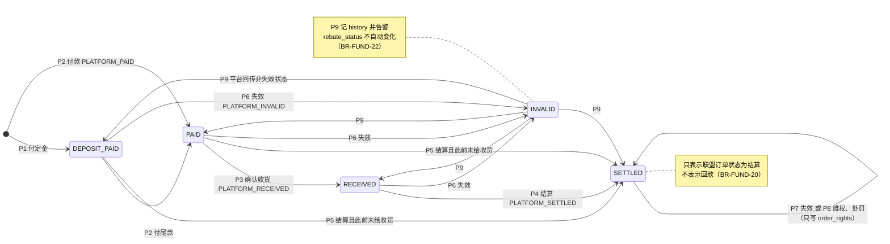
```mermaid
stateDiagram-v2
  direction LR
  [*] --> DEPOSIT_PAID: P1 付定金
  [*] --> PAID: P2 付款 PLATFORM_PAID
  DEPOSIT_PAID --> PAID: P2 付尾款
  PAID --> RECEIVED: P3 确认收货 PLATFORM_RECEIVED
  RECEIVED --> SETTLED: P4 结算 PLATFORM_SETTLED
  DEPOSIT_PAID --> SETTLED: P5 结算且此前未给收货
  PAID --> SETTLED: P5 结算且此前未给收货
  DEPOSIT_PAID --> INVALID: P6 失效 PLATFORM_INVALID
  PAID --> INVALID: P6 失效
  RECEIVED --> INVALID: P6 失效
  SETTLED --> SETTLED: P7 失效 或 P8 维权、处罚（只写 order_rights）
  INVALID --> DEPOSIT_PAID: P9 平台回传非失效状态
  INVALID --> PAID: P9
  INVALID --> RECEIVED: P9
  INVALID --> SETTLED: P9
  note right of SETTLED
    只表示联盟订单状态为结算
    不表示回款（BR-FUND-20）
  end note
  note left of INVALID
    P9 记 history 并告警
    rebate_status 不自动变化（BR-FUND-22）
  end note
```

**覆盖的异常情况**

- [x] 结算先于收货回传（P5：同一事务补写 PAID、RECEIVED、SETTLED 三条 `order_status_history`，`received_at` 取结算时间，BR-FUND-02）
- [x] 结算后失效、结算后维权或处罚（P7、P8：状态不变，写 `order_rights`，扣回走 BR-FUND-08）
- [x] 失效后平台又回传有效状态（P9：不自动复活返利，进差错单 `platform_restore`）
- [x] 状态倒退（P10：任意状态收到更早阶段的状态码，不迁移，写待处理表并告警；图中不画自环）
- [x] 映射表外的状态码（不迁移、写待处理表、告警，不丢弃、不猜测，BR-FUND-02）
- [x] 收货时间缺失（进待处理表，不进 WAITING，BR-FUND-02）
- [x] 乱序与重复回传（按 BR-ATTR-01 `attr.mtime_ordering.{platform}` 与 `content_hash`，见 §3）

**实现的 BR / AC**：BR-FUND-01（P1–P10）、BR-FUND-02、BR-FUND-22；AC-S2-10-TB、AC-S2-10-JD、AC-S2-10-PDD、AC-S2-12-TB、AC-S2-31；AC-ORD-06（F-ORD-06 同号）。

### 1.2 返利状态 `rebate_status`

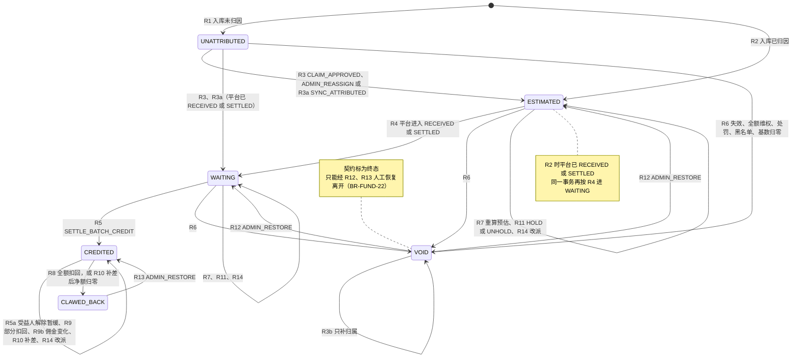
```mermaid
stateDiagram-v2
  [*] --> UNATTRIBUTED: R1 入库未归因
  [*] --> ESTIMATED: R2 入库已归因
  UNATTRIBUTED --> ESTIMATED: R3 CLAIM_APPROVED、ADMIN_REASSIGN 或 R3a SYNC_ATTRIBUTED
  UNATTRIBUTED --> WAITING: R3、R3a（平台已 RECEIVED 或 SETTLED）
  ESTIMATED --> WAITING: R4 平台进入 RECEIVED 或 SETTLED
  WAITING --> CREDITED: R5 SETTLE_BATCH_CREDIT
  UNATTRIBUTED --> VOID: R6 失效、全额维权、处罚、黑名单、基数归零
  ESTIMATED --> VOID: R6
  WAITING --> VOID: R6
  ESTIMATED --> ESTIMATED: R7 重算预估、R11 HOLD 或 UNHOLD、R14 改派
  WAITING --> WAITING: R7、R11、R14
  CREDITED --> CREDITED: R5a 受益人解除暂缓、R9 部分扣回、R9b 佣金变化、R10 补差、R14 改派
  CREDITED --> CLAWED_BACK: R8 全额扣回，或 R10 补差后净额归零
  VOID --> VOID: R3b 只补归属
  VOID --> ESTIMATED: R12 ADMIN_RESTORE
  VOID --> WAITING: R12 ADMIN_RESTORE
  CLAWED_BACK --> CREDITED: R13 ADMIN_RESTORE
  note right of ESTIMATED
    R2 时平台已 RECEIVED 或 SETTLED
    同一事务再按 R4 进 WAITING
  end note
  note left of VOID
    契约标为终态
    只能经 R12、R13 人工恢复离开（BR-FUND-22）
  end note
```

**覆盖的异常情况**

- [x] 入库时未归因、之后被同步重跑归因（R3a）或找回、改派（R3，置 `locked`）
- [x] 已作废且未归因的订单被找回或改派（R3b：只补归属，不生成快照、无分录）
- [x] 入账前失效、部分退款、佣金变化（R6、R7，无分录，BR-FUND-07）
- [x] 入账后全额或部分扣回、佣金变化、结算补差（R8、R9、R9b、R10，分录与迁移同一事务，BR-FUND-08、BR-FUND-09）
- [x] 售后中或风控、客服暂停（`rights_pending`、`hold` 只做标志，月结时暂缓或跳过，BR-FUND-04 ④⑦、BR-FUND-06）
- [x] 受益人暂缓后解除（R5a，后续批次单独入账，BR-CALC-13）
- [x] 已归属订单改派（R14：CREDITED 时先红冲再重记，BR-ATTR-20）
- [x] 作废或扣回后平台恢复、申诉撤销（R12、R13，BR-FUND-22）
- [x] 并发迁移（CAS 影响 0 行 → 重读后按迁移表判断；后台 20902）

**实现的 BR / AC**：BR-FUND-01（R1–R14）、BR-FUND-03、BR-FUND-04、BR-FUND-06、BR-FUND-07、BR-FUND-08、BR-FUND-09、BR-FUND-17、BR-FUND-22、BR-CALC-10、BR-CALC-13、BR-ATTR-16、BR-ATTR-20；AC-S1-24、AC-S1-26-TB、AC-S2-01-TB、AC-S2-03、AC-S2-04、AC-S2-05、AC-S2-06、AC-S2-09、AC-S2-11、AC-S2-31、AC-S2-48、AC-S2-57。

### 1.3 平台原始状态 → 内部事件 → `platform_status`

映射的唯一落点是 `specs/order-status-map/{platform}.csv`（BR-FUND-02，状态「待验证」）。下表的原始码取自 09 已记录的**文档结论或抓取摘要，均未实测**（CAP-TB-07、CAP-JD-07、CAP-PDD-07 状态「未开始」），只作写 csv 的起点，不是事实；实测后以 09 为准改表。表中没有出现的码一律按「映射表外」处理（告警 + 待处理表）。

| 平台 | 原始字段与值（09 记录） | 内部事件 | `platform_status` | 说明与待定 |
| --- | --- | --- | --- | --- |
| 淘宝 | `tk_status` 12 付款 | 付款（`PLATFORM_PAID`） | PAID | CAP-TB-07 |
| 淘宝 | `tk_status` 14 成功 / 确认收货 | 确认收货（`PLATFORM_RECEIVED`） | RECEIVED | 文档未见收货时间字段；缺 `received_at` 时按 BR-FUND-02 进待处理表（§9 O-05） |
| 淘宝 | `tk_status` 3 结算 | 结算（`PLATFORM_SETTLED`） | SETTLED（未给收货时走 P5） | `tk_earning_time` 为结算时间；与联盟回款日是否同一时点待 CAP-TB-08 |
| 淘宝 | `tk_status` 13 失效 / 关闭 | 失效（`PLATFORM_INVALID`） | INVALID（SETTLED 后走 P7） | 09 内两处标签不同（§9 O-10） |
| 淘宝 | 预售：`tk_deposit_time`、`deposit_price` 有值而尾款未付 | 付定金 | DEPOSIT_PAID | 定金阶段 `tk_status` 序列未知（CAP-TB-07 未知项） |
| 淘宝 | `tk_status` 11 拍下未付款 | — | 不入库 | 只见于抓取摘要 |
| 淘宝 | 维权：订单接口只有 `refund_tag`；维权单另查维权接口 | 维权 / 处罚 → `order_rights` | 不变（P8）或 R6 / R8 | 维权码到 `order_rights.status` 的映射未定义（§9 O-08） |
| 京东 | `validCode` 16 已付款 | 付款 | PAID | CAP-JD-07 |
| 京东 | `validCode` 24 已付定金 | 付定金 | DEPOSIT_PAID | 尾款后是否 24 → 16 待测 |
| 京东 | `validCode` 17 已完成 | 确认收货 | RECEIVED | `finishTime` 为收货时间 |
| 京东 | 无「结算」码 | — | — | 结算只能从 `payMonth`、`actualFee` 推出，P4 / P5 触发方式未定义（§9 O-06） |
| 京东 | `validCode` 3 取消、违规类与其他无效码 | 失效 | INVALID | 原因码 `CANCELLED` 启用前并入 REFUND（04 §2.3） |
| 京东 | `validCode` 2 无效-拆单 | — | 待定 | 拆单不能当失效，处理未定义（§9 O-06） |
| 京东 | `validCode` 15 待付款 | — | 不入库 | |
| 京东 | 实际佣金由大于 0 变 0 | 基数归零 | 不变 | R6 或 R8；能否与部分维权区分待验证（BR-FUND-08） |
| 拼多多 | `order_status` 0 已支付、1 已成团 | 付款 | PAID | 0 → 1 为同状态重复上报（§9 O-04）；CAP-PDD-07 |
| 拼多多 | `order_status` 2 确认收货 | 确认收货 | RECEIVED | `order_receive_time` |
| 拼多多 | `order_status` 3 审核成功 | — | 待定 | 无对应内部状态（§9 O-06） |
| 拼多多 | `order_status` 5 已结算 | 结算 | SETTLED | `order_settle_time` |
| 拼多多 | `order_status` 4 审核失败 | 失效或处罚 | 待定 | 处罚建模冲突（§9 O-07） |
| 拼多多 | `order_status` 10 已处罚 | 处罚 | 待定 | 同上 |

**可入账事件**（进入 WAITING 的条件）由 `specs/creditable-events.yaml` 定义，淘宝、京东、拼多多均为确认收货（BR-FUND-02）；入账时点跟随联盟月结批次（BR-FUND-04），不按收货后天数。

**本节不一致**：状态名与契约 `platform_status`、`rebate_status`、`display_status` 逐字一致（`WAITING_SETTLE` 已停用、不进契约）；其余见 §9 O-01 至 O-13。

---

## 2. 点击 → 转链 → 外跳 → 归因

出卡（搜索、详情、首页、识别、Agent）只登记 `link_id` 与报价快照、不转链；点击购买一律走 `POST /v1/links/{link_id}/open`（拍板第二批 TRADE-03）。`POST /v1/links/convert` 只供没有 link_id 的 H5 入口（`trade.convertAndOpen`），同一请求内登记 link 后按 open 同样处理。京东、拼多多在服务端转链；淘宝按 2026-10-03 变更记录不调链接 API，open 下发百川打开指令、由客户端百川 SDK 完成淘客转链（§2.4，BR-ATTR-05、BR-ATTR-27 淘宝说明）。

### 2.1 open 的判定路由（三平台共用）

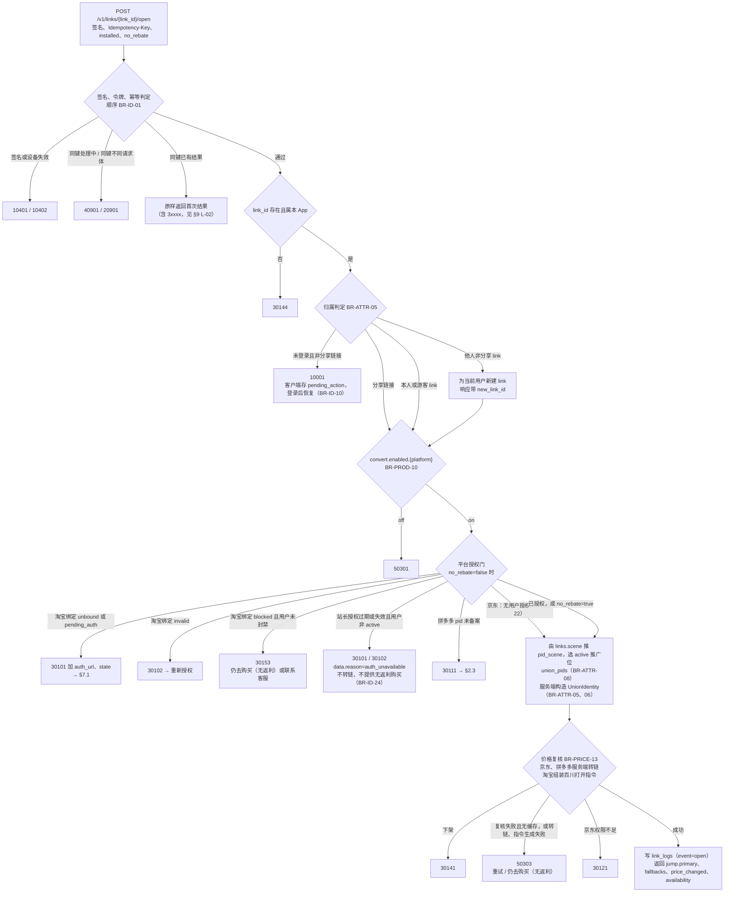
```mermaid
flowchart TD
  A["POST /v1/links/{link_id}/open<br/>签名、Idempotency-Key、installed、no_rebate"] --> G0{"签名、令牌、幂等判定<br/>顺序 BR-ID-01"}
  G0 -- "签名或设备失效" --> E0["10401 / 10402"]
  G0 -- "同键处理中 / 同键不同请求体" --> E1["40901 / 20901"]
  G0 -- "同键已有结果" --> R0["原样返回首次结果<br/>（含 3xxxx，见 §9 L-02）"]
  G0 -- "通过" --> L1{"link_id 存在且属本 App"}
  L1 -- "否" --> E2["30144"]
  L1 -- "是" --> L2{"归属判定 BR-ATTR-05"}
  L2 -- "未登录且非分享链接" --> E3["10001<br/>客户端存 pending_action，登录后恢复（BR-ID-10）"]
  L2 -- "分享链接" --> SW
  L2 -- "本人或游客 link" --> SW
  L2 -- "他人非分享 link" --> NL["为当前用户新建 link<br/>响应带 new_link_id"] --> SW
  SW{"convert.enabled.{platform}<br/>BR-PROD-10"} -- "off" --> E4["50301"]
  SW -- "on" --> AU{"平台授权门<br/>no_rebate=false 时"}
  AU -- "淘宝绑定 unbound 或 pending_auth" --> E5["30101 加 auth_url、state<br/>→ §7.1"]
  AU -- "淘宝绑定 invalid" --> E6["30102 → 重新授权"]
  AU -- "淘宝绑定 blocked 且用户未封禁" --> E7["30153<br/>仍去购买（无返利）或联系客服"]
  AU -- "站长授权过期或失效且用户非 active" --> E8["30101 / 30102<br/>data.reason=auth_unavailable<br/>不转链、不提供无返利购买（BR-ID-24）"]
  AU -- "拼多多 pid 未备案" --> E9["30111 → §2.3"]
  AU -- "京东：无用户授权（BR-ID-22）" --> PID
  AU -- "已授权，或 no_rebate=true" --> PID
  PID["由 links.scene 推 pid_scene，选 active 推广位<br/>union_pids（BR-ATTR-08）<br/>服务端构造 UnionIdentity（BR-ATTR-05、06）"] --> CV{"价格复核 BR-PRICE-13<br/>京东、拼多多服务端转链<br/>淘宝组装百川打开指令"}
  CV -- "下架" --> E10["30141"]
  CV -- "复核失败且无缓存，或转链、指令生成失败" --> E11["50303<br/>重试 / 仍去购买（无返利）"]
  CV -- "京东权限不足" --> E12["30121"]
  CV -- "成功" --> OK["写 link_logs（event=open）<br/>返回 jump.primary、fallbacks、price_changed、availability"]
```

**覆盖的异常情况**

- [x] 签名失败、设备失效、同键并发、同键不同请求体、同键重放
- [x] link 不存在或跨 App、未登录、他人链接、分享链接匿名打开
- [x] 平台开关关闭、各平台授权缺失或失效、绑定停用、站长授权过期
- [x] 商品下架、复核失败、转链失败、京东权限不足
- [x] 用户选择不授权仍购买（`no_rebate=true` 跳过授权门；站长授权过期时例外）

**实现的 BR / AC**：BR-ID-01、BR-ID-10、BR-ID-17、BR-ID-18、BR-ID-22、BR-ID-24、BR-ATTR-05、BR-ATTR-06、BR-ATTR-08、BR-ATTR-14、BR-PROD-10、BR-PRICE-12、BR-PRICE-13；AC-S1-04、05-TB、05-JD、05-PDD、06、07-TB、12、13、14、15、19、41、65。

### 2.2 京东（服务端转链）

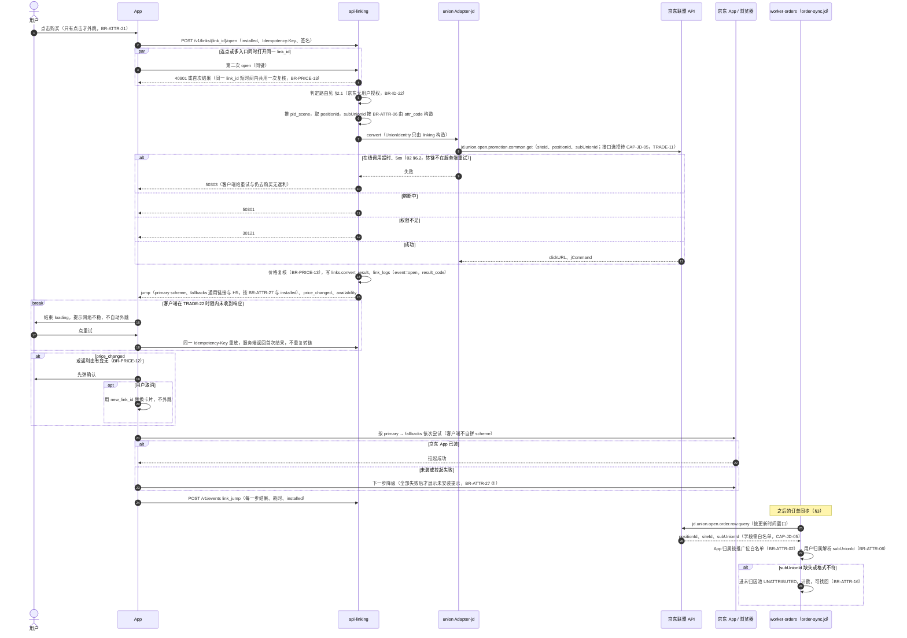
```mermaid
sequenceDiagram
  autonumber
  actor U as 用户
  participant C as App
  participant A as api·linking
  participant UA as union Adapter·jd
  participant JD as 京东联盟 API
  participant JA as 京东 App / 浏览器
  participant W as worker·orders（order-sync.jd）

  U->>C: 点击购买（只有点击才外跳，BR-ATTR-21）
  C->>A: POST /v1/links/{link_id}/open（installed、Idempotency-Key、签名）
  par 连点或多入口同时打开同一 link_id
    C->>A: 第二次 open（同键）
    A-->>C: 40901 或首次结果（同一 link_id 短时间内共用一次复核，BR-PRICE-13）
  end
  A->>A: 判定路由见 §2.1（京东无用户授权，BR-ID-22）
  A->>A: 推 pid_scene，取 positionId，subUnionId 按 BR-ATTR-06 由 attr_code 构造
  A->>UA: convert（UnionIdentity 只由 linking 构造）
  UA->>JD: jd.union.open.promotion.common.get（siteId、positionId、subUnionId；接口选择待 CAP-JD-05，TRADE-11）
  alt 在线调用超时、5xx（02 §6.2，转链不在服务端重试）
    UA-->>A: 失败
    A-->>C: 50303（客户端给重试与仍去购买无返利）
  else 熔断中
    A-->>C: 50301
  else 权限不足
    A-->>C: 30121
  else 成功
    JD-->>UA: clickURL、jCommand
  end
  A->>A: 价格复核（BR-PRICE-13），写 links.convert_result、link_logs（event=open，result_code）
  A-->>C: jump（primary scheme、fallbacks 通用链接与 H5，按 BR-ATTR-27 与 installed）、price_changed、availability
  break 客户端在 TRADE-22 时限内未收到响应
    C->>U: 结束 loading，提示网络不稳，不自动外跳
    U->>C: 点重试
    C->>A: 同一 Idempotency-Key 重放，服务端返回首次结果，不重复转链
  end
  alt price_changed 或返利由有变无（BR-PRICE-12）
    C->>U: 先弹确认
    opt 用户取消
      C->>C: 用 new_link_id 替换卡片，不外跳
    end
  end
  C->>JA: 按 primary → fallbacks 依次尝试（客户端不自拼 scheme）
  alt 京东 App 已装
    JA-->>C: 拉起成功
  else 未装或拉起失败
    C->>JA: 下一步降级（全部失败后才展示未安装提示，BR-ATTR-27 ②）
  end
  C->>A: POST /v1/events link_jump（每一步结果、耗时、installed）
  Note over W: 之后的订单同步（§3）
  W->>JD: jd.union.open.order.row.query（按更新时间窗口）
  JD-->>W: positionId、siteId、subUnionId（字段需白名单，CAP-JD-05）
  W->>W: App 归属按推广位白名单（BR-ATTR-02）→ 用户归属解析 subUnionId（BR-ATTR-06）
  alt subUnionId 缺失或格式不符
    W->>W: 进未归因池 UNATTRIBUTED，计数，可找回（BR-ATTR-16）
  end
```

**覆盖的异常情况**

- [x] 连点、多入口并发打开（同键 40901 或首次结果；同一 link_id 共用复核）
- [x] 客户端超时后用同键重试，不自动外跳（TRADE-22）
- [x] 联盟超时、熔断、权限不足（50303、50301、30121；转链不在服务端重试）
- [x] 价格变化、返利归零时用户确认或取消
- [x] 京东 App 未安装、拉起失败（按 fallbacks 降级）
- [x] 订单回传缺少用户参数（未归因池）

**实现的 BR / AC**：BR-ATTR-02、05、06、14、21、27；BR-PRICE-12、13；BR-ID-22；TRADE-03、TRADE-11、TRADE-22；CAP-JD-05、CAP-JD-06、CAP-JD-11（均未实测）；AC-S1-01-JD、02-JD、05-JD、12、16、18-JD、55、AC-S1-26-JD；AC-LINK-05、06、07。

### 2.3 拼多多（服务端转链，首次需备案）

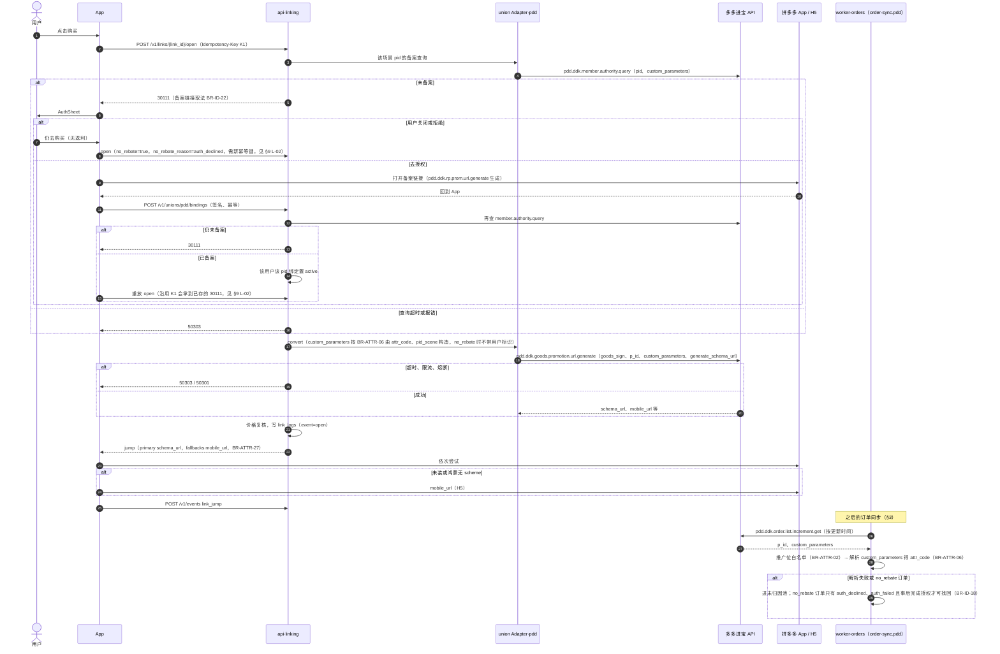
```mermaid
sequenceDiagram
  autonumber
  actor U as 用户
  participant C as App
  participant A as api·linking
  participant UA as union Adapter·pdd
  participant PD as 多多进宝 API
  participant PA as 拼多多 App / H5
  participant W as worker·orders（order-sync.pdd）

  U->>C: 点击购买
  C->>A: POST /v1/links/{link_id}/open（Idempotency-Key K1）
  A->>UA: 该场景 pid 的备案查询
  UA->>PD: pdd.ddk.member.authority.query（pid、custom_parameters）
  alt 未备案
    A-->>C: 30111（备案链接取法 BR-ID-22）
    C->>U: AuthSheet
    alt 用户关闭或拒绝
      U->>C: 仍去购买（无返利）
      C->>A: open（no_rebate=true，no_rebate_reason=auth_declined，需新幂等键，见 §9 L-02）
    else 去授权
      C->>PA: 打开备案链接（pdd.ddk.rp.prom.url.generate 生成）
      PA-->>C: 回到 App
      C->>A: POST /v1/unions/pdd/bindings（签名、幂等）
      A->>PD: 再查 member.authority.query
      alt 仍未备案
        A-->>C: 30111
      else 已备案
        A->>A: 该用户该 pid 绑定置 active
        C->>A: 重放 open（沿用 K1 会拿到已存的 30111，见 §9 L-02）
      end
    end
  else 查询超时或报错
    A-->>C: 50303
  end
  A->>UA: convert（custom_parameters 按 BR-ATTR-06 由 attr_code、pid_scene 构造，no_rebate 时不带用户标识）
  UA->>PD: pdd.ddk.goods.promotion.url.generate（goods_sign、p_id、custom_parameters、generate_schema_url）
  alt 超时、限流、熔断
    A-->>C: 50303 / 50301
  else 成功
    PD-->>UA: schema_url、mobile_url 等
  end
  A->>A: 价格复核，写 link_logs（event=open）
  A-->>C: jump（primary schema_url，fallbacks mobile_url，BR-ATTR-27）
  C->>PA: 依次尝试
  alt 未装或鸿蒙无 scheme
    C->>PA: mobile_url（H5）
  end
  C->>A: POST /v1/events link_jump
  Note over W: 之后的订单同步（§3）
  W->>PD: pdd.ddk.order.list.increment.get（按更新时间）
  PD-->>W: p_id、custom_parameters
  W->>W: 推广位白名单（BR-ATTR-02）→ 解析 custom_parameters 得 attr_code（BR-ATTR-06）
  alt 解析失败或 no_rebate 订单
    W->>W: 进未归因池；no_rebate 订单只有 auth_declined、auth_failed 且事后完成授权才可找回（BR-ID-18）
  end
```

**覆盖的异常情况**

- [x] 首次未备案（30111）→ 授权 → 回到 App → 再查询 → 重放 open
- [x] 用户关闭授权或拒绝（无返利购买，`no_rebate_reason=auth_declined`）
- [x] 授权后仍未备案、备案查询超时
- [x] 转链超时、限流、熔断
- [x] App 未安装、鸿蒙无 scheme（降级 H5）
- [x] 订单用户参数解析失败、无返利订单的找回边界

**实现的 BR / AC**：BR-ID-18、BR-ID-22、BR-ATTR-02、06、14、27；BR-PRICE-13；CAP-PDD-05、CAP-PDD-06、CAP-PDD-11（均未实测）；AC-S1-01-PDD、02-PDD、05-PDD、06、18-PDD、26-PDD；AC-LINK-04。

### 2.4 淘宝（客户端百川转链）

> 依据 `docs/changes/20261003-淘宝转链改客户端百川.md`（2026-10-03 合入）与 BR-ATTR-05、BR-ATTR-27 的「2026-10-03 淘宝」说明：链接转换 API 为邀请制、新 App 首版拿不到（09 2_TB §2.5），淘宝 Adapter **不调链接 API**；open 照常做归属、授权校验、价格复核（取详情接口）与 `link_logs`，响应的 `jump` 放百川打开指令，由客户端百川 SDK 完成淘客转链；任何 s.click / uland 用 openByUrl 打开时都不传 pid（SDK 不支持二次转链）。承载指令的契约字段 `JumpStep.sdk` 尚未补进代码仓库（§9 L-03），分享链接在 App 外打开的归属等问题待负责人（§9 L-12）。

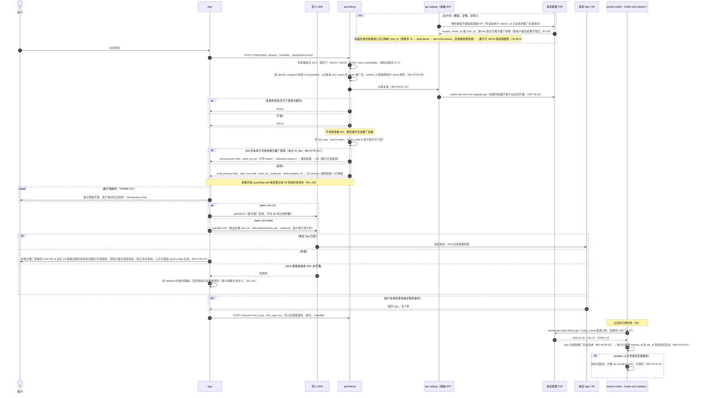
```mermaid
sequenceDiagram
  autonumber
  actor U as 用户
  participant C as App
  participant BC as 百川 SDK
  participant A as api·linking
  participant CT as api·catalog（基础 API）
  participant TB as 淘宝联盟 TOP
  participant TA as 淘宝 App / H5
  participant W as worker·orders（order-sync.taobao）

  opt 出卡时（搜索、详情、识别）
    CT->>TB: 物料搜索升级版等基础 API（带当前用户 relation_id 与该场景推广位调用时）
    TB-->>CT: coupon_share_url 或 click_url，随 link 登记为我方推广链接（跨用户缓存结果不登记，B1-05）
    Note over CT: 粘贴的淘宝链接或口令只解析 item_id（链接带 ID → tpwd.parse → item.click.extract，后两级权限待核）→ 都不行 30132 加标题搜索（02 §6.1）
  end
  U->>C: 点击购买
  C->>A: POST /v1/links/{link_id}/open（installed、Idempotency-Key）
  A->>A: 判定路由见 §2.1：绑定门（30101 / 30102 / 30153 / auth_unavailable，授权流程见 §7.1）
  A->>A: 按 identity_snapshot 构造 UnionIdentity：pid 取该 pid_scene 的 active 推广位，relation_id 取快照用户 active 绑定（BR-ATTR-05）
  A->>CT: 价格复核（BR-PRICE-13）
  CT->>TB: taobao.tbk.item.info.upgrade.get（权限待联盟开放平台应用开通，CAP-TB-02）
  alt 复核失败且无已下发指令缓存
    A-->>C: 50303
  else 下架
    A-->>C: 30141
  end
  Note over A: 不调用链接 API，服务端不生成推广链接
  A->>A: 写 link_logs（event=open，result_code=0 表示指令已下发）
  alt link 带本用户可用的我方推广链接（未过 W_link，BR-ATTR-13）
    A-->>C: jump.primary=sdk，open_by=url（不带 taoke）；fallbacks taobao:// → 通用链接 → H5（都打开该链接）
  else 没有
    A-->>C: jump.primary=sdk，open_by=code（item_id、taoke.pid、taoke.relation_id）；无 scheme / 通用链接 / H5 降级
  end
  Note over A,C: 承载字段 JumpStep.sdk 按变更记录 §3 待契约任务补（§9 L-03）
  break 客户端超时（TRADE-22）
    C->>U: 提示网络不稳，用户重试时沿用同一 Idempotency-Key
  end
  alt open_by=url
    C->>BC: openByUrl（我方推广链接，不传 pid 等分佣参数）
  else open_by=code
    C->>BC: openByCode（商品详情 item_id，AlibcTaokeParams pid、relationId，客户端不改不补）
  end
  alt 淘宝 App 已装
    BC->>TA: 拉起淘宝，SDK 完成淘客转链
  else 未装
    C->>U: 有我方推广链接且 CAP-TB-11 证实 H5 保留归因时系统浏览器打开该链接，否则只提示安装淘宝（有口令时复制，口令只能由 tpwd.create 生成，BR-ATTR-27）
  else SDK 报错或电商 SDK 未开通
    BC-->>C: 失败码
    C->>C: 有 fallbacks 时依次降级，没有则提示安装或找回（客户端提示未定义，§9 L-05）
  end
  opt 用户在淘宝登录或详情页放弃
    TA-->>C: 返回 App，未下单
  end
  C->>A: POST /v1/events link_jump（sdk_open_by、百川回调错误码、耗时、installed）
  Note over W: 之后的订单同步（§3）
  W->>TB: taobao.tbk.order.details.get（order_scene 渠道订单，权限待 CAP-TB-07）
  TB-->>W: adzone_id、site_id、relation_id
  W->>W: App 归属按推广位白名单（BR-ATTR-02）→ 用户归属按 relation_id 加 attr_at 落在绑定区间（BR-ATTR-07）
  alt relation_id 为空或无匹配绑定
    W->>W: 进未归因池，计数 attr_binding_miss，可找回（BR-ATTR-16）
  end
```

**覆盖的异常情况**

- [x] 绑定缺失、失效、停用、站长授权过期（在服务端拦截，见 §2.1、§7）
- [x] 价格复核失败、下架（50303、30141）
- [x] 客户端超时后同键重试
- [x] 我方推广链接不存在、过期或来自跨用户缓存（改走 open_by=code）
- [x] s.click / uland 不二次转链；粘贴链接与口令只解析 item_id，解析不了 30132
- [x] 淘宝 App 未装、SDK 报错或未开通（降级或提示）
- [x] 用户在淘宝侧放弃
- [x] 订单无 relation_id 或绑定不匹配（未归因池）

**实现的 BR / AC**：BR-ATTR-02、05、06、07、13、14、16、27；BR-ID-17、BR-ID-24；BR-PRICE-13、BR-PRICE-21；变更记录 20261003 §1、§4；CAP-TB-02、05、06、07、11（均未实测）；AC-S1-01-TB、02-TB、05-TB、18-TB、26-TB、65；AC-LINK-03。

---

## 3. 订单同步与归因流水线

按 BR-ATTR-01 的顺序画（与 02 §5.2 的先后有出入，见 §9 S-01）。`platform_status` 唯一写者 orders 的 order-sync；`rebate_status` 唯一写者 settlement，由 order-sync 在同一事务内调用 settlement 命令迁移（BR-FUND-01）。同步、找回通过、管理员改派共用同一把 `order_key` advisory 锁（02 §18）。

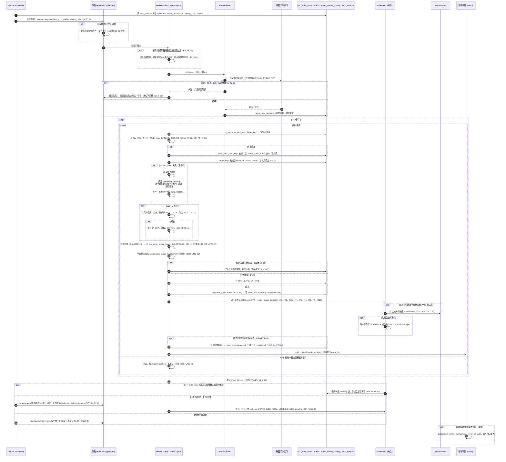
```mermaid
sequenceDiagram
  autonumber
  participant S as worker·scheduler
  participant Q as 队列 order-sync.{platform}
  participant W as worker·orders（order-sync）
  participant UA as union Adapter
  participant UP as 联盟订单接口
  participant DB as PG（order_keys、orders、order_status_history、sync_cursors）
  participant T as settlement（命令）
  participant M as commission
  participant EV as 领域事件（evt.*）

  S->>DB: 读 sync_cursors 水位（platform、union_account_id、query_kind、scene）
  S-)Q: 窗口任务，singletonKey=platform:account:kind:window_start（02 §7.1）
  alt 同键任务已在队列中
    Q->>Q: 新任务被静默丢弃（是否等价于去重待 B1-01 实测）
  end
  Q->>W: 取窗口任务
  opt 该同步依赖站长授权且授权已过期（BR-ID-24）
    W->>W: 记断点并暂停，重新授权后从断点补拉（断点存放处未定，§9 S-06）
  end
  W->>UA: listOrders（窗口、翻页）
  UA->>UP: 按更新时间拉取（各平台接口见 §1.3、09 CAP-*-07）
  alt 超时、限流、熔断（治理参数 02 §6.2）
    UA-->>W: 失败，只重试幂等读
    W->>Q: 任务失败 → 重试仍失败进死信并告警，水位不前移（§9 S-05）
  else 成功
    UP-->>UA: 原始订单页
    UA->>DB: union_raw_payloads（请求摘要、响应原文）
  end
  loop 每个子订单
    critical 同一事务
      W->>DB: pg_advisory_xact_lock（order_key），拿锁后重读
      W->>W: ① App 归属：推广位白名单、site、同步起点、付款时间（BR-ATTR-02、BR-ATTR-25）
      alt ① 失败
        W->>DB: order_sync_drop_keys 去重计数，order_sync_drops 加一，不入库
      end
      W->>DB: order_keys 取或建 order_id，upsert orders，首次入库定 attr_at
      alt content_hash 未变（重复行）
        W->>W: 结束本子订单
      else 开启 attr.mtime_ordering 且平台更新时间早于库内（乱序旧数据）
        W->>W: 丢弃，不改任何字段（BR-ATTR-01）
      end
      opt user_id 为空
        W->>W: ② 用户归属（京东、拼多多 BR-ATTR-06；淘宝 BR-ATTR-07）
        alt 失败
          W->>W: 留在未归因池，计数，跳过 ⑤⑥（BR-ATTR-16）
        end
      end
      W->>W: ③ 黑名单（BR-ATTR-26）→ ④ buy_type、scene_basis（BR-ATTR-08、09）→ ⑤ 来源回填（BR-ATTR-15）
      W->>W: 平台状态码按 specs/order-status-map 映射为内部事件（BR-FUND-02）
      alt 映射表外的状态码，或缺收货时间
        W->>DB: 写待处理表并告警，状态不变（表名未定，§9 S-07）
      else 状态倒退（P10）
        W->>DB: 不迁移，写待处理表并告警
      else 正常
        W->>DB: platform_status transition（CAS），写 order_status_history（field=platform）
      end
      W->>T: 同一事务调 settlement 命令：rebate_status transition（R1、R2、R3a、R4、R6、R7、R8、R9、R9b）
      opt 首次已归因且平台状态到 PAID 及之后
        T->>M: ⑥ 生成分佣快照 commission_splits（BR-CALC-10）
      end
      opt 入账后逆向事件
        T->>T: 同一事务写 CLAWBACK 或负向 SETTLE_ADJUST（§4）
      end
      opt 该子订单有待审找回子项（BR-ATTR-16）
        W->>DB: 归属给申请人 → claim_items cancelled，归属他人 → rejected（NOT_IN_POOL）
      end
      W-)EV: order.created / order.updated，同事务写 event_log
    option CAS 影响 0 行或迁移表外事件
      W->>W: 回滚，抛 IllegalTransition，不重试，告警（BR-FUND-01）
    end
  end
  W->>DB: 推进 sync_cursors（推进时点未定，§9 S-05）
  par 同一 order_key 上并发的找回通过或后台改派
    T->>DB: 等同一把 advisory 锁，拿锁后重读再写（BR-ATTR-20）
  and 回扫与维权、处罚拉取
    S-)Q: order-rescan 按付款时间回扫，维权、处罚按 listRefunds / listPunishments 拉取（02 §7.1）
    W->>T: 维权、处罚只经 settlement 命令写 order_rights，同事务重算 rights_pending（BR-FUND-06）
  and 后台手动同步
    S-)Q: /admin/v1/order-syncs 按平台 × 时间窗 × 状态投递同样的窗口任务
  end
  opt 事件消费者重复收到同一事件
    EV->>EV: processed_events（consumer、event_id）去重，副作用同事务
  end
```

**覆盖的异常情况**

- [x] 窗口任务重复投递（singletonKey）、联盟超时、限流、熔断、失败进死信
- [x] 站长授权过期期间依赖授权的同步记断点、恢复后补拉
- [x] 推广位不属本 App、site 不符、早于同步起点、缺付款时间（丢弃计数，不入库）
- [x] 重复行（`content_hash` 未变）、乱序旧数据（`attr.mtime_ordering`）
- [x] 用户参数缺失或格式不符（未归因池，可找回）
- [x] 映射表外状态码、缺收货时间、状态倒退（待处理表，不迁移）
- [x] 失效后恢复（P9，不自动复活返利，见 §1.1）
- [x] 同一订单上同步、找回、改派并发（同一把 advisory 锁）
- [x] 迁移冲突或表外事件（回滚、告警、不重试）
- [x] 事件重复投递（`processed_events` 去重）

**实现的 BR / AC**：BR-ATTR-01、02、06、07、08、09、15、16、20、22、25、26；BR-FUND-01、02、06；BR-CALC-10；BR-ID-24；AC-S1-20、21、22、23、24、25、27、28-TB、28-JD、28-PDD、48-TB、50-TB、51-TB；AC-S2-10-TB、AC-S2-31；AC-ORD-01 至 AC-ORD-06。

### 3.1 找回（未归因池）

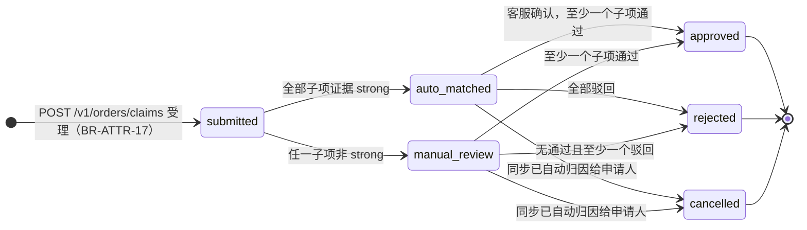
```mermaid
stateDiagram-v2
  direction LR
  [*] --> submitted: POST /v1/orders/claims 受理（BR-ATTR-17）
  submitted --> auto_matched: 全部子项证据 strong
  submitted --> manual_review: 任一子项非 strong
  auto_matched --> approved: 客服确认，至少一个子项通过
  manual_review --> approved: 至少一个子项通过
  auto_matched --> rejected: 全部驳回
  manual_review --> rejected: 无通过且至少一个驳回
  auto_matched --> cancelled: 同步已自动归因给申请人
  manual_review --> cancelled: 同步已自动归因给申请人
  approved --> [*]
  rejected --> [*]
  cancelled --> [*]
```

**覆盖的异常情况**：提交时的开关、风控、次数、匹配、窗口、重复、已归属校验（30206、30203、30201、30202、30205、30204，BR-ATTR-17）；同一子订单多人申请时先通过者胜，其余系统驳回 `NOT_IN_POOL`（BR-ATTR-20）；同步先一步归因时子项自动 `cancelled` 或 `rejected`（BR-ATTR-16）。

**实现的 BR / AC**：BR-ATTR-16、17、18、20；AC-S1-26-TB、26-JD、26-PDD、AC-S1-43；AC-ORD-09。

---

## 4. 佣金：预估 → 月结 → 入账 → 扣回，与余额

资金流向（02 §17）：settlement 只产出记账指令；ledger 是唯一改余额处；金额只由 `packages/domain` 计算。订单相关的余额与分录只能在该子订单 `rebate_status` 迁移（含自迁移）的同一事务内变更，不依赖领域事件（BR-FUND-01）。分录模板、uniq_key 格式与金额口径只在 08（BR-FUND-05、BR-FUND-08、BR-FUND-09）与 `specs/ledger-rules.md` 维护。

「联盟结算」与「用户入账」是两个节点：平台状态到 SETTLED 不等于入账，入账要等月结账单校验通过、人工确认后的批次执行（§4.2–§4.4）。业务扣回（CLAWBACK，§4.5）与纠错红冲（uniq_key 加 `:REVERSE`，BR-FUND-16）是两回事，后者只用于改派（R14）与调账更正。

### 4.1 预估与入账前的变化

预估阶段不写任何分录、不动 `account_balances`（BR-FUND-03）。下图是 settlement 命令对一个尚未入账的子订单处理一次事件，事务由调用方持有（订单同步见 §3.2）。

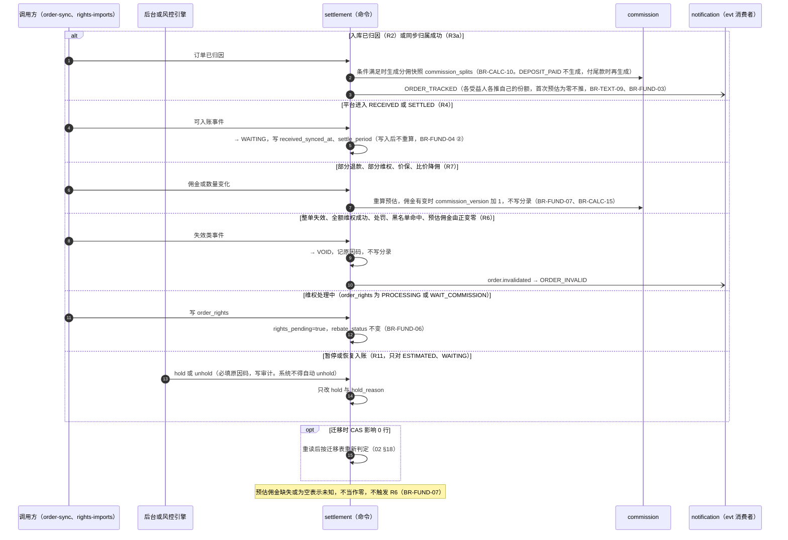
```mermaid
sequenceDiagram
  autonumber
  participant W as 调用方（order-sync、rights-imports）
  participant ADM as 后台或风控引擎
  participant T as settlement（命令）
  participant M as commission
  participant N as notification（evt 消费者）

  alt 入库已归因（R2）或同步归属成功（R3a）
    W->>T: 订单已归因
    T->>M: 条件满足时生成分佣快照 commission_splits（BR-CALC-10。DEPOSIT_PAID 不生成，付尾款时再生成）
    T-)N: ORDER_TRACKED（各受益人各推自己的份额，首次预估为零不推，BR-TEXT-09、BR-FUND-03）
  else 平台进入 RECEIVED 或 SETTLED（R4）
    W->>T: 可入账事件
    T->>T: → WAITING，写 received_synced_at、settle_period（写入后不重算，BR-FUND-04 ②）
  else 部分退款、部分维权、价保、比价降佣（R7）
    W->>T: 佣金或数量变化
    T->>M: 重算预估，佣金有变时 commission_version 加 1，不写分录（BR-FUND-07、BR-CALC-15）
  else 整单失效、全额维权成功、处罚、黑名单命中、预估佣金由正变零（R6）
    W->>T: 失效类事件
    T->>T: → VOID，记原因码，不写分录
    T-)N: order.invalidated → ORDER_INVALID
  else 维权处理中（order_rights 为 PROCESSING 或 WAIT_COMMISSION）
    W->>T: 写 order_rights
    T->>T: rights_pending=true，rebate_status 不变（BR-FUND-06）
  else 暂停或恢复入账（R11，只对 ESTIMATED、WAITING）
    ADM->>T: hold 或 unhold（必填原因码，写审计。系统不得自动 unhold）
    T->>T: 只改 hold 与 hold_reason
  end
  opt 迁移时 CAS 影响 0 行
    T->>T: 重读后按迁移表重新判定（02 §18）
  end
  Note over T: 预估佣金缺失或为空表示未知，不当作零，不触发 R6（BR-FUND-07）
```

**覆盖的异常情况**

- [x] 付定金阶段不生成快照、不计预估
- [x] 入账前部分退款、佣金变化（R7 只重算）；整单失效、处罚、黑名单、佣金归零（R6 作废，无分录）
- [x] 联盟回传的佣金字段缺失（不覆盖、不当作零）
- [x] 售后处理中与人工、风控暂停（只置标志位，不改状态）
- [x] CAS 冲突（重读后重新判定）

**实现的 BR / AC**：BR-FUND-01、03、04 ②、06、07；BR-CALC-10、12、15；BR-TEXT-09；AC-S1-24、AC-S2-03、AC-S2-04、AC-S2-05、AC-S2-12-TB。

### 4.2 月结账单生成与校验

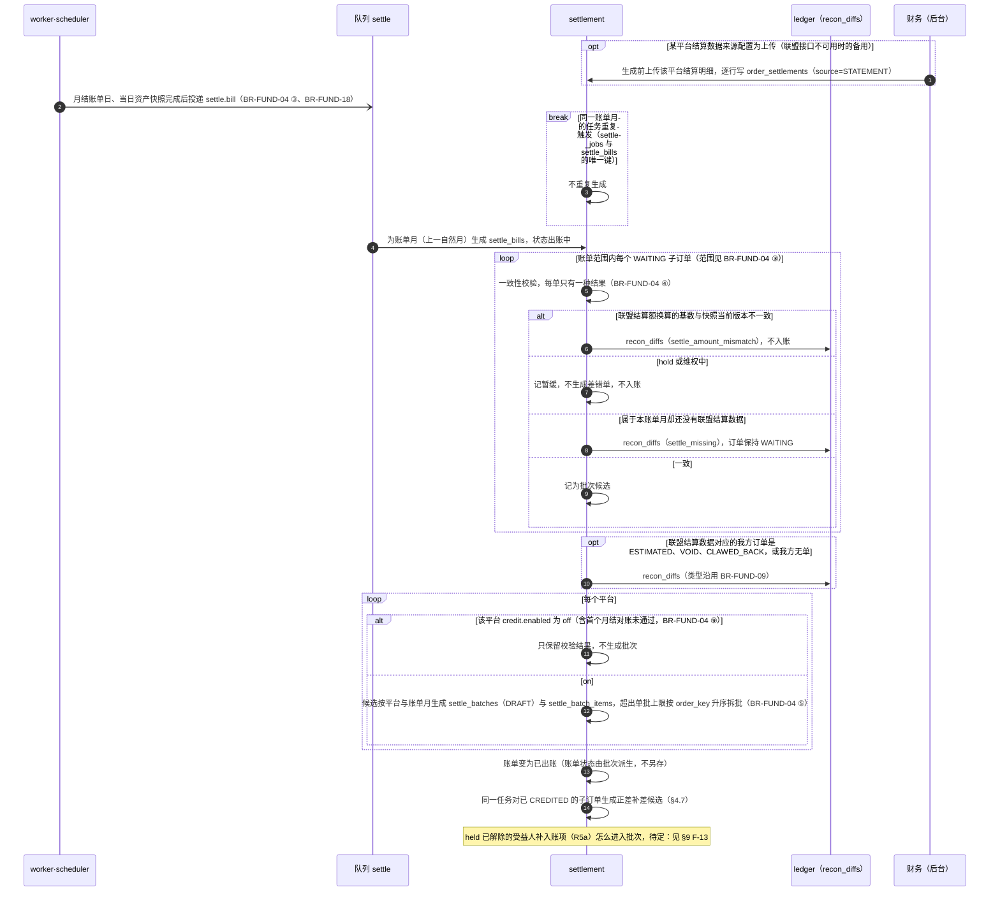
```mermaid
sequenceDiagram
  autonumber
  participant S as worker·scheduler
  participant J as 队列 settle
  participant T as settlement
  participant L as ledger（recon_diffs）
  participant F as 财务（后台）

  opt 某平台结算数据来源配置为上传（联盟接口不可用时的备用）
    F->>T: 生成前上传该平台结算明细，逐行写 order_settlements（source=STATEMENT）
  end
  S-)J: 月结账单日、当日资产快照完成后投递 settle.bill（BR-FUND-04 ③、BR-FUND-18）
  break 同一账单月的任务重复触发（settle_jobs 与 settle_bills 的唯一键）
    T->>T: 不重复生成
  end
  J->>T: 为账单月（上一自然月）生成 settle_bills，状态出账中
  loop 账单范围内每个 WAITING 子订单（范围见 BR-FUND-04 ③）
    T->>T: 一致性校验，每单只有一种结果（BR-FUND-04 ④）
    alt 联盟结算额换算的基数与快照当前版本不一致
      T->>L: recon_diffs（settle_amount_mismatch），不入账
    else hold 或维权中
      T->>T: 记暂缓，不生成差错单，不入账
    else 属于本账单月却还没有联盟结算数据
      T->>L: recon_diffs（settle_missing），订单保持 WAITING
    else 一致
      T->>T: 记为批次候选
    end
  end
  opt 联盟结算数据对应的我方订单是 ESTIMATED、VOID、CLAWED_BACK，或我方无单
    T->>L: recon_diffs（类型沿用 BR-FUND-09）
  end
  loop 每个平台
    alt 该平台 credit.enabled 为 off（含首个月结对账未通过，BR-FUND-04 ⑨）
      T->>T: 只保留校验结果，不生成批次
    else on
      T->>T: 候选按平台与账单月生成 settle_batches（DRAFT）与 settle_batch_items，超出单批上限按 order_key 升序拆批（BR-FUND-04 ⑤）
    end
  end
  T->>T: 账单变为已出账（账单状态由批次派生，不另存）
  T->>T: 同一任务对已 CREDITED 的子订单生成正差补差候选（§4.7）
  Note over T: held 已解除的受益人补入账项（R5a）怎么进入批次，待定：见 §9 F-13
```

**覆盖的异常情况**

- [x] 任务重复触发（唯一键，不重复生成）
- [x] 金额不一致、应结未结、结算数据对不上我方订单（差错单，不入账）
- [x] hold 或维权中（暂缓，不生成差错单）
- [x] 平台入账开关关闭或首个月结对账未通过（只保留校验结果，不生成批次）
- [x] 联盟接口不可用（上传结算明细备用）

**实现的 BR / AC**：BR-FUND-04 ③④⑤⑨、BR-FUND-06、BR-FUND-09、BR-FUND-18、BR-CALC-03；拍板第二批 FUND-01、FUND-07；AC-S2-01-TB、AC-S2-01-JD、AC-S2-01-PDD、AC-S2-03、AC-S2-51。

### 4.3 账单确认与批次执行

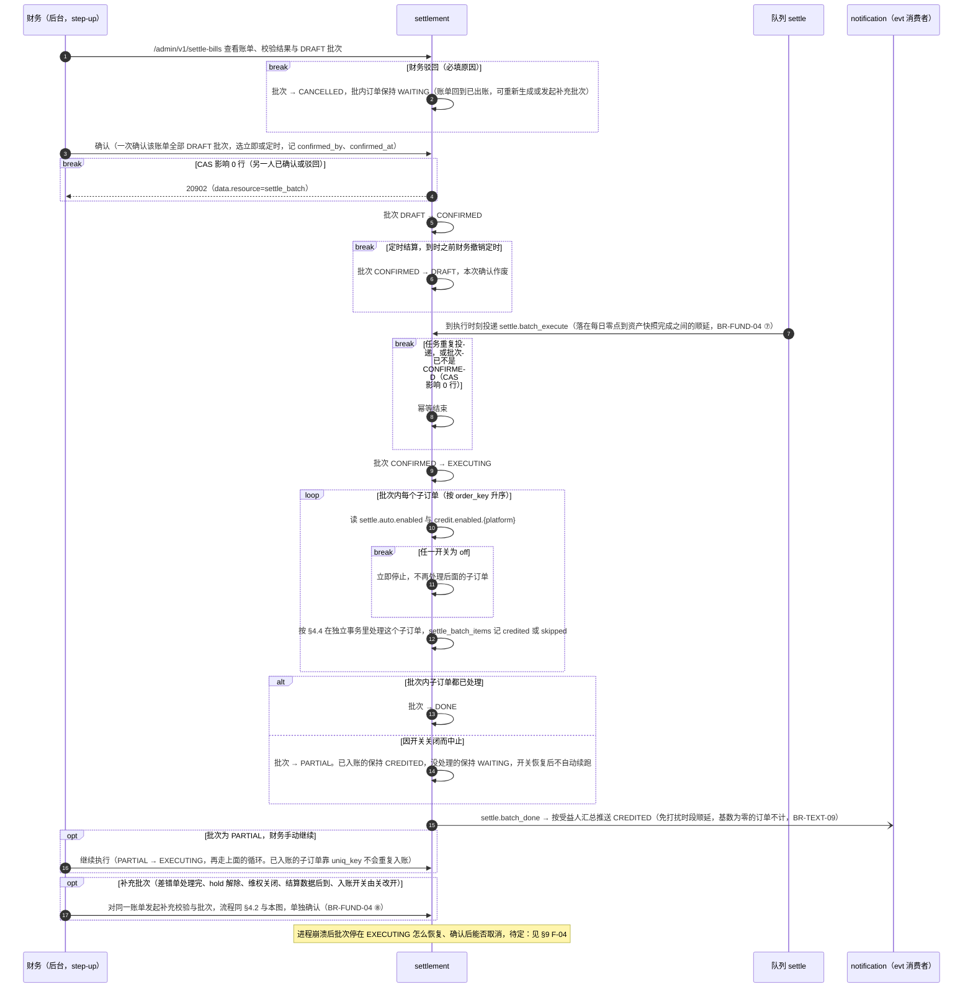
```mermaid
sequenceDiagram
  autonumber
  participant F as 财务（后台，step-up）
  participant T as settlement
  participant J as 队列 settle
  participant N as notification（evt 消费者）

  F->>T: /admin/v1/settle-bills 查看账单、校验结果与 DRAFT 批次
  break 财务驳回（必填原因）
    T->>T: 批次 → CANCELLED，批内订单保持 WAITING（账单回到已出账，可重新生成或发起补充批次）
  end
  F->>T: 确认（一次确认该账单全部 DRAFT 批次，选立即或定时，记 confirmed_by、confirmed_at）
  break CAS 影响 0 行（另一人已确认或驳回）
    T-->>F: 20902（data.resource=settle_batch）
  end
  T->>T: 批次 DRAFT → CONFIRMED
  break 定时结算，到时之前财务撤销定时
    T->>T: 批次 CONFIRMED → DRAFT，本次确认作废
  end
  J->>T: 到执行时刻投递 settle.batch_execute（落在每日零点到资产快照完成之间的顺延，BR-FUND-04 ⑦）
  break 任务重复投递，或批次已不是 CONFIRMED（CAS 影响 0 行）
    T->>T: 幂等结束
  end
  T->>T: 批次 CONFIRMED → EXECUTING
  loop 批次内每个子订单（按 order_key 升序）
    T->>T: 读 settle.auto.enabled 与 credit.enabled.{platform}
    break 任一开关为 off
      T->>T: 立即停止，不再处理后面的子订单
    end
    T->>T: 按 §4.4 在独立事务里处理这个子订单，settle_batch_items 记 credited 或 skipped
  end
  alt 批次内子订单都已处理
    T->>T: 批次 → DONE
  else 因开关关闭而中止
    T->>T: 批次 → PARTIAL。已入账的保持 CREDITED，没处理的保持 WAITING，开关恢复后不自动续跑
  end
  T-)N: settle.batch_done → 按受益人汇总推送 CREDITED（免打扰时段顺延，基数为零的订单不计，BR-TEXT-09）
  opt 批次为 PARTIAL，财务手动继续
    F->>T: 继续执行（PARTIAL → EXECUTING，再走上面的循环。已入账的子订单靠 uniq_key 不会重复入账）
  end
  opt 补充批次（差错单处理完、hold 解除、维权关闭、结算数据后到、入账开关由关改开）
    F->>T: 对同一账单发起补充校验与批次，流程同 §4.2 与本图，单独确认（BR-FUND-04 ⑧）
  end
  Note over T: 进程崩溃后批次停在 EXECUTING 怎么恢复、确认后能否取消，待定：见 §9 F-04
```

**覆盖的异常情况**

- [x] 财务驳回（批次作废，订单保持 WAITING，不执行）
- [x] 两人同时操作同一批次（CAS，后到者 20902）
- [x] 定时结算在执行前撤销（回到 DRAFT，不执行）
- [x] 执行任务重复投递（CAS 幂等结束）
- [x] 执行中关闭开关（退出循环，批次 PARTIAL，人工继续）
- [x] 批次重放、续跑（uniq_key 保证只入账一次，§4.4）
- [x] 补充批次

**实现的 BR / AC**：BR-FUND-04 ⑥⑦⑧、BR-FUND-20、BR-TEXT-09；拍板第二批 FUND-01、§8 ADD-05；AC-S2-01-TB、AC-S2-51、AC-S2-52；测试 ID `SM-SB-<n>`。

### 4.4 单个子订单的入账事务（R5、R5a）

批次里有两类项：首次入账（订单为 WAITING，R5）与受益人补入账（订单已 CREDITED、该受益人的暂缓已解除，R5a）。**先判定每个受益人怎么处理，再写互斥的凭证**：正常入账、暂缓不入账、失效记平台，三者只取其一。

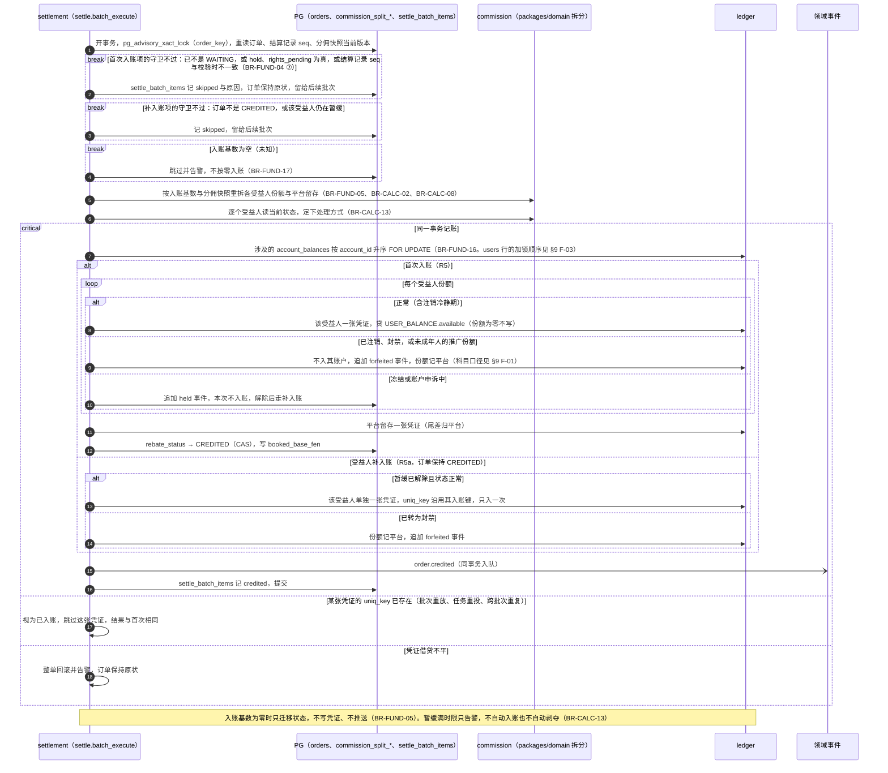
```mermaid
sequenceDiagram
  autonumber
  participant T as settlement（settle.batch_execute）
  participant DB as PG（orders、commission_split_*、settle_batch_items）
  participant M as commission（packages/domain 拆分）
  participant L as ledger
  participant EV as 领域事件

  T->>DB: 开事务，pg_advisory_xact_lock（order_key），重读订单、结算记录 seq、分佣快照当前版本
  break 首次入账项的守卫不过：已不是 WAITING，或 hold、rights_pending 为真，或结算记录 seq 与校验时不一致（BR-FUND-04 ⑦）
    T->>DB: settle_batch_items 记 skipped 与原因，订单保持原状，留给后续批次
  end
  break 补入账项的守卫不过：订单不是 CREDITED，或该受益人仍在暂缓
    T->>DB: 记 skipped，留给后续批次
  end
  break 入账基数为空（未知）
    T->>DB: 跳过并告警，不按零入账（BR-FUND-17）
  end
  T->>M: 按入账基数与分佣快照重拆各受益人份额与平台留存（BR-FUND-05、BR-CALC-02、BR-CALC-08）
  T->>M: 逐个受益人读当前状态，定下处理方式（BR-CALC-13）
  critical 同一事务记账
    T->>L: 涉及的 account_balances 按 account_id 升序 FOR UPDATE（BR-FUND-16。users 行的加锁顺序见 §9 F-03）
    alt 首次入账（R5）
      loop 每个受益人份额
        alt 正常（含注销冷静期）
          T->>L: 该受益人一张凭证，贷 USER_BALANCE.available（份额为零不写）
        else 已注销、封禁，或未成年人的推广份额
          T->>L: 不入其账户，追加 forfeited 事件，份额记平台（科目口径见 §9 F-01）
        else 冻结或账户申诉中
          T->>DB: 追加 held 事件，本次不入账，解除后走补入账
        end
      end
      T->>L: 平台留存一张凭证（尾差归平台）
      T->>DB: rebate_status → CREDITED（CAS），写 booked_base_fen
    else 受益人补入账（R5a，订单保持 CREDITED）
      alt 暂缓已解除且状态正常
        T->>L: 该受益人单独一张凭证，uniq_key 沿用其入账键，只入一次
      else 已转为封禁
        T->>L: 份额记平台，追加 forfeited 事件
      end
    end
    T-)EV: order.credited（同事务入队）
    T->>DB: settle_batch_items 记 credited，提交
  option 某张凭证的 uniq_key 已存在（批次重放、任务重投、跨批次重复）
    T->>T: 视为已入账，跳过这张凭证，结果与首次相同
  option 凭证借贷不平
    T->>T: 整单回滚并告警，订单保持原状
  end
  Note over T,L: 入账基数为零时只迁移状态，不写凭证、不推送（BR-FUND-05）。暂缓满时限只告警，不自动入账也不自动剥夺（BR-CALC-13）
```

**覆盖的异常情况**

- [x] 执行时订单状态已变、被暂停、进入售后、结算额又有更新（跳过，不入账）
- [x] 入账基数未知（跳过并告警）
- [x] 受益人注销、封禁、未成年（份额记平台，不入其账户）；冻结或申诉中（暂缓，其余受益人照常）
- [x] 暂缓解除后的补入账有独立入口（守卫是订单已 CREDITED 且该受益人已解除），不会被首次入账的守卫挡住
- [x] 批次重放、任务重投（uniq_key 只入账一次）
- [x] 凭证不平（整单回滚）
- [x] 并发：`order_key` 锁内重读，余额行按固定顺序加锁

**实现的 BR / AC**：BR-FUND-01 R5、R5a；BR-FUND-04 ⑦⑩；BR-FUND-05；BR-FUND-16；BR-FUND-17；BR-CALC-02、08、13；AC-S2-01-TB、AC-S2-03、AC-S2-34、AC-S2-35、AC-S2-39、AC-S2-45、AC-S2-46、AC-S2-52、AC-S2-57。

### 4.5 入账后扣回（R8、R9）

CREDITED 的子订单收到逆向事件时，扣回凭证与状态迁移在触发方的同一事务内完成（订单同步 §3.2、维权导入、后台复核确认）。判定顺序：先认出确定归零的事件，再给其余事件取新基数；先定每个受益人的扣回记到哪里，再写凭证。

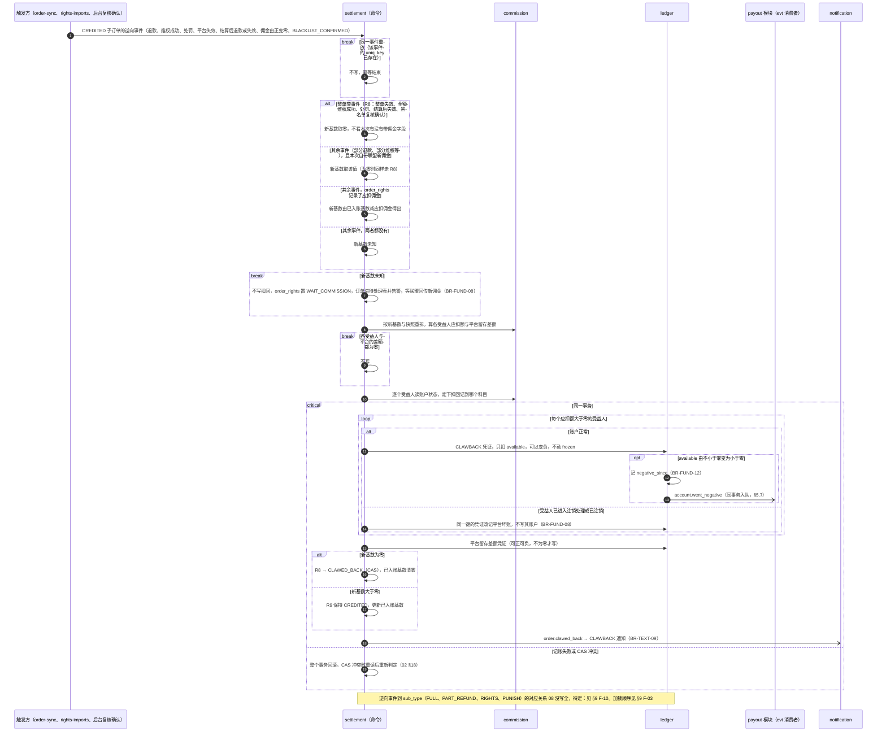
```mermaid
sequenceDiagram
  autonumber
  participant X as 触发方（order-sync、rights-imports、后台复核确认）
  participant T as settlement（命令）
  participant M as commission
  participant L as ledger
  participant P as payout 模块（evt 消费者）
  participant N as notification

  X->>T: CREDITED 子订单的逆向事件（退款、维权成功、处罚、平台失效、结算后退款或失效、佣金由正变零、BLACKLIST_CONFIRMED）
  break 同一事件重放（该事件的 uniq_key 已存在）
    T->>T: 不写，幂等结束
  end
  alt 整单类事件（R8：整单失效、全额维权成功、处罚、结算后失效、黑名单复核确认）
    T->>T: 新基数取零，不看本次有没有带佣金字段
  else 其余事件（部分退款、部分维权等），且本次自带联盟新佣金
    T->>T: 新基数取该值（为零时同样走 R8）
  else 其余事件，order_rights 记录了应扣佣金
    T->>T: 新基数由已入账基数减应扣佣金得出
  else 其余事件，两者都没有
    T->>T: 新基数未知
  end
  break 新基数未知
    T->>T: 不写扣回，order_rights 置 WAIT_COMMISSION，订单进待处理表并告警，等联盟回传新佣金（BR-FUND-08）
  end
  T->>M: 按新基数与快照重拆，算各受益人应扣额与平台留存差额
  break 各受益人与平台的差额都为零
    T->>T: 不写
  end
  T->>M: 逐个受益人读账户状态，定下扣回记到哪个科目
  critical 同一事务
    loop 每个应扣额大于零的受益人
      alt 账户正常
        T->>L: CLAWBACK 凭证，只扣 available，可以变负，不动 frozen
        opt available 由不小于零变为小于零
          L->>L: 记 negative_since（BR-FUND-12）
          L-)P: account.went_negative（同事务入队，§5.7）
        end
      else 受益人已进入注销处理或已注销
        T->>L: 同一键的凭证改记平台坏账，不写其账户（BR-FUND-08）
      end
    end
    T->>L: 平台留存差额凭证（可正可负，不为零才写）
    alt 新基数为零
      T->>T: R8 → CLAWED_BACK（CAS），已入账基数清零
    else 新基数大于零
      T->>T: R9 保持 CREDITED，更新已入账基数
    end
    T-)N: order.clawed_back → CLAWBACK 通知（BR-TEXT-09）
  option 记账失败或 CAS 冲突
    T->>T: 整个事务回滚。CAS 冲突时重读后重新判定（02 §18）
  end
  Note over T,L: 逆向事件到 sub_type（FULL、PART_REFUND、RIGHTS、PUNISH）的对应关系 08 没写全，待定：见 §9 F-10。加锁顺序见 §9 F-03
```

**覆盖的异常情况**

- [x] 同一事件重放（uniq_key 幂等）、重算差额为零（不写）
- [x] 整单失效先于「取不到新基数」判定：即使没带佣金字段也按归零扣回，不会被挂起
- [x] 部分退款、部分维权取不到新基数（WAIT_COMMISSION，不扣回，继续阻止后续入账）
- [x] 扣回后余额变负（只扣 available，入队 `account.went_negative`）
- [x] 受益人已注销（改记平台坏账，与入其账户二选一）
- [x] 已入账订单命中黑名单（不自动扣回，人工复核确认后才走本图）
- [x] 记账失败、并发冲突（整体回滚）

**实现的 BR / AC**：BR-FUND-01 R8、R9；BR-FUND-06、08、10、12、16；BR-ATTR-26；BR-CALC-09、15；BR-WDR-05；AC-S2-06、AC-S2-06-JD、AC-S2-07、AC-S2-08、AC-S2-09、AC-S2-46。

### 4.6 结算额写入与佣金变化（R10 负差、R9b）

结算额低于已入账基数（负差）在写入结算额的同一事务里立即扣，不等审批；高于（正差）只生成候选，批准后才补（§4.7）。价保、比价降佣等佣金下调不属于逆向事件，不写 CLAWBACK，走 R9b。

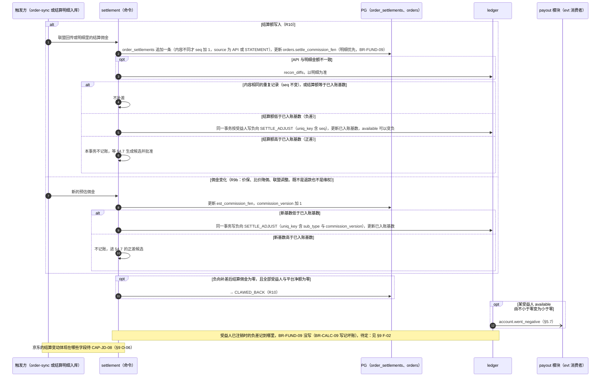
```mermaid
sequenceDiagram
  autonumber
  participant X as 触发方（order-sync 或结算明细入库）
  participant T as settlement（命令）
  participant DB as PG（order_settlements、orders）
  participant L as ledger
  participant P as payout 模块（evt 消费者）

  alt 结算额写入（R10）
    X->>T: 联盟回传或明细里的结算佣金
    T->>DB: order_settlements 追加一条（内容不同才 seq 加 1，source 为 API 或 STATEMENT），更新 orders.settle_commission_fen（明细优先，BR-FUND-09）
    opt API 与明细金额不一致
      T->>L: recon_diffs，以明细为准
    end
    alt 内容相同的重复记录（seq 不变），或结算额等于已入账基数
      T->>T: 不补差
    else 结算额低于已入账基数（负差）
      T->>L: 同一事务按受益人写负向 SETTLE_ADJUST（uniq_key 含 seq），更新已入账基数，available 可以变负
    else 结算额高于已入账基数（正差）
      T->>T: 本事务不记账，等 §4.7 生成候选并批准
    end
  else 佣金变化（R9b：价保、比价降佣、联盟调整。既不是退款也不是维权）
    X->>T: 新的预估佣金
    T->>DB: 更新 est_commission_fen，commission_version 加 1
    alt 新基数低于已入账基数
      T->>L: 同一事务写负向 SETTLE_ADJUST（uniq_key 含 sub_type 与 commission_version），更新已入账基数
    else 新基数高于已入账基数
      T->>T: 不记账，进 §4.7 的正差候选
    end
  end
  opt 负向补差后结算佣金为零，且全部受益人与平台净额为零
    T->>DB: → CLAWED_BACK（R10）
  end
  opt 某受益人 available 由不小于零变为小于零
    L-)P: account.went_negative（§5.7）
  end
  Note over T,L: 受益人已注销时的负差记到哪里，BR-FUND-09 没写（BR-CALC-09 写记坏账），待定：见 §9 F-02
  Note over X,T: 京东的结算变动体现在哪些字段待 CAP-JD-08（§9 O-06）
```

**覆盖的异常情况**

- [x] 同一结算记录重复到达（seq 不变，不重复补差）
- [x] 结算少于已入账（即时扣，可能使余额变负）
- [x] 结算多于已入账（不自动加钱，走人工批准）
- [x] 接口结算额与明细不一致（以明细为准并出差错单）
- [x] 价保、比价降佣（R9b，不写 CLAWBACK）
- [x] 补差后净额归零（转 CLAWED_BACK）

**实现的 BR / AC**：BR-FUND-01 R9b、R10；BR-FUND-09；BR-FUND-10；BR-CALC-09、14、23；拍板第二批 FUND-11；AC-S2-11。

### 4.2 结算批次 `settle_batch_status`

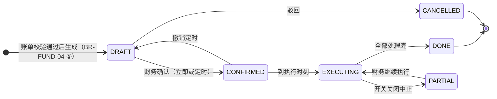
```mermaid
stateDiagram-v2
  direction LR
  [*] --> DRAFT: 账单校验通过后生成（BR-FUND-04 ⑤）
  DRAFT --> CONFIRMED: 财务确认（立即或定时）
  CONFIRMED --> DRAFT: 撤销定时
  DRAFT --> CANCELLED: 驳回
  CONFIRMED --> EXECUTING: 到执行时刻
  EXECUTING --> DONE: 全部处理完
  EXECUTING --> PARTIAL: 开关关闭中止
  PARTIAL --> EXECUTING: 财务继续执行
  DONE --> [*]
  CANCELLED --> [*]
```

**覆盖的异常情况**：执行中开关关闭（PARTIAL）；撤销定时；驳回；状态并发修改（20902，`data.resource=settle_batch`）。08 只有文字、没有迁移表，图中迁移取自 BR-FUND-04 ⑤–⑧ 与 04 §4.7（§9 F-04）。

**实现的 BR / AC**：BR-FUND-04；AC-S2-51、AC-S2-52；测试 ID `SM-SB-<n>`。

### 4.3 单一余额 `USER_BALANCE`

每个用户只有一个余额（拍板第二批 §8 ADD-06），`account_balances(available_fen, frozen_fen, negative_since, version)` 每用户一行，是分录的缓存。**余额没有状态枚举**：下图的两个状态是字段条件，不是契约值，不得据此生成枚举。`frozen_fen` 只由提现使用，等于非终态提现单合计、CHECK 不小于零（BR-FUND-14）。

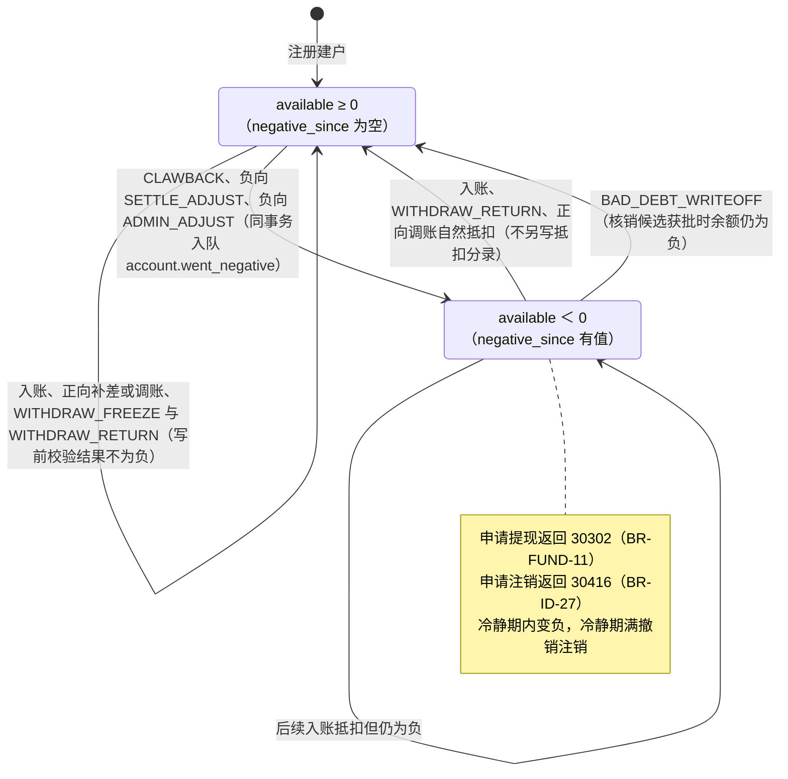
```mermaid
stateDiagram-v2
  state "available ≥ 0（negative_since 为空）" as NONNEG
  state "available ＜ 0（negative_since 有值）" as NEG
  [*] --> NONNEG: 注册建户
  NONNEG --> NONNEG: 入账、正向补差或调账、WITHDRAW_FREEZE 与 WITHDRAW_RETURN（写前校验结果不为负）
  NONNEG --> NEG: CLAWBACK、负向 SETTLE_ADJUST、负向 ADMIN_ADJUST（同事务入队 account.went_negative）
  NEG --> NEG: 后续入账抵扣但仍为负
  NEG --> NONNEG: 入账、WITHDRAW_RETURN、正向调账自然抵扣（不另写抵扣分录）
  NEG --> NONNEG: BAD_DEBT_WRITEOFF（核销候选获批时余额仍为负）
  note right of NEG
    申请提现返回 30302（BR-FUND-11）
    申请注销返回 30416（BR-ID-27）
    冷静期内变负，冷静期满撤销注销
  end note
```

**覆盖的异常情况**：只有三类分录能使余额变负（BR-FUND-10）；扣回不动 frozen；变负时的未打款提现单处理（§5.1）；长期为负的坏账核销（见下图）；注销与负余额（BR-ID-27）。

**实现的 BR / AC**：BR-FUND-10、11、12、13、14、16、19；BR-WDR-05；BR-ID-27；AC-S2-07、08、26、27、33、46、47、58、60。

### 4.4 坏账核销 `bad_debt_writeoff_status`

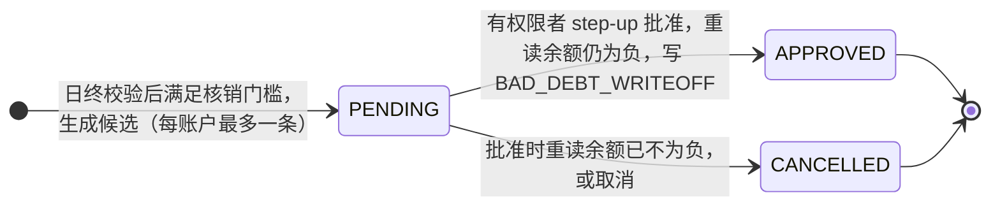
```mermaid
stateDiagram-v2
  direction LR
  [*] --> PENDING: 日终校验后满足核销门槛，生成候选（每账户最多一条）
  PENDING --> APPROVED: 有权限者 step-up 批准，重读余额仍为负，写 BAD_DEBT_WRITEOFF
  PENDING --> CANCELLED: 批准时重读余额已不为负，或取消
  APPROVED --> [*]
  CANCELLED --> [*]
```

**覆盖的异常情况**：批准前余额已回正（CANCELLED）；同一账户重复生成候选（最多一条 PENDING）；并发批准（CAS）。

**实现的 BR / AC**：BR-FUND-12；AC-S2-47。

---

## 5. 提现与打款

单一余额提现（拍板第二批 §8 ADD-06）。提现单状态 `withdrawal_status` 的迁移表 W1–W10 只在 BR-WDR-08 维护，分录只在 BR-WDR-09；打款结果未知时**只查不重提**（BR-WDR-14）。`needs_manual` 是 `withdrawals` 的布尔列，不是状态。

### 5.1 申请、自动到账判定与审核

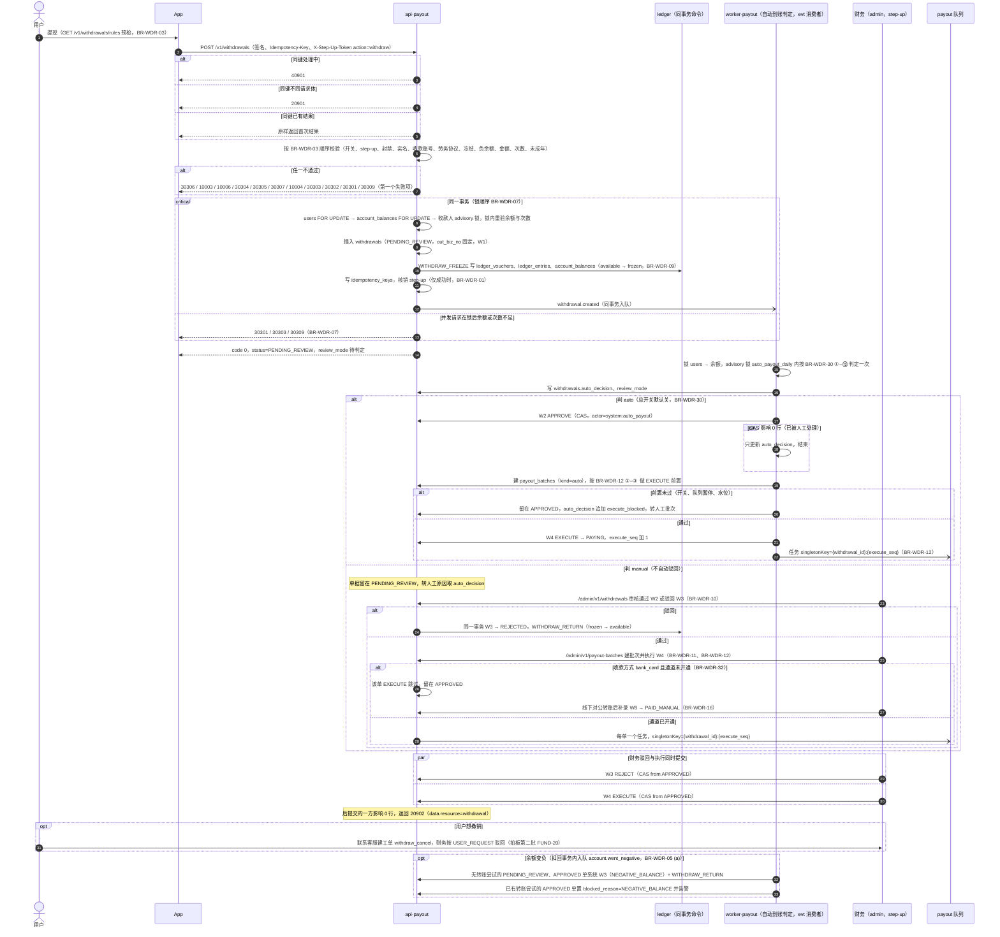
```mermaid
sequenceDiagram
  autonumber
  actor U as 用户
  participant C as App
  participant A as api·payout
  participant L as ledger（同事务命令）
  participant W as worker·payout（自动到账判定，evt 消费者）
  participant F as 财务（admin，step-up）
  participant Q as payout 队列

  U->>C: 提现（GET /v1/withdrawals/rules 预检，BR-WDR-03）
  C->>A: POST /v1/withdrawals（签名、Idempotency-Key、X-Step-Up-Token action=withdraw）
  alt 同键处理中
    A-->>C: 40901
  else 同键不同请求体
    A-->>C: 20901
  else 同键已有结果
    A-->>C: 原样返回首次结果
  end
  A->>A: 按 BR-WDR-03 顺序校验（开关、step-up、封禁、实名、收款账号、劳务协议、冻结、负余额、金额、次数、未成年）
  alt 任一不通过
    A-->>C: 30306 / 10003 / 10006 / 30304 / 30305 / 30307 / 10004 / 30303 / 30302 / 30301 / 30309（第一个失败项）
  end
  critical 同一事务（锁顺序 BR-WDR-07）
    A->>A: users FOR UPDATE → account_balances FOR UPDATE → 收款人 advisory 锁，锁内重验余额与次数
    A->>A: 插入 withdrawals（PENDING_REVIEW，out_biz_no 固定，W1）
    A->>L: WITHDRAW_FREEZE 写 ledger_vouchers、ledger_entries、account_balances（available → frozen，BR-WDR-09）
    A->>A: 写 idempotency_keys，核销 step-up（仅成功时，BR-WDR-01）
    A-)W: withdrawal.created（同事务入队）
  option 并发请求在锁后余额或次数不足
    A-->>C: 30301 / 30303 / 30309（BR-WDR-07）
  end
  A-->>C: code 0，status=PENDING_REVIEW，review_mode 待判定

  W->>W: 锁 users → 余额，advisory 锁 auto_payout_daily 内按 BR-WDR-30 ①–⑬ 判定一次
  W->>A: 写 withdrawals.auto_decision、review_mode
  alt 判 auto（总开关默认关，BR-WDR-30）
    W->>A: W2 APPROVE（CAS，actor=system:auto_payout）
    alt CAS 影响 0 行（已被人工处理）
      W->>W: 只更新 auto_decision，结束
    end
    W->>A: 建 payout_batches（kind=auto），按 BR-WDR-12 ①–③ 做 EXECUTE 前置
    alt 前置未过（开关、队列暂停、水位）
      W->>A: 留在 APPROVED，auto_decision 追加 execute_blocked，转人工批次
    else 通过
      W->>A: W4 EXECUTE → PAYING，execute_seq 加 1
      W-)Q: 任务 singletonKey={withdrawal_id}:{execute_seq}（BR-WDR-12）
    end
  else 判 manual（不自动驳回）
    Note over A: 单据留在 PENDING_REVIEW，转人工原因取 auto_decision
    F->>A: /admin/v1/withdrawals 审核通过 W2 或驳回 W3（BR-WDR-10）
    alt 驳回
      A->>L: 同一事务 W3 → REJECTED，WITHDRAW_RETURN（frozen → available）
    else 通过
      F->>A: /admin/v1/payout-batches 建批次并执行 W4（BR-WDR-11、BR-WDR-12）
      alt 收款方式 bank_card 且通道未开通（BR-WDR-32）
        A->>A: 该单 EXECUTE 跳过，留在 APPROVED
        F->>A: 线下对公转账后补录 W8 → PAID_MANUAL（BR-WDR-16）
      else 通道已开通
        A-)Q: 每单一个任务，singletonKey={withdrawal_id}:{execute_seq}
      end
    end
  end
  par 财务驳回与执行同时提交
    F->>A: W3 REJECT（CAS from APPROVED）
  and
    F->>A: W4 EXECUTE（CAS from APPROVED）
  end
  Note over A: 后提交的一方影响 0 行，返回 20902（data.resource=withdrawal）
  opt 用户想撤销
    U->>F: 联系客服建工单 withdraw_cancel，财务按 USER_REQUEST 驳回（拍板第二批 FUND-20）
  end
  opt 余额变负（扣回事务内入队 account.went_negative，BR-WDR-05 (a)）
    W->>A: 无转账尝试的 PENDING_REVIEW、APPROVED 单系统 W3（NEGATIVE_BALANCE）+ WITHDRAW_RETURN
    W->>A: 已有转账尝试的 APPROVED 单置 blocked_reason=NEGATIVE_BALANCE 并告警
  end
```

**覆盖的异常情况**

- [x] 重复提交：同键重放、同键处理中、同键不同请求体（40901、20901）
- [x] 并发提现：锁内重验，后到者 30301 / 30303 / 30309；不超额（frozen 不为负由 CHECK 保证）
- [x] 校验失败按 BR-WDR-03 顺序返回第一个错误码；step-up 只在成功时核销
- [x] 自动判定与人工同时处理同一单（CAS 0 行只更新 auto_decision）
- [x] 判 auto 后执行前置未过（execute_blocked，转人工批次，系统不自动重试 EXECUTE）
- [x] 财务驳回与执行并发（20902）
- [x] 银行卡通道未开通（跳过 EXECUTE，线下转账后 W8 补录）
- [x] 用户撤销（不能自撤，客服工单 + 驳回）
- [x] 余额变负时的未打款单（系统驳回或 blocked_reason）

**实现的 BR / AC**：BR-WDR-01、03、05、07、08、09、10、11、12、16、30、31、32；BR-FUND-10、BR-FUND-14；AC-S2-08、20、21、22、23、26、27、28、53、54、55；AC-WDR-01、04、05、07（F-WDR 同号）。

### 5.4 payout 任务：复核与转账

payout 进程是唯一持有通道密钥的进程，没有公网入站，所以**不接收支付宝异步通知**，结果只靠同步返回、主动查询与每日对账（是否接通知见 §9 W-08）。

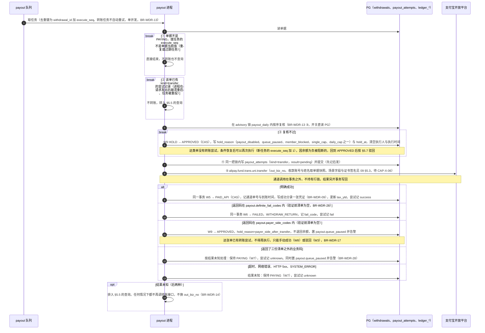
```mermaid
sequenceDiagram
  autonumber
  participant Q as payout 队列
  participant P as payout 进程
  participant DB as PG（withdrawals、payout_attempts、ledger_*）
  participant Z as 支付宝开放平台

  Q->>P: 取任务（去重键为 withdrawal_id 加 execute_seq。转账任务不自动重试，单并发，BR-WDR-13）
  P->>DB: 读单据
  break ① 单据不是 PAYING，或任务的 execute_seq 不是单据当前值（重复或过期任务）
    P->>P: 直接结束，不转账也不查询
  end
  break ② 该单已有 kind=transfer 的尝试记录（进程在请求发出后崩溃重启、任务被重投）
    P->>P: 不转账，转入 §5.5 的查询
  end
  P->>DB: 在 advisory 锁 payout_daily 内按序复核（BR-WDR-13 ③，开关直读 PG）
  break ③ 复核不过
    P->>DB: W9 HOLD → APPROVED（CAS），写 hold_reason（payout_disabled、queue_paused、member_blocked、single_cap、daily_cap 之一）与 hold_at，清空执行人与执行时间
    Note over P,DB: 这类单没有转账尝试，条件恢复后可以再次执行（新任务的 execute_seq 加 1）。因余额为负被阻断的，回到 APPROVED 后按 §5.7 驳回
  end
  P->>DB: ④ 同一把锁内写 payout_attempts（kind=transfer，result=pending）并提交（先记后发）
  P->>Z: ⑤ alipay.fund.trans.uni.transfer（out_biz_no、收款账号与姓名取单据快照。场景字段与证书签名见 09 §5.3，待 CAP-X-06）
  Note over P,Z: 通道调用在事务之外，不持有行锁。结果另开事务写回
  alt 明确成功
    P->>DB: 同一事务 W5 → PAID_API（CAS），记通道单号与到账时间，写成功分录一张凭证（BR-WDR-09），更新 tax_ytd，尝试记 success
  else 返回码在 payout.definite_fail_codes 内（验证前清单为空，BR-WDR-28）
    P->>DB: 同一事务 W6 → FAILED，WITHDRAW_RETURN，记 fail_code，尝试记 fail
  else 返回码在 payout.payer_side_codes 内（验证前清单为空）
    P->>DB: W9 → APPROVED，hold_reason=payer_side_after_transfer，不退回余额，置 payout.queue_paused 并告警
    Note over P,DB: 这张单已有转账尝试，不得再执行，只能手动成功（W8）或驳回（W3），BR-WDR-17
  else 返回了三份清单之外的业务码
    P->>DB: 按结果未知处理：保持 PAYING（W7），尝试记 unknown。同时置 payout.queue_paused 并告警（BR-WDR-28）
  else 超时、网络错误、HTTP 5xx、SYSTEM_ERROR
    P->>DB: 结果未知：保持 PAYING（W7），尝试记 unknown
  end
  opt 结果未知（后两种）
    P->>P: 排入 §5.5 的查询。任何情况下都不再调转账接口，不换 out_biz_no（BR-WDR-14）
  end
```

**覆盖的异常情况**

- [x] 重复或过期任务（直接结束）
- [x] 已发出过转账的单再次被取到（只查询，绝不到达转账调用）
- [x] 发出前复核不过（W9，不到达转账调用；没有转账尝试，可再次执行）
- [x] 进程在请求发出后崩溃（先记后发，重启后只查询）
- [x] 明确成功、明确失败、付款方侧失败（暂停队列，不退回）
- [x] 清单外的业务码（按未知处理，并暂停后续出款）
- [x] 超时、网络错误、5xx、SYSTEM_ERROR（只查不重提）

**实现的 BR / AC**：BR-WDR-08（W5、W6、W7、W9）、09、12、13、14、17、28、32；BR-FUND-14；CAP-X-06（待验证）；AC-S2-20、AC-S2-24、AC-S2-25；AC-WDR-06、AC-WDR-07。

### 5.5 结果未知：查询与人工处置

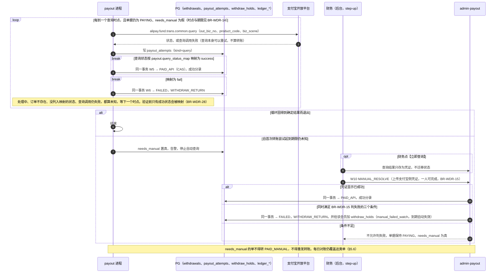
```mermaid
sequenceDiagram
  autonumber
  participant P as payout 进程
  participant DB as PG（withdrawals、payout_attempts、withdraw_holds、ledger_*）
  participant Z as 支付宝开放平台
  participant F as 财务（后台，step-up）
  participant A as admin·payout

  loop 每到一个查询时点，且单据仍为 PAYING、needs_manual 为假（时点与期限见 BR-WDR-14）
    P->>Z: alipay.fund.trans.common.query（out_biz_no、product_code、biz_scene）
    Z-->>P: 状态，或查询调用失败（查询本身可以重试，不算转账）
    P->>DB: 写 payout_attempts（kind=query）
    break 查询状态按 payout.query_status_map 映射为 success
      P->>DB: 同一事务 W5 → PAID_API（CAS），成功分录
    end
    break 映射为 fail
      P->>DB: 同一事务 W6 → FAILED，WITHDRAW_RETURN
    end
    Note over P: 处理中、订单不存在、没列入映射的状态、查询调用仍失败，都算未知，等下一个时点。验证前只有成功状态会被映射（BR-WDR-28）
  end
  alt 循环因得到确定结果而退出
    P->>P: 结束
  else 自首次转账尝试起到期限仍未知
    P->>DB: needs_manual 置真，告警，停止自动查询
    opt 财务点【立即查询】
      F->>A: 查询结果只存为凭证，不迁移状态
    end
    F->>A: W10 MANUAL_RESOLVE（上传支付宝侧凭证，一人可完成，BR-WDR-15）
    alt 凭证显示已成功
      A->>DB: 同一事务 → PAID_API，成功分录
    else 同时满足 BR-WDR-15 判失败的三个条件
      A->>DB: 同一事务 → FAILED，WITHDRAW_RETURN，并给该会员加 withdraw_holds（manual_failed_watch，到期自动失效）
    else 条件不足
      A-->>F: 不允许判失败，单据保持 PAYING、needs_manual 为真
    end
  end
  Note over P,A: needs_manual 的单不得转 PAID_MANUAL，不得重发转账。每日对账仍覆盖这类单（§5.6）
```

**覆盖的异常情况**

- [x] 查询得到成功或失败后退出循环，不再继续查询
- [x] 订单不存在、处理中不立即判失败
- [x] 查询调用本身失败（按 BR-WDR-14 重试，不算转账）
- [x] 到期仍未知：置 needs_manual，停止自动查询，转人工
- [x] 人工处置：成功、判失败（条件齐全才行，并加观察冻结）、条件不足不许判失败
- [x] needs_manual 之后的查询只存凭证，状态只由 W10 迁移

**实现的 BR / AC**：BR-WDR-08（W5、W6、W7、W10）、09、14、15、28；AC-S2-24；AC-WDR-07。

### 5.6 通道对账 R2

```mermaid
sequenceDiagram
  autonumber
  participant R as worker·payout（R2 对账任务）
  participant Z as 支付宝开放平台
  participant P as payout 进程
  participant DB as PG（recon_channel、recon_diffs、withdraw_holds、withdrawals）
  participant F as 财务（后台）

  R->>Z: 每日取前一自然日的账务明细（接口未定：见 §9 W-08）
  break 明细取不到
    R->>F: 告警，当日对账未完成，不改任何单据
  end
  R->>DB: 逐笔核对写 recon_channel：接口打款单按 out_biz_no，手动成功单按 channel_order_id，金额比应付净额
  loop 每条差异
    alt ① 支付宝成功，内部 PAYING 且 needs_manual 为假
      R->>P: 立即查询一次
      alt 查询返回成功
        P->>DB: W5 → PAID_API
      else 不是成功
        P->>DB: needs_manual 置真，recon_diffs（channel_mismatch）并告警，转 §5.5 的人工处置
      end
    else ② 支付宝成功，内部 PAYING 且 needs_manual 为真
      R->>F: 只生成待处置提示并附账单行，由 W10 结束，不走 W5
    else ③ 支付宝成功而内部为 APPROVED、FAILED、REJECTED 或查无此单，或内部已成功而支付宝无记录，或金额不一致
      R->>DB: recon_diffs（channel_mismatch）并告警，给该会员加 withdraw_holds（recon_diff，不自动到期）
    end
  end
  Note over R,DB: 终态提现单不改状态与金额，更正只经差错单与人工调账（BR-FUND-24）。支付宝成功而内部经 W9 回到 APPROVED 的单没有对应迁移：见 §9 W-04
```

**覆盖的异常情况**

- [x] 支付宝已成功而内部还在打款中（区分是否 needs_manual：前者先查询，后者只提示）
- [x] 内部已终态而与通道不一致、金额不一致、通道有我方无（差错单并冻结该会员提现）
- [x] 判失败后通道迟到成功（观察期内由本对账发现，§5.5 的观察冻结）
- [x] 明细取不到（告警，不改单据）

**实现的 BR / AC**：BR-WDR-15、BR-WDR-23、BR-FUND-24；AC-S2-50。

### 5.3 提现状态图

```mermaid
stateDiagram-v2
  direction LR
  [*] --> PENDING_REVIEW: W1 APPLY
  PENDING_REVIEW --> APPROVED: W2 APPROVE（人工，或自动到账判定 BR-WDR-30）
  PENDING_REVIEW --> REJECTED: W3 REJECT
  APPROVED --> REJECTED: W3 REJECT（无 pending、success、unknown 尝试）
  APPROVED --> PAYING: W4 EXECUTE（无任何转账尝试）
  APPROVED --> PAID_MANUAL: W8 MANUAL_PAID
  PAYING --> PAYING: W7 CHANNEL_UNKNOWN
  PAYING --> PAID_API: W5 CHANNEL_SUCCESS
  PAYING --> FAILED: W6 CHANNEL_FAIL
  PAYING --> APPROVED: W9 HOLD
  PAYING --> PAID_API: W10 MANUAL_RESOLVE paid
  PAYING --> FAILED: W10 MANUAL_RESOLVE failed
  REJECTED --> [*]
  PAID_API --> [*]
  PAID_MANUAL --> [*]
  FAILED --> [*]
  note right of PAYING
    needs_manual 是列不是状态
    W5、W6 只在 needs_manual=false 时
    W10 只在 needs_manual=true 时
  end note
```

**覆盖的异常情况**：表外事件 CAS 影响 0 行（20902，AC-S2-31）；终态不可再迁移；W9 退回后只有无转账尝试的单能再走 W4（payer_side_after_transfer 的单只能 W8 或 W3，BR-WDR-17）。

**实现的 BR / AC**：BR-WDR-08（W1–W10，测试 ID `SM-WDR-W1…W10`）、BR-WDR-05 (a)；AC-S2-31。

**本节不一致**：状态名与契约 `withdrawal_status` 逐字一致，无多余或缺失状态；其他问题见 §9 W-01 至 W-10。

---

## 6. 登录与第三方空号并号

所有登录方式与刷新都要求签名（BR-ID-09），因此必须先在用户同意隐私政策后完成设备注册（BR-ID-11）。拒绝码按 BR-ID-01 的顺序返回第一个。同一自然人用微信与手机号分别登录会得到两个账号，不自动合并；唯一例外是第三方登录新建的空号在绑定手机号时并入老号（BR-ID-06，拍板第二批 OPS-04）。

```mermaid
sequenceDiagram
  autonumber
  actor U as 用户
  participant C as App
  participant X as 微信 SDK / Apple
  participant G as api·risk（签名 Guard、限流）
  participant I as api·identity
  participant SMS as 阿里云短信
  participant DB as PG（users、user_oauth、sessions、refresh_tokens、login_logs、consent_records）

  U->>C: 同意隐私政策（BR-ID-11）
  C->>I: POST /v1/devices（设备标识哈希）
  I-->>C: device_id、install_secret（存 Keychain / Keystore / HUKS）
  alt 后续请求返回 10402（设备未注册或已吊销）
    C->>I: 重新注册设备后重放原请求（次数 BR-ID-09）
  end

  alt 手机号验证码登录
    C->>G: POST /v1/auth/sms-codes（purpose=login，签名）
    alt 号段或手机号黑名单
      G-->>C: 44001
    else 需要人机验证
      G-->>C: 44003 → 拉起验证组件，带凭证重发
    else 发码频控
      G-->>C: 42901 加 Retry-After
    else 通过
      I->>SMS: 发送 SMS_CODE（新码作废同 purpose 旧码）
      I-->>C: 重发间隔、有效期（取值 BR-ID-05）
    end
    U->>C: 输入验证码、勾选协议
    C->>I: POST /v1/auth/login/sms（phone、code、legal_versions、consent_at、可选 invite_code）
    alt 验证码错误
      I-->>C: 20002
    else 过期、已作废或错满次数
      I-->>C: 20003
    else 账号在注销处理中
      I-->>C: 10007
    else 新号且同设备注册超限
      I-->>C: 44001，不建号
    end
  else 微信登录
    C->>X: SendAuthReq
    alt 用户取消或拒绝授权
      X-->>C: 取消，客户端留在登录页（服务端无请求）
    else 授权成功
      X-->>C: code（一次有效）
      C->>I: POST /v1/auth/login/wechat（code、legal_versions、consent_at）
      I->>X: 用 code 换 unionid
      alt code 已用、过期或微信接口报错
        I-->>C: 失败（错误码未分配，§9 A-04）
      end
    end
  else Apple 登录（iOS）
    C->>X: Sign in with Apple
    alt 用户取消
      X-->>C: 取消
    else 成功
      C->>I: POST /v1/auth/login/apple（Apple 凭证、legal_versions、consent_at）
      I->>X: 校验凭证得 sub，加密保存 Apple refresh_token（注销时撤销，BR-ID-04）
    end
  end

  critical 同一事务
    I->>DB: 老用户按 phone_hmac 或 user_oauth（provider、union_id）查到即登录，否则建号（register_method）
    I->>DB: 写 consent_records（登录成功才写，BR-ID-04、BR-ID-12）、sessions、refresh_tokens、login_logs
    opt 新号带 invite_code
      I->>DB: SAVEPOINT 内绑定上级，失败不影响注册（BR-INV-06）
    end
  end
  I-->>C: access_token、refresh_token、is_new_user、invite_bind
  Note over C,I: 已封禁用户照常签发令牌，之后白名单外接口一律 10006（BR-ID-31）

  opt 第三方新建账号绑定手机号
    C->>I: POST /v1/me/phone（purpose=bind 验证码，签名，Idempotency-Key）
    alt 目标手机号命中黑名单
      I-->>C: 44001
    else 目标号属于其他账号且不满足并号条件
      I-->>C: 30411（无 reason），不迁移任何资产
    else 满足 BR-ID-06 并号条件
      I-->>C: 30411，data.reason=mergeable，data.merge_ticket（一次性，绑定当前 uid 与目标 phone_hmac）
      C->>U: 弹并号确认框
      alt 用户取消
        U->>C: 保留当前账号，结束
      else 用户确认
        C->>I: POST /v1/auth/merge（merge_ticket，签名，Idempotency-Key）
        alt ticket 过期、已用或条件已不满足
          I-->>C: 30411（无 mergeable）
        else 同键处理中
          I-->>C: 40901
        else 通过
          critical 同一事务（OPS-04）
            I->>DB: 当前账号 user_oauth 迁到手机号账号（记 merged_from_user_id）
            I->>DB: 当前账号联盟绑定置 released（不冷却）
            I->>DB: 当前账号置墓碑（deleted_reason=merged），吊销其全部 sid
          end
          I-->>C: 手机号账号的令牌
        end
        opt 响应丢失后同键重试
          C->>I: 原 sid 已吊销，令牌判定先于幂等回放（BR-ID-01），拿不回结果（§9 A-01）
        end
      end
    end
    par 两个第三方空号同时并入同一手机号账号
      C->>I: merge（账号甲）
    and
      C->>I: merge（账号乙，同一 provider）
    end
    Note over I: 目标账号同 provider 唯一缺数据库约束兜底（§9 A-02）
  end

  opt access_token 过期
    C->>G: 多个请求同时收到 10002，客户端单飞只刷新一次（03 §4.2）
    C->>I: POST /v1/auth/refresh（签名）
    alt 宽限内重复提交同一旧 refresh_token
      I-->>C: 返回同一对新令牌（BR-ID-07）
    else 旧 refresh_token 被复用（疑似泄露）
      I->>DB: 吊销整条 sid 链
      I-->>C: 10404 → 清会话、跳登录
    else 正常轮换
      I-->>C: 新 access_token 与 refresh_token
    end
  end
```

**覆盖的异常情况**

- [x] 设备未注册或已吊销（10402，重新注册后重放一次）
- [x] 发码黑名单、人机验证、频控（44001、44003、42901）
- [x] 验证码错误、过期、错满（20002、20003）；注销处理中（10007）；同设备注册超限（44001）
- [x] 用户取消微信或 Apple 授权（客户端处理）；第三方 code 失效或接口报错（错误码缺口，§9）
- [x] 已封禁账号登录（签发令牌，其余接口 10006）
- [x] 绑定手机号冲突、并号条件判定、用户取消并号
- [x] merge_ticket 过期、已用、条件变化（30411）；同键处理中（40901）；响应丢失重试（缺口，§9）
- [x] 并发并号到同一目标（缺约束，§9）
- [x] 并发刷新（单飞）、宽限内重复刷新、refresh_token 复用（10404 吊销整链）

**实现的 BR / AC**：BR-ID-01、04、05、06、07、09、11、12、27、31；BR-INV-06；拍板第二批 OPS-04；AC-S1-59、AC-S1-60；AC-ACC-01、02、03、05、06、11、12（F-ACC 同号）。10 尚无登录失败、刷新与 10404 的 S1 用例（§9 A-06）。

---

## 7. 淘宝渠道备案（relation_id）与站长授权到期

淘宝订单的用户归属只靠 `relation_id`（BR-ATTR-07），备案只在用户点击购买时触发（BR-ID-17），一次绑定、不提供用户自助换绑（拍板第二批 §8 ADD-01）。授权页走百川还是 H5 OAuth 按 CAP-TB-05 实测定，两条都保留（09 5_X §5.5）；「百川套件备案页」在 09 中没有记录，图中按「百川授权组件或 H5 授权页」两路画。备案流程本身不受 2026-10-03 转链变更影响（变更记录 §2 未改 BR-ID-17、19），绑定成功后的购买按 §2.4 打开。

### 7.1 用户渠道备案

```mermaid
sequenceDiagram
  autonumber
  actor U as 用户
  participant C as App
  participant BC as 百川授权组件 / H5 授权页
  participant A as api·linking
  participant UA as union Adapter·taobao
  participant TB as 淘宝联盟 TOP
  participant DB as PG（union_auth_sessions、union_bindings）

  alt 点击购买时未绑定
    C->>A: POST /v1/links/{link_id}/open
    A->>DB: 建 union_auth_sessions（state 绑定 uid、device_id、link_id，一次性，时限见 BR-ID-17）
    A-->>C: 30101，data.auth_url、data.state
  else 从「我的 → 授权管理」发起
    C->>A: GET /v1/unions/taobao/auth-url
    A-->>C: auth_url、state（link_id 为空）
  end
  alt 站长授权过期或失效（BR-ID-24）
    A-->>C: 30101 / 30102，data.reason=auth_unavailable，无 auth_url
    C->>U: 只提示稍后再试，不拉起授权、不外跳、无无返利购买
  end
  C->>U: AuthSheet（文案 BR-TEXT-14）
  alt 用户关闭
    U->>C: 仍去购买（无返利）
    C->>A: open（no_rebate=true，no_rebate_reason=auth_declined）→ 按 §2.4 打开，不带 relation_id
  end
  C->>BC: 拉起淘宝授权（百川或 H5，CAP-TB-05）
  alt 用户在淘宝侧拒绝，或 SDK 报错
    BC-->>C: 失败 → 可选无返利购买（no_rebate_reason=auth_failed）
  else 授权成功
    BC-->>C: 回到 App，带 code（redirect_uri 能否直回 App 待 09；只能 https 时改服务端回调加客户端按 state 查结果，08 §13.9）
  end
  C->>A: POST /v1/unions/taobao/bindings（state、code，签名，Idempotency-Key）
  alt state 过期或已用（含重复回调换新键）
    A-->>C: 30104
  else 同键处理中
    A-->>C: 40901
  else 同键已有结果
    A-->>C: 原样返回首次结果
  end
  A->>UA: bindPublisher
  UA->>TB: code 换买家会话（不落库，BR-ID-17）
  UA->>TB: taobao.tbk.sc.publisher.info.save（inviter_code 取自 taobao.tbk.sc.invitecode.get、info_type）
  alt 已备案（重复绑定）
    UA->>TB: taobao.tbk.sc.publisher.info.get 取回已有 relation_id
  else 接口超时、无权限或报错
    TB-->>UA: 失败（应用权限归属见 §9 T-01，错误码未分配见 §9 T-05）
  else 成功
    TB-->>UA: relation_id、special_id（special_id 只存不用）
  end
  critical 同一事务（唯一性 BR-ID-19）
    A->>DB: 校验 relation_id 未被他人占用（含冷却期内归他人）、本人无其他未释放绑定
    alt 被他人占用
      A->>DB: 记冲突日志（驱动 no_rebate_reason=relation_conflict）
      A-->>C: 30151，原绑定不变，不透露对方账号
    else 本人 invalid 后重新授权得到同一 relation_id
      A->>DB: 同一行回到 active，保留 bound_at
    else 新绑定
      A->>DB: union_bindings 置 active，写 bound_at；union_auth_sessions.used_at
    end
  option 两个用户并发绑定同一 relation_id
    A->>A: 唯一索引冲突，后到者回滚（是否映射为 30151 未写明，§9 T-06）
  end
  A-->>C: 绑定成功
  C->>A: 重放同一 link_id 的 open（需新幂等键，§9 L-02）→ 按当前 active 绑定构造参数（§2.4）
```

**覆盖的异常情况**

- [x] 站长授权过期期间不能发起备案（`auth_unavailable`）
- [x] 用户关闭 AuthSheet、在淘宝侧拒绝、SDK 报错（无返利购买及其原因码）
- [x] state 过期或已用、重复回调（30104；同键回放）
- [x] 已备案再备案（取回已有 relation_id）、TOP 超时或无权限
- [x] relation_id 被他人占用（30151，记冲突）
- [x] 失效后重新授权得到同一 relation_id（同一行回 active）
- [x] 并发绑定同一 relation_id（唯一索引兜底）

**实现的 BR / AC**：BR-ID-17、18、19、24；BR-ATTR-07；BR-TEXT-14；拍板第二批 §8 ADD-01；CAP-TB-05、CAP-TB-12（未实测）；AC-S1-05-TB、06、07-TB、36-TB；AC-LINK-03（F-LINK-03 同号）。

### 7.2 站长授权到期巡检与告警

```mermaid
sequenceDiagram
  autonumber
  participant CR as worker·union（union.auth_probe_cron）
  participant DB as PG（union_accounts、union_credentials）
  participant TB as 淘宝联盟 TOP
  participant SMS as 阿里云短信
  participant ADM as 后台（站长、step-up）
  participant A as api·linking
  participant W as worker·orders

  CR->>DB: 每日读 auth_expires_at、auth_status、alert_stage
  alt 到达告警节点（union.auth_alert_days，取值 BR-ID-24）且该节点未发过
    CR->>SMS: UNION_AUTH_EXPIRING 发给 union.auth_alert_phones 全部号码（不受免打扰限制）
    CR->>ADM: 后台告警，alert_stage 前移去重
    opt 未配置告警手机号
      CR->>ADM: 只发后台告警，账号页提示未配置
    end
  end
  opt 平台支持刷新
    CR->>TB: 到期前自动刷新凭据（BR-ID-24 ②）
  end
  CR->>TB: 实际调用一次依赖该授权的只读接口（探测接口登记在 specs/union/taobao.md，待 CAP-TB-12）
  alt 返回授权失效类错误
    CR->>DB: auth_status=expired，写 last_probe_*
    CR->>SMS: UNION_AUTH_EXPIRED
  else 超时或限流
    CR->>TB: 按 BR-ID-24 ① 重试
    alt 仍失败
      CR->>ADM: 只发后台告警，不发短信、不改状态
    end
  else 正常
    CR->>DB: last_probe_at、last_probe_ok
  end
  Note over A,W: 过期或失效期间（BR-ID-24 ④，拍板第二批 §8 ADD-02、ADD-08）
  A->>A: 依赖该授权的接口（渠道备案保存与查询等）停止调用
  A->>A: 绑定非 active 的用户调 open（含 no_rebate=true）、auth-url、bindings → 30101 / 30102 auth_unavailable
  A->>A: active 用户照常购买，归属不受影响；blocked 仍返回 30153
  W->>W: 依赖该授权的订单同步记断点暂停；BR-ID-21 巡检暂停
  ADM->>A: POST /admin/v1/union-accounts/{id}/reauthorize（step-up，审计）
  A-->>ADM: 授权地址
  ADM->>TB: 站长完成授权
  TB-->>A: 回调（回调路由与 state 存放未定义，§9 T-08）
  A->>DB: 更新 union_credentials、auth_expires_at，auth_status 回到 active
  A->>W: 自动恢复，从断点补拉
```

**覆盖的异常情况**

- [x] 到期前多节点告警去重、未配置告警手机号
- [x] 探测得到授权失效（立即 expired 并短信）
- [x] 探测超时或限流（重试一次，仍失败只发后台告警）
- [x] 过期期间：未绑定用户不能下单且无无返利购买；已绑定用户不受影响；同步记断点
- [x] 提前或过期后重新授权、回调后自动恢复并补拉

**实现的 BR / AC**：BR-ID-21、BR-ID-24、BR-TEXT-20；拍板第二批 §8 ADD-02、ADD-08；CAP-TB-12（未实测）；AC-S1-64、AC-S1-65。

### 7.3 联盟绑定 `union_binding_status`

```mermaid
stateDiagram-v2
  [*] --> unbound
  unbound --> pending_auth: 发起授权（进入条件未定义，§9 T-03）
  pending_auth --> active: bindings 成功且唯一性通过（BR-ID-17、19）
  active --> invalid: BR-ID-21 巡检判定失效
  invalid --> active: 重新授权得到同一 relation_id
  active --> blocked: 封禁 ban、后台停用 admin_disable、注销 deletion
  invalid --> blocked: 同上
  blocked --> invalid: 解封，或后台恢复返利（BR-ID-20）
  blocked --> released: deletion 保留期满由定时任务释放，写 cooldown_until
  active --> released: 后台重置授权（reason=admin_reset）或并号（不冷却）
  invalid --> released: 后台重置授权
  released --> active: 冷却期内同一用户重新绑定同一 relation_id（同一行）
  note right of released
    冷却期满后他人绑定同一 relation_id 新建 active 行
    归属按 bound_at 至释放或冷却结束的区间判定（BR-ATTR-07）
  end note
```

**覆盖的异常情况**：relation_id 冲突（30151，状态不变）；巡检查询失败不改状态；停用期间点击购买（30153）；注销释放后冷却；无用户自助换绑（30152 已废弃）。

**实现的 BR / AC**：BR-ID-19、20、21、31；拍板第二批 §8 ADD-01、OPS-11；AC-S1-07-TB、AC-S1-51-TB。

**本节不一致**：状态名与契约 `union_binding_status` 逐字一致（不设 `cooling`）；`pending_auth` 的进出、`unbound` 是否落行、`admin_disable` 恢复到 `invalid` 还是 `active` 等见 §9 T-03、T-04。

---

## 8. App ↔ H5 桥签名请求

App 内 H5（`TrustedWebView`）调用需签名的接口只能经桥方法 `net.signedRequest` 由原生代签代发；h5_token 不能直接调签名接口（BR-ID-32）。原生只签 `bridge.schema.json` 的 `signed_paths`，MVP 只有 `POST /v1/orders/claims`（拍板第二批 TECH-30）。下图以找回提交为例；方法级别、超时、桥错误码以契约 CT-03 `bridge.schema.json` 为准。

```mermaid
sequenceDiagram
  autonumber
  actor U as 用户
  participant H as H5 页面（TrustedWebView）
  participant B as App 原生桥
  participant N as App 网络层
  participant G as api·risk（签名 Guard、限流）
  participant O as api·orders（找回）
  participant DB as PG（idempotency_keys、claims、claim_items）

  Note over B: 启动与回前台：bridge_origins 白名单随 GET /v1/config 下发并带服务端签名，验签失败用包内内置（03 §5.1，02 §10）
  H->>B: has（net.signedRequest）（TECH-28）
  alt 当前端未实现该方法（since 为 null 或版本过低）
    B-->>H: false
    H->>H: 不调用，提示升级（03 §4.4）
  end
  opt H5 先取 h5_token 调普通接口（不用于签名接口）
    H->>B: auth.getH5Token（L1）
    B->>N: POST /v1/auth/h5-token
    N-->>B: token、expire_at（aud=h5，BR-ID-32）
    B-->>H: code 0，data.token
    Note over H: h5_token 直接调签名接口或作用域外接口会被拒（10401 或 10403，判定顺序 BR-ID-01）
  end
  U->>H: 点击「提交找回」
  H->>B: 信封 v、id、method=net.signedRequest、params（method=POST、path=/v1/orders/claims、body）
  B->>B: L0 校验：主 frame 且 origin 在白名单
  alt origin 或 frame 不允许
    B-->>H: 90403
  end
  B->>B: L1 校验：原生已登录
  alt 未登录
    B-->>H: 90401（H5 可先调 auth.login 再由用户重新点击）
  end
  B->>B: L2 校验：最近有用户手势（时限见 03 §5.3）
  alt 无手势
    B-->>H: 90404
  end
  B->>B: params 按 schema 校验，再把 path 去掉 query 后与 signed_paths 的 method 加 path 逐字比较
  alt 参数不合法（含 path 含点号、百分号）
    B-->>H: 90002
  else 不在 signed_paths
    B-->>H: 90403（TECH-30）
  end
  B->>N: 加公共头、access_token（推定为原生主令牌，§9 B-02）、Idempotency-Key（来源见 §9 B-01）、X-Timestamp、X-Nonce、X-Sign（install_secret，签名串 BR-ID-09）
  N->>G: POST /v1/orders/claims
  G->>G: 验签、时间戳窗口、device_id 加 nonce 去重（BR-ID-09）
  alt 签名无效或 nonce 重复
    G-->>N: 10401
  else 设备未注册或已吊销
    G-->>N: 10402
    N->>N: 重新注册设备后带新签名重放（次数 BR-ID-09）
  else access_token 过期
    G-->>N: 10002
    N->>N: 单飞刷新后重放，沿用原 Idempotency-Key（BR-ID-07，03 §4.2）
  else 限流
    G-->>N: 42901 加 Retry-After
  end
  G->>O: 通过，进入幂等判定（04 §5）
  alt 同键处理中
    O-->>N: 40901
  else 同键不同请求体
    O-->>N: 20901
  else 同键已有结果
    O-->>N: 原样返回首次结果（成功或 3xxxx）
  else 首次请求
    O->>DB: 按 app_id 加 user_id 取 advisory 锁，按 BR-ATTR-17 顺序校验，同一事务写 claims、claim_items、idempotency_keys
    O-->>N: code 0，或 302xx（如 30205 已提交过该订单的找回）
  end
  N-->>B: HTTP 状态与响应外壳
  B-->>H: code 0，data.status、data.body（业务码在 body.code，见 §9 B-02）
  par 用户连点或页面重复发起
    H->>B: 第二个 net.signedRequest（新信封 id）
  and
    B->>N: 同 Idempotency-Key 时服务端返回 40901 或首次结果，不同键时由 30205 兜底
  end
  break 桥超时（timeout_ms 见 bridge.schema.json）
    B-->>H: 90003
    Note over H: 请求可能已到服务端：只能用 GET /v1/orders/claims 查记录，不得换新键重提
  end
  opt 用户关闭页面或取消
    B-->>H: 90004（页面已销毁时丢弃响应）
  end
  opt 原生内部异常
    B-->>H: 90500
  end
```

**覆盖的异常情况**

- [x] origin 或 frame 不在白名单、方法级别不满足（90403、90401、90404）
- [x] 方法不存在或该端未实现（has 返回 false；直接调用得 90001）
- [x] 参数不合法、路径不在 `signed_paths`（90002、90403）
- [x] 签名失败或重放、设备失效、令牌过期、限流（10401、10402、10002、42901）
- [x] 同键重放、同键处理中、同键不同请求体（40901、20901）
- [x] 用户连点或并发提交（par：幂等键或业务唯一约束 30205 兜底）
- [x] 桥超时后不换键重提（90003）
- [x] 用户取消、页面关闭、原生异常（90004、90500）
- [x] h5_token 越权调用签名接口（10401 / 10403）

**实现的 BR / AC**：BR-ID-01、BR-ID-07、BR-ID-09、BR-ID-32、BR-ATTR-17；拍板第二批 TECH-28、TECH-30；AC-S1-26-TB、AC-S1-26-JD、AC-S1-26-PDD（找回经桥提交）、AC-H5-02、AC-H5-06（F-H5-02、F-H5-06 同号）、AC-ACC-06。

---

## 9. 待确认 / 不一致

画图时在 02、04、05、08、09、10 与契约之间发现的矛盾和缺口。**本文不裁决**：涉及资金、订单归属、用户授权或对外承诺的条目按 00 §8 第 ② 类由负责人决定；图中这些位置按 08 现行默认值画并标了本节编号。

类别：**同步** = 引用处与 08 或契约不一致、或缺字段与表，按 00 §8 第 ① 类由负责该任务的代理直接修；**决定** = 资金、归属、授权、对外承诺，须负责人决定；**实测** = 依赖 09 尚未验证的平台能力。

### 9.1 横向（契约与文档体系）

| 编号 | 不一致或缺口 | 位置 | 类别 |
| --- | --- | --- | --- |
| X-01 | 契约 `enums/`、`error-codes.yaml`、`bridge.schema.json`、`apps.json`、`routes.json` 仍在任务分支上，`rebate-platform` main 只有 `openapi.yaml` 骨架；openapi v0.9 也还没有本文用到的大部分接口：`/v1/unions/*`、`/v1/withdrawals*`、`/v1/orders/claims`、`/v1/auth/merge`、`/v1/me/phone`、`/v1/auth/h5-token`、微信与 Apple 登录、`/v1/events`、后台各接口 | 契约 CT-01、CT-02a、CT-03 | 同步 |
| X-02 | 04 §4 规定迁移表只在 08 维护，但联盟绑定（BR-ID-19、20、21）与结算批次（BR-FUND-04）在 08 只有文字、没有迁移表；04 §4.4 测试 ID 为「—」 | 04 §4；08 BR-ID-19～21、BR-FUND-04 | 同步 |
| X-03 | 领域事件名多处不一：BR-TEXT-09 用 `order.status_changed`、`withdrawal.changed`，02 §11 用 `order.updated`、`wallet.withdrawal_changed`；CREDITED 推送由 `settle.batch_done` 触发（02 §11）而 BR-FUND-05 列 `order.credited`；BR-ATTR-20 的 `order.reassigned` 不在 02 §11 与 08 §13 事件表；08 §13 事件表漏 `account.went_negative`、`settle.batch_done`、`withdrawal.created`、`appeal.resolved`；`order_attr_param_changed`、`order_illegal_transition`、`attr_binding_conflict`、`blacklist_hit_after_credit` 未登记；`wallet.withdrawal_changed` 没有任何条目规定何时发出 | 02 §11；08 §13 事件行、BR-TEXT-09、BR-ATTR-01、BR-ATTR-20 | 同步 |
| X-04 | 双状态已由负责人 2026-09-30 确认（BR-FUND-01），以下几处仍写「待决策」「待负责人确认」：02 §7.2「待决策 C-01」、04 §2.3、01 F-ORD-06、契约 `order.yaml` 文件头、10 §6.2 | 同左 | 同步 |
| X-05 | 50301 含义三种：BR-PRICE-13「只用于 convert.enabled 关闭」；08 §13.11 与契约「平台维护或熔断」；BR-ID-24 站长授权过期时转链依赖授权也返回 50301；09 CAP-JD-06 降级写转链失败返回「30121 或 50301」，而 BR-PRICE-13、02 §14 写 50303 | 同左 | 同步 |
| X-06 | 桥错误码 9xxxx 逐码出处指错：04 §7、08 §13.11、契约 `error-codes.yaml` ranges 都指向 04 §9，但 04 §9 没有逐码表，实际在 03 §5.3 与 `bridge.schema.json` | 同左 | 同步 |

### 9.2 订单生命周期（§1）

| 编号 | 不一致或缺口 | 位置 | 类别 |
| --- | --- | --- | --- |
| O-01 | P 表缺入库首态与跳级迁移：只有「— → DEPOSIT_PAID / PAID」，没有 — → RECEIVED、— → SETTLED、— → INVALID，也没有 DEPOSIT_PAID → RECEIVED；而 R2、R3、R3a 明写订单可能首次就以收货或结算状态入库（回扫、晚到）。按「表外事件 = IllegalTransition」，这些订单会被拒绝 | 08 BR-FUND-01 P 表与 R2、R3、R3a | 决定 |
| O-02 | 迁移事件没有正式编码：P 表只有中文标签，02 §7.2 以举例形式给 `PLATFORM_PAID` 等四个；付定金、平台恢复（P9）、倒退（P10）无编码；契约无状态机事件枚举，`specs/state-machines/*.yaml` 需先定名 | 08 BR-FUND-01；02 §7.2 | 同步 |
| O-03 | 契约与 04 把 VOID、CLAWED_BACK 标为终态，但 R12、R13 可离开，R3b 在 VOID 上自迁移；R10 一条迁移有两种结局（自迁移或到 CLAWED_BACK） | 契约 `rebate_status`；04 §2.3；08 BR-FUND-01、BR-FUND-22 | 同步 |
| O-04 | 同状态重复上报（如拼多多 0 已支付 → 1 已成团都映射 PAID）不在 P 表，需明确为幂等不迁移，否则按表外事件告警 | 08 BR-FUND-01、BR-FUND-02；09 CAP-PDD-07 | 同步 |
| O-05 | R4 守卫写「—」，但 BR-FUND-02 要求缺收货时间进待处理表、不进 WAITING；09 记录淘宝订单接口没有收货时间字段，按此淘宝 `tk_status` 14 的订单都会进待处理表，只能经 P5（结算）进 WAITING，没有文档写明。另 08 §13（13_命名 第 198 行）写「淘宝确认收货即结算」，而 CAP-TB-07、08 尚未开始，违反「09 未验证不得写成事实」 | 08 BR-FUND-01 R4、BR-FUND-02、08 §13；09 CAP-TB-07 | 决定 / 实测 |
| O-06 | 映射缺口：京东没有「结算」码，P4、P5 由什么触发未定义；京东 `validCode` 2 拆单不能当失效、处理未定义；拼多多 `order_status` 3 审核成功无对应内部状态；待付款码（京东 15、淘宝 11）的处理未写 | 08 BR-FUND-02；09 CAP-JD-07、CAP-PDD-07 | 实测 |
| O-07 | 处罚建模冲突：BR-FUND-01 的 O4 映射写「处罚只走 R6，platform_status 不变」；但京东违规类 `validCode`、拼多多 4、10 本身是平台状态码，09 CAP-PDD-08 降级写「4 / 10 → 入账前 INVALID」。二者影响 BR-FUND-22（PUNISH 不触发恢复告警，PLATFORM_INVALID 触发） | 08 BR-FUND-01、BR-FUND-22；09 CAP-PDD-08 | 决定 |
| O-08 | `order_rights.type` 没有枚举（已用到 `INVALID_AFTER_SETTLE`、`REFUND_AFTER_SETTLE`）；淘宝维权接口 `refund_status` 各码到 `order_rights.status` 的映射未定义 | 04 §3.2；08 BR-FUND-06、08；09 CAP-TB-08 | 同步 / 实测 |
| O-09 | 拼多多可入账事件冲突：BR-FUND-02 为确认收货（码 2）；09 CAP-PDD-08 降级写「只有 3、5 进月结账单」；BR-FUND-04 ③ 以 `settle_commission_fen` 非空为准、不看状态码 | 同左 | 决定 |
| O-10 | 09 内部标签不一：淘宝 `tk_status` 13 在抓取摘要写「关闭」、文档结论写「失效」；14 写「确认收货」与「成功」 | 09 2_TB CAP-TB-07 | 实测 |
| O-11 | 原因码不一：08 字段名 `reason_code`，04 与契约为 `orders.reason`；BR-FUND-07 的原因码集合缺 `PRESALE_UNPAID`、`OTHER`；CLAWED_BACK 时是否写原因码未定义，而 BR-FUND-22、BR-TEXT-02 依赖它；08 §13 列表缺 `COMMISSION_ZERO`、`PRICE_PROTECT`、`SETTLE_DIFF`、`CANCELLED` | 08 BR-FUND-07、08、22、§13；04 §2.3 | 同步 |
| O-12 | `orders.platform_received_at`（BR-FUND-02 要求）不在 04 §3.2 orders 字段；openapi `ConfigFeatures.platform_status`（购买开关）与订单 `platform_status` 重名 | 04 §3.2；契约 openapi | 同步 |
| O-13 | 京东维权信号：BR-FUND-06 说京东没有处理中信号；09 CAP-JD-08 降级文案却写「京东售后处理中」，验收标准还用已作废的 PRD 名 `RIGHTS_PROTECTING` | 08 BR-FUND-06；09 CAP-JD-08 | 同步 |

### 9.3 点击、转链与外跳（§2）

| 编号 | 不一致或缺口 | 位置 | 类别 |
| --- | --- | --- | --- |
| L-01 | 淘宝转链改客户端百川（变更记录 20261003）已回写 02 §5.1、§6.1，03 §4.5，BR-ATTR-05、27，BR-PRICE-13，05 B1-04～07，09 CAP-TB-06；仍按服务端转链写的：04 §6.3 open 行「实时转链」与 convert 行「转链」（未分平台）；10 AC-S1-18-TB 已装降级链未加「只在有我方推广链接时」、未装仍写「打开 H5」，AC-S1-36-TB 写「最终链接带 relation_id」；契约示例 `OpenLinkUnchanged`；09 5_X §5.5（见 L-04） | 04 §6.3；10 AC-S1-18-TB、AC-S1-36-TB；契约 openapi | 同步 |
| L-02 | 授权后重放与幂等冲突：03 §4.2、02 §5.1 要求完成授权后「重放沿用原 Idempotency-Key」；但 04 §5 规定 3xxxx 结果写入幂等记录，同键重放会拿回已存的 30101 / 30102 / 30111，AC-S1-05-TB ④、AC-S1-05-PDD ③ 将不通过；改选无返利购买时请求体变了，同键得 20901；40901 的客户端动作「稍后查询结果」对 open 无查询接口；同键回放是否再写一条 `link_logs`（BR-ATTR-14「每次都记」对 BR-ID-01 ④ 回放先于业务）未定义 | 03 §4.2；02 §5.1；04 §5；08 BR-ATTR-14、BR-ID-01；10 AC-S1-05-TB、AC-S1-05-PDD | 同步（接口约定，影响验收断言） |
| L-03 | 契约装不下百川指令：代码仓库 `JumpStep{type, value: string}` 仍未按变更记录 §3 加 `sdk`（BaichuanOpen），`jump_type.sdk` 说明、示例、`link_jump` 的 `sdk_open_by` 字段、`links` 我方推广链接列都未落地；另 `JumpPlan.expire_at` 必填但对 SDK 步骤无意义，03 §4.5 外跳方案含 `link_id` 而契约没有，04 §8.4 漏 `expire_at` | 契约 openapi、`trade.yaml`、`specs/events.yaml`；03 §4.5；04 §3.2、§8.4 | 同步 |
| L-04 | 09 未随变更记录同步：5_X §5.5 仍写「应先由服务端转成我方 s.click 再打开」与「走 adzoneId 分佣须传 taokeAppkey」，与变更记录（服务端不转链；只用 pid，2_TB §2.5 称 5.x 已取消 adzoneId+appkey）冲突；「我方推广链接」能否从基础 API 带 relation_id 取到、`tpwd.parse`、`item.click.extract`、`tpwd.create` 的权限都待核，取不到时淘宝只剩 openByCode 一条路径且无降级 | 09 5_X §5.5、2_TB §2.5、CAP-TB-11；变更记录 20261003 §1 | 同步 / 实测 |
| L-05 | 淘宝 `link_logs` 的 `result_code=0` 改为「指令已下发」（变更记录 §1，点击证据口径不变），百川拉起失败只在 `link_jump` 可见：BR-ATTR-14 正文未写此含义；BR-ATTR-23 跟单率的分母会含 SDK 未拉起的打开，影响 S1 出门口径；客户端收到百川失败码时的提示、是否给无返利购买或找回入口，BR-ATTR-27 与 BR-TEXT-14 都未定义 | 08 BR-ATTR-14、BR-ATTR-23、BR-ATTR-27、BR-TEXT-14 | 决定 |
| L-06 | 错误码 data 形状：BR-ID-17 写 30102 带 `auth_url`、`state`，04 §7 与契约只有 `reason`；BR-ATTR-05 ③、BR-ID-22 写 30111 带授权或备案链接，04 §7 与契约为「—」；拼多多授权回来的 state 处理与 `POST /v1/unions/pdd/bindings` 未定义，30104 只覆盖淘宝 | 同左 | 同步 |
| L-07 | 站长授权过期期间（ADD-08）未绑定用户不能无返利购买，但 `blocked` 用户仍得 30153 并可「仍去购买（无返利）」；30103 也提供无返利购买（08 §13.11），而 BR-ID-18 的无返利绕过清单没有 30103，且 30103 没有任何条目定义何时返回（BR-ID-31 写渠道 ID 黑名单命中返回 44001）；02 §5.1 没有 `auth_unavailable` 分支 | 08 BR-ID-18、BR-ID-24、BR-ID-31、§13.11；02 §5.1 | 决定 |
| L-08 | 30144 的恢复动作写「按卡片 product_key + item_ref 重新转链」，但 `ConvertLinkRequest.scene` 只允许 `h5`、convert 只供 H5（02 §5.1），原生只能重取 `GET /v1/products/{product_key}`；G-08（30144 与「为当前用户新建 link」两套）仍待负责人确认 | 08 §13.11；03 §4.2；契约 openapi；10 §6.1 G-08 | 同步 / 决定 |
| L-09 | 京东：BR-ATTR-27 与 F-LINK-05 以 u.jd.com 短链作降级，但默认接口 `promotion.common.get`（TRADE-11）不返回 shortURL；BR-ATTR-02 只用 positionId 判 App 归属，09 JD §3.3 要求 positionId 与 siteId 一起核对 | 08 BR-ATTR-02、BR-ATTR-27；01 F-LINK-05；09 CAP-JD-06 | 实测 |
| L-10 | 拼多多直链降级 `pdd.ddk.goods.zs.unit.url.gen` 不返回 `schema_url`，与 BR-ATTR-27「schema_url → mobile_url」不符 | 09 4_PDD 附 §6；08 BR-ATTR-27 | 实测 |
| L-11 | 枚举与字段覆盖：BR-ATTR-14 的 `link_logs.client` 含 `web`，契约 `client_platform` 无 `web`；04 `link_logs` 只有 `relation_id`，BR-ATTR-14 另列 `sub_union_id`、`custom_params`；`jump_type` 不区分系统浏览器与 App 内（BR-ATTR-27 要求系统浏览器）；`ConvertLinkRequest` 缺 F-LINK-01 列的 `agent_session_id` | 同左 | 同步 |
| L-12 | 变更记录 20261003 §6 的四个待负责人确认问题未定：淘宝分享链接在 App 外打开时如何带上分享者 relation_id（取不到则 App 外分享单进未归因池，等于改变分享单归属效果）；openByCode 按 item_id 打开时联盟券能否领取（领不到时实付高于报价）；百川应用与联盟应用分属两个淘宝账号是否影响跟单；pid 与 relation_id 明文下发给客户端。§2.4 图按「确认前不改 BR-ATTR-10 与分享规则」画 | 变更记录 20261003 §6；08 BR-ATTR-10、BR-PRICE-01、BR-PRICE-21 | 决定 |

### 9.4 订单同步与归因（§3）

| 编号 | 不一致或缺口 | 位置 | 类别 |
| --- | --- | --- | --- |
| S-01 | 流水线先后：02 §5.2 先取 `order_keys`、upsert，再做 App 归属，最后「首次入库定 attr_at」；BR-ATTR-01 开头写「upsert 后执行」，又写「① 失败不入库」，自相矛盾；而 `order_keys.app_id` 需要先有 App 归属，attr_at 是分区键与同步起点判定的输入。另 BR-ATTR-01 把 ⑥ 快照放在 ⑦ 状态迁移之前，但快照条件用迁移后的 `platform_status`，02 §5.2 画在迁移之后。§3 图按「① 先判、失败不入库」画 | 02 §5.2；08 BR-ATTR-01、BR-ATTR-22、BR-ATTR-25 | 决定 |
| S-02 | 水位与去重键：02 §7.1 `sync_cursors(platform, union_account_id, query_kind, scene)`；04 §3.2 为 `query_type`、`cursor_at`，无 scene；去重键 `platform:account:kind:window_start` 缺 scene，淘宝按 order_scene 分路拉时同一窗口起点会撞同一个 singletonKey；手动同步带「状态」维度也不在键里 | 02 §7.1；04 §3.2 | 同步 |
| S-03 | singletonKey 去重依赖未选定的队列策略：`db/schema.sql` 显示只有特定 policy 才建对应唯一索引，且只在 created / active 期间去重；02 §11 与 ADR-0001 未给 `order-sync` 选策略，留给 B1-01 实测 | ADR-0001 §4.2 第 19 项；02 §7.1；`db/schema.sql` | 同步 / 实测 |
| S-04 | 事务粒度未定义：按子订单、按页还是按窗口；`union_raw_payloads`（写者 union）是否在同一事务 | 02 §5.2、§7；08 BR-ATTR-01 | 同步 |
| S-05 | 死信与水位：02 §7.1、§14 写失败窗口进死信、恢复后从水位补拉，但没写失败窗口是否阻止水位前移、何时推进 `sync_cursors`；死信队列名与重试次数未定义；Adapter 层重试与队列层重试叠加未说明 | 02 §6.2、§7.1、§11、§14 | 同步 |
| S-06 | 站长授权过期的同步断点（BR-ID-24 ④）没有存放字段（`sync_cursors`、`union_accounts` 都没有），05 没有任务负责（B1-22 只覆盖备案与下单侧，B1-08 未写断点补拉）；09 CAP-TB-07 记录 `order.details.get` 不需用户授权，淘宝同步可能根本不受影响 | 08 BR-ID-24；04 §3.2；05 B1-08、B1-22 | 同步 / 实测 |
| S-07 | 「待处理表」被 02 §7.2、BR-FUND-01 P10、BR-FUND-02、BR-ATTR-01、10 AC-S2-10-TB、AC-S2-31 引用，04 §3.2 没有这张表；`links.lk`（BR-ATTR-15）、`user_union_positions`（BR-ATTR-06）与计数 `attr_param_invalid`、`attr_binding_miss`、`order_sync_no_mtime` 也没有存放定义 | 同左 | 同步 |
| S-08 | R3b 找回分支走不到：BR-FUND-01 R3b、BR-CALC-10、BR-ATTR-20 ③ 允许对 VOID 订单找回通过；BR-ATTR-17 ④ 提交时拒绝 VOID，BR-ATTR-18 审核时自动驳回 `ORDER_INVALID`。VOID 且未归因的订单被同步重新归因也没有迁移（R3a 只从 UNATTRIBUTED 出发）；BR-CALC-10 漏列 R3a | 08 BR-FUND-01、BR-ATTR-16～20、BR-CALC-10 | 决定 |
| S-09 | 键与外键：`claim_items` 唯一键 `(app_id, applicant_user_id, sub_order_id)` 缺 platform，与订单键 `(platform, sub_order_id)` 不一致；04 §3.1 ER 图画 `claim_items → orders`，而 02 §19、TECH-09 要求外键指向 `order_keys`；`orders.raw_payload_id` 指向按月分区的 `union_raw_payloads`，分区表不能作外键目标 | 04 §3.1、§3.2；02 §6.1、§19 | 同步 |
| S-10 | 模块归属：02 §4.1 把 `order_sync_drops`、`order_sync_drop_keys` 归 union 模块，但丢弃发生在 orders 的流水线里；orders 依赖 settlement（命令）、settlement 又依赖 orders，与「依赖由 dependency-cruiser 检查」冲突 | 02 §4.1 | 同步 |
| S-11 | `settle_jobs.job` 含 `clawback`，但 BR-FUND-08 要求扣回在逆向事件同一事务写，该 job 未定义；05 CT-04 写 `state-machines/order.yaml`，04 §4 与 BR-FUND-01 为 `order-platform.yaml`、`order-rebate.yaml` 两个文件 | 04 §3.2、§4；05 CT-04；08 BR-FUND-08 | 同步 |

### 9.5 佣金与余额（§4）

| 编号 | 不一致或缺口 | 位置 | 类别 |
| --- | --- | --- | --- |
| F-01 | 已注销受益人在月结入账时的份额去向：BR-ID-28（细则两例）与 AC-S2-46 ③ 记「平台 deleted_user」；BR-CALC-13、BR-FUND-05 记 `COMMISSION_REVENUE`；02 §8.2 科目表没有 deleted_user | 08 BR-ID-28、BR-CALC-13、BR-FUND-05；10 AC-S2-46；02 §8.2 | 决定 |
| F-02 | 已注销受益人的负向补差：BR-FUND-08 只规定 CLAWBACK 改记坏账；BR-CALC-09 写注销用户负差记坏账；R9b 与 BR-FUND-09 未提 | 08 BR-FUND-08、09、BR-CALC-09 | 决定 |
| F-03 | 锁顺序：BR-WDR-07 要求所有改余额的写入先锁 `users` 行再锁余额行（含扣回）；BR-FUND-16 与 02 §18 只写按 account_id 升序锁 `account_balances`；多受益人入账时 `users` 行的加锁顺序未定义，有死锁风险 | 08 BR-WDR-07、BR-FUND-16；02 §18 | 决定 |
| F-04 | 结算批次没有迁移表（只有 BR-FUND-04 ⑤–⑧ 文字）：确认后立即执行的批次能否取消、PARTIAL 能否取消、进程崩溃后停在 EXECUTING 如何恢复都未定义；⑥ 禁止把 `scheduled_at` 设在 00:00 至快照完成期间，⑦ 又写落在该时段的顺延执行，二者重复或矛盾 | 08 BR-FUND-04；04 §4.7 | 同步 / 决定 |
| F-05 | 任务名：02 §11 的 `settle.batch_execute` 不在 04 §3.2 `settle_jobs.job`；BR-FUND-23 写 `recon.monthly`、04 写 `recon_monthly`；`settle.bill` 同时是任务名与权限点 | 02 §11；04 §3.2、§11；08 BR-FUND-23 | 同步 |
| F-06 | 逐单入账时代的残留：02 §8.4「在资产快照、入账任务之后运行」、§8.5 R3「入账任务之后」；04 `asset_snapshots`「先于 00:05 入账」；BR-CALC-15 摘要「入账任务跳过」与 `credit_requires_settle`；BR-FUND-19「停止自动入账」；开关仍叫 `settle.auto.enabled`，而月结批次一律人工确认，实际含义只是「允许执行批次」 | 同左 | 同步 |
| F-07 | 02 §8.5 与 08：R1「各平台结算日后 T+1」，BR-FUND-09 已把 R1 并入出账；「证实核对（候选，08 未收录）」而 BR-FUND-19 已收录；月末三项的口径写法与 BR-FUND-23 不同 | 02 §8.5；08 BR-FUND-09、19、23 | 同步 |
| F-08 | `settle_batch_item_result` 的 `deferred`（契约「已顺延」）对应 BR-FUND-04 的「暂缓」，但 hold、维权中的订单在 ④ 就不进批次候选，执行时同样情形记「跳过」，什么情况下批次明细会是 deferred 不清楚；逐单的「暂缓」只有 `settle_bills.暂缓数`，无明细存放 | 契约 `fund.yaml`；08 BR-FUND-04 | 同步 |
| F-09 | 契约枚举缺口：`admin_adjustments.status` 与方向、`settle_batches.kind`（main / supplement）、`recon_diffs.source`、`settle_adjustments.status`、`ledger_entries` 子户（available / frozen）、`deletion_requests.cancel_reason`；`recon_diff_type` 缺 BR-FUND-09 的六类差错与京东佣金归零差错，`recon_diff_status` 缺「不恢复直接关闭」（BR-FUND-22）与「以联盟为准」（BR-FUND-04） | 契约 `fund.yaml`、`identity.yaml`；04 §3.2 | 同步 |
| F-10 | 逆向事件到 `clawback_sub_type` 的映射未定义：PLATFORM_INVALID、BLACKLIST_CONFIRMED、基数归零、部分维权各记哪个 sub_type（BR-CALC-15 只写「PART_REFUND 等」） | 08 BR-FUND-08、BR-CALC-15 | 决定 |
| F-11 | 04 形状：`order_settlements` 缺 BR-FUND-09 要求的 `seq`、`settled_at`、`content_hash`；`recon_union` 行引用 BR-FUND-20（应为 BR-FUND-09）；`ledger_accounts` 行引用「02 §12」（应为 §8.2） | 04 §3.2 | 同步 |
| F-12 | BR-FUND-05（入账凭证粒度）、BR-FUND-08（扣回）仍为「待决策」，待财务确认凭证粒度与 C-16；BR-FUND-14、19 为默认假设。§4 图按默认值画 | 08 BR-FUND-05、08、14、19 | 决定 |

### 9.6 提现与打款（§5）

| 编号 | 不一致或缺口 | 位置 | 类别 |
| --- | --- | --- | --- |
| W-01 | 02 §5.3 的打款步骤顺序与 08 相反：02 先复核开关与限额（不过回 APPROVED），再「已有 transfer 记录只查询不转账」；BR-WDR-13 先判 ②（已有转账尝试 → 只查询）再做 ③ 复核。照 02 实现，已发出转账的单可能被 W9 退回 APPROVED，有重复打款风险；02 §5.3 还缺付款方侧 W9、清单外码暂停队列、W8、W10、R2、execute_blocked；「批次失败不整批重跑」引用应为 BR-WDR-12 | 02 §5.3；08 BR-WDR-12、13、14、17 | 同步（资金，须按 08 修 02） |
| W-02 | 自动判定结果的形状：04 §2.4 写 `withdrawals.auto_decision.unmet[]`、`execute_blocked` 在其中；BR-WDR-08 与 BR-WDR-30 细则写 `failed_conditions[]`，`execute_blocked` 另行追加 | 04 §2.4；08 BR-WDR-08、30 | 同步 |
| W-03 | 批次归属：BR-WDR-11 规定 APPROVED 单只能属于一个未完成批次；判 auto 后执行受阻留在 kind=auto 批次的单、经 W9 退回且保留 `batch_id` 的单（BR-WDR-13），会让原批次一直未完成，BR-WDR-30 要求它们进人工批次却没写怎么转入；这类单 `review_mode=auto` 而所在批次 `kind=manual`，二者不能互推 | 08 BR-WDR-11、13、30 | 决定 |
| W-04 | 付款方侧失败（W9，`payer_side_after_transfer`）的单已有转账尝试，W4 守卫禁止再执行，只能 W8 或 W3（BR-WDR-17）；但 BR-WDR-08 映射说明写「已有转账尝试的单不回到待审核」，与 W9 把它退回 APPROVED（列表显示「等待审核」）矛盾；BR-WDR-23 自己也记了「支付宝成功而内部经 W9 回到 APPROVED」没有迁移 | 08 BR-WDR-08、17、23 | 决定 |
| W-05 | 错误码来源：04 §7 的 10004 来源含 BR-WDR-03、BR-WDR-31，08 §13.11 与契约没有；44001 来源漏 BR-WDR-02、03 | 04 §7；08 §13.11；契约 | 同步 |
| W-06 | 权限点：04 §11.2 `withdraw.review` 不要求 step-up，BR-WDR-10、11 要求 W2、W3 step-up；W10 在 04 并入 `payout.execute`，08 写单独的「未知处置」权限；`payout.manual_entry` 04 写「录入即确认」，BR-WDR-16 录入与确认分开且各自 step-up；`withdraw-holds` 没有权限点 | 04 §11.2；08 BR-WDR-10、11、15、16 | 同步 |
| W-07 | 04 与契约缺口：`payout_batches` 无逐单执行结果、`payout_attempts` 无响应码与耗时（BR-WDR-13 细则要求）；04 §10 无 `payout.query_schedule`、`payout.payer_side_codes`、`single_cap_fen`、`daily_cap_fen`、`PAYOUT_MODE`；04 §6.6 无 W8、W10、立即查询、解除队列暂停的后台接口；契约无 `payout_attempts.kind` / `result`、30303 `data.reason` 取值、自动判定条件码的枚举；`withdraw_hold_kind` 枚举对应的是 `withdraw_holds.reason` 列，前缀 `withdraw_` 与 `withdrawal_` 混用 | 04 §3.2、§6.6、§10；契约 `fund.yaml` | 同步 |
| W-08 | 支付宝事实未验证且有冲突：09 文档记录的默认单笔、单日额度与 08 的单日上限占位值及其取值规则（BR-WDR-18、22）对不上；未指明账单下载接口，而 R2 与 W10 判失败都依赖账单；09 记录有资金状态通知，但 payout 进程无公网入站，收不到；CAP-X-06 降级列有三处过时（30307「余额已退回」、通道未开通即禁止申请、查询时点漏每 2 小时一项）；2026 年起新接入商户须传 `transfer_scene_name`，场景是否获批未知 | 09 5_X §5.3、CAP-X-06；08 BR-WDR-18、22、23 | 实测 / 决定 |
| W-09 | 02 §4.1 与 05 B2-06 写 payout 负责「查询与冲正」，08 没有任何冲正规则 | 02 §4.1；05 B2-06 | 同步 |
| W-10 | 验收缺口：没有 AC-S2 覆盖 W9 各 `hold_reason`、付款方侧暂停队列、水位拒绝、单笔与单日上限；BR-WDR-30、31 仍写「AC 待补」，而 AC-S2-53、21、55 已存在 | 10 §3.2；08 BR-WDR-30、31 | 同步 |

### 9.7 登录与并号（§6）

| 编号 | 不一致或缺口 | 位置 | 类别 |
| --- | --- | --- | --- |
| A-01 | 并号响应丢失无法回放：并号成功即吊销旧 sid，而 BR-ID-01 的令牌判定（②）先于幂等回放（④），同键重试拿不回手机号账号的令牌；sid 已吊销而 access_token 未过期时返回 10001 还是 10002 未写 | 08 BR-ID-01、BR-ID-06；04 §6.1 | 决定（授权） |
| A-02 | 并号缺存储与并发约束：`merge_ticket` 没有表也没有 Redis 键；「目标账号没有同 provider 绑定」没有唯一约束兜底（`user_oauth` 只有 (app_id, provider, union_id) 唯一），并发并号需加锁而 02 §18 没有对应做法；并号时 `sessions.revoke_reason`、`devices`、`push_tokens`、`consent_records`、`login_logs` 怎么处理未定义 | 04 §3.2；02 §18；08 BR-ID-06 | 同步 |
| A-03 | 并号接口路径：04 §6.1 写「路径代理自定」，08 §13.9、§13.11、契约 30411 与 AC-S1-59 已写死 `POST /v1/auth/merge`；01 F-ACC-12 只写微信与 Apple（BR-ID-06 含华为），条件多写「提现与找回记录」；AC-S1-59 对应列写 AC-ACC-11，按同号规则应为 AC-ACC-12 | 04 §6.1；01 F-ACC-12；10 AC-S1-59 | 同步 |
| A-04 | 第三方登录：04 未定义微信 code、Apple identity_token / authorization_code 的请求字段；第三方凭证无效或供应商故障没有任何错误码（08 §13.11）；契约 `loginBySms` 的 `x-error-codes` 漏 10007 | 04 §6.1；08 §13.11；契约 openapi | 同步 |
| A-05 | 错误码语义：10401 的客户端动作，BR-ID-09 细则写「用 Date 头校正时钟后重试」，08 §13.11 与契约写不自动重放；10006 含义写「冻结或封禁」，BR-ID-01 只对封禁返回 10006、冻结走 30303；44003 在 08 §13.3、§13.11 与契约写「是否启用待决策」，BR-ID-05、32 按默认启用 | 08 BR-ID-01、05、09、32、§13.11；契约 | 同步 |
| A-06 | 10 没有短信、微信、Apple 登录失败，刷新与 10404，签名 10401 / 10402，h5_token 10403，桥级别与 90xxx、`signed_paths` 的 S1 用例 | 10 §2.3 | 同步 |
| A-07 | 小处命名：`login_logs` 设备列（04 `device_id_hash`、BR-ID-37 `device_hash`、BR-ID-04 device_id）；BR-ID-01 细则说 `/v1/me` 只返回三级身份，04 与契约为五级；02 §12.2 签名接口清单漏 links open，而 04 标 S 的接口更多（以 openapi `x-signed` 为准） | 04 §3.2、§2.5；08 BR-ID-01、04、37；02 §12.2 | 同步 |

### 9.8 淘宝备案与站长授权（§7）

| 编号 | 不一致或缺口 | 位置 | 类别 |
| --- | --- | --- | --- |
| T-01 | 备案授权挂在哪个应用：5_X §5.5 与 2_TB §2.4 写淘宝客权限包在百川 TOP 应用上申请；2_TB §2.5（10-03 实测）写百川应用拿不到淘宝客权限，须用媒体备案后新建的联盟开放平台应用。百川授权组件签发的会话属于百川 appkey，推测不含「私域用户管理」权限，`publisher.info.save` 可能因此失败（推断，未验证）；两账号跟单问题见 L-12；09 没有任何「百川套件备案页」的记录 | 09 2_TB §2.4、§2.5、5_X §5.5、CAP-TB-05 | 决定 / 实测 |
| T-02 | 备案保存是否依赖站长授权：BR-ID-24 ④、ADD-02、02 §6.2、§14、04 §3.2 写淘宝渠道备案保存依赖站长授权；09 CAP-TB-05 写 `publisher.info.save` 用的是买家会话（`invitecode.get`、`publisher.info.get` 才可能用站长会话）；探测接口与授权失效码未登记，`specs/union/taobao.md` 不存在 | 08 BR-ID-24；09 CAP-TB-05、CAP-TB-12 | 决定 / 实测 |
| T-03 | `pending_auth` 与 `unbound`：没有条目规定何时进入 `pending_auth`、取消或超时如何退出（生命周期实际在 `union_auth_sessions`）；`unbound` 是落库的行还是「无行」未定；后台重置能否作用于 `blocked` 未写；08 无迁移表（同 X-02） | 08 BR-ID-17、19、20；04 §2.5、§3.2 | 同步 |
| T-04 | 后台「恢复返利」：04 §2.5 写 `admin_disable` 可由后台恢复为 `active`；BR-ID-20 写恢复后为 `invalid`、用户须重新授权。§7.3 图按 08 画 | 04 §2.5；08 BR-ID-20 | 同步（授权，按 08 修 04） |
| T-05 | 契约缺口：openapi 无 `/v1/unions/*` 与后台联盟接口；无 `union_accounts.auth_status`、`alert_stage`、`union_bindings.reason`（`admin_reset`）枚举，且 04 的 `alert_stage` 取值把告警天数写进了编码，改 `union.auth_alert_days` 即失效；`routes.json` 无「授权管理」页；TOP 备案失败没有错误码 | 契约；04 §3.2 | 同步 |
| T-06 | 两个用户并发绑定同一 relation_id 只靠唯一索引与 CAS，后到者是否映射为 30151 未写 | 08 BR-ID-19；02 §18 | 同步 |
| T-07 | 站长授权有效期与告警天数在 08 以外多处复述：00 §4、01 F-ADM-16、02 §6.2、04 §3.2 与 §10、05 B1-22、09、10 AC-S1-64、`docs/changes` ADD-02 与 ADD-08，违反「数值只在 08」 | 同左 | 同步 |
| T-08 | 后台重新授权的回调路由与 state 存放未定义（`union_auth_sessions` 按用户与设备设计） | 04 §6.6；08 BR-ID-24 | 同步 |
| T-09 | 过时写法：09 README U-49「淘宝无长期 token」已被 CAP-TB-12 作废；02 §6.2「不可刷新凭据走运营工单」已被 BR-ID-24 取代；10 §5.4 把 AC-TRADE-010 映射到 AC-S1-15（50301）与 ADD-08 不符；ADD-08 声称取代的 ADD-02 原文已不在 ADD-02 行内 | 同左 | 同步 |

### 9.9 桥（§8）

| 编号 | 不一致或缺口 | 位置 | 类别 |
| --- | --- | --- | --- |
| B-01 | `net.signedRequest` 的 params 只有 method、path、body（`additionalProperties: false`），没有幂等键；它唯一能签的 `POST /v1/orders/claims` 是 I 接口。谁生成 `Idempotency-Key`、90003 超时后重试是否沿用原键都未定义 | 契约 `bridge.schema.json`；04 §6.4、§9 | 同步 |
| B-02 | 代签细节未写：用哪个 Authorization（推定原生主令牌）；API 返回 10002、10003、10005 时由原生还是 H5 处理；`result{status, body}` 与桥 code 的关系（§8 图按「桥 code 0、业务码在 body.code」画）；HTTP 请求超时与桥超时取值不同，HTTP 超时后桥返回 90003 还是 status 未定义 | 契约；03 §4.2、§5.3 | 同步 |
| B-03 | `path` 正则 `^/v1/[A-Za-z0-9_/-]*` 允许空段 `//`，说明却写空段会被正则拒绝；实际靠逐字比较才拒绝（得 90403 而非 90002） | 契约 `bridge.schema.json` | 同步 |
| B-04 | `bridge_origins` 无形状（openapi `Config.bridge_origins` 为 FreeForm，注明「由 CT-03 定形状」，CT-03 未定）；配置签名算法与密钥未定义（02 §12.6 无此密钥）；origin 匹配规则（端口、子域）只有鸿蒙写了；LKG 与包内内置谁优先不清（03 §4.3 对比 §5.1）；三端传输层做法仍是 09 U-85 未验证 | 契约 openapi；03 §4.3、§5.1、§5.2；02 §12.6 | 同步 / 实测 |
| B-05 | h5_token 的 claims 未定义，sid 被吊销（并号、退出、封禁）后 h5_token 是否失效未定义；`auth.getH5Token` 遇服务端错误映射哪个桥码未写；`auth.login` 用户离开返回 `logged_in=false` 而非 90004；信封 id 重复的语义未定义；一致性测试分类 F-H5-06 写三类、03 §5.5 写五类 | 08 BR-ID-32；03 §5.3、§5.5；01 F-H5-06 | 同步 |
| B-06 | 桥方法参数：`trade.openProduct` 04 §9 无 `platform`、契约必填；03 §5.3 说 schema 声明 `platforms` 字段，契约实际用按端 `since` 加 `phase`；`auth.getUser` 用 `avatar`，`/v1/me` 用 `avatar_url` | 04 §9；03 §5.3；契约 | 同步 |

**合计**：86 条（横向 6、订单 13、转链 12、同步 11、资金 12、提现 10、登录 7、淘宝备案 9、桥 6）；其中标「决定」的 22 条须负责人决定。

---

## 10. 评审处理记录

### 10.1 Codex 第一轮对抗评审（2026-10-03，29 条）

「原位置」指第一版（PR #18 首次提交）的节号，「现位置」指本版。处理结果三种：**已改**；**待上游规则**（08 没有定义，本文不自行补规则，图上标「待定：见 §9 编号」并在 §9 保留条目）；**不采纳**（附理由）。

| # | 严重度 | 原位置与问题 | 处理 | 现位置与说明 |
| --- | --- | --- | --- | --- |
| 1 | S0 | §5.2：已有转账尝试、任务过期或复核失败后仍汇入转账调用 | 已改 | §5.4：① 重复或过期任务、② 已有转账尝试、③ 复核不过都改成最外层 `break`，「先记后发」与调用通道只在三者都通过之后才出现；② 转入 §5.5 只查询，③ 走 W9 且不到达通道调用 |
| 18 | S1 | §5.2：清单外的业务码漏了暂停后续出款 | 已改 | §5.4：转账结果拆成五支，「三份清单之外的业务码」单独一支：按结果未知处理并置 `payout.queue_paused`、告警（BR-WDR-28）；纯网络未知（超时、5xx、SYSTEM_ERROR）另一支，不暂停队列 |
| 17 | S1 | §5.2：查询循环没有终止守卫；到期后的人工处置被 `break` 隔断；R2 没区分 needs_manual | 已改 | §5.5：循环守卫写成「仍为 PAYING 且 needs_manual 为假」，映射为成功或失败即 `break` 退出循环；到期仍未知的人工处置（W10）嵌在同一分支里，查询结果只存凭证。§5.6：R2 拆成单独一张，支付宝成功而内部 PAYING 时按 needs_manual 分两支，为真时只提示、不走 W5 |
| 2 | S0 | §4.1：驳回、关闭开关、订单重读失败后仍能进入入账步骤 | 已改 | 拆成 §4.2（账单生成与校验，生成 DRAFT 前加按平台的 `credit.enabled` 门，关闭时只保留校验结果）、§4.3（驳回、CAS 失败、撤销定时都是最外层 `break`；开关关闭时 `break` 退出逐单循环，批次置 PARTIAL）、§4.4（守卫不过即 `break` 记 skipped，只有全部守卫通过才连到记账） |
| 23 | S1 | §4.1：held 解除后的 R5a 没有可达路径（入口强制订单仍为 WAITING） | 已改；批次怎么生成待上游规则 | §4.4：首次入账项与受益人补入账项各有自己的守卫，补入账的守卫是「订单已 CREDITED 且该受益人已解除暂缓」，沿用其入账键只入一次。补入账项怎么进入批次 08 没写，图上标待定（§9 F-13） |
| 6 | S0 | §4.1：受益人失效、注销扣回的判定画在记账之后，成了两次处理 | 已改 | §4.4：先逐个受益人定处理方式，再写互斥的凭证（正常入账、暂缓不入账、失效记平台三选一）。§4.5：先逐个受益人定扣回记到哪里，账户正常与「已注销改记平台坏账」二选一 |
| 7 | S0 | §4.1：整单失效可能被错误挂入 WAIT_COMMISSION | 已改 | §4.5：先认出整单类事件（R8：整单失效、全额维权成功、处罚、结算后失效、黑名单复核确认），新基数直接取零，不看本次有没有带佣金字段；其余事件才按 BR-FUND-08 的顺序取新基数，取不到才 `break` 进 WAIT_COMMISSION |
