# 返利 App 规划文档 · 12 关键流程与状态图

2026-10-03 · 本文把 02、04、08 已定的关键链路画成开发照着实现的 Mermaid 图：跨系统时序、生命周期状态机、判定路由。**本文不新增业务规则**：数值、公式、文案、迁移守卫的完整定义只在 `规划/08_业务规则/`；字段、枚举、表、接口、错误码的形状以 04 与代码仓库契约为准。画图时发现的矛盾与缺口集中在 §9，不在图里裁决。

2026-10-03 第二版：按 Codex 第一轮对抗评审（29 条）重画。失败、取消、重放分支一律明确终止，不再汇入成功路径；较长的流程按「一次请求、一个任务、一个事务」拆图；补淘宝分享的 App 外路径（负责人 2026-10-03 确认）；对照 `docs/research/20261003-业界实现参考.md` 的检查清单补边界情况。逐条处理结果见 §10。

2026-10-03 第三版：按 Codex 第二轮对抗评审修图（B01–B21，逐条结果见 §10.4）。主要变化：待定的情形一律引到不执行的终止分支，不再挂一条 Note 之后接着走；资金路径先按受益人当前状态选科目或暂缓，补差同时记平台留存差额，结算佣金换算成结算基数后再与已入账基数比较；无返利购买的结果按身份隔离；刷新令牌、state 消费、站长授权到期改成互斥且原子的判定。§9 的类别按「同步、实测、负责人选择」重分，并加「保守默认」一列。评审期间 main 合入了功能对照补缺第 1 批，本版已变基，并按合入后的 08 同步了 §2.1、§2.3、§2.5、§2.8、§6.1、§7.1（§10.5）。图仍是 41 张。

**状态**：生效（开发依据），但图中标「待定：见 §9 编号」的位置除外：那些是上游规则缺口，本文只按 08 现行文字画到能画的程度，不自行补规则，08 补齐后再改图。图与 08 不一致时以 08 为准、修图；状态名与契约枚举不一致时以契约为准、修图并在 §9 登记。淘宝转链改客户端百川的部分（§2.6、§2.7、§2.8）跟随 `docs/changes/20261003-淘宝转链改客户端百川.md`：其契约字段尚未补进代码仓库，其 §6 第 2–4 项仍待负责人，图中相应位置只作实现方案，不作对用户的承诺。

---

## 0. 约定

### 0.1 画法

| 项 | 规定 |
| --- | --- |
| 图种 | 只用 Mermaid。跨系统流程用 `sequenceDiagram`；生命周期用 `stateDiagram-v2`；判定与路由用 `flowchart` |
| 失败分支 | 时序图必须画出失败分支：超时、重复回调或通知、带幂等键的重试、用户取消、平台报错、并发请求 |
| 主路径与终止 | 一张时序图按时间先后画一条主路径（一次请求、一个任务或一个事务；先后发生的几次请求可以连着画）。**成功步骤只出现在全部校验通过之后**；失败、取消、重放必须明确终止，不能只靠一条返回箭头表示结束 |
| `break` | 只画在图的最外层，或 `loop` 的直接下一层。最外层的 `break` 命中后执行块内步骤，**主路径到此结束**，其后的步骤都不执行；`loop` 内的 `break` 只退出循环 |
| `alt` / `opt` | `alt` 各分支互斥，`end` 之后的步骤对每个分支都会执行，所以分支之后只放对所有分支都成立的步骤；某一支需要提前结束而它在分支内部时，把后续步骤嵌进继续的那一支。`opt` 是可选步骤，不命中就跳过 |
| `critical` | 表示同一个数据库事务：块内写入要么全部提交、要么全部回滚。事务失败的去向画在块内的 `option`（块后不再有成功步骤时），或紧随其后的最外层 `break` |
| `par` | 只表示真正同时发生的几方动作；谁生效由后面的 CAS、锁或唯一约束分支决定 |
| 并发与重放 | 画在判定点上：同键处理中 40901、同键已完成原样返回、CAS 影响 0 行、锁内重读发现已变、唯一约束冲突 |
| 待定标注 | 08 没有定义、图上画不出的位置，用 `Note` 或标签写「待定：见 §9 X-nn」。**待定的情形必须引向终止或明确不执行的节点**（时序图用最外层 `break`，路由图用终止节点），不能挂一条 Note 之后接着走后面的步骤。只是字段名、表名、错误码这类不改变走向的缺口，写「见 §9 X-nn」即可，不算待定分支 |
| 箭头标注 | 写真实的接口（如 `POST /v1/links/{link_id}/open`）、任务与队列（如 `order-sync.{platform}`）、表（如 `ledger_entries`）、领域事件（如 `order.updated`），名字取自 02、04 与契约；占位用花括号 `{platform}`，不用尖括号（Mermaid 会当作 HTML 吞掉） |
| 参与者 | 按 02 §4.1 的进程与模块命名，写成「进程·模块」：`api·linking`、`worker·orders`、`payout`（独立进程）等；外部系统写平台名（淘宝联盟 TOP、百川 SDK、京东联盟、多多进宝、支付宝开放平台、微信开放平台、Apple） |
| 箭头 | `->>` 同步调用；`-->>` 返回；`-)` 异步入队（与业务写入同一事务入队的任务或领域事件，02 §11） |
| 数值 | 图里**不写任何业务数值**（比例、天数、金额、次数、时限、文案）：用 `Note` 或标签写 BR 编号或拍板编号代替；错误码、HTTP 方法、枚举编码、平台原始状态码不算数值 |
| 状态名 | 状态图的状态名与契约枚举值**逐字一致**。04 / 08 提到而契约没有的状态（或反之）不自造，列入该节「不一致」与 §9。没有枚举的对象（如余额）用字段条件作状态并在图上注明 |
| 每张图下 | 「覆盖的异常情况」清单（`[x]` 表示图中已画出），以及所实现的 BR / AC 编号 |
| 文字 | 标签里不用英文分号、英文引号；括号用全角（Mermaid 解析限制）。每张图提交前用 Mermaid 解析器校验（本文 2026-10-03 用 mermaid 11.12 的 `mermaid.parse` 逐块通过） |

### 0.2 依据与版本

| 来源 | 本文取什么 |
| --- | --- |
| 02 §4.1 模块表、§5 关键链路、§6–§8、§11、§14、§17、§18 | 参与者、表的写者、任务与队列、事务与并发做法、降级 |
| 04 §2–§7、§9、§10 | 枚举、表、接口、错误码、桥方法、开关 |
| 08 各主题 | 规则编号（图中只写编号） |
| 09 | 平台事实（CAP 编号）；未验证的能力在图中标「待 CAP-xxx」，不写成承诺 |
| 10、01 | 验收编号 AC-S*、AC-<EPIC>-nn（与 F- 同号，10 §0.5） |
| `docs/changes/20261003-淘宝转链改客户端百川.md` | 淘宝 open 下发百川打开指令；淘宝分享做法（负责人 2026-10-03 确认，§6-1） |
| `docs/changes/20261003-拍板第三批.md` | 负责人 2026-10-03 的三项决定：跟单通知的合并窗口与同步间隔、自购单显示完整订单号、授权管理页只显示是否已授权。取值与展示都不在图中，核对后 §3.1、§4.1、§7.1 的图不用改 |
| `docs/changes/20261003-功能对照补缺.md`（第 1 批，2026-10-03 合入 main） | 淘宝授权的两种方式与 bindings 的先校验后消费（BR-ID-17）、第三方登录的授权尝试与 20004 / 50305（BR-ID-04）、设备标识无效值（BR-ID-09）、分享中间页的口令票据与「在 App 中打开」（BR-ATTR-10、BR-ATTR-05 细则）、前置动作完成后重新发起用哪个幂等键（BR-ID-10 细则）。§2.1、§2.3、§2.5、§2.8、§6.1、§7.1 已按合入后的 08 同步（§10.5） |
| `docs/research/20261003-业界实现参考.md` | 外部证据，只用来补边界情况（末尾的检查清单逐项对照见 §10.2）；取值仍以 08 为准，与 08 / 09 冲突时以 08 / 09 为准 |
| 代码仓库契约 | `contracts/enums/*.yaml`、`error-codes.yaml`（CT-01）、`openapi.yaml` v0.9（CT-02a）、`bridge.schema.json`、`apps.json`、`routes.json`（CT-03）。三项任务已合入 `rebate-platform` main（2026-10-03，提交 `cbef506`）；本文的状态名按 main 上的 `enums/` 重新核对，逐字一致 |

### 0.3 名词

- **双状态**：「我方统一订单状态」= 子订单上的 `platform_status`（order-sync 唯一写者）+ `rebate_status`（settlement 唯一写者）；用户看到的 `display_status` 由二者加 `hold`、`rights_pending` 派生、不入库（BR-FUND-01、BR-FUND-17）。
- **同一事务**：图中 `critical` 块内的写入要么全部提交、要么全部回滚；领域事件与任务在同一事务入队，提交后才可被取走（02 §11）。
- **幂等键**：标 I 的接口必须带 `Idempotency-Key`，落 `idempotency_keys`；同键处理中 40901、同键不同请求体 20901、同键已完成原样返回首次结果（成功与 3xxxx 业务错误都写入，1xxxx、2xxxx 不写；04 §5）。
- **CAS 冲突**：状态迁移一律 `UPDATE … WHERE status=:from`；影响 0 行时重读，按迁移表重新判定——已被并发处理成同一结果就幂等结束，仍可迁移就重做，变成表外事件才按非法迁移处理（02 §18）。
- **身份主人**：一次转链所用归因身份属于谁。自己的 link 是当前用户；分享 link 是分享者；`no_rebate` 购买没有身份主人（BR-ATTR-05、BR-ID-18）。

### 0.4 图清单

共 41 张图（第一版 20 张；增加的 21 张来自拆图与补画，见 §10.3）。

| 节 | 图 | 种类 | 主要依据 |
| --- | --- | --- | --- |
| §1.1 | 平台状态 `platform_status` | stateDiagram-v2 | BR-FUND-01 P1–P10 |
| §1.2 | 返利状态 `rebate_status` | stateDiagram-v2 | BR-FUND-01 R1–R14 |
| §1.3 | 平台原始状态 → 内部事件 → `platform_status` | 表 | BR-FUND-02；09 CAP-*-07、08 |
| §1.4 | 用户可见状态 `display_status` 的派生 | flowchart | BR-FUND-17 |
| §2.1 | open 判定：身份、开关与授权门 | flowchart | BR-ID-01、BR-ATTR-05、BR-ATTR-11、BR-ID-18、BR-ID-24 |
| §2.2 | open 判定：复核、转链与响应 | flowchart | BR-PRICE-12～14、BR-ATTR-14、BR-ATTR-27 |
| §2.3 | 客户端处理 open 响应与外跳（三平台共用） | sequenceDiagram | BR-PRICE-13、BR-ATTR-21、BR-ATTR-27、BR-ID-10 |
| §2.4 | 京东：服务端转链与归因 | sequenceDiagram | BR-ATTR-06、BR-ID-22 |
| §2.5 | 拼多多：备案、服务端转链与归因 | sequenceDiagram | BR-ID-22、BR-ATTR-06、BR-PRICE-08 |
| §2.6 | 淘宝：百川打开指令与归因 | sequenceDiagram | 变更记录 20261003；BR-ATTR-05、BR-ATTR-27、BR-ATTR-07 |
| §2.7 | 分享：生成物料 | sequenceDiagram | BR-ATTR-10；变更记录 §6-1 |
| §2.8 | 分享：App 外打开（H5 中间页） | sequenceDiagram | BR-ATTR-05、BR-ATTR-10、04 §6.3 |
| §3.1 | 同步窗口的调度与拉取 | sequenceDiagram | 02 §7.1、§6.2、BR-ID-24 |
| §3.2 | 单个子订单的处理事务 | sequenceDiagram | BR-ATTR-01、BR-FUND-01、BR-FUND-02 |
| §3.3 | 找回 `claim_status` | stateDiagram-v2 | BR-ATTR-16～18 |
| §4.1 | 预估与入账前的变化 | sequenceDiagram | BR-FUND-03、06、07；BR-CALC-10 |
| §4.2 | 月结账单生成与校验 | sequenceDiagram | BR-FUND-04 ③–⑤、⑨ |
| §4.3 | 账单确认与批次执行 | sequenceDiagram | BR-FUND-04 ⑥–⑧ |
| §4.4 | 单个子订单的入账事务（R5、R5a） | sequenceDiagram | BR-FUND-05、BR-CALC-13 |
| §4.5 | 入账后扣回（R8；R9 待 08 资金规则对齐） | sequenceDiagram | BR-FUND-08、BR-CALC-09 |
| §4.6 | 结算额写入（R10 负差）与佣金变化（R9b，待定） | sequenceDiagram | BR-FUND-09、BR-CALC-02、BR-CALC-09 |
| §4.7 | 正差补差候选与批准（R10） | sequenceDiagram | BR-FUND-09 |
| §4.8 | 人工恢复（R12、R13、申诉恢复） | sequenceDiagram | BR-FUND-22 |
| §4.9 | 结算批次 `settle_batch_status` | stateDiagram-v2 | BR-FUND-04 |
| §4.10 | 单一余额 `USER_BALANCE` | stateDiagram-v2（字段条件） | BR-FUND-10～14 |
| §4.11 | 坏账核销 `bad_debt_writeoff_status` | stateDiagram-v2 | BR-FUND-12 |
| §5.1 | 提现申请建单 | sequenceDiagram | BR-WDR-03、07 |
| §5.2 | 自动到账判定 | sequenceDiagram | BR-WDR-30、12 |
| §5.3 | 人工审核与批次执行 | sequenceDiagram | BR-WDR-10、11、12、16 |
| §5.4 | payout 任务：复核与转账 | sequenceDiagram | BR-WDR-13、17、28 |
| §5.5 | 结果未知：查询与人工处置 | sequenceDiagram | BR-WDR-14、15 |
| §5.6 | 通道对账 R2 | sequenceDiagram | BR-WDR-23 |
| §5.7 | 余额变负时的未完结提现单 | sequenceDiagram | BR-WDR-05 (a) |
| §5.8 | 提现 `withdrawal_status` | stateDiagram-v2 | BR-WDR-08 W1–W10 |
| §6.1 | 设备注册与登录（短信、微信、Apple） | sequenceDiagram | BR-ID-04、05、09、11 |
| §6.2 | 绑定手机号与第三方空号并号 | sequenceDiagram | BR-ID-06、OPS-04 |
| §6.3 | 令牌刷新 | sequenceDiagram | BR-ID-07 |
| §7.1 | 淘宝渠道备案（relation_id） | sequenceDiagram | BR-ID-17、19 |
| §7.2 | 站长授权巡检、到期触发与告警 | sequenceDiagram | BR-ID-24 ①②④ |
| §7.3 | 站长授权失效期间与重新授权 | sequenceDiagram | BR-ID-24 ③④ |
| §7.4 | 联盟绑定 `union_binding_status` | stateDiagram-v2 | BR-ID-19～21 |
| §8 | App ↔ H5 桥签名请求 | sequenceDiagram | 契约 `bridge.schema.json`、BR-ID-32、TECH-30 |
| §9 | 待确认 / 不一致 | 表 | — |
| §10 | 评审处理记录 | 表 | Codex 第一轮、第二轮；业界参考检查清单；与 main 的同步 |

---

## 1. 订单生命周期（双状态）

「我方统一订单状态」是子订单上两个互相独立的状态（BR-FUND-01，已确认）：`platform_status` 只由 order-sync 按平台状态码映射驱动；`rebate_status` 只由 settlement 迁移。`hold`、`rights_pending` 是 settlement 写的标志位，不改 `rebate_status`（BR-FUND-06）；用户看到的 `display_status` 由二者加标志位与金额派生、不入库（§1.4）。迁移一律 CAS（`row_version` 加 1），同一子订单按 `order_key` 取 `pg_advisory_xact_lock` 串行；CAS 冲突与表外事件的处理不同，见 §0.3 与 §3.2。

下面两张状态图只画「从、到、迁移编号与事件」；守卫、记账与副作用以 BR-FUND-01 迁移表为准（测试 ID `SM-PLT-P<n>`、`SM-REB-R<n>`）。事件名在 08 多为中文标签，只有 02 §7.2 的 `PLATFORM_*` 与 rebate 侧的 `CLAIM_APPROVED` 等有编码（§9 O-02）。

### 1.1 平台状态 `platform_status`

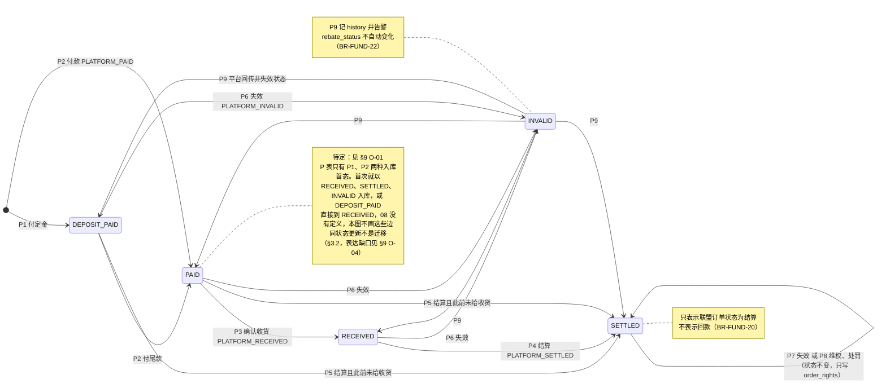
```mermaid
stateDiagram-v2
  direction LR
  [*] --> DEPOSIT_PAID: P1 付定金
  [*] --> PAID: P2 付款 PLATFORM_PAID
  DEPOSIT_PAID --> PAID: P2 付尾款
  PAID --> RECEIVED: P3 确认收货 PLATFORM_RECEIVED
  RECEIVED --> SETTLED: P4 结算 PLATFORM_SETTLED
  DEPOSIT_PAID --> SETTLED: P5 结算且此前未给收货
  PAID --> SETTLED: P5 结算且此前未给收货
  DEPOSIT_PAID --> INVALID: P6 失效 PLATFORM_INVALID
  PAID --> INVALID: P6 失效
  RECEIVED --> INVALID: P6 失效
  SETTLED --> SETTLED: P7 失效 或 P8 维权、处罚（状态不变，只写 order_rights）
  INVALID --> DEPOSIT_PAID: P9 平台回传非失效状态
  INVALID --> PAID: P9
  INVALID --> RECEIVED: P9
  INVALID --> SETTLED: P9
  note right of SETTLED
    只表示联盟订单状态为结算
    不表示回款（BR-FUND-20）
  end note
  note left of INVALID
    P9 记 history 并告警
    rebate_status 不自动变化（BR-FUND-22）
  end note
  note right of PAID
    待定：见 §9 O-01
    P 表只有 P1、P2 两种入库首态。首次就以
    RECEIVED、SETTLED、INVALID 入库，或 DEPOSIT_PAID
    直接到 RECEIVED，08 没有定义，本图不画这些边
    同状态更新不是迁移（§3.2，表达缺口见 §9 O-04）
  end note
```

P10（倒退）不是迁移：任何状态收到比当前更早阶段的状态码都不迁移，写待处理表并告警，图上不画边。维权不是状态：`order_rights` 与 `rights_pending` 是可以叠加在任何平台状态上的标记，结算之后同样适用（BR-FUND-06）。

**覆盖的异常情况**

- [x] 结算先于收货回传（P5：同一事务补写 PAID、RECEIVED、SETTLED 三条 `order_status_history`，`received_at` 取结算时间，BR-FUND-02）
- [x] 结算后失效、结算后维权或处罚（P7、P8：状态不变，写 `order_rights`，扣回走 §4.5）
- [x] 失效后平台又回传有效状态（P9：不自动复活返利，进差错单 `platform_restore`，§4.8）
- [x] 状态倒退（P10：不迁移、写待处理表并告警）
- [x] 映射表外的状态码、缺收货时间（不迁移、写待处理表、告警，不丢弃、不猜测，BR-FUND-02）
- [x] 乱序与重复回传（§3.2）
- [x] 同状态更新（状态码映射后与当前相同）：不是迁移，不画边；处理见 §3.2，P 表的表达缺口见 §9 O-04
- [ ] 入库首态为 RECEIVED、SETTLED、INVALID 与跳级迁移：08 未定义（§9 O-01），画不出；§3.2 把这类事件引到不执行的终止分支

**实现的 BR / AC**：BR-FUND-01（P1–P10）、BR-FUND-02、BR-FUND-22；AC-S2-10-TB、AC-S2-10-JD、AC-S2-10-PDD、AC-S2-12-TB、AC-S2-31；AC-ORD-06（F-ORD-06 同号）。

### 1.2 返利状态 `rebate_status`

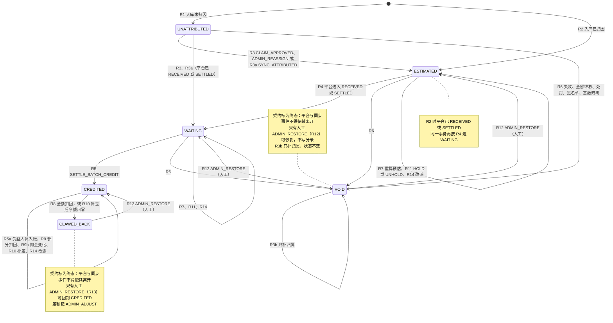
```mermaid
stateDiagram-v2
  [*] --> UNATTRIBUTED: R1 入库未归因
  [*] --> ESTIMATED: R2 入库已归因
  UNATTRIBUTED --> ESTIMATED: R3 CLAIM_APPROVED、ADMIN_REASSIGN 或 R3a SYNC_ATTRIBUTED
  UNATTRIBUTED --> WAITING: R3、R3a（平台已 RECEIVED 或 SETTLED）
  ESTIMATED --> WAITING: R4 平台进入 RECEIVED 或 SETTLED
  WAITING --> CREDITED: R5 SETTLE_BATCH_CREDIT
  UNATTRIBUTED --> VOID: R6 失效、全额维权、处罚、黑名单、基数归零
  ESTIMATED --> VOID: R6
  WAITING --> VOID: R6
  ESTIMATED --> ESTIMATED: R7 重算预估、R11 HOLD 或 UNHOLD、R14 改派
  WAITING --> WAITING: R7、R11、R14
  CREDITED --> CREDITED: R5a 受益人补入账、R9 部分扣回、R9b 佣金变化、R10 补差、R14 改派
  CREDITED --> CLAWED_BACK: R8 全额扣回，或 R10 补差后净额归零
  VOID --> VOID: R3b 只补归属
  VOID --> ESTIMATED: R12 ADMIN_RESTORE（人工）
  VOID --> WAITING: R12 ADMIN_RESTORE（人工）
  CLAWED_BACK --> CREDITED: R13 ADMIN_RESTORE（人工）
  note right of ESTIMATED
    R2 时平台已 RECEIVED 或 SETTLED
    同一事务再按 R4 进 WAITING
  end note
  note left of VOID
    契约标为终态：平台与同步事件不得使其离开
    只有人工 ADMIN_RESTORE（R12）可恢复，不写分录
    R3b 只补归属，状态不变
  end note
  note right of CLAWED_BACK
    契约标为终态：平台与同步事件不得使其离开
    只有人工 ADMIN_RESTORE（R13）可回到 CREDITED
    差额记 ADMIN_ADJUST
  end note
```

**覆盖的异常情况**

- [x] 入库时未归因、之后被同步重跑归因（R3a）或找回、改派（R3，置 `locked`）
- [x] 已作废且未归因的订单被找回或改派（R3b：只补归属，不生成快照、无分录；找回路径是否走得到见 §9 S-08）
- [x] 入账前失效、部分退款、佣金变化（R6、R7，无分录，§4.1）
- [x] 入账后全额或部分扣回、结算补差（R8、R9、R10，分录与迁移同一事务，§4.5、§4.6、§4.7）；只改预估佣金的 R9b 与 BR-CALC-02 冲突，§4.6 单列为待定（§9 F-15）
- [x] 售后中或风控、客服暂停（`rights_pending`、`hold` 只做标志，月结时暂缓或跳过，§4.2、§4.4）
- [x] 受益人暂缓后解除（R5a，后续批次单独入账，§4.4）
- [x] 已归属订单改派（R14：CREDITED 时先红冲再重记，BR-ATTR-20）
- [x] 终态只能经人工恢复离开（R12 无分录、R13 记差额，§4.8）；自动事件到达终态订单时不迁移
- [x] 并发迁移（CAS 冲突重读后重新判定；表外事件才是非法迁移，后台接口 20902）

**实现的 BR / AC**：BR-FUND-01（R1–R14）、BR-FUND-03、BR-FUND-04、BR-FUND-06、BR-FUND-07、BR-FUND-08、BR-FUND-09、BR-FUND-22、BR-CALC-10、BR-CALC-13、BR-ATTR-16、BR-ATTR-20；AC-S1-24、AC-S1-26-TB、AC-S2-01-TB、AC-S2-03、AC-S2-04、AC-S2-05、AC-S2-06、AC-S2-09、AC-S2-11、AC-S2-31、AC-S2-48、AC-S2-57。

### 1.3 平台原始状态 → 内部事件 → `platform_status`

映射的唯一落点是 `specs/order-status-map/{platform}.csv`（BR-FUND-02，状态「待验证」）。每个平台一张表，不共用模板。下表的原始码取自 09 已记录的**文档结论或抓取摘要，均未实测**（CAP-TB-07、CAP-JD-07、CAP-PDD-07 状态「未开始」），只作写 csv 的起点，不是事实；实测后以 09 为准改表。

**淘宝**（按出参口径；CAP-TB-07、CAP-TB-08）

| 原始字段与值（09 记录） | 内部事件 | `platform_status` | 说明与待定 |
| --- | --- | --- | --- |
| `tk_status` 12 付款 | 付款（`PLATFORM_PAID`） | PAID | |
| `tk_status` 14 成功 / 确认收货 | 确认收货（`PLATFORM_RECEIVED`） | RECEIVED | 文档未见收货时间字段；缺 `received_at` 时按 BR-FUND-02 进待处理表（§9 O-05） |
| `tk_status` 3 结算 | 结算（`PLATFORM_SETTLED`） | SETTLED（未给收货时走 P5） | `tk_earning_time` 为结算时间；与联盟回款日是否同一时点待 CAP-TB-08 |
| `tk_status` 13 失效，已入库的订单（售中退款成功、只付定金未付尾款） | 失效（`PLATFORM_INVALID`） | INVALID（SETTLED 后走 P7） | 尾款未付的原因码为 `PRESALE_UNPAID`（AC-S2-12-TB）；09 内两处标签不同（§9 O-10） |
| `tk_status` 13 失效，从未付款（超时未付、付款前取消） | — | 不入库 | 两个付款时间都为空的订单按 BR-ATTR-25 不入库；有付款时间而首次即失效的见 §9 O-01 |
| 预售：`tk_deposit_time`、`deposit_price` 有值而尾款未付 | 付定金 | DEPOSIT_PAID | 定金阶段 `tk_status` 序列未知（CAP-TB-07 未知项） |
| `tk_status` 11 拍下未付款 | — | 不入库 | 只见于入参口径 |
| 维权：`refund_tag`；维权单另查维权接口 | 维权 → `order_rights` | 不变（可叠加在任何状态上） | 维权码到 `order_rights.status` 的映射未定义（§9 O-08） |
| 处罚订单接口：冻结 | 处罚 | 不变 | 入账前 R6、入账后 R8（BR-FUND-07、08） |
| 处罚订单接口：解冻（外部资料称可反复切换） | — | 待定 | 08 把处罚视为终局、不告警不恢复（BR-FUND-22）；解冻怎么处理未定义（§9 O-14） |
| 表中没有的任何码 | — | 不变 | 写待处理表并告警，不落任何正向状态（BR-FUND-02） |

**京东**（CAP-JD-07、CAP-JD-08）

| 原始字段与值（09 记录） | 内部事件 | `platform_status` | 说明与待定 |
| --- | --- | --- | --- |
| `validCode` 16 已付款 | 付款 | PAID | |
| `validCode` 24 已付定金 | 付定金 | DEPOSIT_PAID | 尾款后是否 24 → 16 待测 |
| `validCode` 17 已完成 | 确认收货 | RECEIVED | `finishTime` 为收货时间 |
| 无「结算」码 | — | — | 结算只能从 `payMonth`、`actualFee` 等推出，P4 / P5 触发方式未定义（§9 O-06） |
| `validCode` 3 取消、其他无效码 | 失效 | INVALID | 原因码 `CANCELLED` 启用前并入 REFUND（04 §2.3） |
| `validCode` 违规类（如来源与备案不符） | 失效或处罚 | 待定 | 处罚建模冲突（§9 O-07） |
| `validCode` 2 无效-拆单 | — | 待定 | 拆单后以订单行为子订单、`parentId` 为父单（BR-ATTR-22，待验证）；拆单码不能当失效，处理未定义（§9 O-06） |
| `validCode` 15 待付款 | — | 不入库 | |
| 实际佣金由大于 0 变 0 | 基数归零 | 不变 | R6 或 R8；能否与部分维权区分待验证（BR-FUND-08） |
| 表中没有的任何码 | — | 不变 | 写待处理表并告警，不落任何正向状态 |

**拼多多**（以 `order_status` 数字为准；CAP-PDD-07、CAP-PDD-08）

| 原始字段与值（09 记录） | 内部事件 | `platform_status` | 说明与待定 |
| --- | --- | --- | --- |
| `order_status` 0 已支付、1 已成团 | 付款 | PAID | 0 → 1 为同状态重复上报（§9 O-04） |
| `order_status` 2 确认收货 | 确认收货 | RECEIVED | `order_receive_time` |
| `order_status` 3 审核成功 | — | 待定 | 无对应内部状态（§9 O-06） |
| `order_status` 5 已结算 | 结算 | SETTLED | `order_settle_time` |
| `order_status` 4 审核失败 | 失效或处罚 | 待定 | 处罚建模冲突（§9 O-07） |
| `order_status` 10 已处罚 | 处罚 | 待定 | 同上 |
| 比价标记（`price_compare_status`） | — | 不变 | 不是状态；计算与展示按 BR-CALC-16，佣金归零时按基数归零处理（BR-FUND-07） |
| 售后标记（`return_status`，只在详情接口出参） | — | 不变 | 是否用作 `rights_pending` 信号未定（§9 O-13） |
| 表中没有的任何码 | — | 不变 | 写待处理表并告警，不落任何正向状态 |

**可入账事件**（进入 WAITING 的条件）由 `specs/creditable-events.yaml` 定义，淘宝、京东、拼多多均为确认收货（BR-FUND-02）；入账时点跟随联盟月结批次（BR-FUND-04），不按收货后天数。「已入账后转失效」时扣回与状态迁移在同一事务（§4.5），不是先改状态再补扣。

### 1.4 用户可见状态 `display_status` 的派生

内部双状态与用户可见状态分两层：`display_status` 不入库，由接口按 BR-FUND-17 的派生表从上到下取第一个匹配项。状态名是我方设计，不是竞品惯例；文案只在 BR-TEXT-02、BR-TEXT-04 维护，图中不写。

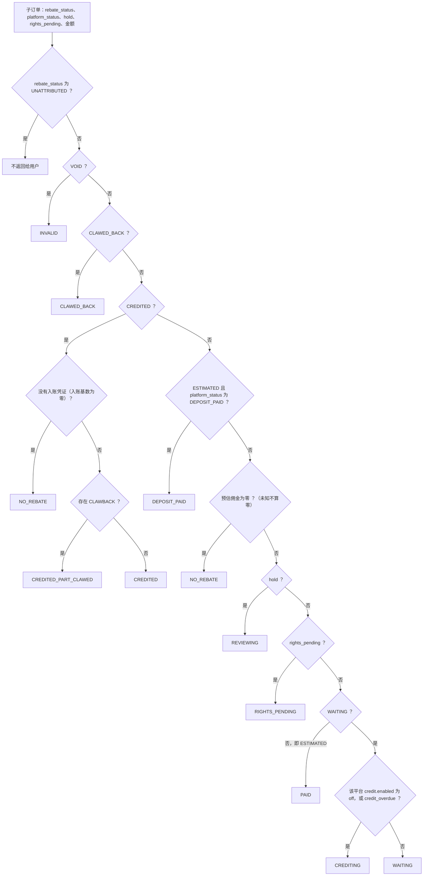
```mermaid
flowchart TD
  S["子订单：rebate_status、platform_status、hold、rights_pending、金额"] --> C0{"rebate_status 为 UNATTRIBUTED ？"}
  C0 -- "是" --> D0["不返回给用户"]
  C0 -- "否" --> C1{"VOID ？"}
  C1 -- "是" --> D1["INVALID"]
  C1 -- "否" --> C2{"CLAWED_BACK ？"}
  C2 -- "是" --> D2["CLAWED_BACK"]
  C2 -- "否" --> C3{"CREDITED ？"}
  C3 -- "是" --> C3a{"没有入账凭证（入账基数为零）？"}
  C3a -- "是" --> D3["NO_REBATE"]
  C3a -- "否" --> C4{"存在 CLAWBACK ？"}
  C4 -- "是" --> D4["CREDITED_PART_CLAWED"]
  C4 -- "否" --> D5["CREDITED"]
  C3 -- "否" --> C6{"ESTIMATED 且 platform_status 为 DEPOSIT_PAID ？"}
  C6 -- "是" --> D6["DEPOSIT_PAID"]
  C6 -- "否" --> C7{"预估佣金为零 ？（未知不算零）"}
  C7 -- "是" --> D7["NO_REBATE"]
  C7 -- "否" --> C8{"hold ？"}
  C8 -- "是" --> D8["REVIEWING"]
  C8 -- "否" --> C9{"rights_pending ？"}
  C9 -- "是" --> D9["RIGHTS_PENDING"]
  C9 -- "否" --> C10{"WAITING ？"}
  C10 -- "否，即 ESTIMATED" --> D14["PAID"]
  C10 -- "是" --> C11{"该平台 credit.enabled 为 off，或 credit_overdue ？"}
  C11 -- "是" --> D12["CREDITING"]
  C11 -- "否" --> D13["WAITING"]
```

**覆盖的异常情况**

- [x] 未归因订单不展示；作废、扣回、部分扣回、本单无返利各有状态
- [x] 付定金阶段先于「无返利」判定（佣金为零或未知时仍显示已付定金）
- [x] 预估佣金未知不当作零
- [x] 人工或风控暂停、售后中的展示先于等待结算
- [x] 平台入账开关关闭、预计结算月份已过仍未入账（都落到 CREDITING，不显示月份）

**实现的 BR / AC**：BR-FUND-17、BR-FUND-04 ⑪、BR-FUND-06、BR-CALC-03；AC-S1-24、AC-S1-27、AC-S2-02、AC-S2-03、AC-S2-12-TB；10 §3.4 状态文案覆盖表。

**本节不一致**：状态名与契约 `platform_status`、`rebate_status`、`display_status` 逐字一致（`WAITING_SETTLE` 已停用、不进契约）；其余见 §9 O-01 至 O-14。

---

## 2. 点击 → 转链 → 外跳 → 归因

出卡（搜索、详情、首页、识别、Agent）只登记 `link_id` 与报价快照、不转链；点击购买一律走 `POST /v1/links/{link_id}/open`（拍板第二批 TRADE-03）。`POST /v1/links/convert` 只供没有 link_id 的 H5 入口（`trade.convertAndOpen`），同一请求内登记 link 后按 open 同样处理。京东、拼多多在服务端转链；淘宝不调链接 API，open 下发百川打开指令、由客户端百川 SDK 完成淘客转链（变更记录 20261003，BR-ATTR-05、BR-ATTR-27 淘宝说明）。

open 要求设备签名，所以「分享链接可匿名打开」指 **App 内未登录**的用户；App 外（微信、浏览器）没有签名与桥，走不签名的 `GET /v1/share-pages/{link_id}`（§2.8）。分享链接也可以在 App 内打开：分享中间页的「在 App 中打开」拉起 `LinkLanding`，页面用 `GET /v1/links/{link_id}` 只读取卡片，点购买才走 open，归属判定不变（BR-ATTR-05 细则，按功能对照 Q-03 的默认写，待负责人确认）。

服务端判定拆成两张路由图（§2.1、§2.2），客户端对响应的处理三平台共用一张（§2.3），之后每个平台一张（§2.4–§2.6）只画该平台特有的步骤与归因交接。

### 2.1 open 判定：身份、开关与授权门

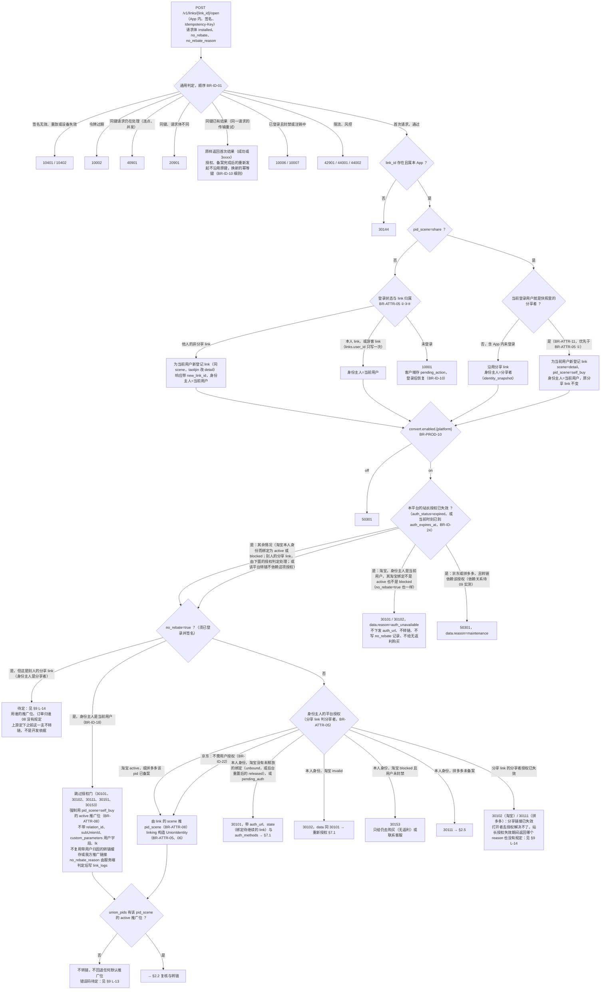
```mermaid
flowchart TD
  A["POST /v1/links/{link_id}/open（App 内，签名、Idempotency-Key）<br/>请求体 installed、no_rebate、no_rebate_reason"] --> G0{"通用判定，顺序 BR-ID-01"}
  G0 -- "签名无效、重放或设备失效" --> E0["10401 / 10402"]
  G0 -- "令牌过期" --> E0b["10002"]
  G0 -- "同键请求仍在处理（连点、并发）" --> E1a["40901"]
  G0 -- "同键、请求体不同" --> E1b["20901"]
  G0 -- "同键已有结果（同一请求的传输重试）" --> R0["原样返回首次结果（成功或 3xxxx）<br/>授权、备案完成后的重新发起不沿用原键，换新的幂等键（BR-ID-10 细则）"]
  G0 -- "已登录且封禁或注销中" --> E1c["10006 / 10007"]
  G0 -- "限流、风控" --> E1d["42901 / 44001 / 44002"]
  G0 -- "首次请求，通过" --> L1{"link_id 存在且属本 App ？"}
  L1 -- "否" --> E2["30144"]
  L1 -- "是" --> L2{"pid_scene=share ？"}
  L2 -- "是" --> S1{"当前登录用户就是快照里的分享者 ？"}
  S1 -- "是（BR-ATTR-11，优先于 BR-ATTR-05 ①）" --> S2["为当前用户新登记 link<br/>scene=detail、pid_scene=self_buy<br/>身份主人=当前用户，原分享 link 不变"]
  S1 -- "否，含 App 内未登录" --> S3["沿用分享 link<br/>身份主人=分享者（identity_snapshot）"]
  L2 -- "否" --> N1{"登录状态与 link 归属<br/>BR-ATTR-05 ②③④"}
  N1 -- "未登录" --> E3["10001<br/>客户端存 pending_action，登录后恢复（BR-ID-10）"]
  N1 -- "本人 link，或游客 link（links.user_id 只写一次）" --> N2["身份主人=当前用户"]
  N1 -- "他人的非分享 link" --> N3["为当前用户新登记 link（同 scene，taolijin 改 detail）<br/>响应带 new_link_id，身份主人=当前用户"]
  S2 --> SW
  S3 --> SW
  N2 --> SW
  N3 --> SW
  SW{"convert.enabled.{platform}<br/>BR-PROD-10"}
  SW -- "off" --> E4["50301"]
  SW -- "on" --> X0{"本平台的站长授权已失效 ？<br/>（auth_status=expired，或当前时刻已到 auth_expires_at，BR-ID-24）"}
  X0 -- "否" --> NR
  X0 -- "是：淘宝，身份主人是当前用户，其淘宝绑定不是 active 也不是 blocked<br/>（no_rebate=true 也一样）" --> E8["30101 / 30102，data.reason=auth_unavailable<br/>不下发 auth_url、不转链、不写 no_rebate 记录、不给无返利购买"]
  X0 -- "是：京东或拼多多，且转链依赖该授权（依赖关系待 09 实测）" --> E8b["50301，data.reason=maintenance"]
  X0 -- "是：其余情况（淘宝本人身份而绑定为 active 或 blocked；别人的分享 link，由下面的授权判定处理；或该平台转链不依赖这项授权）" --> NR
  NR{"no_rebate=true ？（须已登录并签名）"}
  NR -- "是，身份主人是当前用户（BR-ID-18）" --> NR1["跳过授权门（30101、30102、30111、30151、30153）<br/>强制用 pid_scene=self_buy 的 active 推广位（BR-ATTR-08）<br/>不带 relation_id、subUnionId、custom_parameters 用户字段、lk<br/>不复用带用户归因的转链缓存或我方推广链接<br/>no_rebate_reason 由服务端判定后写 link_logs"]
  NR -- "是，但这是别人的分享 link（身份主人是分享者）" --> NRX["待定：见 §9 L-14<br/>用谁的推广位、订单归谁 08 没有规定<br/>上游定下之前这一支不转链，不是开发依据"]
  NR -- "否" --> AU{"身份主人的平台授权<br/>（分享 link 判分享者，BR-ATTR-05）"}
  AU -- "京东：不需用户授权（BR-ID-22）" --> PID
  AU -- "淘宝 active，或拼多多该 pid 已备案" --> PID
  AU -- "本人身份，淘宝没有未释放的绑定（unbound，或后台重置后的 released），或 pending_auth" --> E5["30101，带 auth_url、state（绑定待继续的 link）与 auth_methods → §7.1"]
  AU -- "本人身份，淘宝 invalid" --> E6["30102，data 同 30101 → 重新授权 §7.1"]
  AU -- "本人身份，淘宝 blocked 且用户未封禁" --> E7["30153<br/>只给仍去购买（无返利）或联系客服"]
  AU -- "本人身份，拼多多未备案" --> E9["30111 → §2.5"]
  AU -- "分享 link 的分享者授权已失效" --> E10["30102（淘宝）/ 30111（拼多多）：分享链接已失效<br/>打开者去授权解决不了。站长授权失效期间返回哪个 reason 也没有规定：见 §9 L-14"]
  PID["由 link 的 scene 推 pid_scene（BR-ATTR-08）<br/>linking 构造 UnionIdentity（BR-ATTR-05、06）"] --> P0
  NR1 --> P0{"union_pids 有该 pid_scene 的 active 推广位 ？"}
  P0 -- "否" --> E11["不转链，不回退任何默认推广位<br/>错误码待定：见 §9 L-13"]
  P0 -- "是" --> NEXT["→ §2.2 复核与转链"]
```

**覆盖的异常情况**

- [x] 签名失败、设备失效、令牌过期、限流、风控、封禁
- [x] 连点或并发（同键 40901）、同键不同请求体（20901）、同一请求的传输重试（原样返回首次结果）；授权或备案完成后重新发起用新的幂等键，不会取回已存的 3xxxx
- [x] link 不存在或跨 App、未登录打开非分享 link、他人非分享 link（新建 link）
- [x] 分享者在 App 内打开自己的分享 link（改走自购位新 link，BR-ATTR-11）
- [x] 平台开关关闭
- [x] 站长授权失效优先于无返利购买与普通授权门（未绑定用户带 `no_rebate=true` 也不放行）；失效同时看状态列与到期时刻，到了 `auth_expires_at` 即使当天巡检还没跑也按失效处理（BR-ID-24，§7.2）
- [x] 京东、拼多多的转链依赖站长授权而授权失效时返回 50301（`data.reason=maintenance`）；是否依赖待 09 实测
- [x] `no_rebate` 在身份构造与缓存选择之前独立分流：自购位、不带任何用户参数、不复用带归因的缓存或推广链接
- [ ] 打开别人的分享 link 时带 `no_rebate=true`：用谁的推广位、订单归谁上游未定（§9 L-14），图上引到不转链的待定节点，不套用自购的做法
- [x] 淘宝绑定缺失（含后台重置授权后的 released，下次购买按 30101 重新授权，BR-ID-20）、失效、停用，拼多多未备案，分享者授权失效
- [x] 没有 active 推广位时不回退默认值（错误码待定）

**实现的 BR / AC**：BR-ID-01、BR-ID-10、BR-ID-17、BR-ID-18、BR-ID-20、BR-ID-22、BR-ID-24、BR-ATTR-02、BR-ATTR-05、BR-ATTR-06、BR-ATTR-08、BR-ATTR-11、BR-PROD-10；AC-S1-04、AC-S1-05-TB、AC-S1-05-JD、AC-S1-05-PDD、AC-S1-06、AC-S1-07-TB、AC-S1-15、AC-S1-16、AC-S1-19、AC-S1-20、AC-S1-41、AC-S1-65。

### 2.2 open 判定：复核、转链与响应

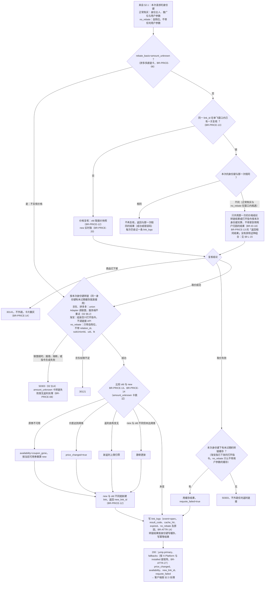
```mermaid
flowchart TD
  IN["来自 §2.1：本次请求的身份键<br/>正常购买：身份主人、推广位与用户参数<br/>no_rebate：自购位，不带任何用户参数"] --> AK{"rebate_basis=amount_unknown ？<br/>（拼多多直链卡，BR-PRICE-08）"}
  AK -- "是：不复核价格" --> CV
  AK -- "否" --> SF{"同一 link_id 在单飞窗口内已有一次复核 ？<br/>（BR-PRICE-13）"}
  SF -- "否" --> RQ["价格复核：old 取报价快照（BR-PRICE-12）<br/>new 实时取（BR-PRICE-20）"]
  SF -- "是" --> SK{"本次的身份键与那一次相同 ？"}
  SK -- "相同" --> SFR["不再复核，返回与那一次相同的结果（成功或错误码）<br/>每次仍各记一条 link_logs"]
  SK -- "不同（正常购买与 no_rebate 在窗口内相遇）" --> SFN["只共用那一次的价格结论<br/>转链结果或打开指令按本次身份键另算，不得拿到带用户归因的结果（BR-ID-18）<br/>BR-PRICE-13 的「返回相同结果」没有排除这种组合：见 §9 L-15"]
  RQ --> RQR{"复核结论"}
  SFN --> RQR
  RQR -- "商品已下架" --> E1["30141，不外跳，卡片置灰（BR-PRICE-14）"]
  RQR -- "取价失败" --> CA{"本次身份键下有未过期的转链缓存 ？<br/>（淘宝指已下发的打开指令。no_rebate 只认不带用户参数的缓存）"}
  CA -- "有" --> OKC["用缓存结果，requote_failed=true"]
  CA -- "无" --> E2["50303，不外跳任何返利链接"]
  RQR -- "取价成功" --> CV{"按本次身份键转链（同一身份键有未过期缓存就直接用）<br/>京东、拼多多：union Adapter 调联盟，服务端不重试（02 §6.2）<br/>淘宝：组装百川打开指令，不调链接 API<br/>no_rebate：只带自购位，不带 relation_id、subUnionId、uid、lk"}
  CV -- "联盟超时、报错、熔断，或指令生成失败" --> E3["50303（02 §14）<br/>amount_unknown 卡转链失败按无返利处理（BR-PRICE-08）"]
  CV -- "京东权限不足" --> E4["30121"]
  CV -- "成功" --> CMP{"比较 old 与 new<br/>BR-PRICE-13、BR-PRICE-14<br/>（amount_unknown 卡跳过）"}
  CMP -- "原券不可用" --> F1["availability=coupon_gone，按当前可用券重算 new"]
  CMP -- "价差达到阈值" --> F2["price_changed=true"]
  CMP -- "返利由有变无" --> F3["新返利上限归零"]
  CMP -- "new 与 old 不同但未达阈值" --> F4["静默更新"]
  CMP -- "未变" --> LOG
  F1 --> NL["new 与 old 不同就新建 link，返回 new_link_id（BR-PRICE-12）"]
  F2 --> NL
  F3 --> NL
  F4 --> NL
  NL --> LOG
  OKC --> LOG
  LOG["写 link_logs（event=open，result_code、cache_hit、expired、no_rebate 及原因，BR-ATTR-14）<br/>转链结果按身份键写缓存，写幂等结果"] --> RESP["200：jump.primary、fallbacks（按 X-Platform 与 installed 查矩阵，BR-ATTR-27）<br/>price_changed、availability、new_link_id、requote_failed<br/>→ 客户端按 §2.3 处理"]
```

失败的 open 同样记一条 `link_logs`（`result_code` 非零，不算点击证据，BR-ATTR-14）；3xxxx 结果写入幂等记录、5xxxx 不写（04 §5）。

**覆盖的异常情况**

- [x] 短时间内重复点击同一 link（身份键相同：单飞合并，返回同一结果，成功或错误码都一样，每次仍各记一条日志）
- [x] 正常购买与 `no_rebate=true` 在单飞窗口内先后到达：只共用价格结论，转链结果或打开指令按各自的身份键另算，无返利请求拿不到带用户归因的结果（BR-PRICE-13 的表述缺口见 §9 L-15）
- [x] 转链缓存按身份键隔离：`no_rebate` 不命中带用户参数的缓存，取价失败时的缓存降级同样只认本次身份键
- [x] 商品下架、取价失败时有无缓存两种去向（`requote_failed` 或 50303）
- [x] 联盟超时、报错、熔断、京东权限不足（服务端不重试转链）
- [x] 券失效、价差达阈值、返利由有变无、静默更新（新 link 与 `new_link_id`）
- [x] `amount_unknown` 卡不做价格复核，转链失败按无返利

**实现的 BR / AC**：BR-PRICE-08、BR-PRICE-12、BR-PRICE-13、BR-PRICE-14、BR-PRICE-20、BR-ATTR-05、BR-ATTR-14、BR-ATTR-27、BR-ID-17、BR-ID-18；拍板第二批 TRADE-03、TRADE-08、TRADE-17；AC-S1-06、AC-S1-10、AC-S1-12、AC-S1-13、AC-S1-14、AC-S1-16。

### 2.3 客户端处理 open 响应与外跳（三平台共用）

前提：平台 SDK 只在用户同意隐私政策后初始化（BR-ID-11）；入口包括搜索、详情、首页卡片、输入识别（剪贴板读取受开关与时机限制，BR-ID-16）、Agent 卡片、App 内链接落地页（LinkLanding，BR-ATTR-05 细则），以及第三方页容器里点到平台商品页后转回的原生详情（BR-ATTR-29）。

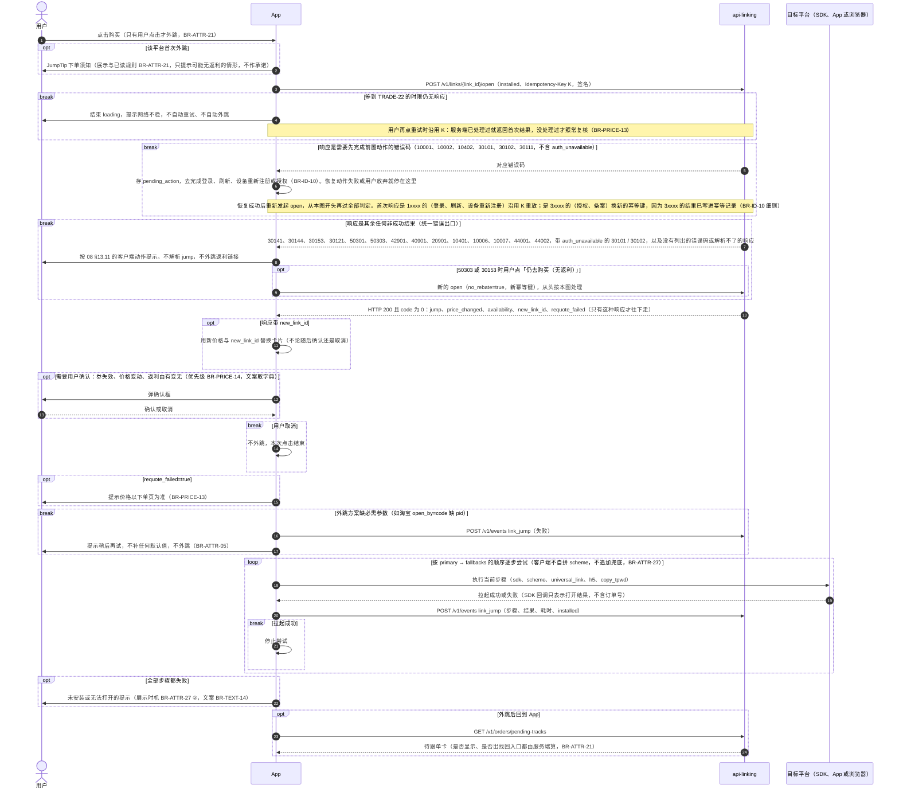
```mermaid
sequenceDiagram
  autonumber
  actor U as 用户
  participant C as App
  participant A as api·linking
  participant P as 目标平台（SDK、App 或浏览器）

  U->>C: 点击购买（只有用户点击才外跳，BR-ATTR-21）
  opt 该平台首次外跳
    C->>U: JumpTip 下单须知（展示与已读规则 BR-ATTR-21，只提示可能无返利的情形，不作承诺）
  end
  C->>A: POST /v1/links/{link_id}/open（installed、Idempotency-Key K，签名）
  break 等到 TRADE-22 的时限仍无响应
    C->>U: 结束 loading，提示网络不稳，不自动重试、不自动外跳
    Note over C,A: 用户再点重试时沿用 K：服务端已处理过就返回首次结果，没处理过才照常复核（BR-PRICE-13）
  end
  break 响应是需要先完成前置动作的错误码（10001、10002、10402、30101、30102、30111，不含 auth_unavailable）
    A-->>C: 对应错误码
    C->>C: 存 pending_action，去完成登录、刷新、设备重新注册或授权（BR-ID-10）。恢复动作失败或用户放弃就停在这里
    Note over C,A: 恢复成功后重新发起 open，从本图开头再过全部判定。首次响应是 1xxxx 的（登录、刷新、设备重新注册）沿用 K 重放；是 3xxxx 的（授权、备案）换新的幂等键，因为 3xxxx 的结果已写进幂等记录（BR-ID-10 细则）
  end
  break 响应是其余任何非成功结果（统一错误出口）
    A-->>C: 30141、30144、30153、30121、50301、50303、42901、40901、20901、10401、10006、10007、44001、44002，带 auth_unavailable 的 30101 / 30102，以及没有列出的错误码或解析不了的响应
    C->>U: 按 08 §13.11 的客户端动作提示。不解析 jump，不外跳返利链接
    opt 50303 或 30153 时用户点「仍去购买（无返利）」
      C->>A: 新的 open（no_rebate=true，新幂等键），从头按本图处理
    end
  end
  A-->>C: HTTP 200 且 code 为 0：jump、price_changed、availability、new_link_id、requote_failed（只有这种响应才往下走）
  opt 响应带 new_link_id
    C->>C: 用新价格与 new_link_id 替换卡片（不论随后确认还是取消）
  end
  opt 需要用户确认：券失效、价格变动、返利由有变无（优先级 BR-PRICE-14，文案取字典）
    C->>U: 弹确认框
    U-->>C: 确认或取消
  end
  break 用户取消
    C->>C: 不外跳，本次点击结束
  end
  opt requote_failed=true
    C->>U: 提示价格以下单页为准（BR-PRICE-13）
  end
  break 外跳方案缺必需参数（如淘宝 open_by=code 缺 pid）
    C->>A: POST /v1/events link_jump（失败）
    C->>U: 提示稍后再试，不补任何默认值，不外跳（BR-ATTR-05）
  end
  loop 按 primary → fallbacks 的顺序逐步尝试（客户端不自拼 scheme，不追加兜底，BR-ATTR-27）
    C->>P: 执行当前步骤（sdk、scheme、universal_link、h5、copy_tpwd）
    P-->>C: 拉起成功或失败（SDK 回调只表示打开结果，不含订单号）
    C->>A: POST /v1/events link_jump（步骤、结果、耗时、installed）
    break 拉起成功
      C->>C: 停止尝试
    end
  end
  opt 全部步骤都失败
    C->>U: 未安装或无法打开的提示（展示时机 BR-ATTR-27 ②，文案 BR-TEXT-14）
  end
  opt 外跳后回到 App
    C->>A: GET /v1/orders/pending-tracks
    A-->>C: 待跟单卡（是否显示、是否出找回入口都由服务端算，BR-ATTR-21）
  end
```

**覆盖的异常情况**

- [x] open 超时：不自动重试、不自动外跳，用户重试沿用同一幂等键
- [x] 需先登录、刷新令牌、重新注册设备或授权（恢复成功后从头再走：1xxxx 的沿用原幂等键，授权与备案这类 3xxxx 的换新键；恢复失败或放弃即终止）
- [x] 统一错误出口：除「HTTP 200 且 code 为 0」之外的任何响应都在此终止，不解析 jump、不外跳返利链接，包括签名失败、封禁、注销中、同键冲突、风控等通用拒绝和没有列出的错误码；无返利购买是一次新的 open
- [x] 价格变动、券失效、返利归零时用户确认或取消（取消即结束，卡片已换新价格）
- [x] 复核失败但有缓存（`requote_failed`，照常外跳并提示）
- [x] 外跳方案缺参数时失败上报，不回退默认值
- [x] 目标 App 未安装、拉起失败（逐步降级，全部失败才提示）
- [x] 外跳后订单迟迟未同步（待跟单卡与找回入口）

**实现的 BR / AC**：BR-PRICE-13、BR-PRICE-14、BR-ATTR-05、BR-ATTR-21、BR-ATTR-27、BR-ID-10、BR-ID-11、BR-ID-16、BR-ID-18；拍板第二批 TRADE-22；AC-S1-04、AC-S1-06、AC-S1-12、AC-S1-13、AC-S1-14、AC-S1-16、AC-S1-17、AC-S1-18-TB、AC-S1-18-JD、AC-S1-18-PDD、AC-S1-25、AC-S1-55；AC-LINK-06、AC-LINK-07。

### 2.4 京东：服务端转链与归因

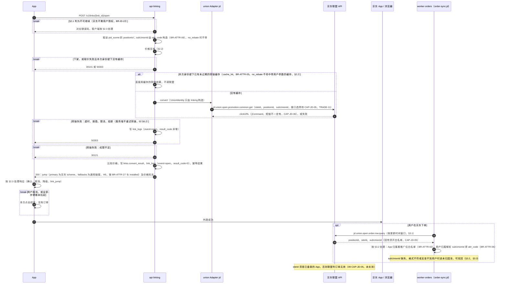
```mermaid
sequenceDiagram
  autonumber
  participant C as App
  participant A as api·linking
  participant UA as union Adapter·jd
  participant JD as 京东联盟 API
  participant JA as 京东 App / 浏览器
  participant W as worker·orders（order-sync.jd）

  C->>A: POST /v1/links/{link_id}/open
  break §2.1 判为不可继续（京东不需用户授权，BR-ID-22）
    A-->>C: 对应错误码，客户端按 §2.3 处理
  end
  A->>A: 取该 pid_scene 的 positionId；subUnionId 由 attr_code 构造（BR-ATTR-06），no_rebate 时不带
  A->>A: 价格复核（§2.2）
  break 下架，或取价失败且本次身份键下没有缓存
    A-->>C: 30141 或 50303
  end
  alt 本次身份键下已有未过期的转链缓存（cache_hit，BR-ATTR-05。no_rebate 不命中带用户参数的缓存，§2.2）
    A->>A: 直接用缓存的转链结果，不调联盟
  else 没有缓存
    A->>UA: convert（UnionIdentity 只由 linking 构造）
    UA->>JD: jd.union.open.promotion.common.get（siteId、positionId、subUnionId，接口选择待 CAP-JD-05，TRADE-11）
    JD-->>UA: clickURL（jCommand、短链不一定有，CAP-JD-06），或失败
  end
  break 转链失败：超时、报错、限流、熔断（服务端不重试转链，02 §6.2）
    A->>A: 写 link_logs（event=open，result_code 非零）
    A-->>C: 50303
  end
  break 转链失败：权限不足
    A-->>C: 30121
  end
  A->>A: 比较价格，写 links.convert_result、link_logs（event=open，result_code=0）、幂等结果
  A-->>C: 200：jump（primary 为京东 scheme，fallbacks 为通用链接、H5，按 BR-ATTR-27 与 installed）及价格标志
  C->>C: 按 §2.3 处理响应（确认、取消、降级、link_jump）
  break 用户取消，或全部步骤都未拉起
    C->>C: 本次点击结束，没有订单
  end
  C->>JA: 外跳成功
  opt 用户在京东下单
    W->>JD: jd.union.open.order.row.query（按更新时间窗口，§3.1）
    JD-->>W: positionId、siteId、subUnionId（回传须开白名单，CAP-JD-05）
    W->>W: 按 §3.2 处理：App 归属看推广位白名单（BR-ATTR-02），用户归属解析 subUnionId 得 attr_code（BR-ATTR-06）
    Note over W: subUnionId 缺失、格式不符或反查不到用户时进未归因池，可找回（§3.2、§3.3）
  end
  Note over JD: siteId 须是已备案的 App，否则联盟判订单无效（09 CAP-JD-05，未实测）
```

**覆盖的异常情况**

- [x] §2.1 的拒绝、下架、取价失败都在转链前终止
- [x] 联盟超时、报错、限流、熔断、权限不足（终止，不外跳）
- [x] 用户取消或拉起失败（终止，无订单）
- [x] 京东 App 未安装（按 fallbacks 降级，§2.3）
- [x] 订单回传缺少用户参数或白名单未开（未归因池）
- [x] 无返利购买不带 subUnionId，也不命中带用户参数的转链缓存

**实现的 BR / AC**：BR-ATTR-02、05、06、14、27；BR-PRICE-12、13；BR-ID-22；拍板第二批 TRADE-03、TRADE-11；CAP-JD-05、CAP-JD-06、CAP-JD-11（均未实测）；AC-S1-01-JD、AC-S1-02-JD、AC-S1-05-JD、AC-S1-18-JD、AC-S1-26-JD、AC-S1-28-JD；AC-LINK-05。

### 2.5 拼多多：备案、服务端转链与归因

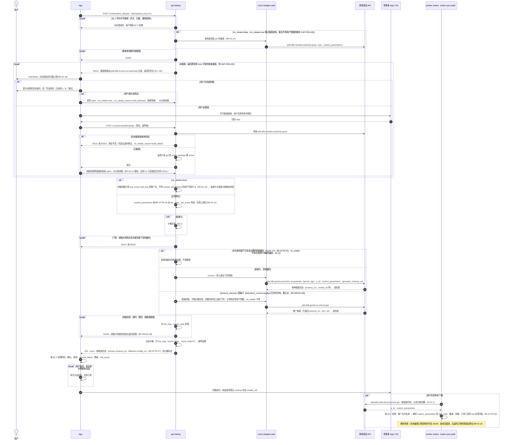
```mermaid
sequenceDiagram
  autonumber
  actor U as 用户
  participant C as App
  participant A as api·linking
  participant UA as union Adapter·pdd
  participant PD as 多多进宝 API
  participant PA as 拼多多 App / H5
  participant W as worker·orders（order-sync.pdd）

  C->>A: POST /v1/links/{link_id}/open（Idempotency-Key K1）
  break §2.1 判为不可继续（开关、归属、通用拒绝）
    A-->>C: 对应错误码，客户端按 §2.3 处理
  end
  opt no_rebate=false（no_rebate=true 跳过备案查询，能否不带用户参数转链待 CAP-PDD-06）
    A->>UA: 查询该场景 pid 的备案（BR-ID-22）
    UA->>PD: pdd.ddk.member.authority.query（pid、custom_parameters）
  end
  break 备案查询超时或报错
    A-->>C: 50303
  end
  break 未备案（返回里没有 bind 字段也按未备案，待 CAP-PDD-05）
    A-->>C: 30111（备案链接由 pdd.ddk.rp.prom.url.generate 生成，返回形状见 §9 L-06）
    C->>U: AuthSheet（自动弹出的次数上限 BR-ID-18）
    alt 用户关闭或拒绝
      C->>U: 提示未授权没有返利，给「仍去购买（无返利）」与「重试」
      opt 用户选仍去购买
        C->>A: 新的 open（no_rebate=true，no_rebate_reason=auth_declined，新幂等键），从头按本图
      end
    else 用户去授权
      C->>PA: 打开备案链接，用户在拼多多内授权
      PA-->>C: 回到 App
      C->>A: POST /v1/unions/pdd/bindings（签名、幂等键）
      A->>PD: 再查 pdd.ddk.member.authority.query
      alt 仍未备案或查询失败
        A-->>C: 30111 或 50303，绑定不变（可选无返利购买，no_rebate_reason=auth_failed）
      else 已备案
        A->>A: 该用户该 pid 的 union_bindings 置 active
        A-->>C: 成功
        C->>A: 用新的幂等键重新发起 open，从头按本图（BR-ID-10 细则。沿用 K1 只会取回已存的 30111）
      end
    end
  end
  alt no_rebate=true
    A->>A: 转链参数只带 pid_scene=self_buy 的推广位，不带 custom_parameters 的用户字段与 lk（BR-ID-18）。普通卡与直链卡都按此构造
  else 正常购买
    A->>A: custom_parameters 按 BR-ATTR-06 由 attr_code、pid_scene 构造（长度上限见 BR-ID-22）
  end
  opt 普通卡
    A->>A: 价格复核（§2.2）
  end
  break 下架，或取价失败且本次身份键下没有缓存
    A-->>C: 30141 或 50303
  end
  alt 本次身份键下已有未过期的转链缓存（cache_hit，BR-ATTR-05。no_rebate 不命中带用户参数的缓存，§2.2）
    A->>A: 直接用缓存的转链结果，不调联盟
  else 普通卡，没有缓存
    A->>UA: convert（用上面定下的参数）
    UA->>PD: pdd.ddk.goods.promotion.url.generate（goods_sign、p_id、custom_parameters、generate_schema_url）
    PD-->>UA: 多种链接形态（schema_url、mobile_url 等），或失败
  else amount_unknown 直链卡（pdd.direct_convert.enabled 打开时才有，默认关，BR-PRICE-08）
    A->>UA: 直链转链，不做价格复核。参数同样用上面定下的：正常购买带用户参数，no_rebate 不带
    UA->>PD: pdd.ddk.goods.zs.unit.url.gen
    PD-->>UA: 推广链接（不返回 schema_url，§9 L-10），或失败
  end
  break 转链失败：超时、限流、熔断或报错
    A->>A: 写 link_logs（result_code 非零）
    A-->>C: 50303（直链卡转链失败按无返利处理，BR-PRICE-08）
  end
  A->>A: 比较价格，写 link_logs（event=open，result_code=0）、幂等结果
  A-->>C: 200：jump（按端选形态：primary schema_url，fallbacks mobile_url，BR-ATTR-27）及价格标志
  C->>C: 按 §2.3 处理响应（确认、取消、requote_failed、降级、link_jump）
  break 用户取消，或全部步骤都未拉起
    C->>C: 本次点击结束，没有订单
  end
  C->>PA: 外跳成功（未装或鸿蒙无 scheme 时走 mobile_url）
  opt 用户在拼多多下单
    W->>PD: pdd.ddk.order.list.increment.get（按更新时间，从末页倒序翻，02 §7.1）
    PD-->>W: p_id、custom_parameters
    W->>W: 按 §3.2 处理：推广位白名单 → 解析 custom_parameters 得 attr_code（备案、转链、订单三处的 uid 必须同值，BR-ATTR-06）
    Note over W: 解析失败（含未备案订单回传的不是 JSON）进未归因池。无返利订单的找回边界见 BR-ID-18
  end
```

**覆盖的异常情况**

- [x] §2.1 的拒绝、备案查询失败、下架、取价失败、转链失败都终止，不外跳
- [x] 首次未备案：授权后用新的幂等键重新发起 open；用户关闭或拒绝；授权后仍未备案
- [x] 无返利购买不带用户标识、不做备案校验：转链参数在分支之前按 `no_rebate` 定下，普通卡与 `amount_unknown` 直链卡都用这一套，直链支路不会带上用户参数；缓存只认本次身份键
- [x] 价格变动确认与取消、`requote_failed`（经 §2.3）
- [x] `amount_unknown` 直链卡不做价格复核
- [x] App 未安装、鸿蒙无 scheme（降级 H5）
- [x] 订单用户参数解析失败、无返利订单的找回边界

**实现的 BR / AC**：BR-ID-18、BR-ID-22、BR-ATTR-02、06、14、27；BR-PRICE-08、12、13；拍板第二批 TRADE-08；CAP-PDD-05、CAP-PDD-06、CAP-PDD-11（均未实测）；AC-S1-01-PDD、AC-S1-02-PDD、AC-S1-05-PDD、AC-S1-06、AC-S1-12、AC-S1-14、AC-S1-18-PDD、AC-S1-26-PDD、AC-S1-28-PDD；AC-LINK-04。

### 2.6 淘宝：百川打开指令与归因

> 依据 `docs/changes/20261003-淘宝转链改客户端百川.md` 与 BR-ATTR-05、BR-ATTR-27 的「2026-10-03 淘宝」说明：链接转换 API 为邀请制、新 App 首版拿不到（09 2_TB §2.5），淘宝 Adapter **不调链接 API**；open 照常做归属、授权校验、价格复核（取详情接口）与 `link_logs`，响应的 `jump` 放百川打开指令，由客户端百川 SDK 完成淘客转链。承载指令的契约字段 `JumpStep.sdk` 尚未补进代码仓库（§9 L-03）。

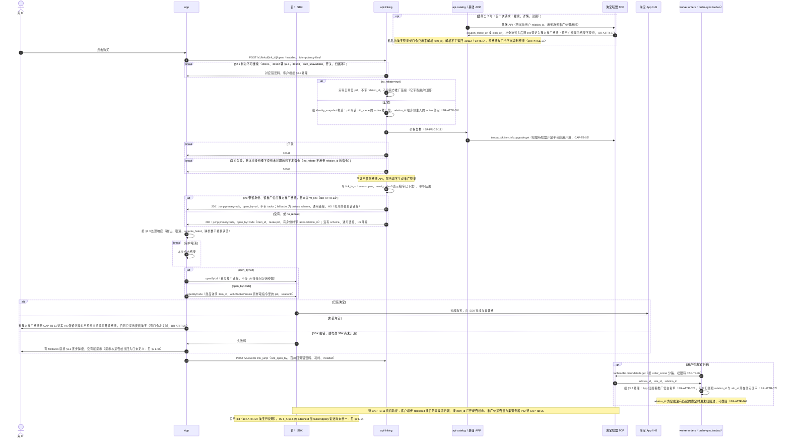
```mermaid
sequenceDiagram
  autonumber
  actor U as 用户
  participant C as App
  participant BC as 百川 SDK
  participant A as api·linking
  participant CT as api·catalog（基础 API）
  participant TB as 淘宝联盟 TOP
  participant TA as 淘宝 App / H5
  participant W as worker·orders（order-sync.taobao）

  opt 此前出卡时（另一次请求：搜索、详情、识别）
    CT->>TB: 基础 API（带当前用户 relation_id、用该场景推广位调用时）
    TB-->>CT: coupon_share_url 或 click_url，补全协议头后随 link 登记为我方推广链接（跨用户缓存的结果不登记，BR-ATTR-27）
    Note over CT: 粘贴的淘宝链接或口令只用来解析 item_id，解析不了返回 30132（02 §6.1）。原链接与口令不当返利链接（BR-PRICE-21）
  end
  U->>C: 点击购买
  C->>A: POST /v1/links/{link_id}/open（installed、Idempotency-Key）
  break §2.1 判为不可继续（30101、30102 转 §7.1，30153、auth_unavailable、开关、归属等）
    A-->>C: 对应错误码，客户端按 §2.3 处理
  end
  alt no_rebate=true
    A->>A: 只取自购位 pid，不带 relation_id，不用我方推广链接（它带着用户归因）
  else 正常
    A->>A: 按 identity_snapshot 构造：pid 取该 pid_scene 的 active 推广位，relation_id 取身份主人的 active 绑定（BR-ATTR-05）
  end
  A->>CT: 价格复核（BR-PRICE-13）
  CT->>TB: taobao.tbk.item.info.upgrade.get（权限待联盟开放平台应用开通，CAP-TB-02）
  break 下架
    A-->>C: 30141
  end
  break 取价失败，且本次身份键下没有未过期的已下发指令（no_rebate 不用带 relation_id 的指令）
    A-->>C: 50303
  end
  Note over A: 不调用任何链接 API，服务端不生成推广链接
  A->>A: 写 link_logs（event=open，result_code=0 表示指令已下发）、幂等结果
  alt link 带该身份、该推广位的我方推广链接，且未过 W_link（BR-ATTR-13）
    A-->>C: 200：jump.primary=sdk，open_by=url，不带 taoke；fallbacks 为 taobao scheme、通用链接、H5（打开的都是该链接）
  else 没有，或 no_rebate
    A-->>C: 200：jump.primary=sdk，open_by=code（item_id、taoke.pid、有身份时带 taoke.relation_id）；没有 scheme、通用链接、H5 降级
  end
  C->>C: 按 §2.3 处理响应（确认、取消、requote_failed、缺参数不补默认值）
  break 用户取消
    C->>C: 本次点击结束
  end
  alt open_by=url
    C->>BC: openByUrl（我方推广链接，不传 pid 等任何分佣参数）
  else open_by=code
    C->>BC: openByCode（商品详情 item_id，AlibcTaokeParams 原样取指令里的 pid、relationId）
  end
  alt 已装淘宝
    BC->>TA: 拉起淘宝，由 SDK 完成淘客转链
  else 未装淘宝
    C->>U: 有我方推广链接且 CAP-TB-11 证实 H5 保留归因时用系统浏览器打开该链接，否则只提示安装淘宝（有口令才复制，BR-ATTR-27）
  else SDK 报错，或电商 SDK 尚未开通
    BC-->>C: 失败码
    C->>U: 有 fallbacks 就按 §2.3 逐步降级，没有就提示（提示与是否给找回入口未定义：见 §9 L-05）
  end
  C->>A: POST /v1/events link_jump（sdk_open_by、百川回调错误码、耗时、installed）
  opt 用户在淘宝下单
    W->>TB: taobao.tbk.order.details.get（按 order_scene 分路，权限待 CAP-TB-07）
    TB-->>W: adzone_id、site_id、relation_id
    W->>W: 按 §3.2 处理：App 归属看推广位白名单（BR-ATTR-02），用户归属按 relation_id 与 attr_at 落在绑定区间（BR-ATTR-07）
    Note over W: relation_id 为空或没有匹配的绑定时进未归因池，可找回（BR-ATTR-16）
  end
  Note over BC,TB: 待 CAP-TB-11 真机验证：客户端传 relationId 能否带来渠道归因、按 item_id 打开能否领券。推广位是否须为渠道专属 PID 待 CAP-TB-05
  Note over BC: 只用 pid（BR-ATTR-27 淘宝行说明）。09 5_X §5.5 的 adzoneId 加 taokeAppkey 说法尚未统一：见 §9 L-04
```

分享 link 在本 App 内被别人打开时，身份主人是分享者，指令里是分享者的分享位 pid 与 relation_id（或分享时登记的我方推广链接）；App 外打开见 §2.8。

**覆盖的异常情况**

- [x] 绑定缺失、失效、停用、站长授权失效（§2.1 终止，授权流程见 §7.1）
- [x] 下架、取价失败且无缓存（终止，不下发指令）
- [x] 无返利购买：自购位、不带 relation_id、不复用带归因的推广链接
- [x] 我方推广链接不存在、过期或来自跨用户缓存（改走 open_by=code）
- [x] s.click / uland 不二次转链；粘贴的链接与口令只解析 item_id
- [x] 用户取消；淘宝未安装；SDK 报错或未开通
- [x] 订单没有 relation_id 或绑定不匹配（未归因池）

**实现的 BR / AC**：BR-ATTR-02、05、06、07、13、14、16、27；BR-ID-17、BR-ID-18、BR-ID-24；BR-PRICE-13、BR-PRICE-21；变更记录 20261003 §1、§4；CAP-TB-02、05、06、07、11（均未实测）；AC-S1-01-TB、AC-S1-02-TB、AC-S1-05-TB、AC-S1-06、AC-S1-18-TB、AC-S1-26-TB、AC-S1-28-TB、AC-S1-65；AC-LINK-03。

### 2.7 分享：生成物料

分享属 M-公开阶段（`POST /v1/shares`，04 §6.3）。归属规则不变：分享链接的转链者就是分享者（BR-ATTR-10）。淘宝做法由负责人 2026-10-03 确认（变更记录 §6-1）：分享时在 App 内用分享者身份取我方推广链接并生成淘口令，取不到就不生成淘宝分享。

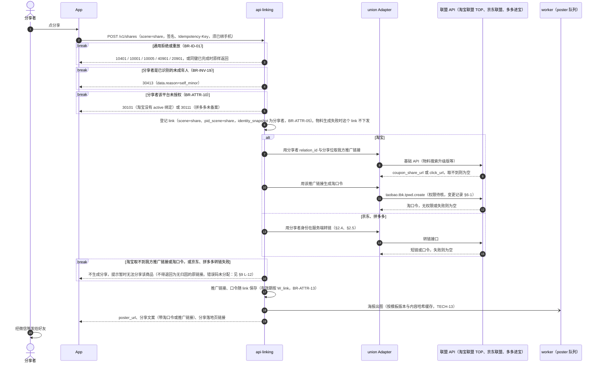
```mermaid
sequenceDiagram
  autonumber
  actor S as 分享者
  participant C as App
  participant A as api·linking
  participant UA as union Adapter
  participant UP as 联盟 API（淘宝联盟 TOP、京东联盟、多多进宝）
  participant WK as worker（poster 队列）

  S->>C: 点分享
  C->>A: POST /v1/shares（scene=share，签名、Idempotency-Key，须已绑手机）
  break 通用拒绝或重放（BR-ID-01）
    A-->>C: 10401 / 10001 / 10005 / 40901 / 20901，或同键已完成时原样返回
  end
  break 分享者是已识别的未成年人（BR-INV-19）
    A-->>C: 30413（data.reason=self_minor）
  end
  break 分享者该平台未授权（BR-ATTR-10）
    A-->>C: 30101（淘宝没有 active 绑定）或 30111（拼多多未备案）
  end
  A->>A: 登记 link（scene=share、pid_scene=share，identity_snapshot 为分享者，BR-ATTR-05）。物料生成失败时这个 link 不下发
  alt 淘宝
    A->>UA: 用分享者 relation_id 与分享位取我方推广链接
    UA->>UP: 基础 API（物料搜索升级版等）
    UP-->>UA: coupon_share_url 或 click_url，取不到则为空
    A->>UA: 用该推广链接生成淘口令
    UA->>UP: taobao.tbk.tpwd.create（权限待核，变更记录 §6-1）
    UP-->>UA: 淘口令，无权限或失败则为空
  else 京东、拼多多
    A->>UA: 用分享者身份在服务端转链（§2.4、§2.5）
    UA->>UP: 转链接口
    UP-->>UA: 短链或口令，失败则为空
  end
  break 淘宝取不到我方推广链接或淘口令，或京东、拼多多转链失败
    A-->>C: 不生成分享，提示暂时无法分享该商品（不得退回为无归因的原链接。错误码未分配：见 §9 L-12）
  end
  A->>A: 推广链接、口令随 link 保存（有效期按 W_link，BR-ATTR-13）
  A-)WK: 海报出图（按模板版本与内容哈希缓存，TECH-13）
  A-->>C: poster_url、分享文案（带淘口令或推广链接）、分享落地页链接
  S->>S: 经微信等发给好友
```

**覆盖的异常情况**

- [x] 重复点击分享（同键 40901 或原样返回）
- [x] 未绑手机、未成年、该平台未授权（终止，不登记分享）
- [x] 淘宝取不到带分享者 relation_id 的推广链接，或淘口令接口无权限、失败（不生成分享，不用原链接代替）
- [x] 京东、拼多多转链失败（不生成分享）
- [x] 海报出图超时（返回渲染中，客户端稍后重取，02 §11）

**实现的 BR / AC**：BR-ATTR-05、BR-ATTR-10、BR-ATTR-13、BR-ATTR-27 淘宝行说明、BR-INV-19；变更记录 20261003 §6-1（负责人 2026-10-03）；拍板第二批 TECH-13；AC-S1-20；AC-SHARE-01、AC-SHARE-05（F-SHARE 同号）。

### 2.8 分享：App 外打开（H5 中间页）

App 外没有桥、没有设备签名、没有百川 SDK，所以不能走 open 与百川指令，只能用分享时预先生成的推广链接或淘口令。中间页的页面与首次响应在任何环境下都不含口令：在系统浏览器里点「复制淘口令」时才凭短时票据单独取，微信内置浏览器里不提供、只引导用浏览器打开（BR-ATTR-10 细则；微信内是否也提供待负责人确认，功能对照 Q-34）。中间页另有「在 App 中打开」：拉起本 App 的 `LinkLanding`，之后的购买仍走 open（BR-ATTR-05 细则「App 内打开链接的入口」；按功能对照 Q-03 的默认写，待负责人确认）。

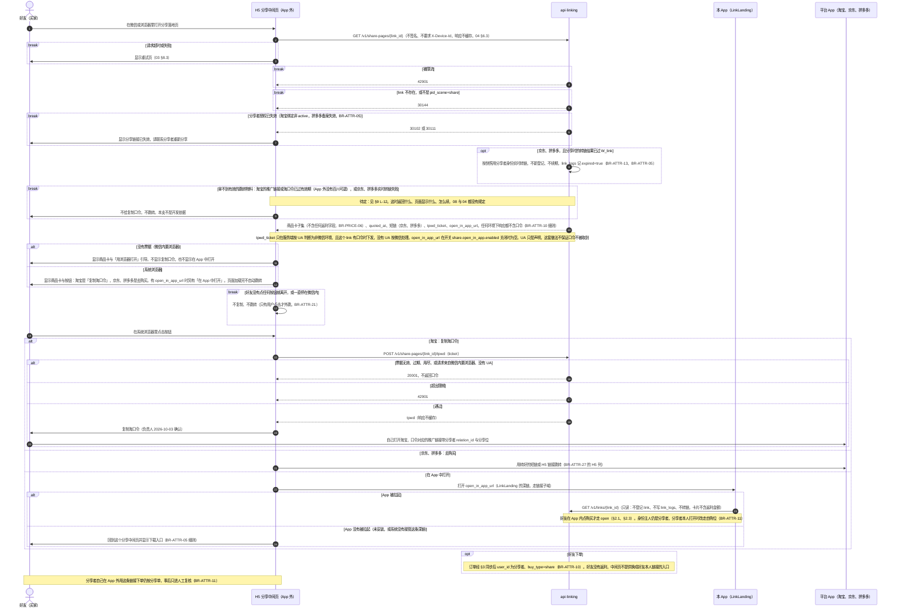
```mermaid
sequenceDiagram
  autonumber
  actor B as 好友（买家）
  participant H as H5 分享中间页（App 外）
  participant A as api·linking
  participant APP as 本 App（LinkLanding）
  participant PA as 平台 App（淘宝、京东、拼多多）

  B->>H: 在微信或浏览器里打开分享落地页
  H->>A: GET /v1/share-pages/{link_id}（不签名、不要求 X-Device-Id，响应不缓存，04 §6.3）
  break 请求超时或失败
    H->>B: 显示重试页（03 §8.3）
  end
  break 被限流
    A-->>H: 42901
  end
  break link 不存在，或不是 pid_scene=share
    A-->>H: 30144
  end
  break 分享者授权已失效（淘宝绑定非 active，拼多多备案失效，BR-ATTR-05）
    A-->>H: 30102 或 30111
    H->>B: 显示分享链接已失效，请联系分享者重新分享
  end
  opt 京东、拼多多，且分享时的转链结果已过 W_link
    A->>A: 按快照用分享者身份实时转链，不新登记、不续期，link_logs 记 expired=true（BR-ATTR-13、BR-ATTR-05）
  end
  break 拿不到有效的跳转物料：淘宝的推广链接或淘口令已过有效期（App 外没有百川可退），或京东、拼多多实时转链失败
    Note over H,A: 待定：见 §9 L-12。这时返回什么、页面显示什么、怎么续，08 与 04 都没有规定
    H->>B: 不给复制口令，不跳转。本支不是开发依据
  end
  A-->>H: 商品卡子集（不含任何返利字段，BR-PRICE-06）、quoted_at、短链（京东、拼多多）、tpwd_ticket、open_in_app_url。任何环境下响应都不含口令（BR-ATTR-10 细则）
  Note over H,A: tpwd_ticket 只在服务端按 UA 判断为非微信环境、且这个 link 有口令时下发，没有 UA 按微信处理。open_in_app_url 在开关 share.open_in_app.enabled 关闭时为空。UA 只是声明，这套做法不保证口令不被取到
  alt 没有票据（微信内置浏览器）
    H->>B: 显示商品卡与「用浏览器打开」引导。不显示复制口令，也不显示在 App 中打开
  else 系统浏览器
    H->>B: 显示商品卡与按钮：淘宝是「复制淘口令」，京东、拼多多是去购买。有 open_in_app_url 时另有「在 App 中打开」。页面加载完不自动跳转
  end
  break 好友没有点任何按钮就离开，或一直停在微信内
    H->>H: 不复制、不跳转（只有用户点击才外跳，BR-ATTR-21）
  end
  B->>H: 在系统浏览器里点击按钮
  alt 淘宝：复制淘口令
    H->>A: POST /v1/share-pages/{link_id}/tpwd（ticket）
    alt 票据无效、过期、用尽，或请求来自微信内置浏览器、没有 UA
      A-->>H: 20001，不返回口令
    else 超出限频
      A-->>H: 42901
    else 通过
      A-->>H: tpwd（响应不缓存）
      H->>B: 复制淘口令（负责人 2026-10-03 确认）
      B->>PA: 自己打开淘宝，口令对应的推广链接带分享者 relation_id 与分享位
    end
  else 京东、拼多多：去购买
    H->>PA: 用转好的短链或 H5 链接跳转（BR-ATTR-27 的 H5 列）
  else 在 App 中打开
    H->>APP: 打开 open_in_app_url（LinkLanding 的深链，走链接子域）
    alt App 被拉起
      APP->>A: GET /v1/links/{link_id}（只读：不登记 link、不写 link_logs、不转链，卡片不含返利金额）
      Note over APP,A: 好友在 App 内点购买才走 open（§2.1、§2.3）。身份主人仍是分享者，分享者本人打开时改走自购位（BR-ATTR-11）
    else App 没有被拉起（未安装，或系统没有接管这条深链）
      H->>B: 回到这个分享中间页并显示下载入口（BR-ATTR-05 细则）
    end
  end
  opt 好友下单
    Note over A: 订单经 §3 同步后 user_id 为分享者、buy_type=share（BR-ATTR-10）。好友没有返利，中间页不提供换成好友本人链接的入口
  end
  Note over B,H: 分享者自己在 App 外用这条链接下单仍按分享单，事后只进人工复核（BR-ATTR-11）
```

**覆盖的异常情况**

- [x] 接口超时、限流（重试页）
- [x] link 不存在或不是分享 link（30144）
- [x] 分享者授权失效（统一显示分享链接已失效）
- [x] 淘宝没有百川可用（只提供复制淘口令，不套用 SDK 路径）
- [x] 页面与首次响应不含口令；口令只在点「复制淘口令」时凭票据单独取。票据无效、过期、用尽，或请求来自微信内置浏览器、没有 UA（20001，不返回口令）；取口令超出限频（42901）
- [x] 在微信内置浏览器里打开：不显示复制口令与在 App 中打开，只引导用浏览器打开
- [x] 京东、拼多多的转链结果过了有效期（按快照用分享者身份实时转链，不续期、不新登记）
- [ ] 淘宝的推广链接或淘口令过期，或京东、拼多多实时转链失败：返回什么、怎么续上游未定（§9 L-12）。图上引到终止分支，不给复制、不跳转；只有拿到有效物料才进入后面的步骤
- [x] 只有好友点击按钮才复制口令或跳转；页面加载完不自动外跳，没点就离开不触发任何外跳（BR-ATTR-21）
- [x] 点「在 App 中打开」：App 被拉起后进 LinkLanding，只读取卡片，点购买才走 open，归属仍是分享者；没有被拉起就回到中间页显示下载入口
- [x] 分享者自己在 App 外下单（按分享单，人工复核）

**实现的 BR / AC**：BR-ATTR-05、BR-ATTR-10、BR-ATTR-11、BR-ATTR-13、BR-ATTR-21、BR-ATTR-27、BR-PRICE-06；变更记录 20261003 §6-1；功能对照 G-03（Q-03、Q-34 待负责人确认）；AC-S1-20、AC-S1-71；AC-SHARE-01、AC-SHARE-05、AC-SHARE-07（F-SHARE 同号）；AC-H5-03。

---

## 3. 订单同步与归因流水线

按 BR-ATTR-01 的顺序画（与 02 §5.2 的先后有出入，见 §9 S-01）。`platform_status` 唯一写者是 orders 的 order-sync；`rebate_status` 唯一写者是 settlement，由 order-sync 在同一事务内调用 settlement 命令迁移（BR-FUND-01）。同步、找回通过、后台改派共用同一把 `order_key` advisory 锁（02 §18）。§3.1 画一个同步窗口，§3.2 画窗口里一个子订单的事务。

### 3.1 同步窗口的调度与拉取

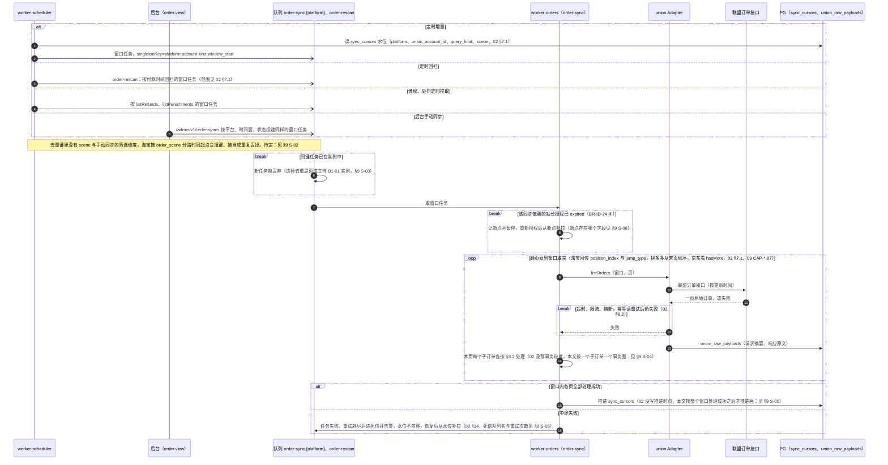
```mermaid
sequenceDiagram
  autonumber
  participant S as worker·scheduler
  participant ADM as 后台（order.view）
  participant Q as 队列 order-sync.{platform}、order-rescan
  participant W as worker·orders（order-sync）
  participant UA as union Adapter
  participant UP as 联盟订单接口
  participant DB as PG（sync_cursors、union_raw_payloads）

  alt 定时增量
    S->>DB: 读 sync_cursors 水位（platform、union_account_id、query_kind、scene，02 §7.1）
    S-)Q: 窗口任务，singletonKey=platform:account:kind:window_start
  else 定时回扫
    S-)Q: order-rescan：按付款时间回扫的窗口任务（范围见 02 §7.1）
  else 维权、处罚定时拉取
    S-)Q: 按 listRefunds、listPunishments 的窗口任务
  else 后台手动同步
    ADM-)Q: /admin/v1/order-syncs 按平台、时间窗、状态投递同样的窗口任务
  end
  Note over S,Q: 去重键里没有 scene 与手动同步的筛选维度，淘宝按 order_scene 分路时同起点会撞键、被当成重复丢掉。待定：见 §9 S-02
  break 同键任务已在队列中
    Q->>Q: 新任务被丢弃（这种去重是否成立待 B1-01 实测，§9 S-03）
  end
  Q->>W: 取窗口任务
  break 该同步依赖的站长授权已 expired（BR-ID-24 ④）
    W->>W: 记断点并暂停，重新授权后从断点补拉（断点存在哪个字段见 §9 S-06）
  end
  loop 翻页直到窗口取完（淘宝回传 position_index 与 jump_type，拼多多从末页倒序，京东看 hasMore，02 §7.1、09 CAP-*-07）
    W->>UA: listOrders（窗口、页）
    UA->>UP: 联盟订单接口（按更新时间）
    UP-->>UA: 一页原始订单，或失败
    break 超时、限流、熔断，幂等读重试后仍失败（02 §6.2）
      UA-->>W: 失败
    end
    UA->>DB: union_raw_payloads（请求摘要、响应原文）
    W->>W: 本页每个子订单各按 §3.2 处理（02 没写事务粒度，本文按一个子订单一个事务画：见 §9 S-04）
  end
  alt 窗口内各页全部处理成功
    W->>DB: 推进 sync_cursors（02 没写推进时点，本文按整个窗口处理成功之后才推进画：见 §9 S-05）
  else 中途失败
    W->>Q: 任务失败。重试耗尽后进死信并告警，水位不前移，恢复后从水位补拉（02 §14。死信队列名与重试次数见 §9 S-05）
  end
```

**覆盖的异常情况**

- [x] 窗口任务重复投递（去重键，含撞键风险）
- [x] 站长授权失效期间依赖授权的同步记断点、恢复后补拉
- [x] 联盟超时、限流、熔断（只重试幂等读；仍失败则水位不前移、进死信）
- [x] 翻页中途失败后不推进水位
- [x] 晚到与漏单（回扫窗口与幂等写入兜底，§3.2）
- [ ] 京东窗口内行数超限等外部资料提到的情形：02 未定义（§9 S-12），图上没有画

**实现的 BR / AC**：BR-ATTR-01、BR-ID-24；02 §6.2、§7.1、§11、§14；AC-S1-24、AC-S1-25、AC-S1-65；AC-ORD-05（F-ORD-05 同号）。

### 3.2 单个子订单的处理事务

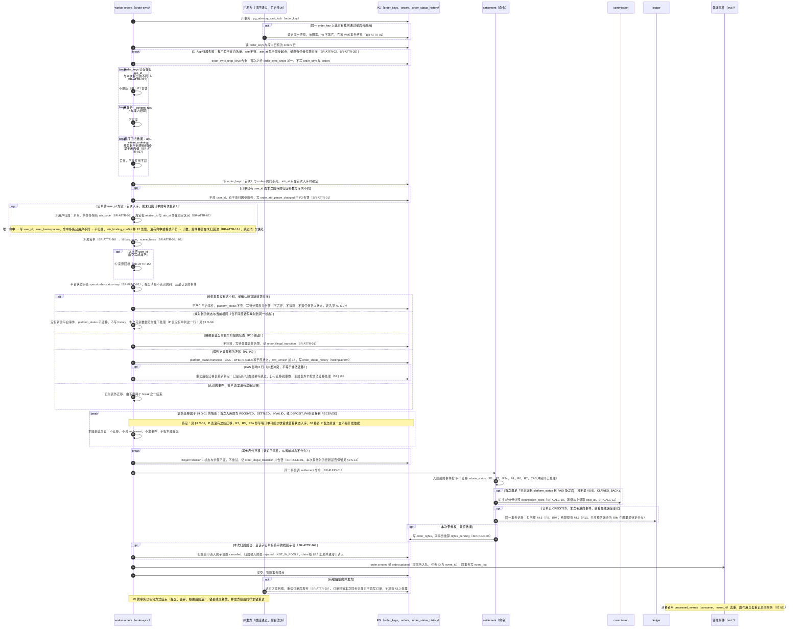
```mermaid
sequenceDiagram
  autonumber
  participant W as worker·orders（order-sync）
  participant C2 as 并发方（找回通过、后台改派）
  participant DB as PG（order_keys、orders、order_status_history）
  participant T as settlement（命令）
  participant M as commission
  participant L as ledger
  participant EV as 领域事件（evt.*）

  W->>DB: 开事务，pg_advisory_xact_lock（order_key）
  opt 同一 order_key 上此时有找回通过或后台改派
    C2->>DB: 请求同一把锁，被阻塞。W 不等它，它等 W 的事务结束（BR-ATTR-01）
  end
  W->>DB: 读 order_keys 与库内已有的 orders 行
  break ① App 归属失败：推广位不在白名单、site 不符、attr_at 早于同步起点，或没有任何付款时间（BR-ATTR-02、BR-ATTR-25）
    W->>DB: order_sync_drop_keys 去重，首次才给 order_sync_drops 加一。不写 order_keys 与 orders
  end
  break order_keys 已存在但 app_id 与本次算出的不同（BR-ATTR-22）
    W->>W: 不更新订单，P1 告警
  end
  break 重复行：content_hash 与库内相同
    W->>W: 不写库
  end
  break 乱序的旧数据：attr.mtime_ordering 开启且平台更新时间早于库内值（BR-ATTR-01）
    W->>W: 丢弃，不改任何字段
  end
  W->>DB: 写 order_keys（首次）与 orders 的同步列。attr_at 只在首次入库时确定
  opt 订单已有 user_id 而本次回传的归因参数与库内不同
    W->>DB: 不改 user_id，也不改归因参数列，写 order_attr_param_changed 并 P2 告警（BR-ATTR-01）
  end
  opt 订单的 user_id 为空（首次入库，或未归因订单的每次更新）
    W->>W: ② 用户归属：京东、拼多多解析 attr_code（BR-ATTR-06），淘宝按 relation_id 与 attr_at 落在绑定区间（BR-ATTR-07）
    Note over W: 唯一命中 → 写 user_id、user_basis=param。命中多条且用户不同 → 不归属，attr_binding_conflict 并 P1 告警。没有命中或格式不符 → 计数。后两种留在未归因池（BR-ATTR-16），跳过 ⑤ 与快照
  end
  W->>W: ③ 黑名单（BR-ATTR-26）→ ④ buy_type、scene_basis（BR-ATTR-08、09）
  opt 本次把 user_id 由空写成非空
    W->>W: ⑤ 来源回填（BR-ATTR-15）
  end
  W->>W: 平台状态码查 specs/order-status-map（BR-FUND-02），先分清是不认识的码，还是认识的事件
  alt 映射表里没有这个码，或确认收货缺收货时间
    W->>DB: 不产生平台事件，platform_status 不变，写待处理表并告警（不丢弃、不猜测，不落任何正向状态。表名见 §9 S-07）
  else 映射到的状态与当前相同（含不同原始码映射到同一状态）
    W->>W: 没有新的平台事件，platform_status 不迁移，不写 history，本次其余数据照常往下处理（P 表没有单列这一行：见 §9 O-04）
  else 映射到比当前更早阶段的状态（P10 倒退）
    W->>DB: 不迁移，写待处理表并告警，记 order_illegal_transition（BR-ATTR-01）
  else 得到 P 表里有的迁移（P1–P9）
    W->>DB: platform_status transition（CAS：WHERE status 等于原状态，row_version 加 1），写 order_status_history（field=platform）
    opt CAS 影响 0 行（并发冲突，不等于非法迁移）
      W->>DB: 重读后按迁移表重新判定：已是目标状态就幂等跳过，仍可迁移就重做，变成表外才按非法迁移处理（02 §18）
    end
  else 认识的事件，但 P 表里没有这条迁移
    W->>W: 记为表外迁移，由下面两个 break 之一结束
  end
  break 表外迁移属于 §9 O-01 的情形：首次入库即为 RECEIVED、SETTLED、INVALID，或 DEPOSIT_PAID 直接到 RECEIVED
    Note over W,DB: 待定：见 §9 O-01。P 表没有这些迁移，R2、R3、R3a 却写明订单可能以收货或结算状态入库。08 补齐 P 表之前这一支不是开发依据
    W->>W: 本图到此为止：不迁移、不调 settlement、不发事件，不按本图提交
  end
  break 其他表外迁移（认识的事件，从当前状态不允许）
    W->>DB: IllegalTransition：状态与余额不变，不重试，记 order_illegal_transition 并告警（BR-FUND-01。本次其他列的更新是否保留见 §9 S-13）
  end
  W->>T: 同一事务调 settlement 命令（BR-FUND-01）
  T->>T: 入账前的事件按 §4.1 迁移 rebate_status（R1、R2、R3a、R4、R6、R7，CAS 冲突同上处理）
  opt 首次满足「已归因且 platform_status 到 PAID 及之后，且不是 VOID、CLAWED_BACK」
    T->>M: ⑥ 生成分佣快照 commission_splits（BR-CALC-10，等级与上级取 paid_at，BR-CALC-12）
  end
  opt 订单已 CREDITED，本次带逆向事件、结算额或佣金变化
    T->>L: 同一事务记账：扣回按 §4.5（R8、R9），结算额按 §4.6（R10。只改预估佣金的 R9b 在那里是待定分支）
  end
  opt 本次带维权、处罚数据
    T->>DB: 写 order_rights，同事务重算 rights_pending（BR-FUND-06）
  end
  opt 本次归属成功，且该子订单有待审的找回子项（BR-ATTR-16）
    W->>DB: 归属给申请人的子项置 cancelled，归属他人的置 rejected（NOT_IN_POOL），claim 按 §3.3 汇总并通知申请人
  end
  W-)EV: order.created 或 order.updated（同事务入队，任务 ID 为 event_id），同事务写 event_log
  W->>DB: 提交，锁随事务释放
  opt 有被阻塞的并发方
    C2->>DB: 这时才拿到锁，重读订单后再判（BR-ATTR-20）。订单已被本次同步归属时不再写订单，子项按 §3.3 处理
  end
  Note over W,C2: W 的事务以任何方式结束（提交、丢弃、拒绝后回滚），锁都随之释放，并发方随后同样拿锁重读
  Note over EV: 消费者用 processed_events（consumer、event_id）去重，副作用与去重记录同事务（02 §11）
```

BR-ATTR-01 把 ⑥ 快照写在 ⑦ 状态迁移之前，但快照条件用的是迁移后的 `platform_status`；本图按 02 §5.2 把迁移画在前，二者都在同一事务内（§9 S-01）。

**覆盖的异常情况**

- [x] 推广位不属本 App、site 不符、早于同步起点、缺付款时间：丢弃计数，不入库，也不再往下执行
- [x] 两个 App 抢同一子订单（`order_keys` 的 app_id 冲突，不更新并告警）
- [x] 重复行（`content_hash` 未变即结束）、乱序旧数据（先判定、后写库，库内字段不被旧数据覆盖）
- [x] 已归属订单的归因参数保护（不改 user_id 与参数，只告警）
- [x] 用户参数缺失、格式不符、命中多个用户（未归因池，可找回）
- [x] 先分清「不认识的码」与「认识的事件」：映射表外的状态码、缺收货时间进待处理表并告警，不会被当成非法迁移吞掉；状态倒退（P10）不迁移、进待处理表
- [x] 状态码映射后与当前状态相同，而金额、数量或维权数据有更新：不迁移，其余数据照常处理
- [x] CAS 冲突（重读后重新判定）与表外迁移（IllegalTransition，不重试，本子订单的处理到此结束）分开处理
- [ ] 入库首态为 RECEIVED、SETTLED、INVALID 与跳级迁移：08 未定义（§9 O-01）。图上引到不执行的终止分支：不迁移、不调 settlement、不发事件、不提交，不再接着往下走
- [x] 同一订单上同步、找回、改派并发：并发方只请求同一把锁并阻塞，等同步事务结束后才拿锁重读；同步事务不等并发方，不会互相等待
- [x] 同步先一步归因时自动处理待审找回子项
- [x] 事件重复投递（`processed_events` 去重）

**实现的 BR / AC**：BR-ATTR-01、02、06、07、08、09、15、16、20、22、25、26；BR-FUND-01、02、06；BR-CALC-10、12；AC-S1-20、21、22、23、24、27、28-TB、28-JD、28-PDD、48-TB、50-TB、51-TB；AC-S2-10-TB、AC-S2-31；AC-ORD-01 至 AC-ORD-06。

### 3.3 找回 `claim_status`

未归因池里的订单可由用户找回（`POST /v1/orders/claims`，H5 经桥代签，§8）。证据按子项计算，审核以子订单为单位；claim 的整体状态只在**全部子项已决**后汇总（BR-ATTR-18）。

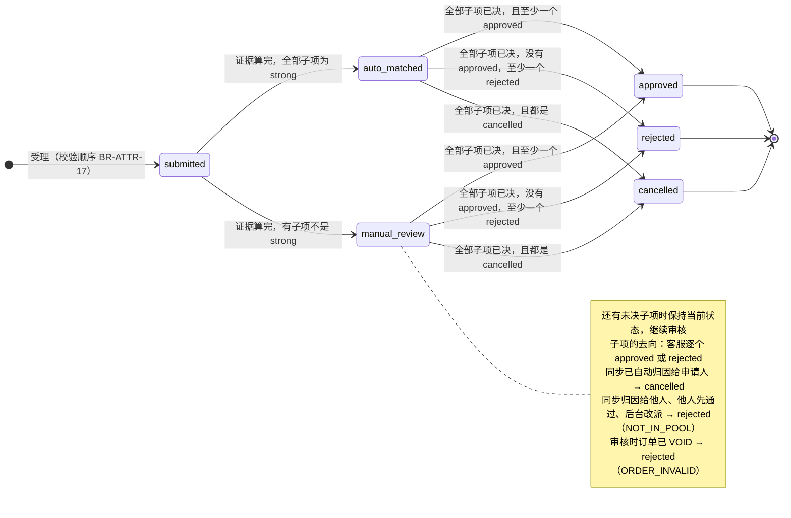
```mermaid
stateDiagram-v2
  direction LR
  [*] --> submitted: 受理（校验顺序 BR-ATTR-17）
  submitted --> auto_matched: 证据算完，全部子项为 strong
  submitted --> manual_review: 证据算完，有子项不是 strong
  auto_matched --> approved: 全部子项已决，且至少一个 approved
  manual_review --> approved: 全部子项已决，且至少一个 approved
  auto_matched --> rejected: 全部子项已决，没有 approved，至少一个 rejected
  manual_review --> rejected: 全部子项已决，没有 approved，至少一个 rejected
  auto_matched --> cancelled: 全部子项已决，且都是 cancelled
  manual_review --> cancelled: 全部子项已决，且都是 cancelled
  approved --> [*]
  rejected --> [*]
  cancelled --> [*]
  note right of manual_review
    还有未决子项时保持当前状态，继续审核
    子项的去向：客服逐个 approved 或 rejected
    同步已自动归因给申请人 → cancelled
    同步归因给他人、他人先通过、后台改派 → rejected（NOT_IN_POOL）
    审核时订单已 VOID → rejected（ORDER_INVALID）
  end note
```

**覆盖的异常情况**

- [x] 提交时的开关、风控、次数、匹配、窗口、重复、已归属校验（30206、30203、30201、30202、30205、30204，BR-ATTR-17）
- [x] 一个 claim 多个子订单：一个子项先决不会提前关闭整个 claim
- [x] 同一子订单多人申请：先通过者胜，其余系统驳回 `NOT_IN_POOL`（BR-ATTR-20）
- [x] 同步先一步归因：子项自动 `cancelled` 或 `rejected`（BR-ATTR-16）
- [x] 通过时在 `order_key` 锁内重读，订单已被归属则不写订单（BR-ATTR-20）

**实现的 BR / AC**：BR-ATTR-16、17、18、20；AC-S1-26-TB、AC-S1-26-JD、AC-S1-26-PDD、AC-S1-43；AC-ORD-09。

---

## 4. 佣金：预估 → 月结 → 入账 → 扣回，与余额

资金流向（02 §17）：settlement 只产出记账指令；ledger 是唯一改余额处；金额只由 `packages/domain` 计算。订单相关的余额与分录只能在该子订单 `rebate_status` 迁移（含自迁移）的同一事务内变更，不依赖领域事件（BR-FUND-01）。分录模板、uniq_key 格式与金额口径只在 08（BR-FUND-05、BR-FUND-08、BR-FUND-09）与 `specs/ledger-rules.md` 维护。

「联盟结算」与「用户入账」是两个节点：平台状态到 SETTLED 不等于入账，入账要等月结账单校验通过、人工确认后的批次执行（§4.2–§4.4）。业务扣回（CLAWBACK，§4.5）与纠错红冲（uniq_key 加 `:REVERSE`，BR-FUND-16）是两回事，后者只用于改派（R14）与调账更正。

### 4.1 预估与入账前的变化

预估阶段不写任何分录、不动 `account_balances`（BR-FUND-03）。下图是 settlement 命令对一个尚未入账的子订单处理一次事件，事务由调用方持有（订单同步见 §3.2）。

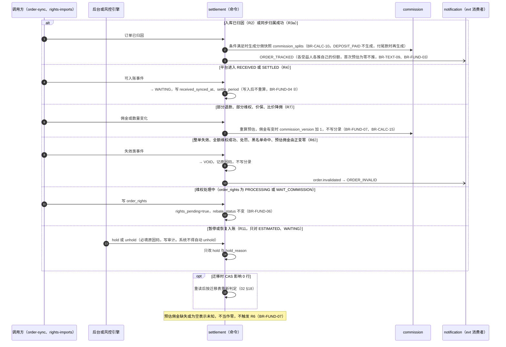
```mermaid
sequenceDiagram
  autonumber
  participant W as 调用方（order-sync、rights-imports）
  participant ADM as 后台或风控引擎
  participant T as settlement（命令）
  participant M as commission
  participant N as notification（evt 消费者）

  alt 入库已归因（R2）或同步归属成功（R3a）
    W->>T: 订单已归因
    T->>M: 条件满足时生成分佣快照 commission_splits（BR-CALC-10。DEPOSIT_PAID 不生成，付尾款时再生成）
    T-)N: ORDER_TRACKED（各受益人各推自己的份额，首次预估为零不推，BR-TEXT-09、BR-FUND-03）
  else 平台进入 RECEIVED 或 SETTLED（R4）
    W->>T: 可入账事件
    T->>T: → WAITING，写 received_synced_at、settle_period（写入后不重算，BR-FUND-04 ②）
  else 部分退款、部分维权、价保、比价降佣（R7）
    W->>T: 佣金或数量变化
    T->>M: 重算预估，佣金有变时 commission_version 加 1，不写分录（BR-FUND-07、BR-CALC-15）
  else 整单失效、全额维权成功、处罚、黑名单命中、预估佣金由正变零（R6）
    W->>T: 失效类事件
    T->>T: → VOID，记原因码，不写分录
    T-)N: order.invalidated → ORDER_INVALID
  else 维权处理中（order_rights 为 PROCESSING 或 WAIT_COMMISSION）
    W->>T: 写 order_rights
    T->>T: rights_pending=true，rebate_status 不变（BR-FUND-06）
  else 暂停或恢复入账（R11，只对 ESTIMATED、WAITING）
    ADM->>T: hold 或 unhold（必填原因码，写审计。系统不得自动 unhold）
    T->>T: 只改 hold 与 hold_reason
  end
  opt 迁移时 CAS 影响 0 行
    T->>T: 重读后按迁移表重新判定（02 §18）
  end
  Note over T: 预估佣金缺失或为空表示未知，不当作零，不触发 R6（BR-FUND-07）
```

**覆盖的异常情况**

- [x] 付定金阶段不生成快照、不计预估
- [x] 入账前部分退款、佣金变化（R7 只重算）；整单失效、处罚、黑名单、佣金归零（R6 作废，无分录）
- [x] 联盟回传的佣金字段缺失（不覆盖、不当作零）
- [x] 售后处理中与人工、风控暂停（只置标志位，不改状态）
- [x] CAS 冲突（重读后重新判定）

**实现的 BR / AC**：BR-FUND-01、03、04 ②、06、07；BR-CALC-10、12、15；BR-TEXT-09；AC-S1-24、AC-S2-03、AC-S2-04、AC-S2-05、AC-S2-12-TB。

### 4.2 月结账单生成与校验

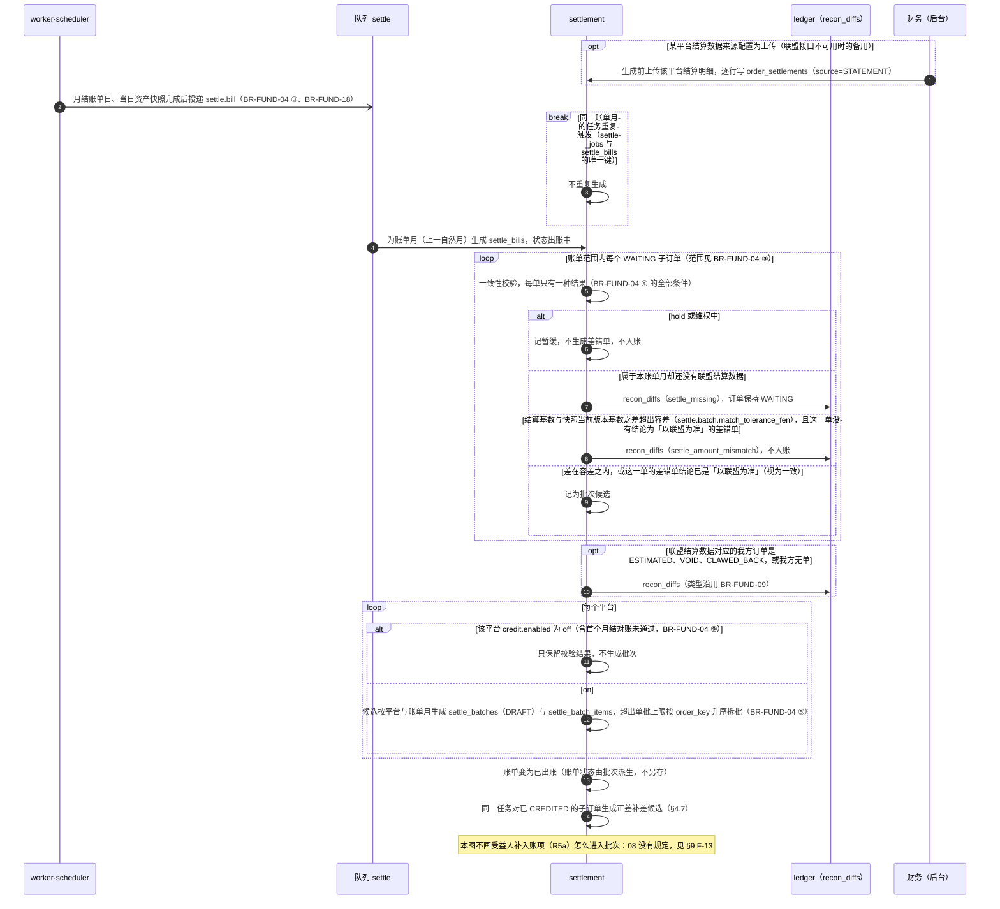
```mermaid
sequenceDiagram
  autonumber
  participant S as worker·scheduler
  participant J as 队列 settle
  participant T as settlement
  participant L as ledger（recon_diffs）
  participant F as 财务（后台）

  opt 某平台结算数据来源配置为上传（联盟接口不可用时的备用）
    F->>T: 生成前上传该平台结算明细，逐行写 order_settlements（source=STATEMENT）
  end
  S-)J: 月结账单日、当日资产快照完成后投递 settle.bill（BR-FUND-04 ③、BR-FUND-18）
  break 同一账单月的任务重复触发（settle_jobs 与 settle_bills 的唯一键）
    T->>T: 不重复生成
  end
  J->>T: 为账单月（上一自然月）生成 settle_bills，状态出账中
  loop 账单范围内每个 WAITING 子订单（范围见 BR-FUND-04 ③）
    T->>T: 一致性校验，每单只有一种结果（BR-FUND-04 ④ 的全部条件）
    alt hold 或维权中
      T->>T: 记暂缓，不生成差错单，不入账
    else 属于本账单月却还没有联盟结算数据
      T->>L: recon_diffs（settle_missing），订单保持 WAITING
    else 结算基数与快照当前版本基数之差超出容差（settle.batch.match_tolerance_fen），且这一单没有结论为「以联盟为准」的差错单
      T->>L: recon_diffs（settle_amount_mismatch），不入账
    else 差在容差之内，或这一单的差错单结论已是「以联盟为准」（视为一致）
      T->>T: 记为批次候选
    end
  end
  opt 联盟结算数据对应的我方订单是 ESTIMATED、VOID、CLAWED_BACK，或我方无单
    T->>L: recon_diffs（类型沿用 BR-FUND-09）
  end
  loop 每个平台
    alt 该平台 credit.enabled 为 off（含首个月结对账未通过，BR-FUND-04 ⑨）
      T->>T: 只保留校验结果，不生成批次
    else on
      T->>T: 候选按平台与账单月生成 settle_batches（DRAFT）与 settle_batch_items，超出单批上限按 order_key 升序拆批（BR-FUND-04 ⑤）
    end
  end
  T->>T: 账单变为已出账（账单状态由批次派生，不另存）
  T->>T: 同一任务对已 CREDITED 的子订单生成正差补差候选（§4.7）
  Note over T: 本图不画受益人补入账项（R5a）怎么进入批次：08 没有规定，见 §9 F-13
```

**覆盖的异常情况**

- [x] 任务重复触发（唯一键，不重复生成）
- [x] 金额差超出容差、应结未结、结算数据对不上我方订单（差错单，不入账）；差在容差之内视为一致
- [x] 差错单处理结论为「以联盟为准」的订单：之后的补充校验视为一致，进入补充批次，不会重复卡回同一张差错单（BR-FUND-04 ④⑧）
- [x] hold 或维权中（暂缓，不生成差错单）
- [x] 平台入账开关关闭或首个月结对账未通过（只保留校验结果，不生成批次）
- [x] 联盟接口不可用（上传结算明细备用）

**实现的 BR / AC**：BR-FUND-04 ③④⑤⑨、BR-FUND-06、BR-FUND-09、BR-FUND-18、BR-CALC-03；拍板第二批 FUND-01、FUND-07；AC-S2-01-TB、AC-S2-01-JD、AC-S2-01-PDD、AC-S2-03、AC-S2-51。

### 4.3 账单确认与批次执行

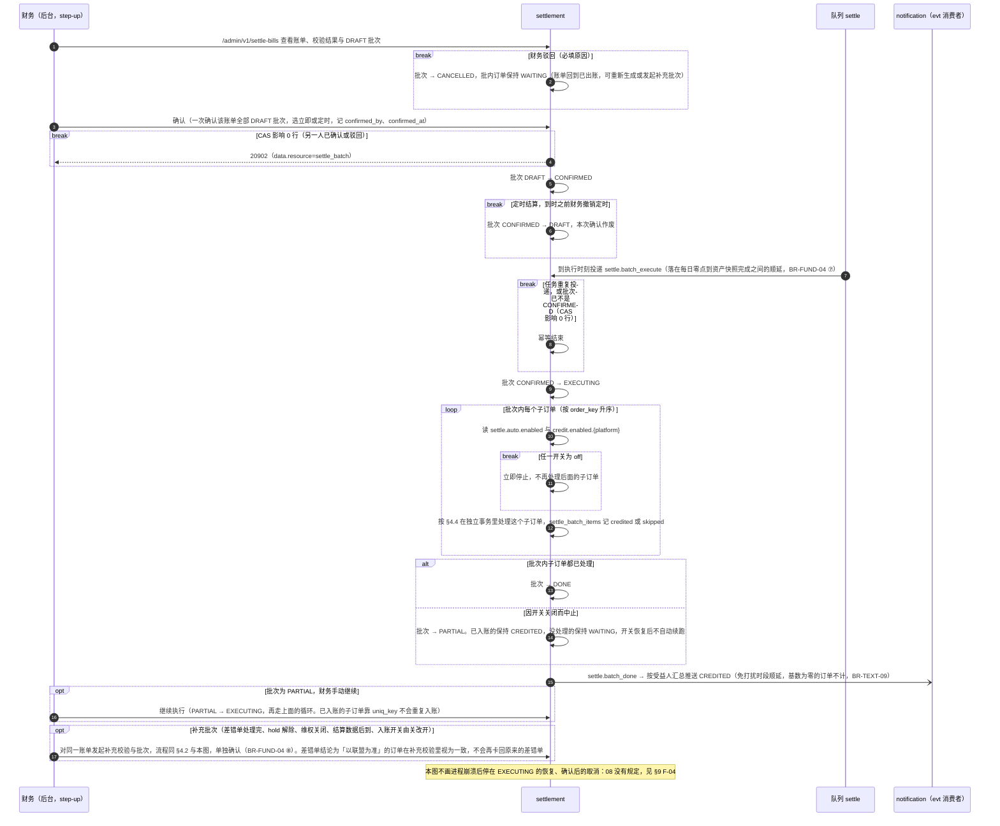
```mermaid
sequenceDiagram
  autonumber
  participant F as 财务（后台，step-up）
  participant T as settlement
  participant J as 队列 settle
  participant N as notification（evt 消费者）

  F->>T: /admin/v1/settle-bills 查看账单、校验结果与 DRAFT 批次
  break 财务驳回（必填原因）
    T->>T: 批次 → CANCELLED，批内订单保持 WAITING（账单回到已出账，可重新生成或发起补充批次）
  end
  F->>T: 确认（一次确认该账单全部 DRAFT 批次，选立即或定时，记 confirmed_by、confirmed_at）
  break CAS 影响 0 行（另一人已确认或驳回）
    T-->>F: 20902（data.resource=settle_batch）
  end
  T->>T: 批次 DRAFT → CONFIRMED
  break 定时结算，到时之前财务撤销定时
    T->>T: 批次 CONFIRMED → DRAFT，本次确认作废
  end
  J->>T: 到执行时刻投递 settle.batch_execute（落在每日零点到资产快照完成之间的顺延，BR-FUND-04 ⑦）
  break 任务重复投递，或批次已不是 CONFIRMED（CAS 影响 0 行）
    T->>T: 幂等结束
  end
  T->>T: 批次 CONFIRMED → EXECUTING
  loop 批次内每个子订单（按 order_key 升序）
    T->>T: 读 settle.auto.enabled 与 credit.enabled.{platform}
    break 任一开关为 off
      T->>T: 立即停止，不再处理后面的子订单
    end
    T->>T: 按 §4.4 在独立事务里处理这个子订单，settle_batch_items 记 credited 或 skipped
  end
  alt 批次内子订单都已处理
    T->>T: 批次 → DONE
  else 因开关关闭而中止
    T->>T: 批次 → PARTIAL。已入账的保持 CREDITED，没处理的保持 WAITING，开关恢复后不自动续跑
  end
  T-)N: settle.batch_done → 按受益人汇总推送 CREDITED（免打扰时段顺延，基数为零的订单不计，BR-TEXT-09）
  opt 批次为 PARTIAL，财务手动继续
    F->>T: 继续执行（PARTIAL → EXECUTING，再走上面的循环。已入账的子订单靠 uniq_key 不会重复入账）
  end
  opt 补充批次（差错单处理完、hold 解除、维权关闭、结算数据后到、入账开关由关改开）
    F->>T: 对同一账单发起补充校验与批次，流程同 §4.2 与本图，单独确认（BR-FUND-04 ⑧）。差错单结论为「以联盟为准」的订单在补充校验里视为一致，不会再卡回原来的差错单
  end
  Note over T: 本图不画进程崩溃后停在 EXECUTING 的恢复、确认后的取消：08 没有规定，见 §9 F-04
```

**覆盖的异常情况**

- [x] 财务驳回（批次作废，订单保持 WAITING，不执行）
- [x] 两人同时操作同一批次（CAS，后到者 20902）
- [x] 定时结算在执行前撤销（回到 DRAFT，不执行）
- [x] 执行任务重复投递（CAS 幂等结束）
- [x] 执行中关闭开关（退出循环，批次 PARTIAL，人工继续）
- [x] 批次重放、续跑（uniq_key 保证只入账一次，§4.4）
- [x] 补充批次（差错单结论为「以联盟为准」的订单在补充校验里视为一致，不会再卡回原差错单）

**实现的 BR / AC**：BR-FUND-04 ⑥⑦⑧、BR-FUND-20、BR-TEXT-09；拍板第二批 FUND-01、§8 ADD-05；AC-S2-01-TB、AC-S2-51、AC-S2-52；测试 ID `SM-SB-<n>`。

### 4.4 单个子订单的入账事务（R5、R5a）

批次里有两类项：首次入账（订单为 WAITING，R5）与受益人补入账（订单已 CREDITED、该受益人的暂缓已解除，R5a）。两类项先过同一组订单级执行校验（BR-FUND-04 ⑦：没有 hold、不在售后中、结算记录没有变），再各自检查订单状态。**先加锁，在锁内重读受益人状态，再写互斥的凭证**：先锁各受益人的 users 行、再锁余额行（BR-WDR-07），拿到锁之后才读受益人状态并决定入账方式，状态检查与凭证写入在同一个事务里，注销、冻结、封禁与入账并发时不会按旧状态入账。

两种组合待 08 资金规则对齐，本图不执行，不是开发依据：① 有受益人处于冻结或账户申诉中、其份额需要暂缓，以及由此而来的补入账（R5a）；② 分佣快照里的平台预留比例不为零。两者都会让 BR-FUND-19 ⑤ 的日终等式不成立（§9 F-13、F-14）。其余情形（预留比例为零，受益人都不需要暂缓）照图实现。

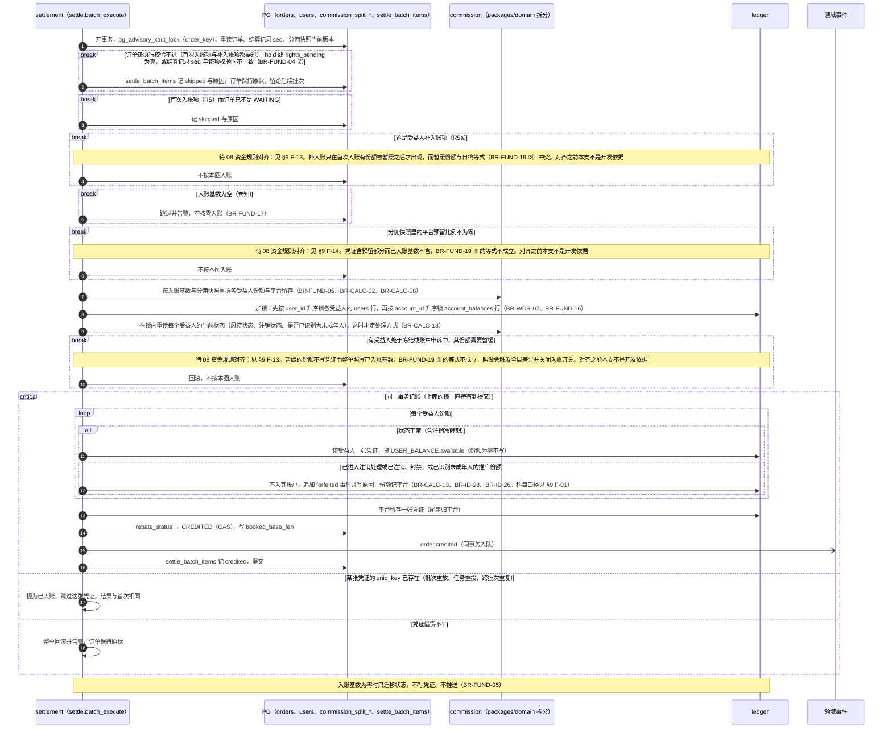
```mermaid
sequenceDiagram
  autonumber
  participant T as settlement（settle.batch_execute）
  participant DB as PG（orders、users、commission_split_*、settle_batch_items）
  participant M as commission（packages/domain 拆分）
  participant L as ledger
  participant EV as 领域事件

  T->>DB: 开事务，pg_advisory_xact_lock（order_key），重读订单、结算记录 seq、分佣快照当前版本
  break 订单级执行校验不过（首次入账项与补入账项都要过）：hold 或 rights_pending 为真，或结算记录 seq 与该项校验时不一致（BR-FUND-04 ⑦）
    T->>DB: settle_batch_items 记 skipped 与原因，订单保持原状，留给后续批次
  end
  break 首次入账项（R5）而订单已不是 WAITING
    T->>DB: 记 skipped 与原因
  end
  break 这是受益人补入账项（R5a）
    Note over T,L: 待 08 资金规则对齐：见 §9 F-13。补入账只在首次入账有份额被暂缓之后才出现，而暂缓份额与日终等式（BR-FUND-19 ⑤）冲突。对齐之前本支不是开发依据
    T->>DB: 不按本图入账
  end
  break 入账基数为空（未知）
    T->>DB: 跳过并告警，不按零入账（BR-FUND-17）
  end
  break 分佣快照里的平台预留比例不为零
    Note over T,L: 待 08 资金规则对齐：见 §9 F-14。凭证含预留部分而已入账基数不含，BR-FUND-19 ⑤ 的等式不成立。对齐之前本支不是开发依据
    T->>DB: 不按本图入账
  end
  T->>M: 按入账基数与分佣快照重拆各受益人份额与平台留存（BR-FUND-05、BR-CALC-02、BR-CALC-08）
  T->>L: 加锁：先按 user_id 升序锁各受益人的 users 行，再按 account_id 升序锁 account_balances 行（BR-WDR-07、BR-FUND-16）
  T->>M: 在锁内重读每个受益人的当前状态（风控状态、注销状态、是否已识别为未成年人），这时才定处理方式（BR-CALC-13）
  break 有受益人处于冻结或账户申诉中，其份额需要暂缓
    Note over T,L: 待 08 资金规则对齐：见 §9 F-13。暂缓的份额不写凭证而整单照写已入账基数，BR-FUND-19 ⑤ 的等式不成立，照做会触发全局差异并关闭入账开关。对齐之前本支不是开发依据
    T->>DB: 回滚，不按本图入账
  end
  critical 同一事务记账（上面的锁一直持有到提交）
    loop 每个受益人份额
      alt 状态正常（含注销冷静期）
        T->>L: 该受益人一张凭证，贷 USER_BALANCE.available（份额为零不写）
      else 已进入注销处理或已注销、封禁，或已识别未成年人的推广份额
        T->>L: 不入其账户，追加 forfeited 事件并写原因，份额记平台（BR-CALC-13、BR-ID-28、BR-ID-26。科目口径见 §9 F-01）
      end
    end
    T->>L: 平台留存一张凭证（尾差归平台）
    T->>DB: rebate_status → CREDITED（CAS），写 booked_base_fen
    T-)EV: order.credited（同事务入队）
    T->>DB: settle_batch_items 记 credited，提交
  option 某张凭证的 uniq_key 已存在（批次重放、任务重投、跨批次重复）
    T->>T: 视为已入账，跳过这张凭证，结果与首次相同
  option 凭证借贷不平
    T->>T: 整单回滚并告警，订单保持原状
  end
  Note over T,L: 入账基数为零时只迁移状态，不写凭证、不推送（BR-FUND-05）
```

**覆盖的异常情况**

- [x] 执行时订单被暂停、进入售后、结算额又有更新（首次入账与补入账都跳过，不入账）；首次入账项的订单已不是 WAITING（跳过）
- [x] 入账基数未知（跳过并告警）
- [x] 受益人状态与入账并发变化：先锁 users 行、再锁余额行，在锁内重读状态后才决定入账方式；注销处理先拿到锁时，入账重读到的是新状态，不会给已进入注销处理的账户入账
- [x] 多个受益人：按 user_id 升序锁 users 行，再按 account_id 升序锁余额行，与提现「先 users、后余额」的顺序一致，不会互相死锁
- [x] 受益人已进入注销处理（processing）或已注销、封禁、已识别未成年人的推广份额（份额记平台，不入其账户）
- [x] 批次重放、任务重投（uniq_key 只入账一次）
- [x] 凭证不平（整单回滚）
- [ ] 有受益人处于冻结或账户申诉中（份额暂缓）：待 08 资金规则对齐（§9 F-13），图上是不执行的终止分支
- [ ] 受益人补入账（R5a）：同上，订单级执行校验之后即终止；怎么进批次、明细怎么记、金额怎么取、是否发事件也都没有规定（§9 F-13）
- [ ] 分佣快照里的平台预留比例不为零：待 08 资金规则对齐（§9 F-14），图上是不执行的终止分支

**实现的 BR / AC**：BR-FUND-01 R5（R5a 待 08 对齐）；BR-FUND-04 ⑦；BR-FUND-05；BR-FUND-16；BR-FUND-17；BR-WDR-07；BR-CALC-02、08、13；BR-ID-26、BR-ID-28；AC-S2-01-TB、AC-S2-03、AC-S2-34、AC-S2-35、AC-S2-39、AC-S2-45、AC-S2-46、AC-S2-52、AC-S2-57。

### 4.5 入账后扣回（R8；R9 待 08 资金规则对齐）

CREDITED 的子订单收到逆向事件时，扣回凭证与状态迁移在触发方的同一事务内完成（订单同步 §3.2、维权导入、后台复核确认）。本图现在只执行整单扣回（R8）：整单失效、全额维权成功、处罚、结算后失效、黑名单复核确认，新基数按规则就是零，不依赖任何佣金字段。加锁顺序是先 users 行、再余额行，受益人状态在锁内重读后才决定扣回记到哪里（BR-WDR-07、BR-CALC-09）。

两类情形待 08 资金规则对齐，本图不执行，不是开发依据：① 部分退款、部分维权（R9）——新基数要由联盟回传的佣金字段或应扣佣金得出，BR-FUND-08 正文把联盟佣金直接当分佣基数，与 BR-CALC-02 的换算不一致，取预估还是结算字段也不一致（§9 F-14、F-15）；② 没有任何逆向事件、只是预估佣金降到零（§9 F-15）。

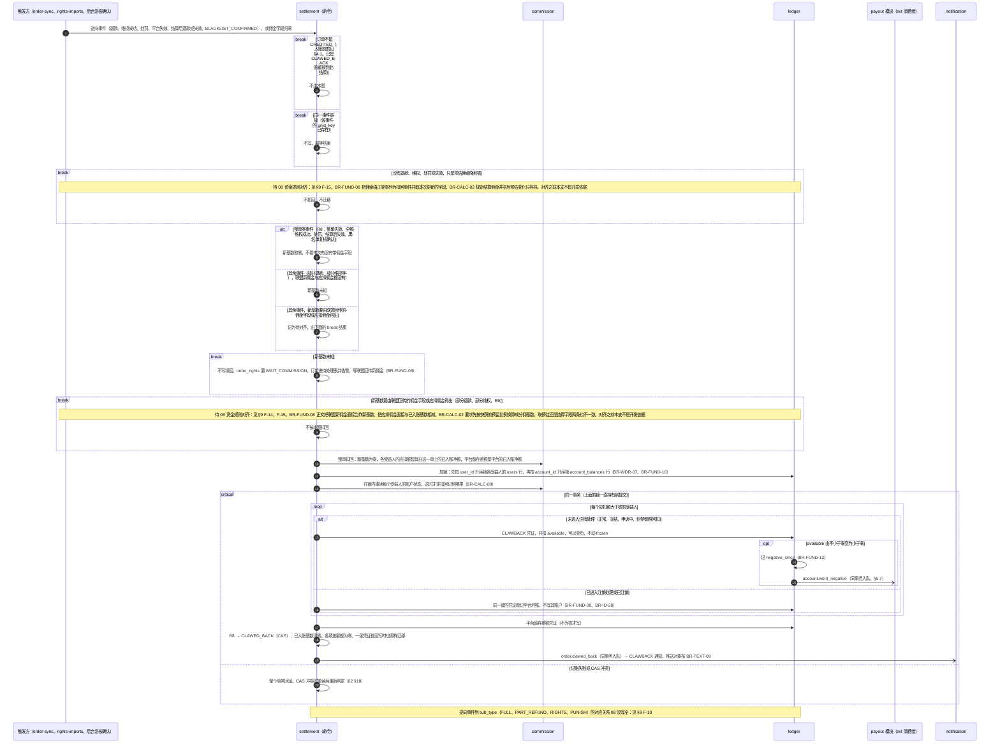
```mermaid
sequenceDiagram
  autonumber
  participant X as 触发方（order-sync、rights-imports、后台复核确认）
  participant T as settlement（命令）
  participant M as commission
  participant L as ledger
  participant P as payout 模块（evt 消费者）
  participant N as notification

  X->>T: 逆向事件（退款、维权成功、处罚、平台失效、结算后退款或失效、BLACKLIST_CONFIRMED），或佣金字段归零
  break 订单不是 CREDITED（入账前的见 §4.1。已是 CLAWED_BACK 的重放到此结束）
    T->>T: 不走本图
  end
  break 同一事件重放（该事件的 uniq_key 已存在）
    T->>T: 不写，幂等结束
  end
  break 没有退款、维权、处罚或失效，只是预估佣金降到零
    Note over X,L: 待 08 资金规则对齐：见 §9 F-15。BR-FUND-08 把佣金由正变零列为扣回事件并取本次更新的字段，BR-CALC-02 规定结算佣金非空后预估变化只存档。对齐之前本支不是开发依据
    T->>T: 不扣回、不迁移
  end
  alt 整单类事件（R8：整单失效、全额维权成功、处罚、结算后失效、黑名单复核确认）
    T->>T: 新基数取零，不看本次有没有带佣金字段
  else 其余事件（部分退款、部分维权等），联盟新佣金与应扣佣金都没有
    T->>T: 新基数未知
  else 其余事件，新基数要由联盟回传的佣金字段或应扣佣金得出
    T->>T: 记为待对齐，由下面的 break 结束
  end
  break 新基数未知
    T->>T: 不写扣回，order_rights 置 WAIT_COMMISSION，订单进待处理表并告警，等联盟回传新佣金（BR-FUND-08）
  end
  break 新基数要由联盟回传的佣金字段或应扣佣金得出（部分退款、部分维权，R9）
    Note over X,L: 待 08 资金规则对齐：见 §9 F-14、F-15。BR-FUND-08 正文把联盟新佣金直接当作新基数、把应扣佣金直接与已入账基数相减，BR-CALC-02 要求先按快照的预留比例换算成分佣基数，取预估还是结算字段两条也不一致。对齐之前本支不是开发依据
    T->>T: 不按本图扣回
  end
  T->>M: 整单扣回：新基数为零，各受益人的应扣额是其在这一单上的已入账净额，平台留存差额是平台的已入账净额
  T->>L: 加锁：先按 user_id 升序锁各受益人的 users 行，再按 account_id 升序锁 account_balances 行（BR-WDR-07、BR-FUND-16）
  T->>M: 在锁内重读每个受益人的账户状态，这时才定扣回记到哪里（BR-CALC-09）
  critical 同一事务（上面的锁一直持有到提交）
    loop 每个应扣额大于零的受益人
      alt 未进入注销处理（正常、冻结、申诉中、封禁都照常扣）
        T->>L: CLAWBACK 凭证，只扣 available，可以变负，不动 frozen
        opt available 由不小于零变为小于零
          L->>L: 记 negative_since（BR-FUND-12）
          L-)P: account.went_negative（同事务入队，§5.7）
        end
      else 已进入注销处理或已注销
        T->>L: 同一键的凭证改记平台坏账，不写其账户（BR-FUND-08、BR-ID-28）
      end
    end
    T->>L: 平台留存差额凭证（不为零才写）
    T->>T: R8 → CLAWED_BACK（CAS），已入账基数清零。各项差额都为零、一张凭证都没写时也照样迁移
    T-)N: order.clawed_back（同事务入队）→ CLAWBACK 通知，推送对象按 BR-TEXT-09
  option 记账失败或 CAS 冲突
    T->>T: 整个事务回滚。CAS 冲突时重读后重新判定（02 §18）
  end
  Note over T,L: 逆向事件到 sub_type（FULL、PART_REFUND、RIGHTS、PUNISH）的对应关系 08 没写全：见 §9 F-10
```

**覆盖的异常情况**

- [x] 同一事件重放（uniq_key 幂等；订单已是 CLAWED_BACK 时直接结束）
- [x] 整单失效先于「取不到新基数」判定：即使没带佣金字段也按归零扣回，不会被挂起
- [x] 部分退款、部分维权既没有联盟新佣金也没有应扣佣金（WAIT_COMMISSION，不扣回，继续阻止后续入账）
- [x] 「不写凭证」与「不迁移状态」分开：差额为零的项不写凭证，但整单扣回一律迁到 CLAWED_BACK。零基数入账的订单随后整单失效，不会留下平台已失效而返利仍为 CREDITED 的订单（BR-FUND-19 ⑧）
- [x] 扣回后余额变负（只扣 available，入队 `account.went_negative`）
- [x] 受益人状态与扣回并发变化：先锁 users 行、再锁余额行，在锁内重读状态后才决定记到哪里
- [x] 受益人冻结、申诉中、封禁：照常扣回，风控冻结不免扣（BR-CALC-09）；已进入注销处理或已注销：改记平台坏账，与入其账户二选一
- [x] 已入账订单命中黑名单（不自动扣回，人工复核确认后才走本图）
- [x] 记账失败、并发冲突（整体回滚）
- [ ] 部分退款、部分维权等要取非整单新基数的事件（R9）：待 08 资金规则对齐（§9 F-14、F-15），图上是不执行的终止分支
- [ ] 只有预估佣金降到零、没有逆向事件：待 08 资金规则对齐（§9 F-15），图上是不执行的终止分支

**实现的 BR / AC**：BR-FUND-01 R8（R9 待 08 对齐）；BR-FUND-05、06、08、10、12、16、19 ⑧；BR-WDR-05、BR-WDR-07；BR-ATTR-26；BR-CALC-09；BR-ID-28；AC-S2-06、AC-S2-06-JD、AC-S2-07、AC-S2-08、AC-S2-09、AC-S2-46。

### 4.6 结算额写入（R10 负差）与佣金变化（R9b，待定）

联盟结算佣金先按 BR-CALC-02 得出结算基数，再与已入账基数比较：低于（负差）在写入结算额的同一事务里立即扣，不等审批；高于（正差）只生成候选，批准后才补（§4.7）。受益人差额与平台留存差额同一事务记账；先锁 users 行、再锁余额行，受益人状态在锁内重读后才决定差额记到哪里（BR-WDR-07、BR-CALC-09）。

两类情形待 08 资金规则对齐，本图不执行，不是开发依据：① 没有新的结算记录、只是预估佣金被调整（R9b 的事件，不论新值是否为零）——R9b 与 BR-CALC-02 的取值阶段冲突，图上不替它选扣款结果（§9 F-15）；② 分佣快照里的平台预留比例不为零——联盟佣金与分佣基数的口径、日终等式都还没有对齐（§9 F-14）。

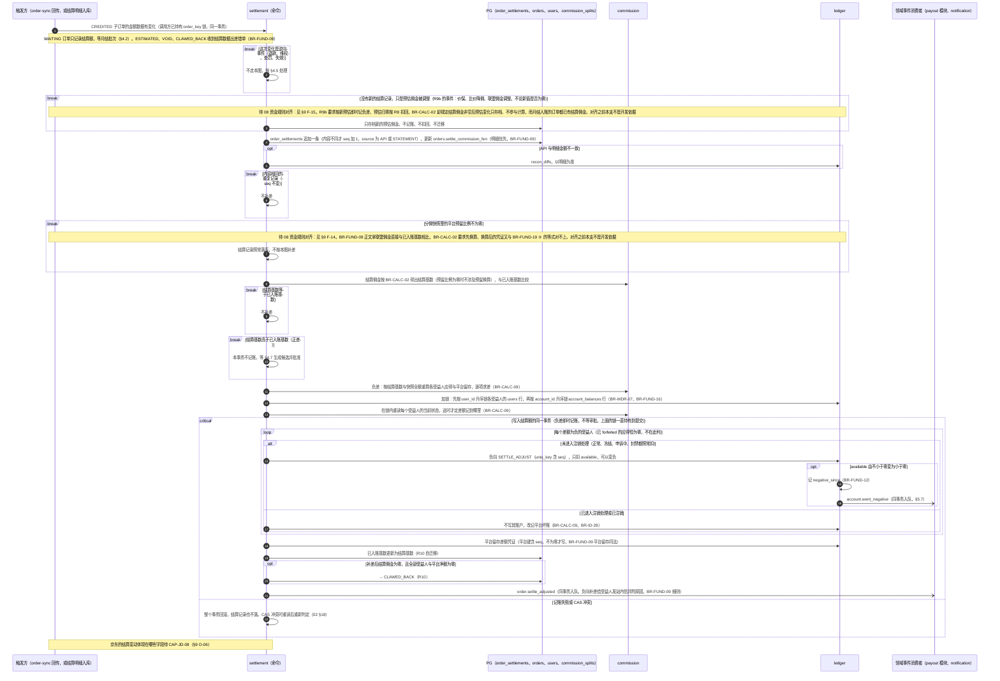
```mermaid
sequenceDiagram
  autonumber
  participant X as 触发方（order-sync 回传，或结算明细入库）
  participant T as settlement（命令）
  participant DB as PG（order_settlements、orders、users、commission_splits）
  participant M as commission
  participant L as ledger
  participant P as 领域事件消费者（payout 模块、notification）

  X->>T: CREDITED 子订单的金额数据有变化（调用方已持有 order_key 锁，同一事务）
  Note over X,T: WAITING 订单只记录结算额，等月结批次（§4.2）。ESTIMATED、VOID、CLAWED_BACK 收到结算数据出差错单（BR-FUND-09）
  break 这次变化是逆向事件（退款、维权、处罚、失效）
    T->>T: 不走本图，按 §4.5 处理
  end
  break 没有新的结算记录，只是预估佣金被调整（R9b 的事件：价保、比价降佣、联盟佣金调整。不论新值是否为零）
    Note over X,L: 待 08 资金规则对齐：见 §9 F-15。R9b 要求按新预估即时记负差、预估归零按 R8 扣回，BR-CALC-02 却规定结算佣金非空后预估变化只存档、不参与计算，而月结入账的订单都已有结算佣金。对齐之前本支不是开发依据
    T->>DB: 只存档新的预估佣金。不记账、不扣回、不迁移
  end
  T->>DB: order_settlements 追加一条（内容不同才 seq 加 1，source 为 API 或 STATEMENT），更新 orders.settle_commission_fen（明细优先，BR-FUND-09）
  opt API 与明细金额不一致
    T->>L: recon_diffs，以明细为准
  end
  break 内容相同的重复记录（seq 不变）
    T->>T: 不补差
  end
  break 分佣快照里的平台预留比例不为零
    Note over X,L: 待 08 资金规则对齐：见 §9 F-14。BR-FUND-09 正文拿联盟佣金直接与已入账基数相比，BR-CALC-02 要求先换算，换算后的凭证又与 BR-FUND-19 ⑤ 的等式对不上。对齐之前本支不是开发依据
    T->>T: 结算记录照常落库，不按本图补差
  end
  T->>M: 结算佣金按 BR-CALC-02 得出结算基数（预留比例为零时不涉及预留换算），与已入账基数比较
  break 结算基数等于已入账基数
    T->>T: 不补差
  end
  break 结算基数高于已入账基数（正差）
    T->>T: 本事务不记账，等 §4.7 生成候选并批准
  end
  T->>M: 负差：按结算基数与快照全额重算各受益人应得与平台留存，逐项求差（BR-CALC-09）
  T->>L: 加锁：先按 user_id 升序锁各受益人的 users 行，再按 account_id 升序锁 account_balances 行（BR-WDR-07、BR-FUND-16）
  T->>M: 在锁内重读每个受益人的当前状态，这时才定差额记到哪里（BR-CALC-09）
  critical 写入结算额的同一事务（负差即时记账，不等审批。上面的锁一直持有到提交）
    loop 每个差额为负的受益人（已 forfeited 的应得恒为零，不在此列）
      alt 未进入注销处理（正常、冻结、申诉中、封禁都照常扣）
        T->>L: 负向 SETTLE_ADJUST（uniq_key 含 seq），只扣 available，可以变负
        opt available 由不小于零变为小于零
          L->>L: 记 negative_since（BR-FUND-12）
          L-)P: account.went_negative（同事务入队，§5.7）
        end
      else 已进入注销处理或已注销
        T->>L: 不写其账户，改记平台坏账（BR-CALC-09、BR-ID-28）
      end
    end
    T->>L: 平台留存差额凭证（平台键含 seq，不为零才写，BR-FUND-09 平台留存同法）
    T->>DB: 已入账基数更新为结算基数（R10 自迁移）
    opt 补差后结算佣金为零，且全部受益人与平台净额为零
      T->>DB: → CLAWED_BACK（R10）
    end
    T-)P: order.settle_adjusted（同事务入队。负向补差给受益人发站内信并附原因，BR-FUND-09 细则）
  option 记账失败或 CAS 冲突
    T->>T: 整个事务回滚，结算记录也不落。CAS 冲突时重读后重新判定（02 §18）
  end
  Note over X,T: 京东的结算变动体现在哪些字段待 CAP-JD-08（§9 O-06）
```

**覆盖的异常情况**

- [x] 同一结算记录重复到达（seq 不变，不重复补差）
- [x] 结算基数低于已入账基数（即时扣，可能使余额变负，同事务入队 `account.went_negative`）
- [x] 结算基数高于已入账基数（不自动加钱，走人工批准）；相等（不补差）
- [x] 接口结算额与明细不一致（以明细为准并出差错单）
- [x] 受益人状态与补差并发变化：先锁 users 行、再锁余额行，在锁内重读状态后才决定记到哪里
- [x] 受益人状态：冻结、申诉中、封禁照常扣；已进入注销处理或已注销的不写其账户，改记平台坏账
- [x] 平台留存差额与受益人差额同一事务记账，已入账基数同时更新
- [x] 补差后净额归零（转 CLAWED_BACK）
- [x] 负向补差后通知受益人并附原因（`order.settle_adjusted`）
- [x] 逆向事件不走本图（§4.5）
- [x] 记账失败或并发冲突（整个事务回滚，结算记录也不落）
- [ ] 只改预估佣金的事件（R9b），含预估降到零：待 08 资金规则对齐（§9 F-15），图上只存档，不记账、不扣回、不迁移
- [ ] 分佣快照里的平台预留比例不为零：待 08 资金规则对齐（§9 F-14），图上是不执行的终止分支

**实现的 BR / AC**：BR-FUND-01 R10（R9b 待 08 对齐）；BR-FUND-09；BR-FUND-10；BR-FUND-12；BR-WDR-07；BR-CALC-02、09、14、23；BR-ID-28；拍板第二批 FUND-11；AC-S2-11。

### 4.7 正差补差候选与批准（R10）

批准时每个候选行单独一个事务：锁内重读订单状态与 seq，再先锁 users 行、后锁余额行，在锁内重算差额并重读受益人状态，然后才记账（BR-WDR-07、BR-CALC-09）。两种组合待 08 资金规则对齐，本图不执行，不是开发依据：有受益人处于冻结或账户申诉中、其正差需要延后（§9 F-13）；分佣快照的平台预留比例不为零（§9 F-14）。

```mermaid
sequenceDiagram
  autonumber
  participant J as 队列 settle（月结账单日任务）
  participant F as 财务（后台，step-up）
  participant T as settlement
  participant DB as PG（settle_adjust_batches、orders、users、order_settlements）
  participant M as commission
  participant L as ledger
  participant EV as 领域事件

  alt 随月结账单生成任务运行 R1（§4.2）
    J->>T: 对 CREDITED 子订单比对结算基数与已入账基数
  else 财务手动触发
    F->>T: 触发 R1
  end
  Note over T,DB: 结算基数由联盟结算佣金按 BR-CALC-02 得出。分佣快照的平台预留比例不为零的订单不生成候选：待 08 资金规则对齐，见 §9 F-14
  T->>DB: 结算基数高于已入账基数的生成候选行，写 settle_adjust_batches（记下当时的 seq）
  F->>T: /admin/v1/settle-adjust-batches 批准（一人可完成，写审计）
  loop 每个候选行（每行一个事务）
    T->>DB: 开事务，order_key 锁，重读订单状态、结算佣金、当前 seq
    alt 订单已不是 CREDITED（如候选生成后被扣回成 CLAWED_BACK）
      T->>DB: 该行作废，不写。CLAWED_BACK 的恢复只走 §4.8，不能用补差补回
    else 候选行的 seq 不等于订单当前 seq（结算额又被修正过）
      T->>DB: 该行作废，不写
    else 重复批准或重放（uniq_key 已存在）
      T->>T: 跳过
    else 可以继续
      T->>L: 加锁：先按 user_id 升序锁各受益人的 users 行，再按 account_id 升序锁 account_balances 行（BR-WDR-07、BR-FUND-16）
      T->>M: 在锁内按结算基数与快照全额重算各受益人应得与平台留存，逐项求差，并重读每个受益人的当前状态（BR-CALC-09）
      alt 各受益人与平台的差额都为零
        T->>T: 不写
      else 有受益人处于冻结或账户申诉中，其正差需要延后
        Note over T,L: 待 08 资金规则对齐：见 §9 F-13。延后的差额不写凭证而已入账基数照写，BR-FUND-19 ⑤ 的等式不成立。对齐之前本支不是开发依据
        T->>DB: 这一行不记账，回滚本行的事务
      else 仍为正差，没有需要延后的受益人
        loop 每个差额大于零的受益人
          alt 状态正常（含注销冷静期）
            T->>L: 正向 SETTLE_ADJUST 记入其余额（uniq_key 含 seq）
          else 封禁，或已进入注销处理、已注销，或已识别未成年人的推广份额
            T->>L: 差额归平台并写原因，不写其账户（BR-CALC-09。未成年人按 BR-INV-19，见 §9 F-02）
          end
        end
        T->>L: 平台留存差额凭证（平台键含 seq，不为零才写，BR-FUND-09 平台留存同法）
        T->>DB: 已入账基数更新为结算基数（R10 自迁移），同一事务提交
        T-)EV: order.settle_adjusted
      end
    end
  end
  Note over T: 结算额先降后升再降（A→B→A）时，过期的候选在这里作废，不会多补（BR-FUND-09 细则）
```

**覆盖的异常情况**

- [x] 候选生成后订单离开 CREDITED（如被扣回成 CLAWED_BACK，而结算 seq 没变）：锁内重读状态，候选作废，不用补差把钱补回；恢复只走 §4.8
- [x] 候选生成后结算额又变（seq 不一致，候选作废）
- [x] 重复批准、任务重放（uniq_key 幂等）
- [x] 批准时重算差额已为零（不写）
- [x] 受益人状态与批准并发变化：先锁 users 行、再锁余额行，在锁内重读状态后才决定差额去向
- [x] 批准时受益人已封禁、已进入注销处理或已注销、是已识别未成年人的推广份额（差额归平台）
- [x] 平台留存差额与受益人差额同一事务记账，已入账基数同时更新
- [x] 正差不得自动入账（必须人工批准）；补差不得产生首次入账（WAITING 订单只走 §4.2–§4.4）
- [ ] 有受益人处于冻结或账户申诉中（正差需要延后）：待 08 资金规则对齐（§9 F-13），这一行不记账
- [ ] 分佣快照的平台预留比例不为零：待 08 资金规则对齐（§9 F-14），不生成候选

**实现的 BR / AC**：BR-FUND-01 R10；BR-FUND-09；BR-WDR-07；BR-CALC-02、09、23；BR-INV-19；拍板第二批 FUND-11、§8 ADD-05；AC-S2-11。

### 4.8 人工恢复（R12、R13、申诉恢复）

VOID、CLAWED_BACK 的订单不会因平台数据自动复活，只能经差错单由人工恢复。**R12 与 R13 不同**：R12 的订单从未入账，恢复时不写任何分录，之后照常随批次入账；R13 的订单入过账又扣回，恢复时把差额补回。

```mermaid
sequenceDiagram
  autonumber
  participant W as order-sync / risk
  participant F as 有权限的后台账号（step-up）
  participant T as settlement
  participant M as commission
  participant L as ledger（recon_diffs、ledger_*）

  alt 平台恢复：原因属可恢复范围的 VOID、CLAWED_BACK 订单，平台回传非失效状态或佣金恢复为正
    W->>L: recon_diffs（platform_restore）并告警，rebate_status 不动（BR-FUND-22）
  else 申诉结案为撤销（BR-ID-36）
    W->>L: 系统生成 recon_diffs（appeal_restore）
  end
  Note over W,L: 因处罚、黑名单作废的订单被平台恢复时不告警、不生成差错单，不进入本图（BR-FUND-22）。淘宝处罚「解冻」要不要另行处理见 §9 O-14
  F->>T: 处理差错单（/admin/v1/orders/{id}/restore）
  break 处理人决定不恢复
    T->>L: 关闭差错单并记原因（对应的状态取值缺失：见 §9 F-09）
  end
  break 守卫不过：没有对应差错单，或订单 platform_status 仍为 INVALID（BR-FUND-22）
    T-->>F: 拒绝，订单不变
  end
  break CAS 影响 0 行（订单状态已被别的操作改变）
    T-->>F: 20902（data.resource=order）
  end
  alt R12：订单为 VOID
    T->>T: 按当前 platform_status 回到 ESTIMATED 或 WAITING（WAITING 时 settle_period 按 received_at 取），不写任何分录
    Note over T: 之后随补充批次或下一期批次按 §4.2–§4.4 入账
  else R13：订单为 CLAWED_BACK
    T->>M: 按当前联盟佣金换算出的基数（BR-CALC-02）与分佣快照重算各受益人与平台应得，再逐个受益人读当前状态（BR-CALC-09）
    T->>L: 与当前净额的差额写 ADMIN_ADJUST（sub_type=RESTORE，uniq_key 含差错单 id）：状态正常的入其余额；封禁、已进入注销处理或已注销的归平台；冻结或申诉中的延后（BR-FUND-22 没有单独写受益人状态，按 BR-CALC-09 的调整规则画：见 §9 F-02、F-13）
    T->>L: 平台留存差额同一事务记账，更新已入账基数
    T->>T: → CREDITED
  else 账户申诉撤销封禁：封禁期间被 forfeited 的份额
    T->>L: 该受益人应得与已入账净额之差写 ADMIN_ADJUST（RESTORE，从平台留存补回）
    T->>M: 受益人追加 active 事件，订单状态不变
  end
```

**覆盖的异常情况**

- [x] 作废或扣回后平台又恢复（不自动复活，只出差错单）
- [x] 处罚、黑名单作废的订单不在恢复范围
- [x] 处理人决定不恢复；平台状态仍为失效时不得恢复；并发处理同一订单（20902）
- [x] R12 不补钱（避免对从未入账的订单提前或重复入账）；R13 才写恢复差额
- [x] R13 的恢复差额同样先看受益人当前状态：封禁、已进入注销处理或已注销的归平台，冻结或申诉中的延后；平台留存差额同事务记账（BR-CALC-09、BR-FUND-22）
- [x] 申诉撤销封禁后补发被剥夺的份额

**实现的 BR / AC**：BR-FUND-22（R12、R13、申诉恢复）；BR-CALC-02、09、13；BR-ID-36；拍板第二批 FUND-14、§8 ADD-05；AC-S2-48。

### 4.9 结算批次 `settle_batch_status`

```mermaid
stateDiagram-v2
  direction LR
  [*] --> DRAFT: 账单校验通过后生成（BR-FUND-04 ⑤）
  DRAFT --> CONFIRMED: 财务确认（立即或定时）
  CONFIRMED --> DRAFT: 撤销定时
  DRAFT --> CANCELLED: 驳回
  CONFIRMED --> EXECUTING: 到执行时刻
  EXECUTING --> DONE: 全部处理完
  EXECUTING --> PARTIAL: 开关关闭中止
  PARTIAL --> EXECUTING: 财务继续执行
  DONE --> [*]
  CANCELLED --> [*]
```

**覆盖的异常情况**：执行中开关关闭（PARTIAL）；撤销定时；驳回；状态并发修改（20902，`data.resource=settle_batch`）。08 只有文字、没有迁移表，图中迁移取自 BR-FUND-04 ⑤–⑧ 与 04 §4.7（§9 F-04）。

**实现的 BR / AC**：BR-FUND-04；AC-S2-51、AC-S2-52；测试 ID `SM-SB-<n>`。

### 4.10 单一余额 `USER_BALANCE`

每个用户只有一个余额（拍板第二批 §8 ADD-06），`account_balances(available_fen, frozen_fen, negative_since, version)` 每用户一行，是分录的缓存。**余额没有状态枚举**：下图的两个状态是字段条件，不是契约值，不得据此生成枚举。`frozen_fen` 只由提现使用，等于非终态提现单合计、CHECK 不小于零（BR-FUND-14）。提现冻结有余额前置条件（写前校验结果不为负），扣回没有（允许变负）。

```mermaid
stateDiagram-v2
  state "available 不小于零（negative_since 为空）" as NONNEG
  state "available 小于零（negative_since 有值）" as NEG
  [*] --> NONNEG: 注册建户
  NONNEG --> NONNEG: 入账、正向补差或调账、提现冻结与退回（写前校验结果不为负）
  NONNEG --> NONNEG: 扣回、负向补差、负向调账后仍不小于零
  NONNEG --> NEG: 扣回、负向补差、负向调账使余额跨过零（记 negative_since，入队 account.went_negative）
  NEG --> NEG: 继续扣回或负向调整（negative_since 不变）
  NEG --> NEG: 入账、提现退回、正向调账后仍小于零（negative_since 不变）
  NEG --> NONNEG: 入账、提现退回、正向调账抵平（清空 negative_since，不另写抵扣分录）
  NEG --> NONNEG: 坏账核销获批时余额仍为负（BAD_DEBT_WRITEOFF）
  note right of NEG
    申请提现返回 30302（BR-FUND-11）
    申请注销返回 30416（BR-ID-27）
    冷静期内变负，冷静期满撤销注销
    negative_since 只在跨过零时写入或清空（BR-FUND-12）
  end note
```

**覆盖的异常情况**：只有三类分录能使余额变负（BR-FUND-10）；扣回后仍为正、负余额继续被扣、部分抵扣但未抵平都有对应的自迁移；扣回不动 frozen；变负时的未打款提现单处理（§5.7）；长期为负的坏账核销（§4.11）；注销与负余额（BR-ID-27）。

**实现的 BR / AC**：BR-FUND-10、11、12、13、14、16、19；BR-WDR-05；BR-ID-27；AC-S2-07、08、26、27、33、46、47、58、60。

### 4.11 坏账核销 `bad_debt_writeoff_status`

```mermaid
stateDiagram-v2
  direction LR
  [*] --> PENDING: 日终校验后满足核销门槛，生成候选（同一账户同时最多一张）
  PENDING --> APPROVED: 有权限者 step-up 批准，重读余额仍为负，写 BAD_DEBT_WRITEOFF
  PENDING --> CANCELLED: 批准时重读余额已不为负
  APPROVED --> [*]
  CANCELLED --> [*]
```

**覆盖的异常情况**：批准前余额已回正（CANCELLED，不写凭证）；同一账户重复生成候选（最多一张 PENDING）；并发批准（CAS）；核销金额取批准时的余额而不是生成候选时的金额。

**实现的 BR / AC**：BR-FUND-12；AC-S2-47。

---

## 5. 提现与打款

单一余额提现（拍板第二批 §8 ADD-06）。提现单状态 `withdrawal_status` 的迁移表 W1–W10 只在 BR-WDR-08 维护，分录只在 BR-WDR-09；打款结果未知时**只查不重提**（BR-WDR-14）。`needs_manual` 是 `withdrawals` 的布尔列，不是状态。

出款分三段事务：本地建单、冻结并生成 `out_biz_no`（§5.1）→ 事务外调用通道（§5.4）→ 新事务写回结果（§5.4、§5.5）。冻结不会自动过期：只有确定成功才出金，只有确定失败或驳回才退回，结果未知时一直冻结（BR-FUND-14）。对用户只展示 BR-TEXT-06 的状态文案，不承诺到账时点。

### 5.1 提现申请建单

```mermaid
sequenceDiagram
  autonumber
  actor U as 用户
  participant C as App（只允许原生）
  participant A as api·payout
  participant DB as PG（users、account_balances、withdrawals、idempotency_keys）
  participant L as ledger
  participant W as worker·payout（evt 消费者）

  U->>C: 提现（页面先用 GET /v1/withdrawals/rules 预检）
  C->>A: POST /v1/withdrawals（签名、Idempotency-Key、X-Step-Up-Token action=withdraw，BR-WDR-01）
  break 前置不过：令牌或作用域、签名与防重放、参数格式、缺幂等键
    A-->>C: 10001 / 10002 / 10403 / 10401 / 20001（这些不写入幂等结果）
  end
  break 同键请求仍在处理（并发重复提交）
    A-->>C: 40901
  end
  break 同键、请求体不同
    A-->>C: 20901
  end
  break 同键、同请求体、已完成（重试或重放）
    A-->>C: 原样返回首次响应（含当时的业务错误），不再建单
  end
  break ①–⑬ 任一不通过（按 BR-WDR-03 的顺序返回第一个）
    A->>DB: 3xxxx 业务错误写入幂等结果，1xxxx、2xxxx 不写（BR-WDR-07）
    A-->>C: 30306 / 10003 / 10006 / 44001 / 30304 / 30305 / 30307 / 10004 / 30303 / 30302 / 30301 / 30309
  end
  critical 同一事务（锁顺序 BR-WDR-07）
    A->>DB: users 行 FOR UPDATE → account_balances 行 FOR UPDATE → 收款账号 advisory 锁
    A->>A: 锁内重新校验冻结、负余额、余额、次数、未成年额度，算手续费与税（BR-WDR-19、BR-WDR-20）
    A->>DB: 插入 withdrawals（PENDING_REVIEW，W1），此时生成 out_biz_no，之后不可修改
    A->>L: WITHDRAW_FREEZE（available 转 frozen，写前校验结果不为负，BR-FUND-10）
    A->>DB: 写风险标签（只标记不拒绝，BR-WDR-29）、幂等结果，核销 step-up 令牌（只在成功时核销）
    A-)W: withdrawal.created（同事务入队）
    A-->>C: code 0，status=PENDING_REVIEW
  option 锁内重验不通过（并发的另一笔提现先冻结了余额或用掉了次数）
    A->>DB: 回滚，不建单、不冻结，业务错误写入幂等结果
    A-->>C: 30301 / 30303 / 30309
  end
```

**覆盖的异常情况**

- [x] 重复提交：同键处理中、同键不同请求体、同键已完成（都在建单前终止）
- [x] 校验失败按 BR-WDR-03 顺序返回第一个错误码，业务错误也按幂等规则保存
- [x] 并发提现：锁内重验，后到者失败，不超额（frozen 不为负另有 CHECK 兜底）
- [x] step-up 令牌只在成功时核销，失败后可沿用原幂等键重放
- [x] h5_token、桥、Agent 工具不得调用（10403）
- [x] 余额为负、账户冻结、未签劳务协议、未成年额度（各有错误码）

**实现的 BR / AC**：BR-WDR-01、03、05、07、08（W1）、09、31；BR-FUND-10、BR-FUND-14；AC-S2-20、AC-S2-21、AC-S2-22、AC-S2-26、AC-S2-27、AC-S2-55；AC-WDR-01、AC-WDR-03、AC-WDR-04。

### 5.2 自动到账判定

```mermaid
sequenceDiagram
  autonumber
  participant W as worker·payout（自动判定，evt 消费者）
  participant DB as PG（withdrawals、payout_batches）
  participant Q as payout 队列

  W->>W: 消费 withdrawal.created
  break 事件重复投递（processed_events 已有记录）
    W->>W: 不再判定（每单只判定一次，BR-WDR-30）
  end
  W->>DB: 按建单同样的顺序加锁，advisory 锁 auto_payout_daily 内把 BR-WDR-30 ①–⑬ 全部检查一遍
  W->>DB: 写 auto_decision（结果、全部未满足的条件、规则版本）与 review_mode
  alt 判 manual（任一条件不满足。系统不自动驳回）
    W->>W: 单据留在 PENDING_REVIEW，转人工审核（§5.3）
  else 判 auto
    W->>DB: W2 APPROVE（CAS，条件是仍为 PENDING_REVIEW，操作人记系统自动到账）
    alt CAS 影响 0 行（人工已先处理）
      W->>W: 只保留 auto_decision，不建批次，结束
    else CAS 成功
      W->>DB: 为该单建 payout_batches（kind=auto），做执行前置检查（BR-WDR-12 ①–③）
      alt 前置不过：打款开关关闭、队列暂停、会员提现阻断、已有转账尝试、通道未开通、水位不足
        W->>DB: 单据留在 APPROVED，auto_decision 追加 execute_blocked 与原因。系统不自动重试执行，之后只由人工批次处理
      else 前置通过
        W->>DB: W4 EXECUTE → PAYING（CAS），execute_seq 加 1
        W-)Q: 同事务入队 payout 任务，去重键为 withdrawal_id 加 execute_seq（→ §5.4）
      end
    end
  end
  Note over W,DB: 本图不画留在 APPROVED 的单怎么从 auto 批次换到人工批次：08 没有规定，见 §9 W-03
```

**覆盖的异常情况**

- [x] 事件重复投递（只判定一次）
- [x] 自动判定与人工审核抢同一单（CAS 影响 0 行就结束，不建自动批次）
- [x] 任一条件不满足转人工，不自动驳回
- [x] 判 auto 后执行前置不过（留在 APPROVED，转人工批次，不自动重试）
- [x] 银行卡通道未开通（判定时即转人工，BR-WDR-30 ⑪）

**实现的 BR / AC**：BR-WDR-08（W2、W4）、12、29、30；拍板第二批 FUND-02、FUND-08；AC-S2-53。

### 5.3 人工审核与批次执行

```mermaid
sequenceDiagram
  autonumber
  actor U as 用户
  participant F as 财务（后台，step-up）
  participant A as admin·payout
  participant L as ledger
  participant Q as payout 队列
  participant N as notification

  F->>A: /admin/v1/withdrawals 审核一张 PENDING_REVIEW 单（BR-WDR-10）
  break 驳回（W3，必填原因码）
    alt CAS 影响 0 行（自动判定或另一人已处理）
      A-->>F: 20902（data.resource=withdrawal）
    else 成功
      A->>L: 同一事务 → REJECTED，WITHDRAW_RETURN（frozen 退回 available）
      A-)N: 提现未通过通知
    end
  end
  break 审核通过的守卫不过：余额为负，或 blocked_reason 非空（BR-WDR-05）
    A-->>F: 拒绝
  end
  break CAS 影响 0 行（自动判定或另一人已处理）
    A-->>F: 20902（data.resource=withdrawal）
  end
  A->>A: W2 → APPROVED，写 reviewer_id、reviewed_at
  F->>A: /admin/v1/payout-batches 对勾选的 APPROVED 单建 kind=manual 批次并执行（一人可完成，BR-WDR-11、12）
  break 批次级前置不过（打款开关关闭、队列暂停），或可执行集合水位不足（BR-WDR-18）
    A-->>F: 整批拒绝，不迁移任何单
  end
  loop 批次内每张单
    alt 不满足逐单条件：已不是 APPROVED（如同时被驳回）、会员提现阻断、已有转账尝试、收款通道未开通
      A->>A: 保持原状，执行结果里列出原因
    else 满足
      A->>A: W4 → PAYING（CAS），写 executor_id、batch_id、executed_at，execute_seq 加 1
      A-)Q: 同事务入队 payout 任务（去重键含 execute_seq，→ §5.4）
    end
  end
  opt 留在 APPROVED 的单线下打款后补录（银行卡通道未开通，或已有转账尝试只能手动成功）
    F->>A: W8 MANUAL_PAID 录入并确认（流水号、实付时间、实付金额，BR-WDR-16）
    alt 守卫不过：存在 pending、success、unknown 的转账尝试，或会员提现阻断，或流水号已用过，或实付不等于应付净额
      A-->>F: 拒绝
    else CAS 影响 0 行（同时被执行或驳回）
      A-->>F: 20902
    else 成功
      A->>L: 同一事务 → PAID_MANUAL，成功分录一张凭证（WITHDRAW_PAID、WITHDRAW_FEE、TAX_WITHHOLD），更新 tax_ytd
      A-)N: 提现成功通知
    end
  end
  opt 审核通过后要驳回（W3 from APPROVED）
    F->>A: 驳回
    alt 该单存在 pending、success、unknown 的转账尝试
      A-->>F: 拒绝驳回，只能按 §5.5 的人工处置结束
    else 没有，或只有失败的尝试
      A->>L: 同一事务 → REJECTED，WITHDRAW_RETURN
    end
  end
  opt 用户想撤销（不能自撤，拍板第二批 FUND-20）
    U->>F: 联系客服建工单 withdraw_cancel，财务以 USER_REQUEST 驳回
  end
```

**覆盖的异常情况**

- [x] 驳回（冻结额退回，不再往下走）
- [x] 余额为负或被阻断时不得审核通过
- [x] 审核与自动判定、驳回与执行、执行与手动成功互相并发（都以 CAS 判定，后到者 20902 或保持原状）
- [x] 批次级前置不过、水位不足（整批拒绝）
- [x] 批次内个别单不可执行（逐单独立，不整批重跑）
- [x] 银行卡通道未开通（跳过执行，线下转账后 W8 补录）
- [x] 已有转账尝试的单不得再执行、不得随意驳回
- [x] 用户撤销（客服工单加驳回）

**实现的 BR / AC**：BR-WDR-05、08（W2、W3、W4、W8）、09、10、11、12、16、18、32；拍板第二批 FUND-20、§8 ADD-04、ADD-05；AC-S2-20、AC-S2-23、AC-S2-28、AC-S2-29、AC-S2-54、AC-S2-59；AC-WDR-05、AC-WDR-06。

### 5.4 payout 任务：复核与转账

payout 进程是唯一持有通道密钥的进程，没有公网入站，所以**不接收支付宝异步通知**，结果只靠同步返回、主动查询与每日对账（是否接通知见 §9 W-08）。

```mermaid
sequenceDiagram
  autonumber
  participant Q as payout 队列
  participant P as payout 进程
  participant DB as PG（withdrawals、payout_attempts、ledger_*）
  participant Z as 支付宝开放平台

  Q->>P: 取任务（去重键为 withdrawal_id 加 execute_seq。转账任务不自动重试，单并发，BR-WDR-13）
  P->>DB: 读单据
  break ① 单据不是 PAYING，或任务的 execute_seq 不是单据当前值（重复或过期任务）
    P->>P: 直接结束，不转账也不查询
  end
  break ② 该单已有 kind=transfer 的尝试记录（进程在请求发出后崩溃重启、任务被重投）
    P->>P: 不转账，转入 §5.5 的查询
  end
  P->>DB: 在 advisory 锁 payout_daily 内按序复核（BR-WDR-13 ③，开关直读 PG）
  break ③ 复核不过
    P->>DB: W9 HOLD → APPROVED（CAS），写 hold_reason（payout_disabled、queue_paused、member_blocked、single_cap、daily_cap 之一）与 hold_at，清空执行人与执行时间
    Note over P,DB: 这类单没有转账尝试，条件恢复后可以再次执行（新任务的 execute_seq 加 1）。因余额为负被阻断的，回到 APPROVED 后按 §5.7 驳回
  end
  P->>DB: ④ 同一把锁内写 payout_attempts（kind=transfer，result=pending）并提交（先记后发）
  P->>Z: ⑤ alipay.fund.trans.uni.transfer（out_biz_no、收款账号与姓名取单据快照。场景字段与证书签名见 09 §5.3，待 CAP-X-06）
  Note over P,Z: 通道调用在事务之外，不持有行锁。结果另开事务写回
  alt 明确成功
    P->>DB: 同一事务 W5 → PAID_API（CAS），记通道单号与到账时间，写成功分录一张凭证（BR-WDR-09），更新 tax_ytd，尝试记 success
  else 返回码在 payout.definite_fail_codes 内（验证前清单为空，BR-WDR-28）
    P->>DB: 同一事务 W6 → FAILED，WITHDRAW_RETURN，记 fail_code，尝试记 fail
  else 返回码在 payout.payer_side_codes 内（验证前清单为空）
    P->>DB: 同一事务：这次转账尝试由 pending 改记 fail，保存通道返回码作证据。W9 → APPROVED，hold_reason=payer_side_after_transfer，不退回余额。置 payout.queue_paused 并告警
    Note over P,DB: 尝试记成 fail 之后，这张单才过得了手动成功（W8）与驳回（W3）的守卫。它已有转账尝试，不得再执行（BR-WDR-16、BR-WDR-17）
  else 返回了三份清单之外的业务码
    P->>DB: 按结果未知处理：保持 PAYING（W7），尝试记 unknown。同时置 payout.queue_paused 并告警（BR-WDR-28）
  else 超时、网络错误、HTTP 5xx、SYSTEM_ERROR
    P->>DB: 结果未知：保持 PAYING（W7），尝试记 unknown
  end
  opt 结果未知（后两种）
    P->>P: 排入 §5.5 的查询。任何情况下都不再调转账接口，不换 out_biz_no（BR-WDR-14）
  end
```

**覆盖的异常情况**

- [x] 重复或过期任务（直接结束）
- [x] 已发出过转账的单再次被取到（只查询，绝不到达转账调用）
- [x] 发出前复核不过（W9，不到达转账调用；没有转账尝试，可再次执行）
- [x] 进程在请求发出后崩溃（先记后发，重启后只查询）
- [x] 明确成功、明确失败、付款方侧失败（转账尝试记 fail 后走 W9，暂停队列，不退回；之后可手动成功或驳回，不可再执行）
- [x] 清单外的业务码（按未知处理，并暂停后续出款）
- [x] 超时、网络错误、5xx、SYSTEM_ERROR（只查不重提）

**实现的 BR / AC**：BR-WDR-08（W5、W6、W7、W9）、09、12、13、14、16、17、28、32；BR-FUND-14；CAP-X-06（待验证）；AC-S2-20、AC-S2-24、AC-S2-25；AC-WDR-06、AC-WDR-07。

### 5.5 结果未知：查询与人工处置

```mermaid
sequenceDiagram
  autonumber
  participant P as payout 进程
  participant DB as PG（withdrawals、payout_attempts、withdraw_holds、ledger_*）
  participant Z as 支付宝开放平台
  participant F as 财务（后台，step-up）
  participant A as admin·payout

  Note over P,DB: 入口：结果未知的 PAYING 单（§5.4），任务重投时发现已有转账尝试的单，或每日对账转来的单（§5.6 ①）
  loop 单据仍为 PAYING、needs_manual 为假，且自首次转账尝试起还没到期限：每到一个查询时点查一次（时点与期限见 BR-WDR-14）
    P->>Z: alipay.fund.trans.common.query（out_biz_no、product_code、biz_scene）
    Z-->>P: 状态，或查询调用失败（查询本身可以重试，不算转账）
    P->>DB: 写 payout_attempts（kind=query）
    break 查询状态按 payout.query_status_map 映射为 success
      P->>DB: 同一事务 W5 → PAID_API（CAS），成功分录
    end
    break 映射为 fail
      P->>DB: 同一事务 W6 → FAILED，WITHDRAW_RETURN
    end
    Note over P: 处理中、订单不存在、没列入映射的状态、查询调用仍失败，都算未知，等下一个时点。验证前只有成功状态会被映射（BR-WDR-28）
  end
  break 循环因得到确定结果而退出（单据已是 PAID_API 或 FAILED）
    P->>P: 结束，不进入人工处置
  end
  opt 循环因到了期限而退出（自首次转账尝试起到期限仍未知）
    P->>DB: needs_manual 置真，告警，停止自动查询
  end
  Note over P,A: 走到这里的单都是 PAYING 且 needs_manual 为真：到期限时置的，或期限之前由每日对账置的（§5.6 ①）。入口时已为真的单不进上面的循环，直接到这里
  opt 财务点【立即查询】
    F->>A: 查询结果只存为凭证，不迁移状态
  end
  F->>A: W10 MANUAL_RESOLVE（上传支付宝侧凭证，一人可完成，BR-WDR-15）
  alt 凭证显示已成功
    A->>DB: 同一事务 → PAID_API（CAS），成功分录
  else 同时满足 BR-WDR-15 判失败的三个条件
    A->>DB: 同一事务 → FAILED（CAS），WITHDRAW_RETURN，并给该会员加 withdraw_holds（manual_failed_watch，到期自动失效）
  else 条件不足
    A-->>F: 不允许判失败，单据保持 PAYING、needs_manual 为真
  end
  Note over P,A: needs_manual 的单不得转 PAID_MANUAL，不得重发转账。每日对账仍覆盖这类单（§5.6）
```

**覆盖的异常情况**

- [x] 查询得到成功或失败后退出循环，不再继续查询，也不进入人工处置
- [x] 订单不存在、处理中不立即判失败
- [x] 查询调用本身失败（按 BR-WDR-14 重试，不算转账）
- [x] 到期仍未知：期限是循环的退出条件，退出后置 needs_manual，停止自动查询，转人工
- [x] 期限之前被每日对账置为 needs_manual（§5.6 ①），或入口时就已是 needs_manual：不进查询循环，直接到人工处置，不会两头都接不上
- [x] 人工处置：成功、判失败（条件齐全才行，并加观察冻结）、条件不足不许判失败
- [x] needs_manual 之后的查询只存凭证，状态只由 W10 迁移

**实现的 BR / AC**：BR-WDR-08（W5、W6、W7、W10）、09、14、15、28；AC-S2-24；AC-WDR-07。

### 5.6 通道对账 R2

```mermaid
sequenceDiagram
  autonumber
  participant R as worker·payout（R2 对账任务）
  participant Z as 支付宝开放平台
  participant P as payout 进程
  participant DB as PG（recon_channel、recon_diffs、withdraw_holds、withdrawals）
  participant F as 财务（后台）

  R->>Z: 每日取前一自然日的账务明细（接口未定：见 §9 W-08）
  break 明细取不到
    R->>F: 告警，当日对账未完成，不改任何单据
  end
  R->>DB: 逐笔核对写 recon_channel：接口打款单按 out_biz_no，手动成功单按 channel_order_id，金额比应付净额
  loop 每条差异
    alt ① 支付宝成功，内部 PAYING 且 needs_manual 为假
      R->>P: 立即查询一次
      alt 查询返回成功
        P->>DB: W5 → PAID_API
      else 不是成功
        P->>DB: needs_manual 置真，recon_diffs（channel_mismatch）并告警，转 §5.5 的人工处置
      end
    else ② 支付宝成功，内部 PAYING 且 needs_manual 为真
      R->>F: 只生成待处置提示并附账单行，由 W10 结束，不走 W5
    else ③ 支付宝成功而内部为 APPROVED、FAILED、REJECTED 或查无此单，或内部已成功而支付宝无记录，或金额不一致
      R->>DB: recon_diffs（channel_mismatch）并告警，给该会员加 withdraw_holds（recon_diff，不自动到期）
    end
  end
  Note over R,DB: 终态提现单不改状态与金额，更正只经差错单与人工调账（BR-FUND-24）。支付宝成功而内部经 W9 回到 APPROVED 的单没有对应迁移：见 §9 W-04
```

**覆盖的异常情况**

- [x] 支付宝已成功而内部还在打款中（区分是否 needs_manual：前者先查询，后者只提示）
- [x] 内部已终态而与通道不一致、金额不一致、通道有我方无（差错单并冻结该会员提现）
- [x] 判失败后通道迟到成功（观察期内由本对账发现，§5.5 的观察冻结）
- [x] 明细取不到（告警，不改单据）

**实现的 BR / AC**：BR-WDR-15、BR-WDR-23、BR-FUND-24；AC-S2-50。

### 5.7 余额变负时的未完结提现单

```mermaid
sequenceDiagram
  autonumber
  participant L as ledger
  participant W as worker·payout（evt 消费者）
  participant P as payout 进程
  participant DB as PG（withdrawals、account_balances）
  participant N as notification

  L-)W: account.went_negative（扣回或负向调整的同一事务入队，§4.5、§4.6）
  break 事件重复投递（processed_events 已有记录）
    W->>W: 不再处理
  end
  W->>DB: 按建单同样的顺序加锁（users 行、account_balances 行），锁内重读当前 available
  break 当前 available 已不小于零（事件迟到，其间的入账、提现退回或调账已经抵平）
    W->>DB: 不驳回任何提现单，余额恢复后新建的单不受这条旧事件影响。清空该用户提现单上的 blocked_reason 后结束
  end
  W->>DB: 余额仍为负：读该用户全部非终态提现单
  loop 每张非终态单
    alt PENDING_REVIEW 或 APPROVED，且没有任何转账尝试
      W->>DB: 系统 W3 驳回（CAS，原因码 NEGATIVE_BALANCE，操作人记 system，写审计），WITHDRAW_RETURN，冻结额退回 available 抵扣负数
      W-)N: 提现未通过通知
    else APPROVED 且已有转账尝试（经 W9 退回的单）
      W->>DB: 不自动驳回，置 blocked_reason=NEGATIVE_BALANCE 并告警，由财务按 BR-WDR-10 处理
    else PAYING 且还没发出转账
      W->>W: 此时不改单据。等 payout 复核走 W9（§5.4）
    else PAYING 且已发出转账
      W->>W: 不拦截，照常查询与完成，余额保持为负
    end
  end
  opt 之后 payout 复核把还没发出转账的 PAYING 单经 W9（member_blocked）退回 APPROVED，且余额仍为负
    P->>DB: W9 → APPROVED
    W->>DB: 随即按上面第一支系统驳回并退回冻结额（BR-WDR-05 (a)。由什么触发 08 没写：见 §9 W-11）
  end
  opt 之后余额回到不小于零（入账、提现退回、调账或核销）
    W->>DB: 清空该用户提现单上的 blocked_reason。已有转账尝试的限制不变，仍只能手动成功或驳回（由什么触发 08 没写：见 §9 W-11）
  end
  Note over W,DB: 事件只是加快处理。审核通过、执行、手动成功的守卫都在锁内检查余额不为负，才是硬约束（BR-WDR-05 (a)）
```

**覆盖的异常情况**

- [x] 事件重复投递（不重复处理）
- [x] 事件迟到：消费时在锁内先重验当前余额，已经回正就不驳回任何单（含回正后新建的提现），只清阻断标记
- [x] 未打款的单自动驳回并用冻结额抵扣
- [x] 已有转账尝试的 APPROVED 单不自动驳回，只阻断并告警
- [x] 事件消费时单据还在 PAYING 且未发出转账：复核走 W9 之后要再驳回一次
- [x] 已发出转账的单不拦截（拦截会造成结果未知）
- [x] 余额回正后清除阻断标记
- [x] 事件丢失（审核通过、执行、手动成功的守卫在锁内兜底）
- [ ] W9 之后的再次驳回、余额回正后的清理由什么触发：08 没写（§9 W-11）

**实现的 BR / AC**：BR-WDR-05 (a)、BR-WDR-08（W3、W9）、BR-WDR-10、BR-WDR-13；BR-FUND-10、BR-FUND-11；拍板第二批 FUND-12、§8 ADD-06；AC-S2-07、AC-S2-08、AC-S2-27。

### 5.8 提现 `withdrawal_status`

```mermaid
stateDiagram-v2
  direction LR
  [*] --> PENDING_REVIEW: W1 APPLY
  PENDING_REVIEW --> APPROVED: W2 APPROVE（人工，或自动到账判定 BR-WDR-30）
  PENDING_REVIEW --> REJECTED: W3 REJECT
  APPROVED --> REJECTED: W3 REJECT（无 pending、success、unknown 尝试）
  APPROVED --> PAYING: W4 EXECUTE（无任何转账尝试）
  APPROVED --> PAID_MANUAL: W8 MANUAL_PAID
  PAYING --> PAYING: W7 CHANNEL_UNKNOWN
  PAYING --> PAID_API: W5 CHANNEL_SUCCESS
  PAYING --> FAILED: W6 CHANNEL_FAIL
  PAYING --> APPROVED: W9 HOLD
  PAYING --> PAID_API: W10 MANUAL_RESOLVE paid
  PAYING --> FAILED: W10 MANUAL_RESOLVE failed
  REJECTED --> [*]
  PAID_API --> [*]
  PAID_MANUAL --> [*]
  FAILED --> [*]
  note right of PAYING
    needs_manual 是列不是状态
    W5、W6 只在 needs_manual 为假时
    W10 只在 needs_manual 为真时
  end note
```

**覆盖的异常情况**：表外事件与并发冲突（CAS 影响 0 行，后台接口 20902，AC-S2-31）；终态不可再迁移；W9 退回后只有无转账尝试的单能再走 W4（付款方侧失败的单只能 W8 或 W3，BR-WDR-17）；needs_manual 的单只能经 W10 结束。

**实现的 BR / AC**：BR-WDR-08（W1–W10，测试 ID `SM-WDR-W1…W10`）、BR-WDR-05 (a)；AC-S2-31。

**本节不一致**：状态名与契约 `withdrawal_status` 逐字一致，没有多余或缺失的状态；其他问题见 §9 W-01 至 W-11。

---

## 6. 登录与第三方空号并号

所有登录方式与刷新都要求签名（BR-ID-09），因此必须先在用户同意隐私政策后完成设备注册（BR-ID-11）。拒绝码按 BR-ID-01 的顺序返回第一个。同一自然人用微信与手机号分别登录会得到两个账号，不自动合并；唯一例外是第三方登录新建的空号在绑定手机号时经用户确认并入老号（BR-ID-06，拍板第二批 OPS-04）。

### 6.1 设备注册与登录（短信、微信、Apple）

```mermaid
sequenceDiagram
  autonumber
  actor U as 用户
  participant C as App
  participant X as 微信、Apple（客户端 SDK 与服务端接口）
  participant G as api·risk（签名 Guard、限流、风控）
  participant I as api·identity
  participant SMS as 阿里云短信
  participant DB as PG（devices、users、user_oauth、sessions、refresh_tokens、login_logs、consent_records）与授权尝试存储

  U->>C: 同意隐私政策（同意前是基本模式：不注册设备，不带设备头与签名头，BR-ID-11）
  C->>C: 读取设备标识。取不到、全零或格式不符的都当作取不到，不求哈希、不上报（BR-ID-09 细则）
  C->>I: POST /v1/devices（device_hash、id_source）
  break 设备注册失败：设备标识无效，网络错误，或服务端拒收（device_hash 格式不符、命中无效设备哈希清单，20001，不签发 device_id）
    C->>C: 不向用户提示。后台退避后重新读取设备标识再注册，不带原值重试（BR-ID-11、BR-ID-09）。拿到 device_id 之前不能登录，其余 SDK 初始化不受影响
  end
  I-->>C: device_id、install_secret（只存系统密钥库，BR-ID-09）
  U->>C: 选登录方式，勾选协议（没勾选先弹确认框，BR-ID-04）
  alt 手机号验证码
    C->>G: POST /v1/auth/sms-codes（purpose=login，签名）
    alt 被拒（顺序 BR-ID-05）：签名无效 10401、设备失效 10402、号段或手机号黑名单 44001、需要人机验证 44003、发码过频 42901
      G-->>C: 对应错误码（44003 时拉起验证组件后带凭证重发，42901 按 Retry-After 禁用按钮）
    else 通过
      I->>SMS: 发送 SMS_CODE（新码发出即作废同用途的旧码）
      alt 短信供应商自己的流控拒绝，或发送失败
        SMS-->>I: 失败
        I-->>C: 发码失败（怎么映射成我方错误码 08 没写：见 §9 A-10）
      else 发送成功
        I-->>C: 重发间隔与有效期
        U->>C: 输入验证码
      end
    end
  else 微信或 Apple（鸿蒙端的微信登录待真机验证后启用，BR-ID-04）
    C->>I: POST /v1/auth/oauth-attempts（provider、purpose=login，签名）
    alt 取不到授权尝试（限流，或尝试的存储不可用 50001）
      I-->>C: 对应错误码，不发起第三方授权
    else 取到
      I-->>C: attempt_id、nonce、expire_at（一次有效，绑定 provider、用途与本设备，BR-ID-04 细则）
      C->>X: 拉起授权并带上 nonce（Apple 作为授权请求的 nonce，微信作为 state）
      X-->>C: 授权凭证（微信 code，Apple identity_token 与 authorization_code），或用户取消、SDK 报错
    end
  end
  break 没拿到登录凭据（发码被拒或发送失败、取不到授权尝试、用户取消第三方授权、SDK 报错，或 SDK 回传的 state 与本次 nonce 不一致）
    C->>U: 留在登录页，可重试或换登录方式。服务端没有建账号与会话
  end
  C->>I: POST /v1/auth/login/sms、wechat 或 apple（legal_versions、consent_at，签名。短信带手机号与验证码，可带 invite_code。第三方只带 attempt_id 与授权凭证，不带任何身份标识）
  break 签名无效或设备失效
    I-->>C: 10401 / 10402（10402 时重新注册设备后重放，BR-ID-09）
  end
  break 请求体有未定义的字段（如客户端自带的 union_id、昵称、头像）
    I-->>C: 20001，不建号
  end
  break 短信登录：验证码校验不过
    I-->>C: 验证码错误 20002，过期、已核销或错满次数 20003（重复提交同一验证码也落在这里）
  end
  break 第三方登录：授权尝试的存储不可用
    I-->>C: 50001，不向第三方换取
  end
  break 第三方登录：授权尝试核对不过（不存在、已过期、已使用，或它的 provider、用途、设备与本次请求不一致）
    I-->>C: 20004。这条尝试保持原样：别的设备或别的用途用不掉它，原持有人随后仍可提交
  end
  opt 第三方登录（以上都通过）
    I->>DB: 把授权尝试从未用原子地改成已用（条件更新，并发提交只有一个成功，其余得到 20004）
    I->>X: 用授权凭证向第三方换取身份：微信换 unionid 与 openid。Apple 换码并验签换回的身份令牌，核对签发方、受众、有效期与本次尝试的 nonce，客户端提交的令牌主体须与换码所得相同
  end
  break 第三方登录：凭证无效、过期、已使用，或 Apple 的任一项核对不过
    I-->>C: 20004（对外不区分原因）。尝试已消费不恢复，重试要重新取尝试、重新授权。不建号、不写 consent_records、不签发令牌
  end
  break 第三方服务不可用：超时、限流、返回服务端错误，或换取结果缺少必需的身份标识（如微信没有 unionid）
    I-->>C: 50305（data.provider），提示改用其他登录方式，不自动重试
  end
  break 账号在注销处理中
    I-->>C: 10007
  end
  break 需要新建账号，但同设备注册数已到上限（BR-ID-05）
    I-->>C: 44001，不建号
  end
  critical 同一事务
    I->>DB: 按 phone_hmac 或 user_oauth（provider、union_id）查到老用户就登录，否则建号（register_method、attr_code）。第三方身份只取服务端换得的结果：微信为 unionid，Apple 为换码所得的主体
    I->>DB: 写 consent_records（登录成功才写）、sessions、refresh_tokens、login_logs
    opt Apple 登录
      I->>DB: 加密保存同一次换码得到的 Apple refresh_token，供注销时撤销（BR-ID-04。存放列未定：见 §9 A-08）
    end
    opt 短信登录新建的账号带了 invite_code
      I->>DB: SAVEPOINT 内绑定上级，失败只回滚到 savepoint，不影响注册（BR-INV-06）
    end
    I-->>C: access_token、refresh_token、is_new_user、invite_bind
  option 并发的首次登录撞唯一索引（同一 union_id 或手机号）
    I->>DB: 本事务回滚，不重复建号（唯一索引兜底，02 §19）
    I-->>C: 登录失败（后到请求返回什么码 08 没有规定：见 §9 A-04）
  end
  Note over C,I: 已封禁用户照常校验并签发令牌，之后白名单以外的接口一律 10006（BR-ID-31）。冻结不拦登录
  Note over I,X: 微信的 code 出自哪一次尝试服务端验证不了，是已知限制，补偿措施见 BR-ID-04 细则。code、身份令牌、授权码与第三方访问令牌不落库、不进日志。华为账号登录（M-公开）的画法同微信
```

**覆盖的异常情况**

- [x] 设备标识无效（取不到、全零、格式不符）：客户端不注册；服务端拒收无效或格式不符的设备哈希（20001，不签发 device_id），客户端重新读取后再注册，不带原值重试
- [x] 设备注册失败、设备被吊销（10402 后重新注册再重放）
- [x] 发码被拒：黑名单、人机验证、频控
- [ ] 短信供应商自己的流控拒绝：返回什么未规定（§9 A-10）。图上这一支拿不到验证码，在「没拿到登录凭据」处终止
- [x] 验证码错误、过期、错满、重复提交
- [x] 取不到授权尝试、用户取消微信或 Apple 授权、SDK 报错、回传的 state 对不上（不建账号与会话）
- [x] 请求体带了身份标识等未定义字段（20001，不建号）：第三方身份只认服务端换取或验签的结果
- [x] 授权尝试先校验、后消费：不存在、过期、已用，或 provider、用途、设备不符（20004，尝试不变，别的设备用不掉）；并发提交同一个尝试只有一个进入换取；存储不可用（50001）
- [x] 第三方凭证无效、过期、已使用，Apple 的令牌拼接、旧令牌、受众不符（20004，尝试作废，不建号）
- [x] 第三方服务超时、限流、报错，或换取结果没有必需的身份标识（50305，提示换登录方式，不自动重试）
- [x] 注销处理中的账号登录（10007）、同设备注册超限（44001，不建号）
- [x] 并发首次登录（唯一索引兜底；后到请求返回什么见 §9 A-04）
- [x] 已封禁账号登录（照常签发，其余接口 10006）

**实现的 BR / AC**：BR-ID-01、04、05、09、11、12、27、31；BR-INV-06；功能对照 G-04、G-08；AC-S1-04、AC-S1-60、AC-S1-67、AC-S1-69；AC-ACC-01、02、03、06（F-ACC 同号）。短信登录失败的 S1 用例仍缺（§9 A-06）。

### 6.2 绑定手机号与第三方空号并号

```mermaid
sequenceDiagram
  autonumber
  actor U as 用户
  participant C as App
  participant I as api·identity
  participant DB as PG（users、user_oauth、union_bindings、sessions）

  C->>I: POST /v1/auth/sms-codes（purpose=bind），发码的各种拒绝同 §6.1
  U->>C: 输入验证码
  C->>I: POST /v1/me/phone（验证码，签名，Idempotency-Key）
  break 通用拒绝或重放（BR-ID-01）
    I-->>C: 10401 / 10402 / 10001 / 10002 / 40901 / 20901 / 10006，或同键已完成时原样返回首次结果
  end
  break 验证码错误或过期
    I-->>C: 20002 / 20003
  end
  break 目标手机号命中黑名单
    I-->>C: 44001
  end
  break 目标手机号没有被本 App 其他账号占用
    I->>DB: 写 phone_cipher、phone_hmac，绑定成功（已完成注销的账号的手机号可以绑定）
    I-->>C: code 0
  end
  break 已被占用，且不满足 BR-ID-06 的并号条件
    I-->>C: 30411（不带 reason），不迁移任何资产或关系
  end
  I-->>C: 30411，data.reason=mergeable、data.merge_ticket（一次性，时限见 BR-ID-06，绑定当前 uid 与目标手机号。验证码已核销）
  C->>U: 并号确认框
  break 用户取消
    C->>C: 保留当前账号，merge_ticket 到期作废
  end
  C->>I: POST /v1/auth/merge（merge_ticket，签名，Idempotency-Key）
  break 同键请求仍在处理（连点）
    I-->>C: 40901
  end
  break ticket 过期、已用过，或并号条件已不再满足
    I-->>C: 30411（不带 mergeable）
  end
  critical 同一事务（拍板第二批 OPS-04）
    I->>DB: 核销 merge_ticket（存放处未定：见 §9 A-02）
    I->>DB: 当前账号的 user_oauth 迁到手机号账号（记 merged_from_user_id）
    I->>DB: 当前账号的联盟绑定置 released（不冷却）
    I->>DB: 当前账号置墓碑（deleted_reason=merged，不进冷静期），吊销它的全部 sid
    I->>DB: 为手机号账号建会话
  end
  break 并发：两个空号同时并入同一手机号账号且登录方式相同，后到的事务失败回滚
    I-->>C: 30411（需要锁或唯一约束保证，目前缺失，待定：见 §9 A-02）
  end
  I-->>C: 手机号账号的令牌
  opt 并号已成功但响应丢失，客户端用同键重试
    C->>I: 原 sid 已吊销，令牌判定先于幂等回放，取不回新令牌（待定：见 §9 A-01）
    Note over C,I: 用户此时可以用手机号验证码登录手机号账号（§6.1 的既有能力）
  end
```

**覆盖的异常情况**

- [x] 发码与验证码校验的各种失败
- [x] 重复提交（同键 40901、20901 或原样返回）
- [x] 目标手机号在黑名单；已被占用且不可并号（只返回 30411，不迁移任何东西）
- [x] 用户取消并号；ticket 过期、已用或条件变化
- [x] 并号连点、两个空号并发并入同一账号
- [x] 并号成功但响应丢失（缺口，§9 A-01）
- [x] 被吊销的旧会话之后刷新得到 10404（§6.3）

**实现的 BR / AC**：BR-ID-01、05、06、07；拍板第二批 OPS-04；AC-S1-59；AC-ACC-11、AC-ACC-12（F-ACC 同号）。

### 6.3 令牌刷新

```mermaid
sequenceDiagram
  autonumber
  participant C as App（网络层）
  participant I as api·identity
  participant DB as PG（sessions、refresh_tokens）与 Redis（refresh_grace）

  C->>C: 多个请求同时收到 10002 时单飞：只发起一次刷新，其余排队（03 §4.2）
  C->>I: POST /v1/auth/refresh（refresh_token，签名）
  break 签名校验不过（伪造设备号而没有 install_secret、时间戳或 nonce 不过、设备已吊销）
    I-->>C: 10401 / 10402，不进入下面的判定（偷到令牌但签不了名的请求到此为止）
  end
  I->>DB: 按哈希取这条 refresh_token 与所属会话。后面的判定与轮换在同一事务内原子完成
  break 令牌不存在、已过期，或所属会话已被吊销（退出登录、封禁、并号、此前的泄露处置）
    I-->>C: 10404
  end
  break 令牌还没被轮换过，但请求设备不是会话绑定的设备（签名有效的另一台设备）
    Note over I,DB: 待定：见 §9 A-12。08 只对已轮换的令牌写了设备不符按泄露处理，这种情形返回什么、是否吊销会话没有规定
    I-->>C: 不轮换，不签发新令牌。本支不是开发依据
  end
  alt 令牌还没被轮换过，请求设备就是会话绑定的设备
    I->>DB: 轮换：写新的 refresh_tokens（记 parent_hash、rotated_at），新令牌对加密暂存到 refresh_grace
    I-->>C: 新的 access_token 与 refresh_token
  else 已轮换，且同时满足全部宽限条件（同一设备、宽限时间内、直接后继还没被轮换、暂存仍在，BR-ID-07）
    I-->>C: 返回同一对新令牌，不吊销
  else 已轮换的其他情况：超出宽限、请求设备不是会话绑定的设备、后继已被轮换、暂存已失效
    I->>DB: 视为泄露，吊销整条会话链（sid）
    I-->>C: 10404
  end
  alt 刷新成功
    C->>I: 排队的请求带新令牌各自重放
  else 10404
    C->>C: 清会话，跳登录页
  end
```

**覆盖的异常情况**

- [x] 并发刷新（客户端单飞；服务端宽限内返回同一对令牌；判定与轮换在同一事务内原子完成，两个并发的刷新不会各换出一对新令牌）
- [x] 判定互斥：先看令牌是否存在、未过期、会话未吊销，再看有没有被轮换过、设备是否一致。「还没轮换」不再与「已过期或会话已吊销」重叠
- [x] 旧 refresh_token 被复用（超出宽限、后继已被轮换、暂存已失效）：按泄露吊销整条会话链，10404
- [x] 跨设备复用：签名有效的另一台设备提交已轮换的令牌，同样按泄露吊销会话链，不会被前面的签名校验当成普通拒绝放过（BR-ID-07）
- [x] 过期、被吊销的会话（10404，清会话）
- [x] 签名无效、伪造设备号（10401，进不了宽限判定）
- [ ] 还没轮换的令牌由非绑定设备提交：08 没写（§9 A-12），图上引到不签发的终止分支

**实现的 BR / AC**：BR-ID-07、BR-ID-09、BR-ID-31；AC-ACC-05（F-ACC-05 同号）。10 尚无刷新与 10404 的 S1 用例（§9 A-06）。

---

## 7. 淘宝渠道备案（relation_id）与站长授权到期

淘宝订单的用户归属只靠 `relation_id`（BR-ATTR-07），备案只在用户点击购买时触发（BR-ID-17），一次绑定、不提供用户自助换绑（拍板第二批 §8 ADD-01）。授权方式有两种：网页授权回跳（`web_code`）与淘宝客户端 SDK 换令牌（`sdk_token`）。下发哪一种由服务端按端配置，生产默认只含 `web_code`；`sdk_token` 要等 CAP-TB-05 实验 (f) 对该端验证通过并经负责人确认后才配置（BR-ID-17 细则「授权方式」，功能对照 Q-04 第一问待负责人确认）。备案流程本身不受 2026-10-03 转链变更影响，绑定成功后的购买按 §2.6 打开。拼多多的备案见 §2.5。

### 7.1 用户渠道备案

```mermaid
sequenceDiagram
  autonumber
  actor U as 用户
  participant C as App
  participant BC as 淘宝授权（网页授权页，或淘宝客户端 SDK）
  participant A as api·linking
  participant UA as union Adapter·taobao
  participant TB as 淘宝联盟 TOP
  participant DB as PG（union_auth_sessions、union_bindings、devices）

  C->>A: 触发授权：点击购买的 open 发现未绑定或已失效（§2.1），或从「我的 → 授权管理」调 GET /v1/unions/taobao/auth-url
  break 站长授权已失效（auth_status=expired，或当前时刻已到 auth_expires_at，BR-ID-24）
    A-->>C: 30101 / 30102，data.reason=auth_unavailable，不下发 auth_url
    C->>U: 只提示稍后再试。不拉起授权、不外跳、不给无返利购买
  end
  break 本人淘宝绑定为 blocked（封禁、后台停用返利、注销中）
    A-->>C: 购买入口返回 30153，不下发 auth_url（BR-ID-17）。授权管理入口同样不进入授权，返回什么见 §9 T-03
  end
  alt 来自点击购买
    A-->>C: 30101 或 30102，带 auth_url、state 与 auth_methods（state 绑定待继续的 link_id）
  else 来自授权管理
    A-->>C: auth_url、state 与 auth_methods（link_id 为空）
  end
  Note over A,DB: state 存 union_auth_sessions，绑定 uid、device_id、link_id，并记下端（以设备记录为准，请求头只是声明）、本次下发的授权方式与所用的应用配置。一次性且有时限（BR-ID-17）。本图不写 pending_auth：绑定行何时进入、何时退出 08 没有规定，见 §9 T-03
  C->>U: AuthSheet（自动弹出的次数上限 BR-ID-18）
  break 用户关闭 AuthSheet
    C->>U: 提示未授权没有返利，给「仍去购买（无返利）」与「重试」
    opt 从购买进入，且用户选仍去购买
      C->>A: 新的 open（no_rebate=true，no_rebate_reason=auth_declined），按 §2.6 的无返利路径
    end
  end
  alt auth_methods 里本端能执行的第一种是 web_code（生产配置默认只有这一种）
    C->>BC: 用系统浏览器或淘宝客户端 SDK 的官方授权页打开 auth_url
    BC-->>C: 用户同意后回到 App，带授权码（能否直接回 App 待 09 实测，不能时改服务端回调加客户端按 state 查结果，08 §13.9）
  else 是 sdk_token（该端通过 CAP-TB-05 实验并经负责人确认后才会下发）
    C->>BC: 经淘宝客户端 SDK 完成登录与授权
    BC-->>C: SDK 直接返回访问令牌与有效期，不回跳
  end
  break 用户在淘宝侧取消或拒绝，或 SDK、授权页报错
    C->>U: 同样给二选一（选无返利购买时 no_rebate_reason=auth_failed）
  end
  C->>A: POST /v1/unions/taobao/bindings（state、auth_method 与对应的凭证，签名。每次绑定尝试用新的 Idempotency-Key）
  break 签名或令牌不过
    A-->>C: 10401 / 10402 / 10001 / 10002
  end
  break 同键请求仍在处理（连点、重复回调）
    A-->>C: 40901
  end
  break 同键、请求体不同（换了 state 或凭证却沿用原键）
    A-->>C: 20901
  end
  break 同键已完成（同一请求的传输重试）
    A-->>C: 原样返回首次结果。首次成功就返回成功，首次是 30104 就还是 30104
  end
  break 请求体有未定义的字段（淘宝昵称、头像、账号名等）
    A-->>C: 20001，服务端不接收这些资料
  end
  break 站长授权在这期间失效
    A-->>C: 30101 / 30102，data.reason=auth_unavailable。state 不消费
  end
  A->>DB: 先校验、后消费（BR-ID-17 细则）：读 state 与这个 device_id 的设备记录
  break state 的存储不可用
    A-->>C: 50001，不调用淘宝
  end
  break state 不存在、已过期、已使用，或 uid、device_id 与请求不一致
    A-->>C: 30104。state 保持原样：别人的请求用不掉它，原持有人随后仍可提交
  end
  break 设备记录里的端与 state 记录的不一致，或提交的授权方式不在下发列表里、此刻已被配置关闭
    A-->>C: 30104，data.reason=method_not_allowed。不调用淘宝，state 保持未用。客户端重新取 auth-url，只按新下发的方式执行
  end
  A->>DB: 把 state 从未用原子地改成已用（条件更新，并发提交只有一个成功）
  break 条件更新影响 0 行（另一个幂等键的并发请求先用掉了）
    A-->>C: 30104，不调用淘宝
  end
  A->>UA: bindPublisher（用 state 记录的应用配置）
  UA->>TB: 用凭证取得淘宝用户会话：web_code 用授权码换取，sdk_token 把访问令牌当作会话（后者待 CAP-TB-05 实验）。会话只在本次备案里用，不落库、不进日志
  break 凭证无效、过期、已使用，被淘宝判定不属于该应用，或不能用于备案
    A-->>C: 30104，data.reason=credential_invalid。state 已用不恢复，绑定状态不变
    C->>A: 重新取 auth-url，用新的 state 与新的幂等键发起新的绑定尝试：下发列表里还有下一种方式就换下一种，没有就按授权失败处理（BR-ID-18）
  end
  break TOP 超时或服务端错误
    A-->>C: 绑定失败（错误码没有分配：见 §9 T-05），可重新发起授权
  end
  UA->>TB: taobao.tbk.sc.publisher.info.save（inviter_code 取自 taobao.tbk.sc.invitecode.get，info_type）
  alt 返回 relation_id
    TB-->>UA: relation_id、special_id（special_id 只存不用）。出参里的淘宝账号名直接丢弃，不保存、不下发、不显示
  else 提示重复绑定
    UA->>TB: taobao.tbk.sc.publisher.info.get 查回已有的 relation_id
  else 邀请码或备案接口无权限、超时，或平台明确拒绝（如该淘宝号已是合作方）
    TB-->>UA: 失败
  end
  break 拿不到 relation_id
    A-->>C: 绑定失败（错误码没有分配：见 §9 T-05。权限挂在哪个应用见 §9 T-01）
  end
  A->>DB: 唯一性判定（BR-ID-19）
  break relation_id 已被其他用户占用（active、invalid、blocked，或冷却期内属于他人），或本人已有未释放的绑定（active、invalid）而 relation_id 不同
    A->>DB: 写冲突日志，原绑定不变
    A-->>C: 30151（只给仍去购买（无返利）或联系客服，不透露对方账号）
  end
  critical 同一事务（四种情形互斥，按本人当前绑定的状态分）
    alt 本人当前绑定为 active，relation_id 相同
      A->>DB: 视为无变化
    else 本人当前绑定为 invalid，relation_id 相同
      A->>DB: 原行由 invalid 回到 active，bound_at 不变
    else 本人没有未释放的绑定，这个 relation_id 是本人已 released、仍在冷却期内的那一行
      A->>DB: 原行恢复 active，清空 released_at 与 cooldown_until，不新增行
    else 本人没有未释放的绑定，relation_id 没有被占用（从未绑定过，或冷却已结束）
      A->>DB: 新建 union_bindings 的 active 行，写 bound_at
    end
  end
  break 并发：另一用户同时绑定同一 relation_id，本事务撞唯一索引回滚
    A-->>C: 绑定失败（是否返回 30151 没写明：见 §9 T-06）
  end
  A-->>C: 绑定成功
  alt state 带 link_id（从购买进入）
    C->>A: 用新的幂等键重新发起该 link_id 的 open，按 §2.6（BR-ID-10 细则。服务端按当前 active 绑定重新构造身份，不复用授权前的缓存）
  else state 不带 link_id（从授权管理进入）
    C->>C: 刷新授权管理页（只显示已授权或未授权，不显示淘宝账号名），不重放 open（BR-ID-17）
  end
```

**覆盖的异常情况**

- [x] 站长授权失效期间不能发起或完成备案（`auth_unavailable`，终止）；失效同时看状态列与到期时刻
- [x] 绑定为 blocked 的用户不进入授权（购买入口 30153）
- [x] 用户关闭 AuthSheet、在淘宝侧取消或拒绝、SDK 报错（终止；无返利购买是另一次 open，带对应原因码）
- [x] 两种授权方式：客户端按下发的顺序取本端能执行的第一种，不自行增减
- [x] 连点或重复回调（同键 40901）、换了 state 或凭证却沿用原键（20901）、同一请求的传输重试（原样返回首次结果）。每次绑定尝试用新的幂等键
- [x] 请求体带了淘宝昵称、头像、账号名等未定义字段（20001）
- [x] 先校验、后消费：state 不存在、过期、已用，或 uid、设备不符（30104，state 不变，别人用不掉我的 state）；端不符或提交了没有下发、已关闭的授权方式（30104 `method_not_allowed`，不调用淘宝，state 不变）；state 存储不可用（50001）
- [x] 两个不同幂等键并发提交同一个 state：条件更新只让一个继续，另一个在调用淘宝之前终止
- [x] 授权凭证无效、过期、已用，或不属于所用的应用（30104 `credential_invalid`，state 已用不恢复；重新取 state，用新的幂等键换下一种方式，没有可换的按授权失败处理）
- [x] TOP 超时或无权限、平台明确拒绝（终止，绑定不变；错误码缺口见 §9 T-05）
- [x] 已备案再备案（查回已有 relation_id）
- [x] relation_id 被他人占用、本人换了淘宝账号（30151，记冲突）
- [x] 失效后重新授权得到同一 relation_id：invalid 的原行回 active，与「active 且相同视为无变化」分开判定，不会只做无变化就返回成功
- [x] 冷却期内本人绑回原 relation_id（released 的原行恢复 active，不新增行）
- [x] 并发绑定同一 relation_id（唯一索引兜底，后到者失败）
- [x] 绑定成功后用新的幂等键重新发起 open；从授权管理发起的备案成功后不重放 open
- [x] 淘宝账号名不保存、不下发、不显示；授权管理页只显示已授权或未授权

**实现的 BR / AC**：BR-ID-10、17、18、19、24；BR-ATTR-07；BR-TEXT-14；拍板第二批 §8 ADD-01；拍板第三批 §3；功能对照 G-01（Q-04 第一问待负责人确认）；CAP-TB-05、CAP-TB-12（未实测）；AC-S1-05-TB、AC-S1-06、AC-S1-07-TB、AC-S1-16、AC-S1-36-TB、AC-S1-66；AC-LINK-03（F-LINK-03 同号）。

### 7.2 站长授权巡检、到期触发与告警

进入失效有三个独立的触发：到达到期时刻（不等每日巡检，也不依赖探测结果）、探测得到授权失效类错误、任一联盟调用返回授权失效类错误（BR-ID-24）。每日巡检只是其中一个入口：凭据在当天巡检之后到期时，由到期任务置状态并提醒；请求一侧另有时间守卫，状态列还没更新也不会放行。

```mermaid
sequenceDiagram
  autonumber
  participant S as worker·scheduler
  participant CR as worker·union（巡检与到期任务）
  participant X as 任一联盟调用（union Adapter）
  participant DB as PG（union_accounts、union_credentials）
  participant TB as 淘宝联盟 TOP
  participant SMS as 阿里云短信
  participant ADM as 后台告警

  alt 每日巡检（union.auth_probe_cron）
    CR->>DB: 读 auth_expires_at、auth_status、alert_stage
    opt 平台支持刷新，且剩余有效期已到自动刷新的门槛（BR-ID-24 ②）
      CR->>TB: 刷新凭据
      alt 刷新成功
        CR->>DB: 更新 union_credentials 与 auth_expires_at，到期任务按新的到期时间重排
      else 刷新失败
        CR->>CR: 照常按节点提醒
      end
    end
    alt 已到达 auth_expires_at（时间到期，不依赖探测结果）
      CR->>DB: auth_status 置 expired
    else 未到期
      CR->>TB: 实际调用一次依赖该授权的只读接口（探测接口登记在 specs/union/taobao.md，待 CAP-TB-12）
      alt 返回授权失效类错误
        CR->>DB: auth_status 置 expired，写 last_probe_at、last_probe_ok、last_probe_error
      else 超时、限流等非授权类错误
        CR->>TB: 按 BR-ID-24 ① 重试
        opt 重试仍失败
          CR->>ADM: 只做后台提醒，不发短信，不改状态
        end
      else 探测成功
        CR->>DB: 写 last_probe_at、last_probe_ok
        opt 此前因探测或调用被判失效，而到期时刻未到
          CR->>DB: auth_status 恢复 active
        end
      end
    end
  else 到期时刻到了（不在每日巡检的时点上）
    S-)CR: 按 auth_expires_at 排的到期任务
    CR->>DB: 重读 auth_expires_at，确实已到期才把 auth_status 置 expired（其间重新授权或刷新过的不动）
  else 任一联盟调用返回授权失效类错误
    X->>DB: 立即把 auth_status 置 expired，记下错误
  end
  Note over S,DB: 到期任务只是让状态列与提醒及时。请求一侧的守卫另外比较当前时刻与 auth_expires_at，已到期就按失效处理（§2.1、§7.1、§7.3），不依赖状态列已被更新。08 只规定「到达到期时刻即失效并立即提醒」，到期任务与请求侧比较是实现手段
  alt 本次进入 expired，且还没发过过期提醒（alert_stage 防重复）
    CR->>SMS: UNION_AUTH_EXPIRED 发给 union.auth_alert_phones 的全部号码
    CR->>ADM: 后台告警，alert_stage 记 expired
  else 剩余有效期到了某个提醒节点，且该节点没提醒过（union.auth_alert_days）
    CR->>SMS: UNION_AUTH_EXPIRING
    CR->>ADM: 后台提醒，alert_stage 前移
  else 其他
    CR->>CR: 不提醒
  end
  opt 没有配置告警手机号
    CR->>ADM: 只做后台告警，联盟账号页标未配置
  end
  Note over CR,ADM: 属运维告警，不受免打扰与用户通知开关约束。短信通道故障时后台告警仍在（02 §14）
```

**覆盖的异常情况**

- [x] 到期前多节点提醒去重；过期提醒只发一次
- [x] 凭据在当天巡检之后到期：到期任务把状态置为 expired 并立即提醒；请求侧守卫直接比较到期时刻，不会一直放行到次日巡检
- [x] 到期任务触发时凭据已被重新授权或刷新（重读后不动）
- [x] 任一联盟调用返回授权失效类错误（立即置 expired 并提醒，不等巡检）
- [x] 时间到期而探测超时（照样置 expired）
- [x] 未到期但探测得到授权失效（立即置 expired 并短信）
- [x] 探测超时或限流（重试，仍失败只做后台提醒，不改状态）
- [x] 误判失效后探测成功（未到到期时刻时自动恢复 active）
- [x] 自动刷新失败（照常提醒）；未配置告警手机号；短信通道故障

**实现的 BR / AC**：BR-ID-24 ①②④、BR-TEXT-20；拍板第二批 §8 ADD-02、ADD-08；CAP-TB-12（未实测）；AC-S1-64、AC-S1-65。

### 7.3 站长授权失效期间与重新授权

```mermaid
sequenceDiagram
  autonumber
  actor U1 as 绑定非 active 的用户
  actor U2 as 绑定 active 的用户
  participant A as api·linking
  participant W as worker·orders / worker·union
  actor ST as 站长（后台，step-up）
  participant TB as 淘宝联盟 TOP
  participant DB as PG（union_accounts、union_credentials）

  Note over A,W: 失效期间（auth_status=expired，或已到 auth_expires_at 而状态列还没更新，BR-ID-24 ④）：只停依赖该授权的接口，其余照常
  par 绑定不是 active 也不是 blocked 的用户（未绑定、后台重置后、授权中、已失效）
    U1->>A: open（含 no_rebate=true）、auth-url、bindings
    A-->>U1: 30101 / 30102，data.reason=auth_unavailable（不下发 auth_url，不转链，不写无返利外跳记录，也就没有找回）
  and 已绑定的用户
    U2->>A: open
    A-->>U2: 照常购买，relation_id 与订单归属不受影响。blocked 的用户仍是 30153
  and 后台任务
    W->>W: 依赖该授权的订单同步记断点暂停。备案失效巡检（BR-ID-21）暂停，不改任何绑定状态
  end
  ST->>A: POST /admin/v1/union-accounts/{id}/reauthorize（写审计。可随时提前做）
  A-->>ST: 授权地址
  ST->>TB: 进行站长授权
  break 站长取消或授权失败
    ST->>ST: 状态不变，可重试
  end
  TB-->>A: 回调（回调路由与 state 存放未定义：见 §9 T-08）
  break 回调重复，或 state 无效
    A->>A: 不重复更新
  end
  A->>DB: 更新 union_credentials、auth_expires_at、auth_renewed_at、auth_renewed_by，auth_status 回到 active，alert_stage 重置（之后的提醒按新的到期时间重算）
  A->>W: 自动恢复：依赖该授权的同步从断点补拉，备案失效巡检恢复
```

**覆盖的异常情况**

- [x] 过期期间未绑定用户不能下单，带 `no_rebate=true` 也不行；已绑定用户不受影响。失效的判定与 §2.1 一致，同时看状态列与到期时刻
- [x] 依赖该授权的同步记断点，恢复后补拉
- [x] 站长取消授权、回调重复
- [x] 提前重新授权后提醒按新到期时间重算

**实现的 BR / AC**：BR-ID-17、BR-ID-18、BR-ID-21、BR-ID-24 ③④；拍板第二批 §8 ADD-02、ADD-08；AC-S1-65。

### 7.4 联盟绑定 `union_binding_status`

```mermaid
stateDiagram-v2
  [*] --> unbound
  unbound --> pending_auth: 发起授权
  pending_auth --> active: bindings 成功且唯一性通过（BR-ID-17、19）
  active --> invalid: 备案失效巡检判定失效（BR-ID-21）
  invalid --> active: 重新授权得到同一 relation_id
  active --> blocked: 封禁 ban、后台停用返利 admin_disable、注销 deletion
  invalid --> blocked: 同上
  blocked --> invalid: 只限 blocked_reason 为 ban 或 admin_disable，解封或后台恢复返利后须重新授权（BR-ID-20）
  blocked --> released: 只限 blocked_reason 为 deletion，注销完成满保留期后由每日任务释放，写 cooldown_until
  active --> released: 后台重置授权，或并号（并号不冷却）
  invalid --> released: 后台重置授权
  released --> active: 冷却期内同一用户绑回同一 relation_id（同一行）
  note right of pending_auth
    待定：见 §9 T-03
    何时进入、取消、超时、授权失败后去哪里，08 没有定义
    授权会话的状态在 union_auth_sessions（过期或已用即 30104）
    本图只画得出成功这一条出口
  end note
  note right of released
    冷却期满后别人绑定同一 relation_id 会新建 active 行
    订单归属按 bound_at 到释放或冷却结束的区间判定（BR-ATTR-07）
    后台重置后用户没有未释放的绑定，下次购买按 30101 重新授权（§2.1）
  end note
  note left of blocked
    ban、admin_disable 永不自动释放
    被封禁用户注销完成后 blocked_reason 仍是 ban，不会变成 deletion
  end note
```

**覆盖的异常情况**：relation_id 冲突（30151，状态不变）；巡检查询失败不改状态；停用期间点击购买（30153）；blocked 的两个出口按 blocked_reason 分开：只有 deletion 在保留期满后释放，ban 与 admin_disable 永不自动释放、只能经解封或后台恢复回到 invalid；注销释放后冷却；后台重置后的 released 用户下次购买走 30101；没有用户自助换绑（30152 已废弃）。`pending_auth` 的取消、超时、失败出口画不出（§9 T-03）。

**实现的 BR / AC**：BR-ID-19、20、21、31；拍板第二批 §8 ADD-01、OPS-11；AC-S1-07-TB、AC-S1-51-TB。

**本节不一致**：状态名与契约 `union_binding_status` 逐字一致（不设 `cooling`）；`pending_auth` 的进出、`unbound` 是否落行、`admin_disable` 恢复到 `invalid` 还是 `active` 等见 §9 T-03、T-04。

---

## 8. App ↔ H5 桥签名请求

App 内 H5（`TrustedWebView`）调用需签名的接口只能经桥方法 `net.signedRequest` 由原生代签代发；h5_token 不能直接调签名接口（BR-ID-32）。原生只签 `bridge.schema.json` 的 `signed_paths`，MVP 只有 `POST /v1/orders/claims`（拍板第二批 TECH-30）。签名只防网络层重放；防恶意页面反复调桥靠用户手势、路径白名单与限流。下图以找回提交为例；方法级别、超时、桥错误码以契约 `bridge.schema.json` 为准。

```mermaid
sequenceDiagram
  autonumber
  actor U as 用户
  participant H as H5 页面（TrustedWebView）
  participant B as App 原生桥
  participant N as App 网络层
  participant G as api·risk（签名 Guard、限流）
  participant O as api·orders（找回）
  participant DB as PG（idempotency_keys、claims、claim_items）

  Note over B: bridge_origins 白名单随 GET /v1/config 下发并带服务端签名，验签失败用包内内置（03 §5.1）。每次调用都按发起调用的 frame 的 origin 实时校验，三端做法见 03 §5.2（待 09 U-85 实测）
  H->>B: has（net.signedRequest）（拍板第二批 TECH-28）
  break 这一端没有实现该方法
    B-->>H: false（直接调用会得到 90001）。H5 不调用，提示升级
  end
  U->>H: 点击「提交找回」
  H->>B: 信封（v、id、method=net.signedRequest，params 为 method=POST、path=/v1/orders/claims、body）
  break L0 不过：不是主 frame，或 origin 不在白名单
    B-->>H: 90403
  end
  break L1 不过：原生未登录
    B-->>H: 90401（H5 可先调 auth.login，登录后由用户重新点击）
  end
  break L2 不过：没有近期的用户手势（时限见 03 §5.3）
    B-->>H: 90404
  end
  break params 不符合方法的 schema
    B-->>H: 90002
  end
  break path 去掉 query 后，与 signed_paths 的方法加路径不逐字相等
    B-->>H: 90403（TECH-30）
  end
  break 原生内部异常
    B-->>H: 90500
  end
  B->>N: 交网络层发送：公共头、access_token（推定用原生主令牌：见 §9 B-02）、Idempotency-Key（由谁生成见 §9 B-01）、X-Timestamp、X-Nonce、X-Sign（install_secret，签名串 BR-ID-09）
  N->>G: POST /v1/orders/claims
  break 到桥超时仍没有响应（timeout_ms 见 bridge.schema.json）
    B-->>H: 90003
    Note over H: 请求可能已到服务端。H5 只能用 GET /v1/orders/claims 查记录，不得换幂等键重提
  end
  G->>G: 按 BR-ID-01 的顺序判定：先验时间戳窗口、签名、原子写入 nonce 去重（BR-ID-09），再验令牌
  opt 首次响应是 10402（设备已失效）或 10002（access_token 过期）
    N->>N: 重新注册设备，或单飞刷新令牌（§6.3）
    N->>G: 恢复成功才重发一次：新签名、新令牌，沿用原 Idempotency-Key（BR-ID-07、BR-ID-09）。重发的请求重新经过全部判定
  end
  break 恢复失败（刷新得到 10404、设备注册失败），或重发后仍被 10402、10002 拒绝
    N-->>B: 最后一次的 HTTP 状态与响应外壳
    B-->>H: 业务码回传 H5（映射约定见 §9 B-02）。10404 时原生清会话、跳登录页。不进入找回业务
  end
  break 签名或令牌一段不过：时间戳超窗、签名不符或 nonce 重复 10401，令牌无效 10001，作用域不符 10403
    G-->>N: 对应错误码
    N-->>B: HTTP 状态与响应外壳
    B-->>H: 桥 code 0，业务码在 data.body.code（映射约定见 §9 B-02）
  end
  break 同键请求仍在处理（连点或页面重复发起）
    O-->>N: 40901，原样回传 H5
  end
  break 同键、请求体不同
    O-->>N: 20901，原样回传 H5
  end
  break 同键已有结果（重试）
    O-->>N: 原样返回首次结果，回传 H5
  end
  break 幂等判定之后的通用拒绝：封禁 10006、注销中 10007、限流 42901、风控 44001 或 44002，以及其他任何非成功的通用拒绝
    G-->>N: 对应错误码，回传 H5，不进入找回业务
  end
  O->>DB: 按 app_id 加 user_id 取 advisory 锁，按 BR-ATTR-17 的顺序校验
  break 校验不过（返回第一个命中的）
    O->>DB: 写幂等结果
    O-->>N: 30206 / 30203 / 30201 / 30202 / 30205 / 30204，回传 H5
  end
  O->>DB: 同一事务写 claims、claim_items（之后的状态见 §3.3）与幂等结果
  O-->>N: code 0
  N-->>B: HTTP 状态与响应外壳
  B-->>H: 桥 code 0，data.status 与 data.body
  Note over H,B: h5_token（auth.getH5Token，aud=h5）只用于不签名的接口。拿它直接调签名接口或作用域外的接口会被拒（10401 或 10403，BR-ID-32）
```

**覆盖的异常情况**

- [x] 方法不存在或该端未实现（`has` 返回 false；直接调用得 90001）
- [x] origin 或 frame 不在白名单、未登录、没有用户手势（90403、90401、90404，都不会到签名与发送）
- [x] 参数不合法、路径不在 `signed_paths`（90002、90403）
- [x] 桥超时后不换键重提（90003）；原生内部异常（90500）
- [x] 服务端在业务之前的拒绝按 BR-ID-01 的顺序各自终止：签名与令牌一段（时间戳超窗、签名不符、nonce 重复、令牌无效、作用域不符），幂等判定，之后的封禁、注销中、限流、风控
- [x] 设备失效、令牌过期：原生恢复成功后只重发一次，重发的请求重新经过全部判定；恢复失败（如刷新得到 10404）或重发后仍被拒即终止，不进入找回业务
- [x] 连点或并发提交、同键不同请求体、重试（40901、20901、原样返回）
- [x] 找回的业务校验失败（302xx，结果写入幂等记录）
- [x] h5_token 越权调用签名接口（10401 / 10403）

**实现的 BR / AC**：BR-ID-01、BR-ID-07、BR-ID-09、BR-ID-32、BR-ATTR-17；拍板第二批 TECH-28、TECH-30；AC-S1-26-TB、AC-S1-26-JD、AC-S1-26-PDD（找回经桥提交）、AC-H5-02、AC-H5-06（F-H5-02、F-H5-06 同号）、AC-ACC-06。

---

## 9. 待确认 / 不一致

画图时在 02、04、05、08、09、10 与契约之间发现的矛盾和缺口，以及对照 `docs/research/20261003-业界实现参考.md` 检查清单时发现 08 没有定义的情形。**本文不裁决，也不自行补规则**：图中这些位置按 08 现行文字画到能画的程度，画不出的引到不执行的终止分支并标「待定：见 §9 编号」。

图中以「待定」或缺口引用的条目：O-01、O-04、O-06、O-14、L-04、L-05、L-06、L-10、L-12、L-13、L-14、L-15、S-02、S-03、S-04、S-05、S-06、S-07、S-13、F-01、F-02、F-04、F-09、F-10、F-13、F-14、F-15、W-03、W-04、W-08、W-11、A-01、A-02、A-04、A-08、A-10、A-12、T-01、T-03、T-05、T-06、T-08、B-01、B-02。这些位置在上游（08、04、契约，或 09 的实测）补齐前不是开发依据。

类别按「谁来处理」分三种。第二轮评审后重分，原则是：已有规则明确的，补图、字段、错误码或并发实现都属同步，不因为涉及资金或授权就变成业务决定；混合的条目拆开写。

- **同步**：已有规则明确，引用处与之不一致，或缺字段、表、错误码、迁移表达，由负责该任务的代理按 08 修（00 §8 第 ① 类），不需要负责人。
- **实测**：平台事实，等 09 的验证结果，不能靠选择定下来。
- **负责人选择**：确实会得到不同的资金、归属或授权结果，须负责人选。整条都要选择的 5 条：O-14、L-14、S-08、A-09、A-11。另有 7 条主体是同步或实测，只有其中一小部分要选择：L-05、L-12、F-04、F-12、W-04、W-08、A-01，各条的「分类说明」写明了是哪一小部分。

一条同时属于几类时，类别列写在最前面的是主类。「保守默认」一列只对含负责人选择的条目填写，取自第二轮评审建议的保守选项，供负责人选择时参考；写进 08 之前它不是规则，图上相应的位置仍是不执行的待定分支。其余条目填「—」。

### 9.1 横向（契约与文档体系）

| 编号 | 不一致或缺口 | 位置 | 保守默认 | 类别 |
| --- | --- | --- | --- | --- |
| X-01 | 契约 CT-01、CT-02a、CT-03 已合入 `rebate-platform` main（2026-10-03，提交 `cbef506`），`enums/`、`error-codes.yaml`、`bridge.schema.json`、`apps.json`、`routes.json` 都在；但 `openapi.yaml` v0.9 只有「登录 → 搜索 → 转链跳转」11 个接口，本文用到的多数接口还没有：`/v1/unions/*`、`/v1/shares`、`/v1/share-pages/*`、`/v1/withdrawals*`、`/v1/orders/claims`、`/v1/auth/merge`、`/v1/me/phone`、`/v1/auth/h5-token`、微信与 Apple 登录、`/v1/events`、后台各接口（联盟绑定、第三方登录、分享页等接口的补法已列在 `docs/changes/20261003-功能对照补缺.md` §1.4 的契约待改清单）；`specs/` 目录（状态机 yaml、平台状态映射 csv）也还没有 | 契约 openapi；代码仓库 `specs/` | — | 同步 |
| X-02 | 04 §4 规定迁移表只在 08 维护，但联盟绑定（BR-ID-19、20、21）与结算批次（BR-FUND-04）在 08 只有文字、没有迁移表；04 §4.4 测试 ID 为「—」 | 04 §4；08 BR-ID-19～21、BR-FUND-04 | — | 同步 |
| X-03 | 领域事件名多处不一：BR-TEXT-09 用 `order.status_changed`、`withdrawal.changed`，02 §11 用 `order.updated`、`wallet.withdrawal_changed`；CREDITED 推送由 `settle.batch_done` 触发（02 §11）而 BR-FUND-05 列 `order.credited`；BR-ATTR-20 的 `order.reassigned` 不在 02 §11 与 08 §13 事件表；08 §13 事件表漏 `account.went_negative`、`settle.batch_done`、`withdrawal.created`、`appeal.resolved`；`order_attr_param_changed`、`order_illegal_transition`、`attr_binding_conflict`、`blacklist_hit_after_credit` 未登记；`wallet.withdrawal_changed` 没有任何条目规定何时发出 | 02 §11；08 §13 事件行、BR-TEXT-09、BR-ATTR-01、BR-ATTR-20 | — | 同步 |
| X-04 | 双状态已由负责人 2026-09-30 确认（BR-FUND-01），以下几处仍写「待决策」「待负责人确认」：02 §7.2「待决策 C-01」、04 §2.3、01 F-ORD-06、契约 `order.yaml` 文件头、10 §6.2 | 同左 | — | 同步 |
| X-05 | 50301 含义三种：BR-PRICE-13「只用于 convert.enabled 关闭」；08 §13.11 与契约「平台维护或熔断」；BR-ID-24 站长授权过期时转链依赖授权也返回 50301；09 CAP-JD-06 降级写转链失败返回「30121 或 50301」，而 BR-PRICE-13、02 §14 写 50303 | 同左 | — | 同步 |
| X-06 | 桥错误码 9xxxx 逐码出处指错：04 §7、08 §13.11、契约 `error-codes.yaml` ranges 都指向 04 §9，但 04 §9 没有逐码表，实际在 03 §5.3 与 `bridge.schema.json` | 同左 | — | 同步 |

### 9.2 订单生命周期（§1）

| 编号 | 不一致或缺口 | 位置 | 保守默认 | 类别 |
| --- | --- | --- | --- | --- |
| O-01 | P 表缺入库首态与跳级迁移：只有「— → DEPOSIT_PAID / PAID」，没有 — → RECEIVED、— → SETTLED、— → INVALID，也没有 DEPOSIT_PAID → RECEIVED；而 R2、R3、R3a 明写订单可能首次就以收货或结算状态入库（回扫、晚到）。按「表外事件 = IllegalTransition」，这些订单会被拒绝。分类说明：R2、R3、R3a 已经承认订单会以收货或结算状态首次入库，这里是给 P 表补初始化与跳级的行，不改变归属或入账条件；不认识的平台码仍进待处理表，不能借此放行 | 08 BR-FUND-01 P 表与 R2、R3、R3a | — | 同步 |
| O-02 | 迁移事件没有正式编码：P 表只有中文标签，02 §7.2 以举例形式给 `PLATFORM_PAID` 等四个；付定金、平台恢复（P9）、倒退（P10）无编码；契约无状态机事件枚举，`specs/state-machines/*.yaml` 需先定名 | 08 BR-FUND-01；02 §7.2 | — | 同步 |
| O-03 | 契约与 04 把 VOID、CLAWED_BACK 标为终态，但 R12、R13 可离开，R3b 在 VOID 上自迁移；R10 一条迁移有两种结局（自迁移或到 CLAWED_BACK） | 契约 `rebate_status`；04 §2.3；08 BR-FUND-01、BR-FUND-22 | — | 同步 |
| O-04 | 同状态更新不在 P 表：状态码映射后的状态与当前相同时（重复上报，或不同原始码映射到同一状态，如拼多多 0 已支付 → 1 已成团都是 PAID），照「表外事件一律拒绝」会被当成非法迁移告警。而金额、数量、维权等更新经常在状态码不变时到达，BR-FUND-03 要求在同一事务更新预估，所以只能不迁移、其余数据照常处理，§3.2 按此画；08 的 P 表需要补一行说明 | 08 BR-FUND-01、BR-FUND-02、BR-FUND-03；09 CAP-PDD-07 | — | 同步 |
| O-05 | R4 守卫写「—」，但 BR-FUND-02 要求缺收货时间进待处理表、不进 WAITING；09 记录淘宝订单接口没有收货时间字段，按此淘宝 `tk_status` 14 的订单都会进待处理表，只能经 P5（结算）进 WAITING，没有文档写明。另 08 §13（13_命名 第 198 行）写「淘宝确认收货即结算」，而 CAP-TB-07、08 尚未开始，违反「09 未验证不得写成事实」。分类说明：缺时间不进 WAITING 已由 BR-FUND-02 规定，补 R4 守卫并删掉未验证的断言即可；只有要改用同步时间代替平台时间才需要负责人决定 | 08 BR-FUND-01 R4、BR-FUND-02、08 §13；09 CAP-TB-07 | — | 同步 / 实测 |
| O-06 | 映射缺口：京东没有「结算」码，P4、P5 由什么触发未定义；京东 `validCode` 2 拆单不能当失效、处理未定义；拼多多 `order_status` 3 审核成功无对应内部状态；待付款码（京东 15、淘宝 11）的处理未写 | 08 BR-FUND-02；09 CAP-JD-07、CAP-PDD-07 | — | 实测 |
| O-07 | 处罚建模冲突：BR-FUND-01 的 O4 映射写「处罚只走 R6，platform_status 不变」；但京东违规类 `validCode`、拼多多 4、10 本身是平台状态码，09 CAP-PDD-08 降级写「4 / 10 → 入账前 INVALID」。二者影响 BR-FUND-22（PUNISH 不触发恢复告警，PLATFORM_INVALID 触发）。分类说明：按 08 保留处罚的原因码与恢复限制，同步 09 的降级摘要；平台码的含义靠实测，不能把处罚标成可恢复的普通失效 | 08 BR-FUND-01、BR-FUND-22；09 CAP-PDD-08 | — | 同步 / 实测 |
| O-08 | `order_rights.type` 没有枚举（已用到 `INVALID_AFTER_SETTLE`、`REFUND_AFTER_SETTLE`）；淘宝维权接口 `refund_status` 各码到 `order_rights.status` 的映射未定义 | 04 §3.2；08 BR-FUND-06、08；09 CAP-TB-08 | — | 同步 / 实测 |
| O-09 | 拼多多可入账事件冲突：BR-FUND-02 为确认收货（码 2）；09 CAP-PDD-08 降级写「只有 3、5 进月结账单」；BR-FUND-04 ③ 以 `settle_commission_fen` 非空为准、不看状态码。分类说明：「收货进入 WAITING」与「取得结算数据后进月结批次」是先后两个阶段，不是互斥规则，按 BR-FUND-02、BR-FUND-04 分层表达 | 同左 | — | 同步 |
| O-10 | 09 内部标签不一：淘宝 `tk_status` 13 在抓取摘要写「关闭」、文档结论写「失效」；14 写「确认收货」与「成功」 | 09 2_TB CAP-TB-07 | — | 实测 |
| O-11 | 原因码不一：08 字段名 `reason_code`，04 与契约为 `orders.reason`；BR-FUND-07 的原因码集合缺 `PRESALE_UNPAID`、`OTHER`；CLAWED_BACK 时是否写原因码未定义，而 BR-FUND-22、BR-TEXT-02 依赖它；08 §13 列表缺 `COMMISSION_ZERO`、`PRICE_PROTECT`、`SETTLE_DIFF`、`CANCELLED` | 08 BR-FUND-07、08、22、§13；04 §2.3 | — | 同步 |
| O-12 | `orders.platform_received_at`（BR-FUND-02 要求）不在 04 §3.2 orders 字段；openapi `ConfigFeatures.platform_status`（购买开关）与订单 `platform_status` 重名 | 04 §3.2；契约 openapi | — | 同步 |
| O-13 | 京东维权信号：BR-FUND-06 说京东没有处理中信号；09 CAP-JD-08 降级文案却写「京东售后处理中」，验收标准还用已作废的 PRD 名 `RIGHTS_PROTECTING` | 08 BR-FUND-06；09 CAP-JD-08 | — | 同步 |
| O-14 | 处罚的冻结与解冻：外部资料称淘宝处罚订单接口的状态在「冻结」与「解冻」之间可以反复切换（`docs/research` D1-5，未实测，CAP-TB-08 未开始）；08 把处罚视为终局（入账前 R6、入账后 R8），BR-FUND-22 明确因处罚作废的订单被平台恢复时不告警、不生成差错单，申诉恢复也不含处罚。处罚解冻后要不要恢复、怎么恢复没有规则 | 08 BR-FUND-07、08、22；09 CAP-TB-08 | 先实测「解冻」是否真的出现。确认之后只生成差错单由人工处理，不自动补钱 | 负责人选择（先实测） |

### 9.3 点击、转链与外跳（§2）

| 编号 | 不一致或缺口 | 位置 | 保守默认 | 类别 |
| --- | --- | --- | --- | --- |
| L-01 | 淘宝转链改客户端百川（变更记录 20261003）已回写 02 §5.1、§6.1，03 §4.5，BR-ATTR-05、27，BR-PRICE-13，05 B1-04～07，09 CAP-TB-06；仍按服务端转链写的：04 §6.3 open 行「实时转链」与 convert 行「转链」（未分平台）；10 AC-S1-18-TB 已装降级链未加「只在有我方推广链接时」、未装仍写「打开 H5」，AC-S1-36-TB 写「最终链接带 relation_id」；契约示例 `OpenLinkUnchanged`；09 5_X §5.5（见 L-04） | 04 §6.3；10 AC-S1-18-TB、AC-S1-36-TB；契约 openapi | — | 同步 |
| L-02 | 授权后重放与幂等的冲突，主体已由 main 解决（2026-10-03，BR-ID-10 细则、BR-ID-17 细则，`docs/changes/20261003-功能对照补缺.md` §1.8）：首次响应是 3xxxx 的请求，前置动作完成后重新发起时用新的幂等键，原键只用于同一请求的传输重试；首次响应是 1xxxx 的沿用原键；bindings 每次绑定尝试用新键。§2.1、§2.3、§2.5、§7.1 已按此画。余下两点仍没有规定：40901 的客户端动作「稍后查询结果」对 open 没有查询接口；同键回放是否再写一条 `link_logs`（BR-ATTR-14 写每次都记，而 BR-ID-01 ④ 的回放先于业务） | 08 §13.11、BR-ATTR-14、BR-ID-01 | — | 同步 |
| L-03 | 契约装不下百川指令：代码仓库 `JumpStep{type, value: string}` 仍未按变更记录 §3 加 `sdk`（BaichuanOpen），`jump_type.sdk` 说明、示例、`link_jump` 的 `sdk_open_by` 字段、`links` 我方推广链接列都未落地；另 `JumpPlan.expire_at` 必填但对 SDK 步骤无意义，03 §4.5 外跳方案含 `link_id` 而契约没有，04 §8.4 漏 `expire_at` | 契约 openapi、`trade.yaml`、`specs/events.yaml`；03 §4.5；04 §3.2、§8.4 | — | 同步 |
| L-04 | 09 未随变更记录同步：5_X §5.5 仍写「应先由服务端转成我方 s.click 再打开」与「走 adzoneId 分佣须传 taokeAppkey」，与变更记录（服务端不转链；只用 pid，2_TB §2.5 称 5.x 已取消 adzoneId+appkey）冲突；「我方推广链接」能否从基础 API 带 relation_id 取到、`tpwd.parse`、`item.click.extract`、`tpwd.create` 的权限都待核，取不到时淘宝只剩 openByCode 一条路径且无降级 | 09 5_X §5.5、2_TB §2.5、CAP-TB-11；变更记录 20261003 §1 | — | 同步 / 实测 |
| L-05 | 淘宝 `link_logs` 的 `result_code=0` 改为「指令已下发」（变更记录 §1，点击证据口径不变），百川拉起失败只在 `link_jump` 可见：BR-ATTR-14 正文未写此含义；BR-ATTR-23 跟单率的分母会含 SDK 未拉起的打开，影响 S1 出门口径；客户端收到百川失败码时的提示、是否给无返利购买或找回入口，BR-ATTR-27 与 BR-TEXT-14 都未定义。分类说明：指令下发即 result_code=0、点击证据口径不变，变更记录已定，日志说明与指标同步即可。须负责人选择的只有：百川拉起失败后是否新增找回资格 | 08 BR-ATTR-14、BR-ATTR-23、BR-ATTR-27、BR-TEXT-14 | 百川拉起失败不扩大找回资格，只走已验证的降级或提示 | 同步；其中一小部分须负责人选择 |
| L-06 | 错误码 data 形状：30102 的 `auth_url`、`state`、`auth_methods` 已在 04 §7 补齐（2026-10-03）；仍缺 30111——BR-ATTR-05 ③、BR-ID-22 写它带授权或备案链接，04 §7 为「—」；拼多多授权回来的 state 处理与 `POST /v1/unions/pdd/bindings` 的请求体未定义，30104 只覆盖淘宝 | 08 BR-ATTR-05、BR-ID-22；04 §6.3、§7 | — | 同步 |
| L-07 | 站长授权过期期间（ADD-08）未绑定用户不能无返利购买，但 `blocked` 用户仍得 30153 并可「仍去购买（无返利）」；30103 也提供无返利购买（08 §13.11），而 BR-ID-18 的无返利绕过清单没有 30103，且 30103 没有任何条目定义何时返回（BR-ID-31 写渠道 ID 黑名单命中返回 44001）；02 §5.1 没有 `auth_unavailable` 分支。分类说明：`blocked` 的例外 BR-ID-24 已写明；30103 的孤立文案与 02 缺的分支属同步 | 08 BR-ID-18、BR-ID-24、BR-ID-31、§13.11；02 §5.1 | — | 同步 |
| L-08 | 30144 的恢复动作写「按卡片 product_key + item_ref 重新转链」，但 `ConvertLinkRequest.scene` 只允许 `h5`、convert 只供 H5（02 §5.1），原生只能重取 `GET /v1/products/{product_key}`；G-08（30144 与「为当前用户新建 link」两套）已由负责人 2026-09-30 确认（10 §6.1：校验只在 BR-ATTR-05 维护，30144 只表示 link_id 不存在），但 10 的 AC-S1-19、AC-S1-41 仍写「待负责人确认」；原生端按现有接口重取详情、拿到新 link 后再 open | 08 §13.11；03 §4.2；契约 openapi；10 §6.1 G-08 | — | 同步 |
| L-09 | 京东：BR-ATTR-27 与 F-LINK-05 以 u.jd.com 短链作降级，但默认接口 `promotion.common.get`（TRADE-11）不返回 shortURL；BR-ATTR-02 只用 positionId 判 App 归属，09 JD §3.3 要求 positionId 与 siteId 一起核对 | 08 BR-ATTR-02、BR-ATTR-27；01 F-LINK-05；09 CAP-JD-06 | — | 实测 |
| L-10 | 拼多多直链降级 `pdd.ddk.goods.zs.unit.url.gen` 不返回 `schema_url`，与 BR-ATTR-27「schema_url → mobile_url」不符 | 09 4_PDD 附 §6；08 BR-ATTR-27 | — | 实测 |
| L-11 | 枚举与字段覆盖：BR-ATTR-14 的 `link_logs.client` 含 `web`，契约 `client_platform` 无 `web`；04 `link_logs` 只有 `relation_id`，BR-ATTR-14 另列 `sub_union_id`、`custom_params`；`jump_type` 不区分系统浏览器与 App 内（BR-ATTR-27 要求系统浏览器）；`ConvertLinkRequest` 缺 F-LINK-01 列的 `agent_session_id` | 同左 | — | 同步 |
| L-12 | 变更记录 20261003 §6：第 1 项（淘宝分享在 App 外怎么带分享者 relation_id）已由负责人 2026-10-03 决定并回写 BR-ATTR-10 细则：分享时在 App 内用分享者身份取我方推广链接并生成淘口令，H5 中间页提供「复制淘口令」，取不到就不生成淘宝分享（§2.7、§2.8 已按此画）。随之留下的缺口：① 「不生成分享」时 `POST /v1/shares` 返回哪个错误码没有分配；② 淘宝的推广链接或淘口令过了有效期后，App 外打开没有 openByCode 可退，怎么续没有规则；京东、拼多多在 `GET /v1/share-pages/{link_id}` 里按快照实时转链失败时返回什么、页面显示什么也没有规定（BR-ATTR-13 的「过期后按快照实时转链」只写了 open）；③ `taobao.tbk.tpwd.create` 的权限、带分享者 relation_id 的推广链接能否稳定取到都待核；④ BR-ATTR-27 淘宝行说明里「确认前本条不改分享规则」一句还没按决定更新（04 §6.3 的 share-pages 已随功能对照补缺更新：响应不含口令，口令凭票据另取；微信内是否也提供复制口令待负责人确认，功能对照 Q-34）。第 2–4 项仍待负责人：按 item_id 打开时联盟券能否领取（领不到时实付高于报价）；百川应用与联盟应用分属两个淘宝账号是否影响跟单；pid 与 relation_id 明文下发给客户端。分类说明：分享方案已定；错误码、返回结构、旧说明属同步，接口权限与跨账号跟单属实测，pid 明文一项原记录写明知悉即可。须负责人选择的只有：实测证实按 item_id 打开领不到券时怎么办 | 变更记录 20261003 §6；08 BR-ATTR-10、BR-ATTR-13、BR-ATTR-27、BR-PRICE-01、BR-PRICE-21；04 §6.3 | 若实测证实按 item_id 打开领不到券：停用兑现不了券后报价的那条路径，只保留已验证的推广链接 | 同步 / 实测；其中一小部分须负责人选择 |
| L-13 | open 的业务校验没有统一的先后：BR-ID-01 只排到「⑮ 业务校验」，link 不存在（30144）、未登录（10001）、平台开关（50301）、站长授权失效（auth_unavailable）、授权门之间谁先谁后只在 02 §5.1 的图里有部分顺序，§2.1 按该图与各条文字排。另：`union_pids` 里找不到该 pid_scene 的 active 推广位时返回什么没有规定（外部资料的教训是缺推广参数必须失败，绝不能回退到默认值） | 08 BR-ID-01、BR-ATTR-02、BR-ATTR-08；02 §5.1 | — | 同步 |
| L-14 | 分享 link 的几种组合没有规则：① 分享者授权失效时 open 返回 30102 / 30111（BR-ATTR-05），App 内的打开者按 03 §7.4 会被引导去授权并重试，但打开者授权解决不了分享者的失效，BR-ATTR-05 只规定了 H5 中间页的文案；② 打开者对分享 link 带 `no_rebate=true` 时用谁的推广位、订单归谁没有规定；③ 站长授权失效期间打开分享 link（分享者绑定非 active）返回普通 30102 还是 auth_unavailable 没有规定 | 08 BR-ATTR-05、BR-ID-18、BR-ID-24；03 §7.4 | 分享链接不可用时本次到此结束；买家要买就另建本人的自购 link，不在原分享 link 里切换身份 | 负责人选择 |
| L-15 | 单飞与转链缓存没有按 `no_rebate` 隔离：BR-PRICE-13 写同一 link_id 在单飞窗口内的重复 open「合并为一次复核，返回相同结果」、转链缓存「按 user_id 隔离」，BR-ID-17 受影响清单里的缓存键只含 user_id 与 relation_id；都没有排除同一用户先正常购买、随后带 `no_rebate=true` 再次 open 的组合。照字面实现，无返利请求会拿到带用户归因的结果，违反 BR-ID-18。§2.2 按「只共用价格结论，身份相关结果按身份键另算」画 | 08 BR-PRICE-13、BR-ID-17、BR-ID-18 | — | 同步 |

### 9.4 订单同步与归因（§3）

| 编号 | 不一致或缺口 | 位置 | 保守默认 | 类别 |
| --- | --- | --- | --- | --- |
| S-01 | 流水线先后：02 §5.2 先取 `order_keys`、upsert，再做 App 归属，最后「首次入库定 attr_at」；BR-ATTR-01 开头写「upsert 后执行」，又写「① 失败不入库」，自相矛盾；而 `order_keys.app_id` 需要先有 App 归属，attr_at 是分区键与同步起点判定的输入。另 BR-ATTR-01 把 ⑥ 快照放在 ⑦ 状态迁移之前，但快照条件用迁移后的 `platform_status`，02 §5.2 画在迁移之后。§3.2 图按「① 先判、失败不入库」画。分类说明：先校验再持久化、在事务内按迁移后的状态判断快照，都得到既有的最终结果，属实现顺序，不需要负责人选 | 02 §5.2；08 BR-ATTR-01、BR-ATTR-22、BR-ATTR-25 | — | 同步 |
| S-02 | 水位与去重键：02 §7.1 `sync_cursors(platform, union_account_id, query_kind, scene)`；04 §3.2 为 `query_type`、`cursor_at`，无 scene；去重键 `platform:account:kind:window_start` 缺 scene，淘宝按 order_scene 分路拉时同一窗口起点会撞同一个 singletonKey；手动同步带「状态」维度也不在键里 | 02 §7.1；04 §3.2 | — | 同步 |
| S-03 | singletonKey 去重依赖未选定的队列策略：`db/schema.sql` 显示只有特定 policy 才建对应唯一索引，且只在 created / active 期间去重；02 §11 与 ADR-0001 未给 `order-sync` 选策略，留给 B1-01 实测 | ADR-0001 §4.2 第 19 项；02 §7.1；`db/schema.sql` | — | 同步 / 实测 |
| S-04 | 事务粒度未定义：按子订单、按页还是按窗口；`union_raw_payloads`（写者 union）是否在同一事务 | 02 §5.2、§7；08 BR-ATTR-01 | — | 同步 |
| S-05 | 死信与水位：02 §7.1、§14 写失败窗口进死信、恢复后从水位补拉，但没写失败窗口是否阻止水位前移、何时推进 `sync_cursors`；死信队列名与重试次数未定义；Adapter 层重试与队列层重试叠加未说明 | 02 §6.2、§7.1、§11、§14 | — | 同步 |
| S-06 | 站长授权过期的同步断点（BR-ID-24 ④）没有存放字段（`sync_cursors`、`union_accounts` 都没有），05 没有任务负责（B1-22 只覆盖备案与下单侧，B1-08 未写断点补拉）；09 CAP-TB-07 记录 `order.details.get` 不需用户授权，淘宝同步可能根本不受影响 | 08 BR-ID-24；04 §3.2；05 B1-08、B1-22 | — | 同步 / 实测 |
| S-07 | 「待处理表」被 02 §7.2、BR-FUND-01 P10、BR-FUND-02、BR-ATTR-01、10 AC-S2-10-TB、AC-S2-31 引用，04 §3.2 没有这张表；`links.lk`（BR-ATTR-15）、`user_union_positions`（BR-ATTR-06）与计数 `attr_param_invalid`、`attr_binding_miss`、`order_sync_no_mtime` 也没有存放定义 | 同左 | — | 同步 |
| S-08 | R3b 找回分支走不到：BR-FUND-01 R3b、BR-CALC-10、BR-ATTR-20 ③ 允许对 VOID 订单找回通过；BR-ATTR-17 ④ 提交时拒绝 VOID，BR-ATTR-18 审核时自动驳回 `ORDER_INVALID`。VOID 且未归因的订单被同步重新归因也没有迁移（R3a 只从 UNATTRIBUTED 出发）；BR-CALC-10 漏列 R3a | 08 BR-FUND-01、BR-ATTR-16～20、BR-CALC-10 | 用户找回继续拒绝 VOID 订单，纠错只经后台有权限的改派或恢复；R3b 的事件范围按此同步 | 负责人选择 |
| S-09 | 键与外键：`claim_items` 唯一键 `(app_id, applicant_user_id, sub_order_id)` 缺 platform，与订单键 `(platform, sub_order_id)` 不一致；04 §3.1 ER 图画 `claim_items → orders`，而 02 §19、TECH-09 要求外键指向 `order_keys`；`orders.raw_payload_id` 指向按月分区的 `union_raw_payloads`，分区表不能作外键目标 | 04 §3.1、§3.2；02 §6.1、§19 | — | 同步 |
| S-10 | 模块归属：02 §4.1 把 `order_sync_drops`、`order_sync_drop_keys` 归 union 模块，但丢弃发生在 orders 的流水线里；orders 依赖 settlement（命令）、settlement 又依赖 orders，与「依赖由 dependency-cruiser 检查」冲突 | 02 §4.1 | — | 同步 |
| S-11 | `settle_jobs.job` 含 `clawback`，但 BR-FUND-08 要求扣回在逆向事件同一事务写，该 job 未定义；05 CT-04 写 `state-machines/order.yaml`，04 §4 与 BR-FUND-01 为 `order-platform.yaml`、`order-rebate.yaml` 两个文件 | 04 §3.2、§4；05 CT-04；08 BR-FUND-08 | — | 同步 |
| S-12 | 外部资料提到、02 §7.1 没有写的同步细节：水位「整页写库成功后才推进、用固定的结束时间续跑」（与 S-05 同一缺口）；京东窗口内行数超限时缩小窗口重试、返回体需二次解析；淘宝翻页除 position_index 外还要回传 jump_type（02 只写「游标翻页」，09 CAP-TB-07 有记录） | 02 §7.1；`docs/research` D3；09 CAP-JD-07、CAP-TB-07 | — | 同步 / 实测 |
| S-13 | 表外事件被拒绝（IllegalTransition）时，本次同步对金额、时间等其他列的更新是否保留，`order_illegal_transition` 与待处理表的记录写在同一事务还是另一事务，都没有规定；BR-FUND-01 只说「状态与余额均不变」，BR-ATTR-01 又要求「记 order_illegal_transition 事件」 | 08 BR-FUND-01、BR-ATTR-01 | — | 同步 |

### 9.5 佣金与余额（§4）

| 编号 | 不一致或缺口 | 位置 | 保守默认 | 类别 |
| --- | --- | --- | --- | --- |
| F-01 | 已注销受益人在月结入账时的份额去向：BR-ID-28（细则两例）与 AC-S2-46 ③ 记「平台 deleted_user」；BR-CALC-13、BR-FUND-05 记 `COMMISSION_REVENUE`；02 §8.2 科目表没有 deleted_user。分类说明：两处都要求佣金归平台、墓碑用户不增加余额，差别只在科目与原因的表达，可统一到平台收入科目并保留注销来源标记 | 08 BR-ID-28、BR-CALC-13、BR-FUND-05；10 AC-S2-46；02 §8.2 | — | 同步 |
| F-02 | 调整时的受益人状态规则只在 BR-CALC-09：封禁后负差照扣、正差归平台；已进入注销处理或已注销的正差归平台、负差改记平台坏账；冻结或申诉中负差照扣、正差延后。这不是规则空白，§4.5–§4.8 已按它画。待同步的是：BR-FUND-01 R9b、R10、BR-FUND-09 正文与 BR-FUND-22 的 R13 恢复都没有引用这组规则（BR-FUND-08 只对 CLAWBACK 写了注销改记坏账），§4.8 的恢复差额也按 BR-CALC-09 画；BR-CALC-09 没有列「已识别未成年人的推广份额」，图上按 BR-INV-19 细则「识别后未入账的推广份额归平台」处理正差 | 08 BR-CALC-09、BR-FUND-01 R9b、R10、BR-FUND-08、BR-FUND-09、BR-FUND-22、BR-INV-19 | — | 同步 |
| F-03 | 锁顺序：BR-WDR-07 要求所有改余额的写入先锁 `users` 行再锁余额行（含扣回）；BR-FUND-16 与 02 §18 只写按 account_id 升序锁 `account_balances`；多受益人入账时 `users` 行的加锁顺序未定义，有死锁风险。分类说明：`users` 行锁与余额行锁可以同时满足，定一个统一的加锁顺序即可；08 的 FUND 细则也写明锁顺序属实现细节，代理可定 | 08 BR-WDR-07、BR-FUND-16；02 §18 | — | 同步 |
| F-04 | 结算批次没有迁移表（只有 BR-FUND-04 ⑤–⑧ 文字）：确认后立即执行的批次能否取消、PARTIAL 能否取消、进程崩溃后停在 EXECUTING 如何恢复都未定义；⑥ 禁止把 `scheduled_at` 设在 00:00 至快照完成期间，⑦ 又写落在该时段的顺延执行，二者重复或矛盾。分类说明：崩溃后的恢复、幂等续跑、补迁移表属实现。须负责人选择的只有：是否新增「确认后立即执行的批次可取消」「PARTIAL 可取消」这两种能力 | 08 BR-FUND-04；04 §4.7 | 不新增取消能力：已提交的入账不回滚，没处理的子订单靠续跑或后续批次处理 | 同步；其中一小部分须负责人选择 |
| F-05 | 任务名：02 §11 的 `settle.batch_execute` 不在 04 §3.2 `settle_jobs.job`；BR-FUND-23 写 `recon.monthly`、04 写 `recon_monthly`；`settle.bill` 同时是任务名与权限点 | 02 §11；04 §3.2、§11；08 BR-FUND-23 | — | 同步 |
| F-06 | 逐单入账时代的残留：02 §8.4「在资产快照、入账任务之后运行」、§8.5 R3「入账任务之后」；04 `asset_snapshots`「先于 00:05 入账」；BR-CALC-15 摘要「入账任务跳过」与 `credit_requires_settle`；BR-FUND-19「停止自动入账」；开关仍叫 `settle.auto.enabled`，而月结批次一律人工确认，实际含义只是「允许执行批次」 | 同左 | — | 同步 |
| F-07 | 02 §8.5 与 08：R1「各平台结算日后 T+1」，BR-FUND-09 已把 R1 并入出账；「证实核对（候选，08 未收录）」而 BR-FUND-19 已收录；月末三项的口径写法与 BR-FUND-23 不同 | 02 §8.5；08 BR-FUND-09、19、23 | — | 同步 |
| F-08 | `settle_batch_item_result` 的 `deferred`（契约「已顺延」）对应 BR-FUND-04 的「暂缓」，但 hold、维权中的订单在 ④ 就不进批次候选，执行时同样情形记「跳过」，什么情况下批次明细会是 deferred 不清楚；逐单的「暂缓」只有 `settle_bills.暂缓数`，无明细存放 | 契约 `fund.yaml`；08 BR-FUND-04 | — | 同步 |
| F-09 | 契约枚举缺口：`admin_adjustments.status` 与方向、`settle_batches.kind`（main / supplement）、`recon_diffs.source`、`settle_adjustments.status`、`ledger_entries` 子户（available / frozen）、`deletion_requests.cancel_reason`；`recon_diff_type` 缺 BR-FUND-09 的六类差错与京东佣金归零差错，`recon_diff_status` 缺「不恢复直接关闭」（BR-FUND-22）与「以联盟为准」（BR-FUND-04） | 契约 `fund.yaml`、`identity.yaml`；04 §3.2 | — | 同步 |
| F-10 | 逆向事件到 `clawback_sub_type` 的映射未定义：PLATFORM_INVALID、BLACKLIST_CONFIRMED、基数归零、部分维权各记哪个 sub_type（BR-CALC-15 只写「PART_REFUND 等」）。分类说明：在不改变金额、幂等事件身份与恢复资格的前提下补映射即可；完整的业务原因另行保留，sub_type 不反过来决定恢复权限 | 08 BR-FUND-08、BR-CALC-15 | — | 同步 |
| F-11 | 04 形状：`order_settlements` 缺 BR-FUND-09 要求的 `seq`、`settled_at`、`content_hash`；`recon_union` 行引用 BR-FUND-20（应为 BR-FUND-09）；`ledger_accounts` 行引用「02 §12」（应为 §8.2） | 04 §3.2 | — | 同步 |
| F-12 | BR-FUND-05（入账凭证粒度）、BR-FUND-08（扣回）仍为「待决策」，待财务确认凭证粒度与 C-16；BR-FUND-14、19 为默认假设。§4 图按默认值画。分类说明：凭证粒度、流水分类与已确认规则的状态属同步。须负责人（财务）选择的只有尚未确认的扣回金额口径 | 08 BR-FUND-05、08、14、19 | 扣回口径维持「按新基数整体重算净差、重复事件不重复扣、基数未知先挂起」 | 同步；其中一小部分须负责人选择 |
| F-13 | 受益人补入账（R5a）怎么进入批次没有规定：BR-CALC-13、BR-FUND-04 细则只说「解除后在后续月结批次（含补充批次）单独入账」，但月结账单的范围与一致性校验（BR-FUND-04 ③④）只针对 WAITING 子订单，`settle_batch_items` 以子订单为粒度、没有受益人维度；补入账项由谁生成、要不要校验、明细怎么记都不清楚；补入账后是否发 `order.credited`、是否给该受益人推送也没有写；暂缓期间已入账基数变过（补差、部分扣回）时补入账金额按哪个基数取也没有写。另：受益人暂缓期间其份额没有凭证，BR-FUND-19 ⑤ 的等式（订单类凭证对 UNION_RECEIVABLE 的净额等于 booked_base_fen）不成立，按该条会触发全局差异并自动关闭 `settle.auto.enabled`，需要在 ⑤ 里排除暂缓份额。正差补差里冻结或申诉中受益人的差额同样延后（BR-CALC-09），之后由什么触发也没有写。§4.4、§4.7 只画 08 已定的执行守卫与凭证。分类说明：「暂缓解除后在后续人工确认的批次单独入账」与唯一键已有规则，要补的是候选生成、受益人维度、执行校验与明细，不需要重新选受益权；是否给补入账新增通知可单列 | 08 BR-FUND-01 R5a、BR-FUND-04、BR-CALC-13；04 §3.2 | — | 同步 |
| F-14 | 联盟佣金与分佣基数混用：BR-CALC-02 规定分佣基数由联盟口径佣金按快照里的预留比例换算，BR-FUND-05 写 `booked_base_fen` 等于入账基数，BR-FUND-04 ④ 也用换算后的结算基数做校验；但 BR-FUND-09 正文与 BR-FUND-01 R10 仍写「`settle_commission_fen` 与 `booked_base_fen` 比大小」「同事务 `booked_base_fen=settle_commission_fen`」，预留比例不为零时两个量口径不同，照字面会给每一单都算出虚假的差额（联盟佣金恒大于扣过预留的基数）。另 BR-FUND-05 细则写「平台留存另含预留部分」，则订单类凭证对 UNION_RECEIVABLE 的净额是联盟佣金而不是已入账基数，BR-FUND-19 ⑤ 的等式也要按同一口径核对。§4.6、§4.7 一律用换算后的结算基数比较与重算 | 08 BR-CALC-02、BR-FUND-01 R10、BR-FUND-05、BR-FUND-09、BR-FUND-19 | — | 同步 |
| F-15 | R9b 与 BR-CALC-02 的取值阶段冲突：R9b（拍板第二批 FUND-11）要求 CREDITED 订单的预估佣金变化（价保、比价降佣、联盟佣金调整）在同步事务内即时写负向 SETTLE_ADJUST；BR-CALC-02 规定结算佣金非空后预估字段的变化只存档、不参与计算；月结口径下订单入账前必须已有结算佣金（BR-FUND-04 ③），所以 CREDITED 订单上 R9b 没有可用的基数来源，BR-FUND-09 正文也把 R9b 限定为「结算额写入前的 est_commission_fen 变化」。R9b 还在什么情形触发、用哪个字段算新基数需要统一。连带的两处：结算佣金变为零既符合 R8（B 由正变零，写 CLAWBACK）又符合 R10（补差后结算佣金为零转 CLAWED_BACK，写 SETTLE_ADJUST），用哪种凭证没有分界；预估佣金变为零时 BR-FUND-08 的新基数取「本次更新的那个字段」，同样与 BR-CALC-02 冲突。§4.6 把 R9b 画成只存档、不记账的待定分支。分类说明：两条都是已确认的规则，对齐适用范围属同步；对齐的结果若改变扣款时点，再请财务确认 | 08 BR-FUND-01 R8、R9b、R10、BR-FUND-04、BR-FUND-08、BR-FUND-09、BR-CALC-02 | — | 同步 |

### 9.6 提现与打款（§5）

| 编号 | 不一致或缺口 | 位置 | 保守默认 | 类别 |
| --- | --- | --- | --- | --- |
| W-01 | 02 §5.3 的打款步骤顺序与 08 相反：02 先复核开关与限额（不过回 APPROVED），再「已有 transfer 记录只查询不转账」；BR-WDR-13 先判 ②（已有转账尝试 → 只查询）再做 ③ 复核。照 02 实现，已发出转账的单可能被 W9 退回 APPROVED，有重复打款风险；02 §5.3 还缺付款方侧 W9、清单外码暂停队列、W8、W10、R2、execute_blocked；「批次失败不整批重跑」引用应为 BR-WDR-12 | 02 §5.3；08 BR-WDR-12、13、14、17 | — | 同步 |
| W-02 | 自动判定结果的形状：04 §2.4 写 `withdrawals.auto_decision.unmet[]`、`execute_blocked` 在其中；BR-WDR-08 与 BR-WDR-30 细则写 `failed_conditions[]`，`execute_blocked` 另行追加 | 04 §2.4；08 BR-WDR-08、30 | — | 同步 |
| W-03 | 批次归属：BR-WDR-11 规定 APPROVED 单只能属于一个未完成批次；判 auto 后执行受阻留在 kind=auto 批次的单、经 W9 退回且保留 `batch_id` 的单（BR-WDR-13），会让原批次一直未完成，BR-WDR-30 要求它们进人工批次却没写怎么转入；这类单 `review_mode=auto` 而所在批次 `kind=manual`，二者不能互推。分类说明：转人工已由 BR-WDR-30 决定；要补的是把未执行的单原子地换到人工批次并保留历史，不改变审核结果与转账次数 | 08 BR-WDR-11、13、30 | — | 同步 |
| W-04 | 付款方侧失败（W9，`payer_side_after_transfer`）的单已有转账尝试，W4 守卫禁止再执行，只能 W8 或 W3（BR-WDR-17）；但 BR-WDR-08 映射说明写「已有转账尝试的单不回到待审核」，与 W9 把它退回 APPROVED（列表显示「等待审核」）矛盾；BR-WDR-23 自己也记了「支付宝成功而内部经 W9 回到 APPROVED」没有迁移。分类说明：APPROVED 的展示措辞属同步。须负责人选择的只有：通道已成功而内部为 APPROVED 的单怎么收口 | 08 BR-WDR-08、17、23 | 保持冻结，凭原通道的成功证据核销原单；不再线下付款，也不先把钱退回余额 | 同步；其中一小部分须负责人选择 |
| W-05 | 错误码来源：04 §7 的 10004 来源含 BR-WDR-03、BR-WDR-31，08 §13.11 与契约没有；44001 来源漏 BR-WDR-02、03 | 04 §7；08 §13.11；契约 | — | 同步 |
| W-06 | 权限点：04 §11.2 `withdraw.review` 不要求 step-up，BR-WDR-10、11 要求 W2、W3 step-up；W10 在 04 并入 `payout.execute`，08 写单独的「未知处置」权限；`payout.manual_entry` 04 写「录入即确认」，BR-WDR-16 录入与确认分开且各自 step-up；`withdraw-holds` 没有权限点 | 04 §11.2；08 BR-WDR-10、11、15、16 | — | 同步 |
| W-07 | 04 与契约缺口：`payout_batches` 无逐单执行结果、`payout_attempts` 无响应码与耗时（BR-WDR-13 细则要求）；04 §10 无 `payout.query_schedule`、`payout.payer_side_codes`、`single_cap_fen`、`daily_cap_fen`、`PAYOUT_MODE`；04 §6.6 无 W8、W10、立即查询、解除队列暂停的后台接口；契约无 `payout_attempts.kind` / `result`、30303 `data.reason` 取值、自动判定条件码的枚举；`withdraw_hold_kind` 枚举对应的是 `withdraw_holds.reason` 列，前缀 `withdraw_` 与 `withdrawal_` 混用 | 04 §3.2、§6.6、§10；契约 `fund.yaml` | — | 同步 |
| W-08 | 支付宝事实未验证且有冲突：09 文档记录的默认单笔、单日额度与 08 的单日上限占位值及其取值规则（BR-WDR-18、22）对不上；未指明账单下载接口，而 R2 与 W10 判失败都依赖账单；09 记录有资金状态通知，但 payout 进程无公网入站，收不到；CAP-X-06 降级列有三处过时（30307「余额已退回」、通道未开通即禁止申请、查询时点漏了后段的周期查询）；2026 年起新接入商户须传 `transfer_scene_name`，场景是否获批未知。分类说明：额度、账单接口、错误码、场景权限是平台事实，先验证并修掉过时的降级描述。须负责人选择的只有：必要的对账能力拿不到时还要不要开放自动出款 | 09 5_X §5.3、CAP-X-06；08 BR-WDR-18、22、23 | 必要的对账能力没有验证通过之前，自动出款保持关闭 | 实测；其中一小部分须负责人选择 |
| W-09 | 02 §4.1 与 05 B2-06 写 payout 负责「查询与冲正」，08 没有任何冲正规则 | 02 §4.1；05 B2-06 | — | 同步 |
| W-10 | 验收缺口：没有 AC-S2 覆盖 W9 各 `hold_reason`、付款方侧暂停队列、水位拒绝、单笔与单日上限；BR-WDR-30、31 仍写「AC 待补」，而 AC-S2-53、21、55 已存在 | 10 §3.2；08 BR-WDR-30、31 | — | 同步 |
| W-11 | 负余额处理缺两个触发点：① 事件 `account.went_negative` 被消费时单据还在 PAYING（未发出转账），之后 payout 复核走 W9（member_blocked）回到 APPROVED，BR-WDR-05 细则写「提现模块随即 W3 驳回」，但由什么触发没有规定（事件已消费过）；② 已有转账尝试的 APPROVED 单上的 `blocked_reason` 写「余额恢复后自动清空」，02 §11 没有余额回正的事件，由什么触发也没有规定 | 08 BR-WDR-05 (a)；02 §11 | — | 同步 |

### 9.7 登录与并号（§6）

| 编号 | 不一致或缺口 | 位置 | 保守默认 | 类别 |
| --- | --- | --- | --- | --- |
| A-01 | 并号响应丢失无法回放：并号成功即吊销旧 sid，而 BR-ID-01 的令牌判定（②）先于幂等回放（④），同键重试拿不回手机号账号的令牌；sid 已吊销而 access_token 未过期时返回 10001 还是 10002 未写。分类说明：保持旧 sid 吊销、响应丢失后重新登录，按现有规则就能实现。须负责人选择的只有：是否允许用旧凭据取回新令牌（放宽授权边界） | 08 BR-ID-01、BR-ID-06；04 §6.1 | 不放宽旧会话的吊销；响应丢失后用手机号重新登录 | 同步；其中一小部分须负责人选择 |
| A-02 | 并号缺存储与并发约束：`merge_ticket` 没有表也没有 Redis 键；「目标账号没有同 provider 绑定」没有唯一约束兜底（`user_oauth` 只有 (app_id, provider, union_id) 唯一），并发并号需加锁而 02 §18 没有对应做法；并号时 `sessions.revoke_reason`、`devices`、`push_tokens`、`consent_records`、`login_logs` 怎么处理未定义 | 04 §3.2；02 §18；08 BR-ID-06 | — | 同步 |
| A-03 | 并号接口路径：04 §6.1 写「路径代理自定」，08 §13.9、§13.11、契约 30411 与 AC-S1-59 已写死 `POST /v1/auth/merge`；01 F-ACC-12 只写微信与 Apple（BR-ID-06 含华为），条件多写「提现与找回记录」；AC-S1-59 对应列写 AC-ACC-11，按同号规则应为 AC-ACC-12 | 04 §6.1；01 F-ACC-12；10 AC-S1-59 | — | 同步 |
| A-04 | 第三方登录：请求字段与失败码已由 main 补齐（2026-10-03，BR-ID-04 细则：授权尝试、请求体只收凭证、20004、50305），§6.1 已按此画。仍没有规定的：并发的首次登录撞唯一索引时后到请求返回什么；契约 `loginBySms` 的 `x-error-codes` 漏 10007；第三方登录与授权尝试接口还没进契约（已列入功能对照补缺的契约待改清单） | 08 BR-ID-04；契约 openapi；`docs/changes/20261003-功能对照补缺.md` §1.4 | — | 同步 |
| A-05 | 错误码语义：10401 的客户端动作，BR-ID-09 细则写「用 Date 头校正时钟后重试」，08 §13.11 与契约写不自动重放；10006 含义写「冻结或封禁」，BR-ID-01 只对封禁返回 10006、冻结走 30303；44003 在 08 §13.3、§13.11 与契约写「是否启用待决策」，BR-ID-05、32 按默认启用 | 08 BR-ID-01、05、09、32、§13.11；契约 | — | 同步 |
| A-06 | 验收用例缺口：第三方登录的失败与设备标识无效已有 AC-S1-67、AC-S1-69（2026-10-03）；仍没有短信登录失败、刷新与 10404、签名 10401 / 10402、h5_token 10403、桥级别与 90xxx、`signed_paths` 的 S1 用例 | 10 §2.3 | — | 同步 |
| A-07 | 小处命名：`login_logs` 设备列（04 `device_id_hash`、BR-ID-37 `device_hash`、BR-ID-04 device_id）；BR-ID-01 细则说 `/v1/me` 只返回三级身份，04 与契约为五级；02 §12.2 签名接口清单漏 links open，而 04 标 S 的接口更多（以 openapi `x-signed` 为准） | 04 §3.2、§2.5；08 BR-ID-01、04、37；02 §12.2 | — | 同步 |
| A-08 | BR-ID-04 要求登录时加密保存 Apple refresh_token（供注销撤销），04 §3.2 `user_oauth` 只有 user_id、provider、union_id、open_id、merged_from_user_id，没有存放它的列；微信的 access_token、refresh_token 按现有字段不落库，但没有条目明说（外部资料提醒 App Store 审核对把社交账号令牌存到设备外有要求） | 08 BR-ID-04；04 §3.2 | — | 同步 |
| A-09 | Apple 相关的两项 08 没有规则（来自外部资料）：收到 Apple 服务端通知 consent-revoked（用户在系统里撤销授权）后怎么处理会话与账号；App 内解绑微信、Apple 等社交账号的入口（审核指南要求可撤销社交账号凭据）。现有规则只有注销时调用 Apple 撤销接口（BR-ID-27） | 08 BR-ID-04、BR-ID-27；`docs/research` D6-5、D6-6 | 撤销授权后停用对应的社交登录并吊销相关会话；解绑前先确认还有别的登录方式；交易与账务记录保留 | 负责人选择 |
| A-10 | 短信供应商自己的流控（小时级、滚动窗口）与我方计数口径（BR-ID-05）不一致时，会出现我方放行、供应商拒绝；这时返回哪个错误码、是否带 Retry-After 没有规定，供应商的错误码待 CAP-X-09 | 08 BR-ID-05；09 CAP-X-09；`docs/research` D6-7 | — | 同步 / 实测 |
| A-11 | 手机号二次放号（运营商回收旧号后新机主用验证码直接进入旧账号）没有规则；外部资料建议对长期未登录且有余额的账号在提现前加强验证，这是推断，是否采用、是否接入号码检测供应商由负责人定 | `docs/research` D6-8；08 BR-ID-05、BR-WDR-01 | 高风险的旧账号在提现前加验原实名或既有的可信身份；首版不默认接入付费的号码检测 | 负责人选择 |
| A-12 | 刷新时的设备不符只写了一半：BR-ID-07 把「设备不符」列在「再次提交已轮换的 refresh_token」的泄露情形里（吊销整条会话链，10404）；还没被轮换的令牌由会话绑定设备以外、签名有效的设备提交时，返回什么、是否吊销会话没有规定。§6.3 把这种情形引到不签发的终止分支 | 08 BR-ID-07 | — | 同步 |

### 9.8 淘宝备案与站长授权（§7）

| 编号 | 不一致或缺口 | 位置 | 保守默认 | 类别 |
| --- | --- | --- | --- | --- |
| T-01 | 备案授权挂在哪个应用：5_X §5.5 与 2_TB §2.4 写淘宝客权限包在百川 TOP 应用上申请；2_TB §2.5（10-03 实测）写百川应用拿不到淘宝客权限，须用媒体备案后新建的联盟开放平台应用。百川授权组件签发的会话属于百川 appkey，推测不含「私域用户管理」权限，`publisher.info.save` 可能因此失败（推断，未验证）；两账号跟单问题见 L-12；09 没有任何「百川套件备案页」的记录；两种授权方式各自能否完成备案已登记为 CAP-TB-05 实验 (f)（2026-10-03）。分类说明：权限挂在哪个应用、授权码属于哪个 appkey 是平台事实，按实测可用的授权链路实现；只有要换账号、购买服务或迁移应用才交负责人 | 09 2_TB §2.4、§2.5、5_X §5.5、CAP-TB-05 | — | 实测 / 同步 |
| T-02 | 备案保存是否依赖站长授权：BR-ID-24 ④、ADD-02、02 §6.2、§14、04 §3.2 写淘宝渠道备案保存依赖站长授权；09 CAP-TB-05 写 `publisher.info.save` 用的是买家会话（`invitecode.get`、`publisher.info.get` 才可能用站长会话）；探测接口与授权失效码未登记，`specs/union/taobao.md` 不存在。分类说明：依赖哪个令牌、用哪个探测接口先实测；站长授权失效期间的用户行为按 BR-ID-24 不变，只有要取消既定的停用门才另作决定 | 08 BR-ID-24；09 CAP-TB-05、CAP-TB-12 | — | 实测 / 同步 |
| T-03 | `pending_auth` 与 `unbound`：没有条目规定何时进入 `pending_auth`、取消或超时如何退出（生命周期实际在 `union_auth_sessions`）；`unbound` 是落库的行还是「无行」未定；后台重置能否作用于 `blocked` 未写；`blocked` 的用户从「授权管理」调 auth-url 或 bindings 时返回什么没有规定（购买入口是 30153）；BR-ID-24 列举站长授权失效期间受影响的绑定状态时只写了 unbound、pending_auth、invalid，后台重置后的 released（BR-ID-20：下次购买返回 30101）没有列出，§2.1 按与 unbound 相同处理；08 无迁移表（同 X-02） | 08 BR-ID-17、19、20；04 §2.5、§3.2 | — | 同步 |
| T-04 | 后台「恢复返利」：04 §2.5 写 `admin_disable` 可由后台恢复为 `active`；BR-ID-20 写恢复后为 `invalid`、用户须重新授权。§7.4 图按 08 画 | 04 §2.5；08 BR-ID-20 | — | 同步 |
| T-05 | 契约缺口：openapi 无 `/v1/unions/*` 与后台联盟接口；无 `union_accounts.auth_status`、`alert_stage`、`union_bindings.reason`（`admin_reset`）枚举，且 04 的 `alert_stage` 取值把告警天数写进了编码，改 `union.auth_alert_days` 即失效；`routes.json` 无「授权管理」页；授权凭证无效已定为 30104 的 credential_invalid（BR-ID-17，2026-10-03），TOP 超时、备案接口无权限或平台明确拒绝时返回什么仍没有错误码 | 契约；04 §3.2 | — | 同步 |
| T-06 | 两个用户并发绑定同一 relation_id 只靠唯一索引与 CAS，后到者是否映射为 30151 未写 | 08 BR-ID-19；02 §18 | — | 同步 |
| T-07 | 站长授权有效期与告警天数在 08 以外多处复述：00 §4、01 F-ADM-16、02 §6.2、04 §3.2 与 §10、05 B1-22、09、10 AC-S1-64、`docs/changes` ADD-02 与 ADD-08，违反「数值只在 08」 | 同左 | — | 同步 |
| T-08 | 后台重新授权的回调路由与 state 存放未定义（`union_auth_sessions` 按用户与设备设计） | 04 §6.6；08 BR-ID-24 | — | 同步 |
| T-09 | 过时写法：09 README U-49「淘宝无长期 token」已被 CAP-TB-12 作废；02 §6.2「不可刷新凭据走运营工单」已被 BR-ID-24 取代；10 §5.4 把 AC-TRADE-010 映射到 AC-S1-15（50301）与 ADD-08 不符；ADD-08 声称取代的 ADD-02 原文已不在 ADD-02 行内 | 同左 | — | 同步 |
| T-10 | 外部资料提到、08 与 09 尚未定义或验证的备案细节：`publisher.info.get` 返回的 punish_status 异常时该渠道绑定是否停用（BR-ID-21 巡检只比对是否备案与 relation_id）；渠道订单的推广位是否必须是渠道专属 PID（09 2_TB 列为未知项）；`taobao.tbk.sc.invitecode.get` 新 App 能否开通（CAP-TB-05）；授权回调除 state 外是否校验来源地址 | 08 BR-ID-17、BR-ID-21；09 CAP-TB-05；`docs/research` D7 | — | 实测 / 同步 |

### 9.9 桥（§8）

| 编号 | 不一致或缺口 | 位置 | 保守默认 | 类别 |
| --- | --- | --- | --- | --- |
| B-01 | `net.signedRequest` 的 params 只有 method、path、body（`additionalProperties: false`），没有幂等键；它唯一能签的 `POST /v1/orders/claims` 是 I 接口。谁生成 `Idempotency-Key`、90003 超时后重试是否沿用原键都未定义 | 契约 `bridge.schema.json`；04 §6.4、§9 | — | 同步 |
| B-02 | 代签细节未写：用哪个 Authorization（推定原生主令牌）；API 返回 10002、10003、10005 时由原生还是 H5 处理；`result{status, body}` 与桥 code 的关系（§8 图按「桥 code 0、业务码在 body.code」画）；HTTP 请求超时与桥超时取值不同，HTTP 超时后桥返回 90003 还是 status 未定义 | 契约；03 §4.2、§5.3 | — | 同步 |
| B-03 | `path` 正则 `^/v1/[A-Za-z0-9_/-]*` 允许空段 `//`，说明却写空段会被正则拒绝；实际靠逐字比较才拒绝（得 90403 而非 90002） | 契约 `bridge.schema.json` | — | 同步 |
| B-04 | `bridge_origins` 无形状（openapi `Config.bridge_origins` 为 FreeForm，注明「由 CT-03 定形状」，CT-03 未定）；配置签名算法与签名私钥未定义（02 §12.6 的密钥表里没有它，只在公开标识清单里提到验签公钥）；origin 匹配规则（端口、子域）只有鸿蒙写了；LKG 与包内内置谁优先不清（03 §4.3 对比 §5.1）；三端传输层做法仍是 09 U-85 未验证 | 契约 openapi；03 §4.3、§5.1、§5.2；02 §12.6 | — | 同步 / 实测 |
| B-05 | h5_token 的 claims 未定义，sid 被吊销（并号、退出、封禁）后 h5_token 是否失效未定义；`auth.getH5Token` 遇服务端错误映射哪个桥码未写；`auth.login` 用户离开返回 `logged_in=false` 而非 90004；信封 id 重复的语义未定义；一致性测试分类 F-H5-06 写三类、03 §5.5 写五类 | 08 BR-ID-32；03 §5.3、§5.5；01 F-H5-06 | — | 同步 |
| B-06 | 桥方法参数：`trade.openProduct` 04 §9 无 `platform`、契约必填；03 §5.3 说 schema 声明 `platforms` 字段，契约实际用按端 `since` 加 `phase`；`auth.getUser` 用 `avatar`，`/v1/me` 用 `avatar_url` | 04 §9；03 §5.3；契约 | — | 同步 |

**合计**：102 条（横向 6、订单生命周期 14、转链 15、订单同步 13、资金 15、提现 11、登录 12、淘宝备案 10、桥 6）；按主类：同步 89 条、实测 8 条、负责人选择 5 条（O-14、L-14、S-08、A-09、A-11）；另有 7 条主类是同步或实测、其中一小部分须负责人选择（L-05、L-12、F-04、F-12、W-04、W-08、A-01）；图中标为待定或缺口的 44 条见本节开头的清单。第一版为 86 条，第二版 98 条，本版新增 4 条（L-15、F-14、F-15、A-12），并按第二轮评审重写了类别列、新增「保守默认」列。

---

## 10. 评审处理记录

### 10.1 Codex 第一轮对抗评审（2026-10-03，29 条）

「原位置」指第一版（PR #18 首次提交）的节号，「现位置」指本版。处理结果三种：**已改**；**待上游规则**（08 没有定义，本文不自行补规则，图上标「待定：见 §9 编号」并在 §9 保留条目）；**不采纳**（附理由）。

| # | 严重度 | 原位置与问题 | 处理 | 现位置与说明 |
| --- | --- | --- | --- | --- |
| 1 | S0 | §5.2：已有转账尝试、任务过期或复核失败后仍汇入转账调用 | 已改 | §5.4：① 重复或过期任务、② 已有转账尝试、③ 复核不过都改成最外层 `break`，「先记后发」与调用通道只在三者都通过之后才出现；② 转入 §5.5 只查询，③ 走 W9 且不到达通道调用 |
| 2 | S0 | §4.1：驳回、关闭开关、订单重读失败后仍能进入入账步骤 | 已改 | 拆成 §4.2（账单生成与校验，生成 DRAFT 前加按平台的 `credit.enabled` 门，关闭时只保留校验结果）、§4.3（驳回、CAS 失败、撤销定时都是最外层 `break`；开关关闭时 `break` 退出逐单循环，批次置 PARTIAL）、§4.4（守卫不过即 `break` 记 skipped，只有全部守卫通过才连到记账） |
| 3 | S0 | §3：丢弃分支没有阻止入库，乱序判定放在 upsert 之后 | 已改 | §3.2（单个子订单一个事务）：拿锁后先读库内已有的行，App 归属失败、`order_keys` 的 app 冲突、重复行、乱序旧数据四个判定都在写库之前，各自是最外层 `break`，命中即结束这个子订单的处理；之后才写 `order_keys` 与 `orders`。已归属订单的归因参数保护单独画出（不改 user_id 与参数，只告警） |
| 4 | S0 | §2.1：漏掉「分享者在 App 内打开自己的分享链接」例外 | 已改 | §2.1：分享分支先判当前登录用户是不是快照里的分享者；是则按 BR-ATTR-11 为当前用户新登记 scene=detail、pid_scene=self_buy 的 link，再构造身份，原分享 link 不变 |
| 5 | S0 | §2.1、§2.2、§2.4：`no_rebate` 没有形成完整的身份隔离路径 | 已改 | §2.1：`no_rebate` 在身份构造与缓存选择之前独立分流，强制自购位、不带 relation_id、subUnionId、custom_parameters 用户字段与 lk，不复用带用户归因的转链缓存或我方推广链接。§2.4 京东不带 subUnionId；§2.5 拼多多跳过备案查询、不带 uid 与 lk；§2.6 淘宝只取自购位 pid、不带 relation_id、不走我方推广链接 |
| 6 | S0 | §4.1：受益人失效、注销扣回的判定画在记账之后，成了两次处理 | 已改 | §4.4：先逐个受益人定处理方式，再写互斥的凭证（正常入账、暂缓不入账、失效记平台三选一）。§4.5：先逐个受益人定扣回记到哪里，账户正常与「已注销改记平台坏账」二选一 |
| 7 | S0 | §4.1：整单失效可能被错误挂入 WAIT_COMMISSION | 已改 | §4.5：先认出整单类事件（R8：整单失效、全额维权成功、处罚、结算后失效、黑名单复核确认），新基数直接取零，不看本次有没有带佣金字段；其余事件才按 BR-FUND-08 的顺序取新基数，取不到才 `break` 进 WAIT_COMMISSION |
| 8 | S0 | §4.1：把 R12 恢复 VOID 也画成了补钱 | 已改 | §4.8：R12（VOID）只按当前平台状态回到 ESTIMATED 或 WAITING，不写任何分录，之后照常随批次入账；R13（CLAWED_BACK）才写恢复差额。另补守卫（差错单存在、平台状态不为 INVALID）与「决定不恢复」的终止 |
| 9 | S0 | §3、§4.1：缺完整的 R10 结算补差路径 | 已改（按 08 现行文字能画的部分）；余下待上游规则 | §4.6：结算额写入 `order_settlements`、负差同一事务即时记账、重复记录不补、净额归零转 CLAWED_BACK，以及 R9b。§4.7：正差候选、批准时重读 seq 与当前净额、过期候选作废（A→B→A）、重复批准幂等。§3.2 的迁移清单补上 R10。已注销受益人的负差记到哪里（§9 F-02）、京东结算变动的字段（§9 O-06）08 没有定，图上标待定 |
| 10 | S0 | §5.1：幂等拒绝、校验拒绝和自动审核 CAS 失败后仍继续写单 | 已改 | §5.1：前置不过、同键处理中、同键不同请求体、同键已完成、①–⑬ 任一不过都是最外层 `break`，建单与冻结的事务只在全部通过后出现；3xxxx 业务错误写入幂等结果。§5.2：自动审核的 CAS 影响 0 行（人工已先处理）即结束，不建自动批次。§5.3：人工审核、执行、手动成功的并发都以 CAS 分支画出 |
| 11 | S1 | §6、§7.1、§8：鉴权失败或用户取消后仍汇入成功流程 | 已改 | §6 拆成 §6.1（设备注册与登录）、§6.2（绑定手机号与并号）、§6.3（令牌刷新）；§7.1、§8 重画。三节的失败、取消、重放全部改成最外层 `break`：验证码失败或第三方取消后不建会话；站长授权失效、用户取消、state 无效、TOP 失败后不会到「绑定成功」；桥的级别校验、路径白名单、签名与限流拒绝后不会进入找回业务 |
| 12 | S1 | §2.1：站长授权失效的优先级和 `no_rebate` 例外画反 | 已改 | §2.1：「淘宝站长授权 expired 且当前用户须本人授权而绑定非 active」的判定放在 `no_rebate` 分流与普通授权门之前，`no_rebate=true` 也要判；命中直接返回 auth_unavailable，不下发 auth_url、不转链、不给无返利购买 |
| 13 | S1 | §2.2–§2.4：转链失败、下架或用户取消后仍外跳 | 已改 | §2.4 京东、§2.5 拼多多、§2.6 淘宝：§2.1 的拒绝、下架、取价失败、转链失败（淘宝为无法下发指令）都是最外层 `break`，之后才有 200 响应；「用户取消，或全部步骤都未拉起」也是 `break`，「外跳成功」只在其后。重试是一次新的点击（§2.3） |
| 14 | S1 | §2.3、§2.4：缺价格变化确认与复核缓存降级，拼多多缺 amount_unknown 例外 | 已改 | 抽出三平台共用的两张图：§2.2（服务端：下架、取价失败时有缓存走 `requote_failed`、无缓存 50303、券失效、价差达阈值、返利由有变无、静默更新与 `new_link_id`、`amount_unknown` 卡跳过价格复核）与 §2.3（客户端：确认或取消、取消即终止、不论确认与否都用 `new_link_id` 换卡、`requote_failed` 照常外跳并提示）。§2.5 拼多多另画 `amount_unknown` 直链卡分支 |
| 15 | S1 | §2.1、§2.4：App 外分享路径没有图，不能套用需签名的 open 加百川 | 已改（负责人 2026-10-03 已定淘宝分享做法）；余下缺口见 §9 L-12 | §2 开头写明「分享链接可匿名打开」指 App 内未登录（open 仍要设备签名），App 外走不签名的 `GET /v1/share-pages/{link_id}`。新增 §2.7（生成物料：用分享者身份取我方推广链接并生成淘口令，取不到就不生成淘宝分享、不以原链接代替）与 §2.8（App 外 H5 中间页：读取分享时生成的推广链接或口令，淘宝只提供「复制淘口令」，不套用 SDK 路径）。错误码、链接过期后怎么续、口令接口权限仍缺，标待定 |
| 16 | S1 | §2.3、§7.1：授权后的幂等恢复不完整（open 沿用原键会取回旧错误；bindings 把「state 已用」排在幂等回放之前） | bindings 已改；open 重放待上游规则（§9 L-02） | §7.1：bindings 先做幂等判定（同键处理中 40901、同键已完成原样返回首次结果），只有首次请求才检查并消费 state，重复的成功回调不会得到 30104。授权后重新发起 open 时沿用原幂等键会取回已存的 3xxxx，这是 03 §4.2 与 04 §5 之间的规则冲突，本文不自定方案：§2.3、§2.5、§7.1 的相应位置标「待定：见 §9 L-02」 |
| 17 | S1 | §5.2：查询循环没有终止守卫；到期后的人工处置被 `break` 隔断；R2 没区分 needs_manual | 已改 | §5.5：循环守卫写成「仍为 PAYING 且 needs_manual 为假」，映射为成功或失败即 `break` 退出循环；到期仍未知的人工处置（W10）嵌在同一分支里，查询结果只存凭证。§5.6：R2 拆成单独一张，支付宝成功而内部 PAYING 时按 needs_manual 分两支，为真时只提示、不走 W5 |
| 18 | S1 | §5.2：清单外的业务码漏了暂停后续出款 | 已改 | §5.4：转账结果拆成五支，「三份清单之外的业务码」单独一支：按结果未知处理并置 `payout.queue_paused`、告警（BR-WDR-28）；纯网络未知（超时、5xx、SYSTEM_ERROR）另一支，不暂停队列 |
| 19 | S1 | §5.1、§5.2：负余额处理缺 W9 之后的即时衔接和恢复清理 | 已改；触发方式待上游规则 | 新增 §5.7：事件消费时按单据情形分四支；事件先被消费、之后 payout 复核才走 W9（member_blocked）的单，退回 APPROVED 后再按第一支系统驳回并退回冻结额；余额回正后自动清空 `blocked_reason`，已有转账尝试的限制不变。这两步由什么触发 08 没写，图上标待定（§9 W-11） |
| 20 | S1 | §3：CAS 冲突被等同于非法迁移 | 已改 | §0.3 写明两者的区别。§3.2：CAS 影响 0 行时重读后按迁移表重新判定（已是目标状态就幂等跳过，仍可迁移就重做）；P 表外的事件才是 IllegalTransition，单独一个 `break`，不重试 |
| 21 | S1 | §3：窗口去重键没有 scene，可能吞掉合法的同步任务 | 待上游规则（§9 S-02） | §3.1：水位按 02 §7.1 写含 scene，去重键照 02 原样写出，并用 Note 标明「键里没有 scene 与手动同步的筛选维度，同起点会撞键，待定：见 §9 S-02」。改键属于 02 / 04 的水位与任务键约定，本文不自行改 |
| 22 | S1 | §3.1：找回整体状态过早进入终态 | 已改 | §3.3：所有终态边都加上「全部子项已决」，再按「至少一个 approved → approved；否则至少一个 rejected → rejected；否则 → cancelled」汇总（BR-ATTR-18）；还有未决子项时保持当前状态，子项各自的去向写在图注里 |
| 23 | S1 | §4.1：held 解除后的 R5a 没有可达路径（入口强制订单仍为 WAITING） | 已改；批次怎么生成待上游规则 | §4.4：首次入账项与受益人补入账项各有自己的守卫，补入账的守卫是「订单已 CREDITED 且该受益人已解除暂缓」，沿用其入账键只入一次。补入账项怎么进入批次 08 没写，图上标待定（§9 F-13） |
| 24 | S1 | §7.2：缺「到期即失效」及探测恢复路径 | 已改 | §7.2：时间到期与探测得到授权失效是两个独立的触发，到了 `auth_expires_at` 即使探测超时也置 expired；未到期而此前被判失效的，探测成功即恢复 active；过期提醒靠 `alert_stage` 只发一次。§7.3：重新授权成功后重置 `alert_stage`，之后的提醒按新的到期时间重算 |
| 25 | S1 | §1.1：晚到首态（首次即 RECEIVED、SETTLED、INVALID，DEPOSIT_PAID 直接到 RECEIVED）与同状态更新没有可执行定义 | 待上游规则（§9 O-01、O-04） | 08 的 P 表没有这些迁移，本文不自行补。§1.1 图内加 Note「待定：见 §9 O-01、O-04，本图不画这些边」，覆盖清单里标为未覆盖；§3.2 把这类事件单列成一支并注明「08 补齐前这一支不能照图实现」，不再让它落进 IllegalTransition 或正常迁移；文首「状态」写明带待定标注的位置不是开发依据 |
| 26 | S1 | §7.3：`pending_auth` 只有成功出口，取消、超时、授权失败后没有去向 | 待上游规则（§9 T-03） | 08 没有规定绑定行何时进入 `pending_auth`、取消或超时后去哪里，授权会话的状态记在 `union_auth_sessions`。本文不自行补迁移：§7.4 在 `pending_auth` 上加 Note「待定：见 §9 T-03，本图只画得出成功这一条出口」；§7.1 把取消、state 过期、授权失败都画成终止，绑定状态在这些分支里不变 |
| 27 | S2 | §4.3：余额条件状态图缺少常见的自迁移 | 已改 | §4.10：补「扣回、负向补差、负向调账后仍不小于零」的自迁移，「负余额继续被扣」与「入账或退回后仍为负」两条自迁移；写明 `negative_since` 只在余额跨过零时写入或清空（BR-FUND-12） |
| 28 | S2 | §7.1：从授权管理发起，也无条件重放购买 | 已改 | §7.1：绑定成功后按 state 是否带 link_id 分流：带 link_id（从购买进入）才重新发起该 link 的 open，不带（从授权管理进入）只刷新授权管理页（BR-ID-17） |
| 29 | S2 | §1.2：终态标注与人工恢复例外表达不准确（VOID 只有 R12，R13 从 CLAWED_BACK 出发） | 已改；契约语义的同步留 §9 O-03 | §1.2：VOID、CLAWED_BACK 分别标注：「平台与同步事件不得使其离开；只有人工 ADMIN_RESTORE 可恢复」，VOID 写 R12（不写分录），CLAWED_BACK 写 R13（差额记 ADMIN_ADJUST）；恢复边标「人工」。契约与 04 的「终态」说明要不要改写属于契约同步，登记在 §9 O-03 |

29 条的处理结果：20 条已改（#1–#8、#10–#14、#17、#18、#20、#22、#24、#27、#28）；6 条主体已改、其中一部分留待上游规则（#9、#15、#16、#19、#23、#29）；3 条整条属于上游规则缺口，图上只标待定、不自行补规则（#21、#25、#26）；没有不采纳的。评审认可、未要求修改的两点保持不变：淘宝 openByUrl 不带 pid、openByCode 使用服务端构造的身份参数；图中不写业务数值。第二轮评审复核后判其中 12 条只改对了一部分，后续处理见 §10.4。

除评审点名的位置外，41 张图按同一标准自查：成功步骤只出现在全部校验通过之后；最外层 `break` 之后没有被跳过分支才需要的步骤；`alt` 之后只放对每个分支都成立的步骤；循环里的 `break` 之后用 `alt` 区分「全部完成」与「中途中止」（§3.1、§4.3、§5.5）。嵌套在分支里的失败步骤也逐个查过：§6.1 的短信发送失败原先画成 `opt`、其后仍接着成功步骤，已改成 `alt`；§4.4 的受益人补入账原先与首次入账共用「发事件、记批次明细」两步，08 对补入账没有这两项规定，已改为只在首次入账一支画出、补入账一支标待定（§9 F-13）。

### 10.2 业界实现参考检查清单对照

`docs/research/20261003-业界实现参考.md` 末尾给了每张图至少要覆盖的边界情况（D1–D8，共 77 项）。它是外部证据，取值仍以 08 为准；08 没有规则的不画成事实，登记到 §9。

第二轮评审指出 D1、D3（状态与并发）、D4（补差与受益人）、D5（未知转账）、D7（state 与绑定恢复）、D8（失败终止）有几项勾早了：当时图上的画法还有 §10.4 所列的问题。这些行已按改图后的实际情况重写：标「第二轮改正后」的表示原先并不成立、改图后才成立；仍依赖上游规则的改标「部分覆盖」。

| 清单 | 项 | 处理 | 位置或说明 |
| --- | --- | --- | --- |
| D1 | 三平台各一张映射表；淘宝按出参口径，拼多多以数字为准 | 已覆盖 | §1.3 |
| D1 | 每张表有「未知码 → 待人工」一行 | 已覆盖（第二轮改正后） | §1.3 三张表的末行；§3.2 先分清不认识的码与认识的事件，未知码进待处理表，不再被非法迁移的分支提前吞掉（B07） |
| D1 | 淘宝 13 失效的四种来源都落到失效 | 已覆盖 | §1.3：已入库的两种（售中退款、只付定金）走 P6；从未付款的两种没有付款时间，按 BR-ATTR-25 不入库 |
| D1 | 维权是可叠加在任何主状态上的标记，含结算后 | 已覆盖 | §1.1 图下说明、§1.3、§4.1 |
| D1 | 处罚单冻结与解冻是双向边 | 待上游规则 | 08 把处罚视为终局；§1.3 标待定（§9 O-14） |
| D1 | 已入账后转失效：先冲回再改状态，带版本号 CAS | 已覆盖（第二轮改正后） | §4.5：扣回凭证与 R8 迁移在同一事务，CAS；差额都为零、没有凭证可写时也照样迁到 CLAWED_BACK（B20） |
| D1 | 预售或定金；尾款付清后金额变化 | 已覆盖 | §1.1 P1、P2；§1.3；§4.1（付定金不生成快照）；金额变化由 §3.2 的内容哈希触发更新 |
| D1 | 京东拆单的父单与子行；违规码 | 部分待上游规则 | §1.3 京东表已列；怎么处理未定义（§9 O-06、O-07） |
| D1 | 拼多多比价、审核失败、售后中与售后完成 | 部分待上游规则 | §1.3 拼多多表已列；审核失败与处罚的建模、售后标记的用途未定（§9 O-07、O-13） |
| D1 | 乱序到达时旧状态不能覆盖新状态 | 部分覆盖；首态与跳级待上游规则 | §3.2：乱序旧数据在写库前丢弃，P10 倒退不迁移，同状态更新不迁移。首次入库即为收货、结算、失效与跳级迁移 08 没有定义，图上是不执行的终止分支（§9 O-01，B07） |
| D1 | 内部状态与用户可见状态分层 | 已覆盖 | 新增 §1.4 |
| D2 | 隐私同意后才初始化 SDK；剪贴板识别受时机与开关限制 | 已覆盖 | §2.3 图前说明（BR-ID-11、BR-ID-16） |
| D2 | 每个平台一条泳道：检测安装 → SDK 或 scheme → 通用链接 → H5 → 下载提示 | 已覆盖 | §2.3 的逐步降级循环；§2.4–§2.6 |
| D2 | 淘宝两条分支，不画服务端万能转链 | 已覆盖 | §2.6 |
| D2 | 跳淘宝前检查渠道绑定；推广位须是渠道专属 PID | 已覆盖；PID 一项待实测 | §2.1 授权门、§7.1；渠道专属 PID 待 CAP-TB-05（§2.6 Note、§9 T-10） |
| D2 | 缺 pid 等参数时失败并上报，禁止回退默认值 | 已覆盖 | §2.1（没有 active 推广位即失败，错误码待定 §9 L-13）、§2.3（客户端缺参数即终止并上报） |
| D2 | 推广链接没有协议头时补全 | 已覆盖 | §2.6 出卡登记处（外部建议，属实现细节） |
| D2 | SDK 回调只代表打开结果，归因交给订单同步 | 已覆盖 | §2.3、§2.6 |
| D2 | 「客户端 relationId 能带来渠道归因」标待真机验证 | 已覆盖 | §2.6 Note（CAP-TB-11） |
| D2 | 先统一 09 §5.5 与变更记录关于 adzoneId 加 taokeAppkey 的说法 | 待上游同步 | 图按 BR-ATTR-27「只用 pid」画并标出分歧（§9 L-04） |
| D2 | 京东：siteId 须已备案；subUnionId 写不透明令牌、回传要开白名单；jCommand 可能没有；短链会过期 | 已覆盖；短链一项待实测 | §2.4；默认接口不返回短链见 §9 L-09 |
| D2 | 拼多多：未备案先备案；参数长度上限；按终端选链接形态 | 已覆盖 | §2.5 |
| D2 | 「可能无返利」提示节点，只提示不承诺 | 已覆盖 | §2.3 的 JumpTip（BR-ATTR-21）。无返利购买的身份隔离见 §2.1、§2.2、§2.5（B01） |
| D3 | 水位各自独立；整页写库成功后才推进；固定结束时间续跑 | 已覆盖；推进时点待上游规则 | §3.1（水位含 scene，中途失败不推进）；推进时点 02 没写（§9 S-05、S-12） |
| D3 | 淘宝：时间窗切片，翻页回传两个游标参数，按更新时间重拉并 upsert | 已覆盖 | §3.1 翻页循环、§3.2 |
| D3 | 京东：窗口、hasMore、返回体二次解析、行数超限时缩窗重试 | 部分待上游规则 | §3.1（hasMore）；缩窗与二次解析 02 没写（§9 S-12） |
| D3 | 拼多多：从最后一页倒序翻；金额单位 | 已覆盖 | §3.1（02 §7.1）；金额换算按 BR-CALC-26，不在图中 |
| D3 | 定期回扫的重叠窗口加幂等写入 | 已覆盖 | §3.1 回扫入口、§3.2 内容哈希 |
| D3 | 去重键 | 部分覆盖；窗口任务键待上游 | §3.2 的 order_key（BR-ATTR-22，各平台子订单号的构造待验证）；同步、找回、改派共用一把锁，并发方只阻塞、等同步事务结束后才重读（B09）。窗口任务的去重键缺 scene 见 §9 S-02 |
| D3 | 归因：唯一命中、多个候选转人工、无候选 | 已覆盖 | §3.2 ② 的三种结果 |
| D3 | 归因字段缺失或格式不对 | 已覆盖 | §3.2、§2.4、§2.5 |
| D3 | 接口限流或失败：重试、告警、水位不推进 | 已覆盖 | §3.1 |
| D3 | 用户申诉找回支线 | 已覆盖 | §3.3、§8 |
| D3 | 状态变化发事件给资金侧 | 已覆盖（第二轮改正后） | §3.2：同一事务调 settlement 命令，另发领域事件；待定的首态一支与非法迁移都先终止，不会接着调 settlement（B07） |
| D4 | 平台结算与用户入账是两个节点；维权结束后才可提现 | 已覆盖 | §4 开头、§4.2。我方没有单独的维权窗口期，按月结加 rights_pending（BR-FUND-04、06） |
| D4 | 扣回三档：未入账作废、已入账扣余额、不足变负 | 已覆盖 | §4.1、§4.5、§4.10 |
| D4 | 欠款期间新入账怎么处理 | 已覆盖 | §4.10：后续入账自然抵扣（BR-FUND-10） |
| D4 | 部分退款重算差额 | 已覆盖（第二轮改正后） | §4.5 的新基数取值顺序（BR-FUND-08、BR-CALC-15）；受益人按当前状态决定扣其余额还是记平台坏账（B04）；差额为零不写凭证但不吞掉状态迁移（B20） |
| D4 | 京东按月的佣金变动转成调整分录 | 部分覆盖；京东字段待实测，R9b 待上游 | §4.6、§4.7：结算佣金先按 BR-CALC-02 换算成结算基数再比较，受益人差额与平台留存差额同一事务记账，正差批准时重读订单状态（B03、B05、B06）。京东的字段待 CAP-JD-08（§9 O-06）；只改预估佣金的 R9b 是不记账的待定分支（§9 F-15） |
| D4 | 风控冻结、延期、追回 | 已覆盖（第二轮改正后）；延后份额的再次触发待上游 | §4.1（hold）；§4.4–§4.7 每条资金路径先读受益人当前状态再选科目或暂缓：冻结与申诉中的入账、正差延后而负差照扣，封禁、注销、未成年推广份额归平台或记坏账（B02、B04）；§4.5 黑名单复核确认后扣回。被延后的份额之后由什么触发见 §9 F-13 |
| D4 | 纠错冲正与业务扣回是两种，各带幂等键 | 已覆盖 | §4 开头说明；各图的 uniq_key |
| D4 | 按账户 id 排序加锁；提现扣款有余额前置条件，扣回没有 | 已覆盖；一项待上游规则 | §4.4、§4.10、§5.1；users 行的加锁顺序见 §9 F-03 |
| D4 | 事件时间与创建时间分开 | 不采纳 | 08 用会计日（BR-FUND-16），字段形状归 04，不在图中表达 |
| D5 | 前置闸门：实名与收款身份核验 | 已覆盖 | §5.1（BR-WDR-03）。收款身份按 BR-WDR-02（登录号加实名姓名），没有采用外部资料的 open_id 方案 |
| D5 | 三个事务边界 | 已覆盖 | §5 开头、§5.1、§5.4 |
| D5 | 成功出金；收款方失败解冻；付款方原因告警并人工处理 | 已覆盖（第二轮改正后） | §5.4：付款方侧失败先把转账尝试记为 fail，再走 W9 并暂停队列，手动成功或驳回的人工出口才到得了（B10） |
| D5 | 超时、系统错误、未知码都算未知，只查询 | 已覆盖（第二轮改正后） | §5.4、§5.5：查询循环以期限为退出条件，needs_manual 的单直接进人工处置，不会两头接不上（B11）。我方比外部做法更严：任何情况都不重发转账（BR-WDR-14） |
| D5 | 查询带三个字段；订单不存在不能立即判失败 | 已覆盖 | §5.5 |
| D5 | 处理中是非终态；退票、关闭、失败各有去向 | 已覆盖 | §5.5：一律按 payout.query_status_map 映射，验证前除成功外都算未知（BR-WDR-28） |
| D5 | 异步通知去重，并与主动轮询并存 | 不采纳（现行架构） | payout 进程没有公网入站，不接通知，只靠查询与每日对账；§5.4 已写明，是否接入见 §9 W-08 |
| D5 | 冻结不自动过期 | 已覆盖 | §5 开头（BR-FUND-14） |
| D5 | 调用处注明转账场景字段与证书签名 | 已覆盖 | §5.4；场景由负责人定（§9 W-08） |
| D5 | 对用户只展示异步状态 | 已覆盖 | §5 开头（BR-TEXT-06） |
| D6 | 微信：code 一次性；unionid 为身份，openid 按应用保存；是否保存微信令牌 | 已覆盖 | §6.1（不保存；§9 A-08） |
| D6 | iOS 须同时提供等效登录；App 内有解绑社交账号的入口 | 部分待上游规则 | §6.1 有 Apple 登录；解绑入口 08 没有规则（§9 A-09） |
| D6 | Apple：保存 refresh_token、处理撤销通知、注销时撤销、首登姓名邮箱、App 转移 | 部分待上游规则 | §6.1（保存 refresh_token，存放列见 §9 A-08）；撤销通知见 §9 A-09；注销撤销在 BR-ID-27（本文没有画注销流程）；姓名邮箱与 App 转移 08 没有规则，不画 |
| D6 | 鸿蒙微信 SDK 标需真机验证 | 已覆盖 | §6.1 |
| D6 | 绑定冲突不自动合并 | 已覆盖 | §6.2（BR-ID-06） |
| D6 | 短信供应商限流与我方计数不一致 | 待上游规则 | §6.1 标待定（§9 A-10） |
| D6 | 二次放号风险 | 待负责人选择 | 属外部推断，不画成规则（§9 A-11） |
| D6 | 淘宝 user_id 不作合并依据 | 已覆盖 | 并号只按 BR-ID-06，没有用到 |
| D7 | 一次性 state 绑定用户；回调校验来源与 state | 已覆盖（第二轮改正后）；来源地址校验待上游 | §7.1：state 用一次条件更新原子消费，不同幂等键并发提交同一个 state 只有一个能继续；同键异体返回 20901（B15）。回调除 state 外是否校验来源地址见 §9 T-10 |
| D7 | 两条授权路径，按 CAP-TB-05 选定 | 已覆盖 | §7.1 |
| D7 | 邀请码接口没有权限时的分支 | 已覆盖 | §7.1「拿不到 relation_id」即终止（§9 T-05、T-10） |
| D7 | 备案成功、重复绑定查回、明确错误终止 | 已覆盖（第二轮改正后） | §7.1：写库的四种结果按本人当前绑定状态互斥，invalid 重新授权回到 active，冷却期内绑回恢复原行（B14） |
| D7 | 用户取消授权、授权码过期、会话失效 | 已覆盖 | §7.1 |
| D7 | 渠道处罚状态异常时停用 | 待上游规则 | 08 没有规则（§9 T-10） |
| D7 | 渠道专属 PID 与转链联动 | 待实测 | §2.6 Note、§9 T-10 |
| D7 | 会员备案接口只作备选 | 不采纳 | MVP 不使用 special_id（BR-ATTR-06） |
| D7 | 拼多多备案 | 已覆盖 | §2.5 |
| D8 | Android：按 origin 规则注入并判主 frame；设备不支持就不注入桥 | 已覆盖（指向 03） | §8 图首 Note；做法在 03 §5.2 |
| D8 | iOS：判主 frame 并比对安全来源 | 已覆盖（指向 03） | 同上 |
| D8 | 鸿蒙只有 URL 白名单 | 待实测 | 03 §5.2、09 U-85（§9 B-04） |
| D8 | 每次调用按调用方 origin 实时校验；不暴露打开任意 URL 的桥方法 | 已覆盖 | §8 图首 Note。外链只在不注入桥的容器或系统浏览器里打开（03 §5.1） |
| D8 | 签名校验顺序：时间戳 → 签名 → 原子写入 nonce | 已覆盖 | §8 |
| D8 | 错误分支：时间戳超窗、签名不符、nonce 重复、origin 不符 | 已覆盖（第二轮改正后） | §8：恢复动作失败、签名与令牌一段的拒绝、幂等之后的通用拒绝各有终止分支，都不进入找回业务（B08） |
| D8 | 高危方法另加手势确认、路径白名单与限流 | 已覆盖 | §8 |

### 10.3 图的数量变化

第一版 20 张，第二版 41 张；第三版（第二轮评审后）没有增减图，仍是 41 张（时序 30、状态 8、判定路由 3），只改了 §4.6、§7.2 的标题。增加的 21 张里，16 张是把过长的图按「一次请求、一个任务、一个事务」拆开（拆图比深层嵌套更不容易出控制流错误），5 张是补画（§1.4、§2.3、§2.7、§2.8、§5.7）。

| 节 | 第一版 | 第二版起 | 变化 |
| --- | --- | --- | --- |
| §1 订单生命周期 | 2 | 3 | 新增 §1.4 用户可见状态的派生；§1.3 的映射表改为每个平台一张 |
| §2 点击、转链、外跳 | 4 | 8 | 判定路由拆成 §2.1、§2.2；新增三平台共用的客户端处理 §2.3；新增分享的 §2.7、§2.8 |
| §3 同步与归因 | 2 | 3 | 同步拆成窗口（§3.1）与单个子订单的事务（§3.2） |
| §4 佣金与余额 | 4 | 11 | 一张时序拆成 §4.1–§4.8 八张；三张状态图保留 |
| §5 提现与打款 | 3 | 8 | 申请拆成 §5.1–§5.3；打款拆成 §5.4–§5.6；新增 §5.7 负余额处理 |
| §6 登录与并号 | 1 | 3 | 拆成登录、并号、刷新 |
| §7 淘宝备案与站长授权 | 3 | 4 | 站长授权拆成巡检（§7.2）与失效期间及重新授权（§7.3） |
| §8 桥 | 1 | 1 | 重画 |

### 10.4 Codex 第二轮对抗评审（2026-10-03，B01–B21）

第二轮结论为不通过。评审分三部分：A 复核第一轮的 29 条，判 12 条只改对了一部分（对应下表的 B 编号）；B 对 41 张图提出 21 个问题（S0 六条、S1 十三条、S2 两条）；C 要求把 §9 的 27 条「决定」重新分类。下表逐条记录 B01–B21 的处理；「处理」同 §10.1 的三种写法。

| 编号 | 级别 | 位置与问题 | 处理 | 现位置与说明 |
| --- | --- | --- | --- | --- |
| B01 | S0 | §2.2、§2.5：`no_rebate` 仍可能得到带用户归因的结果（单飞只看 link_id；拼多多直链支路写死「带用户参数」） | 已改；BR-PRICE-13 的表述缺口登记 §9 L-15 | §2.2：单飞改为「身份键相同才返回同一结果；正常购买与 `no_rebate` 在窗口内相遇时只共用价格结论，转链结果或打开指令按本次身份键另算」，取价失败的缓存降级与写缓存同样按身份键。§2.5：转链参数在分支之前按 `no_rebate` 定下，普通卡与 amount_unknown 直链卡共用，直链支路不再带用户参数。§2.1：打开别人的分享 link 时带 `no_rebate=true` 的组合（§9 L-14）引到不转链的待定节点，不套用自购结论 |
| B02 | S0 | §4.4：R5a 补入账绕过订单级执行校验（只查 CREDITED 与解除暂缓） | 已改 | §4.4：首次入账项与补入账项先过同一个最外层 `break`（hold 或 rights_pending 为真、结算记录 seq 与校验时不一致即跳过，BR-FUND-04 ⑦），再各自检查 WAITING 或 CREDITED；订单在候选生成后进入售后、结算额变化或已被扣回时，补入账同样跳过。补入账项怎么进批次、金额在基数变过时怎么取，08 没写，图上不画（§9 F-13） |
| B03 | S0 | §4.7：正差候选批准时未重新检查订单状态（候选生成后订单被扣回成 CLAWED_BACK 而 seq 没变，仍会补钱） | 已改 | §4.7：每个候选行在 `order_key` 锁内重读订单状态，第一支判定就是「订单已不是 CREDITED → 该行作废，不写」；CLAWED_BACK 的恢复只走 §4.8（R13），不用补差补回。seq 一致不再代替状态守卫 |
| B04 | S0 | §4.4–§4.7：受益人生命周期的资金分支不全（注销 processing、冻结或封禁后的扣回、补差时的受益人状态） | 已改 | 四张图都在记账前「逐个受益人读当前状态」，再选科目或暂缓。§4.4 首次入账与补入账：已进入注销处理或已注销、封禁、已识别未成年人的推广份额记平台，冻结或申诉中暂缓。§4.5 扣回与 §4.6 负差：未进入注销处理的（正常、冻结、申诉中、封禁）照常扣，已进入注销处理或已注销的改记平台坏账。§4.7 正差：正常入其余额，封禁、注销、未成年推广份额归平台，冻结或申诉中延后。依据都是 BR-CALC-09、BR-CALC-13、BR-ID-28，不是规则空白；§9 F-02 相应改成同步项 |
| B05 | S0 | §4.6、§4.7：补差只画用户凭证，漏平台留存差额，却更新整单的已入账基数 | 已改 | §4.6（负差）与 §4.7（正差）都在同一事务里写「平台留存差额凭证（平台键含 seq，不为零才写）」，与受益人凭证、已入账基数更新、R10 自迁移一起提交，订单对 UNION_RECEIVABLE 的净额保持等于已入账基数（BR-FUND-09「平台留存同法」、BR-FUND-19 ⑤） |
| B06 | S0 | §4.6、§4.7：联盟佣金与分佣基数混用；BR-CALC-02 规定有结算额后预估变化只存档，图却让新预估触发 R9b 扣款 | 能画的已改；口径冲突待上游同步（§9 F-14、F-15） | 两张图把「结算佣金（联盟口径）」「结算基数（按 BR-CALC-02 用快照预留比例换算）」「已入账基数」分开写，比较与重算一律用换算后的结算基数；BR-FUND-09、R10 正文仍拿联盟佣金直接比的写法登记为 §9 F-14。只改预估佣金的 R9b 一支从确定的记账路径改成最外层 `break`：只存档新预估、不记账，Note 标「待定：见 §9 F-15，本支不是开发依据」 |
| B07 | S1 | §3.2、§2.8（及 §2.1）：部分「待定」只是一条 Note，执行仍继续（首态与跳级之后照样调 settlement 并提交；分享物料过期的问题画在外跳之后；分享 link 带 no_rebate 已走自购路径） | 已改 | §3.2：状态一步先区分「映射表里没有的码」（进待处理表，不算非法迁移）与「认识的事件」；表外迁移由两个最外层 `break` 结束，其中 §9 O-01 的首态与跳级一支明确「不迁移、不调 settlement、不发事件、不提交」，其余才是 IllegalTransition。§2.8：物料有效性的判定移到返回之前，淘宝链接或口令过期、京东与拼多多实时转链失败都进终止分支，只有拿到有效物料才展示按钮。§2.1：分享 link 带 `no_rebate=true` 引到不转链的待定节点（§9 L-14）。§0.1「待定标注」一行同步写明这条画法 |
| B08 | S1 | §2.3、§8：拒绝响应仍可能落入成功主路径（§2.3 没覆盖 10401、10006、10007、20901、40901、44001 等；§8 的刷新与重新注册是 `opt`，失败后没有终止分支） | 已改 | §2.3：只有「HTTP 200 且 code 为 0」才往下解析与外跳；其余响应分两个最外层 `break`：需先完成前置动作的（恢复成功后作为新请求从头再走），以及统一错误出口（列出的码、没列出的码、解析不了的响应都在此终止）。§8：恢复动作后紧跟一个 `break`「恢复失败或重发后仍被拒」；通用拒绝按 BR-ID-01 的顺序拆成签名与令牌一段、幂等判定、幂等之后的封禁、注销中、限流、风控三组，都在找回业务之前终止 |
| B09 | S1 | §3.2：`par` 把等待锁的竞争者放在主事务继续之前的汇合点，照图实现会互相等待 | 已改 | §3.2：去掉 `par`。同步事务拿锁后，并发的找回通过或后台改派只画「请求同一把锁，被阻塞」；它拿锁、重读订单的步骤移到同步事务提交（锁释放）之后。图末 Note 写明同步事务以任何方式结束锁都会释放，主事务不等并发方 |
| B10 | S1 | §5.4：付款方失败后转账尝试仍是 pending，§5.3 的手动成功与驳回守卫都会拒绝，人工出口到不了 | 已改 | §5.4：付款方侧失败一支在同一事务里先把这次转账尝试由 pending 改记 fail 并保存通道返回码，再走 W9（payer_side_after_transfer）、暂停队列。尝试为 fail 后 W8 与 W3 的守卫可过；该单已有转账尝试，仍不得再执行（BR-WDR-16 细则、BR-WDR-17） |
| B11 | S1 | §5.5：查询入口与退出条件不完整（每日对账在期限前置 needs_manual 后，循环不进入，后面两个分支又都对不上；期限没有成为循环的退出条件） | 已改 | §5.5：循环条件写成「仍为 PAYING、needs_manual 为假、且未到期限」。三种退出各有去向：得到确定结果 → 最外层 `break` 结束；到期限 → 置 needs_manual 后进入人工处置；期限之前被每日对账置为 needs_manual 或入口时已为真 → 不进循环，直接到人工处置。人工处置（W10）不再嵌在「到期」分支里，对三种来源一致 |
| B12 | S1 | §5.7：迟到的负余额事件会驳回余额恢复后的新提现（消费时没有重验当前余额） | 已改 | §5.7：消费事件后先按建单的顺序加锁并重读当前 available；已不小于零就走最外层 `break`：不驳回任何提现单，只清空阻断标记后结束。余额仍为负才读非终态单并按四种情形处理。另加事件重复投递的 `break` |
| B13 | S1 | §6.3：刷新判定不互斥（「尚未轮换」与「已过期或会话已吊销」重叠）；已轮换令牌从另一台有效设备提交时被最前面的「设备不符」直接拒绝，绕过了吊销会话 | 已改；一处上游缺口登记 §9 A-12 | §6.3：最前面的 `break` 只拦签名校验不过的请求；之后先判令牌存在、未过期、会话未吊销（不满足即 10404），再分「未轮换且同设备 → 轮换」「已轮换且满足全部宽限条件 → 返回同一对」「已轮换的其他情况（含签名有效的另一台设备）→ 按泄露吊销整条会话链，10404」。判定与轮换写明在同一事务内原子完成。未轮换的令牌由非绑定设备提交 08 没写，引到不签发的终止分支 |
| B14 | S1 | §7.1：invalid 重新授权得到原 relation_id 时，被前一支「relation_id 相同 → 无变化」盖住，却返回绑定成功 | 已改 | §7.1：写库的四支按本人当前绑定的状态互斥：active 且相同 → 无变化；invalid 且相同 → 原行回 active，bound_at 不变；没有未释放绑定且该 relation_id 是本人冷却期内的 released 行 → 原行恢复；没有未释放绑定且 relation_id 未被占用 → 新建（BR-ID-19） |
| B15 | S1 | §7.1：bindings 缺同键异体的 20901；state 的检查与写 used_at 分离，不同幂等键并发消费同一个 state 没有保证只成功一个 | 已改 | §7.1：幂等判定补「同键、请求体不同 → 20901」。state 改成一次条件更新（未用过、未过期、属于当前用户与设备才写 used_at），影响 0 行即 30104 并在调用 TOP 之前终止；站长授权失效的判定放在消费 state 之前，不白白消费 |
| B16 | S1 | §7.4、§2.1：`blocked → released` 没有限定 blocked_reason=deletion（ban 即使注销也不得释放）；后台重置后的 released 在 open 授权门里没有出口 | 已改 | §7.4：blocked 的两条出边按 blocked_reason 分开：ban、admin_disable 只能经解封或后台恢复回到 invalid；只有 deletion 在注销完成满保留期后由每日任务释放；加 Note「被封禁用户注销后仍是 ban」。§2.1：授权门的 30101 一支写成「没有未释放的绑定（unbound，或后台重置后的 released），或 pending_auth」；站长授权失效期间这类用户同样返回 auth_unavailable（BR-ID-24 没有把 released 列出，登记在 §9 T-03） |
| B17 | S1 | §7.2（及 §2.1）：只有每日巡检会把授权置为失效，凭据在当天巡检之后到期时状态会一直是 active 到次日 | 已改 | §7.2：进入失效画成三个入口：每日巡检、到期时刻到了（按 auth_expires_at 排的到期任务，重读后确实到期才置 expired 并立即提醒）、任一联盟调用返回授权失效类错误。请求一侧的守卫（§2.1 的站长授权门、§7.1 的入口与 bindings、§7.3 的失效期间）除状态列外还比较当前时刻与 auth_expires_at。08 只规定「到达到期时刻即失效并立即提醒」，到期任务与请求侧比较是实现手段，图上已注明 |
| B18 | S1 | §2.8：京东、拼多多中间页读取成功后自动外跳，没有好友点击购买的节点 | 已改 | §2.8：三个平台都先展示商品卡与按钮，「页面加载完不自动跳转」；没点就离开是一个 `break`（不复制、不跳转）；点击之后才复制淘口令或跳转京东、拼多多（BR-ATTR-21） |
| B19 | S1 | §4.6：R9b 漏掉「新基数须大于零」的守卫，归零也按 SETTLE_ADJUST 走 | 已改；R9b 本身待上游（§9 F-15） | §4.6：逆向事件与「预估佣金由正变零」在第一个 `break` 分流到 §4.5（R8：CLAWBACK，转 CLAWED_BACK）；R9b 一支的条件写明「新基数大于零」。结算佣金变为零时 R8 与 R10 两条都能对上的问题一并登记在 §9 F-15 |
| B20 | S2 | §4.5：差额都为零时提前结束，吞掉了必要的状态迁移（零基数入账的订单整单失效后仍为 CREDITED） | 已改 | §4.5：去掉「差额都为零 → 不写并结束」的 `break`；差额为零的项只是不写凭证，事务照常走到状态迁移，新基数为零时一律 R8 → CLAWED_BACK。入口另加「订单已不是 CREDITED」的 `break`，覆盖没有凭证可查的重放 |
| B21 | S2 | §4.2（及 §4.3）：差错单结论「以联盟为准」之后进补充批次的路径不明确，容差也没有写进分支条件 | 已改 | §4.2：一致性校验的四支按 BR-FUND-04 ④ 的全部条件写：先判 hold 或维权中（暂缓），再判应结未结，再判「差超出容差（settle.batch.match_tolerance_fen）且没有结论为以联盟为准的差错单」，其余（差在容差内，或差错单结论已是以联盟为准）进批次候选。§4.3 的补充批次一步注明这类订单在补充校验里视为一致，不会卡回原差错单 |

21 条的处理结果：16 条已改（B02–B05、B08–B12、B14–B18、B20、B21）；5 条图已按评审意见改好，同时把评审指出的上游缺口登记到 §9，图上相应的位置是不执行的待定分支（B01 → L-15，B06 → F-14、F-15，B07 → O-01、L-12、L-14，B13 → A-12，B19 → F-15）；没有不采纳的。图的数量不变，仍是 41 张。

**第一轮 29 条的复核（评审 A 部分）**：被判为只改对一部分的 12 条与本轮的对应关系是 #5 → B01；#6 → B04；#9 → B03–B06、B19；#11、#13 → B08；#15、#25 → B07；#16 → B15；#17 → B11；#19 → B12；#23 → B02；#24 → B17，这些 B 条目本轮都已改图。#21、#26 的待定标注被判为合格，保持不变；#29 的契约措辞同步仍在 §9 O-03。

**§9 的重新分类（评审 C 部分）**：原 27 条「决定」按「已有规则明确的属同步，平台事实属实测，确实会得到不同资金、归属或授权结果的才交负责人选择」重分。逐条核对后没有与评审不同的判断：整条须负责人选择的 5 条（O-14、L-14、S-08、A-09、A-11），主体为同步或实测、只有一小部分须负责人选择的 7 条（L-05、L-12、F-04、F-12、W-04、W-08、A-01），其余 15 条改为同步或实测。F-02 不是规则空白（BR-CALC-09 已定），L-08 引用的 G-08 已由负责人确认，两条的表述已更正。本轮画图新登记的 4 条（L-15、F-14、F-15、A-12）都属同步。含负责人选择的 12 条在「保守默认」一列写了评审建议的保守选项。

**评审点名之外的自查**：
- 图里所有带「待定」的位置逐个对照 §0.1 的新约定：会改变走向的都引到终止或不执行的节点；只是字段、表名、错误码或触发方式这类缺口的，改写成「见 §9 编号」并说明图上按什么画（§3.1、§4.2、§4.3、§4.8、§5.2、§7.1）。
- 嵌套分支里「失败步骤之后接着成功步骤」的情况重新扫了一遍，没有新增。
- §4.5 去掉提前结束之后，补了「既没写凭证也没迁移状态时不发扣回事件」；§4.6 的负向补差补上 `order.settle_adjusted`，并把循环限定为差额为负的受益人；§7.3 与 §1.1 的说明跟着 §7.2、§3.2 对齐。
- B01、B04–B06 的原则推到评审没有点名的图：§2.4、§2.6 的转链缓存与已下发指令按身份键取；§4.8 的 R13 恢复按换算后的基数重算，恢复差额先看受益人当前状态，平台留存差额同事务记账。
- §10.2 的检查清单有 14 行按改图后的实际情况重写。

### 10.5 与 main 的同步（2026-10-03，功能对照补缺第 1 批合入后）

第二轮评审处理期间，main 合入了功能对照补缺第 1 批（`docs/changes/20261003-功能对照补缺.md`）：改了 BR-ID-04、BR-ID-09、BR-ID-10、BR-ID-17、BR-ATTR-05、BR-ATTR-10 的正文或细则，新增 BR-ATTR-29。本文已变基到合入后的 main，按「图与 08 不一致时以 08 为准、修图」逐张同步，每张图一个提交。

| 图 | 跟着改了什么 | 依据 |
| --- | --- | --- |
| §7.1 | 30101 / 30102 与 auth-url 下发授权方式列表，客户端取本端能执行的第一种；bindings 先校验后消费：state 不符不消耗、端或授权方式不允许返回 30104（method_not_allowed）、存储不可用 50001，通过后一次条件更新消费；凭证无效 30104（credential_invalid），重新取 state、用新的幂等键换下一种方式；请求体不收淘宝资料；成功后用新的幂等键重新发起 open；账号名不保存不显示 | BR-ID-17 正文与细则「授权方式」；AC-S1-66 |
| §6.1 | 第三方登录先取授权尝试，登录请求只带尝试与凭证；尝试先校验后消费；凭证无效 20004、第三方服务不可用 50305（取代原先「错误码没有分配」的标注）；请求体带身份标识 20001；设备标识无效不注册，服务端拒收无效哈希 | BR-ID-04 细则、BR-ID-09 细则；AC-S1-67、AC-S1-69 |
| §2.8 | 中间页的页面与首次响应不含口令，口令凭短时票据另取；微信内置浏览器里不提供复制口令与在 App 中打开；新增「在 App 中打开」一支（拉起 LinkLanding，没有拉起则显示下载入口） | BR-ATTR-10 细则、BR-ATTR-05 细则；AC-S1-71 |
| §2.1、§2.3、§2.5 | 前置动作完成后重新发起 open 用哪个幂等键：3xxxx 换新键，1xxxx 沿用原键；去掉指向 §9 L-02 的待定标注 | BR-ID-10 细则 |

§9 随之更新：L-02 的主体已由 main 解决，第一轮 #16 留下的 open 重放问题由此关闭；L-06、L-12、A-04、A-06、T-05 各有一部分已由 main 补齐，条目改写为余下的缺口；X-01、T-01 补了指向。BR-ATTR-29（第三方页容器里的平台页面）不在本文的八条链路里，没有画图，只在 §2.3 的入口说明里提到。图的数量不变，仍是 41 张。
