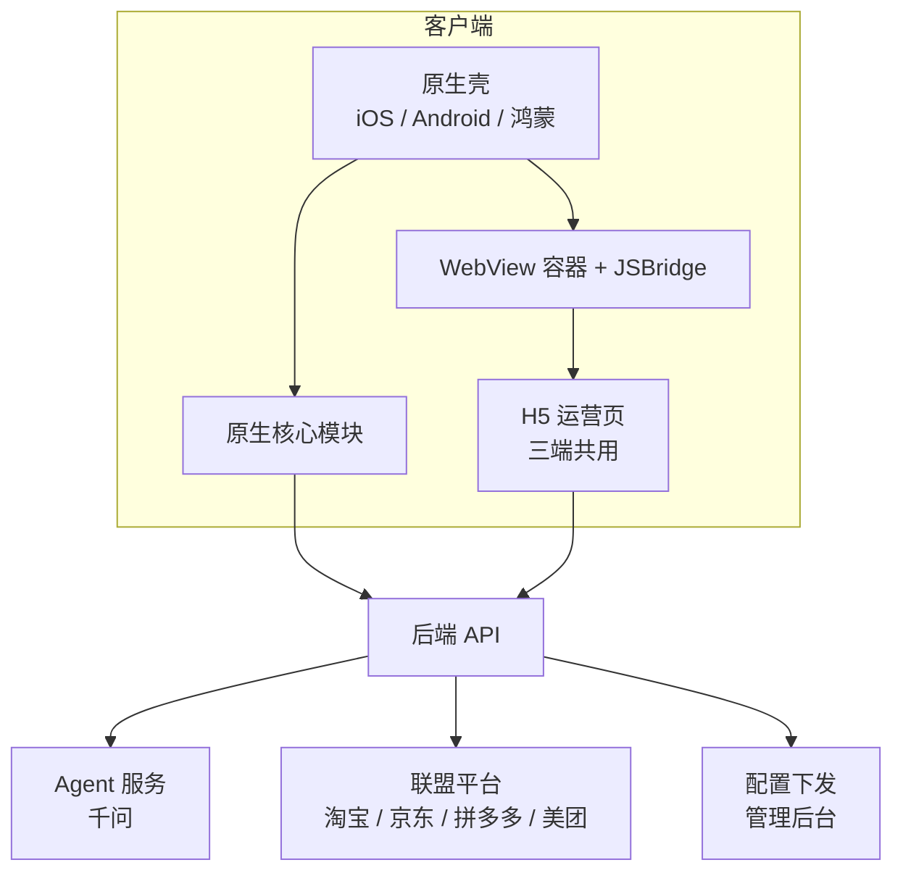
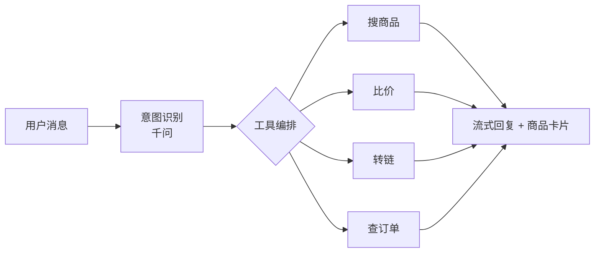

# 返利 App PRD（三端原生 + H5 + Agent）

> **状态：参考文档，不再维护（2026-09-30）。** 唯一生效的规划是 `规划/`（业务规则以 `规划/08_业务规则/` 为准）。本文中的编号、错误码、流水类型、决策编号可能与 `规划/` 不同，换算见 `规划/08_业务规则/13_命名与编码对照.md`；独有内容已按需并入 `规划/`，见 `规划/00_总览与决策.md` 文档登记。代理不得以本文为开发依据。

Sep 22, 2026 · @Coke

## 产品概述与目标

一款带 AI 导购 Agent 的多平台返利 App，覆盖 iOS、Android、鸿蒙三端原生，目标 5 周内上线生产可用的 MVP。

**核心价值**

- 用户通过搜索、粘贴链接或与 Agent 对话找到商品，经转链跳转到淘宝/京东/拼多多/美团下单，获得返利。
- 订单自动跟单、归因、计算返利，用户在钱包内查看收益并提现。
- Agent 负责搜商品、比价、转链、查订单，逻辑全部在服务端。

**MVP 成功标准**

| 指标 | 目标 |
| --- | --- |
| 三端可用 | iOS、Android、鸿蒙均可登录、搜索、转链、跳转、查订单、提现 |
| 跟单成功率 | 真实下单跟单成功，退款扣回状态正确 |
| Agent 可用 | 能完成搜商品、比价、转链、查订单四类任务，流式输出 |
| 运营不发版 | 首页模块、Banner、活动页可由后台调整 |

**复用资产**

- 优券汇：联盟账号与高级权限、后端接口、订单同步逻辑
- 小攒：千问 Agent 链路

## MVP 范围

**做**

| 模块 | 功能 |
| --- | --- |
| 账户 | 手机号/微信登录、隐私协议弹窗、推送、深度链接、剪贴板识别（基础）、实名认证、邀请码绑定上级 |
| 交易链路 | 商品搜索、商品详情、转链、联盟 SDK 授权、跳转目标 App |
| 订单 | 订单同步、归因、返利预估、状态流转（付款/收货/结算/失效/退款扣回）、订单找回、维权处理；平台枚举 8 家（淘宝、京东、拼多多、美团、唯品会、抖音、饿了么、苏宁），接入分期 |
| 分销 | 会员关系树（上级绑定）、等级与分佣规则表；MVP 只建数据模型和绑定，界面 P1 |
| Agent | 对话页（流式、商品卡片）、工具：搜商品、比价、转链、查订单 |
| 钱包 | 两个账户（自购返利 / 推广收益）、收益明细、结算引擎（确认收货 + 维权期满入账、月结账单、会员月账单、分平台对账单）、提现通道路由（企业支付宝为主，灵工 P1）、申请限制、自动到账规则、提现记录 6 态、余额流水、平台资金台账、基础风控规则 |
| 运营页（H5） | 活动会场、新人红包、签到、邀请裂变、返利规则、帮助中心、订单/收益明细 |
| 首页 | 配置驱动，5–6 种原生卡片，后台控制模块顺序与内容 |
| 管理后台 | 权限与操作日志、商品池、首页配置、订单查询、订单找回与维权处理、结算账单确认与定时结算、提现审核（二次验证）与批量打款、台账、配置中心（预估佣金口径、自定义文案、分享域名、邀请码规则）、三端版本管理 |

**不做（第二版）**

- 语音输入、多轮长记忆、主动推送推荐
- 剪贴板自动识别的深度优化、小组件
- 离线包、SDUI 扩展到商品详情页
- 等级分佣界面、团队收益页、积分体系（数据模型 MVP 已建）
- 付费升级不做；特权卡仅免费/按等级开通（P2）；MVP 无支付收款模块；移动广告（开屏/信息流/激励视频）P1
- 小程序端、公众号端（H5 需预留兼容）

## 系统架构

三层：原生壳做稳定能力，原生模块做核心体验，H5 做高频变化页面。三端共用一套 H5 和后端。



原生只写不常改的部分，H5 承接一周内可能改一次的页面。

**原生（三端各一份）**

| 层 | 内容 |
| --- | --- |
| 壳 | 启动、Tab 导航、登录、推送、深度链接、剪贴板识别、更新检测、WebView 容器 |
| 核心交易链路 | 搜索、商品详情、转链跳转、联盟 SDK 授权 |
| Agent 对话页 | 流式输出、商品卡片、输入体验，逻辑在服务端 |
| 钱包与提现 | 收益、提现、风控 |
| 首页 | 按配置渲染 5–6 种原生卡片 |

**H5（三端共用）**

- 活动会场、专题页、新人红包、签到、邀请裂变、排行榜
- 返利规则、帮助中心、公告
- 订单明细、收益明细（初期 H5，后续视情况迁回原生）

判断标准：一周内可能改一次的页面用 H5。

**后端（一份）**

用户、商品、转链、订单同步与归因、返利计算、分销关系与分佣、钱包、Agent 服务、配置下发、管理后台。

## 技术栈

全栈 TypeScript；后端、H5、管理后台在一个 monorepo，iOS / Android / 鸿蒙各自独立仓库。

| 层 | 选择 |
| --- | --- |
| 后端 | NestJS + Prisma + PostgreSQL（含 pgvector） |
| 任务 / 缓存 | Redis + BullMQ（订单拉取、补拉、结算、推送），bull-board 监控 |
| Agent 服务 | 后端模块；千问 Function Calling，SSE 流式，编排自写；Langfuse 记录（P1） |
| 规则引擎 | GoRules Zen Engine + JDM Editor（佣金、风控、活动条件、预留比例） |
| H5 | React + Vite + react-vant + Tailwind |
| 管理后台 | Refine + Ant Design；装修编辑器 Puck；表单 Formily；权限 CASL |
| 接口契约 | NestJS 生成 OpenAPI → 三端与 H5 自动生成类型和请求代码 |
| iOS | Swift + SwiftUI，iOS 15+，Swift Package Manager |
| Android | Kotlin + Jetpack Compose，API 26+，Gradle Kotlin DSL |
| 鸿蒙 | ArkTS + ArkUI，HarmonyOS NEXT，锁定一个 API 版本 |
| 对象存储 | S3 兼容 SDK；阿里云 OSS + CDN；本地开发 MinIO |
| 推送 | 极光或个推（覆盖 APNs 与各厂商通道） |
| 数据 | 看板 Metabase（只读库，P1）；埋点 / A-B / 开关 PostHog（P1） |
| 测试 | 后端 Vitest + Supertest；H5 Vitest + Playwright；iOS XCTest；Android JUnit + Compose Test；鸿蒙 Hypium |
| 部署 | Docker Compose，阿里云 ECS；GitHub Actions；iOS fastlane |
| 监控 | Sentry（三端 + 后端 + H5） |

**仓库结构**

```
rebate-platform/        # pnpm + Turborepo
  apps/api/             # NestJS：业务 + Agent + 管理后台接口
  apps/h5/              # React H5
  apps/admin/           # Refine 管理后台
  packages/shared/      # OpenAPI 类型、枚举、错误码、JSBridge 协议
  packages/bridge-sdk/  # H5 侧 JSBridge SDK
rebate-ios/
rebate-android/
rebate-harmony/
```

**每个仓库的 CLAUDE.md / AGENTS.md 必写**

- 每层唯一的框架与库，禁止引入替代品
- 鸿蒙 API 版本号与禁用的废弃接口
- 提交前命令：`pnpm lint && pnpm typecheck && pnpm test`（原生仓库对应命令）
- 接口规范、JSBridge 协议、错误码表的文件路径

## WebView 容器与 JSBridge

每端一个统一 WebView 容器，向 H5 暴露同一套接口；H5 只认接口，不区分底层平台。接口规范是整个架构最重要的文档，先定稿再让 agent 分头写。

**底层实现**

| 端 | 容器 | 通信 |
| --- | --- | --- |
| iOS | WKWebView | WKScriptMessageHandlerWithReply、WKUserScript |
| Android | android.webkit.WebView + androidx.webkit | WebViewCompat.addWebMessageListener、addDocumentStartJavaScript |
| 鸿蒙 | ArkWeb Web 组件 | javaScriptProxy、runJavaScriptExt、WebMessagePort |
| 小程序 / 公众号（预留） | web-view / JS-SDK | postMessage、wx.config |

**JSBridge 接口清单（MVP）**

| 方法 | 用途 |
| --- | --- |
| getUserInfo | 登录态与用户信息 |
| login | 未登录时拉起原生登录 |
| openNative | 打开原生页（商品详情、Agent 对话、钱包） |
| convertLink | 转链并跳转目标 App |
| authorize | 调起联盟授权 |
| share | 分享到微信/朋友圈/保存图片 |
| copy | 复制口令 |
| track | 埋点上报 |
| getEnv | 当前环境（iOS/Android/鸿蒙/版本号） |

**完整方法表（对照花卷云 DSBridge 37 个原生方法）**

| 类别 | 方法 | 阶段 |
| --- | --- | --- |
| 基础 | getUserInfo、login、getEnv、getConfig、showToast、showLoading / hideLoading、closePage、track | MVP |
| 标题栏 | setNavigationBar：显示原生标题栏、沉浸式、标题、背景图或渐变色、文字颜色、隐藏底部栏、隐藏关闭按钮、iOS 弹动 | MVP |
| 剪贴板 | copy、readClipboard、setClipboardListener（H5 有输入框时关闭自动识别） | MVP |
| 交易 | convertLink、authorize（淘宝渠道备案、拼多多授权）、openProduct（平台编码 + 商品 ID）、openUnionActivity（联盟活动转链并跳转，可跟单） | MVP |
| 页面 | openNative（页面名 + 参数，见下） | MVP |
| 分享 | share（场景：微信好友 / 朋友圈 / QQ / 系统；内容：链接或图片；是否弹面板）、saveImage、previewImage | MVP |
| 外跳 | openApp（scheme / Universal Link、hasApp 检测、下载降级）、openBrowser、openMiniProgram | MVP；小程序 P1 |
| 客服 | openCustomerService（企业微信客服）、showTutorWx | MVP；导师微信 P1 |
| 权限 | getPushStatus、requestPermission | MVP |
| 其他 | scanCode、uploadImage、openRewardVideo（随移动广告） | P1 |
| 其他 | getLocation | P2 |

openNative 页面名：OrderList、FindOrder、Withdraw、Wallet、InviteShare、TeamFans、Search、RankList、Message、ProductDetail、ProductPool（poolId）、CustomPage（pageId）、AgentChat、LevelUpgrade、AboutUs。

平台编码沿用花卷云：1 淘宝、2 天猫、3 京东、4 拼多多、9 唯品会、12 苏宁、16 美团、25 抖音；饿了么新定。迁移与旧 H5 复用时不用转码。

旧 H5 活动页如需复用，P1 提供兼容层：把 `DS.*` 调用映射到新方法。

## 接口规范

REST + JSON，OpenAPI 是唯一契约；三端、H5、后台的类型全部由它生成，不手写。

**基本约定**

| 项 | 规定 |
| --- | --- |
| 路径 | `/v1/<资源>`，资源名用复数名词；管理后台接口前缀 `/admin/v1` |
| 响应 | `{ code, msg, data }`，`code = 0` 成功 |
| 金额 | 整数，单位分；字段名以 `_fen` 结尾；前端负责格式化 |
| 比例 | 整数，单位万分之一（`1500` = 15%） |
| 时间 | ISO 8601，带时区（`2026-09-22T19:45:00+08:00`） |
| 枚举 | 只返回编码；展示文案由字典接口下发 |
| 平台编码 | 1 淘宝、2 天猫、3 京东、4 拼多多、9 唯品会、12 苏宁、16 美团、25 抖音；饿了么新定 |
| 分页 | App 列表用游标（`cursor`、`limit` ≤ 50、`next_cursor`）；后台报表用页码（`page`、`page_size` ≤ 200） |
| 字段 | 蛇形命名；按接口定义输出 DTO，不返回库表全部字段；不保留废弃字段 |
| 敏感字段 | 手机号、身份证、收款账号默认脱敏；全量值走单独接口并记审计 |

**错误码**

| 码段 | 类别 | 前端统一处理 |
| --- | --- | --- |
| 1xxxx | 鉴权（未登录、Token 过期、需二次验证） | 跳登录或刷新 Token |
| 2xxxx | 参数校验 | 提示 msg |
| 3xxxx | 业务（未备案、余额不足、不满足提现条件、活动已结束） | 按码执行动作，如未备案拉起授权 |
| 4xxxx | 限流、风控拦截 | 提示稍后再试 |
| 5xxxx | 服务端错误 | 通用错误页，上报 Sentry |

错误码表放在 `packages/shared`，前后端共用一份。

**公共请求头**

| 头 | 内容 |
| --- | --- |
| Authorization | `Bearer <access_token>` |
| X-App-Id | 多 App 区分 |
| X-Platform | ios / android / harmony / h5 / admin |
| X-App-Version | 客户端版本，后端按它过滤组件 minAppVersion 和强更 |
| X-Device-Id | 设备 ID（风控、同设备多账号） |
| X-Channel | 渠道包 |
| Idempotency-Key | 写操作必带，见下 |

**鉴权**

- access\_token 有效期 2 小时，refresh\_token 30 天；刷新时轮换 refresh\_token
- 提现、改收款账号、改手机号、注销：另外做短信或支付密码校验，校验结果有效 5 分钟
- H5 在 App 内通过 JSBridge `getUserInfo` 取 Token，不读 Cookie

**幂等**

提现申请、领取奖励、积分兑换、订单找回、转链写入必须带 `Idempotency-Key`；服务端按 key 缓存结果 24 小时，重复请求返回同一结果。

**实时与缓存**

| 场景 | 方式 |
| --- | --- |
| Agent 对话 | SSE；事件类型 `text` / `card` / `tool_call` / `done` / `error` |
| 跟单成功、入账、提现结果 | 推送 + 站内消息，客户端不轮询 |
| 首页配置、字典、等级表 | ETag + 版本号，客户端按版本缓存 |
| 商品详情、搜索 | 服务端缓存 5 分钟；价格和券以转链时实时查询为准 |

**核心接口**

| 接口 | 用途 | 阶段 |
| --- | --- | --- |
| `GET /v1/me` | 当前用户：账户、等级、两个账户余额、备案状态；三端与 H5 共用 | MVP |
| `GET /v1/config` | 下发配置：开关、文案、域名、剪贴板规则 | MVP |
| `GET /v1/pages/{key}` | 装修页面 JSON（首页、个人中心、自定义页） | MVP |
| `GET /v1/dict` | 枚举文案字典 | MVP |
| `GET /v1/products/search` | 搜索 | MVP |
| `GET /v1/products/{platform}/{id}` | 商品详情 | MVP |
| `POST /v1/links/convert` | 转链；按场景返回口令 / 短链 / scheme / 小程序路径；未备案时返回授权链接和 3xxxx 码 | MVP |
| `POST /v1/clipboard/parse` | 剪贴板识别 | MVP |
| `GET /v1/orders` | 订单列表（自购 / 分享 / 团队） | MVP |
| `POST /v1/orders/claims` | 订单找回 | MVP |
| `GET /v1/wallet/ledger` | 余额流水 | MVP |
| `POST /v1/withdrawals` | 提现申请 | MVP |
| `POST /v1/agent/sessions/{id}/messages` | Agent 对话（SSE） | MVP |
| `GET /v1/team/fans` | 团队粉丝 | P1 |
| `GET /v1/activities/{id}` / `POST /v1/activities/{id}/join` | 活动详情与参与 | P1 |

**内部事件**

订单、会员、钱包的状态变化发内部事件，推送、活动、风控、看板各自订阅，不互相直接调用。

| 事件 | 触发 |
| --- | --- |
| order.created / order.updated / order.invalidated | 订单入库、状态变化、失效 |
| order.settled / order.clawed\_back | 入账、扣回 |
| member.registered / member.level\_changed / member.bound\_parent | 注册、等级变化、绑定上级 |
| wallet.withdrawal\_changed | 提现状态变化 |
| points.changed | 积分变化 |

每个事件带 event\_id；消费方按 event\_id 幂等处理。开放平台对外推送时复用这些事件。

**协议要求**

- 消息格式：id、method、params、callback、错误码
- 三种调用模型：同步、异步回调、事件订阅
- 能力探测：H5 可查询宿主是否支持某方法，不支持时降级
- 超时与异常统一处理
- H5 侧提供 TypeScript SDK，接口签名固定
- 详细规范由 grok 调研产出（见待办）

## 后端与 Agent 服务

后端一份，三端和 H5 共用；Agent 逻辑全部在服务端，客户端只显示流式消息和卡片。

**后端模块**

| 模块 | 内容 |
| --- | --- |
| 用户 | 注册登录、Token、设备、推送 Token、实名认证、邀请码与上级绑定 |
| 商品 | 搜索、详情、优惠券查询（各联盟接口聚合） |
| 转链 | 单品转链、口令、渠道 ID/推广位绑定用户 |
| 订单 | 定时拉取各平台订单、补拉、去重、统一订单模型、状态机、订单找回、维权记录 |
| 返利 | 预估佣金（后台配置口径）、实际佣金、平台补贴、扣回 |
| 结算 | 确认收货 + 维权期满入账（主路径）、月结账单（对账与补差）、结算扣费、账单状态机、立即/定时结算、会员月账单、分平台月结对账单 |
| 分销 | 关系树、等级（会员/代理/运营商）、分佣规则（计酬仅直推 + 间推两层）、团队收益汇总 |
| 提现 | 通道路由（企业支付宝 / 灵工，按月累计金额分流）、支付宝场景码、申请限制、自动到账规则组、费率规则表、条件模式（P1）、记录 6 态、批量打款、审核二次验证 |
| 台账 | 余额流水（自购返利 / 推广收益两个账户，类型枚举 15 种）、平台资金台账（备付金）、对账任务、导出 |
| 风控 | 同设备多账号、异常提现、自买单识别（基础规则）、黑名单 |
| 配置 | 首页模块配置、Banner、入口开关、灰度、预估口径、自定义文案、分享域名、邀请码规则 |
| 支付收款 | MVP 不做；P2 特权卡直充商品用第三方支付 |
| 管理后台 | 配置、订单、结算账单、提现审核 |

**Agent 服务**



- 模型：千问 Function Calling，复用小攒链路
- 工具：搜商品、比价、转链、查订单，直接调用后端模块
- 输出：SSE 流式，卡片以结构化 JSON 下发，客户端渲染
- 会话记忆：单会话上下文，长记忆放第二版
- 成本控制：每用户日调用上限、缓存热门查询

**统一订单模型**

各平台字段映射到内部统一表：平台、订单号、子订单号（去重键）、状态（统一状态机）、预估/实际佣金、付款/收货/结算时间、归因用户。平台枚举 MVP 定死 8 家：淘宝、京东、拼多多、美团、唯品会、抖音、饿了么、苏宁。子表：找回申请、维权记录。字段映射与同步策略由盘点和 grok 调研产出。

**结算与提现规则**

结算：

- 入账时点：订单确认收货 + 维权期（15 天）满自动入账可提，不等平台月结；平台月结账单只做对账与补差
- 月结账单日可配（22–28 日）；账单状态机 待结算 → 出账中 → 已出账 → 结算中 → 已结算；立即或定时结算；重跑只做补结算，按批次幂等
- 会员月账单：实发、结算总额、补贴、礼金；分平台对账单按平台一行长表存储，界面透视
- 备付金：用户入账早于平台回款，需预存；月末对账差额进平台资金台账

账户：

- 余额分两个账户：自购返利、推广收益。手续费、活跃门槛、个税分别适用；自购返利不设活跃门槛

提现：

- 通道：企业支付宝「转账到支付宝账户」为主，场景码固定；灵工平台 P1；分流按月累计金额而非单笔
- 申请限制：最低额、每日/每月次数、同一收款账号跨会员每日次数、每月改收款账号次数、等级限制
- 自动到账：≤ 阈值自动打款；首提、当日入账、冻结中一律人工；同一收款账号与同一会员的日/月自动次数上限；预警命中即转人工（60 天高佣订单占比、60 天失效订单占比、30 天提现 / 60 天确认收货佣金比）
- 手续费：结算扣费、提现扣费、活跃门槛手续费合并为一张费率规则表（通道 × 金额 × 等级 × 活跃度）
- 记录 6 态：待审核、驳回、手动成功、自动成功、打款中、失败；手动成功必须填流水号；对账任务按支付宝账单匹配
- 审核操作二次验证；身份证号、收款账号加密存储，列表脱敏，全量查看限财务角色

台账：

- 余额流水类型枚举 15 种，预留 sub\_type；平台资金台账记录备付金充值、打款、手续费、变动前后

税：

- 互联网平台涉税信息报送义务：自建报送或灵工平台代发二选一，第 0 周与财务确定

## 动态化

MVP 用配置下发 + H5，不做脚本热更新。

| 方式 | 能改什么 | MVP |
| --- | --- | --- |
| 配置下发 | Banner、入口开关、首页模块顺序、文案、颜色 | 做 |
| H5 | 活动页、规则页、会场 | 做 |
| 简化 SDUI | 首页模块列表，5–6 种原生卡片由后台拼装 | 做 |
| 离线包 | H5 秒开 | 第二版 |
| 脚本热更新 | 下发代码逻辑 | 不做，苹果禁止 |

**首页配置结构**

- App 启动拉取 JSON，含模块数组：类型、顺序、数据源、展示条件
- 原生内置卡片类型：Banner、金刚区、商品横滑、商品网格、活动入口、公告
- 配置带版本号与灰度字段，可按用户比例发布，可回滚

## 管理后台

后台按平台设计：同一 NestJS 后端里的 `/admin/*` 模块 + 一个 React 后台前端，所有运营能力抽象成可配置、可发布、可回滚的数据，三端和 H5 只做渲染。

**设计原则**

- 配置即数据：首页、活动、页面、规则全部是带版本的 JSON，走 草稿 → 预览 → 发布（定时/灰度）→ 回滚
- 一个后端：后台接口在 `/admin/*`，独立鉴权，复用商品、订单、钱包业务代码
- 多 App：所有配置和数据带 `app_id`，一套后台管优券汇和新 App
- RBAC（角色 + 数据范围，代理/运营商只看自己团队）+ 操作日志从第一天有，提现审核、佣金规则改动可追溯
- 组件注册表版本化：每种卡片声明 `minAppVersion`，旧客户端跳过不认识的模块

**能力全景**

| 域 | 能力 | 阶段 |
| --- | --- | --- |
| 商品中心 | 联盟选品接口入库、链接/口令解析入库、Excel 导入、群口令采集、AI 采集（粘贴文本 → 解析 → 转链 → 入库） | MVP：接口 + 链接；其余 P1 |
| 商品中心 | 商品池、标签/分类、榜单、精选位、上下架、定时刷新价格与券状态、自动失效下架 | MVP |
| 页面装修 | 首页模块配置、5–6 种卡片 | MVP |
| 页面装修 | 自定义海报、专题活动页、个人中心入口配置 | P1 |
| 页面装修 | 可视化搭建（多页面、金刚区、Banner、弹窗、开屏、Tab）、多端预览、定时发布、灰度、A/B | P2 |
| 活动引擎 | 活动 = 类型 + 时间 + 条件 + 奖励 + 页面；淘礼金/0元购、订单红包、拉新奖励、带货赛马/奖励、签到、新人红包、邀请裂变、任务、抽奖、优惠券发放 | P1 |
| 积分 | 任务、明细、兑换商城、大转盘/夺宝 | P1 |
| 用户运营 | 用户列表、标签、分群、分群推送、站内信、短信模板 | P1 |
| 分销 | 会员关系树、等级（会员/代理/运营商）、分佣规则、团队收益、排行榜（出单/GMV）、代理后台权限组、推广位/PID 管理 | 数据模型 MVP；界面 P1 |
| 订单与佣金 | 订单查询、状态、订单找回、维权记录/维权渠道、手动补单、佣金规则（比例、分层、活动加成、平台补贴）、月结对账单 | MVP：查询、找回、维权、月结对账；规则引擎 P1 |
| 财务 | 结算账单确认与定时结算、会员月账单、分平台对账单、提现设置（通道路由、申请限制、自动到账规则、费率规则表、条件模式）、提现审核（二次验证）、批量手动/自动打款、余额流水与汇总导出、平台资金台账、对账任务、实名认证、发票 | MVP；条件模式、发票 P1 |
| 支付收款 | 微信/支付宝支付，付费升级、特权卡 | 不做付费升级；特权卡直充 P2 |
| 风控 | 规则（同设备多账号、自买单、异常提现）、黑名单、申诉 | 基础规则 MVP；规则引擎 P2 |
| 内容 | 文章/攻略、公告、素材中心（发圈素材、分类）、商学院（推广员培训）、评论审核 | P1 |
| Agent 运营 | Prompt 版本、工具开关、知识库、对话日志、badcase 标注、效果评估 | P1 |
| 私域 | 服务号智能查券、渠道活码、小程序矩阵 | P2 |
| 附加变现 | 移动广告（P1）、特权卡（免费开通，P2）、电影票（P2） | 视业务 |
| 系统 | RBAC（含数据范围）、操作日志、登录 IP 限制、三端版本与强更、配置中心（预估佣金口径、自定义文案、分享域名、邀请码规则、剪贴板开关、公告/播报）、字典、定时任务监控、数据看板 | MVP |

**核心引擎**

装修引擎：

```
页面(page) → 模块列表(sections[]) → 组件(type, version, props, dataSource, condition)
```

- 组件注册表由后端维护：type、props schema、minAppVersion；属性面板按 schema 自动生成
- 数据源：静态、商品池、榜单、接口
- 预览：后台内嵌 H5 渲染器 iframe；三端原生读同一份 JSON
- 发布：版本号 + 定时 + 用户比例灰度 + 一键回滚

活动引擎：活动表（type、时间、参与条件、reward、page）+ 参与记录表；奖励发放走钱包和优惠券模块，发放前过风控；新增活动类型 = 新增一个 type 处理器。

规则引擎：佣金规则、风控规则、活动条件统一用决策表，运营可视化编辑；输入订单/用户/设备上下文，输出佣金比例、风控动作、条件结果。

**技术栈与开源选型**

| 能力 | 选择 | 替代 |
| --- | --- | --- |
| 后台框架 | Refine + Ant Design（React） | Vben Admin（Vue） |
| 页面装修编辑器 | Puck（可视化编辑，输出 JSON，自定义组件注册） | Craft.js |
| Schema 表单 | Formily | @rjsf/antd |
| 规则引擎 | GoRules Zen Engine + JDM Editor | json-rules-engine |
| 权限 | CASL（前后端同一套 ability） | — |
| 任务与监控 | BullMQ + bull-board | — |
| 富文本 | Tiptap | — |
| 导入导出 | exceljs | SheetJS |
| 数据看板 | Metabase（直连只读库） | Superset |
| 埋点 / A/B / Feature Flag | PostHog（P1；鸿蒙走 HTTP） | GrowthBook |
| 商品搜索 | Postgres 全文 → Meilisearch（P2） | — |
| Agent 运营 | Langfuse（自托管） | — |
| Agent 知识库 | pgvector | — |
| 客服 | 企业微信客服 API | Chatwoot |
| 页面采集 | Crawlee / Playwright（仅无 API 场景） | — |

参考不搬代码：芋道 yudao mall、CRMEB 的功能清单、DIY 装修数据模型、分销表结构，用于对照遗漏。

必须自写：链接/口令解析、转链、订单同步与对账、订单找回匹配、佣金与分佣计算、钱包、装修 JSON 三端渲染器、活动处理器。

**开发顺序**

| 阶段 | 内容 |
| --- | --- |
| MVP（第 4 周） | Refine 骨架 + CASL 权限（含数据范围）+ 操作日志；商品池（联盟接口、链接解析）；首页配置（Puck 简版，5–6 卡片）；订单查询、找回、维权处理；结算账单确认与定时结算、提现审核与批量打款、台账；实名认证；配置中心（预估口径、文案、域名、邀请码）；分销数据模型；三端版本管理 |
| P1（上线后 1–2 月） | 等级分佣界面与团队收益、排行榜；活动引擎（淘礼金/0元购、订单红包、拉新、签到、邀请）、平台补贴、优惠券；积分；Formily 配置面板；佣金规则引擎；海报/专题页/个人中心配置；素材中心、商学院；分群推送；支付收款（如保留）；Metabase、Langfuse、PostHog |
| P2 | 装修全量（多页面/弹窗/开屏/定时/灰度/AB）、风控规则引擎、私域（智能查券/渠道活码/小程序矩阵）、附加变现、Meilisearch、客服 |

MVP 阶段直接用正式版 Refine 骨架和 Puck，不做临时后台。

逐模块规则、枚举与状态机：后台模块规格

## 联盟 SDK 与 API 接入

账号与高级权限已有（优券汇）。新项目需在各平台绑定新 App 的包名/Bundle ID/签名。

| 平台 | SDK | 三端支持 | 备注 |
| --- | --- | --- | --- |
| 淘宝联盟 | 百川 | iOS/Android 官方；鸿蒙待验证 | 会员运营 ID 归因；MVP |
| 京东联盟 | 开普勒 | iOS/Android 官方；鸿蒙待验证 | 子联盟 ID 归因；MVP |
| 拼多多 | 多多进宝 | 以 URL Scheme / H5 为主 | 自定义参数归因；MVP |
| 美团 | 美团联盟 | H5 / Scheme | 外卖 CPS；MVP |
| 唯品会 | 唯享客 | H5 / Scheme | P1 |
| 抖音 | 精选联盟 | H5 / Scheme | P1 |
| 饿了么 | 淘宝联盟本地生活 | H5 / Scheme | P1 |
| 苏宁 | 苏宁推客 | H5 | P2 |

**接入流程**

1. 平台后台登记：Bundle ID、包名 + 签名 MD5/SHA1（debug 和 release 都要）、鸿蒙 Bundle Name + 签名指纹
2. 先跑官方 Demo 通过，再搬入项目
3. 打开 SDK debug 日志，用 Charles 抓包验证参数与回跳
4. 真机验证授权跳转、唤起目标 App、回跳
5. 隐私政策同意后才初始化 SDK

**用户授权备案（MVP）**

- 淘宝：用户首次淘宝转链前完成渠道备案，得到 relation\_id；未备案时转链接口返回备案链接，App 拉起授权。会员运营 ID 同理
- 拼多多：首次转链前完成授权备案，得到自定义参数，之后转链必传
- 用户表存 relation\_id、alimama\_id、备案时间、拼多多自定义参数；个人中心显示备案状态

**鸿蒙缺口处理**

SDK 无鸿蒙版的平台，用 URL Scheme / App Linking 或 H5 跳转，逐平台验证归因是否保留。

**分工**

agent 写集成代码和日志输出；后台登记、签名配置、真机点击验证由人工集中一两天完成。

## 开发时间线

总计 5 周（原生三端 + Agent + H5）。先定契约，再并行开发，最后集中联调；鸿蒙比 iOS/Android 晚一步。

**第 0 周：准备（不写业务代码）**

- 各平台绑定新 App 的包名与签名；缺的高级权限第一天提交
- 定三份契约并写进各项目 CLAUDE.md / AGENTS.md：后端 API（OpenAPI）、JSBridge 规范、首页配置 JSON
- 搭脚手架：三端空工程、后端、H5、CI、测试环境
- Claude Code 盘点优券汇仓库，产出 cps-inventory.md

**第 1–5 周**

| 周 | 后端 | iOS / Android | 鸿蒙 | H5 | 验收点 |
| --- | --- | --- | --- | --- | --- |
| 1 | 用户、登录、搜索、转链（权限未下先 mock） | 壳：启动、Tab、登录、隐私弹窗、WebView 容器 + JSBridge | 壳 + 容器 | JSBridge 调试页 | 三端登录，容器打开同一 H5，JSBridge 调通 |
| 2 | 订单同步、归因、返利预估、订单找回/维权、分销关系模型 | 搜索、商品详情、转链跳转、SDK 授权 | 搜索、详情（SDK 缺口用 Scheme/H5） | 规则、帮助、订单/收益明细 | 周末开始真实下单 |
| 3 | Agent 服务、结算引擎、提现通道与自动到账、台账、实名认证、基础风控 | Agent 对话页、钱包提现页、实名认证、订单找回 | 转链跳转、授权补齐 | 新人红包、签到、邀请 | Agent 完成四类任务 |
| 4 | 结算/提现收尾、存量迁移脚本与演练（如迁移）、配置下发（预估口径/文案/域名/邀请码）、管理后台 | 首页按配置渲染原生卡片 | Agent 对话页、钱包、配置化首页 | 活动会场模板 | 后台改首页不发版 |
| 5 | 联调修复 | 三端回归 | 追平回归 | 回归 | 跟单→预估→退款扣回→提现全链路通过 |

**第 5 周联调清单**

- 真实下单全链路：跟单、预估、退款扣回、提现
- Agent 效果：意图识别、推荐相关性、转链正确率
- 隐私合规：SDK 初始化时机、第三方 SDK 清单
- 三端回归

**时间估算依据**

| 方案 | 时间 |
| --- | --- |
| 跨端一套代码，无 Agent | 2–3 周 |
| iOS + Android 原生，无 Agent | 3–4 周 |
| iOS + Android 原生 + Agent | 4–5 周 |
| 三端原生 + Agent，全原生页面 | 6–7 周 |
| 三端原生 + Agent，原生壳 + H5（本方案） | 5 周 |

复用优券汇后端与订单同步可再压缩 1 周左右。

## 资源与 agent 分工

5 个 20X 账号（3 Claude + 2 GPT），1 人调度。算力不是瓶颈，瓶颈是人工验收速度和真实下单联调。

| 账号 | 负责线 | 说明 |
| --- | --- | --- |
| Claude 1 | iOS | Swift，壳 + 核心模块 + Agent 页 |
| Claude 2 | Android | Kotlin，同上 |
| Claude 3 | 鸿蒙 | ArkTS，固定专职；项目说明文件写明 API 版本与规范 |
| GPT 1 | H5 + 管理后台 | TypeScript，三端共用 |
| GPT 2 | 后端 + Agent 服务 | 订单同步、归因、钱包、千问编排 |
| grok | 外部调研 | 文档整理、竞品、合规、测试问题集 |

**调度原则**

- 每端固定 1–2 个 agent 并行，不全开
- 契约先定，各线独立推进，减少互相等待
- 每个项目维护 CLAUDE.md / AGENTS.md：契约、API 版本、禁用写法
- 人工只做：验收合并、后台登记、真机验证、真实下单

**grok 任务清单**

- WebView 容器 + JSBridge 三端 + 小程序 + 公众号开发文档
- 联盟 API 缺口补齐（基于 cps-inventory.md）
- 应用商店审核规则、隐私合规、第三方 SDK 清单格式
- 竞品功能矩阵与差评分析
- 鸿蒙 API 变更周报
- Agent 测试问题集 500–1000 条
- 用户协议、隐私政策、返利规则初稿

## 关键依赖与风险

| 风险 | 影响 | 应对 |
| --- | --- | --- |
| 新 App 的联盟绑定/权限未下 | 第 2 周真实下单被卡 | 第 0 周第一天提交；先用 mock 和优券汇现有权限验证链路 |
| 接口契约不稳 | 所有并行线返工 | 第 0 周定稿，改动走版本号 |
| 淘宝联盟按月结算 | 完整结算链路上线前测不全 | 上线前只测跟单与预估，结算状态上线后回归 |
| 鸿蒙 agent 写出过时 API | 返工率高、验收量增加 | 专职账号，项目说明文件写明 API 版本；鸿蒙允许晚 2–3 周 |
| 联盟 SDK 无鸿蒙版 | 部分平台鸿蒙端归因不稳 | URL Scheme / H5 降级，逐平台验证 |
| 人工验收成为瓶颈 | 日历时间拉长 | 控制并行数，agent 自跑测试后再提交 |
| Agent 效果不达标 | 意图识别、推荐相关性差 | 第 3 周起用测试问题集持续调，上线可先收窄任务范围 |
| 多级分销被认定传销 | 下架、罚款 | 计酬只算两层；不做付费升级、分红、专属邀请等级 |

## 合规要求

- 用户同意隐私政策后才初始化任何第三方 SDK；隐私政策列出完整第三方 SDK 清单
- 不做脚本热更新，不下发可执行代码
- 软著、ICP 备案、各应用市场上架资质提前准备
- 提现涉及支付宝「转账到支付宝账户」开通与场景码、灵工平台签约；互联网平台涉税信息报送义务；身份证号、收款账号加密存储与脱敏展示
- 文案避免「最高返利」「稳赚」等审核高风险词；不做审核专用模板/审核模式；iOS 提供 Sign in with Apple，微信登录不强制绑手机；分销计酬不超过两层，不做付费获得分佣资格；不做摇一摇广告、虚拟数据、夺宝；下级手机号、微信号默认不向上级展示

## 存量迁移（优券汇 → 新 App）

优券汇的会员、关系链、联盟备案、余额、积分、未结算订单都可以通过花卷云开放平台 API 全量导出；联盟账号不变时，老用户的淘宝备案可以继续跟单，不用重新授权。是否迁移：待定。

| 对象 | 接口 | 规则 |
| --- | --- | --- |
| 会员 | `dhcc.oauth.user.list` / `user.cursor` | 每页 200；cursor 接口按登录时间筛选，单次范围 ≤ 31 天，需按时间窗滚动 |
| 关系链 | 会员字段 `pid1` | 只取上 1 级，迁入后重建闭包表 |
| 密码 | —（不迁移） | 新 App 的登录方式不含密码，不迁入任何旧系统的密码相关字段；老用户用手机号验证码登录后按手机号认领 |
| 联盟备案 | `relation_id`、`relation_id_order`、`alimama_id`、`pdd_pid`、`jd_pid`、拼多多自定义参数 | 原样迁入 |
| 余额 | `credit`、`proxy_credit`；`user.balance.list` 增量明细 | 迁入一笔期初流水；`credit` 进自购返利账户、`proxy_credit` 进推广收益账户；历史流水只读归档 |
| 积分 | `score.user.score`、`score.all.list` | 期初积分一笔 |
| 等级 | `user.level.list` + `level_id` | 映射到新等级表 |
| 订单 | `order.list`（按付款时间窗） | 迁移未结算订单；已结算只归档 |
| 实名、提现账号 | `realname`、`withdraw_to` | 加密迁入 |

**过渡方式：双跑后切换**

1. 开启花卷云推送（member\_register、member\_info\_change、member\_level\_change、score\_change、union\_order），实时同步到新库
2. 新 App 上线后，旧 App 保留跟单，引导老用户下载新 App
3. 切换日：冻结旧 App 提现 → 最终对账 → 新 App 接管结算
4. 推送 24 小时没有返回 200 时花卷云会自动关闭推送，需要监控

**约束**

- 开放平台每日免费 5000 次；数万用户按每页 200 条全量导出，约几百次调用，在额度内
- 迁移涉及手机号、实名、提现账号：用户协议要告知服务变更；运营主体如果变了，要重新取得用户同意
- relation\_id 在同一联盟账号下能否继续跟单，需要向淘宝联盟确认

## MVP 之后的演进

1. 离线包：H5 资源预置到 App，秒开
2. 原生化：订单明细、收益明细等高频页从 H5 迁回原生
3. SDUI 扩展：卡片类型增加，商品详情页配置化
4. Agent 增强：多轮记忆、主动推送、剪贴板自动识别、语音
5. 渠道扩展：微信/支付宝/抖音小程序 web-view、公众号，复用同一套 H5 与 JSBridge 抽象层
6. 私域：服务号智能查券、渠道活码、小程序矩阵
7. 分销进阶：运营商独立后台、多级团队、附加变现（特权卡、电影票、广告）

## 待办：立即启动事项

- [ ] 各联盟平台绑定新 App（Bundle ID、包名 + 签名、鸿蒙 Bundle Name），含唯品会、抖音、饿了么
- [ ] 缺失的高级权限提交申请
- [ ] 补抓花卷云积分规则（功能开启后）：任务、签到、自购订单积分、大转盘
  - [ ] 决定是否迁移优券汇存量用户；如迁移，开通花卷云开放平台应用、勾选会员/订单/积分接口，向淘宝联盟确认 relation\_id 复用
  - [ ] 补抓 App 端装修配置：首页 / 个人中心组件类型与跳转协议
- [ ] 开通支付宝企业账户「转账到支付宝账户」与场景码；比较灵工平台（工猫/薪享云/诚灵工）；与财务确定涉税报送方式
- [ ] Claude Code 盘点优券汇仓库，产出 cps-inventory.md
- [ ] grok：WebView 容器 + JSBridge 文档
- [ ] grok：联盟 API 缺口补齐（附 cps-inventory.md）
- [ ] 定稿契约：接口规范与错误码表、OpenAPI、JSBridge 规范、首页配置 JSON、内部事件清单
- [ ] 三端空工程 + 后端 + H5 + CI + 测试环境
- [ ] 各项目 CLAUDE.md / AGENTS.md 写入契约与规范
- [ ] 准备真实下单测试账号与目标 App 真机
